# Source: https://docs.apidog.com/trigger-test-by-git-commit-1210125m0.md

# Trigger Test by Git Commit

You can automatically trigger Apidog automated tests through Git commit events (such as `push`, `pull request`) without any manual intervention. This feature works across any CI/CD platform, including GitHub Actions, Jenkins, GitLab CI, and more.

## Core Principle: Event Trigger + CLI Command Execution

Automatically triggering Apidog tests after a Git commit is based on a universal principle:

Whether it's through a Webhook or the built-in event listener provided by the CI/CD platform <span style="color: #888">(e.g., `on: push` in GitHub Actions)</span>, the essence is the same:
**monitoring Git commit events and executing Apidog's test command.**

```mermaid
graph LR
    A["Git Repository<br><span style='color:#6a737d'>push / PR</span>"] -->|Trigger| B["Event / Webhook"]
    B -->|Start| C["CI/CD Pipeline"]
    C -->|Execute| D["apidog run command"]
    D -->|Automatic| E["Run tests and generate reports"]

    style A fill:#f8f9fa,stroke:#e1e4e8,stroke-width:2px,color:#24292e
    style B fill:#dff7ff,stroke:#c8e1ff,stroke-width:2px,color:#0366d6
    style C fill:#e6ffec,stroke:#c3e6cb,stroke-width:2px,color:#22863a
    style D fill:#f5f0ff,stroke:#d6b3ff,stroke-width:2px,color:#6f42c1
    style E fill:#fff8e6,stroke:#ffeeba,stroke-width:2px,color:#e36209
    
    linkStyle default stroke:#d0d7de,stroke-width:1.5px,opacity:0.8
```



As long as your CI/CD environment can respond to Git commits and execute a command-line script, you can integrate Apidog automated testing.

There are generally two trigger mechanisms:

**1. Built-in event mechanisms (e.g., GitHub Actions, GitLab CI)**

GitHub Actions, for example, provides an event configuration like:

```yaml
on: [push, pull_request]
```

This method requires no Webhook configuration. The platform monitors events internally and is a lightweight approach.

**2. External Webhooks (e.g., Jenkins, self-hosted services)**

When using Jenkins or cross-platform setups, you typically need to configure Webhooks manually.


## Common CI/CD Integration Examples

**Triggering automated tests through built-in event mechanisms:**

* [Integrate with Github Actions](https://docs.apidog.com/integrate-with-github-actions-1205646m0.md)
* [Integrate with Gitlab](https://docs.apidog.com/integrate-with-gitlab-609931m0.md)


## Cross-Platform Integration Example: GitHub Actions + Jenkins

### Scenario

* Code repository is hosted on **GitHub**
* Pipeline execution environment is **Jenkins**
* Use **GitHub Webhook** to trigger Jenkins pipeline
* Execute `apidog run` in Jenkins to run Apidog automated tests


### Step 1: Configure Jenkins Project

Refer to [Integrate with Jenkins](https://docs.apidog.com/integrate-with-jenkins-609705m0.md) to create a project and successfully configure it.

<Background>

</Background>


### Step 2: Get the Webhook URL

Webhook URL is the entry point Jenkins uses to receive external requests and trigger pipelines. You can obtain this URL in multiple ways, such as using the Generic Webhook Trigger plugin.

<Steps>
  <Step>
    In Jenkins Plugin Manager, search for and install the "Generic Webhook Trigger" plugin. Restart Jenkins after installation.


<Background>

</Background>


  </Step>
  <Step>
    In Jenkins Dashboard, select your project and go to Configure. Enable `Generic Webhook Trigger`.  
    Webhook URL is: `http://<your Jenkins host>/generic-webhook-trigger/invoke`


<Background>

</Background>

You can also define a token. The Webhook URL becomes:
`http://<your Jenkins host>/generic-webhook-trigger/invoke?token=<xxxxxx>`


<Background>

</Background>

  </Step>
  <Step>
    After saving, copy the Webhook URL. This url will be used to trigger Jenkins test execution.
  </Step>
</Steps>


### Step 3: Configure GitHub Webhook

Go to your "GitHub repository → Settings → Webhooks → Add webhook":

* **Payload URL**: `http://<your Jenkins host>/generic-webhook-trigger/invoke?token=<xxxxxx>`
* **Content type**: `application/json`
* **Secret**: optional
* **Which events would you like to trigger this webhook?** Choose `Just the push event` or other trigger events
* Click "Add webhook"

<Background>

</Background>

Now, every code push will automatically trigger Jenkins to run the configured test task.


### Result Verification

<Steps>
  <Step>
    Push code to your GitHub repository
  </Step>
  <Step>
    Jenkins will immediately start a build
  </Step>
  <Step>
    Check the console output and test results in Jenkins
  </Step>
</Steps>

<Background>

</Background>

    
<Background>

</Background>


## Webhook Documentation for Common Platforms

* [GitHub Webhooks](https://docs.github.com/en/webhooks)
* [GitLab Webhooks](https://docs.gitlab.com/ce/user/project/integrations/webhooks.html)
* [Bitbucket Cloud](https://support.atlassian.com/bitbucket-cloud/docs/manage-webhooks/)
* [Bitbucket Server](https://confluence.atlassian.com/bitbucketserver/manage-webhooks-938025878.html)
* [Azure Pipelines](https://learn.microsoft.com/en-us/azure/devops/service-hooks/services/webhooks?view=azure-devops)

