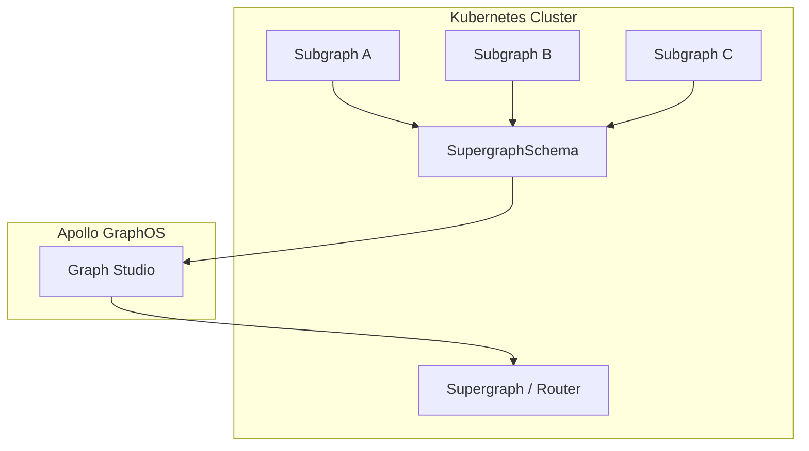

# Source: https://www.apollographql.com/docs/apollo-operator.md

# Apollo GraphOS Operator

The **Apollo GraphOS Operator** is a Kubernetes-native operator for deploying and managing GraphQL federated architectures. It lets you define your GraphQL services (subgraphs) and compose them into a supergraph using Kubernetes resources. The operator integrates with Apollo GraphOS and your existing Kubernetes workflows, deploys the [GraphOS Router](https://www.apollographql.com/docs/graphos/routing), automates schema publishing, composition, deployment, and monitoring.

## Key Benefits

* **Declarative Management**: Define subgraphs, supergraphs, and composition rules as Kubernetes resources.
* **Flexible Workflows**: Use Kubernetes manifests or Apollo Studio for management. Supports single-cluster, multi-cluster, and hybrid setups.
* **Automated CI/CD**: Automatically detects schema changes, triggers composition, and deploys updated supergraphs.
* **Integrated Monitoring**: Status and health are surfaced via Kubernetes events and resource statuses, compatible with tools like Datadog.
* **Security Best Practices**: Supports namespace-scoped RBAC, API key management, and secure deployment patterns.

## How the Apollo GraphOS Operator Works

### Core Components

The Operator manages three main Kubernetes resources:

1. **Subgraph**: Defines a GraphQL subgraph with its schema and endpoint
2. **SupergraphSchema**: Selects Subgraphs and composes them into a supergraph schema
3. **Supergraph**: Deploys the composed schema as a running router

### The Composition Flow

**What happens:**

1. The Operator watches Subgraph resources and extracts their schemas
2. SupergraphSchema uses label selectors to find relevant Subgraphs
3. The Operator publishes selected subgraphs to Apollo GraphOS
4. Apollo GraphOS composes the supergraph schema
5. The Operator fetches the composed schema and deploys it via Supergraph / Router

### Key Architectural Concepts

#### Subgraph Discovery

* Subgraphs are discovered using [Kubernetes label selectors](https://www.apollographql.com/docs/apollo-operator/get-started/add-subgraphs#5-add-labels-for-composition)
* The Operator monitors [Subgraph](https://www.apollographql.com/docs/apollo-operator/resources/subgraph) resources in real-time
* Schema changes trigger automatic re-composition

#### Source of Truth

* **Cluster**: The Operator is the source of truth for subgraph membership: only subgraphs defined as Kubernetes Subgraph resources that match the SupergraphSchema selectors are included; any others in Studio are removed.
* **Cluster & Studio**: The overall composition is defined as the union of all subgraphs present in both Studio and the cluster. If you currently have subgraphs managed by Studio with missing Kubernetes Subgraph resources, use both the cluster and Studio as the source of truth. Set `partial: true` in your workflow to enable this.

See [Composition Strategies](https://www.apollographql.com/docs/apollo-operator/workflows) for more details.

#### Schema Sources

* **Inline SDL**: Schema defined directly in the Subgraph resource
* **OCI Image**: Schema loaded from container images
* **OCI Artifact**: Schema loaded from OCI registry artifacts

See [Choose your schema source](https://www.apollographql.com/docs/apollo-operator/resources/subgraph#schema-sources) for more details.

## Get Started

Ready to try it out? Follow the [Getting Started guide](https://www.apollographql.com/docs/apollo-operator/get-started/install-operator).
