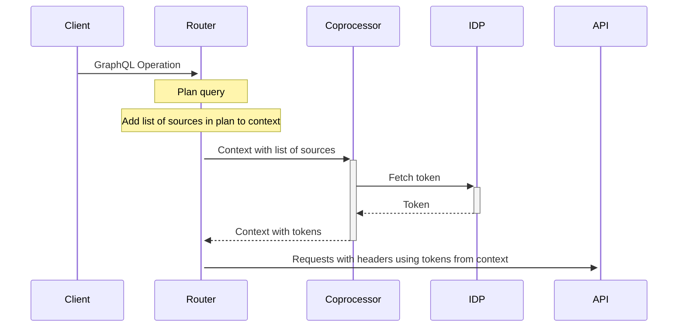

# Source: https://www.apollographql.com/docs/apollo-mcp-server/auth.md

# Source: https://www.apollographql.com/docs/graphos/connectors/security/auth.md

# Connectors Authentication Configuration

When using Apollo Connectors to integrate with external REST APIs and services, you'll often need to authenticate your requests. The GraphOS Router supports authentication via AWS Signature Version 4 (SigV4) and external coprocessors.

## Authentication with AWS SigV4

Apollo Connectors can be used to call AWS HTTP APIs using [AWS Signature Version 4 (SigV4)](https://docs.aws.amazon.com/IAM/latest/UserGuide/reference_sigv.html).
For example, you can use Apollo Connectors to invoke an AWS Lambda function and select fields from the JSON result to include in your GraphQL response:

```graphql
@source(
  name: "lambda"
  http: { baseURL: "https://lambda.us-east-1.amazonaws.com" }
)
...
  @connect(
    source: "lambda"
    http: {
      POST: "/2015-03-31/functions/function_name/invocations"
      body: "argument: $this.function_argument"
    }
    selection: "$.function_output"
  )
```

SigV4 authentication is configured separately for each Connector source, allowing you to specify a role with the least-privilege necessary to invoke the AWS API for that source:

```yaml title=router.yaml
authentication:
  connector:
    sources:
      subgraph_name.connector_source_name:
        aws_sig_v4:
          default_chain:
            profile_name: "default"
            region: "us-east-1"
            service_name: "lambda"
            assume_role:
              role_arn: "arn:aws:iam::XXXXXXXXXXXX:role/lambaexecute"
              session_name: "connector"
```

## Authentication with coprocessors

You can use [coprocessors](https://www.apollographql.com/docs/graphos/routing/customization/coprocessor) to fetch authentication tokens for Connectors. This is useful when you need to fetch a token from a different source, such as a database or a third-party service, before making a request to an API.



Start by configuring the coprocessor for the [Execution Request](https://www.apollographql.com/docs/graphos/routing/customization/coprocessor#executionrequest) stage and enabling the `expose_sources_in_context` feature of Connectors:

```yaml title=router.yaml
connectors:
  expose_sources_in_context: true
coprocessor:
  url: http://localhost:4001
  execution:
    request:
      context: true
```

In the `context` of the coprocessor request, you will find a list of subgraph and source names from the query plan. You can use this information to determine which identity providers (IDPs) to query for tokens.

```json title=Coprocessor request
{
  "version": 1,
  "stage": "ExecutionRequest",
  "control": "continue",
  "id": "d0a8245df0efe8aa38a80dba1147fb2e",
  "context": {
    "entries": {
      "apollo_connectors::sources_in_query_plan": [{ "subgraph_name": "products", "source_name": "v1" }]
    }
  }
}
```

In the coprocessor response, you can add the API keys for each source to the `context`:

```json title=Coprocessor response
{
  "version": 1,
  "stage": "ExecutionRequest",
  "control": "continue",
  "id": "d0a8245df0efe8aa38a80dba1147fb2e",
  "context": {
    "entries": {
      "apollo_connectors::sources_in_query_plan": [{ "subgraph_name": "products", "source_name": "v1" }],
      "api_keys": {
        "products_v1": "abcd1234"
      }
    }
  }
}
```

Then in the configuration for your Connector source, you can use the keys from the context as header values:

```graphql title=products.graphql
extend schema
  @source(
    name: "v1"
    http: {
      baseURL: "https://api.example.com/v1"
      headers: [{ name: "Authorization", value: "Bearer {$context.api_keys.products_v1}" }]
    }
  )
```
