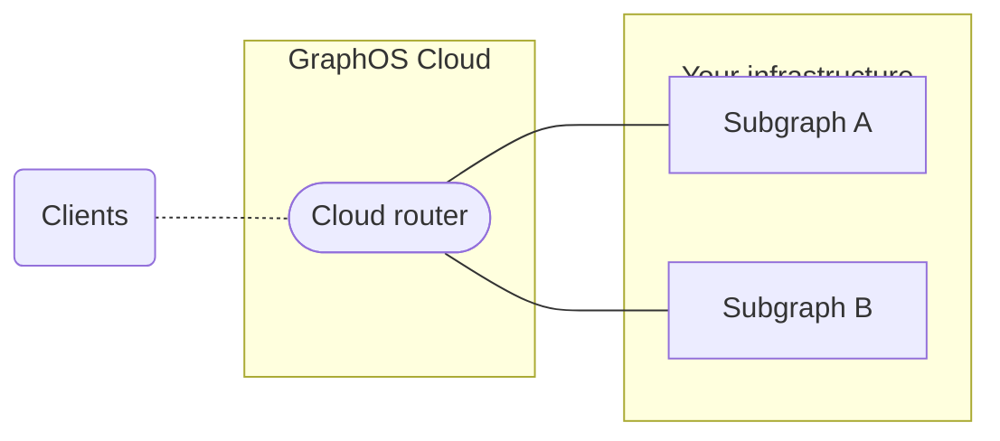
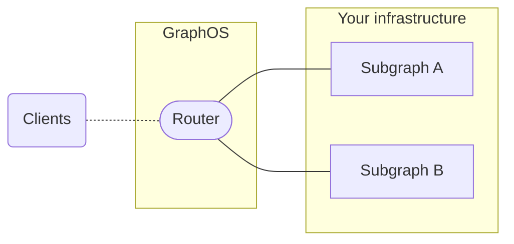

# Source: https://www.apollographql.com/docs/rover/commands/cloud.md

# Source: https://www.apollographql.com/docs/graphos/routing/cloud.md

# Cloud Routing

Apollo is discontinuing Serverless and Dedicated plans, which use cloud routers. Serverless plans end on February 1, 2026, and serverless cloud routers are not available after February 15, 2026. Dedicated plans end on March 15, 2026, and dedicated cloud routers are not available after March 15, 2026.

If you're currently on a Serverless or Dedicated plan, migrate your graphs to use self-hosted routers. [See the migration guide](https://www.apollographql.com/docs/graphos/routing/cloud/migrate-to-self-hosted) for step-by-step instructions.

When you create a cloud supergraph, GraphOS provisions and manages a *cloud router*. Routers act as entry points to your GraphQL APIs. Individual GraphQL APIs are called *subgraphs* in this architecture.

Clients send operations to your router's public endpoint instead of your subgraphs.

GraphOS only hosts the runtime for your supergraph's cloud router. GraphQL servers for your subgraphs are still hosted in your infrastructure.

Create your first cloud supergraph

## Federation and subgraph compatibility

Cloud supergraphs use [Apollo Federation 2](https://www.apollographql.com/docs/federation/) for their core architecture. [Many GraphQL server libraries](https://www.apollographql.com/docs/graphos/reference/federation/compatible-subgraphs) support Federation 2. Your GraphQL API doesn't already need to be using Apollo Federation to add it to a cloud supergraph.

## Cloud router types and availability

Cloud supergraphs are only available to organizations with Serverless and Dedicated plans.
Serverless cloud routers run on shared infrastructure. Dedicated cloud routers run on dedicated infrastructure that you control and scale.
Cloud routers aren't available with Enterprise or legacy Free or Team plans.

## Cloud router regions

Serverless cloud routers are hosted in the us-east-1 AWS region. Dedicated cloud routers have a wider [variety of options](https://www.apollographql.com/docs/graphos/routing/cloud/dedicated/#runs-on-aws). Region selection for cloud routers is only available on the Dedicated plan. Contact Sales to learn more.
You can view a cloud router's region on its graph's **Overview** page under **Cloud Router Details**.

## Cloud router status

Cloud routers can have the following statuses:

| Status           | Description                                                                                                                                                           |
| ---------------- | --------------------------------------------------------------------------------------------------------------------------------------------------------------------- |
| **Initializing** | Your cloud router is being created. This process may take up to five minutes. [Learn more.](https://www.apollographql.com/docs/graphos/routing/cloud.md#initializing) |
| **Running**      | Your graph is operating normally.                                                                                                                                     |
| **Error**        | Your cloud router is running, but a deployment recently failed. For more information on the failure, see the **Launches** page in GraphOS Studio.                     |

Serverless routers have additional statuses, including **Sleeping** and **Deleted**. Learn more on the [Serverless overview page](https://www.apollographql.com/docs/graphos/routing/cloud/serverless/#serverless-router-status).

You can see your cloud router's status in GraphOS Studio on the associated graph's **Overview** page under **Cloud Router Details**.

### Initializing

Apollo provisions a router whenever you create a cloud supergraph in GraphOS Studio or whenever you create a new variant for an existing cloud supergraph. Each variant has its own distinct router.

When you first create a variant, the router provisioning process can take a few minutes. While this process completes, an **INITIATING ENDPOINT** label appears at the top of the variant's page in Studio:

Once initialized, you can [configure your cloud router](https://www.apollographql.com/docs/graphos/routing/cloud/configuration).

## Cloud launches

Publishing a new subgraph schema or editing a cloud router's config triggers a new [launch](https://www.apollographql.com/docs/graphos/delivery/launches/). Every launch automatically deploys new router instances for your graph. You can see a launch's details, including possible failures, from a graph's **Launches** page in GraphOS Studio.

A router deployment might fail due to a platform incident or schema composition issues. To resolve this, try republishing your subgraph schema.

## Router version updates

Apollo manages the Apollo Router Core version deployed to cloud routers. It ensures that newly released versions are deployed within 30 days of release. Some minor and patch versions may be skipped.

Router releases go through rigorous testing before deployment on GraphOS Cloud. An Apollo engineer oversees deployment. If any cloud routers fail to boot up, they roll back to a previous version. While some edge cases may arise—for example, a query planner update could result in slightly degraded performance—router updates should not disrupt your supergraphs.

Opting out of router updates to cloud routers isn't currently supported.

## Security and compliance

The entire GraphOS platform, including its cloud routing infrastructure, is SOC 2 Type 2 certified.
Secrets are encrypted both in transit and at rest.
Secrets are only available inside the runtime environment. You have total control over when those secrets are resolved in configuration.

The Apollo Router Core (the underlying technology for cloud routing) has been [tested and audited by Doyensec](https://doyensec.com/resources/Doyensec_Apollo_Report_Q22022_v4_AfterRetest.pdf).

### GraphOS Cloud on AWS

GraphOS Cloud on AWS is a managed API solution. It runs the GraphOS Router on AWS infrastructure to provide a high-performance, configurable GraphQL router.

[Download an overview of GraphOS Cloud on AWS security and compliance practices](https://www.apollographql.com/trust/request-security-report).
For more information on Apollo's compliance and security measures, visit the [Trust Center](https://www.apollographql.com/trust/compliance-and-security).

### Which types of data are collected by a cloud supergraph?

A cloud supergraph uses a GraphOS Router to execute operations across one or more subgraphs hosted in your infrastructure:

Each instance of GraphOS Router runs in its own managed container. These instances use the same mechanisms to report operation metrics to GraphOS as a GraphOS Router or Apollo Router Core instance running in any other environment. The only difference is that metrics reporting is always enabled for a cloud supergraph's router.

GraphOS Routers do not persist or log any response data returned by your subgraphs. They only assemble this data into responses for requesting clients.
