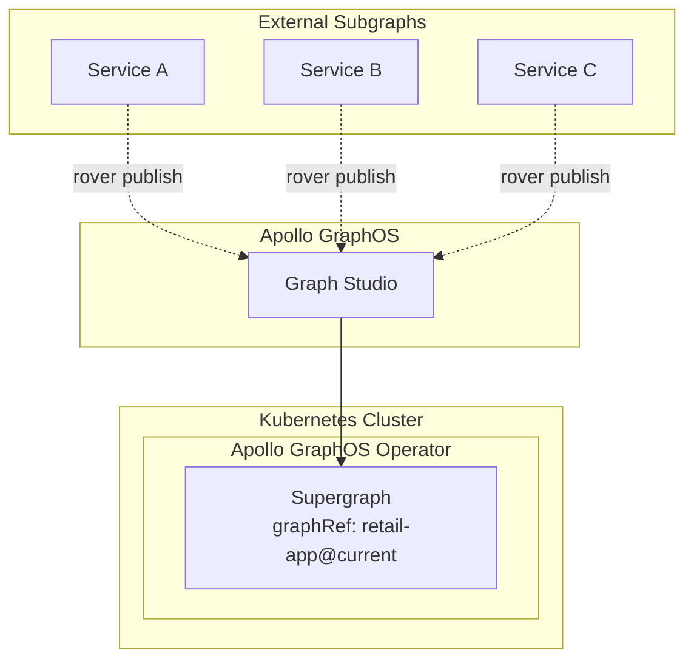

# Source: https://www.apollographql.com/docs/apollo-operator/workflows/deploy-only.md

# Deploy Only Setup

The **Deploy Only Setup** uses the Apollo GraphOS Operator solely for supergraph deployment. All subgraphs are published externally via `rover subgraph publish` and the Supergraph resource directly references a graph variant in Apollo GraphOS.

## How It Works



### The Operator's Role

The Apollo GraphOS Operator has a limited scope:

1. **No Subgraph Management**: The Operator doesn't manage Subgraph resources
2. **Direct Graph Reference**: Supergraph directly references a graph variant in Apollo GraphOS
3. **Kubernetes Deployment**: The Operator only handles supergraph deployment in Kubernetes

## When to Use This Pattern

**Use this pattern when:**

* All subgraphs are published via rover
* You have external CI/CD workflows for subgraph publishing
* You want Kubernetes supergraph benefits without operator-managed subgraphs
* You're not ready for operator-managed subgraphs

## Key Configuration

### Supergraph with Direct Graph Reference

```yaml
apiVersion: apollographql.com/v1alpha3
kind: Supergraph
metadata:
  name: retail-supergraph
spec:
  graphRef: retail-app@current  # Direct reference to graph variant
  # No selectors for Subgraph resources in the cluster
```

### External Subgraph Publishing

```bash
# Standard rover publishing workflow
rover subgraph publish retail-app@current \
  --name products \
  --schema ./schema.graphql \
  --routing-url https://products-service.example.com/graphql \
  --apollo-key $APOLLO_KEY
```

## What's Different About This Pattern

**No Local Subgraph Management**

* No Subgraph resources in cluster
* No SupergraphSchema resources
* No local subgraph discovery

**Studio Authoritative**

* External publishing workflows required
* Fastest deployment path
* External monitoring and health checks

**Limited Operator Scope**

* Operator focuses only on supergraph deployment
* No automatic subgraph discovery
* No real-time schema synchronization
* Reduced operator capabilities

**Supergraph CD Pattern**

* Operator triggers deployments when schemas change in GraphOS
* Contrasts with Router hot reloads
* Kubernetes-native deployment management
