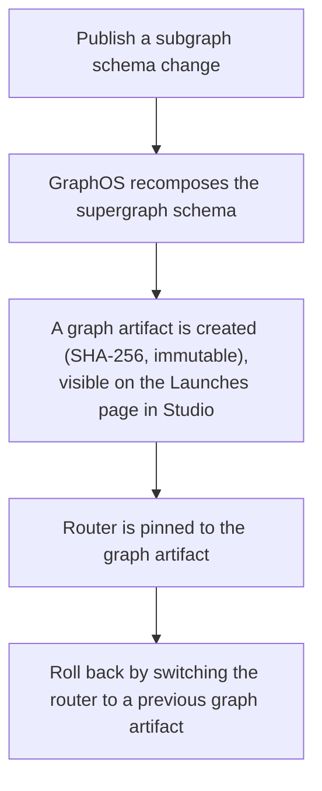
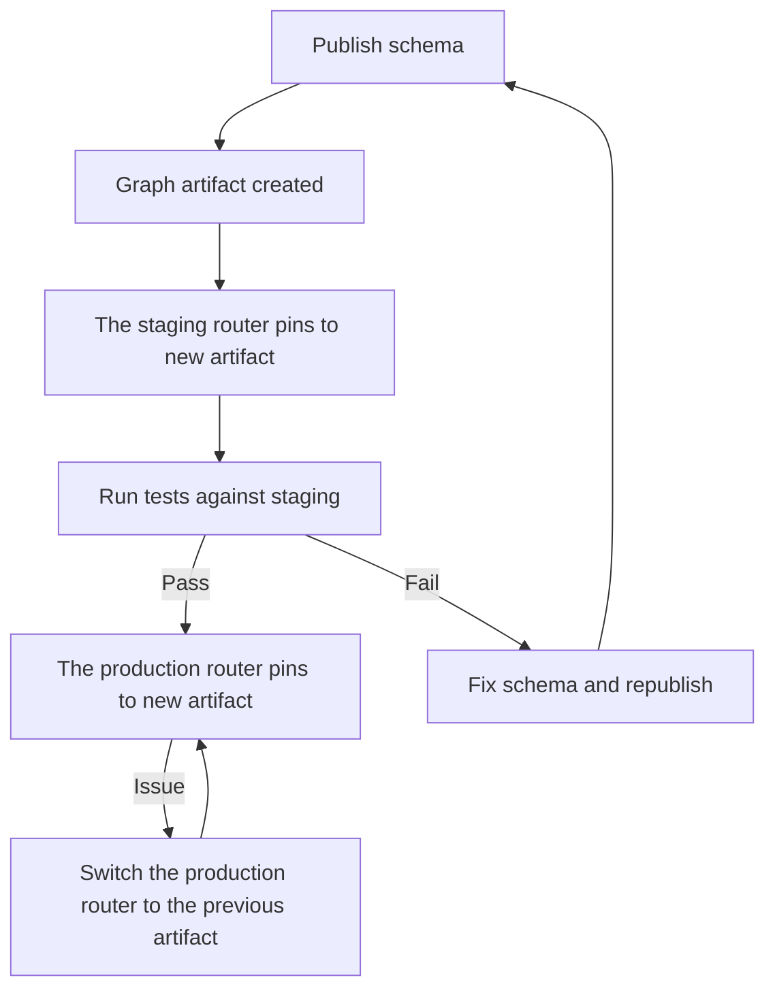

# Source: https://www.apollographql.com/docs/graphos/platform/schema-management/delivery/graph-artifacts.md

# Graph Artifacts

## Overview

Graph artifacts are versioned, immutable packages of your supergraph schema.

Each time you publish a schema, GraphOS automatically generates a graph artifact. GraphOS stores each artifact in the GraphOS registry and identifies it by a unique [SHA-256](https://en.wikipedia.org/wiki/SHA-2) digest. You reference this digest in your router configuration, and your router runs that schema version.



Graph artifacts are immutable: they represent the same schema version that GraphOS created at publish time, and their SHA digest never changes. In contrast, when you configure a router with a graph ref, for example, `my-graph@production`, it always resolves to the latest schema for that variant.

## When to use graph artifacts

Apollo recommends using graph artifacts for production deployments. Because graph artifacts are immutable and require an explicit restart or redeploy to take effect, your infrastructure team retains full control over when schema changes go live.

Use graph artifacts if you:

* Manage multiple environments such as staging and production
* Need to control exactly when your router picks up schema changes
* Need to audit which schema was live at a given time

Apollo Router also supports [hot-reloading schemas](https://www.apollographql.com/docs/graphos/routing/configuration/hot-reload-schema), where schema changes take effect automatically without a restart. Hot-reloading can be convenient for development, but in production it means schema updates happen outside the control of your infrastructure team, and reloads temporarily increase CPU usage, request latency, and memory footprint. For production environments, use graph artifacts instead.

### Limitations

* Graph artifacts are only available for supergraphs using managed federation with Apollo Router v2.7 or later.
* Apollo Router cannot hot reload graph artifacts; you must restart or redeploy to switch versions.
* The Rover CLI does not yet support querying for graph artifact details.

## Usage

### Run a graph artifact

After publishing a schema, find its graph artifact on the **Launches** page in GraphOS Studio:

Click the **Copy** button to copy the graph artifact's reference URI.

To configure the router with this graph artifact, set the `APOLLO_GRAPH_ARTIFACT_REFERENCE` environment variable, or use the `--graph-artifact-reference` command-line argument.

```bash
# Instead of pointing your router to a graph ref:
# APOLLO_GRAPH_REF=my-graph@production

# As an environment variable:
APOLLO_GRAPH_ARTIFACT_REFERENCE="artifact.api.apollographql.com/my-graph@sha256:6c3c62..."

# As a command-line argument:
./router --graph-artifact-reference="artifact.api.apollographql.com/my-graph@sha256:6c3c62..."
```

With this setting, your router runs that schema version until you update it to a new graph artifact.

Be sure to restart or redeploy your router so it runs the newly configured graph artifact.

### Roll back to a previous version

If a new schema version causes issues, roll back by pointing your router to a previous graph artifact. From the **Launches** page in Studio, copy the reference URI of the last known-good artifact and set the `APOLLO_GRAPH_ARTIFACT_REFERENCE` environment variable or use the `--graph-artifact-reference` command-line argument.

After restarting or redeploying, your router runs the stable schema of that graph artifact.

### Move a graph artifact from staging to production

1. Publish a schema. GraphOS automatically creates a new graph artifact.
2. Pin the staging router to the new artifact.
3. Run tests against staging.
4. If tests are successful, update the production router to use the same artifact.
5. If an issue arises, roll back production by switching to the previous artifact reference.



## Best practices

Graph artifacts give you fine-grained control over schema rollouts. To use them effectively:

* **Promote through environments**: Pin new artifacts in staging first, validate, then promote to production.
* **Keep a rollback plan**: Record the reference URI of your last known-good artifact.
* **Audit often**: Use the Launches page in Studio to confirm which artifact each environment is running.
* **Automate with CI/CD**: Integrate artifact publishing and promotion into your pipelines for repeatable deployments.

## Deploy with graph artifacts

### Deploy with your CI/CD pipeline

You can integrate graph artifacts with your CI/CD workflow. In your pipeline, programmatically fetch the latest graph artifact's reference URI using the [GraphOS Platform API](https://www.apollographql.com/docs/graphos/platform/platform-api). Then, save it to your router's configuration as part of deployment.

1. Fetch the graph artifact history of a variant using the [GraphOS Platform API](https://www.apollographql.com/docs/graphos/platform/platform-api).

   ```graphql title=GetGraphArtifactHistory
   # Fetch the latest Graph Artifact URIs for a specific graph variant
   query GetGraphArtifactHistory($graphId: ID!, $variantName: String!) {
     graph(id: $graphId) {
       variant(name: $variantName) {
         launchHistory {
           graphArtifact {
             completedAt
             status
             location {
               uri
             }
           }
         }
       }
     }
   }
   ```

   Specify your graph ID and variant name for the query:

   ```json title=Variables
   {
     "graphId": "my-graph-id",
     "variantName": "production"
   }
   ```

   In the response, find the `graphArtifact` with the latest `completedAt` value and a `status` of `GRAPH_ARTIFACT_COMPLETED`. The value of its `location.uri` field is the most recent artifact reference. Write this URI to your router's configuration during deployment to ensure it runs that specific schema version. Example response:

   ```json title=ExampleResponse
   {
     "data": {
       "graph": {
         "variant": {
           "launchHistory": [
             {
               "graphArtifact": {
                 "completedAt": "2025-09-30T19:22:02.684293Z",
                 "status": "GRAPH_ARTIFACT_COMPLETED",
                 "location": {
                   "uri": "artifact.api.apollographql.com/my-graph-id@sha256:157be07b693c50376853f3cfaf4abb9fa61c9996f2f10912ffa1d0e92361b461"
                 }
               }
             },
             {
               "graphArtifact": {
                 "completedAt": "2025-09-29T17:12:43.036755Z",
                 "status": "GRAPH_ARTIFACT_COMPLETED",
                 "location": {
                   "uri": "artifact.api.apollographql.com/my-graph-id@sha256:613750b0cf4f9fed76af65cf79d7be21bb5262de65e011dc469d51755c69ed49"
                 }
               }
             }
           ]
         }
       }
     }
   }
   ```

2. Configure the router to run the graph artifact by setting the `APOLLO_GRAPH_ARTIFACT_REFERENCE` environment variable or specifying the `--graph-artifact-reference` router command line argument.

3. If problems arise, repeat step 2 to roll back using the reference URI of a known-good graph artifact.

### Deploy with the Apollo GraphOS Operator for Kubernetes

The [Apollo GraphOS Operator](https://www.apollographql.com/docs/apollo-operator) supports graph artifacts, allowing you to use schema versions in Kubernetes-native deployments, automatically release artifacts, and let Kubernetes handle the orchestration.

## Open Container Initiative (OCI) support

Graph artifacts use the [Open Container Initiative (OCI)](https://opencontainers.org/) image format, and the GraphOS registry is an OCI-compliant artifact registry. This means you can use standard OCI tools to pull graph artifacts from the GraphOS registry and inspect their contents.

By default, OCI artifacts are stored in Apollo's registry, which requires network connectivity. However, you can also run your own [local OCI registry](https://www.apollographql.com/docs/graphos/platform/schema-management/delivery/graph-artifacts.md#local-oci-registry) for complete independence from external services.

### Find OCI artifact references

To programmatically retrieve a graph artifact reference, query the GraphOS Platform API. Apollo allows characters in the graph ID and variant name that the [OCI Distribution Spec](https://github.com/opencontainers/distribution-spec/blob/main/spec.md) does not, so Apollo removes these characters and appends a hash to preserve uniqueness.

Run the following Platform API query to retrieve the OCI-compatible repository and tag mapping:

```graphql title=GraphArtifactTagLocation
query GraphArtifactTagLocation($graphId: ID!, $variantName: String!) {
  graphArtifactTagLocation(graphID: $graphId, variantName: $variantName) {
    repository
    tag
  }
}
```

Alternatively, calculate the tag mapping manually by stripping any non-alphanumeric characters (besides dot, underscore, and dash) and then calculating the SHA256 checksum. For example, the variant name `current` maps to:

```bash
$ echo -n current | sha256sum | cut -c 1-16
current-97b0560280ed60a5
```

Query the Platform API to retrieve the unique digest fingerprint of the latest build:

```graphql title=GetGraphArtifact
query GetGraphArtifact($graphId: ID!, $tag: String!) {
  graphArtifactByTag(graphID: $graphId, tag: $tag) {
    location {
      digest
      uri
    }
  }
}
```

The returned `uri` is a combination of the hashed graph ID and variant, and can be used to directly launch a router using that supergraph.

### Pull graph artifacts

You can use any OCI-compliant tool to pull graph artifacts from the GraphOS registry.

In most cases, Apollo Router can fetch the artifact directly when you configure `APOLLO_KEY` and `APOLLO_GRAPH_ARTIFACT_REFERENCE`. Pull the graph artifact manually when you need a local copy for inspection, debugging, or custom workflows.

#### Authenticate with the GraphOS registry

Graph artifacts are stored in an OCI-compliant registry at `artifact.api.apollographql.com`. Tools like [ORAS](https://oras.land/docs/) and the [Docker CLI](https://docs.docker.com/reference/cli/docker/) use your local Docker credential store (for example, `~/.docker/config.json` and any configured credential helpers) to authenticate. Before you can pull an artifact, sign in to this registry with a [graph API key](https://www.apollographql.com/docs/graphos/platform/api-keys/#graph-api-keys).

To authenticate with the GraphOS registry using ORAS:

```bash
oras login artifact.api.apollographql.com
# When prompted, enter any non-empty username.
# Use your Graph API key as the password.
```

To authenticate with the GraphOS registry using Docker:

```bash
export APOLLO_KEY="service:YOUR_GRAPH_API_KEY"
echo "$APOLLO_KEY" | docker login artifact.api.apollographql.com --username token --password-stdin
```

After logging in, your credentials are saved to the Docker authentication configuration, which ORAS and Docker both use when pulling artifacts.

To pull a graph artifact using ORAS:

```bash
oras pull artifact.api.apollographql.com/<your-graph-id>@sha256:<your-artifact-sha-digest>
```

To pull a graph artifact using Docker:

```bash
docker pull artifact.api.apollographql.com/<your-graph-id>@sha256:<your-artifact-sha-digest>
```

### Inspect graph artifacts

You can use any OCI-compliant tool to inspect graph artifacts from the GraphOS registry. For example, after installing the [ORAS CLI](https://oras.land/docs/), inspect a graph artifact using the following command, substituting your own graph ID and artifact SHA digest:

```bash
oras manifest fetch artifact.api.apollographql.com/<your-graph-id>@sha256:<your-artifact-sha-digest>
```

You can also use the [Docker CLI](https://docs.docker.com/reference/cli/docker/) to inspect graph artifacts from the GraphOS registry:

```bash
docker manifest inspect artifact.api.apollographql.com/<your-graph-id>@sha256:<your-artifact-sha-digest>
```

### Local OCI registry

Configure your own OCI-compatible artifact registry to mirror graph artifacts from Apollo. By setting up a remote repository, you can proxy and cache Apollo artifacts through your own registry infrastructure. This is useful for air-gapped or restricted network environments.

Running a local OCI registry provides multiple benefits:

* **Remove dependence on Apollo for deployments**: Deploy without requiring connectivity to Apollo's registry.
* **Enhance security and compliance**: Keep artifacts within your own infrastructure.
* **Reduce network latency**: Serve artifacts from a registry closer to your routers.
* **Maintain complete control**: Full ownership over artifact storage and lifecycle.

#### Prerequisites

* An Apollo account with a valid [graph API key](https://www.apollographql.com/docs/graphos/platform/api-keys/#graph-api-keys)
* Administrative access to your artifact registry (for example, JFrog Artifactory)
* The [ORAS CLI](https://oras.land/docs/) (optional, used for testing)
* Your current Apollo artifact reference (for example, `artifact.api.apollographql.com/your-graph-id:tag`)

#### General configuration

Configure your OCI-compatible registry with the following parameters:

| Parameter  | Value                                     |
| ---------- | ----------------------------------------- |
| Remote URL | `https://artifact.api.apollographql.com/` |
| Username   | `apollo`                                  |
| Password   | Your Apollo graph API key                 |

#### Set up JFrog Artifactory

Configure JFrog Artifactory as your OCI artifact mirror:

1. Navigate to **Administration > Repositories**, click **Create a Repository**, and select **Remote**.

2. Select **OCI** as the package type.

3. Enter a repository key (for example, `apollo-artifacts`) and configure these basic settings:

   * **URL**: `https://artifact.api.apollographql.com/`
   * **User Name**: `apollo`
   * **Password / Access Token**: Your Apollo graph API key

4. Configure these advanced settings to ensure proper artifact retrieval:

   * Clear the **Block Mismatching MIME Types** checkbox
   * Select **Bypass HEAD Requests**
   * Select **Disable URL Normalization**

#### Configure the router

After you configure your remote repository, update the `APOLLO_GRAPH_ARTIFACT_REFERENCE` environment variable to point to your local registry. Replace the Apollo artifact URL with your registry URL and repository, but keep the graph identifier and tag.

```bash
# Original reference:
APOLLO_GRAPH_ARTIFACT_REFERENCE="artifact.api.apollographql.com/your-graph-id:your-tag"

# Updated reference pointing to your local registry:
APOLLO_GRAPH_ARTIFACT_REFERENCE="your-registry.com/remote-repository/your-graph-id:your-tag"
```

#### Verify the configuration

Log in to your registry using the ORAS client and pull an artifact to confirm the setup:

```bash
# Log in to your registry
oras login your-artifactory-instance.jfrog.io

# Pull an artifact from your mirrored repository
oras pull your-artifactory-instance.jfrog.io/apollo-artifacts/your-graph-id:your-tag
```

A successful pull confirms that your remote repository is correctly configured and can fetch artifacts from Apollo GraphQL.

#### Cache settings

When you use a mirrored repository, adjust your cache settings to reduce the delay between a new artifact version becoming available in Apollo and its availability in your local registry. Shorter cache TTL values ensure more timely updates but might increase upstream traffic.

## Self-hosted OCI artifacts

A supergraph schema can be composed locally with Rover and pushed to an OCI registry (for example, a private registry or AWS ECR). The Apollo Router can then run using that artifact. The following requirements apply when you use self-hosted OCI artifacts.

### Schema layer media type

The Apollo Router expects the schema layer to use the media type `application/apollo.schema`. When you push with ORAS, specify that media type explicitly using the ORAS file syntax `local_file_path:media_type`:

```bash
oras push your-registry.com/supergraph-schema:latest \
  path/to/supergraph-schema.graphql:application/apollo.schema
```

### Use a digest reference

`APOLLO_GRAPH_ARTIFACT_REFERENCE` must be a digest reference (`@sha256:...`), not a tag. Tag references such as `your-registry.com/supergraph-schema:latest` do not work. After pushing, resolve the digest and use the full reference as the environment variable:

```bash
oras discover your-registry.com/supergraph-schema:latest
# Output: your-registry.com/supergraph-schema@sha256:e5c8efeb176643feba5ff32cbb8e8d15ffc6323dadaa748b902fa68890792607
```

Set `APOLLO_GRAPH_ARTIFACT_REFERENCE` to that full `registry/repo@sha256:digest` string.

### Set APOLLO\_KEY

When the schema source is an OCI artifact, `APOLLO_KEY` must be set (any valid graph API key). Apollo Router does not use the OCI reference without it.

### Run Apollo Router

Set `APOLLO_GRAPH_REF`, `APOLLO_KEY`, and `APOLLO_GRAPH_ARTIFACT_REFERENCE` (using the digest from `oras discover`), then start Apollo Router:

```bash
APOLLO_GRAPH_REF="your_graph_id@variant_name" \
APOLLO_KEY="your_apollo_key" \
APOLLO_GRAPH_ARTIFACT_REFERENCE="your-registry.com/your-repo@sha256:digest" \
./router
```
