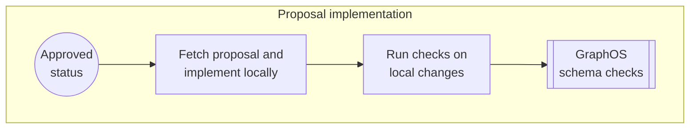
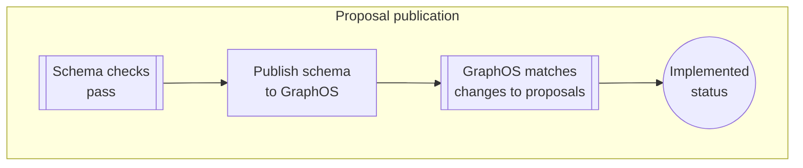

# Source: https://www.apollographql.com/docs/graphos/platform/schema-management/proposals/implement.md

# Implement Approved Proposals

This article describes actions in the **Proposal implementation** and **Publication** stages of the [schema proposal workflow](https://www.apollographql.com/docs/graphos/platform/schema-management/proposals#proposal-workflow).





Once a schema proposal is **Approved**, its changes need to be implemented.
For those implementing the changes, [pulling the approved schema changes](https://www.apollographql.com/docs/graphos/platform/schema-management/proposals/implement.md#pull-proposed-schemas-with-rover) into their IDE is a great starting point.
The approved schema changes serve as a guide for resolvers and any other supporting code that needs to be implemented.

Once the changes are implemented, you can use schema checks to ensure your organization only [publishes changes approved through a proposal](https://www.apollographql.com/docs/graphos/platform/schema-management/proposals/implement.md#validate-changes-with-checks).

## Pull proposed schemas with Rover

The [`rover subgraph fetch` command](https://www.apollographql.com/docs/rover/commands/subgraphs/#subgraph-fetch) can pull subgraph schemas from variants and proposals. To pull a subgraph schema from a proposal, use the proposal's ID instead of a variant name:

```bash
rover subgraph fetch my-graph@p-101 --name subgraph
```

A proposal's ID is always prefixed with `p-` and followed by a number. You can find the proposal ID in the proposal's URL in [GraphOS Studio](https://studio.apollographql.com/?referrer=docs-content). For example, a proposal with the following URL has an ID of `p-101`.

`https://studio.apollographql.com/graph/Example-supergraph/proposal/p-101/home`

## Resolve proposal conflicts

Proposal conflicts occur when proposal changes are incompatible with changes in the proposal's source variant.
If a proposal has conflicts with its source variant, a **Conflict** indicator appears next to its status.

Conflicts need to be resolved before a proposal can become **Implemented**.
This includes **Approved** proposals that accrue conflicts after they've been approved.

**Approved** proposals with conflicts don't automatically revert to a non-approved status.
If the proposal [requires approvals](https://www.apollographql.com/docs/graphos/platform/schema-management/proposals/configure#require-reapprovals), its status reverts to **Open for Feedback** only once a [merge revision](https://www.apollographql.com/docs/graphos/platform/schema-management/proposals/implement.md#pull-changes) is saved.

### Conflict detection

GraphOS uses a three-way GraphQL-aware diff to identify conflicts. Specifically, it tracks the differences between:

* the source variant's schemas when the proposal was created (the base)
* the proposal's schemas
* the source variant's current schemas

#### Conflict-causing changes

A conflict occurs whenever a proposal and its source variant make incompatible changes on the same GraphQL node. Examples include:

* Different field types, for example:

  ```graphql title=Base source variant
  type A {
    B: Int
  }
  ```

  ```graphql title=Proposal
  type A {
    B: Int
    C: String
  }
  ```

  ```graphql title=Current source
  type A {
    B: Int
    C: Int
  }
  ```

* Different type or field descriptions, including changes in capitalization:

  ```graphql title=Base source variant
  type A {
    B: Int
  }
  ```

  ```graphql title=Proposal
  type A {
    "The b field"
    B: Int
  }
  ```

  ```graphql title=Current source
  type A {
    "The B field"
    B: Int
  }
  ```

* Removing a field in either the proposal or source variant and updating it in another:

  ```graphql title=Base source variant
  type A {
    B: Int
    C: Int
  }
  ```

  ```graphql title=Proposal
  type A {
    B: Int

  }
  ```

  ```graphql title=Current source
  type A {
    B: Int
    C: String
  }
  ```

#### Non-conflicting changes

The following don't raise conflict indicators on a proposal:

* Differences in whitespace
* Order of types or fields
  * Though order doesn't matter for conflict detection, it will appear as such when pulling changes in your proposals editor. For example, the following will appear as a conflict only in your editor:

    ```graphql title=Base source variant
    type A {
      B: Int
      C: Int
    }
    ```

    ```graphql title=Proposal
    type A {
      C: String
      B: Int
    }
    ```

    ```graphql title=Current source
    type A {
      B: Int
      C: String
    }
    ```

### Pull changes

In the proposals editor, click the **Pull changes** button in the top right.
This performs a text merge and pulls the changes from the current source variant into the proposals editor alongside the proposal's changes.

Manually reconcile any incompatible changes, including removing any merge markers such as `<<<<<<<< SOURCE`, `========`, or `>>>>>>>> Proposal`. Then, click **Save Merge** in the left panel.
This merge revision is recorded like [any other revision](https://www.apollographql.com/docs/graphos/platform/schema-management/proposals/create#save-revisions) in the proposal's activity in its overview.

From this point on, the current version of the source variant is considered the base and [conflict detection](https://www.apollographql.com/docs/graphos/platform/schema-management/proposals/implement.md#conflict-detection) treats it as such.

You can pull changes to a proposal even if it has no conflicts. Pulling changes is useful to demonstrate that your proposal is compatible with upstream changes.

## Validate changes with checks

GraphOS provides [schema checks](https://www.apollographql.com/docs/graphos/platform/schema-management/checks) to help you identify breaking changes. You [run checks on local changes](https://www.apollographql.com/docs/graphos/platform/schema-management/checks#the-checks-lifecycle) before publishing them.

Since schema checks [run automatically on every revision](https://www.apollographql.com/docs/graphos/platform/schema-management/proposals/create#schema-checks) in a proposal, if your last revision's checks pass, any changes you implement locally from a proposal should pass too.
Regardless, it's best to run checks before publishing changes to make sure errors haven't crept in.

### Ensure changes match an approved proposal

You can [configure schema checks](https://www.apollographql.com/docs/graphos/platform/schema-management/proposals/configure#configure-schema-checks) that run in GraphOS to include a **Proposals** task. Proposals checks verify that the changes a check is running on have matching and approved schema proposals.

Configuring the **Proposals** task's severity to **Error** ensures that only changes approved through the proposal process can be published. By setting the severity to **Warning** you can publish changes that haven't been approved and receive warnings about them.

The Proposals task also checks descriptions in the SDL. Detected issues raise warnings rather than errors. For example, the Proposals task will pass with warnings if a matching approved proposal includes a description with a period and the change the check is running on doesn't.

When a check with the **Proposals** task runs, you can see which changes match a proposal by clicking the **Proposals** task on the **Checks** page:

* Changes with matching approved proposals show checkmark icons.
* Changes without matching approved proposals show warning or error icons depending on the [configured severity](https://www.apollographql.com/docs/graphos/platform/schema-management/proposals/configure#configure-schema-checks).

Clicking the icons reveals a list of matching proposals in the right panel.
Click **Ignore** to allow the Proposals task to succeed without matching approved proposals for all changes.

### Matching changes to proposals

**Incoming changes and approved proposals don't need to match one-to-one.**
For example, suppose you have an approved proposal with changes in multiple subgraphs. You can check each subgraph's changes separately. Each subgraph check still passes even though the change doesn't encompass all the approved proposal's changes.

Similarly, a single proposal can contain a large change in one subgraph that you want to divide into multiple checks. Those changes can match across multiple checks and each check passes.

## Publish changes to GraphOS

Once you've implemented the approved schema changes, including supporting code, you need to publish the subgraph schemas back to GraphOS. Publishing schema proposal changes follows the same [steps](https://www.apollographql.com/docs/graphos/platform/schema-management/delivery/publish) as publishing any other changes.

When a subgraph schema published to a proposal's source variant contains changes that are in an **Approved**, **Open for Feedback**, or **Draft** proposal, the corresponding [launch](https://www.apollographql.com/docs/graphos/platform/schema-management/delivery/launch) appears in the proposal's activity log.

When an **Approved** or **Open for feedback** proposal's changes have been fully implemented—[whether from one launch or many](https://www.apollographql.com/docs/graphos/platform/schema-management/proposals/implement.md#matching-changes-to-proposals)—the proposal's status changes to **Implemented**.

* A proposal with **Draft** status can't become **Implemented**, even when all its changes are published. Once such a proposal's status is changed to **Open for feedback**, it automatically switches to **Implemented**.
* **Implemented** proposals can't receive further revisions, nor their status be changed.
