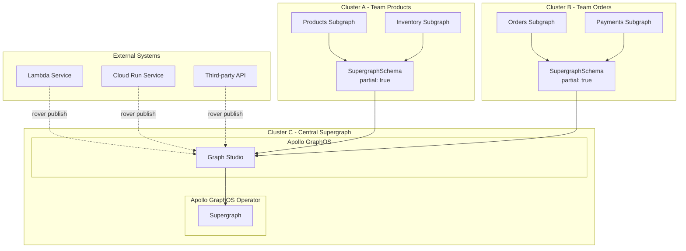

# Source: https://www.apollographql.com/docs/apollo-operator/workflows/multi-cluster.md

# Multi-Cluster and Hybrid Setup

The **Multi-Cluster and Hybrid Setup** distributes subgraphs across multiple Kubernetes clusters or external systems while centralizing supergraph deployment. This pattern requires `partial: true` in SupergraphSchema because not all subgraphs are available in the central cluster.

## How It Works

### The Operator's Role

1. **Subgraph Discovery**: Discovers subgraphs in the central cluster and external endpoints
2. **External Subgraph Management**: Subgraphs in remote clusters are published via external endpoints, external systems publish via rover
3. **Hybrid Authoritative**: Uses `partial: true` to compose supergraphs with available subgraphs in the cluster and externally in Studio
4. **Centralized Deployment**: Supergraphs are deployed only in the central cluster

### Operator Behavior With `partial: true`

When `partial: true` is set, the Operator:

* Discovers and includes Subgraph resources available in the cluster
* Ignores subgraphs that exist in GraphOS Studio but not in the cluster
* Sends composition requests to GraphOS Studio when local subgraphs change
* Updates automatically when subgraphs become available/unavailable

## When to Use This Pattern

**Use this pattern when:**

* Subgraph implementations are deployed in different clusters
* Some services run in Kubernetes, others don't
* You need service isolation for compliance
* You have multiple Kubernetes clusters
* You want centralized supergraph management
* You're migrating from external to Kubernetes
* You're adopting the Operator from an existing implementation

## What's Different About This Pattern

**Hybrid Authoritative**

* The Operator ignores subgraphs in GraphOS Studio that aren't defined as Subgraph resources in the cluster and will not remove them
* GraphOS Studio will compose all subgraphs together, that is, composition is the union of all subgraphs in Studio and the Cluster

**Cross-Cluster Communication**

* Subgraphs in remote clusters expose external endpoints
* The Operator uses these endpoints to inform Routers where to send requests

**Centralized Supergraph Management**

* Supergraphs deploy only in the central cluster
* Teams manage their own subgraph clusters independently
* Unified supergraph configuration and monitoring

**Mixed Subgraph Management**

* Kubernetes subgraphs managed by the Operator
* External subgraphs published via rover
* Different update frequencies and workflows
