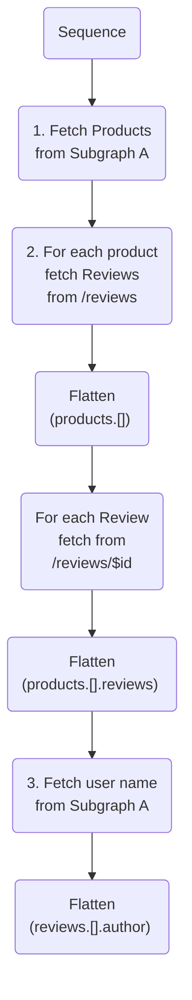

# Source: https://www.apollographql.com/docs/graphos/routing/performance/caching/response-caching/observability.md

# Source: https://www.apollographql.com/docs/graphos/connectors/observability.md

# Connector Observability

Apollo provides a few ways to understand your Connectors' behavior and performance:

* You can view [query plans](https://www.apollographql.com/docs/graphos/connectors/observability.md#understand-connector-runtime-with-query-plans) to understand when REST APIs are called in the context of subgraph operations.
* You can view and export [traces](https://www.apollographql.com/docs/graphos/connectors/observability.md#observe-performance-with-traces) to understand operation performance, including REST API calls.
* You can configure [router telemetry](https://www.apollographql.com/docs/graphos/connectors/router#telemetry) for Connectors.

## Understand Connector runtime with query plans

Whenever a supergraph receives an incoming GraphQL operation, its router generates a query plan with the steps necessary to efficiently resolve the operation from any number of data sources. Typically, those data sources are GraphQL subgraphs. With Connectors they can also be REST APIs.

### Query plan example

Suppose these two subgraphs are part of the same supergraph:

```graphql title=Subgraph A (without Connectors)
type Query {
  products: [Product]
}

type Product @key(fields: "id") {
  id: ID!
  name: String
}

type User @key(fields: "id") {
  id: ID!
  name: String
}
```

Subgraph A provides the `Query.products` root field and provides `id`s and `name`s for `Product`s and `User`s.
Notice that both `Product` and `User` are entities that both subgraphs can access and contribute to.

```graphql title=Subgraph B (with Connectors)
type Product @key(fields: "id") {
  id: ID!
  reviews: [Review]
    @connect(
      http: { GET: "/reviews?product_id={$this.id}" }
      selection: """
      $.results {
        id
        rating
      }
      """
    )
}

type Review
  @connect(
    http: { GET: "/reviews/{$this.id}" }
    selection: """
    id
    rating
    content
    author: { id: author_id }
    """
  )
{
  id: ID!
  rating: Int
  content: String
  author: User
}

type User @key(fields: "id", resolvable: false) {
  id: ID!
}
```

Subgraph B uses Connectors to extend the `Product` entity with review data from a REST API. It also provides an entity resolver for the Review type to provide more fields. Notice that the `Review.author` references the `User` entity using the foreign key `author_id`.

A client could send the following GraphQL request to the supergraph these subgraphs are composed into:

```graphql
query ProductList {
  products {
    id
    name
    reviews {
      id
      rating
      content
      author {
        id
        name
      }
    }
  }
}
```

To fulfill this request, the query plan would have these four steps:

1. Fetch `Query.products` and `Product.id` and `Product.name` from Subgraph A.
2. Use Product entity references to fetch `Product.reviews`. **Because `Product.reviews` is a Connector, the GraphOS Router calls the REST API directly.**
3. Because `/reviews` doesn't provide the full review data, the GraphOS Router calls `/reviews/{id}` for each review to fetch the rest of the Review fields.
4. Use User entity references to fetch `User.name` from Subgraph A.



Learn more about [`Sequence`](https://www.apollographql.com/docs/graphos/reference/federation/query-plans/#sequence-node), [`Fetch`](https://www.apollographql.com/docs/graphos/reference/federation/query-plans/#fetch-node), and [`Flatten`](https://www.apollographql.com/docs/graphos/reference/federation/query-plans/#flatten-node) nodes in the [Query plans reference](https://www.apollographql.com/docs/graphos/reference/federation/query-plans/#structure-of-a-query-plan).

```graphql
QueryPlan {
  Sequence {
    Fetch(service: "subgraph-a") {
      {
        products {
          __typename
          id
          name
        }
      }
    },
    Flatten(path: "products.@") {
      Fetch(service: "subgraph-b.reviews http: GET /reviews?product_id={$this.id}") {
        {
          ... on Product {
            __typename
            id
          }
        } =>
        {
          ... on Product {
            reviews {
              __typename
              id
              rating
            }
          }
        }
      },
    },
    Flatten(path: "products.@.reviews.@") {
      Fetch(service: "subgraph-b.reviews http: GET /reviews/{$this.id!}") {
        {
          ... on Review {
            __typename
            id
          }
        } =>
        {
          ... on Review {
            author {
              __typename
              id
            }
            content
          }
        }
      },
    },
    Flatten(path: "products.@.reviews.@.author") {
      Fetch(service: "subgraph-a") {
        {
          ... on User {
            __typename
            id
          }
        } =>
        {
          ... on User {
            name
          }
        }
      },
    },
  },
}
```

## Observe performance with traces

Traces monitor the flow of a request through the GraphOS Router. You can view [operation](https://www.apollographql.com/docs/graphos/connectors/observability.md#operation-traces) traces in GraphOS Studio or [use the GraphOS Router to export them](https://www.apollographql.com/docs/graphos/connectors/observability.md#cloud-native-traces) to monitoring tools.

### Operation traces

Individual operation metrics in GraphOS Studio include [operation traces](https://www.apollographql.com/docs/graphos/platform/insights/operation-metrics#resolver-level-traces) if you've [enabled trace reporting](https://www.apollographql.com/docs/graphos/platform/insights/operation-metrics#enabling-traces).

When you view operation traces in GraphOS Studio, Apollo Connectors appear as span parents. These spans give a general idea of request latency.

### Cloud-native traces

The GraphOS Router emits traces that instrument the execution of Apollo Connectors. These traces show individual HTTP requests and are more comprehensive than the traces displayed in GraphOS Studio. To learn more, see [router tracing](https://www.apollographql.com/docs/router/configuration/telemetry/exporters/tracing/overview/).
