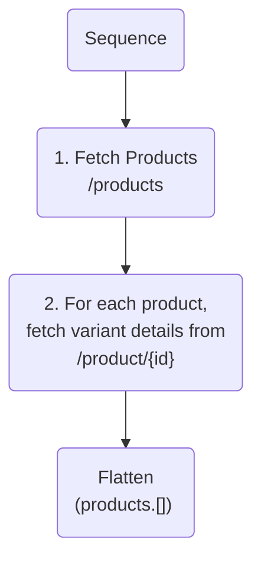

# Source: https://www.apollographql.com/docs/graphos/connectors/entities/patterns.md

# Entity Resolution Patterns

Apollo Connectors let you create and complete entities by combining data from multiple endpoints.

## Combining endpoints to complete an entity

Connectors can orchestrate multiple endpoints to provide a unified representation of a type.
For example, you may want to combine product data from a `/products` endpoint that provides a few fields for all products and a `/products/:id` endpoint that provides more fields, specifically product variant information, for a single product.

```graphql
type Query {
  products: [Product]
    @connect(
      source: "ecomm"
      http: { GET: "/products" }
      selection: """
      $.products {
        id
        name
        description
      }
      """
    )
}

type Product
  @connect(
    source: "ecomm"
    http: { GET: "/products/{$this.id}" }
    selection: """
    id
    name
    description
    variants {
      id: variantID
      name
    }
    """
) {
  id: ID!
  name: String
  description: String
  variants: [Variant]
}

type Variant {
  id: ID!
  name: String
}
```

When the GraphOS Router receives a query for fields from both endpoints, it generates a query plan that sequences calls across the two endpoints. For example:

```graphql
query ListProductsAndVariants {
  products {
    id
    name
    variants {
      id
      name
    }
  }
}
```



## Combining representations of the same type with multiple Connectors

You can add multiple Connectors to the same field, and the GraphOS Router chooses to call one or both depending on the fields in the client query. This is especially useful when you have multiple API versions.

```graphql
type Product
  @connect(
    source: "ecomm"
    http: { GET: "/v1/products/{$this.id}" }
    selection: """
    id
    color
    """
  )
  @connect(
    source: "ecomm"
    http: { GET: "/v2/products/{$this.id}" }
    selection: """
    id
    name
    price
    variants {
      id: variantID
      color
    }
    """
  )
{
  id: ID!
  name: String
  price: Int
  color: String @deprecated(reason: "Use the 'variants' field instead")
  variants: [Variant]
}

type Variant {
  id: ID!
  color: String
}
```

### Efficiently fetching additional information

If you provide the GraphOS Router with multiple Connectors that fetch additional information, it can choose the optimal endpoint to resolve the requested fields.
For example, if the client operation requests the `reviews` field, the GraphOS Router chooses the second Connector to fetch the reviews along with the product details.

```graphql
type Product
  @connect(
    source: "ecomm"
    http: { GET: "/products/{$this.id}" }
    selection: """
    id
    name
    price
    """
  )
  @connect(
    source: "ecomm"
    http: { GET: "/products/{$this.id}?include=reviews" }
    selection: """
    id
    name
    price
    reviews {
      id
      rating
      comment
    }
    """
  )
{
  id: ID!
  name: String
  price: Int
  reviews: [Review]
}

type Review {
  id: ID!
  rating: Float
  comment: String
}
```

## Nullable entity references

The `?` operator indicates that the expression to its left can be `null` or `None`. If the expression is `null`, the statement short-circuits and evaluates to `None`. Otherwise, the statement continues to execute.

```graphql
a: b?.c       # If `b` is `null` or `None`, `a` becomes `None`. Otherwise, `a` becomes the value of `b.c`
a: b?->c      # If `b` is `null` or `None`, `a` becomes `None`. Otherwise, `a` becomes the value of `b->c`
a: b? { c }   # If `b` is `null` or `None`, `a` becomes `None`. Otherwise, `a` becomes the value of `b { c }`
```

If an entity reference is optional, you can express this by making the sub-selection optional:

```graphql
author: authorId? {
  id: @
}

# Shorthand if the field name is the same as the mapped name
author? { id: @ }
```

## Additional resources

* To learn how to use entities across different subgraphs in a federated schema, see [Working with entities across subgraphs](https://www.apollographql.com/docs/graphos/connectors/entities/across-subgraphs)
* To learn more about batching entity requests, see [Batching requests](https://www.apollographql.com/docs/graphos/connectors/requests/batching)
