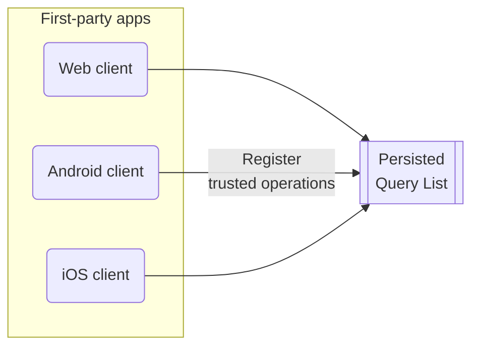
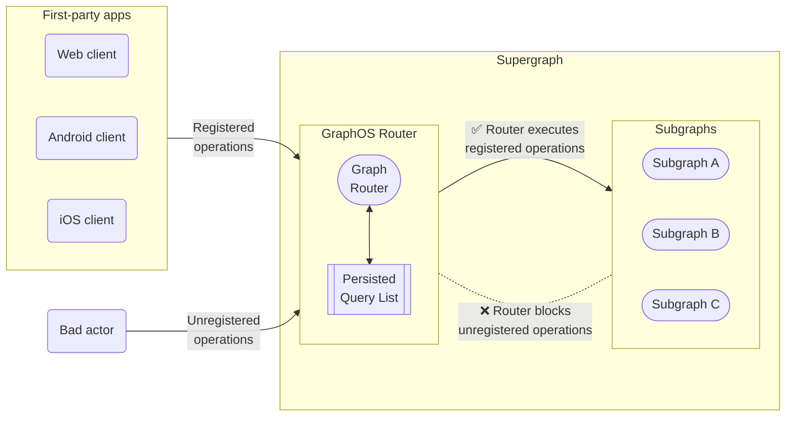
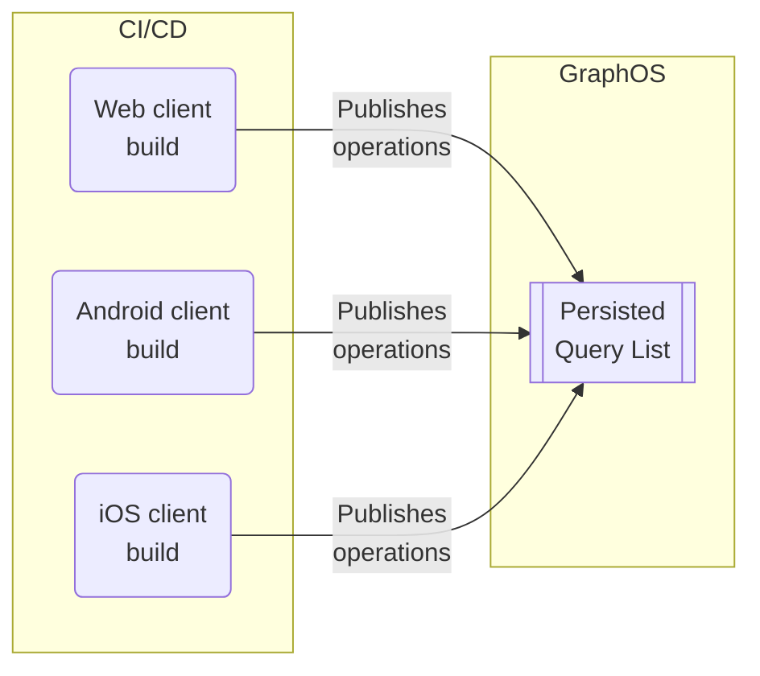

# Source: https://www.apollographql.com/docs/kotlin/advanced/persisted-queries.md

# Source: https://www.apollographql.com/docs/ios/fetching/persisted-queries.md

# Source: https://www.apollographql.com/docs/react/data/persisted-queries.md

# Source: https://www.apollographql.com/docs/rover/commands/persisted-queries.md

# Source: https://www.apollographql.com/docs/graphos/routing/security/persisted-queries.md

# Source: https://www.apollographql.com/docs/graphos/platform/security/persisted-queries.md

# Safelisting with Persisted Queries

Rate limits apply on the Free plan.

GraphQL APIs are broadly open by design to provide flexibility and efficiency in client development. However, this openness also introduces the risk of potentially malicious requests and the subsequent need to secure your graph.

With [GraphOS Enterprise](https://www.apollographql.com/pricing?referrer=docs-content), you can enhance your supergraph's security by maintaining a *persisted query list* (PQL) for your GraphOS Router. To create and update the PQL, first-party apps register trusted operations to the PQL at build time.



Clients can register any kind of operation to a PQL, including queries, mutations, and subscriptions.

At runtime, the router checks incoming requests against the PQL, which can act as operation safelist, depending on your [router configuration](https://www.apollographql.com/docs/graphos/platform/security/persisted-queries.md#2-router-configuration).



Your router can use its persisted query list (PQL) to both protect your supergraph and speed up your clients' operations:

* When you enable *safelisting*, your router rejects any incoming operations not registered in its PQL.

* Client apps can execute an operation by providing its PQL-specified ID instead of the entire operation string.
  * Requesting by ID can significantly reduce latency and bandwidth usage for large operation strings.
  * Your router can require that clients provide operations by ID and reject full operation strings—even operation strings present in the PQL.

## Differences from automatic persisted queries

The router also supports a related feature called [automatic persisted queries](https://www.apollographql.com/docs/router/configuration/in-memory-caching#caching-automatic-persisted-queries-apq) (APQ). With APQ, clients can execute a GraphQL operation by sending the SHA256 hash of its operation string instead of the full string.

APQ has a few limitations compared to registered persisted queries.

Automatic persisted queries&#x20;
Registered persisted queries

Operation performance

✅ Clients can send identifiers instead of full operation strings, reducing request sizes and latency
dramatically.

🌟 Registered persisted queries share the same performance enhancement mechanism as APQs. Additionally, they
benefit from query plan cache warm-ups,
which are active by default from version
1.31.0 of the router.

Build- vs. runtime registration

Operations are registered at runtime. One of your router instances must receive any given operation string
from a client at least once to cache it.

Clients contribute to the PQL at build-time. Your router fetches its PQL from GraphOS on startup and polls
for updates, meaning clients can always execute operations using their PQL-specified ID.

Safelisting

❌ APQ doesn't provide safelisting capabilities because the router dynamically populates its APQ cache over time
with any operations it receives.

✅ Clients preregister their operations to GraphOS. Your router fetches its PQL on startup, enabling it
to reject operations not present in the PQL.

If you only want to improve request latency and bandwidth usage, APQ addresses your use case. If you also want to secure your supergraph with operation safelisting, you should register operations in a PQL.

## Security levels

The GraphOS Router supports the following security levels, in increasing order of restrictiveness:

Security Level
Description

Allow operation IDs

Clients can optionally execute an operation on your router by providing the operation's PQL-specified ID.

Audit mode

Executing operations by providing a PQL-specified ID is still optional, but the router logs any unregistered
operations.

Safelisting

The router rejects any incoming operations that aren't in its PQL. Clients can use either PQL-specified IDs or
operation strings to execute operations.

Safelisting with IDs only

Clients can only execute operations by providing their PQL-specified IDs; the router rejects all
freeform GraphQL requests.

You can find more details, including configuration instructions, in the [implementation section](https://www.apollographql.com/docs/graphos/platform/security/persisted-queries.md#2-router-configuration).

These levels allow you to [incrementally adopt](https://www.apollographql.com/docs/graphos/platform/security/persisted-queries.md#incremental-adoption-path) persisted queries on a client-by-client basis. Specifically, the router should use audit mode until you're confident that all your clients' trusted operations have been registered in the PQL. Refer to the [incremental adoption section](https://www.apollographql.com/docs/graphos/platform/security/persisted-queries.md#incremental-adoption-path) for a step-by-step guide.

## Implementation steps

Persisted queries provide benefits to different teams:

* Safelisting helps platform teams secure the graph and optimize its performance.
* Application developers can use registered operation IDs to write performant client code.

Implementation also requires collaboration among these parties. These are the main steps for implementing persisted queries for safelisting, along with the team that usually performs them:

Step
Description
Responsible party

1\. PQL creation and linking

Create and apply a PQL to graph variants.&#x20;
Platform team

2\. Router configuration

Update your router's YAML config file to enable
persisted queries at the appropriate security level.

Platform team

3\. Operation registration

Generate and publish a persisted queries manifest (PQM) to the PQL from your client's CI/CD pipeline.
App developers

4\. Client updates (Optional)&#x20;

Update clients to use operation IDs instead of full operation strings.

This step provides performance benefits but isn't necessary for safelisting.

App developers

Continue reading for each step's details, or skip to the [incremental adoption section](https://www.apollographql.com/docs/graphos/platform/security/persisted-queries.md#incremental-adoption-path) for the recommended incremental adoption strategy. (This section assumes you have a high-level understanding of each implementation step.)

### 1. PQL creation and linking

To use persisted queries, you first need a *persisted query list* (PQL) in GraphOS Studio.
Platform teams create an empty PQL in GraphOS Studio so that client teams can register operations to it.

Each PQL is associated or "linked" with a single graph in GraphOS. A graph, however, can have several PQLs. For example, one graph may need multiple PQLs if you want a separate PQL for each [contract variant](https://www.apollographql.com/docs/graphos/platform/schema-management/delivery/contracts/overview). You can link a PQL to any variants of its graph. And although many variants may use the same PQL, each variant can only have one linked PQL at a time.

#### 1.1 PQL creation

1. From your organization's Graphs page in [GraphOS Studio](https://studio.apollographql.com/?referrer=docs-content), open the PQL page for a graph by clicking its PQL button:

You can also access a graph's PQLs from its settings page.

2. From the PQL page:

   * If you haven't created any PQLs yet, click **Create a Persisted Query List**.
   * If you already have at least one PQL, click **New List** in the upper right.

3. In the dialog that appears, provide a name and (optional) description for your PQL, then click **Create**.

   * At this point, your empty PQL has been created. The remaining dialog steps help with additional setup.

4. The second dialog step (**Link**) enables you to link your new PQL to one existing variant of your graph.

   * You can optionally **Skip** this step and link variants later (covered in the next step).

5. The third dialog step (**Publish**) displays your new PQL's unique ID and an example Rover CLI command for publishing operations to the PQL.

   * For now, you can leave the PQL empty. Client teams can publish operations to it in a later step.
   * Save this Rover CLI command so you can pass it on to your client teams when they publish operations.

6. The fourth and final dialog step (**Configure**) displays the configuration options you apply to your router to begin using your PQL. We'll cover these in a later step.

7. Click **Finish** to close the dialog and save your newly created PQL.

#### 1.2 Link the PQL to variants

After you create a PQL, you can link it to one or more variants of your graph. Each router instance associated with a linked variant automatically fetches its PQL from GraphOS.

It's safe to link an empty or incomplete PQL to a variant because your router doesn't use its PQL for anything until you [configure it to do so](https://www.apollographql.com/docs/graphos/platform/security/persisted-queries.md#2-router-configuration) (covered in a later step).

1. From the table on your graph's PQL page, open the **•••** menu under the **Actions** column for the PQL you want to link.
   Click **Link and Unlink Variants**.

2. In the dialog that appears, use the dropdown menu to select any variants you want to link your PQL to.

As a best practice, you can begin by linking your PQLs to a staging environment before moving on to a production one.

3. Click **Save**.

After you link a PQL to a variant, GraphOS makes the PQL available in [Uplink](https://www.apollographql.com/docs/federation/managed-federation/uplink/), the service that delivers configurations to your router at runtime. Once [configured](https://www.apollographql.com/docs/graphos/platform/security/persisted-queries.md#2-router-configuration), the router polls Uplink to ensure it uses the most up-to-date PQL for linked variants.

### 2. Router configuration

The GraphOS Router is the key component that enforces safelisting.

As soon as a graph variant has a linked PQL, you can configure router instances to fetch and use the PQL by following these steps:

1. Ensure your router instances are ready to work with PQLs:

   * Make sure you're using version v1.32.0 or later of the router. (The feature was released in [preview](https://www.apollographql.com/docs/graphos/reference/feature-launch-stages/#preview) in version v1.25.0 and made [generally available](https://www.apollographql.com/docs/graphos/reference/feature-launch-stages/#general-availability) in v1.32.0.)
   * Make sure your router instances are [connected to your GraphOS Enterprise organization](https://www.apollographql.com/docs/router/enterprise-features/#enabling-enterprise-features) and that they're associated with a variant that your PQL is linked to.

2. Set your desired security level in your router's YAML config file. For supported options, see [router security levels](https://www.apollographql.com/docs/graphos/platform/security/persisted-queries.md#router-security-levels). When first implementing persisted queries, it's best to start with [audit—or "dry run"—mode](https://www.apollographql.com/docs/graphos/platform/security/persisted-queries.md#audit-mode-dry-run).

3. Deploy your updated router instances to begin using your PQL.

Once your organization's PQL has registered all your clients' operations and you've ensured your client apps are only sending registered operations, you can update your router configuration to the [safelisting security level](https://www.apollographql.com/docs/graphos/platform/security/persisted-queries.md#safelisting).

#### Router security levels

The GraphOS Router supports the following security levels, in increasing order of restrictiveness:

* **Allow operation IDs**: Clients can optionally execute an operation by providing the operation's PQL-specified ID.
  * All other levels also provide this core capability.
  * This level doesn't provide safelisting.
* **Audit mode**: Executing operations by providing a PQL-specified ID is still optional, but the router also logs any unregistered operations.
  * The level serves as a dry run and helps you identify operations you may still need to register before turning on safelisting.
* **Safelisting**: The router rejects any incoming operations not present in its PQL. Requests can use either ID or operation string.
  * Before moving to this security level, ensure all your client operations are present in your PQL.
* **Safelisting with IDs only**: The router rejects any freeform GraphQL operations. Clients can only execute operations by providing their PQL-specified IDs.
  * Before moving to this security level, ensure all your clients execute operations by providing their PQL-specified ID.

When adopting persisted queries, you should start with a less restrictive security such as [audit mode](https://www.apollographql.com/docs/graphos/platform/security/persisted-queries.md#audit-mode-dry-run). You can then enable increasingly restrictive levels after your teams have updated all clients.

See below for sample YAML configurations for each level. Refer to the [router configuration options](https://www.apollographql.com/docs/graphos/routing/security/persisted-queries#configuration-options) for option details.

From version `1.25.0` to `1.32.0`, the `persisted_queries` configuration option was named `preview_persisted_queries`. Upgrade your router to version `1.32.0` or later to use the [generally available](https://www.apollographql.com/docs/graphos/reference/feature-launch-stages/#general-availability) version of the feature and the example configuration snippets below.

#### Allow operation IDs

To use persisted queries only to reduce network bandwidth and latency (not for safelisting), add the following minimal configuration:

```yaml title=router.yaml
persisted_queries:
  enabled: true
```

You can use this security level with or without [automatic persisted queries](https://www.apollographql.com/docs/graphos/routing/operations/apq) enabled.

This mode lets clients execute operations by providing their PQL-specified ID instead of the full operation string.
Your router also continues to accept full operation strings, even for operations that don't appear in its PQL.

#### Audit mode (dry run)

Turning on logging is crucial for gauging your client apps' readiness for safelisting. The logs identify which operations you need to either add to your PQL or stop your client apps from making.

To enable logging for unregistered queries, enable the `log_unknown` property:

```yaml title=router.yaml
persisted_queries:
  enabled: true
  log_unknown: true
```

You can use audit mode with or without [automatic persisted queries](https://www.apollographql.com/docs/graphos/routing/operations/apq) enabled.

Unregistered operations appear in your [router's logs](https://www.apollographql.com/docs/graphos/reference/router/telemetry/log-exporters/overview).

For example:

```text
2023-08-02T11:51:59.833534Z  WARN [trace_id=5006cef73e985810eb086e5900945807] unknown operation operation_body="query ExampleQuery {\n  me {\n    id\n  }\n}\n"
```

If your router receives an operation registered in the PQL, no log message will be output.

You can use these router logs to audit operations sent to your router and ask client teams to [add new ones](https://www.apollographql.com/docs/graphos/platform/security/persisted-queries#3-operation-registration) to your PQL if necessary.

#### Safelisting

Before applying this configuration, ensure your PQL contains all GraphQL operations that all active versions of your clients execute. If you enable safelisting without ensuring this, your router will reject any unpublished client operations.

With the following configuration, your router allows only GraphQL operations that are present in its PQL while rejecting all other operations:

```yaml title=router.yaml
persisted_queries:
  enabled: true
  log_unknown: true
  safelist:
    enabled: true
    require_id: false
apq:
  enabled: false # APQ must be turned off
```

To enable safelisting, you must turn off [automatic persisted queries](https://www.apollographql.com/docs/graphos/routing/operations/apq) (APQs). APQs let clients [register arbitrary operations at runtime](https://www.apollographql.com/docs/graphos/platform/security/persisted-queries.md#differences-from-automatic-persisted-queries) while safelisting restricts operations to those that have been explicitly registered.

To execute an operation, clients can provide its PQL-specified ID or full operation string.
The router rejects unregistered operations, and if `log_unknown` is true, those operations appear in your [router's logs](https://www.apollographql.com/docs/graphos/reference/router/telemetry/log-exporters/overview).

It's best to keep `log_unknown` as `true` while adopting safelisting so you can monitor the operations your router rejects. Once you're confident that all your clients are properly configured, you can turn it off to reduce noise in your logs.

You can opt out of safelist enforcement for individual requests via a [router customization](https://www.apollographql.com/docs/graphos/routing/security/persisted-queries#apollo_persisted_queriessafelistskip_enforcement) (Rhai script, coprocessor, etc).

#### Safelisting with IDs only

Do not start with this configuration. It requires all your clients to execute operations by providing their PQL-specified ID. If any clients still provide full operation strings, the router rejects those operations, even if they're included in the safelist.

With the following configuration, your router rejects all operation strings and only accepts registered operation IDs:

```yaml title=router.yaml
persisted_queries:
  enabled: true
  log_unknown: true
  safelist:
    enabled: true
    require_id: true #highlight-line
apq:
  enabled: false # APQ must be turned off
```

To enable safelisting, you must turn off [automatic persisted queries](https://www.apollographql.com/docs/graphos/routing/operations/apq) (APQs). APQs let clients [register arbitrary operations at runtime](https://www.apollographql.com/docs/graphos/platform/security/persisted-queries.md#differences-from-automatic-persisted-queries) while safelisting restricts operations to those that have been explicitly registered.

If you want to use this security level, you should always first set up [safelisting with operation strings allowed](https://www.apollographql.com/docs/graphos/platform/security/persisted-queries.md#safelisting). ID-only safelisting requires all your clients to execute operations via PQL-specified ID instead of an operation string. While making those necessary changes, you can use the less restrictive [safelisting mode](https://www.apollographql.com/docs/graphos/platform/security/persisted-queries.md#safelisting) in your router.

With `log_unknown` set to true, the router [logs](https://www.apollographql.com/docs/graphos/reference/router/telemetry/log-exporters/overview) all rejected operations, including those registered to your PQL but that used the full operation string rather than the PQL-specified ID.

It's best to keep `log_unknown` as `true` while adopting safelisting so you can monitor the operations your router rejects. Once you're confident that all your clients are properly configured, you can turn it off to reduce noise in your logs.

You can opt out of safelist enforcement for individual requests via a [router customization](https://www.apollographql.com/docs/graphos/routing/security/persisted-queries#apollo_persisted_queriessafelistskip_enforcement) (Rhai script, coprocessor, etc).

#### Configuration options

The router provides multiple configuration options that you can combine to create the recommended security levels. This section details additional configuration options beyond the basic setup.

From version v1.25.0 to v1.32.0, the `persisted_queries` configuration option was named `preview_persisted_queries`. Upgrade your router to version v1.32.0 or later to use the [generally available](https://www.apollographql.com/docs/resources/product-launch-stages/#general-availability) version of the feature.

##### Basic configuration

This base configuration enables the feature. All other configuration options build on this one.

```yaml title=router.yaml
persisted_queries:
  enabled: true
```

##### `log_unknown`

Adding `log_unknown: true` to `persisted_queries` configures the router to log any incoming operations not registered to the PQL.

```yaml title=router.yaml
persisted_queries:
  enabled: true
  log_unknown: true
```

If used with the `safelist` option, the router logs unregistered and rejected operations. With `safelist.require_id` off, the only rejected operations are unregistered ones. If `safelist.require_id` is enabled, operations can be rejected even when registered because they use operation strings instead of operation IDs.

##### `safelist`

Adding `safelist: true` to `persisted_queries` causes the router to reject any operations that haven't been registered to your PQL.

```yaml title=router.yaml
persisted_queries:
  enabled: true
  safelist:
    enabled: true
apq:
  enabled: false
```

To enable safelisting, turn off [automatic persisted queries](https://www.apollographql.com/docs/router/configuration/in-memory-caching#caching-automatic-persisted-queries-apq) (APQs). APQs let clients [register arbitrary operations at runtime](https://www.apollographql.com/docs/graphos/platform/security/persisted-queries.md#differences-from-automatic-persisted-queries) but safelisting restricts operations to those that have been explicitly registered.

By default, the `require_id` sub-option is `false`, meaning the router accepts both operation IDs and operation strings as long as the operation is registered.

##### `require_id`

Adding `require_id: true` to the `safelist` option causes the router to reject any operations that either:

* haven't been registered to your PQL
* use a full operation string instead of the operation ID

```yaml title=router.yaml
persisted_queries:
  enabled: true
  safelist:
    enabled: true
    require_id: true
apq:
  enabled: false
```

To enable safelisting, turn off [automatic persisted queries](https://www.apollographql.com/docs/router/configuration/in-memory-caching#caching-automatic-persisted-queries-apq) (APQs). APQs let clients [register arbitrary operations at runtime](https://www.apollographql.com/docs/graphos/platform/security/persisted-queries.md#differences-from-automatic-persisted-queries) but safelisting restricts operations to those that have been explicitly registered.

##### `experimental_prewarm_query_plan_cache`

By default, the router [prewarms the query plan cache](https://www.apollographql.com/docs/router/configuration/in-memory-caching#cache-warm-up) using all operations on the PQL when a new schema is loaded, but not at startup. With the `experimental_prewarm_query_plan_cache` option, you can configure the router to prewarm the cache on startup or turn off prewarming when reloading the schema. (This does not affect whether the router prewarms the query plan cache with recently used operations from its in-memory cache.) Prewarming the cache can reduce request latency by ensuring that operations are pre-planned when requests are received, but can make startup or schema reloads slower.

```yaml title=router.yaml
persisted_queries:
  enabled: true
  experimental_prewarm_query_plan_cache:
    on_startup: true # default: false
    on_reload: false # default: true
```

##### `local_manifests`

From version v1.50.0 to v1.54, the `local_manifests` configuration option was named `experimental_local_manifests`. Upgrade your router to version v1.55.0 or later to use the [generally available](https://www.apollographql.com/docs/resources/product-launch-stages/#general-availability) version of the feature.

Adding `local_manifests` to your `persisted_queries` configuration lets you use local persisted query manifests instead of the hosted Uplink version. This is helpful when you're using an [offline Enterprise license](https://www.apollographql.com/docs/graphos/routing/license/#offline-license) and can't use Uplink. With `local_manifests`, the router doesn't reload the manifest from the file system, so you need to restart the router to apply changes.

```yaml title=router.yaml
persisted_queries:
  enabled: true
  local_manifests:
    - ./path/to/persisted-query-manifest.json
```

You can download a version of your manifest to use locally from [GraphOS Studio](https://studio.apollographql.com/?referrer=docs-content). Open the PQL page for a graph by clicking the **Go to persisted query lists** to the left of the graph's name. Then, click the ••• menu under the **Actions** column to download a PQL's manifest as a JSON file. Save this file locally and update your `local_manifests` configuration with the path to the file.

##### `hot_reload`

This option only works with the `local_manifests` option.

If you configure `local_manifests`, you can set `hot_reload` to `true` to automatically reload manifest files whenever they change. This lets you update local manifest files without restarting the router.

```yaml title=router.yaml
persisted_queries:
  enabled: true
  local_manifests:
    - ./path/to/persisted-query-manifest.json
  hot_reload: true
```

#### Customization via request context

GraphOS Router can be [customized](https://www.apollographql.com/docs/graphos/routing/customization/overview) via multiple mechanisms such as [Rhai scripts](https://www.apollographql.com/docs/graphos/routing/customization/rhai) and [coprocessors](https://www.apollographql.com/docs/graphos/routing/customization/coprocessor). These plugins can affect your router's persistent query processing by writing to the request context.

##### `apollo_persisted_queries::client_name`

When publishing operations to a PQL, you can specify a client name associated with the operation (by including a `clientName` field in the individual operation in your [manifest](https://www.apollographql.com/docs/graphos/platform/security/persisted-queries.md#per-operation-properties), or by including the `--for-client-name` option to `rover persisted-queries publish`). If an operation has a client name, the router executes it only for requests that specify that same client name. (Your PQL can contain multiple operations with the same ID and different client names.)

Your customization (Rhai script, coprocessor, etc) can examine a request during the [Router Service stage](https://www.apollographql.com/docs/graphos/routing/customization/overview#request-path) of the request path and set the `apollo_persisted_queries::client_name` value in the request context to the request's client name.

If this context value is not set by a customization, your router uses the same client name used for [client awareness](https://www.apollographql.com/docs/graphos/routing/observability/client-awareness) in observability. The router reads this client name from an HTTP header specified by `telemetry.apollo.client_name_header`, or `apollographql-client-name` by default.

If a request specifies an ID and a client name but no matching operation exists in the PQL, the router checks for an operation with the same ID and no client name. If found, the router uses that operation.

##### `apollo_persisted_queries::safelist::skip_enforcement`

If safelisting is enabled, you can still opt out of safelist enforcement on a per-request basis.

Your customization (Rhai script, coprocessor, etc) can examine a request during the [Router Service stage](https://www.apollographql.com/docs/graphos/routing/customization/overview#request-path) of the request path and set the `apollo_persisted_queries::safelist::skip_enforcement` value in the request context to the boolean value `true`.

For any request where you set this value, the router skips safelist enforcement. It allows requests with a full operation string even if they aren't in the safelist and the [`safelist.required_id`](https://www.apollographql.com/docs/graphos/platform/security/persisted-queries.md#require_id) option is enabled.

This doesn't affect the behavior of the [`log_unknown` option](https://www.apollographql.com/docs/graphos/platform/security/persisted-queries.md#log_unknown): the router still logs unknown operations if that option is set.

### 3. Operation registration

Registering operations to a PQL has two steps:

1. Generating persisted query manifests (PQM) using client-specific tooling
2. Publishing PQMs to the PQL using the Rover CLI tool

Building both of these into your CI/CD pipeline incorporates new operations automatically whenever you release a new client app version.

#### Registration and validation

When you publish a PQM to a PQL, GraphOS doesn't validate that operations on the manifest are valid against any particular graph schema. This is because:

* You can [link PQLs to multiple variants](https://www.apollographql.com/docs/graphos/platform/security/persisted-queries.md#12-link-the-pql-to-variants), each with its own schema.
  * This flexibility lets developers register operations that are valid in one variant but not another, enabling workflows like testing in staging before compatibility with production is established.
* Persisted queries are designed as a mechanism to secure graphs and optimize their performance. Code generation tools like [Codegen](https://the-guild.dev/graphql/codegen/plugins/typescript/typescript) can validate operations against schemas during development.

#### 3.1 Generate persisted query manifests

Once a PQL exists in GraphOS, client teams can start publishing operations to it. To do so, you must generate JSON manifests of the operations to publish. You generate a separate manifest for each of your client apps.

```json title=persisted-queries.json
{
  "format": "apollo-persisted-query-manifest",
  "version": 1,
  "operations": [
    {
      "id": "dc67510fb4289672bea757e862d6b00e83db5d3cbbcfb15260601b6f29bb2b8f",
      "body": "query UniversalQuery { __typename }",
      "name": "UniversalQuery",
      "type": "query"
    },
    {
      "id": "f11e4dcb28788af2e41689bb366472084aa1aa1e1ba633c3d605279cff08ed59",
      "body": "query FragmentedQuery { post { ...PostFragment } }  fragment PostFragment on Post { id title }",
      "name": "FragmentedQuery",
      "type": "query"
    }
  ]
}
```

You perform manifest generation in your CI/CD pipeline. Doing so automatically incorporates new operations when you release a new client app version.

#### Generation methods

Apollo Client for Web, Kotlin, and iOS each provide a mechanism for generating a manifest file from your app source. Apollo also supports manifests [generated by the Relay compiler](https://www.apollographql.com/docs/graphos/platform/security/persisted-queries.md#relay-compiler).

If your client app uses another GraphQL client library, you can build your own mechanism for generating operation manifests. See the expected [manifest format](https://www.apollographql.com/docs/graphos/platform/security/persisted-queries.md#manifest-format).

See the instructions for your client library:

#### Apollo Client Web

1. In your app's project, install the `@apollo/generate-persisted-query-manifest` package as a development dependency:

   ```bash
   npm install --save-dev @apollo/generate-persisted-query-manifest
   ```

   This package includes a CLI command to generate a manifest file from your application source.

2. Generate your first manifest with the following command:

   ```bash
   npx generate-persisted-query-manifest
   ```

   * If the command succeeds, your manifest is written to `persisted-query-manifest.json`.
   * If the command fails (or if your manifest doesn't include all the operations you expect it to), you can configure the command's behavior using the options described in the [package README](https://www.npmjs.com/package/@apollo/generate-persisted-query-manifest).

[See the full Apollo Client persisted queries guide for detailed instructions](https://www.apollographql.com/docs/react/api/link/persisted-queries/).

#### Apollo Kotlin

Manifest generation requires Apollo Kotlin `3.8.2` or later.

To generate an operation manifest with Apollo Kotlin, you modify your project's [Gradle plugin configuration](https://www.apollographql.com/docs/kotlin/advanced/plugin-configuration) to generate a manifest in addition to the standard Kotlin source for your operations:

```kotlin
apollo {
  service("myapi") {
    packageName.set("com.example.myapi")
    operationManifestFormat.set("persistedQueryManifest") //highlight-line
  }
}
```

The manifest will be generated in `build/generated/manifest/apollo/myapi/persistedQueryManifest.json`

[See the full Apollo Kotlin persisted queries guide for detailed instructions](https://www.apollographql.com/docs/kotlin/advanced/persisted-queries/).

#### Apollo iOS

Manifest generation requires Apollo iOS `1.4.0` or later.

To generate an operation manifest with Apollo iOS, you use the same [code generation engine](https://www.apollographql.com/docs/ios/code-generation/introduction) that you use to generate Swift code for each of your operations. Specifically, you modify the engine's file output configuration to include the output of an `operationManifest`.

[See the full Apollo iOS persisted queries guide for detailed instructions](https://www.apollographql.com/docs/ios/fetching/persisted-queries/).

#### Relay compiler

The Rover CLI has a [built-in capability](https://www.apollographql.com/docs/rover/commands/persisted-queries/#relay-support) to publish operation manifests generated by the Relay compiler. Refer to [Relay's documentation](https://relay.dev/docs/guides/persisted-queries/#local-persisted-queries) for instructions on generating manifests.

#### 3.2 Publish manifests to the PQL

Ensure your Rover CLI version is `0.17.2` or later. Previous versions of Rover don't support publishing operations to a PQL.
[Download the latest version.](https://www.apollographql.com/docs/rover/getting-started/)

After you [generate an operation manifest](https://www.apollographql.com/docs/graphos/platform/security/persisted-queries#31-generate-persisted-query-manifests), you publish it to your PQL with the [Rover CLI](https://www.apollographql.com/docs/rover/) like so:

```bash title=Example command
rover persisted-queries publish my-graph@my-variant \
  --manifest ./persisted-query-manifest.json
```

* The `my-graph@my-variant` argument is the [`graph ref`](https://www.apollographql.com/docs/rover/conventions#graph-refs) of any variant the PQL is [linked to](https://www.apollographql.com/docs/graphos/platform/security/persisted-queries#12-link-the-pql-to-variants).
  * Graph refs have the format `graph-id@variant-name`.
* Use the `--manifest` option to provide the path to the manifest you want to publish.

The `persisted-queries publish` command assumes manifests are in the [format](https://www.apollographql.com/docs/graphos/platform/security/persisted-queries#manifest-format) generated by Apollo client tools. The command can also support manifests [generated by the Relay compiler](https://relay.dev/docs/guides/persisted-queries/#local-persisted-queries) by adding the [`--manifest-format relay`](https://www.apollographql.com/docs/rover/commands/persisted-queries/#relay-support) argument. Your Rover CLI version must be 0.19.0 or later to use this argument.

The `persisted-queries publish` command does the following:

1. Publishes all operations in the provided manifest file to the PQL linked to the specified variant, or to the specified PQL.

   * Publishing a manifest to a PQL is additive. Any existing entries in the PQL remain.
   * If you publish an operation with the same `id` but different details from an existing entry in the PQL, the entire publish command fails with an error.

2. Updates any other variants that the PQL is applied to so that routers associated with those variants can fetch their updated PQL.

As with [generating manifests](https://www.apollographql.com/docs/graphos/platform/security/persisted-queries#31-generate-persisted-query-manifests), it's best to execute this command in your CI/CD pipeline to publish new operations as part of your app release process. The API key you supply to Rover must have the [role](https://www.apollographql.com/docs/graphos/platform/access-management/member-roles#graph-api-key-roles) of **Graph Admin** or **Persisted Query Publisher**. **Persisted Query Publisher** is a special role designed for use with the `rover persisted-queries publish` command; API keys with this role have no other access to your graph's data in GraphOS, and are appropriate for sharing with trusted third party client developers who should be allowed to publish operations to your graph's PQL but should not otherwise have access to your graph.

#### Test operations

You can send some test operations to test that you've successfully published your manifests:

First, start your GraphOS-connected router:

```bash
APOLLO_KEY="..." APOLLO_GRAPH_REF="..." ./router --config ./router.yaml

2023-05-11T15:32:30.684460Z  INFO Apollo Router v1.18.1 // (c) Apollo Graph, Inc. // Licensed as ELv2 (https://go.apollo.dev/elv2)
2023-05-11T15:32:30.684480Z  INFO Anonymous usage data is gathered to inform Apollo product development.  See https://go.apollo.dev/o/privacy for details.
2023-05-11T15:32:31.507085Z  INFO Health check endpoint exposed at http://127.0.0.1:8088/health
2023-05-11T15:32:31.507823Z  INFO GraphQL endpoint exposed at http://127.0.0.1:4000/ 🚀
```

Next, make a POST request with `curl`, like so:

```bash
curl http://localhost:4000 -X POST --json \
'{"extensions":{"persistedQuery":{"version":1,"sha256Hash":"dc67510fb4289672bea757e862d6b00e83db5d3cbbcfb15260601b6f29bb2b8f"}}}'
```

If your router's PQL includes an operation with an ID that matches the value of the provided `sha256Hash` property, it executes the corresponding operation and returns its result.

### 4. Client updates

With your [manifest published](https://www.apollographql.com/docs/graphos/platform/security/persisted-queries.md#3-operation-registration) and the [router configured](https://www.apollographql.com/docs/graphos/platform/security/persisted-queries.md#2-router-configuration), you can update your clients to use registered operations IDs. Organizations can do this one client at a time as client teams [publish client-specific PQMs](https://www.apollographql.com/docs/graphos/platform/security/persisted-queries.md#32-publish-manifests-to-the-pql) to the PQL.

This step provides performance benefits but isn't necessary for safelisting. You can continue to use full operation strings instead of operation IDs in [safelisting mode](https://www.apollographql.com/docs/graphos/platform/security/persisted-queries.md#safelisting).

To execute operations using their PQL-specified ID instead of full operations strings, clients can use the same protocol used for automatic persisted queries (APQ).

Here's the JSON body of a request to execute an operation by its ID:

```json
{
  "variables": null,
  "extensions": {
    "persistedQuery": {
      "version": 1,
      "sha256Hash": "PQL_ID_HERE"
    }
  }
}
```

If executing an operation that includes GraphQL variables, specify them with the `variables` property.

Apollo's mobile clients let you use the same mechanism for executing persisted queries operations as APQs.
Refer to their persisted query documentation for implementation details.

* [Apollo iOS](https://www.apollographql.com/docs/ios/fetching/persisted-queries/)
* [Apollo Kotlin](https://www.apollographql.com/docs/kotlin/advanced/persisted-queries/)

With Apollo Client Web, sending persisted queries by ID requires you to use an [additional package](https://www.npmjs.com/package/@apollo/persisted-query-lists) at runtime alongside `@apollo/client`'s built-in `createPersistedQueryLink`. Apollo Client Web requires this package to ensure that the ID sent at runtime matches the ID generated by [`generate-persisted-query-manifest`](https://www.apollographql.com/docs/graphos/platform/security/persisted-queries.md#apollo-client-web). Mobile clients have a more deterministic approach to formatting operations and, thus, don't need additional support.

Refer to the Apollo Client Web's [persisted query documentation](https://www.apollographql.com/docs/react/api/link/persisted-queries/) for implementation details.

## Incremental adoption path

Persisted queries' [tiered security levels](https://www.apollographql.com/docs/graphos/platform/security/persisted-queries.md#security-levels) let you adopt an incremental approach instead of simultaneously requiring all clients to send requests via registered operations IDs. You can follow these steps for incremental adoption:

1. Identify the first client you want to implement persisted queries with. It could be the client or team you're most comfortable with or the one most comfortable with GraphOS.

2. Follow all [implementation steps](https://www.apollographql.com/docs/graphos/platform/security/persisted-queries.md#implementation-steps) for your chosen client:

   * [Create and link a PQL](https://www.apollographql.com/docs/graphos/platform/security/persisted-queries.md#1-pql-creation-and-linking) to a staging or development variant.
   * When [configuring the router](https://www.apollographql.com/docs/graphos/platform/security/persisted-queries.md#2-router-configuration), begin with [audit mode](https://www.apollographql.com/docs/graphos/platform/security/persisted-queries.md#audit-mode-dry-run).
   * Use the [client-specific tooling](https://www.apollographql.com/docs/graphos/platform/security/persisted-queries.md#generation-methods) to generate an [operation manifest](https://www.apollographql.com/docs/graphos/platform/security/persisted-queries.md#31-generate-persisted-query-manifests) and [publish it to the PQL](https://www.apollographql.com/docs/graphos/platform/security/persisted-queries.md#32-publish-manifests-to-the-pql) as part of your client's CI/CD pipeline.
   * (Optional) Update your chosen client to use only registered operations, either by full operation string or operation ID.
     * Teams working with Apollo Client Web need to use an [additional package](https://www.npmjs.com/package/@apollo/persisted-query-lists) at runtime to send persisted queries.

3. Continue to monitor your router logs: once you consistently see that unregistered operations are being logged and registered ones aren't, you've completed the setup for this client! 🎉

If safelisting is your goal, you'll need to [coordinate across client teams](https://www.apollographql.com/docs/graphos/platform/security/persisted-queries.md#coordinate-with-client-teams) to complete these steps for each of your client apps.

After your router's logs are completely clear of unexpected operations, you can configure your router to use [safelisting mode](https://www.apollographql.com/docs/graphos/platform/security/persisted-queries.md#safelisting). Then, to reap the performance benefits, [update your client apps](https://www.apollographql.com/docs/graphos/platform/security/persisted-queries.md#4-client-updates) to use operation IDs instead of full operation strings.

Once you've confirmed all client apps use IDs, you can move to the most restrictive security level: [safelisting with IDs only](https://www.apollographql.com/docs/graphos/platform/security/persisted-queries.md#safelisting-with-ids-only).
This security level enforces the performance benefit of using operation IDs instead of full operation strings. If you're content with the safelisting aspect of persisted queries with only optional performance benefits, you don't need to enable it.

### Coordinate with client teams

Once you've followed the implementation steps for one client, you can coordinate across all your client teams:

1. Identify all the client apps that execute operations against your router, and the GraphQL client libraries that those apps use.
   * Before you enable safelisting in your router, your client apps must start publishing their operations to your PQL.
2. Communicate to your client development teams that adopting persisted queries will require adding tooling to their CI/CD pipeline.
   * Specifically, each client team will need to generate client operation [manifests](https://www.apollographql.com/docs/graphos/platform/security/persisted-queries.md#31-generate-persisted-query-manifests) and [publish manifests to the PQL](https://www.apollographql.com/docs/graphos/platform/security/persisted-queries.md#32-publish-operations-to-the-pql).
3. Identify which team members will assist with adding tooling to their respective CI/CD pipelines.



Guide each client team to follow the implementation steps presented in the [incremental adoption path](https://www.apollographql.com/docs/graphos/platform/security/persisted-queries.md#incremental-adoption-path).

## Persisted query list management

From the **Persisted Query Lists** page, you can perform the following actions by clicking the **•••** menu under the **Actions** column on the right of any PQL:

* Download the list as a JSON file
* Publish operations
* Update the PQL's name and description
* Link and unlink variants
* Delete the PQL entirely

The **Publish operations** action provides the [Rover CLI command to do so](https://www.apollographql.com/docs/rover/commands/persisted-queries/).

### Operation management

You can add new operations to a PQL by using the [Rover CLI](https://www.apollographql.com/docs/rover/commands/persisted-queries/), and you can delete operations from the PQL's page in GraphOS Studio. Since every operation should [have a unique ID](https://www.apollographql.com/docs/graphos/platform/security/persisted-queries.md#id), you can't update existing operations—if you try to publish a revised operation [`body`](https://www.apollographql.com/docs/graphos/platform/security/persisted-queries.md#body) for an existing operation ID, Rover returns an error.

#### Adding operations

To add new operations to a PQL, you need to [publish an updated manifest using the Rover CLI](https://www.apollographql.com/docs/graphos/platform/security/persisted-queries.md#32-publish-manifests-to-the-pql). If the manifest you're publishing doesn't include an operation in the PQL, this does not delete that operation from the PQL. Each manifest publication only adds any new operations to the PQL.

#### Deleting operations

If you want to delete an operation, you must do so from Studio. From the **Persisted Query Lists** page, click a persisted query list to open it. Then, click the **•••** menu under the **Actions** column next to a particular operation and select **Delete**.

You should only delete operations that are problematic and shouldn't be executed. Even for such operations, it's important to recognize that operation deletions can cause application errors for legitimate clients, depending on your router's [security level](https://www.apollographql.com/docs/graphos/platform/security/persisted-queries.md#router-security-levels) and if the client is sending full operation strings or operation IDs.

* Regardless of security level, if a client sends an operation ID of a deleted operation, the router rejects the operation.
* If you enabled [safelisting](https://www.apollographql.com/docs/graphos/platform/security/persisted-queries.md#safelisting), the router rejects any operations you deleted from the PQL but that your clients still perform, whether clients send operation IDs or full operation strings for the deleted operation.
* When the router [allows operation IDs](https://www.apollographql.com/docs/graphos/platform/security/persisted-queries.md#allow-operation-ids) or is in [audit mode](https://www.apollographql.com/docs/graphos/platform/security/persisted-queries.md#audit-mode-dry-run), if a client sends the full operation string of a deleted operation, the router executes it.

Although you can't undo operation deletions directly via the Studio UI, you can always republish a deleted operation using [the Rover CLI](https://www.apollographql.com/docs/graphos/platform/security/persisted-queries.md#32-publish-manifests-to-the-pql).

## Associating operations with clients

Associating operations with client names requires Router v1.59.0 and Rover v0.26.3.

By default, published operations can be used by any client. To associate an operation with a client name, you can include a `clientName` field in the individual operation in your JSON manifest, or you can include the `--for-client-name` option to `rover persisted-queries publish`.

If an operation has a client name, a request can only execute that operation via ID if it specifies that client name. By default, this means that the request's `apollographql-client-name` HTTP header must match the given client name. You can [configure how your router determines the client name](https://www.apollographql.com/docs/graphos/routing/security/persisted-queries#apollo_persisted_queriesclient_name).

In this default configuration, any user can claim to have an arbitrary client name. If this is not secure enough for your use case, your router's customizations can set the client name based on other mechanisms such as [JWT claims](https://www.apollographql.com/docs/graphos/routing/security/jwt).

Your PQL can contain multiple operations with the same ID and different client names, or with no client name at all. Effectively, an operation in a PQL is identified by the combination of ID and client name.

If your request specifies an ID and a client name but there is no operation in the PQL with that ID and client name, your router will look to see if there is an operation with that ID and no client name specified, and use that if it finds it.

Note that if your router is configured at the [Safelisting](https://www.apollographql.com/docs/graphos/platform/security/persisted-queries.md#safelisting) security level (where `persisted_queries.safelist.enabled` is `true` but `persisted_queries.safelist.require_id` isn't `true`), clients are allowed to execute full operation strings for any operation that appears in its PQL, regardless of the client name associated with the operation in the list. If your router is configured at the [Safelisting with IDs only](https://www.apollographql.com/docs/graphos/platform/security/persisted-queries.md#safelisting-with-ids-only) security level, clients can only execute operations that are associated with their client name or with no client name in the PQL.

## Manifest format

You only need to read this section if you're building your own tooling to [generate persisted query manifests](https://www.apollographql.com/docs/graphos/platform/security/persisted-queries.md#31-generate-persisted-query-manifests).

A persisted query manifest has the following minimal structure:

```json title=persisted-queries-manifest.json
{
  "format": "apollo-persisted-query-manifest",
  "version": 1,
  "operations": [
    {
      "id": "dc67510fb4289672bea757e862d6b00e83db5d3cbbcfb15260601b6f29bb2b8f",
      "clientName": "my-web-app",
      "body": "query UniversalQuery { __typename }",
      "name": "UniversalQuery",
      "type": "query"
    }
  ]
}
```

Manifest properties are documented below.

### Top-level properties

Property
Description

###### `format`

This value is currently always `apollo-persisted-query-manifest`.

###### `version`

This value is currently always `1`.

###### `operations`

An array of objects describing the individual GraphQL operations to publish.

For details, see [Per-operation properties](https://www.apollographql.com/docs/graphos/platform/security/persisted-queries.md#per-operation-properties).

### Per-operation properties

Each entry in a manifest's `operations` array is a JSON object that describes a single GraphQL operation to publish:

```json
{
  "id": "dc67510fb4289672bea757e862d6b00e83db5d3cbbcfb15260601b6f29bb2b8f",
  "clientName": "my-web-app",
  "body": "query UniversalQuery { __typename }",
  "name": "UniversalQuery",
  "type": "query"
}
```

Each operation object has the following properties:

Property
Description

###### `id`

The unique ID to use for the operation in your PQL.

This value must be unique among operations in the PQL which share the same [`clientName`](https://www.apollographql.com/docs/graphos/platform/security/persisted-queries.md#clientname). It can match a previously published operation as long as the operation's [`body`](https://www.apollographql.com/docs/graphos/platform/security/persisted-queries.md#body) remains the same. If you try to publish an operation with the same `id` and `clientName` as an existing operation but a different body, manifest publication throws an error. GraphOS interprets this as an attempt to overwrite the existing PQL entry with a new [`body`](https://www.apollographql.com/docs/graphos/platform/security/persisted-queries.md#body), which would change the behavior of existing deployed clients.

To ensure uniqueness, tooling should generate this value based on the operation `body`. For details, see [Generating IDs](https://www.apollographql.com/docs/graphos/platform/security/persisted-queries.md#generating-ids).

###### `clientName`

An optional [client name](https://www.apollographql.com/docs/graphos/platform/security/persisted-queries.md#associating-operations-with-clients) associated with the operation. Two operations with the same ID but different client names are considered to be distinct operations.

If this field is omitted or explicitly provided as `null`, there is no client name associated with the operation. The operation can be executed by ID by any client, assuming there isn't another operation with the same ID associated with the request's client name.

###### `body`

The complete query document for the operation. Includes the definition of the operation itself, along with accompanying fragment definitions. The router executes this string as the query document when a client sends the corresponding ID or matching operation. For details, see [Ensuring consistent operation documents](https://www.apollographql.com/docs/graphos/platform/security/persisted-queries.md#ensuring-consistent-operation-documents).

###### `name`

The operation's name. Must match the name specified in `body`.

This value does not need to be unique among operations in the PQL. Often, different clients execute slightly different operations with the same name, and those operations each require a separate entry in the PQL.

###### `type`

The type of GraphQL operation. Always one of the following values:

* `query`
* `mutation`
* `subscription`

### Generating IDs

When generating operation IDs for a manifest, you should use a value that's unique to each operation, such as the query document's cryptographic hash. Apollo's [manifest generation tools](https://www.apollographql.com/docs/graphos/platform/security/persisted-queries.md#31-generate-persisted-query-manifests) use the base16 representation of the document's SHA256 hash, which is the same format used for [APQ](https://www.apollographql.com/docs/graphos/platform/security/persisted-queries.md#differences-from-automatic-persisted-queries).

By generating identifiers based on query documents this way, you ensure that different operations always have different IDs. ID uniqueness prevents unexpected collisions in your PQL. It also allows the router to execute operations both by full operation strings and PQL-specified IDs.

Never use an operation's name for its PQL ID. Different clients (or even different versions of the same client) might execute different operations with the same name, and all those distinct operations should be present in your PQL.

### Ensuring consistent operation documents

Whenever a client sends an operation string to a router with safelisting enabled, the router checks for that operation string's presence in its persisted query list.

When comparing an incoming freeform GraphQL document to the registered operations in its PQL, the router **ignores some aspects** of the document that have no semantic impact:

* [Ignored tokens](http://spec.graphql.org/draft/#sec-language.source-text.ignored-tokens) such as white space, comments, and commas are ignored.
* The order of top-level definitions (operation and fragment definitions) is ignored. This means that when assembling a full GraphQL document from its operation and fragments, there's no need to ensure that fragments are put in the same order at build time and at run time.

However, all other details of the document must match. For example, field order, argument order, `$variable` names, alias names, string and numeric literals, and the presence of `__typename` fields must match between the incoming freeform GraphQL document and the document in the persisted query list.

Prior to Router v1.28, safelisting required the incoming document to match the document in the safelist precisely, including white space, comments, and top-level definition order.

For example, most applications treat responses from the following queries equivalently, but the router would reject the client operation because it doesn't match the PQL entry exactly. (The operations do semantically differ because GraphQL servers [return fields in the order requested](http://spec.graphql.org/draft/#sec-Serialized-Map-Ordering), even though most applications ignore the order of object fields in JSON.)

```graphql title=PQL entry
query GetBooks {
  books {
    publishDate
    title
  }
}
```

```graphql title=Client operation
query GetBooks {
  books {
    #highlight-start
    title
    publishDate
    #highlight-end
  }
}
```

Ordering differences (other than the order of top-level definitions) between a registered operation and the operation a client sends can similarly cause the router to reject client operations, even if they have no semantic impact on the operation.

```graphql title=PQL entry
query GetBooks($limit: Int, $offset: Int) {
  books(limit: $limit, offset: $offset) {
    title
  }
}
```

```graphql title=Client operation
query GetBooks($limit: Int, $offset: Int) {
  #highlight-start
  books(offset: $offset, limit: $limit) {
    #highlight-end
    title
  }
}
```

The router ignores top-level definition order and ignored tokens to make it easier to build tools that generate persisted query manifests whose contents match what will be sent at runtime. If your use case requires further normalization steps to be applied when comparing incoming opportunities to the safelist, contact [Apollo Support](https://support.apollographql.com/); we are open to adding further normalization as an opt-in feature.

To ensure that you generate manifest entries correctly, it's important to note that your app's client library may modify the operation strings you define in your source before executing those corresponding operations. For example, by default, all Apollo Client libraries add the `__typename` field to every object in a query if that field isn't already present:

```graphql title=Source-defined query
query GetBooks {
  books {
    author
    title
  }
}
```

```graphql title=Client-executed query
query GetBooks {
  books {
    author
    title
    __typename #highlight-line
  }
}
```

The [manifest generation tools](https://www.apollographql.com/docs/graphos/platform/security/persisted-queries.md#31-generate-persisted-query-manifests) for Apollo Client libraries all account for this default behavior.

If you're building your own manifest generation tool, ensure it accounts for any such operation changes in your chosen client library. Otherwise, the router will reject your app's operations due to an operation string mismatch if safelisting is enabled.

Similarly, if your clients execute operations by providing their PQL-specified ID, they might execute an operation without the augmentation added by your client library if you don't account for these operation changes.

## Limitations

* **Unsupported with offline license**: A GraphOS Router using an [offline license](https://www.apollographql.com/docs/graphos/routing/license/#offline-license) can't use safelisting with persisted queries. The feature relies on Apollo Uplink to fetch persisted query manifests, so it doesn't work as designed when the router is disconnected from Uplink.
