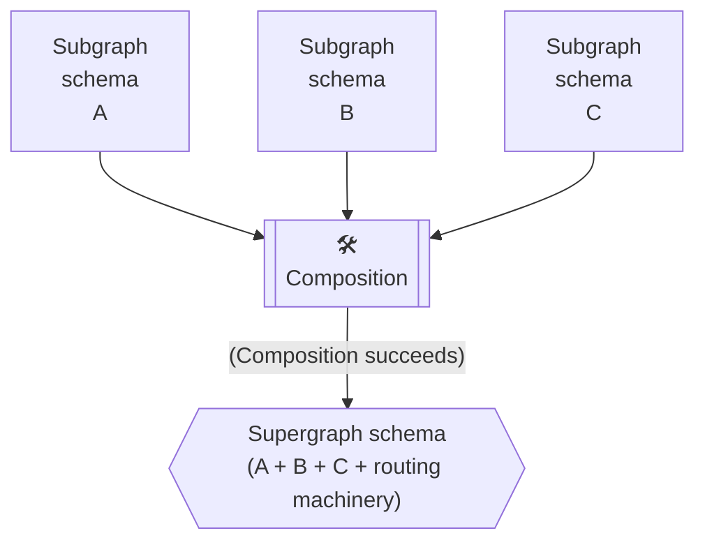

# Source: https://www.apollographql.com/docs/graphos/platform/schema-management/delivery/publishing.md

# Publishing Schemas to GraphOS

Whenever you make changes to a graph's schema, you should publish those changes to GraphOS. Doing so ensures that:

* GraphOS always has an up-to-date understanding of your graph, and subsequently:
  * Your router is updated with the latest schema
  * Clients work with the latest version of your schema

## Publishing methods

GraphOS supports two methods for publishing schemas:

* [Publish using the Rover CLI](https://www.apollographql.com/docs/graphos/platform/schema-management/delivery/publishing/rover)
  * This is the standard way to publish schemas to GraphOS. It is the recommended approach for most users.
* [Publish using the Platform API](https://www.apollographql.com/docs/graphos/platform/schema-management/delivery/publishing/platform-api)
  * This is an advanced option for users who need to integrate schema publishing into custom CI/CD pipelines or automate schema publishing in a more complex way, such as publishing multiple subgraphs at once.

## Supergraphs and monographs

The publication process differs slightly depending on whether you're working with a supergraph or a monograph.

### Publishing subgraph schemas

When working with supergraphs, you typically publish each subgraph's schema individually to GraphOS. For advanced use cases, the Platform API also supports publishing multiple subgraphs simultaneously.

After publishing a subgraph schema, GraphOS attempts to compose all latest versions of your subgraph schemas into a single supergraph schema:

If composition succeeds, your router is updated with the result. This enables clients to request newly added fields and prevents them from requesting removed fields.

### Publishing monograph schemas

For monographs, the publication process is simpler. You simply push your updated schema to GraphOS using a graph ref as the unique identifier.

## Publishing in CI/CD pipelines

To get the most out of GraphOS, you should publish each update to any production schema as soon as it occurs. Consequently, schema publishing should be part of your continuous delivery pipeline.

By incorporating schema publishing into your CI/CD workflow, you can:

* Ensure GraphOS always has the latest schema information
* Automate schema checks and validation
* Maintain consistent deployment practices

## Next steps

For step-by-step instructions on how to implement schema publishing, see:

* [Publish using the Rover CLI](https://www.apollographql.com/docs/graphos/platform/schema-management/delivery/publishing/rover)
* [Publish using the Platform API](https://www.apollographql.com/docs/graphos/platform/schema-management/delivery/publishing/platform-api)

Separately, consider incorporating schema proposals into your schema management workflow to ensure only approved changes are published.
