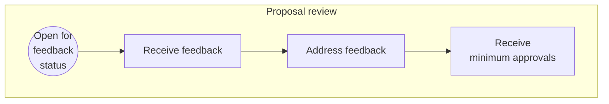

# Source: https://www.apollographql.com/docs/graphos/platform/schema-management/proposals/review.md

# Review Schema Proposals

This article describes actions in the **Proposal review** stage of the [schema proposal workflow](https://www.apollographql.com/docs/graphos/platform/schema-management/proposals#proposal-workflow).

## Review a proposal

Proposal creators and reviewers can review different aspects of a proposal from its non-editor tabs in [GraphOS Studio](https://studio.apollographql.com/?referrer=docs-content).

The **Changes** tab in particular can be helpful for reviewing a proposal.

### Changes

A proposal's **Changes** tab shows both a **Summary** and **Detailed view** of the schema changes that make up a proposal.

* The **Summary** shows the number of objects, interfaces, and other types that changed in the proposal. Each type shows the number of lines added, deleted, and modified.

* The **Detailed view** shows a collapsible diff for each changed type.

You can use the left navigation to view changes for a particular subgraph, or see the changes in the context of the composed [supergraph schema](https://www.apollographql.com/docs/federation/federated-types/overview/#supergraph-schema) or [resulting API schema](https://www.apollographql.com/docs/federation/federated-types/overview/#api-schema).

#### Add comments

You can comment on any line in the detailed view's diff. Hover over the line and click the chat icon that appears.

## Add a review

Once you've reviewed a proposal, click the **Add review** button on the top right of the proposal's overview tab to formalize your review.

A dialog appears where you can leave general commentary and select to approve the proposal.
You can edit your review by clicking the pencil icon next to your name in the list of **Reviewers**.

### Approvals

Once a proposal receives the [minimum number of approvals](https://www.apollographql.com/docs/graphos/delivery/schema-proposals/configuration#required-approvals), its status changes to **Approved**.

Revisions made to an approved proposal don't change the **Approved** status of the proposal.
To set the proposal's status to **Open for feedback** or another status, [manually change it](https://www.apollographql.com/docs/graphos/delivery/schema-proposals/creation#change-proposal-status) from the proposal's overview page.

Once a proposal is approved, your team can begin implementing the approved changes.

Schema proposals—even [approved](https://www.apollographql.com/docs/graphos/delivery/schema-proposals/#proposal-statuses) ones—don't deploy any changes to your graph. Once a proposal is approved, your team must [implement and publish the changes](https://www.apollographql.com/docs/graphos/delivery/schema-proposals/implementation).
