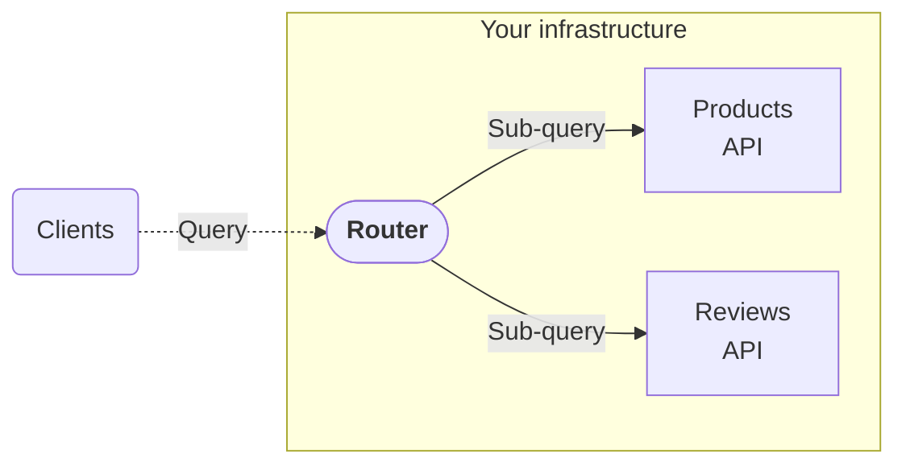

# Source: https://www.apollographql.com/docs/graphos/routing/self-hosted.md

# Self-Hosting the Apollo Router

Apollo Router is a graph runtime that you can deploy in your own infrastructure.

For each version of the Apollo Router, Apollo provides:

* [A Helm chart for Kubernetes](https://www.apollographql.com/docs/graphos/routing/self-hosted.md#kubernetes-using-helm)
* [A Docker image](https://www.apollographql.com/docs/graphos/routing/self-hosted.md#container)
* [A binary](https://www.apollographql.com/docs/graphos/routing/self-hosted.md#local-binary)

For a more detailed look at production deployment workflows for the full supergraph architecture, including blue-green and canary deployments, see [Deployment Best Practices](https://www.apollographql.com/docs/graphos/platform/production-readiness/deployment-best-practices).

If your organization uses a transparent or egress proxy (such as Zscaler or Netskope), [add your proxy's root CA certificate to your container image](https://www.apollographql.com/docs/graphos/routing/self-hosted/containerization/proxy-certificates). Without it, the router can't establish TLS connections to Apollo Uplink, resulting in certificate validation errors or "invalid license" failures.

## Kubernetes

### Apollo GraphOS Operator

Apollo recommends the [Apollo GraphOS Operator](https://www.apollographql.com/docs/apollo-operator/). The Operator provides declarative Kubernetes resources to manage routers, supergraphs, graph schemas, and subgraphs. It simplifies complex multi-service architectures.

The Operator supports [workflow patterns](https://www.apollographql.com/docs/apollo-operator/workflows/) based on your infrastructure:

* Single-cluster setups for simpler deployments
* Multi-cluster and hybrid configurations for distributed services
* Deploy-only patterns for existing CI/CD workflows

### Helm

Helm is a package manager for Kubernetes. Apollo provides a Helm chart with each release of Apollo Router in the GitHub Container Registry. Since router v0.14.0, Apollo has released each router Helm chart as an Open Container Initiative (OCI) image in `oci://ghcr.io/apollographql/helm-charts/router`.

Follow our [Kubernetes quickstart](https://www.apollographql.com/docs/graphos/routing/self-hosted/containerization/kubernetes/quickstart) to deploy the router with a Helm chart.

## Docker

### Apollo Runtime Container (Recommended)

Apollo provides the [Apollo Runtime Container](https://github.com/apollographql/apollo-runtime), which bundles all that's required to run the Apollo Runtime in one place. This includes the Apollo Router and the [Apollo MCP Server](https://www.apollographql.com/docs/apollo-mcp-server).

You can download the images from:

* [Docker Hub](https://hub.docker.com/r/apollograph/apollo-runtime) (recommended)
* [GitHub Container Registry](https://github.com/apollographql/apollo-runtime/pkgs/container/apollo-runtime)

For more information on deploying using your container environment:

* [Docker](https://www.apollographql.com/docs/graphos/routing/self-hosted/containerization/docker)

### Router only container

This image is recommended only for Kubernetes-based deployments, and is used by the [Helm chart](https://www.apollographql.com/docs/router/containerization/kubernetes/). For more information on deploying using your container environment:

* [Docker](https://www.apollographql.com/docs/graphos/routing/self-hosted/containerization/docker-router-only)
* [AWS using Elastic Container Service (ECS)](https://www.apollographql.com/docs/graphos/routing/self-hosted/containerization/aws)
* [Azure using Azure Container App](https://www.apollographql.com/docs/graphos/routing/self-hosted/containerization/azure)
* [GCP using Google Cloud Run](https://www.apollographql.com/docs/graphos/routing/self-hosted/containerization/gcp)

## Local binary

Running the Apollo Router directly from its binary speeds up local development and enables embedded use cases where containers are unavailable.

Follow the [quickstart](https://www.apollographql.com/docs/graphos/routing/get-started) to run a router binary.
