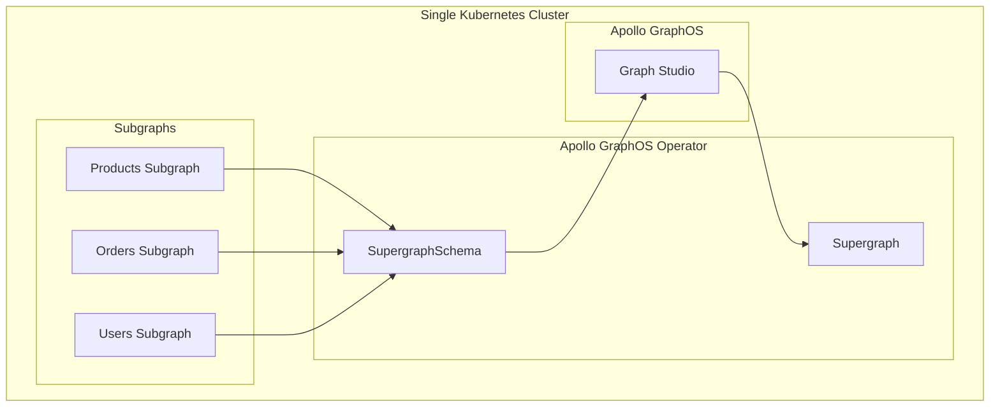

# Source: https://www.apollographql.com/docs/apollo-operator/workflows/single-cluster.md

# Single Cluster Setup

The **Single Cluster Setup** is the most straightforward pattern where all components exist within the same Kubernetes cluster. This pattern leverages the full capabilities of the Apollo GraphOS Operator for automatic subgraph discovery, composition, and deployment.

## How It Works

### The Operator's Role

The Apollo GraphOS Operator performs **Supergraph CI/CD**:

1. **Subgraph Discovery**: Watches Subgraph resources and extracts their schemas and endpoints
2. **Label Selection**: SupergraphSchema uses Kubernetes label selectors to find relevant Subgraphs
3. **Schema Publishing**: Publishes selected subgraph schemas to Apollo GraphOS
4. **Composition**: Apollo GraphOS composes the supergraph schema from all available subgraphs
5. **Deployment**: Fetches the composed schema and deploys it via the Supergraph resource

### Composition Behavior (Cluster Authoritative)

When `partial: false` (the default), the Operator ensures:

* All selected subgraphs must be available in the same cluster for composition
* If subgraphs exist in GraphOS Studio but not in the cluster, the Operator deletes them from GraphOS
* The supergraph deploys with the composed schema from available subgraphs
* Schema changes in any subgraph trigger immediate re-composition

## When to Use This Pattern

**Use this pattern when:**

* All your services run in Kubernetes
* You want the simplest possible setup
* Single team owns the entire stack

## What's Different About This Pattern

**Cluster Authoritative Guarantees**

* The Operator ensures GraphOS Studio reflects the state of the cluster
* Any subgraph not present as a matching Subgraph resource in the cluster is automatically removed from GraphOS Studio
* Guarantees complete supergraph functionality

**Simplified Operations**

* All components in one cluster
* Standard Kubernetes networking
* Unified monitoring and debugging

**Complete Operator Control**

* The Operator manages the entire subgraph-to-supergraph pipeline
* Real-time schema synchronization
* Automatic discovery and deployment
