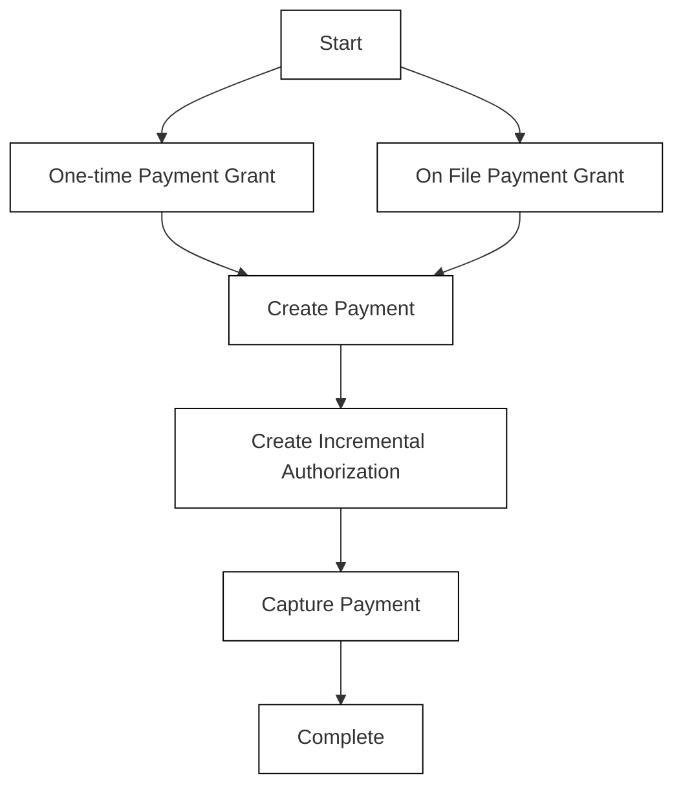

# Source: https://developers.cash.app/cash-app-pay-partner-api/guides/technical-guides/payment-processing/incremental-authorization.mdx

***

## stoplight-id: ctfr5hygduqzw

# Incremental Authorization

Incremental authorization lets merchants request an increase to the authorized amount for a pending Cash App Pay payment. If the payment is eligible and the Cash App customer has additional funds available, Cash App increases the authorization to the higher amount requested by the merchant.

For example, a customer authorizes \$20 for a food delivery order. During fulfillment, they add items worth \$10. Instead of creating a new payment, you can increase the existing authorization to \$30.

<Note>
  To implement incremental authorization, you must use deferred capture (separate authorization and capture steps). Contact the [Cash App Pay Partner Engineering Team](https://afterpay.formstack.com/forms/global_merchant_technical_support) to request access.
</Note>

Incremental authorization is available for both one-time and on file payments.

## Set up incremental authorization

### Step 1: Create a payment authorization

Call the Create Payment endpoint [(/v1/payments)](/cash-app-pay-partner-api/api-reference/network-api/create-payment) to create a payment authorization. Set `capture` to `false`.

### Step 2: Update the payment authorization

Call the Create Incremental Authorization endpoint [(v1/payments/\{payment\_id}/authorizations)](/cash-app-pay-partner-api/api-reference/network-api/create-payment-authorization) with the updated amount. `amount` must be greater than or equal to the current authorized amount, and must follow the limits described above.

When the authorized amount is updated, the customer is notified via email, SMS, or push notification.

### Step 3: Capture payment

Within 7 days of creating the payment authorization, call the Capture Payment endpoint [(/v1/payments/\{payment\_id}/capture)](/cash-app-pay-partner-api/api-reference/network-api/capture-payment) to capture the final payment.

<Note>
  You can also void the payment by calling [/v1/payments/\{payment\_id}/void](/cash-app-pay-partner-api/api-reference/network-api/void-payment).
</Note>

## Limits

* You can incrementally increase the amount up to 10 times per payment
* Authorization increases are limited to \$500 or 500% of the previous amount, whichever is higher
* Increases must be captured within the expiration window of the original payment authorization (default 7 days)
