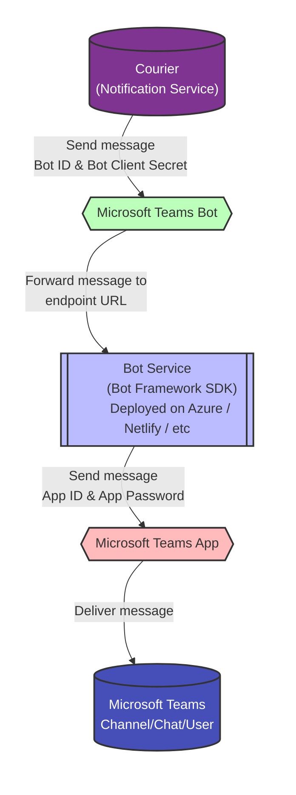

# Source: https://www.courier.com/docs/external-integrations/direct-message/microsoft-teams.md

> ## Documentation Index
> Fetch the complete documentation index at: https://www.courier.com/docs/llms.txt
> Use this file to discover all available pages before exploring further.

# Microsoft Teams

> Integrate Microsoft Teams with Courier by creating a Teams app and bot, configuring scopes, installing it in Teams, linking it in Courier using your Azure Application (client) ID and Client Secret, and optionally enhancing notifications using Adaptive Cards, profile-based targeting, and overrides.

## Overview

This guide provides step-by-step instructions for creating and configuring a Microsoft Teams Application with an associated Bot. The Bot enables Courier to send notifications to Microsoft Teams channels and users.

## Prerequisites

* Access to [Microsoft Teams Developer Portal](https://dev.teams.microsoft.com/)
* [Azure portal](https://portal.azure.com/) access with App Registration permissions
* Administrator privileges for granting API permissions
* [Courier workspace](https://app.courier.com/) access

## Understanding the Microsoft Teams Integration Architecture

Microsoft Teams integration requires **three separate but connected components**:

1. **Azure App Registration** - The parent application that manages authentication
2. **Teams App** - The application that gets installed in Teams
3. **Teams Bot** - The bot component that actually sends messages

**Credential Flow:**

* You'll create **two apps** (one in Azure, one in Teams)
* You'll use **one set of credentials** in Courier (the bot's Azure credentials)
* The Teams app links to the first Azure app, and the bot links to the Teams app

## Step-by-Step Setup

<AccordionGroup>
  <Accordion title="Step 1: Create Teams App">
    1. Navigate to the [Microsoft Teams Developer Portal](https://dev.teams.microsoft.com/).
    2. Click **Create a new app**.

    <Frame caption="Teams App Creation">
      
    </Frame>

    3. Enter a name for your app and click **Add**.

    <Frame caption="Naming the new app">
      
    </Frame>

    <Tip>
      We recommend adding `_app` to your app name to differentiate it clearly from your bot, especially if you manage multiple bots or apps.
    </Tip>

    4. Save the generated **App ID**—you'll need this later.
  </Accordion>

  <Accordion title="Step 2: Create Azure App">
    1. Open the [Azure Portal](https://portal.azure.com/).
    2. Navigate to **Azure Active Directory > App registrations**.

    <Frame caption="Azure App Registration">
      
    </Frame>

    3. Click **New registration**.
    4. Configure the registration:
       * **Name**: Use the same name as your Teams Developer Portal app
       * **Supported account types**: Select **"Accounts in any organizational directory (Any Microsoft Entra ID tenant - Multitenant)"**. The Azure default is single-tenant, which will cause 401 authentication errors with Bot Framework.
       * **Redirect URI**: Keep the default setting

    <Frame caption="Azure App Configuration">
      
    </Frame>

    5. Click **Register**.
    6. Save your **Application (client) ID**—you'll need this later.

    <Frame caption="Grab your Azure AppID">
      
    </Frame>
  </Accordion>

  <Accordion title="Step 3: Link Teams App to Azure App">
    1. Return to the [Microsoft Teams Developer Portal](https://dev.teams.microsoft.com/).
    2. Navigate to **Configure > Basic Information**.
    3. Scroll to the bottom of the page to the **Application (client) ID** field.

    <Frame caption="Teams and Azure app linking">
      
    </Frame>

    4. Paste the Application (client) ID you saved from Step 2.
    5. Click **Save**.

    <Info>
      The Application (client) ID you enter here is from your Azure App Registration (Step 2). This is different from the credentials you'll use in Courier (Step 5), which come from the Bot's Azure App Registration (Step 4).
    </Info>
  </Accordion>

  <Accordion title="Step 4: Create Bot and Configure Permissions">
    1. In the [Microsoft Teams Developer Portal](https://dev.teams.microsoft.com/), navigate to **Tools > Bot Management**.

    <Frame caption="Create new bot for Teams">
      
    </Frame>

    2. Click **+ New Bot** and provide a unique name.

    <Frame caption="Naming your new bot">
      
    </Frame>

    <Tip>
      Use a distinct name for your bot to avoid confusion with your app.
    </Tip>

    3. Return to **Apps > \[Your App Name] > Configure > App Features**
    4. Click the **Bot** item
    5. Select **Select an existing bot**

    <Frame caption="Select your newly created bot">
      
    </Frame>

    6. Choose the bot you just created
    7. Configure the bot settings:
       * Under **What can your bot do?**, select:
         * ✓ Only send notifications (one-way conversations)
       * Under **Select the scopes where people can use your bot**, select:
         * ✓ Personal (for 1:1 notifications)
         * ✓ Team (for channel notifications)
         * ✓ Group Chat (for group chat notifications)

    <Frame caption="Select the scope for your bot">
      
    </Frame>

    8. Click **Save**

    9. **Configure API Permissions** (requires admin):
       * Return to the [Azure Portal](https://portal.azure.com/).
       * Navigate to **App registrations > \[Your Bot Name] > API permissions**
       * Add the following Microsoft Graph permissions as **Application permissions**:
         * `ChannelSettings.Read.All`
         * `TeamSettings.Read.All`
         * `User.Read.All`
       * Request administrator approval by having them click **Grant admin consent for \[your\_domain]**

    <Frame caption="Add API permissions">
      
    </Frame>

    10. **Generate Bot Credentials**:
        * In Azure, navigate to **App registrations > \[Your Bot Name] > Certificates & secrets**
        * Click **+ New client secret**

    <Frame caption="Create a new client secret">
      
    </Frame>

    * Provide a descriptive name and select an expiration period
    * Click **Create**
    * **Important**: Copy and securely store the generated secret value immediately
    * Navigate to the **Overview** section
    * Copy and store the **Application (client) ID** alongside your secret

    <Frame caption="Get the ApplicationID from Azure (i.e. BotID)">
      
    </Frame>
  </Accordion>

  <Accordion title="Step 5: Configure in Courier">
    Now that your Microsoft Teams app is ready, configure it in Courier:

    1. Head to the [Teams Integration](https://app.courier.com/integrations/catalog/msteams) in Courier.
    2. Enter your **Application (client) ID** from Azure and **Client Secret** from Azure, both from Step 4.

    <Frame caption="Add teams to your Courier Account">
      
    </Frame>

    3. Click **Install Provider**.

    <Info>
      Courier's integration requires the Application (client) ID and Client Secret from your Azure Bot App Registration (Step 4), not from the Teams Developer Portal. You can find these at:

      * [Azure Portal](https://portal.azure.com/#view/Microsoft_AAD_IAM/ActiveDirectoryMenuBlade/~/RegisteredApps) > **App registrations > \[Your Bot Name]**: *"Application (client) ID"*
      * [Azure Portal](https://portal.azure.com/#view/Microsoft_AAD_IAM/ActiveDirectoryMenuBlade/~/RegisteredApps) > **App registrations > \[Your Bot Name] > Certificates & secrets**: *"Client secrets"*
    </Info>
  </Accordion>

  <Accordion title="Step 6: Install App and Test">
    **Install the App in Teams:**

    1. Return to [Apps > your app](https://dev.teams.microsoft.com/apps)
    2. Click **Publish**. When prompted, select **"Download the app package"**
       * **Note:** Ensure that you have filled in both short and long app descriptions within the **Configure > Basic information** section, as they are required fields in the app manifest. Your app will fail to install in Teams if these fields are left empty.

    <Frame caption="Publish your app">
      
    </Frame>

    3. Go to [Microsoft Teams](https://teams.microsoft.com/)
    4. Navigate to **Apps** and select **"Manage your apps"** at the bottom

    <Frame caption="Manage your app">
      
    </Frame>

    5. Click **"Upload an app"** and select your downloaded app package

    <Frame caption="Upload your app">
      
    </Frame>

    6. When prompted, click **"Add"**

    <Warning>
      For channel messaging, the app must also be installed in each specific team whose channels you want to message. Uploading the app to Teams only enables personal (1:1) messaging. To install in a team:

      1. In Microsoft Teams, navigate to the target team
      2. Click the **"..."** (ellipsis) next to the team name and select **"Manage team"**
      3. Go to the **"Apps"** tab
      4. Find your app and click **"Add"**

      Without this step, channel messages will fail with a 401 authentication error even if your credentials are correct.
    </Warning>

    7. Courier is now capable of sending messages to channels or members of your Teams

    **Get Channel Identifiers (for testing):**

    1. Enter [Microsoft Teams](https://teams.microsoft.com/)
    2. Hover over one of your channels. You should see an ellipsis icon you can click on. This will expose a menu item called **"Copy link"**. Click this option.
    3. You will see a URL similar to: `https://teams.microsoft.com/l/channel/19%3A5140d7460868414cac958ac76a0a94d0%40thread.skype/slack-teams-test?groupId=feb55fc1-9e00-40f3-93b8-f7d14703f4dd&tenantId=dabd1935-56a4-4305-938e-0840e2e84515`
    4. Paste this string into a URL decoder, such as this one: [https://meyerweb.com/eric/tools/dencoder/](https://meyerweb.com/eric/tools/dencoder/)
    5. Copy the **group ID**. This is the identifier of the team. For example: `feb55fc1-9e00-40f3-93b8-f7d14703f4dd`
    6. Copy the **channel name**. In this example, it will be `slack-teams-test`
    7. Copy the **tenant ID**. In this example, it will be `dabd1935-56a4-4305-938e-0840e2e84515`

    <Frame caption="Get channel name">
      
    </Frame>

    **Send Test Message:**

    1. Return to [Courier](https://app.courier.com/assets/templates) and create a new template.
    2. Select the Teams integration provider we created earlier in Step 5
    3. In the **"Design"** tab, create a basic text message. Refer to our [Content Documentation](/platform/content/content-overview) if you need to learn how to use the designer.
    4. Click on the **Preview** tab. Create a **"Test event"**, which is a request you can use to send a message.
    5. Click **"Create test event"** and enter the following (make sure to use your own field values):

    ```json TestEvent theme={null}
    {
      "courier": {},
      "data": {},
      "profile": {
        "ms_teams": {
          "team_id": "feb55fc1-9e00-40f3-93b8-f7d14703f4dd",
          "channel_name": "slack-teams-test",
          "tenant_id": "dabd1935-56a4-4305-938e-0840e2e84515",
          "service_url": "https://smba.trafficmanager.net/amer"
        }
      },
      "override": {},
      "meta": {}
    }
    ```

    6. Click **"Publish"**
    7. Navigate to the **Send** tab. Click **"Send Test"**
    8. Success!
  </Accordion>
</AccordionGroup>

Congratulations! You've successfully created a Microsoft Teams Bot and configured it in Courier. You can now send notifications to Microsoft Teams channels and users.

## Profile Requirements

To send notifications to Microsoft Teams, Courier requires the recipient's user profile to include an `ms_teams` object. This object must contain the following fields:

* `tenant_id`: Your Microsoft Teams tenant ID.
* `service_url`: The service URL for your region (e.g., `https://smba.trafficmanager.net/amer`).
* One of the following identifiers:
  * `user_id`
  * `email`
  * `conversation_id`
  * Combination of `team_id` and `channel_name`
  * Thread reply fields: `reply_to_activity_id` and `conversation_id`

<CodeGroup>
  ```json user_id theme={null}
  {
    "message": {
      "to": {
        "ms_teams": {
          "user_id": "<user_id>",
          "tenant_id": "<tenant_id>",
          "service_url": "https://smba.trafficmanager.net/amer"
        }
      }
    }
  }
  ```

  ```json email theme={null}
  {
    "message": {
      "to": {
        "ms_teams": {
          "email": "<user_email>",
          "tenant_id": "<tenant_id>",
          "service_url": "https://smba.trafficmanager.net/amer"
        }
      }
    }
  }
  ```

  ```json conversation_id theme={null}
  {
    "message": {
      "to": {
        "ms_teams": {
          "conversation_id": "<conversation_id>",
          "tenant_id": "<tenant_id>",
          "service_url": "https://smba.trafficmanager.net/amer"
        }
      }
    }
  }
  ```

  ```json team_id+channel_name theme={null}
  {
    "message": {
      "to": {
        "ms_teams": {
          "team_id": "<team_id>",
          "channel_name": "<channel_name>",
          "tenant_id": "<tenant_id>",
          "service_url": "https://smba.trafficmanager.net/amer"
        }
      }
    }
  }
  ```

  ```json thread_reply theme={null}
  {
    "message": {
      "to": {
        "ms_teams": {
          "reply_to_activity_id": "<activity_id>",
          "conversation_id": "<conversation_id>",
          "tenant_id": "<tenant_id>",
          "service_url": "https://smba.trafficmanager.net/amer"
        }
      }
    }
  }
  ```
</CodeGroup>

<Info>
  To find your `tenant_id`, navigate to [https://teams.microsoft.com/?tenantId](https://teams.microsoft.com/?tenantId) and copy the `tenantId` query parameter from the redirected URL. If the parameter isn't visible, click the three-dot menu next to your Team, select **Get link to team**, and locate the `tenantId` in the URL.

  <Frame>
    
  </Frame>
</Info>

<Info>
  For users in the Americas region, the standard service URL is `https://smba.trafficmanager.net/amer`.
</Info>

<Info>
  To send messages using either `email` or `channel_name`, your bot must have the following Microsoft Graph API permissions:

  * `ChannelSettings.Read.All` (requires admin consent)
  * `TeamSettings.Read.All` (requires admin consent)
  * `User.Read.All`

  These permissions allow Courier to resolve the `user_id` or `channel_id` using the Microsoft Graph API.
</Info>

### Using a tenant\_id

`tenant_id` now conditionally required based on operation type. Now only required for the following operations:

* send directly to a user when `user_id` is provided
* send directly to a user when `email` is provided
* send to a channel when only a channel name is provided, requiring lookup of channel id from channel name

`tenant_id` extraction from service\_url path segments (can be either specified on service\_url, or as a body param, or both (but only if they are the same value)

```bash  theme={null}
service_url: https://smba.trafficmanager.net/amer/{tenant_id}
tenant_id: {tenant_id}
```

<Info>
  `tenant_id` is only placed on `provider:sent` and `provider:delivered` event payloads if it is included in the request, as that is the only time it will be known. You should be able to respond to messages even if tenant\_id is not known -- it is not needed for this action.
</Info>

## Thread Replies

Courier's Microsoft Teams integration supports thread replies, allowing messages to be posted as replies to existing messages in channels rather than as new root-level messages. When Courier sends a message to Microsoft Teams, the Bot Framework returns reference data including an `activityId` and `conversationId` in the `provider:sent` event. This reference data can be used to reply to that specific message in a threaded conversation.

### Thread Reply Overview

**The Flow:**

1. Send a root-level message to any Teams channel
2. Look up the sent event (via API, webhook, or Courier UI) to get the `activityId` and `conversationId`
3. Use those identifiers to send channel thread replies

<Info>
  **Important Notes:**

  * **Channel Threading Only**: Thread replies are only supported in Teams channels, not in personal (1:1) conversations or group chats due to Microsoft Teams platform limitations.
  * **Works in All Channel Types**: Thread replies work in standard channels, private channels, and shared channels.
  * **Reference Data Required**: You need the `activityId` and `conversationId` from a previous message's `provider:sent` event.
  * **Threading Validation**: Courier validates thread reply configurations and provides clear error messages for invalid field combinations.
</Info>

**Example Workflow**

1. **Send Initial Message:**

```json  theme={null}
{
  "message": {
    "to": {
      "ms_teams": {
        "tenant_id": "your-tenant-id",
        "service_url": "https://smba.trafficmanager.net/amer",
        "team_id": "feb55fc1-9e00-40f3-93b8-f7d14703f4dd",
        "channel_name": "general"
      }
    },
    "content": {
      "title": "Investigation Started",
      "body": "We're looking into the reported issue."
    }
  }
}
```

2. **Get Reference Data from provider:sent Event:**

The `provider:sent` event contains the reference data you need. You can access this through:

* **Courier API**: Query message details to get the `provider:sent` event data
* **Courier UI**: View message details in the Messages section of your dashboard
* **Webhooks** (if configured): Receive reference data automatically when messages are sent

Example reference data from the `provider:sent` event:

```json  theme={null}
{
  "reference": {
    "activityId": "1756945821955",
    "conversationId": "19:a52e21710de34c65b9f2e09ededaad2a@thread.skype"
  }
}
```

3. **Send Thread Reply:**

```json  theme={null}
{
  "message": {
    "to": {
      "ms_teams": {
        "tenant_id": "your-tenant-id",
        "service_url": "https://smba.trafficmanager.net/amer",
        "reply_to_activity_id": "1756945821955",
        "conversation_id": "19:a52e21710de34c65b9f2e09ededaad2a@thread.skype"
      }
    },
    "content": {
      "title": "Update",
      "body": "Issue has been identified and fix is being deployed."
    }
  }
}
```

### Thread Reply Configuration

**Getting Reference Data**

Reference data is available through multiple channels:

1. **Courier API**
   Query message details using Courier's API to retrieve the reference data from the message logs.

2. **Courier UI (Messages Log)**
   Navigate to your Courier dashboard and view the message details in the Messages section. The `provider:sent` log will contain the reference data.

3. **Webhook Delivery (Optional)**
   If you have webhooks configured, Courier automatically delivers reference data when messages are sent:

```json  theme={null}
{
  "type": "message:updated",
  "data": {
    "id": "1-61f9dd53-b5c6969eb23c4aad6fce2ef7",
    "status": "SENT",
    "providers": {
      "msteams": {
        "reference": {
          "activityId": "1756945821955",
          "conversationId": "19:a52e21710de34c65b9f2e09ededaad2a@thread.skype"
        }
      }
    }
  }
}
```

**Thread Reply Requirements**

For thread replies to work properly:

1. **Required Fields:**
   * `reply_to_activity_id`: The activity ID from the original message's reference data
   * `conversation_id`: The conversation ID from the original message's reference data
   * `tenant_id`: Your Microsoft Teams tenant ID
   * `service_url`: Your Teams service URL (optional, uses default if not provided)

2. **Field Restrictions:**
   When using `reply_to_activity_id`, you **cannot** include:
   * `channel_id` or `channel_name` + `team_id` (channel targeting fields)
   * `user_id` or `email` (user targeting fields)
   The `conversation_id` determines the thread location automatically.

**Error Handling**

Common threading errors and their solutions:

* **"Thread replies require 'conversation\_id'"**: Include the `conversation_id` from the original message's reference data.
* **"Thread replies cannot use channel targeting fields"**: Remove `channel_id`, `channel_name`, and `team_id` when using `reply_to_activity_id`.
* **"Thread replies cannot use user targeting fields"**: Remove `user_id` and `email` when using `reply_to_activity_id`.

<Info>
  When using threading fields, do not include channel targeting (`team_id`, `channel_name`, `channel_id`) or user targeting (`user_id`, `email`) fields, as the `conversation_id` determines the message destination.
</Info>

## Microsoft Teams Channel ID Reference

When sending messages to a Teams channel through Courier, the `conversationId` returned in delivered event webhooks is the channel ID. They are the same value.

### Understanding the Relationship

In Microsoft Teams Bot Framework, a channel's identifier serves as its conversation ID. When you send a message to a channel, you're posting to a conversation that represents that channel. The Bot Framework returns this conversation identifier in the response, which Courier surfaces as `conversation_context.conversationId` in delivered event webhooks.

### Sending an Initial Message

```sh  theme={null}
curl --request POST \
  --url https://api.courier.com/send \
  --header 'Authorization: Bearer <YOUR_AUTH_TOKEN>' \
  --header 'Content-Type: application/json' \
  --data '{
    "message": {
      "to": {
        "ms_teams": {
          "team_id": "feb55fc1-9e00-40f3-93b8-f7d14703f4dd",
          "channel_name": "General",
          "tenant_id": "dabd1935-56a4-4305-938e-0840e2e84515",
          "service_url": "https://smba.trafficmanager.net/amer"
        }
      },
      "content": {
        "title": "Investigation Started",
        "body": "Security team has initiated an investigation into the incident."
      }
    }
}'
```

The delivered event webhook contains:

```json  theme={null}
{
  "id": "1759342992794",
  "conversation_context": {
    "activityId": "1759342992794",
    "conversationId": "19:a52e21710de34c65b9f2e09ededaad2a@thread.skype"
  }
}
```

The `conversationId` value `19:a52e21710de34c65b9f2e09ededaad2a@thread.skype` is the channel ID for the "General" channel.

### Replying in a Thread

To reply to this message, use both the `activityId` and `conversationId` from the webhook:

```sh  theme={null}
curl --request POST \
  --url https://api.courier.com/send \
  --header 'Authorization: Bearer <YOUR_AUTH_TOKEN>' \
  --header 'Content-Type: application/json' \
  --data '{
    "message": {
      "to": {
        "ms_teams": {
          "reply_to_activity_id": "1759342992794",
          "conversation_id": "19:a52e21710de34c65b9f2e09ededaad2a@thread.skype",
          "tenant_id": "dabd1935-56a4-4305-938e-0840e2e84515",
          "service_url": "https://smba.trafficmanager.net/amer"
        }
      },
      "content": {
        "title": "Update",
        "body": "Initial analysis shows no signs of compromise."
      }
    }
}'
```

The reply's delivered event maintains the same `conversationId`:

```json  theme={null}
{
  "id": "1759343317452",
  "conversation_context": {
    "activityId": "1759343317452",
    "conversationId": "19:a52e21710de34c65b9f2e09ededaad2a@thread.skype"
  }
}
```

Throughout an entire thread, the `conversationId` remains constant because it represents the channel itself. Only the `activityId` changes with each new message.

### Getting Channel IDs Directly from Teams

You can obtain a channel ID directly from the Teams application without sending a message first. Navigate to the Teams web app at [https://teams.microsoft.com/v2/](https://teams.microsoft.com/v2/), select your target channel, and click the ellipsis (⋯) icon in the upper right corner. Choose "Get link to channel" to copy a URL like:

```
https://teams.microsoft.com/l/channel/19%3Aa52e21710de34c65b9f2e09ededaad2a%40thread.skype/General?groupId=feb55fc1-9e00-40f3-93b8-f7d14703f4dd&tenantId=dabd1935-56a4-4305-938e-0840e2e84515
```

The channel ID appears after `/channel/` in URL-encoded format. Decode `19%3Aa52e21710de34c65b9f2e09ededaad2a%40thread.skype` to get `19:a52e21710de34c65b9f2e09ededaad2a@thread.skype`.

### Sending Directly with conversation\_id

When you know the channel ID upfront, you can send messages using `conversation_id` instead of looking up the channel by name:

```sh  theme={null}
curl --request POST \
  --url https://api.courier.com/send \
  --header 'Authorization: Bearer <YOUR_AUTH_TOKEN>' \
  --header 'Content-Type: application/json' \
  --data '{
    "message": {
      "to": {
        "ms_teams": {
          "conversation_id": "19:a52e21710de34c65b9f2e09ededaad2a@thread.skype",
          "tenant_id": "dabd1935-56a4-4305-938e-0840e2e84515",
          "service_url": "https://smba.trafficmanager.net/amer"
        }
      },
      "content": {
        "title": "Direct Channel Message",
        "body": "Sent using the channel ID directly as conversation_id."
      }
    }
}'
```

This approach skips the Graph API lookup for channel name resolution, making it more performant. The webhook still returns the same `conversationId` because it's already the channel ID.

### Technical Details

Channel IDs in Microsoft Teams follow the format `19:{guid}@thread.skype` or `19:{guid}@thread.tacv2` depending on the Teams infrastructure version. These identifiers are stable and unique per channel within a tenant. When combined with `tenantId`, they globally identify a specific channel.

The Bot Framework uses these channel IDs as conversation identifiers when posting to channels. Thread replies require both the `conversationId` (channel ID) and the `reply_to_activity_id` (the message being replied to). The URL construction for threaded replies uses a special format `{conversationId};messageid={activityId}`, but the stored `conversationId` in the response remains just the channel ID without any suffix.

For more information on Microsoft Teams integration with Courier, see [https://www.courier.com/docs/external-integrations/direct-message/microsoft-teams](https://www.courier.com/docs/external-integrations/direct-message/microsoft-teams)

## Advanced Features

### Overrides

Overrides allow you to change the Azure Bot's App ID and App Password directly within your Courier message payload:

```json  theme={null}
{
  "message": {
    [...],
    "providers": {
      "msteams": {
        "override": {
          "config": {
            "appId": "<App ID>",
            "appPassword": "<App Password>"
          }
        }
      }
    }
  }
}
```

### Adaptive Cards

Courier supports Microsoft Teams [Adaptive Cards](https://adaptivecards.io/) through Jsonnet blocks within the Template Designer. Adaptive Cards let you create interactive, visually appealing notifications for your users in Microsoft Teams.

#### Using Jsonnet Blocks

Jsonnet blocks enable you to customize the appearance and functionality of Adaptive Cards sent through Microsoft Teams. Follow the steps below to create and send your first Adaptive Card:

1. In Courier's Template Designer, add a new Microsoft Teams channel.
2. Insert a Jsonnet block within your message.

<Frame caption="Jsonnet Block">
  
</Frame>

3. Open the [Adaptive Cards Designer](https://adaptivecards.io/designer/) and select or create a card layout.
4. Copy the card JSON from the "Card Payload Editor" into your Courier Jsonnet block.

<Frame caption="Sample Jsonnet">
  
</Frame>

#### Sending an Adaptive Card

When sending your Adaptive Card, ensure your Courier message includes the necessary sample data from the Adaptive Cards Designer:

```json  theme={null}
{
  "message": {
    "to": {
      "user_id": "QUICKSTART_USER"
    },
    "template": "TGAV18XGBAM565JHKFZY3SJYZB52",
    "data": {
      "title": "Publish Adaptive Card Schema",
      "description": "Now that we have defined the main rules and features of the format, we need to produce a schema and publish it to GitHub. The schema will be the starting point of our reference documentation.",
      "creator": {
        "name": "Matt Hidinger",
        "profileImage": "https://pbs.twimg.com/profile_images/3647943215/d7f12830b3c17a5a9e4afcc370e3a37e_400x400.jpeg"
      },
      "createdUtc": "2017-02-14T06:08:39Z",
      "viewUrl": "https://adaptivecards.io",
      "properties": [
        {"key": "Board", "value": "Adaptive Cards"},
        {"key": "List", "value": "Backlog"},
        {"key": "Assigned to", "value": "Matt Hidinger"},
        {"key": "Due date", "value": "Not set"}
      ]
    }
  }
}
```

Ensure your recipient profile includes a valid `ms_teams` object with the appropriate fields (e.g., `conversation_id`). Once sent, your Adaptive Card will appear in Microsoft Teams:

<Frame caption="MS Teams Adaptive Card">
  
</Frame>

Congratulations, you've successfully sent an Adaptive Card through Courier!

#### Using @Mentions in Adaptive Cards

To include mentions in Adaptive Cards, you'll need two key elements:

* `<at>username</at>` within the Jsonnet block.
* A corresponding `entities` object within the Adaptive Card JSON payload, including the Teams user ID of the mentioned individual.

Here's a sample mention:

```json  theme={null}
{
  "msteams": {
    "entities": [
      {
        "type": "mention",
        "text": "<at>John Doe</at>",
        "mentioned": {
          "id": "29:123124124124",
          "name": "John Doe"
        }
      }
    ]
  }
}
```

Now you're ready to enhance your Microsoft Teams notifications with interactive Adaptive Cards and mentions.

## Troubleshooting

### 401 Authentication Error

If you see `All Bot Framework authentication methods failed` with status code 401:

1. **App not installed in the team (channel messages only)**: Uploading the app to Teams enables personal messaging, but for channel messaging the app must be installed in each specific team. See Step 6 for instructions. This is the most common cause when user messages succeed but channel messages fail.
2. **Wrong credentials in Courier**: Courier requires the Application (client) ID and Client Secret from the Azure **Bot** App Registration (Step 4), not the Teams App ID from the Developer Portal (Step 1). These are different values.
3. **Single-tenant App Registration**: In Azure Portal > App registrations > \[Your Bot] > Authentication, ensure "Supported account types" is set to "Accounts in any organizational directory" (Multitenant). The Azure default is single-tenant, which breaks Bot Framework authentication.
4. **Expired client secret**: Navigate to Azure Portal > App registrations > \[Your Bot] > Certificates & secrets and check the expiration date. If expired, create a new secret and update it in Courier's Teams integration settings.
5. **Missing `tenant_id`**: Ensure your message profile includes `tenant_id` in the `ms_teams` object. Without it, tenant-scoped authentication cannot be attempted.

### Messages to Users Work but Channel Messages Fail

This almost always means the app is not installed in the team that owns the target channel. See item 1 above and Step 6 for installation instructions.

### Credential Confusion Between Azure App Registrations

The setup process creates two Azure App Registrations:

* **Step 2 App Registration**: Used in the Teams Developer Portal configuration (Step 3). This is the parent application.
* **Step 4 Bot App Registration**: Used in Courier's integration settings (Step 5). This provides the bot credentials.

If you're unsure which credentials to use where, check the Info callouts in Steps 3 and 5.

## Reference: Courier → Recipient Flowchart


