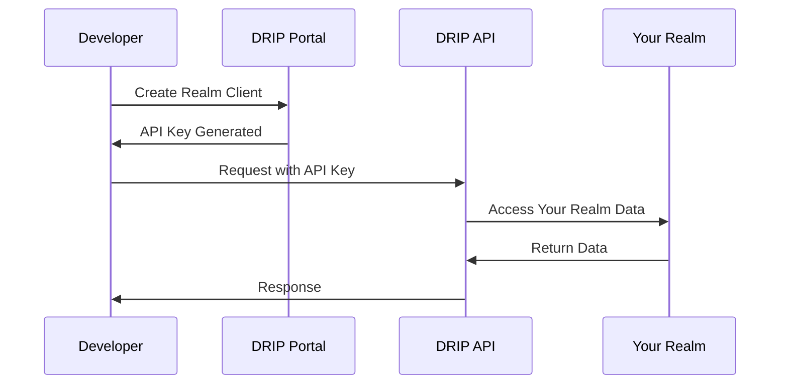
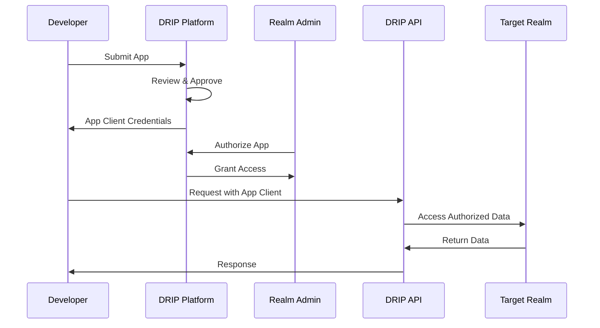

# Source: https://docs.drip.re/developer/api-clients.md

> ## Documentation Index
>
> Fetch the complete documentation index at: https://docs.drip.re/llms.txt
> Use this file to discover all available pages before exploring further.

# API Client Types

> Understanding Realm vs App clients and how to manage them

DRIP supports two distinct types of API clients, each designed for different use cases. Understanding the difference is crucial for choosing the right approach for your integration.

## Client Type Overview

<CardGroup cols={2}>
  <Card title="Realm Clients" icon="castle">
    **Purpose**: Direct access to your own realm\
    **Scope**: Single realm only\
    **Authorization**: Automatic access to your realm\
    **Best for**: Internal tools, custom dashboards, automation
  </Card>

  <Card title="App Clients" icon="globe">
    **Purpose**: Multi-realm applications\
    **Scope**: Multiple realms with explicit authorization\
    **Authorization**: Publish + per-realm authorization\
    **Best for**: Third-party integrations, marketplace apps
  </Card>
</CardGroup>

## When to Use Each Type

### Use Realm Clients When

* Building tools for your own community only
* Creating internal dashboards or analytics
* Automating tasks within your realm
* Developing custom member management tools
* You need immediate access without approval processes

### Use App Clients When

* Building apps for multiple communities
* Creating marketplace applications
* Developing SaaS tools for DRIP communities
* Building integrations that other realms can install
* You want to distribute your app publicly

## Creating API Clients

### Creating a Realm Client

<Steps>
  <Step title="Access Developer Portal">
    Navigate to **Admin** → **Developer** in your DRIP dashboard
  </Step>

  <Step title="Go to Project API">
    Click the **Project API** tab
  </Step>

  <Step title="Create Client">
    Click **Create API Client** and configure:

    * **Name**: Descriptive name for your integration
    * **Scopes**: Select the permissions you need
  </Step>

  <Step title="Save Credentials">
    Copy and securely store your **Client Secret** (this is your API key)
  </Step>
</Steps>

### Creating an App Client

<Steps>
  <Step title="Access Developer Portal">
    Navigate to **Admin** → **Developer** in your DRIP dashboard
  </Step>

  <Step title="Go to DRIP Apps">
    Click the **DRIP Apps** tab
  </Step>

  <Step title="Set up New App">
    In the **Listing** section, you can set up your app metadata (name, description, logo)
  </Step>

  <Step title="Get App Client">
    In the **App Client** section, you can set up your app client credentials
  </Step>

  <Step title="Submit App">
    Once your app is ready, you can publish it to the DRIP Apps marketplace
  </Step>

  <Step title="Wait for Approval">
    DRIP reviews your app for security and compliance
  </Step>
</Steps>

## Scope Management

### Understanding Scopes

Scopes define what your client can access and modify.

<Info>
  For apps: you select the scopes your app needs. Realms/projects grant those scopes when they authorize your app. If you later change your app’s requested scopes, realms must reauthorize for the new scopes to take effect.
</Info>

#### Basic Scopes

```javascript  theme={"dark"}
const basicScopes = [
  'realm:read',           // Read realm information
  'members:read',         // Read member profiles
  'quests:read',          // Read quest data
  'store:read',           // Read store items
];
```

#### Advanced Scopes

```javascript  theme={"dark"}
const advancedScopes = [
  'members:write',        // Modify member data
  'points:write',         // Award/deduct points
  'quests:write',         // Create/modify quests
  'store:write',          // Manage store items
];
```

### Scope Selection Best Practices

<AccordionGroup>
  <Accordion title="Principle of Least Privilege">
    Only request scopes you actually need. This improves security and increases approval chances.

    ```javascript  theme={"dark"}
    // ❌ Bad: Requesting unnecessary scopes
    const badScopes = ['realm:read', 'members:read', 'members:write', 'admin:read'];

    // ✅ Good: Only what you need
    const goodScopes = ['realm:read', 'members:read']; // For read-only analytics
    ```
  </Accordion>

  <Accordion title="Start Small, Expand Later">
    Begin with basic scopes and add more as your app grows.

    ```javascript  theme={"dark"}
    // Phase 1: Read-only analytics
    const phase1Scopes = ['realm:read', 'members:read'];

    // Phase 2: Add point management
    const phase2Scopes = [...phase1Scopes, 'points:write'];

    // Phase 3: Add quest creation
    const phase3Scopes = [...phase2Scopes, 'quests:write'];
    ```
  </Accordion>
</AccordionGroup>

## Authorization Flows

### Realm Client Flow



**Characteristics:**

* ✅ Immediate access
* ✅ No approval delays
* ✅ Full permissions within your realm
* ❌ Limited to single realm
* ❌ Can't be distributed to other realms

### App Client Flow



**Characteristics:**

* ✅ Multi-realm capability
* ✅ Can be distributed publicly
* ✅ Scalable business model
* ❌ Requires platform approval
* ❌ Each realm must authorize separately
* ❌ Limited to approved scopes only

## Managing Multiple Clients

### Client Organization

```javascript  theme={"dark"}
class DripClientManager {
  constructor() {
    this.clients = new Map();
  }

  // Add a realm client
  addRealmClient(name, apiKey, realmId) {
    this.clients.set(name, {
      type: 'realm',
      client: new DripClient(apiKey, realmId),
      realmId
    });
  }

  // Add an app client
  addAppClient(name, appClientSecret) {
    this.clients.set(name, {
      type: 'app',
      client: new DripAppClient(appClientSecret),
      authorizedRealms: []
    });
  }

  // Get client by name
  getClient(name) {
    return this.clients.get(name);
  }

  // List all clients
  listClients() {
    return Array.from(this.clients.entries()).map(([name, config]) => ({
      name,
      type: config.type,
      realmId: config.realmId || 'multiple'
    }));
  }
}

// Usage
const manager = new DripClientManager();
manager.addRealmClient('analytics', 'realm_api_key', 'realm_id');
manager.addAppClient('marketplace-app', 'app_client_secret');
```

### Environment-Based Configuration

```javascript  theme={"dark"}
// config/clients.js
const clients = {
  development: {
    realm: {
      apiKey: process.env.DEV_REALM_API_KEY,
      realmId: process.env.DEV_REALM_ID
    },
    app: {
      clientSecret: process.env.DEV_APP_CLIENT_SECRET
    }
  },
  production: {
    realm: {
      apiKey: process.env.PROD_REALM_API_KEY,
      realmId: process.env.PROD_REALM_ID
    },
    app: {
      clientSecret: process.env.PROD_APP_CLIENT_SECRET
    }
  }
};

const env = process.env.NODE_ENV || 'development';
export const realmClient = new DripClient(
  clients[env].realm.apiKey,
  clients[env].realm.realmId
);
export const appClient = new DripAppClient(
  clients[env].app.clientSecret
);
```

## Security Best Practices

### API Key Management

<CardGroup cols={2}>
  <Card title="Secure Storage" icon="vault">
    * Store keys in environment variables
    * Use secure key management services
    * Never commit keys to version control
    * Rotate keys regularly
  </Card>

  <Card title="Access Control" icon="lock">
    * Use least-privilege scopes
    * Monitor API key usage
    * Set up usage alerts
    * Revoke unused keys immediately
  </Card>
</CardGroup>

### Code Examples

```javascript  theme={"dark"}
// ✅ Good: Environment variables
const client = new DripClient(
  process.env.DRIP_API_KEY,
  process.env.DRIP_REALM_ID
);

// ❌ Bad: Hardcoded keys
const client = new DripClient(
  'drip_1234567890abcdef',
  '507f1f77bcf86cd799439011'
);

// ✅ Good: Key rotation support
class SecureDripClient extends DripClient {
  async rotateKey(newApiKey) {
    // Test new key first
    const testClient = new DripClient(newApiKey, this.realmId);
    await testClient.request('GET', `/realms/${this.realmId}`);
    
    // If successful, update
    this.apiKey = newApiKey;
    console.log('API key rotated successfully');
  }
}
```

## Monitoring and Analytics

### Usage Tracking

```javascript  theme={"dark"}
class MonitoredDripClient extends DripClient {
  constructor(apiKey, realmId) {
    super(apiKey, realmId);
    this.stats = {
      requests: 0,
      errors: 0,
      lastUsed: null
    };
  }

  async request(method, endpoint, data) {
    this.stats.requests++;
    this.stats.lastUsed = new Date();
    
    try {
      const result = await super.request(method, endpoint, data);
      return result;
    } catch (error) {
      this.stats.errors++;
      throw error;
    }
  }

  getStats() {
    return {
      ...this.stats,
      errorRate: this.stats.errors / this.stats.requests,
      isActive: Date.now() - this.stats.lastUsed < 300000 // 5 minutes
    };
  }
}
```

## Migration Strategies

### From Realm to App Client

If you started with a realm client and want to expand to multiple realms:

<Steps>
  <Step title="Create App">
    Submit your app through the DRIP Apps portal
  </Step>

  <Step title="Parallel Development">
    Develop app client integration alongside existing realm client
  </Step>

  <Step title="Testing">
    Test app client with your own realm first
  </Step>

  <Step title="Gradual Migration">
    Migrate features one by one from realm client to app client
  </Step>

  <Step title="Deprecation">
    Once fully migrated, deprecate the realm client
  </Step>
</Steps>

### Code Migration Example

```javascript  theme={"dark"}
// Before: Realm client
class RealmIntegration {
  constructor(apiKey, realmId) {
    this.client = new DripClient(apiKey, realmId);
  }

  async getLeaderboard() {
    return this.client.getLeaderboard();
  }
}

// After: App client supporting multiple realms
class AppIntegration {
  constructor(appClientSecret) {
    this.client = new DripAppClient(appClientSecret);
    this.authorizedRealms = new Map();
  }

  async getLeaderboard(realmId) {
    if (!this.authorizedRealms.has(realmId)) {
      throw new Error('Not authorized for this realm');
    }
    return this.client.getLeaderboard(realmId);
  }

  async loadAuthorizedRealms() {
    const realms = await this.client.getAuthorizedRealms();
    realms.forEach(realm => {
      this.authorizedRealms.set(realm.realmId, realm);
    });
  }
}
```

## Next Steps

<CardGroup cols={2}>
  <Card title="Build Your First App" icon="rocket" href="/developer/first-app">
    Create a simple application using your API client
  </Card>

  <Card title="Multi-Realm Apps" icon="globe" href="/developer/multi-realm-apps">
    Learn to build apps that work across multiple communities
  </Card>

  <Card title="Authentication Guide" icon="key" href="/developer/authentication">
    Deep dive into authentication and security
  </Card>

  <Card title="API Reference" icon="book" href="/api-reference">
    Complete documentation of all available endpoints
  </Card>
</CardGroup>

Built with [Mintlify](https://mintlify.com).
