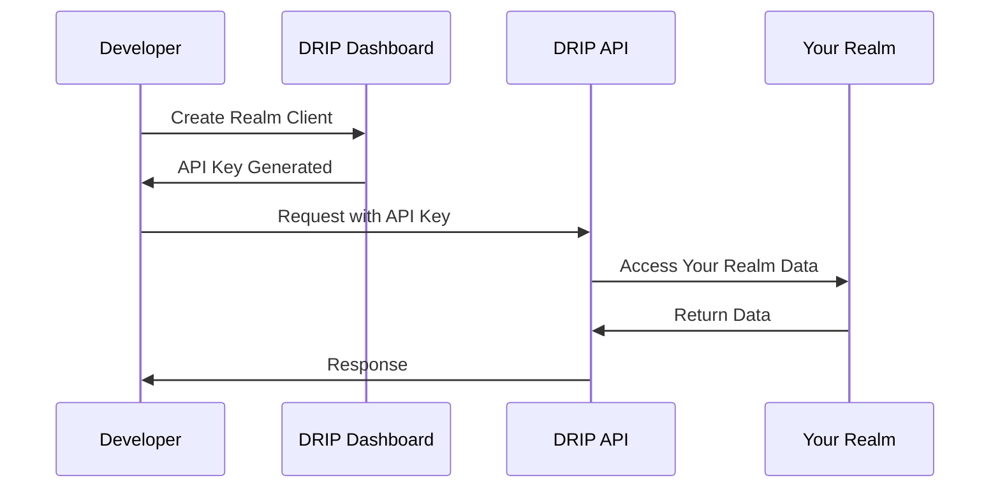

# Source: https://docs.drip.re/developer/app-development.md

> ## Documentation Index
>
> Fetch the complete documentation index at: https://docs.drip.re/llms.txt
> Use this file to discover all available pages before exploring further.

# App Development

> Build apps and integrations for your own realm. Compare client types and get started quickly with a Realm API Client. For multi-realm app keys and scopes, see Multi-Realm Apps.

Learn how to build applications and integrations on DRIP for your own realm. This guide covers the general development flow for Realm Clients and links out to multi-realm app development when you need it.

## Overview

DRIP supports two types of integrations:

### Realm Clients (Direct Integration)

* **Purpose**: Direct access to your own realm's data
* **Scope**: Single realm only
* **Use case**: Custom dashboards, internal tools, automation scripts
* **Authorization**: Scoped to your realm automatically

### App Clients (Multi-Realm Apps)

* **Purpose**: Build applications that can be used by multiple communities
* **Scope**: Can access multiple realms with their permission
* **Use case**: Third-party integrations, marketplace apps, SaaS tools
* **Authorization**: Each realm must explicitly authorize your app

<Info>
  This guide focuses on **Realm Clients** for single-realm development. For app keys, cross-realm authorization, and scopes, see [Multi-Realm Apps](/developer/multi-realm-apps).
</Info>

## Using a Realm API Client

For most internal tools and single-realm integrations, use a Realm API Client. It has immediate access to your own realm and is the fastest way to build.

<Steps>
  <Step title="Create a Realm Client">
    Go to **Admin** > **Developer** > **Project API** and create an API client. Select only the scopes you need (e.g., `realm:read`, `members:read`).
  </Step>

  <Step title="Find Your Realm (Project) ID">
    When a project is selected in the dashboard, the Realm/Project ID appears in the header.
  </Step>

  <Step title="Make Your First Call">
    Use your API key (Client Secret) to call the API for your realm.
  </Step>
</Steps>

<CodeGroup>
  ```javascript JavaScript theme={"dark"}
  const API_BASE = 'https://api.drip.re/api/v1';
  const API_KEY = process.env.DRIP_API_KEY; // Store securely
  const REALM_ID = process.env.DRIP_REALM_ID;

  async function getMembers() {
    const res = await fetch(`${API_BASE}/realm/${REALM_ID}/members/search?type=drip-id&values=all`, {
      headers: {
        Authorization: `Bearer ${API_KEY}`,
        'Content-Type': 'application/json'
      }
    });
    if (!res.ok) throw new Error(`HTTP ${res.status}`);
    const data = await res.json();
    return data.data;
  }

  ```

  ```python Python theme={"dark"}
  import os, requests
  API_BASE = 'https://api.drip.re/api/v1'
  API_KEY = os.environ['DRIP_API_KEY']
  REALM_ID = os.environ['DRIP_REALM_ID']

  def get_members():
      url = f"{API_BASE}/realm/{REALM_ID}/members/search?type=drip-id&values=all"
      r = requests.get(url, headers={
          'Authorization': f'Bearer {API_KEY}',
          'Content-Type': 'application/json'
      })
      r.raise_for_status()
      return r.json()['data']
  ```

</CodeGroup>

<Warning>
  Never expose your API key in client-side code. Use server-side calls or a secure proxy; store keys in environment variables.
</Warning>

<Info>
  Building a multi-realm app instead? See the full guide: [Multi-Realm Apps](/developer/multi-realm-apps).
</Info>

## API Client Types Explained

### Realm Client Workflow



**Characteristics:**

* Immediate access to your realm
* No approval process needed
* Scoped to single realm
* Full permissions within your realm

### App Clients (overview)

Use App Clients to build multi-realm applications that can be authorized by multiple communities (realms). Key differences vs. Realm Clients:

* Authorization: publish your app, then each realm grants authorization
* Credentials: use an app client secret (not a realm API key)
* Scopes: your app selects `requestedScopes`; scopes are granted per realm

For app creation, cross-realm authorization, and scopes, see [Multi-Realm Apps](/developer/multi-realm-apps).

## App Clients

See [Multi-Realm Apps](/developer/multi-realm-apps) for app creation, scopes, and authorization flow.

## Development Best Practices

### 1. Scope Minimization

Only request scopes you actually need:

```javascript  theme={"dark"}
// ❌ Bad: Requesting unnecessary scopes
const badScopes = [
  'realm:read',
  'members:read',
  'members:write',  // Not needed for read-only analytics
  'points:write',   // Not needed for analytics
  'admin:read',     // Overly broad
  'webhooks:write'  // Not needed
];

// ✅ Good: Minimal necessary scopes
const goodScopes = [
  'realm:read',     // Need realm info
  'members:read'    // Need member data for analytics
];
```

## Next Steps

<CardGroup cols={2}>
  <Card title="Multi-Realm Apps" icon="globe" href="/developer/multi-realm-apps">
    Building for multiple realms? Learn app creation, scopes, and authorization
  </Card>

  <Card title="Examples" icon="code" href="/developer/examples">
    Copy-paste snippets for common tasks
  </Card>

  <Card title="API Reference" icon="book" href="/api-reference">
    Complete API documentation
  </Card>

  <Card title="Support Community" icon="discord" href="https://discord.gg/dripchain">
    Get help from other developers
  </Card>
</CardGroup>

Built with [Mintlify](https://mintlify.com).
