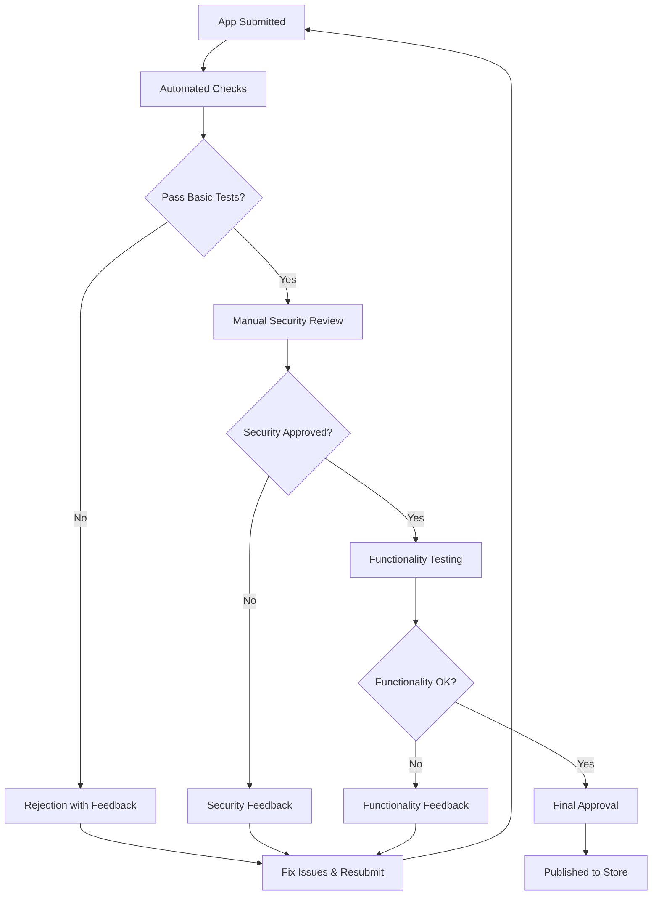

# Source: https://docs.drip.re/developer/app-store.md

> ## Documentation Index
>
> Fetch the complete documentation index at: https://docs.drip.re/llms.txt
> Use this file to discover all available pages before exploring further.

# App Store Submission

> Get your app published in the DRIP App Store 🏪

Learn how to submit your application to the DRIP App Store, navigate the review process, and successfully distribute your app to the DRIP ecosystem.

## Overview

The DRIP App Store is the official marketplace where realm administrators can discover, install, and manage applications for their communities. Getting your app published opens up your integration to thousands of DRIP communities.

<Info>
  Draft apps can create API clients and work only in your own realm. To enable other realms to authorize and use your app, you must publish it. App Store listing follows manual verification via email to [dev@drip.re](mailto:dev@drip.re).
</Info>

### Temporary Submission Process (Manual)

* Until the submission portal is live, email [dev@drip.re](mailto:dev@drip.re) to request App Store listing.
* Publishing your app enables cross-realm authorization immediately; store listing follows manual verification.

#### What to include in your email

* App name and App ID
* Website and contact email
* Short description (1-2 sentences)
* Scopes requested (list)
* Why each scope is needed (1-2 bullets per scope)
* Data handling summary (what you store/process)
* Screenshots/logo links
* Testing instructions or install link
* Expected usage/rate-limit profile (if relevant)

#### Email template

```text  theme={"dark"}
To: dev@drip.re
Subject: DRIP App Store Listing Request - <Your App Name>

App name: <Your App Name>
App ID: <app_id>
Website: <https://...>
Contact email: <you@company.com>

Short description:
<one or two sentences>

Requested scopes:
- scope.one — why needed
- scope.two — why needed

Data handling summary:
<what data you store/process and where>

Screenshots/logo:
<links>

Testing/install:
<link or instructions>

Expected usage:
<notes on expected traffic if any>
```

<Info>
  All scopes are granted per realm at authorization; there are no public scopes available across realms. At this time, there is no separate platform scope approval.
</Info>

## Submission Requirements

### Technical Requirements

<CardGroup cols={2}>
  <Card title="Functionality" icon="gear">
    * App must work as described
    * Proper error handling implemented
    * No critical bugs or crashes
    * Respects rate limits and API guidelines
  </Card>

  <Card title="Security" icon="shield">
    * Secure API key management
    * No unauthorized data collection
    * Proper scope usage
    * Data privacy compliance
  </Card>

  <Card title="Performance" icon="clock">
    * Reasonable response times
    * Efficient API usage
    * Proper caching implementation
    * Handles high load gracefully
  </Card>

  <Card title="Integration" icon="puzzle-piece">
    * Clean integration with DRIP
    * Follows DRIP design patterns
    * Proper webhook handling
    * Multi-realm support (if applicable)
  </Card>
</CardGroup>

### Content Requirements

Your app submission must include:

#### App Metadata

```json  theme={"dark"}
{
  "name": "Your App Name",
  "tagline": "Brief one-line description",
  "description": "Detailed description of what your app does",
  "category": "productivity", // analytics, gaming, productivity, social, utility
  "version": "1.0.0",
  "website": "https://yourapp.com",
  "supportUrl": "https://yourapp.com/support",
  "privacyPolicy": "https://yourapp.com/privacy",
  "termsOfService": "https://yourapp.com/terms"
}
```

#### Visual Assets

* **App Icon**: 512x512 PNG, clean and professional
* **Screenshots**: 3-5 high-quality screenshots showing key features
* **Banner Image**: 1200x630 for store listings (optional)

#### Documentation

* **Setup Instructions**: Clear installation and configuration steps
* **User Guide**: How to use your app's features
* **API Documentation**: If your app exposes APIs
* **Changelog**: Version history and updates

### Scope Justification

Clearly explain why your app needs each requested scope:

<Tabs>
  <Tab title="Good Example">
    ```json  theme={"dark"}
    {
      "requestedScopes": ["realm:read", "members:read", "points:write"],
      "scopeJustification": {
        "realm:read": "Display realm name and branding in analytics dashboard",
        "members:read": "Generate engagement analytics and member insights",
        "points:write": "Award points for completing external challenges and tasks"
      },
      "dataUsage": "Member data is used only for analytics generation and is not stored permanently or shared with third parties"
    }
    ```
  </Tab>

  <Tab title="Bad Example">
    ```json  theme={"dark"}
    {
      "requestedScopes": ["realm:read", "members:read", "members:write", "admin:read"],
      "scopeJustification": {
        "realm:read": "Need realm info",
        "members:read": "For analytics",
        "members:write": "Might need this later",
        "admin:read": "Just in case"
      }
    }
    ```
  </Tab>
</Tabs>

## Submission Process

### Step 1: Prepare Your Submission

<Steps>
  <Step title="Complete Your App">
    Ensure your app is fully functional and tested across multiple realms
  </Step>

  <Step title="Gather Assets">
    Prepare all required visual assets and documentation
  </Step>

  <Step title="Test Thoroughly">
    Test your app with different realm configurations and permission sets
  </Step>

  <Step title="Review Guidelines">
    Double-check that your app meets all technical and content requirements
  </Step>
</Steps>

### Step 2: Submit Through Developer Portal

1. **Access Developer Portal**
   * Navigate to **Admin** → **Developer** in your DRIP dashboard
   * Go to the **DRIP Apps** tab

2. **Create New Submission**
   * Click **Submit New App**
   * Fill out the app information form
   * Upload your visual assets

3. **Configure Scopes**
   * Select required scopes
   * Provide detailed justification for each scope
   * Explain your data usage policies

4. **Submit for Review**
   * Review all information for accuracy
   * Submit your app for platform review

### Step 3: Review Process



#### Review Timeline

* **Automated Checks**: 5-10 minutes
* **Security Review**: 2-3 business days
* **Functionality Testing**: 3-5 business days
* **Total Time**: Usually 5-8 business days

## Review Criteria

### Automated Checks

Your app will be automatically tested for:

<AccordionGroup>
  <Accordion title="Technical Validation">
    * Valid app metadata format
    * Required fields completed
    * Image assets meet specifications
    * Links are accessible and valid
    * Privacy policy and terms exist
  </Accordion>

  <Accordion title="Basic Functionality">
    * App responds to basic API calls
    * Authentication works correctly
    * No immediate crashes or errors
    * Handles missing permissions gracefully
  </Accordion>
</AccordionGroup>

### Manual Review

Human reviewers will evaluate:

<AccordionGroup>
  <Accordion title="Security Assessment">
    * Scope usage is appropriate and justified
    * No unauthorized data collection
    * Secure handling of API keys and tokens
    * Proper data encryption and storage
    * Compliance with privacy regulations
  </Accordion>

  <Accordion title="User Experience">
    * App works as described
    * Clear and intuitive interface
    * Proper error handling and feedback
    * Good performance under normal load
    * Professional presentation
  </Accordion>

  <Accordion title="Content Review">
    * App description is accurate
    * Screenshots represent actual functionality
    * No misleading claims or features
    * Appropriate for all audiences
    * Follows DRIP brand guidelines
  </Accordion>
</AccordionGroup>

## Common Rejection Reasons

### Technical Issues

<CardGroup cols={2}>
  <Card title="Scope Overreach" icon="exclamation-triangle">
    **Problem**: Requesting more permissions than needed

    **Solution**: Only request scopes your app actually uses and provide clear justification
  </Card>

  <Card title="Poor Error Handling" icon="bug">
    **Problem**: App crashes or shows unclear errors

    **Solution**: Implement comprehensive error handling with user-friendly messages
  </Card>

  <Card title="Security Concerns" icon="shield-exclamation">
    **Problem**: Insecure data handling or API key exposure

    **Solution**: Follow security best practices and never expose sensitive data
  </Card>

  <Card title="Performance Issues" icon="clock">
    **Problem**: Slow response times or excessive API usage

    **Solution**: Optimize performance and implement proper caching
  </Card>
</CardGroup>

### Content Issues

<CardGroup cols={2}>
  <Card title="Misleading Description" icon="file-x">
    **Problem**: App functionality doesn't match description

    **Solution**: Ensure description accurately reflects your app's features
  </Card>

  <Card title="Poor Quality Assets" icon="image">
    **Problem**: Low-quality screenshots or unprofessional icon

    **Solution**: Create high-quality, professional visual assets
  </Card>

  <Card title="Missing Documentation" icon="book-x">
    **Problem**: Insufficient setup or usage instructions

    **Solution**: Provide comprehensive documentation and support resources
  </Card>

  <Card title="Policy Violations" icon="gavel">
    **Problem**: Violates DRIP's app store policies

    **Solution**: Review and comply with all platform policies
  </Card>
</CardGroup>

## After Approval

### App Store Listing

Once approved, your app will appear in the DRIP App Store with:

* **App tile** with your icon and basic info
* **Detailed page** with screenshots and full description
* **Installation button** for realm administrators
* **Ratings and reviews** from users
* **Support links** and contact information

### Managing Your App

<Tabs>
  <Tab title="Updates">
    ```javascript  theme={"dark"}
    // Submitting app updates
    const updateData = {
      version: "1.1.0",
      changelog: [
        "Added new analytics dashboard",
        "Fixed member search bug",
        "Improved performance"
      ],
      newFeatures: ["Advanced filtering", "Export functionality"],
      bugFixes: ["Fixed memory leak", "Resolved auth issues"]
    };
    ```

    **Update Process:**

    1. Submit update through developer portal
    2. Automated testing of new version
    3. Review of changes (faster for minor updates)
    4. Deployment to app store
  </Tab>

  <Tab title="Analytics">
    Track your app's performance:

    * **Installation metrics**: How many realms have installed your app
    * **Usage statistics**: API call volume and patterns
    * **User feedback**: Ratings, reviews, and support requests
    * **Revenue tracking**: If your app has paid features
  </Tab>

  <Tab title="Support">
    Provide ongoing support:

    * **Monitor reviews**: Respond to user feedback promptly
    * **Handle support requests**: Provide timely assistance
    * **Release updates**: Fix bugs and add new features
    * **Maintain documentation**: Keep guides current
  </Tab>
</Tabs>

## Marketing Your App

### App Store Optimization

<AccordionGroup>
  <Accordion title="Compelling Description">
    Write a description that clearly explains your app's value:

    ```markdown  theme={"dark"}
    # Good Example
    **Community Analytics Pro** gives realm administrators deep insights into member engagement, activity patterns, and growth trends. 

    Key Features:
    - Real-time engagement dashboards
    - Member activity heatmaps  
    - Custom report generation
    - Automated insights and recommendations

    Perfect for community managers who want to understand and grow their communities with data-driven decisions.
    ```
  </Accordion>

  <Accordion title="High-Quality Screenshots">
    Show your app in action:

    * Use actual data (anonymized)
    * Highlight key features
    * Show different use cases
    * Include mobile views if applicable
  </Accordion>

  <Accordion title="Keywords and Categories">
    Choose the right category and keywords:

    * **Analytics**: Data, insights, reporting, metrics
    * **Productivity**: Automation, management, efficiency
    * **Gaming**: Leaderboards, competitions, rewards
    * **Social**: Community, engagement, interaction
  </Accordion>
</AccordionGroup>

### Promoting Your App

<CardGroup cols={2}>
  <Card title="Community Engagement" icon="users">
    * Share in DRIP Discord community
    * Write blog posts about your app
    * Create tutorial videos
    * Engage with potential users
  </Card>

  <Card title="Content Marketing" icon="megaphone">
    * Case studies from early users
    * Feature comparisons
    * Integration tutorials
    * Best practices guides
  </Card>

  <Card title="Partnerships" icon="handshake">
    * Partner with popular realms
    * Collaborate with other developers
    * Sponsor community events
    * Offer exclusive features
  </Card>

  <Card title="Social Proof" icon="star">
    * Collect user testimonials
    * Showcase success stories
    * Display usage statistics
    * Highlight positive reviews
  </Card>
</CardGroup>

## Monetization Strategies

### Pricing Models

<Tabs>
  <Tab title="Freemium">
    ```javascript  theme={"dark"}
    const pricingTiers = {
      free: {
        price: 0,
        features: ['Basic analytics', 'Up to 100 members', 'Standard support'],
        limitations: ['Limited data retention', 'Basic reporting only']
      },
      pro: {
        price: 9.99,
        features: ['Advanced analytics', 'Unlimited members', 'Custom reports', 'Priority support'],
        limitations: []
      }
    };
    ```
  </Tab>

  <Tab title="Per-Realm">
    ```javascript  theme={"dark"}
    const perRealmPricing = {
      basePrice: 4.99, // Per realm per month
      discounts: {
        multiRealm: 0.15, // 15% off for 3+ realms
        annual: 0.20      // 20% off for annual billing
      }
    };
    ```
  </Tab>

  <Tab title="Usage-Based">
    ```javascript  theme={"dark"}
    const usagePricing = {
      freeQuota: 1000, // Free API calls per month
      overageRate: 0.01, // $0.01 per additional call
      memberTiers: {
        small: { max: 500, price: 5.99 },
        medium: { max: 2000, price: 19.99 },
        large: { max: 10000, price: 49.99 }
      }
    };
    ```
  </Tab>
</Tabs>

## App Store Policies

### Prohibited Content

Apps cannot:

* Collect unnecessary personal data
* Spam users or communities
* Violate intellectual property rights
* Contain malicious code or security vulnerabilities
* Mislead users about functionality
* Compete directly with core DRIP features

### Content Guidelines

Apps must:

* Provide clear value to communities
* Respect user privacy and data
* Follow accessibility best practices
* Use appropriate and professional language
* Comply with applicable laws and regulations

### Technical Policies

Apps must:

* Use APIs as intended and documented
* Respect rate limits and quotas
* Handle errors gracefully
* Provide adequate user support
* Maintain reasonable uptime and performance

## Support and Resources

<CardGroup cols={2}>
  <Card title="Developer Support" icon="headphones">
    Get help with your submission:

    * Email: [dev@drip.re](mailto:dev@drip.re)
    * Discord: #app-developers channel
    * Office hours: Fridays 2-4 PM PST
  </Card>

  <Card title="Documentation" icon="book">
    Additional resources:

    * App Store Guidelines (full document)
    * Technical Requirements Checklist
    * Design Guidelines
    * Marketing Best Practices
  </Card>

  <Card title="Community" icon="users">
    Connect with other developers:

    * Developer Discord community
    * Monthly developer meetups
    * App showcase events
    * Beta testing programs
  </Card>

  <Card title="Tools" icon="wrench">
    Development tools:

    * App submission checklist
    * Testing frameworks
    * Analytics SDKs
    * Design templates
  </Card>
</CardGroup>

## App Installation & Configuration

Once your app is approved and published, you need to properly configure it for realm installations.

### 1. Prepare Your App

Before inviting realms to authorize your app, make sure your app is properly configured:

<Steps>
  <Step title="Fill in Required Information">
    * Go to the **Overview** tab in the app configuration
    * Provide key details such as **App Name**, **Description**, **Website URL**, **Support URL**, etc.
    * Upload logos or graphics as needed
  </Step>

  <Step title="Create an App Client & Specify Scopes">
    * Navigate to the **Client Settings** (or **App Client** section, depending on your UI)
    * Generate or retrieve your client credentials
    * Specify the appropriate **scopes** you need for your app to function correctly
    * Save your changes
  </Step>
</Steps>

### 2. Publish Your App

When you're ready for others to use your app:

<Steps>
  <Step title="Go to the Overview Page">
    * In the app settings, open the **Overview** tab again
    * Review all of your app details to ensure accuracy
  </Step>

  <Step title="Publish the App">
    * Click the **Publish** button (or "Make Public") to make your app available
    * Confirm any prompts to finalize the publishing process
  </Step>
</Steps>

<Info>
  **Note:** Publishing means that realms (communities) can now add and authorize your app.
</Info>

### 3. Invite Realms

After your app is published, you can share an **Invite Link** with realms who want to install or authorize the app.

<Steps>
  <Step title="Locate the Invite (Install) Link">
    * Go to the **Help & Resources** page (or "Help" tab)
    * Look for the **Installation** or **Invite** link builder
  </Step>

  <Step title="Customize (Optional)">
    * You can add query parameters such as `platformType` or `platformId` to keep track of your integrations
    * You will be able to search authorized realms by these parameters using the API
    * Copy the link when you're done
  </Step>

  <Step title="Share the Link">
    * Send it to any realm or community you wish to onboard
    * When they visit the link, they'll be prompted to grant permission for your app
  </Step>
</Steps>

### 4. Manage Future Updates

<AccordionGroup>
  <Accordion title="Updating App Information">
    If you need to revise your app's description, images, or settings:

    * Return to the **Overview** tab
    * Make your changes and save
  </Accordion>

  <Accordion title="Managing Scopes">
    If you need additional scopes or wish to remove some:

    * Revisit the **Client Settings**
    * Realms may need to re-authorize your app to grant newly requested scopes
    * This can be done by clicking the "Re-authorize" button in the app settings of their realm
  </Accordion>

  <Accordion title="Unpublishing">
    If you need to temporarily hide your app from new realms:

    * Use the **Unpublish** feature in the app settings
  </Accordion>
</AccordionGroup>

## Next Steps

<Steps>
  <Step title="Prepare Your App">
    Ensure your app meets all requirements and is thoroughly tested
  </Step>

  <Step title="Gather Materials">
    Create all required documentation, screenshots, and assets
  </Step>

  <Step title="Submit for Review">
    Submit through the developer portal and wait for review feedback
  </Step>

  <Step title="Launch and Promote">
    Once approved, actively promote your app to the DRIP community
  </Step>
</Steps>

<Info>
  **Ready to submit?** Make sure to review our [Best Practices](/developer/best-practices) guide and test your app thoroughly before submission. Good luck! 🚀
</Info>

Built with [Mintlify](https://mintlify.com).
