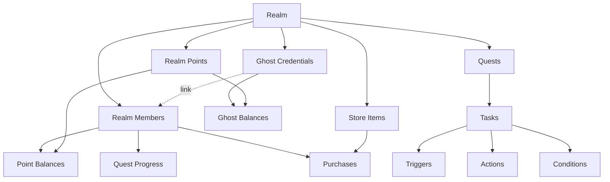
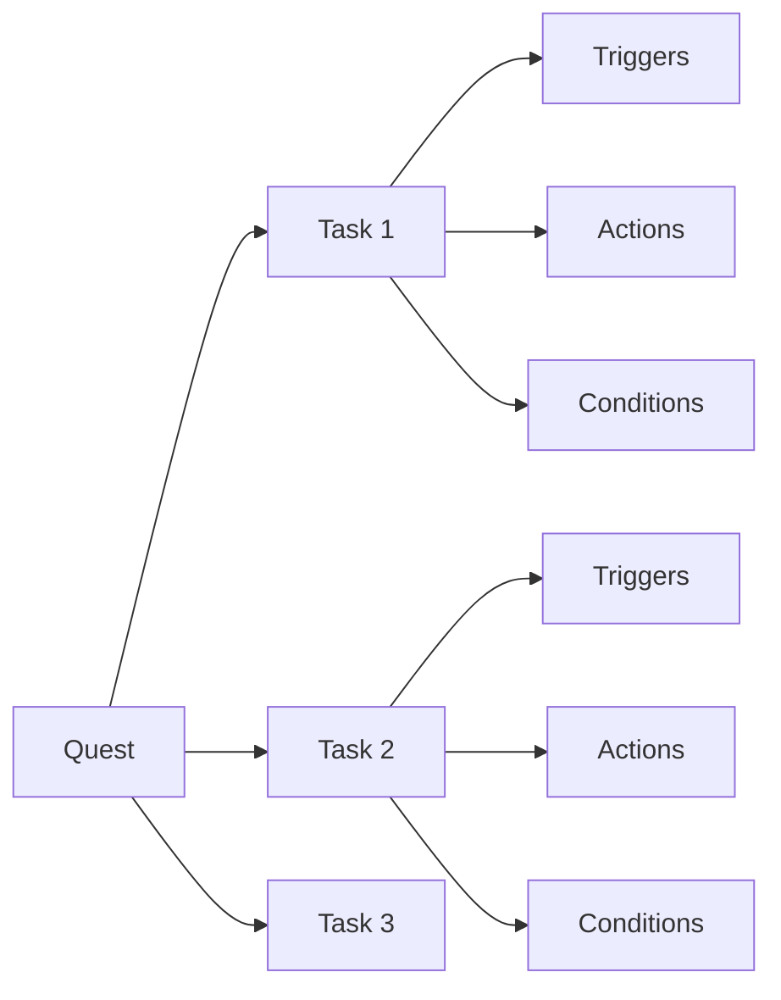

# Source: https://docs.drip.re/developer/core-concepts.md

> ## Documentation Index
>
> Fetch the complete documentation index at: https://docs.drip.re/llms.txt
> Use this file to discover all available pages before exploring further.

# Core Concepts

> Understanding DRIP's data model, relationships, and key concepts

This guide explains the fundamental concepts and data model that power the DRIP ecosystem. Understanding these concepts is essential for building effective integrations.

<Info>
  Terminology: In the dashboard UI, a "Realm" is sometimes labeled as "Project". They refer to the same thing.
</Info>

## API Client Types

DRIP supports two distinct types of API clients:

### Realm Clients

**Purpose**: Direct integration with your own realm\
**Scope**: Single realm access\
**Authorization**: Automatic access to your realm\
**Use Cases**: Custom dashboards, internal automation, realm-specific tools

### App Clients

**Purpose**: Multi-realm applications for the broader ecosystem\
**Scope**: Multiple realm access with explicit authorization\
**Authorization**: Platform approval + individual realm authorization\
**Use Cases**: Third-party integrations, marketplace apps, SaaS tools

<Info>
  The type of client determines your authorization flow and available permissions. Choose based on whether you're building for your own realm or the broader DRIP ecosystem.
</Info>

## Data Model Overview

DRIP's architecture is built around these core entities:



## Realms

A **Realm** (or Project) represents your community or server - it's the top-level container for all resources.

### Key Properties

* **ID**: Unique identifier for the realm
* **Name**: Display name of your community
* **Subdomain**: Custom subdomain (e.g., `yourname.drip.re`)
* **Settings**: Configuration for features, branding, permissions
* **Members**: All users who have joined the realm

### Example Realm Object

```json  theme={"dark"}
{
  "id": "507f1f77bcf86cd799439011",
  "name": "My Gaming Community",
  "description": "The best gaming community on Discord",
  "subdomain": "mygaming",
  "serverId": "123456789012345678",
  "ownerId": "507f1f77bcf86cd799439012",
  "level": 5,
  "premiumLevel": 2,
  "published": true,
  "verified": true
}
```

<Info>
  Most API operations are scoped to a specific realm. You'll need your Realm ID for nearly every API call.
</Info>

## Members

**Realm Members** represent users who have joined your community and can earn points, complete quests, and make purchases.

### Key Properties

* **ID**: Unique identifier for the member's account
* **Realm Membership**: Specific membership details for this realm
* **Point Balances**: Current balances for each point type
* **Credentials**: Connected accounts (Discord, Twitter, wallets)
* **Activity**: Join date, last visit, engagement metrics

### Member Search Types

You can search for members using different identifiers:

| Search Type  | Description             | Example                         |
| ------------ | ----------------------- | ------------------------------- |
| `drip-id`    | Internal DRIP member ID | `507f1f77bcf86cd799439013`      |
| `discord-id` | Discord user ID         | `123456789012345678`            |
| `twitter-id` | Twitter/X user ID       | `987654321`                     |
| `wallet`     | Crypto wallet address   | `0x742d35Cc6634C0532925a3b8D23` |
| `email`      | Email address           | `user@example.com`              |
| `username`   | Display username        | `gamerpro123`                   |

### Example Member Object

```json  theme={"dark"}
{
  "id": "507f1f77bcf86cd799439013",
  "realmMemberId": "507f1f77bcf86cd799439014",
  "username": "gamerpro123",
  "displayName": "Gamer Pro",
  "imageUrl": "https://cdn.drip.re/avatars/123.png",
  "joinedAt": "2024-01-15T10:30:00Z",
  "lastVisit": "2024-01-20T14:22:00Z",
  "pointBalances": [
    {
      "balance": 1500,
      "realmPoint": {
        "id": "507f1f77bcf86cd799439015",
        "name": "XP",
        "emoji": "⭐"
      }
    }
  ]
}
```

## Points (Currencies)

**Realm Points** are customizable currencies that members can earn, spend, and transfer within your community.

### Point Types

* **Primary Currency**: Main point system (e.g., XP, Coins)
* **Secondary Currencies**: Additional point types (e.g., Gems, Tokens)
* **Event Points**: Temporary currencies for special events
* **Branded Points**: Custom-branded currencies with logos

### Key Operations

* **Award Points**: Add points to a member's balance
* **Deduct Points**: Remove points (for purchases, penalties)
* **Transfer Points**: Move points between members
* **Batch Updates**: Update multiple balances at once

### Example Point Balance Update

```json  theme={"dark"}
{
  "tokens": 100,
  "realmPointId": "507f1f77bcf86cd799439015"
}
```

<Warning>
  Point operations are atomic - they either succeed completely or fail completely. This prevents double-spending and ensures data consistency.
</Warning>

## Ghost Credentials

**Ghost Credentials** are non-verified identity records that can accumulate points before being linked to an account. They enable pre-crediting users who haven't yet connected to your realm.

### Key Characteristics

* **Non-verified**: Created by your app/realm, not verified by the user
* **Realm-scoped**: Each credential belongs to a specific realm
* **Independent balances**: Can hold point balances without being linked to an account
* **Linkable**: When linked to an account, balances transfer automatically

### Supported Types

| Type         | Description                   |
| ------------ | ----------------------------- |
| `twitter-id` | Twitter/X user ID             |
| `discord-id` | Discord user ID               |
| `wallet`     | Blockchain wallet address     |
| `email`      | Email address                 |
| `custom`     | Custom identifier with source |

### Use Cases

* Pre-credit Twitter followers before they join
* Track wallet activity before users connect
* Award points to email addresses before signup
* Migrate users from external systems

<Info>
  When a ghost credential is linked to an account, all accumulated balances are atomically transferred to the account's point balances. See the [Ghost Credentials guide](/developer/credentials) for details.
</Info>

## Quests

**Quests** are gamified task systems that engage members through challenges, rewards, and progression.

### Quest Structure



### Components

| Component     | Purpose                          | Examples                                 |
| ------------- | -------------------------------- | ---------------------------------------- |
| **Quest**     | Overall challenge container      | "Weekly Challenges", "Onboarding"        |
| **Task**      | Individual steps within quest    | "Join Discord", "Make 5 Posts"           |
| **Trigger**   | Events that activate tasks       | Message sent, reaction added             |
| **Action**    | What happens when task completes | Award points, assign role                |
| **Condition** | Requirements to complete task    | Minimum message length, specific channel |

### Quest States

* **Draft**: Being created, not yet active
* **Active**: Running and accepting completions
* **Paused**: Temporarily stopped
* **Completed**: Finished, no longer accepting new participants
* **Archived**: Historical record, not visible to users

## Store Items

**Store Items** allow members to spend their points on rewards, perks, and digital goods.

### Item Types

* **Digital Rewards**: Exclusive content, early access
* **Role Upgrades**: Special Discord roles and permissions
* **Physical Items**: Merchandise, gift cards (with shipping)
* **Experiences**: Events, meetings, consultations

### Key Properties

```json  theme={"dark"}
{
  "id": "507f1f77bcf86cd799439016",
  "name": "VIP Discord Role",
  "description": "Get exclusive VIP access and perks",
  "price": 1000,
  "realmPointId": "507f1f77bcf86cd799439015",
  "category": "roles",
  "inventory": 50,
  "purchaseLimit": 1,
  "active": true
}
```

## Relationships and Workflows

### Common Integration Patterns

<AccordionGroup>
  <Accordion title="Member Onboarding">
    1. Member joins Discord server
    2. DRIP creates realm member record
    3. Welcome quest automatically starts
    4. Member completes onboarding tasks
    5. Points awarded for completion
  </Accordion>

  <Accordion title="Activity Rewards">
    1. Member performs action (message, reaction, etc.)
    2. Webhook triggers DRIP API call
    3. Points awarded based on activity type
    4. Member balance updated in real-time
    5. Leaderboards automatically refresh
  </Accordion>

  <Accordion title="Store Purchase">
    1. Member browses store items
    2. Selects item and confirms purchase
    3. Points deducted from member balance
    4. Item delivered (role, access, etc.)
    5. Transaction recorded for analytics
  </Accordion>

  <Accordion title="Quest Completion">
    1. Member starts quest
    2. Completes required tasks
    3. Conditions verified automatically
    4. Rewards distributed via actions
    5. Progress tracked and displayed
  </Accordion>
</AccordionGroup>

## Data Consistency

DRIP ensures data consistency through:

* **Atomic Operations**: All-or-nothing transactions
* **Validation**: Input validation and business rule enforcement
* **Audit Trails**: Complete history of all changes
* **Rate Limiting**: Prevents abuse and ensures system stability

## Best Practices

<CardGroup cols={2}>
  <Card title="Efficient Queries" icon="gauge-high">
    * Use specific search parameters
    * Implement pagination for large datasets
    * Cache frequently accessed data
    * Batch operations when possible
  </Card>

  <Card title="Error Handling" icon="shield-exclamation">
    * Always check response status codes
    * Implement retry logic with backoff
    * Log errors for debugging
    * Provide meaningful user feedback
  </Card>

  <Card title="Security" icon="lock">
    * Validate all user inputs
    * Use least-privilege API keys
    * Implement rate limiting
    * Monitor for unusual activity
  </Card>

  <Card title="Performance" icon="rocket">
    * Use webhooks for real-time updates
    * Implement efficient caching strategies
    * Optimize database queries
    * Monitor API response times
  </Card>
</CardGroup>

## Next Steps

Now that you understand DRIP's core concepts, explore these integration guides:

<CardGroup cols={2}>
  <Card title="Managing Members" icon="users" href="/developer/guides/managing-members">
    Learn to search, update, and manage community members
  </Card>

  <Card title="Point Systems" icon="coins" href="/developer/guides/point-systems">
    Implement reward systems and point management
  </Card>

  <Card title="Quest Management" icon="map" href="/developer/guides/quest-management">
    Create and manage gamified experiences
  </Card>

  <Card title="Webhooks" icon="webhook" href="/developer/guides/webhooks">
    Set up real-time event notifications
  </Card>
</CardGroup>

Built with [Mintlify](https://mintlify.com).
