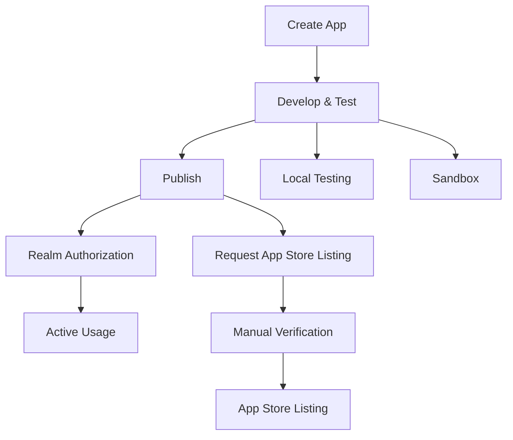
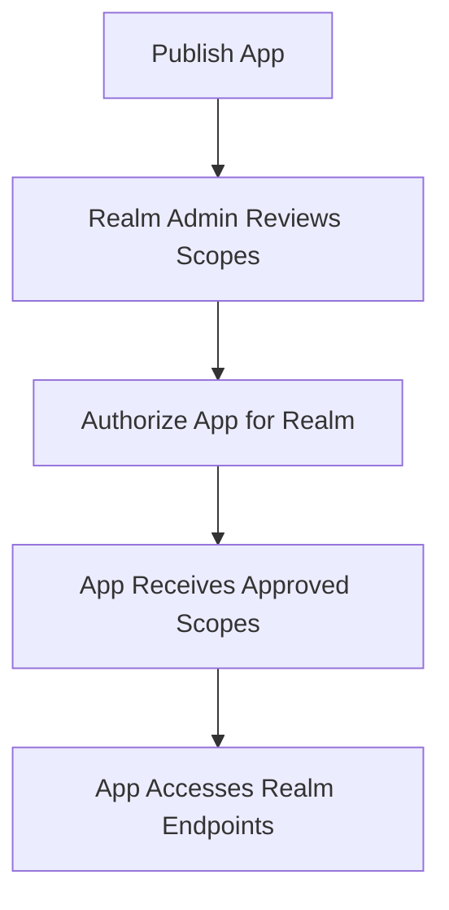

# Source: https://docs.drip.re/developer/multi-realm-apps.md

> ## Documentation Index
>
> Fetch the complete documentation index at: https://docs.drip.re/llms.txt
> Use this file to discover all available pages before exploring further.

# Multi-Realm Apps

> Build applications that work across multiple DRIP communities 🌐

Learn how to build applications that can serve multiple DRIP communities simultaneously. This guide covers the technical and business aspects of multi-realm app development.

## Overview

Multi-realm apps are applications that can be authorized and used by multiple DRIP communities. Unlike realm clients that are tied to a single community, multi-realm apps can scale across the entire DRIP ecosystem.

<Info>
  This guide covers app creation, publishing, realm authorization, scopes, and distribution for DRIP Apps.
</Info>

## App Development Lifecycle



## Creating Your App

### 1. Access the Developer Portal

<Steps>
  <Step title="Navigate to Developer Portal">
    Go to **Admin** > **Developer** in your DRIP dashboard
  </Step>

  <Step title="Switch to Drip Apps Tab">
    Click on the **Drip Apps** tab to manage your applications
  </Step>

  <Step title="Submit New App">
    Click **Submit New App** to start the creation process
  </Step>
</Steps>

### 2. App Configuration

<Info>
  You can create an API client and start building/testing your app before publishing. While your app is not published, its API client only works on your own realm. To allow other realms to authorize and use your app, you must publish it. Publishing enables other realms to authorize your app. App Store listing happens after manual verification via email to [dev@drip.re](mailto:dev@drip.re).
</Info>

When creating your app, you'll need to provide:

```json  theme={"dark"}
{
  "name": "My Awesome App",
  "description": "A comprehensive tool for community engagement",
  "category": "productivity",
  "website": "https://myapp.com",
  "supportUrl": "https://myapp.com/support",
  "privacyPolicy": "https://myapp.com/privacy",
  "termsOfService": "https://myapp.com/terms",
  "logoUrl": "https://myapp.com/logo.png",
  "screenshots": [
    "https://myapp.com/screenshot1.png",
    "https://myapp.com/screenshot2.png"
  ],
  "requestedScopes": [
    "realm:read",
    "members:read",
    "members:write",
    "points:write"
  ]
}
```

## Key Differences from Single-Realm Apps

<CardGroup cols={2}>
  <Card title="Single-Realm Apps" icon="castle">
    * Fixed realm context
    * Direct API key access
    * Immediate deployment
    * Simple authorization
  </Card>

  <Card title="Multi-Realm Apps" icon="globe">
    * Dynamic realm context
    * App client credentials
    * Publishing required for cross-realm authorization
    * Complex authorization flow
  </Card>
</CardGroup>

## Authorization Architecture

### Realm-Level Authorization

Publishing your app enables cross-realm authorization. Each realm admin authorizes your app and grants scopes for their realm.



### Managing Authorized Realms

```javascript  theme={"dark"}
class MultiRealmAppClient {
  constructor(appClientSecret) {
    this.appClientSecret = appClientSecret;
    this.authorizedRealms = new Map();
    this.baseUrl = 'https://api.drip.re/api/v1';
  }

  async loadAuthorizedRealms() {
    const response = await fetch(`${this.baseUrl}/apps/:appId/authorized-realms`, {
      headers: {
        'Authorization': `Bearer ${this.appClientSecret}`,
        'Content-Type': 'application/json'
      }
    });

    const data = await response.json();
    
    // Store authorized realms with their permissions
    for (const authorization of data.data) {
      this.authorizedRealms.set(authorization.realmId, {
        realm: authorization.realm,
        approvedScopes: authorization.approvedScopes,
        authorizedAt: authorization.authorizedAt,
        settings: authorization.settings || {}
      });
    }

    return this.authorizedRealms;
  }

  isAuthorizedForRealm(realmId) {
    return this.authorizedRealms.has(realmId);
  }

  hasScope(realmId, scope) {
    const auth = this.authorizedRealms.get(realmId);
    return auth && auth.approvedScopes.includes(scope);
  }

  async makeRealmRequest(realmId, method, endpoint, data = null) {
    if (!this.isAuthorizedForRealm(realmId)) {
      throw new Error(`Not authorized for realm ${realmId}`);
    }

    const url = `${this.baseUrl}${endpoint}`;
    const options = {
      method,
      headers: {
        'Authorization': `Bearer ${this.appClientSecret}`,
        'Content-Type': 'application/json'
      }
    };

    if (data) {
      options.body = JSON.stringify(data);
    }

    const response = await fetch(url, options);
    
    if (!response.ok) {
      const error = await response.json();
      throw new Error(`API Error: ${response.status} - ${error.message}`);
    }

    return response.json();
  }
}
```

## Scopes and Permissions

* Your app selects `requestedScopes`.
* Realms grant those scopes during authorization per realm.
* Changing requested scopes requires realms to reauthorize.
* No platform-level scope approval at this time; all scopes are realm-granted.

## Data Isolation and Management

### Per-Realm Data Storage

Each realm's data should be properly isolated:

```javascript  theme={"dark"}
class RealmDataManager {
  constructor(appClient) {
    this.appClient = appClient;
    this.realmData = new Map();
  }

  async initializeRealmData(realmId) {
    if (this.realmData.has(realmId)) {
      return this.realmData.get(realmId);
    }

    // Load realm-specific configuration
    const realmInfo = await this.appClient.makeRealmRequest(
      realmId, 
      'GET', 
      `/realms/${realmId}`
    );

    // Initialize realm data structure
    const realmData = {
      info: realmInfo,
      settings: await this.loadRealmSettings(realmId),
      cache: new Map(),
      lastUpdated: Date.now()
    };

    this.realmData.set(realmId, realmData);
    return realmData;
  }

  async loadRealmSettings(realmId) {
    // Load app-specific settings for this realm
    // This could come from your own database or DRIP's app settings
    return {
      pointsPerAction: 10,
      enableNotifications: true,
      customBranding: {
        primaryColor: '#667eea',
        logo: null
      }
    };
  }

  async updateRealmSettings(realmId, settings) {
    const realmData = await this.initializeRealmData(realmId);
    realmData.settings = { ...realmData.settings, ...settings };
    
    // Persist to your database
    await this.persistRealmSettings(realmId, realmData.settings);
  }

  getRealmData(realmId) {
    return this.realmData.get(realmId);
  }
}
```

### Cross-Realm Analytics

Aggregate data across multiple realms while respecting boundaries:

```javascript  theme={"dark"}
class CrossRealmAnalytics {
  constructor(appClient) {
    this.appClient = appClient;
  }

  async getAggregatedStats() {
    const authorizedRealms = this.appClient.authorizedRealms;
    const stats = {
      totalRealms: authorizedRealms.size,
      totalMembers: 0,
      totalPoints: 0,
      realmBreakdown: []
    };

    // Process each realm in parallel
    const realmPromises = Array.from(authorizedRealms.keys()).map(async (realmId) => {
      try {
        if (!this.appClient.hasScope(realmId, 'members:read')) {
          return null; // Skip realms without permission
        }

        const members = await this.appClient.makeRealmRequest(
          realmId,
          'GET',
          `/realm/${realmId}/members/search?type=drip-id&values=all`
        );

        const realmStats = {
          realmId,
          realmName: authorizedRealms.get(realmId).realm.name,
          memberCount: members.data.length,
          totalPoints: members.data.reduce((sum, member) => {
            return sum + (member.pointBalances[0]?.balance || 0);
          }, 0)
        };

        stats.totalMembers += realmStats.memberCount;
        stats.totalPoints += realmStats.totalPoints;

        return realmStats;
      } catch (error) {
        console.error(`Error fetching stats for realm ${realmId}:`, error);
        return null;
      }
    });

    const realmResults = await Promise.all(realmPromises);
    stats.realmBreakdown = realmResults.filter(result => result !== null);

    return stats;
  }

  async getTopMembersAcrossRealms(limit = 10) {
    const authorizedRealms = this.appClient.authorizedRealms;
    const allMembers = [];

    for (const [realmId, auth] of authorizedRealms) {
      if (!this.appClient.hasScope(realmId, 'members:read')) {
        continue;
      }

      try {
        const members = await this.appClient.makeRealmRequest(
          realmId,
          'GET',
          `/realm/${realmId}/members/search?type=drip-id&values=all`
        );

        // Add realm context to each member
        for (const member of members.data) {
          allMembers.push({
            ...member,
            realmId,
            realmName: auth.realm.name
          });
        }
      } catch (error) {
        console.error(`Error fetching members for realm ${realmId}:`, error);
      }
    }

    // Sort by points and return top members
    return allMembers
      .filter(member => member.pointBalances && member.pointBalances.length > 0)
      .sort((a, b) => {
        const aPoints = a.pointBalances[0]?.balance || 0;
        const bPoints = b.pointBalances[0]?.balance || 0;
        return bPoints - aPoints;
      })
      .slice(0, limit)
      .map((member, index) => ({
        rank: index + 1,
        name: member.displayName || member.username,
        points: member.pointBalances[0].balance,
        realmName: member.realmName,
        realmId: member.realmId
      }));
  }
}
```

## User Experience Patterns

### Realm Selection Interface

Create a smooth realm selection experience:

```javascript  theme={"dark"}
class RealmSelector {
  constructor(appClient) {
    this.appClient = appClient;
    this.currentRealmId = null;
  }

  async renderRealmSelector() {
    const realms = Array.from(this.appClient.authorizedRealms.values());
    
    return `
      <div class="realm-selector">
        <h3>Select Community</h3>
        <div class="realm-grid">
          ${realms.map(auth => `
            <div class="realm-card" onclick="selectRealm('${auth.realm.id}')">
              
              <h4>${auth.realm.name}</h4>
              <p>${auth.realm.memberCount || 0} members</p>
              <div class="scopes">
                ${auth.approvedScopes.slice(0, 3).map(scope => 
                  `<span class="scope-badge">${scope}</span>`
                ).join('')}
              </div>
            </div>
          `).join('')}
        </div>
      </div>
    `;
  }

  selectRealm(realmId) {
    if (!this.appClient.isAuthorizedForRealm(realmId)) {
      throw new Error('Not authorized for this realm');
    }

    this.currentRealmId = realmId;
    this.onRealmChanged(realmId);
  }

  onRealmChanged(realmId) {
    // Override this method to handle realm changes
    console.log(`Switched to realm: ${realmId}`);
  }
}
```

### Context-Aware UI

Adapt your UI based on available permissions:

```javascript  theme={"dark"}
class ContextAwareUI {
  constructor(appClient, realmId) {
    this.appClient = appClient;
    this.realmId = realmId;
  }

  renderMemberActions() {
    const canRead = this.appClient.hasScope(this.realmId, 'members:read');
    const canWrite = this.appClient.hasScope(this.realmId, 'members:write');
    const canAwardPoints = this.appClient.hasScope(this.realmId, 'points:write');

    if (!canRead) {
      return '<p>No member permissions for this realm</p>';
    }

    return `
      <div class="member-actions">
        ${canRead ? '<button onclick="loadMembers()">View Members</button>' : ''}
        ${canWrite ? '<button onclick="editMember()">Edit Member</button>' : ''}
        ${canAwardPoints ? '<button onclick="awardPoints()">Award Points</button>' : ''}
      </div>
    `;
  }

  renderBasedOnPermissions() {
    const auth = this.appClient.authorizedRealms.get(this.realmId);
    const scopes = auth.approvedScopes;

    const features = {
      analytics: scopes.includes('members:read'),
      pointManagement: scopes.includes('points:write'),
      questManagement: scopes.includes('quests:write'),
      storeManagement: scopes.includes('store:write')
    };

    return `
      <div class="app-features">
        ${features.analytics ? this.renderAnalytics() : ''}
        ${features.pointManagement ? this.renderPointManagement() : ''}
        ${features.questManagement ? this.renderQuestManagement() : ''}
        ${features.storeManagement ? this.renderStoreManagement() : ''}
      </div>
    `;
  }
}
```

## Scaling Considerations

### Database Design

Structure your database to handle multiple realms efficiently:

```sql  theme={"dark"}
-- Realm-specific tables
CREATE TABLE realm_settings (
  realm_id VARCHAR(24) PRIMARY KEY,
  app_settings JSONB NOT NULL,
  created_at TIMESTAMP DEFAULT NOW(),
  updated_at TIMESTAMP DEFAULT NOW()
);

CREATE TABLE realm_analytics (
  id SERIAL PRIMARY KEY,
  realm_id VARCHAR(24) NOT NULL,
  metric_name VARCHAR(100) NOT NULL,
  metric_value NUMERIC NOT NULL,
  recorded_at TIMESTAMP DEFAULT NOW(),
  
  INDEX idx_realm_metric (realm_id, metric_name),
  INDEX idx_recorded_at (recorded_at)
);

CREATE TABLE cross_realm_data (
  id SERIAL PRIMARY KEY,
  data_type VARCHAR(50) NOT NULL,
  aggregated_value JSONB NOT NULL,
  realm_count INTEGER NOT NULL,
  created_at TIMESTAMP DEFAULT NOW()
);
```

### Caching Strategy

Implement realm-aware caching:

```javascript  theme={"dark"}
class MultiRealmCache {
  constructor(ttl = 300000) { // 5 minutes
    this.cache = new Map();
    this.ttl = ttl;
  }

  getKey(realmId, type, identifier) {
    return `${realmId}:${type}:${identifier}`;
  }

  set(realmId, type, identifier, data) {
    const key = this.getKey(realmId, type, identifier);
    this.cache.set(key, {
      data,
      timestamp: Date.now()
    });
  }

  get(realmId, type, identifier) {
    const key = this.getKey(realmId, type, identifier);
    const cached = this.cache.get(key);

    if (!cached) {
      return null;
    }

    if (Date.now() - cached.timestamp > this.ttl) {
      this.cache.delete(key);
      return null;
    }

    return cached.data;
  }

  invalidateRealm(realmId) {
    // Remove all cached data for a specific realm
    for (const key of this.cache.keys()) {
      if (key.startsWith(`${realmId}:`)) {
        this.cache.delete(key);
      }
    }
  }

  clear() {
    this.cache.clear();
  }
}
```

## Business Model Considerations

### Pricing Strategies

Different approaches for multi-realm apps:

<AccordionGroup>
  <Accordion title="Per-Realm Pricing">
    Charge based on the number of authorized realms:

    ```javascript  theme={"dark"}
    class PerRealmPricing {
      calculatePrice(realmCount) {
        const basePrice = 9.99; // Base price for first realm
        const additionalRealmPrice = 4.99; // Price per additional realm
        
        if (realmCount <= 1) {
          return basePrice;
        }
        
        return basePrice + (realmCount - 1) * additionalRealmPrice;
      }
    }
    ```
  </Accordion>

  <Accordion title="Usage-Based Pricing">
    Charge based on total usage across all realms:

    ```javascript  theme={"dark"}
    class UsageBasedPricing {
      calculatePrice(totalApiCalls, totalMembers) {
        const apiCallPrice = 0.001; // $0.001 per API call
        const memberPrice = 0.05; // $0.05 per member per month
        
        return (totalApiCalls * apiCallPrice) + (totalMembers * memberPrice);
      }
    }
    ```
  </Accordion>

  <Accordion title="Feature-Based Pricing">
    Charge based on features used across realms:

    ```javascript  theme={"dark"}
    class FeatureBasedPricing {
      calculatePrice(realms, features) {
        let totalPrice = 0;
        
        for (const realm of realms) {
          let realmPrice = 5.99; // Base price per realm
          
          if (features.analytics) realmPrice += 2.99;
          if (features.automation) realmPrice += 4.99;
          if (features.customBranding) realmPrice += 1.99;
          
          totalPrice += realmPrice;
        }
        
        return totalPrice;
      }
    }
    ```
  </Accordion>
</AccordionGroup>

### Revenue Tracking

Track revenue per realm for better insights:

```javascript  theme={"dark"}
class RevenueTracker {
  constructor() {
    this.realmRevenue = new Map();
  }

  recordRealmRevenue(realmId, amount, period) {
    if (!this.realmRevenue.has(realmId)) {
      this.realmRevenue.set(realmId, {
        totalRevenue: 0,
        monthlyRevenue: [],
        firstPayment: Date.now()
      });
    }

    const realmData = this.realmRevenue.get(realmId);
    realmData.totalRevenue += amount;
    realmData.monthlyRevenue.push({
      period,
      amount,
      timestamp: Date.now()
    });
  }

  getRealmMetrics(realmId) {
    const data = this.realmRevenue.get(realmId);
    if (!data) return null;

    const monthlyAverage = data.monthlyRevenue.reduce((sum, payment) => 
      sum + payment.amount, 0) / data.monthlyRevenue.length;

    return {
      totalRevenue: data.totalRevenue,
      monthlyAverage,
      paymentCount: data.monthlyRevenue.length,
      customerLifetime: Date.now() - data.firstPayment
    };
  }
}
```

## Testing Multi-Realm Apps

### Testing Strategy

```javascript  theme={"dark"}
class MultiRealmTester {
  constructor() {
    this.testRealms = [
      { id: 'test-realm-1', name: 'Test Realm 1', scopes: ['members:read', 'points:write'] },
      { id: 'test-realm-2', name: 'Test Realm 2', scopes: ['members:read'] },
      { id: 'test-realm-3', name: 'Test Realm 3', scopes: ['members:read', 'members:write', 'points:write'] }
    ];
  }

  async testCrossRealmFunctionality() {
    const appClient = new MultiRealmAppClient(process.env.TEST_APP_CLIENT_SECRET);
    
    // Mock authorized realms for testing
    for (const testRealm of this.testRealms) {
      appClient.authorizedRealms.set(testRealm.id, {
        realm: testRealm,
        approvedScopes: testRealm.scopes,
        authorizedAt: new Date().toISOString()
      });
    }

    // Test realm-specific operations
    for (const testRealm of this.testRealms) {
      console.log(`Testing realm: ${testRealm.name}`);
      
      // Test permission checking
      assert(appClient.hasScope(testRealm.id, 'members:read'));
      
      if (appClient.hasScope(testRealm.id, 'points:write')) {
        // Test point operations
        console.log('✅ Can award points in this realm');
      } else {
        console.log('❌ Cannot award points in this realm');
      }
    }

    // Test cross-realm analytics
    const analytics = new CrossRealmAnalytics(appClient);
    const stats = await analytics.getAggregatedStats();
    
    assert(stats.totalRealms === this.testRealms.length);
    console.log('✅ Cross-realm analytics working');
  }
}
```

## Deployment and Monitoring

### Health Checks for Multi-Realm Apps

```javascript  theme={"dark"}
async function multiRealmHealthCheck() {
  const appClient = new MultiRealmAppClient(process.env.APP_CLIENT_SECRET);
  
  try {
    await appClient.loadAuthorizedRealms();
    
    const healthStatus = {
      status: 'healthy',
      timestamp: new Date().toISOString(),
      authorizedRealms: appClient.authorizedRealms.size,
      realmStatus: {}
    };

    // Test a sample of realms
    const realmIds = Array.from(appClient.authorizedRealms.keys()).slice(0, 3);
    
    for (const realmId of realmIds) {
      try {
        await appClient.makeRealmRequest(realmId, 'GET', `/realms/${realmId}`);
        healthStatus.realmStatus[realmId] = 'healthy';
      } catch (error) {
        healthStatus.realmStatus[realmId] = 'unhealthy';
        healthStatus.status = 'degraded';
      }
    }

    return healthStatus;
  } catch (error) {
    return {
      status: 'unhealthy',
      timestamp: new Date().toISOString(),
      error: error.message
    };
  }
}
```

<Info>
  **Building something cool?** Share your multi-realm app in our [Discord community](https://discord.gg/dripchain) and get feedback from other developers! 🚀
</Info>

## Creating Secure Installation URLs

For advanced app distribution, you can create encrypted installation URLs that include platform-specific data and expiration times.

### Prerequisites

<CardGroup cols={2}>
  <Card title="Encryption Key" icon="key">
    You will need the encryption key provided for your app. This key is unique and ensures secure encryption.
  </Card>

  <Card title="Development Environment" icon="code">
    Use a JavaScript environment (Node.js or browser console) to run the encryption logic.
  </Card>
</CardGroup>

### Encryption Implementation

<Tabs>
  <Tab title="Node.js">
    ```javascript  theme={"dark"}
    // Import the CryptoJS library
    const CryptoJS = require("crypto-js");

    // Encryption function
    function encryptData(data, passphrase) {
      const json = JSON.stringify(data);
      return CryptoJS.AES.encrypt(json, passphrase).toString();
    }

    // Example Usage:
    const encryptionKey = "your-app-encryption-key"; // Replace with your app's key
    const platformData = {
      platformType: "slack",       // Replace with your platform type
      platformId: "MY_TEAM_ID",    // Replace with your platform ID
      expirationTime: Date.now() + 30 * 60 * 1000 // Optional: expires in 30 minutes
    };

    // Encrypt the data
    const encrypted = encryptData(platformData, encryptionKey);
    console.log("Encrypted Data:", encrypted);

    // Build the URL
    const BASE_URL = "https://app.drip.re/admin/apps/authorize";
    const appId = "your-app-id"; // Replace with your app's ID

    // Final URL
    const installUrl = `${BASE_URL}?appId=${appId}&epfo=${encodeURIComponent(encrypted)}`;
    console.log("Installation URL:", installUrl);
    ```
  </Tab>

  <Tab title="Browser">
    ```html  theme={"dark"}
    <!DOCTYPE html>
    <html>
    <head>
      <script src="https://cdnjs.cloudflare.com/ajax/libs/crypto-js/4.1.1/crypto-js.min.js"></script>
    </head>
    <body>
      <script>
        // Encryption function
        function encryptData(data, passphrase) {
          const json = JSON.stringify(data);
          return CryptoJS.AES.encrypt(json, passphrase).toString();
        }

        // Configuration
        const encryptionKey = "your-app-encryption-key";
        const platformData = {
          platformType: "discord",
          platformId: "YOUR_GUILD_ID",
          expirationTime: Date.now() + 60 * 60 * 1000 // 1 hour
        };

        // Generate encrypted URL
        const encrypted = encryptData(platformData, encryptionKey);
        const BASE_URL = "https://app.drip.re/admin/apps/authorize";
        const appId = "your-app-id";
        const installUrl = `${BASE_URL}?appId=${appId}&epfo=${encodeURIComponent(encrypted)}`;
        
        console.log("Installation URL:", installUrl);
        document.body.innerHTML = `<a href="${installUrl}" target="_blank">Install App</a>`;
      </script>
    </body>
    </html>
    ```
  </Tab>
</Tabs>

### URL Parameters Explained

<AccordionGroup>
  <Accordion title="platformType">
    The type of platform you're integrating with:

    * `discord` - Discord servers
    * `slack` - Slack workspaces
    * `teams` - Microsoft Teams
    * `custom` - Custom platform integration
  </Accordion>

  <Accordion title="platformId">
    The unique identifier for the specific platform instance:

    * Discord: Guild/Server ID
    * Slack: Team/Workspace ID
    * Teams: Team ID
    * Custom: Your platform's unique identifier
  </Accordion>

  <Accordion title="expirationTime">
    Optional timestamp (in milliseconds) when the installation URL expires:

    * Helps prevent unauthorized installations
    * Recommended for sensitive integrations
    * Set to `Date.now() + (minutes * 60 * 1000)`
  </Accordion>
</AccordionGroup>

### Example Output

When you run the encryption code, you'll get:

```javascript  theme={"dark"}
// Encrypted Data Example:
"U2FsdGVkX1+L+8EzH4IbNHRgXLSOh9OUCzPZ8tjVdNA1M5..."

// Generated Installation URL:
"https://app.drip.re/admin/apps/authorize?appId=your-app-id&epfo=U2FsdGVkX1%2BL%2B8EzH4IbNHRgXLSOh9OUCzPZ8tjVdNA1M5..."
```

### Security Best Practices

<CardGroup cols={2}>
  <Card title="Keep Keys Secure" icon="shield">
    * Never share your encryption key publicly
    * Store keys in environment variables
    * Rotate keys periodically
    * Use different keys for different environments
  </Card>

  <Card title="URL Expiration" icon="clock">
    * Always set expiration times for sensitive URLs
    * Use shorter expiration times for production
    * Monitor for expired URL usage attempts
    * Provide clear error messages for expired URLs
  </Card>

  <Card title="Verify Integration" icon="check">
    * Test encrypted URLs before sharing
    * Verify decryption works correctly
    * Test with different platform types
    * Monitor installation success rates
  </Card>

  <Card title="Error Handling" icon="bug">
    * Handle decryption failures gracefully
    * Provide fallback installation methods
    * Log encryption/decryption errors
    * Validate platform data before encryption
  </Card>
</CardGroup>

## Verifying Authorization Programmatically

Each realm admin must explicitly authorize your app. You can check authorization and approved scopes via the API.

<CodeGroup>
  ```javascript Check Authorization Status theme={"dark"}
  async function checkRealmAuthorization(realmId, appId, appClientSecret) {
    const response = await fetch(`https://api.drip.re/api/v1/apps/${appId}/authorized-realms`, {
      headers: {
        'Authorization': `Bearer ${appClientSecret}`,
        'Content-Type': 'application/json'
      }
    });

    const authorizations = await response.json();
    return authorizations.data.find(auth => auth.realmId === realmId);
  }

  // Usage
  const authorization = await checkRealmAuthorization('REALM_ID', 'YOUR_APP_ID', 'YOUR_APP_CLIENT_SECRET');
  if (authorization) {
    console.log('Authorized scopes:', authorization.approvedScopes);
  } else {
    console.log('App not authorized for this realm');
  }

  ```

  ```python Python Example theme={"dark"}
  import requests

  def check_realm_authorization(realm_id, app_id, app_client_secret):
      url = f"https://api.drip.re/api/v1/apps/{app_id}/authorized-realms"
      
      headers = {
          'Authorization': f'Bearer {app_client_secret}',
          'Content-Type': 'application/json'
      }
      
      response = requests.get(url, headers=headers)
      authorizations = response.json()
      
      for auth in authorizations.get('data', []):
          if auth['realmId'] == realm_id:
              return auth
      
      return None

  # Usage
  authorization = check_realm_authorization('REALM_ID', 'YOUR_APP_ID', 'APP_CLIENT_SECRET')
  if authorization:
      print(f"Authorized scopes: {authorization['approvedScopes']}")
  else:
      print("App not authorized for this realm")
  ```

</CodeGroup>

## Next Steps

<CardGroup cols={2}>
  <Card title="App Store Submission" icon="store" href="/developer/app-store">
    Learn how to submit your multi-realm app to the DRIP App Store
  </Card>

  <Card title="Best Practices" icon="shield" href="/developer/best-practices">
    Follow production-ready patterns for scalable apps
  </Card>

  <Card title="API Reference" icon="book" href="/api-reference">
    Complete API documentation with all endpoints
  </Card>

  <Card title="Examples" icon="code" href="/developer/examples">
    Copy-paste code snippets for common use cases
  </Card>
</CardGroup>

Built with [Mintlify](https://mintlify.com).
