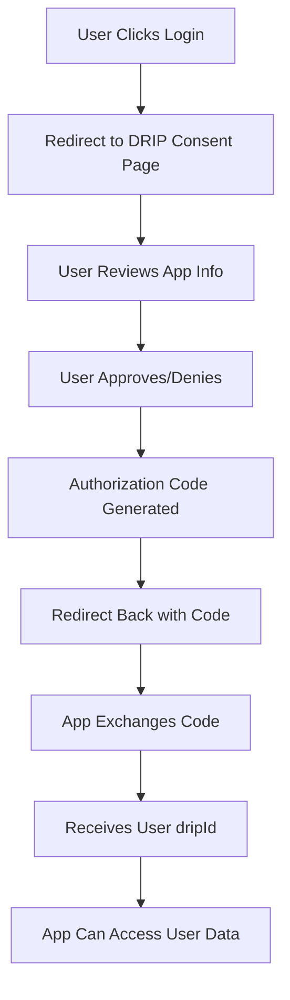

# Source: https://docs.drip.re/developer/user-authentication.md

> ## Documentation Index
>
> Fetch the complete documentation index at: https://docs.drip.re/llms.txt
> Use this file to discover all available pages before exploring further.

# User Authentication & OAuth

> Secure user authentication flow for accessing user data with consent

Enable your app to securely authenticate users and access their DRIP profile data with explicit consent. This OAuth-like flow works for both single-realm and multi-realm applications.

## Overview

The DRIP User Authentication system provides a secure, consent-based flow for apps to access user data. Similar to OAuth 2.0, users must explicitly authorize your app before it can access their information.

### Quick Flow Summary

1. **Your app redirects user** to `https://app.drip.re/oauth/authorize?client_id=YOUR_CLIENT_ID&redirect_uri=YOUR_REDIRECT_URI`
2. **User reviews and approves** your app on the DRIP consent page
3. **User is redirected back** to your `redirect_uri` with an authorization code: `YOUR_REDIRECT_URI?code=AUTH_CODE&response_type=code`
4. **Your app exchanges the code** for the user's DRIP ID by calling the API
5. **Your app can now access** user data using the DRIP ID

<Info>
  **Key Benefits:**

* 🔒 Secure user consent flow
* 🎯 Works for both Realm and Multi-realm apps
* ⚡ Short-lived authorization codes (5-minute TTL)
* 🔑 Minimal data exposure (only returns dripId)
* ✅ Transparent app information for users
</Info>

## Authentication Flow



## Implementation Guide

### Prerequisites

<CardGroup cols={2}>
  <Card title="API Client Setup" icon="key">
    Your app must have a valid API client (either Realm or App client) with appropriate scopes
  </Card>

  <Card title="Redirect URI" icon="link">
    Configure a redirect URI where users will be sent after authorization
  </Card>
</CardGroup>

### Step 1: Redirect to Authorization Page

Direct users to the DRIP consent page where they can review and approve your app:

<CodeGroup>
  ```javascript JavaScript theme={"dark"}
  function initiateUserAuth(clientId, redirectUri) {
    // Redirect user to DRIP consent page
    const authUrl = new URL('https://app.drip.re/oauth/authorize');
    authUrl.searchParams.set('client_id', clientId);
    authUrl.searchParams.set('redirect_uri', redirectUri);

    // Redirect the user to the consent page
    window.location.href = authUrl.toString();
    
    // OR return the URL for the user to visit
    return authUrl.toString();
  }

  // Example usage:
  const authorizationUrl = initiateUserAuth(
    'your-client-id',
    'https://yourapp.com/auth/callback'
  );
  // Result: https://app.drip.re/oauth/authorize?client_id=your-client-id&redirect_uri=https://yourapp.com/auth/callback

  ```

  ```python Python theme={"dark"}
  from urllib.parse import urlencode

  def initiate_user_auth(client_id, redirect_uri):
      # Build the authorization URL
      base_url = "https://app.drip.re/oauth/authorize"
      params = {
          'client_id': client_id,
          'redirect_uri': redirect_uri
      }
      
      auth_url = f"{base_url}?{urlencode(params)}"
      
      # Return the URL for the user to visit
      return auth_url

  # Example usage:
  authorization_url = initiate_user_auth(
      'your-client-id',
      'https://yourapp.com/auth/callback'
  )
  # Result: https://app.drip.re/oauth/authorize?client_id=your-client-id&redirect_uri=https://yourapp.com/auth/callback
  ```

  ```typescript TypeScript theme={"dark"}
  function initiateUserAuth(
    clientId: string,
    redirectUri: string
  ): string {
    // Build the authorization URL
    const authUrl = new URL('https://app.drip.re/oauth/authorize');
    authUrl.searchParams.set('client_id', clientId);
    authUrl.searchParams.set('redirect_uri', redirectUri);
    
    // Redirect the user (browser environment)
    if (typeof window !== 'undefined') {
      window.location.href = authUrl.toString();
    }
    
    // Return the URL
    return authUrl.toString();
  }

  // Example usage:
  const authorizationUrl = initiateUserAuth(
    'your-client-id',
    'https://yourapp.com/auth/callback'
  );
  // Result: https://app.drip.re/oauth/authorize?client_id=your-client-id&redirect_uri=https://yourapp.com/auth/callback
  ```

</CodeGroup>

<Info>
  **What happens on the consent page:**

  1. User must be logged into DRIP
  2. App information is displayed (name, logo, developer, verification status)
  3. User can approve or deny access
  4. If approved, user is redirected to your `redirect_uri` with an authorization code
  5. If denied, user is redirected with an error parameter
</Info>

<Warning>
  **Important:** Do not confuse the consent page URL (`https://app.drip.re/oauth/authorize`) with the API endpoint (`https://api.drip.re/api/v1/auth/oauth/authorize`). Users visit the consent page in their browser - you should never directly call the authorization API endpoint. The consent page handles calling the API internally when the user approves.
</Warning>

### Step 2: Handle the Callback

After user approval, they'll be redirected to your `redirect_uri` with the authorization code:

```
https://yourapp.com/auth/callback?code=AUTHORIZATION_CODE&response_type=code
```

If the user denies access:

```
https://yourapp.com/auth/callback?error=access_denied
```

### Step 3: Exchange Authorization Code

Exchange the authorization code for the user's DRIP ID:

<CodeGroup>
  ```javascript JavaScript theme={"dark"}
  async function exchangeAuthCode(appToken, authCode) {
    const response = await fetch('https://api.drip.re/api/v1/auth/oauth/token', {
      method: 'POST',
      headers: {
        'Authorization': `Bearer ${appToken}`, // Your app's token
        'Content-Type': 'application/json'
      },
      body: JSON.stringify({
        grant_type: 'authorization_code',
        code: authCode
      })
    });

    if (!response.ok) {
      const error = await response.json();
      throw new Error(`Exchange failed: ${error.message}`);
    }

    const data = await response.json();
    return data.dripId; // User's DRIP ID
  }

  ```

  ```python Python theme={"dark"}
  def exchange_auth_code(app_token, auth_code):
      url = "https://api.drip.re/api/v1/auth/oauth/token"
      
      headers = {
          'Authorization': f'Bearer {app_token}',
          'Content-Type': 'application/json'
      }
      
      payload = {
          'grant_type': 'authorization_code',
          'code': auth_code
      }
      
      response = requests.post(url, headers=headers, json=payload)
      
      if response.status_code != 200:
          error = response.json()
          raise Exception(f"Exchange failed: {error.get('message', 'Unknown error')}")
      
      data = response.json()
      return data['dripId']  # User's DRIP ID
  ```

  ```typescript TypeScript theme={"dark"}
  interface TokenExchangeResponse {
    dripId: string;
  }

  async function exchangeAuthCode(
    appToken: string,
    authCode: string
  ): Promise<string> {
    const response = await fetch('https://api.drip.re/api/v1/auth/oauth/token', {
      method: 'POST',
      headers: {
        'Authorization': `Bearer ${appToken}`,
        'Content-Type': 'application/json'
      },
      body: JSON.stringify({
        grant_type: 'authorization_code',
        code: authCode
      })
    });

    if (!response.ok) {
      const error = await response.json();
      throw new Error(`Exchange failed: ${error.message}`);
    }

    const data: TokenExchangeResponse = await response.json();
    return data.dripId;
  }
  ```

</CodeGroup>

### Step 4: Get Public Client Information (Optional)

You can fetch your app's public information to display on your own consent/login page:

<CodeGroup>
  ```javascript JavaScript theme={"dark"}
  async function getAppInfo(clientId) {
    const response = await fetch(
      `https://api.drip.re/api/v1/auth/oauth/client?client_id=${clientId}`
    );

    if (!response.ok) {
      throw new Error('Failed to fetch app information');
    }

    return await response.json();
    // Returns:
    // {
    //   name: "App Name",
    //   description: "App description",
    //   pfp: "https://...",  // Profile picture URL
    //   verified: true,      // Verification status
    //   developer: "Developer Name"
    // }
  }

  ```

  ```python Python theme={"dark"}
  def get_app_info(client_id):
      url = f"https://api.drip.re/api/v1/auth/oauth/client?client_id={client_id}"
      
      response = requests.get(url)
      
      if response.status_code != 200:
          raise Exception('Failed to fetch app information')
      
      return response.json()
      # Returns app information dict
  ```

</CodeGroup>

## Complete Implementation Example

Here's a full implementation of the user authentication flow:

<CodeGroup>
  ```javascript Express.js Server theme={"dark"}
  const express = require('express');
  const app = express();

  // Configuration
  const CLIENT_ID = process.env.DRIP_CLIENT_ID;
  const APP_TOKEN = process.env.DRIP_APP_TOKEN;
  const REDIRECT_URI = 'https://yourapp.com/auth/callback';
  const REALM_ID = process.env.DRIP_REALM_ID;

  // Step 1: Redirect user to DRIP authorization page
  app.get('/auth/login', (req, res) => {
    const authUrl = new URL('https://app.drip.re/oauth/authorize');
    authUrl.searchParams.set('client_id', CLIENT_ID);
    authUrl.searchParams.set('redirect_uri', REDIRECT_URI);

    // Redirect user to DRIP consent page
    res.redirect(authUrl.toString());
  });

  // Step 2: Handle callback and exchange code
  app.get('/auth/callback', async (req, res) => {
    const { code } = req.query;

    if (!code) {
      return res.status(400).json({ error: 'No authorization code provided' });
    }

    try {
      // Exchange code for user's DRIP ID
      const response = await fetch('https://api.drip.re/api/v1/auth/oauth/token', {
        method: 'POST',
        headers: {
          'Authorization': `Bearer ${APP_TOKEN}`,
          'Content-Type': 'application/json'
        },
        body: JSON.stringify({
          grant_type: 'authorization_code',
          code: code
        })
      });

      const data = await response.json();
      
      // Store user's DRIP ID in your database
      const dripId = data.dripId;
      
      // Create session for user
      req.session.dripId = dripId;
      
      res.json({ 
        success: true, 
        message: 'Authentication successful',
        dripId: dripId 
      });
    } catch (error) {
      res.status(500).json({ error: 'Token exchange failed' });
    }
  });

  // Step 4: Use the DRIP ID to fetch user data
  app.get('/user/profile', async (req, res) => {
    const dripId = req.session.dripId;

    if (!dripId) {
      return res.status(401).json({ error: 'Not authenticated' });
    }

    try {
      // Now you can use the dripId to fetch user-specific data
      // from your realm using your app's API token
      const response = await fetch(
        `https://api.drip.re/api/v1/realm/${REALM_ID}/members/search?type=drip-id&values=${dripId}`,
        {
          headers: {
            'Authorization': `Bearer ${APP_TOKEN}`
          }
        }
      );

      const userData = await response.json();
      res.json(userData);
    } catch (error) {
      res.status(500).json({ error: 'Failed to fetch user data' });
    }
  });

  app.listen(3000, () => {
    console.log('Server running on port 3000');
  });

  ```

  ```python Flask Server theme={"dark"}
  from flask import Flask, request, redirect, jsonify, session
  from urllib.parse import urlencode
  import requests
  import os

  app = Flask(__name__)
  app.secret_key = os.urandom(24)

  # Configuration
  CLIENT_ID = os.getenv('DRIP_CLIENT_ID')
  APP_TOKEN = os.getenv('DRIP_APP_TOKEN')
  REDIRECT_URI = 'https://yourapp.com/auth/callback'
  REALM_ID = os.getenv('DRIP_REALM_ID')

  @app.route('/auth/login')
  def auth_login():
      # Build authorization URL
      base_url = "https://app.drip.re/oauth/authorize"
      params = {
          'client_id': CLIENT_ID,
          'redirect_uri': REDIRECT_URI
      }
      auth_url = f"{base_url}?{urlencode(params)}"
      
      # Redirect user to DRIP consent page
      return redirect(auth_url)

  @app.route('/auth/callback')
  def auth_callback():
      code = request.args.get('code')
      
      if not code:
          return jsonify({'error': 'No authorization code provided'}), 400
      
      try:
          # Exchange code for DRIP ID
          response = requests.post(
              'https://api.drip.re/api/v1/auth/oauth/token',
              headers={
                  'Authorization': f'Bearer {APP_TOKEN}',
                  'Content-Type': 'application/json'
              },
              json={
                  'grant_type': 'authorization_code',
                  'code': code
              }
          )
          
          data = response.json()
          drip_id = data['dripId']
          
          # Store in session
          session['drip_id'] = drip_id
          
          return jsonify({
              'success': True,
              'message': 'Authentication successful',
              'dripId': drip_id
          })
      
      except Exception as e:
          return jsonify({'error': 'Token exchange failed'}), 500

  @app.route('/user/profile')
  def user_profile():
      drip_id = session.get('drip_id')
      
      if not drip_id:
          return jsonify({'error': 'Not authenticated'}), 401
      
      try:
          # Fetch user data using DRIP ID
          response = requests.get(
              f'https://api.drip.re/api/v1/realm/{REALM_ID}/members/search',
              params={'type': 'drip-id', 'values': drip_id},
              headers={'Authorization': f'Bearer {APP_TOKEN}'}
          )
          
          user_data = response.json()
          return jsonify(user_data)
      
      except Exception as e:
          return jsonify({'error': 'Failed to fetch user data'}), 500

  if __name__ == '__main__':
      app.run(port=3000)
  ```

</CodeGroup>

## Security Considerations

<CardGroup cols={2}>
  <Card title="Authorization Code TTL" icon="clock">
    * Codes expire in 5 minutes
    * Single-use only (invalidated after exchange)
    * Cannot be reused once exchanged
    * Implement retry logic for expired codes
  </Card>

  <Card title="Token Security" icon="shield">
    * Store tokens securely (never in frontend code)
    * Use HTTPS for all API calls
    * Validate redirect URIs
    * Implement CSRF protection
  </Card>

  <Card title="User Privacy" icon="user-shield">
    * Minimal data exposure (only dripId)
    * Explicit user consent required
    * Users can revoke access anytime
    * Clear privacy policy recommended
  </Card>

  <Card title="App Verification" icon="certificate">
    * Display app info transparently
    * Show verification status to users
    * Include developer information
    * Provide clear app description
  </Card>
</CardGroup>

## Error Handling

Handle common authentication errors gracefully:

<AccordionGroup>
  <Accordion title="Invalid Client ID">
    **Error**: `invalid_client`

    **Causes**:

    * Client ID doesn't exist
    * Client has been deactivated

    **Solution**:

    ```javascript  theme={"dark"}
    if (error.message === 'Invalid clientId') {
      console.error('Check your CLIENT_ID configuration');
      // Redirect to error page
    }
    ```
  </Accordion>

  <Accordion title="Code Already Used">
    **Error**: `code_already_used`

    **Causes**:

    * Authorization code was already exchanged
    * Duplicate exchange attempt

    **Solution**:

    ```javascript  theme={"dark"}
    if (error.message === 'code_already_used') {
      // Request new authorization code
      return initiateNewAuthFlow();
    }
    ```
  </Accordion>

  <Accordion title="Code Expired">
    **Error**: `code_expired`

    **Causes**:

    * More than 5 minutes passed since code generation
    * Network delays

    **Solution**:

    ```javascript  theme={"dark"}
    if (error.message === 'code_expired') {
      // Automatically restart auth flow
      return restartAuthentication();
    }
    ```
  </Accordion>

  <Accordion title="Invalid Code">
    **Error**: `invalid_code`

    **Causes**:

    * Malformed authorization code
    * Code doesn't exist
    * Wrong client attempting exchange

    **Solution**:

    ```javascript  theme={"dark"}
    if (error.message === 'invalid_code' || error.message === 'invalid_code_client') {
      // Log security event and restart
      logSecurityEvent('Invalid auth code attempt');
      return showAuthError();
    }
    ```
  </Accordion>
</AccordionGroup>

## Best Practices

### User Experience

<Steps>
  <Step title="Clear Consent UI">
    Build a clear consent screen showing:

    * App name and logo
    * Requested permissions
    * Developer information
    * What data will be accessed
  </Step>

  <Step title="Smooth Flow">
    * Minimize redirects
    * Show loading states
    * Handle errors gracefully
    * Provide clear success feedback
  </Step>

  <Step title="Session Management">
    * Store DRIP ID securely
    * Implement session expiration
    * Provide logout functionality
    * Clear sessions on errors
  </Step>
</Steps>

### Implementation Tips

```javascript  theme={"dark"}
class DripAuthManager {
  constructor(clientId, appToken, realmId) {
    this.clientId = clientId;
    this.appToken = appToken;
    this.realmId = realmId;
    this.redirectUri = 'https://yourapp.com/auth/callback';
    this.sessions = new Map();
  }

  // Generate the authorization URL for user to visit
  getAuthorizationUrl() {
    const authUrl = new URL('https://app.drip.re/oauth/authorize');
    authUrl.searchParams.set('client_id', this.clientId);
    authUrl.searchParams.set('redirect_uri', this.redirectUri);
    return authUrl.toString();
  }

  // Handle the callback after user authorization
  async handleCallback(authorizationCode) {
    try {
      // Exchange code for DRIP ID
      const dripId = await this.exchangeCode(authorizationCode);
      
      // Create session
      const sessionId = this.createSession(dripId);
      
      return { success: true, sessionId, dripId };
    } catch (error) {
      return { success: false, error: error.message };
    }
  }

  async exchangeCode(code) {
    const response = await fetch('https://api.drip.re/api/v1/auth/oauth/token', {
      method: 'POST',
      headers: {
        'Authorization': `Bearer ${this.appToken}`,
        'Content-Type': 'application/json'
      },
      body: JSON.stringify({
        grant_type: 'authorization_code',
        code: code
      })
    });

    if (!response.ok) {
      const error = await response.json();
      throw new Error(error.message || 'Exchange failed');
    }

    const data = await response.json();
    return data.dripId;
  }

  createSession(dripId) {
    const sessionId = this.generateSessionId();
    this.sessions.set(sessionId, {
      dripId,
      createdAt: Date.now(),
      lastAccessed: Date.now()
    });
    return sessionId;
  }

  generateSessionId() {
    return Math.random().toString(36).substring(2) + Date.now().toString(36);
  }

  async getUserData(sessionId) {
    const session = this.sessions.get(sessionId);
    if (!session) {
      throw new Error('Invalid session');
    }

    // Update last accessed
    session.lastAccessed = Date.now();

    // Fetch user data from DRIP
    const response = await fetch(
      `https://api.drip.re/api/v1/realm/${this.realmId}/members/search?type=drip-id&values=${session.dripId}`,
      {
        headers: {
          'Authorization': `Bearer ${this.appToken}`
        }
      }
    );

    if (!response.ok) {
      throw new Error('Failed to fetch user data');
    }

    return await response.json();
  }

  logout(sessionId) {
    return this.sessions.delete(sessionId);
  }
}

// Usage
const authManager = new DripAuthManager(
  process.env.DRIP_CLIENT_ID,
  process.env.DRIP_APP_TOKEN,
  process.env.DRIP_REALM_ID
);
```

## Testing Your Implementation

### Test Authorization Flow

```javascript  theme={"dark"}
async function testAuthFlow() {
  const clientId = 'your_client_id';
  const appToken = 'your_app_token';
  const redirectUri = 'http://localhost:3000/callback';

  try {
    // Step 1: Generate authorization URL
    console.log('🔐 Authorization URL:');
    const authUrl = new URL('https://app.drip.re/oauth/authorize');
    authUrl.searchParams.set('client_id', clientId);
    authUrl.searchParams.set('redirect_uri', redirectUri);
    console.log(authUrl.toString());
    console.log('👆 User must visit this URL and approve the app');
    
    // Step 2: After user approves, they'll be redirected with a code
    // Simulate receiving the authorization code from the callback
    const authorizationCode = 'AUTHORIZATION_CODE_FROM_CALLBACK';
    console.log('✅ Authorization code received:', authorizationCode);

    // Step 3: Exchange code
    console.log('🔄 Exchanging code for DRIP ID...');
    const tokenResponse = await fetch('https://api.drip.re/api/v1/auth/oauth/token', {
      method: 'POST',
      headers: {
        'Authorization': `Bearer ${appToken}`,
        'Content-Type': 'application/json'
      },
      body: JSON.stringify({
        grant_type: 'authorization_code',
        code: authorizationCode
      })
    });

    const { dripId } = await tokenResponse.json();
    console.log('✅ DRIP ID received:', dripId);
    console.log('🎉 Authentication flow complete!');

    return dripId;
  } catch (error) {
    console.error('❌ Test failed:', error.message);
    throw error;
  }
}
```

## Troubleshooting

<Warning>
  **Common Issues:**

* Ensure your client has the correct scopes for user data access
* Verify redirect URIs match exactly (including trailing slashes)
* Check that authorization codes are exchanged within 5 minutes
* Confirm your app token has necessary permissions
</Warning>

## Next Steps

<CardGroup cols={2}>
  <Card title="Multi-Realm Apps" icon="globe" href="/developer/multi-realm-apps">
    Learn how to implement authentication across multiple realms
  </Card>

  <Card title="API Reference" icon="book" href="/api-reference">
    Complete API documentation for all authentication endpoints
  </Card>

  <Card title="Security Best Practices" icon="shield" href="/developer/best-practices">
    Advanced security patterns for production apps
  </Card>

  <Card title="Examples" icon="code" href="/developer/examples">
    More code examples and implementation patterns
  </Card>
</CardGroup>

Built with [Mintlify](https://mintlify.com).
