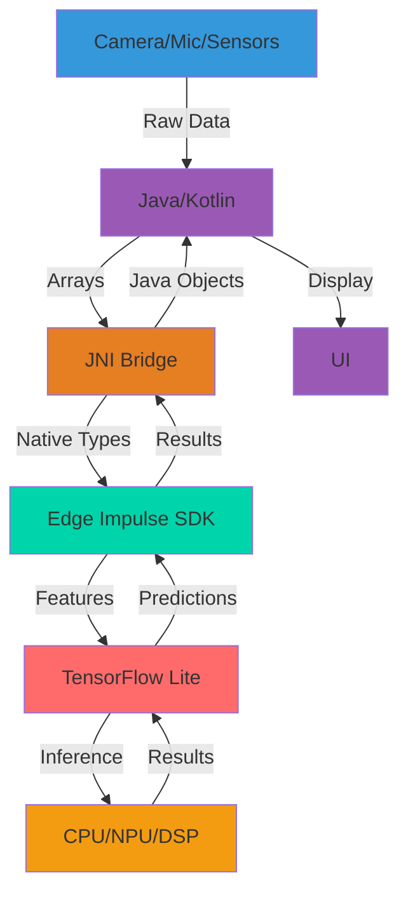

# Source: https://docs.edgeimpulse.com/tutorials/topics/android/android-series.md

> ## Documentation Index
> Fetch the complete documentation index at: https://docs.edgeimpulse.com/llms.txt
> Use this file to discover all available pages before exploring further.

# Android Series Overview

> Deploy Edge Impulse machine learning models on Android devices with native C++ integration

Deploy Edge Impulse models on Android using Android NDK and TensorFlow Lite. This series covers everything from basic inference to application focused examples for data collection, with camera, audio, and motion sensors.

<Frame caption="Android Studio - Object Tracking and Detection - live debugging as demonstrated in the QNN example repository">
  
</Frame>

### Common architecture

All examples share the same fundamental high level overview. See the Android NDK documentation for more on native C++ integration [here](https://developer.android.com/ndk/guides).

| Layer                 | Components                          | Responsibility                           |
| --------------------- | ----------------------------------- | ---------------------------------------- |
| **Data Source**       | Camera2, AudioRecord, SensorManager | Capture images, audio, IMU data          |
| **Java/Kotlin**       | Activities, UI, Preprocessing       | User interface and data conversion       |
| **JNI Bridge**        | native-lib.cpp                      | Type conversion (Java ↔ C++)             |
| **C++ Native**        | Edge Impulse SDK                    | Signal processing and feature extraction |
| **TensorFlow Lite**   | Runtime libraries                   | Neural network execution                 |
| **Hardware**          | CPU, NPU, DSP                       | Physical computation                     |
| **Optional Delegate** | QNN                                 | Hardware acceleration (Qualcomm devices) |



## Quick start

To get started with all Android examples, clone the main repository:

```bash  theme={"system"}
git clone https://github.com/edgeimpulse/example-android-inferencing.git
cd example-android-inferencing
```

## Tutorials

<CardGroup cols={2}>
  <Card title="Static Buffer Inference" icon="memory" href="./static-buffer-inference">
    Run inference with test data (15 min)
  </Card>

  <Card title="Camera Inference" icon="camera" href="/hardware/deployments/run-cpp-android">
    Object detection and anomaly detection (30 min)
  </Card>

  <Card title="Keyword Spotting" icon="microphone" href="./keyword-spotting">
    Audio classification with microphone (30 min)
  </Card>

  <Card title="WearOS Motion" icon="watch" href="/hardware/deployments/run-cpp-android">
    IMU-based motion classification (45 min)
  </Card>

  <Card title="QNN Acceleration" icon="microchip" href="./qnn-acceleration">
    Qualcomm NPU hardware acceleration (1 hour)
  </Card>

  <Card title="Build a speech to image GenAI example with QNN acceleration" icon="mobile-alt" href="./qnn-speech-to-image">
    From audio input to image generation on-device (1.5 hours)
  </Card>
</CardGroup>

...more tutorials coming soon!

## Repositories

* [Static Buffer Inference on Android](https://github.com/edgeimpulse/example-android-inferencing/blob/main/example_static_buffer/README.md)
* [Keyword Spotting on Android](https://github.com/edgeimpulse/example-android-inferencing/tree/main/example_kws)
* [Camera Inference on Android](https://github.com/edgeimpulse/example-android-inferencing/tree/main/example_camera_inference)
* [WearOS Motion Inference on Android](https://github.com/edgeimpulse/example-android-inferencing/tree/main/example_motion_WearOS)
* [QNN Hardware Acceleration on Android](https://github.com/edgeimpulse/qnn-hardware-acceleration)
* [QNN Speech to Image GenAI on Android](https://github.com/edgeimpulse/example-android-inferencing/tree/main/qnn-genai-speech_to_image)

## Prerequisites

* **Edge Impulse account**: [Sign up](https://edgeimpulse.com/signup)
* **Trained model**: Complete a [tutorial](/tutorials) first
* **Android Studio**: [Download](https://developer.android.com/studio) (Ladybug 2024.2.2 or later)
* **Tools**: Android API 35, NDK 27.0.12077973, CMake 3.22.1

## Tested model types

* **Vision**: FOMO, Object Detection, Visual Anomaly Detection
* **Audio**: Keyword Spotting (KWS)
* **Motion**: Accelerometer, Gyroscope classification

## Common workflow

All tutorials follow this pattern:

1. **Export model** from Studio → Deployment → Android (C++ library)
2. **Download TFLite libraries**:
   ```bash  theme={"system"}
   cd app/src/main/cpp/tflite
   sh download_tflite_libs.sh  # or .bat for Windows
   ```
3. **Copy model files** to `app/src/main/cpp/` (skip CMakeLists.txt)
4. **Update test features** in `native-lib.cpp`
5. **Build and run** in Android Studio

## Platform support

| Architecture         | Status          | Notes                                                                                                                        |
| -------------------- | --------------- | ---------------------------------------------------------------------------------------------------------------------------- |
| arm64-v8a (64-bit)   | Recommended     | All modern devices                                                                                                           |
| armeabi-v7a (32-bit) | Requires config | Older devices, see [32-bit steps in the android examples README](https://github.com/edgeimpulse/example-android-inferencing) |

**Android Versions**: Minimum API 24, Target API 35

## Performance optimization

* **XNNPACK**: CPU acceleration (included by default)
* **QNN**: Qualcomm NPU acceleration (see QNN tutorial)

## Resources

<CardGroup cols={2}>
  <Card title="GitHub Repository" icon="github" href="https://github.com/edgeimpulse/example-android-inferencing">
    Complete source code
  </Card>

  <Card title="Android Deployment Docs" icon="book" href="/hardware/deployments/run-cpp-android">
    Full deployment guide
  </Card>
</CardGroup>

## Need help?

* [Edge Impulse Forum](https://forum.edgeimpulse.com/)
* [Android Studio Docs](https://developer.android.com/studio)
* [Report Issues](https://github.com/edgeimpulse/example-android-inferencing/issues)


Built with [Mintlify](https://mintlify.com).