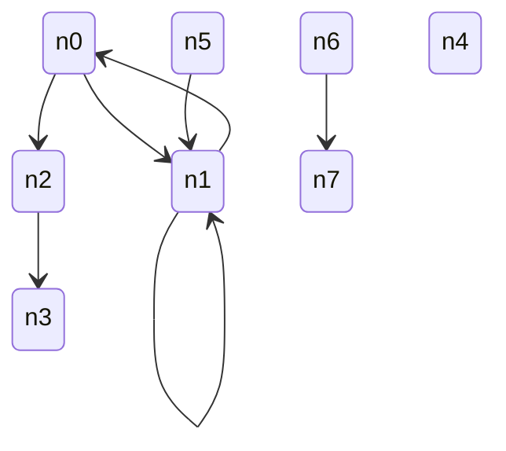
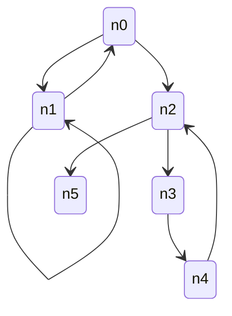
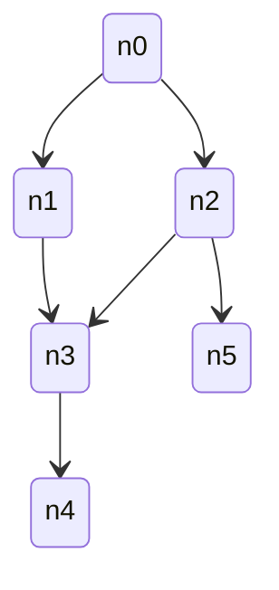

# Fast Check Documentation

Source: https://fast-check.dev/llms-full.txt

---

# fast-check Documentation

> Complete documentation for fast-check - Property-based testing framework for JavaScript/TypeScript

This file contains all documentation content in a single document following the llmstxt.org standard.

## Fake data


Replace random fake data by fake data backed by property based

## From tests with random to properties

Before diving into how to integrate your favorite fake data libraries with fast-check, let's explore one of the main reasons why users may prefer using these libraries in an uncontrolled way within their tests, rather than relying on property-based testing techniques for generating random inputs in a deterministic and reproducible manner.

Moving from simple random tests to property-based testing can greatly improve the effectiveness of your testing. While random tests are easy to write, they are not always reproducible and do not allow for shrinking in case of failure.

The following snippet is an example of such tests:

```js
test('sort users by ascending age', () => {
  const userA = {
    firstName: firstName(),
    lastName: lastName(),
    birthDate: birthDate(),
  };
  const userB = {
    firstName: firstName(),
    lastName: lastName(),
    birthDate: birthDate({ strictlyOlderThan: userA.birthDate }),
  };
  expect(sortByAge([userA, userB])).toEqual([userA, userB]);
  expect(sortByAge([userB, userA])).toEqual([userA, userB]);
});
```

Although the previous test successfully generates random users and checks that ordering is applied correctly, it falls short when it comes to providing details about the nature of any failures that may occur. In contrast, property-based testing, while requiring more initial effort, provides more reliable tests that can report failures and simplify the debugging process. To demonstrate this, we can rewrite the previous test using a property-based approach as shown below:

```js
test('sort users by ascending age', () => {
  fc.assert(
    fc.property(
      fc
        .record({
          firstName: firstNameArb(),
          lastName: lastNameArb(),
          birthDate: birthDateArb(),
        })
        .chain((userA) =>
          fc.record({
            userA: fc.constant(userA),
            userB: fc.record({
              firstName: firstNameArb(),
              lastName: lastNameArb(),
              birthDate: birthDateArb({ strictlyOlderThan: userA.birthDate }),
            }),
          }),
        ),
      ({ userA, userB }) => {
        expect(sortByAge([userA, userB])).toEqual([userA, userB]);
        expect(sortByAge([userB, userA])).toEqual([userA, userB]);
      },
    ),
  );
});
```

The previous test revealed a challenge in generating entries beforehand, which can be a significant obstacle to adopting property-based testing.

This challenge has been addressed with the introduction of `gen` in fast-check. It makes writing property-based tests as straightforward as writing regular tests. With `gen` the test can be written as follow:

```js
test('sort users by ascending age', () => {
  fc.assert(
    fc.property(fc.gen(), (g) => {
      const userA = {
        firstName: g(firstName),
        lastName: g(lastName),
        birthDate: g(birthDate),
      };
      const userB = {
        firstName: g(firstName),
        lastName: g(lastName),
        birthDate: g(birthDate, { strictlyOlderThan: userA.birthDate }),
      };
      expect(sortByAge([userA, userB])).toEqual([userA, userB]);
      expect(sortByAge([userB, userA])).toEqual([userA, userB]);
    }),
  );
});
```

## Native ones

Although fast-check is not primarily designed for generating fake data, it does come with a number of [built-in generators](/docs/core-blocks/arbitraries/combiners/) doing so. Each built-in generator is designed to produce any acceptable value for the requested data, taking into account any subtleties in the specification.

For example, while an IPv4 address may be commonly represented as something like `127.0.0.1`, the specification allows for other formats such as `0x4.034`, and fast-check's IPv4 generator is able to generate values accordingly.

However, fast-check does not currently provide generators for names, surnames, or other non-fully constrained values. It is up to the user to provide their own generators for such data types.

:::tip Build your own arbitraries
If you need to generate custom fake data, such as names and surnames, you can refer to fast-check's [combiners](/docs/core-blocks/arbitraries/combiners/), which are designed to allow users to create their own values according to their specific needs.
:::

## Fake data libraries

In order to integrate external fake data libraries with fast-check, the generators have to be wrapped as arbitraries.

:::warning Minimal requirements
The minimal requirement that needs to be fulfilled by the wrapped library is to provide a way to be seeded and reproducible. fast-check cannot offer replay capabilities if the underlying generators are not able to generate the same values from one run to another.
:::

:::warning Limitations
Please note that if not explictely defined, the arbitraries will not be able to shrink the generated values.
:::

Here are some examples of how external fake data libraries can be wrapped within fast-check.

### Seed-based (eg.: @faker-js/faker)

With [@faker-js/faker](https://www.npmjs.com/package/@faker-js/faker):

```js

const fakerToArb = (fakerGen) => {
  return fc
    .noShrink(
      // shrink on a seed makes no sense
      fc.noBias(
        // same probability to generate each of the allowed integers
        fc.integer(),
      ),
    )
    .map((seed) => {
      faker.seed(seed); // seed the generator
      return fakerGen(); // call it
    });
};

const streetAddressArb = fakerToArb(faker.address.streetAddress);
const customArb = fakerToArb(() => faker.fake('{{name.lastName}}, {{name.firstName}} {{name.suffix}}'));
```

:::tip Recommended integration for Faker

Our recommended integration for Faker has changed since the release of the version 8.2.0 of Faker. We recommend you to have a look to [our article](/blog/2024/07/18/integrating-faker-with-fast-check/) on the subject.
:::

### Random-based (eg.: lorem-ipsum)

With [lorem-ipsum](https://www.npmjs.com/package/lorem-ipsum):

```js

const loremArb = fc
  .noShrink(
    fc.infiniteStream(
      // Arbitrary generating 32-bit floating point numbers
      // between 0 (included) and 1 (excluded) (uniform distribution)
      fc.noBias(fc.integer({ min: 0, max: (1 << 24) - 1 }).map((v) => v / (1 << 24))),
    ),
  )
  .map((s) => {
    const rng = () => s.next().value; // prng like Math.random but controlled by fast-check
    return loremIpsum({ random: rng });
  });
```

---

## Fuzzing


Turn fast-check into a fuzzer

## From Property-Based to Fuzzing

Although fast-check is not specifically designed as a fuzzer, it has several features that make it well-suited for this purpose. One such feature is its ability to repeatedly run a predicate against randomized data, which is a fundamental requirement for fuzzing. Additionally, fast-check is capable of identifying and reporting errors, which is crucial in fuzzing scenarios.

Due to its sophisticated random generators, fast-check can be a valuable tool for detecting critical bugs in your code and can be leveraged in a fuzzing mode.

If you want to use fast-check as a fuzzer, here's how to get started.

## Basic setup

To use fast-check as a fuzzer, the primary requirement is to execute the predicate against a large number of runs. One straightforward method of achieving this is to customize the `numRuns` value passed to the runner.

For instance, if you intend to run the tests an infinite number of times, you can use the following code snippet:

```js
fc.configureGlobal({ numRuns: Number.POSITIVE_INFINITY });
```

:::warning Multi-process
Please note that if you intend to run multiple properties an infinite number of times, it may be necessary to run them via multiple processes. JavaScript being a single-threaded language, running multiple infinite loops in a single thread may result in only one property being executed.

Therefore, to avoid this limitation and ensure that all properties are executed as intended, you should consider running them in separate processes.
:::

## Advanced setup

While the setup above will continue to run until fast-check uncovers a bug, you may want to consider more advanced patterns if your goal is to continuously fuzz the code without stopping even in the event of an error.

The following code snippets offer an approach to run fast-check continuously without stopping on failure.

### Never failing predicates

The code snippet presented below consists of a function designed to wrap any predicate into a function that will not fail but will report into a file when a failure is detected.

```js

let failureId = 0;
function reportFailure(inputs, error) {
  const fileName = `failure-pid${process.pid}-${++failureId}.log`;
  const fileContent = `Counterexample: ${fc.stringify(inputs)}\n\nError: ${error}`;
  fs.writeFile(fileName, fileContent);
}

function neverFailingPredicate(predicate) {
  return (...inputs) => {
    try {
      const out = predicate(...inputs);
      if (out === false) {
        reportFailure(inputs, undefined);
      }
    } catch (err) {
      reportFailure(inputs, err);
    }
  };
}
```

The `neverFailingPredicate` function takes in a predicate and returns a new function that wraps it. This new function will catch any error thrown by the predicate and report it as a failure, without actually failing. Additionally, it will generate a log file containing the counterexample that caused the failure and the error message.

This function can be used to run fast-check indefinitely without stopping on errors.

### Fuzzing usage

The above helpers can be utilized directly to define properties and execute them in a fuzzer fashion as shown below:

```js

fc.configureGlobal({ numRuns: 1_000_000 });

test('fuzz predicate against arbitraries', () => {
  fc.assert(fc.property(...arbitraries, neverFailingPredicate(predicate)));
});
```

Here, the `assert` function is used to execute a property that is generated from a set of arbitraries. The `neverFailingPredicate` function is used to wrap the predicate of the property, which ensures that the property will never fail but will report any detected failures.

Finally, the `configureGlobal` function is used to set the number of runs for the property to `1_000_000`, enabling it to run longer than the default setup.

### Replay usage

In contrast to normal runs, when using the `neverFailingPredicate` function, the inputs provided to the predicate will never be shrunk. However, if you want to shrink them or just replay the failure, you can do it on a case-by-case basis as demonstrated below:

```js
test('replay reported error and shrink it', () => {
  fc.assert(fc.property(...arbitraries, predicate), {
    numRuns: 1,
    examples: [
      [
        /* reported error */
      ],
    ],
  });
});
```

Here, the `examples` option is used to provide the input that resulted in the reported error. By setting `numRuns` to 1, we ensure that the property is only executed once with the provided example. In case of failure, fast-check will then attempt to shrink the input, leading to a simpler failing input if feasible.

---

## Advanced


Advanced usages and patterns

```mdx-code-block

<DocCardList />
```

---

## Model based testing


Turn fast-check into a crazy QA

## Overview

Model-based testing can also be referred to as [Monkey testing](https://en.wikipedia.org/wiki/Monkey_testing) to some extent. The basic concept is to put our system under stress by providing it with random inputs. With model-based testing, we compare our system to a highly simplified version of it: the model.

:::info The model, an optional helper
While the model part can assist you in writing your tests by storing intermediate states, past actions, or even mimicking the system, it is entirely optional. Model-based testing can be performed without it as well.
:::

In the context of fast-check, model-based testing involves defining a set of commands that can be seen as potential actions to be executed on your system. Each command consists of two elements: a check to verify if the action can be executed in the current context, and the action itself, which also performs assertions. Typically, we rely on the model to verify if the action is suitable and apply the action to both the system and the model.

:::warning The model, a simplified version of the system
Although the model can be a useful tool, it's important to use it carefully. Model's goal is to simplify the system, but there is a risk that it may mimic the system too closely, leading to errors. The model should not be a carbon copy of the system but a simplified representation of it. It's crucial to avoid testing the code by comparing it to itself.
:::

## Write model-based tests

### Define the commands

In fast-check, the commands have to implement the interface [`ICommand`](https://fast-check.dev/api-reference/interfaces/ICommand.html). They basically come with three important methods:

- `check(model)` — Ensure that the model is in the appropriate state to execute the action
- `run(model, real)` — Execute the action
- `toString()` — Serialize the command for error reports

:::tip Example of commands
If your system is a music player, here are some commands you may have: play, pause, next track, add track…
:::

### Generate the commands

Then, to ingest your previously defined commands into fast-check as an arbitrary, you can use the [`commands`](https://fast-check.dev/api-reference/functions/commands.html) arbitrary. This function takes an array of commands as input and compiles them to produce a scenario that can be applied to your system.

:::info Isn't commands just an array builder?
Yes and no!

- Yes, because `commands(myCommands)` could be mimicked by `array(oneof(...myCommands))`.
- No, as it better fits the needs of model based testing. The `commands` helper is like an enhanced version of the `array` designed to meet the requirements of model-based testing. Unlike the `array` arbitrary, it can efficiently shrink failing scenarios.

:::

### Print the commands

To better report the state when a model fails, you may need to capture the state within the scope of the command when it executes. This is particularly useful when commands depend on variables passed via the constructor and possibly impact different parts of the system depending on its state and past commands.

For example, consider a command like "go to track…". It can be parameterized with either the "track name" or the "track position". If the command is fed with a "track name" parameter, there is a high risk that it may not match any existing track available in the system, unless it has been ensured beforehand. On the other hand, if the command is parameterized with "track position", it can work regardless of the set of tracks in the system, as long as there is at least one. In other words, the check will only verify that a track exists and the command is allowed to go to the track from the current state. The command will then go to the track whose name is `allTracks[this.trackPosition % allTracks.length]`. As a user, you would certainly prefer to see "go to track 'the super track'" instead of "go to track 1200".

To achieve this, you may need to modify your command as follows:

```js
class GoToTrackCommand {
  constructor(trackPosition) {
    this.trackPosition = trackPosition;
  }
  check(m) {
    return m.allTracks.length !== 0;
  }
  run(m, r) {
    this.trackName = m.allTracks[this.trackPosition % m.allTracks.length];
    // execute 'go to track' on the system (r) and impact the model (m) if needed
  }
  toString() {
    return `go to track '${this.trackName}'`;
  }
}
```

### Run the commands

Commands have to be executed from the predicate. fast-check provides three model-based runners to run your commands:

- [`modelRun`](https://fast-check.dev/api-reference/functions/modelRun.html) — Apply to any synchronous system: the commands have to be synchronous
- [`asyncModelRun`](https://fast-check.dev/api-reference/functions/asyncModelRun.html) — Can work with asynchronous commands
- [`scheduledModelRun`](https://fast-check.dev/api-reference/functions/scheduledModelRun.html) — Can work with asynchronous commands in a scheduled way for a better detection of race conditions

### Example

Let's take the case of a list class with `pop`, `push`, `size` methods.

```typescript
class List {
  data: number[] = [];
  push = (v: number) => this.data.push(v);
  pop = () => this.data.pop()!;
  size = () => this.data.length;
}
```

Model based testing requires a model. A model is a simplified version of the real system. In this precise case our model would contain only a single integer representing the size of the list.

```typescript
type Model = { num: number };
```

Then we have to define a command for each of the available operations on our list. Commands come with two methods:

- `check(m: Readonly<Model>): boolean`: true if the command can be executed given the current state
- `run(m: Model, r: RealSystem): void`: execute the command on the system and update the model accordingly. Check for potential problems or inconsistencies between the model and the real system - throws in such case.

```typescript
class PushCommand implements fc.Command<Model, List> {
  constructor(readonly value: number) {}
  check = (m: Readonly<Model>) => true;
  run(m: Model, r: List): void {
    r.push(this.value); // impact the system
    ++m.num; // impact the model
  }
  toString = () => `push(${this.value})`;
}
class PopCommand implements fc.Command<Model, List> {
  check(m: Readonly<Model>): boolean {
    // should not call pop on empty list
    return m.num > 0;
  }
  run(m: Model, r: List): void {
    assert.equal(typeof r.pop(), 'number');
    --m.num;
  }
  toString = () => 'pop';
}
class SizeCommand implements fc.Command<Model, List> {
  check = (m: Readonly<Model>) => true;
  run(m: Model, r: List): void {
    assert.equal(r.size(), m.num);
  }
  toString = () => 'size';
}
```

Now that all our commands are ready, we can run everything:

```typescript
// define the possible commands and their inputs
const allCommands = [
  fc.integer().map((v) => new PushCommand(v)),
  fc.constant(new PopCommand()),
  fc.constant(new SizeCommand()),
];
// run everything
fc.assert(
  fc.property(fc.commands(allCommands, { size: '+1' }), (cmds) => {
    const s = () => ({ model: { num: 0 }, real: new List() });
    fc.modelRun(s, cmds);
  }),
);
```

## Replay model-based tests

Contrary to other arbitraries, commands built using `commands` requires an extra parameter for replay purposes. In addition of passing `{ seed, path }` to `assert`, `commands` must be called with `{ replayPath: string }`.

Whenever `assert` encounters a failure with `commands`, it displays an error log featuring both the seed, path and replayPath to replay it. For instance, in the output below the seed is 670108017, the path 96:5 and the replayPath is AAAAABAAE:VF.

```
Property failed after 97 tests
{ seed: 670108017, path: "96:5", endOnFailure: true }
Counterexample: [PlayToken[0],NewGame,PlayToken[1],Refresh /*replayPath="AAAAABAAE:VF"*/]
Shrunk 1 time(s)
Got error: Error: expect(received).toEqual(expected)
```

In order to replay the failure on the counterexample - `[PlayToken[0],NewGame,PlayToken[1],Refresh]`, you have to change your code as follow:

```typescript
// Original code
fc.assert(
  fc.property(
    fc.commands(/* array of commands */),
    checkEverythingIsOk
  )
);

// Replay code: straight to the minimal counterexample.
// It only replays the minimal counterexample.
fc.assert(
  fc.property(
    fc.commands(
      /* array of commands */,
      { replayPath: 'AAAAABAAE:VF' }
    ),
    checkEverythingIsOk
  ),
  { seed: 670108017, path: '96:5', endOnFailure: true }
);
```

:::info Why is there something specific to do for commands?
In order to come with a more efficient shrinker, `commands` takes into account the commands that have really been executed.
Basically if the framework generated the following commands `[A,B,C,A,A,C]` but only executed `[A,-,C,A,-,-]` it will shrink only `[A,C,A]`.
The value stored into `replayPath` encodes the history of what was really executed in order not re-run any intermediate step on replay.
:::

---

## Race conditions


Easily detect race conditions in your JavaScript code

## Overview

Race conditions can easily occur in JavaScript due to its event-driven nature. Any situation where JavaScript has the ability to schedule tasks could potentially lead to race conditions.

> A race condition […] is the condition […] where the system's substantive behavior is dependent on the **sequence** or timing of other **uncontrollable events**.

_Source: https://en.wikipedia.org/wiki/Race_condition_

Identifying and fixing race conditions can be challenging as they can occur unexpectedly. It requires a thorough understanding of potential event flows and often involves using advanced debugging and testing tools. To address this issue, fast-check includes a set of built-in tools specifically designed to help in detecting race conditions. The [`scheduler`](/docs/core-blocks/arbitraries/others/#scheduler) arbitrary has been specifically designed for detecting and testing race conditions, making it an ideal tool for addressing these challenges in your testing process.

## The scheduler instance

The [`scheduler`](/docs/core-blocks/arbitraries/others/#scheduler) arbitrary is able to generate instances of [`Scheduler`](https://fast-check.dev/api-reference/interfaces/Scheduler.html). They come with following interface:

- `schedule: <T>(task: Promise<T>, label?: string, metadata?: TMetadata, act?: SchedulerAct) => Promise<T>` - Wrap an existing promise using the scheduler. The newly created promise will resolve when the scheduler decides to resolve it (see `waitFor`, `waitNext` and `waitIdle` methods).
- `scheduleFunction: <TArgs extends any[], T>(asyncFunction: (...args: TArgs) => Promise<T>, act?: SchedulerAct) => (...args: TArgs) => Promise<T>` - Wrap all the promise produced by an API using the scheduler. `scheduleFunction(callApi)`
- `scheduleSequence(sequenceBuilders: SchedulerSequenceItem<TMetadata>[], act?: SchedulerAct): { done: boolean; faulty: boolean, task: Promise<{ done: boolean; faulty: boolean }> }` - Schedule a sequence of operations. Each operation requires the previous one to be resolved before being started. Each of the operations will be executed until its end before starting any other scheduled operation.
- `waitNext: (count: number, customAct?: SchedulerAct)=> Promise<void>` - Wait and schedule exactly `count` scheduled tasks.
- `waitIdle: (customAct?: SchedulerAct) => Promise<void>` - Wait until the scheduler becomes idle. This includes currently scheduled tasks and any additional ones they recursively schedule. Cannot await tasks triggered by uncontrolled sources like `fetch` or external event emitters. Prefer `waitNext` or `waitFor` if you know what you are waiting for.
- `waitFor: <T>(unscheduledTask: Promise<T>, act?: SchedulerAct) => Promise<T>` - Wait as many scheduled tasks as need to resolve the received task. Contrary to `waitOne` or `waitAll` it can be used to wait for calls not yet scheduled when calling it (some test solutions like supertest use such trick not to run any query before the user really calls then on the request itself). Be aware that while this helper will wait eveything to be ready for `unscheduledTask` to resolve, having uncontrolled tasks triggering stuff required for `unscheduledTask` might make replay of failures harder as such asynchronous triggers stay out-of-control for fast-check.
- `report: () => SchedulerReportItem<TMetaData>[]` - Produce an array containing all the scheduled tasks so far with their execution status. If the task has been executed, it includes a string representation of the associated output or error produced by the task if any. Tasks will be returned in the order they get executed by the scheduler.

And deprecated primitives:

- `count(): number` - Number of pending tasks waiting to be scheduled by the scheduler — _deprecated since v4.2.0, no replacement_
- `waitOne: (act?: SchedulerAct) => Promise<void>` - Wait one scheduled task to be executed. Throws if there is no more pending tasks — _deprecated since v4.2.0, prefer `waitNext(1)`_
- `waitAll: (act?: SchedulerAct) => Promise<void>` - Wait all scheduled tasks, including the ones that might be created by one of the resolved task. Do not use if `waitAll` call has to be wrapped into an helper function such as `act` that can relaunch new tasks afterwards. In this specific case use a `while` loop running while `count() !== 0` and calling `waitOne` - _see CodeSandbox example on userProfile_ — _deprecated since v4.2.0, prefer `waitIdle`_

With:

```ts
type SchedulerSequenceItem<TMetadata> =
  | { builder: () => Promise<any>; label: string; metadata?: TMetadata }
  | (() => Promise<any>);
```

You can also define an hardcoded scheduler by using `fc.schedulerFor(ordering: number[])` - _should be passed through `fc.constant` if you want to use it as an arbitrary_. For instance: `fc.schedulerFor([1,3,2])` means that the first scheduled promise will resolve first, the third one second and at the end we will resolve the second one that have been scheduled.

## Scheduling methods

### schedule

Create a scheduled `Promise` based on an existing one — _aka. wrapped `Promise`_.
The life-cycle of the wrapped `Promise` will not be altered at all.
On its side the scheduled `Promise` will only resolve when the scheduler decides it.

Once scheduled by the scheduler, the scheduler will wait the wrapped `Promise` to resolve before sheduling anything else.

:::warning Catching exceptions is your responsability
Similar to any other `Promise`, if there is a possibility that the wrapped `Promise` may be rejected, you have to handle the output of the scheduled `Promise` on your end, just as you would with the original `Promise`.
:::

**Signature**

```ts
schedule: <T>(task: Promise<T>) => Promise<T>;
schedule: <T>(task: Promise<T>, label?: string, metadata?: TMetadata, customAct?: SchedulerAct) => Promise<T>;
```

**Usage**

Any algorithm taking raw `Promise` as input might be tested using this scheduler.

For instance, `Promise.all` and `Promise.race` are examples of such algorithms.

**Snippet**

```ts
// Let suppose:
// - s        : Scheduler
// - shortTask: Promise   - Very quick operation
// - longTask : Promise   - Relatively long operation

shortTask.then(() => {
  // not impacted by the scheduler
  // as it is directly using the original promise
});

const scheduledShortTask = s.schedule(shortTask);
const scheduledLongTask = s.schedule(longTask);

// Even if in practice, shortTask is quicker than longTask
// If the scheduler selected longTask to end first,
// it will wait longTask to end, then once ended it will resolve scheduledLongTask,
// while scheduledShortTask will still be pending until scheduled.
await s.waitNext(1);
```

### scheduleFunction

Create a producer of scheduled `Promise`.

Many asynchronous codes utilize functions that can produce `Promise` based on inputs. For example, fetching from a REST API using `fetch("http://domain/")` or accessing data from a database `db.query("SELECT * FROM table")`.

`scheduleFunction` is able to re-order when these `Promise` resolveby waiting the go of the scheduler.

**Signature**

```ts
scheduleFunction: <TArgs extends any[], T>(asyncFunction: (...args: TArgs) => Promise<T>, customAct?: SchedulerAct) =>
  (...args: TArgs) =>
    Promise<T>;
```

**Usage**

Any algorithm making calls to asynchronous APIs can highly benefit from this wrapper to re-order calls.

:::warning Only postpone the resolution
`scheduleFunction` is only postponing the resolution of the function. The call to the function itself is started immediately when the caller calls something on the scheduled function.
:::

**Snippet**

```ts
// Let suppose:
// - s             : Scheduler
// - getUserDetails: (uid: string) => Promise - API call to get details for a User

const getUserDetailsScheduled = s.scheduleFunction(getUserDetails);

getUserDetailsScheduled('user-001')
  // What happened under the hood?
  // - A call to getUserDetails('user-001') has been triggered
  // - The promise returned by the call to getUserDetails('user-001') has been registered to the scheduler
  .then((dataUser001) => {
    // This block will only be executed when the scheduler
    // will schedule this Promise
  });

// Unlock one of the scheduled Promise registered on s
// Not necessarily the first one that resolves,
// not necessarily the first one that got scheduled
await s.waitNext(1);
```

### scheduleSequence

Create a sequence of asynchrnous calls running in a precise order.

:::info While running, tasks prevent others to complete
One important fact about scheduled sequence is that whenever one task of the sequence gets scheduled, no other scheduled task in the scheduler can be unqueued while this task has not ended. It means that tasks defined within a scheduled sequence must not require other scheduled task to end to fulfill themselves — _it does not mean that they should not force the scheduling of other scheduled tasks_.
:::

**Signature**

```ts
type SchedulerSequenceItem =
    { builder: () => Promise<any>; label: string } |
    (() => Promise<any>)
;

scheduleSequence(sequenceBuilders: SchedulerSequenceItem[], customAct?: SchedulerAct): { done: boolean; faulty: boolean, task: Promise<{ done: boolean; faulty: boolean }> }
```

**Usage**

You want to check the status of a database, a webpage after many known operations.

:::tip Alternative
Most of the time, model based testing might be a better fit for that purpose.
:::

**Snippet**

```jsx
// Let suppose:
// - s: Scheduler

const initialUserId = '001';
const otherUserId1 = '002';
const otherUserId2 = '003';

// render profile for user {initialUserId}
// Note: api calls to get back details for one user are also scheduled
const { rerender } = render(<UserProfilePage userId={initialUserId} />);

s.scheduleSequence([
  async () => rerender(<UserProfilePage userId={otherUserId1} />),
  async () => rerender(<UserProfilePage userId={otherUserId2} />),
]);

await s.waitIdle();
// expect to see profile for user otherUserId2
```

## Advanced recipes

### Scheduling a function call

In some tests, we may want to experiment with scenarios where multiple queries are launched concurrently towards our service to observe its behavior in the context of concurrent operations.

```ts
const scheduleCall = <T>(s: Scheduler, f: () => Promise<T>) => {
  s.schedule(Promise.resolve('Start the call')).then(() => f());
};

// Calling doStuff will be part of the task scheduled in s
scheduleCall(s, () => doStuff());
```

### Scheduling a call to a mocked server

Unlike the behavior of `scheduleFunction`, actual calls to servers are not instantaneous, and you may want to schedule when the call reaches your mocked-server.

For instance, suppose you are creating a TODO-list application. In this app, users can only add a new TODO item if there is no other item with the same label. If you utilize the built-in `scheduleFunction` to test this feature, the mocked-server will always receive the calls in the same order as they were made.

```ts
const scheduleMockedServerFunction = <TArgs extends unknown[], TOut>(
  s: Scheduler,
  f: (...args: TArgs) => Promise<TOut>,
) => {
  return (...args: TArgs) => {
    return s.schedule(Promise.resolve('Server received the call')).then(() => f(...args));
  };
};

const newAddTodo = scheduleMockedServerFunction(s, (label) => mockedApi.addTodo(label));
// With newAddTodo = s.scheduleFunction((label) => mockedApi.addTodo(label))
// The mockedApi would have received todo-1 first, followed by todo-2
// When each of those calls resolve would have been the responsibility of s
// In the contrary, with scheduleMockedServerFunction, the mockedApi might receive todo-2 first.
newAddTodo('todo-1'); // .then
newAddTodo('todo-2'); // .then

// or...

const scheduleMockedServerFunction = <TArgs extends unknown[], TOut>(
  s: Scheduler,
  f: (...args: TArgs) => Promise<TOut>,
) => {
  const scheduledF = s.scheduleFunction(f);
  return (...args: TArgs) => {
    return s.schedule(Promise.resolve('Server received the call')).then(() => scheduledF(...args));
  };
};
```

### Wrapping calls automatically using `act`

[`scheduler`](/docs/core-blocks/arbitraries/others/#scheduler) can be given an `act` function that will be called in order to wrap all the scheduled tasks. A code like the following one:

```js
fc.assert(
  fc.asyncProperty(fc.scheduler({ act }), async s => () {
    // Pushing tasks into the scheduler ...
    // ....................................
    await s.waitIdle();
  }))
```

This pattern can be helpful whenever you need to make sure that continuations attached to your tasks get called in proper contexts. For instance, when testing React applications, one cannot perform updates of states outside of `act`.

:::tip Finer act
The `act` function can be defined on case by case basis instead of being defined globally for all tasks. Check the `act` argument available on the methods of the scheduler.
:::

### Scheduling native timers

Occasionally, our asynchronous code depends on native timers provided by the JavaScript engine, such as `setTimeout` or `setInterval`. Unlike other asynchronous operations, timers are ordered, meaning that a timer set to wait for 10ms will be executed before a timer set to wait for 100ms. Consequently, they require special handling.

The code snippet below defines a custom `act` function able to schedule timers. It uses [Jest](https://jestjs.io/), but it can be modified for other testing frameworks if necessary.

```ts
// You should call: `jest.useFakeTimers()` at the beginning of your test

// The function below automatically schedules tasks for pending timers.
// It detects any timer added when tasks get resolved by the scheduler (via the act pattern).

// Instead of calling `await s.waitFor(p)`, you can call `await s.waitFor(p, buildWrapWithTimersAct(s))`.
// Instead of calling `await s.waitIdle()`, you can call `await s.waitIdle(buildWrapWithTimersAct(s))`.

function buildWrapWithTimersAct(s: fc.Scheduler) {
  let timersAlreadyScheduled = false;

  function scheduleTimersIfNeeded() {
    if (timersAlreadyScheduled || jest.getTimerCount() === 0) {
      return;
    }
    timersAlreadyScheduled = true;
    s.schedule(Promise.resolve('advance timers')).then(() => {
      timersAlreadyScheduled = false;
      jest.advanceTimersToNextTimer();
      scheduleTimersIfNeeded();
    });
  }

  return async function wrapWithTimersAct(f: () => Promise<unknown>) {
    try {
      await f();
    } finally {
      scheduleTimersIfNeeded();
    }
  };
}
```

## Model based testing and race conditions

Model-based testing features can be combined with race condition detection through the use of [`scheduledModelRun`](https://fast-check.dev/api-reference/functions/scheduledModelRun.html). By utilizing this function, the execution of the model will also be processed through the scheduler.

:::warning Do not depend on other scheduled tasks in the model
Neither `check` nor `run` should rely on the completion of other scheduled tasks to fulfill themselves. But they can still trigger new scheduled tasks as long as they don't wait for them to resolve.
:::

---

## AI-Powered Testing 🧙


Enhance your testing workflow with AI assistance while maintaining high-quality test coverage using fast-check.

## Configure your AI for Testing Excellence

fast-check provides an expert-level JavaScript testing skill that teaches AI assistants best practices for writing high-quality tests.

Install the skill to your AI assistant:

```bash
npx skills add dubzzz/fast-check --skill javascript-testing-expert
```

## Objectives of the skill

The `javascript-testing-expert` skill focuses on four main objectives:

1. Uncover hard to detect bugs
2. Document how to use the code
3. Avoid regressions
4. Challenge the code

## External resources

- [View the skill on skills.sh](https://skills.sh/dubzzz/fast-check/javascript-testing-expert)
- [View the skill definition on GitHub](https://github.com/dubzzz/fast-check/tree/main/skills/javascript-testing-expert)

---

## Custom reports


Customize how to report failures.

## Default Report

When failing `assert` automatically format the errors for you, with something like:

```txt
**FAIL**  sort.test.mjs > should sort numeric elements from the smallest to the largest one
Error: Property failed after 1 tests
{ seed: -1819918769, path: "0:...:3", endOnFailure: true }
Counterexample: [[2,1000000000]]
Shrunk 66 time(s)
Got error: AssertionError: expected 1000000000 to be less than or equal to 2
```

While easily redeable, you may want to format it differently. Explaining how you can do that is the aim of this page.

:::info How to read such reports?
If you want to know more concerning how to read such reports, you may refer to the [Read Test Reports](/docs/tutorials/quick-start/read-test-reports/) section of our [Quick Start](/docs/tutorials/quick-start/) tutorial.
:::

## Verbosity

The simplest and built-in way to change how to format the errors in a different way is verbosity. Verbosity can be either 0, 1 or 2 and is defaulted to 1. It can be changed at `assert`'s level, by passing the option `verbose: <your-value>` to it.

You may refer to [Read Test Reports](/docs/tutorials/quick-start/read-test-reports/#how-to-increase-verbosity) for more details on it.

## New Reporter

In some cases you might be interested into fully customizing, extending or even changing what should be a failure or how it should be formated. You can define your own reporting strategy by passing a custom reporter to `assert` as follow:

```javascript
fc.assert(
  // You can either use it with `fc.property`
  // or `fc.asyncProperty`
  fc.property(...),
  {
    reporter(out) {
      // Let's say we want to re-create the default reporter of `assert`
      if (out.failed) {
        // `defaultReportMessage` is an utility that make you able to have the exact
        // same report as the one that would have been generated by `assert`
        throw new Error(fc.defaultReportMessage(out));
      }
    }
  }
)
```

In case your reporter is relying on asynchronous code, you can specify it by setting `asyncReporter` instead of `reporter`.
Contrary to `reporter` that will be used for both synchronous and asynchronous properties, `asyncReporter` is forbidden for synchronous properties and makes them throw.

:::info Before `reporter` and `asyncReporter`
In the past, writing your own reporter would have been done as follow:

```js
const throwIfFailed = (out) => {
  if (out.failed) {
    throw new Error(fc.defaultReportMessage(out));
  }
};
const myCustomAssert = (property, parameters) => {
  const out = fc.check(property, parameters);

  if (property.isAsync()) {
    return out.then((runDetails) => {
      throwIfFailed(runDetails);
    });
  }
  throwIfFailed(out);
};
```

:::

## CodeSandbox Reporter

In some situations, it can be useful to directly publish a minimal reproduction of an issue in order to be able to play with it. Custom reporters can be used to provide such capabilities.

For instance, you can automatically generate CodeSandbox environments in case of failed property with the snippet below:

```js

const buildCodeSandboxReporter = (createFiles) => {
  return function reporter(runDetails) {
    if (!runDetails.failed) {
      return;
    }
    const counterexample = runDetails.counterexample;
    const originalErrorMessage = fc.defaultReportMessage(runDetails);
    if (counterexample === undefined) {
      throw new Error(originalErrorMessage);
    }
    const files = {
      ...createFiles(counterexample),
      'counterexample.js': {
        content: `export const counterexample = ${fc.stringify(counterexample)}`
      },
      'report.txt': {
        content: originalErrorMessage
      }
    }
    const url = `https://codesandbox.io/api/v1/sandboxes/define?parameters=${getParameters({ files })}`;
    throw new Error(`${originalErrorMessage}\n\nPlay with the failure here: ${url}`);
  }
}

fc.assert(
  fc.property(...),
  {
    reporter: buildCodeSandboxReporter(counterexample => ({
      'index.js': {
        content: 'console.log("Code to reproduce the issue")'
      }
    }))
  }
)
```

:::info CodeSandbox documentation
The official documentation explaining how to build CodeSandbox environments from an url is available here: https://codesandbox.io/docs/importing#get-request.
:::

## Customize toString

By default, fast-check serializes generated values using its internal `stringify` helper. Sometimes you may want a better stringified representation of your instances. In such cases, you have several solutions:

1. If your instance defines a `toString` method, it will used to properly report it, unless you've defined one of the following methods, which take precedence.
2. If defining `toString` method is to intrusive, you can use `toStringMethod` and `asyncToStringMethod`.

In most cases, `toStringMethod` is sufficient. This is the serializer method that fast-check uses to serialize your instance in any context: synchronous or asynchronous.

```ts
Object.defineProperties(myInstanceWithoutCustomToString, {
  [fc.toStringMethod]: { value: () => 'my-value' },
});
// here your instance defines a custom serializer
// that will be used by fast-check whenever needed
```

However, if you're working with asynchronous values, you may need an async method to retrieve the value. For example:

```ts
Object.defineProperties(myPromisePossiblyResolved, {
  [fc.asyncToStringMethod]: {
    value: async () => {
      const resolved = await myPromisePossiblyResolved;
      return `My value: ${resolved}`;
    },
  },
});
```

:::info Limitations of async variant
Note that:

- `asyncToStringMethod` is only used for asynchronous properties.
- Although `asyncToStringMethod` is marked as asynchronous, it should resolve almost instantly.

:::

:::tip Test your custom `toString`
One way to ensure that your instances will be properly stringified is to call the `stringify` function provided by fast-check. This will give you a preview of how your instances will be represented in the output.
:::

---

## Global settings


Share settings cross runners.

## Per test settings

By default, the [runners](/docs/core-blocks/runners/) take an [optional argument for extra settings](https://fast-check.dev/api-reference/interfaces/Parameters.html). Some of these settings can be re-used over-and-over in the same file and across several files.

Example:

```js
test('test #1', () => {
  fc.assert(myProp1, { numRuns: 10 });
});
test('test #2', () => {
  fc.assert(myProp2, { numRuns: 10 });
});
test('test #3', () => {
  fc.assert(myProp3, { numRuns: 10 });
});
```

## Shared settings

The recommended way to share settings across runners is to use `configureGlobal`.

Here is how to update the snippet above to share the settings:

```js
fc.configureGlobal({ numRuns: 10 });

test('test #1', () => {
  fc.assert(myProp1);
});
test('test #2', () => {
  fc.assert(myProp2);
});
test('test #3', () => {
  fc.assert(myProp3);
});
```

:::warning
`configureGlobal` fully resets the settings. In other words, it fully drops the previously defined global settings if any even if they applied on other keys.
:::

:::tip Enrich existing global settings
If you want to only add new options on top of the existing ones you may want to use `readConfigureGlobal` as follow:

```js
fc.configureGlobal({ ...fc.readConfigureGlobal(), ...myNewOptions });
```

You can also fully reset all the global options by calling `resetConfigureGlobal`.
:::

Resources: [API reference](https://fast-check.dev/api-reference/functions/configureGlobal.html).  
Available since 1.18.0.

## Integration with test frameworks

Main test frameworks provide ways to connect `configureGlobal` on all the spec files without having to copy the snippet over-and-over. This section describes how to do so with some of them.

### Jest

You need to define a setup file (if not already done):

```js title="jest.config.js"
module.exports = {
  setupFiles: ['./jest.setup.js'],
};
```

Then you can add the global settings snippet directly into the setup file:

```js title="jest.setup.js"
const fc = require('fast-check');
fc.configureGlobal({ numRuns: 10 });
```

### Mocha

When calling mocha, you can provide an additional parameter to specify a file to be executed before the code of your tests by adding `--file=mocha.setup.js`.

Then you can add the global settings snippet directly into the setup file:

```js title="mocha.setup.js"
const fc = require('fast-check');
fc.configureGlobal({ numRuns: 10 });
```

### Vitest

You need to define a setup file (if not already done):

```ts title="vitest.config.js"

export default defineConfig({
  test: {
    // ...
    setupFiles: ['./vitest.setup.js'],
  },
});
```

Then you can add the global settings snippet directly into the setup file:

```js title="vitest.setup.js"

fc.configureGlobal({ numRuns: 10 });
```

---

## Configuration


Configure fast-check to fit your needs

```mdx-code-block

<DocCardList />
```

---

## Larger entries by default


Customize the default "good enough" size for your tests.

## What's the best length?

Have you ever thought about what is a good random string? What we usually call strings range from a few characters to thousands or even more characters. When using fast-check to generate random strings, arrays, objects, etc., the question of what constitutes a good length has to be addressed.

There were multiple ways to handle that case:

- Explicit: Require users to specify the maximum length whenever a structure with length is generated.
- Implicit: Never require users to specify the maximum length and instead fallback to a default maximum length when none is provided.
- A combination of the two...

However, the requested maximum length may not be a true constraint of the algorithm itself, but rather a suitable length for testing. By asking users to specify this maximum length, we are somehow asking them to configure an internal aspect of the framework.

To overcome this limitation, we introduced the concept of "size", which is not directly tied to the maximum length. While the maximum length serves as an upper boundary for the algorithm, the size parameter represents an upper boundary for testing purposes.

## Size explained

Since version 2.22.0, there is a distinction between constraints required by specifications and what will really be generated. When dealing with array-like arbitraries such as `fc.array` or `fc.string`, defining a constraint like `maxLength` can be seen as if you wrote "my algorithm is not supposed to handle arrays having more than X elements". It does not ask fast-check to generate arrays with X elements, but tells it that it could if needed or asked to.

What really drives fast-check into generating large arrays is called `size`. At the level of an arbitrary it can be set to:

- Relative size: `"-4"`, `"-3"`, `"-2"`, `"-1"`, `"="`, `"+1"`, `"+2"`, `"+3"` or `"+4"` — _offset the global setting `baseSize` by the passed offset_
- Explicit size: `"xsmall"`, `"small"`, `"medium"`, `"large"` or `"xlarge"` — _use an explicit size_
- Exact value: `"max"` — _generate entities having up-to `maxLength` items_
- Automatic size: `undefined` — _if `maxLength` has not been specified or if the global setting `defaultSizeToMaxWhenMaxSpecified` is `false` then `"="`, otherwise `"max"`_

Here is a quick overview of how we use the `size` parameter associated to a minimal length to compute the maximal length for the generated values:

- `xsmall` — `min + (0.1 * min + 1)`
- `small` (default) — `min + (1 * min + 10)`
- `medium` — `min + (10 * min + 100)`
- `large` — `min + (100 * min + 1000)`
- `xlarge` — `min + (1000 * min + 10000)`

## Depth size explained

Since version 2.25.0, there is a tied link between [size](/docs/configuration/larger-entries-by-default/#size-explained) and depth of recursive structures.

`depthFactor` (aka `depthSize` since 3.0.0) has been introduced in version 2.14.0 as a numeric floating point value between `0`
and `+infinity`. It was used to reduce the risk of generating infinite structures when relying on recursive arbitraries.

Then size came in 2.22.0 and with it an idea: make it simple for users to configure complex things. While depth factor
was pretty cool, selecting the right value was not trivial from a user point of view. So size has been leveraged for both:
number of items defined within an iterable structure and depth. Except very complex and ad-hoc cases, we expect size to
be the only kind of configuration used to setup depth factors.

So starting in 3.0.0, we relabelled `depthFactor` as `depthSize`. It works exactly the same way as size, it can rely on Relative Size but also Explicit Size. As for length, if not specified the size will either be defaulted to `"="` or to `"max"` depending on the flag `defaultSizeToMaxWhenMaxSpecified` and on the fact that the user specified a maximal depth or not. The only case defaulting to `"max"` is: user specified a maximal depth onto the instance but not size and `defaultSizeToMaxWhenMaxSpecified` is set to `true`. Any other setup will fallback to `"="`.

Here is how a size translates into manually defined `depthSize`:

- `xsmall` — `1`
- `small` (default) — `2`
- `medium` — `4`
- `large` — `8`
- `xlarge` — `16`

In the context of fast-check@v2, the condition to leverage an automatic defaulting of the depth factor is to:

- either define it to `=` for each arbitrary not defaulting it automatically (only `option` and `oneof` do not default it to avoid breaking existing code)
- or to configure a `baseSize` in the global settings

In the context of fast-check@v2, `depthFactor` is the same as `depthSize` except for numeric values. For those values `depthSize = 1 / depthFactor`.

If none of these conditions is fulfilled the depth factor will be defaulted to `0` as it was the case before we introduced it.
Otherwise, depth factor will be defaulted automatically for you.

## Override the default size

By default, all arbitraries have their size set to `baseSize`, which is set to `"small"` by default. This means that when generating array-like entities, the number of items in them will be relatively small. Specifically, when using `fc.array(fc.nat())`, the resulting arrays will have between 0 and 10 elements.

There are two main ways to adjust this upper bound:

- At instantiation level by passing an explicit size, as in `fc.array(fc.nat(), {size: '+1'})`
- At global level

At global level, there are two main options:

- `baseSize`, which defaults to `"small"`, sets the default size when no size is specified at the instantiation level.
- `defaultSizeToMaxWhenMaxSpecified` determines how to handle cases where an arbitrary has an upper bound (e.g., `maxLength` or `maxDepth`) but no size is specified. When `true`, the size defaults to the maximum value; when `false`, the size defaults to `baseSize` if not defined.

Here's a brief example that demonstrates how to customize both the global and instantiation levels:

```js
// Override the global size to medium.
fc.configureGlobal({ baseSize: 'medium' });

// Override the local size of the second string only.
// Size 'medium' will be used by a and c, while b will be 'large' (=medium+1).
test('should always contain its substrings', () => {
  fc.assert(
    fc.property(fc.string(), fc.string({ size: '+1' }), fc.string(), (a, b, c) => {
      expect(contains(a + b + c, b)).toBe(true);
    }),
  );
});
```

:::info
To learn how to customize the size for a particular arbitrary, please refer to the [documentation](/docs/core-blocks/arbitraries/) provided for that arbitrary.
:::

---

## Timeouts


Learn about the various timeout options available in the fast-check.

## How and where to stop?

When dealing with timeouts in property-based testing, there are several levels and options to consider. Timeouts can be applied to the entire test suite, limiting the total execution time of all tests. Alternatively, timeouts can be set for individual predicate executions, allowing for finer-grained control over the test time. Additionally, timeouts can be used to prevent excessively long test runs or to report on runs that have taken too long.

Let's dig into the multiple timeout options provided by fast-check.

## At predicate level

### timeout

You can use the `timeout` option with the `assert` function in fast-check to limit the amount of time allocated to run each instance of the predicate defined by your property. If the predicate takes longer than the specified time, the execution will be reported as a failure. fast-check will then attempt to shrink the inputs so that you can more easily identify the cause of the timeout.

:::warning Need asynchronous properties
It's important to note that the `timeout` option only works with asynchronous properties as it needs a way to interrupt another running script. If you want to use it with synchronous code, you can check out the `@fast-check/worker` package.
:::

Let's explore how the `timeout` option works by looking at the following code snippet:

```ts
await fc.assert(
  fc.asyncProperty(packagesArb, fc.nat(), async (packages, selectedSeed) => {
    // Arrange
    const allPackagesNames = Array.from(packages.keys());
    const selectedPackage = allPackagesNames[allPackagesNames.length % selectedSeed];

    // Act
    const registry = new FakeRegistry(packages);
    const dependencies = await extractAllDependenciesFor(selectedPackage, registry);

    // Assert
    for (const dependency of dependencies) {
      expect(allPackagesNames).toContain(dependency.name);
    }
  }),
  { timeout: 1000 },
);
```

In the provided example, the `timeout` will only be triggered if one execution of `async (packages, selectedSeed) => {...}` takes more than 1 second. It's also important to highlight the fact that the timeout option can only intervene for asynchronous tasks taking too long. In other words, in the predicate above, only the code executed asynchronously during the execution of `extractAllDependenciesFor` could be bypassed and raise a timeout issue.

:::info Cannot stop the async code
It's important to note that fast-check cannot stop the execution of a running `Promise` as there is no way to cancel it in JavaScript. As a result, if a run takes too long to execute and exceeds the specified timeout limit, fast-check will simply ignore the follow-up results. This means that the code will continue to run until it completes, even if fast-check reported a timeout failure.

If you want to stop asynchronous code abruptly when it takes too long, you can check out the `@fast-check/worker` package. It provides a way to run code in a separate worker thread and stop the worker thread if it takes too long, effectively interrupting the execution of the code.
:::

In case of failure linked to a timeout, the report might look like:

```txt
Uncaught Error: Property failed after 1 tests
{ seed: 1234070620, path: "0:0", endOnFailure: true }
Counterexample: [new Map([["my-package",{}]]),0]
Shrunk 1 time(s)
Got Property timeout: exceeded limit of 1000 milliseconds

Hint: Enable verbose mode in order to have the list of all failing values encountered during the run
    at buildError (/workspaces/fast-check/packages/fast-check/lib/check/runner/utils/RunDetailsFormatter.js:131:15)
    at asyncThrowIfFailed (/workspaces/fast-check/packages/fast-check/lib/check/runner/utils/RunDetailsFormatter.js:148:11)
    at runNextTicks (node:internal/process/task_queues:60:5)
    at process.processTimers (node:internal/timers:509:9)
```

:::info Interaction with `beforeEach` and `afterEach`
Note that the function provided to `beforeEach` and `afterEach` are not included in the measured time for the timeout. If the execution is interrupted due to a timeout, `afterEach` will be called immediately without waiting for the predicate to finish.
:::

Resources: [API reference](https://fast-check.dev/api-reference/interfaces/Parameters.html#timeout).  
Available since 0.0.11.

## At runner level

### interruptAfterTimeLimit

The `interruptAfterTimeLimit` option can be used to customize the maximum amount of time that the runner is allowed to execute a property. It works on both synchronous and asynchronous properties.

By default, interrupting a runner after the deadline is not considered an error unless no predicate succeeded. However, this behavior can be overridden by setting `markInterruptAsFailure: true` in which case any interruption of the execution will be considered a failure.

Here is a summary:

| Interrupted...            | Resulting status with `markInterruptAsFailure: false` | Resulting status with `markInterruptAsFailure: true` |
| ------------------------- | ----------------------------------------------------- | ---------------------------------------------------- |
| without any success       | Failure                                               | Failure                                              |
| with at least one success | Success                                               | Failure                                              |
| during shrink phase       | Failure (shrink only happens on failures)             | Failure                                              |

:::tip Companion for Fuzzing
`interruptAfterTimeLimit` is particularly useful for fuzzing. For instance, setting it to `interruptAfterTimeLimit: 600_000` and adding `numRuns: Number.POSITIVE_INFINITY` would allow the runner to loop for 10 minutes, regardless of the number of predicates executed during that time.
:::

Resources: [API reference](https://fast-check.dev/api-reference/interfaces/Parameters.html#interruptAfterTimeLimit).  
Available since 1.19.0.

### skipAllAfterTimeLimit

Interrupting the execution of predicates is one way to handle deadlines, but another option is skipping. `skipAllAfterTimeLimit` allows skipping the execution of predicates after the deadline has been reached.

Skipping predicates while there were no reported failures will result in a failure:

```txt
Failed to run property, too many pre-condition failures encountered
{ seed: 1119647454 }

Ran 0 time(s)
Skipped 10001 time(s)

Hint (1): Try to reduce the number of rejected values by combining map, chain and built-in arbitraries
Hint (2): Increase failure tolerance by setting maxSkipsPerRun to an higher value
Hint (3): Enable verbose mode at level VeryVerbose in order to check all generated values and their associated status
    at buildError (/workspaces/fast-check/packages/fast-check/lib/check/runner/utils/RunDetailsFormatter.js:131:15)
    at asyncThrowIfFailed (/workspaces/fast-check/packages/fast-check/lib/check/runner/utils/RunDetailsFormatter.js:148:11)
    at process.processTicksAndRejections (node:internal/process/task_queues:95:5)
```

During the shrinking process, skipping predicates will result in one-by-one skipping of all the executions required by the shrinker.

:::info Interrupting is more efficient
When we skip a predicate due to the `skipAllAfterTimeLimit` option, we still pass on it, which may take time. This is because each subsequent run needs to be marked as "will not be executed" one by one. On the other hand, with the `interruptAfterTimeLimit` option, the runner is stopped immediately when the deadline is reached, resulting in a faster stop.
:::

Resources: [API reference](https://fast-check.dev/api-reference/interfaces/Parameters.html#timeout).  
Available since 1.15.0.

## All timeout options

| Option                    | Level     | Property kind  | `beforeEach`/`afterEach` included in the measured time | Mark run as failed                                         |
| ------------------------- | --------- | -------------- | ------------------------------------------------------ | ---------------------------------------------------------- |
| `timeout`                 | predicate | async          | no                                                     | yes                                                        |
| `interruptAfterTimeLimit` | runner    | sync and async | yes                                                    | no except when first run or `markInterruptAsFailure:true`  |
| `skipAllAfterTimeLimit`   | runner    | sync and async | yes                                                    | no except when timeout occured outside of the shrink phase |

:::info Always run `beforeEach` and `afterEach`
`beforeEach` and `afterEach` functions will always be executed, regardless of whether they are included in the measured time for the timeout or not
:::

---

## User definable values


Snapshot errors previously encountered and ask for help to reduce cases.

## Run against custom values

Although property-based testing generates values automatically, you may still want to manually define specific examples that you want to test. This could be useful for a variety of reasons, such as testing values that have previously caused your code to fail or confirming that your code succeeds on certain examples.

The `assert` function allows you to set a custom list of examples in its settings. They will be executed before the other values generated by the framework. It is important to note that this does not affect the total number of values tested against your property: if you add 5 custom examples, then 5 generated values will be removed from the run.

The syntax is the following:

```ts
// For a one parameter property
fc.assert(fc.property(fc.nat(), myCheckFunction), {
  examples: [
    [0], // first example I want to test
    [Number.MAX_SAFE_INTEGER],
  ],
});

// For a multiple parameters property
fc.assert(fc.property(fc.string(), fc.string(), fc.string(), myCheckFunction), {
  examples: [
    // Manual case 1
    [
      'replace value coming from 1st fc.string',
      'replace value coming from 2nd fc.string',
      'replace value coming from 3rd fc.string',
    ],
  ],
});
```

:::tip Usage with `context`
If you are using `context` to log within a predicate, you will need to use the following context implementation in your examples.

```ts
const exampleContext = () => fc.sample(fc.context(), { numRuns: 1 })[0];

fc.assert(fc.property(fc.string(), fc.string(), fc.context(), myCheckFunction), {
  examples: [['', '', exampleContext()]],
});
```

:::

:::info Trust the framework
Please keep in mind that property based testing frameworks are fully able to find corner-cases with no help at all.
:::

## Shrink custom values

Not only, you can ask fast-check to run your predicate against manually defined values but you can also ask it for help.

Sometimes, you may discover a bug even before you took time to write a test for it. In some cases, the bug may be difficult to troubleshoot and a smaller test case would be helpful. User definable examples defined in `examples` will be automatically reduced by fast-check if they fail.

```js
function buildQuickLookup(values) {
  const fastValues = Object.fromEntries(values.map((value) => [value, true]));
  return { has: (value) => value in fastValues };
}

fc.assert(
  fc.property(fc.array(fc.string()), fc.string(), (allValues, lookForValue) => {
    // Arrange
    const expectedResult = allValues.includes(lookForValue);

    // Act
    const cache = buildQuickLookup(allValues);

    // Assert
    return cache.has(lookForValue) === expectedResult;
  }),
  {
    examples: [
      // the user definable corner case to reduce
      [[], '__proto__'],
    ],
  },
);
```

Although, most built-in arbitraries come with built-in support for automatic shrinking on user definable values, some minor ajustments might be required on your arbitraries:

- Arbitraries being the result of `.map` have to define the `unmapper` function if they want to be able to shrink user values.
- Arbitraries being the result of `.chain` are not supported at the moment.
- In predicate mode relying on `gen` is not supported at the moment.
- No special treatment needed for: `record`, `string` and many others.

```js
fc.assert(
  fc.property(
    fc.array(fc.string()).map(
      (arr) => arr.join(','),
      (raw) => {
        // unmapper is supposed to handle not supported values by throwing
        if (typeof raw !== 'string') throw new Error('Unsupported');
        // remaining is supported
        return raw.split(',');
      },
    ),
    myCheckFunction,
  ),
  {
    examples: [
      // the user definable corner case to reduce
      ['__,proto,__'],
    ],
  },
);
```

---

## Any


Combine and enhance any existing arbitraries.

## option

Randomly chooses between producing a value using the underlying arbitrary or returning nil

**Signatures:**

- `fc.option(arb)`
- `fc.option(arb, {freq?, nil?, depthSize?, maxDepth?, depthIdentifier?})`

**with:**

- `arb` — _arbitrary that will be called to generate normal values_
- `freq?` — default: `5` — _probability to build the nil value is of 1 / freq_
- `nil?` — default: `null` — _nil value_
- `depthSize?` — default: `undefined` [more](/docs/configuration/larger-entries-by-default/#depth-size-explained) — _how much we allow our recursive structures to be deep? The chance to select the nil value will increase as we go deeper in the structure_
- `maxDepth?` — default: `Number.POSITIVE_INFINITY` — _when reaching maxDepth, only nil could be produced_
- `depthIdentifier?` — default: `undefined` — _share the depth between instances using the same `depthIdentifier`_

**Usages:**

```js
fc.option(fc.nat());
// Examples of generated values: 28, 18, 2001121804, 2147483643, 12456933…

fc.option(fc.nat(), { freq: 2 });
// Examples of generated values: 2092622486, 1230277526, null, 2147483643, 4…

fc.option(fc.nat(), { freq: 2, nil: Number.NaN });
// Examples of generated values: 1296947745, Number.NaN, 1907314275, 16, 620249083…

fc.option(fc.string(), { nil: undefined });
// Examples of generated values: "p:s", "", "ot(RM", "|", "2MyPDrq6"…

// fc.option fits very well with recursive stuctures built using fc.letrec.
// Examples of such recursive structures are available with fc.letrec.
```

Resources: [API reference](https://fast-check.dev/api-reference/functions/option.html).  
Available since 0.0.6.

## oneof

Generate one value based on one of the passed arbitraries

Randomly chooses an arbitrary at each new generation. Should be provided with at least one arbitrary. Probability to select a specific arbitrary is based on its weight: `weight(instance) / sumOf(weights)` (for depth=0). For higher depths, the probability to select the first arbitrary will increase as we go deeper in the tree so the formula is not applicable as-is. It preserves the shrinking capabilities of the underlying arbitrary. `fc.oneof` is able to shrink inside the failing arbitrary but not across arbitraries (contrary to `fc.constantFrom` when dealing with constant arbitraries) except if called with `withCrossShrink`.

:::warning First arbitrary, a privileged one
The first arbitrary specified on `oneof` will have a privileged position. Constraints like `withCrossShrink` or `depthSize` tend to favor it over others.
:::

**Signatures:**

- `fc.oneof(...arbitraries)`
- `fc.oneof({withCrossShrink?, maxDepth?, depthSize?, depthIdentifier?}, ...arbitraries)`

**with:**

- `...arbitraries` — _arbitraries that could be used to generate a value. The received instances can either be raw instances of arbitraries (meaning weight is 1) or objects containing the arbitrary and its associated weight (integer value ≥0)_
- `withCrossShrink?` — default: `false` — _in case of failure the shrinker will try to check if a failure can be found by using the first specified arbitrary. It may be pretty useful for recursive structures as it can easily help reducing their depth in case of failure_
- `maxDepth?` — default: `Number.POSITIVE_INFINITY` — _when reaching maxDepth, the first arbitrary will be used to generate the value_
- `depthSize?` — default: `undefined` [more](/docs/configuration/larger-entries-by-default/#depth-size-explained) — _how much we allow our recursive structures to be deep? The chance to select the first specified arbitrary will increase as we go deeper in the structure_
- `depthIdentifier?` — default: `undefined` — _share the depth between instances using the same `depthIdentifier`_

**Usages:**

```js
fc.oneof(fc.string(), fc.boolean());
// Note: Equivalent to:
//       fc.oneof(
//         { arbitrary: fc.string(), weight: 1 },
//         { arbitrary: fc.boolean(), weight: 1 },
//       )
// Examples of generated values: false, "x ", "\"AXf", "x%", true…

fc.oneof(fc.string(), fc.boolean(), fc.nat());
// Note: Equivalent to:
//       fc.oneof(
//         { arbitrary: fc.string(), weight: 1 },
//         { arbitrary: fc.boolean(), weight: 1 },
//         { arbitrary: fc.nat(), weight: 1 },
//       )
// Examples of generated values: "a:m[nG+", 2147483628, "le@o|g4", 1039477336, 1961824130…

fc.oneof({ arbitrary: fc.string(), weight: 5 }, { arbitrary: fc.boolean(), weight: 2 });
// Examples of generated values: "y", "u F(AR", true, ">,?4", false…

// fc.oneof fits very well with recursive stuctures built using fc.letrec.
// Examples of such recursive structures are available with fc.letrec.
```

Resources: [API reference](https://fast-check.dev/api-reference/functions/oneof.html).  
Available since 0.0.1.

## clone

Multiple identical values (they might not equal in terms of `===` or `==`).

Generate tuple containing multiple instances of the same value - values are independent from each others.

**Signatures:**

- `fc.clone(arb, numValues)`

**with:**

- `arb` — _arbitrary instance responsible to generate values_
- `numValues` — _number of clones (including itself)_

**Usages:**

```js
fc.clone(fc.nat(), 2);
// Examples of generated values: [1395148595,1395148595], [7,7], [1743838935,1743838935], [879259091,879259091], [2147483640,2147483640]…

fc.clone(fc.nat(), 3);
// Examples of generated values:
// • [163289042,163289042,163289042]
// • [287842615,287842615,287842615]
// • [1845341787,1845341787,1845341787]
// • [1127181441,1127181441,1127181441]
// • [5,5,5]
// • …
```

Resources: [API reference](https://fast-check.dev/api-reference/functions/clone.html).  
Available since 2.5.0.

## noBias

Drop bias from an existing arbitrary. Instead of being more likely to generate certain values the resulting arbitrary will be close to an equi-probable generator.

**Signatures:**

- `fc.noBias(arb)`

**with:**

- `arb` — _arbitrary instance responsible to generate values_

**Usages:**

```js
fc.noBias(fc.nat());
// Note: Compared to fc.nat() alone, the generated values are evenly distributed in
// the range 0 to 0x7fffffff making small values much more unlikely.
// Examples of generated values: 394798768, 980149687, 1298483622, 1164017931, 646759550…
```

Resources: [API reference](https://fast-check.dev/api-reference/functions/noBias.html).  
Available since 3.20.0.

## noShrink

Drop shrinking capabilities from an existing arbitrary.

:::warning Avoid dropping shrinking capabilities
Although dropping the shrinking capabilities can speed up your CI when failures occur, we do not recommend this approach. Instead, if you want to reduce the shrinking time for automated jobs or local runs, consider using `endOnFailure` or `interruptAfterTimeLimit`.

The only potentially legitimate use of dropping shrinking is when creating new complex arbitraries. In such cases, dropping useless parts of the shrinker may prove useful.
:::

**Signatures:**

- `fc.noShrink(arb)`

**with:**

- `arb` — _arbitrary instance responsible to generate values_

**Usages:**

```js
fc.noShrink(fc.nat());
// Examples of generated values: 1395148595, 7, 1743838935, 879259091, 2147483640…
```

Resources: [API reference](https://fast-check.dev/api-reference/functions/noShrink.html).  
Available since 3.20.0.

## limitShrink

Limit shrinking capabilities of an existing arbitrary. Cap the number of potential shrunk values it could produce.

:::warning Avoid limiting shrinking capabilities
Although limiting the shrinking capabilities can speed up your CI when failures occur, we do not recommend this approach. Instead, if you want to reduce the shrinking time for automated jobs or local runs, consider using `endOnFailure` or `interruptAfterTimeLimit`.

The only potentially legitimate use of limiting shrinking is when creating new complex arbitraries. In such cases, limiting some less relevant parts may help preserve shrinking capabilities without requiring exhaustive coverage of the shrinker.
:::

**Signatures:**

- `fc.limitShrink(arb, maxShrinks)`

**with:**

- `arb` — _arbitrary instance responsible to generate values_
- `maxShrinks` — _the maximal number of shrunk values that could be pulled from the arbitrary in case of shrink_

**Usages:**

```js
fc.limitShrink(fc.nat(), 3);
// Examples of generated values: 487640477, 1460784921, 1601237202, 1623804274, 5…
```

Resources: [API reference](https://fast-check.dev/api-reference/functions/limitShrink.html).  
Available since 3.20.0.

## .filter

Filter an existing arbitrary.

**Signatures:**

- `.filter(predicate)`

**with:**

- `predicate` — _only keeps values such as `predicate(value) === true`_

**Usages:**

```js
fc.integer().filter((n) => n % 2 === 0);
// Note: Only produce even integer values
// Examples of generated values: -1582642274, 2147483644, 30, -902884124, -20…

fc.integer().filter((n) => n % 2 !== 0);
// Note: Only produce odd integer values
// Examples of generated values: 925226031, -1112273465, 29, -1459401265, 21…

fc.string().filter((s) => s[0] < s[1]);
// Note: Only produce strings with `s[0] < s[1]`
// Examples of generated values: "Aa]tp>", "apply", "?E%a$n x", "#l\"/L\"x&S{", "argument"…
```

Resources: [API reference](https://fast-check.dev/api-reference/classes/Arbitrary.html#filter).  
Available since 0.0.1.

## .map

Map an existing arbitrary.

**Signatures:**

- `.map(mapper)`

**with:**

- `mapper` — _transform the produced value into another one_

**Usages:**

```js
fc.nat(1024).map((n) => n * n);
// Note: Produce only square values
// Examples of generated values: 36, 24336, 49, 186624, 1038361…

fc.nat().map((n) => String(n));
// Note: Change the type of the produced value from number to string
// Examples of generated values: "2147483619", "12", "468194571", "14", "5"…

fc.tuple(fc.integer(), fc.integer()).map((t) => (t[0] < t[1] ? [t[0], t[1]] : [t[1], t[0]]));
// Note: Generate a range [min, max]
// Examples of generated values: [-1915878961,27], [-1997369034,-1], [-1489572084,-370560927], [-2133384365,28], [-1695373349,657254252]…

fc.string().map((s) => `[${s.length}] -> ${s}`);
// Examples of generated values: "[3] -> ref", "[8] -> xeE:81|z", "[9] -> B{1Z\\sxWa", "[3] -> key", "[1] -> _"…
```

Resources: [API reference](https://fast-check.dev/api-reference/classes/Arbitrary.html#map).  
Available since 0.0.1.

## .chain

Flat-Map an existing arbitrary.

:::warning Limited shrink
Be aware that the shrinker of such construct might not be able to shrink as much as possible (more details [here](https://github.com/dubzzz/fast-check/issues/650#issuecomment-648397230))
:::

**Signatures:**

- `.chain(fmapper)`

**with:**

- `fmapper` — _produce an arbitrary based on a generated value_

**Usages:**

```js
fc.nat().chain((min) => fc.tuple(fc.constant(min), fc.integer({ min, max: 0xffffffff })));
// Note: Produce a valid range
// Examples of generated values: [1211945858,4294967292], [1068058184,2981851306], [2147483626,2147483645], [1592081894,1592081914], [2147483623,2147483639]…
```

Resources: [API reference](https://fast-check.dev/api-reference/classes/Arbitrary.html#chain).  
Available since 1.2.0.

---

## Constant


Promote any set of constant values to arbitraries.

## constant

Always produce the same value

**Signatures:**

- `fc.constant(value)`

**with:**

- `value` — _value that will be produced by the arbitrary_

**Usages:**

```js
fc.constant(1);
// Examples of generated values: 1…

fc.constant({});
// Examples of generated values: {}…
```

Resources: [API reference](https://fast-check.dev/api-reference/functions/constant.html).  
Available since 0.0.1.

## constantFrom

One of the values specified as argument.

Randomly chooses among the provided values. It considers the first value as the default value so that in case of failure it will shrink to it. It expects a minimum of one value and throws whether it receives no value as parameters. It can easily be used on arrays with `fc.constantFrom(...myArray)`.

**Signatures:**

- `fc.constantFrom(...values)`

**with:**

- `...values` — _all the values that could possibly be generated by the arbitrary_

**Usages:**

```js
fc.constantFrom(1, 2, 3);
// Examples of generated values: 1, 3, 2…

fc.constantFrom(1, 'string', {});
// Examples of generated values: 1, "string", {}…
```

Resources: [API reference](https://fast-check.dev/api-reference/functions/constantFrom.html).  
Available since 0.0.12.

## mapToConstant

Map indexes to values.

Generate non-contiguous ranges of values by mapping integer values to constant.

**Signatures:**

- `fc.mapToConstant(...{ num, build })`

**with:**

- `...{ num, build }` — _describe how to map integer values to their final values. For each entry, the entry defines `num` corresponding to the number of integer values it covers and `build`, a method that will produce a value given an integer in the range `0` (included) to `num - 1` (included)_

**Usages:**

```js
fc.mapToConstant(
  { num: 26, build: (v) => String.fromCharCode(v + 0x61) },
  { num: 10, build: (v) => String.fromCharCode(v + 0x30) },
);
// Examples of generated values: "6", "8", "d", "9", "r"…
```

Resources: [API reference](https://fast-check.dev/api-reference/functions/mapToConstant.html).  
Available since 1.14.0.

## subarray

Generate values corresponding to any possible sub-array of an original array.

Values of the resulting subarray are ordered the same way they were in the original array.

**Signatures:**

- `fc.subarray(originalArray)`
- `fc.subarray(originalArray, {minLength?, maxLength?})`

**with:**

- `originalArray` — _the array from which we want to extract sub-arrays_
- `minLength?` — default: `0` — _minimal length (included)_
- `maxLength?` — default: `originalArray.length` — _maximal length (included)_

**Usages:**

```js
fc.subarray([1, 42, 48, 69, 75, 92]);
// Examples of generated values: [], [1,48,69,75,92], [48], [1,42,75], [1,48,75,92]…

fc.subarray([1, 42, 48, 69, 75, 92], { minLength: 5 });
// Examples of generated values: [1,42,48,69,75], [1,42,48,69,92], [1,42,48,75,92], [42,48,69,75,92], [1,42,69,75,92]…

fc.subarray([1, 42, 48, 69, 75, 92], { maxLength: 5 });
// Examples of generated values: [48,75], [1], [], [48,92], [69,75]…

fc.subarray([1, 42, 48, 69, 75, 92], { minLength: 2, maxLength: 3 });
// Examples of generated values: [48,75], [48,69,92], [42,75], [69,92], [1,42]…
```

Resources: [API reference](https://fast-check.dev/api-reference/functions/subarray.html).  
Available since 1.5.0.

## shuffledSubarray

Generate values corresponding to any possible sub-array of an original array.

Values of the resulting subarray are ordered randomly.

**Signatures:**

- `fc.shuffledSubarray(originalArray)`
- `fc.shuffledSubarray(originalArray, {minLength?, maxLength?})`

**with:**

- `originalArray` — _the array from which we want to extract sub-arrays_
- `minLength?` — default: `0` — _minimal length (included)_
- `maxLength?` — default: `originalArray.length` — _maximal length (included)_

**Usages:**

```js
fc.shuffledSubarray([1, 42, 48, 69, 75, 92]);
// Examples of generated values: [69,92], [92,69,42,75], [48,69,92,75,42,1], [1,42], [75]…

fc.shuffledSubarray([1, 42, 48, 69, 75, 92], { minLength: 5 });
// Examples of generated values: [48,1,92,69,75,42], [42,1,92,75,69], [69,75,92,48,1], [92,42,48,75,69], [1,69,75,92,42]…

fc.shuffledSubarray([1, 42, 48, 69, 75, 92], { maxLength: 5 });
// Examples of generated values: [48,1,92], [], [75,1,69,92], [42], [75,1,69,48,42]…

fc.shuffledSubarray([1, 42, 48, 69, 75, 92], { minLength: 2, maxLength: 3 });
// Examples of generated values: [1,92], [92,75], [1,48], [42,75], [48,69]…
```

Resources: [API reference](https://fast-check.dev/api-reference/functions/shuffledSubarray.html).  
Available since 1.5.0.

---

## Combiners


Any arbitrary able to join together multiple other arbitraries to build more complex ones

```mdx-code-block

<DocCardList />
```

---

## Recursive Structure


Define arbitraries able to generate recursive structures.

## letrec

Generate recursive structures.

Prefer `fc.letrec` over `fc.memo`. Most of the features offered by `fc.memo` can now be implemented with `fc.letrec`.

**Signatures:**

- `fc.letrec(builder)`

**with:**

- `builder` — _builder function defining how to build the recursive structure, it answers to the signature `(tie) => `object with key corresponding to the name of the arbitrary and with vaue the arbitrary itself. The `tie` function given to builder should be used as a placeholder to handle the recursion. It takes as input the name of the arbitrary to use in the recursion._

**Usages:**

```js
// Setup the tree structure:
const { tree } = fc.letrec((tie) => ({
  // Warning: In version 2.x and before, there is no automatic control over the depth of the generated data-structures.
  // As a consequence to avoid your data-structures to be too deep, it is highly recommended to add the constraint `depthFactor`
  // onto your usages of `option` and `oneof` and to put the arbitrary without recursion first.
  // In version 3.x, `depthSize` (previously `depthFactor`) and `withCrossShrink` will be enabled by default.
  tree: fc.oneof({ depthSize: 'small', withCrossShrink: true }, tie('leaf'), tie('node')),
  node: fc.record({
    left: tie('tree'),
    right: tie('tree'),
  }),
  leaf: fc.nat(),
}));
// Use the arbitrary:
tree;
// Examples of generated values:
// • 1948660480
// • {"left":2147483625,"right":28}
// • {__proto__:null,"left":{__proto__:null,"left":21,"right":2147483628},"right":2147483619}
// • 423794071
// • 27
// • …

fc.letrec((tie) => ({
  node: fc.record({
    value: fc.nat(),
    left: fc.option(tie('node'), { maxDepth: 1, depthIdentifier: 'tree' }),
    right: fc.option(tie('node'), { maxDepth: 1, depthIdentifier: 'tree' }),
  }),
})).node;
// Note: You can limit the depth of the generated structrures by using the constraint `maxDepth` (see `option` and `oneof`).
//   On the example above we need to specify `depthIdentifier` to share the depth between left and right branches...
// Examples of generated values:
// • {__proto__:null,"value":2147483632,"left":{__proto__:null,"value":1485877161,"left":null,"right":null},"right":{__proto__:null,"value":685791529,"left":null,"right":null}}
// • {__proto__:null,"value":1056088736,"left":null,"right":{__proto__:null,"value":2147483623,"left":null,"right":null}}
// • {"value":1227733267,"left":{"value":21,"left":null,"right":null},"right":{"value":2147483644,"left":null,"right":null}}
// • {"value":17,"left":null,"right":{"value":12,"left":null,"right":null}}
// • {"value":17,"left":{__proto__:null,"value":12,"left":null,"right":null},"right":{__proto__:null,"value":591157184,"left":null,"right":null}}
// • …

// Setup the depth identifier shared across all nodes:
const depthIdentifier = fc.createDepthIdentifier();
// Use the arbitrary:
fc.letrec((tie) => ({
  node: fc.record({
    value: fc.nat(),
    left: fc.option(tie('node'), { maxDepth: 1, depthIdentifier }),
    right: fc.option(tie('node'), { maxDepth: 1, depthIdentifier }),
  }),
})).node;
// Note: Calling `createDepthIdentifier` is another way to pass a value for `depthIdentifier`. Compared to the string-based
// version, demo-ed in the snippet above, it has the benefit to never collide with other identifiers manually specified.
// Examples of generated values:
// • {__proto__:null,"value":2147483645,"left":{"value":9,"left":null,"right":null},"right":null}
// • {__proto__:null,"value":7,"left":null,"right":{__proto__:null,"value":96999551,"left":null,"right":null}}
// • {"value":3,"left":{__proto__:null,"value":1312350013,"left":null,"right":null},"right":null}
// • {"value":2051975271,"left":{"value":2147483645,"left":null,"right":null},"right":{"value":1305755095,"left":null,"right":null}}
// • {"value":2,"left":{"value":1530374940,"left":null,"right":null},"right":null}
// • …

fc.letrec((tie) => ({
  node: fc.record({
    value: fc.nat(),
    left: fc.option(tie('node'), { maxDepth: 1 }),
    right: fc.option(tie('node'), { maxDepth: 1 }),
  }),
})).node;
// ...If we don't specify it, the maximal number of right in a given path will be limited to 1, but may include intermediate left.
//    Thus the resulting trees might be deeper than 1.
// Examples of generated values:
// • {__proto__:null,"value":14,"left":{__proto__:null,"value":1703987241,"left":null,"right":{"value":643118365,"left":null,"right":null}},"right":{__proto__:null,"value":1029204262,"left":{__proto__:null,"value":1968117159,"left":null,"right":null},"right":null}}
// • {__proto__:null,"value":26,"left":{__proto__:null,"value":1662273887,"left":null,"right":{__proto__:null,"value":525337883,"left":null,"right":null}},"right":{__proto__:null,"value":797448699,"left":{"value":657617990,"left":null,"right":null},"right":null}}
// • {__proto__:null,"value":2121842454,"left":null,"right":{"value":1835255719,"left":{__proto__:null,"value":1989636808,"left":null,"right":null},"right":null}}
// • {"value":1438784023,"left":{__proto__:null,"value":24,"left":null,"right":{__proto__:null,"value":420442369,"left":null,"right":null}},"right":{"value":9,"left":{__proto__:null,"value":1424795296,"left":null,"right":null},"right":null}}
// • {__proto__:null,"value":1331332801,"left":null,"right":{__proto__:null,"value":1001840875,"left":{__proto__:null,"value":1327656949,"left":null,"right":null},"right":null}}
// • …

fc.letrec((tie) => ({
  tree: fc.oneof({ maxDepth: 2 }, { arbitrary: tie('leaf'), weight: 0 }, { arbitrary: tie('node'), weight: 1 }),
  node: fc.record({ left: tie('tree'), right: tie('tree') }),
  leaf: fc.nat(),
})).tree;
// Note: Exact depth of 2: not more not less.
// Note: If you use multiple `option` or `oneof` to define such recursive structure
//   you may want to specify a `depthIdentifier` so that they share the exact same depth.
//   See examples above for more details.
// Examples of generated values:
// • {__proto__:null,"left":{"left":1313545969,"right":13},"right":{"left":9,"right":27}}
// • {"left":{__proto__:null,"left":17,"right":5},"right":{__proto__:null,"left":874941432,"right":25}}
// • {"left":{"left":18,"right":1121202},"right":{"left":831642574,"right":1975057275}}
// • {__proto__:null,"left":{__proto__:null,"left":1542103881,"right":9},"right":{__proto__:null,"left":1645153719,"right":21}}
// • {"left":{__proto__:null,"left":749002681,"right":2069272340},"right":{__proto__:null,"left":16,"right":16}}
// • …

fc.statistics(
  fc.letrec((tie) => ({
    node: fc.record({
      value: fc.nat(),
      left: fc.option(tie('node')),
      right: fc.option(tie('node')),
    }),
  })).node,
  (v) => {
    function size(n) {
      if (n === null) return 0;
      else return 1 + size(n.left) + size(n.right);
    }
    const s = size(v);
    let lower = 1;
    const next = (n) => (String(n)[0] === '1' ? n * 5 : n * 2);
    while (next(lower) <= s) {
      lower = next(lower);
    }
    return `${lower} to ${next(lower) - 1} items`;
  },
);
// Computed statistics for 10k generated values:
// For size = "xsmall":
// • 5 to 9 items....42.99%
// • 10 to 49 items..39.82%
// • 1 to 4 items....17.19%
// For size = "small":
// • 10 to 49 items..85.95%
// • 5 to 9 items.....5.35%
// • 1 to 4 items.....4.35%
// • 50 to 99 items...4.35%
// For size = "medium":
// • 100 to 499 items..83.03%
// • 50 to 99 items....10.05%
// • 1 to 4 items.......3.78%
// • 10 to 49 items.....2.93%
// • 5 to 9 items.......0.14%

fc.statistics(
  fc.letrec((tie) => ({
    node: fc.record({
      value: fc.nat(),
      children: fc.oneof(
        { depthIdentifier: 'node' },
        fc.constant([]),
        fc.array(tie('node'), { depthIdentifier: 'node' }),
      ),
    }),
  })).node,
  (v) => {
    function size(n) {
      if (n === null) return 0;
      else return 1 + n.children.reduce((acc, child) => acc + size(child), 0);
    }
    const s = size(v);
    let lower = 1;
    const next = (n) => (String(n)[0] === '1' ? n * 5 : n * 2);
    while (next(lower) <= s) {
      lower = next(lower);
    }
    return `${lower} to ${next(lower) - 1} items`;
  },
);
// Computed statistics for 10k generated values:
// For size = "xsmall":
// • 1 to 4 items..100.00%
// For size = "small":
// • 1 to 4 items....60.16%
// • 10 to 49 items..23.99%
// • 5 to 9 items....15.83%
// • 50 to 99 items...0.02%
// For size = "medium":
// • 1 to 4 items......51.31%
// • 50 to 99 items....26.41%
// • 10 to 49 items....16.16%
// • 100 to 499 items...5.93%
// • 5 to 9 items.......0.14%
```

Resources: [API reference](https://fast-check.dev/api-reference/functions/letrec.html).  
Available since 1.16.0.

## memo

Generate recursive structures.

:::tip Prefer `fc.letrec` when feasible
Initially `fc.memo` has been designed to offer a higher control over the generated depth. Unfortunately it came with a cost: the arbitrary itself is costly to build.
Most of the features offered by `fc.memo` can now be done using `fc.letrec` coupled with `fc.option` or `fc.oneof`.
Whenever possible, we recommend using `fc.letrec` instead of `fc.memo`.
:::

**Signatures:**

- `fc.memo(builder)`

**with:**

- `builder` — _builder function defining how to build the recursive structure. It receives as input the remaining depth and has to return an arbitrary (potentially another `memo` or itself)_

**Usages:**

```js
// Setup the tree structure:
const tree = fc.memo((n) => fc.oneof(leaf(), node(n)));
const node = fc.memo((n) => {
  if (n <= 1) return fc.record({ left: leaf(), right: leaf() });
  return fc.record({ left: tree(), right: tree() }); // tree() is equivalent to tree(n-1)
});
const leaf = fc.nat;
// Use the arbitrary:
tree(2);
// Note: Only produce trees having a maximal depth of 2
// Examples of generated values:
// • 24
// • {"left":{__proto__:null,"left":1696460155,"right":2147483646},"right":135938859}
// • 9
// • {"left":27,"right":{"left":2147483633,"right":2147483631}}
// • {"left":29,"right":{"left":2,"right":367441398}}
// • …
```

Resources: [API reference](https://fast-check.dev/api-reference/functions/memo.html).  
Available since 1.16.0.

## entityGraph

Generate interconnected entities with relationships based on a schema definition.

This arbitrary creates structured data where entities can reference each other through defined relationships. The generated values automatically include links between entities, making it ideal for testing graph structures, relational data, or interconnected object models. Unlike `fc.letrec`, this helper supports cycles and shared references between instances by default, though these can be controlled through strategy options.

The output is an object where each key corresponds to an entity type and the value is an array of entities of that type. Entities contain both their data fields and relationship links.

**Signatures:**

- `fc.entityGraph(arbitraries, relations)`
- `fc.entityGraph(arbitraries, relations, {initialPoolConstraints?,unicityConstraints?,noNullPrototype?})`

**with:**

- `arbitraries` — _defines the data fields for each entity type (non-relational properties). This is a record where each key is an entity type name and the value defines the arbitraries for that entity's fields, similar to `fc.record`_
- `relations` — _defines how entities reference each other (relational properties). This is a record where each key is an entity type name and the value defines the relationships from that entity to others_
  - _each relationship has the structure: `{arity, type, strategy?}` or `{arity: 'inverse', type, forwardRelationship}`_
    - `arity` — _cardinality of the relationship. `"0-1"` for an optional reference (produces undefined or a single instance), `"1"` for a required reference (always produces a single instance), `"many"` for a multi-valued reference (produces an array, possibly empty, with no duplicate references based on object identity), `"inverse"` for an inverse relationship (automatically computed array of entities that reference this entity through a specified forward relationship)_
    - `type` — _the name of the target entity type (must be one of the keys in `arbitraries`)_
    - `strategy?` — default: `'any'` — _constrains which target entities are eligible (not applicable for inverse relationships). `'any'` means no restrictions, `'exclusive'` means each target can only be referenced once (prevents sharing), `'successor'` means target must appear after the source in the entity array (prevents cycles and self-references)_
    - `forwardRelationship` — _for inverse relationships only: the name of the forward relationship property in the target type that references this entity type. The inverse relationship will automatically contain all entities that reference this entity through that forward relationship_
- `initialPoolConstraints?` — _controls the number of entities generated for each entity type in the initial pool (baseline set created before relationships are established). Provide an object mapping entity type names to constraints objects with `minLength?` and `maxLength?` properties (same as used by `fc.array`). Other entities may be created later to satisfy relationship requirements_
- `unicityConstraints?` — _defines uniqueness criteria for entities of each type to prevent duplicates. Provide a selector function that extracts a key from each entity. Entities with identical keys (compared using `Object.is`) are considered duplicates and only one instance will be kept_
- `noNullPrototype?` — default: `false` — _do not generate values with null prototype, only generate objects based on the Object-prototype_

**Usages:**

```js
fc.entityGraph(
  { node: { id: fc.stringMatching(/^[A-Z][a-z]*$/) } },
  { node: { linkTo: { arity: 'many', type: 'node' } } },
  {
    initialPoolConstraints: { node: { maxLength: 1 } },
    unicityConstraints: { node: (value) => value.id },
    noNullPrototype: true,
  },
);
// Note: Generate a directed graph where nodes can link to multiple other nodes
// - Entity type: node with an id field (string matching pattern)
// - Relationship: linkTo with arity 'many' allows each node to reference zero or more other nodes
// - Produces: { node: [{ id: "Abc", linkTo: [<node#1>, <node#0>] }, ...] }
// Characteristics of this configuration:
// - Enforces unique ids (unicityConstraints)
// - Allows cycles between nodes (e.g., A → B → C → A) — use strategy: 'successor' to prevent
// - Allows self-references (e.g., A → A) — use strategy: 'successor' to prevent
// - Creates a single connected graph (maxLength: 1 in initialPoolConstraints) — remove this constraint to allow multiple disconnected graphs
// Examples of generated values:
// • {"node":[{"id":"Sp","linkTo":[<node#0>,<node#1>,<node#2>,<node#3>,<node#4>,<node#5>]},{"id":"Scziyybceal","linkTo":[<node#4>,<node#0>,<node#5>,<node#2>,<node#6>]},{"id":"Apkltuab","linkTo":[<node#1>,<node#2>,<node#7>,<node#6>]},{"id":"Yn","linkTo":[<node#2>]},{"id":"S","linkTo":[<node#1>,<node#0>,<node#5>,<node#6>]},{"id":"Wddc","linkTo":[]},{"id":"Mh","linkTo":[]},{"id":"Zub","linkTo":[<node#6>,<node#8>,<node#2>,<node#1>,<node#0>,<node#5>,<node#7>,<node#4>,<node#9>]},{"id":"Y","linkTo":[<node#3>,<node#6>,<node#8>,<node#10>,<node#9>,<node#7>,<node#0>,<node#5>,<node#1>,<node#4>]},{"id":"Begw","linkTo":[]},{"id":"Ednakec","linkTo":[]}]}
// • {"node":[{"id":"Oarguments","linkTo":[<node#0>,<node#1>,<node#2>,<node#3>,<node#4>,<node#5>]},{"id":"Ffzk","linkTo":[<node#5>,<node#2>,<node#1>,<node#4>,<node#0>,<node#6>,<node#7>,<node#8>,<node#9>]},{"id":"Xe","linkTo":[<node#4>,<node#3>,<node#0>,<node#1>,<node#2>,<node#6>,<node#5>,<node#7>,<node#8>]},{"id":"Zarguments","linkTo":[<node#8>,<node#6>,<node#0>,<node#9>,<node#3>,<node#1>,<node#5>]},{"id":"Hcwyeygjpo","linkTo":[<node#7>,<node#9>,<node#8>,<node#6>,<node#5>,<node#10>,<node#4>,<node#3>,<node#1>,<node#2>]},{"id":"Ed","linkTo":[]},{"id":"Wcaller","linkTo":[]},{"id":"Xvz","linkTo":[<node#2>,<node#6>,<node#8>,<node#10>]},{"id":"Dryzdsxja","linkTo":[<node#10>,<node#8>,<node#9>,<node#1>,<node#2>,<node#4>,<node#5>,<node#0>,<node#3>,<node#11>,<node#6>,<node#7>]},{"id":"Dxmzwrjicoa","linkTo":[<node#4>,<node#6>]},{"id":"Bwoorugv","linkTo":[<node#11>,<node#4>,<node#0>,<node#3>,<node#5>]},{"id":"Eamjkuym","linkTo":[<node#0>,<node#8>,<node#2>]}]}
// • {"node":[{"id":"Cetc","linkTo":[<node#0>,<node#1>,<node#2>,<node#3>,<node#4>,<node#5>,<node#6>,<node#7>]},{"id":"Wco","linkTo":[]},{"id":"Jref","linkTo":[<node#5>,<node#0>,<node#7>,<node#8>,<node#3>,<node#9>,<node#1>]},{"id":"Bro","linkTo":[<node#10>,<node#6>]},{"id":"Ax","linkTo":[<node#0>,<node#2>,<node#10>,<node#7>,<node#1>,<node#5>,<node#3>]},{"id":"Mhwsb","linkTo":[<node#9>,<node#4>,<node#5>]},{"id":"Deqqjbyfkq","linkTo":[<node#2>,<node#7>,<node#3>,<node#8>]},{"id":"W","linkTo":[<node#2>,<node#11>,<node#9>,<node#8>,<node#1>,<node#7>]},{"id":"Kap","linkTo":[<node#0>,<node#6>]},{"id":"Hf","linkTo":[]},{"id":"Xlength","linkTo":[]},{"id":"F","linkTo":[]}]}
// • {"node":[{"id":"Eo","linkTo":[<node#0>]}]}
// • {"node":[{"id":"Xzstljb","linkTo":[<node#1>,<node#0>]},{"id":"E","linkTo":[<node#1>,<node#2>,<node#0>]},{"id":"Wsuypcgo","linkTo":[<node#0>,<node#1>,<node#3>]},{"id":"Vloj","linkTo":[]}]}
// • …

fc.entityGraph(
  {
    employee: { name: fc.stringMatching(/^[A-Z][a-z]*$/) },
    team: { name: fc.stringMatching(/^[A-Z][a-z]*$/) },
  },
  {
    employee: { team: { arity: '1', type: 'team' } },
    team: {},
  },
  {
    initialPoolConstraints: { team: { maxLength: 0 } },
    unicityConstraints: { employee: (value) => value.name, team: (value) => value.name },
    noNullPrototype: true,
  },
);
// Note: Generate employees and teams where each employee belongs to exactly one team
// - Entity types: employee and team, both with name fields
// - Relationship: each employee has a required reference to one team (arity: '1')
// - Produces: { employee: [{ name: "Alice", team: <team#0> }, ...], team: [{ name: "Engineering" }, ...] }
// Characteristics of this configuration:
// - Enforces unique names for both employees and teams (unicityConstraints)
// - Every team has at least one employee (maxLength: 0 for team in initialPoolConstraints) — remove this to allow teams without employees
// Examples of generated values:
// • {"employee":[{"name":"Ciejftqz","team":<team#0>},{"name":"Vwsf","team":<team#1>},{"name":"Dhiiii","team":<team#1>},{"name":"Wbtlak","team":<team#2>}],"team":[{"name":"Yr"},{"name":"Wyw"},{"name":"B"}]}
// • {"employee":[{"name":"Oje","team":<team#0>}],"team":[{"name":"Lb"}]}
// • {"employee":[{"name":"Hcvzvs","team":<team#0>},{"name":"Bfc","team":<team#0>}],"team":[{"name":"Gba"}]}
// • {"employee":[{"name":"Sgtyrmeezy","team":<team#0>}],"team":[{"name":"Aqmwxgmvji"}]}
// • {"employee":[{"name":"Dbzerca","team":<team#0>},{"name":"Bbi","team":<team#0>},{"name":"Z","team":<team#1>}],"team":[{"name":"Cwrbgdeya"},{"name":"Ctedshkaze"}]}
// • …

fc.entityGraph(
  { employee: { name: fc.stringMatching(/^[A-Z][a-z]*$/) } },
  { employee: { manager: { arity: '0-1', type: 'employee', strategy: 'successor' } } },
  { unicityConstraints: { employee: (value) => value.name }, noNullPrototype: true },
);
// Note: Generate employees with optional manager relationships, preventing cycles
// - Entity type: employee with name field
// - Relationship: manager with arity '0-1' (optional) and strategy 'successor' (prevents cycles)
// - Produces: { employee: [{ name: "Alice", manager: <employee#1> }, { name: "Bob", manager: undefined }, ...] }
// Characteristics of this configuration:
// - Enforces unique names (unicityConstraints)
// - Prevents cycles (e.g., A manages B who manages A) due to strategy: 'successor' — use 'any' to allow cycles
// - Prevents self-management (e.g., A manages A) due to strategy: 'successor' — use 'any' to allow
// - Allows multiple disconnected hierarchies (e.g., A manages B, C manages D, with no links between groups) — add initialPoolConstraints: { employee: { maxLength: 1 } } to create a single connected hierarchy
// Examples of generated values:
// • {"employee":[{"name":"Cfsyne","manager":<employee#1>},{"name":"Wnbindsa","manager":<employee#3>},{"name":"Wrahauo","manager":<employee#7>},{"name":"Baxecxd","manager":<employee#5>},{"name":"Afi","manager":undefined},{"name":"V","manager":<employee#7>},{"name":"Dbvtvathub","manager":<employee#8>},{"name":"Aen","manager":<employee#9>},{"name":"Lrdqcahqse","manager":<employee#10>},{"name":"Cqbhx","manager":undefined},{"name":"A","manager":undefined}]}
// • {"employee":[{"name":"Twa","manager":undefined},{"name":"Cdquvj","manager":<employee#2>},{"name":"Dargumentse","manager":<employee#3>},{"name":"Dprototypea","manager":<employee#4>},{"name":"Ad","manager":<employee#5>},{"name":"Fhtweblfg","manager":undefined}]}
// • {"employee":[{"name":"Vatc","manager":<employee#2>},{"name":"Te","manager":<employee#2>},{"name":"Atrxfewow","manager":<employee#3>},{"name":"Brjaoava","manager":<employee#5>},{"name":"Lwhlpliuwxw","manager":<employee#6>},{"name":"Jy","manager":<employee#7>},{"name":"Fw","manager":<employee#7>},{"name":"Iuanc","manager":<employee#8>},{"name":"Q","manager":undefined}]}
// • {"employee":[{"name":"Ka","manager":<employee#1>},{"name":"Qvkdl","manager":<employee#2>},{"name":"Ecaller","manager":<employee#3>},{"name":"Ba","manager":<employee#4>},{"name":"Y","manager":undefined}]}
// • {"employee":[{"name":"Dzxy","manager":<employee#9>},{"name":"Hlrmmqngc","manager":<employee#3>},{"name":"Barguments","manager":<employee#9>},{"name":"Ca","manager":<employee#5>},{"name":"Oqbe","manager":<employee#8>},{"name":"R","manager":undefined},{"name":"Ptzmwkoku","manager":undefined},{"name":"Ae","manager":<employee#9>},{"name":"Minjzfebgy","manager":<employee#9>},{"name":"Mapply","manager":<employee#10>},{"name":"W","manager":<employee#11>},{"name":"M","manager":undefined}]}
// • …

fc.entityGraph(
  { employee: { name: fc.stringMatching(/^[A-Z][a-z]*$/) } },
  { employee: { managees: { arity: 'many', type: 'employee', strategy: 'exclusive' } } },
  {
    initialPoolConstraints: { employee: { maxLength: 1 } },
    unicityConstraints: { employee: (value) => value.name },
    noNullPrototype: true,
  },
);
// Note: Generate employees with managees relationships, preventing shared references
// - Entity type: employee with name field
// - Relationship: managees with arity 'many' (array) and strategy 'exclusive' (each employee can only be a managee of one manager)
// - Produces: { employee: [{ name: "Alice", managees: [<employee#1>, <employee#2>] }, { name: "Bob", managees: [] }, ...] }
// Characteristics of this configuration:
// - Enforces unique names (unicityConstraints)
// - Prevents shared managees (each employee can only be managed by one person) due to strategy: 'exclusive'
// - Creates a single hierarchy rooted at the first employee (maxLength: 1 in initialPoolConstraints) — remove this to allow multiple disconnected hierarchies
// Examples of generated values:
// • {"employee":[{"name":"Srlu","managees":[<employee#1>,<employee#2>]},{"name":"Byneaxappl","managees":[<employee#3>,<employee#4>,<employee#5>,<employee#6>]},{"name":"Bapply","managees":[<employee#7>,<employee#8>,<employee#9>,<employee#10>,<employee#11>,<employee#12>,<employee#13>,<employee#14>,<employee#15>]},{"name":"Ze","managees":[<employee#16>,<employee#17>,<employee#18>]},{"name":"Asmbm","managees":[<employee#19>,<employee#20>]},{"name":"Baehi","managees":[]},{"name":"Zlength","managees":[<employee#21>,<employee#22>]},{"name":"Naax","managees":[<employee#23>,<employee#24>,<employee#25>]},{"name":"Ikey","managees":[]},{"name":"Bihbcjkv","managees":[<employee#26>,<employee#27>]},{"name":"Umipvsp","managees":[]},{"name":"A","managees":[<employee#28>]},{"name":"Ucargum","managees":[]},{"name":"Dxg","managees":[]},{"name":"Yqvl","managees":[<employee#29>,<employee#30>,<employee#31>,<employee#32>,<employee#33>,<employee#34>]},{"name":"Zhufbmh","managees":[]},{"name":"Bobst","managees":[<employee#35>]},{"name":"Zbe","managees":[]},{"name":"Cpthojrakpv","managees":[]},{"name":"X","managees":[<employee#36>,<employee#37>,<employee#38>,<employee#39>,<employee#40>]},{"name":"Ydfpokynsg","managees":[]},{"name":"Ynfh","managees":[]},{"name":"Ra","managees":[<employee#41>]},{"name":"Vexkdc","managees":[]},{"name":"Etiylxgapti","managees":[]},{"name":"Oecugzhwp","managees":[]},{"name":"D","managees":[]},{"name":"Xt","managees":[]},{"name":"Bbind","managees":[]},{"name":"Qqxy","managees":[]},{"name":"Act","managees":[<employee#42>]},{"name":"Ddflxfmg","managees":[<employee#43>,<employee#44>,<employee#45>,<employee#46>,<employee#47>,<employee#48>,<employee#49>,<employee#50>]},{"name":"Zwkuipchzd","managees":[<employee#51>,<employee#52>,<employee#53>,<employee#54>]},{"name":"Bdbynwqez","managees":[<employee#55>,<employee#56>,<employee#57>,<employee#58>,<employee#59>,<employee#60>,<employee#61>,<employee#62>,<employee#63>,<employee#64>,<employee#65>]},{"name":"Rsiv","managees":[]},{"name":"Ljxssw","managees":[]},{"name":"Cwvlsrz","managees":[<employee#66>,<employee#67>]},{"name":"Cnvxpkgnc","managees":[]},{"name":"Flkkkjvhcv","managees":[]},{"name":"Vpkeydjleng","managees":[<employee#68>,<employee#69>,<employee#70>,<employee#71>,<employee#72>,<employee#73>,<employee#74>,<employee#75>,<employee#76>,<employee#77>,<employee#78>,<employee#79>]},{"name":"Emmz","managees":[]},{"name":"Ddkzlomfwa","managees":[]},{"name":"Dhef","managees":[<employee#80>,<employee#81>,<employee#82>,<employee#83>]},{"name":"Barguments","managees":[]},{"name":"Ybind","managees":[<employee#84>,<employee#85>,<employee#86>,<employee#87>,<employee#88>,<employee#89>,<employee#90>,<employee#91>,<employee#92>,<employee#93>]},{"name":"Ka","managees":[]},{"name":"Vccpjacbj","managees":[]},{"name":"Oczmoyapnc","managees":[]},{"name":"Na","managees":[]},{"name":"Huixx","managees":[<employee#94>]},{"name":"Qeaa","managees":[]},{"name":"Xe","managees":[]},{"name":"Et","managees":[]},{"name":"Apvatda","managees":[<employee#95>,<employee#96>,<employee#97>]},{"name":"Jcallerd","managees":[<employee#98>,<employee#99>,<employee#100>,<employee#101>,<employee#102>,<employee#103>,<employee#104>,<employee#105>,<employee#106>,<employee#107>,<employee#108>,<employee#109>]},{"name":"Bef","managees":[]},{"name":"Xwcqdywdeg","managees":[<employee#110>,<employee#111>,<employee#112>,<employee#113>,<employee#114>,<employee#115>,<employee#116>,<employee#117>,<employee#118>,<employee#119>,<employee#120>]},{"name":"Inomfaisi","managees":[]},{"name":"Ewev","managees":[]},{"name":"Mtctnnxn","managees":[]},{"name":"Bejryck","managees":[]},{"name":"Zxna","managees":[]},{"name":"Feqa","managees":[]},{"name":"Sevrwlz","managees":[]},{"name":"Ayarguments","managees":[]},{"name":"Bkey","managees":[]},{"name":"Ah","managees":[]},{"name":"Fopb","managees":[]},{"name":"Vwneawz","managees":[]},{"name":"Ve","managees":[]},{"name":"Zca","managees":[<employee#121>,<employee#122>,<employee#123>,<employee#124>,<employee#125>,<employee#126>,<employee#127>,<employee#128>]},{"name":"Wprotot","managees":[<employee#129>,<employee#130>,<employee#131>,<employee#132>,<employee#133>,<employee#134>,<employee#135>,<employee#136>,<employee#137>,<employee#138>,<employee#139>]},{"name":"Y","managees":[]},{"name":"Bxiuihee","managees":[]},{"name":"Rp","managees":[]},{"name":"Weuilvsjckz","managees":[]},{"name":"Ndkze","managees":[]},{"name":"Lsrkdk","managees":[]},{"name":"Cp","managees":[]},{"name":"Aipb","managees":[]},{"name":"Gcg","managees":[]},{"name":"Iref","managees":[]},{"name":"Rfty","managees":[]},{"name":"Dkaaw","managees":[]},{"name":"Cvw","managees":[]},{"name":"Gkzoz","managees":[]},{"name":"Xkbu","managees":[]},{"name":"W","managees":[]},{"name":"Eoqh","managees":[]},{"name":"Vrif","managees":[]},{"name":"Wwlfk","managees":[<employee#140>,<employee#141>,<employee#142>,<employee#143>,<employee#144>]},{"name":"Vtezjcdzycb","managees":[]},{"name":"Clzeg","managees":[]},{"name":"C","managees":[]},{"name":"Esorkqze","managees":[]},{"name":"Bxvwoigyy","managees":[]},{"name":"Gw","managees":[]},{"name":"Bm","managees":[]},{"name":"Ycal","managees":[]},{"name":"Scjplx","managees":[]},{"name":"Xx","managees":[]},{"name":"Klcvzmzcyio","managees":[]},{"name":"Fr","managees":[]},{"name":"E","managees":[]},{"name":"Nionk","managees":[<employee#145>,<employee#146>,<employee#147>,<employee#148>,<employee#149>]},{"name":"Feefvl","managees":[]},{"name":"Dig","managees":[]},{"name":"Zngtprototy","managees":[]},{"name":"Lxat","managees":[]},{"name":"Clqqhatifq","managees":[]},{"name":"Ekxifsh","managees":[]},{"name":"Xaxzujmxvn","managees":[]},{"name":"Yd","managees":[]},{"name":"Xyi","managees":[]},{"name":"Bls","managees":[]},{"name":"Vbbwk","managees":[]},{"name":"Brywcalle","managees":[]},{"name":"Zpxfkte","managees":[]},{"name":"Nyy","managees":[]},{"name":"Db","managees":[]},{"name":"Vme","managees":[]},{"name":"Ano","managees":[<employee#150>,<employee#151>,<employee#152>,<employee#153>,<employee#154>,<employee#155>,<employee#156>,<employee#157>,<employee#158>,<employee#159>,<employee#160>,<employee#161>]},{"name":"Cdg","managees":[]},{"name":"Xpyeywo","managees":[]},{"name":"Jwxxvunmpbv","managees":[]},{"name":"Cqubn","managees":[]},{"name":"Dywovqrpmvk","managees":[]},{"name":"Gczefrktq","managees":[]},{"name":"Zbkeyefuc","managees":[]},{"name":"Adxcjeu","managees":[]},{"name":"Ubbfj","managees":[]},{"name":"Nztofb","managees":[]},{"name":"Aca","managees":[]},{"name":"Oekr","managees":[]},{"name":"Onf","managees":[]},{"name":"Vca","managees":[]},{"name":"Mdc","managees":[]},{"name":"Avbg","managees":[]},{"name":"Ecr","managees":[]},{"name":"Stbdealzdc","managees":[]},{"name":"Oconstru","managees":[]},{"name":"Buiupq","managees":[]},{"name":"Cbv","managees":[]},{"name":"Mbojlnuzagm","managees":[]},{"name":"Xzcfhuqgi","managees":[<employee#162>,<employee#163>,<employee#164>,<employee#165>,<employee#166>,<employee#167>,<employee#168>,<employee#169>,<employee#170>,<employee#171>,<employee#172>,<employee#173>]},{"name":"Arc","managees":[]},{"name":"Jthuoooai","managees":[]},{"name":"Sgadeidzgdc","managees":[]},{"name":"Clvredwv","managees":[]},{"name":"Dwuc","managees":[]},{"name":"Axqx","managees":[]},{"name":"Ds","managees":[]},{"name":"U","managees":[]},{"name":"Ecaller","managees":[]},{"name":"Pu","managees":[]},{"name":"Bkpmebrhw","managees":[]},{"name":"Pnpmqzln","managees":[]},{"name":"Eqabywqz","managees":[]},{"name":"Yrqammgdp","managees":[]},{"name":"Dzfkbwqxk","managees":[]},{"name":"Zrlengthkr","managees":[]},{"name":"Qvc","managees":[]},{"name":"Ckey","managees":[]},{"name":"Xco","managees":[]},{"name":"Hqm","managees":[]},{"name":"Rdvgdtc","managees":[]},{"name":"Het","managees":[]},{"name":"Djvysgwujt","managees":[]},{"name":"Abq","managees":[]},{"name":"Wic","managees":[]},{"name":"Dln","managees":[<employee#174>]},{"name":"Cjg","managees":[]},{"name":"Bwseeojyxi","managees":[]},{"name":"Carguments","managees":[]},{"name":"Fcyxvvg","managees":[]}]}
// • {"employee":[{"name":"Lzbindaoewz","managees":[<employee#1>,<employee#2>,<employee#3>,<employee#4>,<employee#5>,<employee#6>]},{"name":"Zzxywwrey","managees":[<employee#7>,<employee#8>,<employee#9>,<employee#10>,<employee#11>,<employee#12>,<employee#13>,<employee#14>,<employee#15>]},{"name":"Bycslhwru","managees":[<employee#16>,<employee#17>]},{"name":"Dpwvolh","managees":[<employee#18>,<employee#19>,<employee#20>,<employee#21>,<employee#22>]},{"name":"I","managees":[<employee#23>,<employee#24>]},{"name":"V","managees":[<employee#25>,<employee#26>,<employee#27>,<employee#28>,<employee#29>,<employee#30>,<employee#31>,<employee#32>,<employee#33>]},{"name":"Are","managees":[<employee#34>,<employee#35>,<employee#36>,<employee#37>,<employee#38>,<employee#39>,<employee#40>,<employee#41>,<employee#42>,<employee#43>,<employee#44>,<employee#45>]},{"name":"Dfnsevbcr","managees":[]},{"name":"Jmdyh","managees":[]},{"name":"Cqheohyy","managees":[]},{"name":"Dwn","managees":[<employee#46>,<employee#47>,<employee#48>]},{"name":"Mj","managees":[]},{"name":"Uexhbx","managees":[<employee#49>,<employee#50>,<employee#51>,<employee#52>,<employee#53>,<employee#54>,<employee#55>,<employee#56>]},{"name":"Ehigqoqhb","managees":[]},{"name":"Bh","managees":[]},{"name":"Kdce","managees":[<employee#57>,<employee#58>,<employee#59>,<employee#60>]},{"name":"Bmpg","managees":[]},{"name":"Vlengthilen","managees":[]},{"name":"Mconstructo","managees":[]},{"name":"J","managees":[]},{"name":"Kbw","managees":[]},{"name":"Skrcjvxhe","managees":[<employee#61>,<employee#62>,<employee#63>,<employee#64>,<employee#65>,<employee#66>,<employee#67>,<employee#68>,<employee#69>,<employee#70>,<employee#71>]},{"name":"Enk","managees":[<employee#72>,<employee#73>,<employee#74>,<employee#75>,<employee#76>,<employee#77>,<employee#78>,<employee#79>,<employee#80>,<employee#81>,<employee#82>]},{"name":"Ykdonasc","managees":[<employee#83>,<employee#84>,<employee#85>,<employee#86>,<employee#87>,<employee#88>,<employee#89>]},{"name":"Wq","managees":[<employee#90>,<employee#91>,<employee#92>,<employee#93>,<employee#94>,<employee#95>,<employee#96>]},{"name":"Abmxdbxzddb","managees":[]},{"name":"Ep","managees":[]},{"name":"Vszz","managees":[]},{"name":"Cd","managees":[<employee#97>,<employee#98>,<employee#99>,<employee#100>,<employee#101>,<employee#102>,<employee#103>,<employee#104>,<employee#105>,<employee#106>]},{"name":"Ac","managees":[<employee#107>,<employee#108>,<employee#109>,<employee#110>]},{"name":"Z","managees":[]},{"name":"B","managees":[]},{"name":"Ahqupu","managees":[<employee#111>,<employee#112>,<employee#113>,<employee#114>,<employee#115>,<employee#116>]},{"name":"Zddbxqplpr","managees":[]},{"name":"Vwnflqqdyju","managees":[]},{"name":"Dozvj","managees":[]},{"name":"Edqu","managees":[<employee#117>,<employee#118>,<employee#119>,<employee#120>,<employee#121>,<employee#122>,<employee#123>,<employee#124>]},{"name":"P","managees":[]},{"name":"Qapply","managees":[<employee#125>,<employee#126>,<employee#127>,<employee#128>,<employee#129>,<employee#130>,<employee#131>,<employee#132>,<employee#133>,<employee#134>]},{"name":"Cyqxvnwhgi","managees":[<employee#135>,<employee#136>,<employee#137>,<employee#138>,<employee#139>,<employee#140>]},{"name":"Aa","managees":[]},{"name":"Bocqrzq","managees":[<employee#141>,<employee#142>,<employee#143>,<employee#144>,<employee#145>,<employee#146>,<employee#147>,<employee#148>,<employee#149>]},{"name":"Blutezax","managees":[<employee#150>]},{"name":"Rd","managees":[<employee#151>,<employee#152>,<employee#153>,<employee#154>]},{"name":"Qrnzf","managees":[]},{"name":"Pkcwxdcq","managees":[]},{"name":"Ysvefe","managees":[<employee#155>]},{"name":"Yncqxzzhtg","managees":[]},{"name":"Mscz","managees":[]},{"name":"Bk","managees":[]},{"name":"Ap","managees":[]},{"name":"Xpro","managees":[]},{"name":"Adiwa","managees":[]},{"name":"Axxcdlboyua","managees":[]},{"name":"Bnhbo","managees":[]},{"name":"Darguments","managees":[]},{"name":"E","managees":[]},{"name":"L","managees":[]},{"name":"Vler","managees":[]},{"name":"Cengt","managees":[]},{"name":"Yrxbkmupat","managees":[]},{"name":"Vgafwkfkpol","managees":[]},{"name":"D","managees":[]},{"name":"Rktdxft","managees":[]},{"name":"Ergi","managees":[]},{"name":"Sd","managees":[]},{"name":"Bqllzrt","managees":[]},{"name":"Oagwenseyr","managees":[]},{"name":"Cry","managees":[]},{"name":"Dsv","managees":[]},{"name":"Yqyrogjk","managees":[]},{"name":"Aaven","managees":[<employee#156>,<employee#157>,<employee#158>,<employee#159>,<employee#160>,<employee#161>,<employee#162>,<employee#163>,<employee#164>]},{"name":"Ut","managees":[<employee#165>]},{"name":"Cdjpfb","managees":[]},{"name":"Ryda","managees":[]},{"name":"Evc","managees":[]},{"name":"Zkvvrxnp","managees":[]},{"name":"Wtzc","managees":[<employee#166>,<employee#167>]},{"name":"Bs","managees":[<employee#168>,<employee#169>,<employee#170>,<employee#171>,<employee#172>,<employee#173>,<employee#174>,<employee#175>,<employee#176>]},{"name":"Exn","managees":[]},{"name":"Eargumen","managees":[]},{"name":"Lzbv","managees":[]},{"name":"Vikeeze","managees":[]},{"name":"Ckeylen","managees":[<employee#177>,<employee#178>,<employee#179>,<employee#180>,<employee#181>,<employee#182>]},{"name":"Cxza","managees":[]},{"name":"Hbgbrb","managees":[]},{"name":"Ckey","managees":[<employee#183>,<employee#184>]},{"name":"Idkwb","managees":[<employee#185>,<employee#186>,<employee#187>,<employee#188>]},{"name":"Zcallappl","managees":[<employee#189>,<employee#190>,<employee#191>,<employee#192>,<employee#193>]},{"name":"Nrxe","managees":[]},{"name":"Lnbua","managees":[]},{"name":"Oxx","managees":[]},{"name":"S","managees":[]},{"name":"W","managees":[]},{"name":"Dfctghvhk","managees":[]},{"name":"Frqe","managees":[]},{"name":"We","managees":[]},{"name":"Qsmxniz","managees":[]},{"name":"Ruwchikk","managees":[]},{"name":"Zygkzpil","managees":[<employee#194>,<employee#195>,<employee#196>,<employee#197>,<employee#198>,<employee#199>,<employee#200>,<employee#201>,<employee#202>]},{"name":"Downame","managees":[]},{"name":"Xxoqdkjczq","managees":[]},{"name":"Azg","managees":[]},{"name":"Nupndfbu","managees":[]},{"name":"Y","managees":[]},{"name":"Cozlllerbca","managees":[]},{"name":"Hecexfaeia","managees":[<employee#203>,<employee#204>,<employee#205>,<employee#206>]},{"name":"Nijf","managees":[<employee#207>,<employee#208>]},{"name":"Wbind","managees":[<employee#209>,<employee#210>,<employee#211>]},{"name":"Jkey","managees":[]},{"name":"Nnyeirsnea","managees":[<employee#212>]},{"name":"Sbindxec","managees":[]},{"name":"Yuln","managees":[]},{"name":"Bbunqsxvngi","managees":[<employee#213>]},{"name":"Zkv","managees":[]},{"name":"Xgeui","managees":[<employee#214>,<employee#215>,<employee#216>,<employee#217>,<employee#218>,<employee#219>,<employee#220>,<employee#221>,<employee#222>]},{"name":"Vyruttm","managees":[]},{"name":"Bbevlsuio","managees":[]},{"name":"Eruza","managees":[<employee#223>,<employee#224>,<employee#225>,<employee#226>,<employee#227>,<employee#228>,<employee#229>,<employee#230>]},{"name":"Kqbi","managees":[]},{"name":"Ruvbca","managees":[<employee#231>]},{"name":"Cycywadtnbi","managees":[]},{"name":"X","managees":[<employee#232>,<employee#233>,<employee#234>,<employee#235>]},{"name":"Zjhn","managees":[]},{"name":"Csvkhd","managees":[<employee#236>]},{"name":"Znyr","managees":[]},{"name":"Osoogdg","managees":[<employee#237>,<employee#238>,<employee#239>,<employee#240>,<employee#241>,<employee#242>,<employee#243>,<employee#244>]},{"name":"Chqggpy","managees":[]},{"name":"Aiqajzvud","managees":[]},{"name":"Cincallwzey","managees":[]},{"name":"Froamapp","managees":[]},{"name":"Cbi","managees":[<employee#245>,<employee#246>,<employee#247>,<employee#248>,<employee#249>,<employee#250>]},{"name":"Ix","managees":[]},{"name":"Dmmsd","managees":[]},{"name":"Bwtpsoz","managees":[]},{"name":"Ztf","managees":[]},{"name":"Acaller","managees":[]},{"name":"Cwlvmoerou","managees":[]},{"name":"And","managees":[]},{"name":"Gqhlnc","managees":[]},{"name":"Crrm","managees":[]},{"name":"C","managees":[]},{"name":"Onfdea","managees":[<employee#251>,<employee#252>,<employee#253>,<employee#254>,<employee#255>,<employee#256>]},{"name":"Breb","managees":[]},{"name":"Awacnn","managees":[]},{"name":"Ecd","managees":[]},{"name":"Fa","managees":[]},{"name":"Azy","managees":[]},{"name":"O","managees":[]},{"name":"Tnsussvk","managees":[]},{"name":"Eplfecxlp","managees":[]},{"name":"Wg","managees":[]},{"name":"Scbqz","managees":[]},{"name":"Ekey","managees":[<employee#257>,<employee#258>,<employee#259>,<employee#260>,<employee#261>,<employee#262>,<employee#263>]},{"name":"Nninhmb","managees":[]},{"name":"Eref","managees":[<employee#264>,<employee#265>,<employee#266>,<employee#267>,<employee#268>,<employee#269>,<employee#270>]},{"name":"Eapply","managees":[<employee#271>,<employee#272>,<employee#273>,<employee#274>,<employee#275>,<employee#276>,<employee#277>]},{"name":"Xissq","managees":[]},{"name":"Xjqgutkgcdh","managees":[]},{"name":"Jxohzpc","managees":[]},{"name":"Zname","managees":[]},{"name":"Segas","managees":[]},{"name":"Dn","managees":[]},{"name":"Enqbc","managees":[<employee#278>,<employee#279>,<employee#280>,<employee#281>]},{"name":"Vrcobacdrrn","managees":[]},{"name":"Fk","managees":[]},{"name":"Wt","managees":[]},{"name":"Cscevmwhqg","managees":[]},{"name":"Xmp","managees":[]},{"name":"Rl","managees":[]},{"name":"Arnznwv","managees":[]},{"name":"Yfnxokalep","managees":[]},{"name":"Enrjh","managees":[]},{"name":"Skuam","managees":[]},{"name":"Cdar","managees":[]},{"name":"Gdv","managees":[]},{"name":"Xzheucrfgx","managees":[]},{"name":"Khy","managees":[<employee#282>,<employee#283>,<employee#284>,<employee#285>,<employee#286>]},{"name":"Eknwbnh","managees":[]},{"name":"Yif","managees":[]},{"name":"Wwzpz","managees":[]},{"name":"Bo","managees":[]},{"name":"Mw","managees":[]},{"name":"Yzc","managees":[]},{"name":"Ecgebbve","managees":[]},{"name":"Zc","managees":[]},{"name":"Ailsbmjoq","managees":[]},{"name":"Cf","managees":[]},{"name":"War","managees":[]},{"name":"Audjrxkamg","managees":[]},{"name":"Fzregqhaxro","managees":[]},{"name":"Gtezaizhwm","managees":[]},{"name":"Abcwo","managees":[]},{"name":"Xzn","managees":[]},{"name":"Cnbyblawjck","managees":[]},{"name":"Vqjurawckc","managees":[]},{"name":"Ae","managees":[]},{"name":"Yencna","managees":[]},{"name":"Tzcc","managees":[]},{"name":"Dbv","managees":[]},{"name":"Wzwoh","managees":[]},{"name":"Vqme","managees":[]},{"name":"Wqed","managees":[]},{"name":"Ptwa","managees":[]},{"name":"Renc","managees":[]},{"name":"Eytkaql","managees":[]},{"name":"Ecobomxt","managees":[]},{"name":"Dapply","managees":[]},{"name":"Fwhd","managees":[]},{"name":"Yxw","managees":[]},{"name":"Newytkdl","managees":[]},{"name":"Jaf","managees":[]},{"name":"Xvq","managees":[<employee#287>,<employee#288>,<employee#289>]},{"name":"Tti","managees":[]},{"name":"Agb","managees":[]},{"name":"Eja","managees":[]},{"name":"Nbdkeyzcon","managees":[]},{"name":"Ra","managees":[]},{"name":"Aanbind","managees":[<employee#290>,<employee#291>,<employee#292>,<employee#293>]},{"name":"Chcddv","managees":[]},{"name":"Lpumenthc","managees":[<employee#294>,<employee#295>,<employee#296>,<employee#297>,<employee#298>,<employee#299>,<employee#300>,<employee#301>,<employee#302>,<employee#303>]},{"name":"Bevb","managees":[]},{"name":"Jadaudtxyb","managees":[]},{"name":"Vn","managees":[]},{"name":"Bd","managees":[]},{"name":"Wwptbmblz","managees":[]},{"name":"Zuk","managees":[]},{"name":"Aida","managees":[]},{"name":"Ccz","managees":[<employee#304>,<employee#305>,<employee#306>]},{"name":"Xsd","managees":[]},{"name":"Afedfluuosg","managees":[]},{"name":"Tnd","managees":[]},{"name":"Ohmx","managees":[]},{"name":"Hxexxcvr","managees":[]},{"name":"Bbtpopucg","managees":[]},{"name":"Cmfgafwzdca","managees":[]},{"name":"An","managees":[]},{"name":"Cevaqzkn","managees":[]},{"name":"Eky","managees":[<employee#307>,<employee#308>,<employee#309>]},{"name":"Brrfgq","managees":[]},{"name":"Harguments","managees":[]},{"name":"Aballe","managees":[]},{"name":"Vtp","managees":[]},{"name":"Eayxepv","managees":[]},{"name":"Vcyuyh","managees":[]},{"name":"Cqa","managees":[]},{"name":"Hlokfchje","managees":[]},{"name":"Znamvbxo","managees":[]},{"name":"Oksdhlgarbl","managees":[]},{"name":"Q","managees":[]},{"name":"Bremjaks","managees":[]},{"name":"Fs","managees":[]},{"name":"By","managees":[]},{"name":"Wwuqjcxck","managees":[<employee#310>,<employee#311>,<employee#312>,<employee#313>]},{"name":"Gpzbrl","managees":[]},{"name":"A","managees":[]},{"name":"Caxsaip","managees":[<employee#314>,<employee#315>,<employee#316>,<employee#317>,<employee#318>,<employee#319>,<employee#320>,<employee#321>]},{"name":"Yvsfw","managees":[]},{"name":"Zekjxctqjoa","managees":[]},{"name":"Ed","managees":[]},{"name":"Ctjpk","managees":[]},{"name":"Bkvid","managees":[]},{"name":"U","managees":[]},{"name":"Rg","managees":[]},{"name":"Kwszd","managees":[]},{"name":"Ujpqjkaqip","managees":[<employee#322>]},{"name":"Dsk","managees":[]},{"name":"Xxvzeihvry","managees":[]},{"name":"Ecu","managees":[]},{"name":"Nmkit","managees":[]},{"name":"Dw","managees":[]},{"name":"Czo","managees":[]},{"name":"Wdiatyris","managees":[]},{"name":"Ic","managees":[]},{"name":"Ejotyeall","managees":[]},{"name":"Bcaawbnledq","managees":[<employee#323>,<employee#324>,<employee#325>,<employee#326>]},{"name":"Gab","managees":[]},{"name":"R","managees":[]},{"name":"Gkey","managees":[]},{"name":"Care","managees":[<employee#327>,<employee#328>,<employee#329>,<employee#330>]},{"name":"Edaekcailz","managees":[]},{"name":"Adb","managees":[]},{"name":"Fwkeyel","managees":[]},{"name":"Eototypke","managees":[]},{"name":"Iv","managees":[]},{"name":"Ar","managees":[]},{"name":"Epl","managees":[]},{"name":"Zwds","managees":[]},{"name":"Xmlb","managees":[<employee#331>,<employee#332>]},{"name":"Xvgqaaqrb","managees":[]},{"name":"Vfk","managees":[]},{"name":"Dbw","managees":[]},{"name":"Xes","managees":[]},{"name":"Vjp","managees":[]},{"name":"Dcallerl","managees":[]},{"name":"Ylzhzeyci","managees":[]},{"name":"Cbulqhz","managees":[]},{"name":"Aqcbldfhbdk","managees":[]},{"name":"Cxzz","managees":[]},{"name":"Lbacwabxaac","managees":[]},{"name":"Rajvyawywwo","managees":[<employee#333>,<employee#334>,<employee#335>]},{"name":"Wmgok","managees":[]},{"name":"Qbh","managees":[<employee#336>,<employee#337>,<employee#338>,<employee#339>]},{"name":"Bdl","managees":[]},{"name":"Pcd","managees":[]},{"name":"Njw","managees":[]},{"name":"Yjfxugbiyt","managees":[]},{"name":"Cwgyjfyedc","managees":[]},{"name":"Qsele","managees":[]},{"name":"Dadakb","managees":[]},{"name":"Hztwt","managees":[]},{"name":"Eoe","managees":[]},{"name":"F","managees":[]},{"name":"Ndx","managees":[]},{"name":"Gname","managees":[]},{"name":"Cdllnam","managees":[]},{"name":"Bxeyconstr","managees":[]},{"name":"Acume","managees":[]},{"name":"Iec","managees":[<employee#340>,<employee#341>,<employee#342>,<employee#343>,<employee#344>,<employee#345>,<employee#346>,<employee#347>,<employee#348>]},{"name":"Aw","managees":[<employee#349>,<employee#350>,<employee#351>,<employee#352>,<employee#353>,<employee#354>]},{"name":"Bpq","managees":[]},{"name":"Xdaoexjwco","managees":[]},{"name":"Wjwarefcg","managees":[]},{"name":"Eejoe","managees":[]},{"name":"Ceyqveaurw","managees":[]},{"name":"Xhcbxcpwdfz","managees":[]},{"name":"To","managees":[]},{"name":"Uue","managees":[]},{"name":"Dzu","managees":[]},{"name":"Fxw","managees":[<employee#355>]},{"name":"Yc","managees":[]},{"name":"Doyogewoywd","managees":[]},{"name":"Cjet","managees":[]},{"name":"Huy","managees":[]},{"name":"Fr","managees":[]},{"name":"Pyx","managees":[]},{"name":"Uzc","managees":[]},{"name":"Jw","managees":[]},{"name":"Auj","managees":[]},{"name":"Aapply","managees":[<employee#356>]},{"name":"Yczv","managees":[]},{"name":"Bfqj","managees":[]},{"name":"Ec","managees":[]},{"name":"Gcjhti","managees":[]},{"name":"Vtgptzfgrhj","managees":[]},{"name":"Wgy","managees":[<employee#357>,<employee#358>,<employee#359>,<employee#360>,<employee#361>,<employee#362>,<employee#363>,<employee#364>,<employee#365>,<employee#366>,<employee#367>,<employee#368>]},{"name":"Np","managees":[]},{"name":"Dvd","managees":[]},{"name":"Dad","managees":[]},{"name":"Zqa","managees":[]},{"name":"Emmototbl","managees":[]},{"name":"Zceeeb","managees":[]},{"name":"Brttq","managees":[]},{"name":"Dy","managees":[]},{"name":"Mf","managees":[<employee#369>]},{"name":"Vglhgau","managees":[]},{"name":"Ebx","managees":[]},{"name":"Rsfenglcon","managees":[]},{"name":"Bb","managees":[]},{"name":"Mehdrtu","managees":[]},{"name":"Vtlniw","managees":[]},{"name":"Yxcadiezpr","managees":[]},{"name":"Cl","managees":[]},{"name":"Wcexxkcy","managees":[]},{"name":"Vomjcrzk","managees":[]},{"name":"Bdllpn","managees":[]},{"name":"Dav","managees":[]},{"name":"Yr","managees":[]},{"name":"Ze","managees":[]},{"name":"Edxa","managees":[]}]}
// • {"employee":[{"name":"K","managees":[<employee#1>,<employee#2>,<employee#3>,<employee#4>]},{"name":"Dnamerefeyp","managees":[<employee#5>]},{"name":"Wvxkeycyzyo","managees":[<employee#6>,<employee#7>,<employee#8>,<employee#9>,<employee#10>,<employee#11>,<employee#12>,<employee#13>,<employee#14>,<employee#15>,<employee#16>]},{"name":"Byjct","managees":[<employee#17>,<employee#18>,<employee#19>,<employee#20>,<employee#21>,<employee#22>,<employee#23>,<employee#24>]},{"name":"Dxhzcgmtq","managees":[]},{"name":"De","managees":[]},{"name":"All","managees":[<employee#25>,<employee#26>]},{"name":"Qfiikqng","managees":[]},{"name":"Yj","managees":[<employee#27>,<employee#28>,<employee#29>,<employee#30>,<employee#31>,<employee#32>,<employee#33>,<employee#34>,<employee#35>,<employee#36>,<employee#37>,<employee#38>]},{"name":"Afo","managees":[]},{"name":"Wvjhzsfex","managees":[<employee#39>,<employee#40>,<employee#41>,<employee#42>,<employee#43>,<employee#44>,<employee#45>,<employee#46>,<employee#47>,<employee#48>]},{"name":"Vbufhomgjh","managees":[]},{"name":"Exwb","managees":[<employee#49>,<employee#50>,<employee#51>,<employee#52>,<employee#53>,<employee#54>,<employee#55>,<employee#56>,<employee#57>,<employee#58>,<employee#59>,<employee#60>]},{"name":"Bre","managees":[<employee#61>,<employee#62>,<employee#63>,<employee#64>,<employee#65>,<employee#66>,<employee#67>,<employee#68>]},{"name":"Ehrthuto","managees":[]},{"name":"D","managees":[<employee#69>,<employee#70>,<employee#71>]},{"name":"Aba","managees":[]},{"name":"Xb","managees":[]},{"name":"Oiazideb","managees":[]},{"name":"Dbindahsbap","managees":[]},{"name":"Ypbioplykzv","managees":[<employee#72>,<employee#73>,<employee#74>,<employee#75>]},{"name":"Mwcw","managees":[]},{"name":"Ajohm","managees":[]},{"name":"Abiaapvffn","managees":[]},{"name":"Edz","managees":[<employee#76>,<employee#77>,<employee#78>,<employee#79>,<employee#80>,<employee#81>]},{"name":"Ovfsedc","managees":[]},{"name":"Drdddllxj","managees":[<employee#82>,<employee#83>,<employee#84>,<employee#85>,<employee#86>,<employee#87>,<employee#88>,<employee#89>,<employee#90>]},{"name":"Vqodxqvlcpg","managees":[]},{"name":"Ela","managees":[]},{"name":"Ci","managees":[]},{"name":"Bxjbiqlopw","managees":[]},{"name":"Weagzsutzh","managees":[]},{"name":"Bt","managees":[]},{"name":"Bdxdtbdmr","managees":[<employee#91>,<employee#92>,<employee#93>,<employee#94>]},{"name":"Aqts","managees":[]},{"name":"Z","managees":[<employee#95>]},{"name":"Zbhh","managees":[]},{"name":"Cb","managees":[]},{"name":"Wle","managees":[]},{"name":"Que","managees":[<employee#96>,<employee#97>,<employee#98>,<employee#99>,<employee#100>,<employee#101>,<employee#102>,<employee#103>]},{"name":"Eyxd","managees":[<employee#104>,<employee#105>,<employee#106>]},{"name":"Tdqzaogn","managees":[]},{"name":"Dayxvi","managees":[]},{"name":"Ast","managees":[<employee#107>,<employee#108>,<employee#109>,<employee#110>,<employee#111>,<employee#112>,<employee#113>]},{"name":"Dewwic","managees":[]},{"name":"Dw","managees":[]},{"name":"Bpsefxftm","managees":[]},{"name":"Tew","managees":[]},{"name":"Ryandbb","managees":[]},{"name":"Oxwfiguns","managees":[]},{"name":"Br","managees":[]},{"name":"Opzx","managees":[<employee#114>,<employee#115>,<employee#116>,<employee#117>,<employee#118>,<employee#119>,<employee#120>,<employee#121>,<employee#122>,<employee#123>,<employee#124>]},{"name":"Ah","managees":[]},{"name":"Ka","managees":[]},{"name":"Aizyf","managees":[]},{"name":"Qzyry","managees":[<employee#125>,<employee#126>,<employee#127>,<employee#128>,<employee#129>,<employee#130>,<employee#131>,<employee#132>,<employee#133>,<employee#134>]},{"name":"A","managees":[]},{"name":"Yk","managees":[]},{"name":"Lkey","managees":[]},{"name":"Wyb","managees":[<employee#135>,<employee#136>]},{"name":"Yhjw","managees":[]},{"name":"Acaller","managees":[]},{"name":"Nsvszjv","managees":[]},{"name":"Augg","managees":[]},{"name":"Ee","managees":[]},{"name":"Gnmkadfxo","managees":[]},{"name":"Xuct","managees":[<employee#137>,<employee#138>,<employee#139>]},{"name":"Vca","managees":[]},{"name":"Gsupcji","managees":[<employee#140>,<employee#141>]},{"name":"Sqq","managees":[]},{"name":"Xlyee","managees":[]},{"name":"Bbvijmzt","managees":[]},{"name":"Aznameu","managees":[]},{"name":"Dgca","managees":[<employee#142>,<employee#143>,<employee#144>]},{"name":"Bm","managees":[]},{"name":"Dpftoijzo","managees":[]},{"name":"Ckx","managees":[]},{"name":"Bcjnzrxps","managees":[]},{"name":"Xs","managees":[<employee#145>,<employee#146>,<employee#147>,<employee#148>]},{"name":"Wrifomvux","managees":[]},{"name":"Mnbmcrd","managees":[]},{"name":"I","managees":[<employee#149>,<employee#150>]},{"name":"X","managees":[]},{"name":"Aprototy","managees":[]},{"name":"Qteo","managees":[<employee#151>,<employee#152>,<employee#153>,<employee#154>,<employee#155>,<employee#156>,<employee#157>]},{"name":"Axra","managees":[]},{"name":"Vxk","managees":[]},{"name":"Hwcyjgbli","managees":[]},{"name":"Pkeyl","managees":[]},{"name":"Cvo","managees":[]},{"name":"Exfwtkjyf","managees":[]},{"name":"Eb","managees":[]},{"name":"Y","managees":[]},{"name":"Edcd","managees":[<employee#158>,<employee#159>,<employee#160>,<employee#161>,<employee#162>,<employee#163>,<employee#164>,<employee#165>,<employee#166>,<employee#167>]},{"name":"Xvlo","managees":[]},{"name":"Abhpv","managees":[]},{"name":"Zsbrhlmk","managees":[]},{"name":"Do","managees":[]},{"name":"Bslnwcq","managees":[]},{"name":"Xe","managees":[]},{"name":"Vagn","managees":[]},{"name":"Cia","managees":[]},{"name":"Hi","managees":[<employee#168>,<employee#169>,<employee#170>,<employee#171>,<employee#172>,<employee#173>,<employee#174>,<employee#175>,<employee#176>,<employee#177>,<employee#178>]},{"name":"Xdoepc","managees":[]},{"name":"Zpwkohivnyq","managees":[]},{"name":"Eksnejw","managees":[]},{"name":"O","managees":[]},{"name":"Ygeyhwjdg","managees":[]},{"name":"Q","managees":[]},{"name":"Zibiiwtzjgi","managees":[]},{"name":"Yu","managees":[]},{"name":"Jlength","managees":[]},{"name":"Wde","managees":[]},{"name":"J","managees":[]},{"name":"Yr","managees":[]},{"name":"Vst","managees":[]},{"name":"Nal","managees":[]},{"name":"Yyzxonxtjae","managees":[]},{"name":"Kscqhtyk","managees":[<employee#179>,<employee#180>,<employee#181>,<employee#182>]},{"name":"R","managees":[]},{"name":"Qwwnx","managees":[]},{"name":"Xqeogfj","managees":[<employee#183>,<employee#184>,<employee#185>,<employee#186>,<employee#187>,<employee#188>]},{"name":"G","managees":[]},{"name":"Eyo","managees":[]},{"name":"Lcycgyvcgc","managees":[]},{"name":"Anamhp","managees":[]},{"name":"Efeo","managees":[]},{"name":"Ewttde","managees":[<employee#189>]},{"name":"Elvjcqguoi","managees":[]},{"name":"Yv","managees":[]},{"name":"Ib","managees":[<employee#190>,<employee#191>,<employee#192>]},{"name":"Bud","managees":[]},{"name":"C","managees":[]},{"name":"Erpb","managees":[]},{"name":"Hdxh","managees":[]},{"name":"Bim","managees":[]},{"name":"Edrqrqi","managees":[]},{"name":"Uypstediwqd","managees":[]},{"name":"Czdkpgqsazv","managees":[]},{"name":"Dgjhzd","managees":[]},{"name":"Ab","managees":[]},{"name":"Ixe","managees":[]},{"name":"Adva","managees":[]},{"name":"Xwzi","managees":[]},{"name":"Xmvrzfz","managees":[]},{"name":"Vap","managees":[]},{"name":"Udlvokn","managees":[]},{"name":"Zke","managees":[]},{"name":"Oyaqgu","managees":[]},{"name":"Xat","managees":[]},{"name":"Tydayc","managees":[]},{"name":"Oxac","managees":[<employee#193>,<employee#194>,<employee#195>]},{"name":"Ocev","managees":[]},{"name":"Ebvgexzzwz","managees":[]},{"name":"Jjucesonm","managees":[]},{"name":"Vzle","managees":[<employee#196>]},{"name":"Eapply","managees":[]},{"name":"Jcb","managees":[]},{"name":"Dafddk","managees":[]},{"name":"Vllbal","managees":[]},{"name":"Zbtpy","managees":[]},{"name":"Jdutxfskskj","managees":[]},{"name":"Wyrlwqtrszq","managees":[]},{"name":"Isvneoekbxm","managees":[]},{"name":"Exll","managees":[]},{"name":"Dsjtsqzrlz","managees":[]},{"name":"Vulvjctp","managees":[]},{"name":"Abvolmraq","managees":[]},{"name":"Cjrojvwmilx","managees":[]},{"name":"Bjyydtvop","managees":[]},{"name":"Yqdfvhgwe","managees":[]},{"name":"Zifnujwbrro","managees":[]},{"name":"Zwapplycall","managees":[]},{"name":"Wupwpkc","managees":[]},{"name":"Dga","managees":[<employee#197>]},{"name":"Sa","managees":[]},{"name":"Scfrqjrvjgv","managees":[]},{"name":"Dgocqotaz","managees":[]},{"name":"Kxemxlrhrre","managees":[]},{"name":"Pusptfmg","managees":[]},{"name":"Xze","managees":[]},{"name":"E","managees":[]},{"name":"Eaapplyr","managees":[]},{"name":"Cwyrrncjmnz","managees":[]},{"name":"Rzrwppwn","managees":[]},{"name":"Xvc","managees":[<employee#198>,<employee#199>,<employee#200>,<employee#201>,<employee#202>,<employee#203>,<employee#204>,<employee#205>,<employee#206>,<employee#207>,<employee#208>,<employee#209>]},{"name":"Cypeprototy","managees":[]},{"name":"Ie","managees":[]},{"name":"Ozac","managees":[]},{"name":"Yad","managees":[]},{"name":"Wavmpihb","managees":[]},{"name":"Xpqnvdnd","managees":[]},{"name":"V","managees":[]},{"name":"Ga","managees":[]},{"name":"Djfmjuh","managees":[]},{"name":"Mjhmocsou","managees":[]},{"name":"Fja","managees":[]},{"name":"Adgy","managees":[]},{"name":"Gcaller","managees":[]},{"name":"Rur","managees":[]},{"name":"Chozltdqdt","managees":[]},{"name":"Gmpyivthhk","managees":[<employee#210>,<employee#211>,<employee#212>,<employee#213>,<employee#214>,<employee#215>,<employee#216>,<employee#217>,<employee#218>,<employee#219>]},{"name":"Rlov","managees":[]},{"name":"Ekey","managees":[]},{"name":"Qarguments","managees":[<employee#220>,<employee#221>,<employee#222>,<employee#223>,<employee#224>,<employee#225>]},{"name":"Wvu","managees":[]},{"name":"Ckkc","managees":[]},{"name":"Aqnycv","managees":[]},{"name":"Znxe","managees":[]},{"name":"Ulength","managees":[]},{"name":"Ywnh","managees":[]},{"name":"Qdsblgmi","managees":[]},{"name":"Ebtlhhtypja","managees":[]},{"name":"Blhanqxoa","managees":[]},{"name":"Dnw","managees":[]},{"name":"Cvx","managees":[]},{"name":"Vnmhkmtwbug","managees":[]},{"name":"Dhrqxs","managees":[]},{"name":"Ynpgxlho","managees":[]},{"name":"Ibnameref","managees":[]},{"name":"Tk","managees":[]},{"name":"Idnten","managees":[]},{"name":"Maqsap","managees":[]},{"name":"Fme","managees":[]},{"name":"Eis","managees":[]},{"name":"Bun","managees":[]}]}
// • {"employee":[{"name":"Ejrwltec","managees":[]}]}
// • {"employee":[{"name":"Wlengthj","managees":[<employee#1>,<employee#2>,<employee#3>,<employee#4>,<employee#5>,<employee#6>]},{"name":"Ebedi","managees":[<employee#7>,<employee#8>,<employee#9>,<employee#10>,<employee#11>,<employee#12>,<employee#13>,<employee#14>,<employee#15>,<employee#16>,<employee#17>]},{"name":"Earots","managees":[<employee#18>,<employee#19>,<employee#20>]},{"name":"W","managees":[]},{"name":"Gktnsqts","managees":[<employee#21>,<employee#22>,<employee#23>]},{"name":"Pkew","managees":[]},{"name":"Q","managees":[<employee#24>,<employee#25>,<employee#26>,<employee#27>,<employee#28>,<employee#29>]},{"name":"Yckkoy","managees":[]},{"name":"M","managees":[]},{"name":"An","managees":[<employee#30>,<employee#31>]},{"name":"Cmuyiz","managees":[<employee#32>,<employee#33>,<employee#34>,<employee#35>,<employee#36>,<employee#37>,<employee#38>,<employee#39>,<employee#40>,<employee#41>]},{"name":"Rv","managees":[]},{"name":"Kkca","managees":[<employee#42>,<employee#43>]},{"name":"Wccyfqdiia","managees":[]},{"name":"Ve","managees":[]},{"name":"Bbr","managees":[<employee#44>,<employee#45>,<employee#46>,<employee#47>,<employee#48>,<employee#49>]},{"name":"Pdap","managees":[]},{"name":"Dcprat","managees":[<employee#50>,<employee#51>,<employee#52>,<employee#53>,<employee#54>,<employee#55>,<employee#56>]},{"name":"Zdvycdnlix","managees":[]},{"name":"Pemthww","managees":[<employee#57>,<employee#58>,<employee#59>]},{"name":"Pp","managees":[<employee#60>]},{"name":"Aivamc","managees":[]},{"name":"Veev","managees":[]},{"name":"Lgk","managees":[]},{"name":"Msxelseyy","managees":[<employee#61>,<employee#62>,<employee#63>,<employee#64>,<employee#65>,<employee#66>]},{"name":"Xvpdsgz","managees":[]},{"name":"Zdwrzveacc","managees":[<employee#67>,<employee#68>,<employee#69>,<employee#70>,<employee#71>,<employee#72>,<employee#73>,<employee#74>,<employee#75>,<employee#76>]},{"name":"Eijnxcjbvrr","managees":[]},{"name":"Zvzimewk","managees":[]},{"name":"Vtlcyzc","managees":[<employee#77>,<employee#78>]},{"name":"Qggkw","managees":[]},{"name":"A","managees":[]},{"name":"D","managees":[]},{"name":"Cj","managees":[<employee#79>]},{"name":"Acgkeyxlea","managees":[]},{"name":"Toinkihc","managees":[]},{"name":"Abfzo","managees":[]},{"name":"Uiwwamegfca","managees":[]},{"name":"Zca","managees":[<employee#80>,<employee#81>,<employee#82>]},{"name":"Zu","managees":[]},{"name":"Wbvfck","managees":[]},{"name":"Lrv","managees":[]},{"name":"Wblavxkmsl","managees":[]},{"name":"N","managees":[]},{"name":"Awt","managees":[]},{"name":"Cac","managees":[]},{"name":"Xr","managees":[<employee#83>,<employee#84>,<employee#85>,<employee#86>,<employee#87>,<employee#88>]},{"name":"Ambpxee","managees":[]},{"name":"Edsu","managees":[<employee#89>,<employee#90>,<employee#91>,<employee#92>,<employee#93>,<employee#94>,<employee#95>]},{"name":"Izdo","managees":[]},{"name":"Ymopyunrkeu","managees":[<employee#96>,<employee#97>,<employee#98>,<employee#99>,<employee#100>,<employee#101>,<employee#102>,<employee#103>,<employee#104>,<employee#105>,<employee#106>]},{"name":"Bwhshrpihgk","managees":[<employee#107>]},{"name":"Jbde","managees":[<employee#108>,<employee#109>,<employee#110>,<employee#111>,<employee#112>,<employee#113>,<employee#114>,<employee#115>,<employee#116>]},{"name":"Apo","managees":[]},{"name":"Bxbwbnvubfc","managees":[<employee#117>,<employee#118>,<employee#119>]},{"name":"Zmtrbh","managees":[]},{"name":"Hpr","managees":[<employee#120>,<employee#121>,<employee#122>,<employee#123>,<employee#124>,<employee#125>,<employee#126>,<employee#127>]},{"name":"Wre","managees":[<employee#128>,<employee#129>,<employee#130>,<employee#131>,<employee#132>,<employee#133>,<employee#134>,<employee#135>,<employee#136>,<employee#137>]},{"name":"Bn","managees":[]},{"name":"Eekhfudj","managees":[<employee#138>,<employee#139>,<employee#140>]},{"name":"Xzqee","managees":[<employee#141>,<employee#142>,<employee#143>,<employee#144>]},{"name":"Yro","managees":[]},{"name":"Fyapplyp","managees":[<employee#145>]},{"name":"Zawadyxqlev","managees":[]},{"name":"Mzzb","managees":[]},{"name":"Ahjcrv","managees":[]},{"name":"Zcallerar","managees":[]},{"name":"Xkey","managees":[]},{"name":"T","managees":[]},{"name":"Z","managees":[<employee#146>,<employee#147>,<employee#148>]},{"name":"Bfqjphnpy","managees":[<employee#149>,<employee#150>]},{"name":"Eapply","managees":[]},{"name":"Cxd","managees":[]},{"name":"Blwypno","managees":[]},{"name":"Dhkdyacwxk","managees":[]},{"name":"Yp","managees":[]},{"name":"Cxey","managees":[<employee#151>,<employee#152>,<employee#153>,<employee#154>,<employee#155>,<employee#156>,<employee#157>,<employee#158>,<employee#159>,<employee#160>]},{"name":"Cfzfkjib","managees":[]},{"name":"Fndfjushqs","managees":[]},{"name":"Dcaller","managees":[]},{"name":"Zd","managees":[<employee#161>,<employee#162>,<employee#163>,<employee#164>,<employee#165>,<employee#166>]},{"name":"Aa","managees":[]},{"name":"Cjei","managees":[]},{"name":"Wggva","managees":[<employee#167>]},{"name":"Avhqz","managees":[]},{"name":"Efvz","managees":[]},{"name":"Cwby","managees":[]},{"name":"Cvawy","managees":[<employee#168>,<employee#169>,<employee#170>]},{"name":"Tp","managees":[]},{"name":"Ksyeick","managees":[]},{"name":"Ejdoe","managees":[]},{"name":"Wcsvjxxanw","managees":[]},{"name":"Lwbf","managees":[]},{"name":"Apibjuo","managees":[<employee#171>,<employee#172>,<employee#173>,<employee#174>,<employee#175>,<employee#176>,<employee#177>,<employee#178>,<employee#179>,<employee#180>]},{"name":"Aiqadxzzdg","managees":[<employee#181>,<employee#182>,<employee#183>,<employee#184>,<employee#185>,<employee#186>]},{"name":"Nrxceezza","managees":[]},{"name":"Snja","managees":[]},{"name":"S","managees":[]},{"name":"Vwdwydab","managees":[]},{"name":"Xidnifwwpo","managees":[]},{"name":"Gn","managees":[]},{"name":"Ialerxgla","managees":[]},{"name":"Er","managees":[]},{"name":"Sprrheffb","managees":[]},{"name":"F","managees":[]},{"name":"Mok","managees":[]},{"name":"Btylcbboku","managees":[]},{"name":"Ziby","managees":[<employee#187>,<employee#188>,<employee#189>,<employee#190>,<employee#191>,<employee#192>,<employee#193>,<employee#194>]},{"name":"Xrecwdjuqel","managees":[]},{"name":"C","managees":[]},{"name":"Avib","managees":[]},{"name":"Rnluir","managees":[]},{"name":"Dthc","managees":[]},{"name":"B","managees":[]},{"name":"Yw","managees":[]},{"name":"Vv","managees":[]},{"name":"Cpgspwkm","managees":[]},{"name":"Zwjew","managees":[]},{"name":"Zjgiyzlk","managees":[]},{"name":"Jczb","managees":[]},{"name":"Yu","managees":[]},{"name":"Ylr","managees":[]},{"name":"Gcgu","managees":[]},{"name":"Eaxkyugwlbz","managees":[]},{"name":"Wbew","managees":[]},{"name":"Zwfpkfvkvpd","managees":[]},{"name":"Mjji","managees":[]},{"name":"Xkeyargume","managees":[]},{"name":"Bdgmq","managees":[]},{"name":"Xt","managees":[]},{"name":"Febciupcfi","managees":[]},{"name":"Awddsc","managees":[]},{"name":"Erl","managees":[]},{"name":"Kktzz","managees":[]},{"name":"Lygcaabin","managees":[]},{"name":"Df","managees":[]},{"name":"Xpq","managees":[]},{"name":"Eref","managees":[]},{"name":"Kcsdqo","managees":[]},{"name":"Biy","managees":[]},{"name":"My","managees":[]},{"name":"Xhd","managees":[]},{"name":"Ke","managees":[]},{"name":"Doqlllaxpr","managees":[]},{"name":"Tqsnhlx","managees":[]},{"name":"Ywcc","managees":[]},{"name":"Emdkle","managees":[]},{"name":"Ax","managees":[]},{"name":"Vy","managees":[]},{"name":"Ywahfecz","managees":[]},{"name":"Xln","managees":[]},{"name":"K","managees":[]},{"name":"Eawpoqjfh","managees":[]},{"name":"Ckeycatbr","managees":[]},{"name":"Dhfe","managees":[]},{"name":"Yvvu","managees":[]},{"name":"Fbxbghhwos","managees":[]},{"name":"Cq","managees":[]},{"name":"Xvcb","managees":[<employee#195>,<employee#196>,<employee#197>,<employee#198>]},{"name":"Cyaoxkeyyyg","managees":[<employee#199>,<employee#200>,<employee#201>,<employee#202>,<employee#203>,<employee#204>,<employee#205>,<employee#206>,<employee#207>]},{"name":"Gkey","managees":[]},{"name":"Omakczir","managees":[]},{"name":"Pdh","managees":[]},{"name":"Kdn","managees":[]},{"name":"Ccaller","managees":[]},{"name":"Bgpluhx","managees":[]},{"name":"Rckbrbkbka","managees":[]},{"name":"Evwz","managees":[]},{"name":"Cnvzbindc","managees":[]},{"name":"Eallvewbi","managees":[]},{"name":"Dvhkgwig","managees":[]},{"name":"Vconstructo","managees":[]},{"name":"Syr","managees":[]},{"name":"Afb","managees":[]},{"name":"Bg","managees":[]},{"name":"Celayp","managees":[]},{"name":"Dgq","managees":[]},{"name":"Xd","managees":[]},{"name":"Cjjsrkjjiw","managees":[]},{"name":"Ousdcgz","managees":[]},{"name":"Klc","managees":[]},{"name":"Nsaylzer","managees":[]},{"name":"Aref","managees":[]},{"name":"Cv","managees":[]},{"name":"X","managees":[]},{"name":"Bdzpacghylf","managees":[]},{"name":"Jukp","managees":[]},{"name":"Zma","managees":[]},{"name":"Wexwrmeamn","managees":[]},{"name":"Gkot","managees":[]},{"name":"Hpdetyczfs","managees":[]},{"name":"Dynclbkbmev","managees":[]},{"name":"Rrb","managees":[]},{"name":"Exjtue","managees":[]},{"name":"Ap","managees":[]},{"name":"Clengthcjc","managees":[]},{"name":"Bodeajrwvdn","managees":[<employee#208>,<employee#209>,<employee#210>,<employee#211>,<employee#212>,<employee#213>,<employee#214>]},{"name":"Wcz","managees":[]},{"name":"Ey","managees":[]},{"name":"Hatdu","managees":[]},{"name":"Bqnisfagr","managees":[]},{"name":"Wikskjcpxr","managees":[]},{"name":"Cwjyrhif","managees":[]},{"name":"Yhr","managees":[]},{"name":"Wvrvsh","managees":[<employee#215>,<employee#216>,<employee#217>,<employee#218>,<employee#219>,<employee#220>,<employee#221>,<employee#222>,<employee#223>,<employee#224>,<employee#225>,<employee#226>]},{"name":"Xtshcblks","managees":[]},{"name":"Zkc","managees":[]},{"name":"Adoec","managees":[]},{"name":"Bewpwe","managees":[<employee#227>,<employee#228>,<employee#229>,<employee#230>,<employee#231>,<employee#232>,<employee#233>,<employee#234>,<employee#235>,<employee#236>,<employee#237>]},{"name":"Ehpvaezqwc","managees":[]},{"name":"Atqt","managees":[]},{"name":"Zbgmocdf","managees":[]},{"name":"Brp","managees":[]},{"name":"Stspl","managees":[]},{"name":"Ur","managees":[]},{"name":"Vsstxakstgu","managees":[]},{"name":"Ac","managees":[]},{"name":"Walqkxhoc","managees":[]},{"name":"Ymuiqaj","managees":[]},{"name":"Bref","managees":[]},{"name":"Cef","managees":[<employee#238>,<employee#239>,<employee#240>]},{"name":"Nb","managees":[]},{"name":"Xvywivh","managees":[]},{"name":"Vcddydtvb","managees":[]},{"name":"Obindrbin","managees":[]},{"name":"Xqnr","managees":[]},{"name":"Bqka","managees":[]},{"name":"Yb","managees":[]},{"name":"Suswm","managees":[]},{"name":"Dma","managees":[]},{"name":"Bbgrumry","managees":[]},{"name":"Axwouafxm","managees":[]},{"name":"Cbtf","managees":[]},{"name":"Ab","managees":[]},{"name":"Bc","managees":[]},{"name":"Azxw","managees":[]},{"name":"Xagtekey","managees":[<employee#241>,<employee#242>,<employee#243>,<employee#244>,<employee#245>]},{"name":"Gm","managees":[]},{"name":"Eni","managees":[]},{"name":"Aoloslkjh","managees":[]},{"name":"Xmtcegclfxe","managees":[]},{"name":"Eyazappeng","managees":[]},{"name":"Dxvu","managees":[]},{"name":"Gzmn","managees":[]},{"name":"Tndqxt","managees":[]},{"name":"Czrbe","managees":[]}]}
// • …

fc.entityGraph(
  { node: {} },
  {
    node: {
      left: { arity: '0-1', type: 'node', strategy: 'exclusive' },
      right: { arity: '0-1', type: 'node', strategy: 'exclusive' },
    },
  },
  { initialPoolConstraints: { node: { maxLength: 1 } }, noNullPrototype: true },
);
// Note: Generate a binary tree where each node can have left and right children
// - Entity type: node with no data fields (empty object)
// - Relationships: left and right, both with arity '0-1' (optional) and strategy 'exclusive' (prevents shared nodes)
// - Produces: { node: [{ left: <node#1>, right: <node#2> }, { left: undefined, right: undefined }, ...] }
// Characteristics of this configuration:
// - Prevents cycles and creates proper trees (strategy: 'exclusive' ensures each node is referenced at most once) — use 'any' to allow shared nodes and cycles
// - Creates a single tree rooted at the first node (maxLength: 1 in initialPoolConstraints) — remove this to allow multiple disconnected trees
// Examples of generated values:
// • {"node":[{"left":<node#1>,"right":<node#2>},{"left":<node#3>,"right":undefined},{"left":undefined,"right":undefined},{"left":<node#4>,"right":undefined},{"left":undefined,"right":undefined}]}
// • {"node":[{"left":<node#1>,"right":undefined},{"left":<node#2>,"right":undefined},{"left":undefined,"right":undefined}]}
// • {"node":[{"left":<node#1>,"right":<node#2>},{"left":<node#3>,"right":<node#4>},{"left":<node#5>,"right":undefined},{"left":<node#6>,"right":<node#7>},{"left":undefined,"right":undefined},{"left":undefined,"right":undefined},{"left":undefined,"right":undefined},{"left":undefined,"right":undefined}]}
// • {"node":[{"left":<node#1>,"right":<node#2>},{"left":undefined,"right":<node#3>},{"left":<node#4>,"right":<node#5>},{"left":undefined,"right":<node#6>},{"left":<node#7>,"right":<node#8>},{"left":undefined,"right":<node#9>},{"left":undefined,"right":<node#10>},{"left":undefined,"right":<node#11>},{"left":undefined,"right":undefined},{"left":<node#12>,"right":<node#13>},{"left":undefined,"right":<node#14>},{"left":undefined,"right":undefined},{"left":undefined,"right":undefined},{"left":undefined,"right":undefined},{"left":undefined,"right":undefined}]}
// • {"node":[{"left":<node#1>,"right":undefined},{"left":<node#2>,"right":<node#3>},{"left":<node#4>,"right":<node#5>},{"left":<node#6>,"right":undefined},{"left":undefined,"right":<node#7>},{"left":<node#8>,"right":undefined},{"left":undefined,"right":undefined},{"left":undefined,"right":undefined},{"left":<node#9>,"right":undefined},{"left":undefined,"right":undefined}]}
// • …

fc.entityGraph(
  {
    user: { name: fc.stringMatching(/^[A-Z][a-z]*$/) },
    profile: { id: fc.uuid(), pictureUrl: fc.webUrl() },
  },
  {
    user: { profile: { arity: '1', type: 'profile', strategy: 'exclusive' } },
    profile: {},
  },
  {
    initialPoolConstraints: { profile: { maxLength: 0 } },
    unicityConstraints: { user: (value) => value.name, profile: (value) => value.id },
    noNullPrototype: true,
  },
);
// Note: Generate users and profiles where each user has their own unique profile
// - Entity types: user with name field, profile with id and pictureUrl fields
// - Relationship: each user has a required reference to one profile (arity: '1') with strategy 'exclusive' (prevents profile sharing)
// - Produces: { user: [{ name: "Alice", profile: <profile#0> }, ...], profile: [{ id: "...", pictureUrl: "..." }, ...] }
// Characteristics of this configuration:
// - Enforces unique names for users and unique ids for profiles (unicityConstraints)
// - Each user has their own profile (strategy: 'exclusive' prevents sharing)
// - Every profile is linked to exactly one user (maxLength: 0 for profile in initialPoolConstraints) — remove this to allow orphaned profiles
// Examples of generated values:
// • {"user":[{"name":"Lsoql","profile":<profile#0>},{"name":"V","profile":<profile#1>},{"name":"Yntoconstr","profile":<profile#2>},{"name":"Azgavaax","profile":<profile#3>},{"name":"Jvk","profile":<profile#4>},{"name":"Fnec","profile":<profile#5>},{"name":"Opzc","profile":<profile#6>}],"profile":[{"id":"ffffffe1-d4f6-89db-bfff-fffb00000016","pictureUrl":"http://08ki8-j.y.key//5/N/A/i//R"},{"id":"00000011-fff2-8fff-8000-001750b7e558","pictureUrl":"http://7.ezk"},{"id":"63e4ca81-000f-1000-b8c3-e9ee80f7a453","pictureUrl":"http://l.y-4zejhuon.cw"},{"id":"fffffff7-669f-1112-a2a6-4cbf81b77cd0","pictureUrl":"https://4shj.ref/C//A//u/)//F//5"},{"id":"0000001a-0fbf-348b-82b4-3b58fffffff2","pictureUrl":"http://xgu.aa/+//5/W/$////W/"},{"id":"fffffff5-fff2-8fff-8000-001b4c0a7268","pictureUrl":"https://49s.mi"},{"id":"a4c04bbe-fff1-8fff-8700-3da0a06d50f2","pictureUrl":"https://aei5rt9a3cu.ey//u/%F2%AF%90%B7/H//"}]}
// • {"user":[{"name":"Biaglifu","profile":<profile#0>},{"name":"Ldbviaxvaky","profile":<profile#1>},{"name":"Etruct","profile":<profile#2>},{"name":"Zuwtc","profile":<profile#3>},{"name":"Ymdmfi","profile":<profile#4>},{"name":"Druemgxyh","profile":<profile#5>},{"name":"V","profile":<profile#6>},{"name":"D","profile":<profile#7>},{"name":"Wfbozyvfae","profile":<profile#8>}],"profile":[{"id":"f61717d2-1280-8172-b688-aa8d45310b25","pictureUrl":"https://qz1xx5q.za//k/;/g/P"},{"id":"b07d7887-5fd7-5b4c-9ac9-13be92f20c79","pictureUrl":"https://76cfmd9o-ay.ba46d.cd//"},{"id":"00000017-0009-1000-8000-000300000012","pictureUrl":"http://kercvlih7yz1.vx/"},{"id":"0000001e-9f2b-7ae8-9ad1-3c6400000009","pictureUrl":"http://zpw4.an/d/0//B/g/r/p/*/"},{"id":"00000008-25e4-4b4f-8a73-5c169a62d465","pictureUrl":"http://6nameb.nvt/M//"},{"id":"fffffff3-001d-1000-82a0-ea2700000013","pictureUrl":"http://4fs.lu/S"},{"id":"1a8ca8bf-e780-6471-a0f8-523aac3c868e","pictureUrl":"http://h.vo/9B:"},{"id":"00000008-5d58-4f39-8000-000effffffff","pictureUrl":"https://0calld.khtjd8twn.cla/"},{"id":"66b33c8a-001c-1000-bfff-ffeec3dcf4e3","pictureUrl":"https://s3wd.19.ky"}]}
// • {"user":[{"name":"Kpr","profile":<profile#0>},{"name":"Yh","profile":<profile#1>},{"name":"Eortnaylp","profile":<profile#2>},{"name":"A","profile":<profile#3>},{"name":"Thypdgpjgst","profile":<profile#4>},{"name":"Eaiyre","profile":<profile#5>}],"profile":[{"id":"1f1df5af-4f97-823b-85cb-be3dffffffed","pictureUrl":"http://mvauyjp11.ag//*/9/J//w/"},{"id":"0000000a-0017-1000-97b3-eedea40117a3","pictureUrl":"https://mfj.wiw"},{"id":"00000003-fff8-8fff-8000-0016170efcc7","pictureUrl":"https://hm9pc1.jmr//*/"},{"id":"559f6db7-f23f-5db2-bfff-ffe2ffffffe8","pictureUrl":"https://aale4d86e.7.qc"},{"id":"94b18704-000a-1000-8508-81010000001c","pictureUrl":"http://k.lxtn3ystb.mq/Z/t//K/o/v/y//p"},{"id":"e1787553-001d-1000-bfff-fffcfffffff8","pictureUrl":"https://d.fa///o/l"}]}
// • {"user":[{"name":"Wwwljikwkm","profile":<profile#0>},{"name":"Rgruovyzom","profile":<profile#1>}],"profile":[{"id":"c89c3b4a-7e10-55e2-8000-001b997fcc45","pictureUrl":"http://53.70.la//7"},{"id":"00000004-0019-1000-8000-000271fb94e6","pictureUrl":"https://5.jvw"}]}
// • {"user":[{"name":"Ac","profile":<profile#0>}],"profile":[{"id":"21c8a9ec-fff4-8fff-bfff-fffd00000012","pictureUrl":"http://da37m0ov.na"}]}
// • …

fc.entityGraph(
  {
    employee: { name: fc.stringMatching(/^[A-Z][a-z]*$/) },
    team: { name: fc.stringMatching(/^[A-Z][a-z]*$/) },
  },
  {
    employee: { team: { arity: '1', type: 'team' } },
    team: { members: { arity: 'inverse', type: 'employee', forwardRelationship: 'team' } },
  },
  {
    initialPoolConstraints: { team: { maxLength: 0 } },
    unicityConstraints: { employee: (value) => value.name, team: (value) => value.name },
    noNullPrototype: true,
  },
);
// Note: Generate employees and teams with inverse relationships
// - Entity types: employee with name field, team with name field
// - Forward relationship: each employee has a required reference to one team (arity: '1')
// - Inverse relationship: each team automatically gets a 'members' array containing all employees that reference it
// - Produces: { employee: [{ name: "Alice", team: <team#0> }, ...], team: [{ name: "Engineering", members: [<employee#0>, <employee#2>] }, ...] }
// Characteristics of this configuration:
// - Enforces unique names for both employees and teams (unicityConstraints)
// - The 'members' field is automatically populated based on the 'team' forward relationship - no manual linking required
// - Teams are created on-demand for employees (maxLength: 0 for team in initialPoolConstraints); because employees require a team (arity: '1'), any created team will have at least one employee — remove this to allow teams without employees
// - Inverse relationships are read-only and always contain an array (even if empty)
// Examples of generated values:
// • {"employee":[{"name":"Atssipmorso","team":<team#0>},{"name":"Xe","team":<team#0>},{"name":"Vxk","team":<team#1>},{"name":"O","team":<team#1>}],"team":[{"name":"Larprototyp","members":[<employee#0>,<employee#1>]},{"name":"Avbdlmgbf","members":[<employee#2>,<employee#3>]}]}
// • {"employee":[{"name":"Zb","team":<team#0>},{"name":"E","team":<team#0>},{"name":"Gjdega","team":<team#0>},{"name":"Vap","team":<team#1>},{"name":"Olbxbvbg","team":<team#1>},{"name":"O","team":<team#0>},{"name":"Qbiae","team":<team#2>}],"team":[{"name":"Bnk","members":[<employee#0>,<employee#1>,<employee#2>,<employee#5>]},{"name":"Bbvl","members":[<employee#3>,<employee#4>]},{"name":"Sqxeyo","members":[<employee#6>]}]}
// • {"employee":[{"name":"Jml","team":<team#0>}],"team":[{"name":"Bcbexnvcbpb","members":[<employee#0>]}]}
// • {"employee":[{"name":"Rin","team":<team#0>},{"name":"Zimgurory","team":<team#0>},{"name":"Rcgxlt","team":<team#0>},{"name":"Tvyp","team":<team#0>},{"name":"Rvxoumu","team":<team#1>},{"name":"Wigou","team":<team#1>},{"name":"Yngtaedgdan","team":<team#1>}],"team":[{"name":"Xie","members":[<employee#0>,<employee#1>,<employee#2>,<employee#3>]},{"name":"Lbnbfhziv","members":[<employee#4>,<employee#5>,<employee#6>]}]}
// • {"employee":[{"name":"Zap","team":<team#0>},{"name":"Fa","team":<team#1>},{"name":"Csyvyew","team":<team#0>},{"name":"Nyx","team":<team#1>},{"name":"Bx","team":<team#0>},{"name":"Ivx","team":<team#1>},{"name":"Kwognxkt","team":<team#1>},{"name":"Fui","team":<team#2>}],"team":[{"name":"A","members":[<employee#0>,<employee#2>,<employee#4>]},{"name":"Pntswvnaa","members":[<employee#1>,<employee#3>,<employee#5>,<employee#6>]},{"name":"Wfeuutvdzs","members":[<employee#7>]}]}
// • …
```

Resources: [API reference](https://fast-check.dev/api-reference/functions/entityGraph.html).  
Available since 4.5.0.

---

## String


Combine and enhance existing string arbitraries.

## stringMatching

String matching the passed regex.

**Signatures:**

- `fc.stringMatching(regex)`
- `fc.stringMatching(regex, {maxLength?, size?})`

**with:**

- `regex` — _the regex to be matched by produced strings_
- `maxLength?` — default: `0x7fffffff` [more](/docs/configuration/larger-entries-by-default/#size-explained) — _maximal number of code-points (included)_
- `size?` — default: `undefined` [more](/docs/configuration/larger-entries-by-default/#size-explained) — _how large should the generated values be?_

**Usages:**

```js
fc.stringMatching(/\s(html|php|css|java(script)?)\s/);
// Note: The regex does not contain ^ or $ assertions, so extra text could be added before and after the match
// Examples of generated values: "ca\rjava 4&", "K7c<:(\"T\"a\njavascript &IsEnetter", "NXlk\tjava\fto", "e\u000bjavascript\fname", "> java\t2zy:}g"…

fc.stringMatching(/^rgb\((?:\d|[1-9]\d|1\d\d|2[0-5]\d),(?:\d|[1-9]\d|1\d\d|2[0-5]\d),(?:\d|[1-9]\d|1\d\d|2[0-5]\d)\)$/);
// Note: Regex matching RGB colors
// Examples of generated values: "rgb(237,6,11)", "rgb(143,160,247)", "rgb(257,213,251)", "rgb(4,185,33)", "rgb(253,230,211)"…

fc.stringMatching(/^[0-9a-f]{8}-[0-9a-f]{4}-[12345][0-9a-f]{3}-[89ab][0-9a-f]{3}-[0-9a-f]{12}$/);
// Note: Regex matching UUID
// Examples of generated values:
// • "fd606aa1-b53b-1c7b-9e2f-1e2c1ff1b8e9"
// • "e74cec0b-bd5a-4dba-96a9-edbfa9c1a198"
// • "fcccdcf3-908e-5179-adce-7ebae72c12dc"
// • "0eab1fab-5bc2-336c-9ccb-a3fecbe72ee2"
// • "bb3073ee-2283-2538-ba0c-1b976ebb9610"
// • …

fc.stringMatching(
  /^(?:\d|[1-9]\d|1\d\d|2[0-5]\d)\.(?:\d|[1-9]\d|1\d\d|2[0-5]\d)\.(?:\d|[1-9]\d|1\d\d|2[0-5]\d)\.(?:\d|[1-9]\d|1\d\d|2[0-5]\d)$/,
);
// Note: Regex matching IP v4, we rather recommend you to rely on `fc.ipV4()`
// Examples of generated values: "226.4.220.240", "206.2.148.227", "247.32.128.41", "165.252.212.135", "18.225.51.96"…

fc.stringMatching(/^[a-zA-Z0-9_.+-]+@[a-zA-Z0-9-]+\.[a-zA-Z0-9-.]+$/, { maxLength: 10 });
// Note: Regex matching very simple email addresses, but we ask for no more than 10 characters for generated email addresses
// Examples of generated values: "G9-_+@-1..", "U05@--1.yK", "+@tW.dfw", "_@u..t", "dal@2-Z..8"…
```

Some constraints are hard to express with a single regex.
For example, valid email addresses that also have a certain length (see [#5562](https://github.com/dubzzz/fast-check/issues/5562)).
One option is to add a `filter`:

```js
// generates email addresses with 10-20 characters:
fc.stringMatching(emailRegex).filter((email) => 10 <= email.length && email.length <= 20);
```

This always works but can become slow if `filter` has to reject many generated string.
Another option is to use a library like [regex-utils](https://github.com/gruhn/regex-utils)
that can combine multiple regex into one:

```js

// specify the length constraint as a dedicated regex:
const lengthRegex = /^.{10,20}$/;

fc.stringMatching(
  // combine both regex into a single one:
  intersection(emailRegex, lengthRegex),
);
```

Resources: [API reference](https://fast-check.dev/api-reference/functions/stringMatching.html).  
Available since 3.10.0.

## mixedCase

Switch the case of characters generated by an underlying arbitrary.

**Signatures:**

- `fc.mixedCase(stringArb)`
- `fc.mixedCase(stringArb, {toggleCase?, untoggleAll?})`

**with:**

- `stringArb` — _arbitrary producing random strings_
- `toggleCase?` — default: _try `toUpperCase` on the received code-point, if no effect try `toLowerCase`_ — _custom toggle case function that will be called on some of the code-points to toggle the character_
- `untoggleAll?` — default: `undefined` — _transform a string containing possibly toggled items to its untoggled version, when provided it makes it possible to shrink user-definable values, otherwise user-definable values will not be shrinkable BUT values generated by the framework will be shrinkable_

**Usages:**

```js
fc.mixedCase(fc.array(fc.constantFrom('a', 'b', 'c')).map((cs) => cs.join('')));
// Examples of generated values: "cAcCcCCC", "", "CBCbCAbA", "AAcaABab", "Cc"…

fc.mixedCase(fc.constant('hello world'));
// Examples of generated values: "HEllO wOrLd", "hElLo WoRLD", "hELlo woRlD", "helLO WOrLd", "HEllo wOrld"…

fc.mixedCase(fc.constant('hello world'), {
  toggleCase: (rawChar) => `UP(${rawChar})`,
  // untoggleAll is optional, we use it in this example to show how to use all the options together
  untoggleAll: (toggledString) => toggleString.replace(/UP\((.)\)/g, '$1'),
});
// Examples of generated values:
// • "UP(h)elUP(l)o UP(w)UP(o)rUP(l)UP(d)"
// • "UP(h)eUP(l)UP(l)UP(o) UP(w)oUP(r)UP(l)UP(d)"
// • "UP(h)UP(e)lUP(l)UP(o)UP( )UP(w)UP(o)UP(r)ld"
// • "UP(h)elUP(l)oUP( )UP(w)orUP(l)UP(d)"
// • "helUP(l)o UP(w)orlUP(d)"
// • …

fc.mixedCase(fc.constant('🐱🐢🐱🐢🐱🐢'), {
  toggleCase: (rawChar) => (rawChar === '🐱' ? '🐯' : '🐇'),
});
// Examples of generated values: "🐯🐇🐱🐢🐯🐢", "🐱🐇🐱🐇🐯🐇", "🐱🐢🐯🐢🐱🐢", "🐱🐢🐱🐇🐯🐢", "🐱🐢🐯🐢🐱🐇"…
```

Resources: [API reference](https://fast-check.dev/api-reference/functions/mixedCase.html).  
Available since 1.17.0.

---

## Array


Generate array values.

## tuple

Generate _tuples_ - or more precisely arrays - by aggregating the values generated by its underlying arbitraries.

**Signatures:**

- `fc.tuple(...arbitraries)`

**with:**

- `...arbitraries` — _arbitraries that should be used to generate the values of our tuple_

**Usages:**

```js
fc.tuple(fc.nat());
// Examples of generated values: [15], [1564085383], [2147483642], [1564562962], [891386821]…

fc.tuple(fc.nat(), fc.string());
// Examples of generated values: [17,"n"], [1187149108,"{}"], [302474255,"!!]"], [2147483618,"$#"], [21,"lv V!\""]…
```

Resources: [API reference](https://fast-check.dev/api-reference/functions/tuple.html).  
Available since 0.0.1.

## array

Array of random length containing values generated by `arb`.

**Signatures:**

- `fc.array(arb)`
- `fc.array(arb, {minLength?, maxLength?, size?, depthIdentifier?})`

**with:**

- `arb` — _arbitrary instance responsible to generate values_
- `minLength?` — default: `0` — _minimal length (included)_
- `maxLength?` — default: `0x7fffffff` [more](/docs/configuration/larger-entries-by-default/#size-explained) — _maximal length (included)_
- `size?` — default: `undefined` [more](/docs/configuration/larger-entries-by-default/#size-explained) — _how large should the generated values be?_
- `depthIdentifier?` — default: `undefined` — _when specified, the array will impact the depth attached to the identifier to avoid going too deep if it already generated lots of items for current level_

**Usages:**

```js
fc.array(fc.nat());
// Examples of generated values:
// • [1811605556]
// • [773390791,2091685325,1242440672]
// • []
// • [1782327935,900193957,2005682058,1190044745,1361174456,1816521832]
// • [2039519833,1820186979,1716322482,1252099479,313246778,1462590114,1981305846,1755169295]
// • …

fc.array(fc.nat(), { minLength: 3 });
// Examples of generated values:
// • [30,1812443734,26]
// • [536894957,149319825,1808423364,1511394264]
// • [1265639866,1672446215,356045957,1686054822,2086860087]
// • [2147483618,2147483620,1209289481]
// • [946187936,1504050852,144134225,2105232789,194205091,171397027,437743867,328587192,403202026,943599425,272125438]
// • …

fc.array(fc.nat(), { maxLength: 3 });
// Examples of generated values: [], [536894957], [1265639866,1672446215], [2147483618,2147483620], [1396071052,413181514,728831399]…

fc.array(fc.nat(), { minLength: 5, maxLength: 7 });
// Examples of generated values:
// • [2013730136,353952753,1490777806,634915573,1978586276]
// • [11,2147483643,1549284389,2,2085769824,1046376312]
// • [131262217,28,2008543832,464574638,2147483621]
// • [29,1410245876,741880759,944485652,27]
// • [1558059373,1486409544,138880328,1775525007,1289633061]
// • …

fc.array(fc.nat(), { maxLength: 50, size: 'max' });
// Note: By specifying size to "max", we enforce the fact that we want generated values to have between
// 0 and 50 items. In other words, we want to use the full range of specified lengths.
// Note: If not defined, by default, the size is "=" except if there is a maxLength provided and the
// global setting defaultSizeToMaxWhenMaxSpecified explicitely set to true. In such case it will
// automatically be defaulted to "max".
// Examples of generated values:
// • [2013730136,353952753,1490777806,634915573,1978586276,205766418,1175483977,32404726,52946578,1069691063,626810743,719356509,1263272304,1824194201,1899370697,1015020872,1705828766,1764355915]
// • [11,2147483643,1549284389,2,2085769824]
// • [131262217,28,2008543832,464574638]
// • [29,1410245876,741880759,944485652,27,15]
// • [1558059373,1486409544,138880328,1775525007,1289633061,2110277820,2132428886,243113350,370748226,1289875763,1926931276,777271555,200391383,382812004,767046802,1658449850,471365442,258979782,1763577358,875799138,1041944829,769854926,874760332,442170309,91717126,113325162,88812665,1097842037,804561500,1870859458,853896552,50228752,492015973]
// • …

fc.array(fc.nat(), { maxLength: 100000, size: '+1' });
// Note: From a specification point of view, the algorithm is supposed to handle up to 100,000 items.
// But, even if I want to test the algorithm on large entries I don't want to spend hours in it (it may
// not scale linearly...). By setting size to "+1" I tell fast-check that I want values larger than usual
// ones (~10x factor). If I wanted even larger ones I could have used "+2" (~100x factor), "+3" (~1000x factor)
// or "+4" (~10000x factor). On the opposite, if I wanted smaller arrays I could have used "-1" (~10x smaller)...
// Note: Size could also have been set explicitely to "=" to say: "I want the size used by default no matter the
// specified maxLength". If not defined, by default, the size is "=" except if there is a maxLength provided
// and the global setting defaultSizeToMaxWhenMaxSpecified explicitely set to true. In such case it will
// automatically be defaulted to "max".
// Examples of generated values:
// • [1499459057,110432617,339543317,591661354,869690762,903936065,24,2147483618,18,1350034659]
// • [1850529194,1877982582,756109358,26,5,10,28,933512138,3,2147483647,143549967,151486834]
// • [186214456,1304129127,236610033,1770333983,677229078,1874153157,647904631,2015875422,839334870,46102013,1303893735,1699495931,10156178,336616013,2094724689,1925510000,1437440576,355042345,2143594345,1734467233,1593448698,574044973,1111310760,76274244,1956358794,1928061897,1318184432,782455007,1247892810,249565393,857651507,1873602460,57966219,752962298,880822188,823737098,280536251,79820007,677389259,1771811403,734630420,1012881515,314976648,466444542,72628732,941152314,390898317,957018849,235229362,2043578224,1280394640,658661493,1592383816,1940643736,832534240,1299579948,954930320,205824052,1320157423,1943789311,2145245274,456558002,1177939177,472568424,90595308,390737624,1775798785,1141982866,1634207099,216091479]
// • [754990229,2147483617,2020328162,8653370]
// • [956688959,1282167266,1451864941]
// • …

fc.letrec((tie) => ({
  self: fc.record({
    value: fc.nat(),
    children: fc.oneof(
      { depthSize: 'small', depthIdentifier: 'id:self' },
      fc.constant([]),
      fc.array(tie('self'), { depthIdentifier: 'id:self' }),
    ),
  }),
})).self;
// Note: We define a recursive tree structure with children defaulting to the empty array with an higher probability
// as we go deeper (thanks to `fc.oneof`) and also as we tend to generate lots of items (thanks to `depthIdentifier`
// passed to `fc.array` and being the same value as the one passed to `fc.oneof`).
// Note: For the moment, `fc.array` cannot stop the recursion alone and need to be combined with `fc.oneof` or any other
// helper being able to fallback to base cases with an higher probability as we go deeper in the recursion.
// Examples of generated values:
// • {"value":424778306,"children":[]}
// • {__proto__:null,"value":27,"children":[{__proto__:null,"value":314632820,"children":[]},{__proto__:null,"value":2142687698,"children":[]},{__proto__:null,"value":1909847367,"children":[]},{"value":1255067999,"children":[]},{__proto__:null,"value":56407905,"children":[]},{"value":1877308594,"children":[]},{"value":853104761,"children":[]},{__proto__:null,"value":365629946,"children":[]},{"value":1657598129,"children":[]},{"value":110427542,"children":[]}]}
// • {__proto__:null,"value":7,"children":[]}
// • {"value":2147483619,"children":[]}
// • {__proto__:null,"value":15,"children":[{"value":1009275606,"children":[]},{__proto__:null,"value":1086795967,"children":[{"value":1715614519,"children":[]}]}]}
// • …
```

Resources: [API reference](https://fast-check.dev/api-reference/functions/array.html).  
Available since 0.0.1.

## uniqueArray

Array of random length containing unique values generated by `arb`.

All the values in the array are unique given the provided `selector` and `comparator` functions.
Two values `a` and `b` are considered equal and thus would not be selected together in the same generated array if and only if `comparator(selector(a), selector(b))` is `true`.

If not specified `selector` defaults to the identity function and `comparator` defaults to `SameValue` aka `Object.is`.

For performance reasons, we highly discourage the use of a fully custom `comparator` and recommend to rely on a custom `selector` function whenever possible.
Such custom `comparator` — outside of provided ones — cannot be properly optimized and thus includes a potentially huge performance penalty mostly impacted large arrays.

**Signatures:**

- `fc.uniqueArray(arb)`
- `fc.uniqueArray(arb, {minLength?, maxLength?, selector?, comparator?, size?, depthIdentifier?})`

**with:**

- `arb` — _arbitrary instance responsible to generate values_
- `minLength?` — default: `0` — _minimal length (included)_
- `maxLength?` — default: `0x7fffffff` [more](/docs/configuration/larger-entries-by-default/#size-explained) — _maximal length (included)_
- `selector?` — default: `v => v` — _project the generated value in order to compare it_
- `comparator?` — default: `SameValue` — _compare two projected values and returns `true` whenever the projected values should be considered equal. Possible values for `comparator` are:_
  - `SameValue` to rely on `Object.is` to compare items ([more details](https://tc39.es/ecma262/multipage/abstract-operations.html#sec-samevalue))
  - `SameValueZero` to rely on the same logic as the one of `Set` or `Map` to compare items ([more details](https://tc39.es/ecma262/multipage/abstract-operations.html#sec-samevaluezero))
  - `IsStrictlyEqual` to rely on `===` to compare items ([more details](https://tc39.es/ecma262/multipage/abstract-operations.html#sec-isstrictlyequal))
  - Fully custom function having the signature: `(selectedValueA, seletedValueB) => aIsEqualToB`
- `size?` — default: `undefined` [more](/docs/configuration/larger-entries-by-default/#size-explained) — _how large should the generated values be?_
- `depthIdentifier?` — default: `undefined` — _when specified, the array will impact the depth attached to the identifier to avoid going too deep if it already generated lots of items for current level_

**Usages:**

```js
fc.uniqueArray(fc.nat(99));
// Examples of generated values: [51,68,39,84,4,40,60], [51,61,41,48,77,59,89,22,83,29], [], [69,52,75,15,34,91,10,87,26,85], [31,4,35,59,9,79,70,94,67]…

fc.uniqueArray(
  fc.record({
    id: fc.nat(),
    name: fc.constantFrom('Anna', 'Paul'),
  }),
  { selector: (entry) => entry.id },
);
// Note: Resulting arrays will never contain two entries having the same id
// Examples of generated values:
// • [{"id":8,"name":"Paul"},{__proto__:null,"id":1716584425,"name":"Anna"},{"id":16,"name":"Paul"}]
// • [{__proto__:null,"id":2049051311,"name":"Anna"},{__proto__:null,"id":1283697894,"name":"Anna"},{__proto__:null,"id":1860796933,"name":"Anna"},{__proto__:null,"id":920772045,"name":"Paul"},{__proto__:null,"id":1057553570,"name":"Paul"},{"id":101460318,"name":"Anna"},{__proto__:null,"id":1879148481,"name":"Anna"},{"id":1138488825,"name":"Anna"}]
// • [{"id":369913425,"name":"Paul"},{__proto__:null,"id":397480404,"name":"Paul"}]
// • [{"id":2147483638,"name":"Paul"},{__proto__:null,"id":23,"name":"Paul"},{"id":1559153908,"name":"Anna"},{"id":1,"name":"Paul"},{"id":961925886,"name":"Anna"},{__proto__:null,"id":13,"name":"Paul"}]
// • [{__proto__:null,"id":511407241,"name":"Paul"},{"id":192887817,"name":"Paul"},{"id":777663452,"name":"Paul"},{"id":83639041,"name":"Paul"},{__proto__:null,"id":1769176807,"name":"Anna"},{"id":1954098657,"name":"Anna"},{__proto__:null,"id":895746379,"name":"Anna"},{"id":1674827795,"name":"Anna"},{__proto__:null,"id":462597371,"name":"Anna"}]
// • …

fc.uniqueArray(fc.constantFrom(-1, -0, 0, 1, Number.NaN));
// Note: By default `uniqueArray` is using `SameValue` algorithm
// so 0 is different from -0 and NaN equals NaN...
// Examples of generated values: [1,-0,Number.NaN], [1,-0], [0,1,-0,-1,Number.NaN], [Number.NaN,1,-1], [-1,-0,1,Number.NaN,0]…

fc.uniqueArray(fc.constantFrom(-1, -0, 0, 1, Number.NaN), { comparator: 'SameValueZero' });
// Note: ...but it could be overriden by `SameValueZero`
// so 0 equals -0 and NaN is equals NaN...
// Examples of generated values: [-0,Number.NaN,1], [Number.NaN,-0,1,-1], [], [0,Number.NaN,-1], [0,-1,1,Number.NaN]…

fc.uniqueArray(fc.constantFrom(-1, -0, 0, 1, Number.NaN), { comparator: 'IsStrictlyEqual' });
// Note: ...or it could be overriden by `IsStrictlyEqual`
// so 0 equals -0 and NaN is different from NaN...
// Examples of generated values: [], [Number.NaN], [0,1], [0,-1,Number.NaN], [-1,0,1]…

fc.uniqueArray(fc.constantFrom(-1, -0, 0, 1, Number.NaN), { comparator: (a, b) => Math.abs(a) === Math.abs(b) });
// Note: ...or overriden by a fully custom comparator function
// With the function defined in this example we will never have 1 and -1 toegther, or 0 and -0 together
// but we will be able to have many times NaN as NaN !== NaN.
// Examples of generated values:
// • [-0,-1,Number.NaN,Number.NaN,Number.NaN,Number.NaN,Number.NaN,Number.NaN]
// • [Number.NaN,-0,-1,Number.NaN,Number.NaN,Number.NaN,Number.NaN,Number.NaN,Number.NaN]
// • [Number.NaN,-0,1,Number.NaN]
// • [-1,-0]
// • [Number.NaN,0,1]
// • …
```

Resources: [API reference](https://fast-check.dev/api-reference/functions/uniqueArray.html).  
Available since 2.23.0.

## sparseArray

Sparse array of random length containing values generated by `arb`.

By default, the generated array may end by a hole (see `noTrailingHole`).

**Signatures:**

- `fc.sparseArray(arb)`
- `fc.sparseArray(arb, {maxLength?, minNumElements?, maxNumElements?, size?, noTrailingHole?, depthIdentifier?})`

**with:**

- `arb` — _arbitrary instance responsible to generate values_
- `minNumElements?` — default: `0` — _minimal number of elements (included)_
- `maxNumElements?` — default: `0x7fffffff` [more](/docs/configuration/larger-entries-by-default/#size-explained) — _maximal number of elements (included) - when not specified, the algorithm generating random values will consider it equal to `maxGeneratedLengthFromSizeForArbitrary(minNumElements, size)` but the shrinking one will use `0x7fffffff`_
- `maxLength?` — default: `0x7fffffff` [more](/docs/configuration/larger-entries-by-default/#size-explained) — _maximal length (included) - length includes elements but also holes for sparse arrays - when not specified, the algorithm generating random values will consider it equal to `maxGeneratedLengthFromSizeForArbitrary(maxNumElements used by generate, size)` but the shrinking one will use `0x7fffffff`_
- `size?` — default: `undefined` [more](/docs/configuration/larger-entries-by-default/#size-explained) — _how large should the generated values be?_
- `noTrailingHole?` — default: `false` — _when enabled, all generated arrays will either be the empty array or end by a non-hole_
- `depthIdentifier?` — default: `undefined` — _when specified, the array will impact the depth attached to the identifier to avoid going too deep if it already generated lots of items for current level_

**Usages:**

```js
fc.sparseArray(fc.nat(), { maxLength: 20 });
// Examples of generated values:
// • [1627484989,,,,,,,,,22,,,,,,,,,11]
// • [,,,,,,,,,,,,,,,,,]
// • [1043017167,930550953,,,,498049739,,,,,,,,235141741,,738215975,680577423,,,2064971973]
// • [,,,,,,]
// • [62419385,,1707521378,1036722778,,,,356343941,,,1112723591]
// • …

fc.sparseArray(fc.nat(), { maxLength: 20, minNumElements: 1, maxNumElements: 3 });
// Examples of generated values:
// • [,,,,,,2004160460,,5,,,,,,,]
// • [,,,,,,,,,,,,,10,1247873180,24]
// • [,,,,,,,,,,630417302,,]
// • [,,634971820,827905281,,,,,]
// • [2147483627,,,,,,,24,,,,,,1018653780]
// • …

fc.sparseArray(fc.nat(), { maxLength: 20, noTrailingHole: true });
// Examples of generated values:
// • [,,,,,,,,,,,,,,184571604,,1332679116]
// • [701596391,,13,477087993,,,,,,9,,,,,1837515799,,25,,1052666808]
// • [377875514,,,,,,,,,,382054662,152349138,,410337560,,,,,522248788]
// • [,,,1403559564,,,,,,,,,,,,793214440]
// • [2147483631,,,2147483639]
// • …

fc.sparseArray(fc.nat());
// Examples of generated values:
// • [567750362,,,,,299091021,,,96489016,,430712239,1234134991,,,,1397461705,,,730578007,,357868161]
// • [,,2134637909,,,,,,,,,,,,,,,974140509]
// • [,,,787200555,482854155,,1499996148,,641656016,,,,1222781086,594176416,,,,,,,1481640999,,541444578,,,,1102940112,,,1044037657]
// • [,,1813325449,142891531,1033921636,,,,,,,,,,,,,,,16063768,,,,,,]
// • [,,,,1986457412,,,,1986792467,346901065,,,,1043089270,,,,1052063773,,,,117173340,,1802061561,,,1876841731,2059591309]
// • …

fc.sparseArray(fc.nat(), { size: '+1' });
// Note: By specifying a size higher than the currently configured one, we ask for larger arrays in terms of number of
// elements (see minNumElements and maxNumElements) but also in terms of length (see maxLength).
// Examples of generated values:
// • Object.assign(Array(1200),{498:4,1199:465389025})
// • Object.assign(Array(1154),{10:1275475127,68:1282936956,88:7087106,103:274973107,228:214695477,265:861580584,295:771934152,353:2092009603,399:2045432038,413:2047925581,414:1057390520,471:60415562,520:440518484,535:308102024,606:1012962996,609:1034110033,661:1605711835,758:1994416982,780:1836707994,799:837969364,805:48536112,920:31493298,1118:477398469,1153:1382960253})
// • Object.assign(Array(1198),{14:1265106397,25:1992189706,31:1009542633,37:2103360753,39:2105840658,41:27425052,45:947954479,71:1108948663,86:1920541257,87:1399025075,93:1255551598,97:244052130,105:1557208578,129:1710577472,141:391872683,162:16081929,175:39586497,186:654374742,190:1687117881,287:474014452,342:1105765185,360:1493656073,375:236096982,420:1206486228,436:1628321689,437:749903635,445:1548247725,486:190055012,489:1712264957,536:1601477084,545:1391277520,607:366935947,615:1706042271,650:1371529122,661:436134238,685:579512012,709:1719244372,713:1697974975,734:330762410,740:1565436488,751:653241245,754:294417483,770:1406773247,779:1207966138,831:334418096,880:2109546690,896:4454713,946:1749660318,962:379501736,998:879759299,1031:1199146443,1037:1167013446,1038:108442984,1058:374755399,1061:1537141349,1068:1521525089,1078:1342256788,1080:332676776,1135:2022624121,1155:1828572490,1165:1317565260,1177:2060796612})
// • [,,,,,,,,,]
// • Object.assign(Array(1199),{0:490598143,1:15,2:15,3:1073857704,5:14,7:1574740959,8:447582064,10:2147483625,21:501462968,170:800696723,191:2147483625,208:1027453018,232:368221366,318:553146768,353:691955534,399:1626051171,421:29,443:27,477:5,480:7,581:10,639:1950373478,641:3,656:277325962,690:420312969,710:1113621528,882:2147483625,893:1920703967,947:19,974:9,1000:12,1041:777636885,1086:1283251245,1111:2147483622,1112:2003627018,1185:672201936,1190:2147483638,1191:236447272,1192:1051806815,1193:244597135,1194:2104695915,1195:768174940,1196:3,1198:29})
// • …
```

Resources: [API reference](https://fast-check.dev/api-reference/functions/sparseArray.html).  
Available since 2.13.0.

---

## Function


Generate functions.

## compareBooleanFunc

Generate a comparison function taking two parameters `a` and `b` and producing a boolean value.

`true` means that `a < b`, `false` that `a = b` or `a > b`

**Signatures:**

- `fc.compareBooleanFunc()`

**Usages:**

```js
fc.compareBooleanFunc();
// Examples of generated values:
// • function(a, b) {
//     // With hash and stringify coming from fast-check
//     const cmp = (hA, hB) => hA < hB;
//     const hA = hash('-29' + stringify(a)) % 17;
//     const hB = hash('-29' + stringify(b)) % 17;
//     return cmp(hA, hB);
//   }
// • function(a, b) {
//     // With hash and stringify coming from fast-check
//     const cmp = (hA, hB) => hA < hB;
//     const hA = hash('524475365' + stringify(a)) % 3037322393;
//     const hB = hash('524475365' + stringify(b)) % 3037322393;
//     return cmp(hA, hB);
//   }
// • function(a, b) {
//     // With hash and stringify coming from fast-check
//     const cmp = (hA, hB) => hA < hB;
//     const hA = hash('-29' + stringify(a)) % 2516443298;
//     const hB = hash('-29' + stringify(b)) % 2516443298;
//     return cmp(hA, hB);
//   }
// • function(a, b) {
//     // With hash and stringify coming from fast-check
//     const cmp = (hA, hB) => hA < hB;
//     const hA = hash('2126217969' + stringify(a)) % 3737752172;
//     const hB = hash('2126217969' + stringify(b)) % 3737752172;
//     return cmp(hA, hB);
//   }
// • function(a, b) {
//     // With hash and stringify coming from fast-check
//     const cmp = (hA, hB) => hA < hB;
//     const hA = hash('-480068351' + stringify(a)) % 3671794935;
//     const hB = hash('-480068351' + stringify(b)) % 3671794935;
//     return cmp(hA, hB);
//   }
// • …
```

Resources: [API reference](https://fast-check.dev/api-reference/functions/compareBooleanFunc.html).  
Available since 1.6.0.

## compareFunc

Generate a comparison function taking two parameters `a` and `b` and producing an integer value.

Output is zero when `a` and `b` are considered to be equivalent. Output is strictly inferior to zero means that `a` should be considered strictly inferior to `b` (similar for strictly superior to zero)

**Signatures:**

- `fc.compareFunc()`

**Usages:**

```js
fc.compareFunc();
// Examples of generated values:
// • function(a, b) {
//     // With hash and stringify coming from fast-check
//     const cmp = (hA, hB) => hA - hB;
//     const hA = hash('-1057705109' + stringify(a)) % 2425734305;
//     const hB = hash('-1057705109' + stringify(b)) % 2425734305;
//     return cmp(hA, hB);
//   }
// • function(a, b) {
//     // With hash and stringify coming from fast-check
//     const cmp = (hA, hB) => hA - hB;
//     const hA = hash('-13' + stringify(a)) % 20;
//     const hB = hash('-13' + stringify(b)) % 20;
//     return cmp(hA, hB);
//   }
// • function(a, b) {
//     // With hash and stringify coming from fast-check
//     const cmp = (hA, hB) => hA - hB;
//     const hA = hash('2004846960' + stringify(a)) % 2464093828;
//     const hB = hash('2004846960' + stringify(b)) % 2464093828;
//     return cmp(hA, hB);
//   }
// • function(a, b) {
//     // With hash and stringify coming from fast-check
//     const cmp = (hA, hB) => hA - hB;
//     const hA = hash('1384924905' + stringify(a)) % 2242944706;
//     const hB = hash('1384924905' + stringify(b)) % 2242944706;
//     return cmp(hA, hB);
//   }
// • function(a, b) {
//     // With hash and stringify coming from fast-check
//     const cmp = (hA, hB) => hA - hB;
//     const hA = hash('-741474720' + stringify(a)) % 555135046;
//     const hB = hash('-741474720' + stringify(b)) % 555135046;
//     return cmp(hA, hB);
//   }
// • …
```

Resources: [API reference](https://fast-check.dev/api-reference/functions/compareFunc.html).  
Available since 1.6.0.

## func

Generate a function producing values using an underlying arbitrary.

**Signatures:**

- `fc.func(arb)`

**with:**

- `arb` — _arbitrary responsible to produce the values_

**Usages:**

```js
fc.func(fc.nat());
// Examples of generated values:
// • function(...args) {
//     // With hash and stringify coming from fast-check
//     const outs = [18];
//     return outs[hash('-2147483647' + stringify(args)) % outs.length];
//   }
// • function(...args) {
//     // With hash and stringify coming from fast-check
//     const outs = [1044253015,881466391,1911917064,3,2147483643,11,1097098198];
//     return outs[hash('-2147483643' + stringify(args)) % outs.length];
//   }
// • function(...args) {
//     // With hash and stringify coming from fast-check
//     const outs = [1644861079,2004697269];
//     return outs[hash('-31' + stringify(args)) % outs.length];
//   }
// • function(...args) {
//     // With hash and stringify coming from fast-check
//     const outs = [1192604909,672581076,1502245668,31791972,1761768821,396996837,676877520,1919262427,641285424];
//     return outs[hash('-493007294' + stringify(args)) % outs.length];
//   }
// • function(...args) {
//     // With hash and stringify coming from fast-check
//     const outs = [624842423,32338439,1321248893,980127887,850807339,1583851385,1093421004,1758229721,464930963];
//     return outs[hash('-2147483642' + stringify(args)) % outs.length];
//   }
// • …
```

Resources: [API reference](https://fast-check.dev/api-reference/functions/func.html).  
Available since 1.6.0.

---

## Composites


Any arbitrary able to generate complex data

```mdx-code-block

<DocCardList />
```

---

## Iterable


Generate iterable values.

## infiniteStream

Generate infinite `Stream` of values generated by `arb`.

The `Stream` structure provided by fast-check implements `IterableIterator<T>` and comes with useful helpers to manipulate it.

**Signatures:**

- `fc.infiniteStream(arb)`
- `fc.infiniteStream(arb, {noHistory?})`

**with:**

- `arb` — _arbitrary instance responsible to generate values_
- `noHistory?` — default: `false` — Omit generated values from the string representation. Recommended for very large tests due to the history's unbounded memory use.

**Usages:**

```js
fc.infiniteStream(fc.nat(9));
// Examples of generated values: Stream(…)…

fc.infiniteStream(fc.nat(9), { noHistory: true });
// Examples of generated values: Stream(0 emitted)…
```

Resources: [API reference](https://fast-check.dev/api-reference/functions/infiniteStream.html).  
Available since 1.8.0.

---

## Object


Generate object values.

## dictionary

Generate dictionaries containing keys generated using `keyArb` and values generated by `valueArb`.

**Signatures:**

- `fc.dictionary(keyArb, valueArb)`
- `fc.dictionary(keyArb, valueArb, {minKeys?, maxKeys?, size?, noNullPrototype?, depthIdentifier?})`

**with:**

- `keyArb` — _arbitrary instance responsible to generate keys_
- `valueArb` — _arbitrary instance responsible to generate values_
- `minKeys?` — default: `0` — _minimal number of keys in the generated instances (included)_
- `maxKeys?` — default: `0x7fffffff` [more](/docs/configuration/larger-entries-by-default/#size-explained) — _maximal number of keys in the generated instances (included)_
- `size?` — default: `undefined` [more](/docs/configuration/larger-entries-by-default/#size-explained) — _how large should the generated values be?_
- `noNullPrototype?` — default: `false` — _only generate objects based on the Object-prototype, do not generate any object with null-prototype_
- `depthIdentifier?` — default: `undefined` — _share the depth between instances using the same `depthIdentifier`_

**Usages:**

```js
fc.dictionary(fc.string(), fc.string());
// Examples of generated values:
// • {__proto__:null,"<H":"`D? &7A","T>X0Aa]tp>":":5+|","8{0.mI>8R,":"j._[Xi&.[","!83F]'E1_":"y[bB,G$_S}","NnY,!{":"6NZ4,G'}","Y&>Uj":"gg@eTi","e>QDNvD/gz":"Bt0&oV;","ULLW1":"F6i_","?&I":"lPd7}"}
// • {__proto__:null,"_":" y|","Yo+\"O@q+j":"cI{H","":"3#$}9{5!z","?^~k ":"w$defipro","[fa4c":"J"}
// • {__proto__:null,"~":""}
// • {"lzproperty":"?"}
// • {"hOIY\"R q}":"W","l__defineG":"8x`:H0?T"}
// • …

fc.dictionary(fc.string(), fc.nat());
// Examples of generated values:
// • {__proto__:null,"":11,".[hM+$+:?N":30,"%{":59342696,"|_":29,"E":670852246,"pl_":2147483639,">":2147483630,"M7cU?#9":1072636200,"ot":1627183273}
// • {"_G@>x":461241683,"@9c=&6H:c0":105089967,"c_)r66nwK":1355210745}
// • {__proto__:null,"#1O;mZ1":1005073225}
// • {}
// • {"6":144134225,".9":437743867,"tR?j$Hat3X":1920000943,"DQTd":324814916}
// • …

fc.dictionary(fc.string(), fc.nat(), { minKeys: 2 });
// Note: Generate instances with at least 2 keys
// Examples of generated values:
// • {"%{":11,"4cH":12,"ke":2147483622,"rqM~i'":485910780}
// • {__proto__:null,"K":1498847755,"&cP<5:e(y\"":1430281549,"!\"2a":1631161561,"dY+g":1880545446,"M2+^,Yq7~t":1437539188}
// • {__proto__:null,"NfXclS":815533370,"?":2060844890,"":1862140278,"R":618808229,"N|":25902062,"DGw00u?brK":348863633}
// • {" R~Own":2147483645,"~":16,"i$#D":1037390287}
// • {__proto__:null,">YTN<Tt":1950414260,"I6":1505301756,"2;]'dH.i!":815067799,":kmC'":1948205418,"g|GTLPe-":2101264769}
// • …

fc.dictionary(fc.string(), fc.string(), { noNullPrototype: true });
// Note: Do not generate any object with null prototype, always define them with Object prototype
// Examples of generated values:
// • {"~}P-T{^H`":"X~bd\"T","3Y,I8B\\*":"i;vLI(7R|","_":"o>|L~","RIUht":"x>?!**l:\\o","8oV?LkD@LD":"E%leQ*Q}4O"}
// • {}
// • {"zQD\"x!p":"V<GfsgU","q1RH0sG":"rXM>>","Eo3iTH4f":"","sU3":"FJ-"}
// • {"iY7s.{?":"&i>","V`x?~qpp4C":"3+u$","I!z{na":",0D^g/G5"}
// • {"Vo=AG":"0D%{Mv2c>w","_~dC3=@D":"f-","=":"vluzcJ"}
// • …
```

Resources: [API reference](https://fast-check.dev/api-reference/functions/dictionary.html).  
Available since 1.0.0.

## set

Set of random size containing unique values generated by `arb`.

All the values in the set are unique. Comparison of values relies on `SameValueZero` which is the same comparison algorithm used by JavaScript's native `Set`. This means that `-0` and `+0` are considered equal, and `NaN` is considered equal to itself.

**Signatures:**

- `fc.set(arb)`
- `fc.set(arb, {minLength?, maxLength?, size?, depthIdentifier?})`

**with:**

- `arb` — _arbitrary instance responsible to generate values_
- `minLength?` — default: `0` — _minimal size (included)_
- `maxLength?` — default: `0x7fffffff` [more](/docs/configuration/larger-entries-by-default/#size-explained) — _maximal size (included)_
- `size?` — default: `undefined` [more](/docs/configuration/larger-entries-by-default/#size-explained) — _how large should the generated values be?_
- `depthIdentifier?` — default: `undefined` — _when specified, the set will impact the depth attached to the identifier to avoid going too deep if it already generated lots of items for current level_

**Usages:**

```js
fc.set(fc.nat());
// Examples of generated values:
// • new Set([1681938411,278250656,2138206756])
// • new Set([28,1046862664])
// • new Set([1521748689,316610179,1601449343,1057761988,2088580527,1974557534,1618733983,882909472])
// • new Set([269035825,95461057,227736260])
// • new Set([755444117,555135045,511312424,1358336721,939579971])
// • …

fc.set(fc.nat(), { minLength: 3 });
// Examples of generated values:
// • new Set([602547610,112021681,83201570,693834807,2146945516,698558116,1101096089])
// • new Set([6,1430479569,702296885,894326742,2147483621])
// • new Set([1015331865,7,999206705,1519706408,514833092,961783345])
// • new Set([17,1694060249,16])
// • new Set([586174988,95340586,9582779,194927067,729188280,293838753,1487439988,689790741])
// • …

fc.set(fc.nat(), { maxLength: 3 });
// Examples of generated values: new Set([]), new Set([1015331865]), new Set([586174988]), new Set([90041247,2029142854]), new Set([2147483622,443201851])…

fc.set(fc.nat(), { minLength: 5, maxLength: 7 });
// Examples of generated values:
// • new Set([1759373912,1442115536,851584635,195490435,2138804991,584365960,105302036])
// • new Set([2011675117,1466574499,1048059617,1763350988,647054407,973683117])
// • new Set([2147483623,16,23,513953320,2016509989,11])
// • new Set([146428064,24,1830129633,18,8])
// • new Set([12,11,393990951,1986689091,1210840379,9])
// • …

fc.set(fc.record({ id: fc.nat(), name: fc.string() }));
// Note: Set comparison uses SameValueZero, so objects are compared by reference.
// The generated sets will contain unique object instances.
// Examples of generated values:
// • new Set([])
// • new Set([{"id":2147483643,"name":"fA#3;&"}])
// • new Set([{__proto__:null,"id":1,"name":"caller"},{__proto__:null,"id":2147483643,"name":"e"}])
// • new Set([{__proto__:null,"id":7,"name":"valueOf"},{__proto__:null,"id":6,"name":""},{"id":747148193,"name":"r6piZ_"}])
// • new Set([{"id":1197887885,"name":"|-y]y!A*y"},{"id":309672783,"name":"?%i]n6"},{"id":1074933601,"name":"~TF!9"},{"id":17,"name":"uy"},{"id":2147483625,"name":"me4"},{"id":17,"name":""}])
// • …

fc.set(fc.constantFrom(-0, 0, Number.NaN, 1, 2));
// Note: SameValueZero considers -0 and +0 as equal, and NaN as equal to itself.
// So generated sets will not contain both -0 and +0, but can contain NaN.
// Examples of generated values: new Set([Number.NaN,0,1,2]), new Set([0,2,1,Number.NaN]), new Set([2,1]), new Set([0,Number.NaN,2,1]), new Set([0])…
```

Resources: [API reference](https://fast-check.dev/api-reference/functions/set.html).  
Available since 4.4.0.

## map

Generate Maps containing keys generated using `keyArb` and values generated by `valueArb`.

**Signatures:**

- `fc.map(keyArb, valueArb)`
- `fc.map(keyArb, valueArb, {minKeys?, maxKeys?, size?, depthIdentifier?})`

**with:**

- `keyArb` — _arbitrary instance responsible to generate keys_
- `valueArb` — _arbitrary instance responsible to generate values_
- `minKeys?` — default: `0` — _minimal number of entries in the generated instances (included)_
- `maxKeys?` — default: `0x7fffffff` [more](/docs/configuration/larger-entries-by-default/#size-explained) — _maximal number of entries in the generated instances (included)_
- `size?` — default: `undefined` [more](/docs/configuration/larger-entries-by-default/#size-explained) — _how large should the generated values be?_
- `depthIdentifier?` — default: `undefined` — _share the depth between instances using the same `depthIdentifier`_

**Usages:**

```js
fc.map(fc.string(), fc.string());
// Examples of generated values:
// • new Map([["n","\"Tw=j>E6"],["{!#o+% !","&&-~q\"!"],["$I","x-[xineSet"],["%JI>:","p(5y=m$"],["^A/ZU&i)","EdJV~<WD,"],["[0","refisPro"]])
// • new Map([["%a;4","D{XPQq9"],["dJ","M#VOL*]n"]])
// • new Map([["R<HD!ydUY","A%%0V'Ww"],["}mz","RUzlsB*`"],["f","A0!;h"],["O","173@]\"1o"],["Y)Z\\k/ZbFI","I$)"],["16`*-&s","-xorJg%7nW"]])
// • new Map([["$#","c@K{]z,V{-"],["y;!","t@>"],["xEaXPvf3H","."]])
// • new Map([["lv V!\"","?0Vb"],["d$x",""],[" x*l{13R$","$#z"],["t@:)&$^",""],["ref","?kU0cLA<"],["\"bind{n","LNK/{"],["","KXQOj1`i&"],["valueOf","6x!z%% 3A9"],["tB0hX",""]])
// • …

fc.map(fc.string(), fc.nat());
// Examples of generated values:
// • new Map([["k",1448733623],["#_",2147483645],["\"",2147483647],["TR6\"1Nb9>I",2012980671],["!de_",8],["{ylengthOw",512298650]])
// • new Map([["!nyXQ",1369741659],["?$",1836670181],["tI[wr*,M",1452610252],["W",1374903681],["f9Zs}Q ",1782516336],["jbxV`Ws",1400640368],[" <8#",828152769],[";",755286114],["yKF~R9w",336247456],["B8>E",1455651403]])
// • new Map([])
// • new Map([["g-O_X5",744471594],["{_x",1122673095],["tiQ8er",250166111],["uc2~2XP0",175685851]])
// • new Map([["xj",930769045],["+u&",1993658380],["#qxy",2147483629]])
// • …

fc.map(fc.string(), fc.nat(), { minKeys: 2 });
// Note: Generate instances with at least 2 entries
// Examples of generated values:
// • new Map([["a:m[nG+",341869735],["*N.~r6fZO4",1547378663],["E+\"2:vr!rD",740659417],["dPXo$V1+uW",1964026855],["b^\\a>,X&",1440918465],["W+G",862228200],["I?L!smo|",277564851],["4Q5%1\\@xv",1972355972],["\\v(o",415185085],[":wSh9@",501960005],["|V Wio9lO!",324642121],["",1878118961]])
// • new Map([["v+F5",1030950445],["Y",18],["#}v&.7",1883797433],["qJ@a8.3",4]])
// • new Map([["@o|g4}Cn",18],["Nz_",29],["",920403338],["+L",10],["i:",1392468760],[".",898880680],["!t",4],["!a",13],[" er",2147483630]])
// • new Map([["x=a",6],["S!>CQu",638476530],["yZ7%hru",2147483624],["@",713385500],["ia/(=Ozu95",61371014],[".|",21],["W-",1018807193],["}!z8#c$\"",25],["wSnk",1192769499],["X|:1P30VB",15],["",18],["[u!\"+yuzes",20],["x",1229270118],["<_m9=?AF",1091195456]])
// • new Map([[" Vx=",1782399021],["n$:P1|8?s",1357712747],["-9L^V#\"",2029749716],["/A",181643247],["(i~",1438095678]])
// • …

fc.map(fc.constantFrom('a', 'b', 'c'), fc.boolean(), { maxKeys: 3 });
// Note: Keys are always in ['a', 'b', 'c']. Setting maxKeys to 3 makes generation more efficient as it avoids attempting to generate Maps with more than 3 entries when only 3 unique keys are possible.
// Examples of generated values: new Map([]), new Map([["c",false]]), new Map([["c",true],["b",true]]), new Map([["b",true],["a",false]]), new Map([["a",true]])…
```

Resources: [API reference](https://fast-check.dev/api-reference/functions/map.html).  
Available since 4.4.0.

## record

Generate records using the incoming arbitraries to generate its values.

It comes very useful when dealing with settings.

**Signatures:**

- `fc.record(recordModel)`
- `fc.record(recordModel, {requiredKeys?, noNullPrototype?})`

**with:**

- `recordModel` — _structure of the resulting instance_
- `requiredKeys?` — default: `[all keys of recordModel]` — _list of keys that should never be deleted_
- `noNullPrototype?` — default: `false` — _only generate records based on the Object-prototype, do not generate any record with null-prototype_

**Usages:**

```js
fc.record({
  id: fc.uuid({ version: 4 }),
  age: fc.nat(99),
});
// Examples of generated values:
// • {__proto__:null,"id":"0000001f-2a24-4215-b068-5798948c5f90","age":3}
// • {__proto__:null,"id":"acf6f6c5-fff4-4fff-bfff-fff0a2ca880f","age":18}
// • {__proto__:null,"id":"5682d7df-8023-4f9b-b7a7-19500000001a","age":5}
// • {"id":"0000000b-001a-4000-8000-0001c7ed6eaf","age":93}
// • {"id":"f4f0e509-dcc3-435a-8000-0007fffffffe","age":7}
// • …

fc.record(
  {
    id: fc.uuid({ version: 4 }),
    age: fc.nat(99),
  },
  { requiredKeys: [] },
);
// Note: Both id and age will be optional values
// Examples of generated values:
// • {__proto__:null,"id":"fffffffb-c066-4b8c-bfff-fff076fecf56","age":99}
// • {"age":4}
// • {__proto__:null,"age":4}
// • {"id":"79a18a26-7f2a-44ae-8000-001d24687e88"}
// • {__proto__:null,"id":"00000005-6a47-4c09-b343-053a0000000d","age":24}
// • …

fc.record(
  {
    id: fc.uuid({ version: 4 }),
    name: fc.constantFrom('Paul', 'Luis', 'Jane', 'Karen'),
    age: fc.nat(99),
    birthday: fc.date({ min: new Date('1970-01-01T00:00:00.000Z'), max: new Date('2100-12-31T23:59:59.999Z') }),
  },
  { requiredKeys: ['id'] },
);
// Note: All keys except 'id' will be optional values. id has been marked as required.
// Examples of generated values:
// • {__proto__:null,"id":"90ff29b1-56e2-408d-bf2a-4f6b0000001f","name":"Paul","age":66,"birthday":new Date("2050-04-17T15:35:56.134Z")}
// • {"id":"fffffff5-ffe5-4fff-8000-000b00000013","name":"Luis","age":3,"birthday":new Date("1970-01-01T00:00:00.025Z")}
// • {__proto__:null,"id":"687e2e0a-000e-4000-bfff-fff30000000a","name":"Karen","age":6,"birthday":new Date("1970-01-01T00:00:00.040Z")}
// • {"id":"f6967db5-3699-45bd-b9b6-4b300ca48a17","name":"Paul","age":94,"birthday":new Date("2031-12-18T04:14:25.874Z")}
// • {__proto__:null,"id":"00000009-377c-4856-8000-000d3b05e20d","age":79}
// • …

fc.record(
  {
    id: fc.uuid({ version: 4 }),
    age: fc.nat(99),
  },
  { requiredKeys: [] },
);
// Note: Both id and age will be optional values
// Examples of generated values:
// • {__proto__:null,"id":"fffffffb-c066-4b8c-bfff-fff076fecf56","age":99}
// • {"age":4}
// • {__proto__:null,"age":4}
// • {"id":"79a18a26-7f2a-44ae-8000-001d24687e88"}
// • {__proto__:null,"id":"00000005-6a47-4c09-b343-053a0000000d","age":24}
// • …

fc.record(
  {
    id: fc.uuid({ version: 4 }),
    age: fc.nat(99),
  },
  { noNullPrototype: true },
);
// Note: If you only want instances coming with the prototype of Object, you can toggle the flag noNullPrototype.
// The prototype of Object carry some extra functions with it: `generatedInstance.toString()` can be achieved on it, it "cannot" without a prototype if no toString was explicitely defined.
// Examples of generated values:
// • {"id":"f24af89b-fff1-4fff-9941-0ed3ffffffe4","age":5}
// • {"id":"00000001-860d-4216-ba28-48790000001a","age":35}
// • {"id":"fffffff8-9657-4e22-93a8-24ed21bdd338","age":3}
// • {"id":"937c1a2c-fffd-4fff-9c7d-d2d200000007","age":2}
// • {"id":"dabdc13e-4e5e-43ed-acf2-062100000014","age":96}
// • …
```

Resources: [API reference](https://fast-check.dev/api-reference/functions/record.html).  
Available since 0.0.12.

## object

Generate objects (key/values).

**Signatures:**

- `fc.object()`
- `fc.object({key?, depthSize?, maxDepth?, maxKeys?, size?, withBigInt?, withBoxedValues?, withDate?, withMap?, withNullPrototype?, withObjectString?, withSet?, withTypedArray?, withSparseArray?, withUnicodeString?, stringUnit?, values?})`

**with:**

- `key?` — default: `fc.string()` — _arbitrary responsible to generate keys used for instances of objects_
- `depthSize?` — default: `undefined` [more](/docs/configuration/larger-entries-by-default/#depth-size-explained) — _how much we allow our recursive structures to be deep?_
- `maxDepth?` — default: `Number.POSITIVE_INFINITY` — _maximal depth for generated objects (Map and Set included into objects)_
- `maxKeys?` — default: `0x7fffffff` [more](/docs/configuration/larger-entries-by-default/#size-explained) — _maximal number of keys in generated objects (Map and Set included into objects)_
- `size?` — default: `undefined` [more](/docs/configuration/larger-entries-by-default/#size-explained) — _how large should the generated values be?_
- `withBigInt?` — default: `false` — _enable `bigint` - eg.: `1n`_
- `withBoxedValues?` — default: `false` — _enable boxed values - eg.: `new Number(5)`_
- `withDate?` — default: `false` — _enable `Date` - eg.: `new Date('2020-10-14T16:52:36.736Z')`_
- `withMap?` — default: `false` — _enable `Map` - eg.: `new Map([['key', 'value']])`_
- `withNullPrototype?` — default: `false` — _enable objects not defining any prototype - eg.: `Object.create(null)`_
- `withObjectString?` — default: `false` — _enable strings looking as string representations of JavaScript instances - eg.: `"{}"`, `"new Set([1])"`_
- `withSet?` — default: `false` — _enable `Set` - eg.: `new Set([1, 2, 3])`_
- `withTypedArray?` — default: `false` — _enable typed arrays for ints, uints and floats - eg.: `Int8Array.from([1, 2, 3])`_
- `withSparseArray?` — default: `false` — _enable sparse arrays - eg.: `[1,,,3]`_
- `withUnicodeString?` — default: `false` — _change the default for `key` and `values` so that they produce unicode strings with non-ascii characters — shadowed by `stringUnit`_
- `stringUnit?` — default: `undefined` — _customize the set of characters being used by the `string` arbitrary_
- `values?` — default: _booleans, numbers, strings, null and undefined_ — _array of arbitraries producing the root* values - *non-object ones_

**Usages:**

```js
fc.object();
// Examples of generated values:
// • {"T>\"C9":false,"yHBAjk":{"<uc'a%TWVL":undefined},"\\7PeD/-o:":true,"PW'CFh3Pw":[-7.214519610151173e-299,false,true,null,2030234130078961,null,-8273957629958170,"",undefined,-8.179494320148384e-94],"2$1~":[-3282804867866377,false,4298380906242337,[[7564146043215021,"VYH","h","",false,"%ds7#kDfYS",3.578123265927531e-219,-354088372170986,-2613507181137057],"U,pa$"]],"3W":[-6.675234143629247e-99,"vV 'iQL3",[true,true],"",-5.0163002484267276e-251],"4A B6S":-8850782960808458}
// • {"]iD\"27;N":"Q2znA<",">|{G|F':f":[-3.4364134630258427e+167],"::n|?y1":false,"D#\"qgM":["{?Ug/mu`y",4099389896444517,2.8106429365287123e-290,"D0u7f\\wL4",true,"go\"+a'h~","4~SPYw","}5nUz@cu",false,2.653699048373951e+52],"A*]4kR#":[3.077678585699057e-191,":."],"<{zL{GS_df":{"Kr/`":{"-<":true,"{;L>~A?+b":{":flM\\Ds":-5869183493605743,"":"pH"}},"C8iO":false},"w;c[ifHPI":[null,-1832455907117025,"46q)#d^l1&","",-5.074102272041778e-260,3155691818471737,false,-2142427046048884,"$vG2"],"":2792379101188081}
// • {"(TjI84":{"!ax5yBXr#":1.7962464671949172e+244,"H3C1OZ-CE`":undefined,"bB^5Yz!cI":["*Wn,'",7.690509123279207e+227,undefined,5852017543054509,1.0974361021126729e-16],"1!Tq":"Y"}}
// • {"\\YeS$":true,"\\Cx>":[null,undefined,5667732388716951,"r:-4=`eKn",true,undefined,-1.0161624651353362e+89],"kwF$1q'lm\\":undefined,"":7427664738904881}
// • {}
// • …

fc.object({
  key: fc.constantFrom('a', 'b', 'c'),
});
// Note: Keys in ['a', 'b', 'c']
// Examples of generated values:
// • {"a":5434039340410617,"c":"6C&YYy&I"}
// • {"b":[[undefined,null,undefined],["M?",-5580220830100695,"-",false,1.0406508739549715e-195,undefined,",<]u[K6BWe",7191393626793647,true],"xlSjDQL"],"a":[{"c":null,"b":-3.31044629414266e-203},[5.08501079708449e+64,true,"To7_sk",-7813867695183313,undefined,-2.6288856620187387e-300,true,"opc$","},.h%"],"_aa%]B"],"c":""}
// • {"c":[null,true,-5103135698626634,true,8.640826035376584e+129,"BQxVJft(?",-1.5564132973251761e-224,-8751473183072760]}
// • {"a":null,"c":":M2(J"}
// • {"b":[],"c":true,"a":{"c":undefined,"a":1.4812341361081706e-90,"b":3.0694085912031733e-265}}
// • …

fc.object({
  maxDepth: 0,
});
// Examples of generated values:
// • {}
// • {"":-2661215485674034,"xc\" _":5.122556662839035e+30}
// • {"EjK.b?^O":"D1$L","zDJWs":"","s ":true}
// • {"":"","r ":"f96g[G4Ta","Lo":-9007199254740982,"y?D0":-4.029795204858185e-145,"{k\"":"4Eg!e$X&!","!#\"{;[r|":true,"ElpSy!":undefined,"N_/?":"3|OB->","Ur!\"":8.561972111917054e-150,"whbHaYv(9":undefined}
// • {"i<\":q":-2.6171334135337624e-291}
// • …

fc.object({
  maxDepth: 1,
});
// Examples of generated values:
// • {}
// • {"":{"7xc\" ":"pU","`2ce{'@$":"rT0u2Fz","=\\MDU^x?F":-1634219774646683,"=C_`":":p","5r&":"UHG\"<N"},"9DK]":true}
// • {"EjK.b?^O":{},"D1$L":{"JWsn":" 9%Gp.m0N|"},"?8,E(":{"p7*8>":"O","d!R":"vUwQTwv","Jk<?]Q4kiz":"t9sE;","/a70Mu$":1.553810706514351e-293,"u?*":"};Q4%","":-1.6909038094436722e+50,"jlh42":-1.5681604359387257e+267,";\"OH=dAQ":true,"U<SYe":-6.243528612631655e+287,"_":"q\\b%5"}}
// • {"":{},"r ":{"f96g[G4Ta":3507520577650897,">":null,"-d%v":"YBz[cn","<0u\">P":"?D","1! oW":true,"\\7q5":false,"zx":-3977761363413685,"_":true,"@gK7^Ue YJ":false,"<T.o":-7480996801782140},"y$ );[":-1.7976931348623143e+308,"v&ElpSy!8":{"_/?==2^3|O":null,")[uv*IokV}":" rn(#c","A6[":undefined,"":-7486588236535470},"$1$#S?&Q":5675817337610269,"Z":{},",\"S":[],"F":{"10":-6578471272860074,"djr%&u9k":9007199254740988,"Q9$%":-9007199254740972,"_Ziwm4T":"$__prot","WgRxy<]":true,"?k@":null,"!^!":-3e-323,":NCTp":-8325747361775351}," &HDDGxQP":["Mfwc!n",true," g\"",true,5924336580000517,-7.4e-323],":,":{"nXS#E":false,"bi":-9007199254740972,"":"6","W#/":false,"Ls^d:;":-9007199254740954,"i~$s&":true,"key":2.1892316382848086e-97,"n":"Oc&z\"P0","8\"W{q":7287039842698893,"~Bl!":-3.7948918096071375e-76}}
// • {"i<\":q":9.4e-323}
// • …

fc.object({
  withBigInt: true,
  withBoxedValues: true,
  withDate: true,
  withMap: true,
  withNullPrototype: true,
  withObjectString: true,
  withSet: true,
  withTypedArray: true,
  withSparseArray: true,
  withUnicodeString: true,
});
// Examples of generated values:
// • {}
// • {"𐝥򾫽򄓎𥸕򽊶󱂝綖":{"򉘤𿴀􀡹񻞏􃆢󂼾󺉁𤻎󁑹󩨭":"new Number(5.458711183935786e+215)","\"\"":new Set([new Number(-168580940874959),false,new String("𱚏󗿥")]),"𿚔\u0003":new Map([["󵒊󩇣󄠾󹓅",new String("􃷂󅧰􊧮򆬽尢纍񬏖򈢯")],["򂆶𮕉ɠ񩗢󜧡𞯧󥰆𪲳󲴥󏜠",new Number(-3.915309186966617e-201)],["񢬬𬘃񍦎𨴓򌥱򑲮󷋴򧡥𦹎񮮻",false],["󢎆򐵂􍨌𣏓⢋򄓢𰌂􃙼",9.778144932315068e-292],["󥓽򠕉",new Boolean(true)],["񳟟",new Number(7263738133547713)],["􈦶񈫡򒧯񮹡𬲒򈓠","񒂜򡌍􎅹󇤮𪶟򠿺󓸸񒴕"],["񤮇",""],["򰨞𧘻򪣵򄠏",new String("򿺔󴼃򷣧󓀒")]])},"򇔎󻢢򶞇񙿢񏡂󕌴񠪢𤾿򇣦􉫽":Uint8ClampedArray.from([2,167,221,250,25,5,253,3,39]),"񫍋󕪿󿫽񈬌񁷚":new Set([null,-7554992422397568,-17220778063163852213518299424149709632540904753173033601881880719429971665504n,new String(""),new Boolean(true),undefined,-10556040980590440407765974154662897970048173654375365677184296697937171159766n]),"toString":{},"񂱹":[],"𺴕󖼑򠊅𔡹򁵩":Uint8ClampedArray.from([118,211,17]),"n":"new Map([[\"\",-3.847406447449319e-89]])","\u0007\u0013򆡭\u0003諸\u0010\f":{__proto__:null,"񕯄􏿻\u000e\u0000\u000b𪲿󓕲\u0014􏿾":new Number(-7.4e-323),"󟔭򑂬𖄋񉾻𭩼𗿎򹸶臦":"","":23060781171921571898756243128383982884697443490579335692025690551060929342872n,"u򰉠oStr":new String("򻝢󔔲𐬸򁭘񩃟򵶳񍏫𓹹򓠹򴻯"),"􏿼񺆁":null,"󅆲򚏵󪹫񌋬𮏄𚨛󉬐":new Number(-1.3004479422180178e+247)}}
// • {__proto__:null,"򄹝񀱭":Int32Array.from([]),"𹼵񴝊󁬄󔧿􋮓󛶿𐔕򑱌𗶅󤪰":{"\"\\\"[,,,new Number(-4.490174307177352e-198),,new Date(\\\\\\\"-106579-12-08T20:44:48.131Z\\\\\\\"),,,,undefined,undefined,,,,,new Boolean(true),1.9508140793094447e-78,,new Number(-5041235613012303)]\\\"\"":[undefined,30705958287062063809406821421480739232961490015468570116289856317966655176612n,new Number(7.67366369906868e+61),"񾃪񭳵󞹛",-14338777825638388738588125662519091098121465295520758561664196240746398148098n,"򽪟𶟝󻹐򤻰",undefined],"𜺼򵹶򾏬셎":[,,6140240271527813,,,,,,,,,,,false,,,-6137666721580411,,,new String("󴣠󼶓򚜞"),,,,,,,,null],"򑲴򻳡􋡔񊒜𙽍󦽴񵺆":{__proto__:null,"񳷠󁲚򆴘눡":2.152516341623135e-119,"񁫹𾙼":new Boolean(true),"򊿬󦚔򝮵񳲢򲌲􆦌􉫴쳟󪐂":-34792858776756117278644791631482107040200676854821362073707882618437886127898n,"󉴖𨻎򳯔񔻲":new Boolean(false),"𢙻򊣐󘗎񫸶𷸭󈤧򀽛򮮭򭎇":true,"򊖠󢰫񝳥򞚬󒣵𲙼":new Date("-126777-12-31T00:18:16.754Z"),"󱙹򒼡񢝥𹊐󜪾\u0002":-3.099084554742164e+111}},"񧼢⑄򯫓":{__proto__:null,"񈡳𘾂򧨁":true,"񤆑󧝂񊥺":new String("񵲍"),"񒏘򌃲򨣶":new Number(-472028172876604),"󁏧򭍚񷓈񅯈𓩹𓐑󰢯𚵂":new Date("+037493-02-01T23:18:48.960Z"),"򽎳򜮺򮯕󗤶":new Number(-2.3716909519897796e-150),"򙧂񣉩򘷅􆌢Ձ񶘪񿕝񒡈󇑄":3040157920756017,"񀷖𜖷𮁫򸆲򟡒᲼󄧦򿰥􎶚":new String("𬡟ﰖ򚍼򀴋񍔿𔕫􉯘𳷍򸼐"),"񚧴󢇨󈴵󮢽𦱂񕫓񜆂򯠻":new Number(2532454634579329),"new Number(7798002711790977)":new String("𿵁񙙣𫏡੩򗢇")},"򕟴񦙜񀍀򇁢󦌩󐟬񴛬𨩟":"Int16Array.from([7658,22125,-26239])","":new Map([["𳟶󹾂򖴁򃐒󊎋򼊾",Uint8Array.from([])],["{\"󬁲󐀎𪫮𴥓󖀐󹌝򬯺񍳗󕥖󰁓\":34333408565281186912577278712210978660985153156897149000078193251081785567642n,\"󈚛󩩺󗭍񛍍≼򵖏󄋑򵒌󯁹\":-6668764753275173,\"new String(\\\"󕳓򺟝󤩹򼎒򢀆𿙍𸨊󀋭𙘯񮖣\\\")\":3.795018961460958e+53,\"󐅀񹄦⺠쌛򿯪𧡬\":-2839839446815476,\"񼙴\":true,\"󁑳򅟧򶝕򟖊򳢰\":-1671767290528202,\"\":{\"򘟍󎧗𮘒􊀾󠄵퟇򓘱𺾚󙶖\":new Date(\"-182354-05-21T10:29:26.023Z\"),\"򨔔򽗏𨌰󵫙񁾀\":true,\"󞕏𛜺𰯬򽡏𘽗󉗣𪮾򭺷𕑆广\":new Number(4536131695635927),\"new Number(5.117983040436394e+69)\":-7686272122101106,\"\":new Date(\"+256755-02-25T04:42:50.620Z\"),\"󽤀񬸬򡟲\":new Date(\"-128815-01-15T07:27:05.561Z\"),\"𳊸𾹜\":new Number(1918554798446691),\"򽛉򑗧񰵱񗛇󯍸󴮴悵򾛼\":-7170578019637745722012682538451894114914867188472658657746570163170180233272n,\"𒩶󠑋󴌖򏜧\":null,\"󉺌󢙯\":undefined},\"񶴅񺎪񏀮囖􈲊򮕑􆸠\":new Number(-1.5469047808995759e-83)}",new Number(-1.6148448506765371e+22)],["󽰾񹓍󥦙𓾬񫈘",false],["𛏒񿽁኿􎽶񧦬񪴐",new Number(-5.826528261511027e+274)]])}
// • {__proto__:null,"󿤡񜰁󠸂":new Set([]),"\u000e󫴜𓍚":Int8Array.from([-46,-72,-12,-70,56,120,-31,124,52,-33]),"key":{__proto__:null,"new Map([[new Boolean(false),-1.441300349275421e+148]])":null,"󏩄񵥥󶀻𬇆񈼦򴙈𑌄􆿙򏰠򧵰":new Number(-9.77072430925001e+272),"񔼚𥝸𳘔񅡾򂆇𔚋򜟛򫡁":[,,,,,,,,,,,,,,,,,,,,,,,,,,,,Float64Array.from([2.4327003204327724e+59,-2.3055577399170182e+238,-1.220016394687611e+278,-1.748990183698356e+145,5.1394770441041245e+137,1.8234041126551352e-121,1.094040461150623e-206])],"񠂉𦪹𮯙񈘰􉒷":new Date("+193195-05-28T11:42:59.440Z"),"arguments":new Boolean(false)},"󇟹򇁊򙿌񍯱򯹵񮤗𗬩񓬡":"[48]"}
// • {"򱗫":new Map([]),"𷢑􉎦񯢉󅌓󤑵򙺿":Uint32Array.from([1826204194,2417112435,3273159995,841539727,2942351593,1381423026]),"𰂻󎂹򅳾򈼥򧇮򿌮":new Map([["",new Number(-6836057403391378)],["new Date(\"-258207-08-18T07:39:50.664Z\")",[,,,,new Number(-1735757222382761),,"",,,,,,,,6278459942747999807080033191647922344096494191174452342262690828457892656925n,,new Date("-214251-08-20T20:06:26.663Z"),"􂢕􅪴",,,,,-8.079750906287982e-78,,,,,,,-10369827297499097554212502537348689556523576568069581751719816193396600267713n]],["󼓊񅪿򣇶",new Number(-1.2812321053022621e+131)],["􁵚򛩫񠋢𥼄󸮬",new Boolean(false)]]),"񄌺󫢀񲏑򥺪򤥲":[,new Set([-2.788886288154636e-108,-23176574200426617453381026519592490931781297414960701128396696332593406842216n,new Number(2614490335475399)]),,new Number(1.3866106311527406e+165),,43453764951860924684879533858074278006216090104086631170894299857984787714606n,,,,,,"򟠉󧶴𦱓󚭏񾞙򣻶򟉡",,,,,,,,-40062093534296937501748016010257849709288299651944876442585854714003078112906n,,,,,,,new Date("+120633-04-04T13:13:22.144Z")],"񽁜綌𩕊򳭱":Uint8Array.from([187,25,149,37,145,210,143,27]),"񘮵ﾌ𾡰񕾃񀙹𘚢񪵖":"\"new Date(\\\"-062403-09-14T13:14:48.775Z\\\")\"","򥊋󏳬𖱀󼪉򡭓񗓱􇲝󯒘":new Date("+252329-01-04T02:02:12.616Z")}
// • …

fc.object({
  depthSize: 'medium',
  maxDepth: 1000,
});
// Note: For the moment, we have to specify maxDepth to avoid falling back onto its default value
// Examples of generated values:
// • {"jlRI2'7":[[-3.6634432860547786e+51,{"7m=0":"&fz",")!":[undefined],"N":null,"I=u8m^VR":{"S29":undefined,"b:<?mCQkVd":8.940058015250812e-271,"qAHv?":"P:w<OcJP","Q4ZF|M":108779479352173.86,"!)!UV~9":false,"I3<aagCu9":-590557752051460.5,"y":false,"u<*Y#T@Y3":8165685034312269,"<W;Qzu8":"&%Xv","V":null}},-3.121430328628285e+162,undefined],["","phW",-1.9464950299309262e-17,-4.226362328068501e-212,3.1522566190934685e-186],{"4":1.3897601044135302e-295,"}nkw<.)":false,"8h9gD":true,"r<!":true,"]f/sR%^9Hj":"H&)","cHm kh":[-4.396365385982941e+29,8089452988759541],"wln.":{"Ahv<l]:|":undefined,"w*OEhL":-1.1354700894005589e-291,"W39)u&":true,"":true,"SX4e'Hj":false,"G\"yRzF":false,"\\,tcQ6$#j":"zCGHb]","yvRw":undefined},"":-3.8760248323787517e-97}],"{?F(":{"R\\94!x6Q":[[],{"i@iro5[fKd":{"Pq*;vr;c":3433121904518719,"E((9PS":"5|Tp","y/Jo0":false,"{\\F8{l":true,"3@9J1{9?b4":{"JqLj#8%IVM":-4.345111006146924e-119,"E#h ":-1.4458501693886183e-53,"Z":null,"ek":7.627014306073162e+35,"":5211735920391165,"b":"#T"},"Q.$%&J*hg1":true},"MWBjU":-5998627330219094},{"99\\QXu]D_":0.049788359044109755,"|< 0vgmqeG":",","":true,"r=QT":6.720558051229312e-144,"G++i!hk@":4647057243076279,"E&ng)(~G":-4.1051239898293556e-219,"JtBUMq":null,"q`kX22":""}],",0sD":[-2291925253002477,-3680809186684411],"d>}":{"WPP5*6Cr":{"\"1":null,"2)T":-8377951956507916,"9HF3{V8tEb":2280334561885641,"!$%Rey@}":2528584674341843,"d^!9":"8@$-sOGr",":-?}' ":"u@f","qP":-4245571069522892,"NFS,v8,3B":"~fdG,gkK3"},"/G;o":[null,-8242886212680521,-6105795529017969,2.4795920784861635e-58,true],"|W*45":"","@/:$YWe":true,"h[&":-7.300258930257669e-188,"zj=S68":697925372625389}}}
// • {"<6Fmm`4}Bu":[{"wimM?[D_l":"-"," cLYEh":undefined,"~M=,<]":undefined,"":{"+5V>":true,"x'xlSjDQL":[1802778402004233,-8616465840854132,true],"eG?2W":false,"y":undefined,">sMsRX 6y":-1.7189385776940326e-264,"SS%K~_":-1.0690658255104117e-299,"0WR\\L":false,"#}D{":""},".Df)X2<":-2202090815862342,"HZd+N":[undefined,{"C_H~4X4q":2709965599750143,"Qz2":null,"[*~=DXH":"yZi"},undefined,":L=\\O","5UeV}~.'",-3.31044629414266e-203,false,false],"*a@K.To":[false]},false,["Gmfz&O=K2o",-7.403319311837875e+241,[-3.0613655782090207e-27,true,"a%]B","","b9x}"],null,4179679971001965,{"~Ve#ZG6Mb":null,"i:SSd7":null,"Jf4P2mz":100760271.13220443,"W)k":"zI&n-d(wbC"},undefined,-7286446844918941,-4.039967891793219e+56,1906820233849569],296844346754593,{"S5rX+-":[-1.1392462164399509e-198,[-9.535024608921826e-271,"Gq;"],true,undefined,3.5981254940269306e+81,"T)c')v9r\"A","oO5oP+'",":M=m",-3.944166286120164e+33,-6205742952976482],"YTl":undefined,"I<,TFUmM":{"&A$":{"oKj$u2ew":-775022.3461122828,"fF^|`":"+8a:]/|E?","$/Mx":"`","U'SU4y9WL":{"DR(Vw":"sp^5@HyTyg","\"x":{},"=DrKR^41":":eTPKH{|","/Jw.":"4*2.d43","XX0jo":true,"8I+]uE,~f!":"KU","U#XUyT":null,"}]0G`S":false,"R":8685784240008809}},"":1.620440900490254e-107,"rD8XT^&[Z|":[],"gXifr1xy":[true,true,false,undefined,-2.6592975170538685e+219,-7514943573617259,4.4832607392026617e+86,4960815038961037,"W3=9"]}}],"_":[[],{"^B!_l":"/D[S5Z2zWA","jfZ":"F$uvKnq","Lguy)#r_IX":1.2359628335811745e-97,"1;":3821770058210129},-6.904446105243352e-71,-1.0297835727619694e-278,-3.5748966927106464e-37,"JVd6D|",347573441937437,-2.359579050814135e+229,false],"G2jJT":{" ":[2.951809015572984e+77,".H:K~5Wa",7.880546788741649e+254,"#I5H XXI",-256426800988548,"'U|*?Z{R","@xJ]",undefined],"o=P":{",lv,|":{"Qn":{"f\\bt0%":[],"4pdV~v":"tx8>?nX","m1<<":[false,undefined]},"zAzTM_<Pw":-5.140247429260173e+64,"p":{"iiQQ43":-3035959157448065,"o":true},"8IXbO":2.6967794816849864e+174},"R\\Jgqd":"","P5/1GS5P|r":"Hl~Qiu>"},"":{"":{"O<}lhD_VJ":"KRa",">ARE|":2.105709110120377e+291},"mt-5CHw":[7281056895309909,undefined,-1.0832106067775677e+83,"n",1.1148533710500072e-144,undefined,9.612492054183178e+254,{"w^7m1":"x","gAJ":1216468896413103,"3P.":undefined,"lH`PK3XT":true,"M":true,"V'$":1366229033719073,"":-5449296540214400,"dDV4":"aN-1$oz","o`6":"sf1J9i@[<","7IQ!VE)":"oRO6+-@-4"},-6617712369339759,false],"!J%w/m":true},"bM\"!Z":false,"9}/":{"U/N0":-8.797962526796922e-300,"Ians":"_<d"}}}
// • {"QP~oe^k":{"":-6.297226029379872e-90,"nTBQxV":["&JgF{Ts",-2.2023434094817895e+57,"}",{"J[G5),H":2896817514483901,"+;.1i@":"3_AK_j3Me","Wr":5040983497678121,"":null,"y":"T","(3w|Ctz":"m?(hO3U]U","7,-Dk":1.097665475704934e-37,",e'\"`":-1.3824131271867126e-137,"+":true,"sT{T U":"jrWM)PTK4"},"ShcW"],"Uy":[[-2.5e-323,6e-323,true,"*?C?",{"09gDr)":-6631066354524675,"abW0O`G7w":1.7975641982015258e-218,"24R2wI@m8":-1.4231998566419938e-152,"":"'(yHIDy8.","iJhH@CoZI":-9.306087735675537e-117,"[~Su5uc":true,"c2>U#O#":-2.554930250476925e+50}],9007199254740989,{"7":false,"1)eo[:ZLR":-1680458957018741}]}}
// • {"Qynb2&R:":"kprototy","S/zpO]":-6.610312155890988e+164}
// • {"gIkH":{"M5R7w_$C0":false,"":"2hHGwqBi]","4?NZ(<btD":" ","tb":null,"[tE~r,Tp":3272117996070697,"9% ;$":{},"gdZ7p.rOM":-1.8456309562500985e+216,"nnTx}3z+B":true},"8$":[{"@p3P":{"`%:j4)tY":"[/RpNyjA8","F;>I\"l0!1":"}1","-yFgaGXx":undefined,"O":false,"MSxw E&*":2053216282867765,"gU$Tvn:":6468393373138605,"N":false,"\\EZq71Vg^g":-7351123399757278},"N.F!HH+u%":[]}],"]{\\s~Bq":{":=u^*,k<e":{"Z":-2.943842010162528e-293,"QB":[undefined]},"kJ&t":[],"bJVUgr{%4_":-2229105556514824},"L":{},"CjiJ,/q;S":{"wYd/nde0":[-7641753278026031,-2.3215299537372015e-307,{"#VlxP":".o9D##","Xr1BGSJ":"\\\\sy]h"},8501134920229827,"e Ok` 1(",48256.5854714529,"J-"],"(n":undefined,"n+ABlR":"k ","q3":{"L}h]4*9>N@":8318651930088765,"UD+Lz6":" 4","":-5138984880950414,"i":true,"pL\\w":"<9","z3M6\"X -":1.3642276018956944e+61,"uqHu":9.837488911132902e+60},"v<=P0L":"b(an[(81","sCs`< ajc":true},"aq#; 4":[false,"zHdkS","u~SK","A$`ATe|+,",true,"/'",false,[2065404388717637,false,"fI58Jykr","6"],4.058136433038056e+268,"^z<Hm'"],".q^":null}
// • …
```

Resources: [API reference](https://fast-check.dev/api-reference/functions/object.html).  
Available since 0.0.7.

## anything

Generate any kind of entities.

**Signatures:**

- `fc.anything()`
- `fc.anything({key?, depthSize?, maxDepth?, maxKeys?, size?, withBigInt?, withBoxedValues?, withDate?, withMap?, withNullPrototype?, withObjectString?, withSet?, withTypedArray?, withSparseArray?, withUnicodeString?, stringUnit?, values?})`

**with:**

- `key?` — default: `fc.string()` — _arbitrary responsible to generate keys used for instances of objects_
- `depthSize?` — default: `undefined` [more](/docs/configuration/larger-entries-by-default/#depth-size-explained) — _how much we allow our recursive structures to be deep?_
- `maxDepth?` — default: `Number.POSITIVE_INFINITY` — _maximal depth for generated objects (Map and Set included into objects)_
- `maxKeys?` — default: `0x7fffffff` [more](/docs/configuration/larger-entries-by-default/#size-explained) — _maximal number of keys in generated objects (Map and Set included into objects)_
- `size?` — default: `undefined` [more](/docs/configuration/larger-entries-by-default/#size-explained) — _how large should the generated values be?_
- `withBigInt?` — default: `false` — _enable `bigint` - eg.: `1n`_
- `withBoxedValues?` — default: `false` — _enable boxed values - eg.: `new Number(5)`_
- `withDate?` — default: `false` — _enable `Date` - eg.: `new Date('2020-10-14T16:52:36.736Z')`_
- `withMap?` — default: `false` — _enable `Map` - eg.: `new Map([['key', 'value']])`_
- `withNullPrototype?` — default: `false` — _enable objects not defining any prototype - eg.: `Object.create(null)`_
- `withObjectString?` — default: `false` — _enable strings looking as string representations of JavaScript instances - eg.: `"{}"`, `"new Set([1])"`_
- `withSet?` — default: `false` — _enable `Set` - eg.: `new Set([1, 2, 3])`_
- `withTypedArray?` — default: `false` — _enable typed arrays for ints, uints and floats - eg.: `Int8Array.from([1, 2, 3])`_
- `withSparseArray?` — default: `false` — _enable sparse arrays - eg.: `[1,,,3]`_
- `withUnicodeString?` — default: `false` — _change the default for `key` and `values` so that they produce unicode strings with non-ascii characters_
- `stringUnit?` — default: `undefined` — _customize the set of characters being used by the `string` arbitrary — shadowed by `stringUnit`_
- `values?` — default: _booleans, numbers, strings, null and undefined_ — _array of arbitraries producing the root* values - *non-object ones_

**Usages:**

```js
fc.anything();
// Examples of generated values:
// • {"iWE$U_3M":-1.1761153457907281e+64,"L8Yr[Em":false,"\":5S":false,"o*&t(b":"{e~\\gX0Ed","oZ":null,"1_0O9":"foL+as'","":[1.0463183151057806e-218,null,true,"`","/|iF"],"Y":"x\"","YP$;D_Cs":-2.406148264784688e+274,"c!lltdK:(_":"bD'arF"}
// • {"3O":[undefined,false,[true,-3.9051738307924134e-153,4.149228362205894e-119,false,false,true,false," D%}6m0",2.799370866495145e-203,-4.091042595321496e+221]],".J":[{"Og*S":"","I9?z([s":-1.1821534452382826e-198},1.7790896502987502e+276,true,-2.376179675473729e-295,true,true,undefined],"~MS":"key"}
// • "ref"
// • null
// • {"key":{},"MTvN8AE0gi":[3405288540635877,"P]z!2",true,-2.387521190971066e-60,null,-3698869638931618,";|s%~j+NA",-6.1815138747104425e-266,{}]}
// • …

fc.anything({
  key: fc.constantFrom('a', 'b', 'c'),
});
// Note: Generated objects will come with keys in ['a', 'b', 'c']
// Examples of generated values:
// • [true,true,null,-5.6688453874368936e+48,false,2014694191684145,"LV$%~%",undefined,"_`qj6\"kX[",""]
// • {"b":{"c":6997371217031069,"b":8609382555061735,"a":5.120009133889531e-261}}
// • ""
// • "Y}q^/9i*"
// • 3467734424335213
// • …

fc.anything({
  maxDepth: 0,
});
// Note: Only root values
// Examples of generated values: -8578863785414675, -4e-323, 5.4e-323, 1.9666983140272718e-262, -34…

fc.anything({
  maxDepth: 1,
});
// Examples of generated values:
// • 1.1084525170506736e-156
// • ["&",-951559264941376,",M9|W?"]
// • [-2218061790593050,30]
// • [-8177572456165737,"5",undefined,-6845939437559701,false,"8erNtuc"]
// • -6827243000782837
// • …

fc.anything({
  withBigInt: true,
  withBoxedValues: true,
  withDate: true,
  withMap: true,
  withNullPrototype: true,
  withObjectString: true,
  withSet: true,
  withTypedArray: true,
  withSparseArray: true,
  withUnicodeString: true,
});
// Examples of generated values:
// • {}
// • Float32Array.from([])
// • "񝾎򹬲񗑉󖑪"
// • [,,,,,,,,,,,,"𧴘񕠬򺀇򼗤򡎴򞪞󥻸򰮤򐑑",,"𰭜󈟛򐠛񣘮񺠢􏍎𕾴𐺫񪎯񢔆",,-5.3675543270540993e-284,[new Number(1657701218649805)],,[new Date("+220046-10-23T23:52:55.336Z"),new Number(2.1773262360012777e-144)],null,,new Boolean(false),,,undefined]
// • [,,,false,new Number(-1.599410877348038e+79),,43191232019149202439704040983801711618185659722841871029570904665841503300146n,,,,,undefined,-464687703824889,,,,,,,,,,,new String("򵠣󈱷󘠦񱵴"),,,,false,-1.2182093470461338e-165]
// • …

fc.anything({
  depthSize: 'medium',
  maxDepth: 1000,
});
// Note: For the moment, we have to specify maxDepth to avoid falling back onto its default value
// Examples of generated values:
// • [true,true,null,-5.6688453874368936e+48,false,2014694191684145,"LV$%~%",undefined,"_`qj6\"kX[",""]
// • {"`?f\"vcr":{"XW71":{"zXAq\"Z5Q":true,"@qs0m!":[5.120009133889531e-261,{"o3i[OWP`=F":{"":4.068510532307745e+281}},2487404948730847],";TuQtZ&=7m":{"'($":null," bkaeV":{"":true,"Aw9+YG]!":-6.879800144762926e+244,"n?L!B#R)n":"g5","'mq.#%I":1.3221798495494814e-101,"}E==:3Bp^T":-7996608749108864,"m":2.6223863023846673e-44,"w|q":3.70106922442221e-186},"!-V+{4":"\\","jwvaZ8":{"zB!nm|":7757208992281711,"h":-4.149080249381332e+195,"aiDLh":"","(Hs)$P*P":1.190747970776708e+91,"%?nT~X[N~\\":undefined,"`.r,*R;I":true},"":[-6523958486123735,undefined,1.2305151888129762e-204,8115823674866317,null,false,4.434127565304523e-183]}},".sfPOsH*41":[-5.01979880119724e-255,"i",-1.4081703508890424e+232,{"m!?ZW`:":"Y{P?$jVp","zq$@`":"fP>v)%C","sE,":[undefined,2467017295150935,[false,1063781909072521],"/>V;[_hAQG","[q:F",1.7094514624379897e+303,"",4.022046823766959e-77,true,false]},undefined,null,-5117919068097772,-1.0529463229722598e-11]}}
// • ""
// • "Y}q^/9i*"
// • 3467734424335213
// • …
```

Resources: [API reference](https://fast-check.dev/api-reference/functions/anything.html).  
Available since 0.0.7.

---

## Typed Array


Generate typed array values.

## int8Array

Generate _Int8Array_

**Signatures:**

- `fc.int8Array()`
- `fc.int8Array({min?, max?, minLength?, maxLength?, size?})`

**with:**

- `min?` — default: `-128` — _minimal value (included)_
- `max?` — default: `127` — _maximal value (included)_
- `minLength?` — default: `0` — _minimal length (included)_
- `maxLength?` — default: `0x7fffffff` [more](/docs/configuration/larger-entries-by-default/#size-explained) — _maximal length (included)_
- `size?` — default: `undefined` [more](/docs/configuration/larger-entries-by-default/#size-explained) — _how large should the generated values be?_

**Usages:**

```js
fc.int8Array();
// Examples of generated values:
// • Int8Array.from([122,3,-124])
// • Int8Array.from([75,-49,-14])
// • Int8Array.from([-125])
// • Int8Array.from([-38,57,44,43])
// • Int8Array.from([-5,3,-122,-7,-59,-122])
// • …

fc.int8Array({ min: 0, minLength: 1 });
// Examples of generated values:
// • Int8Array.from([94,100,90,3,30,8,19,78])
// • Int8Array.from([1,123,4,3,0,48,125,86,2,91])
// • Int8Array.from([5,58])
// • Int8Array.from([126,5,100,127,123])
// • Int8Array.from([97,6,121])
// • …
```

Resources: [API reference](https://fast-check.dev/api-reference/functions/int8Array.html).  
Available since 2.9.0.

## uint8Array

Generate _Uint8Array_

**Signatures:**

- `fc.uint8Array()`
- `fc.uint8Array({min?, max?, minLength?, maxLength?, size?})`

**with:**

- `min?` — default: `0` — _minimal value (included)_
- `max?` — default: `255` — _maximal value (included)_
- `minLength?` — default: `0` — _minimal length (included)_
- `maxLength?` — default: `0x7fffffff` [more](/docs/configuration/larger-entries-by-default/#size-explained) — _maximal length (included)_
- `size?` — default: `undefined` [more](/docs/configuration/larger-entries-by-default/#size-explained) — _how large should the generated values be?_

**Usages:**

```js
fc.uint8Array();
// Examples of generated values:
// • Uint8Array.from([146,85,17,121,55,177])
// • Uint8Array.from([])
// • Uint8Array.from([10,89])
// • Uint8Array.from([103,180,114,14,118,92,72,6,30])
// • Uint8Array.from([83,73,147,245,64,203,161,246,99])
// • …

fc.uint8Array({ max: 42, minLength: 1 });
// Examples of generated values:
// • Uint8Array.from([16])
// • Uint8Array.from([13,11,41,33,31,7,28,4,17,38,19])
// • Uint8Array.from([15,11,30,9,12])
// • Uint8Array.from([5,14,37])
// • Uint8Array.from([28,3,6,15,0,4,6,17,38,1,40])
// • …
```

Resources: [API reference](https://fast-check.dev/api-reference/functions/uint8Array.html).  
Available since 2.9.0.

## uint8ClampedArray

Generate _Uint8ClampedArray_

**Signatures:**

- `fc.uint8ClampedArray()`
- `fc.uint8ClampedArray({min?, max?, minLength?, maxLength?, size?})`

**with:**

- `min?` — default: `0` — _minimal value (included)_
- `max?` — default: `255` — _maximal value (included)_
- `minLength?` — default: `0` — _minimal length (included)_
- `maxLength?` — default: `0x7fffffff` [more](/docs/configuration/larger-entries-by-default/#size-explained) — _maximal length (included)_
- `size?` — default: `undefined` [more](/docs/configuration/larger-entries-by-default/#size-explained) — _how large should the generated values be?_

**Usages:**

```js
fc.uint8ClampedArray();
// Examples of generated values:
// • Uint8ClampedArray.from([111,195,177,66])
// • Uint8ClampedArray.from([122,171,50,200,198])
// • Uint8ClampedArray.from([118,94,97,138,117])
// • Uint8ClampedArray.from([53,190,83])
// • Uint8ClampedArray.from([121])
// • …

fc.uint8ClampedArray({ max: 42, minLength: 1 });
// Examples of generated values:
// • Uint8ClampedArray.from([1,0,26,2])
// • Uint8ClampedArray.from([18,2,27,0,37])
// • Uint8ClampedArray.from([29,1,33,5,40,40,14,10,15,22,39,11])
// • Uint8ClampedArray.from([1,14,26,2])
// • Uint8ClampedArray.from([0,5,4,0])
// • …
```

Resources: [API reference](https://fast-check.dev/api-reference/functions/uint8ClampedArray.html).  
Available since 2.9.0.

## int16Array

Generate _Int16Array_

**Signatures:**

- `fc.int16Array()`
- `fc.int16Array({min?, max?, minLength?, maxLength?, size?})`

**with:**

- `min?` — default: `-32768` — _minimal value (included)_
- `max?` — default: `32767` — _maximal value (included)_
- `minLength?` — default: `0` — _minimal length (included)_
- `maxLength?` — default: `0x7fffffff` [more](/docs/configuration/larger-entries-by-default/#size-explained) — _maximal length (included)_
- `size?` — default: `undefined` [more](/docs/configuration/larger-entries-by-default/#size-explained) — _how large should the generated values be?_

**Usages:**

```js
fc.int16Array();
// Examples of generated values:
// • Int16Array.from([7570,-29355,-239,4473,-969,-5199])
// • Int16Array.from([])
// • Int16Array.from([4874,-12711])
// • Int16Array.from([-12441,-7244,32626,1550,-5002,20572,-9656,-29946,-5858])
// • Int16Array.from([-5805,-14007,18067,18421,-10176,-13877,-24415,29686,-26525])
// • …

fc.int16Array({ min: 0, minLength: 1 });
// Examples of generated values:
// • Int16Array.from([4007,21551,9085,2478,16634,3581,7304,29246,12872,23641,22492])
// • Int16Array.from([954,19772,29823,20600])
// • Int16Array.from([32767])
// • Int16Array.from([19919,1,14,19008,25737,3165,3])
// • Int16Array.from([24908,7,7,24039,1])
// • …
```

Resources: [API reference](https://fast-check.dev/api-reference/functions/int16Array.html).  
Available since 2.9.0.

## uint16Array

Generate _Uint16Array_

**Signatures:**

- `fc.uint16Array()`
- `fc.uint16Array({min?, max?, minLength?, maxLength?, size?})`

**with:**

- `min?` — default: `0` — _minimal value (included)_
- `max?` — default: `65535` — _maximal value (included)_
- `minLength?` — default: `0` — _minimal length (included)_
- `maxLength?` — default: `0x7fffffff` [more](/docs/configuration/larger-entries-by-default/#size-explained) — _maximal length (included)_
- `size?` — default: `undefined` [more](/docs/configuration/larger-entries-by-default/#size-explained) — _how large should the generated values be?_

**Usages:**

```js
fc.uint16Array();
// Examples of generated values:
// • Uint16Array.from([22507,50336,29220])
// • Uint16Array.from([3,56136])
// • Uint16Array.from([2769,5763,11647,10948,13743,23390,60319,8480])
// • Uint16Array.from([10545,40641,64196])
// • Uint16Array.from([10645,45125,552,37585,55875])
// • …

fc.uint16Array({ max: 42, minLength: 1 });
// Examples of generated values:
// • Uint16Array.from([40,10,16,0,0,41])
// • Uint16Array.from([22,28])
// • Uint16Array.from([24])
// • Uint16Array.from([38])
// • Uint16Array.from([1])
// • …
```

Resources: [API reference](https://fast-check.dev/api-reference/functions/uint16Array.html).  
Available since 2.9.0.

## int32Array

Generate _Int32Array_

**Signatures:**

- `fc.int32Array()`
- `fc.int32Array({min?, max?, minLength?, maxLength?, size?})`

**with:**

- `min?` — default: `-0x80000000` — _minimal value (included)_
- `max?` — default: `0x7fffffff` — _maximal value (included)_
- `minLength?` — default: `0` — _minimal length (included)_
- `maxLength?` — default: `0x7fffffff` [more](/docs/configuration/larger-entries-by-default/#size-explained) — _maximal length (included)_
- `size?` — default: `undefined` [more](/docs/configuration/larger-entries-by-default/#size-explained) — _how large should the generated values be?_

**Usages:**

```js
fc.int32Array();
// Examples of generated values:
// • Int32Array.from([581737874,363728213,1849261841,2086900089,-739607497,-1663538255])
// • Int32Array.from([])
// • Int32Array.from([-959081718,-1066774951])
// • Int32Array.from([1932414823,-1904516172,-1076953230,327779854,-2127205258,-1298673572,503994952,-1638200570,-1729271522])
// • Int32Array.from([-1151637165,-722646711,-1773418861,-1345402891,161175616,-1982117429,68362401,-1837239306,-204728221])
// • …

fc.int32Array({ min: 0, minLength: 1 });
// Examples of generated values:
// • Int32Array.from([1785106343,925226031,718971773,1586792878,400900346,1689947645,96279688,1693807166,438809160,1047878745,2063128540])
// • Int32Array.from([1155662778,398052668,504460415,572805240])
// • Int32Array.from([2147483628])
// • Int32Array.from([688082383,20,17,896059968,1869735049,922750045,18])
// • Int32Array.from([1794203980,11,13,1308253671,3])
// • …
```

Resources: [API reference](https://fast-check.dev/api-reference/functions/int32Array.html).  
Available since 2.9.0.

## uint32Array

Generate _Uint32Array_

**Signatures:**

- `fc.uint32Array()`
- `fc.uint32Array({min?, max?, minLength?, maxLength?, size?})`

**with:**

- `min?` — default: `0` — _minimal value (included)_
- `max?` — default: `0xffffffff` — _maximal value (included)_
- `minLength?` — default: `0` — _minimal length (included)_
- `maxLength?` — default: `0x7fffffff` [more](/docs/configuration/larger-entries-by-default/#size-explained) — _maximal length (included)_
- `size?` — default: `undefined` [more](/docs/configuration/larger-entries-by-default/#size-explained) — _how large should the generated values be?_

**Usages:**

```js
fc.uint32Array();
// Examples of generated values:
// • Uint32Array.from([3829422059,2425734304,2138206756])
// • Uint32Array.from([19,1046862664])
// • Uint32Array.from([3669232337,2464093827,3748932991,1057761988,4236064175,4122041182,1618733983,882909472])
// • Uint32Array.from([269035825,2242944705,2375219908])
// • Uint32Array.from([755444117,555135045,2658796072,3505820369,3087063619])
// • …

fc.uint32Array({ max: 42, minLength: 1 });
// Examples of generated values:
// • Uint32Array.from([40,10,16,0,0,41])
// • Uint32Array.from([22,28])
// • Uint32Array.from([24])
// • Uint32Array.from([38])
// • Uint32Array.from([1])
// • …
```

Resources: [API reference](https://fast-check.dev/api-reference/functions/uint32Array.html).  
Available since 2.9.0.

## float32Array

Generate _Float32Array_

**Signatures:**

- `fc.float32Array()`
- `fc.float32Array({min?, max?, noDefaultInfinity?, noNaN?, minLength?, maxLength?, size?})`

**with:**

- `min?` — default: `-∞` and `-3.4028234663852886e+38` when `noDefaultInfinity:true` — _lower bound for the generated 32-bit floats (included)_
- `max?` — default: `+∞` and `+3.4028234663852886e+38` when `noDefaultInfinity:true` — _upper bound for the generated 32-bit floats (included)_
- `noDefaultInfinity?` — default: `false` — _use finite values for `min` and `max` by default_
- `noNaN?` — default: `false` — _do not generate `Number.NaN`_
- `noInteger?` — default: `false` — _do not generate values matching `Number.isInteger`_
- `minLength?` — default: `0` — _minimal length (included)_
- `maxLength?` — default: `0x7fffffff` [more](/docs/configuration/larger-entries-by-default/#size-explained) — _maximal length (included)_
- `size?` — default: `undefined` [more](/docs/configuration/larger-entries-by-default/#size-explained) — _how large should the generated values be?_

**Usages:**

```js
fc.float32Array();
// Examples of generated values:
// • Float32Array.from([])
// • Float32Array.from([-12.122719764709473,-8057332.5,-8.5333065779299e-31,4.203895392974451e-45,-1.401298464324817e-45,2.5223372357846707e-44,-0.15196290612220764,-3.4028190042551758e+38,3.741597751304629e-28,1.401298464324817e-44])
// • Float32Array.from([-3.24799757855888e-21])
// • Float32Array.from([-13627700375715840,-2.4350556445205305e+37,-1.392195136951102e-9,-2374.965087890625,4.244262896690998e-8,-5.161676815695077e-19,-0.20675736665725708])
// • Float32Array.from([1.7366975231216193e-20,-2977645988174364700,2.589363879539297e+31,1.8031471498217155e-12,4.5007039497195254e+25])
// • …

fc.float32Array({ minLength: 1 });
// Examples of generated values:
// • Float32Array.from([2.0374531922717765e-11])
// • Float32Array.from([30.016468048095703,2.1674793240938824e+30])
// • Float32Array.from([-2.6624670822171524e-44,-8.629187158980245e+32,-3.4028226550889045e+38,-3.0828566215145976e-44,-170087472,90606641152,2.449428132964808e-27,6.091665951650796e-23])
// • Float32Array.from([3.4028190042551758e+38])
// • Float32Array.from([-3.4028190042551758e+38])
// • …
```

Resources: [API reference](https://fast-check.dev/api-reference/functions/float32Array.html).  
Available since 2.9.0.

## float64Array

Generate _Float64Array_

**Signatures:**

- `fc.float64Array()`
- `fc.float64Array({min?, max?, noDefaultInfinity?, noNaN?, minLength?, maxLength?, size?})`

**with:**

- `min?` — default: `-∞` and `-Number.MAX_VALUE` when `noDefaultInfinity:true` — _lower bound for the generated 32-bit floats (included)_
- `max?` — default: `+∞` and `Number.MAX_VALUE` when `noDefaultInfinity:true` — _upper bound for the generated 32-bit floats (included)_
- `noDefaultInfinity?` — default: `false` — _use finite values for `min` and `max` by default_
- `noNaN?` — default: `false` — _do not generate `Number.NaN`_
- `noInteger?` — default: `false` — _do not generate values matching `Number.isInteger`_
- `minLength?` — default: `0` — _minimal length (included)_
- `maxLength?` — default: `0x7fffffff` [more](/docs/configuration/larger-entries-by-default/#size-explained) — _maximal length (included)_
- `size?` — default: `undefined` [more](/docs/configuration/larger-entries-by-default/#size-explained) — _how large should the generated values be?_

**Usages:**

```js
fc.float64Array();
// Examples of generated values:
// • Float64Array.from([])
// • Float64Array.from([-301377788.37725013,-1.7149147913092319e-97,8e-323,1e-323,-4e-323,-2.057106358614005e-7,3.7791002743330725e-63,5e-323,7e-323,-2.7469348785639148e+224])
// • Float64Array.from([-1.1619421936685911e-164])
// • Float64Array.from([-7.651385650429631e+128,-8.869426164279998e-72,4.233071733934197e-64,-0.000002350752021139201,7.038756466481596e-175,126806475960244.08,1.1085581712589228e+178])
// • Float64Array.from([3.477655531645621e-163,8.482885727970808e+246,8.005016653709244e+200,-1.6308036504155555e+224,-1.8149570511597214e-122])
// • …

fc.float64Array({ minLength: 1 });
// Examples of generated values:
// • Float64Array.from([1.179182805455725e-90])
// • Float64Array.from([33830772.59796326,4.4e-323])
// • Float64Array.from([4.4e-323,-2.0609982364042263e+263,8.629895099097848e+77,1.4155962948371038e-248,-1.9599359241539372e+245,5.117175856556106e-218,3.0325723805645807e-84,-1.7976931348623147e+308])
// • Float64Array.from([1.7976931348623147e+308])
// • Float64Array.from([-1.7976931348623147e+308])
// • …
```

Resources: [API reference](https://fast-check.dev/api-reference/functions/float64Array.html).  
Available since 2.9.0.

## bigInt64Array

Generate _BigInt64Array_

**Signatures:**

- `fc.bigInt64Array()`
- `fc.bigInt64Array({min?, max?, minLength?, maxLength?})`

**with:**

- `min?` — default: `-18446744073709551616n` — _minimal value (included)_
- `max?` — default: `18446744073709551615n` — _maximal value (included)_
- `minLength?` — default: `0` — _minimal length (included)_
- `maxLength?` — default: `0x7fffffff` [more](/docs/configuration/larger-entries-by-default/#size-explained) — _maximal length (included)_

**Usages:**

```js
fc.bigInt64Array();
// Examples of generated values:
// • BigInt64Array.from([7780786618611046569n])
// • BigInt64Array.from([3321688158611740109n,5336242056478727470n,-620335768501958405n])
// • BigInt64Array.from([])
// • BigInt64Array.from([7655040194619891365n,-609033188233272247n,-3377172262367663000n,-6575651731349736555n,-194007844161260784n,2956209257781779103n])
// • BigInt64Array.from([-463701052756207261n,7371548932979131799n,-7877987368304813406n,8509643815846265359n,-6285842279948105755n,-7977810195168624590n,-8632461560578801824n,-764227837462381748n])
// • …
fc.bigInt64Array({ min: 0n, minLength: 1 });
// Examples of generated values:
// • BigInt64Array.from([5794385668286753317n,9223372036854775800n])
// • BigInt64Array.from([7250361649856044302n,4310753745190106570n,5393690158673113485n,6842387272625948355n,4514914117086513826n,4933290198875114684n,4355527851938090954n,5722670493121068189n,7946781874214666176n,5681273141705345352n,3400318954538433694n,9140895324085985125n])
// • BigInt64Array.from([7017002079469492577n,8064792390940992730n,5210011569993732916n,7871654509320106441n,5389875796080866293n,842396779505087393n,3513990769024304909n,7624709996764891089n,8471604102740905558n,2981767532172910000n,2216100277924575184n,3375835224553658028n])
// • BigInt64Array.from([1n,6n,10n])
// • BigInt64Array.from([2317294315139044277n,2480040720574581119n,7841528177112379523n])
// • …
```

Resources: [API reference](https://fast-check.dev/api-reference/functions/bigInt64Array.html).  
Available since 3.0.0.

## bigUint64Array

Generate _BigUint64Array_

**Signatures:**

- `fc.bigUint64Array()`
- `fc.bigUint64Array({min?, max?, minLength?, maxLength?})`

**with:**

- `min?` — default: `0n` — _minimal value (included)_
- `max?` — default: `36893488147419103231n` — _maximal value (included)_
- `minLength?` — default: `0` — _minimal length (included)_
- `maxLength?` — default: `0x7fffffff` [more](/docs/configuration/larger-entries-by-default/#size-explained) — _maximal length (included)_

**Usages:**

```js
fc.bigUint64Array();
// Examples of generated values:
// • BigUint64Array.from([])
// • BigUint64Array.from([5117275114603473262n,4394569470798804304n,6920020017401806060n,5258603306780069742n,15799194364432350385n,15072217045501931685n,9890565973553172882n,1706618215611458822n])
// • BigUint64Array.from([8447847048858851281n])
// • BigUint64Array.from([3878267431246446816n,18446744073709551614n,17n])
// • BigUint64Array.from([18446744073709551606n,7n,11n,14792271127527525943n,17496620028939466016n,14087698165858284533n,1059307009916302871n])
// • …
fc.bigUint64Array({ max: 42n, minLength: 1 });
// Examples of generated values:
// • BigUint64Array.from([5n,38n,18n,24n,14n,0n,31n,38n])
// • BigUint64Array.from([4n,1n,0n])
// • BigUint64Array.from([13n,1n,41n,1n,15n,0n])
// • BigUint64Array.from([1n])
// • BigUint64Array.from([7n,32n,23n,23n,10n,9n,24n,29n,11n,21n])
// • …
```

Resources: [API reference](https://fast-check.dev/api-reference/functions/bigUint64Array.html).  
Available since 3.0.0.

---

## File


Generate file content values.

## base64String

Base64 string containing characters produced by `fc.base64()`.

Provide valid base64 strings: length always multiple of 4 padded with '=' characters.

**Signatures:**

- `fc.base64String()`
- `fc.base64String({minLength?, maxLength?, size?})`

**with:**

- `minLength?` — default: `0` — _minimal number of characters (included)_
- `maxLength?` — default: `0x7fffffff` [more](/docs/configuration/larger-entries-by-default/#size-explained) — _maximal number of characters (included if multiple of 4)_
- `size?` — default: `undefined` [more](/docs/configuration/larger-entries-by-default/#size-explained) — _how large should the generated values be?_

_When using `minLength` and `maxLength` make sure that they are compatible together. For instance: asking for `minLength=2` and `maxLength=3` is impossible for base64 strings as produced by the framework_

**Usages:**

```js
fc.base64String();
// Examples of generated values: "", "J7B8AB/V89==", "3H9Pr5M=", "bv6z", "V/GSu73r"…

fc.base64String({ maxLength: 8 });
// Note: Any base64 string containing up to 8 (included) characters
// Examples of generated values: "f3A+nr==", "37/7", "", "wC9q", "BLop9YK="…

fc.base64String({ minLength: 8 });
// Note: Any base64 string containing at least 8 (included) characters
// Examples of generated values: "f3A+nrd9UefIFrD27/==", "7/7+S88//DE/6M9QPAFg", "9refalueODsnam==", "toString", "callerkeyC8="…

fc.base64String({ minLength: 4, maxLength: 12 });
// Note: Any base64 string containing between 4 (included) and 12 (included) characters
// Examples of generated values: "YQ7D/IU8fE+2", "tjhMHtq9", "property", "9lm8Vx7bBF==", "roto"…
```

Resources: [API reference](https://fast-check.dev/api-reference/functions/base64String.html).  
Available since 0.0.1.

## json

JSON compatible string representations of instances. Can produce string representations of basic primitives but also of deep objects.

The generated values can be parsed by `JSON.parse`.
All the string values (from keys to values) are generated using `fc.string()`.

**Signatures:**

- `fc.json()`
- `fc.json({depthSize?, maxDepth?, noUnicodeString?, stringUnit?})`

**with:**

- `depthSize?` — default: `undefined` [more](/docs/configuration/larger-entries-by-default/#depth-size-explained) — _how much we allow our recursive structures to be deep?_
- `maxDepth?` — default: `Number.POSITIVE_INFINITY` — _maximal depth of generated objects_
- `noUnicodeString?` — default: `true` — _toggle on/off the generation of strings used either as keys or values of the instance and including non-ascii characters — shadowed by `stringUnit`_
- `stringUnit?` — default: `undefined` — _customize the set of characters being used by the `string` arbitrary_

**Usages:**

```js
fc.json();
// Examples of generated values:
// • "[\"oU6LT>'\",{\"QZ#YUZNw\":null,\"#\":null,\")>*\":{\"q&B1cUDn=\":\"CZTPpisxH\",\"u`)})\":\"_a-\",\"\":null},\"dY~Dn>k\":true,\"=nC#&uS5l%\":\"0\\\"j-o,JV\",\"TX[OKj\":-1.7084671585468263e+151,\"\\\"\":true,\"@(:<LUW\":\"s-JYYB\"},[]]"
// • "\"al[->g\""
// • "null"
// • "-5e-323"
// • "[null,-1.5485504457576672e+192,null,{},-1.417727947024272e-287,null,null,null]"
// • …

fc.json({ noUnicodeString: false });
// Examples of generated values:
// • "{}"
// • "[{\"󜁳򁿳򎗯􈤘񖇅\":null,\"򈷩𫨹􏥃򤵪񥉨񢦜꣙\":[null,\"򉲨򛨰𜥲񆠉򁀿񇆾􀤯񾱄\"],\"__def\":\"񥛡\",\"𴂏򰷳𩪎񡨫\":true,\"\\u0012􏿺\":\"\",\"􍥚󛂾𓴒\":false},[3.5931489320423776e+139,[true,\"󌘅񪜆󗛃󎩻𙹖򞠚򺳵񨶖\",false,{\"􊆪򓔝򘥬𔧥󴓌򩁆\":null,\"\":\"󌽡𗀥󚨿󊭹򎻎񀓜򧅘򏜣󨓚񯄈\",\"𽸧򽂵񯆎񷡰𑴵񞱒\":[true,\"򀲑򿒦\",true,\"􊔹񒚡𣉟𳡸񮋳󳝶\",false,-4.119935921393037e+259,null,-8.9364525362984475e+248]},\"򸀿󳿴񥘡򪠾򃰧򣖏\",\"󱝇򹢖𬂏񠤫󴕠򒐧\"]],[false,-6.0502670401327095e+112,1.1096547717393745e-177,null,null,null,false,[null,\"󘳑㨦𭦄񱹂𚃜򅅪󪃗򟓓󊕝򠗺\",1.288654068889961e-213,null,1.6406299790913147e-206]]]"
// • "\"򁤇𫍯􏿬\\u0004񞋰\\u0005򟱉򳟔󽐾\""
// • "[null,[{\"壏\":true,\"𮀳񠍞󗈌\":\"耕򰶤䰅𸬣\",\"\":null,\"𘥣񯙝𖹟󗨟𯵽򿈤􊇦󣌙󸫨󸅔\":true,\"󒾠򈄕󬀘𚨶󍋤񃞜𮢌􇶸񏭘\":null,\"񮹷񀚤󷅓󰪼􀆌𥰂𫃩𧆔𹷹󭼜\":true,\"󛶋򣄚񼇏򡭇󹃤󢁬𞲢\":-4.059178361848322e-91,\"򉁀򠾫𓦞𑬞󵫽򏥷񹺏􌗈\":true},null],[3.6448982683876056e+131]]"
// • "[null,false]"
// • …

fc.json({ maxDepth: 0 });
// Examples of generated values: "null", "\"T\"", "-1.6050118268310372e-215", "true", "\"Ep\""…

fc.json({ maxDepth: 1 });
// Examples of generated values: "{\"V~<\\\"#}\":\"apply\"}", "{\"DZ&2@~yE\":4.016561322014934e-232}", "null", "true", "{}"…

fc.json({ depthSize: 'medium' });
// Examples of generated values:
// • "4.4e-323"
// • "[\"v!56\",true,{\"n.Z-KP\":\"WeB\",\"%sT\":true,\"+vJj71IB1\":\"p\\\"9|V\\\".\",\"B~U)!j6>:0\":\"?]2R)hy\",\"<C\":5.763682596504741e-124,\"g\":5.506486779037679e+86,\"^\":false,\"0beh\":null},null,true,false,null]"
// • "5e-323"
// • "{\"valueOf\":{\"hCu2[\":{\"}t\":{\"rC,RK\":false,\"|sD.+@+\":\"K?e5tLzu\"},\"*4 80r\":{\"=c8x 3^\":\"\",\"bv2;Pdc\":266593828340.0835,\"&F{b*Ow:tH\":3.854574422896131e-236,\"\":-3.136445144286352e-152,\"7 a[$t.f[\":null,\"S\":true,\"VdF\":\"zr}U[\"},\"suNX+*`0y\":null,\"GO*sBjC8G1\":{\"Bx5_>&C'l\":\"<\",\"8qI\":1.5292990047864634e-116,\"hKPYD5\":-1.7059350714655333e+80,\";-{\":false,\"-0/PeWhX)3\":\"-}|\",\"\":null,\"!\":\"H0(|XlzFMY\",\"peo`:V\":\"%#BLcJMT\",\"T+FOe$\":true,\"Z7\":null},\"zCA'ft\\\\l^J\":[null]}},\";oU_&9\":{\"b\":{\"\":null,\"%C\":\"+Lf\",\"%6>\":1.7976931348623147e+308,\"}vi!#D[G\\\\\":null,\"g.q&2evf\":\"C^tirM8d?,\",\"4t4aCG\":true,\"$n\\\"\":\"(IbE\"},\"|Bt[MInNOk\":null,\"#&$gzzy\":null,\"bd7cNTL\":[null,\"D\",null,1.627654078166552e+223,null,null,\"g\",\"gr\",-1.137436331927833e+42,-3.0030877534684717e+142],\" j]\":{\"hlI1\":null,\"e1$j@B\":null,\"-!\":\"7<!94\",\"fM@\":-4.396133099620614e-146,\"RwN]?%U@b7\":null,\"KB\":true,\"k=z<\":1.8766725492972305e-96,\"\":null,\"~b1>42%\":null,\"G\":null},\":v FiA\":\"k\",\"VlI okG\":0,\"f\":null,\"%w*B}\":true,\"\":\"apply\"},\"l\":[7.6086682491958856e-146,{\"5\":\"\",\"Y)s.a\":null,\"0y]0ca@qm2\":\"inPS~K2q{\",\"S*Z*f&=\":null,\"-=u\":false,\"v.P\":-7.067638177674602e+76},\"$~1<?Pv_\",null,[2.219624217009348e-22,-9.770861754123764e+110,true,null,\"/.1Q%v\",null,null],true,1.2718114310572915e+272,true,true]}"
// • "{\"L|hZ\":{\"~(\":\"4jKldvae;X\",\"NU(b\":null,\"\":4.163017031290256e+162,\"K\\\"F\":null,\"o<|c\":true,\"< bZ] \":false,\"wS,Riq}CV4\":-5.298684866824531e+64},\"3md/a<_r{\\\"\":{},\"-Rcc`3_\":[true,\"xuY=Hd6 \",{\"5e(_%d9^0d\":null,\"^q#$iu\":null},1.973826918030355e-291,{\"k\":-2.1122181366513202e+135,\"fYxj@\":-1.351657689147719e-183,\"2<+2nm%\":6.329905233731848e-285,\"4y.!XKqc\":null,\"CSaX}b\":\"`J_fU\",\"nc\":null,\"OXR>\":\"^xW!\"}],\"\":{\"d1}%eQ=\":{\":\":false,\"bO9,.DM\":false}},\"4iK-j!9hx\":{\"xK^[~mT\":null,\"l2$7G5(\":{\"4%' 15&pK\":true,\"[$@Y`\":\"5EHH_d.@|\",\"\":\"\\\\\",\"E~[./|O3\":-9.129273010709225e+288},\"K\\\\;/4elg|$\":null,\"jr\":-1.0758585287978389e-274,\"~@S\":\"\",\",*I)0\":\"]7\",\"-!:NF\":true,\"(Dp\":\")3Fd\",\"(:^0XUcye2\":null}}"
// • …
```

Resources: [API reference](https://fast-check.dev/api-reference/functions/json.html).  
Available since 0.0.7.

## jsonValue

Generate any value eligible to be stringified in JSON and parsed back to itself - _in other words, JSON compatible instances_.

As `JSON.parse` preserves `-0`, `jsonValue` can also have `-0` as a value.
`jsonValue` must be seen as: any value that could have been built by doing a `JSON.parse` on a given string.

:::info Note
`JSON.parse(JSON.stringify(value))` is not the identity as `-0` is changed into `0` by `JSON.stringify`.
:::

**Signatures:**

- `fc.jsonValue()`
- `fc.jsonValue({depthSize?, maxDepth?, noUnicodeString?, stringUnit?})`

**with:**

- `depthSize?` — default: `undefined` [more](/docs/configuration/larger-entries-by-default/#depth-size-explained) — _how much we allow our recursive structures to be deep?_
- `maxDepth?` — default: `Number.POSITIVE_INFINITY` — _maximal depth for generated objects (Map and Set included into objects)_
- `noUnicodeString?` — default: `true` — _toggle on/off the generation of strings used either as keys or values of the instance and including non-ascii characters — shadowed by `stringUnit`_
- `stringUnit?` — default: `undefined` — _customize the set of characters being used by the `string` arbitrary_

**Usages:**

```js
fc.jsonValue();
// Examples of generated values:
// • true
// • {"a":false,"&{v%":true,"O}u&;O":"ef","^69fY8G[M":false,"^%":null,"iC":-2.11992523062418e-82,"F%]8l0g6|":null}
// • [{"^":true,"1Y??Vih":-379313284684773500000,"_5zzvjCE":"B","B561n_":"2","eqHZM9R":null},1.2791945048214157e-72]
// • false
// • [null,true,true,"`l+$I","kSros",null]
// • …

fc.jsonValue({ noUnicodeString: false });
// Examples of generated values:
// • ["򴾼󹤷𡅤񤱓򛗡"]
// • {"􎵔򲁼򀎈𸝔􃌅􊿛񹙦":[false],"򨊗𤮈𡈡󵑑񗀏򏗔𙔔𐸵񇘼":556603.8398649627,"􏿽\u000b򸑽":{"񐀞󴕃󙉅񂊠𴛐󻕀㢋񦔘":true,"񊈒􋚭󷪙𫪀󌧶񉝒𱣆":null,"":5.539268054957889e+74,"򦹷":"񜝍⌳򻍜񇓷񖋦","񥸱񥊔򦹗":4.847354156832373e-25,"񜂑򹏁󞦐":"𻬫𳤲󵹃򕏧񁃵","𓧎𖰦":false,"󛻳򏜚񃛷񌛑𝜀󞅤񪉺":false}}
// • [null,["󿦼񌅡󯻾𝀹򲓋񁆺񐿏󃢰",-2.4628931920258706e-282,null,false,2.681696006505804e-238,"򢰮"]]
// • "򐐩"
// • []
// • …

fc.jsonValue({ maxDepth: 0 });
// Examples of generated values: true, null, false, "prototype", "L4)5M"…

fc.jsonValue({ maxDepth: 1 });
// Examples of generated values:
// • 1.1084525170506737e-156
// • [null,"co",null]
// • [null,null]
// • [null,"_",-4.808983581881553e-305,1.3122779113832298e-87,"<tiQ8",null]
// • true
// • …

fc.statistics(fc.jsonValue(), (v) => {
  function size(n) {
    if (Array.isArray(n)) return 1 + n.reduce((acc, child) => acc + size(child), 0);
    if (typeof n === 'object' && n) return 1 + Object.values(n).reduce((acc, child) => acc + size(child), 0);
    return 1;
  }
  const s = size(v);
  let lower = 1;
  const next = (n) => (String(n)[0] === '1' ? n * 5 : n * 2);
  while (next(lower) <= s) {
    lower = next(lower);
  }
  return `${lower} to ${next(lower) - 1} items`;
});
// Computed statistics for 10k generated values:
// For size = "xsmall":
// • 1 to 4 items..100.00%
// For size = "small":
// • 1 to 4 items....43.79%
// • 10 to 49 items..38.40%
// • 5 to 9 items....17.64%
// • 50 to 99 items...0.17%
// For size = "medium":
// • 50 to 99 items......35.09%
// • 1 to 4 items........33.88%
// • 10 to 49 items......20.48%
// • 100 to 499 items....10.15%
// • 500 to 999 items.....0.36%

fc.statistics(fc.jsonValue({ maxDepth: 2 }), (v) => {
  function size(n) {
    if (Array.isArray(n)) return 1 + n.reduce((acc, child) => acc + size(child), 0);
    if (typeof n === 'object' && n) return 1 + Object.values(n).reduce((acc, child) => acc + size(child), 0);
    return 1;
  }
  const s = size(v);
  let lower = 1;
  const next = (n) => (String(n)[0] === '1' ? n * 5 : n * 2);
  while (next(lower) <= s) {
    lower = next(lower);
  }
  return `${lower} to ${next(lower) - 1} items`;
});
// Computed statistics for 10k generated values:
// For size = "xsmall":
// • 1 to 4 items..100.00%
// For size = "small":
// • 1 to 4 items....44.64%
// • 5 to 9 items....34.00%
// • 10 to 49 items..21.36%
// For size = "medium":
// • 1 to 4 items......34.60%
// • 50 to 99 items....33.01%
// • 10 to 49 items....26.56%
// • 100 to 499 items...4.49%
// • 5 to 9 items.......1.34%
```

Resources: [API reference](https://fast-check.dev/api-reference/functions/jsonValue.html).  
Available since 2.20.0.

## lorem

Lorem ipsum values.

**Signatures:**

- `fc.lorem()`
- `fc.lorem({maxCount?, mode?, size?})`

**with:**

- `maxCount?` — default: `0x7fffffff` [more](/docs/configuration/larger-entries-by-default/#size-explained) — if `mode` is `"words"`: lorem ipsum sentence containing at most `maxCount` sentences, otherwise: containing at most `maxCount` words\_
- `mode?` — default: `"words"` — _enable sentence mode by setting its value to `"sentences"`_
- `size?` — default: `undefined` [more](/docs/configuration/larger-entries-by-default/#size-explained) — _how large should the generated values be?_

**Usages:**

```js
fc.lorem();
// Examples of generated values:
// • "magna ullamcorper iaculis purus nec"
// • "lorem"
// • "eu semper lectus mauris sed in nulla non scelerisque massa enim cras"
// • "mauris arcu cras molestie"
// • "euismod"
// • …

fc.lorem({ maxCount: 3 });
// Examples of generated values: "duis enim nonummy", "consequat pharetra iaculis", "sollicitudin mi curabitur", "faucibus", "cursus sit ac"…

fc.lorem({ maxCount: 3, mode: 'sentences' });
// Examples of generated values:
// • "Nec, dolor congue vitae pellentesque orci amet."
// • "Amet augue metus nibh rhoncus nulla morbi dui sed ac. Aliquam massa, et vestibulum integer suscipit magna pellentesque nonummy. Mi tellus, posuere vestibulum nibh."
// • "Ullamcorper orci ipsum diam ultrices convallis mollis, ullamcorper. Vitae faucibus bibendum ligula."
// • "Elementum semper iaculis ligula mauris ipsum mauris. Cursus massa nulla semper feugiat, sed scelerisque."
// • "Vitae. Dolor primis aenean convallis adipiscing mauris in odio ante. Massa, faucibus."
// • …
```

Resources: [API reference](https://fast-check.dev/api-reference/functions/lorem.html).  
Available since 0.0.1.

---

## Identifier


Generate identifier values.

### ulid

ULID values.

**Signatures:**

- `fc.ulid()`

**Usages:**

```js
fc.ulid();
// Examples of generated values:
// • "7AVDFZJAXCM0F25E3SZZZZZZYZ"
// • "7ZZZZZZZYP5XN60H51ZZZZZZZP"
// • "2VXXEMQ2HWRSNWMP9PZZZZZZZA"
// • "15RQ23H1M8YB80EVPD2EG8W7K1"
// • "6QV4RKC7C8ZZZZZZZFSF7PWQF5"
// • …
```

Resources: [API reference](https://fast-check.dev/api-reference/functions/ulid.html).  
Available since 3.11.0.

### uuid

UUID values including versions 1 to 5 and going up to 15 when asked to.

**Signatures:**

- `fc.uuid()`
- `fc.uuid({version?})`

**with:**

- `version` — default: `[1,2,3,4,5,6,7,8]` — _version or versions of the uuid to produce: 1, 2, 3, 4, 5... or 15. By default, we only produce UUIDs with versions being officially assigned, ie. from 1 to 8_

**Usages:**

```js
fc.uuid();
// Examples of generated values:
// • "4ebb3995-0009-1000-8b20-2254b7902e27"
// • "ffffffef-50fb-40b5-aa9f-05640000001d"
// • "87a8e397-ffec-8fff-8000-001a00000004"
// • "17983d5d-001b-1000-98d3-6afba08e1e61"
// • "7da15579-001d-1000-a6b3-4d71cf6e5de5"
// • …

fc.uuid({ version: 4 });
// Examples of generated values:
// • "00000009-2401-464f-bd6c-b85100000018"
// • "ffffffea-ffe7-4fff-af56-be4ec6ccfa3c"
// • "00000013-6705-4bdd-bfe3-0669d6ee4e9a"
// • "ed7479b3-cef8-4562-bc9c-0b0d8b2be3ae"
// • "58dbd17a-7152-4770-8d89-9485fffffff6"
// • …

fc.uuid({ version: [4, 7] });
// Examples of generated values:
// • "ffffffe8-4e61-40c1-8000-001d7f621812"
// • "0000001f-b6dc-7d7d-b40c-08568ae90153"
// • "0000000b-0002-4000-9003-de96d8957794"
// • "8b8e8b89-251e-78e7-8000-000000000000"
// • "ffffffe5-000d-4000-bfff-fff496517cc4"
// • …
```

Resources: [API reference](https://fast-check.dev/api-reference/functions/uuid.html).  
Available since 1.17.0.

---

## Fake Data(Arbitraries)


Any arbitrary responsible to build real-life data

```mdx-code-block

<DocCardList />
```

---

## Internet


Generate internet related values.

### ipV4

IP v4 addresses.

**Signatures:**

- `fc.ipV4()`

**Usages:**

```js
fc.ipV4();
// Examples of generated values: "149.2.84.39", "255.251.100.5", "151.253.2.4", "93.3.251.97", "121.3.113.229"…
```

Resources: [API reference](https://fast-check.dev/api-reference/functions/ipV4.html).  
Available since 1.14.0.

### ipV4Extended

IP v4 addresses including all the formats supported by WhatWG standard (for instance: 0x6f.9).

**Signatures:**

- `fc.ipV4Extended()`

**Usages:**

```js
fc.ipV4Extended();
// Examples of generated values: "0x7.249.0xfe.0x79", "07.0x7b.1.0x6", "0xa5.0265.22.27", "0xd4.0xfd.15664", "0x1ed7207"…
```

Resources: [API reference](https://fast-check.dev/api-reference/functions/ipV4Extended.html).  
Available since 1.17.0.

### ipV6

IP v6 addresses.

**Signatures:**

- `fc.ipV6()`

**Usages:**

```js
fc.ipV6();
// Examples of generated values:
// • "::470:6:192b:ffae:17:2:f"
// • "b1:9:16:0d:3:0157:2.0.3.0"
// • "::54.250.196.255"
// • "b12d:062:04:352:3f:2f:e5a6:4"
// • "::1f58:4b90:7.75.163.156"
// • …
```

Resources: [API reference](https://fast-check.dev/api-reference/functions/ipV6.html).  
Available since 1.14.0.

### domain

Domain name values with extension.

Following RFC 1034, RFC 1123 and WHATWG URL Standard.

**Signatures:**

- `fc.domain()`
- `fc.domain({size?})`

**with:**

- `size?` — default: `undefined` [more](/docs/configuration/larger-entries-by-default/#size-explained) — _how large should the generated values be?_

**Usages:**

```js
fc.domain();
// Examples of generated values: "6i1.ws", "p.s.snp", "r.sc", "gkamh0qv6l.krzi6l5r.nwr", "ewargum4.oe"…

fc.domain({ size: '-1' });
// Note: Generate smaller domain name compared to default. As default size is 'small' (if unchanged), it is equivalent to 'xsmall'
// Examples of generated values: "9.pi.ca", "hs3.gzh", "wa5.6.pr", "b.mle", "xwh.t3o.qfy"…

fc.domain({ size: '+1' });
// Note: Generate larger domain name compared to default. As default size is 'small' (if unchanged), it is equivalent to 'medium'
// Examples of generated values:
// • "9.p423dsmckvsr8zq9pz4g7m7d-er6s2isixposz852w-6ucuyt6dpd1xom5qw.m13i-0v7it7r-idhdv3r81ih0rkr21vcm03ckml1kinrycchs--xe.7r9699vi87mam0n2n1yiheo5m66b43olq60v4uq0nx2njzln8s9.kcan-6s50hi299hkxwogui-sr-qqag7qk77rp.7.oyydbar"
// • "hsqw8csm6fqkxx-m8bfki5x9ha3b1xwkcrb8434om2a6k.iggl02udkofh9ejc82r0n9d1j3iiebb03htjchbcm4.vrpz5ykhbgw9w70ngv5fibddr0.h4z59i4jgozqyweaiqmsnb1g-xyukd1p56b9rube6bygqql-bix8c1hhe9zl.jzh73innxd9by63zqpgapervfj2tfay9a1yzo1.yvyad"
// • "wa1rmog9vzegsnc0s08c9mw8xhtzi.lczv51ng2.qgrbojlaweyi0dssmu5ynrdo4m2rph-zrmmkmexuives2-33kbu8r5flthpuew1.0hvuvunrwxm46ep19q0g.91z9lzm0o3bk8khhqdfb32lloo.l0ul57f3i6ez24u47taregkn6c95mrx.drgcjivmedhkk"
// • "b.p3avihxjt2f0nz5gyxygckr4zni-1zbz.jnd6n4mvgwhur1.8xvmpgmb9e2lmo0kzqlr3tcqfntktx.9.4j.93gqwgsv-6xdg25i715sg7jul6xbwla.mcnlem"
// • "xwtcyt3pynja1mmoeot1l2x7ue82lbhjuddrogn5ubwjnua.macf28a2x600a9zg25z17rrqgohj89j0ik0cqg91jg4kvhd6-y6.i8syilcl23id4vjxrhyszp8o5ps5h.agm3iek7um94do2ijyt7b6diwqi1i2si-c5xwup.qtgn3lyouk4f7ft57780y7usr0kxox.g.vn"
// • …
```

Resources: [API reference](https://fast-check.dev/api-reference/functions/domain.html).  
Available since 1.14.0.

### webAuthority

Web authority values.

Following RFC 3986.

**Signatures:**

- `fc.webAuthority()`
- `fc.webAuthority({withIPv4?, withIPv4Extended?, withIPv6?, withPort?, withUserInfo?, size?})`

**with:**

- `withIPv4?` — default: `false` — \_enable ip v4
- `withIPv4Extended?` — default: `false` — _enable ip v4 extended_
- `withIPv6?` — default: `false` — _enable ip v6_
- `withPort?` — default: `false` — _enable port_
- `withUserInfo?` — default: `false` — _enable user info_
- `size?` — default: `undefined` [more](/docs/configuration/larger-entries-by-default/#size-explained) — _how large should the generated values be?_

**Usages:**

```js
fc.webAuthority();
// Examples of generated values: "23ks1pf.mgz", "7-ngin.sv", "peybeb.f9ia-gsmr.na", "9a1hmsddb-cm.iit", "xhlstwb.44ctb2efxk.fc"…

fc.webAuthority({
  withIPv4: true,
});
// Examples of generated values: "i.fb", "237.196.254.199", "7.166.63.117", "wz0zysek.zb", "252.149.163.184"…

fc.webAuthority({
  withIPv4Extended: true,
});
// Examples of generated values: "109.013506422", "119.0234.250.04", "df.el", "v.we", "64.020"…

fc.webAuthority({
  withIPv4: true,
  withIPv4Extended: true,
  withIPv6: true,
  withPort: true,
});
// Examples of generated values: "0rog.cod:63367", "02.0x57fdd:45172", "0247.0332.0315.0x7a", "2498828715:50719", "169.3.232.223"…
```

Resources: [API reference](https://fast-check.dev/api-reference/functions/webAuthority.html).  
Available since 1.14.0.

### webFragments

Fragments to build an URI.

Fragment is the optional part right after the # in an URI.

**Signatures:**

- `fc.webFragments()`
- `fc.webFragments({size?})`

**with:**

- `size?` — default: `undefined` [more](/docs/configuration/larger-entries-by-default/#size-explained) — _how large should the generated values be?_

**Usages:**

```js
fc.webFragments();
// Examples of generated values: "", "kg%00au@b%08cg", "a", "?x%F1%80%9F%8Cti.k", "%F0%A1%85%AFR%F1%8F%B1%86rQ"…
```

Resources: [API reference](https://fast-check.dev/api-reference/functions/webFragments.html).  
Available since 1.14.0.

### webPath

Web path.

Following the specs specified by RFC 3986 and WHATWG URL Standard.

**Signatures:**

- `fc.webPath()`
- `fc.webPath({size?})`

**with:**

- `size?` — default: `undefined` [more](/docs/configuration/larger-entries-by-default/#size-explained) — _how large should the generated values be?_

**Usages:**

```js
fc.webPath();
// Examples of generated values: "/X/x///1/j//6/@/", "", "/B/~", "/'//%F4%87%81%B9/B/~/e//P//", "/HzDG-&&)E"…

fc.webPath({ size: '+1' });
// Examples of generated values:
// • "/%F1%B7%93%81h&kpL/%F3%96%AA%BFeLb6of/4%F3%B3%80%85%F2%B2%94%B4(t02U/S6y/u_M24BC_%F1%B0%A2%A6t//0bR0co%E2%BD%BB"
// • "/Fxamq,9/%F1%BE%A9%95t=P6-LPgL"
// • "/P.=*%F2%97%A8%93~0i%F2%9A%AC%83/4Rwg0&nSQ/W/Y/+lr!w-kJL/wOq)Xw0KZ"
// • "/@H%F4%8A%91%BFZR:%F2%BA%A7%96O4/%F3%98%90%B8y%F1%B6%96%83+uv%F2%9F%B0%BFf/+/.F%F0%B1%89%88aE%F1%88%A7%BA/~/"
// • "/Bubfb"
// • …
```

Resources: [API reference](https://fast-check.dev/api-reference/functions/webPath.html).  
Available since 3.3.0.

### webQueryParameters

Query parameters to build an URI.

Query parameters part is the optional part right after the ? in an URI.

**Signatures:**

- `fc.webQueryParameters()`
- `fc.webQueryParameters({size?})`

**with:**

- `size?` — default: `undefined` [more](/docs/configuration/larger-entries-by-default/#size-explained) — _how large should the generated values be?_

**Usages:**

```js
fc.webQueryParameters();
// Examples of generated values: "argumentsp", "zB)MCS9r*", "=gcJbW:1", "RmE9%F1%A6%BE%968y:2", "1=eJ@5ic1"…
```

Resources: [API reference](https://fast-check.dev/api-reference/functions/webQueryParameters.html).  
Available since 1.14.0.

### webSegment

Web URL path segment.

**Signatures:**

- `fc.webSegment()`
- `fc.webSegment({size?})`

**with:**

- `size?` — default: `undefined` [more](/docs/configuration/larger-entries-by-default/#size-explained) — _how large should the generated values be?_

**Usages:**

```js
fc.webSegment();
// Examples of generated values: "*lej@(", "", "+Y", "1FBtTF1GX", "V:%F2%96%A2%A1$PV4Yq"…
```

Resources: [API reference](https://fast-check.dev/api-reference/functions/webSegment.html).  
Available since 1.14.0.

### webUrl

Web URL values.

Following the specs specified by RFC 3986 and WHATWG URL Standard.

**Signatures:**

- `fc.webUrl()`
- `fc.webUrl({authoritySettings?, validSchemes?, withFragments?, withQueryParameters?, size?})`

**with:**

- `authoritySettings?` — default: `{}` — _[constraints](https://fast-check.dev/api-reference/interfaces/WebAuthorityConstraints.html) on the web authority_
- `validSchemes?` — default: `['http', 'https']` — _list all the valid schemes_
- `withFragments?` — default: `false` — _enable fragments_
- `withQueryParameters?` — default: `false` — _enable query parameters_
- `size?` — default: `undefined` [more](/docs/configuration/larger-entries-by-default/#size-explained) — _how large should the generated values be?_

**Usages:**

```js
fc.webUrl();
// Examples of generated values: "https://1e.pl/", "https://s.snp", "https://h.ot", "https://copze7.wrc/N/", "http://ay84wia.bi/%05/_"…

fc.webUrl({
  validSchemes: ['ftp', 'ftps'],
});
// Examples of generated values:
// • "ftps://iq7rvu2my.tm/%F0%91%B3%981V&Hq"
// • "ftp://7eee69dc78fg.nec"
// • "ftp://hye.rbh9r2.hb"
// • "ftp://hmakevcba.uis/~%F3%BC%B3%B2"
// • "ftps://xb1.5787e.cew/d"
// • …

fc.webUrl({
  withFragments: true,
  withQueryParameters: true,
});
// Examples of generated values:
// • "https://db.oaurut3lxuey.yc#%F4%84%8D%9Ep%F3%87%81%B8.$/3n7%F3%A7%8F%BB"
// • "http://91kpzb6.x4tmjg.pa//y/%F4%8A%8E%83///?Z7R)=W%F3%A2%95%B1h14"
// • "http://hqydzxt3ihu.db/m/A/M/o/6/?e#%F3%B9%93%B65%F1%B9%A7%B1mx:pU_m"
// • "https://74gl.fp601objrmhm.rx/svxJFoL#"
// • "http://7.qxq?;Y:f@HiK#ref"
// • …

fc.webUrl({ size: '-1' });
// Note: Generate smaller urls compared to default. As default size is 'small' (if unchanged), it is equivalent to 'xsmall'
// Examples of generated values: "https://pi.ca", "https://j.3ch.hy/", "https://5c.f.lbi/", "https://px.hw", "https://dcf.qr"…
```

Resources: [API reference](https://fast-check.dev/api-reference/functions/webUrl.html).  
Available since 1.14.0.

### emailAddress

Email adresses.

Following RFC 1123 and RFC 5322.

**Signatures:**

- `fc.emailAddress()`
- `fc.emailAddress({size?})`

**with:**

- `size?` — default: `undefined` [more](/docs/configuration/larger-entries-by-default/#size-explained) — _how large should the generated values be?_

**Usages:**

```js
fc.emailAddress();
// Examples of generated values:
// • "4@fgqcru.ca"
// • "#!iy8*vt.~#p{nam.y|na.f.afac|.t%^$v*+2di1e.43g@jcc.hl"
// • "fo/2p~zq.kn'e&bfa|1`@9fqau6rah8.8i81fxjk.ox"
// • "==.vra&~to=z.vdc^.=kf/'a$'2sr^.6j6gsw6^&az'.#$}mba.x!|}a@4.wk"
// • "8ic6`_g00syk.}r~b3{0t/7?.!51q'.0yxj2.8wj`f?v-lr}.t6%?z*1$i2+b@cjybzi.pr"
// • …

fc.emailAddress({ size: '-1' });
// Note: Generate smaller email addresses compared to default. As default size is 'small' (if unchanged), it is equivalent to 'xsmall'
// Examples of generated values: "k.wh@l7.pc", "u@j.ag", "p.ag@1f.bj", "d@4.yd", "!@is8.gb"…
```

Resources: [API reference](https://fast-check.dev/api-reference/functions/emailAddress.html).  
Available since 1.14.0.

---

## Arbitraries


Full listing of all the arbitraries coming in fast-check

```mdx-code-block

<DocCardList />
```

---

## Others


Several other arbitraries.

## falsy

Falsy values.

Generate falsy values ie. one of: `false`, `null`, `undefined`, `0`, `''`, `Number.NaN` or `0n`.

**Signatures:**

- `fc.falsy()`

**Usages:**

```js
fc.falsy();
// Examples of generated values: null, 0, false, undefined, ""…

fc.falsy({ withBigInt: true });
// Examples of generated values: null, Number.NaN, false, undefined, 0n…
```

Resources: [API reference](https://fast-check.dev/api-reference/functions/falsy.html).  
Available since 1.26.0.

## context

Generate an [instance of `ContextValue`](https://fast-check.dev/api-reference/interfaces/ContextValue.html) for each predicate run.

`ContextValue` can be used to log stuff within the run itself. In case of failure, the logs will be attached in the counterexample and visible in the stack trace.

**Signatures:**

- `fc.context()`

**Usages:**

```js
fc.context();
// The produced value - let's call it ctx - can be used as a logger that will be specific to this run (and only this run).
// It can be called as follow: ctx.log('My log')
```

Resources: [API reference](https://fast-check.dev/api-reference/functions/context.html).  
Available since 1.8.0.

## commands

Iterables of commands.

Model based testing approach extends the power of property based testing to state machines.
It relies on commands or operations that a user can run on the system. Those commands define:

- pre-condition — confirm whether or not the command can be executed given the current context
- execution — update a simplified context or _model_ while updating and checking the _real_ system

**Signatures:**

- `fc.commands(commandArbs)`
- `fc.commands(commandArbs, {disableReplayLog?, maxCommands?, size?, replayPath?})`

**with:**

- `commandArbs` — _array of arbitraries responsible to generate commands_
- `disableReplayLog?` — default: `false` — _disable the display of details regarding the replay for commands_
- `maxCommands?` — default: `0x7fffffff` [more](/docs/configuration/larger-entries-by-default/#size-explained) — _maximal number of commands to generate (included)_
- `size?` — default: `undefined` [more](/docs/configuration/larger-entries-by-default/#size-explained) — _how large should the generated values be?_
- `replayPath?` — _only used when replaying commands_

**Usages:**

```js
type Model = { /* stuff */ };
type Real  = { /* stuff */ };

class CommandA extends Command { /* stuff */ };
class CommandB extends Command { /* stuff */ };
// other commands

const CommandsArbitrary = fc.commands([
  fc.constant(new CommandA()),        // no custom parameters
  fc.nat().map(s => new CommandB(s)), // with custom parameter
  // other commands
]);

fc.assert(
  fc.property(
    CommandsArbitrary,
    cmds => {
      const s = () => ({ // initial state builder
          model: /* new model */,
          real:  /* new system instance */
      });
      fc.modelRun(s, cmds);
    }
  )
);
```

Resources: [API reference](https://fast-check.dev/api-reference/functions/commands.html).  
Available since .

## gen

This arbitrary has been designed to simplify the usage of Property Based Testing.
It helps to easily leverage Property Based Testing capabilities into tests based on fake-data.

:::warning No replay capabilities
When replaying failures on properties including a `fc.gen()`, you need to drop the path part. More precisely, you may keep the very first part but have to drop anything after the first ":".
:::

:::warning Must be called in a deterministic order
Calls to the produced instance must be done in a determistic order.
:::

**Signatures:**

- `fc.gen()`

**Usages:**

```js
fc.gen();
// The produced value is a function able to generate random values from arbitraries within the tests themselves.
//
// It takes from 1 to N parameters:
// - the first parameter is a function able to return an arbitrary — ⚠️ this function must be a static function and not be recreated from one run to another
// - and its parameters as second, third...
//
// It can be called as follow:
// - g(fc.nat) — building a random value during the predicate using the arbitrary fc.nat()
// - g(fc.nat, {max: 10}) — same but using fc.nat({max: 10})
//
// ⚠️ But DO NOT USE: g(() => fc.nat({max: 10})).
// In the case right above, neither the builder of arbitrary nor the arbitrary itself are stable references. It would make shrinking impossible.
// If you do need to create a dedicated builder, define it outside of `fc.assert` and use it in your predicate as `g(myBuilder, ...parametersForMyBuilder)`.
```

Resources: [API reference](https://fast-check.dev/api-reference/functions/gen.html).  
Available since 3.8.0.

## scheduler

Scheduler for asynchronous tasks.

**Signatures:**

- `fc.scheduler()`
- `fc.scheduler({ act? })`

**with:**

- `act` — _ensure that all scheduled tasks will be executed in the right context_

Resources: [API reference](https://fast-check.dev/api-reference/functions/scheduler.html).  
Available since 1.20.0.

---

## BigInt


Generate bigint values.

:::info
If supported by your JavaScript interpreter.
:::

## bigInt

Signed `bigint` values.

Generate any bigint value taken into the specified range.
Both lower bound and upper bound are included into the range of possible values.

**Signatures:**

- `fc.bigInt()`
- `fc.bigInt({min?, max?})`
- `fc.bigInt(min, max)`

**with:**

- `min?` — _lower bound of the range (included)_
- `max?` — _upper bound of the range (included)_

**Usages:**

```js
fc.bigInt();
// Examples of generated values:
// • 40519302182168582469083131396737815984915854610111397506754347703341259198524n
// • 23951610212595764539175455250207245555782767082407094676187361741043426472154n
// • 30295980883260580261886608760731577493472838495202972700546280276253358609031n
// • -11868238563800054718695098172873792117821728883208728506070757173361404354997n
// • 35n
// • …

fc.bigInt({ min: 0n, max: 12345678901234567890n });
// Note: All possible bigint values between `0n` (included) and `12345678901234567890n` (included)
// Examples of generated values: 10743587536809719502n, 12345678901234567887n, 1n, 18n, 3991213889543870829n…

fc.bigInt({ min: -3000n, max: 100n });
// Note: All possible bigint values between `-3000n` (included) and `100n` (included)
// Examples of generated values: 1n, -2n, -1064n, 0n, -147n…

fc.bigInt({ min: 1n << 64n });
// Note: Any possible bigint value greater or equal to `1n << 64n`
// Examples of generated values:
// • 18446744073709551637n
// • 46981635298839638819090544091451527470150794541406966757340574520618867005787n
// • 18446744073709551630n
// • 56018523185942628466562775307785743268387645013311767424219309719910490250614n
// • 18446744073709551631n
// • …
```

Resources: [API reference](https://fast-check.dev/api-reference/functions/bigInt.html).  
Available since 1.9.0.

---

## Boolean


Generate boolean values.

## boolean

Boolean values, either `true` or `false`

**Signatures:**

- `fc.boolean()`

**Usages:**

```js
fc.boolean();
// Examples of generated values: true, false…
```

Resources: [API reference](https://fast-check.dev/api-reference/functions/boolean.html).  
Available since 0.0.6.

---

## Date


Generate date values.

## date

Date values.

Generate any possible dates in the specified range. Both the lower bound and upper bound of the range are included in the set of possible values.

**Signatures:**

- `fc.date()`
- `fc.date({ min?, max?, noInvalidDate? })`

**with:**

- `min?` — default: `new Date(-8640000000000000)` — _lower bound of the range (included)_
- `max?` — default: `new Date(8640000000000000)` — _upper bound of the range (included)_
- `noInvalidDate?` — default: `false` — _when `true` the Date "Invalid Date" will never be defined_

**Usages:**

```js
fc.date();
// Examples of generated values:
// • new Date("-102261-04-16T03:19:33.548Z")
// • new Date("1970-01-01T00:00:00.004Z")
// • new Date("+111995-07-24T19:09:16.732Z")
// • new Date("-058362-10-19T15:40:37.384Z")
// • new Date("+208885-10-19T22:12:53.768Z")
// • …

fc.date({ min: new Date('2000-01-01T00:00:00.000Z') });
// Examples of generated values:
// • new Date("+199816-07-04T12:57:41.796Z")
// • new Date("2000-01-01T00:00:00.039Z")
// • new Date("2000-01-01T00:00:00.047Z")
// • new Date("2000-01-01T00:00:00.003Z")
// • new Date("+275760-09-12T23:59:59.982Z")
// • …

fc.date({ max: new Date('2000-01-01T00:00:00.000Z') });
// Examples of generated values:
// • new Date("-201489-02-25T08:12:55.332Z")
// • new Date("1969-12-31T23:59:59.994Z")
// • new Date("1970-01-01T00:00:00.006Z")
// • new Date("1970-01-01T00:00:00.019Z")
// • new Date("-271821-04-20T00:00:00.033Z")
// • …

fc.date({ min: new Date('2000-01-01T00:00:00.000Z'), max: new Date('2000-12-31T23:59:59.999Z') });
// Examples of generated values:
// • new Date("2000-05-15T03:02:40.263Z")
// • new Date("2000-10-22T03:00:45.936Z")
// • new Date("2000-02-25T19:00:10.679Z")
// • new Date("2000-12-31T23:59:59.997Z")
// • new Date("2000-01-04T14:12:03.484Z")
// • …

fc.date({ noInvalidDate: true });
// Examples of generated values:
// • new Date("-043663-07-08T11:17:34.486Z")
// • new Date("-169183-12-11T00:28:46.358Z")
// • new Date("1969-12-31T23:59:59.988Z")
// • new Date("1969-12-31T23:59:59.984Z")
// • new Date("-271821-04-20T00:00:00.033Z")
// • …
```

Resources: [API reference](https://fast-check.dev/api-reference/functions/date.html).  
Available since 1.17.0.

---

## Primitives


Any arbitrary able to generate primitives

```mdx-code-block

<DocCardList />
```

---

## Number


Generate numeric values.

## integer

Signed integer values.

Generate any possible integer in the specified range.
Both the lower bound and upper bound of the range are included in the set of possible values.

**Signatures:**

- `fc.integer()`
- `fc.integer({min?, max?})`

**with:**

- `min?` — default: `-2147483648` — _lower bound of the range (included)_
- `max?` — default: `2147483647` — _upper bound of the range (included)_

**Usages:**

```js
fc.integer();
// Note: All possible integers between `-2147483648` (included) and `2147483647` (included)
// Examples of generated values: -1064811759, -2147483638, 2032841726, 930965475, -1…

fc.integer({ min: -99, max: 99 });
// Note: All possible integers between `-99` (included) and `99` (included)
// Examples of generated values: 33, -94, 5, -2, 97…

fc.integer({ min: 65536 });
// Note: All possible integers between `65536` (included) and `2147483647` (included)
// Examples of generated values: 487771549, 1460850457, 1601368274, 1623935346, 65541…
```

Resources: [API reference](https://fast-check.dev/api-reference/functions/integer.html).  
Available since 0.0.1.

## nat

Positive integer values (including zero).

Generate any possible positive integer between zero and the upper bound.
Both zero and the upper bound are included in the set of possible values.

**Signatures:**

- `fc.nat()`
- `fc.nat({max?})`
- `fc.nat(max)`

**with:**

- `max?` — default: `2147483647` — _upper bound of the range (included)_

**Usages:**

```js
fc.nat();
// Note: All possible integers between `0` (included) and `2147483647` (included)
// Examples of generated values: 2, 5, 2147483618, 225111650, 1108701149…

fc.nat(1000);
// Note: All possible integers between `0` (included) and `1000` (included)
// Examples of generated values: 2, 8, 4, 270, 0…

fc.nat({ max: 1000 });
// Note: All possible integers between `0` (included) and `1000` (included)
// Examples of generated values: 917, 60, 599, 696, 7…
```

Resources: [API reference](https://fast-check.dev/api-reference/functions/nat.html).  
Available since 0.0.1.

## maxSafeInteger

All the range of signed integer values.

Generate any possible integer ie. from `Number.MIN_SAFE_INTEGER` (included) to `Number.MAX_SAFE_INTEGER` (included).

**Signatures:**

- `fc.maxSafeInteger()`

**Usages:**

```js
fc.maxSafeInteger();
// Examples of generated values: 4, -6906426479593829, -9007199254740981, 1468597314308129, -31…
```

Resources: [API reference](https://fast-check.dev/api-reference/functions/maxSafeInteger.html).  
Available since 1.11.0.

## maxSafeNat

All the range of positive integer values (including zero).

Generate any possible positive integer ie. from `0` (included) to `Number.MAX_SAFE_INTEGER` (included).

**Signatures:**

- `fc.maxSafeNat()`

**Usages:**

```js
fc.maxSafeNat();
// Examples of generated values: 8974418498592146, 7152466311278303, 7682568104547082, 5480146126393191, 6062166945524051…
```

Resources: [API reference](https://fast-check.dev/api-reference/functions/maxSafeNat.html).  
Available since 1.11.0.

## float

Floating point values with 32-bit precision.

Generate any floating point value taken into the specified range.
The lower and upper bounds are included into the range of possible values.

It always generates valid 32-bit floating point values.

**Signatures:**

- `fc.float()`
- `fc.float({min?, max?, minExcluded?, maxExcluded?, noDefaultInfinity?, noNaN?, noInteger?})`

**with:**

- `min?` — default: `-∞` and `-3.4028234663852886e+38` when `noDefaultInfinity:true` — _lower bound for the generated 32-bit floats (included)_
- `max?` — default: `+∞` and `+3.4028234663852886e+38` when `noDefaultInfinity:true` — _upper bound for the generated 32-bit floats (included)_
- `minExcluded?` — default: `false` — _do not include `min` in the set of possible values_
- `maxExcluded?` — default: `false` — _do not include `max` in the set of possible values_
- `noDefaultInfinity?` — default: `false` — _use finite values for `min` and `max` by default_
- `noNaN?` — default: `false` — _do not generate `Number.NaN`_
- `noInteger?` — default: `false` — _do not generate values matching `Number.isInteger`_

**Usages:**

```js
fc.float();
// Note: All possible 32-bit floating point values (including -∞, +∞ and NaN but also -0)
// Examples of generated values: -1.1428610944376996e+35, -4.923316419364955e-39, 7.923675937604457e-9, 1.0574891476389556e+24, -0.012089259922504425…

fc.float({ min: 0 });
// Note: All possible positive 32-bit floating point values (including +∞ and NaN)
// Examples of generated values: 722749030400, 9.80908925027372e-45, 4.549913925362434e+24, 4.32932694138799e-7, 3.4028224522648084e+38…

fc.float({ noDefaultInfinity: true, noNaN: true });
// Note: All possible finite 32-bit floating point values
// Examples of generated values: 0.0030062051955610514, 5.605193857299268e-45, 3.4028212353202322e+38, -2.802596928649634e-45, -160112.453125…

fc.float({ noDefaultInfinity: true, min: Number.NEGATIVE_INTEGER, max: Number.POSITIVE_INTEGER });
// Note: Same as fc.float(), noDefaultInfinity just tells that defaults for min and max
// should not be set to -∞ and +∞. It does not forbid the user to explicitely set them to -∞ and +∞.
// Examples of generated values: -5.435122013092041, 1981086548623360, -2.2481372319305137e-9, -2.5223372357846707e-44, 5.606418179297701e-30…

fc.float({ min: 0, max: 1, maxExcluded: true });
// Note: All possible 32-bit floating point values between 0 (included) and 1 (excluded)
// Examples of generated values: 3.2229864679470793e-44, 2.4012229232976108e-20, 1.1826533935374394e-27, 0.9999997615814209, 3.783505853677006e-44…

fc.float({ noInteger: true });
// Note: All possible 32-bit floating point values but no integer
// Examples of generated values: -7.006492321624085e-45, 1.4734616113175924e-21, 8.407790785948902e-45, 1.5815058151957828e-9, Number.POSITIVE_INFINITY…

fc.noBias(fc.integer({ min: 0, max: (1 << 24) - 1 }).map((v) => v / (1 << 24)));
// Note: `fc.float` does not uniformly distribute the generated values in the requested range.
// If you really want a uniform distribution of 32-bit floating point numbers in range 0 (included)
// and 1 (excluded), you may want to use the arbitrary defined right above.
// Examples of generated values: 0.06896239519119263, 0.5898661017417908, 0.7715556621551514, 0.4010099768638611, 0.8638045787811279…
```

Resources: [API reference](https://fast-check.dev/api-reference/functions/float.html).  
Available since 0.0.6.

## double

Floating point values.

Generate any floating point value taken into the specified range.
The lower and upper bounds are included into the range of possible values.

**Signatures:**

- `fc.double()`
- `fc.double({min?, max?, minExcluded?, maxExcluded?, noDefaultInfinity?, noNaN?, noInteger?})`

**with:**

- `min?` — default: `-∞` and `-Number.MAX_VALUE` when `noDefaultInfinity:true` — _lower bound for the generated 32-bit floats (included)_
- `max?` — default: `+∞` and `Number.MAX_VALUE` when `noDefaultInfinity:true` — _upper bound for the generated 32-bit floats (included)_
- `minExcluded?` — default: `false` — _do not include `min` in the set of possible values_
- `maxExcluded?` — default: `false` — _do not include `max` in the set of possible values_
- `noDefaultInfinity?` — default: `false` — _use finite values for `min` and `max` by default_
- `noNaN?` — default: `false` — _do not generate `Number.NaN`_
- `noInteger?` — default: `false` — _do not generate values matching `Number.isInteger`_

**Usages:**

```js
fc.double();
// Note: All possible floating point values (including -∞, +∞ and NaN but also -0)
// Examples of generated values: 6.978211330273434e+123, 2.6272140589206812e-53, 947075901019127, -1.3737004055555409e-182, -4.4e-323…

fc.double({ min: 0 });
// Note: All possible positive floating point values (including +∞ and NaN)
// Examples of generated values: 8.762813623312512e-262, 5.0929130565593696e-226, 1.3411163978818024e+222, 8845029414547763, 8.4e-323…

fc.double({ noDefaultInfinity: true, noNaN: true });
// Note: All possible finite floating point values
// Examples of generated values: -3.0862366688503372e+144, -1.7384136409372626e-212, 1.7976931348623153e+308, 2.5e-323, -1.1800479468035008e+224…

fc.double({ noDefaultInfinity: true, min: Number.NEGATIVE_INTEGER, max: Number.POSITIVE_INTEGER });
// Note: Same as fc.double(), noDefaultInfinity just tells that defaults for min and max
// should not be set to -∞ and +∞. It does not forbid the user to explicitely set them to -∞ and +∞.
// Examples of generated values: 7.593633990222606e-236, -5.74664305820822e+216, -1.243100551492039e-161, 1.7976931348623143e+308, -1.7976931348623157e+308…

fc.double({ min: 0, max: 1, maxExcluded: true });
// Note: All possible floating point values between 0 (included) and 1 (excluded)
// Examples of generated values: 4.801635255684817e-73, 4.882602580683884e-55, 0.9999999999999998, 0.9999999999999991, 2.5e-323…

fc.double({ noInteger: true });
// Note: All possible floating point values but no integer
// Examples of generated values: 9.4e-323, 4503599627370491.5, -1.8524776326185756e-119, 2.5e-323, -5e-323…

fc.noBias(
  fc
    .tuple(fc.integer({ min: 0, max: (1 << 26) - 1 }), fc.integer({ min: 0, max: (1 << 27) - 1 }))
    .map((v) => (v[0] * Math.pow(2, 27) + v[1]) * Math.pow(2, -53)),
);
// Note: `fc.double` does not uniformly distribute the generated values in the requested range.
// If you really want a uniform distribution of 64-bit floating point numbers in range 0 (included)
// and 1 (excluded), you may want to use the arbitrary defined right above.
// Examples of generated values: 0.5424979085274226, 0.8984809917404123, 0.577376440989232, 0.8433714130130558, 0.48219857913738606…
```

Resources: [API reference](https://fast-check.dev/api-reference/functions/double.html).  
Available since 0.0.6.

---

## String(Primitives)


Generate string values.

:::tip
If you want to join several strings together: refer to our [combiners section](/docs/core-blocks/arbitraries/combiners/). We have some [built-in combiners working exclusively on string values](/docs/core-blocks/arbitraries/combiners/string/).
:::

## string

String containing characters produced by the character generator defined for `unit`. By default, `unit` defaults to `'grapheme-ascii'`. Our `unit`s have been built from documents linked to the specifications of Unicode 15.

**Signatures:**

- `fc.string()`
- `fc.string({minLength?, maxLength?, size?, unit?})`

**with:**

- `unit?` — default: `'grapheme-ascii'` — _how to generate the characters that will be joined together to create the resulting string_
- `minLength?` — default: `0` — _minimal number of units (included)_
- `maxLength?` — default: `0x7fffffff` [more](/docs/configuration/larger-entries-by-default/#size-explained) — _maximal number of units (included)_
- `size?` — default: `undefined` [more](/docs/configuration/larger-entries-by-default/#size-explained) — _how large should the generated values be?_

**Usages:**

```js
fc.string();
// Examples of generated values: "JT>\"C9k", "h]iD\"27;", "S", "n\\Ye", ""…

fc.string({ maxLength: 3 });
// Note: Any string containing up to 3 (included) characters
// Examples of generated values: "", "ref", "?D", "key", "}"…

fc.string({ minLength: 3 });
// Note: Any string containing at least 3 (included) characters
// Examples of generated values: "Pv-^X_t", "bind", "?DM", "iEjK.b?^O", "}~}S"…

fc.string({ minLength: 4, maxLength: 6 });
// Note: Any string containing between 4 (included) and 6 (included) characters
// Examples of generated values: "Trxlyb", "&&@%4", "s@IO", "0\"zM", "}#\"$"…

fc.string({ unit: 'grapheme' });
// Note: Any string made only of printable graphemes possibly made of multiple code points.
// With 'grapheme', minLength (resp. maxLength) refers to length in terms of graphemes (visual entities).
// As an example, "\u{0061}\u{0300}" has a length of 1 in this context, as it corresponds to the visual entity: "à".
// Examples of generated values: "length", "🡓𑨭", "🚌ﾱॶ🥄ၜ㏹", "key", "callஈcall"…

fc.string({ unit: 'grapheme-composite' });
// Note: Any string made only of printable graphemes.
// With 'grapheme-composite', minLength (resp. maxLength) refers to length in terms of code points (equivalent to visual entities for this type).
// Examples of generated values: "🭃𖼰𱍊alleef", "#", "𝕃ᖺꏪ🪓ሪ㋯𑼓𘠴𑑖", "", "\"isP"…

fc.string({ unit: 'grapheme-ascii' });
// Note: Any string made only of printable ascii characters.
// With 'grapheme-composite', minLength (resp. maxLength) refers to length in terms of code units aka chars (equivalent to code points and visual entities for this type).
// Examples of generated values: "+", "y\\m4", ")H", "}q% b'", "ZvT`W"…

fc.string({ unit: 'binary' });
// Note: Results in strings made of any possible combinations of code points no matter how they join between each others (except half surrogate pairs).
// With 'binary', minLength (resp. maxLength) refers to length in terms of code points (not in terms of visual entities).
// As an example, "\u{0061}\u{0300}" has a length of 2 in this context, even if it corresponds to a single visual entity: "à".
// Examples of generated values: "length", "𒇖ᴣ󠓋򹕎󥰆󕃝󗅛񞙢򂓥񋂐", "", "󹶇񺓯𢊊񦺖", "key"…

fc.string({ unit: 'binary-ascii' });
// Note: Results in strings made of any possible combinations of ascii characters (in 0000-007F range).
// With 'binary-ascii', minLength (resp. maxLength) refers to length in terms of code units aka chars (equivalent to code points for this type).
// Examples of generated values: "c\\3\f\u0000\u001f\u00047", "M\u0006\fD!U\u000fXss", "", "s\u0000", "\n\u0006tkK"…

fc.string({ unit: fc.constantFrom('Hello', 'World') });
// Note: With a custom arbitrary passed as unit, minLength (resp. maxLength) refers to length in terms of unit values.
// As an example, "HelloWorldHello" has a length of 3 in this context.
// Examples of generated values: "", "Hello", "HelloWorld", "HelloWorldHello", "WorldWorldHelloWorldHelloWorld"…
```

Resources: [API reference](https://fast-check.dev/api-reference/functions/string.html).  
Available since 0.0.1.

---

## Core Blocks


Deep dive into all the primitives provided by fast-check

```mdx-code-block

<DocCardList />
```

---

## Properties


Define your properties.

## Introduction

Properties bring together arbitrary generators and predicates. They are a key building block for property based testing frameworks.

They can be summarized by:

> for any (x, y, ...)  
> such that precondition(x, y, ...) holds  
> predicate(x, y, ...) is true

:::info Equivalence in fast-check
Each part of the definition can be achieved directly within fast-check:

- "_for any (x, y, ...)_" via [arbitraries](/docs/core-blocks/arbitraries/)
- "_such that precondition(x, y, ...) holds_" via `fc.pre` or `.filter`
- "_predicate(x, y, ...) is true_" via the predicate

:::

## Synchronous properties

### Basic

Synchronous properties define synchronous predicates. They can be declared by calling `fc.property(...arbitraries, predicate)`.

The syntax is the following:

```js
fc.property(...arbitraries, (...args) => {});
```

When passing N arbitraries, the predicate will receive N arguments: first argument being produced by the first arbitrary, second argument by the second arbitrary...

The predicate can:

- either throw in case of failure by relying on `assert`, `expect` or even directly throwing,
- or return `true` or `undefined` for success and `false` for failure.

:::warning Beware of side effects
The predicate function should not change the inputs it received. If it needs to, it has to clone them before going on. Impacting the inputs might led to bad shrinking and wrong display on error.
:::

### Advanced

The built-in property comes with two methods that can be leveraged whenever you need to run setup or teardown steps.

```js
fc.property(...arbitraries, (...args) => {})
  .beforeEach((previousBeforeEach) => {})
  .afterEach((previousAfterEach) => {});
```

They both only accept synchronous functions and give the user the ability to call the previously defined hook function if any. The before-each (respectively: after-each) function will be launched before (respectively: after) each execution of the predicate.

:::info Independent
No need to define both. You may only call `beforeEach` or `afterEach` without the other.
:::

:::tip Share them
Consider using `fc.configureGlobal` to share your `beforeEach` and `afterEach` functions across multiple properties.
:::

### Example

Let's imagine we have a function called `crop` taking a string and the maximal length we accept. We can write the following property:

```js
fc.property(fc.nat(), fc.string(), (maxLength, label) => {
  fc.pre(label.length <= maxLength); // any label such label.length > maxLength, will be dropped
  return crop(label, maxLength) === label; // true is success, false is failure
});
```

The property defined above is relying on `fc.pre` to filter out invalid entries and is returning boolean values to indicate failures.

It can also be written with `.filter` and `expect`:

```js
fc.property(
  fc
    .record({
      maxLength: fc.nat(),
      label: fc.string(),
    })
    .filter(({ maxLength, label }) => label.length <= maxLength),
  ({ maxLength, label }) => {
    expect(crop(label, maxLength)).toBe(label);
  },
);
```

:::info Filtering and performance
Whatever the filtering solution you chose between `fc.pre` or `.filter`, they both consist into generating values and then dropping them. When filter is too strict it means that plenty of values could be rejected for only a few kept.

As a consequence, whenever feasible it's recommended to prefer relying on options directly providing by the arbitraries rather than filtering them. For instance, if you want to generate strings having at least two characters you should prefer `fc.string({ minLength: 2 })` over `fc.string().filter(s => s.length >= 2)`.
:::

## Asynchronous properties

### Basic

Similarly to their synchronous counterpart, aynchronous properties define asynchronous predicates. They can be declared by calling `fc.asyncProperty(...arbitraries, asyncPredicate)`.

The syntax is the following:

```js
fc.asyncProperty(...arbitraries, async (...args) => {});
```

### Advanced

They also accept `beforeEach` and `afterEach` functions to be provided: the passed functions can either be synchronous or asynchronous.

:::info Lifecycle
The `beforeEach` and `afterEach` functions will always be executed, regardless of whether the property times out. It's important to note that the `timeout` option passed to `fc.assert` only measures the time taken by the actual property test, not the setup and teardown phases.
:::

---

## Runners


Execute your properties.

## assert

Probably the most useful of all the runners provided within fast-check. This runner takes a property and executes it. It throws automatically in case of failure. Thrown error is formatted to make it easily readable and actionable for the user.

Its signature can be summarized by:

```ts
function assert<Ts>(property: IProperty<Ts>, params?: Parameters<Ts>): void;
function assert<Ts>(property: IAsyncProperty<Ts>, params?: Parameters<Ts>): Promise<void>;
```

:::tip
Check [`Parameters`](https://fast-check.dev/api-reference/interfaces/Parameters.html) to run `assert` with advanced options.
:::

Resources: [API reference](https://fast-check.dev/api-reference/functions/assert.html).  
Available since 0.0.1.

## check

Similar to `assert` except that caller is responsible to handle the output.

In terms of signatures, `check` provides the following:

```ts
function check<Ts>(property: IProperty<Ts>, params?: Parameters<Ts>): RunDetails<Ts>;
function check<Ts>(property: IAsyncProperty<Ts>, params?: Parameters<Ts>): Promise<RunDetails<Ts>>;
```

The structure `RunDetails` provides all the details needed to report what happened. There are four major reasons for `check` to end:

| Reasons                                                 | `failed` | `interrupted`  | `counterexample`/`counterexamplePath`/`error` |
| ------------------------------------------------------- | :------: | :------------: | :-------------------------------------------: |
| failure of the predicate                                |  `true`  | `true`/`false` |                  _not null_                   |
| too many pre-conditions failures                        |  `true`  |    `false`     |                    `null`                     |
| execution took too long given `interruptAfterTimeLimit` |  `true`  |     `true`     |                    `null`                     |
| successful run                                          | `false`  | `true`/`false` |                    `null`                     |

:::tip Rewrite `assert` with `check`

```js
function assert(property, params) {
  // In this example we only support synchronous properties.
  // To support both of them, you could use `property.isAsync()` and `asyncDefaultReportMessage`.
  const out = fc.check(property, params);
  if (out.failed) {
    throw new Error(fc.defaultReportMessage(out), { cause: out.errorInstance });
  }
}
```

:::

Resources: [API reference](https://fast-check.dev/api-reference/functions/check.html).  
Available since 0.0.1.

## sample

Certainly one of the most useful when attempting to create your own arbitraries. `sample` gives you a way to extract very quickly what would be the values generated by your arbitrary.

Its signature is:

```ts
function sample<Ts>(generator: IRawProperty<Ts, boolean> | Arbitrary<Ts>, params?: number | Parameters<Ts>): Ts[];
```

Resources: [API reference](https://fast-check.dev/api-reference/functions/sample.html).  
Available since 0.0.6.

## statistics

When building a new arbitrary, knowing what would be the generated values is a thing but checking how well they cover the range of possible values is also crucial in some cases. `statistics` can be seen as a refinement over `sample`. It helps users to properly design their own arbitraries and check how efficient they will be.

Its signature is:

```ts
function statistics<Ts>(
  generator: IRawProperty<Ts, boolean> | Arbitrary<Ts>,
  classify: (v: Ts) => string | string[],
  params?: number | Parameters<Ts>,
): void;
```

Example of usage:

```js
fc.statistics(
  fc.string(), // source arbitrary
  (v) => `${v.length} characters`, // classifier
  { numRuns: 100_000 }, // extra parameters
);
// Possible output:
// >  0 characters...9.65%
// >  2 characters...9.56%
// >  1 characters...9.41%
// >  3 characters...9.30%
// >  6 characters...9.04%
// >  9 characters...8.92%
// >  7 characters...8.90%
// >  8 characters...8.90%
// >  10 characters..8.86%
// >  4 characters...8.79%
// >  5 characters...8.68%
```

Resources: [API reference](https://fast-check.dev/api-reference/functions/statistics.html).  
Available since 0.0.6.

---

## 🌱 Ecosystem


Bring additional capabilities to fast-check by leveraging its rich ecosystem of extensions and plugins

:::warning Stability
This page provides a list of packages available in the fast-check ecosystem. It includes both official and third-party packages. While we can ensure the stability, usage, and maintenance of the official packages, we cannot provide any specific details or guarantees regarding the non-official packages.

<details>
<summary>Follow the emojis — last update January 2024</summary>

- ⭐ official package
- 🌗 official package with limited support
- 🥇 active<sup>1</sup> non-official package with many downloads<sup>2</sup>
- 🥈 active<sup>1</sup> non-official package
- ⚠️ others

1: The package has been updated in the last twelve months
2: The package has been downloaded more than 1k times per month

In each section, packages marked with ⭐ and 🥇 will come first in alphabetical order, followed by 🥈 and then 🌗 and ⚠️.

</details>
:::

## Connectors

Create arbitraries based on other libraries.

For instance:

- Many data validators enable you to define and sometimes validate runtime values and obtain accurate TypeScript types. With these packages, they can also be utilized to derive arbitraries that can be seamlessly plugged within fast-check.
- Many fake data libraries come with powerful random and seeded generators, why don't you use them as arbitraries to ease migration path to full property-based testing?

### `@effect/schema` 🥇


Generate random values that conform to a given `Schema`. It allows you to generate random test data that is guaranteed to be valid according to the `Schema`.

```ts

const Person = S.struct({
  name: S.string,
  age: S.string.pipe(S.compose(S.NumberFromString), S.int()),
});
const isPerson = S.is(Person);
const personArbitrary = Arbitrary.make(Person)(fc);

test('Only generating valid Person', () => {
  fc.assert(
    fc.property(personArbitrary, (person) => {
      expect(isPerson(person)).toBe(true);
    }),
  );
});
```

More details on the [package itself](https://www.npmjs.com/package/@effect/schema)!

### `zod-fast-check` 🥇


Convert [zod validators](https://zod.dev/) into arbitraries for fast-check.

```js

const User = z.object({ firstName: z.string(), lastName: z.string() });
const userArbitrary = ZodFastCheck().inputOf(User);

test("User's full name always contains their first and last names", () => {
  fc.assert(
    fc.property(userArbitrary, (user) => {
      const parsedUser = User.parse(user);
      const fullName = `${parsedUser.firstName} ${parsedUser.lastName}`;
      expect(fullName).toContain(user.firstName);
      expect(fullName).toContain(user.lastName);
    }),
  );
});
```

More details on the [package itself](https://www.npmjs.com/package/zod-fast-check)!

### `@traversable/zod-test` 🥇


Generate random Zod schemas (v4) and data that will always pass/succeed given the arbitrary. Supports all schemas except `z.promise`.

To see it in action, check out the [demo on StackBlitz](https://stackblitz.com/edit/traversable-valibot-test-example-xegggxwt?file=test%2FtoString.fuzz.test.ts&initialPath=__vitest__/).

```typescript

const Builder = zxTest.SeedGenerator({
  include: ['boolean', 'string', 'object'],
  // 𐙘 use `include` to only include certain schema types
  exclude: ['boolean', 'any'],
  // 𐙘 use `exclude` to exclude certain schema types altogether (overrides `include`)
});

const [mySeed] = fc.sample(Builder['*'], 1);
const mySchema = zxTest.seedToSchema(mySeed);
const validData = zxTest.seedToValidData(mySeed);
const invalidData = zxTest.seedToInvalidData(mySeed);

mySchema.parse(validData); // ✅
// since the `mySeed` was also used to generate `mySchema`, parsing `validData` always succeeds

mySchema.parse(invalidData); // 🚫
// since the `mySeed` was also used to generate `mySchema`, parsing `invalidData` always fails
```

More details on the [package itself](https://www.npmjs.com/package/@traversable/zod-test)!

### `fast-check-io-ts` 🥈


Convert [io-ts validators](https://gcanti.github.io/io-ts/) into arbitraries for fast-check.
More details on the [package itself](https://www.npmjs.com/package/fast-check-io-ts)!

### `graphql-codegen-fast-check` ⚠️


Convert [GraphQL schemas](https://graphql.org/) into arbitraries for fast-check.
More details on the [package itself](https://www.npmjs.com/package/graphql-codegen-fast-check)!

### `json-schema-fast-check` ⚠️


Convert [JSON Schemas](https://json-schema.org/) into arbitraries for fast-check.
More details on the [package itself](https://www.npmjs.com/package/json-schema-fast-check)!

### `idonttrustlikethat-fast-check` ⚠️


Convert [idonttrustlikethat validators](https://github.com/AlexGalays/idonttrustlikethat) into arbitraries for fast-check.
More details on the [package itself](https://www.npmjs.com/package/idonttrustlikethat-fast-check)!

### `mock-data-gen` ⚠️


Convert [io-ts validators](https://gcanti.github.io/io-ts/) into arbitraries for fast-check.
More details on the [package itself](https://www.npmjs.com/package/mock-data-gen)!

### `jsverify-to-fast-check` 🌗


Ease your migration path to fast-check by easily converting the arbitraries you defined for [jsverify](http://jsverify.github.io/) into some for fast-check. While still maintained, we do not work actively on this project given the current state of jsverify: last released in 2018.

```js

// Here is an old arbitrary you prefer not to migrate for the moment
const jscArbitrary = jsc.bless({
  generator: jsc.generator.bless(() => {
    switch (jsc.random(0, 2)) {
      case 0:
        return 'foo';
      case 1:
        return 'bar';
      case 2:
        return 'quux';
    }
  }),
});

// It can easily converted into an arbitrary for fast-check using jsc2fc
const fcArbitrary = jsc2fc(jscArbitrary);
```

More details on the [package itself](https://www.npmjs.com/package/jsverify-to-fast-check)!

### `typespec-fast-check` 🥈


Already using [TypeSpec](https://typespec.io) to describe your API and generate your OpenAPI spec, JSON schema, etc.? You can use [`typespec-fast-check`](https://github.com/TomerAberbach/typespec-fast-check) to also generate fast-check arbitraries from your TypeSpec files.

For example, the following TypeSpec file:

```tsp
model Person {
  /** The person's first name. */
  firstName: string;

  /** The person's last name. */
  lastName: string;

  /** Age in years which must be equal to or greater than zero. */
  @minValue(0) age: int32;

  /** Person address */
  address: Address;

  /** List of nick names */
  nickNames?: string[];

  /** List of cars person owns */
  cars?: Car[];
}

/** Represents an address */
model Address {
  street: string;
  city: string;
  country: string;
}
model Car {
  /** Kind of car */
  kind: "ev" | "ice";

  /** Brand of the car */
  brand: string;

  /** Model of the car */
  `model`: string;
}
```

Can generate the following fast-check arbitraries file:

```js
// Generated from TypeSpec using `typespec-fast-check`

export const Car = fc.record({
  /** Kind of car */
  kind: fc.constantFrom('ev', 'ice'),
  /** Brand of the car */
  brand: fc.string(),
  /** Model of the car */
  model: fc.string(),
});

/** Represents an address */
export const Address = fc.record({
  street: fc.string(),
  city: fc.string(),
  country: fc.string(),
});

export const Person = fc.record(
  {
    /** The person's first name. */
    firstName: fc.string(),
    /** The person's last name. */
    lastName: fc.string(),
    /** Age in years which must be equal to or greater than zero. */
    age: fc.nat(),
    /** Person address */
    address: Address,
    /** List of nick names */
    nickNames: fc.array(fc.string()),
    /** List of cars person owns */
    cars: fc.array(Car),
  },
  {
    requiredKeys: ['firstName', 'lastName', 'age', 'address'],
  },
);
```

More details on the [package itself](https://www.npmjs.com/package/typespec-fast-check)!

## Test runners

Although not designed for any particular test runners, some users prefer to have complete integration of fast-check within their preferred test runner. To meet these needs, we have compiled a list of packages that serve as the bridge between your favorite test runner and fast-check.

### `@fast-check/ava` ⭐


Bring support for property-based testing into [ava](https://www.npmjs.com/package/ava) with [@fast-check/ava](https://www.npmjs.com/package/@fast-check/ava).

```js

testProp('should detect the substring', [fc.string(), fc.string(), fc.string()], (t, a, b, c) => {
  t.true((a + b + c).includes(b));
});
```

More details on the [package itself](https://www.npmjs.com/package/@fast-check/ava)!

### `@fast-check/jest` ⭐


Bring support for property-based testing into [jest](https://www.npmjs.com/package/jest).

In addition to offering enhanced versions of `test` and `it` functions, this package seamlessly synchronizes the timeouts of fast-check with those of jest. You no longer need to worry about setting separate timeouts for fast-check when you have already defined one in jest. This package handles the integration effortlessly, ensuring everything gets wired out-of-the-box.

```js

test.prop([fc.string(), fc.string(), fc.string()])('should detect the substring', (a, b, c) => {
  return (a + b + c).includes(b);
});

test.prop({ a: fc.string(), b: fc.string(), c: fc.string() })('should detect the substring', ({ a, b, c }) => {
  return (a + b + c).includes(b);
});
```

More details on the [package itself](https://www.npmjs.com/package/@fast-check/jest)!

### `@fast-check/vitest` ⭐


Bring support for property-based testing into [vitest](https://www.npmjs.com/package/vitest).

```js

test.prop([fc.string(), fc.string(), fc.string()])('should detect the substring', (a, b, c) => {
  return (a + b + c).includes(b);
});

test.prop({ a: fc.string(), b: fc.string(), c: fc.string() })('should detect the substring', ({ a, b, c }) => {
  return (a + b + c).includes(b);
});
```

More details on the [package itself](https://www.npmjs.com/package/@fast-check/vitest)!

## Superpowers

Although fast-check already includes an extensive set of capabilities, some features have been kept aside and have not been included within the core package. These additional packages offer some extra capabilities, such as more powerful checks or new runners.

### `@fast-check/poisoning` ⭐


Prototype poisoning is a commonly exploited vulnerability that can lead to various security weaknesses. Historical vulnerabilities in the ecosystem have been linked to prototype poisoning but detecting and addressing them is not always straightforward. The [@fast-check/poisoning](https://www.npmjs.com/package/@fast-check/poisoning) package has been specifically designed to address this need.

By utilizing this package in conjunction with fast-check, you can effectively safeguard against inadvertently modifying global prototypes when your code interacts with specially crafted inputs. Using both packages together unlocks their full potential and pushes your testing capabilities a step forward.

```js

const ignoredRootRegex = /^(__coverage__|console)$/;
function poisoningAfterEach() {
  try {
    assertNoPoisoning({ ignoredRootRegex });
  } catch (err) {
    restoreGlobals({ ignoredRootRegex });
    throw err;
  }
}
fc.configureGlobal({ afterEach: poisoningAfterEach });

test('should detect the substring', () => {
  fc.assert(
    fc.property(fc.string(), fc.string(), fc.string(), (a, b, c) => {
      expect(isSubstring(a + b + c, b)).toBe(true);
    }),
  );
});
```

More details on the [package itself](https://www.npmjs.com/package/@fast-check/poisoning)!

### `@fast-check/worker` ⭐


By default fast-check does not change where the code runs: everything run within the original process. [@fast-check/worker](https://www.npmjs.com/package/@fast-check/worker) package allows you to delegate the execution of predicates to dedicated worker threads. It brings several advantages, including the ability to stop synchronously running predicates.

```js

const property = propertyFor(new URL(import.meta.url)); // or propertyFor(pathToFileURL(__filename)) in commonjs
const isSubstringProperty = property(fc.string(), fc.string(), fc.string(), (a, b, c) => {
  expect(isSubstring(a + b + c, b)).toBe(true);
});

if (isMainThread) {
  test('should detect the substring', async () => {
    await assert(isSubstringProperty, { timeout: 1000 });
  });
}
```

:::info Integration with Jest runner
`@fast-check/worker` is directly integrating with `@fast-check/jest`. Checkout the [official documentation of `@fast-check/jest`](https://www.npmjs.com/package/@fast-check/jest) for more details.
:::

More details on the [package itself](https://www.npmjs.com/package/@fast-check/worker)!

## Validators

External libraries leveraging fast-check, its properties and predicates to validate userland extensions.

### `fp-ts-laws` 🥇


Make sure your [fp-ts](https://gcanti.github.io/fp-ts/) constructs are properly configured.
More details on the [package itself](https://www.npmjs.com/package/fp-ts-laws)!

---

## Getting Started


Get started with fast-check in an existing project.

## Install the package

fast-check can be installed into any existing project by running the following command:

```bash npm2yarn
npm install --save-dev fast-check
```

:::tip Experimental versions

All versions of fast-check, including experimental ones, are published to [pkg.pr.new](https://github.com/stackblitz-labs/pkg.pr.new). This means you can try out the latest features without waiting for an official release.

Keep in mind that these versions may include unfinished APIs or unstable behaviors. They’re provided for convenience only, and we kindly ask you not to report any bug related to them.

As an example, you can install the latest HEAD by running:

```bash npm2yarn
npm install --save-dev https://pkg.pr.new/fast-check@main
```

:::

:::info Integration with test runners
fast-check is agnostic of the test runner you rely on. It works with any test runner without needing any specific change.
:::

## Simple property

Now, that you've it in your project you can start playing with it on any property. Here is an example of property:

```js

// Code under test
const contains = (text, pattern) => text.indexOf(pattern) >= 0;

// Properties
describe('properties', () => {
  // string text always contains itself
  it('should always contain itself', () => {
    fc.assert(
      fc.property(fc.string(), (text) => {
        return contains(text, text);
      }),
    );
  });

  // string a + b + c always contains b, whatever the values of a, b and c
  it('should always contain its substrings', () => {
    fc.assert(
      fc.property(fc.string(), fc.string(), fc.string(), (a, b, c) => {
        // Alternatively: no return statement and direct usage of expect or assert
        return contains(a + b + c, b);
      }),
    );
  });
});
```

:::tip Hands on Property-Based Testing
If you want to quickly get started with property-based testing, you may check our tutorials and our [quick start guide](/docs/tutorials/quick-start/).
:::

## Walk through the test

Let's quickly walk through the core building blocks we had to leverage in the code snippet above. If you want to dig further into each of these building blocks, they will be covered into more details in the following pages of this guide.

### Runner

fast-check has several runners. Runners are responsible to interpret and possibly execute the properties or at least part of them. The runner used in the snippet above is `fc.assert`.

`fc.assert` takes a property and runs it multiple times. In case of failure, it will try to reduce the case that caused the failure into something easily readable for a human. For instance, if the test "_should always contain itself_" failed for some inputs, instead of stopping itself when it failed for the first time, `fc.assert` will try to find the smallest value responsible for the error. The reduction capacity will be referred as shrinking in the next sections.

### Property

A property describes:

1. what the user wants to assess — _via a predicate_
2. how to generate the inputs of the predicate — _via arbitraries_

The snippet above declared synchronous properties by calling `fc.property`. Synchronous properties can only deal with synchronous predicates. For asynchronous predicates, users should go for `fc.asyncProperty` instead of `fc.property`.

Whatever the helper you take, the structure to declare a property is the same:

```js
fc.property(
  ...arbitraries // how to generate the values received as inputs of the predicate
  predicate // how to check if the code worked
);
```

The predicate is a function taking the values produced by the declared arbitraries as inputs and returning either a boolean value or directly asserting. For instance, our first property could also have leveraged assertions by using the following predicate:

```js
(text) => {
  expect(contains(text, text)).toBe(true);
  // return contains(text, text); // <-- the boolean version
};
```

### Arbitrary

An arbitrary is responsible to generate random values in a seeded way and to shrink them in case it's requested. Here we only used one kind of arbitrary: `fc.string()`. There are many other built-in ones, and an infinite number can be produced by combining existing ones.

The arbitrary called `fc.string()` is responsible to generate and shrink strings.

---

## Introduction


Introduction to fast-check: from installation to core concepts

```mdx-code-block

<DocCardList />
```

---

## Track Record


Some examples of key projects with bugs detected by fast-check

## Summary

There is no doubt about the efficiency of bug-detection capabilities provided by fast-check when it comes to critical open-source projects. It has successfully identified bugs in key projects within the JavaScript ecosystem, including utility libraries like [underscore.js](https://underscorejs.org/) and test runners such as [jest](https://jestjs.io/) and [jasmine](https://jasmine.github.io/).

Here is a non-exhaustive list of issues linked to identified and confirmed bugs opened thanks to fast-check: [adobe/react-spectrum#2065](https://github.com/adobe/react-spectrum/issues/2065), [devongovett/regexgen#33](https://github.com/devongovett/regexgen/issues/33), [facebook/react#18661](https://github.com/facebook/react/issues/18661), [gcanti/io-ts#214](https://github.com/gcanti/io-ts/issues/214), [HdrHistogram/HdrHistogramJS#9](https://github.com/HdrHistogram/HdrHistogramJS/issues/9), [jashkenas/underscore#2815](https://github.com/jashkenas/underscore/pull/2815), [jasmine/jasmine#1764](https://github.com/jasmine/jasmine/pull/1764), [jestjs/jest#7937](https://github.com/jestjs/jest/issues/7937), [jestjs/jest#7941](https://github.com/jestjs/jest/issues/7941), [jestjs/jest#7975](https://github.com/jestjs/jest/issues/7975), [jestjs/jest#8403](https://github.com/jestjs/jest/issues/8403), [jestjs/jest#11055](https://github.com/jestjs/jest/issues/11055), [jestjs/jest#11056](https://github.com/jestjs/jest/issues/11056), [jezen/is-thirteen#558](https://github.com/jezen/is-thirteen/issues/558), [left-pad/left-pad#58](https://github.com/left-pad/left-pad/issues/58), [manishsaraan/email-validator#40](https://github.com/manishsaraan/email-validator/pull/40), [numpy/numpy#15394](https://github.com/numpy/numpy/issues/15394), [streamich/react-use#788](https://github.com/streamich/react-use/pull/788), [trekhleb/javascript-algorithms#102](https://github.com/trekhleb/javascript-algorithms/issues/102), [trekhleb/javascript-algorithms#129](https://github.com/trekhleb/javascript-algorithms/issues/129), [trekhleb/javascript-algorithms#305](https://github.com/trekhleb/javascript-algorithms/issues/305), [trekhleb/javascript-algorithms#306](https://github.com/trekhleb/javascript-algorithms/issues/306), [trekhleb/javascript-algorithms#307](https://github.com/trekhleb/javascript-algorithms/issues/307), [trekhleb/javascript-algorithms#308](https://github.com/trekhleb/javascript-algorithms/issues/308)…

It also found back most of the CVEs related to prototype poisoning reported on [lodash](https://lodash.com/).

## Detailed examples

### `trekhleb/javascript-algorithms`


**Issue detected:** counting sort algorithm was really badly handling negative integer values \[[more](https://github.com/trekhleb/javascript-algorithms/pull/100)\]

**Code example:** `sort([-1])` produces `[null]`

**Issue detected:** knutt morris pratt implementation considered `""` was not a substring of `""` \[[more](https://github.com/trekhleb/javascript-algorithms/pull/101)\]

**Code example:**

```js
knuthMorrisPratt('', ''); //=> -1
knuthMorrisPratt('a', 'a'); //=> 0
```

**Issue detected:** integer overflows and rounding issues in the implementation of rabin karp \[[more](https://github.com/trekhleb/javascript-algorithms/pull/102)\]\[[+](https://github.com/trekhleb/javascript-algorithms/pull/110)\]

**Code example:**

```js
rabinKarp("^ !/'#'pp", " !/'#'pp") //=> -1
// expected to be 2

rabinKarp("a\u{10000}", "\u{10000}") //=> -1
// After 1st fix: issues with unicode characters outside BMP plan
rabinKarp("a耀a","耀a"))                //=> 1
rabinKarp("\u0000耀\u0000","耀\u0000")) //=> -1
// After 2nd fix
```

**Issue detected:** longest common substring algorithm not properly handling unicode characters outside BMP plan \[[more](https://github.com/trekhleb/javascript-algorithms/pull/129)\]

**Code example:**

```js
longestCommonSubstr('𐌵𐌵**ABC', '𐌵𐌵--ABC'); //=> "𐌵𐌵"
// expected to be "ABC"
```

### `jestjs/jest`


**Issue detected:** `toStrictEqual` fails to distinguish 0 from 5e-324 \[[more](https://github.com/jestjs/jest/issues/7941)\]

**Code example:** `expect(0).toStrictEqual(5e-324)` succeeds

**Issue detected:** `toEqual` not symmetric for Set \[[more](https://github.com/jestjs/jest/issues/7975)\]

**Code example:**

```js
const s1 = new Set([false, true]);
const s2 = new Set([new Boolean(true), new Boolean(true)]);

expect(s1).not.toEqual(s2); // success
expect(s2).not.toEqual(s1); // failure
```

### `nodeca/js-yaml`


**Issue detected:** enabling `!!int: binary` style when dumping negative integers produces invalid content \[[more](https://github.com/nodeca/js-yaml/pull/398)\]

**Code example:** `yaml.dump({toto: -10}, {styles:{'!!int':'binary'}})` produces `toto: 0b-1010` not `toto: -0b1010`

### `sindresorhus/query-string`


**Issue detected:** enabling the `bracket` setting when exporting arrays containing null values produces an invalid output for the parser \[[more](https://github.com/sindresorhus/query-string/pull/138)\]

**Code example:**

```js
m.stringify({ bar: ['a', null, 'b'] }, { arrayFormat: 'bracket' }); //=> "bar[]=a&bar&bar[]=b"
m.parse('bar[]=a&bar&bar[]=b', { arrayFormat: 'bracket' }); //=> {bar: [null, 'b']}
```

### `stevemao/left-pad`


**Issue detected:** unicode characters outside of the BMP plan are not handled consistently \[[more](https://github.com/stevemao/left-pad/issues/58)\]

**Code example:**

```js
leftPad('a\u{1f431}b', 4, 'x'); //=> 'a\u{1f431}b'  -- in: 3 code points, out: 3 code points
leftPad('abc', 4, '\u{1f431}'); //=> '\u{1f431}abc' -- in: 3 code points, out: 4 code points
```

### `eemeli/yaml`


**Issue detected:** unability to parse string values starting by `:,` \[[more](https://github.com/eemeli/yaml/issues/56)\]

**Code example:**

```js
YAML.stringify([[':,']]); //=> '- - :,\n'
YAML.parse('- - :,\n'); //=> YAMLSyntaxError: Document is not valid YAML (bad indentation?)
```

**Issue detected:** some extra spaces added or removed during the parsing \[[more](https://github.com/eemeli/yaml/issues/57)\]

**Code example:**

```js
YAML.parse(YAML.stringify([{ k: `!""""""""""""""""""""""""""""""""""#"\\ '` }]));
//=> [{k: `!""""""""""""""""""""""""""""""""""#"\\'`}]
```

### `blakeembrey/javascript-stringify`


**Issue detected:** `-0` was not stringified correctly \[[more](https://github.com/blakeembrey/javascript-stringify/pull/20)\]

**Code example:** `stringify(-0)` produces `"0"` instead of `"-0"`

### `auth0/node-jsonwebtoken`


**Issue detected:** signing an object with specific keys (`toString`, `valueOf`, `hasOwnProperty`, `__proto__`...) crashes with an error \[[more](https://github.com/auth0/node-jsonwebtoken/issues/945)\]

**Code example:**

```js
jwt.sign({ valueOf: 0 }, 'some-key');
//=> throws TypeError `validator.isValid is not a function`
```

---

## What is Property-Based Testing?


Learn the basic concepts behind the approach.

:::tip
If you are already familiar with property-based testing, you may want to skip straight to the [getting started](/docs/introduction/getting-started) section to see fast-check in action.
:::

## Examples versus properties

The vast majority of automated tests written today are "example-based" tests. Developers choose an exact set of values to input to the code being tested, and then they specify the exact outputs which are expected. This is true whether the tests in question are unit, integration, or end-to-end. The idea is that if developers can provide a sufficiently thorough set of examples of the code's desired behavior then the behavior of the code will be reliable.

In other words, example-based tests depend on very specific sets of inputs and expect very specific outcomes. When we write an example-based test we assert the way the code should behave on **one** set of inputs.

"Property-based" tests are different. A property-based test allows users to focus on the behaviors they want to assess, rather than the specific values required to assess them. A "property" is an assertion of a relationship between a code's input and output which should hold for **all** sets of inputs.

In fast-check a property is a function which takes randomly-generated inputs as an argument, uses them to perform a test, and then throws an error if the test fails.

## The property-based feature set

Property-based testing libraries enable this approach by providing three main features:

- Random input generation

- Multiple runs per test

- Counterexample shrinking

These are mostly orthogonal to the feature sets provided by most testing frameworks such as grouping tests into suites, performing assertions, installing mocks, etc. This makes property-based testing highly compatible with existing testing frameworks. Indeed, fast-check can be used in conjunction with any of the major JavaScript/TypeScript testing frameworks.

## Randomly-generated inputs

A property-based testing framework provides tools for generating arbitrary values of some given type. fast-check refers to these as "arbitraries". An arbitrary may be very simple; for example, the `string` arbitrary produces random strings, and the `integer` arbitrary produces random integers. Arbitraries can also be used as building blocks to make more complex arbitraries. The `array` combiner can turn our arbitrary for generating strings into an arbitrary for generating arrays of strings. The `record` arbitrary can produce objects of a desired type, whose keys are strings and whose values are produced by other arbitraries.

It can be beneficial to have a fully-deterministic test suite which always succeeds or fails the same way every time it is run. fast-check's arbitraries use a seeded random number generator, so while the generated values are "random" in the sense that they do not follow an obvious pattern, providing a seed can ensure that they are still deterministic and repeatable.

## Large numbers of test runs

As stated previously, a property should hold for all valid input values. It is not generally possible to test every single value, so property-based testing libraries sample a very large number of inputs. The higher the number of inputs sampled, the more confidence we can have that the property always holds. fast-check will sample 100 inputs per test by default. This value is configurable globally and per-test.

In order to ensure good coverage of the possibility space fast-check will produce a range of different sizes of inputs. Numbers will be both small and large, arrays will be both short and long, etc.

## Counterexample shrinking

Tests are most useful if they both detect failures and help developers to diagnose the root cause of the failure. When fast-check detects a failed test it will provide the developer with a "counterexample" showing an input in which the test failed. fast-check will attempt to make sure this counterexample is as small as possible. For example, if the test failed when given an array, fast-check will try removing elements and check whether the test still fails. As a result a failure caused by an array with dozens of elements may result in the developer being shown a failing input with only 2 or 3 items. This makes it much easier to diagnose and debug the root cause of failures, and is a major differentiator between property-based testing libraries like fast-check and more naive approaches to random input generation.

## Next steps

To see how fast-check puts these concepts into action, check out the [getting started](/docs/introduction/getting-started) section of this guide. For a deeper discussion of the motivations behind property-based testing, check out our page on [why property based testing](/docs/introduction/why-property-based).

---

## Why Property-Based Testing?


Learn about the benefits and advantages of property-based testing. If you have never encountered property-based testing before, it is best to start with the definitions in [What is Property-Based Testing?](/docs/introduction/what-is-property-based-testing).

## Testing today

The tests that we typically write today can be classified as example-based tests. They explicitly specify the inputs and outputs we want to use and observe.

### Unit, Integration and E2E

All layers of tests that we use today leverage this approach. Unit tests hardcode the values they pass as inputs to the functions under tests, as well as the expected return values. The same is true for integration and end-to-end tests. In end-to-end tests, we generally hardcode both the inputs and the scenarios we want to cover. In a certain sense, the expected outputs of a function are replaced by what we expect to see on the screen.

### Limitations

A major problem with our current approach to testing software is that it places the responsibility of identifying bugs solely on the developers writing the tests. They must think about all the things that could go wrong if they want their tests to find all potential bugs. While this is a skill which can be developed with experience, it requires careful analysis of the code under test and even seasoned developers can miss edge cases.

Additionally, when reading example-based testing suites it is easy to "not see the forest through all of the trees". Such suites often list out a number of input/output pairs, but can make it hard to understand the big picture of how the software should behave by reading the tests alone. This compounds the difficulty of ensuring that all edge cases have been properly covered.

## The property-based alternative

Removing the burden of specifying specific examples for tests provides a number of benefits.

### Better detection of edge cases

By generating random inputs and applying them to the code being tested, property-based testing can help identify edge cases and potential issues that may not have been considered with example-based tests. This approach is particularly useful when dealing with complex or hard-to-reach code paths that may not be exercised with traditional testing methods. It also proves useful to detect unexpected issues and edge cases linked to very specific sets of inputs.

### Designed for bugs

The aim of property-based testing is not to generate random data for its own sake, but specifically to generate data which finds bugs. Property-based testing frameworks are designed to detect common problems with a higher probability.

For example, say that a function takes an array of numbers as an argument. A common source of real-world bugs is when such functions expect their inputs to not contain duplicates, but don't contain the proper checks for this. To address these bugs fast-check will ensure that tests which depend on arrays will receive some arrays with duplicate values and some without them.

It's common for numerical code to have edge cases around the values `0`, `1`, or `-1`, or when handling unexpectedly large inputs. For this reason, fast-check numerical arbitraries ensure coverage of values close to the edges of their valid ranges, as well as values spread throughout their range.

fast-check even supports detecting some security vulnerabilities, such as by including the potentially dangerous string `__proto__` when generating objects. This has successfully detected CVEs in open source projects; see the [track record](/docs/introduction/track-record/) for more details.

This is not a complete list; the takeaway is that property-based testing libraries are more than just naive value generators, and can be tailored to detecting common real-world mistakes without imposing additional difficulty on the developers who are writing the tests.

### Designed for users

Property-based is not only about randomizing inputs to find bugs; it's also about helping users to find and to fix the errors. Counterexample shrinking is an essential component in this, and is unique to property-based testing frameworks. Debugging a bad input that is hundreds of lines long can be nightmarish so fast-check works to drop unnecessary noise from any inputs which cause failures. The result is generally small counterexamples which either make the failure obvious or which can be easily copied into a normal example-based test and debugged as usual.

### Document the code

Another benefit of property-based testing is that it can help to document the behavior of your code in a high-level way. For example, when testing a sorting algorithm, you can use property-based tests to specify all the invariants that users can expect from the algorithm, such as the resulting array having the same values as the source array and being sorted in ascending order.

By writing property-based tests, you capture the essence of what the code should do.

### Improve maintainability

It's commonly accepted that a thorough example-based unit test suite encourages developers to make more modular and maintainable code, and that code which is hard to unit test is usually also hard to maintain and reuse. In this way unit testing is about more than just catching bugs: it also promotes a healthy codebase.

Similarly, a thorough suite of property-based tests encourages developers to write crisp abstractions whose behavior is easy to clearly describe. Trying to write a property-based test for a piece of code can sometimes reveal that the code itself is trying to do too many things or that it has unnecessary edge cases. Codebases which adopt property-based testing often find that the test suites push developers towards more comprehensible designs.

## Non-tradeoffs

Property-based testing does not require throwing out the knowledge, tools, and best practices that developers already have around testing. This section addresses some common misconceptions about property-based testing.

### Hybrid approaches

Although property-based testing is a powerful technique, it should not be viewed as a substitute for traditional example-based testing. Instead, it should be used in conjunction with example-based testing as a complementary approach. Property-based testing is capable of detecting different types of bugs and can document things in a different way, making it a valuable addition to the testing process.

### Reproducibility

A common objection to property-based or random testing is that test suites should be deterministic, in order to prevent flaky tests. Property-based testing with fast-check can be made fully deterministic by setting a constant `seed` value in the [fast-check global config](/docs/configuration/global-settings/). With this configuration all tests are launched with a precise seed, so you will get the same set of values every time.

Even without setting a global seed, fast-check provides a seed for failed tests. This seed can be provided as an argument to `fc.assert` during debugging, making it easy to reproduce errors.

### Full compatibility with existing tools

fast-check does not sit in opposition to well-established testing frameworks like Jest, Vitest, Mocha or Jasmine. It is a tool which can be used in conjunction with them. Property-based tests are defined inside of these frameworks' test blocks, and are run like any other tests in these frameworks. This means that fast-check can be added incrementally to existing codebases without needing to rewrite or migrate existing tests.

## Alternatives

There are alternative approaches to generating random inputs for tests, but they have downsides when compared to a full property-based library.

### Fake data

Fake data generators mostly consist of generating realistic data to demonstrate a tool or product. Although they can be used in testing, they have some limitations:

- Frequently not reproducible, although some tools provide a way of hard-coding a test seed.
- Not tailored for detecting bugs. These libraries do not generally aim to cover common edge cases in their outputs. They also don't generally have a mechanism for covering the possibility space by generating a range of output sizes.
- Not designed for debugging. Without support for counterexample shrinking, fully random data generations will produce large error values which are hard to use.

Fake data generators are a great tool for certain use cases, but they are not as effective as property-based tests for producing a reliable and maintainable test suite. It is reasonable to use both approaches in the areas where they shine the best.

### Fuzzing

Fuzzing is the idea of firing lots of randomly generated values onto an algorithm to find bugs. In a way, it's not that far from property-based testing and can even be considered a sub-case of it. Fuzzing techniques mostly involve:

- Running tests repeatedly
- Asserting that the code never crashes

Both of these can be achieved with property-based testing.

---

## From 3.x to 4.x


Simple migration guide to fast-check v4 starting from fast-check v3

## Changes in minimal requirements

| Name                     | New requirement | Previous requirement |
| ------------------------ | --------------- | -------------------- |
| Node                     | ≥12.17.0        | ≥8                   |
| ECMAScript specification | ES2020          | ES2017               |
| TypeScript _(optional)_  | ≥5.0            | ≥4.1                 |

Related pull requests: [#5577](https://github.com/dubzzz/fast-check/pull/5577), [#5605](https://github.com/dubzzz/fast-check/pull/5605), [#5617](https://github.com/dubzzz/fast-check/pull/5617), [#5618](https://github.com/dubzzz/fast-check/pull/5618), [#5634](https://github.com/dubzzz/fast-check/pull/5634), [#5635](https://github.com/dubzzz/fast-check/pull/5635), [#5670](https://github.com/dubzzz/fast-check/pull/5670), [#5787](https://github.com/dubzzz/fast-check/pull/5787)

## Update to latest v3.x

Version 4 of fast-check introduces significant changes as part of its major release, including breaking changes. However, many of these changes can be addressed while still using the latest minor release of version 3.

To ensure a smoother migration to version 4, we recommend first upgrading to the latest minor release of version 3. Then, review and address the following deprecation notices to align your codebase with supported patterns.

### Changes on `date`

In version 4, the `date` arbitrary will generate any `Date` instances by default, including Invalid Date. If your code cannot handle invalid dates, you should add the `noInvalidDate: true` constraint to the configuration of your date builder to exclude such values.

```diff
-fc.date();
+fc.date({ noInvalidDate: true });
```

Related pull requests: [#5589](https://github.com/dubzzz/fast-check/pull/5589)

### Changes on `dictionary`

In version 4, the default behavior of `dictionary` will be updated to generate objects that may have null prototypes by default. As a result, unless configured otherwise, `dictionary` can produce both instances inheriting from the usual `Object` prototype and instances with no prototype.

If your code requires all generated objects to inherit from the usual `Object` prototype, you can set the `noNullPrototype` constraint to `true` (used to be defaulted to `true` in version 3). This option was introduced in version 3.13.0 and can be applied as follows:

```ts
fc.dictionary(fc.string(), fc.string(), {
  noNullPrototype: true,
  // other contraints (if any)...
});
```

Related pull requests: [#5609](https://github.com/dubzzz/fast-check/pull/5609)

### Changes on `record`

In earlier versions, the `record` arbitrary included a flag named `withDeletedKeys`. Starting with version 2.11.0, this flag was deprecated and replaced by a new flag called `requiredKeys`. In version 4.0.0, the deprecated `withDeletedKeys` flag has been removed entirely.

To migrate, update your usage of the `record` arbitrary as follows:

```diff
fc.record(recordModel, {
-  withDeletedKeys: true,
+  requiredKeys: [],
});
fc.record(recordModel, {
-  withDeletedKeys: false,
});
```

Additionally, the default behavior of `record` has been updated in version 4 to generate objects that may have null prototypes by default. This means that, unless configured otherwise, `record` will produce instances inheriting from the usual `Object` prototype as well as instances with no prototype.

If your code requires all generated objects to have the usual `Object` prototype, you can configure the `noNullPrototype` constraint to `true`. It has been introduced in version 3.13.0 and can be set as follow:

```ts
fc.record(recordModel, {
  noNullPrototype: true,
  // other contraints (if any)...
});
```

Related pull requests: [#5578](https://github.com/dubzzz/fast-check/pull/5578), [#5597](https://github.com/dubzzz/fast-check/pull/5597)

### Changes on `uuid`

Previously, the `uuid` arbitrary only generated UUIDs of versions 1 through 5. In version 4, we have expanded the default behavior to include versions 6, 7, and 8, which are also valid and commonly used UUID versions.

If your code relies specifically on versions 1 to 5, you can maintain the previous behavior by applying the following change:

```diff
--fc.uuid();
++fc.uuid({ version: [1, 2, 3, 4, 5] });
```

However, we strongly recommend either using the new default behavior or explicitly specifying the exact versions your application supports to ensure compatibility and consistency.

Related pull requests: [#5633](https://github.com/dubzzz/fast-check/pull/5633)

### Changes on strings

In version 4, we have made significant changes to our string arbitraries to simplify and enhance their usage.

First, we have removed arbitraries that generated single-character strings. Since generating a single character is equivalent to creating a string with a length of one, these specialized arbitraries were unnecessary. This change helps reduce the API surface and better aligns with typical use cases, as most users require multi-character strings rather than single-character ones.

Second, we have consolidated our main string arbitraries into a single string arbitrary. Previously, separate arbitraries existed for different character sets, such as ASCII and Unicode. In version 4, these have been unified into a single arbitrary that can be configured using the `unit` constraint to generate specific character types.

To assist with the migration, here’s how to update your existing code to the new API:

#### `ascii` or `asciiString`

```ts
function ascii(): fc.Arbitrary<string> {
  return fc.string({ unit: 'binary-ascii', minLength: 1, maxLength: 1 });
}

function asciiString(constraints: Omit<fc.StringConstraints, 'unit'> = {}): fc.Arbitrary<string> {
  return fc.string({ ...constraints, unit: 'binary-ascii' });
}
```

Related pull requests: [#5636](https://github.com/dubzzz/fast-check/pull/5636)

#### `base64`

```ts
function base64(): fc.Arbitrary<string> {
  return fc.constantFrom(...'abcdefghijklmnopqrstuvwxyzABCDEFGHIJKLMNOPQRSTUVWXYZ0123456789+/');
}

// We preserved fc.base64String() as it goes further than just a simple string of base64 characters.
```

<details>
<summary>Advanced rewriting</summary>

```ts
function base64Mapper(v: number) {
  if (v < 26) return String.fromCharCode(v + 65); // A-Z
  if (v < 52) return String.fromCharCode(v + 97 - 26); // a-z
  if (v < 62) return String.fromCharCode(v + 48 - 52); // 0-9
  return v === 62 ? '+' : '/'; // 43, 47
}

function base64Unmapper(s: unknown) {
  if (typeof s !== 'string' || s.length !== 1) {
    throw new Error('Invalid entry');
  }
  const v = s.charCodeAt(0);
  if (v >= 65 && v <= 90) return v - 65; // A-Z
  if (v >= 97 && v <= 122) return v - 97 + 26; // a-z
  if (v >= 48 && v <= 57) return v - 48 + 52; // 0-9
  return v === 43 ? 62 : v === 47 ? 63 : -1; // +/
}

function base64(): fc.Arbitrary<string> {
  return integer({ min: 0, max: 63 }).map(base64Mapper, base64Unmapper);
}
```

</details>

Related pull requests: [#5664](https://github.com/dubzzz/fast-check/pull/5664)

#### `char`

```ts
function char(): fc.Arbitrary<string> {
  return fc.string({ unit: 'grapheme-ascii', minLength: 1, maxLength: 1 });
}

// We preserved fc.string().
```

Related pull requests: [#5671](https://github.com/dubzzz/fast-check/pull/5671)

#### `char16bits` or `string16bits`

```ts
function char16bits(): fc.Arbitrary<string> {
  return fc.nat({ max: 0xffff }).map((n) => String.fromCharCode(n));
}

function string16bits(constraints: Omit<fc.StringConstraints, 'unit'> = {}): fc.Arbitrary<string> {
  return fc.string({ ...constraints, unit: char16bits() });
}
```

Related pull requests: [#5666](https://github.com/dubzzz/fast-check/pull/5666)

#### `fullUnicode` or `fullUnicodeString`

```ts
function fullUnicode(): fc.Arbitrary<string> {
  return fc.string({ unit: 'binary', minLength: 1, maxLength: 1 });
}

function fullUnicodeString(constraints: Omit<fc.StringConstraints, 'unit'> = {}): fc.Arbitrary<string> {
  return fc.string({ ...constraints, unit: 'binary' });
}
```

Related pull requests: [#5667](https://github.com/dubzzz/fast-check/pull/5667)

#### `hexa` or `hexaString`

```ts
function hexa(): fc.Arbitrary<string> {
  const items = '0123456789abcdef';
  return fc.integer({ min: 0, max: 15 }).map((n) => items[n]);
}

function hexaString(constraints: Omit<fc.StringConstraints, 'unit'> = {}): fc.Arbitrary<string> {
  return fc.string({ ...constraints, unit: hexa() });
}
```

<details>
<summary>Advanced rewriting</summary>

```ts
function hexa(): fc.Arbitrary<string> {
  return fc.integer({ min: 0, max: 15 }).map(
    (n) => items[n],
    (c) => items.indexOf(c),
  );
}

// hexaString unchanged!
```

</details>

Related pull requests: [#5644](https://github.com/dubzzz/fast-check/pull/5644)

#### `unicode` or `unicodeString`

```ts
const gapSize = 0xdfff + 1 - 0xd800;
function unicodeMapper(v: number) {
  if (v < 0xd800) return v;
  return v + gapSize;
}
function unicode(): Arbitrary<string> {
  return integer({ min: 0, max: 0xffff - gapSize }).map((v) => String.fromCodePoint(unicodeMapper(v)));
}

function unicodeString(constraints: Omit<fc.StringConstraints, 'unit'> = {}): fc.Arbitrary<string> {
  return fc.string({ ...constraints, unit: unicode() });
}
```

<details>
<summary>Advanced rewriting</summary>

```ts
const gapSize = 0xdfff + 1 - 0xd800;
function unicodeMapper(v: number) {
  if (v < 0xd800) return v;
  return v + gapSize;
}
function unicodeUnmapper(v: number) {
  if (v < 0xd800) return v;
  if (v <= 0xdfff) return -1;
  return v - gapSize;
}
function unicode(): Arbitrary<string> {
  return integer({ min: 0, max: 0xffff - gapSize }).map(
    (v) => String.fromCodePoint(unicodeMapper(v)),
    (s) => {
      if (typeof s !== 'string') throw new Error('Invalid');
      if (s.length !== 1) throw new Error('Invalid');
      return unicodeUnmapper(s.codePointAt(0));
    },
  );
}

// unicodeString unchanged!
```

</details>

:::warning You probably don't need `unicode`/`unicodeString`

The `unicode` arbitrary was introduced early in fast-check, but later, `fullUnicode` was added to provide full Unicode support. `unicode` stayed limited to characters from the BMP (Basic Multilingual Plane).

If you chose `unicode` to support Unicode in general, you might actually need to consider `fullUnicode` instead.
:::

Related pull requests: [#5669](https://github.com/dubzzz/fast-check/pull/5669)

### Replace any reference to `.noBias`

The `.noBias` method, previously available on every `Arbitrary`, was marked as deprecated in version 3.20.0. It has been replaced by a standalone arbitrary with the same functionality. You can prepare for compatibility with the next major version by updating your code as follows:

```diff
--myArbitrary.noBias();
++fc.noBias(myArbitrary);
```

Related pull requests: [#5610](https://github.com/dubzzz/fast-check/pull/5610)

### Replace any reference to `.noShrink`

The `.noShrink` method, has been marked as deprecated in version 3.20.0 and has been replaced by a standalone arbitrary doing the same. You can update your code as follows if you want to be ready for v4:

```diff
--myArbitrary.noShrink();
++fc.noShrink(myArbitrary);
```

Related pull requests: [#5694](https://github.com/dubzzz/fast-check/pull/5694)

### Replace any reference to `big{U|}int{N|}`

The arbitraries `fc.bigIntN`, `fc.bigUintN`, and `fc.bigUint` have been removed. Replace any usage of these with `fc.bigInt`. If needed, you can reimplement them as follows:

```ts
function bigIntN(n: number): fc.Arbitrary<bigint> {
  return fc.bigInt({ min: 1n << BigInt(n - 1), max: (1n << BigInt(n - 1)) - 1n });
}

function bigUintN(n: number): fc.Arbitrary<bigint> {
  return fc.bigInt({ min: 0n, max: (1n << BigInt(n)) - 1n });
}

function bigUint(max: bigint = (1n << 256n) - 1n): fc.Arbitrary<bigint> {
  return fc.bigInt({ min: 0n, max });
}
```

Related pull requests: [#5674](https://github.com/dubzzz/fast-check/pull/5674)

### Replace any reference to `stringOf`

Starting at 3.22.0, we recommend to replace any reference to `stringOf` by `string`. The following diff gives you an example of such change:

```diff
-fc.stringOf(fc.constantFrom('Hello', 'World'));
+fc.string({ unit: fc.constantFrom('Hello', 'World') });
```

Related pull requests: [#5665](https://github.com/dubzzz/fast-check/pull/5665)

### Replace any reference to `unicodeJson*`

The arbitraries `unicodeJson` and `unicodeJsonValue` have been replaced with `json` and `jsonValue`. Instead of maintaining separate versions for different character sets, the new approach consolidates them into a single arbitrary that accepts a custom charset via constraints.

To migrate, update your code as follows:

```diff
--fc.unicodeJson();
++fc.json({ stringUnit: 'binary' }); // or 'grapheme'

--fc.unicodeJsonValue();
++fc.jsonValue({ stringUnit: 'binary' }); // or 'grapheme'
```

This change provides greater flexibility by allowing customization of the character set directly through the constraint options.

Related pull requests: [#5613](https://github.com/dubzzz/fast-check/pull/5613)

### Replace any reference to `uuidV`

Introduced in version 3.21.0 for `uuid`, the `version` constraint is intended to replace `uuidV`. This change can already be applied in version 3 by making the following update:

```diff
--fc.uuidV(4);
++fc.uuid({ version: 4 });
```

Related pull requests: [#5611](https://github.com/dubzzz/fast-check/pull/5611)

## Update to v4.x

After applying the recommendations for migrating to the latest v3.x, transitioning to version 4 should be straightforward. However, there are still a few changes to review, either during the upgrade or as you use the updated library. These changes enhance functionality and ensure a more powerful tool by default.

### Better type inference

Some typings have been enhanced to ease the user experience:

```ts
// In version 3:
fc.constant('a'); // Produces an Arbitrary<string>
fc.constant<'a'>('a'); // Produces an Arbitrary<'a'>

// In version 4:
fc.constant('a'); // Produces an Arbitrary<'a'>
fc.constant<string>('a'); // Produces an Arbitrary<string>
```

```ts
// In version 3:
fc.constantFrom('a', 'b'); // Produces an Arbitrary<string>
fc.constantFrom<'a' | 'b'>('a', 'b'); // Produces an Arbitrary<'a' | 'b'>

// In version 4:
fc.constantFrom('a', 'b'); // Produces an Arbitrary<'a' | 'b'>
fc.constantFrom<string[]>('a', 'b'); // Produces an Arbitrary<string>
```

Related pull requests: [#5577](https://github.com/dubzzz/fast-check/pull/5577), [#5605](https://github.com/dubzzz/fast-check/pull/5605)

### Default error reporting

We adopted a new approach to report errors by leveraging "[Error Cause](https://github.com/tc39/proposal-error-cause/blob/main/README.md#error-cause)", which is already supported by many test runners. Previously, when your predicate threw an `Error`, fast-check created a new `Error` instance with a message that combined fast-check’s failure details with your original error message.

Now, it attaches your original error as a cause. This approach improves integration with test runners, which often parse error messages for stack trace cleanup and reporting.

If you prefer the previous behavior, you can disable this feature in version 4 by enabling the `includeErrorInReport` flag. You can also test this behavior in version 3 by toggling the `errorWithCause` flag (renamed to `includeErrorInReport` in version 4).

Related pull requests: [#5590](https://github.com/dubzzz/fast-check/pull/5590)

### Faster `scheduler`

:::tip Prefer `waitNext`, `waitIdle`, or `waitFor`

Since v4.2.0, `waitOne` and `waitAll` are deprecated in favor of `waitNext`, `waitIdle`, and `waitFor`, which behave more predictably — especially when tasks are scheduled after a few awaits, not immediately.

Use:

- `waitNext(n)` for a known number of tasks
- `waitIdle()` to wait until all tasks settle
- `waitFor(promise)` to wait for a specific task, even if not yet scheduled

:::

Since version 1.20.0, fast-check has included a primitive designed to help detect race conditions. This feature unlocked many advanced use cases and elevated the library's capabilities.

However, the previous implementation was slower than intended and allowed intermediate tasks to be created and executed between two scheduled ones. This inconsistency could lead to scenarios where code passed tests but later failed when additional microtasks were introduced. To address this, we have reworked the scheduler in version 4 to be faster, more consistent, and safer.

Consider the following example, where a scheduler instance `s` is used:

```ts
// `s`: an instance of scheduler provided by fast-check
s.schedule(Promise.resolve(1)).then(async () => {
  await 'something already resolved';
  s.schedule(Promise.resolve(2));
});
await s.waitAll();
```

In version 3, all scheduled tasks, including `Promise.resolve(2)`, would have been executed by the end of `s.waitAll()`. In version 4, however, `Promise.resolve(2)` remains pending. This is because during the `waitAll` loop, the scheduler processes `Promise.resolve(1)` and continues execution until `await 'something already resolved'`. At that point, the scheduler resumes its waiting sequence, but `Promise.resolve(2)` has not yet been scheduled and remains unknown. As a result, `waitAll` finishes before executing it.

This behavior makes the scheduler more predictable and prevents subtle issues. In contrast, version 3 behaved inconsistently when processing many immediately resolved tasks, as shown below:

```ts
// `s`: an instance of scheduler provided by fast-check
s.schedule(Promise.resolve(1)).then(async () => {
  await 'something already resolved';
  await 'something already resolved';
  await 'something already resolved';
  await 'something already resolved';
  await 'something already resolved';
  s.schedule(Promise.resolve(2));
});
await s.waitAll();
```

On this second example version 3 would have behaved as version 4 with `Promise.resolve(2)` still pending. The only difference between the two examples being the number of `await` before the next scheduled tasks. This improvement ensures unexpected behaviors in such edge cases and ensures consistent behavior.

Related pull requests: [#5600](https://github.com/dubzzz/fast-check/pull/5600), [#5604](https://github.com/dubzzz/fast-check/pull/5604), [#5614](https://github.com/dubzzz/fast-check/pull/5614), [#5615](https://github.com/dubzzz/fast-check/pull/5615)

## Advanced usages

### Custom reporters

The `error` field has been removed from the `RunDetails` object returned by `fc.check`. If you need access to the error message, use the `errorInstance` field instead, which was introduced in version 3.0.0.

Related pull requests: [#5584](https://github.com/dubzzz/fast-check/pull/5584)

### No more `nextArrayInt` on `Random`

There are several ways to build arbitraries in fast-check:

- Combine some existing ones,
- Map, Filter and Chain some,
- Implement the interface of `Arbitrary`.

The breaking change only affects the last category of users. If you implemented by hand your own `Arbitrary` you probably leveraged the instance of `Random` being provided to your `generate` method in order to build your values.

We dropped the method called `nextArrayInt` from it. We recommend users to rely on `nextBigInt` for big numerical values.

Related pull requests: [#5679](https://github.com/dubzzz/fast-check/pull/5679)

### Property execution

If you have implemented a custom class that adheres to the `IRawProperty` API required by property runners, or if you have created a custom property runner (e.g., a custom implementation of `fc.assert` or `fc.check`), this change may affect your code.

The update requires property executors to explicitly call the `runBeforeEach` and `runAfterEach` hooks. This adjustment can already be made in version 3 by passing true as the second argument to the run method of properties.

Related pull requests: [#5581](https://github.com/dubzzz/fast-check/pull/5581)

### Refined serializer

In previous major releases, the stringifier algorithm produced outputs like the following:

```ts
stringify(Object.create(null)); // 'Object.create(null)'
stringify(Object.assign(Object.create(null), { a: 1 })); // 'Object.assign(Object.create(null),{"a":1})'
```

Starting with the new major release, the output has been refined to:

```ts
stringify(Object.create(null)); // '{__proto__:null}'
stringify(Object.assign(Object.create(null), { a: 1 })); // '{__proto__:null,"a":1}'
```

This change is unlikely to impact most users. However, we are highlighting it for advanced users who might rely on custom reporting capabilities or stringifier behavior to meet specific needs.

Related pull requests: [#5603](https://github.com/dubzzz/fast-check/pull/5603)

### Remove certain Symbol-based typings for commands

In previous versions, the typings for `CommandWrapper` included methods on the symbols `toStringMethod` and `asyncToStringMethod`. While these methods will still exist in JavaScript in v4, they will no longer be exposed in the TypeScript typings. As a result, the declared type will change as follows:

```diff
export declare class CommandWrapper<Model extends object, Real, RunResult, CheckAsync extends boolean>
  implements ICommand<Model, Real, RunResult, CheckAsync>
{
  readonly cmd: ICommand<Model, Real, RunResult, CheckAsync>;
-  [toStringMethod]?: () => string;
-  [asyncToStringMethod]?: () => Promise<string>;
  hasRan: boolean;
  constructor(cmd: ICommand<Model, Real, RunResult, CheckAsync>);
  check(m: Readonly<Model>): CheckAsync extends false ? boolean : Promise<boolean>;
  run(m: Model, r: Real): RunResult;
  clone(): CommandWrapper<Model, Real, RunResult, CheckAsync>;
  toString(): string;
}
```

A similar change affects `CommandsIterable`, where the `cloneMethod` symbol will no longer be included in the typings:

```diff
export declare class CommandsIterable<Model extends object, Real, RunResult, CheckAsync extends boolean = false>
  implements Iterable<CommandWrapper<Model, Real, RunResult, CheckAsync>>
{
  readonly commands: CommandWrapper<Model, Real, RunResult, CheckAsync>[];
  readonly metadataForReplay: () => string;
  constructor(commands: CommandWrapper<Model, Real, RunResult, CheckAsync>[], metadataForReplay: () => string);
  [Symbol.iterator](): Iterator<CommandWrapper<Model, Real, RunResult, CheckAsync>>;
-  [cloneMethod](): CommandsIterable<Model, Real, RunResult, CheckAsync>;
  toString(): string;
}
```

Related pull requests: [#5136](https://github.com/dubzzz/fast-check/pull/5136)

---

## Migration Guides


Receipes explaining how to move from one major of fast-check to the next ones.

```mdx-code-block

<DocCardList />
```

---

## Support us


There are many ways you can contribute to fast-check:

- Spread the word about fast-check,
- Help develop new features,
- Support the project financially.

## Spread the word

The fast-check community plays a crucial role in spreading awareness. The more articles, content, videos, and conferences discussing fast-check and property-based testing, the greater the adoption of these techniques across industries. We eagerly await your contributions and feedback.

Additionally, you can support us by linking to our documentation. We provide badges below that you can include in your own documentation or readme:

<details>
<summary>
  
</summary>

**Markdown**

```md
[](https://fast-check.dev/)
```

**HTML**

```html

```

</details>

<details>
<summary>
  
</summary>

**Markdown**

```md
[](https://fast-check.dev/)
```

**HTML**

```html

```

</details>

<details>
<summary>
  
</summary>

**Markdown**

```md
[](https://fast-check.dev/)
```

**HTML**

```html

```

</details>

<details>
<summary>
  
</summary>

**Markdown**

```md
[](https://fast-check.dev/)
```

**HTML**

```html

```

</details>

## Provide help

We welcome contributions of all kinds, from code contributions such as opening pull requests and answering community questions, to non-code contributions like improving documentation and designing logos.

For more details, please review our [Contributing Guidelines](https://github.com/dubzzz/fast-check/blob/main/CONTRIBUTING.md).

## Fund us

Several sponsors already contribute to fast-check financially. You can join them by sponsoring through [GitHub Sponsors](https://github.com/sponsors/dubzzz) or [OpenCollective](https://opencollective.com/fast-check/contribute).


---

## Detect race conditions


Learn how to detect race conditions in your code through clear and instructive examples

:::tip Already familiar with race conditions?
This tutorial teaches techniques to detect race conditions in code testing, using specific algorithms and tools related to fast-check. It includes examples designed to initially pass the tests, and each section introduces new concepts.

➡️ You already know what are race conditions? **Let's start immediately with [the first section](/docs/tutorials/detect-race-conditions/your-first-race-condition-test/)!** 🚀
:::

## Tutorial structure

This tutorial aims to equip you with techniques to write tests that can detect race conditions. To achieve this, it will cover specific algorithms and introduce helpful concepts and tools related to fast-check and its race condition detection mechanisms. By the end of this tutorial, you will be able to apply these techniques and tools to your own tests.

Throughout this tutorial, the examples have been crafted to ensure that tests pass initially on the code being tested. Your objective will be to make the tests fail by implementing the suggested changes. Each section will introduce new concepts and provide the necessary information to apply these learnings to code beyond the scope of this tutorial. Each page will come with its own puzzle.

```mdx-code-block

<DocCardList />
```

## Definition of a race condition

:::info Let's align our understanding of the concept
While this section is fully optional, it has the benefit to make sure that we all align on the definition of race condition throughout this tutorial.
:::

Taking the Wikipedia definition: _"A race condition […] is the condition […] where the system's substantive behavior is dependent on the sequence or timing of other uncontrollable events."_ (source: https://en.wikipedia.org/wiki/Race_condition). This definition highlights two main reasons why race conditions are prevalent in JavaScript:

- sequence of events,
- events being out-of-control.

Consider a front-end application where a user types into a text field. User will focus and emit several keypress events. In addition, if the text field is connected to a backend API, it will receive updates over time. As none of these events are under our control, we may face race conditions. Indeed, we cannot predict when the user will type or what they will type, nor when our APIs will respond.

JavaScript, being event-based by nature, is prone to race conditions when asynchronous operations or events are used. Despite the language being single-threaded, it does not prevent the occurrence of race conditions.

## Race condition explained through an example

To help grasp the concept of a race condition, let's look at a real-world example involving an autocomplete field. As previously discussed, the unpredicable events occuring in the autocomplete field can trigger a race condition. As an example, in the animated image below, we can see that while the user is typing, outdated suggestions appear and disappear in a flickering manner. It makes it difficult for the user to select any option before the input stabilizes. The suggestions seem to appear out of order, causing confusion and frustration for the user.


Even worse, if we wait long enough, the autocomplete field may stabilize itself but on a past result. This means that the suggestions being displayed do not match the current query, leading to confusion and a poor user experience.


To zoom in on what happened, we can summarize the issue with the help of this small diagram:


In other words, the issue occurred as the user performed two searches subsequently: one for 'London' followed immediately by one for 'Paris'. However, the response for 'Paris' (the second request) came back before the response for 'London' (the first request), and our component did not handle it properly. This delay in responses is expected from an API perspective. There could be multiple reasons for this behavior, such as queries not being routed to the same servers with one server being heavily utilized and resulting in longer response times.

As we have seen in this simple example, race conditions are easy to create, as they only require two concurrent events, and can cause significant problems from a user's perspective. It is worth noting that the example we took for this section was only a visual glitch, but race conditions can have much more critical impacts than just a wrong display.

:::tip How to solve them?
This tutorial is designed to guide you in adding tests to your codebase, ensuring the absence race condition issues in the future. It will not directly focus on giving you keys to solve them. For more in-depth information on solving race conditions and useful techniques for identifying them outsite of tests, refer to the article ["Handling API request race conditions in React" by Sébastien Lorber](https://sebastienlorber.com/handling-api-request-race-conditions-in-react).
:::

---

## Multiple batches of calls


## Zoom on previous test

### The choice of integer

In the previous part, we suggested to run the test against an arbitrary number of calls to `call`. The option we recommend and implemented is based on `integer` arbitrary. We use it to give us the number of calls we should do.

```js
const queued = queue(s.scheduleFunction(call));
for (let id = 0; id !== numCalls; ++id) {
  expectedAnswers.push(id);
  pendingQueries.push(queued(id).then((v) => seenAnswers.push(v)));
}
await s.waitFor(Promise.all(pendingQueries));
```

We based our choice on the fact that the `queue` helper is designed to accept any input, regardless of its value. Thus, there was no particular reason to generate values for the inputs themselves, as they are never consumed by the logic of `queue`. Using integers from 0 onwards allows for simpler debugging, as opposed to arbitrary inputs like 123 or 45.

### The array version

Here is how we could have written the array alternative:

```js
// ids being the result of fc.array(fc.nat(), {minLength: 1})
const queued = queue(s.scheduleFunction(call));
for (const id of ids) {
  expectedAnswers.push(id);
  pendingQueries.push(queued(id).then((v) => seenAnswers.push(v)));
}
await s.waitFor(Promise.all(pendingQueries));
```

## Towards next test

Our current test doesn't fully capture all possible issues that could arise. In fact, the previous implementation sent all requests at the same time in a synchronous way, without firing some, waiting a bit, and then firing others.

In the next iteration, we aim to declare and run multiple batches of calls: firing them in order will simplify our expectations.

To run things in an ordered way in fast-check, we need to use what we call scheduled sequences. Scheduled sequences can be declared by using the helper [`scheduleSequence`](/docs/advanced/race-conditions/#schedulesequence). When running scheduled tasks, fast-check interleaves parts coming from sequences in-between and ensures that items in a sequence are run and waited for in order. This means that an item in the sequence will never start before the one before it has stopped. To declare and use a sequence, you can follow the example below:

```js
const { task } = s.scheduleSequence([
  async () => {
    // 1st item:
    // Runnning something for the 1st item.
  },
  async () => {
    // 2nd item:
    // Runnning something for the 2nd item.
    // Will never start before the end of `await firstItem()`.
    // Will have to be scheduled by the runner to run, in other words, it may start
    // very long after the 1st item.
  },
]);

// The sequence also provides a `task` that can be awaited in order to know when all items
// of the sequence have been fully executed. It also provides other values such as done or
// faulty if you want to know bugs that may have occurred during the sechduling of it.
```

:::info Non-batched alternative?
We will discuss about a non-batched alternative in the next page. The batch option we suggest here has the benefit to make you use the [`scheduleSequence`](/docs/advanced/race-conditions/#schedulesequence) helper coming with fast-check.
:::

## Your turn!

<MultipleBatchesOfCalls />

:::info What to expect?
Your test should help us to detect a bug in our current implementation of `queue`.
:::

<details>
<summary>
Hint #1
</summary>

Previous test can be considered as a single batch.

```js
for (let id = 0; id !== numCalls; ++id) {
  expectedAnswers.push(id);
  pendingQueries.push(queued(id).then((v) => seenAnswers.push(v)));
}
```

</details>

<details>
<summary>
Hint #2
</summary>

In order to achieve our goal of running multiple batches of calls in an ordered way, we need to generate multiple values of `numCalls`. Instead of generating a single batch with `numCalls` calls using the following code:

```js
fc.integer({ min: 1, max: 10 });
```

we can generate multiple batches by using the following code:

```js
fc.array(fc.integer({ min: 1, max: 10 }), { minLength: 1 });
```

This will allow us to generate multiple batches of calls, each containing a random number of calls.

</details>

---

## One step closer to real usages


## Zoom on previous test

### What to schedule?

One approach to solve the problem we discussed earlier is to follow a common pattern that we recommend when integrating a scheduler into existing tests. This involves replacing the original occurrences of the asynchronous API with scheduled versions of it. In our case, we replaced the line of code:

```js
const queued = queue(call);
```

with:

```js
const queued = queue(s.scheduleFunction(call));
```

### What to wait?

Once we've replaced raw asynchronous API calls with scheduled versions, the next step is to wait for them to complete. There are several ways to achieve this, but the recommended approach is to use `waitFor` to wait for all queries to resolve:

```js
const queued = queue(s.scheduleFunction(call));
pendingQueries.push(queued(1).then((v) => seenAnswers.push(v)));
pendingQueries.push(queued(2).then((v) => seenAnswers.push(v)));
await s.waitFor(Promise.all(pendingQueries));
```

An alternative would have been to use `waitAll` instead of `waitFor` but it comes with a precise requirement: promises have to be already scheduled by the time we request the scheduler. In other words, if our code delays a little bit the call to `call`, the scheduler might not wait enough.

Given the fact that `call` being fired synchronously is not a requirement for our current function, we can relax the constraint in our test to make evolving this implementation easier.

A `waitAll` version of the code above would be:

```js
const queued = queue(s.scheduleFunction(call));
queued(1).then((v) => seenAnswers.push(v));
queued(2).then((v) => seenAnswers.push(v));
await s.waitAll();
```

## Towards next test

The current implementation of our test only involves running two calls, but there may be potential issues that arise when more calls are made. To capture these scenarios, we will update the test to run an arbitrary number of calls. This will allow us to detect race conditions on a wider range of scenarios, including those with 3, 4, or even more calls.

## Your turn!

<OneStepCloserToRealUsages />

:::info What to expect?
Your test should help us to detect a bug in our current implementation of `queue`.
:::

<details>
<summary>
Hint #1
</summary>

`fc.scheduler` alone will not be enough! You'll have to generate another entry to be able to properly control the number of calls to `call` function.

</details>

<details>
<summary>
Hint #2
</summary>

Some possible options for generating additional test scenarios include:

- Using `fc.integer({min: 1, max: 10})` to generate a variable `numCalls` that determines how many times to call `call`. It's important to set a maximal value via `max` to prevent an excessively high number of calls.
- Using `fc.array(fc.nat(), {minLength: 1})` to generate the list of calls to issue against `call`.
- Using `fc.func(fc.boolean())` to generate a function that determines when to stop issuing calls.

And there are plenty others…

</details>

---

## The missing part


## Zoom on previous test

As mentioned earlier, the decision to use sequences was largely driven by the desire to cover most of the scheduler's APIs in this tutorial. However, there are alternative ways of achieving our goals.

One of the issues we wanted to address was the need to trigger queries asynchronously. Although this functionality is not yet built into fast-check, we could use the technique outlined in [scheduling a function call](/docs/advanced/race-conditions/#scheduling-a-function-call). If we were to take this approach, we would update:

```js
for (let id = 0; id !== numCalls; ++id) {
  expectedAnswers.push(id);
  pendingQueries.push(queued(id).then((v) => seenAnswers.push(v)));
}
```

into:

```js
for (let id = 0; id !== numCalls; ++id) {
  pendingQueries.push(
    s
      .schedule(Promise.resolve(`Fire the call for ${id}`))
      .then(() => {
        expectedAnswers.push(id);
        return queued(id);
      })
      .then((v) => seenAnswers.push(v)),
  );
}
```

:::info Comparison
Contrary to the batch approach, the ordering of ids will not be ensured. For that reason, we decided to include it in the reports by scheduling a resolved promise with a value featuring this id.
:::

## Towards next test

Our tests may be incomplete because we are not taking into account all aspects of the specification:

> Its purpose is to wrap an asynchronous function and queue subsequent calls to it in two ways:
>
> - Promises returned by the function will resolve in order, with the first call resolving before the second one, the second one resolving before the third one, and so on.
> - Concurrent calls are not allowed, meaning that a call will always wait for the previously started one to finish before being fired.

Although we thoroughly tested the first point, we may have overlooked the second point in the specification. Therefore, in the final section of this tutorial, we will focus on validating the second requirement.

## Your turn!

<MissingPart />

:::info What to expect?
Your test should help us to detect a bug in our current implementation of `queue`.
:::

<details>
<summary>
Hint #1
</summary>

One potential solution is to wrap the scheduled API in an additional layer that sets a flag to `true` when the API is called, directly invokes the scheduled API, and then resets the flag to `false` when the API resolves. If the flag is already set to `true` when the wrapper layer is invoked, it should cause the test to fail.

</details>

---

## Wrapping up


:::tip Wanna play?
Want to directly try out the final result? Skip ahead to the [Have fun!](#have-fun) section to play with the code snippets we've created.
:::

## Zoom on previous test

Congratulations! You have learned how to detect race conditions using fast-check library. We explored the concept of race conditions, discussed their potential dangers, and demonstrated various techniques to identify them. By leveraging the powerful features of fast-check, such as property-based testing and shrinking, you now have a robust tool at your disposal to uncover and fix race conditions in your code. Remember to apply these techniques in your projects to ensure the reliability and stability of your software.

Throughout this tutorial, we gradually added race condition detection and expanded its coverage. The final iteration brings us close to fully addressing all possible edge cases of a `queue`.

One important aspect of the last added test is that it covers a specification point we had overlooked in previous iterations. The main change involved ensuring that we never get called twice simultaneously but always get queued. We accomplished this by replacing:

```js
//...
const scheduledCall = s.scheduleFunction(call);
const queued = queue(scheduledCall);
//...
expect(concurrentQueriesDetected).toBe(false);
//...
```

with:

```js
//...
const scheduledCall = s.scheduleFunction(call);
let concurrentQueriesDetected = false;
let queryPending = false;
const monitoredScheduledCall = (...args) => {
  concurrentQueriesDetected ||= queryPending;
  queryPending = true;
  return scheduledCall(...args).finally(() => (queryPending = false));
};
const queued = queue(monitoredScheduledCall);
//...
expect(concurrentQueriesDetected).toBe(false);
//...
```

The above change ensures that we can detect whenever `scheduledCall` is called before the previous calls to it have resolved.

## Towards next test

Although we have covered the majority of the `queue` algorithm, there are always subtle aspects that we may want to address. In this section, we will provide you with some ideas to ensure that your implementation of `queue` is perfect. All the suggested changes have been implemented in the [CodeSandbox playground below](#have-fun), allowing you to see how they can be achieved. The tests associated with this section have been named `*.pnext.v*` and are stacked on top of each other, with the final test incorporating all the suggestions described in this section.

### Synchronous calls

While we previously rejected the approach in the [first part](/docs/tutorials/detect-race-conditions/your-first-race-condition-test/) of the tutorial, we could have considered that calls are expected to be fired synchronously. To achieve this, we can rely on `waitAll` and eliminate any code responsible to wait for the batch to be executed or for promises to resolve.

Here is what we mean by not firing calls synchronously: this snippet does not execute calls in a synchronous manner. Instead, each call is queued and executed after the previous one has resolved:

```js
let previous = Promise.resolve();
function fireCall(call) {
  previous = previous.then(() => call());
}
```

To demonstrate this behavior, you can run the following snippet locally:

```js
console.log('before fireCall');
fireCall(async () => console.log('call'));
console.log('after fireCall');

// Results:
// >  before fireCall
// >  after fireCall
// >  call
```

Let's explore different iterations attempting to enhance this snippet. Here's a naive attempt that addresses the issue for the first call, but it is still incomplete:

```js
let previous = undefined;
function fireCall(call) {
  if (previous === undefined) {
    previous = call();
  } else {
    previous = previous.then(() => call());
  }
}
```

While the above solution improves the situation for the first call, it doesn't handle subsequent calls properly. The issue on second call is highlighted by the following snippet:

```js
function runOne() {
  return new Promise((resolve) => {
    console.log('before fireCall');
    fireCall(async () => {
      console.log('call');
      resolve();
    });
    console.log('after fireCall');
  });
}
await runOne();
await runOne();

// Results:
// >  before fireCall
// >  call
// >  after fireCall
// >  before fireCall
// >  after fireCall
// >  call
```

Here is a more advanced but still not perfect implementation of `fireCall`:

```js
let callId = 0;
let previous = undefined;
function fireCall(call) {
  const currentCallId = ++callId;
  const next = previous === undefined ? call() : previous.then(() => call());
  previous = next.then(() => {
    if (callId === currentCallId) {
      previous = undefined;
    }
  });
}
```

This last iteration, implemented in `src/queue.v4.js`, represents the most advanced solution we will show in that section. However, if you examine the CodeSandbox playground](#have-fun), you'll notice that even this implementation misses some cases and can be fixed.

### Support exceptions

When working with asynchronous code, it is common to encounter situations where code can potentially throw errors. As this scenario may occur in production code, it is essential to test our helper against such cases as well.

To enhance our existing tests with this capability, we can modify our mock `call` implementation to simulate both successful executions and error throws. Consequently, our expectations need to be adjusted, but the underlying idea remains the same: both successes and failures should be received in an ordered manner.

## Have fun!

<WrapUpPlaygroundQueue />

:::info The files
The playground provided includes source files extracted from the previous sections of this tutorial.

Inside the `src` directory, you will find various implementations of the `queue` algorithm that you encountered and attempted to defeat throughout the tutorial. For example, `src/queue.v0.js` represents the initial implementation you encountered in part 1, while `src/queue.v1.js` would pass the tests from part 1 but fail those from part 2.

The `queue` implementation currently running in the playground is expected to pass all the tests. However, if you wish to test one of the legacy versions, you can simply edit the `src/queue.js` file and import the desired legacy implementation.

In the `tests` directory, you will find all the suggested tests and some variations discussed throughout the tutorial. Feel free to explore and experiment with them.
:::

## Testing user interfaces

The pattern we have introduced in this tutorial can be extended to address race conditions that may occur in user interfaces. Whether you are working with React components, Vue components, or any other frameworks, you can apply the techniques covered here without any issues.

In fact, the concepts and principles discussed in this tutorial are applicable beyond the scope of the specific examples provided. By leveraging property-based testing and incorporating race condition detection into your UI development workflow, you can enhance the reliability and stability of your applications.

To delve deeper into this extension and gain a comprehensive understanding of applying these concepts on user interfaces, you can watch the following video:

<iframe
  width="560"
  height="315"
  src="https://www.youtube-nocookie.com/embed/GIPbY75-lEo"
  title="YouTube video player"
  frameborder="0"
  allow="accelerometer; autoplay; clipboard-write; encrypted-media; gyroscope; picture-in-picture; web-share"
  allowfullscreen
></iframe>

---

## Your first race condition test


## Code under test

For the next few pages, we will focus on a function called `queue`. Its purpose is to wrap an asynchronous function and queue subsequent calls to it in two ways:

- Promises returned by the function will resolve in order, with the first call resolving before the second one, the second one resolving before the third one, and so on.
- Concurrent calls are not allowed, meaning that a call will always wait for the previously started one to finish before being fired.

In the context of this tutorial you'll never have to edit `queue`. The function will be provided to you.

## Understand current test

Fortunately, we don't have to start from scratch. The function already has a test in place that ensures queries will consistently resolve in the correct order. The test appears rather simple and currently passes.

```js
test('should resolve in call order', async () => {
  // Arrange
  const seenAnswers = [];
  const call = jest.fn().mockImplementation((v) => Promise.resolve(v));

  // Act
  const queued = queue(call);
  await Promise.all([queued(1).then((v) => seenAnswers.push(v)), queued(2).then((v) => seenAnswers.push(v))]);

  // Assert
  expect(seenAnswers).toEqual([1, 2]);
});
```

If we look closer to the test, we can observe that the wrapped function is relatively straightforward in that it merely returns a resolved promise whose value corresponds to the provided input.

```js
const call = jest.fn().mockImplementation((v) => Promise.resolve(v));
```

We can also see that we assess the order of results by confirming that the values pushed into `seenAnswers` are properly ordered. It's worth noting that `seenAnswers` does not represent the same thing as `await Promise.all([queued(1), queued(2)])`. This alternative notation does not evaluate the order in which the resolutions are received, but rather only confirms that each query resolves to its expected value.

## Towards next test

The test above has some limitations. Namely, the promises and their `.then()` callbacks happen to resolve in the correct order only because they were instantiated in the correct order and they did not `await` to yield control back to the JavaScript event loop (because we use `Promise.resolve()`). In other words, we are just testing that the JavaScript event loop is queueing and processing promises in the correct order, which is hopefully already true!

In order to address this limitation, our updated test should ensure that promises resolve later rather than instantly.

## First glance at schedulers

When adding fast-check into a race condition test, the recommended initial step is to update the test code as follows:

{/* prettier-ignore-start */}
```js
test('should resolve in call order', async () => {
  await fc.assert(fc.asyncProperty(fc.scheduler(), async (s) => { // <-- added
    // ...unchanged code...
  }));                                                            // <-- added
});
```
{/* prettier-ignore-end */}

This modification runs the test using the fast-check runner. By doing so, any bugs that arise during the predicate will be caught by fast-check.

In the context of race conditions, we want fast-check to provide us with a scheduler instance that is capable of re-ordering asynchronous operations. This is why we added the `fc.scheduler()` argument: it creates an instance of a scheduler that we refer to as `s`. The first important thing to keep in mind for our new test is that we don't want to change the value returned by the API. But we want to change when it gets returned. We want to give the scheduler the responsibility of resolving API calls. To achieve this, the scheduler exposes a method called `scheduleFunction`. This method wraps a function in a scheduled or controlled version of itself.

After pushing scheduled calls into the scheduler, we must execute and release them at some point. This is typically done using `waitAll` or `waitFor`. These APIs simply wait for `waitX` to resolve, indicating that what we were waiting for has been accomplished.

:::info Which wait is the best?
For this first iteration, both of them will be ok, but we will see later that `waitFor` is probably a better fit in that specific example.
:::

:::tip More
For a comprehensive list of methods exposed on the scheduler, you can checkout the [official documentation for race conditions](/docs/advanced/race-conditions/).
:::

## Your turn!

<YourFirstRace />

:::info What to expect?
Your test should help us to detect a bug in our current implementation of `queue`.
:::

<details>
<summary>
Hint #1
</summary>

You have to run the test via the `assert` runner provided by fast-check. For more details, you may refer to the section [First glance at schedulers](#first-glance-at-schedulers) of this page.

</details>

<details>
<summary>
Hint #2
</summary>

No need to touch `call` itself. The function should still return the inputs it received. But, instead of queueing it, we should queue a scheduled version of it. You may refer to [`scheduleFunction`](/docs/advanced/race-conditions/#schedulefunction) for more details.

</details>

<details>
<summary>
Hint #3
</summary>

Our test should think as a user of the API would think. It has to wait for all queued calls to be resolved before being able to assert anything on the output. You may want to use pass such condition to `waitFor` so that everything gets properly awaited before running any assertion.

</details>

---

## Tutorials


Master every specificities of fast-check

```mdx-code-block

<DocCardList />
```

---

## Basic Setup


Setup your environment

## Setup the project

In this tutorial, you'll need to have [Node.js](https://nodejs.org/en/download/) installed.

We will start from an already bootstrapped project to focus on our target: writing our first test.

:::info Setup
You may want to refer to our [Getting Started](/docs/introduction/getting-started/) section to setup fast-check in an existing project or without tutorial related code.
:::

```bash npm2yarn
npx degit dubzzz/fast-check/website/templates/fast-check-tutorial fast-check-tutorial
cd fast-check-tutorial
npm i
```

## Project structure

Our tutorial project is rather small, it contains the following files:

- `package.json` — the dependencies, scripts… used by the project
- `sort.mjs` — the code we want to test
- `sort.test.mjs` — our test file

This project is relying on [Vitest](https://vitest.dev/) to run the tests.

:::tip Test runners
Whether you prefer using [Jest](https://jestjs.io/), [Vitest](https://vitest.dev/), [Ava](https://github.com/avajs/ava#readme) or any other, choice is yours! fast-check is designed to be independent of the test runner you use, so you can choose the runner that works best for your project.
:::

## Run the tests

You can run the tests written in the test file with:

```bash npm2yarn
npm test
```

We are now ready to start!

---

## Quick Start


5 minutes to learn the most important fast-check concepts

```mdx-code-block

<DocCardList />
```

---

## Our first Property-Based Test


Write your first test

## What are we testing?

The code under test is a `sortNumbersAscending`: the algorithm takes an array of numbers and returns a sorted copy of it. Resulting values should be ordered from the smallest one to the largest one.

Here are some basic unit tests we could have written for it:

```js
test('should keep an already sorted array sorted', () => {
  expect(sortNumbersAscending([1, 2, 3])).toEqual([1, 2, 3]);
});
test('should sort a randomly ordered array in ascending order', () => {
  expect(sortNumbersAscending([3, 1, 2])).toEqual([1, 2, 3]);
});
test('should sort a descending ordered array in ascending order', () => {
  expect(sortNumbersAscending([3, 2, 1])).toEqual([1, 2, 3]);
});
```

These tests are what we call example based tests. They are based on clearly specified examples that the tester thought about when writing them.

## What is a property?

A property is to property-based tests, what an example is to example based tests: it's the core building block of it. Instead of explicitly defining values to test, we will ask the framework to build them for us. Instead of expecting clear values, we will check the shape of the output. And it has several positive impacts:

- We test more inputs over time
- We test more diverse inputs
- We don't need to think about counterexamples

A property can be expressed as follow:

> for any (x, y, ...)  
> such that precondition(x, y, ...) holds  
> predicate(x, y, ...) is true

:::info Property-based tests
You may want to refer to our [Why Property-Based?](/docs/introduction/why-property-based/) section to know more about the benefits and strengths of property-based tests.
:::

## Our first property

When thinking about properties, one may think about what's the algorithm is supposed to do. Here our algorithm is supposed to: "_Sort numeric elements from the smallest to the largest one_". In other words, given two indices in the array, the smallest index should be attached to value being smaller than the one at the larger index.

In other words, we could come up with the following property:

> for any
>
> - `data`, array of numerical values
> - `i`, index in `data`
> - `j`, index in `data`
>
> such that `i ≤ j`  
> `sortedData[i] ≤ sortedData[j]` is true, with `sortedData = sortNumbersAscending(data)`

Which could be summarized as:

> for any `data`, array of numerical values  
> `sortedData[i-1] ≤ sortedData[i]` is true for any `i` in `[1..data.length-1]`

## Our property written with fast-check

Let's start by adding import statement for fast-check into our test file.

```js title="sort.test.mjs"

```

Now that we have our property in mind, let's translate it into a running test:

```js title="sort.test.mjs"
test('should sort numeric elements from the smallest to the largest one', () => {
  fc.assert(
    fc.property(fc.array(fc.integer()), (data) => {
      const sortedData = sortNumbersAscending(data);
      for (let i = 1; i < data.length; ++i) {
        expect(sortedData[i - 1]).toBeLessThanOrEqual(sortedData[i]);
      }
    }),
  );
});
```

Congratulations, you've written your first property-based tests! 🎉

---

## Read test reports


Read and troubleshoot test report

## Run the tests

Re-run the tests locally by running:

```bash npm2yarn
npm test
```

Tests should not pass.

:::info What about the unit tests?
The unit tests we wrote in the previous section are fully green. They were not able to detect any issue. The values that have been hardcoded into them all contains the same number of digits and thus do not fall into all the corner cases.

In JavaScript, `sort` orders elements based on their string representation: `[1, 10, 2].sort()` is `[1, 10, 2]`. In the past, `sort` suffered from other strange edges cases: it was stable when receiving less than 10 elements, unstable above 10. For all these reasons, property-based testing is a powerful ally.
:::

You should see errors such as:

```txt
**FAIL**  sort.test.mjs > should sort numeric elements from the smallest to the largest one
Error: Property failed after 1 tests
{ seed: -1819918769, path: "0:...:3", endOnFailure: true }
Counterexample: [[2,1000000000]]
Shrunk 66 time(s)
Got error: AssertionError: expected 1000000000 to be less than or equal to 2
```

## What failed?

By reading the error reported above, we get that a failure happened for `[data] = [[2,1000000000]]`. We extract this information from the line:

```txt
Counterexample: [[2,1000000000]]
```

We also see that given `data = [2,1000000000]`, the predicate fails with the following error:

```txt
AssertionError: expected 1000000000 to be less than or equal to 2
```

:::info What is the predicate?
In the property we wrote, the predicate is:

```js
(data) => {
  const sortedData = sortNumbersAscending(data);
  for (let i = 1; i < data.length; ++i) {
    expect(sortedData[i - 1]).toBeLessThanOrEqual(sortedData[i]);
  }
};
```

It corresponds to a function receiving the randomly generated values coming from fast-check and checking if the expectations are fulfilled.
:::

## How to re-run?

Whenever it reports a failure, fast-check provides to properly re-run the test. The details are provided by the line:

```js
{ seed: -1819918769, path: "0:...:3", endOnFailure: true }
```

Given that line, the simplest option to re-run your predicate on the reported counterexample is to edit your test as follow:

```js title="sort.test.mjs"
test('should sort numeric elements from the smallest to the largest one', () => {
  fc.assert(
    fc.property(fc.array(fc.integer()), (data) => {
      /* code of the predicate */
    }),
    { seed: -1819918769, path: '0:...:3', endOnFailure: true }, // <-- added
  );
});
```

Then you can relaunch the test runner. The test will run the predicate directly on the reported failure without passing by all the intermediate values it initially needed to reach it.

The parameters `path` or `endOnFailure` can be dropped if needed:

- `path` — start the execution directly on the reduced counterexample
- `endOnFailure` — immediately stop the execution on failure and do not attempt to shrink the case

:::info Case reduction _aka. shrink_
By default, property-based testing frameworks try to reduce the counterexamples so that users get reported easier to troubleshoot errors. Instead of telling you: "_failed for `stringValue = "abc{...10k more letters}ert"`_", it will come to you with "_failed for `stringValue = "az"`_".
:::

## How to increase verbosity?

By default, the framework limits the reported data to the bare minimal: the case that failed, the error it caused and the seed needed to reproduce.

But in some cases, it might be interesting to have much more details concerning what failed and what did not. To do so you can pass a verbosity flag to `fc.assert` as follow:

```js title="sort.test.mjs"
test('should sort numeric elements from the smallest to the largest one', () => {
  fc.assert(
    fc.property(fc.array(fc.integer()), (data) => {
      /* code of the predicate */
    }),
    { verbose: 2 }, // <-- added
  );
});
```

:::info Verbosity values
By default, verbose is set to 0. But you can set it to 1 or 2 to get more details.
:::

When increased to 2, the report is much more verbose:

```txt
**FAIL**  sort.test.mjs > should sort numeric elements from the smallest to the largest one
Error: Property failed after 1 tests
{ seed: -1819918769, path: "0:...:3", endOnFailure: true }
Counterexample: [[2,1000000000]]
Shrunk 66 time(s)
Got error: AssertionError: expected 1000000000 to be less than or equal to 2

Stack trace: AssertionError: expected 1000000000 to be less than or equal to 2
    at C:\dev\fast-check\website\templates\fast-check-tutorial\sort.test.mjs:10:35
    ...
    at runTest (file:///C:/dev/fast-check/node_modules/@vitest/runner/dist/index.js:444:15)

Execution summary:
× [[2147483632,-1868311174,2,-14,-1309756521,948824737,2147483631,1352827217]]
. √ [[]]
. × [[-1309756521,948824737,2147483631,1352827217]]
. . √ [[2147483631,1352827217]]
. . × [[948824737,2147483631,1352827217]]
. . . √ [[2147483631,1352827217]]
. . . √ [[0,2147483631,1352827217]]
. . . × [[474412369,2147483631,1352827217]]
. . . . √ [[2147483631,1352827217]]
. . . . × [[237206185,2147483631,1352827217]]
. . . . . √ [[2147483631,1352827217]]
. . . . . √ [[118603093,2147483631,1352827217]]
. . . . . × [[177904639,2147483631,1352827217]]
...
. . . . . ... . . × [[2,1000000000]]
. . . . . ... . . . √ [[1000000000]]
. . . . . ... . . . √ [[1,1000000000]]
. . . . . ... . . . √ [[2]]
. . . . . ... . . . √ [[2,999999999]]
```

---

## Setting up your Test Environment


Are you new to Property-Based Testing in JavaScript and TypeScript? Excited to leverage its benefits for your testing workflow? In this section, we provide tailored guides to seamlessly integrate fast-check with any popular test runner.

While fast-check is compatible with any test runner, our integration tips will enhance your setup. Whether you prefer [Jest](https://jestjs.io/), [Vitest](https://vitest.dev/), or any other testing tool, you'll find recommendations tailored to your needs.

Ready to get started? Find your dedicated guide for setting up fast-check. Each guide offers detailed insights and configurations to streamline your Property-Based Testing journey.

```mdx-code-block

<DocCardList />
```

---

## Property Based Testing with Bun test runner


You're using [Bun](https://bun.sh/) and you want to explore property-based testing with it. Stay here! This quick tutorial will give you the basics to get started.

## Basic setup

First, add fast-check as a development dependency to your project:

```bash
bun install -D fast-check
```

Congratulations, everything is ready to start using Property-Based Tests with the Bun test runner 🚀

## Your first test

For our first test, we will consider a function called `decompose`. `decompose` takes an integer value between 1 (included) and 2,147,483,647 (included) and decomposes it into the list of its prime factors. For example, the value `20` can be decomposed as `20 = 2 x 2 x 5`, where neither `2` nor `5` can be decomposed further.

One of the things we could assess about such an algorithm is that the array of prime factors should multiply back to the original value. In other words, whatever input we pass to our function (within the accepted range), we expect it to provide us a list of factors that, when multiplied together, give us back our original value.

```js title="decompose.spec.ts"

describe('decompose', () => {
  it('should produce an array such that the product equals the input', () => {
   fc.assert(
    fc.property(fc.integer({ min: 2, max: 2 ** 31 - 1 }), (n) => {
      const factors = decompose(n);
      const productOfFactors = factors.reduce((a, b) => a * b, 1);
      return productOfFactors === n;
    })
  );
  });
});

// Code under test: should rather be imported from another file
function decompose(n: number): number[] {
  // Quick implementation: the maximal number supported is 2**31-1
  let done = false;
  const factors: number[] = [];
  while (!done) {
    done = true;
    const stop = Math.sqrt(n);
    for (let i = 2; i <= stop; ++i) {
      if (n % i === 0) {
        factors.push(i);
        n = Math.floor(n / i);
        done = false;
        break;
      }
    }
  }
  return [...factors, n];
}
```

You can now execute it by running the following command in a terminal:

```bash
bun test
```

You've written and executed your first Property-Based Test using the Bun test runner 🚀

## Going further

The example of `decompose` can be extended much further with additional properties. If you want to explore more properties you could come up with, you can read [this article](https://dev.to/dubzzz/advent-of-pbt-2021-day-2-solution-367b).

fast-check is not only about testing simple algorithms, it can be extended to much more complex pieces of code, including:

- [checking asynchronous code](/docs/core-blocks/properties/#asynchronous-properties),
- [detecting race conditions](/docs/tutorials/detect-race-conditions/),
- [building complex inputs](/docs/core-blocks/arbitraries/), and more.

Our documentation is the best place to start to discover all these capabilities.

---

## Property Based Testing with Deno test runner


Want to start playing with property-based testing in [Deno](https://deno.com/)? Welcome to this short and concise tutorial on integrating fast-check within Deno.

## Your first test

Let's write a test for [FizzBuzz](https://en.wikipedia.org/wiki/Fizz_buzz) using fast-check.

```js title="fizzbuzz.test.ts"

Deno.test({
  name: "should print Fizz whenever divisible by 3",
  fn() {
    fc.assert(
      fc.property(
        fc.nat().map((n) => n * 3),
        (n) => {
          assertStringIncludes(fizzbuzz(n), "Fizz");
        }
      )
    );
  },
});

// Code under test: should rather be imported from another file
function fizzbuzz(n: number): string {
  return n % 3 === 0
    ? n % 5 === 0
      ? "Fizz Buzz"
      : "Fizz"
    : n % 5 === 0
    ? "Buzz"
    : String(n);
}
```

You can now execute it by running the following command in a terminal:

```bash
deno test
```

You've written and executed your first Property-Based Test using the Deno test runner 🚀

## Going further

Property-based testing can be leveraged to test complex systems. This snippet was just a simple Hello-World example to give you a basic starting point. Our documentation provides advanced tricks to push the technique further, including [detecting race conditions](/docs/tutorials/detect-race-conditions/) and [finding vulnerabilities](/blog/2023/09/21/detect-prototype-pollution-automatically/).

FizzBuzz alone can also be extended with more properties. You may want to refer to [this article](https://dev.to/dubzzz/advent-of-pbt-2021-day-3-solution-366l) for more ideas.

---

## Property Based Testing with Jest


Integrating Property Based Testing capabilities within [Jest](https://jestjs.io/) can be easily achieved using fast-check.

We recommend two distinct approaches for integrating fast-check with Jest:

1. **Using our Connector Library:** Simplify your integration process with our dedicated connector library: [@fast-check/jest](https://www.npmjs.com/package/@fast-check/jest). Designed to streamline the setup, this option offers a quick and simple way to leverage fast-check with Jest.
2. **Manual Integration:** Learn how to connect fast-check with Jest from scratch. This option provides ultimate flexibility and control over your testing setup.

Both options have their unique benefits and strengths. In this guide, we'll walk you through each method in detail.

:::info You don't have Jest yet?

If you don't have Jest yet, we recommend you to have a look at their official [Getting Started Guide](https://jestjs.io/docs/getting-started) first.
:::

## Setup with our connector

Using our connector is the simplest option to leverage the core strengths of fast-check and Jest together. From an end-user perspective, our connector enriches the existing capabilities provided by Jest with tailored primitives for property-based testing.

Benefits of our Connector:

- Seamlessly integrates fast-check with Jest, eliminating the need for manual setup.
- Provides syntactic sugars for concise and readable test cases.
- Handles configurations, such as timeout settings, automatically, reducing setup overhead.

### Basic setup

Start by installing the necessary libraries for your project with the following command:

```bash npm2yarn
npm install --save-dev fast-check @fast-check/jest
```

Congratulations, everything is ready to start plugging some Property-Based Tests within Jest 🚀

### Your first test

Now that everything is ready to start plugging our first Property-Based Tests, let's write a simple one to ensure everything works properly. First, let's create a new test file that includes both the code and the test for the sake of clarity and conciseness. Here is an example of such a test:

```js title="isSubstring.spec.js"
const { test, fc } = require('@fast-check/jest');

test.prop({ a: fc.string(), b: fc.string(), c: fc.string() })('should detect the substring', ({ a, b, c }) => {
  const text = a + b + c;
  expect(isSubtring(text, b)).toBe(true);
});

// Code under test: should rather be imported from another file
function isSubtring(text, pattern) {
  return text.includes(pattern);
}
```

You can now run your test with your usual test command.

You've connected your first Property-Based Test within Jest 🚀

:::info Changes compared to a usual test

In the above specification file, note that we didn't rely on the `it` or `test` functions from `@jest/globals` or those provided automatically by Jest. Instead, we imported them from `@fast-check/jest`. These imported functions handle everything supported by Jest's `it` and `test`, while also extending them with Property-Based Testing capabilities via `.prop`.
:::

### Your first asynchronous test

Let's now extend our usage of Property-Based Testing to asynchronous properties. While many code snippets can be assessed synchronously, not all can. Let's explore how to work with asynchronous predicates using Jest and fast-check with our connector.

To accomplish this, we can create a new test file containing the code below:

```js title="queue.spec.js"
const { test, fc } = require('@fast-check/jest');

test.prop({ s: fc.scheduler() })('should resolve in call order', async ({ s }) => {
  // Arrange
  const pendingQueries = [];
  const seenAnswers = [];
  const call = jest.fn().mockImplementation((v) => Promise.resolve(v));

  // Act
  const queued = queue(s.scheduleFunction(call));
  pendingQueries.push(queued(1).then((v) => seenAnswers.push(v)));
  pendingQueries.push(queued(2).then((v) => seenAnswers.push(v)));
  await s.waitFor(Promise.all(pendingQueries));

  // Assert
  expect(seenAnswers).toEqual([1, 2]);
});

// Code under test: should rather be imported from another file
function queue(fun) {
  let lastQuery = Promise.resolve();
  return (...args) => {
    const currentQuery = fun(...args);
    const returnedQuery = lastQuery.then(() => currentQuery);
    lastQuery = currentQuery;
    return returnedQuery;
  };
}
```

You can now run your test with your usual test command.

You've connected your first asynchronous Property-Based Test within Jest 🚀

:::info Difference with synchronous predicate

The only difference is that the predicate function is now asynchronous. Compared to the **Manual Integration** (see below), we don't have to use another set of helpers to run asynchronous checks.

```diff
- test.prop({ s: fc.scheduler() })('should resolve in call order', ({ s }) => {
+ test.prop({ s: fc.scheduler() })('should resolve in call order', async ({ s }) => {
```

:::

### Going further

For more advanced options and configurations of the connector, explore the [Advanced section of its README](https://github.com/dubzzz/fast-check/tree/main/packages/jest#advanced).

## Manual setup

Leveraging fast-check within an existing Jest project doesn't require the use of a connector. In fact, fast-check is designed to be test runner agnostic, making the connector a convenient option for users seeking seamless integration within their existing tooling.

In this section, we'll explore how to set up fast-check directly in your Jest projects.

### Basic setup

Start by installing the necessary libraries for your project with the following command:

```bash npm2yarn
npm install --save-dev fast-check
```

Congratulations! You're now ready to start exploring Property-Based Testing within Jest 🚀

While you could begin writing property-based tests now, we recommend some additional setup to enhance integration and maximize the benefits of fast-check within Jest.

### Recommended setup

As Property-Based Tests can take longer to run compared to other tests, it's recommended to adjust their time allocation appropriately. In this section, we'll focus on ensuring that property-based tests stay within the time constraints set for all your other tests. While it might be tempting to specify separate time limits for them, we recommend letting them run with the same time limit as any other tests, especially in Continuous Integration environments.

To globally apply our setup across all tests, Jest provides a mechanism for executing setup files before tests start running. If you haven't already created a setup file, you can do so as follows:

```js title="jest.config.js"
module.exports = {
  setupFiles: ['./jest.setup.js'],
};
```

Now that we have the setup file in place, let's configure fast-check:

```js title="jest.setup.js"
const fc = require('fast-check');
fc.configureGlobal({ interruptAfterTimeLimit: 5_000 });
```

With this setup, we ensure that fast-check stops any running property-based tests that exceed the 5-second limit, which is [the default time limit in Jest](https://jestjs.io/docs/cli#--testtimeoutnumber).

:::tip Checking the setup

You can confirm that the setup has been properly applied to your test files by using the following temporary test and running the tests:

```js
test('fast-check properly configured', () => {
  expect(fc.readConfigureGlobal()).toEqual({ interruptAfterTimeLimit: 5_000 });
});
```

:::

:::warning Multiple time limits

Unlike the implementation provided by `@fast-check/jest`, the global setup documented above does not automatically adapt itself to command-line dependent time limits or test-dependent ones. In other words, our documented setup will ignore any customized time limit passed via `--testTimeout=<number>` or directly defined at test level via `test(label, fn, timeout)`.
:::

You can even customize this setup further by instructing fast-check to run tests until they reach a specified time limit. While this approach might not be suitable for general Continuous Integration, environments, it can be valuable in fuzzing-like CI pipelines. In such cases, you'll want to increase the number of runs passed to fast-check to an arbitrarily high value, such as `numRuns: Number.POSITIVE_INFINITY`.

### Your first test

Since we're not using a specific connector, there's no direct integration of fast-check within Jest. Instead, writing a property-based test will largely follow your usual Jest practices, with the test's content calling fast-check to generate inputs and expectations.

```js title="isSubstring.spec.js"
const { test } = require('@jest/globals');
const fc = require('fast-check');

test('should detect the substring', () => {
  fc.assert(
    fc.property(fc.string(), fc.string(), fc.string(), (a, b, c) => {
      const text = a + b + c;
      expect(isSubtring(text, b)).toBe(true);
    }),
  );
});

// Code under test: should rather be imported from another file
function isSubtring(text, pattern) {
  return text.includes(pattern);
}
```

You can now run your test with your usual test command.

You've connected your first Property-Based Test within Jest 🚀

### Your first asynchronous test

Now that we've covered synchronous tests, let's explore how to integrate an asynchronous one. The key difference here is that `fc.property` does not handle asynchronous predicates, so we'll use its asynchronous counterpart, `fc.asyncProperty`.

```js title="queue.spec.js"
const { test } = require('@jest/globals');
const fc = require('fast-check');
const { queue } = require('./queue.js'); // refer to the section "connector" for the code

test('should resolve in call order', async () => {
  await fc.assert(
    fc.asyncProperty(fc.scheduler(), async (s) => {
      // Arrange
      const pendingQueries = [];
      const seenAnswers = [];
      const call = jest.fn().mockImplementation((v) => Promise.resolve(v));

      // Act
      const queued = queue(s.scheduleFunction(call));
      pendingQueries.push(queued(1).then((v) => seenAnswers.push(v)));
      pendingQueries.push(queued(2).then((v) => seenAnswers.push(v)));
      await s.waitFor(Promise.all(pendingQueries));

      // Assert
      expect(seenAnswers).toEqual([1, 2]);
    }),
  );
});

// Code under test: should rather be imported from another file
function queue(fun) {
  let lastQuery = Promise.resolve();
  return (...args) => {
    const currentQuery = fun(...args);
    const returnedQuery = lastQuery.then(() => currentQuery);
    lastQuery = currentQuery;
    return returnedQuery;
  };
}
```

You can now run your test with your usual test command.

You've connected your first asynchronous Property-Based Test within Jest 🚀

### Going further

Now that you have a solid foundation, it's time to delve deeper into the world of property-based testing. Our official documentation covers a range of advanced topics, from [generating custom values](/docs/core-blocks/arbitraries/) tailored to your specific needs to exploring [advanced patterns](/docs/advanced/).

By diving into these resources, you'll gain a deeper understanding of fast-check's capabilities and unlock new possibilities for enhancing your testing workflow. Continue your exploration and elevate your property-based testing skills to new heights.

---

## Property Based Testing with Node.js test runner


Officially made stable with Node.js v20, there is now an [official test runner](https://nodejs.org/en/blog/announcements/v20-release-announce#stable-test-runner) in Node.js since 2023. As with any other test runner, fast-check can be integrated with just a few steps.

The following tutorial provides some pointers and tricks to achieve this integration smoothly.

## Basic setup

Add fast-check to your set of dependencies:

```bash npm2yarn
npm install --save-dev fast-check
```

Congratulations, everything is ready to start using Property-Based Tests with the Node.js test runner 🚀

## Your first test

For our first test, we will test an algorithm computing a value of the [Fibonacci sequence](https://en.wikipedia.org/wiki/Fibonacci_sequence). Our property-based test will assess that our implementation respects the rule: `fibo(n) = fibo(n-1) + fibo(n-2)`.

```js title="fibo.test.js"
const assert = require('node:assert');
const { test } = require('node:test');
const fc = require('fast-check');

test('should follow the rule: fibo(n) = fibo(n-1) + fibo(n-2)', () => {
  fc.assert(
    fc.property(fc.integer({ min: 2, max: 78 }), (n) => {
      assert.equal(fibo(n), fibo(n - 1) + fibo(n - 2));
    }),
  );
});

// Code under test: should rather be imported from another file
function fibo(n) {
  // Note: n must be in the range 0 (included) to 78 (included)
  let a = 0;
  if (n === 0) {
    return a;
  }
  let b = 1;
  for (let i = 1; i !== n; ++i) {
    const c = a + b;
    a = b;
    b = c;
  }
  return b;
}
```

You can now execute it by running the following command in a terminal:

```bash
node --test
```

You've written and executed your first Property-Based Test using the Node.js test runner 🚀

## Going further

The Fibonacci sequence isn't just about `fibo(n) = fibo(n-1) + fibo(n-2)`. Tests can be extended much further with additional properties to confirm the implementation. You can read [this article](https://dev.to/dubzzz/advent-of-pbt-2021-day-7-solution-4lf3) to explore more properties for it.

There are many advanced techniques to manage fast-check like a pro. Whether you want to start experimenting with [asynchronous properties](/docs/core-blocks/properties/#asynchronous-properties), [detecting race conditions](/docs/tutorials/detect-race-conditions/), [building complex values](/docs/core-blocks/arbitraries/), or more, our documentation is the best place to start to discover all these details and subtleties.

---

## fast-check ❤️ docusaurus

The story of fast-check's documentation: from markdown files accessible in the repository to a proper website available at [fast-check.dev](https://fast-check.dev/).

<!--truncate-->

## Story

The concept of creating a dedicated website for the fast-check project has been on the radar since day one. In this section, we will dig into the different stages of our documentation journey, starting from the early days when fast-check was a niche project, all the way to its current state where it reaches [nearly 1 million monthly downloads on npmjs](https://www.npmjs.com/package/fast-check).

### Bring adoption

When fast-check started, gaining adoption was key and it passed by attracting early adopters to the project. These initial users were willing to embrace the project despite its unstable nature: lack of major releases, a questionable README file, and occasional broken releases. But they adopt it as fast-check already fulfilled its primary objective: make property-based testing accessible to everyone.

To bring confidence in the project, we focused on refining the appearance of the project. It involved improving the README file, ensuring stable releases, and creating a showcase site. Although seemingly insignificant, the showcase site played a vital role in inspiring confidence and attracting more early adopters in the early days.

At that time, the project was a standalone repository without any workspaces or monorepo architecture. Consequently, we built the showcase in a seperate repository:

- One repository for fast-check project itself,
- Another repository for the showcase website.

Our initial showcase site consisted of a single static page deployed as a [GitHub page](https://pages.github.com/) and relied on [Jekyll's templates](https://jekyllrb.com/docs/). Its purpose was to showcase the key features of fast-check and demonstrate a sample test written using the library.

### Keep users

After attracting early adopters, our focus shifted to retaining them. We also continued to expand our user base and aimed to introduce fast-check to a wider audience of JavaScript developers, enabling them to leverage its powerful bug-finding capabilities in their daily work.

To achieve this, we recognized the having a clear and accessible website that provided comprehensive API documentation was required. At that time, all our APIs were fully documented using [JSDoc](https://jsdoc.app/). Therefore, we looked for tools that could convert these annotations into a user-friendly website. Through experimentation, we eventually settled on [typedoc](https://typedoc.org/).

This new layer of documentation proved key in reducing the number of GitHub issues related to questions about specific APIs. With this enhanced documentation, users were empowered to independently locate the relevant APIs, promoting self-sufficiency and streamlining the support process.

Overall, these efforts enabled us to not only retain existing users but also attract new users who sought reliable and well-documented tools for their production needs.

### Grow adoption again

As users began to embrace the fast-check, they shared it within their communities and expressed their desire for new features. Interestingly, some of these features were already implemented or just felt outside the project's scope. However, there was no convenient way for users to access this information.

What was lacking was a real documentation layer. Given the success of the previous layers and the absence of a proper monorepo structure at that time, we opted to start with a set of dedicated markdown pages. These markdown pages served as the foundation for our initial standalone documentation.

This approach allowed us to address the growing needs of our user base and provided a resource where users could find valuable information about the framework, including the state of existing features and ways to use them. By establishing a dedicated documentation layer, we aimed to enhance user experience, facilitate feature discovery, and foster better communication between the project and its users.

### Limitations

While we preserved the setup for several years, it eventually revealed certain limitations.

Firstly, maintaining our showcase website became challenging. It was rarely kept up-to-date and suffered from dead links being spotted by users from time to time.

While the markdown version of our documentation served its purpose, it lacked the desired flexibility. It fell short in comparison to modern documentation standards, lacking key features such as easy browsing, searchability, customizable styling options, and the ability to integrate analytics.

Moreover, users often felt overwhelmed and confused by the presence of three separate documentation sources, each accessible through different URLs. This fragmentation further complicated their journey in finding the information they needed.

Recognizing these limitations, it became clear that a more cohesive and robust documentation solution was necessary.

## New version

While attracting and retaining users remains crucial, this iteration primarily attempted to enhance the accessibility and easesimplicity to maintain our documentation. Indeed, an often overlooked aspect of open-source projects is the significant maintenance cost associated with documentation. Simplifying the process of documenting aspects of the project is important, as it directly impacts the project's overall success and growth.

### Inspirations

Before diving into specific solutions, we first examined the current state-of-the-art of documentation practices. Personally, I was amazed when I came across the documentation for [Svelte](https://svelte.dev/tutorial/basics) and had the opportunity to interact with it. The interactive and hands-on nature of the tutorial left a lasting impression. Inspired by this experience, I created a basic adaptation of a hands-on tutorial using markdown pages only.

Documentations started incorporating interactive elements, enabling users to experiment and code within the browser itself. This approach revolutionized the learning experience, empowering users to engage with the technology more effectively without needing to go outside of the browser. The new documentation of [react](https://react.dev/learn) is a great example of such switch.

So we needed to make something!

### Docusaurus

After several months wondering when to take the time to transition to a proper documentation system, I finally began a proof of concept based on [Docusaurus](https://docusaurus.io/). The tool has been around for some years and is used by major projects like [Jest](https://jestjs.io/), [Redux](https://redux.js.org/), and others. I wanted to join the movement too.

What first attracted me to Docusaurus was:

- Every page can be a simple markdown file,
- But you can switch to complex React code whenever you want spicy logics.

But behind the scene what makes it so powerful is rather how simple it is to use for documentations or blogs. It provides so many must-have things out-of-the-box:

- Sitemaps generation,
- Sidenav and table of contents generation,
- Dead links detection,
- Compilation of the site for GitHub pages,
- Routing…

Each comes with its set of complexities so having them preconfigured significantly simplifies the process of launching a documentation website. With Docusaurus, there is no need to concern yourself with routing, markdown reading, or any other common choice. They have been thoughtfully made for you, while still providing ample flexibility to tailor the documentation to your specific needs.

And among all the exciting capabilities, I'm happy to be able to offer live playgrounds directly in the documentation. It makes us able to offer tutorials offering users with the ability to directly try the framework without leaving the documentation. You can experiment this new experience on [this tutorial about detection of race conditions](/docs/tutorials/detect-race-conditions/).

### Recommendations

Directly start with Docusaurus. Don't bother with homemade solutions!

---

## What's new in fast-check 3.9.0?

In this release, our primary focus has been to enhance the race condition detection mechanisms, making them stronger and more effective. Additionally, we did significant updates of the documentation, ensuring it provides comprehensive and up-to-date information.

Continue reading to explore the detailed updates it brings.

<!--truncate-->

## Local act

Starting from version 2.2.0, our arbitrary `fc.scheduler` has supported the ability to pass custom `act` functions. However, until now, it was not possible to set them at a more specific level. In version 3.9.0, we have introduced the capability to pass `act` functions at a granular level:

- either during the definition of scheduled tasks,
- or when releasing them.

### Genesis of act

Initially, the primary purpose of the `act` option was to be able to test React components against race conditions. Indeed, when writing tests for React components or hooks, you may have encountered the following warning log:

```txt
Warning: An update to TestComponent inside a test was not wrapped in act(...).

When testing, code that causes React state updates should be wrapped into act(...):

act(() => {
  /* fire events that update state */
});
/* assert on the output */

This ensures that you're testing the behavior the user would see in the browser. Learn more at https://reactjs.org/link/wrap-tests-with-act
```

This warning occurs whenever attempting to perform state updates outside of the appropriate context. They can easily be triggered when manually manipulating the timing of `Promise` resolution or rejection. In the example below, we demonstrate a scenario where we need to use `act` statements to guard the execution of calls that involve resolving promises (which may be tied to state updates).

<Tabs>
  <TabItem value="test" label="Test" default>

```js
test('should update to the value of the last promise', async () => {
  let resolve1 = null;
  let resolve2 = null;
  const promise1 = new Promise((r) => (resolve1 = r));
  const promise2 = new Promise((r) => (resolve2 = r));

  const { result, rerender } = renderHook((p) => usePromiseAsState(p), {
    initialProps: promise1,
  });
  rerender(promise2);
  expect(result.current).toBe(undefined);

  await act(async () => {
    resolve1(1);
  });
  expect(result.current).toBe(undefined);

  await act(async () => {
    resolve2(2);
  });
  expect(result.current).toBe(2);
});
```

  </TabItem>
  <TabItem value="code" label="Code">

```js
// Take a promise and translate it into a state
function usePromiseAsState(promise) {
  const [value, setValue] = useState(undefined);

  useEffect(() => {
    let canceled = false;
    setValue(undefined);
    promise.then(
      (value) => !canceled && setValue(value),
      () => {},
    );
    return () => (canceled = true);
  }, [promise]);

  return value;
}
```

  </TabItem>
</Tabs>

In the snippet above, if we don't wrap the statement `resolve2(2)` within an `act`, we would have encountered the warning as `resolve2(2)` emulates the resolution of `promise2` and thus immediately triggers a state update.

As fast-check supports race condition detection even for React code, it has to provide some simple ways for users to set how to wrap resolutions. This is the reason why we support `act`.

### The new act

Following snippet is an updated version of the code above with race condition detection backed by fast-check:

```js
test('should update to the value of the last promise', async () => {
  await fc.assert(
    fc.asyncProperty(fc.scheduler(), async (s) => {
      const promise1 = s.schedule(Promise.resolve(1), undefined, undefined, act);
      const promise2 = s.schedule(Promise.resolve(2), undefined, undefined, act);

      const { result, rerender } = renderHook((p) => usePromiseAsState(p), {
        initialProps: promise1,
      });
      rerender(promise2);
      expect(result.current).toBe(undefined);

      await s.waitAll();
      expect(result.current).toBe(2);
    }),
  );
});
```

This snippet specifies how to wrap each `Promise` when defining it. It lets the author of the test the ability to define for each scheduled task how to wrap it.

:::tip Alternative with act at wait level
Instead of specifying for each scheduled task how to wrap it, we can wrap them all the same way by passing the `act` function at wait time. In order to do that, we mostly have to replace:

- `s.schedule(..., undefined, undefined, act)` by `s.schedule(...)`,
- and `s.waitAll()` by `s.waitAll(act)`.

:::

:::warning Alternative with act at scheduler level
While it was the only approach available in the past, we now recommend users to adopt the usage of `act` at either the wait level or the scheduling level. Defining `act` on `fc.scheduler` is not optimal when it comes to custom manual examples, as it would require passing the custom `act` to the manually created instances of `fc.schedulerFor` as well (supported but easy to forget).
:::

:::tip Not restricted to React
The `act` pattern is not restricted to React. While it was initially designed for React, it can be highly beneficial whenever you need to encapsulate calls and introduce a specific context around them. For example, we used it to manipulate timers in the new documentation, as demonstrated in [the section on scheduling native timers](/docs/advanced/race-conditions/#scheduling-native-timers).
:::

## Bug fixes

### Cap timeouts

Prior to this release, timeouts greater than `0x7fffffff` were downgraded to `0`. This behavior was a result of `setTimeout` and related functions automatically converting received values to acceptable ones, which could potentially cause unexpected outcomes.

More on [PR#3892](https://github.com/dubzzz/fast-check/pull/3892).

### Infinite loop in scheduled models

When relying on `scheduledModelRun`, some users may have encountered situations where the model runs indefinitely. The original code was waiting for the model to execute, but occasionally it failed to release the necessary tasks to reach its completion. As a result, the model remained in an endless waiting state, unable to terminate.

More on [PR#3887](https://github.com/dubzzz/fast-check/pull/3887).

## Changelog since 3.8.0

The version 3.9.0 is based on version 3.8.3, but let see what's changed since 3.8.0 itself.

### Features

- ([PR#3889](https://github.com/dubzzz/fast-check/pull/3889)) Add ability to customize `act` per call
- ([PR#3890](https://github.com/dubzzz/fast-check/pull/3890)) Add ability to customize `act` per wait

### Fixes

- ([PR#3892](https://github.com/dubzzz/fast-check/pull/3892)) Bug: Cap timeout values to 0x7fff_ffff
- ([PR#3887](https://github.com/dubzzz/fast-check/pull/3887)) Bug: Always schedule models until the end
- ([PR#3723](https://github.com/dubzzz/fast-check/pull/3723)) CI: Switch to docusaurus for the documentation
- ([PR#3729](https://github.com/dubzzz/fast-check/pull/3729)) CI: Pre-setup devcontainer with GH Actions
- ([PR#3728](https://github.com/dubzzz/fast-check/pull/3728)) CI: Change gh-pages deploy process
- ([PR#3732](https://github.com/dubzzz/fast-check/pull/3732)) CI: Move back to github-pages-deploy-action
- ([PR#3735](https://github.com/dubzzz/fast-check/pull/3735)) CI: Add gtag for analytics
- ([PR#3744](https://github.com/dubzzz/fast-check/pull/3744)) CI: Drop website build on `build:all`
- ([PR#3751](https://github.com/dubzzz/fast-check/pull/3751)) CI: Update `baseUrl` on the ain documentation
- ([PR#3754](https://github.com/dubzzz/fast-check/pull/3754)) CI: Drop version from website
- ([PR#3754](https://github.com/dubzzz/fast-check/pull/3754)) CI: Drop version from website
- ([PR#3759](https://github.com/dubzzz/fast-check/pull/3759)) CI: Drop the need for a branch on doc
- ([PR#3775](https://github.com/dubzzz/fast-check/pull/3775)) CI: Publish all packages in one workflow
- ([PR#3780](https://github.com/dubzzz/fast-check/pull/3780)) CI: Do not relaunch build on new tag
- ([PR#3792](https://github.com/dubzzz/fast-check/pull/3792)) CI: Remove parse5 when checking types
- ([PR#3804](https://github.com/dubzzz/fast-check/pull/3804)) CI: Build documentation with LFS enabled
- ([PR#3880](https://github.com/dubzzz/fast-check/pull/3880)) CI: Stabilize tests on `jsonValue`
- ([PR#3876](https://github.com/dubzzz/fast-check/pull/3876)) Clean: Drop legacy documentation
- ([PR#3724](https://github.com/dubzzz/fast-check/pull/3724)) Doc: Add fuzz keywords
- ([PR#3734](https://github.com/dubzzz/fast-check/pull/3734)) Doc: Add search capability to the doc
- ([PR#3738](https://github.com/dubzzz/fast-check/pull/3738)) Doc: Fix broken links to api-reference
- ([PR#3745](https://github.com/dubzzz/fast-check/pull/3745)) Doc: Document core building blocks in new documentation
- ([PR#3750](https://github.com/dubzzz/fast-check/pull/3750)) Doc: More details into tips/larger-entries...
- ([PR#3753](https://github.com/dubzzz/fast-check/pull/3753)) Doc: Add some more configuration tips in the documentation
- ([PR#3755](https://github.com/dubzzz/fast-check/pull/3755)) Doc: Update all links to target fast-check.dev
- ([PR#3757](https://github.com/dubzzz/fast-check/pull/3757)) Doc: Quick a11y pass on the documentation
- ([PR#3758](https://github.com/dubzzz/fast-check/pull/3758)) Doc: Move missing configuration parts to new doc
- ([PR#3760](https://github.com/dubzzz/fast-check/pull/3760)) Doc: Link directly to the target page not to 30x ones
- ([PR#3761](https://github.com/dubzzz/fast-check/pull/3761)) Doc: Fix broken links in new doc
- ([PR#3800](https://github.com/dubzzz/fast-check/pull/3800)) Doc: Add "advanced" part of the documentation
- ([PR#3803](https://github.com/dubzzz/fast-check/pull/3803)) Doc: Update our-first-property-based-test.md: typo, punctuation
- ([PR#3828](https://github.com/dubzzz/fast-check/pull/3828)) Doc: Fix typos in docs
- ([PR#3820](https://github.com/dubzzz/fast-check/pull/3820)) Doc: First iteration on race conditions tutorial
- ([PR#3834](https://github.com/dubzzz/fast-check/pull/3834)) Doc: Rework intro of race condition tutorial
- ([PR#3836](https://github.com/dubzzz/fast-check/pull/3836)) Doc: Merge category and intro for race condition
- ([PR#3837](https://github.com/dubzzz/fast-check/pull/3837)) Doc: Replace categories by real pages
- ([PR#3838](https://github.com/dubzzz/fast-check/pull/3838)) Doc: Add video explaining race condition in UI
- ([PR#3842](https://github.com/dubzzz/fast-check/pull/3842)) Doc: Note about solving race conditions
- ([PR#3843](https://github.com/dubzzz/fast-check/pull/3843)) Doc: Better colors for dark theme
- ([PR#3850](https://github.com/dubzzz/fast-check/pull/3850)) Doc: Points to projects in our ecosystem
- ([PR#3852](https://github.com/dubzzz/fast-check/pull/3852)) Doc: List some bugs found thanks to fast-check
- ([PR#3860](https://github.com/dubzzz/fast-check/pull/3860)) Doc: Use GitHub logo instead of label
- ([PR#3858](https://github.com/dubzzz/fast-check/pull/3858)) Doc: Rework homepage page of fast-check.dev
- ([PR#3863](https://github.com/dubzzz/fast-check/pull/3863)) Doc: Rework display of the homepage for small screens
- ([PR#3864](https://github.com/dubzzz/fast-check/pull/3864)) Doc: Properly display the quick nav buttons
- ([PR#3871](https://github.com/dubzzz/fast-check/pull/3871)) Doc: Update all links to new documentation
- ([PR#3867](https://github.com/dubzzz/fast-check/pull/3867)) Doc: Create proper images in website/
- ([PR#3872](https://github.com/dubzzz/fast-check/pull/3872)) Doc: Reference image from LFS in README
- ([PR#3875](https://github.com/dubzzz/fast-check/pull/3875)) Doc: First blog post on docusaurus switch
- ([PR#3774](https://github.com/dubzzz/fast-check/pull/3774)) Security: Attach provenance to the packages
- ([PR#3719](https://github.com/dubzzz/fast-check/pull/3719)) Script: Ensure proper package definition
- ([PR#3835](https://github.com/dubzzz/fast-check/pull/3835)) Test: Add tests for snippets in the website

---

## What's new in fast-check 3.10.0?

This release comes with a new arbitrary called `stringMatching`. This arbitrary is responsible to generate strings matching the provided regex. It should ease the creation of new arbitraries dealing with strings by providing an easy way to build them.

Continue reading to explore the detailed updates it brings.

<!--truncate-->

## String from regex

The arbitrary `stringMatching` has been introduced in response to users requesting for a simpler way to create string values. Previously, users had to combine multiple arbitraries to create their own custom string values. While powerful, it was less beginner-friendly.

For example, in the past, if users wanted to build their own IP v4 generators, they would have needed to write the following code:

```js
const ipV4Arbitrary = fc
  .tuple(fc.nat({ max: 255 }), fc.nat({ max: 255 }), fc.nat({ max: 255 }), fc.nat({ max: 255 }))
  .map(([a, b, c, d]) => `${a}.${b}.${c}.${d}`);
```

With our new helper, constructing string values can be as _simple_ as writing a regular expression:

```js
const ipV4Arbitrary = fc.stringMatching(
  /^(?:\d|[1-9]\d|1\d\d|2[0-5]\d)\.(?:\d|[1-9]\d|1\d\d|2[0-5]\d)\.(?:\d|[1-9]\d|1\d\d|2[0-5]\d)\.(?:\d|[1-9]\d|1\d\d|2[0-5]\d)$/,
);
```

By leveraging the `stringMatching`, users can now easily define string patterns that conform to specific rules or formats. It should reduce the learning curve associated with custom string value generation.

:::info Don't forget `^` or `$`
By default, the `stringMatching` arbitrary generates strings that match the provided regular expression. It's important to note that if you don't include the `^` (start of string) or `$` (end of string) assertions in your regex, the generated string may contain more characters than expected.

In the example above, we explicitly included the `^` and `$` assertions in our regex to ensure that the generated values strictly restrict to an IP v4. Without these assertions, the arbitrary could have produced strings like `a(g{{jzerj1.90.1.1dfiosr`. Therefore, when using `stringMatching`, remember to include `^` at the beginning and `$` at the end of your regex if you want to avoid generating values that start with unrelated characters.
:::

:::warning Partial support
Please note that while JavaScript regular expressions allow for the definition of complex constraints on strings, our current implementation in fast-check has some limitations in handling certain regex features. Specifically, the following constructs are not supported: `\b`, `\B`, `(?=`, `(?!`, `(?<=`, `(?<!`…
:::

More details on this arbitrary at [Arbitraries / Combiners / String](/docs/core-blocks/arbitraries/combiners/string/#stringmatching).

## Changelog since 3.9.0

The version 3.10.0 is based on version 3.9.0.

### Features

- ([PR#3920](https://github.com/dubzzz/fast-check/pull/3920)) Prepare tokenizers for `stringMatching`
- ([PR#3921](https://github.com/dubzzz/fast-check/pull/3921)) Introduce `stringMatching`
- ([PR#3924](https://github.com/dubzzz/fast-check/pull/3924)) Add support for negate regex
- ([PR#3925](https://github.com/dubzzz/fast-check/pull/3925)) Explicit ban of unsupported regex flags in `stringMatching`
- ([PR#3926](https://github.com/dubzzz/fast-check/pull/3926)) Add support for capturing regexes
- ([PR#3927](https://github.com/dubzzz/fast-check/pull/3927)) Add support for disjunctions in regexes
- ([PR#3928](https://github.com/dubzzz/fast-check/pull/3928)) Correctly parse ^ and $ in regex
- ([PR#3929](https://github.com/dubzzz/fast-check/pull/3929)) Correctly parse numeric backreference
- ([PR#3930](https://github.com/dubzzz/fast-check/pull/3930)) Correctly parse look\{ahead,behind\} in regexes
- ([PR#3932](https://github.com/dubzzz/fast-check/pull/3932)) Support empty disjunctions in regexes
- ([PR#3933](https://github.com/dubzzz/fast-check/pull/3933)) Add parsing support for \p and \k
- ([PR#3935](https://github.com/dubzzz/fast-check/pull/3935)) Support generation of strings not constrained by ^ or $
- ([PR#3938](https://github.com/dubzzz/fast-check/pull/3938)) Support regex flags: d, m and s
- ([PR#3939](https://github.com/dubzzz/fast-check/pull/3939)) Support unicode regexes

### Fixes

- ([PR#3909](https://github.com/dubzzz/fast-check/pull/3909)) Clean: Drop bundle centric tests
- ([PR#3902](https://github.com/dubzzz/fast-check/pull/3902)) Doc: Release note page for 3.9.0
- ([PR#3904](https://github.com/dubzzz/fast-check/pull/3904)) Doc: Fix typo in What's new 3.9.0
- ([PR#3910](https://github.com/dubzzz/fast-check/pull/3910)) Doc: Lazy load image of sponsors
- ([PR#3911](https://github.com/dubzzz/fast-check/pull/3911)) Doc: Add alt labels on feature badges
- ([PR#3912](https://github.com/dubzzz/fast-check/pull/3912)) Doc: Stop lazy images in critical viewport
- ([PR#3913](https://github.com/dubzzz/fast-check/pull/3913)) Doc: Better a11y on feature badges
- ([PR#3898](https://github.com/dubzzz/fast-check/pull/3898)) Script: Run publint in strict mode
- ([PR#3903](https://github.com/dubzzz/fast-check/pull/3903)) Test: Rework race conditions specs in tutorial
- ([PR#3931](https://github.com/dubzzz/fast-check/pull/3931)) Test: Add some more checks on `stringMatching`
- ([PR#3936](https://github.com/dubzzz/fast-check/pull/3936)) Test: Test against more regexes in `stringMatching`
- ([PR#3940](https://github.com/dubzzz/fast-check/pull/3940)) Test: Add some more known regexes in our test suite

---

## What's new in fast-check 3.11.0?

This release comes with a new arbitrary called `ulid`. This arbitrary is responsible to generate ULID strings

Continue reading to explore the detailed updates it brings.

<!--truncate-->

## ULID

The arbitrary `ulid` has been introduced to ease the creation of ULID ids.

```js
fc.ulid();
// Examples of generated values:
// • "7AVDFZJAXCM0F25E3SZZZZZZYZ"
// • "7ZZZZZZZYP5XN60H51ZZZZZZZP"
// • "2VXXEMQ2HWRSNWMP9PZZZZZZZA"
// • "15RQ23H1M8YB80EVPD2EG8W7K1"
// • "6QV4RKC7C8ZZZZZZZFSF7PWQF5"
// • …
```

## Other changes

We have recently enhanced our README by adding additional badges that emphasize the overall security and quality of open-source projects:

Following these changes, we did significant improvements and successfully reduced the number of red flags reported by them.

## Changelog since 3.10.0

The version 3.11.0 is based on version 3.10.0.

### Features

- ([PR#4020](https://github.com/dubzzz/fast-check/pull/4020)) Implement arbitrary for ulid

### Fixes

- ([PR#3956](https://github.com/dubzzz/fast-check/pull/3956)) CI: Define code owners
- ([PR#3961](https://github.com/dubzzz/fast-check/pull/3961)) CI: Fix configuration of CodeQL
- ([PR#3973](https://github.com/dubzzz/fast-check/pull/3973)) CI: Make changelog workflow able to push
- ([PR#3975](https://github.com/dubzzz/fast-check/pull/3975)) CI: Add scorecard security workflow
- ([PR#3991](https://github.com/dubzzz/fast-check/pull/3991)) CI: Properly reference tags in GH Actions
- ([PR#3993](https://github.com/dubzzz/fast-check/pull/3993)) CI: Configure renovate for security bumps
- ([PR#3994](https://github.com/dubzzz/fast-check/pull/3994)) CI: Stop ignoring examples in renovate
- ([PR#3995](https://github.com/dubzzz/fast-check/pull/3995)) CI: Enable some more Scorecard's checks
- ([PR#4007](https://github.com/dubzzz/fast-check/pull/4007)) CI: Fix CI tests for types against next
- ([PR#4008](https://github.com/dubzzz/fast-check/pull/4008)) CI: Show vulnerabilities in renovate
- ([PR#3976](https://github.com/dubzzz/fast-check/pull/3976)) Doc: Add some OpenSSF badges
- ([PR#4034](https://github.com/dubzzz/fast-check/pull/4034)) Doc: Add new contributor vecerek
- ([PR#4010](https://github.com/dubzzz/fast-check/pull/4010)) Security: Move dockerfile content to devcontainer
- ([PR#4000](https://github.com/dubzzz/fast-check/pull/4000)) Security: Drop raw install of npm
- ([PR#3987](https://github.com/dubzzz/fast-check/pull/3987)) Security: Pin npm version for publish
- ([PR#3985](https://github.com/dubzzz/fast-check/pull/3985)) Security: Pin image in Dockerfile of devcontainer
- ([PR#3983](https://github.com/dubzzz/fast-check/pull/3983)) Security: Safer workflows' permissions
- ([PR#3957](https://github.com/dubzzz/fast-check/pull/3957)) Security: Lock GH-Actions dependencies

---

## What's new in fast-check 3.12.0?

This release introduces performance optimizations for `float`, `double` and `ulid`, along with the ability to define ranges with excluded boundaries for `float` and `double`.

Continue reading to explore the detailed updates it brings.

<!--truncate-->

## Performance optimizations

:::info Benchmarks
When it comes to optimizing JavaScript code, developers have a variety of tricks to choose from. These range from minimizing the number of operations to adopting memory-efficient algorithms and utilizing caches. However, achieving the best performance often involves navigating trade-offs, considering factors such as garbage collection costs, V8 optimization of monomorphic operations, and V8's internal representation of certain data types.

To determine the most effective option, we conducted benchmarks using [tinybench](https://github.com/tinylibs/tinybench). All the following figures are based on measurements from running tinybench with 100k iterations on GitHub Actions workers.
:::

### Faster decomposition of floating point values

When creating arbitraries for `float` and `double`, fast-check relies on an algorithm able to compute the position of any floating-point number within the entire range of existing values. For instance, the value 2<sup>-52</sup> is the 629,145,600<sup>th</sup> 32-bits float and the 1,018,167,296<sup>th</sup> 64-bits float.

This numbering system enables the enumeration of all possible floating-point numbers. For instance, immediately following 1, the value is 1.0000001192092896 for 32-bit floats and 1.0000009536743164 for 64-bit floats.

The algorithm responsible for finding the index of any floating-point number relies on a code snippet capable of decomposing a float into its significand and exponent. Initially, our implementation involved a loop to accomplish this task.

```ts
export function decomposeFloat(f: number): { exponent: number; significand: number } {
  // 1 => significand 0b1   - exponent 1 (will be preferred)
  //   => significand 0b0.1 - exponent 2
  const maxSignificand = 1 + (2 ** 23 - 1) / 2 ** 23;
  for (let exponent = -126; exponent !== 128; ++exponent) {
    const powExponent = 2 ** exponent;
    const maxForExponent = maxSignificand * powExponent;
    if (Math.abs(f) <= maxForExponent) {
      return { exponent, significand: f / powExponent };
    }
  }
  return { exponent: Number.NaN, significand: Number.NaN };
}
```

This implementation relied on iterating over up to 253 values to extract significand and exponent to later find the index of a floating-point number. However, this approach proved to be inefficient. Thanks to the contributions of [@zbjornson](https://github.com/zbjornson), an optimized version has been introduced in the latest release (see [#4059](https://github.com/dubzzz/fast-check/pull/4059)).

```ts
const f32 = new Float32Array(1);
const u32 = new Uint32Array(f32.buffer, f32.byteOffset);

function bitCastFloatToUInt32(f: number): number {
  f32[0] = f;
  return u32[0];
}

export function decomposeFloat(f: number): { exponent: number; significand: number } {
  const bits = bitCastFloatToUInt32(f);
  const signBit = bits >>> 31;
  const exponentBits = (bits >>> 23) & 0xff;
  const significandBits = bits & 0x7fffff;

  const exponent = exponentBits === 0 ? -126 : exponentBits - 127;
  let significand = exponentBits === 0 ? 0 : 1;
  significand += significandBits / 2 ** 23;
  significand *= signBit === 0 ? 1 : -1;

  return { exponent, significand };
}
```

This optimization will speed-up the instantiation of any instance of `float` or `double` or any arbitrary derived from them.

### Higher throughput thanks to less allocations

The initial implementation of `ulid` in fast-check encountered several performance issues. However, in version 3.12.0, significant improvements have been made, resulting in a twofold increase in performance. In version 3.11.0, the code below performed at 1,774 ops/sec (±0.06%), but after all the optimizations, it now runs at 3,447 ops/sec (±0.10%):

```ts
fc.assert(fc.property(fc.ulid(), (_unused) => true));
```

The first set of optimizations primarily focused on reducing the number of allocations, aiming for a more memory-efficient solution. These optimizations were mainly addressed in [#4088](https://github.com/dubzzz/fast-check/pull/4088) and [#4091](https://github.com/dubzzz/fast-check/pull/4091).

One of the optimizations involved transforming our internal `pad` function to avoid unnecessary array allocations during filling and joining. The original implementation looked like this:

```ts
function pad(value: string, constLength: number) {
  return (
    Array(constLength - value.length)
      .fill('0')
      .join('') + value
  );
}
```

To achieve a more efficient version, we transformed it as follows:

```ts
function pad(value: string, constLength: number) {
  let extraPadding = '';
  while (value.length + extraPadding.length < constLength) {
    extraPadding += '0';
  }
  return extraPadding + value;
}
```

With this optimization, the execution time of the function `pad` has been reduced by a factor of 2. The performance improvements can be observed in the following results: `pad('', 10)` improved from 1,411,410 ops/sec (±2.31%) to 2,385,090 ops/sec (±14.86%), `pad('01234', 10)` increased from 1,627,234 ops/s (±11.54%) to 3,817,072 ops/sec (±4.11%) and `pad('0123456789', 10)` saw a rise from 3,895,766 ops/sec (±2.72%) to 4,848,174 ops/sec (±3.15%).

Similar improvements were made in other parts of the code, such as replacing array joins with simple concatenations, replacing the code below:

```ts
return [compute(a), compute(b), compute(c)].join('');
```

By a more efficient version of it:

```ts
return compute(a) + compute(b) + compute(c);
```

This optimization led to significantly faster execution times, approaching a factor of 2 speed-up with: 2,507,281 ops/sec (±17.68%) for `[compute('a'), compute('b'), compute('c')].join('')` compared to 4,884,371 ops/sec (±0.56%) for `compute('a') + compute('b') + compute('c')`.

Not only we addressed memory footprint, but also performed algorithmic optimizations. The code below was responsible for both excessive memory allocations and redundant recomputation of powers of 32:

```ts
const symbols = normalizedBase32str.split('').map((char) => decodeSymbolLookupTable[char]);
return symbols.reduce((prev, curr, i) => prev + curr * Math.pow(32, symbols.length - 1 - i), 0);
```

We first started to drop the unwanted memory allocations and moved from 677,844 ops/sec (±4.28%) to 809,730 ops/sec (±0.94%) with simple for-loop based version:

```ts
let sum = 0;
for (let index = 0; index !== normalizedBase32str.length; ++index) {
  const char = normalizedBase32str[index];
  const symbol = decodeSymbolLookupTable[char];
  sum += symbol * Math.pow(32, normalizedBase32str.length - 1 - i);
}
return sum;
```

We continued by addressing the power of 32 part:

```ts
let sum = 0;
for (let index = 0, base = 1; index !== normalizedBase32str.length; ++index, base *= 32) {
  const char = normalizedBase32str[normalizedBase32str.length - index - 1];
  const symbol = decodeSymbolLookupTable[char];
  sum += symbol * base;
}
return sum;
```

With this last optimization, the throughput reached an 2,198,923 ops/sec (±1.46%).

For further details on these and other optimizations, you can refer to the pull requests: [#4088](https://github.com/dubzzz/fast-check/pull/4088), [#4091](https://github.com/dubzzz/fast-check/pull/4091),[#4092](https://github.com/dubzzz/fast-check/pull/4092) and [#4098](https://github.com/dubzzz/fast-check/pull/4098). Some of these PRs also address low-level issues by keeping produced values within the int32 range, leveraging slight performance optimizations of V8 on integer values.

## Excluded min and max

Until now, when utilizing arbitraries for `float` and `double`, the `min` and `max` values were always included in the set of generated values. This means that requesting `double({min: 0, max: 1})` would produce values such that `0 ≤ value ≤ 1`. If you wanted to exclude the value 1 from the range, you had to manually specify a max value slightly below 1.

With version 3.12.0, fast-check now offers two new options

- `minExcluded`: This option excludes the minimum value from the set of generated values.
- `maxExcluded`: This option excludes the maximum value from the set of generated values.

For example, if you want to exclude the value 1 from the range, you can now write: `double({min: 0, max: 1, maxExcluded: true})`, and this will produce values where `0 ≤ value < 1`, effectively excluding the value 1 from the generated set.

## Changelog since 3.11.0

The version 3.12.0 is based on version 3.11.0.

### Features

- ([PR#4100](https://github.com/dubzzz/fast-check/pull/4100)) Support excluded min/max in `double`
- ([PR#4105](https://github.com/dubzzz/fast-check/pull/4105)) Support excluded min/max in `float`

### Fixes

- ([PR#4094](https://github.com/dubzzz/fast-check/pull/4094)) Bug: Stop unwrapping `ulid` we cannot build
- ([PR#4095](https://github.com/dubzzz/fast-check/pull/4095)) Bug: Be resilient to poisoning with `ulid`
- ([PR#4041](https://github.com/dubzzz/fast-check/pull/4041)) CI: Ensure we use latest node in range
- ([PR#4062](https://github.com/dubzzz/fast-check/pull/4062)) CI: Update devcontainer configuration
- ([PR#4065](https://github.com/dubzzz/fast-check/pull/4065)) CI: Better configuration for renovate
- ([PR#4068](https://github.com/dubzzz/fast-check/pull/4068)) CI: Refine configuration of renovate
- ([PR#4073](https://github.com/dubzzz/fast-check/pull/4073)) CI: New attempt to configure renovate
- ([PR#4075](https://github.com/dubzzz/fast-check/pull/4075)) CI: Configure renovate to bump non-package
- ([PR#4078](https://github.com/dubzzz/fast-check/pull/4078)) CI: Disable nodenv bumps on renovate
- ([PR#4080](https://github.com/dubzzz/fast-check/pull/4080)) CI: Stop bumping node via renovate
- ([PR#4040](https://github.com/dubzzz/fast-check/pull/4040)) Doc: Prepare release note for 3.11.0
- ([PR#4087](https://github.com/dubzzz/fast-check/pull/4087)) Doc: Add new contributor zbjornson
- ([PR#4059](https://github.com/dubzzz/fast-check/pull/4059)) Performance: Faster `decomposeFloat/Double`
- ([PR#4088](https://github.com/dubzzz/fast-check/pull/4088)) Performance: Drop some unneeded allocs in `ulid`
- ([PR#4091](https://github.com/dubzzz/fast-check/pull/4091)) Performance: Faster unmap for `ulid`
- ([PR#4092](https://github.com/dubzzz/fast-check/pull/4092)) Performance: Faster generation of `ulid`
- ([PR#4098](https://github.com/dubzzz/fast-check/pull/4098)) Performance: Faster `ulid` mapper function
- ([PR#4039](https://github.com/dubzzz/fast-check/pull/4039)) Script: Add support for more gitmojis

---

## Dual packages or supporting both CJS and ESM

As library authors and maintainers of fast-check, hiding the complexity of the build systems and making it as easy as possible for users to utilize our libraries has always been one of our priorities. From Node to the browser, including Deno, we always wanted our users not to struggle too much into using fast-check wherever they want.

The rise of ES Modules was both a relief and a pain. It relieved us of the need to consider multiple delivery targets: Asynchronous Module Definition (AMD), CommonJS (CJS), Universal Module Definition (UMD) and others. Instead there is one to rule them all: ES Modules. But, as the ecosystem was and is still late, we were not able to switch in a snap to an ES Modules world and had to keep CJS.

In this article, we will explore how we publish fast-check to support both CommonJS and ES Modules seamlessly.

<!--truncate-->

## The world before ES Modules

In the early days of JavaScript, it primarily served as a tool for creating small user interactions on web pages. During this period, embedding code directly within HTML files wasn't a significant concern. However, as the use of JavaScript expanded, people started to separate their code into multiple `.js` files to better organize and manage it. But they had to put them into the appropriate order so that dependencies load first, then the code using them. To address this need in the browser, solutions like [Asynchronous Module Definition (AMD)](https://requirejs.org/docs/whyamd.html) emerged. The syntax of AMD is:

```js
requirejs(['dep1', 'dep2'], function (dep1, dep2) {
  // This function is called when dep1.js and dep2.js
  // and their dependencies are loaded.
});
```

On the other hand, Node introduced its own standard known as CommonJS (CJS). In CJS, dependencies were imported using the `require` function:

```js
const dep1 = require('dep1');
const dep2 = require('dep2');
```

For library authors targeting both Node and the browser, this meant providing two versions of their library. Then, ES Modules entered the scene as [the official standard format](https://tc39.github.io/ecma262/#sec-modules) for packaging JavaScript code, aiming to bridge the gap between the browser and Node environments.

However, adopting ES Modules in Node presented some structural challenges and slowed down its support and later its adoption:

- Modules are async by nature
- Modules have to be imported with a clear extension
- Modules have to be declared first

## Towards dual mode

With the first official support of ES Modules in Node 12, we started to investigate how we could make fast-check usable by ES Modules users. At that time, fast-check was already packaged for the browser with IIFE-style (importing the browser file was creating a global object called `fc` on `window`), for ESM via bundlers and for Node in CJS.

Our package definition was something like:

```json
{
  "main": "lib/target-for-node.js",
  "module": "lib/target-for-bundler.js",
  "browser": "lib/target-for-browser.js"
}
```

However, Node only read one field: `main` and as a result, our package was not compatible with ES Modules in Node.

By not being compatible with ES Modules in Node, we somehow block our users to move forward to the next generation of imports. By doing the switch instantly, we force them to move but it would only be feasible if all their dependencies did the same move.

Some libraries like [lodash](https://lodash.com/) come with a version dedicated to ES Modules: [lodash-es](https://www.npmjs.com/package/lodash-es). While it could have been a solution, we rejected it. We wanted our users not to think about that and just import our library whatever the destination and so dual mode came to mind.

## Project structure

We wanted to proclaim: "fast-check is an ES Modules project". But we faced a roadblock because none of our dependencies — be it for building, testing, or other tasks — were ready for ES Modules at that time. Consequently, our package needed to be declared as a CommonJS (CJS) module within our `package.json`:

```json
{
  "type": "commonjs"
}
```

By declaring the type of the package to be CJS, we told to Node that any file with a `.js` extension shoud be read with the CommonJS terminology for us but also for people importing our package.

For dual mode, we have to declare both CJS and ESM files, and not only restrict ourselves to one type. Hopefully, there were multiple ways to achieve that. Among the options, the first one was to go for the extension `.mjs` whenever we want Node to interpret files as ES Modules. While it looked pretty straightforward we were a bit unhappy with using a `.mjs` extension just for the sake of the dual mode. So we looked for other options and found one playing with the nesting of `package.json` files.

```txt
/package.json      ← declares itself with: type=commonjs
/lib
↳ /esm
  ↳ /package.json  ← declares itself with: type=module
```

With that structure, any file within `/lib/esm/` will be considered to be a ES Modules one.

## Package definition

Now that we have established our file structure, the next step is to inform Node, bundlers, and other tools how to interpret our package. To ensure compatibility with old clients and to facilitate a smooth transition, we retained the legacy fields (except the `browser` one) in the root `package.json` and introduced new fields alongside them:

```json title="package.json"
{
  "type": "commonjs",
  "main": "lib/fast-check.js",
  "module": "lib/esm/fast-check.js",
  "exports": {
    "./package.json": "./package.json",
    ".": {
      "require": {
        "types": "./lib/fast-check.d.ts",
        "default": "./lib/fast-check.js"
      },
      "import": {
        "types": "./lib/esm/fast-check.d.ts",
        "default": "./lib/esm/fast-check.js"
      }
    }
  },
  "types": "lib/fast-check.d.ts"
}
```

```json title="lib/esm/package.json"
{
  "type": "module"
}
```

The `exports` field represents the new syntax for declaring the structure of a package. It defines where to locate the relevant sources and how to link them to types. In essence, with recent tooling and support for `exports`, the fields `main`, `module` or `types` seem no longer strictly necessary.

## Package creation

With our file structure and package definition in place, the next step is to generate the actual code and type files for fast-check. As fast-check is a TypeScript project, it means we have to compile it for two targets: CJS and ESM. As a consequence we have to publish twice the code and twice the types.

:::info Type files also follow the CJS/ESM logic
Initially, We attempted to publish only one set of typing files and to reuse it for ESM. Instead of declaring `"types": "./lib/esm/fast-check.d.ts"` in the import part, we just reused the ones of the CJS target by specifying `"types": "./lib/fast-check.d.ts"`. It turned out to be problematic as TypeScript interprets `/lib/fast-check.d.ts` as a typing file linked to a CJS file.

Thanks to [@AndaristRake](https://twitter.com/AndaristRake) for explaining the reasoning behind this logic in [this thread](https://twitter.com/AndaristRake/status/1695549037556949344).
:::

For the typings, we primarily push the same typings twice. There are multiple ways to accomplish this, including copying and pasting the type files or using the `--outDir lib/esm` option with `tsc` to buind into another directory.

For the CommonJS target, there aren't any significant blockers or traps. The key is to instruct `tsc` to compile the code using the CommonJS module system with `--module commonjs`.

However, handling the ES Modules target can be a bit trickier, specifically concerning file extensions. ES Modules require imports to specify the exact file extension, which can complicate the TypeScript compilation process. Initially, TypeScript's approach to CJS/ESM cases was unclear. So our solution involved post-processing all generated files to add a `.js` extension to every import statement.

Nowadays, if you build your package using `tsc`, a simple approach is to import TypeScript files with the `.js` extension, like this:

```ts file="my-file.ts"

```

This might seem surprising initially, but by importing the `.js` file, TypeScript understands that it should import the file that will ultimately create the `.js` output, which is the `.ts` file. While this choice might initially appear unconventional, it eliminates the need for custom post-processing steps during the build process.

## Lint your package

While the setup above should be correct, there are so many ways to make it wrong. As it's not the easiest thing to configure, I recommend you to back yourself with tools such as: [publint](https://publint.dev/) or [are the types wrong?](https://arethetypeswrong.github.io/).

---

## What's new in fast-check 3.13.0?

This release introduces some new opt-in options on `date`, `dictionary` and `record`. They open ways to detect new classes of bugs.

Continue reading to explore the detailed updates it brings.

<!--truncate-->

## Mission

The main target of fast-check has always been to find bugs without too much help of the testers. Instead of forcing you to think about the possible things that can go wrong, fast-check asks you to explain what to expect from your algorithms and it should find what goes wrong for you.

As such, the more fast-check thinks about nasty things, the higher the chance to detect bugs that may happen in production before you.

Since version 3.0.0, we have started to push more and more for defaults enabling everything. For instance, `double` not only generates classical numerical values but also infinities, not-a-number or negative zero.

This new release goes in the same direction, by preparing the ground for version 4.0.0 to enable even more defaults immediately. So far they are opt-ins while they will be opt-outs starting in the next major.

## Invalid date

In JavaScript, an _invalid date_ is a date. When building dates out of strings, it is common to fall onto invalid dates. If not captured early enough, they might blow your algorithms.

With version 3.13.0, we added the ability to generate such dates directly from the `date` arbitrary:

```ts
fc.date({ noInvalidDate: false });
// in v3, you'll have to set the option explicitly to false
```

## Null prototype

Most objects inherit from the prototype of `Object` but not all. By inheriting from it, they make users able to call methods such as `toString` or `hasOwnProperty` on them (and many others).

You don't have these methods on an instance created using:

```ts
const instance = Object.create(null);
```

Starting at 3.13.0, we want to make our users able to build instances without any prototype for `dictionary` and `record`. Such instances have many benefits over raw objects and being able to deal with them is key.

Now, you can request `dictionary` and `record` to generate such prototype-less instances via:

```ts
fc.dictionary(
  fc.string(), // the keys
  fc.nat(), // the values
  { noNullPrototype: false },
);
// in v3, you'll have to set the option explicitly to false

fc.record(
  {
    keyA: fc.nat(), // the keys for our records (here: keyA and keyB)
    keyB: fc.string(), // and associated values (here: nat and string)
  },
  { noNullPrototype: false },
);
// in v3, you'll have to set the option explicitly to false
```

## Changelog since 3.12.0

The version 3.13.0 is based on version 3.12.1.

### Features

- ([PR#4197](https://github.com/dubzzz/fast-check/pull/4197)) Add support for "Invalid Date" in `date`
- ([PR#4203](https://github.com/dubzzz/fast-check/pull/4203)) Deprecate `withDeletedKeys` on `record`
- ([PR#4204](https://github.com/dubzzz/fast-check/pull/4204)) Support null-proto in `dictionary`
- ([PR#4205](https://github.com/dubzzz/fast-check/pull/4205)) Support null-proto in `record`

### Fixes

- ([PR#4172](https://github.com/dubzzz/fast-check/pull/4172)) Bug: Better declare ESM's types
- ([PR#4177](https://github.com/dubzzz/fast-check/pull/4177)) Bug: Replace macros in published esm types
- ([PR#4207](https://github.com/dubzzz/fast-check/pull/4207)) Bug: Better poisoning resiliency for `dictionary`
- ([PR#4156](https://github.com/dubzzz/fast-check/pull/4156)) CI: Stop formatting built website
- ([PR#4155](https://github.com/dubzzz/fast-check/pull/4155)) CI: Add TypeScript checks on website
- ([PR#4171](https://github.com/dubzzz/fast-check/pull/4171)) CI: Update Devcontainer settings
- ([PR#4181](https://github.com/dubzzz/fast-check/pull/4181)) CI: Add exempted labels for stale bot
- ([PR#4194](https://github.com/dubzzz/fast-check/pull/4194)) CI: Add some more details onto the PWA
- ([PR#4211](https://github.com/dubzzz/fast-check/pull/4211)) CI: Rework broken test on `date`
- ([PR#4212](https://github.com/dubzzz/fast-check/pull/4212)) CI: Rework broken test on `date` (retry)
- ([PR#4214](https://github.com/dubzzz/fast-check/pull/4214)) CI: Rework another broken test on date
- ([PR#4136](https://github.com/dubzzz/fast-check/pull/4136)) Clean: Drop dependency @testing-library/jest-dom
- ([PR#4107](https://github.com/dubzzz/fast-check/pull/4107)) Doc: What's new article for fast-check 3.12.0
- ([PR#4118](https://github.com/dubzzz/fast-check/pull/4118)) Doc: Drop raw bench results from release note
- ([PR#4186](https://github.com/dubzzz/fast-check/pull/4186)) Doc: Document our approach to dual package
- ([PR#4187](https://github.com/dubzzz/fast-check/pull/4187)) Doc: Expose website as PWA too
- ([PR#4190](https://github.com/dubzzz/fast-check/pull/4190)) Move: Move the manifest in /static
- ([PR#4206](https://github.com/dubzzz/fast-check/pull/4206)) Refactor: Re-use null-proto helpers of `dictionary` on `anything`
- ([PR#4117](https://github.com/dubzzz/fast-check/pull/4117)) Test: Stabilize test related to NaN in exclusive mode
- ([PR#4189](https://github.com/dubzzz/fast-check/pull/4189)) Test: Drop Node 14.x from the test-chain
- ([PR#4033](https://github.com/dubzzz/fast-check/pull/4033)) Tooling: Update formatting

---

## Detect prototype pollution automatically

Prototype pollution is among the most frequent sources of Common Vulnerabilities and Exposures - aka CVE - in the JavaScript ecosystem. As a result, detecting them early has always been a key challenge for fast-check.

In this post, you will learn what they are and how you can find them easily using fast-check.

<!--truncate-->

## Prototype pollution

The root cause of prototype pollution is that, by default (or more precisely, unless explicitly stated otherwise), any instance of an object inherits from the Object class in JavaScript.

The following piece of code highlights it:

```ts
const instance = {};
instance.__proto__; // Object
'toString' in instance; // true
```

The concept of prototype pollution arises from the fact that we often overlook the Object base-class, potentially exposing our users.

Let's imagine an helper function called `merge` responsible to merge two instances together deeply. If not written with prototype pollution in mind it can be easy to fall into the vulnerable scenario below:

```js
// Vulnerable piece of code that may impact...
const maliciousPayload = '{"__proto__": {"isAdmin": true}}';
merge({}, JSON.parse(maliciousPayload));

// ...a totally unrelated piece of code anywhere else
const newUser = {};
newUser.isAdmin; // true
```

This vulnerability has been rated 6.5 and impacted any version of lodash strictly before 4.17.5. It got coined the [CVE-2018-3721](https://github.com/advisories/GHSA-fvqr-27wr-82fm).

## Automatic detection

Starting at [version 3.1.0](https://github.com/dubzzz/fast-check/blob/main/packages/fast-check/CHANGELOG.md#310), fast-check focused on making these vulnerabilities easier to detect without requiring additional guidance. From version 3.1.0 onwards, fast-check began generating instances of objects with potentially dangerous keys like `__proto__` or `toString` more frequently than it used to do before. It was the first requirement but it only unlocked the ability to trigger the vulnerability, not to detect it.

So we launched a new helper package: [@fast-check/poisoning](https://www.npmjs.com/package/@fast-check/poisoning). This add-on is responsible for detecting whenever a poisoning occurs. When used in conjunction of fast-check it can be an ally to find prototype pollutions.

Let's take back the [CVE-2018-3721](https://github.com/advisories/GHSA-fvqr-27wr-82fm) and see how we could have found it with a test:

```ts

test('CVE-2018-3721', () => {
  fc.assert(
    fc
      .property(fc.object(), fc.object(), (instance, other) => {
        const clone = _.cloneDeep(instance); // no direct side-effects to instances coming out of fast-check
        _.merge(clone, other);
        assertNoPoisoning();
      })
      .afterEach(restoreGlobals),
  );
});
```

Running this code against a vulnerable version of [lodash](https://lodash.com/) provides a working example that demonstrates the vulnerability.

When I ran this test locally, I encountered an error. Specifically, with `instance = {}` and `other = {toString:{"":0}}`, a poisoning on the prototype of Object was detected. Here's the error output:

```txt
Error: Property failed after 9 tests
{ seed: 1874440714, path: "8:0:3:78:79:79:79:80:80:80", endOnFailure: true }
Counterexample: [{},{"toString":{"":0}}]
Shrunk 9 time(s)
Got error: Poisoning detected on Object.prototype.toString.
    at Object.assertNoPoisoning
    at /app/index.js
    at ...
```

## Flaky or not flaky?

A commonly shared concern regarding property based testing is: How stable will it be in my CI? Can I ensure it will be?

_How stable will it be in my CI?_

The philosophy being: play the test against 100 randomly generated values to find bugs, the deeper the error, the more likely it will not be detected everytime. That's said, property based testing already performs in a stable way even with only a hundred of executions.

_Can I ensure it will be?_

While a seed can be configured, we recommend not to give any: you will probably prefer the bug to be reported in your CI than coming from nowhere. Not providing any seed does not prevent replaying the test.

_Recommended_

In addition, as prototype pollution detection is most of all for vulnerability purposes, we recommend our users to tweak the `numRuns` when they first run the test on their side. It will increase their chance to find a bug if any. But then drop it for CI runs to keep the CI process smooth and quick.

---

## Finding back a ReDoS vulnerability in Zod

On the 28<sup>th</sup> of September 2023, a critical security vulnerability affecting all versions of [Zod](https://zod.dev/) was reported under the identifier [CVE-2023-4316](https://www.cve.org/CVERecord?id=CVE-2023-4316). Zod is known as "TypeScript-first schema validation with static type inference".

This post proposes an approach to anticipate and prevent such vulnerabilities. by leveraging fast-check and its ecosystem.

<!--truncate-->

## The vulnerability

This particular vulnerability has been classified as a Regular Expression Denial of Service (ReDOS).It falls under a specific category of issues where regular expressions suffer from uncontrolled execution time. If you'd like a more in-depth explanation of ReDOS, you can refer to this [blog post](https://www.sonarsource.com/blog/vulnerable-regular-expressions-javascript/). For detailed information on this specific vulnerability, check out the report on [Snyk](https://security.snyk.io/vuln/SNYK-JS-ZOD-5925617).

In the case of Zod, the ReDOS vulnerability affected the email address validator and has been addressed through [colinhacks/zod#2824](https://github.com/colinhacks/zod/pull/2824).

## The concept

fast-check has been designed for bug detection. It not only generates random inputs for the algorithm under test but also strategically exploits known weaknesses in JavaScript code. In the context of ReDOS, our objective isn't just to identify crashes or unfulfilled invariants. Instead, we aim to pinpoint inputs driving our algorithm into uncontrollable or prolonged executions.

In simpler terms, we want fast-check to alert us whenever it encounters inputs putting our code out-of-control.

## The basic setup

Our initial setup consists into repharsing our concept in terms of property understandable by fast-check. The skeleton for such test is as follows:

```js

const timeLimitMs = 1_000; // TODO: specify a limit based on the algorithm
const arbitraries = []; // TODO: our arbitraries or generators for random data
fc.assert(
  fc.property(...arbitraries, (...inputs) => {
    const startTime = performance.now();
    try {
      algorithm(...inputs);
    } catch (err) {}
    const endTime = performance.now();
    const delayMs = endTime - startTime;
    if (delayMs > timeLimitMs) {
      throw new Error(`The computation of algorithm(...inputs) took ${delayMs}ms`);
    }
  }),
);
```

Applying this to the Zod case, we would write:

```js

const timeLimitMs = 1_000;
const validator = z.string().email();
fc.assert(
  fc.property(fc.emailAddress(), (rawString) => {
    const startTime = performance.now();
    try {
      validator.parse(rawString);
    } catch (err) {}
    const endTime = performance.now();
    const delayMs = endTime - startTime;
    if (delayMs > timeLimitMs) {
      throw new Error(`The computation of validator.parse took ${delayMs}ms`);
    }
  }),
);
```

While this approach effectively identifies the vulnerability, there are several gotchas to consider, which we'll address in the following section.

## The advanced setup

### Input size

For many ReDOS or DOS-related issues, large inputs often play a crucial role. By default, fast-check limits itself to relatively small inputs to prevent tests from running excessively long. However, in our investigations of ReDOS, we require the generation of large entries.

To enable this, add the following line:

```js
fc.configureGlobal({ baseSize: 'xlarge' });
```

This should be done before instantiating any arbitraries.

:::tip Arbitrary by arbitrary
Size can also be specified on an arbitrary-by-arbitrary basis. You can for instance use `fc.emailAddress({ size: "xlarge" })` instead of `fc.emailAddress()` if you only want to override the default for size on enmail addresses.
:::

### Number of entries

On stable, well-maintained projects like Zod, vulnerabilities can be challenging to pinpoint, as they may have already been addressed. Thus, limiting the number of property executions to the default 100 in fast-check may not be efficient.

We recommend increasing the number of runs by providing an extra argument to `fc.assert`:

```js
fc.assert(property, { numRuns: 1_000_000 });
```

:::tip Continuous integration
Remember, this increase may be adjusted when incorporating this test into your continuous integration pipeline.
:::

### Shrinker

While shrinking is generally useful, if our goal is to identify inputs causing long execution times, immediate shrinking may not be necessary. In this case, we can pass an extra option to `fc.assert` to bypass the shrinking logic:

```js
fc.assert(property, { endOnFailure: true });
// with the number of entries and shrinker together:
// fc.assert(property, { numRuns: 1_000_000, endOnFailure: true });
```

:::tip Shrinking afterwards
Omitting the shrinker doesn't mean you won't be able to perform it later. Once you encounter the error and wish to shrink it, you can add the `seed` and `path` and remove the `endOnFailure` option from `fc.assert`.
:::

### Time

In such tests, there's nothing inherently preventing the code from running for hours or potentially indefinitely. By itself, fast-check can't intervene with a synchronously running piece of code, except waiting for it to conclude.

The package [@fast-check/worker](https://www.npmjs.com/package/@fast-check/worker) has been designed to address that problem. Instead of executing the synchronous code in the main thread, it spawns a worker to handle the property on the side. This ensures that any synchronous code can be stopped.

To implement this, we need to replace our `fc.property`, `fc.asyncProperty` and `fc.assert` with the helpers provided by the worker package. Our template would be updated as follows:

```js

const property = propertyFor(new URL(import.meta.url));

const timeLimitMs = 1_000; // TODO: specify a limit based on the algorithm
const arbitraries = []; // TODO: our arbitraries or generators for random data
await assert(
  property(...arbitraries, (rawString) => {
    const startTime = performance.now();
    try {
      validator.parse(rawString);
    } catch (err) {}
    const endTime = performance.now();
    const delayMs = endTime - startTime;
    if (delayMs > timeLimitMs) {
      throw new Error(`The computation of validator.parse took ${delayMs}ms`);
    }
  }),
);
```

However, as it stands, the code will not stop anything and will continue to wait indefinitely if the predicate does not conclude on its own. To address this, we need to introduce two extra options to `assert`: `interruptAfterTimeLimit` and `markInterruptAsFailure`. These ensure that if one run exceeds `interruptAfterTimeLimit` milliseconds, it will be terminated and marked as failed. Nevertheless, we will retain our original `timeLimitMs` and its corresponding `performance.now()`. Indeed, the worker runner needs to spin up a new worker periodically, and this process is accounted for in the time limit used by `interruptAfterTimeLimit`.

The `interruptAfterTimeLimit` guarantees that the time taken to spawn a new worker, transmit data to it, and execute the predicate will never exceed the specified limit.

### Invalid items

In certain cases, DOS scenarios might be more likely for cases involving faulty inputs. While we initially proposed generating only valid email addresses for Zod, if we want to ensure that the code handles any possible user input without any issue, we may want to generate more than just valid email addresses.

For instance, we can replace `fc.emailAddress()` with:

```js
fc.oneof(fc.emailAddress(), fc.fullUnicodeString());
```

## The final snippet

Now that we've addressed the basics and tackled its potential pitfalls, let's assemble everything to rediscover the issue reported in Zod:

```js

const property = propertyFor(new URL(import.meta.url));

const timeLimitMs = 1_000;
const validator = z.string().email();
await assert(
  property(fc.emailAddress(), (...inputs) => {
    const startTime = performance.now();
    try {
      algorithm(...inputs);
    } catch (err) {}
    const endTime = performance.now();
    const delayMs = endTime - startTime;
    if (delayMs > timeLimitMs) {
      throw new Error(`The computation of algorithm(...inputs) took ${delayMs}ms`);
    }
  }),
  {
    // we want to stop immediately on failure to report issues asap, drop it to have shrinking
    endOnFailure: true,
    // we want to kill the predicate if it takes more than {interruptAfterTimeLimit}ms
    interruptAfterTimeLimit: 60_000,
    // and mark the run as failed
    markInterruptAsFailure: true,
    // fuzzing implies possibly running for longer than usual tests (when we want to look for the issues, not in CI)
    numRuns: 1_000_000,
  },
);
```

Upon running this locally, we promptly identify an issue:

```txt
Error: Property failed after 1233 tests
{ seed: 2051841007, path: "1232:5:1:2:12:18:24:30:36", endOnFailure: true }
Counterexample: ["aaaaaakeyconstructorcall1nl=constructorcalle.&g//{%fvf|&q+!v7@npd.z3n5vfs0ivqopytanq2ye37swpycij2a0.v6usxu6qfov9sb9rmown92tk6omw7ujl4-pa274fnbgnx0l9xdn18rq.nmsvklo9r3a-frz-2.gxqagvl7h2c5.imvj9wk-tw1rv8a.i.q3
hpcqgdugnhc8ydfjvvcfci4k1adqgnssmkecpqmiabqux08cfrh3su5zkf.binumohcqsyzjjetfbuntgknunsjeklecfoirjngvpzi"]
Shrunk 8 time(s)
Got error: The computation took 1667.1613000035286ms
```

This technique not only enables us to identify ReDOS, but can also be extended to uncover algorithmic issues unrelated to regular expressions. It essentially provides a framework for identifying accidental algorithmic complexities or infinite loops.

---

## What's new in fast-check 3.14.0?

This release changes the way we import type-only files internally in fast-check. While it should not have any visible impact on our clients we preferred to make it a minor.

Continue reading to explore the detailed updates it brings.

<!--truncate-->

## Importing types

Everything started with barrel files...

When I read the article [Speeding up the JavaScript ecosystem - The barrel file debacle](https://marvinh.dev/blog/speeding-up-javascript-ecosystem-part-7/), I asked myself: "What if I can make fast-check faster just by bundling it differently". And so I started to probe the (runtime) cost of importing fast-check differently.

The (still opened) issue [fast-check#4324](https://github.com/dubzzz/fast-check/issues/4324) has been created to start the investigation. I probed several setups against [Jest](https://jestjs.io/):

```js title="no-import.test.cjs"
test('empty test in spec file without any import', () => {});
// spec file execution took ~0.44s (4 runs: 0.436, 0.44, 0.441, 0.443)
```

```js title="current-import.test.cjs"
const fc = require('fast-check');
test('empty test in spec file with recommended import for fast-check', () => {
  fc; // no-op, just doing so to avoid bundlers from ignoring the import
});
// spec file execution took ~0.67s (4 runs: 0.677, 0.656, 0.7, 0.656)
```

```js title="future-import.test.cjs"
const { assert } = require('fast-check/assert');
test('empty test in spec file with recommended import for fast-check', () => {
  assert; // no-op, just doing so to avoid bundlers from ignoring the import
});
// spec file execution took ~0.47s (4 runs: 0.473, 0.475, 0.474, 0.473)
```

While these measurements need to be confirmed on more runs, they seem to highlight that the way to import can have an impact on the final users. That's said, we paused the ticket at that point. Indeed supporting `require` or `import` of a sub-path would require exports map in our package.json and would imply dropping support for old versions of Node and possibly requesting TypeScript's users to change a bit their configurations.

We actually not stopped totally! We went for the feasible part: we changed each internal import importing types to the `import type` syntax. It provided us a significant boost in the execution of our own tests. From a client point-of-view, it might not have that much impact but given the fact it played on bundling tricks, we preferred to make it a minor version.

## Changelog since 3.13.0

The version 3.14.0 is based on version 3.13.2, but let see what's changed since 3.13.0 itself.

### Features

- ([PR#4426](https://github.com/dubzzz/fast-check/pull/4426)) Prefer "import type" over raw "import"

### Fixes

- ([PR#4344](https://github.com/dubzzz/fast-check/pull/4344)) Bug: Path wrongly reported when invalid
- ([PR#4261](https://github.com/dubzzz/fast-check/pull/4261)) Bug: Fix typings for node native esm
- ([PR#4364](https://github.com/dubzzz/fast-check/pull/4364)) CI: Toggle more immutable on yarn
- ([PR#4369](https://github.com/dubzzz/fast-check/pull/4369)) CI: Do not override existing on untar
- ([PR#4372](https://github.com/dubzzz/fast-check/pull/4372)) CI: REVERT Do not override existing on untar
- ([PR#4371](https://github.com/dubzzz/fast-check/pull/4371)) CI: Mark final check as failed and not skipped
- ([PR#4375](https://github.com/dubzzz/fast-check/pull/4375)) CI: Attempt to patch untar step
- ([PR#4378](https://github.com/dubzzz/fast-check/pull/4378)) CI: Attempt to patch untar step
- ([PR#4380](https://github.com/dubzzz/fast-check/pull/4380)) CI: Add missing but directly called dependencies
- ([PR#4384](https://github.com/dubzzz/fast-check/pull/4384)) CI: Attempt to patch untar step
- ([PR#4368](https://github.com/dubzzz/fast-check/pull/4368)) CI: Attempt to switch to pnp linker
- ([PR#4407](https://github.com/dubzzz/fast-check/pull/4407)) CI: No parallel "git" command
- ([PR#4419](https://github.com/dubzzz/fast-check/pull/4419)) CI: Prefer "import type" via linter
- ([PR#4428](https://github.com/dubzzz/fast-check/pull/4428)) CI: Default to Node 20 for CI
- ([PR#4441](https://github.com/dubzzz/fast-check/pull/4441)) CI: Add support for PnP on VSCode
- ([PR#4279](https://github.com/dubzzz/fast-check/pull/4279)) CI: Better caching for yarn
- ([PR#4346](https://github.com/dubzzz/fast-check/pull/4346)) CI: Better yarn caching in CI
- ([PR#4347](https://github.com/dubzzz/fast-check/pull/4347)) CI: Avoid yarn install on "cache hit"
- ([PR#4348](https://github.com/dubzzz/fast-check/pull/4348)) CI: Create job to confirm all passed
- ([PR#4352](https://github.com/dubzzz/fast-check/pull/4352)) CI: Skip install on hot cache (win/mac)
- ([PR#4299](https://github.com/dubzzz/fast-check/pull/4299)) Doc: Article around Zod vulnerability
- ([PR#4306](https://github.com/dubzzz/fast-check/pull/4306)) Doc: Fixing a typos in Zod article
- ([PR#4307](https://github.com/dubzzz/fast-check/pull/4307)) Doc: Add missing robots.txt
- ([PR#4356](https://github.com/dubzzz/fast-check/pull/4356)) Doc: Better document limitations of `gen`
- ([PR#4230](https://github.com/dubzzz/fast-check/pull/4230)) Doc: Release note for 3.13.0
- ([PR#4240](https://github.com/dubzzz/fast-check/pull/4240)) Doc: Some tips on prototype pollution
- ([PR#4246](https://github.com/dubzzz/fast-check/pull/4246)) Doc: Fix typo in "Detect prototype pollution automatically"
- ([PR#4345](https://github.com/dubzzz/fast-check/pull/4345)) Performance: Faster replay: drop loose compare
- ([PR#4381](https://github.com/dubzzz/fast-check/pull/4381)) Test: Import buffer via aliased name
- ([PR#4270](https://github.com/dubzzz/fast-check/pull/4270)) Test: Check tsc import and types of bundled package
- ([PR#4271](https://github.com/dubzzz/fast-check/pull/4271)) Test: Typecheck ESM bundle correctly
- ([PR#4269](https://github.com/dubzzz/fast-check/pull/4269)) Test: Rework checks against legacy node
- ([PR#4338](https://github.com/dubzzz/fast-check/pull/4338)) Script: Faster tests execution with babel

---

## What's new in fast-check 3.15.0?

This release added support for the parameter `depthIdentifier` on `dictionary`.

Continue reading to explore the detailed updates it brings.

<!--truncate-->

## Recursive dictionary

The parameter `depthIdentifier` is a parameter to better control mutually recursive structures. When provided it helps users to better limit how deep the structure can go.

Generally speaking the identifier can either be an hardcoded string that you re-use between two or more arbitraries as follow:

```js
const recursive2 = fc.letrec((tie) => ({
  self: fc.dictionary(
    fc.string(),
    fc.oneof({ depthIdentifier: 'id', maxDepth: 1 }, tie('leaf'), tie('self')),
    { depthIdentifier: 'id' }, // we bind the two recursive levels together by referencing the same depthIdentifier
  ),
  leaf: fc.nat(),
})).self;
```

Or it can be uniquely constructed by calling `createDepthIdentifier` as follow:

```js
const depthIdentifier = fc.createDepthIdentifier();
const recursive2 = fc.letrec((tie) => ({
  self: fc.dictionary(
    fc.string(),
    fc.oneof({ depthIdentifier, maxDepth: 1 }, tie('leaf'), tie('self')),
    { depthIdentifier }, // we bind the two recursive levels together by referencing the same depthIdentifier
  ),
  leaf: fc.nat(),
})).self;
```

Have fun with recursive structures!

## Changelog since 3.14.0

The version 3.15.0 is based on version 3.14.0.

### Features

- ([PR#4548](https://github.com/dubzzz/fast-check/pull/4548)) Add support for `depthIdentifier` to `dictionary`

### Fixes

- ([PR#4502](https://github.com/dubzzz/fast-check/pull/4502)) Bug: Also produce null-prototype at root level of generated `object` when requested to
- ([PR#4481](https://github.com/dubzzz/fast-check/pull/4481)) CI: Migrate configuration of Docusaurus to TS
- ([PR#4463](https://github.com/dubzzz/fast-check/pull/4463)) Doc: Blog post for 3.14.0
- ([PR#4464](https://github.com/dubzzz/fast-check/pull/4464)) Doc: Prefer import notation over require for README
- ([PR#4482](https://github.com/dubzzz/fast-check/pull/4482)) Doc: Rework section on `waitAll` in the tutorial
- ([PR#4477](https://github.com/dubzzz/fast-check/pull/4477)) Doc: Fix typo in date.md
- ([PR#4494](https://github.com/dubzzz/fast-check/pull/4494)) Doc: Add new contributor bennettp123
- ([PR#4541](https://github.com/dubzzz/fast-check/pull/4541)) Refactor: Rely on `dictionary` for `object` instead of inlined reimplementation
- ([PR#4469](https://github.com/dubzzz/fast-check/pull/4469)) Test: More stable snapshot tests on stack traces
- ([PR#4470](https://github.com/dubzzz/fast-check/pull/4470)) Test: Add cause flag onto snapshot tests checking stack traces
- ([PR#4478](https://github.com/dubzzz/fast-check/pull/4478)) Test: Better snapshots tests implying stacktraces
- ([PR#4483](https://github.com/dubzzz/fast-check/pull/4483)) Test: Wrap async no-regression snapshots within a sanitizer for stacktraces

---

## What's new in fast-check 3.16.0?

This release makes `fc.pre` safer in terms of typings. It leverages the "[assertion function](https://www.typescriptlang.org/docs/handbook/release-notes/typescript-3-7.html#assertion-functions)" capability offered by TypeScript. This version has also been focused on preparing the monorepo to move to ECMAScript modules to build itself and on making our documentation better.

Continue reading to explore the detailed updates it brings.

<!--truncate-->

## Assertion function

Since 3.16.0, `fc.pre` plays fully its role of [assertion function](https://www.typescriptlang.org/docs/handbook/release-notes/typescript-3-7.html#assertion-functions) both on JavaScript and TypeScript side. As such, it helps you to refine your types as you walk through the test. No more need to add extra type assertions after it (thinking of `as` or `!`).

```ts
// entries: {value: T}
const match = entries.find((e) => e.value === needle);
fc.pre(match !== undefined);
// ✅ Now (≥3.16.0): match: {value: T}
// ❌ Previous (<3.16.0): match: {value: T} | undefined
```

## Towards ECMAScript modules

ECMAScript modules is the official successor of CommonJS for Node.js, Require/AMD/UMD/… for the Web. Its aim is to provide a uniform way to import JavaScript files whatever the targeted runtime.

When fast-check started, ECMAScript modules were barely supported by Node.js. Over time, they progressively appeared in Node.js with a first unflagged version being 12.17.0. At that time, the ecosystem of packages was still far from ready and compatible to offer fast-check a way to move to it so we sticked to CommonJS.

Today, the ecosystem is increasingly embracing ECMAScript modules. As such we started to move one after the other our packages by adding `"type": "module"` to our `package.json`. At the moment, we migrated all our projects except two: `/packages/fast-check` (work in progress) and `/website` (blocked: not supported yet by Docusaurus). The target is to have them migrated for the next major of fast-check. The change should have no visible impact on our users as we still plan to publish both versions: ECMAScript modules and CommonJS.

## Towards more efficient documentation

Our documentation serves as a vital resource for our users. As such we want it to be as performant as possible.

In the early days of February we started to assess its performance on [PageSpeed](https://pagespeed.web.dev/) (an online version of Lighthouse). We extracted some low hanging fruits that we tackled immediately to make the grade better without any change of our infrastructure. But we quickly noticed some improvements would require a change of our hosting provider. So we moved to Netlify as it provides a better control over the headers of the files served by the service including cache-control and content-security-policy.

We are now close to 100/100 on Mobile:


The most important changes have been:

- Avoiding layout shifts when images appear by defining the size in advance in the DOM — _Images can be the cause of unwanted layout shifts. By providing an explicit `height` and `width` to them (directly in the DOM) we dropped most of these shifts_
- Better cache control by switching towards another hosting solution — _Static assets must be cached! With GitHub Pages they used to be cached for only a few minutes making the cache useless_
- Dropping Google Analytics — _We measured that it was responsible for 50% of the JavaScript bundle and 50% of the blocking time of the main thread_
- Serving images with the right ratio — _If the image has a format 16/9, we don't display it in 16/10 but use it's ratio_
- Serving images with the right size, not larger - _If the image is used for an avatar displayed at 64x64, then we serve an image having the exact size and ratio (neither larger nor smaller)_
- Serving optimized SVG — _SVG files can be optimized to remove unnecessary details that do not impact appearance_

## Changelog since 3.15.0

The version 3.16.0 is based on version 3.15.1, but let see what's changed since 3.15.0 itself.

### Features

- ([PR#4709](https://github.com/dubzzz/fast-check/pull/4709)) Make `fc.pre` an assertion function

### Fixes

- ([PR#4736](https://github.com/dubzzz/fast-check/pull/4736)) Bug: Wrong logo ratio on small screen
- ([PR#4591](https://github.com/dubzzz/fast-check/pull/4591)) CI: Move build chain to ESM for root of monorepo
- ([PR#4598](https://github.com/dubzzz/fast-check/pull/4598)) CI: Add `onBrokenAnchors`'check on Docusaurus
- ([PR#4606](https://github.com/dubzzz/fast-check/pull/4606)) CI: Configuration files for VSCode
- ([PR#4650](https://github.com/dubzzz/fast-check/pull/4650)) CI: Move examples build chain to ESM
- ([PR#4747](https://github.com/dubzzz/fast-check/pull/4747)) CI: Deploy website on Netlify
- ([PR#4751](https://github.com/dubzzz/fast-check/pull/4751)) CI: Drop configuration of GitHub Pages
- ([PR#4756](https://github.com/dubzzz/fast-check/pull/4756)) CI: Make CI fail on invalid deploy
- ([PR#4776](https://github.com/dubzzz/fast-check/pull/4776)) CI: Drop Google Analytics
- ([PR#4769](https://github.com/dubzzz/fast-check/pull/4769)) Clean: Drop legacy patch on React 17
- ([PR#4554](https://github.com/dubzzz/fast-check/pull/4554)) Doc: Add `idonttrustlikethat-fast-check` in ecosystem.md
- ([PR#4563](https://github.com/dubzzz/fast-check/pull/4563)) Doc: Add new contributor nielk
- ([PR#4669](https://github.com/dubzzz/fast-check/pull/4669)) Doc: Add `@effect/schema` in ecosystem
- ([PR#4677](https://github.com/dubzzz/fast-check/pull/4677)) Doc: Add `jsonwebtoken` to track record
- ([PR#4712](https://github.com/dubzzz/fast-check/pull/4712)) Doc: Fix console errors of website
- ([PR#4713](https://github.com/dubzzz/fast-check/pull/4713)) Doc: Add extra spacing on top of CTA
- ([PR#4730](https://github.com/dubzzz/fast-check/pull/4730)) Doc: Optimize image assets on homepage
- ([PR#4732](https://github.com/dubzzz/fast-check/pull/4732)) Doc: Optimize SVG assets
- ([PR#4735](https://github.com/dubzzz/fast-check/pull/4735)) Doc: Less layout shift with proper sizes
- ([PR#4750](https://github.com/dubzzz/fast-check/pull/4750)) Doc: Add link to Netlify
- ([PR#4754](https://github.com/dubzzz/fast-check/pull/4754)) Doc: Better assets on the homepage of the website
- ([PR#4768](https://github.com/dubzzz/fast-check/pull/4768)) Doc: Add new contributors ej-shafran and gruhn
- ([PR#4771](https://github.com/dubzzz/fast-check/pull/4771)) Doc: Blog post for 3.15.0
- ([PR#4753](https://github.com/dubzzz/fast-check/pull/4753)) Security: Configure CSP for fast-check.dev
- ([PR#4761](https://github.com/dubzzz/fast-check/pull/4761)) Security: Enforce Content-Security-Policy on our website
- ([PR#4772](https://github.com/dubzzz/fast-check/pull/4772)) Security: Relax CSP policy to support Algolia
- ([PR#4665](https://github.com/dubzzz/fast-check/pull/4665)) Test: Fix `isCorrect` check on double
- ([PR#4666](https://github.com/dubzzz/fast-check/pull/4666)) Test: Stabilize flaky URL-related test

---

## What's new in fast-check 3.17.0?

This release exposes additional details regarding the random generator passed to the property. It unlocks the ability to delegate random value generation in the workers in the context of [`@fast-check/worker`](https://github.com/dubzzz/fast-check/tree/main/packages/worker#readme).

Continue reading to explore the detailed updates it brings.

<!--truncate-->

## Main thread to Workers

### Introduction

The introduction of [`@fast-check/worker`](https://github.com/dubzzz/fast-check/tree/main/packages/worker#readme) marked a significant addition to the fast-check family with the 3.2.0 release. Its primary objective was to offload the execution of predicates to workers, enhancing interruptibility. However, despite this improvement, the parent thread remained responsible for computing inputs for the predicates, which were then transmitted to the workers.

<figure>

<figurecaption>Simplified workflow of an execution with the main thread responsible for generating the values</figurecaption>
</figure>

### Past limitations

While the previous method served its purpose, it came with several limitations:

- Worker threads were unable to modify instances produced by the parent, restricting the flexibility of the system.
- The communication between parent and worker threads was limited to serializable values, constraining the range of potential inputs.
- The parent thread had to generate all values synchronously, preventing efficient delegation of tasks to workers.

These limitations not only constrained the usage of the library but also hindered its ability to efficiently handle diverse types of generated values. By addressing these shortcomings, we aim to enhance the functionality and usability of it.

### Objective

Our primary objective with [`@fast-check/worker`](https://github.com/dubzzz/fast-check/tree/main/packages/worker#readme) was to broaden its capability to generate a wider range of values, beyond just serializable ones. The key challenge we faced was finding a way to postpone the generation of inputs that would be utilized by the worker to execute the predicate. We aimed to relocate this input generation process to the worker itself. Since the worker possesses full knowledge of the property, including the predicate and the arbitraries, the missing piece for generating inputs within the worker was the random generator. Once obtained, we could simply execute `property.generate(randomGenerator, runId)` to compute the necessary inputs.

### Challenges and Solutions

In other words, our main challenge consists of passing the random number generator to the worker, which posed a hurdle due to its non-serializable nature.

Fortunately, our generators are based on pseudo-random number generators, each containing an internal state consisting of numerical values that can be captured at any point in time. This snapshot of the internal state could then be used to recreate the exact same generator, providing a solution to our problem.

Our generators operate in a pure manner, ensuring that inputs for each run are independent of the number of times the generator has been called in previous runs. This means that regardless of how many times the generator is invoked by the worker, it does not alter the generator needed for subsequent runs. Consequently, each run remains unaffected by the usage history of the generator, maintaining consistency and reliability throughout.

This decoupling allows us to move the generation to the worker as illustrated below:

<figure>

<figurecaption>Simplified workflow of an execution with worker responsible to generate the value</figurecaption>
</figure>

### Development Process

At this point many pieces were missing, but we had a plan:

- [`pure-rand`](https://github.com/dubzzz/pure-rand), the random generator library that we use, does not offer any access to the internal state of the produced generators.
- [`pure-rand`](https://github.com/dubzzz/pure-rand) does not offer any way to recreate a generator based on its internal state.
- `fast-check` does not offer ways to access or tweak internal states of the generators.

So we had to [expose the internal state of the generators from `pure-rand`](https://github.com/dubzzz/pure-rand/pull/694/files), then [allow to rebuild generators based on a snapshot of an internal state](https://github.com/dubzzz/pure-rand/pull/697/files#diff-38663fd81cbb739b8e5b4662fa13ba3b87e6e1b696684d299ba4952fb19dabf2R72-R78) and finally [offer a way to access all of that when generating values in the properties](https://github.com/dubzzz/fast-check/pull/4817/files#diff-b397cccb09a74939f0e82db0729d4393845af816c5b486a7721090c23b8f7359R102-R109).

### Outcome

With all necessary developments in place, we are thrilled to announce the launch of the first version of worker-based generated inputs in [`@fast-check/worker`](https://github.com/dubzzz/fast-check/tree/main/packages/worker#readme) 🚀

## Changelog since 3.16.0

The version 3.17.0 is based on version 3.16.0.

### Features

- ([PR#4817](https://github.com/dubzzz/fast-check/pull/4817)) Expose internal state of the PRNG from `Random`

### Fixes

- ([PR#4781](https://github.com/dubzzz/fast-check/pull/4781)) Doc: Official release note of 3.16.0
- ([PR#4799](https://github.com/dubzzz/fast-check/pull/4799)) Doc: Add more links in the footer
- ([PR#4800](https://github.com/dubzzz/fast-check/pull/4800)) Doc: Better colors for footer and dark mode

---

## What's new in fast-check 3.18.0?

This release introduces some new opt-in options on floating point number arbitraries such as `float` and `double`. They offer simpler ways to only produce non-integer numerical values.

Continue reading to explore the detailed updates it brings.

<!--truncate-->

## The new `noInteger` option

Floating point number arbitraries are responsible to generate any possible floating value. It goes from normal integers, to decimals but also includes special values like: -0, NaN, -∞ and +∞. Until now we offered our users built-in ways not to produce some specific values with options like `noNaN` and `noDefaultInfinity` but nothing for wider sets of values.

With this release we go further and allow users to choose not to generate a wider range of values. We introduced the flag `noInteger` to allow users to drop any integer value from the set of possible values. Before this release, it used to be done in a more manual way on the user's side:

```ts
fc.double().filter((value) => !Number.isInteger(value)); // Before version 3.18.0
```

Since version 3.18.0, users can rely on the shorter and more optimized construct:

```ts
fc.double({ noInteger: true }); // Starting at version 3.18.0
```

## Better web-paths by default

According to the [RFC-3986](https://www.ietf.org/rfc/rfc3986.txt) a web-path could possibly start by `//`. Unfortunately with default options, it used to never be produced by `webPath`:

```ts
fc.statistics(fc.webPath(), (p) => (p.startsWith('//') ? 'with //' : 'without //'), { numRuns: 100_000 });
// without //..100.00%
```

The issue came from the fact that internally our generator for paths was configured in a way that prevented such paths from being built when using the default size. With the default setup, generating too many segments for a path was not feasible, thus we never obtained enough consecutive segments to construct a `//`.

```ts
fc.statistics(fc.webPath({ size: '+1' }), (p) => (p.startsWith('//') ? 'with //' : 'without //'), { numRuns: 100_000 });
// without //..92.67%
// with //......7.33%
```

Starting at 3.18.0, the default configuration for paths will be able to produce paths starting by `//` without having to tweak the size:

```ts
fc.statistics(fc.webPath(), (p) => (p.startsWith('//') ? 'with //' : 'without //'), { numRuns: 100_000 });
// without //..79.75%
// with //.....20.25%
```

## Changelog since 3.17.0

The version 3.18.0 is based on version 3.17.2, but let see what's changed since 3.17.0 itself.

### Features

- ([PR#4917](https://github.com/dubzzz/fast-check/pull/4917)) Add option to produce non-integer on `double`
- ([PR#4923](https://github.com/dubzzz/fast-check/pull/4923)) Add option to produce non-integer on `float`
- ([PR#4935](https://github.com/dubzzz/fast-check/pull/4935)) Produce "//" in web paths

### Fixes

- ([PR#4842](https://github.com/dubzzz/fast-check/pull/4842)) Bug: Fix dual-packages hazard and types incompatibility
- ([PR#4853](https://github.com/dubzzz/fast-check/pull/4853)) CI: Build doc with full git history
- ([PR#4872](https://github.com/dubzzz/fast-check/pull/4872)) CI: Stop caching Jest on CI
- ([PR#4924](https://github.com/dubzzz/fast-check/pull/4924)) CI: Enable more advanced TS flags
- ([PR#4925](https://github.com/dubzzz/fast-check/pull/4925)) CI: Explicitly test against Node 22
- ([PR#4926](https://github.com/dubzzz/fast-check/pull/4926)) CI: Stabilize tests of `double` on small ranges
- ([PR#4836](https://github.com/dubzzz/fast-check/pull/4836)) Doc: Release note for 3.17.0
- ([PR#4844](https://github.com/dubzzz/fast-check/pull/4844)) Doc: Add new contributor patroza
- ([PR#4852](https://github.com/dubzzz/fast-check/pull/4852)) Doc: Show last update time on doc
- ([PR#4851](https://github.com/dubzzz/fast-check/pull/4851)) Doc: Add last modified date to sitemap
- ([PR#4868](https://github.com/dubzzz/fast-check/pull/4868)) Doc: Enhance SEO for homepage
- ([PR#4888](https://github.com/dubzzz/fast-check/pull/4888)) Doc: Add tutorial for PBT with Jest
- ([PR#4901](https://github.com/dubzzz/fast-check/pull/4901)) Doc: Use official doc for npm homepage
- ([PR#4921](https://github.com/dubzzz/fast-check/pull/4921)) Performance: More optimal `noInteger` on `double`
- ([PR#4933](https://github.com/dubzzz/fast-check/pull/4933)) Script: Switch on more eslint rules
- ([PR#4866](https://github.com/dubzzz/fast-check/pull/4866)) Test: Safer rewrite of Poisoning E2E
- ([PR#4871](https://github.com/dubzzz/fast-check/pull/4871)) Test: Move tests to Vitest
- ([PR#4863](https://github.com/dubzzz/fast-check/pull/4863)) Test: Explicitely import from Vitest
- ([PR#4873](https://github.com/dubzzz/fast-check/pull/4873)) Test: Move to v8 for coverage
- ([PR#4875](https://github.com/dubzzz/fast-check/pull/4875)) Test: Better mock/spy cleaning
- ([PR#4922](https://github.com/dubzzz/fast-check/pull/4922)) Test: Cover `noInteger` on `double` via integration layers

---

## What's new in fast-check 3.19.0?

This release introduces new opt-in options for objects arbitraries such as `anything`, `object`, `json` and `jsonValue`. These options provide more elegant and shorter ways to produce objects with non-ASCII keys and values.

Continue reading to explore the detailed updates it brings.

<!--truncate-->

## The new `withUnicodeString` and `noUnicodeString` options

Handling Unicode strings properly is a challenging task. It is often overlooked when writing code, even when the code deals with strings.

Recently, fast-check uncovered a bug related to Unicode in [Vitest](https://vitest.dev/). During our migration to Vitest, we encountered an issue with one of our snapshot tests. The generated snapshot always required regeneration, as if the name of the snapshot changed from one run to another. After some investigations, iwe discovered that the issue was related to Unicode strings being improperly truncated when generating the snapshot name. Although this bug was not directly uncovered by fast-check, it could have been detected with its help. Unfortunately, writing such tests in version 3.18.0 required users to manipulate advanced options on `fc.anything` and made it uneasy.

This release makes Unicode strings a first-class citizen for objects-related arbitraries. As a result, it should be easier for users to generate objects with Unicode strings.

## Why `withUnicodeString` and `noUnicodeString`?

Our long-term plan is to activate all options by default, adopting a `noOptionName` naming convention for options rather than `withOptionName`. Unfortunately this change is challenging for `object` and `anything`, and we are still uncertain regarding how we would handle them.

Therefore, we used the `withOptionName` convention on `object` and `anything`, as it aligns with their existing naming convention. For `json` and `jsonValue`, we decided to follow our long-term target and opted for a `noOptionName` approach. Currently, the boolean flag defaults to `true` as we did not want to introduce a behavior change for our clients. However, this default will be changed to `false` in the next major release of fast-check.

## Changelog since 3.18.0

The version 3.19.0 is based on version 3.18.0.

### Features

- ([PR#5010](https://github.com/dubzzz/fast-check/pull/5010)) Add option to generate unicode values in `object`
- ([PR#5011](https://github.com/dubzzz/fast-check/pull/5011)) Add option to generate unicode values in `json`

### Fixes

- ([PR#4981](https://github.com/dubzzz/fast-check/pull/4981)) Bug: Better interrupt between multiple versions
- ([PR#4984](https://github.com/dubzzz/fast-check/pull/4984)) CI: Rework issue template
- ([PR#4941](https://github.com/dubzzz/fast-check/pull/4941)) Doc: Publish release note for 3.18.0
- ([PR#4982](https://github.com/dubzzz/fast-check/pull/4982)) Script: Shorter bump command

---

## What's new in fast-check 3.20.0?

This release introduces new arbitraries to enhance shrinking capabilities and deprecates the `noShrink` and `noBias` methods in favor of these new arbitraries.

Continue reading to explore the detailed updates it brings.

<!--truncate-->

## Bye bye `Arbitrary.prototype.noBias`

The `Arbitrary.prototype.noBias` method is deprecated in favor of the new `fc.noBias`. Starting from version 3.20.0, users should use:

```ts
fc.noBias(anyArbitrary);
```

Instead of:

```ts
anyArbitrary.noBias();
```

## Bye bye `Arbitrary.prototype.noShrink`

Similarly, the `Arbitrary.prototype.noShrink` method is deprecated. Users should now use:

```ts
fc.noShrink(anyArbitrary);
```

Instead of:

```ts
anyArbitrary.noShrink();
```

## Better control of shrinking depth

Version 3.20.0 introduces a new arbitrary that provides better control over the shrinking capabilities of an arbitrary. Previously, users could either do nothing or disable shrinking altogether. The new `fc.limitShrink` arbitrary allows users to limit the number of shrink values for a given arbitrary.

Users can now easily restrict the shrinking capabilities of an existing arbitrary by calling:

```ts
fc.limitShrink(anyArbitrary, 4); // here we limit the shrinker of anyArbitrary to produce at most 4 values
```

:::warning Avoid limiting shrinking capabilities
Although limiting the shrinking capabilities can speed up your CI when failures occur, we do not recommend this approach to be the default. Instead, if you want to reduce the shrinking time for automated jobs or local runs, consider using `endOnFailure` or `interruptAfterTimeLimit`.

The only potentially legitimate use of limiting shrinking is when creating new complex arbitraries. In such cases, limiting some less relevant parts may help preserve shrinking capabilities without requiring exhaustive coverage of the shrinker.
:::

## Changelog since 3.19.0

The version 3.20.0 is based on version 3.19.0.

### Features

- ([PR#5047](https://github.com/dubzzz/fast-check/pull/5047)) Introduce new `fc.noShrink` arbitrary
- ([PR#5050](https://github.com/dubzzz/fast-check/pull/5050)) Introduce new `fc.noBias` arbitrary
- ([PR#5006](https://github.com/dubzzz/fast-check/pull/5006)) Add ability to limit shrink path
- ([PR#5112](https://github.com/dubzzz/fast-check/pull/5112)) Simplify `limitShrink` before releasing

### Fixes

- ([PR#5013](https://github.com/dubzzz/fast-check/pull/5013)) CI: Drop verbosity flag at unpack step in CI
- ([PR#5074](https://github.com/dubzzz/fast-check/pull/5074)) CI: Check types with multiple TypeScript
- ([PR#5015](https://github.com/dubzzz/fast-check/pull/5015)) Doc: Release note for 3.19.0
- ([PR#5016](https://github.com/dubzzz/fast-check/pull/5016)) Doc: Fix typo in the PR template
- ([PR#4858](https://github.com/dubzzz/fast-check/pull/4858)) Doc: Update Getting Started section in docs
- ([PR#5035](https://github.com/dubzzz/fast-check/pull/5035)) Doc: Remove duplicate paragraph in `your-first-race-condition-test.mdx`
- ([PR#5048](https://github.com/dubzzz/fast-check/pull/5048)) Doc: Add new contributors cindywu and nmay231
- ([PR#5097](https://github.com/dubzzz/fast-check/pull/5097)) Doc: Add warning on `noShrink`
- ([PR#5121](https://github.com/dubzzz/fast-check/pull/5121)) Doc: Document integration with other test runners

---

## Integrating Faker with fast-check

[Faker](https://fakerjs.dev) is a well-known and powerful library for generating fake data. It provides a wide range of random but realistic-looking data generators. However, testing with purely random data can be risky, which is why property-based testing is valuable. While using fake but realistic data in tests can be beneficial, it is essential to integrate it properly. fast-check offers a robust solution for this integration.

<!--truncate-->

## Random data in tests

### Risks

Failures caused by tests involving random data can be challenging to reproduce. This unpredictability can lead to failures in CI that are hard to replicate locally. This difficulty in replaying failures and identifying problematic inputs is a significant reason why random data is often avoided in tests.

### Value

Despite the risks, random data can be incredibly valuable in tests. Property-based testing tools like fast-check make random data reliable in tests. The core idea is that random data can uncover unexpected issues that may affect users. By making random data a core component, property-based testing helps developers focus on the functionality of their code, rather than just edge cases. It achieves this by providing an extra layer of safety, making the use of random data risk-free.

### Faker

Faker can be used in tests, as suggested in its documentation. However, without proper integration, it can be unreliable when failures occur. A common workaround is to use a fixed seed for both CI and local runs. This approach limits the effectiveness of Faker, as it only generates the same hardcoded values instead of producing new ones for each run. In essence, the fixed seed trick reduces a random data generator library to producing the same value every time.

To address these issues, this post aims to integrate Faker with fast-check. By leveraging fast-check's replay and reporting capabilities, we can make testing safer and more reliable. With fast-check backing Faker, you'll benefit from a one-liner replay capability and immediate identification of the problematic input, eliminating the need for local runs or custom logging and reporting.

## Naive integration

For some time, our documentation recommended the following basic integration approach:

```ts

function fakerToArb<TValue>(generator: () => TValue): fc.Arbitrary<TValue> {
  return fc.noShrink(fc.integer()).map((seed) => {
    faker.seed(seed);
    return generator();
  });
}
```

### How it works

This code generates a seed, seeds Faker with it, and then generates a value using the provided generator. Users can use it as follows:

```ts
test('produce a string containing the first and the last name', () => {
  fc.assert(
    fc.property(fakerToArb(faker.person.firstName), fakerToArb(faker.person.lastName), (firstName, lastName) => {
      const formatted = format(firstName, lastName);
      expect(formatted).toContain(firstName);
      expect(formatted).toContain(lastName);
    }),
  );
});
```

:::info Shrink or no shrink?

As shrinking the seed does not provide any value in terms of the shrinker, we wrapped our seed generator within `fc.noShrink(...)`. Shrinking only makes sense if it simplifies the produced values. By shrinking the seed, we have no guarantee that we will reach a simpler value. As such, we dropped the shrinking capabilities for `fakerToArb`.
:::

### Limitations

While this approach works, it has several limitations:

- Performance: Instantiating and seeding generators repeatedly is not efficient.
- Distribution: Values generated this way are not well-distributed and are more likely to collide.
- Side Effects: Seeding Faker globally is a side effect. It can make our tests less reliable.

## Recommended integration

To address these issues, we need to:

- Use a scoped instance of Faker to avoid global side effects.
- Reuse the random generator passed by fast-check to ensure efficient and well-distributed value generation.

### Updated API

We can change the API to request users to use a dedicated instance of Faker:

```ts
function fakerToArb<TValue>(generator: (faker: Faker) => TValue): fc.Arbitrary<TValue> {
  throw new Error('Not implemented yet');
}
```

### Upadted usage

The updated usage would be:

```ts
test('produce a string containing the first and the last name', () => {
  fc.assert(
    fc.property(
      fakerToArb((faker) => faker.person.firstName),
      fakerToArb((faker) => faker.person.lastName),
      (firstName, lastName) => {
        const formatted = format(firstName, lastName);
        expect(formatted).toContain(firstName);
        expect(formatted).toContain(lastName);
      },
    ),
  );
});
```

### Implementation

Our constraint of reusing the generator passed by fast-check prevents us from relying on `map`, `filter` or `chain`, as none of these methods forward the generator. The only option is to implement `fc.Arbitrary<TValue>` and connect Faker with the received generator instance passed by fast-check when calling `generate`.

Here is the implmentation we came up with:

```ts

class FakerBuilder<TValue> extends fc.Arbitrary<TValue> {
  constructor(private readonly generator: (faker: Faker) => TValue) {
    super();
  }
  generate(mrng: fc.Random, biasFactor: number | undefined): fc.Value<TValue> {
    const randomizer: Randomizer = {
      next: (): number => mrng.nextDouble(),
      seed: () => {}, // no-op, no support for updates of the seed, could even throw
    };
    const customFaker = new Faker({ locale: base, randomizer });
    return new fc.Value(this.generator(customFaker), undefined);
  }
  canShrinkWithoutContext(value: unknown): value is TValue {
    return false;
  }
  shrink(value: TValue, context: unknown): fc.Stream<fc.Value<TValue>> {
    return fc.Stream.nil();
  }
}

function fakerToArb<TValue>(generator: (faker: Faker) => TValue): fc.Arbitrary<TValue> {
  return new FakerBuilder(generator);
}
```

This refined implementation addresses most of the issues with the naive approach and provides a more powerful and cleaner integration with Faker.

## Advanced integration

The previous implementation does not provide any shrinking capabilities. While beneficial for maintaining realistic values, shrinking may be desired in specific scenarios. For instance, you might be seeking realistic first names but are actually fine with any string that contains at least one printable character.

### Simplified version

To incorporate shrinking capabilities, let's simplify the previous snippet to focus on generating first names only:

```ts
class FakerFirstNameBuilder extends fc.Arbitrary<string> {
  generate(mrng: fc.Random, biasFactor: number | undefined): fc.Value<string> {
    const randomizer = { next: () => mrng.nextDouble(), seed: () => {} };
    const customFaker = new Faker({ locale: base, randomizer });
    return new fc.Value(customFaker.person.firstName(), undefined);
  }
  canShrinkWithoutContext(value: unknown): value is string {
    return false;
  }
  shrink(value: TValue, context: unknown): fc.Stream<fc.Value<string>> {
    return fc.Stream.nil();
  }
}
```

### Adding shrinking

Shrinking capabilities primarily depend on the `shrink` method of `FakerFirstNameBuilder`.

:::info What about others?

It's important to note that attributing shrinker capability solely to the `shrink` method is a simplification. All methods within an Arbitrary instance work together to provide effective shrinking.

In practice, the `generate` method often augments generated values with additional contextual information. This contextual data is included as the second argument in `new Value(value, context)` and forwarded to `shrink` at shrink time.

Conversely, `canShrinkWithoutContext` plays a crucial role in expanding shrinking capabilities to values not directly generated by the current instance of `Arbitrary`. When invoked with a value, it determines whether it's appropriate to invoke `shrink` without providing a specific context.
:::

For first name, shrinking should ideally leverage the same mechanisms as those used by `fc.string()`. A basic integration could look like this:

```ts
const strArb = fc.string({ minLength: 1 });

class FakerFirstNameBuilder extends fc.Arbitrary<string> {
  // generate() {...}
  // canShrinkWithoutContext() {...}
  shrink(value: TValue, context: unknown): fc.Stream<fc.Value<string>> {
    return strArb.shrink(value, context);
  }
}
```

However, this approach assumes that any value generated by `<faker>.person.firstName()` is shrinkable by `strArb`. This assumption may not always hold. As such we have to make sure `strArb` can shrink values not coming from it before calling it on `shrink`.

```ts
const strArb = fc.string({ minLength: 1 });

class FakerFirstNameBuilder extends fc.Arbitrary<string> {
  // generate() {...}
  // canShrinkWithoutContext() {...}
  shrink(value: TValue, context: unknown): fc.Stream<fc.Value<string>> {
    if (context !== undefined || strArb.canShrinkWithoutContext(value)) {
      return strArb.shrink(value, context);
    }
    return fc.Stream.nil();
  }
}
```

But, our implementation still makes a subtle assumption. It supposes that an undefined context value is always linked to a value coming from our own `generate` and cannot be something produced by the shrinker of `strArb`. We can make it safer by being able to differentiate our own values from the ones of `strArb`.

```ts
const ctxProbe = Symbol();
const strArb = fc.string({ minLength: 1 });

class FakerFirstNameBuilder extends fc.Arbitrary<string> {
  generate(mrng: fc.Random, biasFactor: number | undefined): fc.Value<string> {
    const randomizer = { next: () => mrng.nextDouble(), seed: () => {} };
    const customFaker = new Faker({ locale: base, randomizer });
    return new fc.Value(customFaker.person.firstName(), ctxProbe);
  }
  canShrinkWithoutContext(value: unknown): value is string {
    return false;
  }
  shrink(value: TValue, context: unknown): fc.Stream<fc.Value<string>> {
    if (context !== ctxProbe || strArb.canShrinkWithoutContext(value)) {
      return strArb.shrink(value, context);
    }
    return fc.Stream.nil();
  }
}
```

:::tip `fc.string()` might not be ideal

While the previous implementation is functional, users might have requirements to exclude certain characters from generated strings. Therefore, `fc.string()` might not be optimal since it could potentially shrink a first name to include non-alphabetic characters. An alternative approach could involve using `fc.stringOf(...)` to better control the character set allowed in generated strings.
:::

## Conclusion

Faker and fast-check complement each other to significantly enhance testing capabilities.

fast-check offers stability, error replay capabilities, and improved failure reporting, which are essential for robust testing scenarios. Meanwhile, Faker's extensive range of data generators allows users to create realistic test data.

Currently, fast-check does not natively integrate with Faker. I would like to express my gratitude to the Faker team for their recent addition of the custom `Randomizer` feature (since v8.2.0 and [#2284](https://github.com/faker-js/faker/pull/2284)). This enhancement has enabled a seamless and powerful integration that enhances testing workflows significantly.

---

## What's new in fast-check 3.21.0?

This release introduces support for UUIDs version 6 to 15. It also extends `uuid` to allow specifying a single version or a set of versions.

Continue reading to explore the detailed updates it brings.

<!--truncate-->

## New `version` constraint for `uuid`

Until now, generating UUIDs for a given version has been the responsibility of the arbitrary `uuidV`. With version 3.21.0, we added support for custom versions directly within `uuid` and deprecated `uuidV`.

To switch from the deprecated `uuidV` to the new `uuid` syntax, you should make the following change:

```diff
--- fc.uuidV(4)
+++ fc.uuid({ version: 4 })
```

Starting with 3.21.0, `uuid` allows generating multiple versions. For instance, if users want to generate both UUID v4 and v7, they can use:

```js
fc.uuid({ version: [4, 7] });
```

## Changelog since 3.20.0

The version 3.21.0 is based on version 3.20.0.

### Features

- ([PR#5172](https://github.com/dubzzz/fast-check/pull/5172)) Support UUID versions [1-15] on `uuidV`
- ([PR#5189](https://github.com/dubzzz/fast-check/pull/5189)) Deprecate `uuidV` in favor of `uuid`
- ([PR#5188](https://github.com/dubzzz/fast-check/pull/5188)) Customize versions directly from `uuid`

### Fixes

- ([PR#5190](https://github.com/dubzzz/fast-check/pull/5190)) CI: Support npm publish on other tags
- ([PR#5124](https://github.com/dubzzz/fast-check/pull/5124)) Doc: Publish release note for 3.20.0
- ([PR#5137](https://github.com/dubzzz/fast-check/pull/5137)) Doc: Add missing options in the documentation for `float` and `double`
- ([PR#5142](https://github.com/dubzzz/fast-check/pull/5142)) Doc: Better width for stargazer badge in the documentation
- ([PR#5143](https://github.com/dubzzz/fast-check/pull/5143)) Doc: Document Faker integration
- ([PR#5144](https://github.com/dubzzz/fast-check/pull/5144)) Doc: Add support us page in our documentation

---

## What's new in fast-check 3.22.0?

This release extends `string` capabilities to generate not only printable ASCII characters but also a wider range of values, finely definable by the user. It also includes several deprecations.

Continue reading to explore the detailed updates it brings.

<!--truncate-->

## Polyglot `string`

Since its introduction in fast-check version 0.0.1, our arbitrary for strings has always been limited to generating strings made of printable characters from the ASCII range. It was only responsible for characters ranging between 0x20 (inclusive) and 0x7E (inclusive), with any other character being either outside of the ASCII range or non-printable. The image below shows the characters considered by the range with a white background, while others are shown with a red background.


This release makes our string arbitrary polyglot. It can now generate strings made of not only printable ASCII characters but also a wide variety of other characters, including user-defined ones. This new capability is accessible via the `unit` constraint we added to the arbitrary.

```ts
fc.string({ unit: 'grapheme' });
```

Let's do a quick overview of its new capabilities.

### Grapheme

What a user refers to as a character is generally not a character in code terms. Users typically refer to a character as a visual entity displayed on their screen — _in this document, we use the term "grapheme" to refer to a "visual entity"_. The following table illustrates the distinction between user perception and the engineering perspective:

| Visual representation | JavaScript representation | Unicode representation         | Storage on disk (UTF-8)                                    |
| --------------------- | ------------------------- | ------------------------------ | ---------------------------------------------------------- |
| **a**                 | `'\u{0061}'`              | &lt;0061&gt;                   | &lt;61&gt;                                                 |
| **à**                 | `'\u{00E0}'`              | &lt;00E0&gt;                   | &lt;C3&gt;&nbsp;&lt;A0&gt;                                 |
| **𐞃**                 | `'\u{D801}\u{DF83}'`      | &lt;10783&gt;                  | &lt;F0&gt;&nbsp;&lt;90&gt;&nbsp;&lt;9E&gt;&nbsp;&lt;83&gt; |
| **à**                 | `'\u{0061}\u{0300}'`      | &lt;0061&gt;&nbsp;&lt;0300&gt; | &lt;61&gt;&nbsp;&lt;CC&gt;&nbsp;&lt;80&gt;                 |

From this, we can observe several things:

- A grapheme can be stored on multiple octets on disk.
- A grapheme can be composed of multiple JavaScript characters — _also referred to as code units_.
- A grapheme can consist of multiple Unicode code points.
- A grapheme can combine with others.

To capture all these variations, we introduced a built-in unit called `'grapheme'`. This unit generates any of the variations mentioned above. As with our original lexeme, the grapheme variation is limited to printable characters. When asked for a string of length N, it only produces strings with N independent graphemes. In other words, the produced string may have more than N characters and more than N code points.

For example, the following strings would all be considered as having a length of 1 for this unit:

```ts
'\u{0061}'; // it's a "a"
'\u{00E0}'; // it's the NFC version of "à"
'\u{0061}\u{0300}'; // it's the NFD version of "à"
```

But we could also have strings made of even more code units or code points that still adhere to the grapheme definition.

### Grapheme composite

However, dealing with graphemes is often not the default option for many algorithms, which typically operate at the code point level.

Therefore, we provide a variation of the above unit called `'grapheme-composite'`. This unit restricts itself to graphemes made of a single code point. In other words, the NFD version of the character `'à'` cannot be produced, but its NFC version can.

You can think of this variation as generating any printable code point that does not interact with the ones around it. When asked for a string of length N, this arbitrary will always generate a string made of N code points, but it may have more than N characters.

### Binary

Until now, we have always excluded non-printable characters from our string arbitrary. With this release, we provide users with a way to generate any character, including control characters, unassigned characters, and others, by using one of the two units: `'binary'` or `'binary-ascii'`.

### Custom

Finally, we made this arbitrary even more versatile as it can now generate strings made of user-definable characters. Users can now create their own unit as they did with `stringOf`.

For instance, if someone wants to generate strings made of only 0 and 1 and having at least one character, they can easily do it with the following line:

```ts
fc.string({ unit: fc.constantFrom('0', '1'), minLength: 1 });
```

## Deprecation notice

Due to the support for generating almost any kind of string directly from `string`, we decided to deprecate all its variations in favor of `string` with the appropriate value for `unit`.

As such `asciiString`, `unicodeString`, `fullUnicodeString`, `string16bits`, `hexaString` and `stringOf` have been officially deprecated. Their single-character variants — `ascii`, `unicode`, `fullUnicode`, `char16bits` and `hexa` — have also been deprecated in favor of `string` with the length set to 1. Other related arbitraries, such as `base64` and `char`, have also been deprecated.

We have also started deprecating a few variations around `BigInt`. We believe that the smaller the API surface, the easier it is for our users to find what they are looking for. Therefore, we now recommend using `bigInt` over any of its variations: `bigIntN`, `bigUint` or `bigUintN`.

Please note that these arbitraries will remain available in all versions 3.x of fast-check, although they will likely be removed in version 4.x.

## Changelog since 3.21.0

The version 3.22.0 is based on version 3.21.0.

### Features

- ([PR#5222](https://github.com/dubzzz/fast-check/pull/5222)) Support for grapheme on `fc.string`
- ([PR#5233](https://github.com/dubzzz/fast-check/pull/5233)) Mark as deprecated most of char and string arbitraries
- ([PR#5238](https://github.com/dubzzz/fast-check/pull/5238)) Deprecate `bigInt`'s alternatives

### Fixes

- ([PR#5237](https://github.com/dubzzz/fast-check/pull/5237)) CI: Drop TypeScript rc release channel
- ([PR#5241](https://github.com/dubzzz/fast-check/pull/5241)) CI: Move to changeset
- ([PR#5199](https://github.com/dubzzz/fast-check/pull/5199)) Doc: Publish release note for 3.21.0
- ([PR#5240](https://github.com/dubzzz/fast-check/pull/5240)) Doc: Better `string`'s deprecation note in documentation
- ([PR#5203](https://github.com/dubzzz/fast-check/pull/5203)) Refactor: Add missing types on exported

---

## What's new in fast-check 3.23.0?

The previous release introduced the `unit` concept to the string arbitraries, enhancing control over string generation. In version 3.23.0, we’ve extended this feature to even more arbitraries, broadening its applicability. This update also includes several performance optimizations to make your testing faster and more efficient.

Continue reading to explore the detailed updates it brings.

<!--truncate-->

## Polyglot `string` to the next level

Polyglot string was introduced in [version 3.22.0 of fast-check](/blog/2024/08/29/whats-new-in-fast-check-3-22-0/#polyglot-string), allowing for more diverse string generation. In this release, we've extended the unit option to several additional arbitraries:

- `anything`
- `json`
- `object`

With this change, we recommend using the new `stringUnit` constraint to specify the type of characters you'd like in generated JSONs, objects, and other structures. The new syntax is as follows:

```ts
fc.json({ stringUnit: 'grapheme' });
```

## Dichotomic search in `mapToConstant`

The `mapToConstant` arbitrary provides an easy-to-use API for generating values based on an index. Our documentation includes an example that shows how to create an arbitrary to generate characters from `a` to `z` and numbers from `0` to `9`:

```ts
fc.mapToConstant(
  { num: 26, build: (v) => String.fromCharCode(v + 0x61) },
  { num: 10, build: (v) => String.fromCharCode(v + 0x30) },
);
// Examples of generated values: "6", "8", "d", "9", "r"…
```

This arbitrary is actually more central to the library than it might seem at first glance. It’s a core building block backing the `string` arbitrary and playing a crucial role in the codebase. Given its importance, maximizing its efficiency is essential.

When benchmarking different variations of `string` with various `unit` values, we noticed a significant performance disparity: the `grapheme` unit was significantly slower than the `grapheme-ascii` unit. We traced this slowdown to a linear search within the `mapToConstant` implementation, where each call to `generate` involved looking up the right `build` function. Initially, our code looked something like this:

```ts
function buildForChoiceIndex(choiceIndex: number) {
  let idx = -1;
  let numSkips = 0;
  while (choiceIndex >= numSkips) {
    numSkips += entries[++idx].num;
  }
  return entries[idx].build(choiceIndex - numSkips + entries[idx].num);
}
```

Unfortunately, this approach has poor performance due to its linear complexity. For small entries arrays (like in our example with just two entries), the impact is minimal. However, for larger entries arrays (as with `grapheme`), this linear complexity results in significant slowdowns, as each lookup’s average time increases in proportion to the number of entries.

To improve this, we introduced a new `start` field to each entry (only internally), marking the starting index for each range. Applied to our example, the entries now look like this:

```ts
const entries = [
  { start: 0, num: 26, build: (v) => String.fromCharCode(v + 0x61) },
  { start: 26, num: 10, build: (v) => String.fromCharCode(v + 0x30) },
];
```

With this additional information, we can perform a dichotomic search to locate the correct `build` function. Instead of iterating through each entry, we can efficiently narrow down the search range, achieving logarithmic complexity. Here’s the updated implementation:

```ts
function buildForChoiceIndex(choiceIndex: number) {
  let min = 0;
  let max = entries.length;
  while (max - min > 1) {
    const mid = Math.floor((min + max) / 2);
    if (choiceIndex < entries[mid].from) {
      max = mid;
    } else {
      min = mid;
    }
  }
  return entries[min].build(choiceIndex - entries[min].start + entries[min].num);
}
```

This optimization yielded a performance improvement from 1,800 operations per second to 3,700 operations per second for the following code:

```ts
fc.assert(fc.property(fc.string({ unit: 'grapheme' }), (s) => true));
```

While 1,800 operations per second may already sound substantial, the impact becomes more noticeable in real-world applications where multiple strings are generated in combination, such as arrays of strings or objects with string properties. This improvement can make a tangible difference in CI performance.

For more details on this change, take a look at the [PR#5386](https://github.com/dubzzz/fast-check/pull/5386). We also applied a similar optimization to reduce the cost of `canShrinkWithoutContext` on `constant`, where we replaced a linear search with direct access, as described in [PR#5372](https://github.com/dubzzz/fast-check/pull/5372).

## Cached computations for faster instantiation

Our next set of performance optimizations focused on reducing the cost of instantiating the `string` arbitrary. In version 3.22.0, this cost was still relatively high — _and for good reason_.

By default, the `string` arbitrary in fast-check can generate values such as `__proto__` and key, among others. To achieve this, we need to confirm that these specific values are valid outputs of the generator. This requires checking if `__proto__` or other reserved values could actually be produced by `string({ unit })`, where `unit` might be something like `constantFrom('a', 'b', 'c')` or even more complex. This validation step is computationally intensive.

To improve efficiency, we realized that for a given `unit`, the set of acceptable strings remains consistent across calls to `string({ unit })`. Based on this, we implemented a caching mechanism backed by a `WeakMap`, with the arbitrary linked to the specified `unit` used as the cache key.

This change led to a dramatic improvement, boosting instantiation performance from 20,000 instances per second to 260,000 instances per second.

These optimizations are detailed in [PR#5387](https://github.com/dubzzz/fast-check/pull/5387), [PR#5388](https://github.com/dubzzz/fast-check/pull/5388) and [PR#5389](https://github.com/dubzzz/fast-check/pull/5389).

## Changelog since 3.22.0

The version 3.23.0 is based on version 3.22.0.

### Features

- ([PR#5366](https://github.com/dubzzz/fast-check/pull/5366)) Add support for string-`unit` on `object`/`anything` arbitrary
- ([PR#5367](https://github.com/dubzzz/fast-check/pull/5367)) Add support for string-`unit` on `json` arbitrary
- ([PR#5390](https://github.com/dubzzz/fast-check/pull/5390)) Add back strong unmapping capabilities to `string`

### Fixes

- ([PR#5327](https://github.com/dubzzz/fast-check/pull/5327)) Bug: Resist even more to external poisoning for `string`
- ([PR#5368](https://github.com/dubzzz/fast-check/pull/5368)) Bug: Better support for poisoning on `stringMatching`
- ([PR#5344](https://github.com/dubzzz/fast-check/pull/5344)) CI: Adapt some tests for Node v23
- ([PR#5346](https://github.com/dubzzz/fast-check/pull/5346)) CI: Drop usages of `it.concurrent` due to Node 23 failing
- ([PR#5363](https://github.com/dubzzz/fast-check/pull/5363)) CI: Move to Vitest for `examples/`
- ([PR#5391](https://github.com/dubzzz/fast-check/pull/5391)) CI: Preview builds using `pkg.pr.new`
- ([PR#5392](https://github.com/dubzzz/fast-check/pull/5392)) CI: Connect custom templates to `pkg.pr.new` previews
- ([PR#5394](https://github.com/dubzzz/fast-check/pull/5394)) CI: Install dependencies before building changesets
- ([PR#5396](https://github.com/dubzzz/fast-check/pull/5396)) CI: Proper commit name on changelogs
- ([PR#5393](https://github.com/dubzzz/fast-check/pull/5393)) Clean: Drop unused `examples/jest.setup.js`
- ([PR#5249](https://github.com/dubzzz/fast-check/pull/5249)) Doc: Release note for fast-check 3.22.0
- ([PR#5369](https://github.com/dubzzz/fast-check/pull/5369)) Doc: Typo fix in model-based-testing.md
- ([PR#5370](https://github.com/dubzzz/fast-check/pull/5370)) Doc: Add new contributor jamesbvaughan
- ([PR#5383](https://github.com/dubzzz/fast-check/pull/5383)) Doc: Properly indent code snippets for the documentation
- ([PR#5372](https://github.com/dubzzz/fast-check/pull/5372)) Performance: Faster `canShrinkWithoutContext` for constants
- ([PR#5386](https://github.com/dubzzz/fast-check/pull/5386)) Performance: Faster generate process for `mapToConstant`
- ([PR#5387](https://github.com/dubzzz/fast-check/pull/5387)) Performance: Faster tokenizer of strings
- ([PR#5388](https://github.com/dubzzz/fast-check/pull/5388)) Performance: Faster initialization of `string` with faster slices
- ([PR#5389](https://github.com/dubzzz/fast-check/pull/5389)) Performance: Faster initialization of `string` with pre-cached slices
- ([PR#5371](https://github.com/dubzzz/fast-check/pull/5371)) Test: Add extra set of tests for `constant*`

---

## Advent of PBT 2024 · Day 1

Christmas is at risk! In their rush to meet tight deadlines, Santa’s elves accidentally introduced bugs into critical algorithms. If these issues aren’t discovered in time, Christmas could be delayed for everyone worldwide!

Your mission is to troubleshoot these black-box algorithms using the power of fast-check.

The clock is ticking. Santa just pinged you with your first challenge: he’s struggling to answer children in the proper and efficient order. Something seems to be going wrong—can you uncover the issue and save Christmas? 🎄🔧

<!--truncate-->

## Letters to Santa

Each year, Santa receives billions of letters from children and adults all over the globe, each with their own unique wish lists and messages. To ensure timely responses before the big day, Santa has spent years refining his process. This year, his carefully designed system is entering its final stage.

Santa has decided to prioritize his answers based on the following criteria:

1. The younger the sender, the faster the answer.
2. If two senders are the same age, sort their letters alphabetically by name using the `<` operator.

To implement this system, Santa asked his elves for help. He instructed them that the input would be an array of letters, each represented as a string in the format `name=age`. The name would consist only of lowercase letters (`a-z`), with at least one character, and the age would be a number between 7 and 77. The elves’ task was to return a sorted version of this array based on the specified criteria.

## Hands on

The elves completed the task, but Santa is worried they may have made mistakes.

Using the property-based testing features provided by fast-check, your mission is to uncover a set of inputs (letters) that break the elves’ implementation.

Santa has entrusted you with the code created by the elves (though you can’t see it directly). You’re his last hope — can you find the flaws and save Christmas? 🎄🔧

<AdventPlaygroundOfTheDay />

## Your answer

<FormOfTheDay />

## Comments

<BlueskyComments url="https://bsky.app/profile/fast-check.dev/post/3lca65jr4vc2n" />

---

## Advent of PBT 2024 · Day 2

Christmas is at risk! In their rush to meet tight deadlines, Santa’s elves accidentally introduced bugs into critical algorithms. If these issues aren’t discovered in time, Christmas could be delayed for everyone worldwide!

Your mission is to troubleshoot these black-box algorithms using the power of fast-check.

The clock is ticking. Santa just pinged you with your next challenge: he’s worried that some children might be receiving duplicate responses — and possibly double the gifts! Santa suspects something is wrong with the way duplicates are handled by elves. Can you investigate and ensure everyone gets exactly what they deserve? 🎄🔧

<!--truncate-->

## Never answer twice

From the very beginning, Santa has held firm to one golden rule: never answer the same person twice. Every year, he carefully ensures that no one receives more presents than they should by verifying that he doesn’t reply to duplicate letters from the same sender. However, some people still try to cheat by sending multiple letters in hopes of extra gifts.

A few years ago, Santa introduced unique identifiers for each sender to help with this issue. Since then, he manually verifies each year that no sender ID appears more than once in his final list.

But manual checks are time-consuming, and Santa wants a more efficient solution. He tasked the elves with creating a function that takes a set of letters as input and automatically returns only one instance of each letter per sender.

## Hands on

The elves have built the function, but Santa is worried they might have missed something critical.

Using the property-based testing features provided by fast-check, your task is to identify a set of inputs (letters) that breaks the elves’ implementation. Before leaving you with the black-box playground below, Santa gives you two important pieces of advice:

1. Treat each letter as an object with a field `id` that can contain any type of string.
2. You are Santa’s last hope to ensure Christmas happens this year — don’t let him down! 🎄🔧

<AdventPlaygroundOfTheDay />

## Your answer

<FormOfTheDay />

## Comments

<BlueskyComments url="https://bsky.app/profile/fast-check.dev/post/3lccobp64fc24" />

---

## Advent of PBT 2024 · Day 3

Christmas is at risk! In their rush to meet tight deadlines, Santa’s elves accidentally introduced bugs into critical algorithms. If these issues aren’t discovered in time, Christmas could be delayed for everyone worldwide!

Your mission is to troubleshoot these black-box algorithms using the power of fast-check.

The clock is ticking. Santa just pinged you with your next challenge: he needs you to investigate whether the fresh new word lookup system is working as expected. Can you ensure it’s accurate, so everyone gets exactly what they deserve? 🎄🔧

<!--truncate-->

## Word Lookup in Santa's Letters

Counting the number of presents of type A, then B, by scanning all letters one after the other is a tremendous amount of work for Santa. This year, everything should be automated. So, he asked his elves to provide a quick algorithm to check if a given string is found within a letter.

The algorithm was required to take two strings:

1. The first string is the content of the letter.
2. The second string is the word Santa is looking for.

Based on these two inputs, the algorithm should return true if and only if the word can be found within the letter. If the word isn’t found, it should return false.

## Hands on

The elves implemented it quickly, but they were in a rush, and the one assigned to this task didn’t have much time. Santa isn’t confident in the result. He needs you to verify if it works, and since he knows it might be buggy, he’s asking you to report any issues.

Using the property-based testing features of fast-check, your task is to find a set of inputs (content and word) that break the elves’ implementation.

You are Santa’s last hope to ensure Christmas happens this year — don’t let him down! 🎄🔧

<AdventPlaygroundOfTheDay />

## Your answer

<FormOfTheDay />

## Comments

<BlueskyComments url="https://bsky.app/profile/fast-check.dev/post/3lcf7uosakk24" />

---

## Advent of PBT 2024 · Day 4

Christmas is at risk! In their rush to meet tight deadlines, Santa’s elves accidentally introduced bugs into critical algorithms. If these issues aren’t discovered in time, Christmas could be delayed for everyone worldwide!

Your mission is to troubleshoot these black-box algorithms using the power of fast-check.

The clock is ticking. Santa just pinged you with your next challenge: he’s struggling with a slow system for locating letters on his massive grid of post office boxes. The elves proposed a faster method, but Santa suspects it might not work as intended. Can you make sure their implementation is up to the task? 🎄🔧

<!--truncate-->

## Post Office finder

Each post office has a direct connection to Santa’s land. Whenever someone sends a letter to Santa, the post office forwards it to Santa’s massive wall of boxes. This wall is a 10,000 (width) by 1,000 (height) grid, where each box corresponds to a specific post office. When a letter arrives, the corresponding box starts beeping, and Santa has to locate and open it.

Today, when a box starts beeping, Santa uses an elevator to move one box at a time across the massive grid to locate the source of the sound. Watching how painful and slow this process was, the elves stepped in with a suggestion to make it faster while keeping the elevator in place.

Instead of moving box by box, they proposed that Santa use directional arrows — <kbd>←</kbd>, <kbd>→</kbd>, <kbd>↑</kbd>, <kbd>↓</kbd>, <kbd>↖</kbd>, <kbd>↗</kbd>, <kbd>↘</kbd>, <kbd>↙</kbd> — to tell the elevator where the sound is coming from. Based on this input, the elevator would immediately jump to a new location. If it lands directly on the correct box, the process ends. Otherwise, Santa repeats the process by providing another direction until the target is reached.

## Hands on

The elves claimed that their system can reduce the search from 10,000,000 moves to at most 14 moves (not one more). However, Santa isn’t fully convinced. He asked the elves to create an emulator that simulates the process. This emulator takes:

- An initial position (x, y) where elevator starts.
- The target box position (x, y) where the beep originates.

The emulator outputs the number of moves required for the elevator to reach the beeping box. In simpler terms, the elves provided a function to compute the number of moves needed to navigate Santa’s 10,000 by 1,000 grid from one coordinate `{x, y}` to another. Santa now needs your help to test if this function works correctly—or if the elves made a mistake.

Using the property-based testing features of fast-check, your task is to find a combination of initial position and box position that breaks the elves’ implementation.

You are Santa’s last hope to ensure Christmas happens this year — don’t let him down! 🎄🔧

<AdventPlaygroundOfTheDay />

## Your answer

<FormOfTheDay />

## Comments

<BlueskyComments url="https://bsky.app/profile/fast-check.dev/post/3lchq7y5wps2t" />

---

## Advent of PBT 2024 · Day 5

Christmas is at risk! In their rush to meet tight deadlines, Santa’s elves accidentally introduced bugs into critical algorithms. If these issues aren’t discovered in time, Christmas could be delayed for everyone worldwide!

Your mission is to troubleshoot these black-box algorithms using the power of fast-check.

The clock is ticking. Santa just pinged you with your next challenge: he’s worried about the security of his high-traffic website. The elves have created a system to validate security keys, but Santa fears it might be flawed. Can you test their implementation and ensure it’s rock solid? 🎄🔧

<!--truncate-->

## SSL/TLS security checks

Santa has been diving deep into the world of computer science. It’s already Day 5, and he’s spent most of his time diving into books about web security. With his website handling massive traffic and being a prime target for hackers, Santa is determined to ensure its security—and that of its users—remains uncompromised.

To that end, he asked his elves to build an algorithm to validate security keys. According to Santa’s definition, a valid key is a number that can be expressed as the product of exactly two distinct prime numbers. For instance:

- `6 = 2 × 3` is valid.
- `30 = 2 × 3 x 5` is not valid (it has more than two primes).
- `5` is also not valid (it’s a prime, but not a product of two primes).

## Hands on

The elves delivered the algorithm! But as always, Santa wants you to double-check their work. Before you dive into the playground to test their implementation, here are some key details Santa wants you to remember: The algorithm only supports keys within the range of 2 to 2,147,483,647 (inclusive).

Your task, using the property-based testing features of fast-check, is to find a key that breaks the elves’ implementation.

You are Santa’s last hope to safeguard the security of his website — don’t let him down! 🎄🔧

<AdventPlaygroundOfTheDay />

## Your answer

<FormOfTheDay />

## Comments

<BlueskyComments url="https://bsky.app/profile/fast-check.dev/post/3lck6yc6c2c2g" />

---

## Advent of PBT 2024 · Day 6

Christmas is at risk! In their rush to meet tight deadlines, Santa’s elves accidentally introduced bugs into critical algorithms. If these issues aren’t discovered in time, Christmas could be delayed for everyone worldwide!

Your mission is to troubleshoot these black-box algorithms using the power of fast-check.

The clock is ticking. Santa just pinged you with your next challenge: the elves have designed an algorithm to compute the next barcode for Santa’s presents—a task that grows harder each year. Santa suspects their implementation might not be reliable. Can you find errors in the algorithm to ensure every present is labeled correctly? 🎄🔧

<!--truncate-->

## The barcode

Centuries ago, when Santa first began his activity, he introduced the world’s very first barcode system—becoming a true pioneer of the industry!

Santa defined his barcode system using a specific sequence of symbols (order matters): ✉️, 🧺, 🎄, 🔔, 🕯️, ⭐, 🦌, ⛄, 🛷, ❄️, 🎿, ✨, 🤩, 🥳, 🎈, 🪀, 🎮, 🎲, ♟️, 💝, 🎀, 🧦, 🎅, 🤶, 🎁.

Since day one, every present Santa delivers is labeled with a barcode following this rule:

- The first present was labeled `['✉️']`.
- The second present was `['🧺']`.
- The one after `['🎁']` was `['🧺', '✉️']`.
- The one after `['🧺', '✉️']` was `['🧺', '🧺']`.
- The one after `['🧺', '🎁']` was `['🎄', '✉️']`.
- ...

Another rule to remember is that, apart from `['✉️']`, no barcode should start with a `✉️` —it’s the equivalent of "zero" in Santa’s numerical system.

Over time, computing the next barcode has become increasingly challenging. To save time, Santa ordered his elves to design an algorithm capable of taking an initial barcode (in the form of an array) and calculating the next one in sequence.

## Hands on

The elves are confident they’ve delivered the most reliable and efficient solution to Santa’s request. But Santa asked you to verify their work. Your mission is to find any barcode that their algorithm mishandles and report it to Santa. As he left the room, Santa paused at the door and mentioned: _"Oh, by the way, this year I’ll probably start using the 17th bar of my barcode system... or maybe the 19th, not sure actually"_.

Time is running out, and presents are already piling up while waiting for your checks! 🎄🔧

<AdventPlaygroundOfTheDay />

## Your answer

<FormOfTheDay />

## Comments

<BlueskyComments url="https://bsky.app/profile/fast-check.dev/post/3lcmsxk3ht223" />

---

## Advent of PBT 2024 · Day 7

Christmas is at risk! In their rush to meet tight deadlines, Santa’s elves accidentally introduced bugs into critical algorithms. If these issues aren’t discovered in time, Christmas could be delayed for everyone worldwide!

Your mission is to troubleshoot these black-box algorithms using the power of fast-check.

The clock is ticking. Santa just pinged you with your next challenge: the elves have developed an algorithm to simplify the paths to items stored in Santa’s massive network of nested boxes. Santa fears the algorithm may have flaws, potentially making critical items impossible to find. Can you uncover any issues to ensure the system works perfectly? 🎄🔧

<!--truncate-->

## Inventory locator

Finding specific items in Santa’s workshop has become like searching for a needle in a haystack. To solve this problem centuries ago, Santa introduced an ingenious system for assigning every item a unique location—a concept so advanced it resembles the modern idea of file paths. Each item's location is a path through a vast network of nested boxes.

For example, the “Sticker of fast-check” might be stored in box 123, which is inside box 58, which itself is inside box 159. Santa’s paths always begin with a slash `/` followed by a sequence of box names—positive integers or zero—separated by slashes. This ensures that every item can be pinpointed quickly, no matter how deeply nested it is.

However, over time, moving items around in the tree of boxes has introduced clutter into these paths making some messy:

- `/123/` could be simplified into `/123`.
- `/123///456` could be simplified into `/123/456`.
- `/123/./././456` could be simplified into `/123/456`.
- `/123/456/../789` could be simplified into `/123/789`.
- ...

To make the system manageable again, Santa asked his elves to clean up the paths using these rules:

- Paths must not end with a slash.
- No two or more consecutive slashes are allowed.
- `.` and `..` boxes must be resolved or removed entirely.
- Corrupted paths must not be modified.

## Hands on

The elves, realizing how critical this task is, prioritized creating an algorithm to simplify paths. However, Santa, busy with his Christmas preparations, is concerned that the implementation might have bugs.

Your mission is to test the algorithm using property based capabilities and uncover any paths that are improperly simplified. Such errors could cause chaos during Christmas, as Santa and his elves won’t be able to find key items in a timely manner.

The stakes are high — can you ensure the system is foolproof? 🎄🔧

<AdventPlaygroundOfTheDay />

## Your answer

<FormOfTheDay />

## Comments

<BlueskyComments url="https://bsky.app/profile/fast-check.dev/post/3lcpc5prxxs2p" />

---

## Advent of PBT 2024 · Day 8

Christmas is at risk! In their rush to meet tight deadlines, Santa’s elves accidentally introduced bugs into critical algorithms. If these issues aren’t discovered in time, Christmas could be delayed for everyone worldwide!

Your mission is to troubleshoot these black-box algorithms using the power of fast-check.

The clock is ticking. Santa just pinged you with your next challenge: the elves’ algorithm to restore spaces in compressed messages might be flawed. Can you spot problematic inputs? 🎄🔧

<!--truncate-->

## Uncompress old text messages

Do you remember the days when SMS messages were limited in characters? Grammar and spelling had to be creatively adjusted just to make everything fit! Santa had the same problem. To overcome these constraints, he and his elves agreed to exchange messages without using spaces, saving valuable storage and transport capacity.

Now, with improved storage and communication technologies, Santa wants to restore these messages to their original, readable form by reintroducing the spaces. Recognizing the sheer volume of work this would require, he tasked his elves with developing an algorithm to automate the process.

The algorithm takes two inputs:

- A compressed message, which is a single string of concatenated words without spaces.
- An array of valid words (all lowercase letters from `a` to `z`, and each word has at least one letter).

If there’s a valid way to reconstruct the original message using the dictionary, the algorithm should return the decoded message with spaces. However, because the dictionary might be incomplete, if no valid reconstruction exists, the algorithm should simply return the original compressed message.

## Hands on

The elves are confident they’ve built a solid solution. But Santa, as always, has doubts. He wants you to put their implementation to the test.

Your mission? Identify an input combination — a word list and a compressed message — that breaks the algorithm. Prove there’s a bug hiding in their logic.

Christmas depends on restoring these messages correctly — don’t let Santa down! 🎄🔧

<AdventPlaygroundOfTheDay />

## Your answer

<FormOfTheDay />

## Comments

<BlueskyComments url="https://bsky.app/profile/fast-check.dev/post/3lcrwmyxnq22h" />

---

## Advent of PBT 2024 · Day 9

Christmas is at risk! In their rush to meet tight deadlines, Santa’s elves accidentally introduced bugs into critical algorithms. If these issues aren’t discovered in time, Christmas could be delayed for everyone worldwide!

Your mission is to troubleshoot these black-box algorithms using the power of fast-check.

The clock is ticking. Santa just pinged you with your next challenge: the elves’ algorithm to verify enchanted words might not handle all cases correctly. Can you find inputs that break it? 🎄🔧

<!--truncate-->

## Santa’s enchanted words

In Santa’s magical realm, certain enchanted words — known as Magic Palindromes — are used to unlock secret functions, such as accessing special gift archives, enabling the sleigh’s high-speed mode, or even activating Christmas spells. These palindromes are unique because their symmetrical structure makes them immune to tampering or corruption during transmission.

However, with the growing number of such magical commands and increasing complexities, Santa realized that manually checking whether a word is a palindrome has become error-prone. To avoid mistakes that could disrupt Christmas preparations, he tasked the elves with creating an algorithm to automatically verify whether a given word is a palindrome.

Here’s how [Wikipedia defines a palindrome](https://en.wikipedia.org/wiki/Palindrome):

> A palindrome is a word [...] that reads the same backwards as forwards

For example, “noon” or “racecar” are palindromes, but “santa” or “christmas” are not.

## Hands on

The stakes are high: if the algorithm fails, Santa might use a corrupted or invalid magic word, causing sleigh malfunctions, misrouted presents, or even delayed deliveries. And here’s a quick note Santa shared before leaving you in front of the playground: words can contain any printable characters, as long as they fit on a single line.

Your mission? Find any edge cases where it might fail and report them to Santa before it’s too late. 🎄🔧

<AdventPlaygroundOfTheDay />

## Your answer

<FormOfTheDay />

## Comments

<BlueskyComments url="https://bsky.app/profile/fast-check.dev/post/3lcucfobtnc24" />

---

## Advent of PBT 2024 · Day 10

Christmas is at risk! In their rush to meet tight deadlines, Santa’s elves accidentally introduced bugs into critical algorithms. If these issues aren’t discovered in time, Christmas could be delayed for everyone worldwide!

Your mission is to troubleshoot these black-box algorithms using the power of fast-check.

The clock is ticking. Santa just pinged you with your next challenge: after the issue you uncovered yesterday, the elves rewrote their algorithm to verify enchanted words. But Santa isn’t fully convinced the new version is flawless. Can you find inputs that expose any remaining flaws? 🎄🔧

<!--truncate-->

## Santa’s enchanted words

In Santa’s magical realm, enchanted words unlock special functionalities, like accessing secret archives or enabling high-speed sleigh mode. Thanks to your efforts yesterday, Santa discovered a critical bug in the elves’ first implementation. Alarmed, he immediately demanded a fix.

The elves have since rewritten their algorithm to verify whether a given word is an enchanted word. They admitted that the previous issue stemmed from an overly aggressive optimization aimed at speeding up the algorithm. Learning from their mistake, they’ve reverted to a simpler, more reliable implementation.

## Hands on

The elves are confident their updated solution is foolproof. But Santa isn’t so sure. He needs you to thoroughly test their work to ensure it holds up under scrutiny.

To assist you, Santa shared a few examples of valid enchanted words he use on regular basis:

- “⛄⭐⛄“
- “noon“
- “☀️🌙⭐🌙☀️🌙⭐🌙☀️“

Santa also reminded you that enchanted words can include any printable character as long as they fit on a single line.

Your mission? Identify a word that breaks the algorithm. Prove there’s a bug hiding in their logic. 🎄🔧

<AdventPlaygroundOfTheDay />

## Your answer

<FormOfTheDay />

## Comments

<BlueskyComments url="https://bsky.app/profile/fast-check.dev/post/3lcwssaif5c24" />

---

## Advent of PBT 2024 · Day 11

Christmas is at risk! In their rush to meet tight deadlines, Santa’s elves accidentally introduced bugs into critical algorithms. If these issues aren’t discovered in time, Christmas could be delayed for everyone worldwide!

Your mission is to troubleshoot these black-box algorithms using the power of fast-check.

The clock is ticking. Santa’s relying on the elves’ algorithm to find the perfect spot for his sleigh at Christmas markets. Can you ensure it works flawlessly? 🎄🔧

<!--truncate-->

## Perfect market spots

Each year, Santa travels the world with his sleigh, visiting children at Christmas markets. And every year, he faces the same question: where can he land and set up his stand? This year, Santa wants to be fully prepared, so he asked the elves to create an algorithm that can quickly tell him the best spots at any Christmas market.

The task is simple: Santa is given a grid of squares, some of which are grayed out as unavailable, while the others are available spots. Santa needs the algorithm to check if there's enough room for his stand, based on a rectangular area of specific dimensions. If the algorithm finds a suitable space, it will return the location of the upper-left corner of the rectangle; if not, it will let Santa know there's no available space.

## Hands on

The elves have done their part! They replaced the grid with a 2D array of boolean values, where `true` indicates an available spot — _`.` in the input field_ — and `false` means it's not — _`x` in the input field_. Santa provides the width and height of the space he needs — both strictly positive integers, and the elves assure him that if there’s enough room, the algorithm will find it.

However, Santa cannot afford any mistakes — there’s too much at stake this Christmas. He cannot risk missing out on a market or being surprised by a lack of space for his stand. Can you help ensure that the elves' algorithm is flawless?

It’s critical for Santa, for the children, and for Christmas. Act quickly! 🎄🔧

<AdventPlaygroundOfTheDay />

## Your answer

<FormOfTheDay />

## Comments

<BlueskyComments url="https://bsky.app/profile/fast-check.dev/post/3lcz2znz7f222" />

---

## Advent of PBT 2024 · Day 12

Christmas is at risk! In their rush to meet tight deadlines, Santa’s elves accidentally introduced bugs into critical algorithms. If these issues aren’t discovered in time, Christmas could be delayed for everyone worldwide!

Your mission is to troubleshoot these black-box algorithms using the power of fast-check.

The clock is ticking. Santa just pinged you with your next challenge: the elves’ newly released routing system for the sleigh might have issues. Can you uncover potential flaws and ensure Santa reaches his destination in record time? 🎄✨

<!--truncate-->

## Fast Travel Planner

_"Tomorrow is the big day!"_ Santa announces with excitement.

_"What big day?"_ you wonder, slightly puzzled.

It turns out Santa has been eagerly awaiting React Day Berlin! A fan of cutting-edge dev techniques and knowledge sharing, he’s been counting down to this conference since last year. It’s his ideal last-minute break to explore the latest React trends before the Christmas rush.

This morning, Santa’s elves proudly unveiled the latest iteration of the sleigh’s routing system — a sophisticated algorithm designed to calculate the fastest route for delivering gifts to children worldwide. But Santa has another plan: to test the system before Christmas during his trip to the conference.

The algorithm operates on a list of all known routes in Santa’s network, with each route defined as a directed edge::

- `from`: The starting point of the route, represented as a string consisting of a single lowercase letter (`a` to `z`).
- `to`: The destination of the route, represented as a string consisting of a single lowercase letter (`a` to `z`).
- `distance`: The time it takes to travel, expressed as a strictly positive integer being less than `2**31-1`.

Given a starting location and a desired destination, the algorithm either:

- Returns the routes to take for the fastest journey, or
- Indicates that no path exists to the destination.

## Hands on

There’s just one problem. While the algorithm was released this morning, it’s still in its testing phase. Santa, however, insists on using it now and absolutely cannot be late for React Day Berlin.

That’s where you come in!

Your mission: rigorously test the sleigh’s routing algorithm to ensure it finds the most efficient path from start to destination.

Christmas — and Santa’s conference dreams — are counting on you! Don’t let him down. 🎄✨

<AdventPlaygroundOfTheDay />

## Your answer

<FormOfTheDay />

## Comments

<BlueskyComments url="https://bsky.app/profile/fast-check.dev/post/3ld3k72yxt222" />

---

## Advent of PBT 2024 · Day 13

Christmas is at risk! In their rush to meet tight deadlines, Santa’s elves accidentally introduced bugs into critical algorithms. If these issues aren’t discovered in time, Christmas could be delayed for everyone worldwide!

Your mission is to troubleshoot these black-box algorithms using the power of fast-check.

The clock is ticking. Santa just pinged you with your next challenge: the elves’ system for generating unique links to children’s letters might be flawed. Can you uncover inputs that reveal potential issues and ensure every child gets their special link? 🎄🔧

<!--truncate-->

## A glimpse into the past

Santa wants children to be able to revisit the letters they’ve sent him over the years. To achieve this, he asked his elves to create a personalized online storage system. Each child would get a unique link where their letter history is stored.

The links are designed to follow this format:
`https://my-history.santa-web/{first_name}-{last_name}-{hard_to_predict_id}`.

While the structure is fixed, the specifics are flexible. The `{first_name}` and `{last_name}` sections might be encoded, abbreviated, or transformed versions of the child's actual name. However, they must still adhere to the overall format of `https://my-history.santa-web/{something}-{something}-{something}`.

The algorithm generating these links requires a very few details:

- First Name: The child’s first name, consisting of any printable characters.
- Last Name: The child’s last name, also consisting of any printable characters.
- Birth Date: The child’s date of birth, provided as a UNIX timestamp in milliseconds.

## Hands on

The system is not new, it has been running since last year, but Santa has been hearing from disappointed children who never received their links. He suspects the elves’ algorithm might have some edge cases causing issues for certain children.

Your mission is to validate Santa’s concerns. Can you find a combination of input values that causes the link generation process to fail or behave unexpectedly? Prove to Santa that something is wrong with the current implementation!

Christmas relies on you uncovering this issue. Don’t let Santa — or the children — down! 🎄🔧

<AdventPlaygroundOfTheDay />

## Your answer

<FormOfTheDay />

## Comments

<BlueskyComments url="https://bsky.app/profile/fast-check.dev/post/3ld66zbuon224" />

---

## Advent of PBT 2024 · Day 14

Christmas is at risk! In their rush to meet tight deadlines, Santa’s elves accidentally introduced bugs into critical algorithms. If these issues aren’t discovered in time, Christmas could be delayed for everyone worldwide!

Your mission is to troubleshoot these black-box algorithms using the power of fast-check.

The clock is ticking! Santa just reached out with a new challenge: the elves’ compression algorithm for children's letters might have some flaws. Can you identify edge cases that break the system and ensure everything works smoothly? 🎄🔧

<!--truncate-->

## Memory efficient storage

With children’s letters piling up year after year, Santa asked his elves to design a basic compression algorithm to save storage space. The goal? Efficiently reduce the size of repetitive patterns in text while keeping the content readable and reversible.

The elves devised a straightforward yet effective approach and shared the core concept with Santa:

- Identify consecutive characters
- Replace with a count-character pair

For example: `"hello"` becomes `"1h1e2l1o"`. While not particularly efficient for this example, the elves emphasize that this algorithm is just one piece of a larger, more advanced compression system they plan to implement.

## Hands on

The elves completed the task promptly and even provided a matching reverse function. However, Santa has concerns. He suspects there might be edge cases leading the system to fail. Your mission: find a text that causes issues for the system and prove that there’s a bug.

Christmas depends on your testing skills. Don’t let Santa down! 🎅🔧

<AdventPlaygroundOfTheDay />

## Your answer

<FormOfTheDay />

## Comments

<BlueskyComments url="https://bsky.app/profile/fast-check.dev/post/3ldawlb3pe223" />

---

## Advent of PBT 2024 · Day 15

Christmas is at risk! In their rush to meet tight deadlines, Santa’s elves accidentally introduced bugs into critical algorithms. If these issues aren’t discovered in time, Christmas could be delayed for everyone worldwide!

Your mission is to troubleshoot these black-box algorithms using the power of fast-check.

The clock is ticking. Santa just pinged you with your next challenge: the elves’ newly designed shelf system might have critical flaws. Can you uncover edge cases in how items are placed and retrieved, ensuring the system can handle the Christmas rush without hiccups? 🎄✨

<!--truncate-->

## Conveyor belt replacement

Santa's toy factories have relied on conveyor belts for years to connect manufacturing and packaging. When a toy is ready, it’s queued on the belt heading to the packaging factory, which picks items one at a time. This setup worked well, acting as a buffer for busy production days.

But Santa decided to innovate! Instead of conveyor belts, he’s introducing a long shelf to hold items. Here’s how it works:

- Toys are placed on the shelf at specific positions, ranging from `0` to `length - 1` (with the `length` being a secret for now).
- A mechanical arm handles toy placement and retrieval.
- When packaging needs an item, it asks for the position of the oldest toy on the shelf.

If the shelf becomes full or empty, operations might fail. When this happens, the position returned is `-1`.

## Hands on

The elves developed an algorithm to control the shelf and its arm, exposing the following API:

- `createShelf()` — Creates a new shelf.
- `shelf.put()` — Adds an item to the shelf. Returns the position to place it, or `-1` if no space is available.
- `shelf.pop()` — Removes the oldest item from the shelf. Returns its position, or `-1` if the shelf is empty.
- `shelf.isEmpty()` — Checks if the shelf is empty, returning `true` or `false`.

Santa is suspicious of the elves’ code. He believes edge cases might cause unexpected behavior. Can you uncover issues by finding a sequence of operations that leads to an invalid or inconsistent state?

By unexpected state, Santa means:

- `put` failed when it should have worked (or the opposite) or returned a position already holding one item.
- `pop` failed when it should have worked (or the opposite) or returned a position without any item.
- `isEmpty` returned an incorrect status.

Your task: Identify a combination of put, pop, and isEmpty calls that leaves the shelf in an unexpected state. Share your findings and save Santa's new system! 🎅✨

<AdventPlaygroundOfTheDay />

## Your answer

<FormOfTheDay />

## Comments

<BlueskyComments url="https://bsky.app/profile/fast-check.dev/post/3ldd3n2viu22f" />

---

## Advent of PBT 2024 · Day 16

Christmas is at risk! In their rush to meet tight deadlines, Santa’s elves accidentally introduced bugs into critical algorithms. If these issues aren’t discovered in time, Christmas could be delayed for everyone worldwide!

Your mission is to troubleshoot these black-box algorithms using the power of fast-check.

The clock is ticking. Santa just pinged you with your next challenge: the elves’ algorithm for generating Santa Codes might have some hidden flaws. Can you use your debugging skills to uncover any issues and ensure the system works flawlessly? 🎄✨

<!--truncate-->

## Santa Code

Santa came up with a creative twist on counting. Instead of using the traditional numeric sequence (1, 2, 3, 4, ...), he designed a system where each consecutive number differs from the previous one by exactly one bit.

For example, instead of the sequence 0, 1, 2, 3, the Santa Code sequence looks like this:

- 0 → `00`
- 1 → `01`
- 3 → `11`
- 2 → `10`

This approach ensures each number differs in only a single binary digit.

Santa tasked his elves with implementing an algorithm that takes an index and returns the corresponding Santa Code. The sequence starts like this:

- Index 0 returns 0
- Index 1 returns 1
- Index 2 returns 3
- Index 3 returns 2
- Index 4 returns 6

Of course, the sequence goes well beyond these first few values, as you can imagine.

## Hands on

The elves implemented it in a "flawless way" as they told Santa. But Santa has his doubts. He’s asking for your help to confirm the algorithm works perfectly.

Your mission: Can you identify an integer input (within the range of 0 to 2\*\*31 - 1, likely sufficient) that causes the elves’ implementation to produce an invalid result—something that doesn’t align with Santa's expectations?

Santa is counting on you to validate his system and find any hidden flaws! 🎅✨

<AdventPlaygroundOfTheDay />

## Your answer

<FormOfTheDay />

## Comments

<BlueskyComments url="https://bsky.app/profile/fast-check.dev/post/3ldfusoxn722n" />

---

## Advent of PBT 2024 · Day 17

Christmas is at risk! In their rush to meet tight deadlines, Santa’s elves accidentally introduced bugs into critical algorithms. If these issues aren’t discovered in time, Christmas could be delayed for everyone worldwide!

Your mission is to troubleshoot these black-box algorithms using the power of fast-check.

The clock is ticking. Santa just pinged you with your next challenge: the elves recently implemented a regex to validate email addresses for Santa's newsletter. Santa’s worried that some valid emails might be incorrectly rejected. Can you catch a valid email that’s being rejected? 🎅✨

<!--truncate-->

## Email validator

Santa recently received several hacking attempts. The hackers tried to register for his newsletters by providing invalid email addresses. To prevent this, Santa wants to add an extra layer of security to ensure that only valid email addresses can sign up for his newsletter.

## Hands on

This time, the elves received some help from GitHub Copilot, who provided them with a bulletproof regular expression (regex) to validate email addresses. According to Copilot, when the regex marks an email as invalid, it's definitely unsuitable. However, Santa's biggest concern is ensuring that no valid email addresses are rejected by this system.

Your mission: Can you find an email address that, despite being valid, is incorrectly rejected by the regex? Help Santa ensure no valid email ever gets blocked! 🎄✨

<AdventPlaygroundOfTheDay />

## Your answer

<FormOfTheDay />

## Comments

<BlueskyComments url="https://bsky.app/profile/fast-check.dev/post/3ldifkvx77k2n" />

---

## Advent of PBT 2024 · Day 18

Christmas is at risk! In their rush to meet tight deadlines, Santa’s elves accidentally introduced bugs into critical algorithms. If these issues aren’t discovered in time, Christmas could be delayed for everyone worldwide!

Your mission is to troubleshoot these black-box algorithms using the power of fast-check.

The clock is ticking. Santa just pinged you with your next challenge: the elves’ journey-planning algorithm might have hidden flaws. Can you identify any issues and ensure Santa takes the shortest route to deliver gifts on time? 🎄✨

<!--truncate-->

## Journey planner

Every year, Santa embarks on his magical journey, visiting houses around the world. Optimizing his route to minimize the total distance traveled has always been critical—every extra kilometer risks potential delays.

This year, Santa asked the elves to develop an algorithm to plan the optimal journey for his sleigh. The goal: calculate the shortest possible route starting from Santa's house (at (0, 0)), visiting all the houses on his delivery list, and then returning to Santa's house.

Santa’s sleigh system has been designed as follows:

1. Santa enters the list of all houses he needs to visit. Each house is represented by a pair of coordinates (x, y) where x (respectively y) is an integer value between 0 and 1000.
2. The sleigh calculates the shortest route starting at Santa's house, visiting each house and then returning to Santa's house.

The distance between two locations is determined using Santa's unique measurement: `Math.abs(houseA.x - houseB.x) + Math.abs(houseA.y - houseB.y)`.

## Hands on

The elves claim they’ve nailed it this year—Santa should be faster than ever! But Santa is skeptical about their coding skills. He’s counting on you to rigorously test their algorithm and uncover any bugs before Christmas Eve.

Can you find an issue in their implementation and save Christmas? 🎄✨

<AdventPlaygroundOfTheDay />

## Your answer

<FormOfTheDay />

## Comments

<BlueskyComments url="https://bsky.app/profile/fast-check.dev/post/3ldkw4tnh5s2x" />

---

## Advent of PBT 2024 · Day 19

Christmas is at risk! In their rush to meet tight deadlines, Santa’s elves accidentally introduced bugs into critical algorithms. If these issues aren’t discovered in time, Christmas could be delayed for everyone worldwide!

Your mission is to troubleshoot these black-box algorithms using the power of fast-check.

The clock is ticking. Santa just pinged you with your next challenge: the elves’ sleigh-packing algorithm might have flaws. Can you uncover any issues and ensure Santa minimizes his trips? 🎄✨

<!--truncate-->

## Sleigh packing

Now that Santa’s route optimization is in place, it’s time to tackle another critical task: packing the sleigh efficiently. Santa cannot afford to make extra trips due to poor packing, so optimizing the sleigh’s contents is essential.

Santa has tasked his elves with creating an algorithm to determine the best way to pack his sleigh for each trip. The sleigh has a maximum capacity of 10 units of weight per trip. Some presents are heavier than others, so while the sleigh might carry one large present on one trip, it could carry multiple smaller ones on another. Santa’s goal is to minimize the total number of trips required to deliver all the presents.

The elves’ algorithm takes a list of strictly positive integer weights for the presents and determines how to group them for each trip. The key is to ensure:

- The weight in each trip does not exceed 10 units.
- The total number of trips is minimized.

For example:

If the requested set of presents was: 1, 2, 3, and 9, the lowest number of trips is 2 trips. It can be achieved by various combinations, and all of them are considered acceptable by Santa, as long as they stick to the constraint: "total number of trips is minimized".

## Hands on

The elves claim they’ve perfected the algorithm, but Santa isn’t convinced. He knows that every extra trip means more risk for Christmas. Your mission: identify a bug in the elves’ algorithm and help save Christmas! 🎄✨

Santa is counting on you to ensure no unnecessary trips delay his gift delivery. Can you find the flaw?

<AdventPlaygroundOfTheDay />

## Your answer

<FormOfTheDay />

## Comments

<BlueskyComments url="https://bsky.app/profile/fast-check.dev/post/3ldnepa4pi22n" />

---

## Advent of PBT 2024 · Day 20

Christmas is at risk! In their rush to meet tight deadlines, Santa’s elves accidentally introduced bugs into critical algorithms. If these issues aren’t discovered in time, Christmas could be delayed for everyone worldwide!

Your mission is to troubleshoot these black-box algorithms using the power of fast-check.

The clock is ticking. Santa just pinged you with your next challenge: he tackled a tricky coding problem to boost his morale but suspects his solution might have flaws. Can you find a bug in his implementation and restore his confidence? 🎄✨

<!--truncate-->

## Coding day

After a hectic Christmas season, Santa decided to take a short break to unwind. This morning, he stumbled upon a coding challenge online and couldn’t resist giving it a try.

The challenge goes like this:

> Imagine a sorted list of integers, but someone has rotated it by taking a portion from the beginning and moving it to the end. Your task is to find the index of the original first item in the list.

In other words:

> You start with a list: `[i0, i1, ..., in]` where all items are sorted in ascending order (`i{index} <= i{index+1}`).
> Then someone rearranges the list to look like this: `[im+1, im+2, ..., in, i0, i1, ..., im]`.
> Your goal is to determine the index of `i0` in the modified list.

## Hands on

This time, Santa isn’t asking you to save Christmas — he just needs your help to boost his morale. He’s fairly confident about his solution to the coding challenge but has a sneaking suspicion there might be a bug.

To impress himself further, Santa attempted to solve the problem with an optimized approach that avoids scanning through all the items in the list. However, he sheepishly admits that the solution wasn’t entirely his own — it’s based on suggestions from GPT-4o. While he trusts the AI’s results, his inexperience with such tools makes him cautious.

Santa has already tested the solution thoroughly and hasn’t found any issues, but if a bug exists, it’s likely deeply hidden. You’ll need to let fast-check run for more than its default 100 runs to uncover it. Can you identify an input that breaks Santa’s implementation? 🎄✨

<AdventPlaygroundOfTheDay />

## Your answer

<FormOfTheDay />

## Comments

<BlueskyComments url="https://bsky.app/profile/fast-check.dev/post/3ldpumndae22n" />

---

## Advent of PBT 2024 · Day 21

Christmas is at risk! In their rush to meet tight deadlines, Santa’s elves accidentally introduced bugs into critical algorithms. If these issues aren’t discovered in time, Christmas could be delayed for everyone worldwide!

Your mission is to troubleshoot these black-box algorithms using the power of fast-check.

The clock is ticking. Santa just pinged you with your next challenge: the elves’ new feature for his remastered Tic-Tac-Toe game might have flaws. Can you uncover any bugs in the algorithm and ensure every child’s favorite game is perfect? 🎄✨

<!--truncate-->

## Tic-Tac-Toe

This year’s best-selling game is Santa’s remastered version of Tic-Tac-Toe! However, Santa is running behind schedule, and a key feature is still incomplete.

Here are the rules:

- The game is played on a 3x3 grid.
- Exactly two players take turns.
- Each player uses a unique symbol: Player 1 plays 🎄, and Player 2 plays 🎁.
- On each turn, a player places their symbol in one of the empty cells.
- The game ends either when one player forms a line (horizontal, vertical, or diagonal) of three identical symbols or when the grid is completely filled without a winner.

But Santa's version is special. It adds an exciting twist: it can tell each player if they still have a chance to win. To achieve this, Santa asked the elves to create a function:

```ts
canStillWinTheGame(board: ('🎄' | '🎁' | null)[][], player: '🎄' | '🎁'): boolean;
```

This function takes two arguments:

- `board`: A 2D array representing the current game state, such as: `[['🎄', null, '🎄'], [null, '🎄', null], ['🎁', null, '🎁']]`.
- `player`: The symbol (🎄 or 🎁) for the player checking if they can still win.

The function should return true if the player can still achieve a winning line, and false otherwise.

Santa has instructed the elves to assume all boards provided to the function are valid, meaning:

- The number of moves made by each player follows the rules of Tic-Tac-Toe (e.g., 🎄 always plays first, 🎁 follows, and so on).
- Once a player wins, the game ends — there will be no further moves after a winning state.

## Hands on

The elves managed to implement the feature just in time for Christmas, but Santa wants to be absolutely sure it works as intended before releasing the game worldwide. This feature is critical, and any bugs could ruin the children’s excitement!

Your task: Using property-based testing, investigate whether there’s a bug in the algorithm. If you find one, report it to Santa immediately so the issue can be fixed before the big day. 🎄✨

<AdventPlaygroundOfTheDay />

## Your answer

<FormOfTheDay />

## Comments

<BlueskyComments url="" />

---

## Advent of PBT 2024 · Day 22

Christmas is at risk! In their rush to meet tight deadlines, Santa’s elves accidentally introduced bugs into critical algorithms. If these issues aren’t discovered in time, Christmas could be delayed for everyone worldwide!

Your mission is to troubleshoot these black-box algorithms using the power of fast-check.

The clock is ticking! Santa just sent you a new challenge: his elves’ algorithm for SantaMind might have bugs. Can you uncover any issues and ensure every guess gets the perfect feedback? 🎄✨

<!--truncate-->

## SantaMind

Santa has reinvented a classic game, filling it with the joy of Christmas! Instead of the usual colors, the game now uses festive icons, bringing holiday cheer to every round. Here's how it works:

> **The Goal**
>
> Guess the secret sequence of icons chosen by your opponent (or the game). With icons from: 🎄, 🦌, ⛄, 🛷, 🎈, 🎀, 🎅, 🎁.
>
> **Gameplay**
>
> Players submit their guesses, attempting to match the secret sequence.
>
> After each guess, the game provides feedback:
>
> - Good Placements: Icons that are in the correct position in the sequence.
> - Misplaced Icons: Icons that are in the secret sequence but not in the correct position.
>   Victory: You win by guessing the exact sequence within the allowed number of attempts.

Santa’s version introduces automated feedback to make the game smoother. Santa instructed his elves to create an algorithm that calculates the number of Good Placements and Misplaced Icons for any guess compared to the secret sequence.

For example:

If the secret sequence is [🎄, 🎁, ⛄, 🎈, 🎅] and the guess is [🎁, 🎄, ⛄, 🎄, 🦌], the feedback would be:

- 1 Good placement (⛄ is in the correct position).
- 2 Misplaced icons (🎄 and 🎁 are correct icons but in the wrong positions).

## Hands on

Santa believes the elves’ algorithm might contain a bug, and he’s counting on you to find it before it’s too late. Using property-based testing, can you identify an input that exposes a flaw in the implementation?

Christmas is at stake—debug fast and save the day! 🎅✨

<AdventPlaygroundOfTheDay />

## Your answer

<FormOfTheDay />

## Comments

<BlueskyComments url="" />

---

## Advent of PBT 2024 · Day 23

Christmas is at risk! In their rush to meet tight deadlines, Santa’s elves accidentally introduced bugs into critical algorithms. If these issues aren’t discovered in time, Christmas could be delayed for everyone worldwide!

Your mission is to troubleshoot these black-box algorithms using the power of fast-check.

The clock is ticking. This time, it’s not Santa but Emma who needs your help: she suspects her coin-payment algorithm might have bugs. Can you uncover any issues and ensure every elf gets paid on time for years to come? 🎄✨

<!--truncate-->

## Money day

In Santa's world, money works just like in ours. At the end of each month, elves and other inhabitants receive a payslip reflecting their contributions. However, Santa has a habit of delaying payments in December, claiming he needs to withdraw coins since he only pays in cash.

Last year’s drama prompted Emma, one of the elves, to take action. She designed an algorithm to ensure smooth payouts. Her algorithm works like this:

- **Input:** A list of coins Santa has in hand and the exact amount he needs to pay a given elf.
- **Output:** Either an array containing the values of the coins that sum up to the exact amount or `null` if it’s impossible to make the payment.

For example:

- If Santa has coins `[1, 1, 2, 5, 10]` and needs to pay `7`, the algorithm might return `[2, 5]`.
- If Santa has coins `[3, 4, 5]` and needs to pay `2`, it would return `null`.

## Hands on

This time, it’s not Santa calling you — it’s Emma. She’s concerned her algorithm might contain errors. If the payouts are delayed again this year, it could damage elf morale and break their motivation for next year.

Emma shared one important detail before leaving you to test her algorithm: in Santa’s world, the coins available are always `[1, 2, 3, 4, 5, 6, 7, 8, 9, 10]`.

Your mission: Use property-based testing to check Emma’s algorithm for bugs and ensure it works flawlessly.

You’ve already saved Christmas this year; now it’s time to ensure smooth payouts for years to come! 🎄✨

<AdventPlaygroundOfTheDay />

## Your answer

<FormOfTheDay />

## Comments

<BlueskyComments url="" />

---

## Advent of PBT 2024 · Day 24

Christmas is at risk! In their rush to meet tight deadlines, Santa’s elves accidentally introduced bugs into critical algorithms. If these issues aren’t discovered in time, Christmas could be delayed for everyone worldwide!

Your mission is to troubleshoot these black-box algorithms using the power of fast-check.

The clock is ticking! Emma just reached out with a new challenge: Santa’s coin distribution strategy for multiple elves might leave some unpaid. Can you identify any flaws in the algorithm and ensure every elf gets their fair share? 🎄✨

<!--truncate-->

## Money Day: The Revenge

Emma’s algorithm was a big hit! The elves were thrilled to learn about it. But they noticed something troubling: while her algorithm works wonders for a single elf’s payslip, it doesn’t account for the big picture.

Here’s the problem:

> Santa has to pay all the elves at once, and the coins he has available are limited. While there might be multiple ways to pay one elf, some of those choices can make it impossible to pay another elf later.

So elves created a more sophisticated algorithm that handles multiple payslips simultaneously. The algorithm specification is the following:

> **Input:**
>
> - coins: A list of available coins (e.g., `[1, 2, 2, 4, 5, 7, 10]`).
> - payslips: A list of amounts Santa must pay to each elf (e.g., `[7, 5, 8]`).
>
> **Output:**
>
> An array of arrays, where each inner array contains the coins used to fulfill a payslip (e.g., `[[7], [5], [2, 2, 4]]`).
> Return null if it’s impossible to fulfill all payslips with the given coins.
>
> When returned the array should be in the same ordered as the received payslips.

## Hands On

Emma just implemented this new algorithm, but she’s worried it might not work perfectly for all edge cases. She’s asking for your help to test it thoroughly using property-based testing.

Can you uncover any bugs and help Emma ensure that every elf gets paid fairly and efficiently this year?

Remember: Elf morale for next year is on the line. 🎄✨

<AdventPlaygroundOfTheDay />

## Your answer

<FormOfTheDay />

## Comments

<BlueskyComments url="" />

---

## What's new in fast-check 4.0.0?

The release of fast-check 4.0.0 marks the end of the 3.x series. With this new version, we've streamlined and refined our APIs, embraced modern standards, and removed unnecessary polyfills to enhance performance and maintainability.

Continue reading to explore the detailed updates it brings.

<!--truncate-->

## Migration guide

As with any major release, version 4.0.0 introduces breaking changes. To help ease the transition, we've put together a simplified migration guide that outlines the necessary steps to upgrade incrementally.

If you're currently using v3 and planning to migrate to v4, we highly recommend reviewing our guide for a smooth upgrade process. You can find it [here](/docs/migration-guide/from-3.x-to-4.x/).

## Key takeaways

If I had to summarize this release in three major changes, they would be:

### Smarter defaults

We continue our mission to provide smarter defaults. Whether it's `date` or `object`, this release introduces more challenging default behaviors. Our goal is to anticipate potential edge cases for our users, so they can focus on defining their specifications rather than worrying about unexpected issues.

For example, generated dates will now include invalid values by default, and objects may be created without a prototype. While these options remain customizable on a case-by-case basis, our aim is to free users from thinking about potential pitfalls and instead let them concentrate on specifying what they want to achieve.

### Unified string builder

We have consolidated all our string-related arbitraries into a single one: `string`. Instead of maintaining a variety of separate arbitraries — some focused on characters, others on strings — we now provide a unified approach that handles all string cases.

We postponed the idea of enforcing smarter defaults to strings in v4, but we plan to introduce it in v5. In the meantime, we will work on giving users more powerful ways to override and customize fast-check’s defaults at the arbitrary level.

### Finer scheduler

We've improved our scheduling capabilities to be more precise, ensuring that tasks are only scheduled if they were present at the expected time. This change makes the behavior more predictable and easier to understand from an external perspective.

Looking ahead, we plan to introduce more configuration options in upcoming minor releases. This will allow users to fine-tune the behavior, including the ability to relax constraints on microtasks and other tasks as needed.

## Changelog since 3.23.2

The version 4.0.0 is based on version 3.23.2.

### Breaking changes

- ([PR#5589](https://github.com/dubzzz/fast-check/pull/5589)) Include invalid dates by default
- ([PR#5590](https://github.com/dubzzz/fast-check/pull/5590)) Error with cause by default
- ([PR#5597](https://github.com/dubzzz/fast-check/pull/5597)) Include null-prototype by default in record
- ([PR#5603](https://github.com/dubzzz/fast-check/pull/5603)) Shorter stringified values for null-prototype
- ([PR#5609](https://github.com/dubzzz/fast-check/pull/5609)) Include null-prototype by default in dictionary
- ([PR#5610](https://github.com/dubzzz/fast-check/pull/5610)) Drop deprecated `.noBias`
- ([PR#5611](https://github.com/dubzzz/fast-check/pull/5611)) Drop deprecated `uuidV` arbitrary
- ([PR#5613](https://github.com/dubzzz/fast-check/pull/5613)) Drop deprecated `unicodeJson*` arbitraries
- ([PR#5633](https://github.com/dubzzz/fast-check/pull/5633)) Extend `uuid` to build any know version
- ([PR#5636](https://github.com/dubzzz/fast-check/pull/5636)) Drop deprecated `ascii*`
- ([PR#5644](https://github.com/dubzzz/fast-check/pull/5644)) Drop deprecated `hexa*`
- ([PR#5664](https://github.com/dubzzz/fast-check/pull/5664)) Drop deprecated `base64`
- ([PR#5665](https://github.com/dubzzz/fast-check/pull/5665)) Drop deprecated `stringOf`
- ([PR#5666](https://github.com/dubzzz/fast-check/pull/5666)) Drop deprecated `char16bits` and `string16bits`
- ([PR#5667](https://github.com/dubzzz/fast-check/pull/5667)) Drop deprecated `fullUnicode*`
- ([PR#5669](https://github.com/dubzzz/fast-check/pull/5669)) Drop deprecated `unicode*`
- ([PR#5671](https://github.com/dubzzz/fast-check/pull/5671)) Drop deprecated `char`
- ([PR#5674](https://github.com/dubzzz/fast-check/pull/5674)) Drop deprecated `big{U|}int{N|}`
- ([PR#5679](https://github.com/dubzzz/fast-check/pull/5679)) Drop method `nextArrayInt` from `Random`
- ([PR#5694](https://github.com/dubzzz/fast-check/pull/5694)) Drop deprecated `.noShrink`
- ([PR#5821](https://github.com/dubzzz/fast-check/pull/5821)) Force usage of Node >=12.17.0

### Features

- ([PR#5577](https://github.com/dubzzz/fast-check/pull/5577)) Better typings for `constantFrom`
- ([PR#5605](https://github.com/dubzzz/fast-check/pull/5605)) Better typings for `constant`
- ([PR#5773](https://github.com/dubzzz/fast-check/pull/5773)) `Arbitrary<XxxArray>` => `Arbitrary<XxxArray<ArrayBuffer>>`
- ([PR#5783](https://github.com/dubzzz/fast-check/pull/5783)) Simplify types for `fc.record`

### Fixes

- ([PR#5604](https://github.com/dubzzz/fast-check/pull/5604)) Bug: Better rejection handling in `scheduleSequence`
- ([PR#5672](https://github.com/dubzzz/fast-check/pull/5672)) Bug: Resist to external poisoning for `json`
- ([PR#5696](https://github.com/dubzzz/fast-check/pull/5696)) Bug: Stricter checks for consecutive `noBias`
- ([PR#5608](https://github.com/dubzzz/fast-check/pull/5608)) CI: Clean unhandled rejections in tests for scheduler
- ([PR#5670](https://github.com/dubzzz/fast-check/pull/5670)) CI: Move build chain to ESM
- ([PR#5136](https://github.com/dubzzz/fast-check/pull/5136)) CI: Toggle on `isolatedDeclarations` flag on the project
- ([PR#5685](https://github.com/dubzzz/fast-check/pull/5685)) CI: Stabilize e2e on bigint and duplicates
- ([PR#5695](https://github.com/dubzzz/fast-check/pull/5695)) CI: Move CI jobs to Node 22
- ([PR#5719](https://github.com/dubzzz/fast-check/pull/5719)) CI: Toggle ON faster documentation build
- ([PR#5742](https://github.com/dubzzz/fast-check/pull/5742)) CI: Fix lock file breakeage
- ([PR#5770](https://github.com/dubzzz/fast-check/pull/5770)) CI: Switch CI commands to `node --run`
- ([PR#5578](https://github.com/dubzzz/fast-check/pull/5578)) Clean: Remove `withDeletedKeys` from `record`
- ([PR#5581](https://github.com/dubzzz/fast-check/pull/5581)) Clean: Enforce `run{Before/After}Each` on property
- ([PR#5634](https://github.com/dubzzz/fast-check/pull/5634)) Clean: Drop unneeded catch param
- ([PR#5763](https://github.com/dubzzz/fast-check/pull/5763)) Clean: Abide by lint rule no-empty-object-type
- ([PR#5767](https://github.com/dubzzz/fast-check/pull/5767)) Clean: Abide by lint rule no-unused-vars
- ([PR#5803](https://github.com/dubzzz/fast-check/pull/5803)) Clean: Fix lint error in ConstantArbitrary class
- ([PR#5522](https://github.com/dubzzz/fast-check/pull/5522)) Doc: Advent of PBT Day 14
- ([PR#5531](https://github.com/dubzzz/fast-check/pull/5531)) Doc: Do not display success count
- ([PR#5524](https://github.com/dubzzz/fast-check/pull/5524)) Doc: Advent of PBT Day 15
- ([PR#5532](https://github.com/dubzzz/fast-check/pull/5532)) Doc: Stop trimming user inputs for the Advent of PBT
- ([PR#5526](https://github.com/dubzzz/fast-check/pull/5526)) Doc: Advent of PBT Day 16
- ([PR#5527](https://github.com/dubzzz/fast-check/pull/5527)) Doc: Advent of PBT Day 17
- ([PR#5539](https://github.com/dubzzz/fast-check/pull/5539)) Doc: Advent of PBT, Day 18
- ([PR#5542](https://github.com/dubzzz/fast-check/pull/5542)) Doc: Add missing comment sections on Advents
- ([PR#5543](https://github.com/dubzzz/fast-check/pull/5543)) Doc: Add socials illustrations on some Advents
- ([PR#5540](https://github.com/dubzzz/fast-check/pull/5540)) Doc: Advent of PBT, Day 19
- ([PR#5547](https://github.com/dubzzz/fast-check/pull/5547)) Doc: Add comments section on Day 19
- ([PR#5550](https://github.com/dubzzz/fast-check/pull/5550)) Doc: Advent of PBT, Day 20
- ([PR#5551](https://github.com/dubzzz/fast-check/pull/5551)) Doc: Comments section for Day 20
- ([PR#5554](https://github.com/dubzzz/fast-check/pull/5554)) Doc: Make Day 15 compliant to its own spec
- ([PR#5555](https://github.com/dubzzz/fast-check/pull/5555)) Doc: Fix validation of Advent of PBT Day 20
- ([PR#5549](https://github.com/dubzzz/fast-check/pull/5549)) Doc: Advent of PBT, Day 21
- ([PR#5552](https://github.com/dubzzz/fast-check/pull/5552)) Doc: Advent of PBT, Day 22
- ([PR#5557](https://github.com/dubzzz/fast-check/pull/5557)) Doc: Drop useless Advent's calls to counter API
- ([PR#5553](https://github.com/dubzzz/fast-check/pull/5553)) Doc: Advent of PBT, Day 23
- ([PR#5558](https://github.com/dubzzz/fast-check/pull/5558)) Doc: Advent of PBT, Day 24
- ([PR#5564](https://github.com/dubzzz/fast-check/pull/5564)) Doc: Add `typespec-fast-check` to ecosystem page
- ([PR#5684](https://github.com/dubzzz/fast-check/pull/5684)) Doc: Flag migration guide with WIP
- ([PR#5768](https://github.com/dubzzz/fast-check/pull/5768)) Doc: Document the Unicode version
- ([PR#5774](https://github.com/dubzzz/fast-check/pull/5774)) Doc: Update CONTRIBUTING.md after switch to pnpm
- ([PR#5788](https://github.com/dubzzz/fast-check/pull/5788)) Doc: Add new contributor AlexErrant
- ([PR#5789](https://github.com/dubzzz/fast-check/pull/5789)) Doc: Add "Answering Questions" to gruhn
- ([PR#5795](https://github.com/dubzzz/fast-check/pull/5795)) Doc: Enrich minimal support section
- ([PR#5806](https://github.com/dubzzz/fast-check/pull/5806)) Doc: Fix GitHub workflow badge on README
- ([PR#5805](https://github.com/dubzzz/fast-check/pull/5805)) Doc: Add new contributor ahrjarrett
- ([PR#5814](https://github.com/dubzzz/fast-check/pull/5814)) Doc: Drop direct link to the Advent Of PBT
- ([PR#5583](https://github.com/dubzzz/fast-check/pull/5583)) Performance: Faster property::run with strict equality checks
- ([PR#5584](https://github.com/dubzzz/fast-check/pull/5584)) Performance: Delay computation of Error stack when no cause
- ([PR#5612](https://github.com/dubzzz/fast-check/pull/5612)) Performance: Drop unneeded `BigInt` check in `mixedCase`
- ([PR#5614](https://github.com/dubzzz/fast-check/pull/5614)) Performance: Faster scheduling of `scheduleSequence`
- ([PR#5615](https://github.com/dubzzz/fast-check/pull/5615)) Performance: Speed-up race-condition schedulers
- ([PR#5617](https://github.com/dubzzz/fast-check/pull/5617)) Performance: Faster initialization of globals by dropping `typeof` checks
- ([PR#5676](https://github.com/dubzzz/fast-check/pull/5676)) Performance: Faster read of parameters passed to runners
- ([PR#5677](https://github.com/dubzzz/fast-check/pull/5677)) Performance: Faster read of constraints on `object` and related
- ([PR#5618](https://github.com/dubzzz/fast-check/pull/5618)) Performance: Faster rewrite of `double`
- ([PR#5678](https://github.com/dubzzz/fast-check/pull/5678)) Performance: Faster ipV6 generation with cached string builders
- ([PR#5771](https://github.com/dubzzz/fast-check/pull/5771)) Performance: Mark all arbitraries as side-effect free
- ([PR#5786](https://github.com/dubzzz/fast-check/pull/5786)) Performance: Mark all arbitraries as side-effect free
- ([PR#5787](https://github.com/dubzzz/fast-check/pull/5787)) Performance: Target ES2020 in produced bundle
- ([PR#5600](https://github.com/dubzzz/fast-check/pull/5600)) Refactor: Rewrite of `scheduleSequence`
- ([PR#5635](https://github.com/dubzzz/fast-check/pull/5635)) Refactor: Switch to object spreading rather than `Object.assign`
- ([PR#5710](https://github.com/dubzzz/fast-check/pull/5710)) Script: Moving from yarn to pnpm
- ([PR#5815](https://github.com/dubzzz/fast-check/pull/5815)) Script: Add support for pnpm scripts in generate-changelog
- ([PR#5816](https://github.com/dubzzz/fast-check/pull/5816)) Script: Take into account bumps on one part of monorepo for changelogs
- ([PR#5817](https://github.com/dubzzz/fast-check/pull/5817)) Script: Fix call to changesets to generate changelog for v4
- ([PR#5616](https://github.com/dubzzz/fast-check/pull/5616)) Test: Stop checking for `BigInt` in tests
- ([PR#5673](https://github.com/dubzzz/fast-check/pull/5673)) Test: Cover even more arbitraries within Poisoning
- ([PR#5734](https://github.com/dubzzz/fast-check/pull/5734)) Test: Move website tests to Vitest
- ([PR#5736](https://github.com/dubzzz/fast-check/pull/5736)) Test: Do not scan useless directories for tests on website
- ([PR#5743](https://github.com/dubzzz/fast-check/pull/5743)) Test: Drop useless snapshots results
- ([PR#5756](https://github.com/dubzzz/fast-check/pull/5756)) Test: Fix test in double.spec
- ([PR#5790](https://github.com/dubzzz/fast-check/pull/5790)) Test: Check TypeScript 5.7 to assess it never breaks

---

## Beyond flaky tests — Bringing Controlled Randomness to Vitest

Random failures in tests are frustrating and time-consuming to debug. What if your test runner could help eliminate flaky tests by safely handling randomness? In this article, we explore a new approach to testing that integrates built-in fuzzing directly into Vitest, making tests more reliable, reproducible, and robust.

<!--truncate-->

## A hidden threat in your tests

Have you ever encountered a test that randomly fails, seemingly without reason? It works perfectly for months, then suddenly, one day, it breaks, then it passes on next runs. If you have a large test suite, chances are you've already experienced this frustration.

Take a look at the following test:

```ts
test('considered active if its end timestamp is 100ms after now', () => {
  // Arrange
  const now = Date.now();
  const user: User = {
    // many other fields...
    endDateTimestamp: Date.now() + 100,
  };

  // Act
  const active = isStillActive(user, now);

  // Assert
  expect(active).toBe(true);
});
```

It looks stable, but in reality, it’s a ticking time bomb. The reason? `Date.now()` is not monotonic — it can go backwards in time, especially when dealing with negative leap seconds. The test is subtly fragile, and when it fails, debugging the issue can take hours or days or even years.

## The problem: Uncontrolled randomness

While depending on random or non-deterministic values in tests is generally discouraged, developers frequently use timestamps, random numbers, unique IDs, or even generated values from libraries like [Faker](https://fakerjs.dev/) without realizing the risks.

The core issue? These values are inherently non-reproducible, making debugging a nightmare when a test fails unexpectedly.

## The proposal: Built-in fuzzing with stability in mind

What if your test runner could automatically handle randomness safely, ensuring reproducibility without requiring you to adopt an entirely new testing paradigm? What if you could enjoy the benefits of randomized testing without the headaches?

We suggest integrating a built-in solution for handling randomness directly within [Vitest](https://vitest.dev/). It could provide a safety net against hidden instability while keeping the door opened for more advanced patterns such as property-based testing.

### How it works?

With our experimental library `@fast-check/vitest`, we've introduced a simple way to manage randomness safely and reproducibly within your tests. Instead of relying on uncontrolled random calls, you can use `g`, a generator function, as follows:

```ts
// import { test, fc } from '@fast-check/vitest';

test('considered active if its end timestamp is 100ms after now', ({ g }) => {
  // Arrange
  const now = g(fc.nat);
  const user: User = {
    // many other fields...
    endDateTimestamp: now + 100,
  };

  // Act
  const active = isStillActive(user, now);

  // Assert
  expect(active).toBe(true);
});
```

This simple change eliminates flakiness while maintaining the ease of writing tests. The best part? Everything stays deterministic and reproducible — any failure can be traced back to its exact random value and seed.

### Seamless integration with Faker

Care about more realistic random values? No problem. You can integrate `g` with libraries like Faker to generate lifelike test data without losing control over randomness:

```ts

test('the name of your test', ({ g }) => {
  const faker = new Faker({
    locale: base,
    randomizer: {
      next: () => g(fc.nat, { max: 0xffffffff }) / 0x100000000,
      seed: () => {},
    },
  });
  // Your test...
});
```

### Pushing further with race conditions

What’s more unpredictable than random values? Race conditions. They’re among the hardest bugs to detect and reproduce. But what if this new primitive could help you catch them for free?

Consider a `queue` function that ensures function calls are executed sequentially. This is our prime candidate for race conditions, and we provide a full guide on detecting them with property-based testing [here](https://fast-check.dev/docs/tutorials/detect-race-conditions/).

So let’s build a simple test that looks like a standard unit test but catching race conditions with no tears:

```js
test('queued calls are resolved in proper order', async ({ g }) => {
  // Arrange
  const s = g(fc.scheduler);
  const sourceFun = (v) => Promise.resolve(v);
  const queuedFun = queue(s.scheduleFunction(sourceFun));

  // Act
  const onSuccess = vi.fn();
  const p1 = queuedFun(1).then(onSuccess);
  const p2 = queuedFun(2).then(onSuccess);
  const p3 = queuedFun(3).then(onSuccess);
  await s.waitFor(Promise.all([p1, p2, p3]));

  // Assert
  expect(onSuccess).toHaveBeenNthCalledWith(1, 1);
  expect(onSuccess).toHaveBeenNthCalledWith(2, 2);
  expect(onSuccess).toHaveBeenNthCalledWith(3, 3);
});
```

In the test above, we wrap our function `sourceFun` — which simply returns the received input — with `s.scheduleFunction`. Instead of resolving immediately, this wrapped function will only resolve when the scheduler — `s` — decides it should.

This means that if multiple calls are fired simultaneously, the scheduler can intentionally reorder their resolution, mimicking real-world race conditions. The test ensures that the calls complete in the correct order, and we release all scheduled executions by calling `s.waitFor(<promise>)`. The ordering is the choice of `s`.

## Bringing this to Vitest?

We believe this approach is crucial for making tests more stable, reproducible, and robust across the ecosystem. The need for random or fake data in tests isn't new, but without proper tooling, it often leads to flakiness and unreliable results.

Our goal isn’t to keep this feature confined to @fast-check/vitest — we want it to be natively integrated into Vitest as a first-class feature.

Imagine being able to safely use random data in your tests without worrying about flakiness. Imagine running `vitest --fuzz=<num_samples>` to automatically validate your code across multiple randomized inputs — without modifying a single test, simply because randomness was introduced intentionally.

To get there, we need your support:

- Upvote and contribute to the discussion on [vitest#2212](https://github.com/vitest-dev/vitest/discussions/2212).
- Share your feedback on [fast-check#5845](https://github.com/dubzzz/fast-check/discussions/5845).

## Next steps

There are still challenges to address before full integration:

- Better handling of global timeouts.
- A native fuzz mode (e.g., `vitest --fuzz=100`) for running tests multiple times with different inputs.
- Enhanced support for passing custom flags to fast-check.
- A way to support property-based tests natively without requiring `test.prop` or `test.fuzz`.

---

## What's new in fast-check 4.1.0?

With fast-check, reliability has always been at the heart of our mission. We strive to detect bugs that are not only rare but also extremely complex. With this release, we're making our scheduler even more effective — especially in scenarios that can realistically occur in production codebases. Our goal is for the scheduler to suggest as many execution orderings as possible, helping you surface those sneaky race conditions with confidence.

Continue reading to explore the detailed updates it brings.

<!--truncate-->

## Pushing `waitFor` to the next level

The `fc.scheduler` arbitrary was built to help users uncover race conditions in their asynchronous code. We provide a [complete tutorial on how to use it](/docs/tutorials/detect-race-conditions/) in our documentation.

When you use fast-check’s scheduler, you get a tool capable of registering and releasing tasks. Among the various options to release them — `waitOne`, `waitAll` and `waitFor` — we’ve increasingly been encouraging users to rely on `waitFor`. Why? Because it is more explicit and it ensures that what you’re waiting for is truly done.

That said, we’ve now made it even better.

In some edge cases, `waitFor` sometimes failed to capture all tasks in time before releasing them. This could prevent an effective reordering of operations, particularly with already resolved promises. Let’s look at an example:

```js
async function abc(myapi) {
  return await myapi('abc');
}
async function def(caches, myapi) {
  const d = await caches.d;
  const e = await caches.e;
  const f = await caches.f;
  return await myapi(`${d}${e}${f}`);
}
```

And the test:

```js
// s is the scheduler provided by fast-check
const caches = {
  // our test focuses on caches being already resolved
  d: Promise.resolve('d'),
  e: Promise.resolve('e'),
  f: Promise.resolve('f'),
};
const myapi = fc.scheduleFunction(async (value) => value);
await s.waitFor(Promise.all([abc(myapi), def(caches, myapi)]));
// more code with expectations...
```

In previous versions, `waitFor` would consistently release the call `myapi('abc')` before `myapi('def')`. Why? Because it didn’t realize those `caches.*` promises were already resolved — and in JavaScript, micro-tasks (like already-resolved promises) have an higher priority compared to other standard asynchronous operations.

In fast-check 4.1.0, we now exhaust all resolved micro-tasks before proceeding to schedule tasks in `waitFor`. This leads to better task capture and more effective shuffling of execution orders — giving your tests a higher chance of uncovering subtle bugs.

## Changelog since 4.0.0

The version 4.1.0 is based on version 4.0.1, but let see what's changed since 4.0.0 itself.

### Features

- ([PR#5889](https://github.com/dubzzz/fast-check/pull/5889)) Wait longer before scheduling anything with `waitFor`
- ([PR#5892](https://github.com/dubzzz/fast-check/pull/5892)) Better capture scheduled tasks before running scheduling

### Fixes

- ([PR#5862](https://github.com/dubzzz/fast-check/pull/5862)) CI: Cache LFS files cross builds
- ([PR#5864](https://github.com/dubzzz/fast-check/pull/5864)) CI: Do not pull logo of README from LFS
- ([PR#5849](https://github.com/dubzzz/fast-check/pull/5849)) Doc: Drop link to rescript-fast-check
- ([PR#5865](https://github.com/dubzzz/fast-check/pull/5865)) Doc: Document our new Vitest proposal
- ([PR#5868](https://github.com/dubzzz/fast-check/pull/5868)) Doc: Adapt article on Vitest following feedback
- ([PR#5891](https://github.com/dubzzz/fast-check/pull/5891)) Performance: Move back to better tick management of `waitFor`
- ([PR#5888](https://github.com/dubzzz/fast-check/pull/5888)) Test: Closely test `waitFor` on interactions with micro-tasks
- ([PR#5735](https://github.com/dubzzz/fast-check/pull/5735)) Test: Run tests in workspace mode

---

## What's new in fast-check 4.2.0?

With version 4.2.0, we are re-affirming our will to provide our users with efficient and easy to use primitives around race condition detection. Because race conditions are far from easy to detect and think of we want to make them easy to track. For that reason we decided to introduce two new primitives to help you waiting for the scheduler to be done.

Continue reading to explore the detailed updates it brings.

<!--truncate-->

## Context

When releasing version 4.0.0 of fast-check we decided that having a predictable behaviour on `waitOne` and `waitAll` was key. We thus dropped a subtle gotcha from their respective implementations that was making them dependent on how many micro tasks were to be awaited before scheduling the next ones. While making them more predictive (no threshold effect) it made them harder to use making race condition detection more complex to write. That said primitives like `waitFor` stayed simple to use even they forced our users to build something we can wait for.

## `waitIdle` a better `waitAll`

The newly introduced `waitIdle` provides a simple, efficient and predicable way to wait for all tasks to be scheduled by `fc.scheduler`. It does not come with the gotchas we had on `waitAll` in previous majors while offering an API as easy to use.

Let see how it simplify the flow of checking race conditions:

```ts

test('our test', async () => {
  await fc.assert(
    fc.asyncProperty(fc.scheduler(), async (s) => {
      const fetchIdFor = s.scheduleFunction(async (name) => `id:${name}`);
      const { doStuff, warmup } = buildDoStuff(fetchIdFor);
      await warmup();
      let done = false;
      doStuff('name').then(() => (done = true));
      await s.waitAll();
      expect(done).toBe(true);
    }),
  );
});

// In a real world example, the function below would probably have been defined
// into a dedicated file not being the file holding the test.
function buildDoStuff(fetchIdFor) {
  return {
    doStuff: async function doStuff(name) {
      const { default: executeTaskOnId } = await import('./executor');
      await executeTaskOnId(await fetchIdFor(name));
    },
    warmup: async function warmup(name) {
      await import('./executor');
    },
  };
}
```

This test does not pass. Actually nothing got scheduled in time so `waitAll` ended immediatelly. Calling `s.report()` after the execution of `waitAll` and checking its output confirms it: nothing has been released by the scheduler and the scheduler has not seen any tasks yet. The whole problem is that the call to `fetchIdFor` is delayed a bit too much for `waitAll` to see it. Overall `waitAll` makes the test harder to reason about as it may trigger failures for non obvious reasons that depends on micro-tasks.

With `waitIdle`, the test would have passed. The call would have been triggered and we would have scheduled all the expected tasks including the one from our call to `fetchIdFor`.

## `waitNext` a better `waitOne`

With the same idea as `waitIdle`, we created `waitNext`. Instead of waiting for everything to be done, it waits for exactly N tasks to be scheduled no matter which ones. It can be seen as a better `waitOne` adding the ability to wait for things to be really scheduled and based on a count.

## Changelog since 4.1.0

The version 4.2.0 is based on version 4.1.1, but let see what's changed since 4.1.0 itself.

### Features

- ([PR#5953](https://github.com/dubzzz/fast-check/pull/5953)) Do not silent errors popping in `act`
- ([PR#5890](https://github.com/dubzzz/fast-check/pull/5890)) Introduce new awaiter on our `scheduler`
- ([PR#6016](https://github.com/dubzzz/fast-check/pull/6016)) Introduce `waitIdle`, a revamped `waitAll` for `scheduler`
- ([PR#6026](https://github.com/dubzzz/fast-check/pull/6026)) Deprecate `waitOne` and `waitAll`

### Fixes

- ([PR#5900](https://github.com/dubzzz/fast-check/pull/5900)) Bug: Avoid overlapping tasks during `scheduler` execution
- ([PR#5903](https://github.com/dubzzz/fast-check/pull/5903)) CI: Only run coverage for ubuntu on node 22
- ([PR#5904](https://github.com/dubzzz/fast-check/pull/5904)) CI: Shard Vitest execution on Windows runners
- ([PR#5907](https://github.com/dubzzz/fast-check/pull/5907)) CI: Always publish on pkg-pr-new
- ([PR#5935](https://github.com/dubzzz/fast-check/pull/5935)) CI: Get rid of LFS storage
- ([PR#5936](https://github.com/dubzzz/fast-check/pull/5936)) CI: Safer and faster static assets with hash checks
- ([PR#5943](https://github.com/dubzzz/fast-check/pull/5943)) CI: Stop stale from closing validated ideas
- ([PR#5954](https://github.com/dubzzz/fast-check/pull/5954)) CI: Make poisoning test compatible with Node 24
- ([PR#5969](https://github.com/dubzzz/fast-check/pull/5969)) CI: Measure coverage on Mac OS
- ([PR#5971](https://github.com/dubzzz/fast-check/pull/5971)) CI: Better exclusion list for Vitest
- ([PR#5989](https://github.com/dubzzz/fast-check/pull/5989)) CI: Attempt to stabilize tests
- ([PR#5894](https://github.com/dubzzz/fast-check/pull/5894)) Doc: Release note for 4.1.0
- ([PR#5937](https://github.com/dubzzz/fast-check/pull/5937)) Doc: Reference social media links on blog authors
- ([PR#5938](https://github.com/dubzzz/fast-check/pull/5938)) Doc: Fix social images on /docs and /blog
- ([PR#5965](https://github.com/dubzzz/fast-check/pull/5965)) Doc: update stringMatching docs
- ([PR#5966](https://github.com/dubzzz/fast-check/pull/5966)) Doc: Fix typo in model-based-testing.md
- ([PR#6015](https://github.com/dubzzz/fast-check/pull/6015)) Doc: Add new contributor matthyk
- ([PR#5973](https://github.com/dubzzz/fast-check/pull/5973)) Test: Drop unused checks in tests
- ([PR#6019](https://github.com/dubzzz/fast-check/pull/6019)) Test: Stop testing against Node 18
- ([PR#5901](https://github.com/dubzzz/fast-check/pull/5901)) Performance: Slightly faster `scheduler` with explicit `undefined` check

---

## What's new in fast-check 4.3.0?

Dealing with potentially infinite data structures can quickly lead to memory issues. Up until now, the arbitrary responsible for generating infinite streams was keeping every generated element in memory for debugging and reporting purposes. While helpful, this behavior could cause unwanted memory growth when users pulled from these streams for a long time. This release introduces a way to avoid that intentional leak.

Continue reading to explore the detailed updates it brings.

<!--truncate-->

## Reduced memory footprint of `infiniteStream`

When generating an instance via the arbitrary `infiniteStream`, used to cache all pulled values until the end of the test. This caching made it able to report the full sequence of values generated during a failing run.

In practice, some of our users don't need this detailed reporting and are fine with simply knowing that an error occurred. Indeed, even without the cached values, failures remain fully reproducible thanks to fast-check’s built-in replay capabilities. Users just have to run the test again with the provided seed and path disclosed on the error.

To opt into the more memory-efficient mode, enable the `noHistory` flag when creating an `infiniteStream`:

```js
fc.infiniteStream({ noHistory: true });
```

## Fix incorrect frequency handling in `fc.option`

This release also solves a long-standing bug in `fc.option`.

When a custom frequency was provided, the behavior did not match the documentation. According to it, the probability of generating a nil value should be `1 / freq`. However, the past implementation used `1 / (freq + 1)`.

With this release, `fc.option` now correctly follows the documented behavior.

## Changelog since 4.2.0

The version 4.3.0 is based on version 4.2.0.

### Features

- ([PR#6107](https://github.com/dubzzz/fast-check/pull/6107)) Add 'history' parameter to infiniteStream

### Fixes

- ([PR#6118](https://github.com/dubzzz/fast-check/pull/6118)) Bug: Fix `fc.option` nil frequency
- ([PR#6046](https://github.com/dubzzz/fast-check/pull/6046)) CI: Skip expensive CI checks on Windows runner
- ([PR#6120](https://github.com/dubzzz/fast-check/pull/6120)) CI: Avoid specs to run against Node >=24.6.0
- ([PR#6128](https://github.com/dubzzz/fast-check/pull/6128)) CI: Toggle ON experimental-cli on Prettier
- ([PR#6127](https://github.com/dubzzz/fast-check/pull/6127)) CI: Move to trusted publishing to NPM
- ([PR#6129](https://github.com/dubzzz/fast-check/pull/6129)) CI: Toggle ON concurrency on ESLint
- ([PR#6060](https://github.com/dubzzz/fast-check/pull/6060)) CI: Rework configuration of Vitest
- ([PR#6058](https://github.com/dubzzz/fast-check/pull/6058)) Doc: Release note for version 4.2.0
- ([PR#6131](https://github.com/dubzzz/fast-check/pull/6131)) Doc: Add new contributor dmurvihill
- ([PR#6038](https://github.com/dubzzz/fast-check/pull/6038)) Script: Update `ignoredBuiltDependencies`
- ([PR#6059](https://github.com/dubzzz/fast-check/pull/6059)) Test: Drop unneeded retries for Node 23
- ([PR#6119](https://github.com/dubzzz/fast-check/pull/6119)) Typings: Add union type overloads for nat() and bigInt()

---

## What's new in fast-check 4.4.0?

We expand fast-check's collection of arbitraries with two data structures: `Map` and `Set`. These native collections are now first-class citizens in fast-check, making it easier to test code that relies on them. We've also improved the flexibility of `fc.dictionary` to support the full range of property keys.

Continue reading to explore the detailed updates it brings.

<!--truncate-->

## New `fc.map` arbitrary

With this release, fast-check now provides a dedicated `fc.map` arbitrary for generating JavaScript's `Map`.

The new arbitrary works similarly to `fc.dictionary` and `fc.object`, accepting key and value arbitraries:

```js
// Generate a map with string keys and number values
fc.map(fc.string(), fc.nat());

// Generate a map with specific constraints
fc.map(fc.string(), fc.nat(), { minKeys: 1, maxKeys: 10 });
```

Like other arbitraries in fast-check, `fc.map` comes with sensible defaults while allowing you to customize it deeply.

## New `fc.set` arbitrary

Alongside `fc.map`, we're also introducing `fc.set` for generating instances of `Set`.

```js
// Generate a set of strings
fc.set(fc.string());

// Generate a set with size constraints
fc.set(fc.nat(), { minLength: 2, maxLength: 20 });
```

The `fc.set` arbitrary ensures all elements in the generated set are unique according to equality semantics of a `Set`.

## Full `PropertyKey` support in `fc.dictionary`

Prior to this release, `fc.dictionary` only supported string keys. However, JavaScript objects can have properties keyed by strings, numbers or symbols. With 4.4.0, `fc.dictionary` now accepts the full range of property keys.

## Changelog since 4.3.0

The version 4.4.0 is based on version 4.3.0.

### Features

- ([PR#6232](https://github.com/dubzzz/fast-check/pull/6232)) Support full `PropertyKey` in `fc.dictionary(...)`
- ([PR#6267](https://github.com/dubzzz/fast-check/pull/6267)) Add `fc.map` arbitrary
- ([PR#6040](https://github.com/dubzzz/fast-check/pull/6040)) Add `circular` option to `fc.letrec`
- ([PR#6270](https://github.com/dubzzz/fast-check/pull/6270)) Add `fc.set` arbitrary
- ([PR#6334](https://github.com/dubzzz/fast-check/pull/6334)) REVERT-6040: Self-referencing capabilities from `letrec`

### Fixes

- ([PR#6138](https://github.com/dubzzz/fast-check/pull/6138)) CI: Force OTP at publication time
- ([PR#6170](https://github.com/dubzzz/fast-check/pull/6170)) CI: Stop running tests against Windows
- ([PR#6178](https://github.com/dubzzz/fast-check/pull/6178)) CI: Add GH Action to reformat code in PRs or branches
- ([PR#6205](https://github.com/dubzzz/fast-check/pull/6205)) CI: Add GH Action to add contributors to the project
- ([PR#6246](https://github.com/dubzzz/fast-check/pull/6246)) CI: Fix PR mode in format-pr workflow
- ([PR#6184](https://github.com/dubzzz/fast-check/pull/6184)) CI: Add provenance attestation to npm package publishing
- ([PR#6248](https://github.com/dubzzz/fast-check/pull/6248)) CI: Add workflow to resolve pnpm lock file merge conflicts on PRs
- ([PR#6251](https://github.com/dubzzz/fast-check/pull/6251)) CI: Restrict Format workflow to PRs
- ([PR#6253](https://github.com/dubzzz/fast-check/pull/6253)) CI: Fix PR number type in workflows
- ([PR#6254](https://github.com/dubzzz/fast-check/pull/6254)) CI: Fix PR workflows
- ([PR#6255](https://github.com/dubzzz/fast-check/pull/6255)) CI: Fix PNPM conflicts workflow
- ([PR#6256](https://github.com/dubzzz/fast-check/pull/6256)) CI: Scope permissions of PR Format to job
- ([PR#6257](https://github.com/dubzzz/fast-check/pull/6257)) CI: Scope permissions of PR PNPM to job
- ([PR#6258](https://github.com/dubzzz/fast-check/pull/6258)) CI: Job level permissions for add contributor
- ([PR#6269](https://github.com/dubzzz/fast-check/pull/6269)) CI: Add GitHub Action to validate PR titles
- ([PR#6281](https://github.com/dubzzz/fast-check/pull/6281)) CI: Add back Windows runners for tests
- ([PR#6280](https://github.com/dubzzz/fast-check/pull/6280)) CI: Add back latest node for tests
- ([PR#6282](https://github.com/dubzzz/fast-check/pull/6282)) CI: Bump test matrix to Node 24
- ([PR#6283](https://github.com/dubzzz/fast-check/pull/6283)) CI: Shard tests producing coverage
- ([PR#6301](https://github.com/dubzzz/fast-check/pull/6301)) CI: Downgrade node in tests
- ([PR#6300](https://github.com/dubzzz/fast-check/pull/6300)) CI: Enforce trust-policy for pnpm
- ([PR#6307](https://github.com/dubzzz/fast-check/pull/6307)) CI: Add back latest Node in test matrix
- ([PR#6136](https://github.com/dubzzz/fast-check/pull/6136)) Doc: Release note for version 4.3.0
- ([PR#6169](https://github.com/dubzzz/fast-check/pull/6169)) Doc: Preserve links on Sponsors for the website
- ([PR#6172](https://github.com/dubzzz/fast-check/pull/6172)) Doc: Update CSP to properly display sponsors.svg
- ([PR#6173](https://github.com/dubzzz/fast-check/pull/6173)) Doc: Update CSP to properly display sponsors.svg
- ([PR#6174](https://github.com/dubzzz/fast-check/pull/6174)) Doc: Better support of mobile display for sponsors
- ([PR#6175](https://github.com/dubzzz/fast-check/pull/6175)) Doc: Better accessibility on website
- ([PR#6192](https://github.com/dubzzz/fast-check/pull/6192)) Doc: Add `@traversable/zod-test` to ecosystem
- ([PR#6204](https://github.com/dubzzz/fast-check/pull/6204)) Doc: Add ahrjarrett as doc contributor
- ([PR#6238](https://github.com/dubzzz/fast-check/pull/6238)) Doc: Add jamesbvaughan as code contributor
- ([PR#6250](https://github.com/dubzzz/fast-check/pull/6250)) Doc: Add GitHub Copilot instructions for gitmoji PR naming convention
- ([PR#6180](https://github.com/dubzzz/fast-check/pull/6180)) Doc: Generate llms.txt and related for AI crawlers
- ([PR#6279](https://github.com/dubzzz/fast-check/pull/6279)) Doc: Add emilianbold as code contributor
- ([PR#6287](https://github.com/dubzzz/fast-check/pull/6287)) Doc: Fix example in quick start guide
- ([PR#6288](https://github.com/dubzzz/fast-check/pull/6288)) Doc: Add russbiggs as doc contributor
- ([PR#6278](https://github.com/dubzzz/fast-check/pull/6278)) Performance: Use Math.imul and shifts in perf-critical paths
- ([PR#6275](https://github.com/dubzzz/fast-check/pull/6275)) Refactor: Remove unnecessary npm install steps from publish workflows
- ([PR#6311](https://github.com/dubzzz/fast-check/pull/6311)) Refactor: Factorize `letrec` implementations
- ([PR#6318](https://github.com/dubzzz/fast-check/pull/6318)) Refactor: Extract logic building lazy arbs
- ([PR#6320](https://github.com/dubzzz/fast-check/pull/6320)) Refactor: Iterate on own props array in `letrec`
- ([PR#6321](https://github.com/dubzzz/fast-check/pull/6321)) Refactor: Explicit null check in `LazyArbitrary`
- ([PR#6277](https://github.com/dubzzz/fast-check/pull/6277)) Script: Fix script updating the documentation for fast-check

---

## What's new in fast-check 4.5.0?

Relational structures are among the hardest kinds of data to generate. Not only do entities need to be well-defined, but their links must also point to existing entities while satisfying a set of constraints. This release introduces a built-in helper that lets you describe your schema to generate properly linked relational data from it.

With this release, we aim to go beyond simple unit-level data and offer primitives to build significantly more complex inputs. This should make it easier to extend your usage of property-based testing further. Why not trying it against higher-level algorithms?

Continue reading to explore the detailed updates it brings.

<!--truncate-->

## Why support relational structures?

Many higher-level algorithms operate on data with cross-links. For instance, if your algorithm works with an organizational chart of employees, you probably want each employee to have a single manager and do not want a manager to be managed by one of their subordinates even transitively.

Without `entityGraph`, building such structure would have required a fair amount of code. That code was often tricky to get right and mistakes could easily slip in. As a result, the test code itself sometimes became something that needed to be tested.

With `entityGraph`, relational schemas become first-class citizens. We believe this helper will prove useful for many advanced use cases and will help extend the property-based testing paradigm to a broader class of problems.

## Modeling relational data

### Unconstrained graph

A graph is nothing more than a relational structure with nodes being connected to one another. With `entityGraph`, we can easily generate graphs. For example, we will show how to use it to produce values of the shape `{ node: Node[] }`, with `Node` defined as:

```ts
type Node = {
  id: string; // each node has its own id, no duplicated ids
  linkTo: Node[];
};
```

Let’s start with a very permissive definition. We will allow nodes to be totally unrelated, to form cycles or even to reference themselves. A possible generated graph could look like this:



To build such graphs, you can write:

```ts
fc.entityGraph(
  { node: { id: fc.uuid() } },
  { node: { linkTo: { arity: 'many', type: 'node' } } },
  { unicityConstraints: { node: (value) => value.id } },
);
```

This definition puts almost no restrictions on the generated structure, making it a good starting point for experimentation.

### Connected graph

While being able to generate an arbitrary graph is useful, most real-world use cases require additional guarantees to make the data suitable for testing.

For example, you might require all nodes to be reacheable from a single entry point. Here is an example of such a graph:



To request this kind of structure, you need to tweak our previous declaration as follows:

```ts
fc.entityGraph(
  { node: { id: fc.uuid() } },
  { node: { linkTo: { arity: 'many', type: 'node' } } },
  {
    initialPoolConstraints: { node: { maxLength: 1 } }, // <-- line added
    unicityConstraints: { node: (value) => value.id },
  },
);
```

With this configuration, all nodes are guaranteed to be reachable from the first node in the generated array.

### Directed acyclic graph

In some cases, connectivity alone is not sufficient. You may want to enforce even stronger structural constraints.

For instance, you may want to generate a directed acyclic graph — DAG. Such a structure forbids cycles and can encode additional assumptions in your tests. Here is an example of a DAG:



A DAG can be expressed as follows:

```ts
fc.entityGraph(
  { node: { id: fc.uuid() } },
  { node: { linkTo: { arity: 'many', type: 'node' } } },
  {
    initialPoolConstraints: { node: { maxLength: 1, strategy: 'successor' } }, // <-- line changed
    unicityConstraints: { node: (value) => value.id },
  },
);
```

By selecting the successor strategy, we ensure that links only point forward to prevent cycles.

### Graph with backlinks

So far, we have only modeled outgoing relationships. However, in some scenarios it is just as important to reason about incoming ones.

To support this use case, `entityGraph` lets you define inverse relations so that backlinks are automatically populated in the generated structure.

In this scenario, we expect nodes of the following shape:

```ts
type Node = {
  id: string; // each node has its own id, no duplicated ids
  linkTo: Node[];
  linkFrom: Node[];
};
```

This can be achieved with a small change:

```ts
fc.entityGraph(
  { node: { id: fc.uuid() } },
  {
    node: {
      linkTo: { arity: 'many', type: 'node' },
      linkFrom: { arity: 'inverse', type: 'node', forwardRelationship: 'linkTo' }, // line added
    },
  },
  { unicityConstraints: { node: (value) => value.id } },
);
```

With this configuration, whenever a node appears in the `linkTo` list of one node, it will automatically be listed in the corresponding `linkFrom` array.

### Organigram

A company organigram can be seen as a particular kind of graph. In our organigram, we want each employee to have zero or one manager and cycles to be forbidden.

This structure fits naturally on top of the graph examples we have already seen. For instance, if we want employees to have the following shape:

```ts
type Employee = {
  name: string;
  manager: Employee | undefined;
};
```

We can describe it as follows:

```ts
fc.entityGraph(
  { employee: { name: fc.string() } },
  { employee: { manager: { arity: '0-1', type: 'employee', strategy: 'successor' } } },
);
```

The arity set to 0-1 enforces that each employee has at most one manager, while the successor strategy prevents cycles by ensuring that management relationships always go forward.

### Organigram with a single root

While the previous organigram enforces a valid management hierarchy, it may produce multiple roots meaning several top managers.

In some cases, you may want to enforce a single root, such as a CEO. One way to achieve this with `entityGraph` is to invert the relationship and generate managees from their manager.

In this variant, employees have the following shape:

```ts
type Employee = {
  name: string;
  managees: Employee[];
};
```

This structure can be defined as follows:

```ts
fc.entityGraph(
  { employee: { name: fc.string() } },
  { employee: { managees: { arity: 'many', type: 'employee', strategy: 'exclusive' } } },
  { initialPoolConstraints: { employee: { maxLength: 1 } } }, // single root, at index 0
);
```

The exclusive strategy ensures that no employee appears in the managees list of more than one manager, while the initial pool constraint enforces a single root. Together, these constraints guarantee a tree-shaped organigram with exactly one top-level employee.

## Changelog since 4.4.0

The version 4.5.0 is based on version 4.4.0.

### Features

- ([PR#6333](https://github.com/dubzzz/fast-check/pull/6333)) Add `entityGraph` for schema-based structures
- ([PR#6336](https://github.com/dubzzz/fast-check/pull/6336)) Take into account the depth in `entityGraph`
- ([PR#6340](https://github.com/dubzzz/fast-check/pull/6340)) Add initial pool constraints to `entityGraph`
- ([PR#6341](https://github.com/dubzzz/fast-check/pull/6341)) Add strategies to `entityGraph`
- ([PR#6342](https://github.com/dubzzz/fast-check/pull/6342)) Allow recursions on many rels for `entityGraph`
- ([PR#6343](https://github.com/dubzzz/fast-check/pull/6343)) Tweak unicity of entities produced by `entityGraph`
- ([PR#6400](https://github.com/dubzzz/fast-check/pull/6400)) Support inverse relations in `entityGraph`

### Fixes

- ([PR#6375](https://github.com/dubzzz/fast-check/pull/6375)) Bug: Fix workflow authentication by enabling credential persistence
- ([PR#6369](https://github.com/dubzzz/fast-check/pull/6369)) CI: Fix vulnerabilities in our GitHub workflows
- ([PR#6370](https://github.com/dubzzz/fast-check/pull/6370)) CI: Add workflow security audit with zizmor
- ([PR#6374](https://github.com/dubzzz/fast-check/pull/6374)) CI: Fix vulnerabilities in build-status workflow
- ([PR#6397](https://github.com/dubzzz/fast-check/pull/6397)) CI: Ignore trusted publishing for pkg-pr-new
- ([PR#6410](https://github.com/dubzzz/fast-check/pull/6410)) CI: Fix generate-changelog script
- ([PR#6365](https://github.com/dubzzz/fast-check/pull/6365)) Doc: Release note for version 4.4.0
- ([PR#6379](https://github.com/dubzzz/fast-check/pull/6379)) Doc: Fix dead links in the documentation
- ([PR#6378](https://github.com/dubzzz/fast-check/pull/6378)) Doc: Connect AskAI in docsearch from Algolia
- ([PR#6380](https://github.com/dubzzz/fast-check/pull/6380)) Doc: Update Content-Security-Policy for AskAI
- ([PR#6367](https://github.com/dubzzz/fast-check/pull/6367)) Doc: Rework JSDoc for entityGraph and related types
- ([PR#6383](https://github.com/dubzzz/fast-check/pull/6383)) Doc: Enhance `entityGraph` documentation
- ([PR#6337](https://github.com/dubzzz/fast-check/pull/6337)) Refactor: Allocate unlinked versions earlier in `entityGraph`
- ([PR#6339](https://github.com/dubzzz/fast-check/pull/6339)) Refactor: Split code of `entityGraph` into sub-helpers
- ([PR#6345](https://github.com/dubzzz/fast-check/pull/6345)) Refactor: Import all files with an extension
- ([PR#6398](https://github.com/dubzzz/fast-check/pull/6398)) Script: Ask AIs to be concise when naming PRs
- ([PR#6389](https://github.com/dubzzz/fast-check/pull/6389)) Test: Replace @ts-ignore with @ts-expect-error

---

## What's new in fast-check 4.6.0?

Until now, `stringMatching` had no built-in way to cap the length of the produced strings except applying a manual post-filter on the generated values. This release adds a `maxLength` constraint to ensure that values stay within bounds by construct without relying on excessive and costly filtering.

Our published bundle is also lighter by 17% as it went from 1618 kB to 1344 kB.

Continue reading to explore the detailed updates it brings.

<!--truncate-->

## Bound `stringMatching` with `maxLength`

Before 4.6.0, `stringMatching` could produce strings of arbitrary length depending on the regex. For open-ended patterns such as `/[a-z]+@[a-z]+\.[a-z]+/`, the generator had no upper limit on the number of characters it could emit. The only limit was the internal notion of _size_.

When testing code that expects bounded inputs, the only workaround was to add an external `.filter()` call. Unfortunately, such a call hurt generation efficiency as it required throwing away many already-generated values.

Starting with 4.6.0, you can pass `maxLength` directly:

```ts
fc.stringMatching(/[a-z]+@[a-z]+\.[a-z]+/, { maxLength: 50 });
```

Under the hood, the regex AST is rewritten before generation. Unbounded quantifiers like `*` and `+` are turned into explicit ranges and repetition counts in alternatives are distributed so that the overall length budget is respected. This means most generated candidates already satisfy the constraint without filtering. Even with this optimization, the generator still falls back to post-filtering to ensure invalid values are never exposed.

This approach makes bounded-value generation faster by reducing post-filtering and producing smaller candidate values.

As an example, the call to `fc.stringMatching(/^[a-z]+@[a-z]+\.[a-z]+$/, { maxLength: 50 })` will result in the regex `/^[a-z]{1,47}@[a-z]{1,47}\.[a-z]{1,47}$/`. This example clearly shows that post-filtering is still needed but that the adapted regex significantly reduces the number of invalid values generated.

## Lighter bundle

This release migrates our build pipeline from the [TypeScript](https://www.typescriptlang.org/) compiler to [Rolldown](https://rolldown.rs/). We also benefit from improvements in our underlying random number generator library, [pure-rand](https://github.com/dubzzz/pure-rand), by upgrading to its latest major version.

These changes reduce the size of our published bundle from 1618 kB down to 1344 kB. It also cuts the file count from 1331 to just 11.

A smaller bundle also translates into faster import times. On our side, we measured import times improved by 1.75× to 2.35× depending on the environment (e.g. GitHub Codespace, Windows workstation).

## Deprecation of `Random#next(n)` and `Random#nextInt()`

The method `Random#next(n)` and the no-argument `Random#nextInt()` have been marked as deprecated. Calls to these methods can be replaced by calls to `Random#nextInt(min, max)`.

In the long run, we plan to eventually deprecate the whole `Random` class in favor of the instances directly coming from `pure-rand`. By doing so, we hope to remove an unnecessary indirection layer for faster random value generation. We also want to let users choose the distribution they use in their arbitraries.

## Changelog since 4.5.0

The version 4.6.0 is based on version 4.5.3.

### Features

- ([PR#6599](https://github.com/dubzzz/fast-check/pull/6599)) Add basic `maxLength` support to `stringMatching`
- ([PR#6600](https://github.com/dubzzz/fast-check/pull/6600)) Better clamp on regexes when `maxLength` on `stringMatching`
- ([PR#6687](https://github.com/dubzzz/fast-check/pull/6687)) Deprecate `Random::next(n)` and `Random::nextInt()`

### Fixes

- ([PR#6502](https://github.com/dubzzz/fast-check/pull/6502)) Bug: Bad d.ts import in BuildInversedRelationsMapping
- ([PR#6578](https://github.com/dubzzz/fast-check/pull/6578)) Bug: Don't crash when stringifying detached ArrayBuffers
- ([PR#6700](https://github.com/dubzzz/fast-check/pull/6700)) Bug: Fix object unmapper and depth computation for special keys
- ([PR#6432](https://github.com/dubzzz/fast-check/pull/6432)) CI: Move all dependencies to dev on examples/
- ([PR#6443](https://github.com/dubzzz/fast-check/pull/6443)) CI: Migrate to Docusaurus v4 configuration format
- ([PR#6456](https://github.com/dubzzz/fast-check/pull/6456)) CI: Enable persist-credentials in add-contributor workflow
- ([PR#6501](https://github.com/dubzzz/fast-check/pull/6501)) CI: Bump module in tsconfig to node18
- ([PR#6548](https://github.com/dubzzz/fast-check/pull/6548)) CI: Fix zizmor ignore config line numbers
- ([PR#6554](https://github.com/dubzzz/fast-check/pull/6554)) CI: Drop tests against Node 20
- ([PR#6563](https://github.com/dubzzz/fast-check/pull/6563)) CI: Fix check_publish status to be success on no error
- ([PR#6565](https://github.com/dubzzz/fast-check/pull/6565)) CI: Add create release workflow
- ([PR#6610](https://github.com/dubzzz/fast-check/pull/6610)) CI: Rework pnpm configuration
- ([PR#6619](https://github.com/dubzzz/fast-check/pull/6619)) CI: Add PR template enforcement workflow
- ([PR#6622](https://github.com/dubzzz/fast-check/pull/6622)) CI: Skip Netlify doc publish on PRs
- ([PR#6625](https://github.com/dubzzz/fast-check/pull/6625)) CI: Run PR template check without approval
- ([PR#6623](https://github.com/dubzzz/fast-check/pull/6623)) CI: Skip PR template check for Renovate bot
- ([PR#6638](https://github.com/dubzzz/fast-check/pull/6638)) CI: Bundle `fast-check` using `rolldown`
- ([PR#6662](https://github.com/dubzzz/fast-check/pull/6662)) CI: Rework configuration of examples
- ([PR#6683](https://github.com/dubzzz/fast-check/pull/6683)) CI: Add Claude Code GitHub Action workflow
- ([PR#6684](https://github.com/dubzzz/fast-check/pull/6684)) CI: Add configuration for pre and post tool Claude hooks
- ([PR#6690](https://github.com/dubzzz/fast-check/pull/6690)) CI: Refine GH Action triggering CLAUDE
- ([PR#6693](https://github.com/dubzzz/fast-check/pull/6693)) CI: Configure another Claude model
- ([PR#6703](https://github.com/dubzzz/fast-check/pull/6703)) CI: Add top-level `permissions: {}` to workflows missing it
- ([PR#6704](https://github.com/dubzzz/fast-check/pull/6704)) CI: Refactor Claude workflow custom instructions configuration
- ([PR#6705](https://github.com/dubzzz/fast-check/pull/6705)) CI: Add SessionStart hook to ensure dependencies are installed
- ([PR#6597](https://github.com/dubzzz/fast-check/pull/6597)) Clean: Drop runkit file
- ([PR#6640](https://github.com/dubzzz/fast-check/pull/6640)) Clean: Drop unused "tsd" in package.json
- ([PR#6441](https://github.com/dubzzz/fast-check/pull/6441)) Doc: Release note for 4.5.0
- ([PR#6442](https://github.com/dubzzz/fast-check/pull/6442)) Doc: Replace generic blog tags with feature-specific taxonomy
- ([PR#6458](https://github.com/dubzzz/fast-check/pull/6458)) Doc: Add adamni21 as doc contributor
- ([PR#6496](https://github.com/dubzzz/fast-check/pull/6496)) Doc: Refine npm keywords
- ([PR#6514](https://github.com/dubzzz/fast-check/pull/6514)) Doc: Skill for JavaScript testing expert
- ([PR#6516](https://github.com/dubzzz/fast-check/pull/6516)) Doc: Add note to avoid overusing filter and fc.pre
- ([PR#6517](https://github.com/dubzzz/fast-check/pull/6517)) Doc: Update testing skill to recommend mimicking existing test structure
- ([PR#6523](https://github.com/dubzzz/fast-check/pull/6523)) Doc: Add PR template requirement to Copilot instructions
- ([PR#6522](https://github.com/dubzzz/fast-check/pull/6522)) Doc: Add note on complementary testing approaches
- ([PR#6524](https://github.com/dubzzz/fast-check/pull/6524)) Doc: Add snapshot vs screenshot guidance
- ([PR#6527](https://github.com/dubzzz/fast-check/pull/6527)) Doc: Push to install missing tooling
- ([PR#6530](https://github.com/dubzzz/fast-check/pull/6530)) Doc: Clearer guidelines for constraints of arbs in skill
- ([PR#6526](https://github.com/dubzzz/fast-check/pull/6526)) Doc: Add AI-powered testing documentation
- ([PR#6529](https://github.com/dubzzz/fast-check/pull/6529)) Doc: Add testing-library and browser testing part in skill
- ([PR#6528](https://github.com/dubzzz/fast-check/pull/6528)) Doc: Add bigint type preference for integer computations in skill
- ([PR#6531](https://github.com/dubzzz/fast-check/pull/6531)) Doc: Add TDD fashion thinking in skill
- ([PR#6553](https://github.com/dubzzz/fast-check/pull/6553)) Doc: Add josephjunker as doc contributor
- ([PR#6561](https://github.com/dubzzz/fast-check/pull/6561)) Doc: Add page on "What is property-based testing" and modify "Why property-based testing"
- ([PR#6605](https://github.com/dubzzz/fast-check/pull/6605)) Doc: Drop Snyk link on Readme
- ([PR#6603](https://github.com/dubzzz/fast-check/pull/6603)) Doc: Update CONTRIBUTING.md for AI
- ([PR#6572](https://github.com/dubzzz/fast-check/pull/6572)) Doc: Rework issue templates
- ([PR#6613](https://github.com/dubzzz/fast-check/pull/6613)) Doc: Update PR template
- ([PR#6634](https://github.com/dubzzz/fast-check/pull/6634)) Doc: Rework bug-report template
- ([PR#6635](https://github.com/dubzzz/fast-check/pull/6635)) Doc: Rework regression-report template
- ([PR#6652](https://github.com/dubzzz/fast-check/pull/6652)) Doc: Update Readme to point to npmx
- ([PR#6659](https://github.com/dubzzz/fast-check/pull/6659)) Doc: Update home to link to npmx
- ([PR#6696](https://github.com/dubzzz/fast-check/pull/6696)) Doc: Add rushelex as code contributor
- ([PR#6448](https://github.com/dubzzz/fast-check/pull/6448)) Performance: Optimize RunDetailsFormatter array allocations
- ([PR#5718](https://github.com/dubzzz/fast-check/pull/5718)) Performance: Import less from pure-rand
- ([PR#6679](https://github.com/dubzzz/fast-check/pull/6679)) Performance: Bump pure-rand to v8
- ([PR#6446](https://github.com/dubzzz/fast-check/pull/6446)) Performance: Replace loose equality by strict one
- ([PR#6444](https://github.com/dubzzz/fast-check/pull/6444)) Performance: Slightly faster code for RunExecution
- ([PR#6437](https://github.com/dubzzz/fast-check/pull/6437)) Refactor: Replace fileURLToPath patterns with import.meta.\*
- ([PR#6567](https://github.com/dubzzz/fast-check/pull/6567)) Refactor: Remove ErrorWithCause, use Error directly
- ([PR#6621](https://github.com/dubzzz/fast-check/pull/6621)) Refactor: Replace glob package with native Node.js fs.glob
- ([PR#6675](https://github.com/dubzzz/fast-check/pull/6675)) Refactor: Drop @rollup/plugin-replace for rolldown builtin
- ([PR#6550](https://github.com/dubzzz/fast-check/pull/6550)) Security: Fix zizmor template-injection findings
- ([PR#6472](https://github.com/dubzzz/fast-check/pull/6472)) Test: Provide cause when doc generation fails
- ([PR#6381](https://github.com/dubzzz/fast-check/pull/6381)) Test: Migrate test-types to vitest
- ([PR#6507](https://github.com/dubzzz/fast-check/pull/6507)) Test: Filter ESM-only packages from CommonJS mode checks
- ([PR#6453](https://github.com/dubzzz/fast-check/pull/6453)) Typo: Fix typo for dictionary arbitrary constraint maxKeys
- ([PR#6552](https://github.com/dubzzz/fast-check/pull/6552)) Typo: Replace `flatMap` with `chain` in error message
