# Gatling Documentation
> Modern load testing framework for testing the performance of web applications

This file contains the complete content of the Gatling documentation.

---

## Tutorials

### Common questions about Gatling Enterprise and Community Editions

**Description:** Common questions and answers

**URL:** https://docs.gatling.io/tutorials/faq

Below are answers to some of the questions we receive regularly from Gatling Community Edition and Gatling Enterprise Edition users.

If you can't find a solution here or in the rest of documentation, post your question in the [Gatling Community Forum](https://community.gatling.io).

## Scripting scenarios

### Which languages can I use to write scripts? 

At present all Gatling editions support the following languages:

- Java 
- Scala
- Kotlin 
- JavaScript
- TypeScript

We typically recommend Java because it is widely taught in Computer Science programs and makes including additional developers easier. Gatling is constantly evolving, and more SDKs will likely be added in the future.

### Can I migrate my Gatling Community Edition scripts to Gatling Enterprise Edition?

Yes, the tests you develop for Gatling Community Edition are compatible with Gatling Enterprise Edition without requiring any modifications. If you have a Gatling Enterprise Edition account, you can view Gatling simulations that have been migrated and are already available on the Enterprise platform.

Gatling provides plugins for Maven, Gradle, and sbt. These plugins allow for a straightforward transition of your Community Edition script into Gatling Enterprise Edition.

JavaScript and TypeScript users can use their preferred package manager to create `zip` files for running tests on Gatling Enterprise Edition.

## Running simulations

### Can I parse the simulation.log file myself? {#logfile}

No.

This file is an implementation detail whose sole purpose is the generation of the official HTML reports.\
Its format is not documented and is subject to change any time without any further notice.\
Don't use it for building in-house integrations.

### I can't find certain files that were generated with older versions {#dropped-internals}


> ⚠️ **WARNING**: If you’re building on internal components, please know that you’re doing so at your own risk—and outside the boundaries of what we support.


`stats.json`, `global_stats.json`, `assertions.xml` and `assertions.json` were internal components that lost their purpose.
As any dead code, they were eliminated and won't be restored.

### I get a "StackOverflowError" when compiling

Scenarios use method chaining **a lot**.
The longer the chain, the bigger the stack size required by the compiler to compile them.

This parameter can be increased with the `-Xss` JVM parameter. Depending on your tool, you might have to tune maven, gradle or sbt?

Another solution is to split into smaller chains.

### I get a "Method too large" compile error

In Java and Scala, there's a method size limit. Here, the method is your Simulation constructor.

Typically, you have to move your chains out of your Simulation class, for example into objects:



### When should I use more load generators?

There are 3 main reasons to consider using additional load generators:

- your existing load generators are under a lot of stress,
- you want more than 50,000 concurrent virtual users,
- you want to add virtual users from different geographic locations to better mimic your real usage patterns. 

### How much load can 1 load generator generate with Gatling?

This is the most common question we receive from people interested in Gatling Enterprise Edition.

Gatling’s simulation capacity is determined by several factors including:

- protocols, 
- resource usage, 
- user actions, and 
- script optimization. 

For example, if 1 user = 1 request, you can generate 64,000 users per second on your local machine. This is limited by the operating system, not by Gatling. 

Larger loads are possible with Gatling Enterprise Edition by utilizing distributed testing and the ability to add additional load generators.

For Gatling Enterprise Edition, we use AWS EC2 instances as load generators, which can simulate up to 40,000 virtual users per second or the equivalent of 300,000 requests per second. However, not all requests are built equally and some may take more work from the injectors than others. To figure out how many injectors you need, we recommend starting with as few injectors as possible and checking the injector monitoring tab of your reports. You can determine if you need additional injectors based on metrics like CPU usage. 

### Can I use Gatling's Community Edition with multiple load generators?

Multiple load generators, also known as distributed testing, is a key feature in Gatling's Enterprise Edition. We don't support using the Community Edition for distributed testing. If you need distributed testing for either heavy traffic, or geographic distribution, we strongly encourage you to consider an Enterprise Edition license.

### Can Gatling launch several simulations sequentially?

No.

However, just like scheduling, that's something very easy to achieve outside Gatling.
For example, one can configure [multiple executions](http://maven.apache.org/guides/mini/guide-default-execution-ids.html) of the Gatling maven plugin, or multiple Jenkins jobs.

## Understanding test results

### I don't get the number of HTTP requests I expect?

Are you sure that some requests are not being cached?
Gatling does its best to simulate real users' behavior, so HTTP caching is enabled by default.

Depending on your use case, you might either realize that the number of requests is actually perfectly fine, or you might want to [disable caching]().

### How do I use the percentages in Gatling’s reports?

When running a Gatling simulation, you receive a detailed breakdown of response times for each tested request. This breakdown includes various percentages of response times, along with the mean or average.

While it may be tempting to focus solely on the average response time, this metric can sometimes be misleading. To illustrate, consider a test on an e-commerce site with 10 users, resulting in the following response time distribution:

- 5 users load within 2 seconds
- 2 users wait for 3 seconds
- 2 users experience a 5-second wait
- 1 user endures an 8-second wait

Calculating the average yields 3.4 seconds. However, it's crucial to note that 30% of your users are waiting over 5 seconds, indicating a significant portion facing delays beyond what might be deemed acceptable.

As traffic increases, prioritizing faster response times for users in the higher percentiles becomes essential. For instance, in a test with 10,000 users, having 1,000 of them experiencing a 10,000-millisecond load time is considered unacceptable.

To ensure a more accurate understanding of user experience, it is advisable to examine response time percentiles, especially in scenarios with varying user loads. This approach provides a more nuanced perspective on performance and helps identify potential issues that might be masked by a simple average.

## Gatling project

### Why is gatling-highcharts a dedicated project/repository and why does it use a different license?

Highcharts and Highstock are JavaScript libraries whose license is not open-source friendly.
We pay license fees so that we can package and distribute them and let people use them **for free**, but this module can't be open sourced.

We really want to keep as much code as possible under Apache 2, so we move the reports generation library implementation into a separate project [https://github.com/gatling/gatling-highcharts](https://github.com/gatling/gatling-highcharts).

If anyone can come with an Apache 2 licensed solution that's as sexy and plug-and-play as Highcharts and Highstock, we'd gladly make it the default implementation and integrate it into the main project!

See [License section]()

---

### Create a simulation from Postman

**Description:** Learn how to use your Postman collections in Gatling load tests.

**URL:** https://docs.gatling.io/tutorials/low-code/postman

> 📌 **ENTERPRISE**: Enhanced usage of this feature is available with Gatling Enterprise. [Explore our plans to learn more](https://gatling.io/pricing?utm_source=docs).


> ⚠️ **WARNING**: This guide is intended for Gatling versions `` and later.


## Introduction

The Gatling Postman component allows Postman users to use their preexisting Postman Collections, environments, and global variables to construct Gatling load tests. This feature: 

- reduces test authoring time, 
- increases consistency between functional and non-functional tests,
- improves collaboration between developers, operations, and QA teams.

To learn more about [Postman](https://www.postman.com), visit the [Postman official documentation](https://learning.postman.com/docs/). 

## Scope of Postman support

Postman support is only available for the Gatling JavaScript/TypeScript SDK; it is not available in Java, Kotlin, or Scala.

The Gatling Postman component is designed to import Postman collections and run straightforward requests. While it already supports most core functionalities, we're continuously enhancing its capabilities to meet your evolving needs. Here's a quick look at features we’re actively considering but are limited or not currently available:

- Postman Cloud Integration: Currently, collections and environments must be exported as JSON files for use. We’re exploring deeper integration possibilities.
- Script Execution: Support for pre-request and post-response scripts is not currently supported.
- Dynamic Variable Handling: Enhancements for modifying variable values during execution and injecting them from data files is not currently supported.
- Randomly Generated Data: Postman's dynamic variables used to generate sample data is not currently supported. 
- Request Authorization & Settings: Features like Basic Auth, Bearer Token handling, and advanced settings (e.g., disabling follow redirects). 
- File Uploads: For now, file uploads are supported by placing files in your Gatling project's `resources` folder.

More information about the current functionalities and limitations is available in the [reference documentation]().

## Installation

To get started with the Gatling Postman integration, either:

- download a demo project
- add the Postman dependency to an existing project

Both methods are detailed in the following sections. 

### Start with the demo project {#demo-project}

A [demo project](https://github.com/gatling/se-ecommerce-demo-gatling-tests/tree/main/postman/) is available with JavaScript and TypeScript test examples:

- [JavaScript](https://github.com/gatling/se-ecommerce-demo-gatling-tests/tree/main/postman/javascript)
- [TypeScript](https://github.com/gatling/se-ecommerce-demo-gatling-tests/tree/main/postman/typescript)

You can download the demo project and open it in your IDE to start working with the Gatling Postman integration. 

### Add the Gatling Postman dependency to an existing project {#dependency}

You can also add Gatling Postman to an existing Gatling project written in JavaScript or TypeScript. In that case, add the Gatling Postman dependency to set up your project:

```shell
npm install --save "@gatling.io/postman"
```

For more details on how to create a JavaScript or TypeScript project, check the
[dedicated tutorial]().

## Import your Postman assets

To use your Postman assets in a Gatling project, copy the exported Postman collection, optionally environment, and global variables to the `resources` folder. 

## Write your simulation

The simulation consists of 3 parts. In the simplest form: 

1. Import statements that bring the core Gatling functionalities and the Postman component:

    ```javascript
    import { simulation, scenario, atOnceUsers } from "@gatling.io/core";
    import { http } from "@gatling.io/http";
    import { postman } from "@gatling.io/postman";
    ```

2. The virtual user scenario contained in a simulation function:
  
    ```javascript
    export default simulation((setUp) => {
    const httpProtocol = http;

    const collection = postman
      .fromResource("myCollection.postman_collection.json");

    const scn = collection.scenario("My Scenario");
    //...
    });
    ```

3. The injection profile that defines how virtual users are added to your scenario:

    ```javascript
    setUp(
      scn.injectOpen(
          constantUsersPerSec(0.1).during(50)
      ).protocols(httpProtocol)
   );
    ```
  
The following code example combines the 3 preceeding parts and is a complete Gatling simulation using the Postman component. The code example is annotated to explain how it works with the following numbers:

1. Import a Postman Collection.
2. Use the Postman Collection as a virtual user scenario.
3. Create an injection profile that adds 1 new user every 10 seconds for 50 seconds.

```javascript
import { simulation, constantUsersPerSec } from "@gatling.io/core";
import { http } from "@gatling.io/http"; 
import { postman } from "@gatling.io/postman";

export default simulation((setUp) => {
  const httpProtocol = http;

  const collection = postman
    .fromResource("myCollection.postman_collection.json"); //1

  const scn = collection.scenario("My Scenario", { pauses: 1 }); //2
  
  setUp(
    scn.injectOpen(
        constantUsersPerSec(0.1).during(50)
    ).protocols(httpProtocol) //3
 ); 
});
```

> 💡 **TIP**: You can develop more complex scenarios that, for example, blend Postman Collections and Gatling requests. To learn more about the complete SDK functionality, see the [reference documentation]().


## Test execution

### Run the Simulation on Gatling Enterprise

You can package, deploy, and run your simulation using one of two approaches, depending on whether you prefer a manual or automated process.

#### Simple Manual Use Case { #test }

1. Manually generate the package by executing the following command locally on your developer’s workstation:

   ```console
   npx gatling enterprise-package
   ```

2. The above command will create a packaged **zip** file in your project's **target** directory.

3. From your Gatling Enterprise console, go to **Packages**. Create a new package specifying its name, team that owns it, select your packaged zip file for upload then click **Save**.

4. Go to **Simulations** > **Create a simulation** > **Test as code**. Under **Select a package**, choose the newly created package, then click **Create**.

5. Configure your simulation parameters:
   - Simulation name.
   - Under **Select your package and simulation** > **Simulation**, select your simulation class.
   - Under **Configure your locations**, choose the _Managed_ type and select a location based on your preference.
   - Click **Save and launch**.

#### Advanced Use Case with Automated Deployments (Configuration-as-Code)

Gatling Enterprise is a feature-rich SaaS platform that is designed for teams and organizations to get the most
out of load testing. With the [trial account](https://cloud.gatling.io/), you can upload and run your test with advanced configuration, reporting, and collaboration features.

From Gatling 3.11 packaging and running simulations on Gatling Enterprise is simplified by using [configuration as code](). In this tutorial, we only use the default configuration to demonstrate deploying your project. You can learn more about customizing your configuration with our [configuration-as-code guide]().

To deploy and run your simulation on Gatling Enterprise, use the following procedure:

1. Generate an [API token]() with the `Configure` permission in your Gatling Enterprise account.
2. Add the API token to your current terminal session by replacing `<your-API-token>` with the API token generated in step 1 and running the following command:

   
   Linux/MacOS: export GATLING_ENTERPRISE_API_TOKEN=<your-API-token>
   Windows: set GATLING_ENTERPRISE_API_TOKEN=<your-API-token>
   

3. Run one of the following two commands according to your needs:

   - To deploy your package **and** start the simulation, run:

     ```console
     npx gatling enterprise-start --enterprise-simulation="<simulation name>"
     ```

   - To deploy your package without starting a run:

     ```console
     npx gatling enterprise-deploy
     ```

Watch the Simulation deploy automatically and generate real-time reports.

### Run the Simulation locally for debugging {} {#run-the-simulation-locally-for-debugging}

The Community Edition version of Gatling allows you to run simulations locally, generating load from your computer. Running a
new or modified simulation locally is often useful to ensure it works before launching it on Gatling Enterprise.
Using the JavaScript CLI, you can launch your test in interactive mode using the following approach:

1. Run the following command:

   ```console
   npx gatling run
   ```

2. Choose your postman simulation.

When the test has finished, there is an HTML link in the terminal that you can use to access the static report.

## License and limitations {#license}

**The Gatling Postman component is distributed under the
[Gatling Enterprise Component License]().**

Gatling Postman can be used with both the [Community Edition](https://gatling.io/products/) and
[Enterprise](https://gatling.io/products/) versions of Gatling.

Its usage is unlimited when running on [Gatling Enterprise](https://gatling.io/products/). When used with
[Gatling Community Edition](https://gatling.io/products/), usage is limited to:

- 5 users maximum
- 5 minute duration tests

Limits after which the test stops.

---

### Create a simulation in the GUI

**Description:** Learn how to set up Gatling Enterprise for the first time

**URL:** https://docs.gatling.io/tutorials/no-code/gui-builder

> 📌 **ENTERPRISE**: This feature is only available on Gatling Enterprise Edition. To learn more, [explore our plans](https://gatling.io/pricing?utm_source=docs)


This tutorial describes step-by-step instructions for running your first simulation with Gatling Enterprise.


> ℹ️ **INFO**: **Requirements**
* A Gatling Enterprise account. Sign up for a [free trial](https://cloud.gatling.io) if you don't already have an account.


## Introduction

The Gatling no-code test builder is the fastest way to discover load testing and how it can improve your application, microservice, or API. The no-code generator is a graphical user interface that lets you:

- [setup your scenario](),
- [setup the virtual user injection profile](),
- (optional) [apply acceptance criteria](),
- (optional) [choose your settings]().

Once you start your simulation, the load testing data are displayed in real-time.
The following guide assists you in writing and launching your first load test.
To keep learning about Gatling and load testing, you can join the [Gatling Community](https://community.gatling.io).

## Access Gatling Enterprise

To access the Gatling no-code generator:

1. Navigate to [https://cloud.gatling.io](https://cloud.gatling.io) in your web browser.
2. Login or register if you don't have an account. 
3. Click on **Create a No-code test** in the _Latest simulation runs_ pane on the landing page. 

The no-code generator is divided into 4 steps and can be exported as a Java-Maven project after you complete your simulation.



## Setup your scenario

The first step is to name your simulation in the **Simulation name** field.

Next, Setting up a scenario requires defining the user request(s) and any pauses between the user request(s). For this tutorial, we use the backend APIs for the **[Gatling sample e-commerce website](https://ecomm.gatling.io)** to demonstrate load testing with the no-code generator. We encourage you to experiment with the platform and monitor the network tab to get familiar with its available actions. The base URL for our API tests is **`https://api-ecomm.gatling.io`**. Next, to set up the scenario, click the  icon to the right of the **Request URLs** field.

For this example, we are using a `GET` request to `https://api-ecomm.gatling.io/products`, but notice that the dropdown menu allows you to pick among all of the common HTTP verbs.




> ℹ️ **INFO**: To develop more complex tests:
- You can chain requests together by clicking the **Add request** button and adding subsequent endpoints. 
- Add pauses to simulate user decision times


## Setup the injection profile

The second step in creating a no-code simulation is setting up the injection profile. This is where you have the most options for describing the test. There are 3 broad categories of tests:

- **Capacity tests** tell you how your application performs as resource demand increases.
- **Stress tests** tell you how your application performs when there is a rapid and transient increase in resource demand.
- **Soak tests** tell you how your application performs with a regular load over a long period of time (e.g., test for memory leaks). 



Following the test type, inputs describe the test duration and the user injection profile. For this tutorial:

1. Select **Capacity test**.
2. Enter 90 seconds for the total test duration.
3. Enter 1 for the initial user arrival rate.
4. Enter 10 for the final user arrival rate. 

## Choose your settings (optional)

Next, choose the team that owns the simulation and where your traffic originates. 



Select a team (usually _default_). 

Under the **Location** heading, click the arrow to open the dropdown menu and select a location from the list. The Gatling test web application is hosted near Paris, so this location usually gives the best performance.  

## Apply acceptance criteria (optional) 

Acceptance criteria, also called Assertions, allow you to establish whether or not a simulation result meets your requirements. For example, if you expect 95% or more of your users to experience a response time of 0.25 seconds or faster, you would set the 95th percentile response time to 0.25. 



To activate acceptance criteria:

1. Click **Global 95th percentile on response time should be lower than** toggle button to enable the criterion.
2. Enter the value 0.25 in the input field.
3. Click **Global success ratio to be higher than** toggle button to enable the criterion.
4. Enter the value 99%.

## Launch the test

Click the **Save and launch** button to launch your no-code simulation. 

Congratulations, you have finished your first load test with Gatling Enterprise. The results are displayed in real-time. At the end of the simulation, you can explore the results. Make sure to visit the **Report** tab to see the detailed results, including:

- response time percentiles,
- connections,
- DNS resolutions.

To keep exploring the no-code generator, click the **Edit simulation** button and change your simulation. Happy testing!

---

### Create your first Java-based simulation

**Description:** Get started with Gatling: install, write your first load test, and execute it.

**URL:** https://docs.gatling.io/tutorials/test-as-code/java-jvm/running-your-first-simulation

> ⚠️ **WARNING**: This guide is intended for Gatling versions `` and later.


New to Gatling and the Java SDK? This tutorial walks through every edit required to produce, run, and package your first simulation. If you already know the basics and just need configuration reminders, jump to the [Installation Guide](). For a broader tour of feeders, checks, and workload modelling, continue with [Full SDK Capabilities]().


> 💡 **TIP**: Prefer JavaScript or TypeScript? Follow the [introduction to JavaScript scripting]() instead.


## Before you begin
1. Install a 64-bit OpenJDK LTS version (11 through 25 supported, version 17 or 21 recommended). The sample project targets Java 17.
2. Install Git and an IDE. We use IntelliJ IDEA Community Edition in the instructions, but any Java IDE works.
3. (Optional) Create a [Gatling Enterprise trial account](https://cloud.gatling.io/) if you plan to run the script in the cloud.

Confirm your environment in a terminal:

```shell
java -version
mvn -version
```

If either command fails, fix it before you continue. Maven can come from your system installation or from the Maven Wrapper bundled with the project.

## Step 1: Clone the tutorial project { #install-gatling }
1. Open a terminal and run:
   ```shell
   git clone https://github.com/gatling/se-ecommerce-demo-gatling-tests.git
   cd se-ecommerce-demo-gatling-tests/java/maven
   ```
2. Prefer ZIP downloads? Grab the archive from GitHub, extract it, and open the `java/maven` directory in your IDE.
3. The module ships with a Maven Wrapper (`./mvnw` / `mvnw.cmd`). Use it unless your organisation mandates a system-wide Maven.


> ℹ️ **INFO**: The sample project targets the demo backend at [https://ecomm.gatling.io](https://ecomm.gatling.io). It is safe to use for practice.


## Step 2: Inspect the project layout
```
se-ecommerce-demo-gatling-tests/
└── java/maven
    ├── src/test/java/example/BasicSimulation.java
    ├── src/test/resources/data/...
    ├── pom.xml
    └── mvnw / mvnw.cmd
```

- `BasicSimulation.java` is the file you will edit.
- `src/test/resources` contains data files you can feed into requests.
- `pom.xml` already references the Gatling Maven plugin—no additional setup needed.

## Step 3: Build the simulation incrementally { #simulation-construction }
Each subsection adds one concept. Keep IntelliJ (or your IDE) open with `BasicSimulation.java` selected.

### 3.1 Clean up the starter file
Delete everything below the import statements so only the package and imports remain. The file should match:



### 3.2 Extend the `Simulation` class
Gatling scripts extend `Simulation`. Add the class declaration:



### 3.3 Define the HTTP protocol
Configure the target base URL and headers so Gatling knows how to talk to your application:



Key callouts:
- `http.baseUrl("https://api-ecomm.gatling.io")` sets the server you will exercise.
- Custom headers (user agent, accept) mimic a real browser. Adjust them when testing your own system.

### 3.4 Describe a scenario
Scenarios encode user journeys. Start with a single request:



Here you:
- Name the scenario (`"Scenario"`).
- Issue a GET request against `/session`.
- Leave room to add checks or additional steps later.

### 3.5 Choose an injection profile
Configure the arrival rate and duration for virtual users:



This configuration launches two users per second for one minute. Tweak the numbers once the script works.

You now have a complete simulation. The finished file should match:



Need a refresher on what each SDK call does? Keep the [Installation Guide]() and the [Java HTTP reference]() handy.

## Step 4: Run the simulation locally {#run-the-simulation-locally-for-debugging}
1. From the `java/maven` directory, run the Maven Wrapper:

   
   Linux/MacOS: ./mvnw gatling:test
   Windows: mvnw.cmd gatling:test
   

2. When prompted, choose `[1] example.BasicSimulation`.
3. After the run completes, open the HTML report printed in the terminal (`target/gatling/basicsimulation-<timestamp>/index.html`).

Troubleshooting tips:
- **Command not allowed:** make the wrapper executable (`chmod +x mvnw`).
- **Compilation errors:** check that each code block above is in place—missing braces are the most common typo.
- **SSL or DNS failures:** verify you can open `https://api-ecomm.gatling.io/session` in a browser.

## Step 5: Package and run on Gatling Enterprise {#run-the-simulation-on-gatling-enterprise}
Upload your script manually or drive automated deployments.

### Manual packaging
1. From the same directory, run:

   
   Linux/MacOS: ./mvnw gatling:enterprisePackage
   Windows: mvnw.cmd gatling:enterprisePackage
   

2. The command produces a `.jar` under `target/`. Upload it under **Packages** in the Gatling Enterprise console.
3. Create a simulation, choose the uploaded package, select a managed location, and launch.

### Automated deployment (configuration as code)
1. Generate an [API token]() with the `Configure` permission.
2. Export it in your terminal session:

   
   Linux/MacOS: export GATLING_ENTERPRISE_API_TOKEN=<your-API-token>
   Windows: set GATLING_ENTERPRISE_API_TOKEN=<your-API-token>
   

3. Run one of the following commands:
   - Deploy and start immediately:

     
     Linux/MacOS: ./mvnw gatling:enterpriseStart -Dgatling.enterprise.simulationName="<simulation name>"
     Windows: mvnw.cmd gatling:enterpriseStart -Dgatling.enterprise.simulationName="<simulation name>"
     

   - Deploy only:

     
     Linux/MacOS: ./mvnw gatling:enterpriseDeploy
     Windows: mvnw.cmd gatling:enterpriseDeploy
     

Follow the run in the Enterprise UI for live metrics and historical reporting.

## Step 6: Keep learning
- Repeat the tutorial against your own API—replace the base URL and adjust requests.
- Enrich the scenario with checks (`.check(status().is(200))`) and pauses (`.pause(1)`), then re-run locally.
- Graduate to [Full SDK Capabilities]() for feeders, correlation, and workload modelling.
- Revisit the [Installation Guide]() when you need Maven configuration snippets or project structure advice.
- Explore the [Recorder tutorial]() to capture traffic and generate simulations automatically.

You have now installed Gatling, authored a Java simulation, and executed it locally and (optionally) on Gatling Enterprise. Keep iterating!

---

### Create your first JavaScript-based simulation

**Description:** Get started with Gatling and JavaScript: install, write your first load test, and execute it.

**URL:** https://docs.gatling.io/tutorials/test-as-code/javascript/running-your-first-simulation

> ⚠️ **WARNING**: This guide is intended for the Gatling JavaScript SDK version `` and later.


New to Gatling and the JavaScript SDK? This tutorial walks through every edit required to produce, run, and package your first simulation. If you already know the basics and just need configuration reminders, jump to the [Installation Guide](). For a broader tour of feeders, checks, and workload modelling, continue with [Full SDK Capabilities]().


> 💡 **TIP**: Prefer Java or a JVM language? Follow the [Create your first Java-based simulation]() instead.


## Before you begin
1. Install Node.js v20 or later (LTS versions recommended) with npm v10 or later.
2. Install Git and a code editor. We use VS Code in the instructions, but any editor works.
3. (Optional) Create a [Gatling Enterprise trial account](https://cloud.gatling.io/) if you plan to run the script in the cloud.

Confirm your environment in a terminal:

```bash
node -v
npm -v
```

If either command fails, fix it before you continue. Visit [nodejs.org](https://nodejs.org/) to download Node.js, which includes npm.

## Step 1: Clone the tutorial project { #install-gatling }
1. Open a terminal and run:
   ```bash
   git clone https://github.com/gatling/se-ecommerce-demo-gatling-tests.git
   cd se-ecommerce-demo-gatling-tests/javascript
   ```
2. Prefer ZIP downloads? Grab the archive from GitHub, extract it, and open the `javascript` directory in your editor.
3. Install the project dependencies:
   ```bash
   npm install
   ```


> ℹ️ **INFO**: The sample project targets the demo backend at [https://ecomm.gatling.io](https://ecomm.gatling.io). It is safe to use for practice.


## Step 2: Inspect the project layout
```
se-ecommerce-demo-gatling-tests/
└── javascript
    ├── src/
    │   └── basicSimulation.gatling.js
    ├── package.json
    └── node_modules/
```

- `basicSimulation.gatling.js` is the file you will edit.
- `package.json` already includes the Gatling JavaScript SDK—no additional setup needed.
- The `.gatling.js` extension tells Gatling this file contains a simulation.

## Step 3: Build the simulation incrementally { #simulation-construction }
Each subsection adds one concept. Keep your editor open with `basicSimulation.gatling.js` selected.

### 3.1 Clean up the starter file
Delete everything below line 2 (after `import { http } from "@gatling.io/http";`) so only the imports remain. The file should match:



### 3.2 Define the simulation function
Gatling JavaScript simulations use the `simulation` function to define tests. Add the function with `setUp` as its parameter:



### 3.3 Define the HTTP protocol
Configure the target base URL and headers so Gatling knows how to talk to your application:



Key callouts:
- `baseUrl: "https://api-ecomm.gatling.io"` sets the server you will exercise.
- Custom headers (accept) mimic a real browser. Adjust them when testing your own system.

### 3.4 Describe a scenario
Scenarios encode user journeys. Start with a single request:



Here you:
- Name the scenario (`"Scenario"`).
- Issue a GET request against `/session`.
- Leave room to add checks or additional steps later.

### 3.5 Choose an injection profile
Configure the arrival rate and duration for virtual users:



This configuration launches two users per second for one minute. Tweak the numbers once the script works.

You now have a complete simulation. The finished file should match:



Need a refresher on what each SDK call does? Keep the [Installation Guide]() and the [JavaScript HTTP reference]() handy.

## Step 4: Run the simulation locally {#run-the-simulation-locally-for-debugging}
1. From the `javascript` directory, run:

   ```bash
   npx gatling run
   ```

2. When prompted, choose `[2] basicSimulation`.
3. After the run completes, open the HTML report printed in the terminal (`target/gatling/basicsimulation-<timestamp>/index.html`).

Troubleshooting tips:
- **Module not found:** ensure you ran `npm install` in the `javascript` directory.
- **Simulation not listed:** verify your file ends with `.gatling.js` and is in the `src/` directory.
- **Network errors:** verify you can open `https://api-ecomm.gatling.io/session` in a browser.

## Step 5: Package and run on Gatling Enterprise {#run-the-simulation-on-gatling-enterprise}
Upload your script manually or drive automated deployments.

### Manual packaging
1. From the same directory, run:

   ```bash
   npx gatling enterprise-package
   ```

2. The command produces a `.zip` under `target/`. Upload it under **Packages** in the Gatling Enterprise console.
3. Create a simulation, choose the uploaded package, select a managed location, and launch.

### Automated deployment (configuration as code)
1. Generate an [API token]() with the `Configure` permission.
2. Export it in your terminal session:

   
   Linux/MacOS: export GATLING_ENTERPRISE_API_TOKEN=<your-API-token>
   Windows: set GATLING_ENTERPRISE_API_TOKEN=<your-API-token>
   

3. Run one of the following commands:
   - Deploy and start immediately:

     ```bash
     npx gatling enterprise-start --enterprise-simulation="<simulation name>"
     ```

   - Deploy only:

     ```bash
     npx gatling enterprise-deploy
     ```

Follow the run in the Enterprise UI for live metrics and historical reporting.

## Step 6: Keep learning
- Repeat the tutorial against your own API—replace the base URL and adjust requests.
- Enrich the scenario with checks (`.check(status().is(200))`) and pauses (`.pause(1)`), then re-run locally.
- Graduate to [Full SDK Capabilities]() for feeders, correlation, and workload modelling.
- Revisit the [Installation Guide]() when you need npm configuration or project structure advice.
- Explore the [Recorder tutorial]() to capture traffic and generate simulations automatically.

You have now installed Gatling, authored a JavaScript simulation, and executed it locally and (optionally) on Gatling Enterprise. Keep iterating!

---

### Explore the JavaScript SDK — From Template to Production-Ready Simulations

**Description:** Learn how to create a Gatling simulation using the JavaScript SDK, run it locally, and deploy it to Gatling Enterprise Edition.

**URL:** https://docs.gatling.io/tutorials/test-as-code/javascript/full-sdk-capabilities

## Why this guide exists
Build on the quick-start information from the [Installation Guide]() and learn how to assemble production-ready scripts. This page collects the core building blocks—scenarios, feeders, checks, workload models, and operational tips—without forcing you through every editor action. If you need a slower pace, fall back to [Create your first JavaScript-based simulation]().

## What you will cover
- Anatomy of a maintainable simulation module.
- Feeding data and correlating dynamic responses.
- Choosing injection profiles that mimic real traffic.
- Running, troubleshooting, and governing JavaScript-based load tests.

When we skip implementation details, we link to the relevant reference material so you can dive deeper on demand.

## Prerequisites
- Node.js 20 or newer (LTS releases recommended) with npm 10+.
- A TypeScript-friendly editor (VS Code, WebStorm, etc.).
- A non-production system you are allowed to exercise with load tests.
- Optional: a Gatling Enterprise account for distributed execution.

## Setup recap
Clone the [se-ecommerce-demo-gatling-tests](https://github.com/gatling/se-ecommerce-demo-gatling-tests) repository, install dependencies, and confirm that Gatling runs locally:

```bash
git clone https://github.com/gatling/se-ecommerce-demo-gatling-tests.git
cd se-ecommerce-demo-gatling-tests/javascript
npm install
npm run gatling:test -- --simulation src/basicSimulation.gatling
```

Need help with IDE configuration or project layout? Revisit the [Installation Guide]() before continuing.

## Understand the core concepts
| Concept | Description | Deep dive |
| --- | --- | --- |
| Simulation | Default export of a `.gatling.ts` file that wires scenarios and injection. | [Simulation concepts]() |
| Protocol | Shared configuration (e.g., base URL, headers) applied to one or more scenarios. | [HTTP protocol reference]() |
| Scenario | Virtual user behavior—chains of requests, pauses, and logic. | [Scenario reference]() |
| Feeder | Data source (arrays, CSV, custom functions) injected into sessions. | [Feeders reference]() |
| Checks & Assertions | Response validations and pass/fail thresholds. | [Checks reference](), [Assertions]() |
| Injection Profile | Defines arrival rate and ramp-up strategy. | [Injection reference]() |

**Mental model:** translate your business journey into scenarios, feed them contextual data, drive them with an injection profile, and guard the outcome with assertions.

## Assemble a baseline simulation
Start from a single module, then break logic into helpers as the script grows.

### Baseline example


Key points:
- Keep protocol builders immutable and share them across scenarios with `.protocols()`.
- Use environment variables (or typed configuration helpers) for quick parameterisation.
- Export the simulation as the module default so the Gatling CLI can pick it up automatically.

## Enrich scenarios with data and behavior

### Feeders: avoid hot-cache artifacts
```ts
import { exec, scenario } from "@gatling.io/core";
import { http, status } from "@gatling.io/http";
import products from "./resources/products.json" assert { type: "json" };

const productFeeder = () =>
  products[Math.floor(Math.random() * products.length)];

const browse = scenario("Browse with data").exec(
  (session) => session.set("product", productFeeder()),
  http("View product")
    .get((session) => `/items/${session.get<string>("product").sku}`)
    .check(status().is(200))
);
```

- Store CSV/JSON under `src/resources` so they are bundled.
- Pick a strategy (`random`, `queue`, `circular`) that balances uniqueness and repeatability. See the [Feeders reference]() for additional helpers.

### Correlation: capture dynamic values
```ts
import { scenario } from "@gatling.io/core";
import { css, http, status } from "@gatling.io/http";

const addWithCsrf = scenario("Add with CSRF")
  .exec(
    http("Get account")
      .get("/account")
      .check(css("input[name='csrfToken']", "value").saveAs("csrf"))
  )
  .pause(1)
  .exec(
    http("Submit form")
      .post("/account")
      .formParam("csrfToken", (session) => session.get<string>("csrf"))
      .check(status().in(200, 302))
  );
```

- Pair extractors with a status/content check so failures surface immediately.
- Choose the extractor that matches the response format (`jsonPath`, `css`, `regex`, etc.). The [check reference]() lists every option.

### Compose journeys
Break long user journeys into reusable chains:

```ts
import { exec, scenario } from "@gatling.io/core";
import { http, status } from "@gatling.io/http";

const search = exec(
  http("Search")
    .get("/search")
    .queryParam("q", (session) => session.get<string>("term"))
    .check(status().is(200))
);

const view = exec(
  http("View item")
    .get((session) => `/items/${session.get<string>("sku")}`)
    .check(status().in(200, 304))
);

const browse = scenario("Browse").repeat(3).on(search, view);
```

Extract common chains or helpers into separate modules (e.g., `src/utils/protocols.ts`) and import them where needed.

## Model realistic workloads
Use injection profiles to express how traffic arrives. Combine warm-up, steady state, and cool-down phases to mimic production.

```ts
setUp(
  browse.injectOpen(
    nothingFor(5),
    rampUsers(50).during(30),
    constantUsersPerSec(10).during(60)
  ),
  addWithCsrf.injectOpen(constantUsersPerSec(2).during(90))
).assertions(
  global().successfulRequests().percent().gt(99),
  details("Browse", "Search").responseTime().percentile3().lt(1500)
);

// Import nothingFor, rampUsers, constantUsersPerSec, global, and details from "@gatling.io/core".
```

Need a refresher on each injection helper? Review the [injection reference]() and the [workload modelling guide]().

## Run and inspect results
- Run locally with `npm run gatling:test -- --simulation <path>` or in interactive mode with `--interactive`.
- After each run, open `target/gatling/<simulation>-<timestamp>/index.html` to review percentiles, throughput, and errors.
- Automate the same commands in CI, or evaluate [Gatling Enterprise]() for distributed load and real-time dashboards.

## Operational hygiene
- Commit simulations alongside application code and review them like any other change.
- Externalize secrets via environment variables or Gatling Enterprise [configuration-as-code]().
- Encode SLOs with assertions so builds fail fast when thresholds are breached.
- Document scenario intent, metrics, and known caveats in README files or ADRs.

## Where to go next
- Want a slower, instructional pace? Follow [Create your first JavaScript-based simulation]().
- Need setup or packaging reminders? Revisit the [Installation Guide]().
- Expand beyond HTTP with the [protocol guides]() and the [HTTP scripting reference]().
- Ready for team-wide load infrastructure? Scale out and automate with [Gatling Enterprise]().

---

### Gatling Java SDK — From Template to Production-Ready Simulations

**Description:** Learn how to create a Gatling simulation using the Java SDK, run it locally, and deploy it to Gatling Enterprise Edition.

**URL:** https://docs.gatling.io/tutorials/test-as-code/java-jvm/full-sdk-capabilities

## Why this guide exists
Build on the fast-start information from the [Installation Guide]() and learn how to assemble production-ready scripts. This page collects the core building blocks—scenarios, feeders, checks, workload models, and workflow hygiene—without walking through every editor action. If you need a slower pace, fall back to [Create your first Java-based simulation]().

## What you will cover
- Anatomy of a maintainable simulation file.
- Feeding data and correlating dynamic responses.
- Choosing injection profiles that mimic real traffic.
- Operating tips: reports, troubleshooting, and governance.

We link to the appropriate reference material whenever we skip implementation details, so you can go deeper on demand.

## Prerequisites
- Java LTS runtime (versions 11 through 25 supported, 17 or newer recommended).
- A JVM build tool such as Maven or Gradle (examples below use Maven Wrapper commands).
- A non-production system you are allowed to exercise with load tests.
- Optional: a Gatling Enterprise account for distributed execution.

## Setup recap
Clone the [gatling-java-demo](https://github.com/gatling/gatling-java-demo) project or adapt an existing Maven test module. Confirm you can run:

```shell
./mvnw gatling:test
```

Need help with IDE configuration or directory layout? Revisit the [Installation Guide]() before continuing.

## Understand the core concepts
| Concept | Description | Dig deeper |
| --- | --- | --- |
| Simulation | Executable performance test class that orchestrates your scenarios and injection profiles. | [Simulation concepts]() |
| Protocol | Shared configuration (e.g., base URL, headers) applied to one or more scenarios. | [HTTP protocol reference]() |
| Scenario | Virtual user behaviour—a sequence of actions that represents a workflow. | [Scenario SDK reference]() |
| Feeder | Test data source (CSV, JSON, JDBC, custom code). | [Feeder reference]() |
| Checks & Assertions | Response validations and pass/fail thresholds for your run. | [Checks](), [Assertions]() |
| Injection Profile | Defines the arrival rate and ramp-up strategy for virtual users. | [Injection SDK reference]() |

**Mental model:** translate your business journey into scenarios, feed them data, run users through an injection profile, and guard the outcome with assertions.

## Assemble a baseline simulation
Start from a single-scenario template, then break logic into helpers as the script grows.

### Baseline example


Key points:
- Keep protocol builders immutable, then share them across scenarios with `.protocols()`.
- Use `System.getProperty` for quick parameterization (`-Dusers=100`). For richer configuration, graduate to Typesafe Config or dedicated Java classes (see the [configuration guide]()).

## Enrich scenarios with data and business behavior

### Feeders: avoid hot-cache artifacts


- Store CSV/JSON files under `src/test/resources/data` so they ride the classpath.
- Pick the right strategy (`.circular()`, `.queue()`, `.random()`) to balance uniqueness and repeatability. More strategies live in the [feeder reference]().

### Correlation: capture dynamic values


- Add a check that extracts the token (`saveAs`).
- Reuse it in later requests with `#{csrf}` (string interpolation) or `.formParam("csrf", session("csrf"))` if you prefer method references.
- Keep a `check(status().is(200))` near every extractor to fail fast when the app changes. For advanced extractors, see the [check builders]().

### Compose journeys
Break long journeys into smaller chains and reuse them:

```java
ChainBuilder search = exec(http("Search").get("/search").queryParam("q", "#{term}").check(status().is(200)));
ChainBuilder view   = exec(http("View").get("/items/#{sku}").check(status().in(200, 304)));

ScenarioBuilder browse = scenario("Browse").feed(productFeeder).exec(search, view);
```

Declare shared helpers in `src/test/java/.../utils` and import them from your simulations to keep logic tidy.

## Model realistic workloads
Use injection profiles to express how traffic arrives. Combine warm-up, steady state, and cool-down phases to mimic production.



Highlights:
- Mix scenarios with distinct arrival rates to mirror different user personas.
- Detect regressions with assertions on `global()` and `details("scenario", "request")`.
- Keep human-readable names (`"01 Browse"`) so reports stay sorted and readable.

Common injection shortcuts:
- `atOnceUsers(x)` for smoke tests or spikes.
- `rampUsers(x).during(t)` to smooth into load.
- `constantUsersPerSec(rate).during(t)` when you care about arrival rate more than concurrent sessions.
- `heavisideUsers(x).during(t)` for S-curve ramps that avoid sudden jumps.

Prefer pacing by arrival rate or closed workload models? Study the [injection SDK reference]() and [closed models guide]().

## Run and inspect results
- Run locally with `./mvnw -Dgatling.simulationClass=… gatling:test` or interactive mode (`./mvnw gatling:test`).
- After each run, open `target/gatling/<simulation>-<timestamp>/index.html` and focus on p95/p99 latency, throughput, per-request errors, and response time distribution.
- Need to automate? Wire the same command into CI, or explore [Gatling Enterprise]() for distributed runs and real-time dashboards.

## Troubleshooting checklist
- **Connection failures:** verify base URL, DNS, VPN/proxy rules, and SSL trust stores.
- **Server 429/503 responses:** coordinate with ops and honour rate limits—reduce load or widen ramp.
- **Too-perfect results:** add `pause()` and realistic think times; confirm you are exercising business-critical endpoints, not just static assets.
- **Data collisions:** switch feeders to `.queue()` or generate unique IDs per user; reset test data between runs.

## Operational hygiene
- Version your tests alongside application code and review them like any other pull request.
- Externalize secrets via environment variables or the Gatling Enterprise console—never hard-code credentials.
- Document target SLOs in code using assertions so CI builds surface performance regressions immediately.
- Share knowledge: keep README notes or ADRs that explain scenarios, target metrics, and known limitations.

## Where to go next
- Want a slower, instructional pace? Follow [Create your first Java-based simulation]().
- Need IDE, packaging, or Maven plugin help? Revisit the [Installation Guide]() or the [gatling-maven-plugin guide]().
- Move beyond HTTP with the [protocol guides]() and expand checks using the [Java SDK reference]().
- Ready for team-wide load infrastructure? Scale out, share dashboards, and automate governance with [Gatling Enterprise]().

---

### Gatling Studio

**Description:** Create a Recording, transform it into a Scenario, and export a fully functional Gatling project in seconds from scratch thanks to Gatling Studio.

**URL:** https://docs.gatling.io/tutorials/low-code/browser/studio

## Introduction

Gatling Studio allows you to record a user journey in your browser and turn it into a Gatling-ready load test Scenario.

Gatling Studio is a native application installed on your system and run locally.

In this documentation, we present how Gatling Studio works and explain how to:
- Create a [Recording](#recordings) 
- Transform it into a [Scenario](#scenarios) and 
- [Export](#export-as-gatling-project) a fully functional Gatling project.


> ℹ️ **INFO**: **Requirements**

- You must have a **Gatling Enterprise Edition account** to log in. Sign up for a [free trial](https://gatling.io/sign-up?utm_source=docs&utm_campaign=studio) if you don’t already have an account.
- Latest version of Gatling Studio
- **Chromium-based web Browser** installed on your system (Chrome, Edge, …)


## Installation

Gatling Studio is available for macOS, Windows, and Linux operating systems. Download the latest version of Gatling Studio from the [Gatling Studio Github releases page](https://github.com/gatling/gatling-studio/releases/latest)

Once downloaded, open the file and install Gatling Studio on your system.

## Log in to Gatling Studio

When you open the application, the first page allows you to log in with a Gatling Enterprise Edition account.



- Click L**og in with Gatling Enterprise Edition account**, to log in
- You are redirected to the Gatling Enterprise Edition login page. 
- Enter your credentials and log in.
- Immediately after logging in, Gatling Enterprise Edition prompts you to grant access to certain properties. Click on **yes** to allow Gatling Studio to link to your Gatling Enterprise Edition account.
- After a successful login, you can close the browser window and return to Gatling Studio.


> 💡 **TIP**: - With the button **Organization specific log in**, you can reach your custom organization login, if applicable. Follow the same login process you use for your Gatling Enterprise Edition account.
- If you don’t already have a Gatling Enterprise Edition account, you can use the "Create an account" button to sign up.


## Workspaces

Initially, your need to set a workspace.

A workspace is a folder on your computer where Gatling Studio stores your recordings (HAR files), scenarios, and exported projects.

Choose an existing folder or create one.

Later, you can create multiple workspaces and switch between them from the main menu on the left. You can also open the workspace management modal to create, delete, or select a workspace.


> ℹ️ **INFO**: Deleting a workspace doesn't delete the folder and contained files (recordings, scenarios) on your system. It removes these items from the Gatling Studio interface. You can re-add the folder to your workspace anytime.


## Recordings

The landing page is the Recordings page.

Gatling Studio records all requests when browsing a website.

### Create a new recording

Click on **Record a journey** to start the recording process.

On your first recording, Gatling Studio asks you to set your browser configuration.



You can select:
- A web browser in the list of automatically detected browsers
- If your favorite browser is not in the list, you may provide a path to a Chromium-based web browser installed on your computer.

Edit this choice anytime in the [Settings](#settings).

Once the setting is saved, enter the URL you want to explore.

By providing a valid HTTPS URL and hitting “start the recording”, Gatling Studio opens a web browser on the provided URL. You can browse by following the desired user journey.
When you are satisfied with your navigation, you can close the browser, which ends the recording. Gatling Studio then allows you to modify the name of the recording.

Click **Save** to add the recording to the list. Recordings are saved as a HAR file in your workspace. You can open the workspace recording folder in your system file explorer by clicking on the folder icon next to “Recordings”.

### Import an existing HAR file

You can import an existing HAR with the "Import a HAR" button. We cannot guarantee the proper functioning of HARs not recorded by Gatling Studio.

### Visualize the recording details

Select a recording in the list to visualize registered requests.


> ℹ️ **INFO**: For performance concerns, we only display the first 200 requests. You can display all the requests, but it may cause some performance issues.


Clicking on a specific request will display its details. You will be able to see the header, body, or raw file of both the request and the response.



In the recording header, you can:

- Edit the recording name (by clicking on the pencil icon next to the name). This changes the HAR file name saved in your workspace. The file name is the title of the recording.
- Create a Gatling scenario from the recording. See the [Scenario](#scenarios) section of this documentation.
- Open the recording folder of your current workspace with the recording selected
- Delete the recording. The HAR file will be permanently deleted.


> ⚠️ **WARNING**: Deleting a recording **will permanently remove the HAR file from your system**.


## Scenarios

Scenarios are the first steps toward Gatling Tests. A scenario is a user journey used to test your solution.

### Create a new scenario


> ℹ️ **INFO**: You need a recording to create a Scenario.


To create a scenario, you can:
- Go to the Scenario page, click on **Create a scenario** and select a recording in the list
- Go to a specific recording and click on **Create a scenario from recording** in the header

Then, the scenario filter will show up.



You can:
- Change the recording used
- Select/unselect specific domains
- Add/remove the static resources
- Have a preview of filtered requests that will be used in the scenario


> 💡 **TIP**: Including static resources is not recommended for load testing


When you have selected only the desired request, click **Save** to visualize the scenario.

You can edit your filters by clicking on **Edit** in a Scenario.

### Visualize a scenario

Gatling Studio will automatically regroup all filtered requests with a timestamp below 100ms and add pauses between request groups based on the recording timing.

The whole scenario is displayed as it will be used in the Gatling Test.



In the scenario header, you can:

- Edit the recording filter as explained above.
- Export a project. See the [Export as Gatling Project](#export-as-gatling-project) section of this documentation.
- Delete the scenario. The scenario file will be permanently deleted.


> ⚠️ **WARNING**: Deleting a scenario **will permanently remove the file from your system**.


### Export as Gatling Project

The **Export project** button allows you to download a functional Gatling Project filled with your Scenario.


> ℹ️ **INFO**: For now, the project export is only available in Java/Maven.


You can then use your local environment to run your Gatling Test locally, edit parameters, and package it to upload to Gatling Enterprise Edition.


> ℹ️ **INFO**: Note: `Sec-*` headers are not relevant in the context of load testing and are filtered out when a project is exported.


> 💡 **TIP**: For more information on how to run a test, refer to the [Installation Guide](https://docs.gatling.io/tutorials/test-as-code/java-jvm/installation-guide/) part of this documentation.


## Settings

### Browser settings

This page allows you to edit your browser configuration for recording.

You can select a web browser in the list of detected ones.

If your browser is not in the list, you may manually provide a path to a Chromium-based web browser installed on your computer.

### Proxy settings

If your computer is behind a proxy, Gatling Studio allows you to specify your own configuration by filling in:
-  the protocol your proxy is using (either HTTP or HTTPS),
- the hostname and,
- the port.

Note that this configuration only applies to Gatling Studio itself and not your recorder. If your browser needs to use your proxy, update your browser's settings directly.


> 💡 **TIP**: We only support proxies that don't need any custom CA installed for now. If you need to add a custom CA, please open [a feature request on GitHub](https://github.com/gatling/gatling-studio/issues/new?template=feature_request.md).


## Feedback

We are very interested in our community feedback.

This is a first version; we have a very long-term vision, and many features will be released gradually.

Feel free to share your feedback, any problems you encounter, or feature requests on the [GitHub issue sections](https://github.com/gatling/gatling-studio/issues). We'd love to discuss them with you to build a better testing experience together.

---

### Installation Guide

**Description:** Step-by-step guide to installing the Gatling JavaScript SDK.

**URL:** https://docs.gatling.io/tutorials/test-as-code/javascript/installation-guide

## What the SDK delivers
The Gatling JavaScript SDK lets you script load tests with modern JavaScript or TypeScript while using the Gatling engine for execution and reporting. It fits teams that already automate with Node.js tooling and want reusable, version-controlled performance tests.

## When to choose it
- You prefer writing load tests in JavaScript or TypeScript.
- You need to run tests locally first and keep the option to scale with Gatling Enterprise.
- You want Gatling's HTML reports, assertions, and workload models without changing ecosystems.

## Requirements
- Node.js LTS versions >20 with npm 10 or newer installed on macOS, Linux, or Windows.
- Git or download access to the Gatling JavaScript demo project.
- A Gatling Enterprise Edition account for distributed runs.

Verify the prerequisites before continuing:

```bash
node -v
npm -v
```

## Download the starter project
Bootstrap your workspace from the official demo repository:


https://github.com/gatling/gatling-js-demo/archive/refs/heads/main.zip

1. Unzip the archive and open it in your IDE or editor.
2. Move into the language folder you want to use:
   - `javascript/` for JavaScript
   - `typescript/` for TypeScript projects
3. Install dependencies with npm (or your preferred package manager):

```bash
npm install
```

Prefer cloning? Use:

```bash
git clone https://github.com/gatling/gatling-js-demo.git
cd gatling-js-demo/javascript
npm install
```

If you rely on pnpm or yarn, swap the install command accordingly. Ensure your lockfile is committed so teammates reproduce the same dependency graph.

## Run the demo simulation
Confirm everything works by running the bundled sample scenario:


JavaScript: npx gatling run --simulation basicSimulation
TypeScript: npx gatling run --typescript --simulation basicSimulation


The HTML report lands under `target/gatling/`. Open the most recent folder in your browser to inspect the results.

## Start the Gatling Recorder

The [Gatling Recorder]() allows you to capture browser-based actions and convert them into a script. Use the following command to launch the Recorder:

```bash
npx gatling recorder
```

## IDE setup

You can edit your simulation files with any text editor, but using an IDE provides better code completion, refactoring, and debugging capabilities.

### Visual Studio Code

VS Code is a popular choice for JavaScript and TypeScript development. For the best experience:

1. Install the recommended extensions:
   - **ESLint** for code linting
   - **Prettier** for code formatting
   - **JavaScript and TypeScript Nightly** for enhanced language support

2. Configure your workspace settings in `.vscode/settings.json`:

```json
{
  "editor.formatOnSave": true,
  "editor.defaultFormatter": "esbenp.prettier-vscode",
  "editor.codeActionsOnSave": {
    "source.fixAll.eslint": true
  }
}
```

### IntelliJ IDEA / WebStorm

JetBrains IDEs provide excellent JavaScript and TypeScript support out of the box. Simply open the project folder and the IDE will automatically detect the Node.js project structure.

## Automate with package scripts
Add convenient scripts to `package.json` when you want shorthand commands:

```json
{
  "scripts": {
    "gatling:test": "npx gatling run --simulation basicSimulation",
    "gatling:recorder": "npx gatling recorder"
  }
}
```

Then run:

```bash
npm run gatling:test
```

## Where to go next
- Walk through your first end-to-end run in [Your First Simulation]().
- Learn the broader SDK surface in [Explore the SDK]().
- Explore all of the JavaScript CLI options in the [CLI Reference]().

---

### Installation Guide

**Description:** Step-by-step guide to installing the Gatling Java SDK.

**URL:** https://docs.gatling.io/tutorials/test-as-code/java-jvm/installation-guide

## What the SDK delivers
The Gatling Java SDK lets you script load tests with Java, Kotlin, or Scala while using the Gatling engine for execution and reporting. It fits teams that already work with JVM tooling and want reusable, version-controlled performance tests.

## When to choose it
- You prefer writing load tests in Java, Kotlin, or Scala.
- You need to run tests locally first and keep the option to scale with Gatling Enterprise.
- You want Gatling's HTML reports, assertions, and workload models without changing ecosystems.

## Requirements
- 64-bit OpenJDK LTS versions 11 through 25 installed on macOS, Linux, or Windows. We recommend the [Azul JDK](https://www.azul.com/downloads/?package=jdk#zulu).
- Maven 3.6.3+ or Gradle 7.6+ (or use the wrapper supplied with the starter project).
- Git or download access to the Gatling Java demo project.
- A Gatling Enterprise Edition account for distributed runs.

Verify the prerequisites before continuing:

```shell
java -version
mvn -version
```


> ⚠️ **WARNING**: Gatling launch scripts and the Maven plugin honor `JAVA_HOME`. If this environment variable points at the wrong runtime you might see `Unsupported major.minor version` errors. Double-check it before running test suites.


## Download the starter project {#zip-install}
Bootstrap your workspace from the official demo repository:


https://github.com/gatling/gatling-maven-plugin-demo-java/archive/refs/heads/main.zip

1. Unzip the archive and open it in your IDE or editor.
2. The project uses Maven with the Maven Wrapper (`./mvnw` or `mvnw.cmd` on Windows) so you don't need Maven installed system-wide.
3. Install dependencies with Maven:

```shell
./mvnw clean install
```

Prefer cloning? Use:

```shell
git clone https://github.com/gatling/gatling-maven-plugin-demo-java.git
cd gatling-maven-plugin-demo-java
./mvnw clean install
```

If you prefer Gradle, download the [Gradle starter project](https://github.com/gatling/gatling-gradle-plugin-demo-java) instead and use `./gradlew` commands.

### Alternative: Kotlin and Scala starters
If you would rather write simulations in another JVM language, start from the language-specific templates:

- [Maven + Kotlin demo](https://github.com/gatling/gatling-maven-plugin-demo-kotlin)
- [Gradle + Kotlin demo](https://github.com/gatling/gatling-gradle-plugin-demo-kotlin)
- [Maven + Scala demo](https://github.com/gatling/gatling-maven-plugin-demo-scala)
- [Gradle + Scala demo](https://github.com/gatling/gatling-gradle-plugin-demo-scala)
- [Gradle + Scala demo](https://github.com/gatling/gatling-gradle-plugin-demo-scala)
- [sbt + Scala demo](https://github.com/gatling/gatling-sbt-plugin-demo)

## Run the demo simulation
Confirm everything works by running the bundled sample scenario:

```shell
./mvnw gatling:test
```

The Maven plugin will prompt you to select a simulation if multiple exist, or run the only available one automatically. The HTML report lands under `target/gatling/`. Open the most recent folder in your browser to inspect the results.

To run a specific simulation without the interactive prompt:

```shell
./mvnw gatling:test -Dgatling.simulationClass=computerdatabase.ComputerDatabaseSimulation
```

## Use the standalone bundle

The Gatling bundle is primarily intended for users who don't have internet access (e.g., behind a corporate firewall). Otherwise, we strongly recommend using the Maven plugin, which is lighter and easier to push to Git.

From Gatling 3.11, the bundle is based on a Maven wrapper, and we recommend using it with an IDE such as IntelliJ.


https://repo1.maven.org/maven2/io/gatling/highcharts/gatling-charts-highcharts-bundle//gatling-charts-highcharts-bundle--bundle.zip



> ⚠️ **WARNING**: The bundle only supports Java, not Scala and Kotlin. To use Kotlin or Scala, you need a [Maven, Gradle, or sbt]() project.


> ⚠️ **WARNING**: Windows users:
- We recommend that you do not place Gatling in the *Programs* folder as there may be permission and path issues.
- The standard Windows zip tool will not work to extract the bundle. We recommend using [7-zip](https://www.7-zip.org/) instead.


The bundle structure is as follows:

* `src/test/java`: where to place your Simulations code. You must respect the package folder hierarchy.
* `src/test/resources`: non-source code files such as feeder files and templates for request bodies and configuration files for Gatling, Akka and Logback.
* `pom.xml`: Maven information about the project.
* `target`: where test results are generated.

For all details regarding the installation and tuning of the operating system (OS), please refer to the [operations]() section.

## Start the Gatling Recorder

The [Gatling Recorder]() allows you to capture browser-based actions and convert them into a script. Use the following command to launch the Recorder:


Linux/MacOS: ./mvnw gatling:recorder
Windows: mvnw.cmd gatling:recorder


For Gradle users:


Linux/MacOS: ./gradlew gatlingRecorder
Windows: gradlew.cmd gatlingRecorder


## IDE setup

You can edit your Simulation classes with any text editor, but using an IDE provides better code completion, refactoring, and debugging capabilities.

### IntelliJ IDEA

IntelliJ IDEA Community Edition comes with Java, Kotlin, Maven, and Gradle support enabled by default.

If you want to use Scala and possibly sbt, you'll have to install the Scala plugin, which is available in the Community Edition. You'll most likely have to increase the stack size for the Scala compiler so you don't suffer from StackOverflowErrors. We recommend setting `Xss` to `100M`.

To configure this in IntelliJ:
1. Go to **Settings** → **Build, Execution, Deployment** → **Compiler** → **Scala Compiler**
2. In the **Scala Compiler** section, add `-Xss100M` to the compiler options

### VS Code

We recommend that you have a look at the official documentation for setting up VS Code:
* [with Java](https://code.visualstudio.com/docs/java/java-build)
* [with Kotlin](https://kotlinlang.org/docs/jvm-get-started.html)
* [with Scala](https://scalameta.org/metals/)

## Where to go next
- Walk through your first end-to-end run in [Your First Simulation]().
- Learn the broader SDK surface in [Explore the SDK]().
- Explore all of the Maven plugin options in the [Maven Plugin Reference]().
- Explore all of the Gradle plugin options in the [Gradle Plugin Reference]().

---

### Introduction to the Gatling Recorder

**Description:** Learn the basics about Gatling: installing, using the Recorder to generate a basic raw test and how to execute it.

**URL:** https://docs.gatling.io/tutorials/low-code/browser/recorder

## Introduction


> ⚠️ **WARNING**: This tutorial is intended for Gatling versions `` and later.


The Gatling Recorder allows you to capture browser-based actions to create a realistic user scenario for load testing. The Recorder application is launched from Gatling, using Maven, Gradle, sbt or the JavaScript CLI.  

In this tutorial, we use Gatling to load test a simple cloud-hosted web server and introduce you to the basic elements of the Recorder. We strongly recommend completing one of the following introductory guides according to your language of preference before starting to work with the Recorder:
- [Introduction to scripting tutorial with Java](). 
- [Introduction to scripting tutorial with JavaScript](). 

This tutorial showcases the Gatling recorder using two options: **Java** SDK with the **Maven** plugin and the **JavaScript** SDK with **JavaScript CLI**.


> 💡 **TIP**: Join the [Gatling Community Forum](https://community.gatling.io) to discuss load testing with other users. Please try to find answers in the documentation before asking for help.


## Plan the user scenario

This tutorial uses a sample _e-commerce_ website, which is deployed at the URL: [https://ecomm.gatling.io](https://ecomm.gatling.io). This application is for demonstration purposes and is read-only. Please be kind and only run small proof of concept load tests against the site.

To test the performance of the _e-commerce_ application, create scenarios representative of what happens when users navigate the site.

The following is an example of what a real user might do with the application. 

1. The user arrives at the application.
2. The user clicks on the login button.
3. The user goes to the login page.
4. The user logs in.
5. The user adds the first product to his cart.

### Clone Gatling demo repository { #install-gatling }


> ℹ️ **INFO**: **Sample project prerequisites**

- **For Java**: Java 17 or 21 64-bit OpenJDK LTS (Long Term Support) version installed on your local machine. The sample project leverages features introduced in Java 17, making it the minimum required version. We recommend the [Azul JDK](https://www.azul.com/downloads/?package=jdk#zulu).
- **For JavaScript**: [Node.js](https://nodejs.org/) v20 or later (LTS versions only) and npm v10 or later.


> ℹ️ **INFO**: **Gatling SDK prerequisites**

- **For Java**: Java 11 through 25 (64-bit OpenJDK LTS versions) installed on your local machine. While the sample project requires Java 17, the Gatling SDK supports LTS versions 11-25. We recommend the [Azul JDK](https://www.azul.com/downloads/?package=jdk#zulu).
- **For JavaScript**: [Node.js](https://nodejs.org/) v20 or later (LTS versions only) and npm v10 or later.


> ℹ️ **INFO**: Additionally, the tutorial uses the Mozilla FireFox browser to create the Gatling Script and Gatling Enterprise to run tests with dedicated load generators and enhanced data reporting features. Kindly check the following prerequisites:

- [Create a Gatling Enterprise trial account](https://cloud.gatling.io/)
- [Configure your web browser]()


1. Clone the sample project [repository](https://github.com/gatling/se-ecommerce-demo-gatling-tests).

2. Open the project in your IDE or terminal.

3. For Java, navigate to `/java/maven`. For JavaScript, navigate go to `/javascript`.

## Launch the Recorder

Launch the recorder using the following command:

Maven:

Linux/MacOS: ./mvnw gatling:recorder
Windows: mvnw.cmd gatling:recorder


JavaScript CLI:
```console
npm run recorder
```

Once launched, the Recorder application opens, allowing you to configure the settings before recording a web browser session.

Set it up with the following options:

* *Recorder Mode* set to *HTTP Proxy*
* *example* package
* *RecordedSimulation* name
* *Follow Redirects?* checked
* *Infer HTML resources?* checked
* *Automatic Referers?* checked
* *Remove cache headers?* checked
* *No static resources* clicked
* Select the desired `format`. This tutorial assumes "Java 17" 

After configuring the recorder, all you have to do is click **Start!**. 


> 💡 **TIP**: For more information regarding Recorder and browser configuration, please check out the [Recorder reference documentation]().


## Record a website session

Once the Recorder is launched, there are 4 buttons to control the session recording:
- **Add** - adds a tag to organize actions in your session.
- **Clear** - clears the _Executed events_.
- **Cancel** - cancels the Recorder session.
- **Stop & Save** - stops and saves the current Recorder session. 


Based on the scenario described in [Launch the Recorder](#launch-the-recorder) perform the following actions in your configured web browser. Try to act as a real user would, don't immediately jump from one page to another without taking the time to read. This makes your scenario similar to how a real user would behave.

1. Enter a 'Homepage' tag in the Recorder application and click **Add**.
2. Go to the website: [https://ecomm.gatling.io](https://ecomm.gatling.io).
3. Return to the Recorder application.
4. Enter a 'Authentication' tag and click **Add**.
5. Click on the 'Login' button in the top right.
5. Click on 'Submit'.
3. Return to the Recorder application.
6. Enter a 'Cart' tag and click **Add**.
7. Click on 'Add to cart' for the 'Pink Throwback Hip Bag' product.

The simulation is generated in the folder:


Java: src/test/java/
JavaScript: src/



> 💡 **TIP**: The scenario components and their functionality are described in the [Intro to Scripting]() tutorial. For more details regarding the Simulation structure, please check out the [Simulation reference page]().


## Test execution

### Run the Simulation on Gatling Enterprise Edition {#run-the-simulation-on-gatling-enterprise}

You can package, deploy, and run your simulation using one of two approaches, depending on whether you prefer a manual or automated process.

#### Simple Manual Use Case

1. Manually generate the package by executing the following command locally on your developer’s workstation:

   Maven:
   
   Linux/MacOS: ./mvnw gatling:enterprisePackage
   Windows: mvnw.cmd gatling:enterprisePackage
   

   JavaScript CLI:

   ```console
   npx gatling enterprise-package
   ```

2. The above command will create a packaged `jar` or `zip` file in your project's **target** directory.

3. From your Gatling Enterprise console, go to **Packages**. Create a new package specifying its name, team that owns it, select your packaged jar/zip file for upload then click **Save**.

4. Go to **Simulations** > **Create a simulation** > **Test as code**. Under **Select a package**, choose the newly created package, then click **Create**.

5. Configure your simulation parameters:
   - Simulation name.
   - Under **Select your package and simulation** > **Simulation**, select your simulation class.
   - Under **Configure your locations**, choose the _Managed_ type and select a location based on your preference.
   - Click **Save and launch**.

#### Advanced use case with automated deployments (Configuration-as-Code)

Gatling Enterprise is a feature-rich SaaS platform that is designed for teams and organizations to get the most
out of load testing. With the trial account, you created in the [Prerequisites section](), you can upload and run your test with advanced configuration, reporting, and collaboration features.

From Gatling 3.11 packaging and running simulations on Gatling Enterprise is simplified by using [configuration as code](). In this tutorial, we only use the default configuration to demonstrate deploying your project. You can learn more about customizing your configuration with our [configuration-as-code guide](). 

To deploy and run your simulation on Gatling Enterprise, use the following procedure:

1. Generate an [API token]() with the `Configure` permission in your Gatling Enterprise account.
2. Add the API token to your current terminal session by replacing `<your-API-token>` with the API token generated in step 1 and running the following command:

   
   Linux/MacOS: export GATLING_ENTERPRISE_API_TOKEN=<your-API-token>
   Windows: set GATLING_ENTERPRISE_API_TOKEN=<your-API-token>
   

3. Run one of the following two commands according to your needs:

   - To deploy your package **and** start the simulation, run:

     Maven:
     
     Linux/MacOS: ./mvnw gatling:enterpriseStart -Dgatling.enterprise.simulationName="<simulation name>"
     Windows: mvnw.cmd gatling:enterpriseStart -Dgatling.enterprise.simulationName="<simulation name>"
     

     JavaScript CLI:

     ```console
     npx gatling enterprise-start --enterprise-simulation="<simulation name>"
     ```

   - To deploy your package without starting a run:

     Maven:
     
     Linux/MacOS: ./mvnw gatling:enterpriseDeploy
     Windows: mvnw.cmd gatling:enterpriseDeploy
     

     JavaScript CLI:

     ```console
     npx gatling enterprise-deploy
     ```

Watch the Simulation deploy automatically and generate real-time reports.

### Run the Simulation locally for debugging {} {#run-the-simulation-locally-for-debugging}

The Community Edition version of Gatling allows you to run simulations locally, generating load from your computer. Running a
new or modified simulation locally is often useful to ensure it works before launching it on Gatling Enterprise Cloud.
You can launch your test in interactive mode using one of the JDK build tool plugins or the JavaScript CLI. The following examples are for Maven and the JavaScript CLI. The [Gradle]() and [sbt]() plugins are documented separately.

1. Run the following command:

   Maven:
   
   Linux/MacOS: ./mvnw gatling:test
   Windows: mvnw.cmd gatling:test
   

   JavaScript CLI:

   ```console
   npx gatling run
   ```

2. Choose your recorded simulation.

When the test has finished, there is an HTML link in the terminal that you can use to access the static report.


## Keep learning

Now that you have completed the Introduction to scripting and Introduction to the Recorder tutorials, you have a solid foundation of Gatling and load testing knowlege. We strongly recommend you complete the Writing realistic tests tutorial to learn the essential skills for writing clean and concise tests. 

 - [Writing realistic tests]()

---

## User Guides

### Connect Gatling to Dynatrace

**Description:** Set a custom test header on all generated requests.

**URL:** https://docs.gatling.io/guides/analysis/dynatrace


---

### Create a load test with basic authentication

**Description:** Create a Gatling simulation that uses basic authentication.

**URL:** https://docs.gatling.io/guides/use-cases/basic-auth

## Prerequisites
- Gatling version `` or higher
- Basic understanding of your preferred programming language
- Basic understanding of HTTP authentication

## Understanding basic authentication
Basic authentication requires sending credentials (username and password) in the HTTP header. The credentials are encoded in base64 format in the following format:
 `Basic base64(username:password)`.

## Step 1: Create the credentials feeder

Feeders are data collections used in your load test. Learn about feeder types and usage in the [feeder reference documentation](). For this guide, use a `.csv` feeder file. 

1. Create a file named `credentials.csv` in the `resources` folder of your Gatling project.
2. Add the following data to the newly created `credentials.csv` file. 

```shell
# resources/credentials.csv
username,password
user1,pass123
user2,pass456
user3,pass789
```

## Step 2: Create the simulation

Create a simulation in the `src` folder of your Gatling project with the following code:



The code example includes annotations to help you understand how each component contributes to the overall simulation. 

## Use the code with your application

You must update the following URLs to target your application. The provided examples are not functioning basic authentication endpoints. Update the:

- `baseUrl`
- `GET` endpoint
- `POST` endpoint

## Best practices

1. Never commit real credentials to version control
2. Use different credentials for different virtual users to avoid rate limiting
3. Include proper error handling and assertions
4. Use meaningful pause times between requests
5. Monitor authentication failures during the test
6. Consider your target system's capacity when defining the ramp-up pattern

This example provides a foundation that you can customize based on your specific testing needs.

---

### Debugging guide

**Description:** Debug Gatling scripts by printing session values or with logback.

**URL:** https://docs.gatling.io/guides/optimize-scripts/debugging

## Printing Session Values

Print a session value.


> ⚠️ **WARNING**: Only use `println` for debugging, not under load.
sysout is a slow blocking output, massively writing in here will freeze Gatling's engine and break your test.


**typescript**:
```typescript
.exec((session) => {
  console.log(session.get("data"));
  return session;
})
```

**Java**:
```java
.exec(session -> {
      System.out.println(session.getString("data"));
      return session;
    })
```

**Kotlin**:
```kotlin
.exec { session ->
      println(session.getString("data"))
      session
    }
```

**Scala**:
```scala
.exec { session =>
      println(session("data").as[String])
      session
    }
```


## Logback

There's a logback.xml file in the Gatling conf directory.
You can either set the log-level to TRACE to log all HTTP requests and responses or DEBUG to log failed HTTP request and responses.

```xml
<!-- uncomment and set to DEBUG to log all failing HTTP requests -->
<!-- uncomment and set to TRACE to log all HTTP requests -->
<!--<logger name="io.gatling.http.engine.response" level="TRACE" />-->
```

It will by default print debugging information to the console, but you can add a file appender:

```xml
<appender name="FILE" class="ch.qos.logback.core.FileAppender">
  <file>PATH_TO_LOG_FILE</file>
  <append>true</append>
  <encoder>
    <pattern>%d{HH:mm:ss.SSS} [%-5level] %logger{15} - %msg%n%rEx</pattern>
  </encoder>
</appender>
```

And reference that appender:

```xml
<root level="WARN">
  <appender-ref ref="FILE" />
</root>
```

This can be useful if you run at one user and remove all logging apart from the HTML, and open the file in your browser.

## Using a Java debugger


> ⚠️ **WARNING**: Requires at least:

* Gatling 3.13.4
* gatling-maven-plugin 4.14.0
* gatling-gradle-plugin 3.13.4


When launching Gatling from Maven or Gradle, you can attach a debugger so you can execute step-by-step.

### Maven with IntelliJ IDEA

Please check the official [IntelliJ documentation](https://www.jetbrains.com/help/idea/run-debug-configuration-maven.html).

Here are the mandatory steps:

1. Click on `Add Configuration` or `Edit Configurations` to the left of the `Run` and `Debug` buttons on the right side of the top bar.
2. Click on the `+` sign and add a new `Maven` configuration
3. Enter `gatling:test -Dgatling.sameProcess=true` in the `Command line` field
4. Click on `Modify` Java Options, select `Add JVM options` and enter `--add-opens=java.base/java.lang=ALL-UNNAMED`
5. Click on the `Debug` button to launch



### Gradle with IntelliJ IDEA

Please check the official [IntelliJ documentation](https://www.jetbrains.com/help/idea/run-debug-gradle.html).

Here are the mandatory steps:

1. Click on `Add Configuration` or `Edit Configurations` to the left of the `Run` and `Debug` buttons on the right side of the top bar.
2. Click on the `+` sign and add a new `Gradle` configuration
3. Enter `gatlingRun --same-process` in the `Task and arguments` field
4. Click on `Modify options`, select `Add VM options` and enter `--add-opens=java.base/java.lang=ALL-UNNAMED`
5. Click on the `Debug` button to launch



---

### Generate synthetic data for your load tests

**Description:** Learn how to generate synthetic data for your Gatling load tests

**URL:** https://docs.gatling.io/guides/optimize-scripts/generate-test-data

Realistic data is crucial in simulating real-world scenarios when building performance tests. Generating dynamic data can help make your Gatling tests more effective and closer to actual production conditions.

This article will explore how to generate fake data using the DataFaker library and integrate it into a Gatling simulation.

## DataFaker

### Why do we need to generate data?

Hardcoded or repetitive data in performance testing can lead to skewed results, as the system might not be fully tested for various inputs. By generating data dynamically, we can:

- Mimic real-world user interactions.
- Test for edge cases and diverse scenarios.
- Avoid caching issues that may arise with static data.

### What is DataFaker?

[DataFaker](https://www.datafaker.net/) is a library designed to generate realistic fake data for a variety of use cases. From names and addresses to emails and random numbers, DataFaker provides everything needed to populate your Gatling tests with dynamic data.

## Creating the simulation

### Setup

First, ensure you have Gatling installed and set up. If you haven't already, download it from the official documentation.

Now [clone this project](https://github.com/gatling/devrel-projects). Inside the `articles/datafaker` folder, you will find an API folder (our application) and a Gatling folder (our simulation).

### Explanation of project

The application we will test is a small application with one route ("hello") that takes the first and last name as arguments and returns "hello firstname lastname". This is a simple but good example to help to understand how to generate and send data.

We use the Gatling simulation to load test this application and see if it crashes under load. 🚀

### Creation of the feeder

To pass dynamic data in Gatling, we need to create a feeder. It can be a CSV, JSON, or other file format, or we can create a custom one. I will show you how to create a custom feeder with DataFaker.

1. Create the Faker Object: Start by creating an instance of the `Faker` class. This will allow us to generate fake data.

  ```java
  Faker Users = new Faker();
  ```

2. Get the Data: Use the Faker object to generate the required data. In this case, we use `Users.name().firstName()` and `Users.name().lastName()` to create fake first and last names.

```java
String firstName = Users.name().firstName();
String lastName = Users.name().lastName();
```
3. Build the Iterator: Combine the generated data into a Map and use a Stream to create an iterator that Gatling can use as a feeder.

  ```java
    Iterator<Map<String, Object>> feeder =
            Stream.generate((Supplier<Map<String, Object>>) () -> {
                String firstName = Users.name().firstName();
                String lastName = Users.name().lastName();
                return Map.of(
                        "firstname", firstName,
                        "lastname", lastName
                );
            }).iterator();
  ```

## Creation of the simulation

Now that we have our Iterator, we can use it as a feeder for our Gatling simulation. We create a scenario to test the hello endpoint and send the data from our custom feeder, to finish we check the status code and the return message of the API.

```java
ScenarioBuilder hello_user = scenario("Hello").exec(
        feed(feeder),
        http("Hello")
            .post("/hello")
                .body(StringBody("{\"firstname\": \"#{firstname}\", \"lastname\": \"#{lastname}\"}"))
                .asJson()
                .check(
                        status().is(201),
                        jsonPath("$.message").is(session -> "Hello "
                                + session.getString("firstname")
                                + " "
                                + session.getString("lastname"))
                )


    );
```
Now, we add the HttpProtocol, which specifies where Gatling will send the users; in our case, the URL of our application.

```java
HttpProtocolBuilder httpProtocol =
        http.baseUrl("http://127.0.0.1:5000")
            .acceptHeader("text/html,application/xhtml+xml,application/xml;q=0.9,*/*;q=0.8");
```

To finish, we create the injection profile, in our case, we will send 10 users at once:

```java
{
        setUp(
                hello_user.injectOpen(atOnceUsers(10))
        ).protocols(httpProtocol);
    }
```

## Launching the simulation

### Setup

To launch the API, open a terminal and run the followin commands from the API folder:

```console
pip3 install -r requirements.txt
python3 api.py
```

### Community Edition version

To launch the load test, open a terminal and run the following command in the Gatling folder:


Linux/MacOS: ./mvnw gatling:test
Windows: mvnw.cmd gatling:test


Once the simulation is complete, Gatling generates an HTML link in the terminal to access your report. Review metrics such as response times, successful and failed connections, and other indicators to identify potential issues with your service.

## Conclusion

Generating dynamic data with DataFaker allows you to build robust and realistic performance tests using Gatling. This article taught you how to create dynamic data that simulates real-world usage. 

This approach ensures dynamic data generation, reducing redundancy and providing a more accurate performance test environment. If you want to go deeper, check out Gatling Entreprise! You will get access to CI/CD integration, detailed reporting, private locations, and many more features to ensure your application performs reliably under load.

---

### Grouping Feeder records

**Description:** Group different records from a Gatling Feeder.

**URL:** https://docs.gatling.io/guides/optimize-scripts/grouping-feeder

## Use Case

Assuming you have a feeder file that contains data where records must be grouped by virtual users, such as:

```csv
username,url
user1,url1
user1,url2
user2,url3
user2,url4
```

You want to make sure *user1* will pick *url1* and *url2* while *user2* will pick *url3* and *url4*.

## Suggested Solution

The idea here is to use [`readRecords`]() to load all the csv file records in memory so you can group them the way you want.


**typescript**:
```typescript
NOT SUPPORTED
```

**Java**:
```java
List<Map<String, Object>> records = csv("file.csv").readRecords();

Map<String, List<Map<String, Object>>> recordsGroupedByUsername =
  records
    .stream()
    .collect(java.util.stream.Collectors.groupingBy(record -> (String) record.get("username")));

Iterator<Map<String, Object>> groupedRecordsFeeder =
  recordsGroupedByUsername
    .values()
    .stream()
    .map(groupedRecords -> Map.of("userRecords", (Object) groupedRecords))
    .iterator();

ChainBuilder chain =
  feed(groupedRecordsFeeder)
    .foreach("#{userRecords}", "record").on(
      exec(http("request").get("#{record.url}"))
    );
```

**Kotlin**:
```kotlin
val records: List<Map<String, Any>> = csv("file.csv").readRecords()

val recordsGroupedByUsername =
  records
    .stream()
    .collect(Collectors.groupingBy { record: Map<String, Any> -> record["username"] as String })

val groupedRecordsFeeder =
  recordsGroupedByUsername
    .values
    .stream()
    .map { Collections.singletonMap("userRecords", it as Any) }
    .iterator()

val chain =
  feed(groupedRecordsFeeder)
    .foreach("#{userRecords}", "record").on(
      exec(http("request")["#{record.url}"])
    )
```

**Scala**:
```scala
val records: Seq[Map[String, Any]] =
  csv("file.csv").readRecords

val recordsGroupedByUsername =
  records.groupBy(record => record("username").toString)

val groupedRecordsFeeder =
  recordsGroupedByUsername
    .values
    .iterator
    .map(groupedRecords => Map("userRecords" -> groupedRecords))

val chain =
  feed(groupedRecordsFeeder)
    .foreach("#{userRecords}", "record") {
      exec(http("request").get("#{record.url}"))
    }
```

---

### How to test a Dockerized application with Gatling

**Description:** Create a Gatling simulation that tests dockerized applications.

**URL:** https://docs.gatling.io/guides/use-cases/docker-app

The number of production services that are deployed and running in containerization platforms such as Docker has grown in recent years. With this shift in the deployment architecture, the need for load testing of applications and services while running in containers is crucial. This guide demostrates how to load test a simple containerized application. 

## Load testing Docker containers in practice

### How do we prepare for load testing of Docker containers?

We prepare for load testing of Docker containers in mostly the same way as we do for traditional performance or load tests, i.e.:

- Defining clear load testing objectives and success criteria, such as the expected response time of transactions or the amount of throughput the system can handle.
- Procuring and establishing a test environment that is representative of the production environment the application will eventually go live in.
- Choosing an appropriate load testing tool that is capable of generating sufficient traffic to test the system and creating realistic user journey scenario scripts.

In addition to the aforementioned, we must ensure that container-specific monitoring and logging tools are in place and configured for real-time insights into the containers’ performance during the load test. Container monitoring can be achieved using Application Performance Monitoring tools.

Gatling is an excellent choice for load testing your application running in a Docker container. You can use Gatling to create user journey scripts through your application and then execute a stress test once the application is running in a containerized fashion.

### Example TypeScript API

Here's an example of a simple API written in TypeScript that has two different API endpoints and its associated Dockerfile:

```typescript
import express, { Request, Response } from 'express';

const app = express();
const port = 3000;

interface Game {
  title: string;
  type: string;
}

const games: Game[] = [
  { title: 'RL', type: 'Sports' },
  { title: 'FIFA', type: 'Sports' },
  { title: 'PES', type: 'Sports' },
  { title: 'Fortnite', type: 'Battle Royale' },
  { title: 'Minecraft', type: 'Sandbox' },
  { title: 'CS2', type: 'Shooter' }
];

app.get('/games', (_, res: Response) => {
  const randomGame = games[Math.floor(Math.random() * games.length)];
  res.json({ game: `${randomGame.title}` });
});

app.get('/game/:title', (req: Request, res: Response) => {
  const gameTitle = req.params.title;
  const game = games.find(g => g.title.toLowerCase() === gameTitle.toLowerCase());
  
  if (game) {
    res.json({ title: game.title, type: game.type });
  } else {
    res.status(404).json({ message: 'Game not found' });
  }
});

app.listen(port, () => {
  console.log(`Server is running on http://localhost:${port}`);
});
```

```dockerfile
FROM node:22

WORKDIR /usr/src/app

COPY package*.json ./

RUN npm install

RUN npm install -g typescript

COPY . .

RUN tsc

EXPOSE 3000

CMD [ "node", "server.js" ]
```

Now we will build our container image and launch it:

```console
% docker build -t myapi .
```

The console output should look like the following:

```console
[+] Building 1.3s (12/12) FINISHED                        docker:desktop-linux
=> [internal] load build definition from Dockerfile                       0.0s
=> => transferring dockerfile: 205B                                       0.0s
...

% docker run -p 3000:3000 myapi

Server is running on http://localhost:3000/
```

Here's an example of a simple user journey Gatling script written in the TypeScript version of Gatling that calls the two API endpoints of our application (save it as myapi.gatling.ts):

```typescript
import {
  simulation,
  scenario,
  exec,
  atOnceUsers,
  jsonPath,
} from "@gatling.io/core";
import { http } from "@gatling.io/http";

export default simulation((setUp) => {

  const httpProtocol = http
    .baseUrl("http://localhost:3000")
    .acceptHeader("application/json");


  const GetGame = exec(
    http("Get random game")
    .get("/games")
    .check(jsonPath("$.game").saveAs("GameName"))
  );

  const GetType = exec(
    http("Get type")
    .get("#/game/{GameName}")
  );

   const GetGameAndType = scenario("Get game and type").exec(GetGame,GetType);

  setUp(
    GetGameAndType.injectOpen(atOnceUsers(1)),
  ).protocols(httpProtocol);
});
```
Now to launch the simulation, I just need to run:

```console
npx gatling run --typescript --simulation myapi
```
At the end of the simulation, Gatling will provide you with a report containing information such as the response time range, number of requests, and more.

When you’re ready to start executing more realistic distributed load tests against your containerized application, Gatling Enterprise Edition is a natural choice. The Enterprise version of Gatling enables you to deploy a distributed test environment in the cloud with multiple load injectors in different availability zones in just a few clicks. You can then execute a load test against your containerized application using the same Gatling user journey scripts created previously.

## What are the best practices for load testing Docker containers?

One of the most important aspects of load testing Docker containers is to ensure that we start load testing early on in the software development lifecycle. The best way to do this is to integrate load testing into your CI/CD process. Gatling’s load testing as code methodology means that it fits perfectly into your CI/CD automation pipeline.

By deploying your application into a Docker container and running load tests early on, you’ll be able to find and resolve any performance-related issues before they become too cumbersome.

As well as closely monitoring the performance and health of the Docker containers during load testing, another important aspect of testing is the failover and recovery of your application. You should introduce failure scenarios into your load testing, such as container crashes, network failures, or other infrastructure disruptions. You need to assess the impact of these events on the application during load testing of Docker containers and whether or not the system can recover sufficiently.

Your approach to load-testing applications running in Docker containers should be based on benchmarking load-test results. Gatling Enterprise Edition enables you to quickly execute repeatable distributed load tests and compare the results of any previous test runs in detail directly in the advanced graphical reporting interface.

## Conclusion

The requirement for performance testing of applications running in Docker containers is more important than ever. With the vast majority of applications now running in containerization platforms, load testing of these containers is crucial to ensure scalability and performance.

Gatling enables you to create load-testing scripts that are capable of simulating high levels of traffic against applications running in containers. Our comprehensive documentation has everything you need to get started right away.

There are many advantages to containerizing applications, but ensuring that your application still performs optimally while running inside these platforms is critical to ensure that the demands of your customers and users are met.

---

### How to test the gRPC protocol

**Description:** Learn how to load test gRPC with Gatling

**URL:** https://docs.gatling.io/guides/use-cases/grpc

The Gatling gRPC SDK lets you create code-based load tests for your services that use the gRPC protocol. This guide provides an introduction to testing gRPC with Gatling. The SDK is additionally described in the [reference documentation](). 

## Setting up our environment

First, ensure you have Gatling installed and set up. If you haven't already, download it from the official documentation. Now [clone the project from GitHub](https://github.com/gatling/gatling-grpc-demo) and open the `GreetingSimulation` on your IDE.

## Explaining the simulation

### Proto

A proto (protocol buffer) in gRPC is a language-agnostic data serialization format that defines the structure of messages and services using an interface definition language. It allows you to specify how you want your data to be structured and typed, and gRPC uses this definition to automatically generate code in multiple languages. In our case, we will use the Greeting proto.

Our proto is composed of 2 services: Greet and GreetWithDeadline. The two functions take a first and last name and greet you. We will also test the deadline of gRPC using the second function and Gatling.

### Setup of libs and protocol

First, we need to import the libraries we need to launch our simulation. For the greetings simulation, we need these libraries:

```java
package io.gatling.grpc.demo;

import java.time.Duration;
import java.util.function.Function;

import io.gatling.grpc.demo.greeting.*;
import io.gatling.javaapi.core.*;
import io.gatling.javaapi.grpc.*;

import io.grpc.Status;

import static io.gatling.javaapi.core.CoreDsl.*;
import static io.gatling.javaapi.grpc.GrpcDsl.*;
```

After that, we need to set up our base protocol for Gatling to connect to our gRPC application.

```java
public class GreetingSimulation extends Simulation {

  GrpcProtocolBuilder baseGrpcProtocol = grpc.forAddress("localhost", 50051)
    .channelCredentials("#{channelCredentials}")
    .overrideAuthority("gatling-grpc-demo-test-server");

  // ...
}
```

The gRPC Protocol Builder tells Gatling to connect to our gRPC application using channel credentials and by overriding the Authority. Now that we are connected, we need to define the user journey of our users.

### Set up the user journey

Now, we need to create a function that will take the first and last names from the session and pass them to the builder of our service.

```java
Function<Session, Greeting> greeting = session -> {
  String firstName = session.getString("firstName");
  String lastName = session.getString("lastName");
  return Greeting.newBuilder()
    .setFirstName(firstName)
    .setLastName(lastName)
    .build();
};
```

This function retrieves the first and last name from the session and creates the Greeting service using our first and last names as arguments. We will use it inside our two scenarios.

### Scenario greetings

So in our first scenario, we want to test if the service Greet works by checking its status code and the responses we get. To do this, here is the Gatling code:

```java
ScenarioBuilder unary = scenario("Greet Unary")
  .feed(Feeders.channelCredentials().circular())
  .feed(Feeders.randomNames())
  .exec(grpc("Greet")
    .unary(GreetingServiceGrpc.getGreetMethod())
    .send(session -> GreetRequest.newBuilder()
      .setGreeting(greeting.apply(session))
      .build())
    .check(
      statusCode().is(Status.Code.OK),
      response(GreetResponse::getResult).isEL("Hello #{firstName} #{lastName}")));
```

Let me explain it to you:

- The first feeder: This one permits getting random credentials to secure the channel.
- The second feeder: This one permits getting random first and last names.
- In the exec part:

  - The unary call allows testing unary methods; inside of it, we put the name of the service we want to test (if you want to understand more about unary, client/server stream, check the gRPC documentation)
  - In the send section, we create the object we will send to our server and we put the names coming from the second feeder.
  - In the check section, we verify that the server returns an OK status and the output string equals the one we provided inside the `isEL`.

### Scenario greetings with deadlines

So in our second scenario, we want to test the same thing but we add a deadline.

```java
ScenarioBuilder deadlines = scenario("Greet w/ Deadlines")
  .feed(Feeders.channelCredentials().circular())
  .feed(Feeders.randomNames())
  .exec(grpc("Greet w/ Deadlines")
    .unary(GreetingServiceGrpc.getGreetWithDeadlineMethod())
    .send(session -> GreetRequest.newBuilder()
      .setGreeting(greeting.apply(session))
      .build())
    .deadlineAfter(Duration.ofMillis(100))
    .check(statusCode().is(Status.Code.DEADLINE_EXCEEDED)));
```

You can see that it's almost the same scenario, as the only thing changing is:

```java
.deadlineAfter(Duration.ofMillis(100))
.check(statusCode().is(Status.Code.DEADLINE_EXCEEDED)));
```

In some applications, you need to set a deadline. If the server takes more time to answer, the request will be terminated and you will get an error. In our case, we will wait 100ms and then check if the server returns the error code "DEADLINE_EXCEEDED".

The general purpose of this is to prevent requests from hanging indefinitely and ensure system responsiveness by enforcing strict time constraints, allowing applications to fail fast and handle timeouts gracefully rather than leaving users waiting.

### Injection profile

Now we need to tell Gatling what pattern the users will follow. In our case, here is the injection profile:

```java
{
  String name = System.getProperty("grpc.scenario");
  ScenarioBuilder scn;
  if ("deadlines".equals(name)) {
    scn = deadlines;
  } else {
    scn = unary;
  }

  setUp(scn.injectOpen(atOnceUsers(5))).protocols(baseGrpcProtocol);
}
```

## Launching the simulation

### Setup

To launch the server, open a terminal and run the following command in the root folder:

```console
./certificates
cd server 
./gradlew -PmainClass=io.gatling.grpc.demo.server.greeting.GreetingServer run
```

### Community Edition version

To launch the load test, open a terminal and run the following command in the `java/maven` folder:

```console
./mvnw gatling:test -Dgrpc.scenario=unary \
  -Dgatling.simulationClass=io.gatling.grpc.demo.GreetingSimulation
```

or
```
./mvnw gatling:test -Dgrpc.scenario=deadlines \
  -Dgatling.simulationClass=io.gatling.grpc.demo.GreetingSimulation
```

After the simulation is complete, Gatling generates an HTML link in the terminal to access your report. Review metrics such as response times, successful and failed connections, and other indicators to identify potential issues with your service.

### Enterprise Edition version

Let's see how to run a simulation using Gatling Enterprise Edition. First, you need to create an API key on Gatling Enterprise Edition. To do this, you can check our documentation. Now you need to run the following commands:

```console
export GATLING_ENTERPRISE_API_TOKEN=<your_token>
./mvnw gatling:enterpriseDeploy
```

Now on Gatling Enterprise Edition → Sources, you will see a new package:



Next, create a simulation by navigating to the "Simulations" tab and clicking "Create New." Select your package from the dropdown list, then click "Create" and configure your simulation settings. (You can set the gRPC.scenario environment variable in the load generator parameters if you want to run the scenario with deadlines)

 <!--update for new UI-->

Now click on the #1 to get the data of our scenario

 <!--update for new UI? -->

Now we see a small summary of the report with 5 users. If you want to view the whole report, you can click on the report tab. Also, we offer integrations with many different tools if you want to streamline your load testing process.

## Conclusion

We've explored how to load test gRPC applications using Gatling. We also walked through setting up a practical example that demonstrates both basic gRPC testing and deadline handling, two critical aspects of modern micro-service architectures.

If you want to go deeper, you can check our documentation and also try the Gatling Enterprise Edition. You will get access to CI/CD integration, detailed reporting, private locations, and many more features to ensure your gRPC services perform reliably under load.

The example we've explored, though simple, showcases essential testing patterns that can be adapted for more complex scenarios. Whether you're using the Community Edition version for initial testing or the Enterprise Edition for comprehensive load testing, Gatling provides the necessary tools to verify the performance and reliability of your gRPC services in real-world conditions.

---

### How to test the MQTT protocol

**Description:** Learn how to test the MQTT protocol with Gatling

**URL:** https://docs.gatling.io/guides/use-cases/mqtt

## Introduction 

MQTT is a lightweight, publish-subscribe, network protocol that runs between machines. It provides a message queue and is particularly suited for remote locations and IoT devices. For example, MQTT is used in chemical plants to communicate between control rooms and specific sensors in the production process. Gatling has a dedicated MQTT SDK, which allows you to load test the MQTT protcol in your applications. 

The Gatling MQTT SDK lets you create code-based load tests for your sevices that use the MQTT protocol. This guide provides an introduction to testing MQTT with Gatling. The SDK is additionally described in the [reference documentation](). 

This guide helps you set up and test an MQTT broker.  



## Configuring Gatling for performance testing

In the rest of this article, we’ll go over setting up Gatling for performance evaluation of an MQTT broker in an IoT system.

Gatling simulates connections from numerous clients and transmits data messages to the broker in real time while measuring the response time and providing other key metrics to measure performance.

Let’s walk through the steps to start performance testing with Gatling from scratch.

### Create a Gatling project from Maven

The easiest way to start is to clone one of our MQTT demo projects from the [GitHub repository](https://github.com/gatling/gatling-mqtt-demo). For the rest of this post, we will use the Maven demo project written in Java. 

If you already have a Maven project you prefer, you can check the Gatling dependencies imported in the pom.xml of the same project and add those to your Java project.

### Add dependencies

Gatling does not, by default, import the plugin dependencies unless you start from the demo project. If you are working from an existing project, add the following code to the top of your Gatling script: 

```java
import io.gatling.javaapi.mqtt.*;
import static io.gatling.javaapi.mqtt.MqttDsl.*;
```

### Write a Gatling script

We’ll use the MQTT SDK to write our Gatling script with the MQTT dependencies added. Our MQTT performance test script will use two scenarios connecting to the broker. One will subscribe to a topic and continue listening for messages, while the other will publish messages on the topic.

For this project, we will use the publicly accessible MQTT broker hosted at https://test.mosquitto.org. Our load test will simulate a single client connection from a subscriber alongside 1000 different client connections from publishers, ramping for 30 seconds.

Our Gatling code for the performance test looks like this:

```java
public class MqttSimulation extends Simulation {
  MqttProtocolBuilder mqttProtocol = mqtt
    .broker("test.mosquitto.org", 1883)
    .qosAtLeastOnce();

  ChainBuilder connect = exec(mqtt("Connecting").connect());

  ScenarioBuilder subscriberScenario = scenario("MQTT Subscriber")
    .exec(connect)
    .exec(mqtt("Subscribing_Topic") 
      .subscribe("gatling/demo/topic")
      .qosExactlyOnce() // Override the default QoS level
      .expect(Duration.ofMillis(500)));

  ScenarioBuilder publisherScenario = scenario("MQTT Publisher")
    .exec(connect)
    .exec(mqtt("Publishing_Topic")
      .publish("gatling/demo/topic")
      .message(StringBody("Gatling test message"))
      .expect(Duration.ofMillis(500))
      .check(jsonPath("$.error").notExists()));

  {
    setUp(
      subscriberScenario.injectOpen(atOnceUsers(1)),
      publisherScenario.injectOpen(rampUsers(1000).during(30))
    ).protocols(mqttProtocol);
  }
}
```


> 💡 **TIP**: Consider adding assertions to your setup block. [Assertions]() allow you to specify the acceptable performance criteria for your test, and are returned on a pass/fail basis so you know instantly if your application is meeting the most important KPIs.


### Execute a performance test on Gatling Enterprise Edition

We can now upload the simulation to Gatling Enterprise Edition and execute a load test while watching the real-time results.

Remember that the MQTT protocol differs from the HTTP protocol commonly evaluated in Gatling and other performance test tools. HTTP is a request-response protocol where a client waits for a response from the server. The MQTT protocol, on the other hand, is a publish-subscribe protocol that doesn’t block threads waiting for a response. Thus, Gatling does not record response times unless a check is configured to block and await a message response.

Relevant metrics to monitor for MQTT testing, such as TCP connections, can be found in the Connections tab of the Gatling Enterprise Edition test execution page.



## Conclusion

In this article, we’ve seen how Java, Scala, and Kotlin developers can start utilizing Gatling Enterprise Edition to conduct performance tests of MQTT brokers at scale while enduring minimal cost or development time.

The ability to simulate realistic MQTT performance test scenarios with high levels of traffic using the expressive Gatling SDK, combined with widely distributed geographic load test infrastructure deployable on demand in the cloud with a single click, makes Gatling Enterprise Edition an outstanding choice for MQTT performance evaluation of your IoT application.

---

### How to test the SSE protocol with JavaScript/TypeScript SDK

**Description:** Learn how to load test SSE with Gatling and the JavaScript/TypeScript SDK

**URL:** https://docs.gatling.io/guides/use-cases/sse-js

## Introduction

This guide walks through setting up a Server-Sent Events (SSE) demo service and writing a Gatling simulation in JavaScript or TypeScript. It assumes familiarity with modern JavaScript but not with Gatling. Server-Sent Events (SSE) is a unidirectional protocol where servers can push real-time updates to clients over HTTP. It's commonly used for live feeds, notifications, and real-time data streaming.

Performance testing SSE endpoints is crucial to ensure they can handle high loads and deliver timely updates without degradation. Gatling's JavaScript/TypeScript SDK provides a powerful way to create and run load tests for SSE services, allowing developers to simulate realistic user behavior and measure performance metrics effectively.


> ℹ️ **INFO**: This guide showcases the JavaScript/TypeScript SDK, but the same process applies to the Java, Kotlin, and Scala SDKs.

 If you haven't already, we recommend starting with the [Create a simulation with JavaScript/TypeScript tutorial]() to set up your environment and understand the basics of writing simulations.


## Price streaming as an SSE use case

A common use case for SSE is streaming real-time price updates in financial applications. Clients subscribe to a price feed and receive continuous updates as prices change. This ensures users always have the latest information without needing to refresh or poll the server. In our case, we are going to simulate a price feed that sends random cryptocurrency price updates for multiple currencies. 

The project consists of 3 parts:

- A NodeJS backend that streams price updates using SSE
- A frontend that lets users visualize the price updates in real-time
- A performance test to validate the SSE implementation

Additionally there is a `docker-compose.yml` file to launch the backend and frontend together and (optionally) an ngrok tunnel to expose the services so they can be tested using Gatling Enterprise Edition.

You can find the complete code in the [Gatling devrel repository](https://github.com/gatling/talks-and-tutorials).

Let's get started! 

## Create a Gatling SSE load test with JavaScript/TypeScript

Gatling is a test-as-code tool, meaning you can write performance tests in code, using the same best practices as your application code. This makes it easy to version, review, and maintain your tests. Load tests essentially consist of 3 steps:

1. Define the user journey, often called a scenario.
2. Set up the environment, including defining the protocols, endpoints, and libraries to use.
3. Shape the load by defining how many users to simulate over how much time and how they arrive and exit the system. 


> ℹ️ **INFO**: If you are new to load testing, we recommend reading the [workload models guide]() for a conceptual overview of load testing and how to design realistic workloads.


Let's go through each step conceptually, then build the simulation using our SSE price feed example.

### Set up the environment

First, we need to set up the environment for our load test. This involves defining constants for:

- user profiles,
- the base URL of the SSE service,
- a reusable check to validate incoming messages, and
- configuring the HTTP protocol. 

The following code snippet shows how to set up the environment using Gatling's JavaScript/TypeScript SDK:

```ts
// --- Parameters & Constants ---
const BASE_URL = getParameter("baseUrl", "http://localhost:3000");
const PRICE_MIN = 0;
const PRICE_MAX = 1_000_000;

// User profile parameters
const QUICK_AT_ONCE = parseInt(getParameter("quickAtOnce", "10"), 10);
const QUICK_RAMP = parseInt(getParameter("quickRamp", "50"), 10);
const QUICK_RAMP_DURATION = parseInt(getParameter("quickRampDuration", "60"), 10);
const QUICK_CONSTANT_RATE = parseFloat(getParameter("quickConstantRate", "2"));
const QUICK_CONSTANT_DURATION = parseInt(getParameter("quickConstantDuration", "300"), 10);

const ACTIVE_RAMP = parseInt(getParameter("activeRamp", "20"), 10);
const ACTIVE_RAMP_DURATION = parseInt(getParameter("activeRampDuration", "120"), 10);
const ACTIVE_CONSTANT_RATE = parseFloat(getParameter("activeConstantRate", "0.5"));
const ACTIVE_CONSTANT_DURATION = parseInt(getParameter("activeConstantDuration", "300"), 10);

const MONITOR_AT_ONCE = parseInt(getParameter("monitorAtOnce", "5"), 10);
const MONITOR_RAMP = parseInt(getParameter("monitorRamp", "5"), 10);
const MONITOR_RAMP_DURATION = parseInt(getParameter("monitorRampDuration", "300"), 10);

// --- Protocol ---
const httpProtocol = http.baseUrl(BASE_URL);

// --- Reusable SSE Check ---
const priceUpdateCheck = sse.checkMessage("price-update")
  .matching(jmesPath("event").is("price-update"))
  .check(
    jmesPath("data").exists(),
    jmesPath("data").transform(raw => {
      const price = JSON.parse(raw).price;
      return price > PRICE_MIN && price < PRICE_MAX;
    }),
  );
```
We also need to import the necessary Gatling modules at the top of the file. These consist of core functions for defining simulations and scenarios, as well as the HTTP and SSE modules for handling requests and connections:

```ts
import {
  simulation,
  scenario,
  constantUsersPerSec,
  atOnceUsers,
  rampUsers,
  pause,
  jmesPath,
  getParameter,
} from "@gatling.io/core";
import { http, sse } from "@gatling.io/http";

```

Don't worry if some of the code is unfamiliar as this point. It should make more since as we progress through the guide.

### Define the user journey

In our SSE price feed example, the user journey consists of connecting to the SSE endpoint, receiving price updates, and validating the data. We want to simulate multiple users subscribing to the price feed and reacting to updates in real-time. In this case, we define three user profiles:

- **Quick Price Checker**: Connects to the price feed, waits for a few updates, then disconnects.
- **Active Trader**: Connects to the price feed, stays connected for a longer period, and periodically checks for updates.
- **Long-term Monitor**: Connects to the price feed and remains connected for an extended duration, simulating a user who relies heavily on real-time updates.

These 3 profiles connect to the endpoint for different durations, allowing us to simulate a realistic mix of user behaviors. Because this example is focused on SSE, the user journeys are relatively simple. In a real-world scenario, users might perform additional actions such as placing orders or navigating through different parts of an application.

The following code snippet shows how to define the user journeys using Gatling's JavaScript/TypeScript SDK:

```ts
// --- Scenarios ---
const quickChecker = scenario("QuickPriceChecker")
  .exec(
    sse("Prices").get("/prices")
      .await(10).on(priceUpdateCheck),
    pause(2, 8),
    sse("Prices").close()
  );

const activeTrader = scenario("ActiveTrader")
  .exec(
    sse("Prices").get("/prices")
      .await(30).on(priceUpdateCheck),
    pause(25, 35),
    sse("Prices").close()
  );

const longTermMonitor = scenario("LongTermMonitor")
  .exec(
    sse("Prices").get("/prices")
      .await(300).on(priceUpdateCheck),
    pause(280, 320),
    sse("Prices").close()
  );
  ```

### Shape the load

Finally, we need to shape the load by defining how many users to simulate for each profile and how they arrive over time. We can use different injection profiles to model realistic traffic patterns. The first choice is whether we are testing a open or closed system. A simple question to determine the correct choice: Is user arrival independent (open) or dependent (closed) on the system state? Most web applications are open systems, meaning users arrive independently of the system state. In contrast, a closed system has a fixed number of users cycling through the application, sometimes controlled by queuing systems. In open systems, like our demo app, we must reason in terms of arrival rates (e.g., users per second). In closed systems, we reason in terms of concurrent users. This means in open systems we have no direct control over the number of concurrent users, as it depends on how long each user stays connected.

We are going to use an injection profile for each of our user scenarios, consisting of different arrival patterns. For example, we can use `atOnceUsers` to simulate a sudden spike in users, `rampUsers` to gradually increase the load, and `constantUsersPerSec` to maintain a steady rate of new users injected into the system (not concurrently in the system!).

The following code snippet shows how to shape the load for our three user profiles:

```ts
// --- Simulation Setup ---
export default simulation((setUp) => {
  setUp(
    quickChecker.injectOpen(
      atOnceUsers(QUICK_AT_ONCE),
      rampUsers(QUICK_RAMP).during(QUICK_RAMP_DURATION),
      constantUsersPerSec(QUICK_CONSTANT_RATE).during(QUICK_CONSTANT_DURATION)
    ),
    activeTrader.injectOpen(
      rampUsers(ACTIVE_RAMP).during(ACTIVE_RAMP_DURATION),
      constantUsersPerSec(ACTIVE_CONSTANT_RATE).during(ACTIVE_CONSTANT_DURATION)
    ),
    longTermMonitor.injectOpen(
      atOnceUsers(MONITOR_AT_ONCE),
      rampUsers(MONITOR_RAMP).during(MONITOR_RAMP_DURATION)
    )
  ).protocols(httpProtocol);
});
```

Let's break down one of the user profiles to understand how the load is shaped:

```ts
quickChecker.injectOpen(
      atOnceUsers(QUICK_AT_ONCE),
      rampUsers(QUICK_RAMP).during(QUICK_RAMP_DURATION),
      constantUsersPerSec(QUICK_CONSTANT_RATE).during(QUICK_CONSTANT_DURATION)
    ),
```
This profile simulates a "Quick Price Checker" user who:
- Starts with a burst of `QUICK_AT_ONCE` users connecting simultaneously.
- Then ramps up an additional `QUICK_RAMP` users over `QUICK_RAMP_DURATION` seconds.
- Finally, maintains a steady arrival rate of `QUICK_CONSTANT_RATE` users per second for `QUICK_CONSTANT_DURATION` seconds.
The other two profiles follow a similar pattern but with different parameters to reflect their unique behaviors.

In the [Set up the environment]() section, we defined preceding parameters for each user profile that can be adjusted at runtime. This allows us to easily tune the load test without modifying the code. You can do this by passing parameters via the command line when running the simulation, but also via Javascript parameters in the Gatling Enterprise Edition UI.

### Complete simulation code

The following is the complete simulation code, combining all the parts we've discussed:

```ts
import {
  simulation,
  scenario,
  constantUsersPerSec,
  atOnceUsers,
  rampUsers,
  pause,
  jmesPath,
  getParameter,
} from "@gatling.io/core";
import { http, sse } from "@gatling.io/http";

// --- Parameters & Constants ---
const BASE_URL = getParameter("baseUrl", "http://localhost:3000");
const PRICE_MIN = 0;
const PRICE_MAX = 1_000_000;

// User profile parameters
const QUICK_AT_ONCE = parseInt(getParameter("quickAtOnce", "10"), 10);
const QUICK_RAMP = parseInt(getParameter("quickRamp", "50"), 10);
const QUICK_RAMP_DURATION = parseInt(getParameter("quickRampDuration", "60"), 10);
const QUICK_CONSTANT_RATE = parseFloat(getParameter("quickConstantRate", "2"));
const QUICK_CONSTANT_DURATION = parseInt(getParameter("quickConstantDuration", "300"), 10);

const ACTIVE_RAMP = parseInt(getParameter("activeRamp", "20"), 10);
const ACTIVE_RAMP_DURATION = parseInt(getParameter("activeRampDuration", "120"), 10);
const ACTIVE_CONSTANT_RATE = parseFloat(getParameter("activeConstantRate", "0.5"));
const ACTIVE_CONSTANT_DURATION = parseInt(getParameter("activeConstantDuration", "300"), 10);

const MONITOR_AT_ONCE = parseInt(getParameter("monitorAtOnce", "5"), 10);
const MONITOR_RAMP = parseInt(getParameter("monitorRamp", "5"), 10);
const MONITOR_RAMP_DURATION = parseInt(getParameter("monitorRampDuration", "300"), 10);

// --- Protocol ---
const httpProtocol = http.baseUrl(BASE_URL);

// --- Reusable SSE Check ---
const priceUpdateCheck = sse.checkMessage("price-update")
  .matching(jmesPath("event").is("price-update"))
  .check(
    jmesPath("data").exists(),
    jmesPath("data").transform(raw => {
      const price = JSON.parse(raw).price;
      return price > PRICE_MIN && price < PRICE_MAX;
    }),
  );

// --- Scenarios ---
const quickChecker = scenario("QuickPriceChecker")
  .exec(
    sse("Prices").get("/prices")
      .await(10).on(priceUpdateCheck),
    pause(2, 8),
    sse("Prices").close()
  );

const activeTrader = scenario("ActiveTrader")
  .exec(
    sse("Prices").get("/prices")
      .await(30).on(priceUpdateCheck),
    pause(25, 35),
    sse("Prices").close()
  );

const longTermMonitor = scenario("LongTermMonitor")
  .exec(
    sse("Prices").get("/prices")
      .await(300).on(priceUpdateCheck),
    pause(280, 320),
    sse("Prices").close()
  );

// --- Simulation Setup ---
export default simulation((setUp) => {
  setUp(
    quickChecker.injectOpen(
      atOnceUsers(QUICK_AT_ONCE),
      rampUsers(QUICK_RAMP).during(QUICK_RAMP_DURATION),
      constantUsersPerSec(QUICK_CONSTANT_RATE).during(QUICK_CONSTANT_DURATION)
    ),
    activeTrader.injectOpen(
      rampUsers(ACTIVE_RAMP).during(ACTIVE_RAMP_DURATION),
      constantUsersPerSec(ACTIVE_CONSTANT_RATE).during(ACTIVE_CONSTANT_DURATION)
    ),
    longTermMonitor.injectOpen(
      atOnceUsers(MONITOR_AT_ONCE),
      rampUsers(MONITOR_RAMP).during(MONITOR_RAMP_DURATION)
    )
  ).protocols(httpProtocol);
});

```

## Testing the application locally

Now that we have our simulation ready, we can run it against our SSE price feed application. If you haven't already, start the backend and frontend services using Docker Compose:

```bash
docker-compose up --build
``` 
This launches the backend on `http://localhost:3000` and the frontend on `http://localhost:8080`. You can open the frontend in your browser to visualize the price updates in real-time.
Next, run the Gatling simulation using the command line. Make sure to adjust the `baseUrl` parameter if your services are running on a different host or port:

```bash
npx gatling run <path/to/your/simulation.ts> 
``` 

## Test the application using Gatling Enterprise Edition

If you are using Gatling Enterprise Edition, you can easily run the simulation through the web interface. If you are new to Gatling Enterprise Edition, create a [free trial account](https://cloud.gatling.io) to get started.

Ensure your backend and frontend services are accessible from the Gatling Enterprise server. You can use a tool like ngrok to expose your local services to the internet. The repository includes a sample ngrok configuration in the `docker-compose.yml` file. Create a `.env` file at the project root and add your ngrok auth token. An `example.env` file  is provided to illustrate the required format.

```bash
NGROK_AUTHTOKEN=your_ngrok_auth_token
```

Then, start the services with Docker Compose:

```bash
docker-compose up --build
```     
This exposes the backend and frontend services via ngrok, and you can find the public URL in the terminal output. Use this URL as the `baseUrl` parameter when configuring the simulation in Gatling Enterprise Edition.

Next, [package and upload the simulation]() to Gatling Enterprise Edition.

Once your simulation is uploaded to Gatling Enterprise Edition:

-  [create a test](), and
-  (optionally) configure the runtime parameters under the [Load generator parameters]() as needed. You can adjust the user profile parameters to simulate different load scenarios without modifying the code.
-  Finally, run the simulation and monitor the results in real-time through the Gatling Enterprise Edition dashboard.

That is it! You have successfully created and run a load test for an SSE service using Gatling's JavaScript/TypeScript SDK. You can now analyze the results to identify performance bottlenecks and ensure your SSE implementation can handle the expected load.

---

### How to test the WebSocket protocol

**Description:** Learn how to load test WebSocket with Gatling

**URL:** https://docs.gatling.io/guides/use-cases/websocket

> ℹ️ **INFO**: This guide showcases the Java SDK, but the same process applies to the Kotlin and Scala SDKs


WebSocket is a bidirectional communication protocol enabling real-time data exchange between clients and servers. Unlike HTTP, WebSockets maintain a persistent connection for instant, efficient communication. WebSockets are ideal for applications needing real-time updates, like live chat, multiplayer gaming, collaborative editing, in-app notifications, and trading platforms, enhancing user experience and operational efficiency.

## Prerequisites

- Gatling version `` or higher
- Clone [the Gatling `devrel` repository](https://github.com/gatling/devrel-projects) and cd into the `articles/websocketguide` folder.

## Launch the Server

Let's create a WebSocket server in JavaScript that we will load test:



This code creates a WebSocket server on port `8765`. When someone connects, it sends a random number of messages with a random interval between `0` and `1` second between each message. 

Now let's load test it.

## Test Creation

### Create the Scenario

In this guide, we create a scenario using Gatling. Our user connects to the server, checks for incoming messages, and prints the rest of the messages:



The `httpProtocol` allows Gatling to connect to our WebSocket application. After that, we connect to our application and check if the server returns the correct message. `ProcessUnmatchedMessage` processes inbound messages that haven’t been matched with a check and have been buffered. In our case, this allows us to display the messages the server sends.

### Generate the User

We start with a single user to verify our simulation works correctly. To do that, add the following code to your simulation:



### Running the Test

To run the simulation:

1. Place the simulation file in your project's test directory.
2. Run using Maven:

```bash
mvn gatling:test
```

## Best Practices

1. Use secure WebSocket connections (wss://).
2. Use a buffer or queue to handle incoming messages asynchronously.
3. Add appropriate pauses between requests to simulate real user behavior.
4. Include proper error handling.

This basic implementation should get you started with load testing WebSocket applications. If you need a more detailed use case, you can see the list of available commands [here]().

---

### How to test the WebSocket protocol with JavaScript/TypeScript SDK

**Description:** Learn how to load test WebSocket with Gatling and the JavaScript/TypeScript SDK

**URL:** https://docs.gatling.io/guides/use-cases/websocket-js

## Introduction

WebSocket protocol is widely used for real-time applications such as chat, gaming, and live updates. The protocol enables persistent, full-duplex communication between client and server. Testing WebSocket endpoints is crucial to ensure your system can handle concurrent connections and real-time data exchange. This guide demonstrates how to use Gatling's JavaScript/TypeScript SDK to load test a WebSocket server, helping you validate performance and reliability before going to production.

The following example uses a simple chatbot WebSocket server available from the Gatling [Talks and Tutorials Repository](https://github.com/gatling/talks-and-tutorials/). The application:

- Echoes messages, simulating a chatbot response.
- Listens on `ws://localhost:3000` by default.
- Includes a Docker setup and ngrok configuration for public access, which enables testing from Gatling Enterprise Edition.


> 💡 **TIP**: This guide assumes basic familiarity with JavaScript and command-line tools. If you're new to Gatling, check out the [Create a simulation with JavaScript]() tutorial first.


## Key concepts

- **WebSocket**: A protocol for two-way communication over a single TCP connection.
- **Gatling JS/TS SDK**: Enables writing load tests in JavaScript or TypeScript.
- **Simulation**: A script that defines virtual user behavior and test scenarios.

## Quick start

1. **Clone and start the demo server**

  ```bash
  git clone https://github.com/gatling/talks-and-tutorials.git
  cd websocket-chatbot-js
  npm install
  npm start
  ```

  The server listens on `ws://localhost:3000`.

2. **Install Gatling JS/TS SDK**

  Navigate to the `gatling/javascript` or `gatling/typescript` directory and install dependencies:

  ```bash
  npm install
  ```

3. **Review the WebSocket simulation**

  Navigate to the `src` folder and open `chatbotSimulation.gatling.ts`:

  The example simulation is annotated with comments to explain each part.

4. **Run the simulation**

  ```bash
  # Example from the gatling/typescript folder

  npx gatling run --typescript --simulation chatbotSimulation
  ```

  Gatling executes the scenario and generates an HTML report.

## Result analysis

After the test, open the generated Gatling report and select the **Details** tab:

- Click to view the **Chatbot Response** request. This is the WebSocket message sent by the server. The server has a random timer that varies the response time, to mimic real-world conditions. The response time graph shows how long it took to receive the response after sending a message. 

## Running with Gatling Enterprise Edition

Gatling Enterprise Edition offers additional features for WebSocket testing, including:

- **Distributed load testing**: Simulate thousands of concurrent users across multiple machines.
- **Advanced reporting**: Gain deeper insights into performance metrics and user behavior.
- **Integration with CI/CD**: Automate performance testing as part of your development pipeline.

To run the WebSocket simulation with Enterprise Edition:

1. Create an [Enterprise Edition trial](https://cloud.gatling.io/) account if you don't have one.
2. Create an ngrok account and copy your auth token.
3. From the `websocket-chatbot-js` folder copy the `example.env` file to `.env` and update the `NGROK_AUTH_TOKEN` values.
4. Start the demo WebSocket server in a Docker container:

  ```bash
  docker compose up
  ```
5. From the Enterprise Edition web interface, create an API token with the `Configure` permission and copy it to the clipboard.
6. From the `gatling/typescript` folder, upload the simulation with:
  ```bash
  npx gatling enterpriseStart --typescript --simulation chatbotSimulation --api-token <your_token>
  ```
7. The simulation is packaged, uploaded, and started. You can monitor its progress from the Enterprise Edition web interface.

## Troubleshooting

- **Connection errors**: Ensure the server is running and accessible.
- **Timeouts**: Increase await timeouts if responses are slow.
- **Protocol mismatches**: Verify message formats and expected responses.

## Summary

This guide covered the essentials of load testing WebSocket servers using Gatling's JavaScript/TypeScript SDK. You learned how to set up a demo WebSocket server, configure and run a basic simulation, and analyze the resulting performance reports. 

Keep learning about Gatling and WebSocket testing in the [protocol documentation]().

---

### How to use configuration-as-code to manage test configurations

**Description:** Learn how to configure and deploy tests to Gatling Enterprise Edition using a package descriptor conf file.

**URL:** https://docs.gatling.io/guides/ci-cd-automations/config-as-code

This guide helps you to configure your packages and simulations in your local developer environment, 
then deploy and start your simulations with a single command. 

It assumes that you have a working Gatling project. 

If you are just starting out, 
we recommend trying the [Intro to scripting]() tutorial before using this guide.

## Prerequisites 

- A Gatling Project _(Demo projects: [Maven](https://github.com/gatling/gatling-maven-plugin-demo-java), [Gradle](https://github.com/gatling/gatling-gradle-plugin-demo-java), [sbt](https://github.com/gatling/gatling-sbt-plugin-demo), [JavaScript](https://github.com/gatling/gatling-js-demo))_
- A Gatling Enterprise Edition account [sign up for a free trial](https://cloud.gatling.io/)
- An [API token]() with the **`Configure`** permission

## Configure the package descriptor


The package descriptor is a `conf` file located `/.gatling/package.conf`. 

The complete set of configuration options can be found in the [Configuration-as-code reference documentation](). 

This guide will demonstrate how to configure the:
- package name,
- package ID,
- simulation name,
- simulation ID,
- the `default` block.   


> 💡 **TIP**: All of the configuration properties are optional. 
If you want to upload your package and simulation(s) with the default settings, 
skip to the [Deploy to Gatling Enterprise Edition](#deploy-to-gatling-enterprise) section.


### Create the `conf` file

To create the package descriptor file:
1. Add a directory `.gatling` at your project root.
2. Add a file named `package.conf` to the `.gatling` directory.
3. Add the following code to the `package.conf` file:

```hocon
gatling.enterprise.package {

}
```

### Define the package 

Once you have created the `package.conf` file:
- name the package,
- assign the package to a team (this team must exist in the Gatling Enterprise Edition UI),
- add the `id` property, but leave it commented out for now.

```hocon
gatling.enterprise.package {
  # id = "package_00000000000000000000000000"
  name = "My package name"
  team = "My team name"
}
```

### Define the simulation(s)

The next step is to add your simulations to the `package.conf` file.

Reminder: this step is optional, but once you add the `simulations` block, you must define the `simulation` property. 

The `simulation` is the simulation fully qualified name, for example, `example.BasicSimulation` 
if you followed the Intro to scripting tutorial. 

Each simulation also has a unique `id` property, which we will use later in the guide. 

Add the `simulations` array with one simulation object:
```hocon
gatling.enterprise.package {
  # id = "package_00000000000000000000000000"
  name = "My package name"
  team = "My team name"
  simulations = [
    {
      # id = "test_00000000000000000000000000"
      simulation = "example.BasicSimulation"
    }
  ]
}
```

## Deploy to Gatling Enterprise Edition

At this point, making your initial package deployment is a good idea.

This allows you to work with the package and simulation IDs for keeping track of tests and avoid duplicate packages and
simulations on Gatling Enterprise Edition. Use the following procedure to make your initial deployment:

1. Add the [API Token]() to your Gatling project.
  - [Gatling Plugin with Maven]()
  - [Gatling Plugin with Gradle]()
  - [Gatling Plugin with sbt]()
  - [Gatling Plugin with JavaScript CLI]()
2. Deploy your package and simulation(s) with the following command:
  - [Maven](): `mvn gatling:enterpriseDeploy`
  - [Gradle](): `gradle gatlingEnterpriseDeploy`
  - [sbt](): `sbt Gatling/enterpriseDeploy`
  - [JavaScript CLI](): `npx gatling enterprise-deploy`


The CLI deploys the package and simulation to Gatling Enterprise Edition and returns the package ID and simulation ID in the terminal.

### Add IDs to the `package.conf` file

After your first successful deployment, Gatling Enterprise Edition will return the Package ID and the simulation ID to your terminal.

Copy and paste these values into the respective `id` fields in your `package.conf` file. 

After this step, you can change the package and simulation names without creating new packages and simulations on Gatling Enterprise Edition.


> ⚠️ **WARNING**: If there's no ID, the deployment is based on the **name** and the **team** of the package and simulations.

This mean that if one of them change, it will result in a new package and simulations being deployed.


## Set up reusable simulation properties with the `default` object

Setting up a `default` object allows you to deploy your simulations with consistent settings and reduce the amount of configuration on each simulation. An example use case is to specify that your simulations are always run distributed between 2 regions with 1 load generator in each location. The virtual users have a 60%/40% distribution. 

To setup the `default` object, add the following code to your `package.conf` file. Note that this example does not have the simulations array, meaning it uses the default simulation settings.

```hocon
gatling.enterprise.package {
  # id = "package_00000000000000000000000000"
  name = "My package name"
  team = "My team name" # or ID with team = "team_00000000000000000000000000"
  default {
    simulation {
      locations = [
        {
          name: "Europe - Paris"
          size: 1
          weight: 60
        },
        {
          name: "US East - N. Virginia"
          size: 1
          weight: 40
        }
      ]	    
    }
  }
}
```
Learn more about configuring your packages and simulations in the [configuration as code reference documentation]().

---

### How to use Gatling with AWS Secrets Manager

**Description:** Learn how to retrieve and access your AWS Secrets Manager values directly within your Gatling scripts for improved security and efficiency during load testing.

**URL:** https://docs.gatling.io/guides/optimize-scripts/aws-secrets-manager

## Use Case

Integrating AWS Secrets Manager with Gatling allows secure access and retrieval of secret values directly within your Gatling scripts. This process is performed only once during the spawning of load generators in the initialization block, ensuring your secrets are handled securely before launching your simulation test.


## Prerequisites

- Utilizing Gatling Enterprise Edition's Private Locations feature. For more information, visit: [Gatling Cloud Installation Guide]()
- Using Gatling SDK with Java 1.x or 2.x.


## Configuration

To enable secure access to AWS Secrets Manager, assign an IAM instance profile to your load generators. This profile should grant access permissions for retrieving and describing secrets as detailed below. 
For more information, visit: [Gatling AWS Locations Configuration]().

```json
{
    "Version": "2012-10-17",
    "Statement": [
        {
            "Effect": "Allow",
            "Action": [
                "secretsmanager:GetSecretValue",
                "secretsmanager:DescribeSecret"
            ],
            "Resource": "arn:aws:secretsmanager:{region}:{account-id}:secret:{secret-name}"
        }
    ]
}
```

### Batch Retrieval Permissions


> ℹ️ **INFO**: To retrieve secrets in batches, ensure you have the `secretsmanager:GetSecretValue` permission for each secret. Additionally, the `secretsmanager:BatchGetSecretValue` permission is required.


### Pass Role Policy


> 💡 **TIP**: Next policy is required to pass the created role as an iam-instance-profile to AWS private location.

IAM Instance Profile on AWS private location allow to assign that role to all load generator instances spawned for that private location.


`GatlingIAMPolicy` allows the Control Plane to pass an IAM instance profile role to a deployed a load generator on EC2.
```
{
    "Version": "2012-10-17",
    "Statement": [
        {
            "Action": [
                "iam:PassRole"
            ],
            "Effect": "Allow",
            "Resource": [
                "arn:aws:iam::{Account}:role/{RoleNameWithPath}"
            ]
        }
    ]
}
```

> ℹ️ **INFO**: The resources are the Amazon Resource Names (ARN) of the IAM instance-profile roles you configured on some of your private locations.


## Installation

Install the AWS SDK into your Java project using either Maven or Gradle:
- [AWS SDK Maven Installation Guide](https://docs.aws.amazon.com/sdk-for-java/latest/developer-guide/setup-project-maven.html)
- [AWS SDK Gradle Installation Guide](https://docs.aws.amazon.com/sdk-for-java/latest/developer-guide/setup-project-gradle.html)


## Suggested Implementation

Utilize the AWS SDK for Java 2.x to implement the `Get a Secret Value` sample from the AWS Secrets Manager examples. For more detailed examples, visit the [AWS SDK for Java Code Examples](https://docs.aws.amazon.com/sdk-for-java/latest/developer-guide/java_secrets-manager_code_examples.html).



---

### Integrate Gatling with Github Actions

**Description:** Learn how to integrate Gatling with GitHub Actions for continuous performance testing

**URL:** https://docs.gatling.io/guides/ci-cd-automations/github-action-integration

> 📌 **ENTERPRISE**: This feature is only available on Gatling Enterprise Edition. To learn more, [explore our plans](https://gatling.io/pricing?utm_source=docs)


At Gatling, we strongly believe the shift-left approach is fundamental to ensuring application quality. This methodology, which involves integrating testing as early as possible in the development cycle, is particularly crucial for performance testing. Detecting and resolving performance issues before production deployment helps prevent critical and costly situations.

In this guide, we demonstrate how to integrate performance testing into your CI/CD pipeline using Gatling and GitHub Actions. This approach enables you to automate your performance tests and ensure application reliability.

## Prerequisites

- Gatling version `` or higher
- An account on Gatling Entreprise
- Clone [this code](https://github.com/gatling/devrel-projects) and cd into the `articles/githubintegration` folder.

## Test Creation

### Create the Scenario

In this tutorial, we create a small scenario using our JS SDK. Our users will load the home page of our [e-commerce website demo](https://ecomm.gatling.io/).



### Generate the user and assertions

In our example, we generate 1 user coming at once to see if our simulation is working. After that, we define our assertions, which allows us to assert the maximum or minimum response time, the percentage of successful requests, and more. In our case, we only check if we have more than 90% successful requests.



## Gatling Enterprise Edition

### Deploy to Gatling Enterprise Edition

Now that we have our test locally, we need to deploy the package to Gatling Enterprise Edition to create a simulation.


> ℹ️ **INFO**: This video showcases the JavaScript SDK, but the same process applies to all SDKs that Gatling provides.




### Create the Simulation

Now that our package is on Gatling Enterprise Edition, we need to create a simulation.



### Copy Your Simulation ID

Don't forget to copy your `simulation Id` (click on the three dots to the right of your simulation name); we will need it later.

### Create an API Key

Now, for GitHub to communicate with Gatling Enterprise Edition and launch the simulation, you need to create an API key.



Now that everything is set up on the Gatling Enterprise Edition side, it's time to create our CI script on GitHub.

## GitHub Actions

### Set up the Secrets and Environment

To successfully launch our workflow, we begin by configuring a secret in our GitHub repository. This secret is essential for securely managing access to external services and APIs. To add the secret, follow these steps:

1. Navigate to your GitHub repository
2. Go to the "Settings" tab
3. In the left sidebar, click "Secrets and variables"
4. Select "Actions"
5. Click on the "New repository secret" button
6. Add a new secret named `GATLING_ENTERPRISE_API_TOKEN`
7. Set the value of this secret to your API token

If you don't have an API token yet, you can learn how to create one by following the instructions on this [page]()

### Understand the Workflow

Now, let's create a simple workflow. This workflow, when launched, prompts for a **`simulation Id`** and runs the specified simulation.

Below is the configuration for the workflow:



If you wish to customize this workflow further, refer to our [GitHub documentation]() for more details and options.

### Launch the Workflow

Now that our requirements are set up, go to GitHub → Actions and launch our workflow with the  **`simulation Id`** as an input. After that, you will have a link to check the results on Gatling Enterprise Edition and see logs in the workflow.



## Conclusion

Integrating Gatling with GitHub Actions offers a solution for automating performance testing. By adopting this shift-left approach, you can identify and address performance issues early in the development cycle, ensuring higher application quality and reliability.

This integration streamlines the testing process and enhances efficiency between development teams. With Gatling Enterprise Edition and GitHub Actions, you can create a workflow that monitors your application's performance

---

### Integrate Gatling with Gitlab CI/CD

**Description:** Set up automated load testing with Gitlab CI/CD

**URL:** https://docs.gatling.io/guides/ci-cd-automations/gitlab-ci-integration

> 📌 **ENTERPRISE**: This feature is only available on Gatling Enterprise Edition. To learn more, [explore our plans](https://gatling.io/pricing?utm_source=docs)


Performance testing is a critical component of modern software development. By integrating Gatling Enterprise Edition with Gitlab CI/CD, you incorporate performance testing into your development workflow, ensuring your applications meet performance standards before reaching production.

## Prerequisites

- Gatling version `` or higher
- An account on Gatling Enterprise Edition
- Clone [this code](https://github.com/gatling/devrel-projects) and cd into the `articles/gitlabintegration` folder.

## Test Creation

### Create the Scenario

Let's create a simple scenario that loads our [e-commerce demo website](https://ecomm.gatling.io/).



### Generate the user and assertions

We start with a single user to verify our simulation works correctly. Then we add assertions to validate our test results. In this example, we check that more than 90% of requests are successful.



## Gatling Enterprise Edition

### Deploy to Gatling Enterprise Edition

Now that we have our test ready, we need to deploy the package to Gatling Enterprise Edition.


> ℹ️ **INFO**: While this video demonstrates the JavaScript SDK specifically, the deployment process remains identical across all Gatling SDKs and CI/CD platforms we support.




### Create the Simulation


> ℹ️ **INFO**: This step is applicable to all CI/CD platforms supported by Gatling Enterprise Edition.


Next, we create a simulation in Gatling Enterprise Edition using our deployed package.



### Copy Your Simulation ID

Make sure to copy the `simulation Id` by clicking the three dots menu next to your simulation name, as we use this ID in subsequent steps.

### Create an API Key


> ℹ️ **INFO**: This step is applicable to all CI/CD platforms supported by Gatling Enterprise Edition.


To enable Gitlab CI/CD to interact with Gatling Enterprise Edition and trigger simulations, you need to generate an API key.



With Gatling Enterprise Edition configured, we proceed to setting up our Gitlab CI/CD pipeline.

## Gitlab CI/CD

### Set up the Secrets and Environment

To run simulations from Gitlab CI/CD, you first need to configure a secure API token. Follow these steps to set up the required variable:

1. Navigate to your GitLab repository
2. Access the `Settings` menu
3. Select `CI/CD` from the sidebar
4. Click on `Variables`
5. Press the `Add variable` button
6. Choose `Masked and hidden` for `Visibility`
7. Enter `GATLING_ENTERPRISE_API_TOKEN` as the `Key`
8. Paste your API token as the `Value`

If you need to generate a new API token, follow our guide [here]().

### Configure the Pipeline

Let's set up a basic Gitlab CI/CD pipeline that runs your performance tests. The pipeline configuration triggers a simulation using the provided **`simulation Id`**.

Here's the pipeline configuration (.gitlab-ci.yml):

```yaml
stages:
  - load-test

run-gatling-enterprise:
  stage: load-test
  image:
    name: gatlingcorp/enterprise-runner:1
    entrypoint: ['']
  script:
    - gatlingEnterpriseStart
  variables:
    # We assume GATLING_ENTERPRISE_API_TOKEN is available,
    # e.g. configured on the GitLab project
    # Specify your simulation ID:
    SIMULATION_ID: 'test_00000000000000000000000000'
```

For advanced pipeline customization options, check our [Gitlab CI/CD documentation]().

### Run the Pipeline

With everything configured, you can now trigger the pipeline from GitLab CI/CD. Provide your **`simulation Id`** when running the pipeline, and you are able to monitor the test execution both in GitLab and Gatling Enterprise Edition.



## Conclusion

This integration streamlines the testing process and enhances collaboration between development teams. With Gatling Enterprise Edition and Gitlab CI/CD, you create a pipeline that continuously monitors your application's performance, making it easier to maintain high standards of application quality throughout the development lifecycle.

---

### Load test a Kafka server

**Description:** Learn how to Load test a Kafka server with Gatling

**URL:** https://docs.gatling.io/guides/use-cases/kafka

## How to test your Kafka server with Gatling 

The project is configured to work with sbt. It can also be ported to other build tools like Maven or Gradle. The rest of this guide shows Java code examples compatible with the Maven and Gradle plugins. 

### Prerequisites

To use this guide, you will need to meet the following prerequisites:  

- Gatling version 3.13.x
- Java 17
- Maven or Gradle
- A Kafka broker (up and running)
- A trial Gatling Enterprise Edition account

### Add the dependencies

The first step is to add the dependencies to your project.

#### Maven

Add a new repository to your .pom file

```java
<repositories>
  <repository>
    <id>confluent</id>
    <url>https://packages.confluent.io/maven/</url>
  </repository>
</repositories>
```

```java
Add this dependency to your .pom file

<dependency>
  <groupId>org.galaxio</groupId>
  <artifactId>gatling-kafka-plugin_2.13</artifactId>
  <version>1.0.0-RC1</version>
  <scope>test</scope>
</dependency>
```

#### Gradle

Add a new repository to your build.gradle file 

```java
repositories {
  mavenCentral()
  maven {
    url "https://packages.confluent.io/maven/"
  }
}
```

Add this dependency to your build.gradle file 

```gradle
dependencies {
  gatling "org.galaxio:gatling-kafka-plugin_2.13:1.0.0-RC1"
}
```

### Add the import statements

Create a new `KafkaSimulation` class. Next, you must add the imports to your simulation class to use the Kafka plugin.

```java
import org.galaxio.gatling.kafka.javaapi.protocol.*;

import static io.gatling.javaapi.core.CoreDsl.*;
import static org.galaxio.gatling.kafka.javaapi.KafkaDsl.*;
```

### Define your cluster configuration

Define the configuration of your Kafka cluster (at least the cluster URL and topic name(s)).

```java
private final KafkaProtocolBuilder kafkaProtocol = kafka()
  .topic("test")
  .properties(
    Map.of(
      ProducerConfig.ACKS_CONFIG, "1",
      ProducerConfig.BOOTSTRAP_SERVERS_CONFIG, "localhost:9092",
      ProducerConfig.KEY_SERIALIZER_CLASS_CONFIG, "org.apache.kafka.common.serialization.StringSerializer",
      ProducerConfig.VALUE_SERIALIZER_CLASS_CONFIG , "org.apache.kafka.common.serialization.StringSerializer"
    )
  );
```

If you use authentication with your Kafka cluster (e.g., SASL), you must define it here. In a complex configuration like the above, consider using environment variables. They allow you to easily organize, maintain, and change the Kafka cluster configuration. 

For example:

```java
public static final String IP_SERVER = System.getProperty("IP_SERVER", "");
public static final String URL_REGISTRY = System.getProperty("URL_REGISTRY", "");
public static final String USER_AUTH = System.getProperty("USER_AUTH", "");
private final KafkaProtocolBuilder kafkaProtocol = kafka()
  .topic("test")
  .properties(
    Map.of(
      ProducerConfig.ACKS_CONFIG, "1",
      ProducerConfig.BOOTSTRAP_SERVERS_CONFIG, IP_SERVER,
      ProducerConfig.MAX_REQUEST_SIZE_CONFIG, "2097152",
      "security.protocol", "SASL_SSL",
      "sasl.mechanism", "PLAIN",
      "client.dns.lookup", "use_all_dns_ips",
      "sasl.jaas.config", "org.apache.kafka.common.security.plain.PlainLoginModule required username=\"$USERNAME_BROKER\" password=\"$PASSWORD_BROKER\";",
      "schema.registry.url",URL_REGISTRY,
      "basic.auth.credentials.source","USER_INFO",
      "basic.auth.user.info", USER_AUTH
    )
  );
```
## Test scenario

Let’s take a simple example: pushing a text message with a header to our cluster. 

```java
private final Headers headers = new RecordHeaders(new Header[]{new RecordHeader("test-header", "value".getBytes())});
private final ScenarioBuilder kafkaProducer = scenario("Kafka Producer")
  .exec(kafka("Simple Message")
    .send("key","value", headers)
  );
```

Kafka is designed to work in an asynchronous way, meaning messages are sent and received independently. However, you can use the Kafka plugin to create more complex patterns, such as sending a request and waiting for a reply to ensure that system components have correctly received and processed the messages.
Moreover, you can create messages in various formats by using Avro libraries to serialize or deserialize objects.

### Injection profile

You now need to define your load testing objective. 

Do you want to simulate production volumes? To understand your cluster’s limits? 

If your cluster is not yet in production and you are in an early stage of development, we recommend you do a capacity test. This type of test will allow you to check the overall behavior of your application.

```java
{
  setUp(
    kafkaProducer.injectOpen(
      incrementUsersPerSec(1000)
        .times(4).eachLevelLasting(60)
        .separatedByRampsLasting(10)
        .startingFrom(100.0)
    )
  ).protocols(kafkaProtocol);
}
```
### Complete Kafka simulation class code example


```java
 package kafka;

import io.gatling.javaapi.core.*;
import org.apache.kafka.common.header.*;
import org.apache.kafka.common.header.internals.*;
import org.galaxio.gatling.kafka.javaapi.protocol.*;
import org.apache.kafka.clients.producer.ProducerConfig;

import java.util.Map;

import static io.gatling.javaapi.core.CoreDsl.*;
import static org.galaxio.gatling.kafka.javaapi.KafkaDsl.*;
public class KafkaSimulation extends Simulation{
  public static final String IP_SERVER = System.getProperty("IP_SERVER", "");
  public static final String URL_REGISTRY = System.getProperty("URL_REGISTRY", "");
  public static final String USER_AUTH = System.getProperty("USER_AUTH", "");
  private final KafkaProtocolBuilder kafkaProtocol = kafka()
    .topic("test")
    .properties(
      Map.of(
        ProducerConfig.ACKS_CONFIG, "1",
        ProducerConfig.BOOTSTRAP_SERVERS_CONFIG, "localhost:9092",
        ProducerConfig.KEY_SERIALIZER_CLASS_CONFIG, "org.apache.kafka.common.serialization.StringSerializer",
        ProducerConfig.VALUE_SERIALIZER_CLASS_CONFIG , "org.apache.kafka.common.serialization.StringSerializer")
      );

  private final Headers headers = new RecordHeaders(new Header[]{new RecordHeader("test-header", "value".getBytes())});

  private final ScenarioBuilder kafkaProducer = scenario("Kafka Producer")
    .exec(kafka("Simple Message")
    .send("key","value", headers)
  );

  {
    setUp(
      kafkaProducer.injectOpen(incrementUsersPerSec(1000)
        .times(4).eachLevelLasting(60)
        .separatedByRampsLasting(10)
        .startingFrom(100.0))
    ).protocols(kafkaProtocol);
  }
}
```

## Execute the test

We recommend running your test locally to debug and ensure it works. To do so, run the Engine class or use Maven or Gradle. You can find the details in the [Maven]() and [Gradle]() documentation, respectively. 

The next step is to use Gatling Enterprise Edition to take advantage of key features such as: 

- distributed load testing to inject heavy traffic,  
- advanced reporting,
- run history and comparison,
- centralized reporting and access to a multi-tenant solution.

To do this, use your Gatling Enterprise Edition account and follow the documentation for packaging and uploading your simulation. Then, follow either the Maven or Gradle plugin documentation to run your first simulation on Gatling Enterprise Edition.




> ℹ️ **INFO**: If your Kafka broker cannot be accessed from the Internet, you have two options:

- [Private Locations]() – If your target environment is private (closed to the Internet).
- [Dedicated IP Addresses]() – If your target environment is public (open to the Internet) but protected by a firewall.

Both of these features will allow you to run your tests in multiple environment configurations. Contact our team for more information.


## How to install a Kafka cluster with Docker

If you can’t access a Kafka cluster, you can use Docker to start one on a server. You can use this Docker Compose configuration file to configure a Kafka cluster.

```dockerfile
version: "3"
services:
  kafka:
    container_name: kafka
    image: "bitnami/kafka:latest"
    ports:
      - 9092:9092
    environment:
      - KAFKA_ENABLE_KRAFT=yes
      - KAFKA_CFG_NODE_ID=1
      - KAFKA_CFG_PROCESS_ROLES=broker,controller
      - KAFKA_CFG_CONTROLLER_LISTENER_NAMES=CONTROLLER
      - KAFKA_CFG_LISTENERS=PLAINTEXT://:9092,CONTROLLER://:9093
      - KAFKA_CFG_LISTENER_SECURITY_PROTOCOL_MAP=CONTROLLER:PLAINTEXT,PLAINTEXT:PLAINTEXT
      - KAFKA_CFG_ADVERTISED_LISTENERS=PLAINTEXT://127.0.0.1:9092
      - KAFKA_BROKER_ID=1
      - KAFKA_CFG_CONTROLLER_QUORUM_VOTERS=1@127.0.0.1:9093
      - ALLOW_PLAINTEXT_LISTENER=yes
```

To start this Kafka cluster, create a docker-compose.yml file, copy the contents above and paste it into the file, then run it with:

```console
docker compose up -d
```

You can then create a test topic with this command:

```console
docker exec -it kafka /opt/bitnami/kafka/bin/kafka-topics.sh --create --bootstrap-server localhost:9092 --replication-factor 1 --partitions 1 --topic test
```

To view the messages sent to the topic:

```console
docker exec -it kafka /opt/bitnami/kafka/bin/kafka-console-consumer.sh --bootstrap-server localhost:9092 --from-beginning --topic test
```

## Conclusion

This guide demonstrates how to load test a Kafka cluster with Gatling. You can now develop a customized scenario that meets your testing needs. 
We recommend using one of our CI/CD plugins to quickly get feedback on your broker performance during development. 
Jump in and get started!

---

### Passing parameters to a simulation

**Description:** Use Java system properties to pass parameters to a Gatling Simulation.

**URL:** https://docs.gatling.io/guides/optimize-scripts/passing-parameters

You might want to pass parameters from the command line to the Simulation, for example the number of users, the duration of the ramp, etc.

## In Java, Kotlin or Scala

One way is to pass [Java System Properties](https://docs.oracle.com/javase/tutorial/essential/environment/sysprop.html).

The way to pass such System Properties would depend on your launcher:
* maven: `mvn gatling:test -Dusers=500 -Dramp=3600`
* gradle: `gradle gatlingRun -Dusers=500 -Dramp=3600`
* sbt: `sbt -Dusers=500 -Dramp=3600 Gatling/test`

You can then resolve those properties directly in your code:



## In JavaScript or TypeScript {#javascript}

The Gatling command-line tool allows you to pass options to your simulation using a `key=value` format:

```shell
npx gatling run users=500 ramp=3600
```

You can resolve these options directly in your code with the `getParameter` function:



We also provide a `getEnvironmentVariable` function to read environment variables:



---

### Test gRPC with the JS/TS SDK

**Description:** Step-by-step guide to testing gRPC using the JavaScript/TypeScript SDK.

**URL:** https://docs.gatling.io/guides/use-cases/grpc-js

## Introduction

This guide walks through the official [Gatling gRPC demo](https://github.com/gatling/gatling-grpc-demo) to show how you can load test gRPC services with Gatling's JavaScript/TypeScript SDK. The demo provides a complete environment with example gRPC servers (a greeting service and calculator service) and pre-built load tests that demonstrate both unary and streaming RPC patterns.

gRPC is increasingly common in microservices architectures, mobile backends, and IoT platforms. Load testing gRPC endpoints ensures they can handle production traffic patterns before deployment. Gatling's JavaScript/TypeScript SDK provides a straightforward way to create realistic gRPC workloads and measure performance under load.


> 💡 **TIP**: New to Gatling scripting in JavaScript or TypeScript? Start with the [Create a simulation with JavaScript/TypeScript tutorial]() before diving into protocol-specific use cases.


## Why this example matters

- **Real-world gRPC patterns:** The demo covers both unary RPCs (simple request-response) and streaming RPCs (continuous data flows), which are common in production gRPC services.
- **Complete working environment:** The project includes a demo gRPC server, working simulations, and all necessary configuration—everything you need to understand gRPC load testing locally.
- **Reusable patterns:** The Gatling scripts demonstrate how to configure gRPC connections, generate protocol buffer code, send messages, validate responses, and handle streaming data using the `@gatling.io/grpc` module.

## Prerequisites

- Node.js 20 or later (npm included)
- Docker (required for the demo gRPC servers)
- A local Git client
- A [Gatling Enterprise Edition account](https://cloud.gatling.io/?utm_source=docs&utm_medium=js-guides) for distributed testing (optional)

## Clone and start the demo

1. **Fetch the repository and navigate to the TypeScript demo.**

   ```bash
   git clone https://github.com/gatling/gatling-grpc-demo.git
   cd gatling-grpc-demo/typescript
   npm install
   ```

2. **Start the demo gRPC servers.** From the repository root, launch the greeting and calculator services via Docker Compose.

   ```bash
   cd ..  # Navigate back to repository root
   docker compose up -d
   ```

   This starts:
   - **Greeting service** on `localhost:50051`
   - **Calculator service** on `localhost:50052`

   Both servers run without TLS for local testing.

At this point you have a complete gRPC test environment. The servers are running, and the TypeScript project already includes the proto files in the `protobuf/` directory (`greeting.proto` and `calculator.proto`). Gatling's gRPC plugin will automatically generate TypeScript client code from these `.proto` files when you run the simulation.

## Understand the gRPC simulation structure

Gatling gRPC tests in JavaScript/TypeScript follow a test-as-code approach consisting of three main steps:

1. **Configure the gRPC protocol** (server address, TLS settings)
2. **Define the scenario** (the RPC calls virtual users will make)
3. **Shape the load** (how many users, injection patterns)

Let's break down how these work for gRPC services.

## Create a simple gRPC load test

Open `src/GreetingSimulation.gatling.ts` to inspect a basic unary RPC test. The simulation demonstrates the core pattern for testing gRPC services:

### Set up the gRPC protocol

First, configure the connection to your gRPC service:

```typescript
import { simulation, scenario, atOnceUsers } from "@gatling.io/core";
import { grpc, statusCode } from "@gatling.io/grpc";

export default simulation((setUp) => {
  // Configure the gRPC server connection
  const grpcProtocol = grpc
    .serverConfiguration("greeting-server")
    .forAddress("127.0.0.1", 50051)
    .usePlaintext();  // Required for non-TLS connections

  const protocol = grpc.serverConfigurations(grpcProtocol);
```

**Important details:**
- `.forAddress()` specifies the gRPC server host and port
- `.usePlaintext()` disables TLS encryption (required for local testing without certificates)
- Use `127.0.0.1` instead of `localhost` to avoid IPv4/IPv6 resolution issues

### Define the scenario with unary RPCs

For unary RPCs (single request, single response), use the `.unary()` method:

```typescript
  // Define the user journey
  const greetingScenario = scenario("Greeting Service Test")
    .exec(
      grpc("Greet Alice")
        .unary("helloworld.Greeter/SayHello")
        .send({ name: "Alice" })
        .check(statusCode().is("OK"))
    )
    .exec(
      grpc("Greet Bob")
        .unary("helloworld.Greeter/SayHello")
        .send({ name: "Bob" })
        .check(statusCode().is("OK"))
    );
```

**Key elements:**
- **Service path format:** `package.ServiceName/MethodName` (from your `.proto` file)
- **Request payload:** Use JavaScript objects with field names matching your protobuf definition (snake_case)
- **Checks:** Validate responses with `.check()` (at minimum, verify status code is "OK")

### Shape the load

Finally, inject virtual users to generate load:

```typescript
  // Inject 5 users at once
  setUp(greetingScenario.injectOpen(atOnceUsers(5)))
    .protocols(protocol);
});
```

## Run your first gRPC load test

Execute the greeting simulation against the local server:

```bash
npx gatling run --typescript --simulation GreetingSimulation
```

Gatling will:
1. Generate TypeScript client code from the proto files in `protobuf/`
2. Compile the simulation
3. Execute 5 virtual users making greeting requests
4. Generate an HTML report

You should see output showing successful requests:

```
---- Global Information --------------------------------------------------------
> request count                                                     10 (OK=10     KO=0     )
> min response time                                                 12 (OK=12     KO=-     )
> max response time                                                 89 (OK=89     KO=-     )
================================================================================
```

Open the generated report at `target/gatling/<timestamp>/index.html` to view detailed metrics, response time distributions, and request counts.

## Test server streaming RPCs

Server streaming RPCs return multiple messages over time and require different handling. Open `src/CalculatorSimulation.gatling.ts` to see how streaming works.

### Define a server stream

```typescript
import { Session, simulation, scenario, atOnceUsers } from "@gatling.io/core";
import { grpc, statusCode } from "@gatling.io/grpc";

export default simulation((setUp) => {
  // Configure protocol
  const grpcProtocol = grpc
    .serverConfiguration("calculator-server")
    .forAddress("127.0.0.1", 50052)
    .usePlaintext();

  const protocol = grpc.serverConfigurations(grpcProtocol);

  // Define the server stream separately
  const fibonacciStream = grpc("Fibonacci Stream")
    .serverStream("calculator.Calculator/Fibonacci")
    .check(statusCode().is("OK"));

  // Use the stream in a scenario
  const calculatorScenario = scenario("Calculator Stream Test")
    .exec(
      fibonacciStream.send({ count: 10 }),
      fibonacciStream.awaitStreamEnd()
    );

  setUp(calculatorScenario.injectOpen(atOnceUsers(3)))
    .protocols(protocol);
});
```

**Critical differences for streaming:**
1. **Create stream objects separately** using `.serverStream()` before calling `.send()`
2. **Always call `.awaitStreamEnd()`** after `.send()` to wait for all messages
3. **Never reuse stream objects**—create a fresh stream for each request

### Run the streaming test

```bash
npx gatling run --typescript --simulation CalculatorSimulation
```

The report will show the stream request duration (total time to receive all messages) and validate that the stream completed successfully.

## Working with protocol buffers

### Proto file requirements

Gatling automatically generates client code from `.proto` files in the `protobuf/` directory. The directory structure must match the import paths in your proto files.

For example, if your proto file imports Google's common types:

```protobuf
syntax = "proto3";

import "google/protobuf/timestamp.proto";

service MyService {
  rpc GetData(Request) returns (Response);
}
```

You must include the imported files:

```
protobuf/
├── google/
│   └── protobuf/
│       └── timestamp.proto
└── myservice.proto
```

Download Google's proto definitions from the [protocolbuffers/protobuf repository](https://github.com/protocolbuffers/protobuf/tree/main/src/google/protobuf) and place them in `protobuf/google/protobuf/`.

### Field naming conventions

Use **snake_case** field names in your `.send()` objects to match your protobuf definitions:

```typescript
// If your proto defines: message Request { string user_id = 1; }
.send({ user_id: "12345" })  // Correct

// Not: .send({ userId: "12345" })  // Wrong
```

## Common configuration patterns

### Testing with TLS

For production gRPC services using TLS, remove `.usePlaintext()`:

```typescript
const grpcProtocol = grpc
  .serverConfiguration("secure-service")
  .forAddress("api.example.com", 443);
  // TLS is enabled by default
```

### Runtime parameters

Make your simulations configurable with runtime parameters:

```typescript
import { getParameter } from "@gatling.io/core";

const grpcHost = getParameter("grpcHost") || "127.0.0.1";
const grpcPort = parseInt(getParameter("grpcPort") || "50051");

let grpcProtocol = grpc
  .serverConfiguration("service")
  .forAddress(grpcHost, grpcPort);

// Use plaintext only for local, non-TLS demo servers.
if (grpcHost === "127.0.0.1" || grpcHost === "localhost") {
  grpcProtocol = grpcProtocol.usePlaintext();
}
```

Run with custom parameters:

```bash
npx gatling run --typescript --simulation GreetingSimulation \
  grpcHost=staging.example.com \
  grpcPort=443
```

### Advanced response validation

Beyond status codes, validate response content:

```typescript
import { grpc, statusCode, response } from "@gatling.io/grpc";

grpc("Greet")
  .unary("helloworld.Greeter/SayHello")
  .send({ name: "Alice" })
  .check(
    statusCode().is("OK"),
    response((r: any) => r.message.includes("Alice"), "Contains name")
  );
```

## Create realistic load profiles

For production-like testing, combine multiple scenarios with different injection patterns:

```typescript
import {
  simulation,
  scenario,
  atOnceUsers,
  rampUsers,
  constantUsersPerSec,
  getParameter,
  scenario
} from "@gatling.io/core";
import { grpc, statusCode } from "@gatling.io/grpc";

export default simulation((setUp) => {
  // Configure gRPC protocol
  const grpcProtocol = grpc
    .serverConfiguration("service")
    .forAddress("127.0.0.1", 50051)
    .usePlaintext();

  const protocol = grpc.serverConfigurations(grpcProtocol);

  const loadProfile = getParameter("loadProfile") || "smoke";

  // Define multiple scenarios
  const quickUsers = scenario("Quick Checks")
    .exec(
      grpc("Quick RPC")
        .unary("service.Service/Method")
        .send({ /* request */ })
        .check(statusCode().is("OK"))
    );

  const streamingUsers = scenario("Long Streams")
    .exec(
      grpc("Long Stream")
        .serverStream("service.Service/StreamMethod")
        .send({ /* request */ })
        .check(statusCode().is("OK"))
    );

  // Shape different load profiles
  const loadProfiles = {
    smoke: () => {
      setUp(
        quickUsers.injectOpen(atOnceUsers(1)),
        streamingUsers.injectOpen(atOnceUsers(1))
      ).protocols(protocol);
    },

    load: () => {
      setUp(
        quickUsers.injectOpen(
          rampUsers(50).during(60),
          constantUsersPerSec(5).during(300)
        ),
        streamingUsers.injectOpen(
          rampUsers(10).during(120)
        )
      ).protocols(protocol);
    }
  };

  // Execute selected profile
  loadProfiles[loadProfile]();
});
```

Run with:

```bash
npx gatling run --typescript --simulation MySimulation loadProfile=load
```

## Deploy to Gatling Enterprise Edition

To run gRPC tests on Gatling Enterprise (for unlimited virtual users and distributed load generation):

1. **Ensure your gRPC service is publicly accessible.** For local testing, use a tool like ngrok:

   ```bash
   ngrok tcp 50051
   ```

   Note the forwarding address (e.g., `0.tcp.ngrok.io:12345`).

2. **Package and deploy the simulation.**

   ```bash
   npx gatling enterprise-deploy \
     --simulation GreetingSimulation \
     --api-token <your_token>
   ```

3. **Configure the target server** in the Gatling Enterprise UI using JavaScript parameters:
   - `grpcHost`: Your ngrok or production hostname
   - `grpcPort`: The exposed port

4. **Run and monitor** the test through the Enterprise dashboard to view real-time metrics, concurrent connections, and throughput.

Refer to the [JavaScript CLI guide]() for advanced deployment options.

## Best practices

### 1. Never reuse stream objects

Always create new stream objects for each request:

```typescript
// ✅ Correct
const stream1 = grpc("Query1").serverStream(...);
const stream2 = grpc("Query2").serverStream(...);

.exec(stream1.send(...), stream1.awaitStreamEnd())
.exec(stream2.send(...), stream2.awaitStreamEnd())

// ❌ Wrong - causes errors
const stream = grpc("Query").serverStream(...);

.exec(stream.send(...), stream.awaitStreamEnd())
.exec(stream.send(...), stream.awaitStreamEnd())  // Will fail!
```

### 2. Start with smoke tests

Validate your simulation with minimal load before running high-intensity tests:

```bash
npx gatling run --typescript --simulation MySimulation loadProfile=smoke
```

This catches configuration errors without overwhelming your service.

### 3. Use session variables for dynamic data

For dynamic request data, use Gatling's session:

```typescript
import { Session } from "@gatling.io/core";

.exec((session: Session) => {
  const timestamp = Date.now();
  return session.set("requestTime", timestamp);
})
.exec(
  grpc("TimedQuery")
    .unary("service/Method")
    .send((session: Session) => ({
      timestamp: session.get("requestTime")
    }))
)
```

### 4. Prefer IPv4 for local testing

When testing against local Docker containers, use `127.0.0.1` instead of `localhost`:

```typescript
// ✅ Correct - forces IPv4
.forAddress("127.0.0.1", 50051)

// ❌ May fail - could resolve to IPv6
.forAddress("localhost", 50051)
```

This is especially important on macOS where `localhost` often resolves to IPv6 (`::1`) by default, which may not match your Docker container's network binding.

## Troubleshooting

### "UNAVAILABLE" status errors

**Symptom:** All requests return `UNAVAILABLE` status.

**Common causes:**
1. **Missing `.usePlaintext()`** - Add this for non-TLS services
2. **Wrong service path** - Verify format: `package.ServiceName/MethodName`
3. **IPv4/IPv6 mismatch** - Use `127.0.0.1` instead of `localhost`
4. **Service not running** - Verify with `docker ps` or check server logs

### Proto import errors

**Symptom:** Build fails with "cannot find import" errors.

**Solution:** Download required proto files (like `google/protobuf/timestamp.proto`) from the [official repository](https://github.com/protocolbuffers/protobuf/tree/main/src/google/protobuf) and place them in your `protobuf/` directory matching the import path structure.

### Stream state errors

**Symptom:** `IllegalStateException: Cannot send message on gRPC stream; current state is ClosedStream`

**Solution:** Create a new stream object for each request instead of reusing the same one. Each stream can only be used once.

### Proto code generation fails

**Symptom:** Build errors about missing proto files or syntax errors.

**Solution:**
1. Verify all proto files are in the `protobuf/` directory
2. Check that directory structure matches import paths
3. Ensure proto files have valid `syntax = "proto3";` declarations
4. Delete `target/` directory and rebuild: `rm -rf target && npx gatling run ...`

## Next steps

You now have a working gRPC load testing setup with Gatling's JavaScript/TypeScript SDK. From here, you can:

- Adapt the demo simulations to test your own gRPC services
- Add custom checks to validate response content
- Create sophisticated load patterns with multiple scenarios
- Integrate tests into CI/CD pipelines
- Scale testing with Gatling Enterprise Edition

For more advanced scenarios and configuration options, see the [Gatling gRPC documentation]().

## Reference

- [Official Gatling gRPC demo repository](https://github.com/gatling/gatling-grpc-demo)
- [Gatling gRPC protocol reference]()
- [JavaScript/TypeScript SDK documentation]()

---

### Test MQTT with the JS/TS SDK

**Description:** Step-by-step guide to testing MQTT using the JavaScript/TypeScript SDK.

**URL:** https://docs.gatling.io/guides/use-cases/mqtt-js

## Introduction

This guide walks through the **mqtt-js** reference project in the [Talks and tutorials repo](https://github.com/gatling/talks-and-tutorials/) to show how you can exercise an MQTT broker with Gatling's JavaScript/TypeScript SDK. The sample application simulates a fleet of delivery vehicles that publish telemetry over MQTT while a Node.js backend ingests the stream and exposes a live dashboard. Gatling wraps that workflow so you can rehearse realistic MQTT workloads and inspect detailed performance metrics.


> 💡 **TIP**: New to Gatling scripting in JavaScript or TypeScript? Start with the [Create a simulation with JavaScript/TypeScript tutorial]() before diving into protocol-specific use cases.


## Why this example matters

- **MQTT in the real world:** IoT, mobility, and telemetry services often depend on MQTT for low-latency message delivery. Validating broker behavior under load is critical before connecting real devices.
- **Full-stack demo:** The project ships an MQTT broker, a backend processor, a WebSocket dashboard, an optional simulator, and Gatling load tests—everything you need to rehearse the end-to-end flow locally.
- **Reusable patterns:** The Gatling scripts show how to parameterize device profiles, publish structured payloads, and assert MQTT-specific success criteria using the `@gatling.io/mqtt` module.

## Prerequisites

- Node.js 20 or later (npm included)
- Docker (required for the bundled Mosquitto broker)
- A local Git client
- A [Gatling Enterprise Edition account](https://cloud.gatling.io/?utm_source=docs&utm_medium=js-guides) for the distributed testing

## Clone and configure the mqtt-js demo

1. **Fetch the repository and install dependencies.**

   ```bash
   git clone https://github.com/gatling/talks-and-tutorials.git
   cd articles/mqtt-js
   npm install
   ```

2. **Create a local environment file.** Copy the sample configuration and adjust hostnames or telemetry defaults if needed.

   ```bash
   cp example.env .env
   ```

   The important keys are the broker endpoint (`BROKER_HOST`, `BROKER_PORT`, `BROKER_TLS`) and the default telemetry topic (`SIM_TOPIC`).
3. **Start the MQTT broker.** Spin up Mosquitto with Docker Compose from the project root.

   ```bash
   docker compose up -d broker
   ```

4. **Launch the backend API.** It subscribes to MQTT topics and relays messages over WebSocket.

   ```bash
   npm run backend
   ```

   The service listens on `http://localhost:8080` and exposes `/readyz`, `/stats`, and `/stream` endpoints.
5. **Start the dashboard.** Run the Vite dev server to visualize vehicle locations.

   ```bash
   npm run dev
   ```

   Open `http://localhost:5173` (development) or run `npm run build && npm run start` for the production preview on port `4173`.
6. **Optional — seed background telemetry.** The simulator publishes MQTT messages independent of Gatling and is useful for validating the stack before load testing.

   ```bash
   npm run simulate -- --vehicles=25 --rate=1s --region=paris
   ```

   Cancel with `Ctrl+C` once you have enough baseline traffic.

At this stage you have a live MQTT pipeline: simulated vehicles → broker → backend → dashboard. You can now add Gatling virtual users to stress the broker and validate end-to-end behavior.

## Understand the Gatling simulation

Open `gatling/typescript/src/deliveryVehicleSimulation.gatling.ts` to inspect the TypeScript scenario (the JavaScript version lives in the companion folder). Key elements to note:

- **Parameter-driven profiles:** `getParameter()` exposes CLI overrides such as `loadProfile`, `deviceCount`, `telemetryIntervalMs`, or `topic`. The script catalogs ramp, spike, steady, soak, and smoke profiles so you can switch behaviors without editing code.
- **MQTT protocol definition:** The `mqtt` builder points at the broker (`brokerHost`, `brokerPort`), enables TLS when required, and correlates messages by `vehicleId` so request/response pairs appear in Gatling reports.
- **Stateful virtual users:** An `exec` block seeds each virtual user with coordinates, fuel level, and topic names. A `repeat` loop updates the session on every telemetry tick before publishing a JSON payload.
- **Checks and assertions:** The simulation asserts connection success and bounds the 95th percentile publish latency—use these to catch regressions automatically.

The excerpt below highlights how the MQTT SDK is used inside the scenario:

```ts
const mqttProtocol = mqtt
  .broker(brokerHost, brokerPort)
  .correlateBy(jmesPath("vehicleId"))
  .useTls(useTls);

const scn = scenario(`Telemetry-${profileKey}`)
  .exec(mqtt("Connect vehicle").connect())
  .repeat(updateIterations, "updateIndex")
  .on(
    exec(/* update session with new GPS and fuel values */)
      .exec(
        mqtt("Publish telemetry")
          .publish("#{topic}")
          .message(
            StringBody(
              '{"vehicleId":"#{vehicleId}","lat":#{lat},"lng":#{lng},"ts":"#{reportedAt}","fuelLevel":#{fuelLevel}}'
            )
          )
      )
      .pause(updateInterval)
  );

setUp(scn.injectOpen(...injectionSteps))
  .protocols(mqttProtocol)
  .assertions(
    details("Connect vehicle").successfulRequests().percent().gte(99),
    details("Publish telemetry").responseTime().percentile(95).lt(200)
  );
```

Use the sample as a template: replace the payload builder or correlation keys with ones that match your production topics.

## Run the MQTT load test (TypeScript)

1. Install Gatling dependencies the first time you run the project.

   ```bash
   cd gatling/typescript
   npm install
   ```
2. Launch a smoke test against your local stack. Adjust parameters as needed:

   ```bash
   npx gatling run --typescript --simulation deliveryVehicleSimulation \
     loadProfile=smoke \
     brokerHost=localhost \
     brokerPort=1883 \
     brokerTls=false \
     telemetryIntervalMs=1000 \
     telemetryDurationSeconds=120
   ```

   - `loadProfile` accepts `ramp`, `spike`, `steady`, `soak`, or `smoke`.
   - Tweak `deviceCount`, `topic`, `baseLat`, or `spawnRadius` to mirror your fleet distribution.
   - Use `telemetryDurationSeconds` together with `telemetryIntervalMs` to control how many messages each virtual user emits.
3. When the run completes, open the generated report under `gatling/typescript/target/gatling/<timestamp>/index.html`. The **Details** tab shows the MQTT "Connect vehicle" and "Publish telemetry" actions with latency and success metrics.

## Optional: run the JavaScript variant

Prefer plain JavaScript over TypeScript? The folder `gatling/javascript` mirrors the same scenario. Run it with:

```bash
cd gatling/javascript
npm install
npx gatling run --simulation deliveryVehicleSimulation loadProfile=smoke brokerHost=localhost brokerPort=1883 brokerTls=false
```

## Promote the test to Gatling Enterprise Edition

Gatling Enterprise lets you scale MQTT tests across distributed load generators and monitor KPIs in real time. It also removes the 5 virtual user limit of the open-source CLI. To deploy the mqtt-js simulation to Enterprise:

1. Create an API token in Gatling Enterprise with the `Configure` permission.
2. Package the simulation and deploy it from either the TypeScript or JavaScript project root.
   ```bash
   npx gatling enterprise-deploy --simulation deliveryVehicleSimulation --api-token <your_token>
   ```
3. Configure environment variables and/or JavaScript parameters (`BROKER_HOST`, credentials, TLS certificates) in the Enterprise Edition interface so remote load generators can reach your broker.
4. Use Enterprise Edition dashboards to watch connection counts, message throughput, and failure trends while the test executes.

Refer to the [JavaScript CLI guide]() for advanced packaging and deployment options.

## Troubleshooting tips

- **Broker connection refused:** Confirm `BROKER_HOST` and ports in `.env`, and expose the broker port (`1883` or `8883`) on Docker if you bind to a non-default interface.
- **TLS handshake failures:** Provide the proper certificate chain and set `brokerTls=true`. For self-signed certificates, mount the CA bundle and reference it via environment variables.
- **No data on the dashboard:** Verify the backend logs—if it cannot subscribe to the topic or the simulator is idle, the WebSocket feed remains empty.
- **Gatling run hangs at startup:** Delete any stale `.gatling` folder in the project root and rerun `npm install` to refresh the launcher cache.

## Next steps

- Dive deeper into the [`@gatling.io/mqtt` reference documentation]() for advanced features such as retained messages, QoS tuning, and unmatched message processing.
- Combine this MQTT workload with HTTP or WebSocket checks to validate downstream services.

---

### Understanding load tests with Gatling Enterprise Edition's advanced reporting features

**Description:** Understanding load tests with Gatling Enterprise Edition's advanced reporting features

**URL:** https://docs.gatling.io/guides/analysis/enterprise-reports

> 📌 **ENTERPRISE**: These features are only available on Gatling Enterprise Edition. To learn more, [explore our plans](https://gatling.io/pricing?utm_source=docs)


## Introduction

Gatling Enterprise Edition has many reporting features that make analyzing a single load test or a time series of tests faster and easier. Our reporting is designed for collaboration across your organization. The following guide gives you an overview of each reporting feature and how to use it to improve your testing. 

## Community Edition vs. Enterprise Edition reporting

Gatling Community Edition reports while powerful and a great start are stored in separate HTML files. For Gatling Enterprise Edition one of the first and most important changes is how reports are kept. In order to compare two reports with Gatling Community Edition you need to open two reports separately and compare the results manually. However, with Gatling Enterprise Edition you can directly and quickly compare any two reports with the click of a button.

### Run trends and comparison

When you upload a script to Gatling Enterprise Edition and set up a simulation it is saved for you in your simulation dashboard. Part of a great load testing strategy is to run the same set of simulations time after time as you make changes and your application evolves to make sure it’s still reacting well to the traffic you’re expecting. By using Gatling Enterprise Edition's Run History you can get a quick snapshot of how your changes have affected your application or do a more detailed dive into the difference in response times and error rates in each request in your simulation.

#### Comparing runs

Once you enter your Run History for a simulation you’ll be able to see and access each report for each run.



On the Run History page for a simulation, you also get access to 3 Trends graphs that give you a quick snapshot of the Requests and Responses, Response Time Percentiles, and Throughput over the history of a test you’ve run.

This allows you a simple way to see the results of your changes, especially if you’re using Gatling Enterprise Edition in your CI/CD process.

If you’d like to make a comparison between runs click the “Compare” button, which launches the multiple run, interactive comparison mode. 



#### How is this helpful?

You can view your application's general performance over a long period of time easily or do a quick comparison to see if any changes you’ve made between runs have caused any improvements or regression in terms of performance. That’s a quick overview of our Run History and Trends for Gatling Enterprise Edition.

Let’s get into the full reports now.

## Gatling Enterprise Edition's reports in detail

### Filtering, sharing, and collaboration

As mentioned before Gatling Community Edition reports are static html files that can’t be changed or modified. Gatling Enterprise Edition reports are designed for collaboration.

To start with you have your run bar:



You can use the run bar to focus on specific sections of your simulation results. You can also collaborate with teammates by creating and sharing a public link, exporting to a PDF, or having Gatling Users in your organization leave comments on specific sections of a report.

### How is this helpful?

This allows you to work with a full set of team members collaboratively on your load testing and also to get specific about which areas of your simulation you’d like to highlight.

## All about the report tabs

We’re now going to dive into the tabs of a report and give you a little more information about each one, what they do, and how it can be helpful for you.

### The Requests tab

The requests tab in Gatling Enterprise Edition allows you to see the response times and error ratios for each individual request. In the default view you also can get global overviews of your errors per second, responses per second (with status), response time distributions, and response time percentile distributions:



If you’d like a closer look at individual requests you can switch from the chart view to the summary view to get a look at the response times and error ratios for individual requests.

### How is this helpful?

That should be pretty obvious. This is where you can see the performance of your application based on the scenario you’ve created. You can look at your overall performance to see where you might be experiencing issues or drill into individual requests to see what might be causing a bottleneck in terms of performance.

### The Groups Tab

When designing a scenario, you can create a group of requests to organize and model processes on a page. You can even nest your groups to get a little more organized.  Here’s a look at how to create a group in your scenario using our Java SDK:

```java 
group("foo").on(
 exec(http("name").get("/"))
);
```

So, if you’ve created any groups in your scenario the Groups tab will give you the same information as the Requests tab but the results will be based on the groups of requests you’ve designated rather than individual requests.



As with the requests tab you can switch to a summary view as well to view response times and error ratios based on the group.

### How is this helpful?
The groups tab helps you organize your requests and lets you see if specific processes will experience any issues under load when running your tests.

### The Users tab

Load testing is all about seeing how your application reacts to traffic or simulated users. The “Users” tab lets you see how many users you have arriving, leaving (terminating), and at a given time (concurrently) in your simulation.



### How is this helpful?

On its own, it’s a great way to visualize the users arriving in your test. In terms of testing though you can use it in conjunction with your requests page and the run bar to see what number of users is starting to cause problems in your application. By right-clicking anywhere on a chart you can add a marker that will carry across all charts. As an example below I have added a marker on the response time chart when load times start spiking so I can see on the “Users” tab how many concurrent users I have when the issues begin.

### The Connections tab

Here, you can find information about the transport layer of your simulation. This tab is full of tons of data including connection open and closing rates, information about the TCP connections, and the TLS handshakes:

- 0 TCP Connections: used as the transport layer of the HTTP/1.1 and HTTP/2 protocols, this metric represents the time it takes for a server to acknowledge new clients so they can start sending data.
- TLS Handshake: if using HTTPS, we also measure the time it takes for the server and client to perform a verification handshake after opening the connection.



### How is this helpful?

Looking at the connections and their open and closing rates allows you to see if the test is running as expected. Looking at the TLS handshakes can help to see if the encryption process is a bottleneck in the response time of your website or application. TCP connections can help you understand the traffic that is coming to your application and help show you if accepting new clients on your application is working successfully or causing unwanted issues.

### The “DNS” tab

The DNS tab is incredibly helpful in determining, you guessed it, everything you need to know about the DNS for your website or application. Gatling Enterprise Edition gives you the option of examining the DNS resolutions per second, DNS percentiles, DNS duration distribution, and percentiles for each hostname your website or application is using.



### How is this helpful?

If you’re using a custom DNS you can use the information in the DNS tab to answer the below questions:

- Is my DNS resolution fast enough?
- Is my first DNS query for my website too slow?
- Do I need DNS servers closer to my customers?
- Are the queries cached properly?

By answering these questions you can correctly configure your DNS in the best way to serve your clients faster and more efficiently.

### The Load Generators tab

In the load generators tab, you can see how much of each load generator you use. You’ll generally notice a spike in the CPU usage at the start of your simulation, this is the JVM warming up. Afterward, you’ll see how much load generator power you use to run your simulation.

When creating or editing your simulation on Gatling Enterprise Edition you can go to the “Time Window” screen and set a ramp-up and ramp-down time to make your simulation cleaner and more accurate as both your application and Gatling’s load generators may need some warm-up time.



Once you’ve done this you can get a good idea of how many virtual users you can have in your simulation using the load generators you’ve selected and reconfigure your script to add more if you choose to.

When discussing Gatling Enterprise Edition the most common question we’re asked is “How many virtual users can I generate with one load generator?” The answer from our end is “It depends on the scenario you’re trying to test. The theoretical limit is 35,000 - 40,000 users can be generated with one load generator or 300,000 requests per second. But, it depends on your scenario and the requests and API calls it contains. By using the load generators tab you can determine how much you’re stressing the load generator and get a real expectation of the load you’ll be able to generate for your specific scenario.



### How is this helpful?

The load generators tab can let you know if performance issues in your simulation are a result of your application or whether you’re actually stressing the load generator too much with the load you’re trying to generate. You can also see how much load generator power you’re using and decide to add more users or load generators if necessary. This can help you choose your Gatling Enterprise Edition subscription based on how many load generators you’ll need and how many credits you’ll use in your testing as well.

---

### Use Postman collections to create Gatling load tests

**Description:** Export Postman collections and use them as Gatling scenarios.

**URL:** https://docs.gatling.io/guides/optimize-scripts/postman

## Prerequisites

- A Gatling Enterprise Edition account [sign up for a free trial here](https://cloud.gatling.io/)
- A Postman collection

## Step 1: Export your Postman Collection

In your Postman workspace navigate to the collections menu and press the ellipsis button. At the bottom of the menu select the export option. Export your collection as a v2.1. This downloads a JSON file to your machine.

<div style="position: relative; overflow: hidden; max-width: 100%; padding-bottom: 56.25%; margin: 0px;"><iframe width="560" height="315" src="https://demo.arcade.software/qT3USG1Adi0NoGUfkKnL?embed&show_copy_link=true" title="Export your Postman Collection" frameborder="0" allow="accelerometer; autoplay; clipboard-write; encrypted-media; gyroscope; picture-in-picture; web-share" referrerpolicy="strict-origin-when-cross-origin" allowfullscreen="" style="position: absolute; top: 0px; left: 0px; width: 100%; height: 100%; border: none;"></iframe></div>

## Step 2: Setup a Gatling JavaScript Project

If you don't already have a Gatling JavaScript Project, head to the [Community Edition downloads page](https://hubs.ly/Q02_3LcX0) to download it today.

Unzip the Gating JavaScript project and open it in your favorite IDE. The SDK has JavaScript and TypeScript folders. You can use either, but we will focus on JavaScript for the rest of this post.

Add your Postman collection to the `javascript/resources` folder in the Gatling JavaScript project
Open the `javascript/src` folder and create a file named `postman.gatling.js`.
In the newly created file add the following JavaScript code:

```javascript
import { simulation, constantUsersPerSec } from "@gatling.io/core";
import { http } from "@gatling.io/http"; 
import { postman } from "@gatling.io/postman";

export default simulation((setUp) => {
  const httpProtocol = http;

  const collection = postman
    .fromResource("yourCollectionName.postman_collection.json");


  const scn = collection.scenario("My Scenario", { pauses: 1 });
  
  setUp(
    scn.injectOpen(
        constantUsersPerSec(1).during(60)
    ).protocols(httpProtocol)
 ); 
});
```

- Change your `CollectionName` on line 9 to match the filename for your imported Postman collection.
- Run the installation command to install all of the packages and dependencies:

```console
npm install --save "@gatling.io/postman"
```

<div style="position: relative; overflow: hidden; max-width: 100%; padding-bottom: 56.25%; margin: 0px;"><iframe width="560" height="315" src="https://demo.arcade.software/73pR4BgMxkhNDo2gig4i?embed&show_copy_link=true" title="Setup a Gatling JavaScript Project" frameborder="0" allow="accelerometer; autoplay; clipboard-write; encrypted-media; gyroscope; picture-in-picture; web-share" referrerpolicy="strict-origin-when-cross-origin" allowfullscreen="" style="position: absolute; top: 0px; left: 0px; width: 100%; height: 100%; border: none;"></iframe></div>

## Step 3: Run your test on Gatling Enterprise Edition

Remove the Community Edition test limits by running your test on Gatling Enterprise Edition with a free trial account. To do so:

1. Package your test by running the command `npx gatling enterprise-package` in your terminal. The packaged simulation is saved in the `target` folder.
2. Log in to your Gatling Enterprise Edition account.
3. Click on **Simulations** in the left-side menu.
4. Click on **Create a simulation** and follow the prompts to upload your package and create your simulation.
5. Start your simulation and see the live results!

<div style="position: relative; overflow: hidden; max-width: 100%; padding-bottom: 56.25%; margin: 0px;"><iframe width="560" height="315" src="https://demo.arcade.software/Ac2v3b1ldJUxMyuSCESd?embed&show_copy_link=true" title="Run your test on Gatling Enterprise Edition" frameborder="0" allow="accelerometer; autoplay; clipboard-write; encrypted-media; gyroscope; picture-in-picture; web-share" referrerpolicy="strict-origin-when-cross-origin" allowfullscreen="" style="position: absolute; top: 0px; left: 0px; width: 100%; height: 100%; border: none;"></iframe></div>

---

### Use S3 Bucket Feeders for large scale data

**Description:** Store your feeder files in S3 and access them from your Gatling scripts.

**URL:** https://docs.gatling.io/guides/optimize-scripts/aws-s3-bucket-feeders

## Introduction

When working with large feeder files or files containing sensitive data, storing them locally in your repository is not ideal. Instead, you can store them in an S3 bucket and access the feeder data directly from your Gatling script. This guide explains how to correctly retrieve data from feeders stored in an S3 bucket.

## Prerequisites

This guide requires load generators using:

- [Private locations on Gatling Enterprise Edition](https://docs.gatling.io/reference/install/cloud/private-locations/introduction/)
- [Local test execution](https://docs.gatling.io/tutorials/scripting-intro/#run-the-simulation-locally-for-debugging)
- Gatling SDK with Java 11 through 25 (any LTS version).


> ℹ️ **INFO**: This setup does not work with managed locations on Gatling Enterprise Edition.


## Configuration

### Local configuration

If you are running your scripts locally, make sure to have AWS credentials set up on your local machine.

### Private Locations

To enable secure access to AWS S3, you need to:

- Assign an IAM instance profile to your load generators. This profile should grant access permissions for retrieving objects from the designated S3 bucket. For more information, see [Gatling AWS Locations Configuration](https://docs.gatling.io/reference/install/cloud/private-locations/aws/configuration/).
  ```json
  {
    "Version": "2012-10-17",
    "Statement": [
      {
        "Sid": "VisualEditor0",
        "Effect": "Allow",
        "Action": "s3:GetObject",
        "Resource": "arn:aws:s3:::<feeders-bucket-name>/*"
      }
    ]
  }
  ```
- Attach a new policy to the control plane role that allows it to pass the previously created IAM instance profile, to the load generators.
  - Create the following policy:
    ```json
    {
      "Version": "2012-10-17",
      "Statement": [
        {
          "Action": ["iam:PassRole"],
          "Effect": "Allow",
          "Resource": ["arn:aws:iam::{Account}:role/{RoleNameWithPath}"]
        }
      ]
    }
    ```
  - Attach it to the control plane role.

## Installation

Install the AWS SDK into your Java project using either Maven or Gradle:

- [AWS SDK Maven Installation Guide](https://docs.aws.amazon.com/sdk-for-java/latest/developer-guide/setup-project-maven.html)
- [AWS SDK Gradle Installation Guide](https://docs.aws.amazon.com/sdk-for-java/latest/developer-guide/setup-project-gradle.html)

## Suggested implementation

**Notes:**

- The example below retrieves the feeder file from the S3 bucket, temporarily stores it in the project's root directory, and deletes it once the simulation is completed.



## Test your S3 feeder

Pass the `feeder` object to your scenario and ensure that the feeder data is retrieved correctly, following the required behavior.

---

### Using SSE to load test an LLM API

**Description:** Learn how to use server sent events to load test an LLM API

**URL:** https://docs.gatling.io/guides/use-cases/llm-api

Server-sent events is a server push technology, which allows clients to receive updates from a server using an HTTP connection. It instructs servers how to initiate data transmission to clients after the initial client connection is established.

Gatling allows you to test server-sent events as an extension of the HTTP SDK. 

<div style="position: relative; overflow: hidden; max-width: 100%; padding-bottom: 56.25%; margin: 0px;"><iframe width="560" height="315" src="https://www.youtube.com/embed/dK9_73FHj8w?si=6VCZCP4aM2wZznE3" title="YouTube video player" frameborder="0" allow="accelerometer; autoplay; clipboard-write; encrypted-media; gyroscope; picture-in-picture; web-share" referrerpolicy="strict-origin-when-cross-origin" allowfullscreen="" style="position: absolute; top: 0px; left: 0px; width: 100%; height: 100%; border: none;"></iframe></div>

## Step 1: Setting up the project

First, ensure you have Gatling installed and set up. If you don't have Gatling installed, you can download it on the documentation and [clone this project](https://github.com/gatling/devrel-projects) from Github and open the `articles/load-test-llm-sse` folder.

## Step 2: Configuring the HTTP protocol

Picture yourself at a grand theater in Paris, comfortably seated and admiring the set and ambiance. In Gatling, just as the theater environment shapes the audience experience, the HTTP protocol provides the framework for your test scenarios. The baseUrl defines where the performance takes place, guiding all interactions to the correct destination.

In your Gatling project, configure the HTTP protocol to specify the base URL of ChatGPT (OpenAI) API. We use `sseUnmatchedInboundMessageBufferSize` in order to buffer the inbound message

```java
import static io.gatling.javaapi.core.CoreDsl.*;
import static io.gatling.javaapi.http.HttpDsl.*;
import io.gatling.javaapi.core.*;
import io.gatling.javaapi.http.*;

public class SseLlmSimulation extends Simulation {
  String apiKey = System.getenv("API_KEY");
  HttpProtocolBuilder httpProtocol =
    http.baseUrl("https://api.openai.com/v1/chat")
      .sseUnmatchedInboundMessageBufferSize(100);
  // ...
}
```

## Step 3: Defining the scenario

Now the piece has started, the actors enter the scene and follow their scripts. At Gatling, we call this a scenario, and it defines the steps your test will take (connecting, parsing messages, user interaction, etc.).

In our case, our scenario is pretty small. People will:

- connect to the completion endpoint of Open AI,
- send a prompt using SSE,
- process all the messages until ChatGPT sends us `{"data":"[DONE]"}`,
- close the SSE connection.

```java
ScenarioBuilder prompt = scenario("Scenario").exec(
  sse("Connect to LLM and get Answer")
    .post("/completions")
    .header("Authorization", "Bearer " + apiKey)
    .body(StringBody("{\"model\": \"gpt-3.5-turbo\",\"stream\":true,\"messages\":[{\"role\":\"user\",\"content\":\"Just say HI\"}]}"))
    .asJson(),
  asLongAs("#{stop.isUndefined()}").on(
    sse.processUnmatchedMessages((messages, session) ->
      messages.stream()
        .anyMatch(message -> message.message().contains("{\"data\":\"[DONE]\"}")) ? session.set("stop", true) : session;
    )
  ),
  sse("close").close()
);
```

The `processUnmatchedMessages` method allows us to process the inbound messages. This function catches all the messages that ChatGPT sent us and when we receive `{"data":"[DONE]"}`, we set a stop variable to true in order to exit the loop.

## Step 4: Injecting users

As the audience arrives and fills their seats, the theater comes alive. In Gatling, this is the injection profile. It permits you to choose how and when users enter your test, whether gradually, all at once, or in waves.

In our guide, we will simulate a low number of users (i.e. 10 users) arriving at once on our website. Do you want to use different user arrival profiles? Check out our various [injection profiles](/reference/script/core/injection/#open-model).

```java
{
  setUp(
    prompt.injectOpen(atOnceUsers(10))
  ).protocols(httpProtocol);
}
```

## Step 5: Running the simulation

Run the simulation to see how the LLM handles the load. Use the following command to execute the test:

Set the API token environment variable:


Linux/MacOS: export API_KEY=<API-token-value>
Windows: set API_KEY=<API-token-value>

 
Then launch the test:


Linux/MacOS: ./mvnw gatling:test
Windows: mvnw.cmd gatling:test


## Step 6: Analyzing the results

After the simulation is complete, Gatling generates an HTML link in the terminal that you can use to access your report. Review metrics like response times, the number of successful and failed connections, and other metrics to spot potential issues with your service.

## Conclusion

By updating SSE support to add the post method, Gatling enables load testing for applications using this method like LLMs, and many more. This practical example using the OpenAI API demonstrates how you can use Gatling to ensure your applications effectively manage user demands. So, don't streSSE about it and use Gatling to keep your servers and users happy.

---

### Writing realistic Gatling tests

**Description:** Write realistic Gatling tests that simulate real world scenarios on your application.

**URL:** https://docs.gatling.io/guides/optimize-scripts/writing-realistic-tests

In this tutorial, we assume that you have already gone through the
introductory guides and that you have a basic understanding of how a simulation works.\
We will build a realistic load test for a relevant real-world scenario and introduce more advanced concepts and
SDK constructs.


> ℹ️ **INFO**: **Sample project prerequisites**

- **For Java, Scala and Kotlin**: Java 17 or 21 64-bit OpenJDK LTS (Long Term Support) version installed on your local machine. The sample project leverages features introduced in Java 17, making it the minimum required version. We recommend the [Azul JDK](https://www.azul.com/downloads/?package=jdk#zulu).
- **For JavaScript**: [Node.js](https://nodejs.org/) v20 or later (LTS versions only) and npm v10 or later.


> ℹ️ **INFO**: **Gatling SDK prerequisites**

- **For Java, Scala and Kotlin**: Java 11 through 25 (64-bit OpenJDK LTS versions) installed on your local machine. While the sample project requires Java 17, the Gatling SDK supports LTS versions 11-25. We recommend the [Azul JDK](https://www.azul.com/downloads/?package=jdk#zulu).
- **For JavaScript**: [Node.js](https://nodejs.org/) v20 or later (LTS versions only) and npm v10 or later.


> 💡 **TIP**: It is strongly recommended to review the introductory guides first, as this tutorial introduces more advanced concepts:

- [Create a simulation with Java]()
- [Create a simulation with JavaScript]()
- [Introduction to the Recorder]()

Additionally, it is important to have a basic understanding of a virtual user's session. Kindly consult the [Session documentation](), particularly the **Feeders** and **Expression Language** sections.


## Test application

In this guide, we will be implementing a script to load test the following application: [https://ecomm.gatling.io](https://ecomm.gatling.io). This is a sample e-commerce website where you can browse products, add to cart, checkout..etc. We encourage you to experiment with the platform to get familiar with its available actions. You may also open the network tab for further insights.

## Identify relevant scenario(s)

The first step that we need to do before starting to write our script is identifying the relevant user journeys. Always remember that
the end goal is to simulate **real-world traffic**, so **taking the time to determine the typical user journeys on your application is crucial.**

This can be done in several ways:

- Check your product analytics tool (e.g. Amplitude & Firebase)
- Check your APM tool (e.g. Dynatrace & Datadog)
- Asking the product-owner

For our e-commerce platform, we identified the following user journey:

1. User lands on the homepage
2. User logs in
3. User lands again on the homepage (as an authenticated user)
4. User adds a product to cart
5. User buys (checkout)

## Writing the script

### Clone Gatling demo repository { #install-gatling }

1. Clone the sample project [repository](https://github.com/gatling/se-ecommerce-demo-gatling-tests).

2. Open the project in your IDE or terminal.

3. Navigate to `/<preferred-language>/<build-tool>` based on your preference. For JavaScript, you can simply go to `/javascript`.

### Project structure


**typescript**:
```typescript
/*
.
├── .gatling/
└── src/
    ├── endpoints/
        ├── apiEndpoints.js
        └── webEndpoints.js
    ├── groups/
        ├── scenarioGroups.js
    ├── utils/
        ├── config.js
        └── keys.js
        └── targetEnvResolver.js
    ├── advancedSimulation.gatling.js
├── resources/
    ├── bodies/
    ├── data/
*/
```

**Java**:
```java
/*
.
├── .gatling/
└── src/
    ├── test/
        ├── java/
            ├── example/
                ├── endpoints/
                    ├── APIEndpoints.java
                    └── WebEndpoints.java
                ├── groups/
                    ├── ScenarioGroups.java
                ├── utils/
                    ├── Config.java
                    └── Keys.java
                    └── TargetEnvResolver.java
                ├── AdvancedSimulation.java
        ├── resources/
            ├── bodies/
            ├── data/
*/
```

**Kotlin**:
```kotlin
/*
.
├── .gatling/
└── src/
    ├── gatling/
        ├── kotlin/
            ├── example/
                ├── endpoints/
                    ├── APIEndpoints.kt
                    └── WebEndpoints.kt
                ├── groups/
                    ├── ScenarioGroups.kt
                ├── utils/
                    ├── Config.kt
                    └── Keys.kt
                    └── TargetEnvResolver.kt
                ├── AdvancedSimulation.kt
        ├── resources/
            ├── bodies/
            ├── data/
*/
```

**Scala**:
```scala
/*
.
├── .gatling/
└── src/
    ├── test/
        ├── scala/
            ├── example/
                ├── endpoints/
                    ├── APIEndpoints.scala
                    └── WebEndpoints.scala
                ├── groups/
                    ├── ScenarioGroups.scala
                ├── utils/
                    ├── Config.scala
                    └── Keys.scala
                    └── TargetEnvResolver.scala
                ├── AdvancedSimulation.scala
        ├── resources/
            ├── bodies/
            └── data/
*/
```


Let's break it down:

- **`endpoints/`**: Contains files responsible for defining individual requests, which we reference throughout our scenarios.
  - **API endpoints file**: Defines and manages API requests (backend calls) to our application.
  - **Web endpoints file**: Defines and manages all frontend calls to our application.
- **`groups/`**: Contains files responsible for defining **groups**, which are collections of endpoints.
  - **Scenario groups file**: Defines and manages groups.
- **`utils/`**: Contains utility files designed to simplify and streamline processes.
  - **Config file**: Handles the retrieval of all necessary system properties and environment variables.
  - **Keys file**: Contains predefined constants that serve as a single source of truth for virtual user session variable names. More on sessions [here]().
  - **Target env resolver**: Responsible for resolving the targetEnv system property to the appropriate configuration.
- **`resources/`**: Contains feeder files and request bodies that we reference throughout our script.
  - **`bodies/`**: Contains the request bodies. For more information on referencing request bodies, see [here]().
  - **`data/`**: Contains the feeder files.
- **Advanced simulation file**: The main Gatling simulation file where we define the scenarios, http protocol, injection profile and assertions.

### Endpoints

We need to define the individual requests that we call throughout the user journeys.

#### API Endpoints

We first define the API endpoints, i.e. the backend API calls and place them in a file under the `/endpoints` directory.\
Now let's take a closer look at the following definition of the `login` endpoint in the API endpoints file:

<a id="login-endpoint-snippet"></a>

**typescript**:
```typescript
// Define login request
// Reference: https://docs.gatling.io/reference/script/protocols/http/request/#forms
export const login = http("Login")
  .post("/login")
  .asFormUrlEncoded()
  .formParam("username", "#{username}")
  .formParam("password", "#{password}")
  .check(status().is(200))
  .check(jmesPath("accessToken").saveAs("AccessToken"));
```

**Java**:
```java
// Define login request
// Reference: https://docs.gatling.io/reference/script/protocols/http/request/#forms
public static final HttpRequestActionBuilder login = http("Login")
  .post("/login")
  .asFormUrlEncoded() // Short for header("Content-Type", "application/x-www-form-urlencoded")
  .formParam("username", "#{username}")
  .formParam("password", "#{password}")
  .check(status().is(200))
  .check(jmesPath("accessToken").saveAs("AccessToken"));
```

**Kotlin**:
```kotlin
// Define login request
// Reference: https://docs.gatling.io/reference/script/protocols/http/request/#forms
val login: HttpRequestActionBuilder = http("Login")
  .post("/login")
  .asFormUrlEncoded()
  .formParam("username", "#{username}")
  .formParam("password", "#{password}")
  .check(status().`is`(200))
  .check(jmesPath("accessToken").saveAs("AccessToken"))
```

**Scala**:
```scala
// Define login request
// Reference: https://docs.gatling.io/reference/script/protocols/http/request/#forms
val login = http("Login")
  .post("/login")
  .asFormUrlEncoded
  .formParam("username", "#{username}")
  .formParam("password", "#{password}")
  .check(status.is(200))
  .check(jmesPath("accessToken").saveAs("AccessToken"))
```


1. We use an http request action builder class to build a POST http request.
2. We use `.asFormUrlEncoded()`to set the content-type header to `application/x-www-form-urlencoded`.
3. We use `.formParam("username", "#{username}")` to set the form parameters of the POST request. More on `formParam` [here]().
   - We use the [Gatling Expression Language]() to retrieve the username's value from the virtual user's session. We will set this value later on in this guide using a [Feeder]().
4. We use `.check()` for the following:
   - **Validate** that we receive a 200 status code in the response. More on validating [here]().
   - **Extract** the `accessToken` from the response body and **save** it to the user session under the name `AccessToken`. Further information on extracting can be found [here](), and on saving [here]().
   - More on `jmesPath` [here]().

#### Web Endpoints

If the user journeys involve frontend calls that retrieve data (html, resources..etc) from the load-tested application server, then we need to define endpoints for these calls as well. Therefore we create another "web endpoints" file under the `/endpoints` directory.

Now let's take a look at the following definition of the `homePage` endpoint:


**typescript**:
```typescript
// Define the home page request with response status validation
// Reference: https://docs.gatling.io/reference/script/protocols/http/request/#checks
export const homePage = http("HomePage")
  .get("https://ecomm.gatling.io")
  .check(status().in(200, 304)); // Accept both OK (200) and Not Modified (304) statuses
```

**Java**:
```java
// Define the home page request with response status validation
// Reference: https://docs.gatling.io/reference/script/protocols/http/request/#checks
public static final HttpRequestActionBuilder homePage = http("HomePage")
  .get("https://ecomm.gatling.io")
  .check(status().in(200, 304)); // Accept both OK (200) and Not Modified (304) statuses
```

**Kotlin**:
```kotlin
// Define the home page request with response status validation
// Reference: https://docs.gatling.io/reference/script/protocols/http/request/#checks
val homePage: HttpRequestActionBuilder = http("HomePage")
  .get("https://ecomm.gatling.io")
  .check(status().`in`(200, 304)) // Accept both OK (200) and Not Modified (304) statuses
```

**Scala**:
```scala
// Define the home page request with response status validation
// Reference: https://docs.gatling.io/reference/script/protocols/http/request/#checks
val homePage = http("HomePage")
  .get("https://ecomm.gatling.io")
  .check(status.in(200, 304)) // Accept both OK (200) and Not Modified (304) statuses
```


1. We define an http GET request to `https://ecomm.gatling.io`
2. We define a check to ensure we receive a response with status code corresponding to either 200 or 304.

### Groups

Groups serve as a collection of multiple http requests, providing a clear logical separation for different parts of the user journey. Defining groups enables us to filter by them in the Gatling Enterprise Edition reports, providing a more precise analysis of various processes within the load-tested application.

We define the groups in a file under the `groups/` directory.

Let's take a look at the following `authenticate` group definition:


**typescript**:
```typescript
// Define a feeder for user data
// Reference: https://docs.gatling.io/reference/script/core/feeder/
export const usersFeeder = jsonFile("data/users_dev.json").circular();

// Define authentication process
export const authenticate = group("authenticate")
  .on(loginPage, feed(usersFeeder), pause(5, 15), login);
```

**Java**:
```java
// Define a feeder for user data
// Reference: https://docs.gatling.io/reference/script/core/feeder/
private static final FeederBuilder<Object> usersFeeder = jsonFile("data/users_dev.json")
  .circular();

// Define authentication process
public static final ChainBuilder authenticate = group("authenticate")
  .on(loginPage, feed(usersFeeder), pause(5, 15), login);
```

**Kotlin**:
```kotlin
// Define a feeder for user data
// Reference: https://docs.gatling.io/reference/script/core/feeder/
private val usersFeeder = jsonFile("data/users_dev.json").circular()

// Define authentication process
val authenticate: ChainBuilder = group("authenticate")
    .on(loginPage, feed(usersFeeder), pause(5, 15), login)
```

**Scala**:
```scala
// Define a feeder for user data
// Reference: https://docs.gatling.io/reference/script/core/feeder/
private val usersFeeder = jsonFile("data/users_dev.json").circular

// Define authentication process
val authenticate: ChainBuilder = group("authenticate") (
  loginPage, feed(usersFeeder), pause(5, 15), login)
```


1. We define a group under the name `authenticate`.
2. This group will encompass the following two requests in the user journey: a `GET` request to retrieve the login page html and a `POST` request to the login endpoint.
3. We use a feeder that injects dynamic data into our simulation. Here is how it works:

   - We first create a json file `users_dev.json` in the directory `/resources/data`.

     ```json
     [
       {
         "username": "admin",
         "password": "gatling"
       },
       {
         "username": "admin1",
         "password": "gatling1"
       }
     ]
     ```

   - We define `usersFeeder` that loads the json file using `jsonFile()` with the `circular()` strategy. More on feeder strategies [here]().
   - We call the `feed(usersFeeder)` in the `authenticate` ChainBuilder to pass dynamic `username` and `password` values to the `login` endpoint that we defined [earlier]().

4. We also include a `pause(5, 15)` before the login step. This instructs the virtual user to pause for a random duration between 5 and 15 seconds. The randomness helps simulate human-like variations in navigation, such as filling out forms. Pauses are a crucial component of replicating real-world behavior, and it's important to ensure they are placed appropriately throughout the scenario.

### Scenarios

Now let's define our scenarios! We will define two scenarios that showcase different user behaviors.

- In our first scenario, we account for regional differences in user behavior commonly observed in e-commerce. To reflect this, we define two distinct user journeys based on the market: one for the French market and another for the US market:

  
**typescript**:
```typescript
// Define scenario 1 with a random traffic distribution
// Reference: https://docs.gatling.io/reference/script/core/scenario/#randomswitch
const scn1 = scenario("Scenario 1")
  .exitBlockOnFail()
  .on(
    randomSwitch().on(
      percent(70).then(
        group("fr").on(
          homeAnonymous,
          pause(5, 15),
          authenticate,
          homeAuthenticated,
          pause(5, 15),
          addToCart,
          pause(5, 15),
          buy)),
      percent(30).then(
        group("us").on(
          homeAnonymous,
          pause(5, 15),
          authenticate,
          homeAuthenticated,
          pause(5, 15),
          addToCart,
          pause(5, 15),
          buy))))
  .exitHereIfFailed();
```

**Java**:
```java
// Define scenario 1 with a random traffic distribution
// Reference: https://docs.gatling.io/reference/script/core/scenario/#randomswitch
static final ScenarioBuilder scn1 = scenario("Scenario 1")
  .exitBlockOnFail()
  .on(
    randomSwitch()
      .on(
        percent(70)
          .then(
            group("fr")
              .on(
                homeAnonymous,
                pause(5, 15),
                authenticate,
                homeAuthenticated,
                pause(5, 15),
                addToCart,
                pause(5, 15),
                buy)),
        percent(30)
          .then(
            group("us")
              .on(
                homeAnonymous,
                pause(5, 15),
                authenticate,
                homeAuthenticated,
                pause(5, 15),
                addToCart,
                pause(5, 15),
                buy))))
    .exitHereIfFailed();
```

**Kotlin**:
```kotlin
// Define scenario 1 with a random traffic distribution
// Reference: https://docs.gatling.io/reference/script/core/scenario/#randomswitch
val scn1: ScenarioBuilder = scenario("Scenario 1")
  .exitBlockOnFail()
  .on(
    randomSwitch()
      .on(
        percent(70.0)
          .then(
            group("fr")
              .on(
                homeAnonymous,
                pause(5, 15),
                authenticate,
                homeAuthenticated,
                pause(5, 15),
                addToCart,
                pause(5, 15),
                buy)),
        percent(30.0)
          .then(
            group("us")
              .on(
                homeAnonymous,
                pause(5, 15),
                authenticate,
                homeAuthenticated,
                pause(5, 15),
                addToCart,
                pause(5, 15),
                buy))))
  .exitHereIfFailed()
```

**Scala**:
```scala
// Define scenario 1 with a random traffic distribution
// Reference: https://docs.gatling.io/reference/script/core/scenario/#randomswitch
private val scn1: ScenarioBuilder = scenario("Scenario 1")
  .exitBlockOnFail(
    randomSwitch(
      70.0 -> group("fr")(
          homeAnonymous,
          pause(5, 15),
          authenticate,
          homeAuthenticated,
          pause(5, 15),
          addToCart,
          pause(5, 15),
          buy),
      30.0 -> group("us")(
          homeAnonymous,
          pause(5, 15),
          authenticate,
          homeAuthenticated,
          pause(5, 15),
          addToCart,
          pause(5, 15),
          buy)))
  .exitHereIfFailed
```


  Let's take a closer look:

  - We wrap our scenario in an `exitBlockOnFail()` block to ensure that the virtual user exits the scenario whenever a request or check fails. This mimics real-world behavior, as users would be unable to proceed if they encounter blockers in the flow. Read more [here]().

  - We use `randomSwitch()` to distribute traffic between two flows based on predefined percentages: 70% for the French **(fr)** market and 30% for the US **(us)** market. - The `randomSwitch()` will assign virtual users to the two flows according to the defined probabilities in `percent()`.

  - Within each `percent()` block, we define the desired behavior. - More on `randomSwitch()` [here]().

- In a similar manner, we define our second scenario:

  
**typescript**:
```typescript
// Define scenario 2 with a uniform traffic distribution
// Reference: https://docs.gatling.io/reference/script/core/scenario/#uniformrandomswitch
const scn2 = scenario("Scenario 2")
  .exitBlockOnFail()
  .on(
    uniformRandomSwitch().on(
      group("fr").on(
        homeAnonymous,
        pause(5, 15),
        authenticate,
        homeAuthenticated,
        pause(5, 15),
        addToCart,
        pause(5, 15),
        buy),
      group("us").on(
        homeAnonymous,
        pause(5, 15),
        authenticate,
        homeAuthenticated,
        pause(5, 15),
        addToCart,
        pause(5, 15),
        buy)))
  .exitHereIfFailed();
```

**Java**:
```java
// Define scenario 2 with a uniform traffic distribution
// Reference: https://docs.gatling.io/reference/script/core/scenario/#uniformrandomswitch
static final ScenarioBuilder scn2 = scenario("Scenario 2")
  .exitBlockOnFail()
  .on(
    uniformRandomSwitch()
      .on(
        group("fr")
          .on(
            homeAnonymous,
            pause(5, 15),
            authenticate,
            homeAuthenticated,
            pause(5, 15),
            addToCart,
            pause(5, 15),
            buy),
        group("us")
          .on(
            homeAnonymous,
            pause(5, 15),
            authenticate,
            homeAuthenticated,
            pause(5, 15),
            addToCart,
            pause(5, 15),
            buy)))
    .exitHereIfFailed();
```

**Kotlin**:
```kotlin
// Define scenario 2 with a uniform traffic distribution
// Reference: https://docs.gatling.io/reference/script/core/scenario/#uniformrandomswitch
val scn2: ScenarioBuilder = scenario("Scenario 2")
  .exitBlockOnFail()
  .on(
    uniformRandomSwitch()
      .on(
        group("fr")
          .on(
            homeAnonymous,
            pause(5, 15),
            authenticate,
            homeAuthenticated,
            pause(5, 15),
            addToCart,
            pause(5, 15),
            buy),
        group("us")
          .on(
            homeAnonymous,
            pause(5, 15),
            authenticate,
            homeAuthenticated,
            pause(5, 15),
            addToCart,
            pause(5, 15),
            buy)))
  .exitHereIfFailed()
```

**Scala**:
```scala
// Define scenario 2 with a uniform traffic distribution
// Reference: https://docs.gatling.io/reference/script/core/scenario/#uniformrandomswitch
private val scn2: ScenarioBuilder = scenario("Scenario 2")
  .exitBlockOnFail(
    uniformRandomSwitch(
      group("fr")(
          homeAnonymous,
          pause(5, 15),
          authenticate,
          homeAuthenticated,
          pause(5, 15),
          addToCart,
          pause(5, 15),
          buy),
    group("us")(
          homeAnonymous,
          pause(5, 15),
          authenticate,
          homeAuthenticated,
          pause(5, 15),
          addToCart,
          pause(5, 15),
          buy)))
  .exitHereIfFailed
```


### HTTP protocol

Now, let's define our http protocol builder.


**typescript**:
```typescript
// Define HTTP protocol configuration
// Reference: https://docs.gatling.io/reference/script/protocols/http/protocol/
const httpProtocol = http
  .baseUrl("https://api-ecomm.gatling.io")
  .acceptHeader("application/json")
  .userAgentHeader("Mozilla/5.0 (Macintosh; Intel Mac OS X 10_15_7) AppleWebKit/537.36 (KHTML, like Gecko) Chrome/134.0.0.0 Safari/537.36");
```

**Java**:
```java
// Define HTTP protocol configuration
// Reference: https://docs.gatling.io/reference/script/protocols/http/protocol/
static final HttpProtocolBuilder httpProtocol = http
  .baseUrl("https://api-ecomm.gatling.io")
  .acceptHeader("application/json")
  .userAgentHeader("Mozilla/5.0 (Macintosh; Intel Mac OS X 10_15_7) AppleWebKit/537.36 (KHTML, like Gecko) Chrome/134.0.0.0 Safari/537.36");
```

**Kotlin**:
```kotlin
// Define HTTP protocol configuration
// Reference: https://docs.gatling.io/reference/script/protocols/http/protocol/
val httpProtocol = http
  .baseUrl("https://api-ecomm.gatling.io")
  .acceptHeader("application/json")
  .userAgentHeader("Mozilla/5.0 (Macintosh; Intel Mac OS X 10_15_7) AppleWebKit/537.36 (KHTML, like Gecko) Chrome/134.0.0.0 Safari/537.36")
```

**Scala**:
```scala
// Define HTTP protocol configuration
// Reference: https://docs.gatling.io/reference/script/protocols/http/protocol/
private val httpProtocol = http
  .baseUrl("https://api-ecomm.gatling.io")
	.acceptHeader("application/json")
	.userAgentHeader("Mozilla/5.0 (Macintosh; Intel Mac OS X 10_15_7) AppleWebKit/537.36 (KHTML, like Gecko) Chrome/134.0.0.0 Safari/537.36")
```


- We set the base url, `accept` and `user-agent` headers.

For the `Authorization` header, we will have to set it per each API request that requires authentication, a bit of a headache no? To address this, we can use the following wrapper method:


**typescript**:
```typescript
// Add authentication header if an access token exists in the session
// Reference: https://docs.gatling.io/reference/script/protocols/http/request/#headers
export function withAuthenticationHeader(protocolBuilder) {
  return protocolBuilder.header(
    "Authorization", 
    (session) => session.contains("AccessToken") ? session.get("AccessToken") : "");
}
```

**Java**:
```java
// Add authentication header if an access token exists in the session
// Reference: https://docs.gatling.io/reference/script/protocols/http/request/#headers
public static final HttpProtocolBuilder withAuthenticationHeader(HttpProtocolBuilder protocolBuilder) {
  return protocolBuilder.header(
    "Authorization",
    session -> Optional.ofNullable(session.getString("AccessToken")).orElse(""));
}
```

**Kotlin**:
```kotlin
// Add authentication header if an access token exists in the session
// Reference: https://docs.gatling.io/reference/script/protocols/http/request/#headers
fun withAuthenticationHeader(protocolBuilder: HttpProtocolBuilder): HttpProtocolBuilder {
  return protocolBuilder.header("Authorization") { session ->
      Optional.ofNullable(session.getString("AccessToken")).orElse("")
  }
}
```

**Scala**:
```scala
// Add authentication header if an access token exists in the session
// Reference: https://docs.gatling.io/reference/script/protocols/http/request/#headers
def withAuthenticationHeader(protocolBuilder: HttpProtocolBuilder): HttpProtocolBuilder = {
  protocolBuilder.header(
    "Authorization",
    session => if (session.contains("AccessToken")) session("AccessToken").as[String] else "")
}
```


The method above takes an `HttpProtocolBuilder` object and conditionally adds the `Authorization` header to the requests:

- If the virtual user's session contains the `AccessToken` key, set `Authorization` header to corresponding value.
- Else, set `Authorization` to an empty string.

This will eliminate the need to set the `Authorization` header individually for each request. Now we can define our http protocol builder like the following:


**typescript**:
```typescript
// Define HTTP protocol configuration with authentication header
// Reference: https://docs.gatling.io/reference/script/protocols/http/protocol/
const httpProtocolWithAuthentication = withAuthenticationHeader(
  http.baseUrl("https://api-ecomm.gatling.io")
    .acceptHeader("application/json")
    .userAgentHeader("Mozilla/5.0 (Macintosh; Intel Mac OS X 10_15_7) AppleWebKit/537.36 (KHTML, like Gecko) Chrome/134.0.0.0 Safari/537.36"));
```

**Java**:
```java
// Define HTTP protocol configuration with authentication header
// Reference: https://docs.gatling.io/reference/script/protocols/http/protocol/
static final HttpProtocolBuilder httpProtocolWithAuthentication = withAuthenticationHeader(
  http.baseUrl("https://api-ecomm.gatling.io")
    .acceptHeader("application/json")
    .userAgentHeader("Mozilla/5.0 (Macintosh; Intel Mac OS X 10_15_7) AppleWebKit/537.36 (KHTML, like Gecko) Chrome/134.0.0.0 Safari/537.36"));
```

**Kotlin**:
```kotlin
// Define HTTP protocol configuration with authentication header
// Reference: https://docs.gatling.io/reference/script/protocols/http/protocol/
private val httpProtocolWithAuthentication = withAuthenticationHeader(
  http.baseUrl("https://api-ecomm.gatling.io")
    .acceptHeader("application/json")
    .userAgentHeader("Mozilla/5.0 (Macintosh; Intel Mac OS X 10_15_7) AppleWebKit/537.36 (KHTML, like Gecko) Chrome/134.0.0.0 Safari/537.36"));
```

**Scala**:
```scala
// Define HTTP protocol configuration with authentication header
// Reference: https://docs.gatling.io/reference/script/protocols/http/protocol/
private val httpProtocolWithAuthentication =  withAuthenticationHeader(
  http.baseUrl("https://api-ecomm.gatling.io")
    .acceptHeader("application/json")
    .userAgentHeader("Mozilla/5.0 (Macintosh; Intel Mac OS X 10_15_7) AppleWebKit/537.36 (KHTML, like Gecko) Chrome/134.0.0.0 Safari/537.36"));
```


### Injection profiles

We've defined our scenarios, i.e. the flows that the virtual user will go through. Now, we need to define how will these virtual users arrive into the load-tested application—**the injection profile**. \
You should take the time to properly determine how the real-world users arrive to your application and accordingly, decide on the type of load that you will simulate on your application. For instance, are you looking to simulate load for a **Black Friday**? Are you looking to determine the maximum number of users your application can sustain? Deciding on what you are trying to simulate is necessary before defining the injection profile and starting your tests.

In our script, we define the following injection profiles according to the desired load test type:

- **Capacity**: Generally used to determine the maximum number of virtual users your application can sustain. Users arrival rate gets incremented over multiple levels and we analyze the metrics (response time, error ratio..etc) at each level according to our benchmarks.
- **Soak**: Generally used to monitor the application performance with a fixed load over a long period of time. Useful for checking memory leaks and database degradation over time.
- **Stress**: Generally used to push the application over its limits. We monitor how the system behaves under extreme load, does it recover properly from failures, does it autoscale as required?
- **Breakpoint**: Users arrival rate increases linearly. Useful in checking the "hard limit" at which the system starts to break. The key difference between a capacity test and a breakpoint test is that the latter typically reveals a "hard limit", whereas a capacity test provides an estimate of the maximum number of users at which the system can maintain stable performance.
- **Ramp-hold**: Useful for simulating constant peak traffic. Users arrival rate increases up to a certain rate then stays at this rate for a period of time. Simulates real-world behavior of a Black Friday for example where the number of users stays at peak for a long period of time.
- **Smoke**: Test with one virtual user. Used to ensure that the scenario works and does not break.


> 💡 **TIP**: - The injection profiles mentioned above are for **open** workload models, meaning the number of concurrent users is **NOT** capped (unlike some ticketing websites for example). For closed models or more information on open vs closed workload models, see [here]().
- Injection profiles can be defined according to your specific needs. The profiles provided are commonly used for the mentioned use cases, but they are not set in stone. Be sure to choose the injection profile that best fits your use case.


<a id="injection-profile-snippet"></a>

**typescript**:
```typescript
// Define different load injection profiles
// Reference: https://docs.gatling.io/reference/script/core/injection/
const injectionProfile = (scn) => {
  switch (testType) {
    case "capacity":
      return scn.injectOpen(
        incrementUsersPerSec(1)
          .times(4)
          .eachLevelLasting({ amount: 10, unit: "seconds" })
          .separatedByRampsLasting(4)
          .startingFrom(10));
    case "soak":
      return scn.injectOpen(
        constantUsersPerSec(1).during({ amount: 180, unit: "seconds" }));
    case "stress":
      return scn.injectOpen(stressPeakUsers(200).during({ amount: 20, unit: "seconds" }));
    case "breakpoint":
      return scn.injectOpen(
        rampUsersPerSec(0).to(20).during({ amount: 120, unit: "seconds" }));
    case "ramp-hold":
      return scn.injectOpen(
        rampUsersPerSec(0).to(20).during({ amount: 30, unit: "seconds" }),
        constantUsersPerSec(20).during({ amount: 1, unit: "minutes" }));
    case "smoke":
      return scn.injectOpen(atOnceUsers(1));
    default:
      return scn.injectOpen(atOnceUsers(1));
  }
};
```

**Java**:
```java
// Define different load injection profiles
// Reference: https://docs.gatling.io/reference/script/core/injection/
static final PopulationBuilder injectionProfile(ScenarioBuilder scn) {
  return switch (testType) {
    case "capacity" -> scn.injectOpen(
      incrementUsersPerSec(1)
        .times(4)
        .eachLevelLasting(10)
        .separatedByRampsLasting(4)
        .startingFrom(10));
    case "soak" -> scn.injectOpen(constantUsersPerSec(1).during(180));
    case "stress" -> scn.injectOpen(stressPeakUsers(200).during(20));
    case "breakpoint" -> scn.injectOpen(rampUsers(300).during(120));
    case "ramp-hold" -> scn.injectOpen(
        rampUsersPerSec(0).to(20).during(30),
        constantUsersPerSec(20).during(60));
    case "smoke" -> scn.injectOpen(atOnceUsers(1));
    default -> scn.injectOpen(atOnceUsers(1));
  };
}
```

**Kotlin**:
```kotlin
// Define different load injection profiles
// Reference: https://docs.gatling.io/reference/script/core/injection/
private fun injectionProfile(scn: ScenarioBuilder): PopulationBuilder {
  return when (testType) {
    "capacity" -> scn.injectOpen(
      incrementUsersPerSec(1.0)
        .times(4)
        .eachLevelLasting(10)
        .separatedByRampsLasting(4)
        .startingFrom(10.0))
    "soak" -> scn.injectOpen(constantUsersPerSec(1.0).during(100))
    "stress" -> scn.injectOpen(stressPeakUsers(200).during(20))
    "breakpoint" -> scn.injectOpen(rampUsers(300).during(120))
    "ramp-hold" -> scn.injectOpen(
      rampUsersPerSec(0.0).to(20.0).during(30),
      constantUsersPerSec(20.0).during(60))
    "smoke" -> scn.injectOpen(atOnceUsers(1))
    else -> scn.injectOpen(atOnceUsers(1))
  }
}
```

**Scala**:
```scala
// Define different load injection profiles
// Reference: https://docs.gatling.io/reference/script/core/injection/
private def injectionProfile(scn: ScenarioBuilder): PopulationBuilder = {
  testType match {
    case "capacity" => scn.inject(
      incrementUsersPerSec(1)
        .times(4)
        .eachLevelLasting(10)
        .separatedByRampsLasting(4)
        .startingFrom(10))
    case "soak" => scn.inject(constantUsersPerSec(1).during(180))
    case "stress" => scn.inject(stressPeakUsers(200).during(20))
    case "breakpoint" => scn.inject(rampUsers(300).during(120))
    case "ramp-hold" => scn.inject(
      rampUsersPerSec(0).to(20).during(30),
      constantUsersPerSec(20).during(60))
    case "smoke" => scn.inject(atOnceUsers(1))
    case _ => scn.inject(atOnceUsers(1))
  }
}
```


For more information on defining injection profiles using the Gatling SDK, refer to this [section]().

### Define assertions

Now, we need to define assertions—the benchmarks that determine whether the test is considered successful or failed.


**typescript**:
```typescript
// Define assertions for different test types
// Reference: https://docs.gatling.io/reference/script/core/assertions/
const assertions = [
  global().responseTime().percentile(90.0).lt(500),
  global().failedRequests().percent().lt(5.0)
];

const getAssertions = () => {
  switch (testType) {
    case "capacity":
    case "soak":
    case "stress":
    case "breakpoint":
    case "ramp-hold":
      return assertions;
    case "smoke":
      return [global().failedRequests().count().lt(1.0)];
    default:
      return assertions;
  }
};
```

**Java**:
```java
// Define assertions for different test types
// Reference: https://docs.gatling.io/reference/script/core/assertions/
static final List<Assertion> assertions = List.of(
  global().responseTime().percentile(90.0).lt(500),
  global().failedRequests().percent().lt(5.0));

static final List<Assertion> getAssertions() {
  return switch (testType) {
    case "capacity", "soak", "stress", "breakpoint", "ramp-hold" -> assertions;
    case "smoke" -> List.of(global().failedRequests().count().lt(1L));
    default -> assertions;
  };
}
```

**Kotlin**:
```kotlin
// Define assertions for different test types
// Reference: https://docs.gatling.io/reference/script/core/assertions/
private val assertions: List<Assertion> = listOf(
  global().responseTime().percentile(90.0).lt(500),
  global().failedRequests().percent().lt(5.0))

private fun getAssertions(): List<Assertion> {
  return when (testType) {
    "capacity", "soak", "stress", "breakpoint", "ramp-hold" -> assertions
    "smoke" -> listOf(global().failedRequests().count().lt(1L))
    else -> assertions
  }
}
```

**Scala**:
```scala
// Define assertions for different test types
// Reference: https://docs.gatling.io/reference/script/core/assertions/
private def assertions: Seq[Assertion] = Seq(
  global.responseTime.percentile(90.0).lt(500),
  global.failedRequests.percent.lt(5.0))

private def getAssertions(): Seq[Assertion] = {
  testType match {
    case "capacity" | "soak" | "stress" | "breakpoint" | "ramp-hold" => assertions
    case "smoke" => Seq(global.failedRequests.count.lt(1L))
    case _ => assertions
  }
}
```


### Add setUp block

Finally, we define the setup block. This configuration will execute both scenarios **simultaneously**. Based on the test type specified in the system properties, it will apply the corresponding injection profile and assertions.


**typescript**:
```typescript
// Set up the simulation with scenarios, load profiles, and assertions
setUp(injectionProfile(scn1), injectionProfile(scn2))
.assertions(...getAssertions())
.protocols(httpProtocol);
```

**Java**:
```java
// Set up the simulation with scenarios, load profiles, and assertions
{
  setUp(injectionProfile(scn1), injectionProfile(scn2))
    .assertions(getAssertions())
    .protocols(httpProtocolWithAuthentication);
}
```

**Kotlin**:
```kotlin
// Set up the simulation with scenarios, load profiles, and assertions
init {
  setUp(injectionProfile(scn1), injectionProfile(scn2))
    .assertions(getAssertions())
    .protocols(httpProtocolWithAuthentication)
}
```

**Scala**:
```scala
// Set up the simulation with scenarios, load profiles, and assertions
setUp(injectionProfile(scn1),injectionProfile(scn2))
  .assertions(getAssertions(): _*)
  .protocols(httpProtocolWithAuthentication)
```


There also is the possibility to execute scenarios sequentially. For more information, please refer to this [section]().

### Utility helpers

One last step would be adding some utility files to have a better organisation of the codebase. In the `/utils` directory, we add the following files:

#### Configuration file

Responsible for defining **Java System Properties/JavaScript parameters** and **Environment variables** that we leverage in order to customize test behavior with no code changes. Let's take a look at the following example:


**typescript**:
```typescript
export const testType = getParameter("testType", "stress");
export const targetEnv = getParameter("targetEnv", "DEV");
```

**Java**:
```java
public static final String testType = System.getProperty("testType", "smoke"); // Test type (default: smoke)
public static final String targetEnv = System.getProperty("targetEnv", "DEV");
```

**Kotlin**:
```kotlin
val testType: String = System.getProperty("testType", "smoke")
val targetEnv: String = System.getProperty("targetEnv", "DEV")
```

**Scala**:
```scala
val testType: String = System.getProperty("type", "smoke")
val targetEnv: String = System.getProperty("targetEnv", "DEV")
```


- We define the `testType` system property that we use later on in the switch case of the `injectionProfile` method.
- We define the `targetEnv` system property to specify the target application environment for the load simulation.

You may define additional Java system properties or environment variables as required to accommodate your scripting needs.

#### Keys file

Here, we define the session variable keys. This file centralizes your key references across all parts of your code in order to improve maintainability, avoiding typos, and keeping the code consistent and easier to refactor. Let's take a look at the following key definition:


**typescript**:
```typescript
export const ACCESS_TOKEN = "AccessToken";
```

**Java**:
```java
public static final String ACCESS_TOKEN = "AccessToken";
```

**Kotlin**:
```kotlin
const val ACCESS_TOKEN = "AccessToken"
```

**Scala**:
```scala
val ACCESS_TOKEN: String = "AccessToken";
```


Now for the login endpoint, instead of doing `.saveAs("AccessToken")` in the `login` `HttpRequestActionBuilder` we defined in the API endpoints file, we can do the following:


**typescript**:
```typescript
const login = http("Login")
  .post("/login")
  .asFormUrlEncoded() // Short for header("Content-Type", "application/x-www-form-urlencoded")
  .formParam("username", "#{username}")
  .formParam("password", "#{password}")
  .check(status().is(200))
  .check(jmesPath("accessToken").saveAs(ACCESS_TOKEN));
```

**Java**:
```java
public static final HttpRequestActionBuilder login = http("Login")
  .post("/login")
  .asFormUrlEncoded() // Short for header("Content-Type", "application/x-www-form-urlencoded")
  .formParam("username", "#{username}")
  .formParam("password", "#{password}")
  .check(status().is(200))
  .check(jmesPath("accessToken").saveAs(ACCESS_TOKEN));
```

**Kotlin**:
```kotlin
val login: HttpRequestActionBuilder = http("Login")
  .post("/login")
  .asFormUrlEncoded() // Short for header("Content-Type", "application/x-www-form-urlencoded")
  .formParam("username", "#{username}")
  .formParam("password", "#{password}")
  .check(status().`is`(200))
  .check(jmesPath("accessToken").saveAs(ACCESS_TOKEN))
```

**Scala**:
```scala
val login = http("Login")
  .post("/login")
  .asFormUrlEncoded // Short for header("Content-Type", "application/x-www-form-urlencoded")
  .formParam("username", "#{username}")
  .formParam("password", "#{password}")
  .check(status.is(200))
  .check(jmesPath("accessToken").saveAs(ACCESS_TOKEN))
```


#### Target environment resolver file

You may need different configurations depending on the target application environment. Here, we define a method that takes the target environment as input and returns the corresponding configuration.:

- `pageUrl`: Frontend base URL.
- `baseUrl`: Backend base URL.
- `usersFeederFile`: The feeder file to use for user credentials.
- `productsFeederFile`: The feeder file to use for products.


**typescript**:
```typescript
// Resolve environment-specific configuration based on the target environment
const targetEnvResolver = (targetEnv) => {
  switch (targetEnv) {
    case "DEV":
      return {
        pageUrl: "https://ecomm.gatling.io",
        baseUrl: "https://api-ecomm.gatling.io",
        usersFeederFile: "data/users_dev.json",
        productsFeederFile: "data/products_dev.csv"
      };
    default:
      return {
        pageUrl: "https://ecomm.gatling.io",
        baseUrl: "https://api-ecomm.gatling.io",
        usersFeederFile: "data/users_dev.json",
        productsFeederFile: "data/products_dev.csv"
      };
  }
};
```

**Java**:
```java
// Record to store environment-specific information
public record EnvInfo(
  String pageUrl, String baseUrl, String usersFeederFile, String productsFeederFile) {}

// Resolve environment-specific configuration based on the target environment
public static EnvInfo resolveEnvironmentInfo(String targetEnv) {
  return switch (targetEnv) {
    case "DEV" -> new EnvInfo(
      "https://ecomm.gatling.io",
      "https://api-ecomm.gatling.io",
      "data/users_dev.json",
      "data/products_dev.csv");
    default -> new EnvInfo(
      "https://ecomm.gatling.io",
      "https://api-ecomm.gatling.io",
      "data/users_dev.json",
      "data/products_dev.csv");
  };
}
```

**Kotlin**:
```kotlin
// Data class to store environment-specific information
data class EnvInfo(
  val pageUrl: String, val baseUrl: String, val usersFeederFile: String, val productsFeederFile: String)

// Object to resolve environment-specific configuration based on the target environment
object TargetEnvResolver {
  // Resolve environment-specific configuration based on the target environment
  fun resolveEnvironmentInfo(targetEnv: String): EnvInfo {
    return when (targetEnv) {
      "DEV" -> EnvInfo(
        pageUrl = "https://ecomm.gatling.io",
        baseUrl = "https://api-ecomm.gatling.io",
        usersFeederFile = "data/users_dev.json",
        productsFeederFile = "data/products_dev.csv")
      else -> EnvInfo(
        pageUrl = "https://ecomm.gatling.io",
        baseUrl = "https://api-ecomm.gatling.io",
        usersFeederFile = "data/users_dev.json",
        productsFeederFile = "data/products_dev.csv")
      }
  }
}
```

**Scala**:
```scala
// Record to store environment-specific information
case class EnvInfo(
  pageUrl: String, baseUrl: String, usersFeederFile: String, productsFeederFile: String)

// Resolve environment-specific configuration based on the target environment
def resolveEnvironmentInfo(targetEnv: String): EnvInfo = targetEnv match {
  case "DEV" => EnvInfo(
    "https://ecomm.gatling.io", 
    "https://api-ecomm.gatling.io", 
    "data/users_dev.json", 
    "data/products_dev.csv")
  case _ => EnvInfo(
    "https://ecomm.gatling.io", 
    "https://api-ecomm.gatling.io", 
    "data/users_dev.json", 
    "data/products_dev.csv")
}
```

---

## Reference Documentation

### API tokens configuration

**Description:** Learn how to administrate API tokens to authenticate your requests to the Gatling Enterprise Edition public API.

**URL:** https://docs.gatling.io/reference/administration/api-tokens

API Tokens administration is accessible in the navigation bar.

## Managing API Tokens



To create an API token, click on the **Create** button.
Once the API token is created, make sure to copy the token, as you won't be able to retrieve it again later.



There are 5 permissions available for API Tokens:

- The **None** permission, which doesn't allow any action. Typically useful to restrict global permissions on team-specific tokens.
- The **Read** permission, allows reading all data.
- The **Start** permission, allows starting simulations + Read permissions (typically useful in a CI plugin).
- The **Configure** permission, allows creating / uploading packages and creating simulations + Start permissions (typically useful in our build plugins).
- The **Administrate** permission, allows managing all organization resources.

You can set a permission globally or within a specific team only.


> 💡 **TIP**: **CI Plugins** need the **Start** permission


> 💡 **TIP**: **Build Plugins** need the **Configure** permission


You can edit the API Token permissions by clicking on the  icon on the right part of the table. 
To regenerate a token, click on the  icon.

---

### AWS locations configuration

**Description:** AWS locations on your private AWS account.

**URL:** https://docs.gatling.io/reference/deploy/private-locations/aws/configuration

## Instance specifications

The follow recommendations help you to select the best instances and tune them for maximum performance. 

- We recommend instances with at least 4 cores for your load generators.
- As Gatling load tests tend to be CPU bound, we recommend using instances from the "Compute Optimized" family.
- In our experience, it seems that Intel CPUs perform better than AMD and ARM Graviton ones when it comes to TLS. As a result, we recommend using `c7i.xlarge` instances or larger.
- You might want to tune the `Xmx` JVM options to half of the physical memory. See `jvm-options` configuration below. If you don't, the JVM will use a max heap size of 1/4th of the physical memory.


> 💡 **TIP**: Accelerate deployment and simplify configuration with Gatling's pre-built [<span style="text-decoration: underline;">infrastructure-as-code configurations</span>]().


> 💡 **TIP**: We recommend against using Spot Instances for your load generators.
They can be reclaimed while the test is ongoing, which would break it with no further indication that the load generator has stopped sending stats.


## Permissions

AWS private locations requires the control plane to have access to AWS credentials from the default credential provider chain.

See [the AWS documentation for the Default Credential Provider Chain](https://docs.aws.amazon.com/sdk-for-java/v1/developer-guide/credentials.html#credentials-default).

## System requirements

AWS EC2 private locations rely on some dependencies.

So when using a custom image, make sure following are available:

- [cloud-init](https://docs.aws.amazon.com/AWSEC2/latest/UserGuide/user-data.html) integration.
- [jq](https://jqlang.github.io/jq/download/) a lightweight and flexible command-line JSON processor.
- [curl](https://curl.se/download.html) a command line tool and library for transferring data with URLs
- [Java runtime environment](https://openjdk.org/install/): OpenJDK 64bits LTS versions: 11 through 25 (see [Gatling prerequisites]())


> 💡 **TIP**: Learn how to tune the OS for more performance, configure the open files limit, the kernel and the network [here]().


## Control plane configuration file

```bash
control-plane {
  # Control plane token
  token = "cpt_example_c7oze5djp3u14a5xqjanh..."
  # Control plane token with an environment variable
  token = ${?CONTROL_PLANE_TOKEN}
  # Control plane description (optional)
  description = "my control plane description"
  # Locations configurations
  # Server configuration (optional)
  # server {
    # port = 8080 # (optional, default: 8080)
    # bind-address = "0.0.0.0" # (optional, default: 0.0.0.0)

    # # PKCS#12 certificate (optional)
    # certificate {
    # path = "/path/to/certificate.p12"
    #  password = ${CERTIFICATE_PASSWORD} # (optional)
    # }
  # }
  locations = [
    {
      # Private location ID, must be prefixed by prl_, only consist of numbers 0-9, 
      # lowercase letters a-z, and underscores, with a max length of 30 characters
      id = "prl_private_location_example"
      # Private location description (optional)
      description = "Private Location on AWS"
      # Private location type
      type = "aws"
      # Configuration specific to AWS type configuration
      region = "eu-west-1"
      # Engine (optional, default classic)
      engine = "classic" # Possible values: classic or javascript
      # Certified AMI configuration
      ami {
        type = "certified"
        # java = latest # See engine section
      }
      # Custom AMI configuration (alternative to certified AMI)
      # ami = {
      #   type = custom
      #   id = "ami-00000000000000000"
      # }
      # Absolute path of the directory where executable binaries will be stored
      # executable-dir = "/tmp"
      # Security groups
      security-groups = ["sg-mysecuritygroup"]
      # Instance type
      instance-type = "c7i.xlarge"
      # Spot instances (optional, default: false)
      # spot = true
      # Subnets
      subnets = ["subnet-a", "subnet-b"]
      # Automatically associate a public IPv4 (optional, default true)
      # auto-associate-public-ipv4 = true
      # Elastic IP addresses (optional, not compatible with auto-associate-public-ipv4)
      # You will only be able to deploy a number of load generators up to the number of Elastic IP addresses you have configured.
      # elastic-ips = ["203.0.113.3", "203.0.113.4"]
      # Profile name (optional)
      # profile-name = ""
      # IAM Instance profile (optional)
      # iam-instance-profile = ""
      # Custom tags (optional)
      tags {
       # ExampleKey = "ExampleValue"
      }
      # Custom tags for each AWS resource type (optional)
      # Only resources types mentioned further are managed
      tags-for {
        instance {
          # ExampleKey = "ExampleValue"
        }
        volume {
          # ExampleKey = "ExampleValue"
        }
        network-interface {
          # ExampleKey = "ExampleValue"
        }
      }
      
      # Java configuration (following configuration properties are optional)
      # System properties (optional)
      system-properties {
        # ExampleKey = "ExampleValue"
      }
      # Overwrite JAVA_HOME definition (optional)
      # java-home = "/usr/lib/jvm/zulu"
      # JVM Options (optional)
      # Default ones, that can be overridden with precedence:
      # [
      #   "-XX:MaxInlineLevel=20", 
      #   "-XX:MaxTrivialSize=12", 
      #   "-XX:+IgnoreUnrecognizedVMOptions", 
      #   "--add-opens=java.base/java.nio=ALL-UNNAMED", 
      #   "--add-opens=java.base/jdk.internal.misc=ALL-UNNAMED"
      # ]
      # Based on your instance configuration, you may want to update Xmx and Xms values.
      # If your load generators are running on Java 24 or newer,
      # we also recommend enforcing the new ZGC garbage collector.
      # jvm-options = ["-XX:+UseZGC", "-Xmx4G", "-Xms512M"]
    }
  ]
}
```

### Engine

The engine specified for a location determines the compatible package formats (JavaScript or JVM) for Gatling packages.

Each engine (`classic` or `javascript`) supports specific Java versions, where `latest` is defaulted.

The table below outlines the supported Java versions for certified Gatling images:

| Engine      | Supported Java Versions |
|-------------|-------------------------|
| classic     | 25 or latest            |
| javascript  | latest                  |


> ℹ️ **INFO**: For the `javascript` engine, only the latest Java version is supported, which corresponds to the GraalVM version used to run Gatling with JavaScript.

---

### AWS locations installation

**Description:** Learn how to install a Gatling Control Plane on AWS using Elastic Container Service (ECS) and Fargate, to set up your Private Locations and run load generators in your own AWS network.

**URL:** https://docs.gatling.io/reference/deploy/private-locations/aws/installation

> 💡 **TIP**: Accelerate deployment and simplify configuration with Gatling's pre-built [<span style="text-decoration: underline;">infrastructure-as-code configurations</span>]().


## Introduction

AWS [Elastic Container Service (ECS)](https://aws.amazon.com/ecs/) is a managed container orchestration service available on AWS. In this example:

- we use **Amazon ECS** to configure a service to run the Gatling Control Plane
- ECS runs our Docker containers on the **AWS Fargate** infrastructure
- the [Control Plane configuration]() file is loaded from an **AWS S3 bucket**

This is only an example. You could, for instance, use ECS to run containers on Amazon EC2, or mount the configuration file from Amazon EFS.


<div style="text-align: center; margin-top: -2.5em;">
  <p><em>Diagram includes <a href=>private packages</a></em></p>
</div>
<br>

## S3 bucket


> ℹ️ **INFO**: This section shows how to create a new S3 bucket, skip if you already have a bucket you want to use.


In the AWS management console, from the Services menu, open S3 (or search for "S3" in the search bar). Click Create bucket.

Choose a name for the bucket, and the region where it will be stored.

Configure other options as preferred. If in doubt, keep "ACLs disabled" and "Block all public access"; we will need to allow access to the bucket with a policy.

Click Create bucket.



You can then upload your [Control Plane configuration]() file to the bucket.

## IAM role

We need an IAM role which will allow an ECS task to:

- download the Control Plane's configuration file stored in an S3 bucket
- spawn new load generators on EC2 when running a simulation
- when IAM profile configured, allow the Control Plane to pass role 

### Policies

In the AWS management console, from the Services menu, open IAM (or search for "IAM" in the search bar). 
Click on Access management > Policies, and then on Create policy.

`GatlingControlPlaneConfInitContainerPolicy` allows init container to download [Control Plane configuration]() from S3.
```
{
    "Version": "2012-10-17",
    "Statement": [
        {
            "Effect": "Allow",
            "Action": [
                "s3:GetObject"
            ],
            "Resource": "arn:aws:s3:::{BucketName}/{ObjectName}"
        }
    ]
}
```


> ℹ️ **INFO**: Replace `{BucketName}` with the bucket where you uploaded the [Control Plane configuration]() and `{ObjectName}` with the name of the entry in the bucket.


`GatlingControlPlaneEc2Policy` allows the Control Plane to deploy a load generator on EC2.
```json
{
    "Version": "2012-10-17",
    "Statement": [
        {
            "Effect": "Allow",
            "Action": [
                "ec2:CreateTags",
                "ec2:RunInstances"
            ],
            "Resource": [
                "arn:aws:ec2:*:*:instance/*",
                "arn:aws:ec2:*:*:network-interface/*",
                "arn:aws:ec2:*:*:security-group/*",
                "arn:aws:ec2:*:*:subnet/*",
                "arn:aws:ec2:*:*:volume/*",
                "arn:aws:ec2:*::image/*"
            ]
        },
        {
            "Sid": "EnforceGatlingTag",
            "Effect": "Deny",
            "Action": "ec2:RunInstances",
            "Resource": "arn:aws:ec2:*:*:instance/*",
            "Condition": {
                "StringNotLike": {
                    "aws:RequestTag/Name": "GATLING_LG_*"
                }
            }
        },
        {
            "Effect": "Allow",
            "Action": "ec2:TerminateInstances",
            "Resource": "arn:aws:ec2:*:*:instance/*",
            "Condition": {
                "StringLike": {
                    "ec2:ResourceTag/Name": "GATLING_LG_*"
                }
            }
        },
        {
            "Effect": "Allow",
            "Action": [
                "ec2:DescribeImages",
                "ec2:DescribeInstances"
            ],
            "Resource": "*"
        }
    ]
}
```


> 💡 **TIP**: The following policy is required only if you have configured some **elastic-ips** in the AWS private location in [Control Plane configuration]().


```json
{
  "Version": "2012-10-17",
  "Statement": [
    {
      "Effect": "Allow",
      "Action": [
        "ec2:DisassociateAddress",
        "ec2:AssociateAddress"
      ],
      "Resource": "arn:aws:ec2:*:*:instance/*",
      "Condition": {
        "StringLike": {
          "ec2:ResourceTag/Name": "GATLING_LG_*"
        }
      }
    },
    {
      "Effect": "Allow",
      "Action": [
        "ec2:DisassociateAddress",
        "ec2:AssociateAddress"
      ],
      "Resource": [
        "arn:aws:ec2:{Region}:{Account}:elastic-ip/{ElasticIpAllocationId}"
      ]
    },
    {
      "Effect": "Allow",
      "Action": "ec2:DescribeAddresses",
      "Resource": "*"
    }
  ]
}
```

> ℹ️ **INFO**: The resources `arn:aws:ec2:{Region}:{Account}:elastic-ip/{ElasticIpAllocationId}` are the Amazon Resource Names (ARN) of the allocated elastic IPs you configured in the private locations.


> 💡 **TIP**: The following policy is required only if you have configured an **iam-instance-profile** in the AWS private location in [Control Plane configuration]().

IAM Instance Profile on AWS private location allow to assign that role to all load generator instances spawned for that private location


`GatlingControlPlaneIAMPolicy` allows the Control Plane to pass an IAM instance profile role to a deployed a load generator on EC2.
```json
{
    "Version": "2012-10-17",
    "Statement": [
        {
            "Action": [
                "iam:PassRole"
            ],
            "Effect": "Allow",
            "Resource": [
                "arn:aws:iam::{Account}:role/{RoleNameWithPath}"
            ]
        }
    ]
}
```

> ℹ️ **INFO**: The resources are the Amazon Resource Names (ARN) of the IAM instance-profile roles you configured on some of your private locations.


### Role 

Create a role `GatlingControlPlaneRole` that will be the Task IAM role: the permissions granted in the IAM role are assumed by the containers running in the task.


## Amazon Elastic Container Service (ECS)

### Tasks

Go to **Amazon Elastic Container Service**, under Task definitions, click on **Create a new task definition > Create new task definition with JSON**.

Use the following JSON for the Amazon ECS Task, but first replace the following values:
* Replace `{BucketName}` with the bucket where you uploaded the Control Plane Configuration, and `{ObjectName}` with the name of the entry in the bucket.
* Replace `{GatlingControlPlaneRole ARN}`  with the ARN of the previously created GatlingControlPlaneRole . (ARN can be copied to the clipboard from the role page, IAM > Roles > GatlingControlPlaneRole )
* Replace `{ecsTaskExecutionRole}`  with the ARN of the AWS default role ecsTaskExecutionRole. (ARN can be copied to clipboard from the role page, IAM > Roles > ecsTaskExecutionRole)

```json
{
    "family": "gatling-control-plane-task",
    "containerDefinitions": [
        {
            "name": "conf-loader-init-container",
            "image": "amazon/aws-cli",
            "cpu": 0,
            "portMappings": [],
            "essential": false,
            "entryPoint": [
                "aws",
                "s3",
                "cp",
                "s3://{BucketName}/{ObjectName}",
                "/app/conf/control-plane.conf"
            ],
            "environment": [],
            "mountPoints": [
                {
                    "sourceVolume": "control-plane-conf",
                    "containerPath": "/app/conf",
                    "readOnly": false
                }
            ],
            "volumesFrom": [],
            "readonlyRootFilesystem": false
        },
        {
            "name": "control-plane",
            "image": "gatlingcorp/control-plane:latest",
            "cpu": 0,
            "portMappings": [],
            "essential": true,
            "environment": [],
            "mountPoints": [
                {
                    "sourceVolume": "control-plane-conf",
                    "containerPath": "/app/conf",
                    "readOnly": true
                }
            ],
            "volumesFrom": [],
            "dependsOn": [
                {
                    "containerName": "conf-loader-init-container",
                    "condition": "SUCCESS"
                }
            ],
            "workingDirectory": "/app/conf"
        }
    ],
    "taskRoleArn": "{GatlingControlPlaneRole ARN}",
    "executionRoleArn": "{ecsTaskExecutionRole}",
    "networkMode": "awsvpc",
    "volumes": [
        {
            "name": "control-plane-conf",
            "host": {}
        }
    ],
    "requiresCompatibilities": [
        "FARGATE"
    ],
    "cpu": "1024",
    "memory": "3072"
}
```

### Cluster and service

Create a cluster named `gatling-control-plane-cluster`.



In that cluster, create a service named `gatling-control-plane-service`.

Keep the configuration as default, and update deployment configuration with:
* **Family:** `gatling-control-plane-task`
* **Revision:** Latest (and only) one



### Update

In order to update your control plane container to the latest version,
go to the service package (here, `gatling-control-plane-service`) and click on `Update service` button.



Then, check the `Force new deployment` checkbox and click on `Update`.




> ⚠️ **WARNING**: The new tasks launched by the deployment pull the current `latest` image of the `gatlingcorp/control-plane` when they start.
If you need to target a specific version tag, you'll have to create a new revision of your task definition with the updated version and then redeploy it.


### Enable CloudWatch Logs

You can use Amazon CloudWatch Logs to monitor, store, and access log files from your Control Plane deployed on Amazon ECS, which is useful for debugging.

#### Add CloudWatch Logs Policy

In the AWS Management Console, open the IAM service from the Services menu or by searching for "IAM" in the search bar. Navigate to Access management > Policies, then click Create policy. `GatlingControlPlaneLogsPolicy` allows the Control Plane service to push its logs to CloudWatch.
Finally, attach the policy to the control plane role. 

```json
{
    "Version": "2012-10-17",
    "Statement": [
        {
            "Action": [
                "logs:CreateLogGroup",
                "logs:CreateLogStream",
                "logs:PutLogEvents"
            ],
            "Effect": "Allow",
            "Resource": "*"
        }
    ]
}
```

#### Modify JSON Task Definition

Go to **Amazon Elastic Container Service**, under task definitions, select your task definition and its latest revision, then click **Create new revision > Create new revision with JSON**.

Here’s how you can modify the JSON for the Amazon ECS task definition by adding the `logConfiguration` object to the control-plane container definition.
Make sure to replace {ServiceName} and {Region} with the actual service name and region values.

```json
{
    "family": "gatling-control-plane-task",
    "containerDefinitions": [
        // Init container definition
        {
            // Existing control plane container definition
            "name": "control-plane",
            // Add the logConfiguration object
            "logConfiguration": {
                "logDriver": "awslogs",
                "options": {
                    "awslogs-group": "/ecs/{ServiceName}",
                    "awslogs-region": "{Region}",
                    "awslogs-stream-prefix": "ecs"
                }
            }
        }
    ]
}

```

## Your Control Plane is up and running!

If you kept the default logging configuration, the control plane's logs are sent to Amazon CloudWatch, in a log group named `/ecs/<task definition name>`.

After a short time, you should see your Control Plane get the  status in Gatling Enterprise Edition Cloud.



You can now configure a simulation to run on one or more of this Control Plane's locations!

---

### Azure locations configuration

**Description:** Learn how to configure load generators on your private Azure portal.

**URL:** https://docs.gatling.io/reference/deploy/private-locations/azure/configuration

## Instance specifications

We recommend that you use for your own load generator instances with at least 4 cores.

As a result, we recommend using `Standard_A4_v2` instances or larger.

You might want to tune the `Xmx` JVM options to half of the physical memory.
See `jvm-options` configuration below.
If you don't, the JVM will use a max heap size of 1/4th of the physical memory.


> 💡 **TIP**: Accelerate deployment and simplify configuration with Gatling's pre-built [<span style="text-decoration: underline;">infrastructure-as-code configurations</span>]().


> 💡 **TIP**: We recommend against using Spot Virtual Machines for your load generators.
They can be reclaimed while the test is ongoing, which would break it with no further indication that the load generator has stopped sending stats.


## Permissions

Azure private locations require the control plane to have credentials configured in order to instantiate virtual machines and associated resources.

Those can be set through environment variables in your control plane or via [Azure RBAC](https://learn.microsoft.com/en-us/azure/role-based-access-control/overview). Select the most appropriated method depending on your infrastructure, or check our [installation guide]()  for deployment with [Azure Container Apps](https://azure.microsoft.com/en-us/products/container-apps).

### Environment variables

| name                  | value             |
| --------------------- | ----------------- |
| AZURE_CLIENT_ID       | Client UUID       |
| AZURE_CLIENT_SECRET   | Client secret key |
| AZURE_TENANT_ID       | Tenant UUID       |

Check Azure documentation pages to find these values:
* [Tenant id](https://learn.microsoft.com/en-us/azure/active-directory/fundamentals/active-directory-how-to-find-tenant)
* [Client id and secret](https://learn.microsoft.com/en-us/answers/questions/834401/hi-i-want-my-client-id-and-client-secret-key)
* [Subscription id](https://learn.microsoft.com/en-us/azure/azure-portal/get-subscription-tenant-id)

## System requirements

Azure private locations rely on some dependencies.

So when using a custom image, make sure following are available:

- [cloud-init](https://learn.microsoft.com/en-us/azure/virtual-machines/custom-data) integration.
- [jq](https://jqlang.github.io/jq/download/) a lightweight and flexible command-line JSON processor.
- [curl](https://curl.se/download.html) a command line tool and library for transferring data with URLs
- [Java runtime environment](https://openjdk.org/install/): OpenJDK 64bits LTS versions: 11 through 25 (see [Gatling prerequisites]())


> 💡 **TIP**: Accelerate deployment and simplify configuration with Gatling's pre-built [infrastructure-as-code configurations]().


## Control plane configuration file

```bash
control-plane {
  # Control plane token
  token = "cpt_example_c7oze5djp3u14a5xqjanh..."
  # Control plane token with an environment variable
  token = ${?CONTROL_PLANE_TOKEN}
  # Control plane description (optional)
  description = "my control plane description"
  # Locations configurations
  # Server configuration (optional)
  # server {
    # port = 8080 # (optional, default: 8080)
    # bind-address = "0.0.0.0" # (optional, default: 0.0.0.0)

    # # PKCS#12 certificate (optional)
    # certificate {
    # path = "/path/to/certificate.p12"
    #  password = ${CERTIFICATE_PASSWORD} # (optional)
    # }
  # }
  locations = [
    {
      # Private location ID, must be prefixed by prl_, only consist of numbers 0-9, 
      # lowercase letters a-z, and underscores, with a max length of 30 characters
      id = "prl_private_location_example"
      # Private location description (optional)
      description = "Private Location on Azure"
      # Private location type
      type = "azure"
      # Azure location name, as listed by Azure CLI:
      # az account list-locations -o table
      region = "westeurope"
      # Virtual machine size, as listed by Azure CLI:
      # az vm list-sizes --location "westeurope"
      size = "Standard_A4_v2"
      # Engine (optional, default classic)
      engine = "classic" # Possible values: classic or javascript
      # Certified image configuration
      image {
        type = "certified"
        java = "latest" # See engine section
      }
      # Custom image configuration (alternative to certified image)
      # image = {
      #   type = custom
      #   image = "/subscriptions/4c3f1827-1a32-4d18-8e8e-c8abb129f0fe/resourceGroups/<MyResourceGroup>/providers/Microsoft.Compute/galleries/customImages/images/<MyImage>"
      # }
      # Absolute path of the directory where executable binaries will be stored
      # executable-dir = "/tmp"
      # Azure subscription id as returned by Azure CLI:
      # az account show
      subscription = "<MySubscription UUID>"
      # Full identifier of Azure Virtual Network to use for your load generators
      # Use "id" field as returned by Azure CLI:
      # az network vnet list
      network-id = "/subscriptions/<MySubscription UUID>/resourceGroups/<MyResourceGroup>/providers/Microsoft.Network/virtualNetworks/<MyVNet>"
      # Subnet belonging to previously defined virtual network
      # Use "subnets.name" as returned by Azure CLI:
      # az network vnet subnet list --resource-group MyResourceGroup --vnet-name MyVNet
      subnet-name = "default"
      # Associate a public IP to network interface (optional)
      associate-public-ip = true
      # Virtual machine tags (optional)
      tags {
        # ExampleKey = ExampleValue 
      }
      # Java configuration (following configuration properties are optional)
      # System properties (optional)
      system-properties {
        # ExampleKey = ExampleValue
      }
      # Overwrite JAVA_HOME definition (optional)
      # java-home = "/usr/lib/jvm/zulu"
      # JVM Options (optional)
      # Default ones, that can be overridden with precedence:
      # [
      #   "-XX:MaxInlineLevel=20", 
      #   "-XX:MaxTrivialSize=12", 
      #   "-XX:+IgnoreUnrecognizedVMOptions", 
      #   "--add-opens=java.base/java.nio=ALL-UNNAMED", 
      #   "--add-opens=java.base/jdk.internal.misc=ALL-UNNAMED"
      # ]
      # Based on your instance configuration, you may want to update Xmx and Xms values.
      # If your load generators are running on Java 24 or newer,
      # we also recommend enforcing the new ZGC garbage collector.
      # jvm-options = ["-XX:+UseZGC", "-Xmx4G", "-Xms512M"]
    }
  ]
}
```

### Engine

The engine specified for a location determines the compatible package formats (JavaScript or JVM) for Gatling packages.

Each engine (`classic` or `javascript`) supports specific Java versions, where `latest` is defaulted.

The table below outlines the supported Java versions for certified Gatling images:

| Engine      | Supported Java Versions |
|-------------|-------------------------|
| classic     | 25 or latest            |
| javascript  | latest                  |


> ℹ️ **INFO**: For the `javascript` engine, only the latest Java version is supported, which corresponds to the GraalVM version used to run Gatling with JavaScript.

---

### Azure locations installation

**Description:** How to install a Gatling Control Plane on Azure using Container Apps.

**URL:** https://docs.gatling.io/reference/deploy/private-locations/azure/installation

> 💡 **TIP**: Accelerate deployment and simplify configuration with Gatling's pre-built [<span style="text-decoration: underline;">infrastructure-as-code configurations</span>]().


## Introduction

[Azure Container Apps](https://azure.microsoft.com/en-us/products/container-apps) is a managed serverless container services. You can use it to deploy your own control plane instances without creating dedicated virtual machines.

Keep in mind that this is only one way to install a control plane in Azure. You can use any other Azure service able to deploy a container.


<div style="text-align: center; margin-top: -2.5em;">
  <p><em>Diagram includes <a href=>private packages</a></em></p>
</div>
<br>

## Azure services overview

Following Azure services are needed for this control plane installation:
- [Container Apps](https://azure.microsoft.com/en-us/products/container-apps): the base product for containerized serverless applications
- [Azure Files](https://azure.microsoft.com/en-us/products/storage/files): file share for configuration file storage

## Mounting the configuration file

Control plane locations configuration is based on a file that has to be shared with the application.

See [control plane configuration]() sections of Gatling Cloud documentation for details.

### Azure storage account


> ℹ️ **INFO**: If you already have a storage account, you can use it to create the file share and jump to the next section.


Azure storage account can contain and manage any data object storage you need for your applications. For details, please refer to [Azure documentation](https://learn.microsoft.com/en-us/azure/storage/common/storage-account-overview).

On your Azure portal, click on "Create a resource" button, and choose "Storage account"



From there, configure a new storage account according to your needs and policies.

Write down the storage account name, you will need it in further steps.



### Azure File Share

#### File Share creation

Once again, refer to the [Azure File Share documentation](https://learn.microsoft.com/en-us/azure/storage/files/storage-how-to-use-files-portal?tabs=azure-portal) for details.

In your storage account, let's create a File Share for the [Control Plane configuration]() file:
* Access to your storage account page
* Click on "File shares" in the side menu
* Click on "File share" creation button in the top menu
* Configure and finalize creation

Write down the file share name, you will need it in further steps.



#### Upload control plane configuration file

Upload your configuration file in your new File Share in order to make it available for the control plane:
* Access to your File share page
* Click on "Overview" in the side menu
* Click on "Upload" button in the top menu
* Select your control plane configuration file
* Validate for uploading it



You should see your control plane configuration file in the File Share.

Please refer to [Azure private locations configuration]() for more details about the configuration file.

## Container App

A Container App is what will manage the proper control plane application.

There are several ways to create and configure it, as described in [Azure Container Apps documentation](https://learn.microsoft.com/en-us/azure/container-apps/quickstart-portal). We are going to consider only the Azure portal way of doing it.


> ⚠️ **WARNING**: Container App creation steps on Azure portal do not allow to configure everything you need, like the File Share mounting. Make sure to go through all steps for proper configuration.


### Control plane application creation

On your Azure portal, click on "Create a resource" button, and choose "Container Apps".



Start by referencing basic information about your app, as requested by the wizard.

You can configure freely the subscription, group, etc. at this step, according to your policies.


> ℹ️ **INFO**: If an environment already exists, it may be automatically selected by the creation wizard.
You should create a new environment, dedicated to this application.




You will then need to configure the Gatling control plane container as the base image of the application:
* Go to "App settings tab"
* Uncheck "Use quickstart image"
* Configure a container name as you desire
* Choose "Docker Hub or other registries" as image source
* Choose "Public" as image type
* Indicate `docker.io` in registry login server field
* Indicate `gatlingcorp/control-plane:latest` in image and tag field

Refer to [private location introduction]() section of this documentation for more information about this docker image.



Finally, review and create your control plane application. This will create two new resources in the configured resource group:
* The Container App itself
* A Container App Environment, associated to the Container App

### Azure credentials

#### Required Permissions

Before configuring Azure credentials, ensure that your application has the required permissions to manage Azure virtual machines across the entire control plane lifecycle.

Refer to the Azure documentation on [Create or update Azure custom roles using the Azure portal](https://learn.microsoft.com/en-us/azure/role-based-access-control/custom-roles-portal), 
specifically the [Start from JSON](https://learn.microsoft.com/en-us/azure/role-based-access-control/custom-roles-portal#start-from-json) section.

Use the JSON below to configure the role by defining the required permission actions:
```json
{
    "properties": {
        "roleName": "GatlingControlPlane",
        "description": "",
        "assignableScopes": [
            "/subscriptions/{SubscriptionId}"
        ],
        "permissions": [
            {
                "actions": [
                    "Microsoft.Compute/galleries/images/versions/read",
                    "Microsoft.Compute/virtualMachines/read",
                    "Microsoft.Compute/virtualMachines/write",
                    "Microsoft.MarketplaceOrdering/agreements/offers/plans/read",
                    "Microsoft.MarketplaceOrdering/agreements/offers/plans/sign/action",
                    "Microsoft.MarketplaceOrdering/offertypes/publishers/offers/plans/agreements/read",
                    "Microsoft.MarketplaceOrdering/offertypes/publishers/offers/plans/agreements/write",
                    "Microsoft.Network/networkInterfaces/join/action",
                    "Microsoft.Network/networkInterfaces/write",
                    "Microsoft.Network/publicIPAddresses/write",
                    "Microsoft.Network/virtualNetworks/read",
                    "Microsoft.Network/virtualNetworks/subnets/join/action",
                    "Microsoft.Resources/subscriptions/resourceGroups/delete",
                    "Microsoft.Resources/subscriptions/resourceGroups/read",
                    "Microsoft.Resources/subscriptions/resourceGroups/write",
                    "Microsoft.Storage/storageAccounts/listkeys/action",
                    "Microsoft.Storage/storageAccounts/read"
                ],
                "notActions": [],
                "dataActions": [],
                "notDataActions": []
            }
        ]
    }
}
```


> ⚠️ **WARNING**: When creating the role, ensure that the `assignableScopes` property is pre-filled with your actual subscription ID. 
Do not leave it as `/subscriptions/{SubscriptionId}` or overwrite it with the placeholder. 
Replace it with the correct subscription ID.


To grant these permissions, create a new role and assign it to the managed identity as detailed below.

#### Managed identity

Azure managed identities enable you to automatically configure control plane credentials using an Active Directory identity, 
which is automatically set up when the application starts. 

For more information, refer to the [Azure managed identities for container apps documentation](https://learn.microsoft.com/en-us/azure/container-apps/managed-identity?tabs=portal%2Cdotnet).

Steps to configure:
1. Navigate to your application page.
2. Click on "Identity" in the side menu.
3. Set the status to "On."
4. Wait for the automatic setup of the managed identity.
5. Click on Azure role assignments and set role with required permissions



A managed identity is automatically assigned to your application instances and will be used by the control plane to manage Azure resources.

### Mounting configuration file share

#### Configure in environment

Before effectively mounting the File Share you created earlier, you need to configure access to it in the [Container App Environment](https://learn.microsoft.com/en-us/azure/container-apps/environment):
* Navigate to the Container App Environment newly created
* Click on "Azure Files" in the side menu
* Click on "Add" button in the top menu
* "Name" field is free, this is the name you will refer to in the application container configuration
* "Storage account name" and "Storage account key" can be found in the "Access keys" section of your storage account page
* "File share" should be the file share name you created earlier



Double check info entered manually, and validate the creation.

#### Configure application containers

We can now mount the [File Share](https://learn.microsoft.com/en-us/azure/storage/files/storage-files-introduction) on application containers:
* Navigate to your application page on the portal
* Click on "Container" in the side menu (you can check their configuration while you are here)
* Click on "Edit and deploy" button in the top menu


* In the "Container" tab, click on the existing container automatically created at application creation. Or, there is none, click on the "Add" button"


* Go to "Volume mounts" tab
* Select your newly created file share in "File share name" drop box
* Enter "/app/conf" as "Mount path (folder)"
* Check next step before validating changes (additional configuration) since you can do it at the same time.


### Additional containers configuration

During the application container configuration step, you can set scale rules for your application.


> ⚠️ **WARNING**: We strongly advise to set the minimum scale to 1, to ensure that your control plane will always be up.


* In the "Scale" tab, set the min and max instances with the ruler
* Set rules if you need to (not mandatory)
* Don't forget to validate your changes



## Use your new control plane

Once you've configured your control plane container, it should automatically start a new revision with desired configuration.

You can check logs in your application "Log stream" menu, or perform more complex requests in "Logs" menu.
Be sure to select the currently active revision logs.

Now that your control plane is up and running, after a short time you should see your control plane with up status in Gatling Enterprise Edition.



## Update your control plane

To update your control plane, restart your Azure Container App.

Being configured with the image `gatlingcorp/control-plane:latest`, it will automatically pull the latest published version:

1. Go on your **Container App** page
2. Click on the running revision
3. Hit the **Restart** button

Your control plane restarts, using the latest image published on Docker Hub.



If you did not use the tag `latest`, you will have to [create a new revision](https://learn.microsoft.com/en-us/azure/container-apps/revisions-manage?tabs=bash#updating-your-container-app) and specify the control plane image you want to deploy.

---

### Billing

**Description:** Learn how to manage billing, plans, and offers in Gatling Enterprise Edition.

**URL:** https://docs.gatling.io/reference/administration/billing

> ⚠️ **WARNING**: This section is only available to [Administrators]().


This page covers your billing and credit consumption settings and your subscribed plans history, if any.



## Billing settings


> ⚠️ **WARNING**: This section is only available if you have subscribed to a paid plan.


You can click the **Customer portal** to update your billing settings and download your invoices:



You will then be redirected to our Stripe portal:




> ℹ️ **INFO**: If you subscribed through the AWS marketplace, your billing information and invoices are available through AWS.


## Credits consumption

The amount of consumed and remaining credits are displayed for both paid and trial plans. For paid plans, the credits consumed are for your billing period:






> ℹ️ **INFO**: For trial plans, the given credits are only available for 14 days.


## Extra credits


> ⚠️ **WARNING**: This section is only available for payments made by Stripe.


When you approach the  credit limits of your plan:



And you don't want to wait the next filling of credit, you can activate extra credits by clicking button **Edit spending limit**



And set new extra credit limit.



Now simulations -- you couldn't launch before -- can run consuming extra credits.


## Plans

Plans view history.



* **Status** - Current status of the payment plan: **Terminated**, **Active**, or **PaymentFailure**.
* **From** - Start date of the plan.
* **To** - End date of the plan, if there is one.
* **Credits** - Number of credits awarded each month by the plan.

## Offers

### Payment via Stripe

This page shows all available offers for your organization. You can choose the number of credits for your offer. A credit represents a minute of usage of one Gatling load generator.



Click on the **Subscribe now** button in order to buy the desired offer via stripe. If you want to change your current offer, or buy the **Custom** one, please click on **Contact us**.


### Payment via AWS Marketplace

After creating an Organization and an organization Admin user you can choose to subscribe to an offer via the [AWS marketplace](https://aws.amazon.com/marketplace/pp/prodview-6bhi2464rfmzq):

{{}}

Select, among other options, the contract option:

{{}}

And click on **Create contract**:

{{}}

To finish setup, fill out the subscription form with current users and organization information:

{{}}

---

### Configuration as code

**Description:** Guides you through deploying your Gatling project on Gatling Enterprise Edition.

**URL:** https://docs.gatling.io/reference/run-tests/sources/configuration-as-code

## Introduction

Helps you quickly create and maintain your simulations on Gatling Enterprise directly from your
project configuration through a simple command of your Gatling build tool plugin.

## Pre-requisites

On Gatling Enterprise:

- [Create an account]()
- [Create or join an organization]()
- Create an [API Token]() with **Configure** permission

For a better understanding, see references for underlying concepts:
- [Package Generation]()
- [Package Configuration]()
- [Simulations]()

## Usage

To deploy your Gatling project on Gatling Enterprise, follow these steps:

1. Configure the Gatling Enterprise [API Token]() within your Gatling Build Plugin:
   - [Gatling Plugin with Maven]()
   - [Gatling Plugin with Gradle]()
   - [Gatling Plugin with sbt]()
   - [JavaScript or TypeScript with npm]()
2. Use the following command for deployment:
    - [Maven](): `mvn gatling:enterpriseDeploy`
    - [Gradle](): `gradle gatlingEnterpriseDeploy`
    - [sbt](): `sbt Gatling/enterpriseDeploy`
    - [JavaScript or TypeScript with npm](): `npx gatling enterprise-deploy`
    

> 💡 **TIP**: Demo projects are available with a fully configured [Package Descriptor example]() for each Build Plugin: [Maven](https://github.com/gatling/gatling-maven-plugin-demo-java/tree/main/.gatling/example.package.conf), [Gradle](https://github.com/gatling/gatling-gradle-plugin-demo-java/tree/main/.gatling/example.package.conf), and [sbt](https://github.com/gatling/gatling-sbt-plugin-demo/tree/main/.gatling/example.package.conf)


## Default Behavior

When no additional configuration is provided, the deployment process follows these inferred settings:

1. Creation of a package within the organization:
    1. The package is named after the artifact ID of your project.
    2. The team assigned to the package is either:
        1. The only team specified in the API Token.
        2. The only team in the organization if the API Token has a global role.
2. Creation of Simulations within the package:
    1. Each Simulation is named after its simulation class.
    2. The team assigned to the simulation is inherited from the package.
    3. Locations are defaulted by Gatling Enterprise.


> ℹ️ **INFO**: During subsequent deployments without additional configuration, inferred values will be sourced from existing simulations on Gatling Enterprise based on their names.

This means that if the simulation name remains unchanged but other properties have been modified in the Cloud UI, those modifications will remain.


## Package Descriptor

You can use a package descriptor file to specify the deployment configuration and enhance control over the deployment process.

Let's proceed step by step to create a package descriptor configuration and understand the process involved, from a minimal configuration to a fully qualified one.

### Create a configuration file

Add a new directory at the root of your project: `.gatling` and create a new file `.gatling/package.conf`.
This file will be in [HOCON](https://github.com/lightbend/config/blob/main/HOCON.md) format.

```console
.
├── .gatling/
│   └── package.conf
└── src/
    ├── main/
    └── test/
```

No configuration file or an empty one is valid and will have the [Default Behavior]() described above.

### Configure the name of the package.

```hocon
gatling.enterprise.package {
  name = "My package name"
}
```


> ⚠️ **WARNING**: See [Consistent deployment]() to change the name **without deploying a new package**.


### Assign the package to a team

As described in [Default Behavior](), the team is inferred from the [API Token]() when not specified.

You can configure the [Team](), however, the [API Token]() must have the Configure permission for the specified team.

```hocon
gatling.enterprise.package {
  name = "My package name"
  team = "My team name" # or ID with team = "team_00000000000000000000000000"
}
```

### Deploy only selected simulations

To deploy only some of the simulations in your Gatling project, you can configure `simulations` for a given Package.

Only configured simulation classes will be deployed to Gatling Enterprise.

For example, a project with multiple simulations `com.example.SimulationA` and `io.gatling.SimulationB` , where you only want to deploy `com.example.SimulationA`.

```hocon
gatling.enterprise.package {
  name = "My package name"
  team = "My team name"
  simulations = [
    {
      simulation = "com.example.SimulationA"
    }
  ]
}
```

`simulation` is the only mandatory field of `simulations` when specified, other fields (see below) can still be inferred by [Default Behavior]().

### Consistent deployment with ID


> ⚠️ **WARNING**: Packages and simulations are deployed according to their names. Therefore, any updates of the names made from the Web UI will result in a new deployment.


To avoid this, you can set the package and simulation IDs in the configuration.

These IDs will be logged during your first deployment, such as after your initial [Usage]().

```
Package 'My package name' (id='package_00000000000000000000000000') deployed
Simulation 'com.example.SimulationA' (id='test_00000000000000000000000000') deployed
```

Then, you can freely update names without having new packages or simulations created:

```hocon
gatling.enterprise.package {
  id = "package_00000000000000000000000000"
  name = "My new package name"
  team = "My team name"
  simulations = [
    {
      id = "test_00000000000000000000000000"
      name = "My new simulation name"
      simulation = "com.example.SimulationA"
    }
  ]
}
```

### Simulation configuration {#simulation-config}

As we mention in the [Default Behavior]() section, a [Simulation]() includes more than just a simulation.

Each property of a [Simulation](), can be configured individually or left to default settings, allowing for customization either through configuration or via the Web UI.

```hocon
gatling.enterprise.package {
  # id = "package_00000000000000000000000000"
  name = "My package name"
  team = "My team name"
  simulations = [
    {
      # id = "test_00000000000000000000000000"
      name = "My simulation name"
      simulation = "com.example.SimulationA"
      locations = [
        {
          name: "Europe - Paris",
          size: 2,
          weight: 30
        },
        {
          name: "AP Pacific - Mumbai",
          size: 2,
          weight: 70
        }
      ]
      parameters {
        ignoreDefaults = false
        systemProperties {
          "com.example.prop.1" = "system prop 1"
          "com.example.prop.2" = "system prop 2"
        }
        environmentVariables {
          SIMULATION_ENV_VAR_1 = "environment 1"
          SIMULATION_ENV_VAR_2 = "environment 2"
        }
      }
      timeWindow {
        rampUp = 10
        rampDown = 10
      }
      stopCriteria = [
        {
          type = "meanCpu",
          timeFrameInSeconds = 10,
          threshold = {
            maxPercentage = 90
          }
        },
        {
          type = "globalResponseTime",
          timeFrameInSeconds = 10,
          threshold = {
            maxMilliseconds = 90,
            percentile = 50
          }
        },
        {
          type = "globalErrorRatio",
          timeFrameInSeconds = 10,
          threshold = {
            maxPercentage = 90
          }
        }
      ]
    }
  ]
}
```

**Properties:**

`locations` *(optional)* :

- `name` : Location name is one of the following:
    - `AP - Hong Kong`
    - `AP - Tokyo`
    - `AP Pacific - Mumbai`
    - `AP SouthEast - Sydney`
    - `Europe - Paris`
    - `Europe - Dublin`
    - `Europe - London`
    - `US East - N. Virginia`
    - `US West - N. California`
    - `US West - Oregon`
    - An existing [Private Location ID]()
- `size` *(optional)* : The number of load generators to deploy for the location *(default: 1)*
- `weight` *(optional)* : The % of virtual users handled by the load generators of the location *(default: even weight)*


> ⚠️ **WARNING**: Locations weights sum must be equal to 100


`useDedicatedIps` (optional) : A Boolean property controlling whether to use dedicated IPs.
- For a new simulation (i.e., first deployment): If useDedicatedIps is omitted, it defaults to false.
- For an already deployed simulation: If useDedicatedIps is omitted, the existing dedicated IP configuration remains unchanged.

`parameters` *(optional)* :

- `ignoreDefaults` *(optional)* : Ignore or not [Default Load Generator Parameters]() *(default: false, or existing)*
- `systemProperties` *(optional)* : [Java system properties]({{ < ref "/reference/run-tests/simulations/optional-config/load-generator-parameters" >}}) for the simulation *(default: empty, or existing)*
- `environmentVariables` *(optional)* : Environment variables for the simulation *(default: empty, or existing)*


> ℹ️ **INFO**: System properties prefix with `sensitive.` will not be displayed on dashboard.
Environment variables prefix with `SENSITIVE_` will not be displayed on dashboard.


`timeWindow` *(optional)* :

- `rampUp` *(optional)* : number of second at the beginning of the test to ignore *(default: 0, or existing)*
- `rampDown` *(optional)* : number of second at the end of the test to ignore *(default: 0, or existing)*

`stopCriteria` *(optional)*
- `type`: `meanCpu`, `globalResponseTime` or `globalErrorRatio`
- `timeFrameInSeconds`: the timeframe during which the threshold must be reached to stop the simulation.
- `threshold`, if `globalResponseTime`:
  - `percentile`: defines the percentile from which you want to check the response time.
  - `maxMilliseconds`: the max response time, in milliseconds. Run stops if exceeded.
- `threshold`, if `meanCpu` or `globalErrorRation`
  - `maxPercentage`: percentage of mean Load Generators CPU usage or requests error rate at which you want the test to stop.


### Common settings for simulations

If you need to set up multiple simulations with similar settings, doing so individually can become time-consuming.

To simplify the process, a `default` section is available for `simulation`.

Consequently, both example simulations **`com.example.SimulationA`** and **`com.example.SimulationB`** can share the same basic settings, saving you time and effort.

```hocon
gatling.enterprise.package {
  # id = "package_00000000000000000000000000"
  name = "My package name"
  team = "My team name" # or ID with team = "team_00000000000000000000000000"
  default {
    simulation {
      locations = [
        {
          name: "Europe - Paris",
          size: 1
        }
      ]
      parameters {
        ignoreDefaults = false
        systemProperties {
          "com.example.prop.1" = "default value for system prop 1"
          "com.example.prop.2" = "default value for system prop 2"
        }
        environmentVariables {
          MY_SIMULATION_ENV_VAR_1 = "default value from environment 1"
          MY_SIMULATION_ENV_VAR_2 = "default value from environment 2"
        }
      }
      timeWindow {
        rampUp = 10
        rampDown = 10
      }
      stopCriteria = [
        {
          type = "meanCpu",
          timeFrameInSeconds = 10,
          threshold = {
            maxPercentage = 90
          }
        },
        {
          type = "globalResponseTime",
          timeFrameInSeconds = 10,
          threshold = {
            maxMilliseconds = 90,
            percentile = 50
          }
        },
        {
          type = "globalErrorRatio",
          timeFrameInSeconds = 10,
          threshold = {
            maxPercentage = 90
          }
        }
      ]
    }
  }
  simulations = [
    {
      # id = "00000000-0000-0000-0000-000000000001"
      simulation = "com.example.SimulationA"
    },
    {
      # id = "00000000-0000-0000-0000-000000000002"
      simulation = "com.example.SimulationB"
      parameters {
        ignoreDefaults = true
        systemProperties {
          "com.example.prop.1" = "override value from system prop 1"
        }
        environmentVariables {
          MY_SIMULATION_ENV_VAR_1 = "override value from environment 1"
        }
      }
      timeWindow {
        rampDown = 20
      }
      stopCriteria = [
        {
          type = "meanCpu",
          timeFrameInSeconds = 15,
          threshold = {
            maxPercentage = 95
          }
        }
      ]
    }
  ]
}
```


> ℹ️ **INFO**: `ignoreDefaults` refer to [Default Load Generator Parameters](), not to the `default` configuration block of `package.conf` file.


For **`com.example.SimulationB`** in the example, its properties are combined with the default settings. However, priority is given to the settings specific to **`SimulationB`**

```hocon
{
  # id = "00000000-0000-0000-0000-000000000002"
  simulation = "com.example.SimulationB"
  parameters {
    ignoreDefaults = true
    systemProperties {
      "com.example.prop.1" = "override value for system prop 1"
      "com.example.prop.2" = "default value for system prop 2"
    }
    environmentVariables {
      MY_SIMULATION_ENV_VAR_1 = "override value from environment 1"
      MY_SIMULATION_ENV_VAR_2 = "default value from environment 2"
    }
  }
  timeWindow {
    rampUp = 10
    rampDown = 20
  }
  stopCriteria = [
    {
      type = "meanCpu",
      timeFrameInSeconds = 15,
      threshold = {
        maxPercentage = 95
      }
    }
  ]
}
```

---

### Configure git repositories

**Description:** Learn how to deploy your Gatling project on Gatling Enterprise Edition by connecting a source repository.

**URL:** https://docs.gatling.io/reference/deploy/private-locations/build-from-git

## Introduction

Build from a Git repository allows you to build Gatling simulations directly from a source repository, such as GitHub, GitLab, or BitBucket without needing to package them first. This feature is particularly useful for teams that prefer to manage their Gatling projects in a source control system and want to streamline the process of running tests. 

Simulations are built and stored in your private network, using the Private Locations and Private Packages features of Gatling Enterprise Edition. This approach eliminates the need for manual packaging and uploading of simulation files, enabling a more efficient workflow for performance testing.



The following sections detail how to configure the Control Plane for Build from a Git repository, including pre-requisites, git authentication, and build tool configurations. Once configured, you can [create simulations]() in the Gatling Enterprise Edition UI.

## Pre-requisites

### Control Plane Docker image

Use the dedicated `gatlingcorp/control-plane:latest-builder` image. 


> ⚠️ **WARNING**: Note that this image is different from the regular Control Plane image, see the `latest-builder` tag.


### CPU and memory resources

Allocate adequate CPU and memory resources according to your project's compilation needs.
4 CPUs and 4Gb of memory should be a strict minimum.

### Filesystem

Beware that compiling code and generating packages generates tons of small files that we need to delete afterward to not fill the filesystem.

Please avoid using [XFS](https://docs.redhat.com/en/documentation/red_hat_enterprise_linux/7/html/storage_administration_guide/ch-xfs) whose performance is very bad for deleting tons of small files.

### Private Locations

Build from a Git repository is only compatible with [Private Locations](). Ensure these are configured first.

### Private Packages

Build from a Git repository requires a configured [private storage location]() to store ephemeral packages.
These will be automatically deleted once they are deployed on the load generators.

### Build tool

#### Required Gatling plugins versions

We require the following minimum versions:

| Build Tool | Gatling Plugin         | Minimum Version |
|-----------:|------------------------|-----------------|
|  **Maven** | `gatling-maven-plugin` | `4.16.3`        |
| **Gradle** | `io.gatling.gradle`    | `3.13.5.4`      |
|    **sbt** | `gatling-sbt`          | `4.13.3`        |
|    **npm** | `@gatling.io/cli`      | `3.13.501`      |

#### Configuration

If your infrastructure blocks access to online dependency repositories such as [Maven Central](https://central.sonatype.com/), [Gradle Portal](https://plugins.gradle.org/) or [NPM Registry](https://www.npmjs.com/) and instead requires dependencies to be downloaded from a corporate repository, please make sure to configure your build tool accordingly.

In particular, for maven, you might want to mount a `/app/.m2/conf/settings.xml` with a [mirrors](https://maven.apache.org/guides/mini/guide-mirror-settings.html) configuration so Maven Central is not even tried and cause timeouts.

## Architecture

The Build from a Git repository feature operates within the Gatling Enterprise Edition architecture, leveraging the Control Plane to manage builds and simulations.

The Control Plane interacts with your source repository to fetch simulation code, compiles it using the specified build tool, and stores the resulting artifacts in your private storage location.

This process is triggered when you start a simulation in the Gatling Enterprise Edition UI, allowing you to run tests directly from your source code without manual packaging.

After run completion, the test package is deleted from the private storage location, thus each run requires a fresh build from the source repository.

This ensures that you always test the latest version of your simulations.

## Build Concurrency

By default, the **Control Plane** is configured to allow only **one build** to be performed at a time.

This default setting means that if multiple simulations requiring a build from source are started simultaneously, 
subsequent builds will enter a queue and must wait for the preceding build to complete before starting.

A **build timeout of 10 minutes** is enforced. The build process must successfully complete within this timeframe.

You can increase the maximum number of concurrent builds by adjusting the following configuration:
```bash
control-plane {
  # ...
  builder {
    # Define the maximum number of builds the control plane can perform concurrently.
    # Increase this value to allow more builds to run in parallel.
    max-concurrency = 1 # Change '1' to the desired concurrency level (e.g., 2, 4)
  }
}
```

Make sure your Control Plane's underlying infrastructure ([CPU and memory requirements]()) can support simultaneous build operations,

## Git authentication

The following sections detail how to configure the Control Plane for Build from a Git repository.

### Cloning over SSH

When authenticating with Git over SSH, you can use an SSH key for secure access. This method provides a secure way to authenticate without exposing credentials.

#### SSH Configuration Mount

Set up your SSH key within the control plane configuration block:

```bash
control-plane {
  # ...
  builder {
    git.global.credentials.ssh {
      key-file = <keyFile>
      user-known-hosts-file = <userKnownHostsFile> # (optional – omit this line to disable strict host checking)
    }
  }
}
```

- Mount the SSH key file at the `git.global.credentials.ssh.key-file` path inside the container.  
  Ensure that `/app/.ssh/id_gatling` has permission **400**:
  - Owner: Read
  - Group: No access
  - Others: No access

- Make sure the mounted `.ssh` directory is owned by the Gatling user (UID **1001**):
```bash
chown -R 1001 /app/.ssh
```

- If `git.global.credentials.ssh.user-known-hosts-file` is set, mount a `known_hosts` file to the specified path.

#### How to Add Hosts to `user-known-hosts-file`

Use `ssh-keyscan` to populate the file mounted at `user-known-hosts-file`:

```bash
ssh-keyscan github.com gitlab.com >> ~/.ssh/known_hosts
```

### Cloning over HTTPS

#### Configuring a custom Certificate Authority

If your git repository HTTPS server uses a private key issued by an internal CA, its certificate must be trusted on the git client side.

You have to :
1. expose the CA certificate to the container, typically from a mounted directory
2. this certificate must be in **PEM** format
3. on your container, set the `GIT_SSL_CAINFO` env var with the absolute path to the CA certificate from inside the container

For more information, please check the [git documentation](https://git-scm.com/docs/git-config#Documentation/git-config.txt-httpsslCAInfo) and the [cURL documentation](https://curl.se/docs/manpage.html#--cacert) (which is what git uses underneath).

#### Configuring git credentials

When authenticating with Git over HTTPS (via password or token), 
you can specify credentials in the Control Plane configuration file (e.g., control-plane.conf):

```bash
control-plane {
  # ...
  builder {
    git.global.credentials.https {
      username = <username> # (optional)
      password = <token>
    }
  }
}
```


> 💡 **TIP**: Security Best Practices:

* Use personal access tokens instead of passwords whenever possible.
* Limit token permissions to read-only access.
* Never include credentials in repository URLs within Gatling Enterprise Edition.


## Caching

### Local caches


> ⚠️ **WARNING**: We strongly recommend that you mount **all** the following directories on a persisted volume so you don't have to re-download all the dependencies on each container reboot:

* `/app/.m2`
* `/app/.gradle`
* `/app/.sbt`
* `/app/.cache/coursier`
* `/app/.ivy2`
* `/app/.npm`


### Private storage build cache

If your Gatling project takes a long time to build and doesn't change on every run, you may want to
configure caching on your [private storage location](). Refer to the Build Caching section for your storage provider.

Once configured, a cached build is reused when the following conditions are met:
* The Git repository URL has not changed
* The target branch HEAD commit has not changed
* The build command has not changed
* The configured time-to-live has not expired

---

### Control plane setup for private locations

**Description:** Learn how to configure and install a control plane to use Private Locations for Gatling Enterprise Edition.

**URL:** https://docs.gatling.io/reference/deploy/private-locations/introduction

> 📌 **ENTERPRISE**: This feature is only available on Gatling Enterprise. To learn more, [explore our plans](https://gatling.io/pricing?utm_source=docs)


A location describes where to start load generators:

- Managed locations are available by default, and listed by regions.
- Private locations must be configured, and allow you to deploy load generators on your own infrastructure.


> ℹ️ **INFO**: Private locations allow you to load test in a private infrastructure, without any inbound connection or credentials sharing.
To access this feature, please contact our [technical support](https://gatlingcorp.atlassian.net/servicedesk/customer/portal/8/group/12/create/90?summary=Private+Locations&description=Contact%20email%3A%20%3Cemail%3E%0A%0AHello%2C%20we%20would%20like%20to%20enable%20the%20private%20locations%20feature%20on%20our%20organization.).


## Introduction

To configure private locations, you must configure an agent in your infrastructure, called a **Control Plane**.

This control plane will be in charge of spawning load generators in different locations, based on the configuration
you will provide.



<div style="text-align: center; margin-top: -2.5em;">
  <p><em>Diagram includes <a href=>private packages</a></em></p>
</div>
<br>

The control plane will periodically poll our API to find out if a new simulation run has been started using locations handled by this control plane.

If so, it will start new instances (based on the locations configurations) and start the simulation run on them. 
Those instances will send stats through the API as well.

## Control plane

### Token {#cp-token}

Access the private locations section by clicking on the Private locations in the navigation bar (only visible if the feature is activated on your organization).


> ⚠️ **WARNING**: Only organization system admins can manage private locations.


Click on create control plane, and fill a unique identifier (only lowercase, separated by underscores).



On the next modal, **make sure to copy the control plane token**, you’ll need it later.



You can see the control plane you just created under the Control planes tab.



It is defined by a unique identifier, a description (provided later on by its configuration) and a status.

The status has three possible values:
- : the control plane has never contacted the application
- : the control plane is properly configured, has uploaded the names of its configured private locations, and periodically calls the application to fetch new runs.
- : the control plane has been up, but hasn't called the application for a while.

### Configuration

The locations managed by the control plane are configured by a file.
The configuration file uses the [HOCON format (Human-Optimized Config Object Notation)](https://github.com/lightbend/config/blob/master/HOCON.md):

```bash
control-plane {
  # Control plane token
  token = "cpt_example_c7oze5djp3u14a5xqjanh..."
  # Control plane token with an environment variable
  token = ${?CONTROL_PLANE_TOKEN}
  # Control plane description (optional)
  description = "Control plane optional description"
  # Default block to set common system properties (optional)
  # default {
    # locations {
      # system-properties = {
        # sysprop-example = "default-property-value "
      # }
    # }
  # }
  # Server configuration (optional)
  # server {
    # port = 8080 # (optional, default: 8080)
    # bind-address = "0.0.0.0" # (optional, default: 0.0.0.0)

    # # PKCS#12 certificate (optional)
    # certificate {
    # path = "/path/to/certificate.p12"
    #  password = ${CERTIFICATE_PASSWORD} # (optional)
    # }
  # }
  # Control plane private locations
  locations = [
    {
      # Private location ID, must be prefixed by prl_, only consist of numbers 0-9, 
      # lowercase letters a-z, and underscores, with a max length of 30 characters
      id = "prl_example"
      # Private location description (optional)
      description = "Private location optional description"
      # Private location provider specification
      # ...
    }
  ]
}
```

For examples of private locations configuration, see:
* [Configuration of Amazon EC2 locations]()
* [Configuration of Azure Virtual Machines locations]()
* [Configuration of GCP Compute Engine locations]()
* [Configuration of Kubernetes locations]()
* [Configuration of Dedicated Machines locations]()

#### Default block 

With the `default` block, you can assign default system properties to all configured locations in the control plane:

```bash
default {
  locations {
    system-properties = {
      sysprop-example = "default-property-value"
    }
  }
}
```

In this example, all control plane locations will have the system properties `sysprop-example` set to `default-property-value`.

If the same property is defined locally in a location, the local value will override the default one.
If other properties are defined locally in a location, the properties set in the default block will be added.


> ⚠️ **WARNING**: The default block can only be used to set system properties.


### Control plane server {#control-plane-server}

The control plane has a server to manage private packages if enabled.
The server is accessible on port 8080 by default, and provides a healthcheck endpoints via the `/info` path.

This configuration includes the following parameters:
- **server.port**: The port on which the control plane is listening. (optional)
- **server.bind-address**: The network interface to bind to. The default is `0.0.0.0`, which means all available network IPv4 interfaces. (optional)
- **server.certificate**: The server P12 certificate for secure connection without SSL reverse proxy. (optional)

### Installation

The control plane agent is distributed as a docker image: [`gatlingcorp/control-plane`](https://hub.docker.com/r/gatlingcorp/control-plane). It is available for the `linux/amd64` and `linux/arm64` platforms (Docker will automatically select the correct image variant).


> ℹ️ **INFO**: Configuration file is mounted at `/app/conf/control-plane.conf`.


For examples of installations, see:
* [Amazon elastic container service]()
* [Azure container applications service]()
* [GCP Compute Engine service]()
* [Kubernetes deployment]()
* [Docker container deployment]()

## Managing Control Planes on Gatling Enterprise

Once configured and running, your control plane status should go  within a few seconds,
details are available by clicking on the  button.
Tokens can be refreshed by clicking on the  button.



Private locations can be seen in the **Locations** tab.
You can see their relations to their control plane and simulations.



They can be deleted if they are neither linked to a control plane that is currently  nor to any
simulation.

## Simulation configuration

When configuring a simulation, on the locations step, click on private.




> ⚠️ **WARNING**: At the moment, it is not possible to use private locations along with public ones.

---

### Create no-code simulations

**Description:** Learn how to create no-code simulations in Gatling Enterprise Edition.

**URL:** https://docs.gatling.io/reference/run-tests/simulations/no-code

## Creating a no-code simulation

From the Simulations view, click **Create a simulation** to open the modal, then select **No-code** and click **Create**. This opens the no-code simulation creation modal, where you can configure your simulation without writing any code. The no-code test builder allows you to create HTTP requests, define user scenarios, and set up injection profiles using a user-friendly interface.

### Name your simulation (optional)

Enter a name for your simulation to help identify it later. This is optional, and if you leave it blank, a default name is generated.

### Create a no-code user scenario

In this step, you can create a user scenario by adding requests. You can:

- add a request by clicking the **Add request** button and entering the request details in the form. 
- select a request type (GET, POST, etc.)
- add request bodies as needed
- set inter-request pauses by clicking the **Optional: configure pauses** accordion and entering the pause duration in seconds
- modify a request
- delete a request

### Create a no-code injection profile

Select from the 3 available injection profiles:

- Capacity test: simulates a large number of users to determine the system's maximum capacity.
- Stress test: pushes the system beyond its limits to identify breaking points.
- Soak test: evaluates system performance under sustained load over an extended period.

Set the time parameters for the injection profile:

- Test duration: the total time the test will run.
- Initial user arrival rate: the number of users that will start the test at the beginning (Capacity test only).
- Final user arrival rate: the number of users that will be added at the end of the test (Capacity test only).
- Total injected users: the total number of users that will be injected during the test (Stress test only).
- Constant user arrival rate: the number of users that will be injected at a constant rate throughout the test (Soak test only).

### Configure the no-code simulation

#### Select the load generator location(s)

You can either use the managed locations provided by Gatling Enterprise Edition, your own [private locations](), or [dedicated IP addresses]() for your load generators. The no-code test builder defaults to 1 load generator deployed in the Paris region.

- **Location**: defines the locations to be used when initiating the Gatling Enterprise Edition load generators.
- **Number of load generators**: number of load generators for this location.
- **Weight distribution**: by default, every load generator will produce the same load. If enabled, you must set the weight in % for each location (e.g. the first location does 20% of the requests, and the second does 80%). The sum of all weights must be 100%.

Managed location load generators have the following specifications:

- 4 cores
- 8GB of RAM
- bandwidth up to 10 Gbit/s

Gatling Enterprise Edition managed locations are available in the following regions:

- AP Pacific (Hong kong)
- AP Pacific (Tokyo)
- AP Pacific (Mumbai)
- AP SouthEast (Sydney)
- Europe (Dublin)
- Europe (London)
- Europe (Paris)
- SA East (São Paulo)
- US East (N. Virginia)
- US West (N. California)
- US West (Oregon)


> ℹ️ **INFO**: When using private locations or dedicated IP addresses, ensure that your load generators can communicate with the target application.


#### Apply optional configurations

The following configurations options can be used to customize your simulation, additional details are available in the [Optional configurations for simulations]() documentation.

- Set acceptance criteria
- Specify a time window
- Add stop criteria

### Save and launch your simulation

Once you've configured your no-code simulation, click the **Save and Launch** button to save your simulation and start the test.

---

### Create simulations from a git repository

**Description:** Learn how to create simulations from git repositories in Gatling Enterprise Edition.

**URL:** https://docs.gatling.io/reference/run-tests/simulations/git-repository

## Requirements

A control-plane that supports [Private Locations - Build From Git]() is required.

## Create simulations from a git repository

Use the **Create a simulation** button either coming from the Simulations page or the Getting started guide to open the simulation creation modal.

To create a simulation from a git repository:

1. Select **Build from source** in the modal.
2. Select your git repository or import a new one.
3. Click **+ Create**.

### Import a new git repository

To import a new git repository, click on the **Create** button in the modal and provide:

- a **name** for the repository,
- a team to associate it with,
- the **repository URL**.

Click **Create** to import the repository.


> ⚠️ **WARNING**: Gatling Enterprise Edition has a hard limit for run durations of 7 days and will stop any test running for longer than that.
This limit exists for both performance reasons (to avoid data growing too large to be presented in the dashboard) and security
reasons (to avoid a forgotten test running forever).


### Configure the general parameters

You need to configure the general parameters:
- **Name**: the name that will appear in the simulations table.
- **Source repository**: the git repository to use as the source for the simulation.
- (optional) **Branch**: the branch to use (defaults to the repository default branch).
- (optional) **Working directory**: the directory to use as the working directory (defaults to the repository root).
- **Build tool**: Your project build tool.
- **Simulation class**: the class to use as the simulation.
  - JVM projects: Enter the fully qualified name (example: `io.gatling.DemoSimulation`)
  - JavaScript projects: Use the simulation name (example: `demoSimulation` for `demoSimulation.gatling.js`)


#### Custom Build Command

Custom build commands must be enabled by a global administrator from [organization settings]().


> ⚠️ **WARNING**: Custom build commands require a minimum control-plane version [2026.4.1-builder](https://hub.docker.com/layers/gatlingcorp/control-plane/2026.4.1-builder),
though we recommend using the [latest-builder](https://hub.docker.com/layers/gatlingcorp/control-plane/latest-builder) version.


You need to configure:
- **Command**: the command used to package your simulations for Gatling Enterprise Edition. 
(see packaging section of your [build tool]())
- **Package format**: the format of the package, either `JVM` (for Maven, Gradle and sbt) or `JS` (for JavaScript).

### Configure the load generator locations

Configure the Gatling Enterprise Edition load generator locations. Build from a git repository is only compatible with Private locations.

- **Location**: defines the locations to be used when initiating the Gatling Enterprise Edition load generators.
- **Number of load generators**: number of load generators for this location.
- **Weight distribution**: by default, every load generator will produce the same load. If enabled, you must set the weight in % for each location (e.g. the first location does 20% of the requests, and the second does 80%). The sum of all weights must be 100%.

You can add several locations with different numbers of load generators to run your simulation.

After this step, you can save the simulation, or continue with optional configurations.
 
### Apply optional configurations

The following configurations are optional, further details about the available options and how configure each option are available in the [Optional configurations for simulations]() documentation.

- Set load generator parameters
- Set acceptance criteria
- Specify a time window
- Add stop criteria

---

### Create simulations from packaged code

**Description:** Learn how to create simulations from packaged code in Gatling Enterprise Edition.

**URL:** https://docs.gatling.io/reference/run-tests/simulations/test-as-code

## Creating a test-as-code simulation

Click the **Create a simulation** button on the Simulations view or the **Get started with test-as-code simulations** button if the Simulations view is empty. This opens the simulation creation modal:



Once you've selected your package, click the **Create** button to configure your simulation


> ⚠️ **WARNING**: Gatling Enterprise Edition has a hard limit for run durations of 7 days and will stop any test running for longer than that.
This limit exists for both performance reasons (to avoid data growing too large to be presented in the dashboard) and security
reasons (to avoid a forgotten test running forever).


### Set the general parameters

In this step, define the simulation's general parameters:

- **Name**: the name that will appear in the simulations table.
- **Package**: the actual package the simulation runs.
- **Simulation**: the simulation to run from this package.

### Configure the load generator locations {#locations-configuration}

Configure the Gatling Enterprise Edition load generator location(s).

You can use: 
- managed locations provided by Gatling Enterprise Edition
- [private locations]()
- [dedicated IP addresses]() for your managed load generators.


> ℹ️ **INFO**: It is not possible to mix managed, private locations, and dedicated IPs in the same simulation.


Managed location load generators have the following specifications:

- 4 cores
- 8GB of RAM
- bandwidth up to 10 Gbit/s

Gatling Enterprise Edition managed locations are available in the following regions:

- AP Pacific (Hong kong)
- AP Pacific (Tokyo)
- AP Pacific (Mumbai)
- AP SouthEast (Sydney)
- Europe (Dublin)
- Europe (London)
- Europe (Paris)
- SA East (São Paulo)
- US East (N. Virginia)
- US West (N. California)
- US West (Oregon)

If you want to use private locations, please refer to the [specific documentation]().

To get the best results from your simulation you should select the load generator locations that best match your user base.



- **Location**: defines the locations to be used when initiating the Gatling Enterprise Edition load generators.
- **Number of load generators**: number of load generators for this location.
- **Weight distribution**: by default, every load generator will produce the same load. If enabled, you must set the weight in % for each location (e.g. the first location does 20% of the requests, and the second does 80%). The sum of all weights must be 100%.

You can add several locations with different numbers of load generators to run your simulation.

After this step, you can save the simulation, or continue with optional configurations.
 
### Apply optional configurations

The following configurations are optional, further details about the available options and how configure each option are available in the [Optional configurations for simulations]() documentation.

- Set load generator parameters
- Set acceptance criteria
- Specify a time window
- Add stop criteria

### Save and launch your simulation

Once you've configured your no-code simulation, click the **Save and Launch** button to save your simulation and start the test.

---

### Credit consumption

**Description:** Learn how tests consume credits in Gatling Enterprise Edition.

**URL:** https://docs.gatling.io/reference/run-tests/credits

Please note the following rules regarding credit consumption:

* A test consumes one credit, per load generator, per minute.
* Credits are consumed the same way for private locations (hosted on your end) and managed locations (hosted on our end).
* Credits are consumed as soon as the load generators instances or containers are up. In particular, the simulation initialization (that might include long custom code) is charged.
* You are still charged one credit per load generator if the test fails to start because of an error on your end, eg:
  * your infrastructure not being able to spawn your private location load generators
  * crash or timeout in simulation initialization caused by your code

---

### Custom SSO configuration

**Description:** Learn how to set up a custom Single Sign-On (SSO) system for your organization.

**URL:** https://docs.gatling.io/reference/administration/custom-sso

Configuring a custom Single Sign-On (SSO) solution is only available on the [enterprise plan](https://gatling.io/pricing/) and must be requested through our [support portal](https://gatlingcorp.atlassian.net/servicedesk/customer/portal/8).

At the moment, we only support integration with SSO systems which are accessible on the Internet.

If you already have an organization on Gatling Enterprise Edition, after configuring a custom SSO, you need to re-invite your users and configure their roles. All other existing data, such as your [teams](), [simulations](), [reports](), and [API tokens]() remain.

## Required information

To handle your support request, we need to know:

- the name and slug for your organization, visible on the [organization settings page](),
- relevant information depending on the type of SSO system used (see below),
- a way to configure one of your users as a global admin, so that they can invite back your other users - in most cases, we ask them to sign in once, after we have configured the SSO, to link their account.


> ⚠️ **WARNING**: We provide some pointers in the following sections about the supported SSO systems, but keep in mind that you  need to open a support ticket before you start configuring anything on your end.


### OpenID Connect (OIDC) v1.0

If your SSO system offers OIDC v1.0 integration, it typically publishes its metadata at a well known URL, often of the form `https://my-sso-server.com/.well-known/openid-configuration`. To configure the SSO integration, we need:

- the metadata URL,
- the client authentications which are supported by your OIDC implementation (client secret sent as POST, Basic Auth, or JWT),
- the client ID and secret we should use to connect to the SSO.


> ℹ️ **INFO**: You need to configure a **redirect URI** based on your organization's slug:
`https://auth.gatling.io/auth/realms/<slug>/broker/oidc/endpoint`

For example, for an organization named Gatling Corp, with the slug `helloworld`, result in the following **redirect URI**:
`https://auth.gatling.io/auth/realms/helloworld/broker/oidc/endpoint`


#### Azure Active Directory (Azure AD) using OIDC

We recommend using OIDC to integrate with Azure AD. You need to create an app registration for Gatling Enterprise Edition, and configure which accounts are allowed to connect. You can then find the metadata URL in Overview > Endpoints > OpenID Connect metadata document, and you can generate a new client secret in Certificates & secrets > Client secrets.

You need to configure the **redirect URI** in Overview > Add a **redirect URI**.

#### Okta using OIDC

We recommend using OIDC to integrate with Okta. You need to create a new app integration, with the sign-in method "OIDC" and application type "Web Application". You can then copy the client ID, client secret and Okta domain (you can find the metadata URL from the domain) for the application integration you just created.

You need to edit in the application integration you created to configure the **redirect URI**.

### SAML v2.0


> 💡 **TIP**: If your SSO system supports both OIDC and SAML, we recommend using OIDC.


If your SSO system provides SAML v2.0 integration, the Identity Provider entity (IdP) is usually published on a particular URL. 
If that URL is not publicly accessible, export the metadata containing the information necessary to integrate with the IdP and forward it.

To configure the SSO integration, we need:
- the SAML entity descriptor for your Identity Provider
- the attributes for a user's first name, last name, and email address (they should appear as `ClaimType`s in your IdP's entity descriptor)


> ℹ️ **INFO**: By default, our system relies on the subject NameID to uniquely and consistently identify each user. 
We, by default, leave the NameID policy format unspecified (`urn:oasis:names:tc:SAML:1.1:nameid-format:unspecified`), 
letting the IdP free to choose how to populate the subject NameID. 

If needed, we can rely on another attribute instead of the NameID (it needs to be unique and immutable), or specify a particular NameID policy format.


We can then give you our Service Provider (SP) descriptor if you need to import it into your SSO system.

### Google

See [Google's guide](https://support.google.com/cloud/answer/6158849) on setting up an oAuth 2.0 app. Make sure to:

- select the user type "internal" to only allow users from your organization,
- add `gatling.io` as an authorized domain.

You need to create a client ID of the type "web application" with the authorized **redirect URI**, then send us the client ID and client secret.

### GitHub

See [GitHub's guide](https://docs.github.com/en/developers/apps/building-oauth-apps/creating-an-oauth-app) on setting up an oAuth 2.0 app for an organization. Make sure to:

- configure `https://cloud.gatling.io` as the Homepage URL,
- configure the Authorization callback URL we provide to you.

You need to generate a new client secret, then send us the client ID and client secret. We also need your GitHub organization's name to restrict access to users from your organization.

### GitLab

See [GitLab's guide](https://docs.gitlab.com/ee/integration/oauth_provider.html) on setting up an oAuth 2.0 app for a group. Make sure to:

- configure the **redirect URI**
- enable the following scopes: `api`, `read_user`, `read_api`

We need the application ID and secret. We also need your GitLab group ID to restrict access to users from your group.

## Custom SSO group mapping

Gatling Enterprise Edition provides an API to map SSO groups to roles within your organization. This allows you to automatically assign users to teams and grant them appropriate permissions based on their SSO group memberships.

### Integration

The Custom SSO Group Mapping feature is exclusively available with the OpenID Connect (OIDC) protocol.
To enable this functionality, you must configure a custom scope named `gatling-sso` in your Identity Provider (IdP). This scope should return a `gatling-groups` claim containing the complete list of groups that will be mapped to roles within the Gatling Enterprise Edition.

### Overview

When a user authenticates through your SSO system, their group memberships are forwarded to Gatling Enterprise Edition. The SSO Group Mapping API allows you to define how these groups map to:

- global roles in your Gatling Enterprise Edition organization
- team-specific roles for different teams in your organization

### API endpoints

Consult the [OpenAPI specification]() for available endpoints.

### Usage examples

#### Example 1: mapping an SSO group to a global ole

To grant all members of the "Administrators" SSO group the Admin role in your Gatling Enterprise Edition organization:

```json
{
  "group": "Administrators",
  "type": "sso-group-mapping",
  "globalRole": "Administrator"
}
```

#### Example 2: mapping an SSO group to team roles

To grant all members of the "QA" SSO group the Admin role on the "Performance Testing" team and the Viewer role on the "Production Monitoring" team:

```json
{
  "group": "QA",
  "type": "sso-group-mapping",
  "teamRoles": {
    "<Performance Testing Team ID>": "Team Administrator",
    "<Production Monitoring Team ID>": "Team Viewer"
  }
}
```

#### Example 3: combining global and team roles

You can combine global and team roles in a single mapping:

```json
{
  "group": "DevOps",
  "type": "sso-group-mapping",
  "globalRole": "Contributor",
  "teamRoles": {
    "<Infrastructure Team ID>": "Team Administrator",
    "<Development Team ID>": "Team Viewer"
  }
}
```

### Available roles

Consult the [available roles]() for available roles.


> ℹ️ **INFO**: When a user belongs to multiple SSO groups, they will be granted the highest level of access from all applicable group mappings.

---

### Dedicated IP addresses

**Description:** Request and use dedicated IP addresses for your load generator locations in Gatling Enterprise Edition.

**URL:** https://docs.gatling.io/reference/deploy/dedicated-ips

> 📌 **ENTERPRISE**: This feature is only available on Gatling Enterprise Edition. To learn more, [explore our plans](https://gatling.io/pricing?utm_source=docs)


Dedicated IP addresses in Gatling Enterprise Edition are static IPv4 addresses that can be provisioned in the region(s) of your choice. Once provisioned for your organization, these addresses can be assigned to your simulations, ensuring all load generation traffic originates from consistent, dedicated IPs. During test execution, Gatling Enterprise Edition automatically allocates one of your unused dedicated IPs—provided it matches both the location and availability of your load generators—so you can maintain precise control over whitelisting, firewall configurations, and traffic analysis.



## Managing

To access the dedicated IP addresses section, click on **Dedicated IP Addresses** in the navigation bar.


> 💡 **TIP**: You can request dedicated IP addresses through [technical support](https://gatlingcorp.atlassian.net/servicedesk/customer/portal/8/group/12/create/91).

Please provide:

- Organization slug,
- Desired number of dedicated IP addresses per location ([available locations]()),
- Contact Email,
- GitHub username.

A sales person will contact you.


The Dedicated IP addresses table shows your available dedicated IP addresses. Each one belongs to a specific location.

## Usage

### User Interface
To enable dedicated IP addresses, activate the `Use Dedicated IPs` option while [configuring simulation locations]().

When starting a simulation run with dedicated IP addresses:

- Gatling Enterprise Edition checks whether you have enough available dedicated IP addresses to cover all configured locations.
- If enough IPs are available, they are reserved for the duration of the run.
- If insufficient IPs are available, the run cannot start.

### Config-as-code
You can also enable dedicated IP addresses programmatically through [config-as-code](). Simply set the `useDedicatedIps` property to `true` in your [simulation configuration](). This instructs Gatling Enterprise Edition to automatically assign your dedicated IPs to all load generators for that simulation.

---

### Dedicated locations configuration

**Description:** Deploy load generators on dedicated machines that you manage.

**URL:** https://docs.gatling.io/reference/deploy/private-locations/dedicated/configuration

## Instance specifications

We recommend that you use load generator instances with at least 4 cores.

You might want to tune the `Xmx` JVM options to half of the physical memory.
See `jvm-options` configuration below.
If you don't, the JVM will use a max heap size of 1/4th of the physical memory.


> ⚠️ **WARNING**: Each dedicated machine host must be assigned to a single location and control plane.


## Permissions

You can configure private locations with pre-existing servers. 
The control plane will be able to use configured dedicated machines as load generators during your simulations.

The control plane must have access to your dedicated machines. Ensure that each host is reachable through SSH on a specific port.

The control plane possesses a private key for establishing connections, while the corresponding public key is shared and configured on every host in the location.

## System requirements

Dedicated Machines private locations rely on some dependencies.

So, make sure following are available on the location configured hosts:

- `bash` the GNU Project's shell
- [jq](https://jqlang.github.io/jq/download/) a lightweight and flexible command-line JSON processor.
- [curl](https://curl.se/download.html) a command line tool and library for transferring data with URLs
- [Java runtime environment](https://openjdk.org/install/):
  - For Gatling Java and Scala support: OpenJDK 64bits LTS versions: 11 through 25 (see [Gatling prerequisites]())
  - For Gatling JS and Postman support: either [GraalVM CE](https://github.com/graalvm/graalvm-ce-builds/releases)
    or [Oracle GraalVM](https://www.graalvm.org/downloads/). You need at least GraalVM for JDK 21.0.2, but we recommend
    installing the latest version.
- `~/.ssh/authorized_keys` with control plane public key


> 💡 **TIP**: Learn how to tune the OS for more performance, configure the open files limit, the kernel and the network [here]().


## Control plane configuration file

```bash
control-plane {
  # Control plane token
  token = "cpt_example_c7oze5djp3u14a5xqjanh..."
  # Control plane token with an environment variable
  token = ${?CONTROL_PLANE_TOKEN}
  # Control plane description (optional)
  description = "my control plane description"
  # Locations configurations
  # Server configuration (optional)
  # server {
    # port = 8080 # (optional, default: 8080)
    # bind-address = "0.0.0.0" # (optional, default: 0.0.0.0)

    # # PKCS#12 certificate (optional)
    # certificate {
    # path = "/path/to/certificate.p12"
    #  password = ${CERTIFICATE_PASSWORD} # (optional)
    # }
  # }
  locations = [
    {
      # Private location ID, must be prefixed by prl_, only consist of numbers 0-9, 
      # lowercase letters a-z, and underscores, with a max length of 30 characters
      id = "prl_private_location_example"
      # Private location description (optional)
      description = "Private Location on Dedicated Machines"
      # Private location type
      type = "dedicated"
      # Engine (optional, default classic)
      engine = "classic" # Possible values: classic or javascript
      ssh {
        # SSH user
        user = "gatling"
        ## SSH private key
        private-key {
          # SSH private key path used to secure connections
          path = "private/key/path"
          # SSH private key password (optional, default: none)
          password = "password"
           # SSH private key password with an environment variable
          password = ${?PRIVATE_KEY_PASSWORD}
        }
        # SSH port (optional, default: 22)
        # port = 22
        # SSH connection timeout (optional, default 15 seconds)
        # connection-timeout = 15 seconds
      }
      # Absolute path of the directory where executable binaries will be stored
      # executable-dir = "/tmp"
      
      # Hosts accessible with the SSH private key, on configured port (hostnames or IP addresses)
      hosts = [
        # "my.domain.example.com",
        # "1.2.3.4"
      ]
      
      # Java configuration (following configuration properties are optional)
      # System properties (optional)
      system-properties {
        # ExampleKey = ExampleValue
      }
      # Overwrite JAVA_HOME definition (optional)
      # java-home = "/usr/lib/jvm/zulu"
      # JVM Options (optional)
      # Default ones, that can be overridden with precedence:
      # [
      #   "-XX:MaxInlineLevel=20", 
      #   "-XX:MaxTrivialSize=12", 
      #   "-XX:+IgnoreUnrecognizedVMOptions", 
      #   "--add-opens=java.base/java.nio=ALL-UNNAMED", 
      #   "--add-opens=java.base/jdk.internal.misc=ALL-UNNAMED"
      # ]
      # Based on your instance configuration, you may want to update Xmx and Xms values.
      # jvm-options = ["-Xmx4G", "-Xms512M"]
    }
  ]
}
```


> ⚠️ **WARNING**: Working directory must be executable


## Troubleshooting

This section contains tips for troubleshooting common issues with dedicated machines. 
If you have an issue not covered here, [contact](https://gatling.io/contact) your Sales or Customer Success representative.

### SSH keys

Execute the command `ssh-keygen -t ed25519 -f control-plane` to generate your key pair. _(You have the option to configure a password during this process)_

This will generate the `control-plane` private key and `control-plane.pub` public key in the current directory where the command was executed.

Next, you'll need to configure the authorized keys on the host for a user named, for example, `gatling`.

To configure the authorized keys on the host:

1. Create the authorized_keys file in the gatling/.ssh directory on the host:
  ```bash
  touch gatling/.ssh/authorized_keys
  chmod 600 gatling/.ssh/authorized_keys
  ```

2. Add the public key to gatling/.ssh/authorized_keys on the host. You can do this either by using the ssh-copy-id command:
  ```bash
  ssh-copy-id -i control-plane.pub gatling@host
  ```
  Or, manually by appending the public key to the file with:
  ```bash
  cat control-plane.pub >> gatling/.ssh/authorized_keys
  ```

3. Add the private key to the control plane. Refer to your control plane config file for the expected private key file path: for your location, the value of `ssh.private-key.path`.

### Timeout

If your execution results in a timeout without any additional information, it indicates that the script failed unexpectedly. 
To investigate this issue, you can configure a location to remain active by using the following settings:

```
locations = [
  {
    id = "prl_dedicated"
    type = "dedicated"
    ...
    debug {
      keep-load-generator-alive = true
    }
  }
]
```

Afterward, you can examine the logs via systemd logs using the identifier `gatling` with `journalctl --identifier gatling`.

---

### Dedicated locations installation

**Description:** How to install a Gatling Control Plane on Docker, to set up your Private Locations and run load generators.

**URL:** https://docs.gatling.io/reference/deploy/private-locations/dedicated/installation

## Introduction

[Docker](https://www.docker.com/) is a tool for running applications in containers.

In this example:
- we use **Docker** to configure a docker service to run the Gatling Control Plane
- the [Control Plane configuration]() is mounted as a volume


<div style="text-align: center; margin-top: -2.5em;">
  <p><em>Diagram includes <a href=>private packages</a></em></p>
</div>
<br>

## Control Plane service

The DockerHub repository hosts the Control Plane image, identified as [gatlingcorp/control-plane](https://hub.docker.com/r/gatlingcorp/control-plane).

The following Docker Compose file will generate a control-plane container using the latest version of the image. 

`docker-compose.yml`:
```yaml
version: '3.8'
services:
  control-plane:
    image: gatlingcorp/control-plane:latest
    container_name: control-plane
    volumes:
      - /etc/control-plane:/app/conf
```

The `/etc/control-plane` directory must include a file named `control-plane.conf`. 
This file should contain the [Control Plane configuration]().

Additionally, the `/etc/control-plane` directory may also include a LogBack configuration file named `logback.xml`.


> ℹ️ **INFO**: Depending on the type of private location you choose to configure, you will need to set up appropriate credentials. 

For instance, if you are using AWS, you can mount the configuration and credentials files from your home directory by including the following lines in your `docker-compose.yml`:
```yaml
volumes:
  - /etc/control-plane:/app/conf
  - ~/.aws:/root/.aws
```


> ℹ️ **INFO**: When using private packages, you will need to expose the port by including the following lines in your YAML configuration:
```yaml
ports:
  - "8082:8082"
```

---

### Gatling glossary

**Description:** Learn the main Gatling concepts such as Virtual Users, Sessions, Scenarios, Injection Profiles and Simulations.

**URL:** https://docs.gatling.io/reference/glossary

## Software Development Kit (SDK) {#sdk}

Gatling provides a set of methods to **define** your load test, called a Software Development Kit (SDK).


> ⚠️ **WARNING**: The components of this SDK are mere **definitions** of the desired effect.
They don't generate the desired effect where you invoke them in your own code.
Only when chained with other components so they are ultimately passed to the [setUp](), can the Gatling engine interpret them and produce the desired effect.


The example below doesn't execute 5 HTTP requests.
It creates 5 dangling HTTP requests definitions that don't have any effect.


**typescript**:
```typescript
for (let i = 0; i < 5; i++) {
  http("Access Github").get("https://github.com");
}
```

**Java**:
```java
for (int i = 0; i < 5; i++) {
  http("Access Github").get("https://github.com");
}
```

**Kotlin**:
```kotlin
for (i in 1..5) {
  http("Access Github").get("https://github.com")
}
```

**Scala**:
```scala
for (i <- 1 to 5) {
  http("Access Github").get("https://github.com")
}
```


## Immutability


> ⚠️ **WARNING**: Most Gatling SDK components, including `Session` are **immutable**.
This means you can't update existing instances but only generate new instances with the desired changes.


**typescript**:
```typescript
const request1 = http("Access Github").get("https://github.com");
// request1 is left unchanged
const request2 = request1.header("accept-encoding", "gzip");
```

**Java**:
```java
HttpRequestActionBuilder request1 = http("Access Github").get("https://github.com");
// request1 is left unchanged
HttpRequestActionBuilder request2 = request1.header("accept-encoding", "gzip");
```

**Kotlin**:
```kotlin
val request1 = http("Access Github").get("https://github.com")
// request1 is left unchanged
val request2 = request1.header("accept-encoding", "gzip")
```

**Scala**:
```scala
val request1 = http("Access Github").get("https://github.com")
// request1 is left unchanged
val request2 = request1.header("accept-encoding", "gzip")
```


## Virtual User

Some load testing tools, such as [ab](http://httpd.apache.org/docs/2.2/programs/ab.html) or [wrk](https://github.com/wg/wrk) are very efficient at url bashing, but can't deal with logic between requests.

Advanced load testing tools such as Gatling can deal with virtual users, each one having its own data and maybe taking a distinct browsing path.

Some other tools implement those *virtual users* as threads. Gatling implements them as messages, which scales much better and can deal easily with thousands of concurrent users.

## Scenario

To represent users' behaviors, testers will have to define scenarios which will be written as scripts given to Gatling.

These scenarios can be the result of measurements on the running application with analytic tools, or expected users' behavior of a new application.
In any case, the creation of these scenarios is the key to meaningful results of the load test.

A scenario represents a typical user behavior. It's a workflow that virtual users will follow.

For example, a standard e-commerce application scenario could be:

1. Access home page
2. Select a browse category
3. Make a search in this category
4. Open a product description
5. Go back
6. Open another product description
7. Buy product
8. Log in
9. Checkout
10. Payment
11. Log out

Scenarios are represented as scripts in conjunction with an SDK.
This allows fast writing of scenarios and easy maintenance of existing scenarios.

Here is a simple example of a scenario:


**typescript**:
```typescript
scenario("Standard User")
  .exec(
    http("Access Github").get("https://github.com"),
    pause(2, 3),
    http("Search for 'gatling'").get("https://github.com/search?q=gatling"),
    pause(2)
  );
```

**Java**:
```java
scenario("Standard User")
  .exec(
    http("Access Github").get("https://github.com"),
    pause(2, 3),
    http("Search for 'gatling'").get("https://github.com/search?q=gatling"),
    pause(2)
  );
```

**Kotlin**:
```kotlin
scenario("Standard User")
  .exec(
    http("Access Github").get("https://github.com"),
    pause(2, 3),
    http("Search for 'gatling'").get("https://github.com/search?q=gatling"),
    pause(2)
  )
```

**Scala**:
```scala
scenario("Standard User")
  .exec(
    http("Access Github").get("https://github.com"),
    pause(2, 3),
    http("Search for 'gatling'").get("https://github.com/search?q=gatling"),
    pause(2)
  )
```


As we can easily guess, this scenario:

* is named "Standard User"
* contains 2 HTTP Requests
* contains 2 pauses

*Pauses* are used to simulate user think time.
When a real user clicks on a link, the page has to be loaded in their browser and they will, most likely, read it and then decide what to do next.

HTTP requests are actually sent to the application under test when a user clicks on a button or a link.
Each HTTP Request is easy to grasp (excluding page resources):

1. *Access GitHub* is a *GET* request pointing at *https://github.com*
2. *Search for 'gatling'* is a *GET* request pointing at *https://github.com/search?q=gatling*

For more information, check the [Scenario reference section]().

## Injection Profile

An injection profile is the way Virtual Users are started. It's typically either a rate of users started per second over time (open workload) or a current number of users over time (closed workload).

For more information, check the [Injection reference section]().

## Load Generator

A load generator, in the context of load testing, is a component that simulates Virtual Users who generate traffic in a system or application. The purpose of load generators is to replicate the conditions of a real-world scenario by imposing a specific level of load on the target system. This allows performance testers to evaluate how the system reacts under various conditions, such as different numbers of concurrent users or varying transaction volumes.

Load generators generate virtual users by simulating their interactions with the system, sending requests and receiving responses. These responses are collected, stored, arranged, and pushed into load test reports. Load testing involves using multiple load generators to create a substantial and realistic load on the system.

Load generators are sometimes known as Injectors, Load agents, or Runners.


## Simulation

A simulation is a description of the load test. It describes how, possibly several, user populations will run: which scenario they will execute and how new virtual users will be injected.

Here is an example of simulation definition:


**typescript**:
```typescript
const stdUser = scenario("Standard User"); // etc..
const admUser = scenario("Admin User"); // etc..
const advUser = scenario("Advanced User"); // etc..

setUp(
  stdUser.injectOpen(atOnceUsers(2000)),
  admUser.injectOpen(nothingFor(60), rampUsers(5).during(400)),
  advUser.injectOpen(rampUsers(500).during(200))
);
```

**Java**:
```java
ScenarioBuilder stdUser = scenario("Standard User"); // etc..
ScenarioBuilder admUser = scenario("Admin User"); // etc..
ScenarioBuilder advUser = scenario("Advanced User"); // etc..

setUp(
  stdUser.injectOpen(atOnceUsers(2000)),
  admUser.injectOpen(nothingFor(60), rampUsers(5).during(400)),
  advUser.injectOpen(rampUsers(500).during(200))
);
```

**Kotlin**:
```kotlin
val stdUser = scenario("Standard User") // etc..
val admUser = scenario("Admin User") // etc..
val advUser = scenario("Advanced User") // etc..

setUp(
  stdUser.injectOpen(atOnceUsers(2000)),
  admUser.injectOpen(nothingFor(60), rampUsers(5).during(400)),
  advUser.injectOpen(rampUsers(500).during(200))
)
```

**Scala**:
```scala
val stdUser = scenario("Standard User") // etc..
val admUser = scenario("Admin User") // etc..
val advUser = scenario("Advanced User") // etc..

setUp(
  stdUser.inject(atOnceUsers(2000)),
  admUser.inject(nothingFor(60), rampUsers(5).during(400)),
  advUser.inject(rampUsers(500).during(200))
)
```


For more information, check the [Simulation Setup reference section]().

## Session

Each virtual user is backed by a *Session*.
Those *Sessions* are the actual messages that go down the scenario workflow.
A *Session* is basically a state placeholder, where testers can inject or capture and store data.

For more information, check the [Session reference section]().

## Feeders

When the tested application offers the possibility to authenticate, tests should take this into consideration and use data to test log in, log out, actions allowed only for certain users, and so on. 

Gatling doesn't provide tools to generate this test data.

*Feeders* are a convenient API for testers to inject data from an external source into the virtual users' sessions.

For more information, check the [Feeders reference section]().

## Checks

Each time a request is sent to the server, a response is normally sent, by the server, back to Gatling.

Gatling is able to analyze this response with *Checks*.

A check is a response processor that captures some part of it and verifies that it meets some given condition(s).
For example, when sending an HTTP request, you could expect a HTTP redirect; with a check, you can verify that the status of the response is actually a 30x code.

*Checks* can also be used to capture some elements and store them into the Session so that they can be reused later, for example to build the next request.

For more information, check the [Checks reference section]().

## Assertions

*Assertions* are used to define acceptance criteria on Gatling statistics (e.g. 99th percentile response time) that would make Gatling fail and return an error status code for the test as a whole.

For more information, check the [Assertions reference section]().

## Reports

By default, reports are automatically generated at the end of a simulation.
They consist of HTML files. Therefore, they are portable and can be viewed on any device with a web browser.

For more information, check the [Reports reference section]().

## Durations


In Gatling, the default unit for duration parameters is seconds.


## Throughput 

Throughput is the number of requests per second during a test. 

- In the Community Edition version throughput is reported as a mean value for the entire test (req/s). 
- In Gatling Enterprise Edition, throughput is time-resolved.

---

### Gatling installation

**Description:** How to install Gatling: prerequisites, different available distributions including the bundle, Maven, Gradle, sbt, and npm. Also IDE integration for IntelliJ idea and Visual Studio Code (VSCode).

**URL:** https://docs.gatling.io/reference/deploy/install-local

## Introduction

Gatling runs on a Java Virtual Machine (JVM). You can write tests in Java, Scala, Kotlin, JavaScript, or TypeScript. We strongly recommend downloading the project `ZIP` file from this page and following the subsequent installation instructions for all languages. 

The installation requirements and procedures for JavaScript and TypeScript differ from the native JVM languages. To use Gatling with JavaScript or TypeScript, skip to the [Use a JavaScript package manager]() section. 

Gatling also provides a [standalone bundled version]() that is intended for users behind a corporate firewall who might have restricted access to Maven (for example). 

## Prerequisites for Java, Scala, and Kotlin

### Java version

Gatling supports 64-bit OpenJDK LTS (Long Term Support) versions: 11 to 25.
Other JVMs such as, 32-bit systems or OpenJ9, are not supported. We recommend the [Azul JDK](https://www.azul.com/downloads/?package=jdk#zulu).

### Supported languages

Since 3.7, Gatling supports writing tests in Java, Scala, and Kotlin.
Older Gatling versions only support Scala. 


> ℹ️ **INFO**: We recommend selecting Java unless you are an experienced Scala or experienced Kotlin developer.
 

### Gatling version


> ℹ️ **INFO**: Make sure to use the latest version of Gatling: ``.


In particular, don't use milestones (M versions) you could find on Maven Central;
those are not documented and are released only for internal use or [Gatling Enterprise](https://gatling.io/products/) customers.

## Install Gatling using a `ZIP` file for build tools { #zip-install}

Build tools are the preferred way for Gatling users to launch and run their scripts. From Gatling 3.11, the build tool plugins have similar functionality and commands while respecting each tool's conventions. Additionally, the Maven and Gradle tools have wrappers that allow you to run Gatling without installing Maven or Gradle on your computer. The following download buttons provide links for Maven-Java and Gradle-Java projects. Installation instructions for Kotlin and Scala are located in the [Maven](), [Gradle](), and [sbt]() plugin documentation. 

If you are unsure which version to select, Java-Maven is recommended.

To install Gatling:
1. Download your preferred configuration.
2. Unzip the folder. 
3. Open the folder in your IDE.


https://github.com/gatling/gatling-maven-plugin-demo-java/archive/refs/heads/main.zip  


https://github.com/gatling/gatling-gradle-plugin-demo-java/archive/refs/heads/main.zip
  

## Manually install and configure Gatling with a build tool 

You can install and configure Gatling manually by following instructions in the build tool plugin documentation:

- [Maven]()
- [Gradle]()
- [sbt]() 

## Use a JavaScript package manager


> ℹ️ **INFO**: - The JavaScript SDK currently only covers the `HTTP` protocol. 
- Gatling supports installation using npm. If you use another package manager such as Yarn, you need to modify the commands accordingly.


To install Gatling for JavaScript and TypeScript, you must have:

- [Node.js](https://nodejs.org/en/download) v20 or later (LTS versions only)
- npm v10 or later (included in the NodeJS installation)

Then, use the following procedure to install Gatling:

1. Download the Gatling JS demo project zip file using the following download button:

https://github.com/gatling/gatling-js-demo/archive/refs/heads/main.zip  

2. Unzip and open the project in your IDE or terminal.
3. navigate to the `/javascript` folder for JavaScript projects or the `/typescript` folder for TypeScript projects in your terminal. 
4. Run `npm install` to install the packages and dependencies. 

You can run the pre-configured demo simulation from the `src/` folder with the following command:


JavaScript: npx gatling run --simulation basicSimulation
TypeScript: npx gatling run --typescript --simulation basicSimulation



> ℹ️ **INFO**: To learn how to run your first Gatling simulation in JavaScript/TypeScript, see the [JavaScript: Running your first simulation]() tutorial.


## Use the standalone bundle

The Gatling bundle is primarily intended for users who don't have internet access (e.g., behind a corporate firewall). Otherwise, we strongly recommend using the Maven plugin, which is lighter and easier to push to Git. Pay attention to the subsequent warnings to understand the limitations of the standalone bundle. 

From Gatling 3.11, the bundle is based on a Maven wrapper, and we recommend using it with an IDE such as IntelliJ. 


https://repo1.maven.org/maven2/io/gatling/highcharts/gatling-charts-highcharts-bundle//gatling-charts-highcharts-bundle--bundle.zip



> ⚠️ **WARNING**: The bundle only supports Java, not Scala and Kotlin. To use Kotlin or Scala, you need [Maven, Gradle, or sbt]() project.



Windows users: 
- we recommend that you do not place Gatling in the *Programs* folder as there may be permission and path issues. 
- The standard Windows zip tool will not work to extract the bundle. We recommend using [7-zip](https://www.7-zip.org/) instead.


For all details regarding the installation and the tuning of the operating system (OS), please refer to the [operations]() section.


> ⚠️ **WARNING**: Gatling launch scripts and Gatling Maven plugin honor `JAVA_HOME` env var if it's set.
Depending on your setup, you might end up running a different version than the one displayed with `java -version`.
If you get strange errors such as `Unsupported major.minor version` and you were expecting to run a JDK11 or newer, you might want to explicitly set the `JAVA_HOME` env variable.


The bundle structure is as follows:

* `src/test/java`: where to place your Simulations code. You must respect the package folder hierarchy.
* `src/test/resources`: non source code files such as feeder files and templates for request bodies and configuration files for Gatling, Akka and Logback.
* `pom.xml`: Maven informations about the project.
* `target`: where test results are generated.

## Use Gatling with an IDE

You can edit your Simulation classes with any text editor, maybe with some syntactic coloration for your chosen language.
But if you are a developer, you'll most likely want to use your favorite IDE with Gatling.

### IntelliJ IDEA

IntelliJ IDEA Community Edition comes with Java, Kotlin, maven and gradle support enabled by default.

If you want to use Scala and possibly sbt, you'll have to install the Scala plugin, which is available in the Community Edition.
You'll most likely have to increase the stack size for the Scala compiler so you don't suffer from StackOverflowErrors.
We recommend setting `Xss` to `100M`.



### VS Code

We recommend that you have a look at the official documentation for setting up VS Code:
* [with Java](https://code.visualstudio.com/docs/java/java-build)
* [with Kotlin](https://kotlinlang.org/docs/jvm-get-started.html)
* [with Scala](https://scalameta.org/metals/)

## Run a demo load test

If you installed Gatling using a `ZIP` file download it comes pre-loaded with a fully functioning load test. You can run this test locally to instantly experience Gatling's functionality and reports feature. The following sections help you to run your first test. The provided commands work for Maven, JavaScript/TypeScript, and the bundle. Refer to the plugin documentation for [Gradle]() or [sbt]() users. 

### Run a Gatling simulation

Use the following command to start Gatling in interactive mode:


Linux/MacOS: ./mvnw gatling:test
Windows: mvnw.cmd gatling:test


### Start the Gatling Recorder

The [Gatling Recorder]() allows you to capture browser-based actions and convert them into a script. Use the following command to launch the Recorder:


Linux/MacOS: ./mvnw gatling:recorder
Windows: mvnw.cmd gatling:recorder


For the JavaScript SDK:

```console
npx gatling recorder
```

---

### GCP locations configuration

**Description:** Load Generators on your private GCP account.

**URL:** https://docs.gatling.io/reference/deploy/private-locations/gcp/configuration

## Instance specifications

We recommend that you use for your own load generator instances with at least 4 cores.

As Gatling load tests tend to be CPU bound, we recommend using instances of the "Compute Optimized" family.

As a result, we recommend using `c3-highcpu-4` instances or larger.

You might want to tune the `Xmx` JVM options to half of the physical memory.
See `jvm-options` configuration below.
If you don't, the JVM will use a max heap size of 1/4th of the physical memory.


> 💡 **TIP**: Accelerate deployment and simplify configuration with Gatling's pre-built [<span style="text-decoration: underline;">infrastructure-as-code configurations</span>]().


> 💡 **TIP**: We recommend against using Spot VMs for your load generators.
They can be reclaimed while the test is ongoing, which would break it with no further indication that the load generator has stopped sending stats.


## Permissions

GCP private locations require the control plane to have GCP access rights configured in order to instantiate virtual machines.

GCP private locations require the control plane to have credentials configured in order to instantiate virtual machines and associated resources.

Access rights can be set through a service account associated with your control plane.

Check GCP and Gatling documentation pages for more details:
* [GCP Service account](https://cloud.google.com/iam/docs/service-account-overview)
* [Gatling installation guide]()

## System requirements

GCP private locations rely on some dependencies.

So when using a custom image, make sure following are available:

- [cloud-init](https://cloud.google.com/compute/docs/instances/startup-scripts/linux) integration.
- [jq](https://jqlang.github.io/jq/download/) a lightweight and flexible command-line JSON processor.
- [curl](https://curl.se/download.html) a command line tool and library for transferring data with URLs
- [Java runtime environment](https://openjdk.org/install/): OpenJDK 64bits LTS versions: 11 through 25 (see [Gatling prerequisites]())


> 💡 **TIP**: Learn how to tune the OS for more performance, configure the open files limit, the kernel and the network [here]().


## Control plane configuration file

```bash
control-plane {
  # Control plane token
  token = "cpt_example_c7oze5djp3u14a5xqjanh..."
  # Control plane token with an environment variable
  token = ${?CONTROL_PLANE_TOKEN}
  # Control plane description (optional)
  description = "my control plane description"
  # Server configuration (optional)
  # server {
    # port = 8080 # (optional, default: 8080)
    # bind-address = "0.0.0.0" # (optional, default: 0.0.0.0)

    # # PKCS#12 certificate (optional)
    # certificate {
    # path = "/path/to/certificate.p12"
    #  password = ${CERTIFICATE_PASSWORD} # (optional)
    # }
  # }
  # Locations configurations
  locations = [
    {
      # Private location ID, must be prefixed by prl_, only consist of numbers 0-9, 
      # lowercase letters a-z, and underscores, with a max length of 30 characters
      id = "prl_private_location_example"
      # Private location description (optional)
      description = "Private Location on GCP"
      # Private location type
      type = "gcp"
      # GCP location name, as listed by GCP CLI:
      # gcloud compute zones list
      zone = "europe-west3-a"
      # Instance template (alternative to machine)
      # instance-template = "example-template"
      # Machine configuration (alternative to instance template)
      machine {
        # Virtual machine type, as listed by GCP CLI:
        # gcloud compute machine-types list --filter="zone:( europe-west3-a )"
        type = "c3-highcpu-4"
        # Configure load generators instances as preemptible or not. (optional, default: false)
        # preemptible = true
        # Engine (optional, default classic)
        engine = "classic" # Possible values: classic or javascript
        # Certified image configuration
        image {
          type = "certified"
          java = "latest" # See engine section
        }
        # Custom image configuration (alternative to certified image)
        # Base your location on a custom image from its name
        # image {
        #   type = "custom"
        #   project = "my-project"
        #   id = "image-name"
        # }
        # Custom image configuration (alternative to certified image)
        # Base your location on a custom image from its image family
        # image {
        #   type = "custom"
        #   project = "my-project"
        #   family = "image-family"
        # }
        # Storage configuration
        disk {
          # Disk size in Gb (mininum 20Gb)
          sizeGb = 20
        }
        # Network interface (optional)
        network-interface {
          # Specific project for the network interface (optional)
          # project = "my-network-interface-project-id"
          # Network name on your project (optional)
          # Not needed if subnetwork is configured
          # network = "gatling-network"
          # Subnetwork name on your project (optional)
          # subnetwork = "gatling-subnetwork-europe-west3"
          # Associate external IP to instance (optional, default to true)
          # See Cloud NAT when set to false
          # with-external-ip = true
        }
      }
      # Absolute path of the directory where executable binaries will be stored
      # executable-dir = "/tmp"
      # GCP project id as returned by GCP CLI:
      # gcloud projects list
      project = "my-project-id"
      # Java configuration (the following configuration properties are optional)
      # System properties (optional)
      system-properties {
        "java.net.preferIPv6Addresses" = "true"
      }
      # Overwrite JAVA_HOME definition (optional)
      # java-home = "/usr/lib/jvm/zulu"
      # JVM Options (optional)
      # Default ones, that can be overridden with precedence:
      # [
      #   "-XX:MaxInlineLevel=20", 
      #   "-XX:MaxTrivialSize=12", 
      #   "-XX:+IgnoreUnrecognizedVMOptions", 
      #   "--add-opens=java.base/java.nio=ALL-UNNAMED", 
      #   "--add-opens=java.base/jdk.internal.misc=ALL-UNNAMED"
      # ]
      # Based on your instance configuration, you may want to update Xmx and Xms values.
      # If your load generators are running on Java 24 or newer,
      # we also recommend enforcing the new ZGC garbage collector.
      # jvm-options = ["-XX:+UseZGC", "-Xmx4G", "-Xms512M"]
    }
  ]
}
```

### Engine

The engine specified for a location determines the compatible package formats (JavaScript or JVM) for Gatling packages.

Each engine (`classic` or `javascript`) supports specific Java versions, where `latest` is defaulted.

The table below outlines the supported Java versions for certified Gatling images:

| Engine      | Supported Java Versions |
|-------------|------------------------|
| classic     | 25 or latest           |
| javascript  | latest                 |


> ℹ️ **INFO**: For the `javascript` engine, only the latest Java version is supported, which corresponds to the GraalVM version used to run Gatling with JavaScript.


## Internet access for your Load Generators instances

Cloud NAT (Network Address Translation) lets certain resources in Google Cloud create outbound connections to the internet or to other Virtual Private Cloud (VPC) networks. 
Cloud NAT supports address translation for established inbound response packets only. **It does not allow unsolicited inbound connections.**

More info on [Cloud NAT overview](https://cloud.google.com/nat/docs/overview).

### Instances with no external IP

An instance without an external IP cannot access to internet without a Cloud NAT configured on the network, for the region.
Load generators must have access to some outbound domains in order to run (see [Private locations introduction]()).

In the GCP management console, open the [Cloud NAT](https://console.cloud.google.com/net-services/nat) (or search for "Cloud NAT" in the search bar).

Set the Gateway:
- name
- region base on your location zone
- create a router




###  Set static IPs

Cloud NAT gateway can be configured with static IP addresses.
See limits of concurrent connections with Cloud NAT on [Cloud NAT port reservation](https://cloud.google.com/nat/docs/ports-and-addresses#examples) and 
make sure to provide enough static IP addresses based on the load you need to generate.



---

### GCP locations installation

**Description:** How to install a Gatling Control Plane on GCP using Compute Engine, to set up your Private Locations and run load generators in your own GCP network.

**URL:** https://docs.gatling.io/reference/deploy/private-locations/gcp/installation

> 💡 **TIP**: Accelerate deployment and simplify configuration with Gatling's pre-built [<span style="text-decoration: underline;">infrastructure-as-code configurations</span>]().


## Introduction

GCP [Compute Engine](https://cloud.google.com/compute/docs) is a computing and hosting service that lets you create and run virtual machines on Google infrastructure.

In this example:
- we use **Compute Engine** to configure a service to run the Gatling Control Plane
- Compute Engine runs our Docker containers on a VM on the **GCP** infrastructure
- the [Control Plane configuration]() file is loaded from a **[Secret Manager](https://cloud.google.com/secret-manager)**

This is only an example.


<div style="text-align: center; margin-top: -2.5em;">
  <p><em>Diagram includes <a href=>private packages</a></em></p>
</div>
<br>


> 💡 **TIP**: We advise you to create a dedicated Gatling project, as permissions give access to secrets and existing Virtual Machines.


## Secret Manager


> ℹ️ **INFO**: This section shows how to create a new secret on a [Secret Manager](https://cloud.google.com/secret-manager) for the control plane configuration, 
skip if you already have a secret you want to use.


In the GCP management console, open the [Secret Manager](https://console.cloud.google.com/security/secret-manager) (or search for "Secret Manager" in the search bar). 
Set the right project and click **CREATE SECRET**.

Choose a name for the secret, and upload the [Control Plane configuration]()

Configure other options as preferred.

Click **CREATE SECRET**.



## Service account

We need a service account which will allow a VM to:

- download the Control Plane's configuration file, stored in a secret
- spawn new load generators on GCP when running a simulation

### Role creation

In the GCP management console, open [Roles](https://console.cloud.google.com/iam-admin/roles) (or search for "Roles" in the search bar).

Enable the following required permissions:
```
compute.disks.create
compute.instances.create
compute.instances.delete
compute.instances.list
compute.instances.setLabels
compute.instances.setMetadata
compute.subnetworks.use
compute.subnetworks.useExternalIp
secretmanager.versions.access
```



Some permissions may be required based on configuration:
- `compute.images.useReadOnly` when using custom image
- `compute.instanceTemplates.useReadOnly` for instance templates

## Service account creation

In the GCP management console, open [Service accounts](https://console.cloud.google.com/iam-admin/serviceaccounts) (or search for "Service Accounts" in the search bar). 
Click **CREATE SERVICE ACCOUNT**.

Fill details with:
- a name
- an ID
- a description of the control plane service account



Then, choose the previously created role.



Click **Done**.

## VM instance creation

In the GCP management console, open [VM Instances](https://console.cloud.google.com/compute/instances) (or search for "VM instances" in the search bar).
Click **CREATE INSTANCE**.

Set the VM instance:
- name
- region
- zone

Choose a machine type.


> ⚠️ **WARNING**: A machine type with less than 1 shared core and 2GB of memory may take up to 10 minutes to deploy the instance properly.
_This is due to the startup agent [konlet](https://github.com/GoogleCloudPlatform/konlet) deploying container on VM, and toolbox gcloud CLI installation._


Click **DEPLOY CONTAINER**.

Set the image to `gatlingcorp/control-plane`, and then click **ADD A VOLUME MOUNT**.

Volume type is `Directory`, mount path is set to `/app/conf/control-plane.conf` and host path to `/etc/control-plane/control-plane.conf`.

The control plane configuration from the secret manager will be downloaded to the host path later.



Configure the Identity and API access for the previously created service account.



The last step is configuring an automation that downloads the control plane configuration on start.

To do so, go to advanced options in the Management section and set the Automation startup script to:
```shell
#! /bin/bash

sudo mkdir /etc/control-plane
sudo touch /etc/control-plane/control-plane.conf

toolbox gcloud version
toolbox gcloud secrets versions access latest --secret=<secret-name> | sudo tee /etc/control-plane/control-plane.conf
```


> ℹ️ **INFO**: Do not forget to replace **<secret-name>** with the name of the secret you create for the configuration in the Secret Manager.




This script downloads the control plane configuration secret from the secret manager on the disk to a path mounted on the control plane container.

Click **Create*

## Your Control Plane is up and running!

After a short time, you should see your Control Plane get the "up" status in Gatling Enterprise.



You can now configure a simulation to run on one or more of this Control Plane's locations!

## Update your control plane

To update your control plane, reset your GCP VM Instance.

Being configured with the image `gatlingcorp/control-plane:latest`, it automatically pulls the latest published version:

1. Go to the **Compute Engine VM Instances** page.
2. Click on the control plane instance.
3. Click the **Reset** button.

Your control plane resets and restarts using the latest image published on Docker Hub.


> ⚠️ **WARNING**: Be aware that this operation resets your instance data, which prevents old control plane images from piling up.




If you did not use the `latest` tag, you can create a new instance and specify the control plane image you want to deploy. To create a new instance, follow the [create a similar VM](https://cloud.google.com/compute/docs/instances/create-vm-from-similar-instance) instructions and only replace the image configuration.

Directly updating the control plane image is possible but not recommended since you have to start it manually instead of letting GCP manage it.

## Troubleshooting

### Deployment failed

It's important to note that, based on your configuration, certain permissions may be missing, leading to deployment failures.

If you encounter the following error within Gatling Enterprise:
```
Control plane 'cp_example' failed to deploy private location 'prl_example' failed to deploy: com.google.api.gax.rpc.PermissionDeniedException: Forbidden
```

In this scenario, you should establish a connection to the instance where the control plane container is active. 
Subsequently, you can inspect the container's log by using the command: `docker logs <container-id>`.

Then search for missing permissions exception for the Google Cloud SDK, such as:
```
"errors": [
  {
    "message": "Required 'compute.instanceTemplates.useReadOnly' permission for 'projects/example/global/instanceTemplates/gatling-template'",
    "domain": "global",
    "reason": "forbidden"
  },
  {
    "message": "Required 'compute.images.useReadOnly' permission for 'projects/example/global/images/classic-openjdk-17'",
    "domain": "global",
    "reason": "forbidden"
  },
  {
    "message": "Required 'compute.instances.setServiceAccount' permission for 'projects/example/zones/europe-west3-a/instances/unusedName'",
    "domain": "global",
    "reason": "forbidden"
  }
]
```

### Control plane is down

Containers take some time to become operational on the VM when deploying containers with konlet.
To verify the status of the control plane, you can inspect the instance by running the command: `docker ps -a`.

If docker ps displays the konlet container as running, it indicates that the control-plane container has not yet been deployed.

If you do not see any output for an extended period, it's advisable to review the konlet logs using the command: `sudo journalctl -u konlet-startup`.

### Timeout 

Control plane deployed the instances successfully; however, a timeout occurred during the deployment process.
This is likely due to issues with the load generator initialization script, such as missing requirements on a custom image or lack of internet access.

You can examine these logs directly within containers by executing the command: `sudo journalctl -u google-startup-scripts.service`.

If the instance is stopped, it can be maintained in an operational state by setting debug.keep-load-generator-alive to true in the location configuration. 
**However, remember to delete it manually when no longer needed.**

---

### Git repository

**Description:** Learn how to create and manage git repositories in Gatling Enterprise Edition.

**URL:** https://docs.gatling.io/reference/run-tests/sources/git-repository

## Manage Git repositories

To access your Git repositories, click on **Sources** in the navigation bar. You need the **Leader** role or higher to access this page.

The Git repositories tab inside the Sources view contains all the configured repositories with the

- name,
- repository URL,
- team,
- simulations (the number of simulations created from this repository).


## Create a new Git repository

To add a Git repository, click on the **Create** button above the Git repositories table. Add the following information:

- **Name**: The name that appears on the simulations general step.
- **Team**: Assign the repository to the team that will use it for running tests.
- **URL**: The URL of the Git repository.

Click **Save** to create the repository.

## Create simulations from a Git repository

From the Sources view, you can create simulations directly from a Git repository. Click the kebab menu (three dots) and select **Create simulation from repository**. This bypasses the Create simulation modal and opens the simulation creation page pre-filled with the repository information. For more information on creating simulations from a Git repository, refer to the [Create simulations from a git repository documentation]().

## Copy the repository ID

To copy the repository ID, click on the kebab menu (three dots) and select **Copy repository ID to clipboard**.

## Delete a Git repository from Gatling Enterprise Edition

To delete a Git repository, click on the kebab menu (three dots) and select **Delete**. Confirm the deletion in the pop-up dialog.

---

### gRPC Checks

**Description:** Checks specific to the Gatling gRPC protocol

**URL:** https://docs.gatling.io/reference/script/grpc/checks

## Checks

The following components of a gRPC request can be checked, each having their own built-in:

- Status code and description
- Header(s)
- Trailer(s)
- The returning response(s) or message(s)

### Status

A gRPC status is composed of two parts:

- The status code, defined by the enumeration `io.grpc.Status.Code`
- A description 

#### `statusCode`

Targets the status code itself:


**typescript**:
```typescript
statusCode().is("OK")
```

**Java**:
```java
statusCode().is(Status.Code.OK)
```

**Kotlin**:
```kotlin
statusCode().shouldBe(Status.Code.OK)
```

**Scala**:
```scala
statusCode.is(Status.Code.OK)
```


> 💡 **TIP**: Status is the only check that has defaults in the gRPC protocol.

If you don't define an explicit status code check on gRPC requests or gRPC protocol, Gatling will perform an implicit
check that will verify that the response status code is `Status.Code.OK`.


#### `statusDescription`

Targets the description part of a status:


**typescript**:
```typescript
statusDescription().is("actual status description")
```

**Java**:
```java
statusDescription().is("actual status description")
```

**Kotlin**:
```kotlin
statusDescription().shouldBe("actual status description")
```

**Scala**:
```scala
statusDescription.is("actual status description")
```


The description being optional, its absence can be tested using `isNull`:


**typescript**:
```typescript
statusDescription().isNull()
```

**Java**:
```java
statusDescription().isNull()
```

**Kotlin**:
```kotlin
statusDescription().isNull()
```

**Scala**:
```scala
statusDescription.isNull
```


#### `statusCause`

Targets the cause of a status. Note that since the cause is a `Throwable`, you cannot easily compare it for equality;
but you can, for instance, check a specific field (like in this example):


**typescript**:
```typescript
NOT SUPPORTED
```

**Java**:
```java
statusCause().transform(Throwable::getMessage).is("actual cause message")
```

**Kotlin**:
```kotlin
statusCause().transform { it.message }.shouldBe("actual cause message")
```

**Scala**:
```scala
statusCause.transform(_.getMessage).is("actual cause message")
```


The cause being optional, its absence can be tested using `isNull`:


**typescript**:
```typescript
NOT SUPPORTED
```

**Java**:
```java
statusCause().isNull()
```

**Kotlin**:
```kotlin
statusCause().isNull()
```

**Scala**:
```scala
statusCause.isNull
```


### Headers

With [gRPC Java](https://github.com/grpc/grpc-java),
headers are defined as [metadata](https://grpc.io/docs/guides/metadata/), i.e., a key-value pair.

#### `header`

To check a header value, it is required to use a `Metadata.Key` as defined in the `io.grpc` package. Here using the
the header name and the default ASCII marshaller:


**typescript**:
```typescript
INFO:
      The `header` method is not directly supported by Gatling JS. We recommend using
      [`asciiHeader`]() or
      [`binaryHeader`]() instead.
```

**Java**:
```java
header(
          Metadata.Key.of("header", Metadata.ASCII_STRING_MARSHALLER)
        ).is("value")
```

**Kotlin**:
```kotlin
header(
          Metadata.Key.of("header", Metadata.ASCII_STRING_MARSHALLER)
        ).shouldBe("value")
```

**Scala**:
```scala
header(
        Metadata.Key.of("header", Metadata.ASCII_STRING_MARSHALLER)
      ).is("value")
```


A header can be multivalued and checked against a collection:


**typescript**:
```typescript
INFO:
      The `header` method is not directly supported by Gatling JS. We recommend using
      [`asciiHeader`]() or
      [`binaryHeader`]() instead.
```

**Java**:
```java
header(
          Metadata.Key.of("header", Metadata.ASCII_STRING_MARSHALLER)
        ).findAll().is(Arrays.asList("value one", "value two"))
```

**Kotlin**:
```kotlin
header(
          Metadata.Key.of("header", Metadata.ASCII_STRING_MARSHALLER)
        ).findAll().shouldBe(listOf("value one", "value two"))
```

**Scala**:
```scala
header(
        Metadata.Key.of("header", Metadata.ASCII_STRING_MARSHALLER)
      ).findAll.is(List("value one", "value two"))
```


Shortcuts exists to help the usage of ASCII/binary headers that uses the default marshallers.

#### `asciiHeader`

Shortcut for a header with the default ASCII marshaller, i.e. `io.grpc.Metadata#ASCII_STRING_MARSHALLER`:


**typescript**:
```typescript
asciiHeader("header").is("value")
```

**Java**:
```java
asciiHeader("header").is("value")
```

**Kotlin**:
```kotlin
asciiHeader("header").shouldBe("value")
```

**Scala**:
```scala
asciiHeader("header").is("value")
```


#### `binaryHeader`

And here with the default binary marshaller, i.e. `io.grpc.Metadata#BINARY_BYTE_MARSHALLER`:


**typescript**:
```typescript
binaryHeader("header-bin").is([118, 97, 108, 117, 101])
```

**Java**:
```java
binaryHeader("header-bin").is("value".getBytes(UTF_8))
```

**Kotlin**:
```kotlin
binaryHeader("header-bin").shouldBe("value".toByteArray(UTF_8))
```

**Scala**:
```scala
binaryHeader("header-bin").is("value".getBytes(UTF_8))
```


> 💡 **TIP**: gRPC requires binary header keys to end with the suffix `-bin`.


### Trailers

#### `trailer`

To check a trailer value, it is required to use a `Metadata.Key` as defined in the `io.grpc` package. Here using the
trailer name and the default ASCII marshaller:


**typescript**:
```typescript
INFO:
      The `trailer` method is not directly supported by Gatling JS. We recommend using
      [`asciiTrailer`]() or
      [`binaryTrailer`]() instead.
```

**Java**:
```java
trailer(
          Metadata.Key.of("trailer", Metadata.ASCII_STRING_MARSHALLER)
        ).is("value")
```

**Kotlin**:
```kotlin
trailer(
          Metadata.Key.of("trailer", Metadata.ASCII_STRING_MARSHALLER)
        ).shouldBe("value")
```

**Scala**:
```scala
trailer(
        Metadata.Key.of("trailer", Metadata.ASCII_STRING_MARSHALLER)
      ).is("value")
```


A trailer can be multivalued and checked against a collection:


**typescript**:
```typescript
INFO:
      The `trailer` method is not directly supported by Gatling JS. We recommend using
      [`asciiTrailer`]() or
      [`binaryTrailer`]() instead.
```

**Java**:
```java
trailer(
          Metadata.Key.of("trailer", Metadata.ASCII_STRING_MARSHALLER)
        ).findAll().is(Arrays.asList("value one", "value two"))
```

**Kotlin**:
```kotlin
trailer(
          Metadata.Key.of("trailer", Metadata.ASCII_STRING_MARSHALLER)
        ).findAll().shouldBe(listOf("value one", "value two"))
```

**Scala**:
```scala
trailer(
        Metadata.Key.of("trailer", Metadata.ASCII_STRING_MARSHALLER)
      ).findAll.is(List("value one", "value two"))
```


Shortcuts exists to help the usage of ASCII/binary trailers that uses the default marshallers.

#### `asciiTrailer`

Shortcut for a trailer with the default ASCII marshaller, i.e. `io.grpc.Metadata#ASCII_STRING_MARSHALLER`:


**typescript**:
```typescript
asciiTrailer("header").is("value")
```

**Java**:
```java
asciiTrailer("header").is("value")
```

**Kotlin**:
```kotlin
asciiTrailer("header").shouldBe("value")
```

**Scala**:
```scala
asciiTrailer("header").is("value")
```


#### `binaryTrailer`

And here with the default binary marshaller:


**typescript**:
```typescript
binaryTrailer("trailer-bin").is([118, 97, 108, 117, 101])
```

**Java**:
```java
binaryTrailer("trailer-bin").is("value".getBytes(UTF_8))
```

**Kotlin**:
```kotlin
binaryTrailer("trailer-bin").shouldBe("value".toByteArray(UTF_8))
```

**Scala**:
```scala
binaryTrailer("trailer-bin").is("value".getBytes(UTF_8))
```


> 💡 **TIP**: gRPC requires binary trailer keys to end with the suffix `-bin`.


### Messages

#### `response`

Targets the message part.


**typescript**:
```typescript
response((response) => response.message)
        .is("actual result")
```

**Java**:
```java
response(ResponseMessage::getMessage)
          .is("actual result")
```

**Kotlin**:
```kotlin
response(ResponseMessage::getMessage)
          .shouldBe("actual result")
```

**Scala**:
```scala
response((result: ResponseMessage) => result.message)
        .is("actual result")
```


Note that the lambda's parameter type cannot be inferred by the compiler and must be specified explicitly.

## Priorities

Checks are performed in the following order independently of the order in which they are defined:

- Status
- Headers
- Trailers
- Response (Message)

In the following example, even though the status check is defined last, it will be performed first:


**typescript**:
```typescript
grpc("unary checks")
    .unary("example.ExampleService/Example")
    .send(message)
    .check(
      response((response) => response.message).is("message value"),
      asciiTrailer("trailer").is("trailer value"),
      asciiHeader("header").is("header value"),
      statusCode().is("OK")
    );
```

**Java**:
```java
grpc("unary checks")
      .unary(ExampleServiceGrpc.getExampleMethod())
      .send(message)
      .check(
        response(ResponseMessage::getMessage).is("message value"),
        asciiTrailer("trailer").is("trailer value"),
        asciiHeader("header").is("header value"),
        statusCode().is(Status.Code.OK)
      );
```

**Kotlin**:
```kotlin
grpc("unary checks")
      .unary(ExampleServiceGrpc.getExampleMethod())
      .send(message)
      .check(
        response(ResponseMessage::getMessage).shouldBe("message value"),
        asciiTrailer("trailer").shouldBe("trailer value"),
        asciiHeader("header").shouldBe("header value"),
        statusCode().shouldBe(Status.Code.OK)
      )
```

**Scala**:
```scala
grpc("unary checks")
      .unary(ExampleServiceGrpc.METHOD_EXAMPLE)
      .send(message)
      .check(
        response((result: ResponseMessage) => result.message).is("message value"),
        asciiTrailer("trailer").is("trailer value"),
        asciiHeader("header").is("header value"),
        statusCode.is(Status.Code.OK)
      )
```


If you don't define a status check yourself, the [default status code check]()
will be applied first.

## Scope by gRPC method kind

### Unary

For unary calls, checks are defined after the `send` method:


**typescript**:
```typescript
grpc("unary")
    .unary("example.ExampleService/Example")
    .send(message)
    .check(
      response((response) => response.message).is("message value")
    );
```

**Java**:
```java
grpc("unary")
      .unary(ExampleServiceGrpc.getExampleMethod())
      .send(message)
      .check(
        response(ResponseMessage::getMessage).is("message value")
      );
```

**Kotlin**:
```kotlin
grpc("unary")
      .unary(ExampleServiceGrpc.getExampleMethod())
      .send(message)
      .check(
        response(ResponseMessage::getMessage).shouldBe("message value")
      )
```

**Scala**:
```scala
grpc("unary")
      .unary(ExampleServiceGrpc.METHOD_EXAMPLE)
      .send(message)
      .check(
        response((result: ResponseMessage) => result.message).is("message value")
      )
```


### Streams

For all stream types, checks are defined at the same time as the stream: before the stream is started and/or before
message(s) are sent.

Status, headers and trailers checks are applied only once per stream. Message checks are applied every time a message is
received.

With a server stream:


**typescript**:
```typescript
const serverStream =
    grpc("server stream")
      .serverStream("example.ExampleService/Example")
      .check(
        response((response) => response.message).is("message value")
      );

  exec(
    serverStream.send(message),
    serverStream.awaitStreamEnd()
  );
```

**Java**:
```java
GrpcServerStreamingServiceBuilder<RequestMessage, ResponseMessage> serverStream =
      grpc("server stream")
        .serverStream(ExampleServiceGrpc.getExampleMethod())
        .check(
          response(ResponseMessage::getMessage).is("message value")
        );

    exec(
      serverStream.send(message),
      serverStream.awaitStreamEnd()
    );
```

**Kotlin**:
```kotlin
val serverStream =
      grpc("server stream")
        .serverStream(ExampleServiceGrpc.getExampleMethod())
        .check(
          response(ResponseMessage::getMessage).shouldBe("message value")
        )

    exec(
      serverStream.send(message),
      serverStream.awaitStreamEnd()
    )
```

**Scala**:
```scala
val serverStream =
      grpc("server stream")
        .serverStream(ExampleServiceGrpc.METHOD_EXAMPLE)
        .check(
          response((result: ResponseMessage) => result.message).is("message value")
        )

    exec(
      serverStream.send(message),
      serverStream.awaitStreamEnd
    )
```


A client stream:


**typescript**:
```typescript
const clientStream =
    grpc("client stream")
      .clientStream("example.ExampleService/Example")
      .check(
        response((response) => response.message).is("message value")
      );

  exec(
    clientStream.start(),
    clientStream.send(message),
    clientStream.halfClose(),
    clientStream.awaitStreamEnd()
  );
```

**Java**:
```java
GrpcClientStreamingServiceBuilder<RequestMessage, ResponseMessage> clientStream =
      grpc("client stream")
        .clientStream(ExampleServiceGrpc.getExampleMethod())
        .check(
          response(ResponseMessage::getMessage).is("message value")
        );

    exec(
      clientStream.start(),
      clientStream.send(message),
      clientStream.halfClose(),
      clientStream.awaitStreamEnd()
    );
```

**Kotlin**:
```kotlin
val clientStream =
      grpc("client stream")
        .clientStream(ExampleServiceGrpc.getExampleMethod())
        .check(
          response(ResponseMessage::getMessage).shouldBe("message value")
        )

    exec(
      clientStream.start(),
      clientStream.send(message),
      clientStream.halfClose(),
      clientStream.awaitStreamEnd()
    )
```

**Scala**:
```scala
val clientStream =
      grpc("client stream")
        .clientStream(ExampleServiceGrpc.METHOD_EXAMPLE)
        .check(
          response((result: ResponseMessage) => result.message).is("message value")
        )

    exec(
      clientStream.start,
      clientStream.send(message),
      clientStream.halfClose,
      clientStream.awaitStreamEnd
    )
```


And a bidi stream:


**typescript**:
```typescript
const bidiStream =
    grpc("bidi stream")
      .bidiStream("example.ExampleService/Example")
      .check(
        response((response) => response.message).is("message value")
      );

  exec(
    bidiStream.start(),
    bidiStream.send(message),
    bidiStream.halfClose(),
    bidiStream.awaitStreamEnd()
  );
```

**Java**:
```java
GrpcBidirectionalStreamingServiceBuilder<RequestMessage, ResponseMessage> bidiStream =
      grpc("bidi stream")
        .bidiStream(ExampleServiceGrpc.getExampleMethod())
        .check(
          response(ResponseMessage::getMessage).is("message value")
        );

    exec(
      bidiStream.start(),
      bidiStream.send(message),
      bidiStream.halfClose(),
      bidiStream.awaitStreamEnd()
    );
```

**Kotlin**:
```kotlin
val bidiStream =
      grpc("bidi stream")
        .bidiStream(ExampleServiceGrpc.getExampleMethod())
        .check(
          response(ResponseMessage::getMessage).shouldBe("message value")
        )

    exec(
      bidiStream.start(),
      bidiStream.send(message),
      bidiStream.halfClose(),
      bidiStream.awaitStreamEnd()
    )
```

**Scala**:
```scala
val bidiStream =
      grpc("bidi stream")
        .bidiStream(ExampleServiceGrpc.METHOD_EXAMPLE)
        .check(
          response((result: ResponseMessage) => result.message).is("message value")
        )

    exec(
      bidiStream.start,
      bidiStream.send(message),
      bidiStream.halfClose,
      bidiStream.awaitStreamEnd
    )
```


## Limitations to the gRPC checks API

It is not currently possible to apply different checks to specific incoming messages in the same stream. Be wary that
`saveAs` will overwrite previously saved values:


**typescript**:
```typescript
const serverStream =
    grpc("server stream")
      .serverStream("example.ExampleService/Example")
      .check(
        // Overwrites the 'result' key for each message received
        response((response) => response.message).saveAs("result")
      );

  exec(
    serverStream.send(message),
    serverStream.awaitStreamEnd((main, forked) =>
      // Message checks operate on a forked session, we need
      // to reconcile it with the main session at the end
      main.set("result", forked.get("result"))
    ),
    exec((session) => {
      // 'result' contains the last message received
      const result = session.get("result");
      return session;
    })
  );
```

**Java**:
```java
GrpcServerStreamingServiceBuilder<RequestMessage, ResponseMessage> serverStream =
      grpc("server stream")
        .serverStream(ExampleServiceGrpc.getExampleMethod())
        .check(
          // Overwrites the 'result' key for each message received
          response(ResponseMessage::getMessage).saveAs("result")
        );

    exec(
      serverStream.send(message),
      serverStream.awaitStreamEnd((main, forked) ->
        // Message checks operate on a forked session, we need
        // to reconcile it with the main session at the end
        main.set("result", forked.getString("result"))
      ),
      exec(session -> {
        // 'result' contains the last message received
        var result = session.getString("result");
        return session;
      })
    );
```

**Kotlin**:
```kotlin
val serverStream =
      grpc("server stream")
        .serverStream(ExampleServiceGrpc.getExampleMethod())
        .check(
          // Overwrites the 'result' key for each message received
          response(ResponseMessage::getMessage).saveAs("result")
        )

    exec(
      serverStream.send(message),
      serverStream.awaitStreamEnd { main, forked ->
        // Message checks operate on a forked session, we need
        // to reconcile it with the main session at the end
        main.set("result", forked.getString("result"))
      },
      exec { session ->
        // 'result' contains the last message received
        val result = session.getString("result")
        session
      }
    )
```

**Scala**:
```scala
val serverStream =
      grpc("server stream")
        .serverStream(ExampleServiceGrpc.METHOD_EXAMPLE)
        .check(
          // Overwrites the 'result' key for each message received
          response((result: ResponseMessage) => result.message).saveAs("result")
        )

    exec(
      serverStream.send(message),
      serverStream.awaitStreamEnd { (main, forked) =>
        // Message checks operate on a forked session, we need
        // to reconcile it with the main session at the end
        main.set("result", forked("result").as[String])
      },
      exec { session =>
        // 'result' contains the last message received
        val result = session("result").as[String]
        session
      }
    )
```

---

### gRPC Messages

**Description:** Request and response message with Gatling gRPC

**URL:** https://docs.gatling.io/reference/script/grpc/messages

Gatling gRPC requests are constructed based on a `MethodDescriptor` which describes all information required to call the
gRPC method, including the marshalling/unmarshalling of the messages sent to and received from the server.

In the most common use case, gRPC services and messages are described in `.proto` files, messages are serialized using
[Protocol Buffers (protobuf)](https://protobuf.dev/), and the `MethodDescriptor` is available in Java code generated
from the `.proto` file with the Protocol Buffer Compiler (protoc). You can find such examples in
[our samples projects](https://github.com/gatling/gatling-grpc-demo).

However, Gatling gRPC will function with any valid instance of the
[`io.grpc.MethodDescriptor`](https://grpc.github.io/grpc-java/javadoc/io/grpc/MethodDescriptor.html) class. The method
descriptor includes everything needed to call the gRPC method, including the marshallers used to serialize
[request messages](https://grpc.github.io/grpc-java/javadoc/io/grpc/MethodDescriptor.html#getRequestMarshaller()) and
[response messages](https://grpc.github.io/grpc-java/javadoc/io/grpc/MethodDescriptor.html#getResponseMarshaller()).

This allows, for instance:
- Using different code generators (such as [ScalaPB](https://scalapb.github.io/) for Scala code, or
  [Pbandk](https://github.com/streem/pbandk) for a pure Kotlin alternative to the official Kotlin support built into protoc).
- Using other serialization formats than protobuf (e.g. JSON), although other formats are less commonly used with gRPC.
- Manually instantiating a method descriptor in your code, instead of using a description file and a code generator.
- Transforming a method descriptor.

## Using protoc-generated Java {#protoc-java}

You can check out our sample projects for configuration examples
[using Maven](https://github.com/gatling/gatling-grpc-demo/tree/main/java/maven) or
[using Gradle](https://github.com/gatling/gatling-grpc-demo/tree/main/java/gradle).

If we consider the following `.proto` service definition:

```protobuf
syntax = "proto3";

package greeting;

option java_package = "io.gatling.grpc.demo.greeting";
option java_multiple_files = true;

message Greeting {
  string first_name = 1;
  string last_name = 2;
}

message GreetRequest {
  Greeting greeting = 1;
}

message GreetResponse {
  string result = 1;
}

service GreetingService {
  rpc Greet(GreetRequest) returns (GreetResponse) {};
  rpc GreetWithDeadline(GreetRequest) returns (GreetResponse) {};
}
```

Then protoc will generate:

- The Java classes `io.gatling.grpc.demo.greeting.Greeting`, `io.gatling.grpc.demo.greeting.GreetRequest`, and
  `io.gatling.grpc.demo.greeting.GreetResponse`, to represent the messages. They each come with builders, used with the
  static method `newBuilder()`.
- The Java class `io.gatling.grpc.demo.greeting.GreetingServiceGrpc`, to represent the gRPC service. It notably exposes
  static getters for the method descriptors: `getGreetMethod()` and `getGreetWithDeadlineMethod()`.

For example, here is how we can send a `GreetRequest` message to the `Greet` method, and validate the `GreetResponse`
message received in response, using the generated code with the Gatling gRPC SDK:

```java
grpc("John Doe's greet request")
  .unary(GreetingServiceGrpc.getGreetMethod())
  .send(
    GreetRequest.newBuilder()
      .setGreeting(
        Greeting.newBuilder()
          .setFirstName("John")
          .setLastName("Doe")
          .build()
      )
      .build()
  )
  .check(
    response(GreetResponse::getResult).is("Hello John Doe")
  );
```

## Using JavaScript and TypeScript {#javascript}

You can check out our sample projects for [JavaScript](https://github.com/gatling/gatling-grpc-demo/tree/main/javascript) or
[TypeScript](https://github.com/gatling/gatling-grpc-demo/tree/main/typescript) examples.

### Type conversions

Gatling will handle conversions between JavaScript object and Protobuf messages automatically.

[Scalar types](https://protobuf.dev/programming-guides/editions/#scalar) follow this conversion table:

| Protobuf   | JavaScript/TypeScript |
|------------|-----------------------|
| `double`   | `number`              |
| `float`    | `number`              |
| `int32`    | `number`              |
| `int64`    | `number`              |
| `uint32`   | `number`              |
| `uint64`   | `number`              |
| `sint32`   | `number`              |
| `sint64`   | `number`              |
| `fixed32`  | `number`              |
| `fixed64`  | `number`              |
| `sfixed32` | `number`              |
| `sfixed64` | `number`              |
| `bool`     | `boolean`             |
| `string`   | `string`              |
| `bytes`    | `number[]`            |

In addition:

- `enum` fields convert from/to JavaScript `string`s containing valid value names for the enumeration.
- `repeated` fields convert from/to JavaScript arrays.
- `message` fields convert from/to JavaScript objects with corresponding field names, and each field type is in turn
  converted according to the usual rules.

For instance, for this message definition:

```protobuf
syntax = "proto3";

enum BookType {
  NOVEL = 0;
  NON_FICTION = 1;
  COMICS = 2;
}

message Book {
  string title = 1;
  BookType type = 2;
  int32 publication_year = 3;
}

message Library {
  repeated Book books = 1;
}
```

This is a valid JavaScript value:

```javascript
const library = {
  books: [
    { title: "Grpc: Up and Running", type: "NON_FICTION", publication_year: 2020 },
    { title: "The Lord of the Rings", type: "NOVEL", publication_year: 1954 }
  ]
}
```

### Example

If we consider the following `.proto` service definition:

```protobuf
syntax = "proto3";

package greeting;

message Greeting {
  string first_name = 1;
  string last_name = 2;
}

message GreetRequest {
  Greeting greeting = 1;
}

message GreetResponse {
  string result = 1;
}

service GreetingService {
  rpc Greet(GreetRequest) returns (GreetResponse) {};
  rpc GreetWithDeadline(GreetRequest) returns (GreetResponse) {};
}
```

It can be called with the following Gatling code:

```javascript
grpc("John Doe's greet request")
  .unary("greeting.GreetingService/GreetMethod")
  .send({
    greeting: {
      first_name: "John",
      last_name: "Doe"
    }
  })
  .check(
    response((response) => response.result).is("Hello John Doe")
  );
```

## Using protoc-generated Kotlin {#protoc-kotlin}

The Kotlin support built into protoc relies on the same Java classes used [with pure Java code](
). However, it adds Kotlin builders for the Java classes, to make them easier to use in your
Kotlin code.

You can check out our sample projects for configuration examples
[using Maven](https://github.com/gatling/gatling-grpc-demo/tree/main/kotlin/maven) or
[using Gradle](https://github.com/gatling/gatling-grpc-demo/tree/main/kotlin/gradle).

If we consider the following `.proto` service definition:

```protobuf
syntax = "proto3";

package greeting;

option java_package = "io.gatling.grpc.demo.greeting";
option java_multiple_files = true;

message Greeting {
  string first_name = 1;
  string last_name = 2;
}

message GreetRequest {
  Greeting greeting = 1;
}

message GreetResponse {
  string result = 1;
}

service GreetingService {
  rpc Greet(GreetRequest) returns (GreetResponse) {};
  rpc GreetWithDeadline(GreetRequest) returns (GreetResponse) {};
}
```

Then protoc will generate:

- The Java classes `io.gatling.grpc.demo.greeting.Greeting`, `io.gatling.grpc.demo.greeting.GreetRequest`, and
  `io.gatling.grpc.demo.greeting.GreetResponse`, to represent the messages. They each come with builders, used with the
  static method `newBuilder()`.
- The Kotlin builder methods `io.gatling.grpc.demo.greeting.greeting()`, `io.gatling.grpc.demo.greeting.greetRequest()`,
  and `io.gatling.grpc.demo.greeting.greetResponse()`.
- The Java class `io.gatling.grpc.demo.greeting.GreetingServiceGrpc`, to represent the gRPC service. It notably exposes
  static getters for the method descriptors: `getGreetMethod()` and `getGreetWithDeadlineMethod()`.

For example, here is how we can send a `GreetRequest` message to the `Greet` method, and validate the `GreetResponse`
message received in response, using the generated code with the Gatling gRPC SDK:

```kotlin
grpc("John Doe's greet request")
  .unary(GreetingServiceGrpc.getGreetMethod())
  .send(
    greetRequest {
      greeting = greeting {
        firstName = "John"
        lastName = "Doe"
      }
    }
  )
  .check(
    response(GreetResponse::getResult).shouldBe("Hello John Doe")
  )
```

## Using scalapb-generated Scala {#protoc-scala}

[Generated Java code]() can also be used in Gatling Scala simulations. However, it's possible
to generate Scala code instead using [ScalaPB](https://scalapb.github.io/). You can check out our sample project for a
configuration example [using sbt](https://github.com/gatling/gatling-grpc-demo/tree/main/scala/sbt).

If we consider the following `.proto` service definition:

```protobuf
syntax = "proto3";

package greeting;

import "scalapb/scalapb.proto";
option (scalapb.options) = {
  flat_package: true
  package_name: "io.gatling.grpc.demo.greeting"
};

message Greeting {
  string first_name = 1;
  string last_name = 2;
}

message GreetRequest {
  Greeting greeting = 1;
}

message GreetResponse {
  string result = 1;
}

service GreetingService {
  rpc Greet(GreetRequest) returns (GreetResponse) {};
  rpc GreetWithDeadline(GreetRequest) returns (GreetResponse) {};
}
```

Then ScalaPB will generate:

- The Scala case classes `io.gatling.grpc.demo.greeting.Greeting`, `io.gatling.grpc.demo.greeting.GreetRequest`, and
  `io.gatling.grpc.demo.greeting.GreetResponse`, to represent the messages.
- The Scala object `GreetingServiceGrpc`, to represent the gRPC service. It notably exposes fields for the method
  descriptors: `METHOD_GREET` and `METHOD_GREET_WITH_DEADLINE`.

For example, here is how we can send a `GreetRequest` message to the `Greet` method, and validate the `GreetResponse`
message received in response, using the generated code with the Gatling gRPC SDK:

```scala
grpc("John Doe's greet request")
  .unary(GreetingServiceGrpc.METHOD_GREET)
  .send(
    GreetRequest(
      greeting = Some(
        Greeting(
          firstName = "John",
          lastName = "Doe"
        )
      )
    )
  )
  .check(
    response((response: GreetResponse) => response.result)
      .is("Hello John Doe")
  )
```

---

### gRPC Methods

**Description:** All methods of the Gatling gRPC SDK

**URL:** https://docs.gatling.io/reference/script/grpc/methods

## Summary

With gRPC, [four types of methods can be defined](https://grpc.io/docs/what-is-grpc/core-concepts/#service-definition):
unary, server streaming, client streaming and bidirectional streaming. Different Gatling SDK methods can be used
depending on the type of the gRPC method.

Instantiate each stream types with either [`unary`](),
[`serverStream`](),
[`clientStream`](),
or [`bidiStream`]().

The following methods are available for all stream types:

- [Server configuration](): `serverConfiguration`
- [Add request headers](): `asciiHeader(s)`, `binaryHeader(s)`, and `header`
- [Add call credentials](): `callCredentials`
- [Add deadline](): `deadlineAfter`
- [Add checks](): `check`
- [Send a message](): `send`

These methods are only available for specific stream types:


|                                                                       | Server Stream                                              | Client Stream                                              | Bidi Stream                                              |
|-----------------------------------------------------------------------|------------------------------------------------------------|------------------------------------------------------------|----------------------------------------------------------|
| [Response time policy]()           | `messageResponseTimePolicy`                                | `messageResponseTimePolicy`                                | `messageResponseTimePolicy`                              |
| [Open stream]()                            | *implied by* `send`                                        | `start`                                                    | `start`                                                  |
| [Half-close stream]()                 | *implied by* `send`                                        | `halfClose`                                                | `halfClose`                                              |
| [Wait for stream end]()                 | `awaitStreamEnd`                                           | `awaitStreamEnd`                                           | `awaitStreamEnd`                                         |
| [Process unmatched messages]() | `processUnmatchedMessages`<br>`awaitStreamEndAndProcess`<br>&nbsp;  ⤷ `UnmatchedMessages` | :x: | `processUnmatchedMessages`<br>`awaitStreamEndAndProcess`<br>&nbsp;  ⤷ `UnmatchedMessages` |
| [Cancel stream]()                         | `cancel`                                                   | `cancel`                                                   | `cancel`                                                 |


## gRPC method descriptor {#method-descriptor}

The Gatling gRPC SDK will need a method descriptor, of type `io.grpc.MethodDescriptor`, to define each gRPC method used.
The most common use case is to use [generated code](https://grpc.io/docs/languages/java/generated-code/) from a .proto
specification file which describes the gRPC service, but the method descriptor could also be constructed by hand.

In all code examples on this page, we assume a method descriptor defined by Java code similar to this:

```java
public final class ExampleServiceGrpc {
  public static MethodDescriptor<ExampleRequest, ExampleResponse> getExampleMethod() {
    // generated method descriptor code here
  }
}
```

## Instantiate a gRPC request

### Unary method calls {#instantiate-unary}

For unary gRPC methods, Gatling gRPC requests are declared with the `unary` keyword.

`grpc(requestName)` is the entrypoint for any gRPC request with the Gatling gRPC SDK. `unary(methodDescriptor)` then
takes a [method descriptor]() describing the gRPC method to call (which must describe a
unary method).


**typescript**:
```typescript
// with a static value
  grpc("request name").unary("example.ExampleService/Example");
  // with a Gatling EL string
  grpc("#{requestName}").unary("example.ExampleService/Example");
  // with a function
  grpc((session) => session.get("requestName"))
    .unary("example.ExampleService/Example");
```

**Java**:
```java
// with a static value
    grpc("request name").unary(ExampleServiceGrpc.getExampleMethod());
    // with a Gatling EL string
    grpc("#{requestName}").unary(ExampleServiceGrpc.getExampleMethod());
    // with a function
    grpc(session -> session.getString("requestName"))
      .unary(ExampleServiceGrpc.getExampleMethod());
```

**Kotlin**:
```kotlin
// with a static value
    grpc("request name").unary(ExampleServiceGrpc.getExampleMethod())
    // with a Gatling EL string
    grpc("#{requestName}").unary(ExampleServiceGrpc.getExampleMethod())
    // with a function
    grpc { session -> session.getString("requestName") }
      .unary(ExampleServiceGrpc.getExampleMethod())
```

**Scala**:
```scala
// with a static value
  grpc("request name").unary(ExampleServiceGrpc.METHOD_EXAMPLE)
  // with a Gatling EL string
  grpc("#{requestName}").unary(ExampleServiceGrpc.METHOD_EXAMPLE)
  // with a function
  grpc(session => session("requestName").as[String])
    .unary(ExampleServiceGrpc.METHOD_EXAMPLE)
```


When you `send` a message, Gatling gRPC will automatically handle the client-side lifecycle of the underlying gRPC
stream (open a stream, send a single message, half-close the stream) and wait for the server to respond and close the
stream.


**typescript**:
```typescript
const scn = scenario("scenario name").exec(
    // Sends a request and awaits a response, similarly to regular HTTP requests
    grpc("request name")
      .unary("example.ExampleService/Example")
      .send({ message: "hello" })
  );
```

**Java**:
```java
ScenarioBuilder scn = scenario("scenario name").exec(
      // Sends a request and awaits a response, similarly to regular HTTP requests
      grpc("request name")
        .unary(ExampleServiceGrpc.getExampleMethod())
        .send(new RequestMessage("hello"))
    );
```

**Kotlin**:
```kotlin
val scn = scenario("scenario name").exec(
      // Sends a request and awaits a response, similarly to regular HTTP requests
      grpc("request name")
        .unary(ExampleServiceGrpc.getExampleMethod())
        .send(RequestMessage("hello"))
    )
```

**Scala**:
```scala
val scn = scenario("scenario name").exec(
    // Sends a request and awaits a response, similarly to regular HTTP requests
    grpc("request name")
      .unary(ExampleServiceGrpc.METHOD_EXAMPLE)
      .send(RequestMessage("hello"))
  )
```


### Streaming method calls

For streaming gRPC methods, Gatling gRPC requests are declared with the `serverStream`, `clientStream`, and `bidiStream`
keyword. Including one of them in a scenario creates a gRPC stream which may stay open for a long time, and allows you
to perform several actions on the same stream at various times during the scenario's execution.

#### Server stream {#instantiate-server-stream}

`grpc(requestName)` is the entrypoint for any gRPC request with the Gatling gRPC SDK. `serverStream(methodDescriptor)` then
takes a [method descriptor]() describing the gRPC method to call (which must describe a
server streaming method).


**typescript**:
```typescript
// with a static value
  grpc("request name").serverStream("example.ExampleService/Example");
  // with a Gatling EL string
  grpc("#{requestName}").serverStream("example.ExampleService/Example");
  // with a function
  grpc((session) => session.get("requestName"))
    .serverStream("example.ExampleService/Example");
```

**Java**:
```java
// with a static value
    grpc("request name").serverStream(ExampleServiceGrpc.getExampleMethod());
    // with a Gatling EL string
    grpc("#{requestName}").serverStream(ExampleServiceGrpc.getExampleMethod());
    // with a function
    grpc(session -> session.getString("requestName"))
      .serverStream(ExampleServiceGrpc.getExampleMethod());
```

**Kotlin**:
```kotlin
// with a static value
    grpc("request name").serverStream(ExampleServiceGrpc.getExampleMethod())
    // with a Gatling EL string
    grpc("#{requestName}").serverStream(ExampleServiceGrpc.getExampleMethod())
    // with a function
    grpc { session -> session.getString("requestName") }
      .serverStream(ExampleServiceGrpc.getExampleMethod())
```

**Scala**:
```scala
// with a static value
  grpc("request name").serverStream(ExampleServiceGrpc.METHOD_EXAMPLE)
  // with a Gatling EL string
  grpc("#{requestName}").serverStream(ExampleServiceGrpc.METHOD_EXAMPLE)
  // with a function
  grpc(session => session("requestName").as[String])
    .serverStream(ExampleServiceGrpc.METHOD_EXAMPLE)
```


The typical lifecycle of a server stream consists of:

- Sending a single message with the `send` method (this will also half-close the stream, signaling that the client will
  not send any more messages)
- Waiting until the stream gets closed by the server with the `awaitStreamEnd` method


**typescript**:
```typescript
const stream =
    grpc("request name").serverStream("example.ExampleService/Example");

  const scn = scenario("scenario name").exec(
    stream.send(message),
    stream.awaitStreamEnd()
  );
```

**Java**:
```java
GrpcServerStreamingServiceBuilder<RequestMessage, ResponseMessage> stream =
      grpc("request name").serverStream(ExampleServiceGrpc.getExampleMethod());

    ScenarioBuilder scn = scenario("scenario name").exec(
      stream.send(message),
      stream.awaitStreamEnd()
    );
```

**Kotlin**:
```kotlin
val stream =
      grpc("request name").serverStream(ExampleServiceGrpc.getExampleMethod())

    val scn = scenario("scenario name").exec(
      stream.send(message),
      stream.awaitStreamEnd()
    )
```

**Scala**:
```scala
val stream =
      grpc("request name").serverStream(ExampleServiceGrpc.METHOD_EXAMPLE)

    val scn = scenario("scenario name").exec(
      stream.send(message),
      stream.awaitStreamEnd
    )
```


If several server streams are opened concurrently by a virtual user, they must be given explicit stream names to
differentiate them:


**typescript**:
```typescript
const stream1 =
    grpc("request name")
      // specify streamName initially
      .serverStream("example.ExampleService/Example", "first-stream");
  const stream2 =
    grpc("request name")
      .serverStream("example.ExampleService/Example")
      // or use the streamName method
      .streamName("second-stream");

  exec(
    stream1.send(message),
    stream2.send(message)
  );
  // both streams are concurrently open at this point
```

**Java**:
```java
GrpcServerStreamingServiceBuilder<RequestMessage, ResponseMessage> stream1 =
      grpc("request name")
        // specify streamName initially
        .serverStream(ExampleServiceGrpc.getExampleMethod(), "first-stream");
    GrpcServerStreamingServiceBuilder<RequestMessage, ResponseMessage> stream2 =
      grpc("request name")
        .serverStream(ExampleServiceGrpc.getExampleMethod())
        // or use the streamName method
        .streamName("second-stream");

    exec(
      stream1.send(message),
      stream2.send(message)
    );
    // both streams are concurrently open at this point
```

**Kotlin**:
```kotlin
val stream1 =
      grpc("request name")
        // specify streamName initially
        .serverStream(ExampleServiceGrpc.getExampleMethod(), "first-stream")
    val stream2 =
      grpc("request name")
        .serverStream(ExampleServiceGrpc.getExampleMethod())
        // or use the streamName method
        .streamName("second-stream")

    exec(
      stream1.send(message),
      stream2.send(message)
    )
    // both streams are concurrently open at this point
```

**Scala**:
```scala
val stream1 =
      grpc("request name")
        // specify streamName initially
        .serverStream(ExampleServiceGrpc.METHOD_EXAMPLE, "first-stream")
    val stream2 =
      grpc("request name")
        .serverStream(ExampleServiceGrpc.METHOD_EXAMPLE)
        // or use the streamName method
        .streamName("second-stream")

    exec(
      stream1.send(message),
      stream2.send(message)
    )
    // both streams are concurrently open at this point
```


#### Client stream {#instantiate-client-stream}

`grpc(requestName)` is the entrypoint for any gRPC request with the Gatling gRPC SDK. `clientStream(methodDescriptor)` then
takes a [method descriptor]() describing the gRPC method to call (which must describe a
client streaming method).


**typescript**:
```typescript
// with a static value
  grpc("request name").clientStream("example.ExampleService/Example");
  // with a Gatling EL string
  grpc("#{requestName}").clientStream("example.ExampleService/Example");
  // with a function
  grpc((session) => session.get("requestName"))
    .clientStream("example.ExampleService/Example");
```

**Java**:
```java
// with a static value
    grpc("request name").clientStream(ExampleServiceGrpc.getExampleMethod());
    // with a Gatling EL string
    grpc("#{requestName}").clientStream(ExampleServiceGrpc.getExampleMethod());
    // with a function
    grpc(session -> session.getString("requestName"))
      .clientStream(ExampleServiceGrpc.getExampleMethod());
```

**Kotlin**:
```kotlin
// with a static value
    grpc("request name").clientStream(ExampleServiceGrpc.getExampleMethod())
    // with a Gatling EL string
    grpc("#{requestName}").clientStream(ExampleServiceGrpc.getExampleMethod())
    // with a function
    grpc { session -> session.getString("requestName") }
      .clientStream(ExampleServiceGrpc.getExampleMethod())
```

**Scala**:
```scala
// with a static value
  grpc("request name").clientStream(ExampleServiceGrpc.METHOD_EXAMPLE)
  // with a Gatling EL string
  grpc("#{requestName}").clientStream(ExampleServiceGrpc.METHOD_EXAMPLE)
  // with a function
  grpc(session => session("requestName").as[String])
    .clientStream(ExampleServiceGrpc.METHOD_EXAMPLE)
```


The typical lifecycle of a client stream consists of:

- Opening the stream with the `start` method
- Sending messages with the `send` method
- Half-closing the stream with the `halfClose` method when done sending messages
- Waiting until the stream gets closed by the server with the `awaitStreamEnd` method


**typescript**:
```typescript
const stream =
    grpc("request name")
      .clientStream("example.ExampleService/Example");

  const scn = scenario("scenario name").exec(
    stream.start(),
    stream.send(message1),
    stream.send(message2),
    stream.halfClose(),
    stream.awaitStreamEnd()
  );
```

**Java**:
```java
GrpcClientStreamingServiceBuilder<RequestMessage, ResponseMessage> stream =
      grpc("request name")
        .clientStream(ExampleServiceGrpc.getExampleMethod());

    ScenarioBuilder scn = scenario("scenario name").exec(
      stream.start(),
      stream.send(message1),
      stream.send(message2),
      stream.halfClose(),
      stream.awaitStreamEnd()
    );
```

**Kotlin**:
```kotlin
val stream =
      grpc("request name")
        .clientStream(ExampleServiceGrpc.getExampleMethod())

    val scn = scenario("scenario name").exec(
      stream.start(),
      stream.send(message1),
      stream.send(message2),
      stream.halfClose(),
      stream.awaitStreamEnd()
    )
```

**Scala**:
```scala
val stream =
      grpc("request name")
        .clientStream(ExampleServiceGrpc.METHOD_EXAMPLE)

    val scn = scenario("scenario name").exec(
        stream.start,
        stream.send(message1),
        stream.send(message2),
        stream.halfClose,
      stream.awaitStreamEnd
    )
```


If several client streams are opened concurrently by a virtual user, they must be given explicit stream names to
differentiate them:


**typescript**:
```typescript
const stream1 =
    grpc("request name")
      // specify streamName initially
      .clientStream("example.ExampleService/Example", "first-stream");
  const stream2 =
    grpc("request name")
      .clientStream("example.ExampleService/Example")
      // or use the streamName method
      .streamName("second-stream");

  exec(
    stream1.start(),
    stream2.start()
  );
  // both streams are concurrently open at this point
```

**Java**:
```java
GrpcClientStreamingServiceBuilder<RequestMessage, ResponseMessage> stream1 =
      grpc("request name")
        // specify streamName initially
        .clientStream(ExampleServiceGrpc.getExampleMethod(), "first-stream");
    GrpcClientStreamingServiceBuilder<RequestMessage, ResponseMessage> stream2 =
      grpc("request name")
        .clientStream(ExampleServiceGrpc.getExampleMethod())
        // or use the streamName method
        .streamName("second-stream");

    exec(
      stream1.start(),
      stream2.start()
    );
    // both streams are concurrently open at this point
```

**Kotlin**:
```kotlin
val stream1 =
      grpc("request name")
        // specify streamName initially
        .clientStream(ExampleServiceGrpc.getExampleMethod(), "first-stream")
    val stream2 =
      grpc("request name")
        .clientStream(ExampleServiceGrpc.getExampleMethod())
        // or use the streamName method
        .streamName("second-stream")

    exec(
      stream1.start(),
      stream2.start()
    )
    // both streams are concurrently open at this point
```

**Scala**:
```scala
val stream1 =
      grpc("request name")
        // specify streamName initially
        .clientStream(ExampleServiceGrpc.METHOD_EXAMPLE, "first-stream")
    val stream2 =
      grpc("request name")
        .clientStream(ExampleServiceGrpc.METHOD_EXAMPLE)
        // or use the streamName method
        .streamName("second-stream")

    exec(
      stream1.start,
      stream2.start
    )
    // both streams are concurrently open at this point
```


#### Bidirectional stream {#instantiate-bidi-stream}

`grpc(requestName)` is the entrypoint for any gRPC request with the Gatling gRPC SDK. `bidiStream(methodDescriptor)` then
takes a [method descriptor]() describing the gRPC method to call (which must describe a
bidirectional streaming method).


**typescript**:
```typescript
// with a static value
  grpc("request name").bidiStream("example.ExampleService/Example");
  // with a Gatling EL string
  grpc("#{requestName}").bidiStream("example.ExampleService/Example");
  // with a function
  grpc((session) => session.get("requestName"))
    .bidiStream("example.ExampleService/Example");
```

**Java**:
```java
// with a static value
    grpc("request name").bidiStream(ExampleServiceGrpc.getExampleMethod());
    // with a Gatling EL string
    grpc("#{requestName}").bidiStream(ExampleServiceGrpc.getExampleMethod());
    // with a function
    grpc(session -> session.getString("requestName"))
      .bidiStream(ExampleServiceGrpc.getExampleMethod());
```

**Kotlin**:
```kotlin
// with a static value
    grpc("request name").bidiStream(ExampleServiceGrpc.getExampleMethod())
    // with a Gatling EL string
    grpc("#{requestName}").bidiStream(ExampleServiceGrpc.getExampleMethod())
    // with a function
    grpc { session -> session.getString("requestName") }
      .bidiStream(ExampleServiceGrpc.getExampleMethod())
```

**Scala**:
```scala
// with a static value
  grpc("request name").bidiStream(ExampleServiceGrpc.METHOD_EXAMPLE)
  // with a Gatling EL string
  grpc("#{requestName}").bidiStream(ExampleServiceGrpc.METHOD_EXAMPLE)
  // with a function
  grpc(session => session("requestName").as[String])
    .bidiStream(ExampleServiceGrpc.METHOD_EXAMPLE)
```


The typical lifecycle of a bidirectional stream consists of:

- Opening the stream with the `start` method
- Sending messages with the `send` method
- Half-closing the stream with the `halfClose` method when done sending messages
- Waiting until the stream gets closed by the server with the `awaitStreamEnd` method


**typescript**:
```typescript
const stream =
    grpc("request name")
      .bidiStream("example.ExampleService/Example");

  const scn = scenario("scenario name").exec(
    stream.start(),
    stream.send(message1),
    stream.send(message2),
    stream.halfClose(),
    stream.awaitStreamEnd()
  );
```

**Java**:
```java
GrpcBidirectionalStreamingServiceBuilder<RequestMessage, ResponseMessage> stream =
      grpc("request name")
        .bidiStream(ExampleServiceGrpc.getExampleMethod());

    ScenarioBuilder scn = scenario("scenario name").exec(
      stream.start(),
      stream.send(message1),
      stream.send(message2),
      stream.halfClose(),
      stream.awaitStreamEnd()
    );
```

**Kotlin**:
```kotlin
val stream =
      grpc("request name")
        .bidiStream(ExampleServiceGrpc.getExampleMethod())

    val scn = scenario("scenario name").exec(
      stream.start(),
      stream.send(message1),
      stream.send(message2),
      stream.halfClose(),
      stream.awaitStreamEnd()
    )
```

**Scala**:
```scala
val stream =
      grpc("request name")
        .bidiStream(ExampleServiceGrpc.METHOD_EXAMPLE)

    val scn = scenario("scenario name").exec(
      stream.start,
      stream.send(message1),
      stream.send(message2),
      stream.halfClose,
      stream.awaitStreamEnd
    )
```


If several bidirectional streams are opened concurrently by a virtual user, they must be given explicit stream names to
differentiate them:


**typescript**:
```typescript
const stream1 =
    grpc("request name")
      // specify streamName initially
      .bidiStream("example.ExampleService/Example", "first-stream");
  const stream2 =
    grpc("request name")
      .bidiStream("example.ExampleService/Example")
      // or use the streamName method
      .streamName("second-stream");

  exec(
    stream1.start(),
    stream2.start()
  );
  // both streams are concurrently open at this point
```

**Java**:
```java
GrpcBidirectionalStreamingServiceBuilder<RequestMessage, ResponseMessage> stream1 =
      grpc("request name")
        // specify streamName initially
        .bidiStream(ExampleServiceGrpc.getExampleMethod(), "first-stream");
    GrpcBidirectionalStreamingServiceBuilder<RequestMessage, ResponseMessage> stream2 =
      grpc("request name")
        .bidiStream(ExampleServiceGrpc.getExampleMethod())
        // or use the streamName method
        .streamName("second-stream");

    exec(
      stream1.start(),
      stream2.start()
    );
    // both streams are concurrently open at this point
```

**Kotlin**:
```kotlin
val stream1 =
      grpc("request name")
        // specify streamName initially
        .bidiStream(ExampleServiceGrpc.getExampleMethod(), "first-stream")
    val stream2 =
      grpc("request name")
        .bidiStream(ExampleServiceGrpc.getExampleMethod())
        // or use the streamName method
        .streamName("second-stream")

    exec(
      stream1.start(),
      stream2.start()
    )
    // both streams are concurrently open at this point
```

**Scala**:
```scala
val stream1 =
      grpc("request name")
        // specify streamName initially
        .bidiStream(ExampleServiceGrpc.METHOD_EXAMPLE, "first-stream")
    val stream2 =
      grpc("request name")
        .bidiStream(ExampleServiceGrpc.METHOD_EXAMPLE)
        // or use the streamName method
        .streamName("second-stream")

    exec(
      stream1.start,
      stream2.start
    )
    // both streams are concurrently open at this point
```


## Configure a gRPC server {#server-configuration}






If you do not want to use the default server configuration for a specific gRPC call, you can override it using its name:


**typescript**:
```typescript
const exampleServer1 = grpc
    .serverConfiguration("example1")
    .forAddress("host", 50051);

  const exampleServer2 = grpc
    .serverConfiguration("example2")
    .forAddress("host", 50052);

  const grpcProtocol = grpc
    // First server configuration listed becomes the default
    .serverConfigurations(exampleServer1, exampleServer2);

  grpc("name")
    .unary("example.ExampleService/Example")
    // Using server configuration `example2` by name:
    .serverConfiguration("example2")
    .send(message);
```

**Java**:
```java
GrpcServerConfigurationBuilder exampleServer1 = grpc
      .serverConfiguration("example1")
      .forAddress("host", 50051);

    GrpcServerConfigurationBuilder exampleServer2 = grpc
      .serverConfiguration("example2")
      .forAddress("host", 50052);

    GrpcProtocolBuilder grpcProtocol = grpc
      // First server configuration listed becomes the default
      .serverConfigurations(exampleServer1, exampleServer2);

    grpc("name")
      .unary(ExampleServiceGrpc.getExampleMethod())
      // Using server configuration `example2` by name:
      .serverConfiguration("example2")
      .send(message);
```

**Kotlin**:
```kotlin
val exampleServer1 = grpc
      .serverConfiguration("example1")
      .forAddress("host", 50051)

    val exampleServer2 = grpc
      .serverConfiguration("example2")
      .forAddress("host", 50052)

    val grpcProtocol = grpc
      // First server configuration listed becomes the default
      .serverConfigurations(exampleServer1, exampleServer2)

    grpc("name")
      .unary(ExampleServiceGrpc.getExampleMethod())
      // Using server configuration `example2` by name:
      .serverConfiguration("example2")
      .send(message)
```

**Scala**:
```scala
val exampleServer1 = grpc
      .serverConfiguration("example1")
      .forAddress("host", 50051)

    val exampleServer2 = grpc
      .serverConfiguration("example2")
      .forAddress("host", 50052)

    val grpcProtocol = grpc
      // First server configuration listed becomes the default
      .serverConfigurations(exampleServer1, exampleServer2)

    grpc("name")
      .unary(ExampleServiceGrpc.METHOD_EXAMPLE)
      // Using server configuration `example2` by name:
      .serverConfiguration("example2")
      .send(message)
```


> 💡 **TIP**: `serverConfiguration` takes a `String` as an input, not the server configuration itself.


## Methods reference

### Add request headers {#method-headers}






You can easily add ASCII format request headers (they will use the standard ASCII marshaller,
`io.grpc.Metadata#ASCII_STRING_MARSHALLER`):


**typescript**:
```typescript
// Extracting a map of headers allows you to reuse these in several requests
  const sentHeaders = {
    "header-1": "first value",
    "header-2": "second value"
  };

  grpc("name")
    .unary("example.ExampleService/Example")
    .send(message)
    // Adds several headers at once
    .asciiHeaders(sentHeaders)
    // Adds another header, with a static value
    .asciiHeader("header").value("value")
    // with a Gatling EL string header value
    .asciiHeader("header").valueEL("#{headerValue}")
    // with a function value
    .asciiHeader("header").value((session) => session.get("headerValue"));
```

**Java**:
```java
// Extracting a map of headers allows you to reuse these in several requests
    Map<String, String> sentHeaders = new HashMap<>();
    sentHeaders.put("header-1", "first value");
    sentHeaders.put("header-2", "second value");

    grpc("name")
      .unary(ExampleServiceGrpc.getExampleMethod())
      .send(message)
      // Adds several headers at once
      .asciiHeaders(sentHeaders)
      // Adds another header, with a static value
      .asciiHeader("header").value("value")
      // with a Gatling EL string header value
      .asciiHeader("header").valueEL("#{headerValue}")
      // with a function value
      .asciiHeader("header").value(session -> session.getString("headerValue"));
```

**Kotlin**:
```kotlin
// Extracting a map of headers allows you to reuse these in several requests
    val sentHeaders = hashMapOf(
      "header-1" to "first value",
      "header-2" to "second value"
    )

    grpc("name")
      .unary(ExampleServiceGrpc.getExampleMethod())
      .send(message)
      // Adds several headers at once
      .asciiHeaders(sentHeaders)
      // Adds another header, with a static value
      .asciiHeader("header").value("value")
      // with a Gatling EL string header value
      .asciiHeader("header").valueEL("#{headerValue}")
      // with a function value
      .asciiHeader("header").value { session -> session.getString("headerValue") }
```

**Scala**:
```scala
// Extracting a map of headers allows you to reuse these in several requests
    val sentHeaders = Map(
      "header-1" -> "first value",
      "header-2" -> "second value"
    )

    grpc("name")
      .unary(ExampleServiceGrpc.METHOD_EXAMPLE)
      .send(message)
      // Adds several headers at once
      .asciiHeaders(sentHeaders)
      // Adds another header, with a static value
      .asciiHeader("header")("value")
      // with a Gatling EL string header value
      .asciiHeader("header")("#{headerValue}")
      // with a function value
      .asciiHeader("header")(session => session("headerValue").as[String])
```


Or binary format headers (they will use the standard binary marshaller,
`io.grpc.Metadata#BINARY_BYTE_MARSHALLER`):


**typescript**:
```typescript
// Extracting a map of headers allows you to reuse these in several requests
  const sentHeaders = {
    "header-1-bin": [118, 97, 108, 117, 101],
    "header-2-bin": [118, 97, 108, 117, 101]
  };

  grpc("name")
    .unary("example.ExampleService/Example")
    .send(message)
    // Adds several headers at once
    .binaryHeaders(sentHeaders)
    // Adds another header, with a static value
    .binaryHeader("header-bin").value([118, 97, 108, 117, 101])
    // with a Gatling EL string header value
    .binaryHeader("header-bin").valueEL("#{headerValue}")
    // with a function value
    .binaryHeader("header-bin").value((session) => session.get("headerValue"));
```

**Java**:
```java
// Extracting a map of headers allows you to reuse these in several requests
    Charset utf8 = StandardCharsets.UTF_8;
    Map<String, byte[]> sentHeaders = new HashMap<>();
    sentHeaders.put("header-1-bin", "first value".getBytes(utf8));
    sentHeaders.put("header-2-bin", "second value".getBytes(utf8));

    grpc("name")
      .unary(ExampleServiceGrpc.getExampleMethod())
      .send(message)
      // Adds several headers at once
      .binaryHeaders(sentHeaders)
      // Adds another header, with a static value
      .binaryHeader("header-bin").value("value".getBytes(utf8))
      // with a Gatling EL string header value
      .binaryHeader("header-bin").valueEL("#{headerValue}")
      // with a function value
      .binaryHeader("header-bin").value(session -> session.get("headerValue"));
```

**Kotlin**:
```kotlin
// Extracting a map of headers allows you to reuse these in several requests
    val utf8 = StandardCharsets.UTF_8
    val sentHeaders = hashMapOf(
      "header-1-bin" to "first value".toByteArray(utf8),
      "header-2-bin" to "second value".toByteArray(utf8)
    )

    grpc("name")
      .unary(ExampleServiceGrpc.getExampleMethod())
      .send(message)
      // Adds several headers at once
      .binaryHeaders(sentHeaders)
      // Adds another header, with a static value
      .binaryHeader("header-bin").value("value".toByteArray(utf8))
      // with a Gatling EL string header value
      .binaryHeader("header-bin").valueEL("#{headerValue}")
      // with a function value
      .binaryHeader("header-bin").value { session -> session.get("headerValue") }
```

**Scala**:
```scala
// Extracting a map of headers allows you to reuse these in several requests
    val utf8 = StandardCharsets.UTF_8
    val sentHeaders = Map(
      "header-1" -> "first value".getBytes(utf8),
      "header-2" -> "second value".getBytes(utf8)
    )

    grpc("name")
      .unary(ExampleServiceGrpc.METHOD_EXAMPLE)
      .send(message)
      // Adds several headers at once
      .binaryHeaders(sentHeaders)
      // Adds another header, with a static value
      .binaryHeader("header")("value".getBytes(utf8))
      // with a Gatling EL string header value
      .binaryHeader("header-bin")("#{headerValue}")
      // with a function value
      .binaryHeader("header-bin")(session => session("headerValue").as[Array[Byte]])
```


If you need to use custom marshallers, you can add headers one at a time with your own `io.grpc.Metadata.Key`:


**typescript**:
```typescript
INFO:
The `header` DSL method is not supported by Gatling JS. We recommend using
`asciiHeader` or `binaryHeader` instead.
[See here for more information]().
```

**Java**:
```java
// Define custom marshallers (implementations not shown here)
    Metadata.AsciiMarshaller<Integer> intToAsciiMarshaller = null;
    Metadata.BinaryMarshaller<Double> doubleToBinaryMarshaller = null;

    grpc("name")
      .unary(ExampleServiceGrpc.getExampleMethod())
      .send(message)
      // Add headers one at a time (the type of the value must match the type
      // expected by the Key's serializer, e.g. Integer for the first one here)
      .header(Metadata.Key.of("header", intToAsciiMarshaller)).value(123)
      .header(Metadata.Key.of("header-bin", doubleToBinaryMarshaller)).value(4.56)
      // with a Gatling EL string header value
      .header(Metadata.Key.of("header-bin", doubleToBinaryMarshaller)).valueEL("#{headerValue}")
      // with a function value
      .header(Metadata.Key.of("header-bin", doubleToBinaryMarshaller)).value(session -> session.get("headerValue"));
```

**Kotlin**:
```kotlin
// Define custom marshallers (implementations not shown here)
    val intToAsciiMarshaller: Metadata.AsciiMarshaller<Int> = TODO()
    val doubleToBinaryMarshaller: Metadata.BinaryMarshaller<Double> = TODO()

    grpc("name")
      .unary(ExampleServiceGrpc.getExampleMethod())
      .send(message)
      // Add headers one at a time (the type of the value must match the type
      // expected by the Key's serializer, e.g. Integer for the first one here)
      .header(Metadata.Key.of("header", intToAsciiMarshaller)).value(123)
      .header(Metadata.Key.of("header-bin", doubleToBinaryMarshaller)).value(4.56)
      // with a Gatling EL string header value
      .header(Metadata.Key.of("header-bin", doubleToBinaryMarshaller)).valueEL("#{headerValue}")
      // with a function value
      .header(Metadata.Key.of("header-bin", doubleToBinaryMarshaller)).value { session -> session.get("headerValue") }
```

**Scala**:
```scala
// Define custom marshallers (implementations not shown here)
  val intToAsciiMarshaller: Metadata.AsciiMarshaller[Int] = ???
  val doubleToBinaryMarshaller: Metadata.BinaryMarshaller[Double] = ???

  grpc("name")
    .unary(ExampleServiceGrpc.METHOD_EXAMPLE)
    .send(message)
    // Add headers one at a time (the type of the value must match the type
    // expected by the Key's serializer, e.g. Int for the first one here)
    .header(Metadata.Key.of("header", intToAsciiMarshaller))(123)
    .header(Metadata.Key.of("header-bin", doubleToBinaryMarshaller))(4.56)
    // with a Gatling EL string header value
    .header[Double](Metadata.Key.of("header-bin", doubleToBinaryMarshaller))("#{headerValue}")
    // with a function value
    .header(Metadata.Key.of("header-bin", doubleToBinaryMarshaller))(session => session("headerValue").as[Double])
```


Note that in gRPC, headers are per-stream, not per-message. Even in client or bidirectional streaming methods,
request headers are sent only once, when starting the stream:


**typescript**:
```typescript
const stream =
    grpc("name")
      .clientStream("example.ExampleService/Example")
      .asciiHeader("header").value("value");

  exec(
    stream.start(), // Header is sent only once, on stream start
    stream.send(message1),
    stream.send(message2)
  );
```

**Java**:
```java
GrpcClientStreamingServiceBuilder<RequestMessage, ResponseMessage> stream =
      grpc("name")
        .clientStream(ExampleServiceGrpc.getExampleMethod())
        .asciiHeader("header").value("value");

    exec(
      stream.start(), // Header is sent only once, on stream start
      stream.send(message1),
      stream.send(message2)
    );
```

**Kotlin**:
```kotlin
val stream =
      grpc("name")
        .clientStream(ExampleServiceGrpc.getExampleMethod())
        .asciiHeader("header").value("value")

    exec(
      stream.start(), // Header is sent only once, on stream start
      stream.send(message1),
      stream.send(message2)
    )
```

**Scala**:
```scala
val stream =
      grpc("request name")
        .clientStream(ExampleServiceGrpc.METHOD_EXAMPLE)
        .asciiHeader("header")("value")

    exec(
      stream.start, // Header is sent only once, on stream start
      stream.send(message1),
      stream.send(message2)
    )
```


Also note that keys in gRPC headers are allowed to be associated with more than one value, so adding the same key a
second time will simply add a second value, not replace the first one.

### Add call credentials {#method-call-credentials}

unary
serverStream
clientStream
bidiStream

You can specify call credentials by providing an instance of `io.grpc.CallCredentials`. This will override any value set
[on the protocol]().


**typescript**:
```typescript
INFO:
The `callCredentials` DSL method is not supported by Gatling JS. We recommend using
`asciiHeader` or `binaryHeader` with a Gatling EL.
[See here for more information]().
```

**Java**:
```java
grpc("name")
      .unary(ExampleServiceGrpc.getExampleMethod())
      .send(message)
      // with a constant
      .callCredentials(callCredentials)
      // or with an EL string to retrieve CallCredentials already stored in the session
      .callCredentials("#{callCredentials}")
      // or with a function
      .callCredentials(session -> {
        var name = session.getString("myUserName");
        return callCredentialsForUser(name);
      });
```

**Kotlin**:
```kotlin
grpc("name")
      .unary(ExampleServiceGrpc.getExampleMethod())
      .send(message)
      // with a constant
      .callCredentials(callCredentials)
      // or with an EL string to retrieve CallCredentials already stored in the session
      .callCredentials("#{callCredentials}")
      // or with a function
      .callCredentials { session ->
        val name = session.getString("myUserName")!!
        callCredentialsForUser(name)
      }
```

**Scala**:
```scala
grpc("name")
      .unary(ExampleServiceGrpc.METHOD_EXAMPLE)
      .send(message)
      // with a constant
      .callCredentials(callCredentials)
      // or with an EL string to retrieve CallCredentials already stored in the session
      .callCredentials("#{callCredentials}")
      // or with a function
      .callCredentials { session =>
        val name = session("myUserName").as[String]
        callCredentialsForUser(name)
      }
```


### Add deadline {#method-deadline}

unary
serverStream
clientStream
bidiStream

You can specify a [deadline](https://grpc.io/docs/guides/deadlines/#deadlines-on-the-client) to use for the request:


**typescript**:
```typescript
grpc("name")
    .unary("example.ExampleService/Example")
    .send(message)
    // with a number of seconds
    .deadlineAfter(10)
    // or with a java.time.Duration
    .deadlineAfter({ amount: 10, unit: "seconds" });
```

**Java**:
```java
grpc("name")
      .unary(ExampleServiceGrpc.getExampleMethod())
      .send(message)
      // with a number of seconds
      .deadlineAfter(10)
      // or with a java.time.Duration
      .deadlineAfter(Duration.ofSeconds(10));
```

**Kotlin**:
```kotlin
grpc("name")
      .unary(ExampleServiceGrpc.getExampleMethod())
      .send(message)
      // with a number of seconds
      .deadlineAfter(10)
      // or with a java.time.Duration
      .deadlineAfter(Duration.ofSeconds(10))
```

**Scala**:
```scala
grpc("name")
    .unary(ExampleServiceGrpc.METHOD_EXAMPLE)
    .send(message)
    // with a number of seconds
    .deadlineAfter(10)
    // or with a scala.concurrent.duration.FiniteDuration
    .deadlineAfter(10.seconds)
```


The actual deadline will be computed just before the start of each gRPC request based on the provided duration.

### Add checks {#method-checks}

unary
serverStream
clientStream
bidiStream

You can specify one or more checks, to be applied to the response headers, trailers, status, or message:


**typescript**:
```typescript
grpc("name")
    .unary("example.ExampleService/Example")
    .send(message)
    .check(
      statusCode().is("OK"),
      response((response) => response.message).is("hello")
    );
```

**Java**:
```java
grpc("name")
      .unary(ExampleServiceGrpc.getExampleMethod())
      .send(message)
      .check(
        statusCode().is(Status.Code.OK),
        response(ResponseMessage::getMessage).is("hello")
      );
```

**Kotlin**:
```kotlin
grpc("name")
      .unary(ExampleServiceGrpc.getExampleMethod())
      .send(message)
      .check(
        statusCode().shouldBe(Status.Code.OK),
        response(ResponseMessage::getMessage).shouldBe("hello")
      )
```

**Scala**:
```scala
grpc("name")
    .unary(ExampleServiceGrpc.METHOD_EXAMPLE)
    .send(message)
    .check(
      statusCode.is(Status.Code.OK),
      response((result: ResponseMessage) => result.message).is("hello")
    )
```


See the [checks section]() for more details on gRPC checks.

If you define response checks for server or bidirectional streaming methods, they will be applied to every message
received from the server. Other checks are only applied once, at the end of the stream.

### Message request name {#message-request-name}

For streaming methods only, you can specify the name used when logging the response time for each response message
received (as opposed to the response time for the entire stream). If not specified, this will default to appending
` [message]` after the base request name.


**typescript**:
```typescript
// with a static value
  grpc("stream request name")
    .bidiStream("example.ExampleService/Example")
    .messageRequestName("message request name");
  // with a Gatling EL string
  grpc("stream request name")
    .bidiStream("example.ExampleService/Example")
    .messageRequestName("#{messageRequestName}");
  // with a function
  grpc("stream request name")
    .bidiStream("example.ExampleService/Example")
    .messageRequestName((session) => session.get("messageRequestName"));
```

**Java**:
```java
// with a static value
    grpc("stream request name")
      .bidiStream(ExampleServiceGrpc.getExampleMethod())
      .messageRequestName("message request name");
    // with a Gatling EL string
    grpc("stream request name")
      .bidiStream(ExampleServiceGrpc.getExampleMethod())
      .messageRequestName("#{messageRequestName}");
    // with a function
    grpc("stream request name")
      .bidiStream(ExampleServiceGrpc.getExampleMethod())
      .messageRequestName(session -> session.getString("messageRequestName"));
```

**Kotlin**:
```kotlin
// with a static value
    grpc("stream request name")
      .bidiStream(ExampleServiceGrpc.getExampleMethod())
      .messageRequestName("message request name")
    // with a Gatling EL string
    grpc("stream request name")
      .bidiStream(ExampleServiceGrpc.getExampleMethod())
      .messageRequestName("#{messageRequestName}")
    // with a function
    grpc("stream request name")
      .bidiStream(ExampleServiceGrpc.getExampleMethod())
      .messageRequestName { session -> session.getString("messageRequestName") }
```

**Scala**:
```scala
// with a static value
  grpc("stream request name")
    .bidiStream(ExampleServiceGrpc.METHOD_EXAMPLE)
    .messageRequestName("message request name")
  // with a Gatling EL string
  grpc("stream request name")
    .bidiStream(ExampleServiceGrpc.METHOD_EXAMPLE)
    .messageRequestName("#{messageRequestName}")
  // with a function
  grpc("stream request name")
    .bidiStream(ExampleServiceGrpc.METHOD_EXAMPLE)
    .messageRequestName(session => session("messageRequestName").as[String])
```


### Message response time policy {#method-response-time}

serverStream
clientStream
bidiStream

For streaming methods only, you can specify how to calculate the response time logged for each response message received.

- `FromStreamStartPolicy`: measure the time since the start of the entire stream. When receiving several response
  messages on the same stream, they show increasing response times. This is the default because it can always be
  computed as expected, but it may not be what you are interested in for long-lived server or bidirectional streams.
- `FromLastMessageSentPolicy`: measure the time since the last request message was sent. If no request message was sent
  previously, falls back to `FromStreamStartPolicy`.
- `FromLastMessageReceivedPolicy`: measure the time since the previous response message was received. If this is the
  first response message received, falls back to `FromStreamStartPolicy`.
- Or provide a custom function. The time returned by the function will be used as the start time for the transaction. If
  you return `null` (or `None` in Scala), the response time for this message will be ignored.

```mermaid
sequenceDiagram
    participant Client
    participant Server

    Client->>Server: stream start
    activate Server
    Client->>Server: send message₁
    Note right of Server: FromStreamStartPolicy
    Server-->>Client: receive message₂
    Server-->>Client: receive message₃
    activate Server
    Note right of Server: FromLastMessageReceivedPolicy
    Client->>Server: send send message₄
    Client->>Server: send send message₅
    activate Server
    Client->>Server: stream half close
    Note right of Server: FromLastMessageSentPolicy
    Server-->>Client: receive message₆
    deactivate Server
    deactivate Server
    deactivate Server
    Server-->>Client: stream end
```




**typescript**:
```typescript
grpc("name")
    .bidiStream("example.ExampleService/Example")
    // Default: from the start of the entire stream
    .messageResponseTimePolicy("FROM_STREAM_START")
    // From the time when the last request message was sent
    .messageResponseTimePolicy("FROM_LAST_MESSAGE_SENT")
    // From the time the previous response message was received
    .messageResponseTimePolicy("FROM_LAST_MESSAGE_RECEIVED");
```

**Java**:
```java
grpc("name")
      .bidiStream(ExampleServiceGrpc.getExampleMethod())
      // Default: from the start of the entire stream
      .messageResponseTimePolicy(MessageResponseTimePolicy.FromStreamStart)
      // From the time when the last request message was sent
      .messageResponseTimePolicy(MessageResponseTimePolicy.FromLastMessageSent)
      // From the time the previous response message was received
      .messageResponseTimePolicy(MessageResponseTimePolicy.FromLastMessageReceived)
      // Custom policy, in this example identical to FromStreamStart.
      // Can also choose to return null to ignore this message's response time.
      .messageResponseTimePolicy(
        (message,
          nowTimestamp,
          streamStartTimestamp,
          lastMessageSentTimestamp,
          lastMessageReceivedTimestamp) -> streamStartTimestamp);
```

**Kotlin**:
```kotlin
grpc("name")
      .bidiStream(ExampleServiceGrpc.getExampleMethod())
      // Default: from the start of the entire stream
      .messageResponseTimePolicy(MessageResponseTimePolicy.FromStreamStart)
      // From the time when the last request message was sent
      .messageResponseTimePolicy(MessageResponseTimePolicy.FromLastMessageSent)
      // From the time the previous response message was received
      .messageResponseTimePolicy(MessageResponseTimePolicy.FromLastMessageReceived)
      // Custom policy, in this example identical to FromStreamStart.
      // Can also choose to return null to ignore this message's response time.
      .messageResponseTimePolicy {
          message,
          nowTimestamp,
          streamStartTimestamp,
          lastMessageSentTimestamp,
          lastMessageReceivedTimestamp ->
        streamStartTimestamp
      }
```

**Scala**:
```scala
grpc("name")
    .bidiStream(ExampleServiceGrpc.METHOD_EXAMPLE)
    // Default: from the start of the entire stream
    .messageResponseTimePolicy(FromStreamStartPolicy)
    // From the time when the last request message was sent
    .messageResponseTimePolicy(FromLastMessageSentPolicy)
    // From the time the previous response message was received
    .messageResponseTimePolicy(FromLastMessageReceivedPolicy)
    // Custom policy, in this example identical to FromStreamStart.
    // Can also choose to return None to ignore this message's response time.
    .messageResponseTimePolicy {
      (message,
       nowTimestamp,
       streamStartTimestamp,
       lastMessageSentTimestamp,
       lastMessageReceivedTimestamp) => Some(streamStartTimestamp)
    }
```


### Open stream {#method-start}




For client or bidirectional streaming methods only, you must start the stream to signal that the client is ready to
send messages. Only then can you send messages and/or half-close the stream.


**typescript**:
```typescript
const stream =
    grpc("name")
      .clientStream("example.ExampleService/Example");

  exec(stream.start());
```

**Java**:
```java
GrpcClientStreamingServiceBuilder<RequestMessage, ResponseMessage> stream =
      grpc("name")
        .clientStream(ExampleServiceGrpc.getExampleMethod());

    exec(stream.start());
```

**Kotlin**:
```kotlin
val stream =
      grpc("name")
        .clientStream(ExampleServiceGrpc.getExampleMethod())

    exec(stream.start())
```

**Scala**:
```scala
val stream =
      grpc("name")
        .clientStream(ExampleServiceGrpc.METHOD_EXAMPLE)

    exec(stream.start)
```


### Send a message {#method-send}

unary
serverStream
clientStream
bidiStream

The message sent must be of the type specified in the method descriptor for outbound messages. You can pass a static
message, or a function to construct the message from the Gatling Session.


**typescript**:
```typescript
// with a static payload
  grpc("name")
    .unary("example.ExampleService/Example")
    .send({ message: "hello" });
  // with a function payload
  grpc("name")
    .unary("example.ExampleService/Example")
    .send((session) => ({ message: session.get("message") }));
```

**Java**:
```java
// with a static payload
    grpc("name")
      .unary(ExampleServiceGrpc.getExampleMethod())
      .send(new RequestMessage("hello"));
    // with a function payload
    grpc("name")
      .unary(ExampleServiceGrpc.getExampleMethod())
      .send(session -> new RequestMessage(session.getString("message")));
```

**Kotlin**:
```kotlin
// with a static payload
    grpc("name")
      .unary(ExampleServiceGrpc.getExampleMethod())
      .send(RequestMessage("hello"))
    // with a function payload
    grpc("name")
      .unary(ExampleServiceGrpc.getExampleMethod())
      .send { session -> RequestMessage(session.getString("message")) }
```

**Scala**:
```scala
// with a static payload
  grpc("name")
    .unary(ExampleServiceGrpc.METHOD_EXAMPLE)
    .send(RequestMessage("hello"))
  // with a function payload
  grpc("name")
    .unary(ExampleServiceGrpc.METHOD_EXAMPLE)
    .send(session => RequestMessage(session("message").as[String]))
```


For client streaming and bidirectional streaming methods, you can send several messages.


**typescript**:
```typescript
const stream =
    grpc("name")
      .clientStream("example.ExampleService/Example");

  exec(
    stream.send({ message: "first message" }),
    stream.send({ message: "second message" }),
    stream.send((session) => ({ message: session.get("third-message") }))
  );
```

**Java**:
```java
GrpcClientStreamingServiceBuilder<RequestMessage, ResponseMessage> stream =
      grpc("name")
        .clientStream(ExampleServiceGrpc.getExampleMethod());

    exec(
      stream.send(new RequestMessage("first message")),
      stream.send(new RequestMessage("second message")),
      stream.send(session -> new RequestMessage(session.getString("third-message")))
    );
```

**Kotlin**:
```kotlin
val stream =
      grpc("name")
        .clientStream(ExampleServiceGrpc.getExampleMethod())

    exec(
      stream.send(RequestMessage("first message")),
      stream.send(RequestMessage("second message")),
      stream.send { session -> RequestMessage(session.getString("third-message")) }
    )
```

**Scala**:
```scala
val stream =
      grpc("name")
        .clientStream(ExampleServiceGrpc.METHOD_EXAMPLE)

    exec(
      stream.send(RequestMessage("first message")),
      stream.send(RequestMessage("second message")),
      stream.send(session => RequestMessage(session("third-message").as[String]))
    )
```


### Half-close stream {#method-half-close}

clientStream
bidiStream

For client or bidirectional streaming methods only, you can half-close the stream to signal that the client has finished
sending messages. You can then no longer use the `send` method on the same stream.


**typescript**:
```typescript
const stream =
    grpc("name")
      .clientStream("example.ExampleService/Example");

  exec(stream.halfClose());
```

**Java**:
```java
GrpcClientStreamingServiceBuilder<RequestMessage, ResponseMessage> stream =
      grpc("name")
        .clientStream(ExampleServiceGrpc.getExampleMethod());

    exec(stream.halfClose());
```

**Kotlin**:
```kotlin
val stream =
      grpc("name")
        .clientStream(ExampleServiceGrpc.getExampleMethod())

    exec(stream.halfClose())
```

**Scala**:
```scala
val stream =
      grpc("name")
        .clientStream(ExampleServiceGrpc.METHOD_EXAMPLE)

    exec(stream.halfClose)
```


### Wait for stream end {#method-wait-end}

serverStream
clientStream
bidiStream

For streaming methods only, you can use the `awaitStreamEnd` method to wait until the server closes the connection.
During that time, you may also still receive response messages from the server.


**typescript**:
```typescript
const stream =
    grpc("name")
      .bidiStream("example.ExampleService/Example");

  exec(stream.awaitStreamEnd());
  // Optionally reconcile the forked session (accessible only by this stream) with the main session;
  // e.g. if you used a gRPC check to save a value, it was saved in the forked session.
  exec(stream.awaitStreamEnd((main, forked) => main.set("key", forked.get("key"))));
```

**Java**:
```java
GrpcBidirectionalStreamingServiceBuilder<RequestMessage, ResponseMessage> stream =
      grpc("name")
        .bidiStream(ExampleServiceGrpc.getExampleMethod());

    exec(stream.awaitStreamEnd());
    // Optionally reconcile the forked session (accessible only by this stream) with the main session;
    // e.g. if you used a gRPC check to save a value, it was saved in the forked session.
    exec(stream.awaitStreamEnd((main, forked) -> main.set("key", forked.getString("key"))));
```

**Kotlin**:
```kotlin
val stream =
      grpc("name")
        .bidiStream(ExampleServiceGrpc.getExampleMethod())

    exec(stream.awaitStreamEnd())
    // Optionally reconcile the forked session (accessible only by this stream) with the main session;
    // e.g. if you used a gRPC check to save a value, it was saved in the forked session.
    exec(stream.awaitStreamEnd { main, forked -> main.set("key", forked.getString("key")) })
```

**Scala**:
```scala
val stream =
      grpc("name")
        .bidiStream(ExampleServiceGrpc.METHOD_EXAMPLE)

    exec(stream.awaitStreamEnd)
    // Optionally reconcile the forked session (accessible only by this stream) with the main session;
    // e.g. if you used a gRPC check to save a value, it was saved in the forked session.
    exec(stream.awaitStreamEnd((main, forked) => main.set("key", forked("key").as[String])))
```


### Process unmatched messages {#method-process-unmatched}

serverStream
bidiStream

For server or bidirectional streaming methods only, you can use `processUnmatchedMessages` to process inbound messages
that haven't been matched with a check and have been buffered.
By default, unmatched inbound messages are not buffered, you must enable this feature by
[setting the size of the buffer on the protocol]().

The buffer is reset when:
* sending an outbound message
* calling `processUnmatchedMessages` so we don't present the same message twice

You can then pass your processing logic as a function.
The list of messages passed to this function is sorted in timestamp ascending (meaning older messages first).
It contains instances of type `io.gatling.grpc.action.GrpcInboundMessage`.


**typescript**:
```typescript
const stream =
    grpc("name")
      .bidiStream("example.ExampleService/Example");

  // Process unmatched messages at a point during the stream lifecycle
  exec(stream.processUnmatchedMessages((messages, session) =>
    session.set("messages", messages)));
  // Combine with awaitStreamEnd(): process remaining unmatched messages when the stream ends
  exec(stream.awaitStreamEndAndProcessUnmatchedMessages((messages, session) =>
    session.set("messages", messages)));
  // Combine with awaitStreamEnd(), including reconciling the forked session
  exec(stream.awaitStreamEndAndProcessUnmatchedMessages((messages, main, forked) =>
    main.set("messages", messages).set("key", forked.getString("key"))));
```

**Java**:
```java
GrpcBidirectionalStreamingServiceBuilder<RequestMessage, ResponseMessage> stream =
      grpc("name")
        .bidiStream(ExampleServiceGrpc.getExampleMethod());

    // Process unmatched messages at a point during the stream lifecycle
    exec(stream.processUnmatchedMessages((messages, session) ->
        session.set("messages", messages)));
    // Combine with awaitStreamEnd(): process remaining unmatched messages when the stream ends
    exec(stream.awaitStreamEndAndProcessUnmatchedMessages((messages, session) ->
        session.set("messages", messages)));
    // Combine with awaitStreamEnd(), including reconciling the forked session
    exec(stream.awaitStreamEndAndProcessUnmatchedMessages((messages, main, forked) ->
        main.set("messages", messages).set("key", forked.getString("key"))));
```

**Kotlin**:
```kotlin
val stream =
      grpc("name")
        .bidiStream(ExampleServiceGrpc.getExampleMethod())

    // Process unmatched messages at a point during the stream lifecycle
    exec(stream.processUnmatchedMessages { messages, session ->
      session.set("messages", messages) })
    // Combine with awaitStreamEnd(): process remaining unmatched messages when the stream ends
    exec(stream.awaitStreamEndAndProcessUnmatchedMessages { messages, session ->
      session.set("messages", messages) })
    // Combine with awaitStreamEnd(), including reconciling the forked session
    exec(stream.awaitStreamEndAndProcessUnmatchedMessages { messages, main, forked ->
      main.set("messages", messages).set("key", forked.getString("key")) })
```

**Scala**:
```scala
val stream =
      grpc("name")
        .bidiStream(ExampleServiceGrpc.METHOD_EXAMPLE)

    // Process unmatched messages at a point during the stream lifecycle
    exec(stream.processUnmatchedMessages((messages, session) =>
      session.set("messages", messages)))
    // Combine with awaitStreamEnd(): process remaining unmatched messages when the stream ends
    exec(stream.awaitStreamEndAndProcessUnmatchedMessages((messages, session) =>
      session.set("messages", messages)))
    // Combine with awaitStreamEnd(), including reconciling the forked session
    exec(stream.awaitStreamEndAndProcessUnmatchedMessages((messages, main, forked) =>
      main.set("messages", messages).set("key", forked("key").as[String])))
```


### Cancel stream {#method-cancel}

serverStream
clientStream
bidiStream

For streaming methods only, you can use the `cancel` method to cancel the gRPC stream and prevent any further processing.


**typescript**:
```typescript
const stream =
    grpc("name")
      .bidiStream("example.ExampleService/Example");

  exec(stream.cancel());
```

**Java**:
```java
GrpcBidirectionalStreamingServiceBuilder<RequestMessage, ResponseMessage> stream =
      grpc("name")
        .bidiStream(ExampleServiceGrpc.getExampleMethod());

    exec(stream.cancel());
```

**Kotlin**:
```kotlin
val stream =
      grpc("name")
        .bidiStream(ExampleServiceGrpc.getExampleMethod())

    exec(stream.cancel())
```

**Scala**:
```scala
val stream =
      grpc("name")
        .bidiStream(ExampleServiceGrpc.METHOD_EXAMPLE)

    exec(stream.cancel)
```

---

### gRPC Protocol

**Description:** How to configure Gatling gRPC service address, headers, TLS and load balancing

**URL:** https://docs.gatling.io/reference/script/grpc/protocol

## Bootstrapping

The Gatling gRPC SDK is not imported by default.

You have to manually add the following imports:


**typescript**:
```typescript
import { grpc } from "@gatling.io/grpc";
```

**Java**:
```java
import io.gatling.javaapi.grpc.*;

import static io.gatling.javaapi.grpc.GrpcDsl.*;
```

**Kotlin**:
```kotlin
import io.gatling.javaapi.grpc.*

import io.gatling.javaapi.grpc.GrpcDsl.*
```

**Scala**:
```scala
import io.gatling.grpc.Predef._
```


## Protocol

Use the `grpc` object in order to create a gRPC protocol.

As with every protocol in Gatling, the gRPC protocol can be configured for a scenario. This is done thanks to the following
statements, which define a single [server configuration]() and bind it to the gRPC protocol:


**typescript**:
```typescript
const exampleServer = grpc
    .serverConfiguration("example")
    .forAddress("host", 50051);

  const grpcProtocol = grpc
    .serverConfigurations(exampleServer);

  const scn = scenario("Scenario"); // etc.

  setUp(
    scn.injectOpen(atOnceUsers(1))
      .protocols(grpcProtocol)
  );
```

**Java**:
```java
GrpcServerConfigurationBuilder exampleServer = grpc
      .serverConfiguration("example")
      .forAddress("host", 50051);

    GrpcProtocolBuilder grpcProtocol = grpc
      .serverConfigurations(exampleServer);

    ScenarioBuilder scn = scenario("Scenario"); // etc.

    setUp(
      scn.injectOpen(atOnceUsers(1))
        .protocols(grpcProtocol)
    );
```

**Kotlin**:
```kotlin
val exampleServer = grpc
      .serverConfiguration("example")
      .forAddress("host", 50051)

    val grpcProtocol = grpc
      .serverConfigurations(exampleServer)

    val scn = scenario("Scenario") // etc.

    setUp(
      scn.injectOpen(atOnceUsers(1))
        .protocols(grpcProtocol)
    )
```

**Scala**:
```scala
val exampleServer = grpc
      .serverConfiguration("example")
      .forAddress("host", 50051)

    val grpcProtocol = grpc
      .serverConfigurations(exampleServer)

    val scn = scenario("Scenario") // etc.

    setUp(
      scn.inject(atOnceUsers(1))
        .protocols(grpcProtocol)
    )
```


> ⚠️ **WARNING**: Server configuration at the protocol level is deprecated and will be removed in the next minor version of Gatling gRPC.
Update your code to use [server configurations]() as soon as possible.


## Server Configurations

Server configurations define the connection settings for one or more gRPC servers.
When multiple server configurations are defined, the first is used as the default unless explicitly overridden using the
[`serverConfiguration`]() SDK method:


**typescript**:
```typescript
const exampleServer1 = grpc
    .serverConfiguration("example1")
    .forAddress("host", 50051);

  const exampleServer2 = grpc
    .serverConfiguration("example2")
    .forAddress("host", 50052);

  const grpcProtocol = grpc
    // exampleServer1 will serve as the default server configuration
    .serverConfigurations(exampleServer1, exampleServer2);

  const scn = scenario("Scenario"); // etc.

  setUp(
    scn.injectOpen(atOnceUsers(1))
      .protocols(grpcProtocol)
  );
```

**Java**:
```java
GrpcServerConfigurationBuilder exampleServer1 = grpc
      .serverConfiguration("example1")
      .forAddress("host", 50051);

    GrpcServerConfigurationBuilder exampleServer2 = grpc
      .serverConfiguration("example2")
      .forAddress("host", 50052);

    GrpcProtocolBuilder grpcProtocol = grpc
      // exampleServer1 will serve as the default server configuration
      .serverConfigurations(exampleServer1, exampleServer2);

    ScenarioBuilder scn = scenario("Scenario"); // etc.

    setUp(
      scn.injectOpen(atOnceUsers(1))
        .protocols(grpcProtocol)
    );
```

**Kotlin**:
```kotlin
val exampleServer1 = grpc
      .serverConfiguration("example1")
      .forAddress("host", 50051)

    val exampleServer2 = grpc
      .serverConfiguration("example2")
      .forAddress("host", 50052)

    val grpcProtocol = grpc
      // exampleServer1 will serve as the default server configuration
      .serverConfigurations(exampleServer1, exampleServer2)

    val scn = scenario("Scenario") // etc.

    setUp(
      scn.injectOpen(atOnceUsers(1))
        .protocols(grpcProtocol)
    )
```

**Scala**:
```scala
val exampleServer1 = grpc
      .serverConfiguration("example1")
      .forAddress("host", 50051)

    val exampleServer2 = grpc
      .serverConfiguration("example2")
      .forAddress("host", 50052)

    val grpcProtocol = grpc
      // exampleServer1 will serve as the default server configuration
      .serverConfigurations(exampleServer1, exampleServer2)

    val scn = scenario("Scenario") // etc.

    setUp(
      scn.inject(atOnceUsers(1))
        .protocols(grpcProtocol)
    )
```


> 💡 **TIP**: Server configuration names must be unique.


### Target {} {#target}

The first and only mandatory step is to configure the remote service address and port.

##### `forAddress`

It can be done with either the address as host and port.


**typescript**:
```typescript
exampleServer.forAddress("host", 50051);
```

**Java**:
```java
exampleServer.forAddress("host", 50051);
```

**Kotlin**:
```kotlin
exampleServer.forAddress("host", 50051)
```

**Scala**:
```scala
exampleServer.forAddress("host", 50051)
```


##### `forTarget`

Or by using a URL or FDQN with both host and port directly:


**typescript**:
```typescript
exampleServer.forTarget("dns:///host:50051");
```

**Java**:
```java
exampleServer.forTarget("dns:///host:50051");
```

**Kotlin**:
```kotlin
exampleServer.forTarget("dns:///host:50051")
```

**Scala**:
```scala
exampleServer.forTarget("dns:///host:50051")
```


### Channel options

By default, every user will use their own gRPC channel to connect to the remote service.

##### `shareChannel`

It is possible to share the same channel for all users by using:


**typescript**:
```typescript
exampleServer.shareChannel();
```

**Java**:
```java
exampleServer.shareChannel();
```

**Kotlin**:
```kotlin
exampleServer.shareChannel()
```

**Scala**:
```scala
exampleServer.shareChannel
```


Be aware that even though the same channel is used for all users, the number of underlying connections used doesn't
scale automatically.

##### `useChannelPool`

Use a pool of gRPC channels, instead of a single channel. This allows opening more underlying HTTP/2 connections.
Useful when using `shareChannel` and when performance is limited by the maximum number of concurrent gRPC streams open
on each connection.


**typescript**:
```typescript
exampleServer.useChannelPool(4);
```

**Java**:
```java
exampleServer.useChannelPool(4);
```

**Kotlin**:
```kotlin
exampleServer.useChannelPool(4)
```

**Scala**:
```scala
exampleServer.useChannelPool(4)
```


### Encryption and authentication

It is possible to use either unencrypted or encrypted connections to a remote service.

##### `usePlaintext`

If you don't want the connection to be encrypted:


**typescript**:
```typescript
exampleServer.usePlaintext();
```

**Java**:
```java
exampleServer.usePlaintext();
```

**Kotlin**:
```kotlin
exampleServer.usePlaintext()
```

**Scala**:
```scala
exampleServer.usePlaintext
```


##### `useInsecureTrustManager` {} {#useinsecuretrustmanager}

If you want to trust all certificates without any verification, you can use an insecure trust manager.
A useful option for self-signed certificates:


**typescript**:
```typescript
exampleServer.useInsecureTrustManager();
```

**Java**:
```java
exampleServer.useInsecureTrustManager();
```

**Kotlin**:
```kotlin
exampleServer.useInsecureTrustManager()
```

**Scala**:
```scala
exampleServer.useInsecureTrustManager
```


This is the default option as it is more performant and validating certificates typically isn't important for load
tests.

##### `useStandardTrustManager`

Finally, you can use the standard trust manager that comes with the JVM:


**typescript**:
```typescript
exampleServer.useStandardTrustManager();
```

**Java**:
```java
exampleServer.useStandardTrustManager();
```

**Kotlin**:
```kotlin
exampleServer.useStandardTrustManager()
```

**Scala**:
```scala
exampleServer.useStandardTrustManager
```


##### `useCustomCertificateTrustManager`

Or use your own certificate:


**typescript**:
```typescript
exampleServer.useCustomCertificateTrustManager("certificatePath");
```

**Java**:
```java
exampleServer.useCustomCertificateTrustManager("certificatePath");
```

**Kotlin**:
```kotlin
exampleServer.useCustomCertificateTrustManager("certificatePath")
```

**Scala**:
```scala
exampleServer.useCustomCertificateTrustManager("certificatePath")
```


##### `shareSslContext`

TLS handshake will be performed only once and the TLS sessions will be shared between all the users.
Use this option if you want to avoid the overhead of TLS while still having per-user channels.


**typescript**:
```typescript
exampleServer.shareSslContext();
```

**Java**:
```java
exampleServer.shareSslContext();
```

**Kotlin**:
```kotlin
exampleServer.shareSslContext()
```

**Scala**:
```scala
exampleServer.shareSslContext
```


#### `callCredentials`

You can specify call credentials by providing an instance of `io.grpc.CallCredentials`. This will be applied to each
gRPC call, except when [overridden on specific calls]().


**typescript**:
```typescript
INFO:
  The `callCredentials` DSL method is not supported by Gatling JS. We recommend using
  [`asciiHeader`]() or
  [`binaryHeader`]() with a
  Gatling EL instead.
```

**Java**:
```java
exampleServer
      // with a constant
      .callCredentials(callCredentials)
      // or with an EL string to retrieve CallCredentials already stored in the session
      .callCredentials("#{callCredentials}")
      // or with a function
      .callCredentials(session -> {
        var name = session.getString("myUserName");
        return callCredentialsForUser(name);
      });
```

**Kotlin**:
```kotlin
exampleServer
      // with a constant
      .callCredentials(callCredentials)
      // or with an EL string to retrieve CallCredentials already stored in the session
      .callCredentials("#{callCredentials}")
      // or with a function
      .callCredentials { session ->
        val name = session.getString("myUserName")!!
        callCredentialsForUser(name)
      }
```

**Scala**:
```scala
exampleServer
      // with a constant
      .callCredentials(callCredentials)
      // or with an EL string to retrieve CallCredentials already stored in the session
      .callCredentials("#{callCredentials}")
      // or with a function
      .callCredentials { session =>
        val name = session("myUserName").as[String]
        callCredentialsForUser(name)
      }
```


#### `channelCredentials`

You can specify channel credentials by providing an instance of `io.grpc.ChannelCredentials`.


**typescript**:
```typescript
exampleServer
    // with a constant
    .channelCredentials(channelCredentials)
    // or with an EL string to retrieve CallCredentials already stored in the session
    .channelCredentials("#{channelCredentials}")
    // or with a function
    .channelCredentials((session) => {
      const name = session.get("myUserName");
      // @ts-ignore
      return channelCredentialsForUser(name);
    });
```

**Java**:
```java
exampleServer
      // with a constant
      .channelCredentials(channelCredentials)
      // or with an EL string to retrieve CallCredentials already stored in the session
      .channelCredentials("#{channelCredentials}")
      // or with a function
      .channelCredentials(session -> {
        var name = session.getString("myUserName");
        return channelCredentialsForUser(name);
      });
```

**Kotlin**:
```kotlin
exampleServer
      // with a constant
      .channelCredentials(channelCredentials)
      // or with an EL string to retrieve CallCredentials already stored in the session
      .channelCredentials("#{channelCredentials}")
      // or with a function
      .channelCredentials { session ->
        val name = session.getString("myUserName")!!
        channelCredentialsForUser(name)
      }
```

**Scala**:
```scala
exampleServer
      // with a constant
      .channelCredentials(channelCredentials)
      // or with an EL string to retrieve CallCredentials already stored in the session
      .channelCredentials("#{channelCredentials}")
      // or with a function
      .channelCredentials { session =>
        val name = session("myUserName").as[String]
        channelCredentialsForUser(name)
      }
```


This is most often used for mutual auth TLS, for instance:


**typescript**:
```typescript
exampleServer.channelCredentials({
    rootCerts: "ca.crt",
    certChain: "client.crt",
    privateKey: "client.key"
  });
```

**Java**:
```java
exampleServer.channelCredentials(
        TlsChannelCredentials.newBuilder()
          .keyManager(
            ClassLoader.getSystemResourceAsStream("client.crt"),
            ClassLoader.getSystemResourceAsStream("client.key"))
          .trustManager(ClassLoader.getSystemResourceAsStream("ca.crt"))
          .build()
      );
```

**Kotlin**:
```kotlin
exampleServer.channelCredentials(
      TlsChannelCredentials.newBuilder()
        .keyManager(
          ClassLoader.getSystemResourceAsStream("client.crt"),
          ClassLoader.getSystemResourceAsStream("client.key"))
        .trustManager(ClassLoader.getSystemResourceAsStream("ca.crt"))
        .build()
    )
```

**Scala**:
```scala
exampleServer.channelCredentials(
      TlsChannelCredentials.newBuilder()
        .keyManager(
          ClassLoader.getSystemResourceAsStream("client.crt"),
          ClassLoader.getSystemResourceAsStream("client.key"))
        .trustManager(ClassLoader.getSystemResourceAsStream("ca.crt"))
        .build()
    )
```


> ⚠️ **WARNING**: Because `io.grpc.ChannelCredentials` can specify its own trust manager, this option is **not** compatible with the
`useInsecureTrustManager`, `useStandardTrustManager`, or `useCustomCertificateTrustManager` options.

To avoid the overhead of validating the server certificate, you can explicitly build your channel credentials with an
insecure trust manager, for instance:


**typescript**:
```typescript
NOT SUPPORTED
```

**Java**:
```java
TlsChannelCredentials.newBuilder()
      .trustManager(
        io.netty.handler.ssl.util.InsecureTrustManagerFactory.INSTANCE.getTrustManagers()
      )
```

**Kotlin**:
```kotlin
TlsChannelCredentials.newBuilder()
      .trustManager(
        *io.netty.handler.ssl.util.InsecureTrustManagerFactory.INSTANCE.trustManagers
      )
```

**Scala**:
```scala
TlsChannelCredentials.newBuilder()
      .trustManager(
        io.netty.handler.ssl.util.InsecureTrustManagerFactory.INSTANCE.getTrustManagers:_*
      )
```


#### `overrideAuthority`

You can override the authority used with TLS and HTTP virtual hosting.


**typescript**:
```typescript
exampleServer.overrideAuthority("test.example.com");
```

**Java**:
```java
exampleServer.overrideAuthority("test.example.com");
```

**Kotlin**:
```kotlin
exampleServer.overrideAuthority("test.example.com")
```

**Scala**:
```scala
exampleServer.overrideAuthority("test.example.com")
```


### Headers

Define gRPC headers to be set on all requests. Note that keys in gRPC headers are allowed to be associated with more
than one value, so adding the same key a second time will simply add a second value, not replace the first one.

###### `asciiHeader`

Shortcut for a single [header]() with the default ASCII marshaller, i.e.
`io.grpc.Metadata#ASCII_STRING_MARSHALLER`:


**typescript**:
```typescript
exampleServer
    // with a static header value
    .asciiHeader("key").value("value")
    // with a Gatling EL string header value
    .asciiHeader("key").valueEL("#{headerValue}")
    // with a function value
    .asciiHeader("key").value((session) => session.get("headerValue"));
```

**Java**:
```java
exampleServer
      // with a static header value
      .asciiHeader("key").value("value")
      // with a Gatling EL string header value
      .asciiHeader("key").valueEL("#{headerValue}")
      // with a function value
      .asciiHeader("key").value(session -> session.getString("headerValue"));
```

**Kotlin**:
```kotlin
exampleServer
      // with a static header value
      .asciiHeader("key").value("value")
      // with a Gatling EL string header value
      .asciiHeader("key").valueEL("#{headerValue}")
      // with a function value
      .asciiHeader("key").value { session -> session.getString("headerValue") }
```

**Scala**:
```scala
exampleServer
      // with a static header value
      .asciiHeader("key")("value")
      // with a Gatling EL string header value
      .asciiHeader("key")("#{headerValue}")
      // with a function value
      .asciiHeader("key")(session => session("headerValue").as[String])
```


###### `asciiHeaders`

Shortcut for multiple [headers]() with the default ASCII marshaller as a map of multiple key and
value pairs, i.e. `io.grpc.Metadata#ASCII_STRING_MARSHALLER`:


**typescript**:
```typescript
exampleServer.asciiHeaders({ key: "value" });
```

**Java**:
```java
exampleServer.asciiHeaders(Map.of("key", "value"));
```

**Kotlin**:
```kotlin
exampleServer.asciiHeaders(
      mapOf("key" to "value")
    )
```

**Scala**:
```scala
exampleServer.asciiHeaders(
      Map("key" -> "value")
    )
```


###### `binaryHeader`

Shortcut for a single [header]() with the default binary marshaller, i.e.
`io.grpc.Metadata#BINARY_BYTE_MARSHALLER`:


**typescript**:
```typescript
exampleServer
    // with a static header value
    .binaryHeader("key").value([118, 97, 108, 117, 101])
    // with a Gatling EL string header value
    .binaryHeader("key").valueEL("#{headerValue}")
    // with a function value
    .binaryHeader("key").value((session) => session.get("headerValue"));
```

**Java**:
```java
exampleServer
      // with a static header value
      .binaryHeader("key").value("value".getBytes(UTF_8))
      // with a Gatling EL string header value
      .binaryHeader("key").valueEL("#{headerValue}")
      // with a function value
      .binaryHeader("key").value(session -> session.get("headerValue"));
```

**Kotlin**:
```kotlin
exampleServer
      // with a static header value
      .binaryHeader("key").value("value".toByteArray(UTF_8))
      // with a Gatling EL string header value
      .binaryHeader("key").valueEL("#{headerValue}")
      // with a function value
      .binaryHeader("key").value { session -> session.get("headerValue") }
```

**Scala**:
```scala
exampleServer
      // with a static header value
      .binaryHeader("key")("value".getBytes(UTF_8))
      // with a Gatling EL string header value
      .binaryHeader("key")("#{headerValue}")
      // with a function value
      .binaryHeader("key")(session => session("headerValue").as[Array[Byte]])
```


###### `binaryHeaders`

Shortcut for multiple [headers]() with the default binary marshaller as a map of multiple key and
pairs, i.e. `io.grpc.Metadata#BINARY_BYTE_MARSHALLER`:


**typescript**:
```typescript
exampleServer.binaryHeaders({
    key: [118, 97, 108, 117, 101]
  });
```

**Java**:
```java
exampleServer.binaryHeaders(
      Map.of("key", "value".getBytes(UTF_8))
    );
```

**Kotlin**:
```kotlin
exampleServer.binaryHeaders(
      mapOf("key" to "value".toByteArray(UTF_8))
    )
```

**Scala**:
```scala
exampleServer.binaryHeaders(
      Map("key" -> "value".getBytes(UTF_8))
    )
```


##### `header`

Add a single header with a custom key.


**typescript**:
```typescript
INFO:
  The `header` DSL method is not supported by Gatling JS. We recommend using
  [`asciiHeader`]() or
  [`binaryHeader`]() instead.
```

**Java**:
```java
var key = Metadata.Key.of("key", Metadata.ASCII_STRING_MARSHALLER);
    exampleServer
      // with a static header value
      .header(key).value("value")
      // with a Gatling EL string header value
      .header(key).valueEL("#{headerValue}")
      // with a function value
      .header(key).value(session -> session.get("headerValue"));
```

**Kotlin**:
```kotlin
val key = Metadata.Key.of("key", Metadata.ASCII_STRING_MARSHALLER)
    exampleServer
      // with a static header value
      .header(key).value("value")
      // with a Gatling EL string header value
      .header(key).valueEL("#{headerValue}")
      // with a function value
      .header(key).value { session -> session.get("headerValue") }
```

**Scala**:
```scala
val key = Metadata.Key.of("key", Metadata.ASCII_STRING_MARSHALLER)
    exampleServer
      // with a static header value
      .header[String](key)("value")
      // with a Gatling EL string header value
      .header[String](key)("#{headerValue}")
      // with a function value
      .header(key)(session => session("headerValue").as[String])
```


### Load balancing

When the name resolver returns a list of several service IP addresses, you probably want to configure a load balancing
policy. The policy is responsible for maintaining connections to the services and picking a connection to use each time
a request is sent.

##### `useCustomLoadBalancingPolicy`

Use a [custom load balancing](https://grpc.io/docs/guides/custom-load-balancing/) by name:


**typescript**:
```typescript
exampleServer.useCustomLoadBalancingPolicy("pick_first");
```

**Java**:
```java
exampleServer.useCustomLoadBalancingPolicy("pick_first");
```

**Kotlin**:
```kotlin
exampleServer.useCustomLoadBalancingPolicy("pick_first")
```

**Scala**:
```scala
exampleServer.useCustomLoadBalancingPolicy("pick_first")
```


Or with JSON configuration:


**typescript**:
```typescript
exampleServer.useCustomLoadBalancingPolicy("pick_first", "{}");
```

**Java**:
```java
exampleServer.useCustomLoadBalancingPolicy("pick_first", "{}");
```

**Kotlin**:
```kotlin
exampleServer.useCustomLoadBalancingPolicy("pick_first", "{}")
```

**Scala**:
```scala
exampleServer.useCustomLoadBalancingPolicy("pick_first", "{}")
```


Check the [gRPC documentation](https://grpc.io/docs/guides/custom-load-balancing/) for more details.

##### `usePickFirstLoadBalancingPolicy`

This policy actually does no load balancing but just tries each address it gets from the name resolver and uses the
first one it can connect to:


**typescript**:
```typescript
exampleServer.usePickFirstLoadBalancingPolicy();
```

**Java**:
```java
exampleServer.usePickFirstLoadBalancingPolicy();
```

**Kotlin**:
```kotlin
exampleServer.usePickFirstLoadBalancingPolicy()
```

**Scala**:
```scala
exampleServer.usePickFirstLoadBalancingPolicy
```


##### `usePickRandomLoadBalancingPolicy`

Randomly pick an address from the name resolver:


**typescript**:
```typescript
exampleServer.usePickRandomLoadBalancingPolicy();
```

**Java**:
```java
exampleServer.usePickRandomLoadBalancingPolicy();
```

**Kotlin**:
```kotlin
exampleServer.usePickRandomLoadBalancingPolicy()
```

**Scala**:
```scala
exampleServer.usePickRandomLoadBalancingPolicy
```


This load balancing policy is bundled with Gatling gRPC but not a standard of gRPC.

##### `useRoundRobinLoadBalancingPolicy`

Round-robin load balancing over the addresses returned by the name resolver:


**typescript**:
```typescript
exampleServer.useRoundRobinLoadBalancingPolicy();
```

**Java**:
```java
exampleServer.useRoundRobinLoadBalancingPolicy();
```

**Kotlin**:
```kotlin
exampleServer.useRoundRobinLoadBalancingPolicy()
```

**Scala**:
```scala
exampleServer.useRoundRobinLoadBalancingPolicy
```


### Other settings

##### `unmatchedInboundMessageBufferSize`

By default, unmatched inbound messages are not buffered, you must enable this feature by setting the size of the buffer
on the protocol with `.unmatchedInboundMessageQueueSize(maxSize)`:


**typescript**:
```typescript
exampleServer.unmatchedInboundMessageBufferSize(5);
```

**Java**:
```java
exampleServer.unmatchedInboundMessageBufferSize(5);
```

**Kotlin**:
```kotlin
exampleServer.unmatchedInboundMessageBufferSize(5)
```

**Scala**:
```scala
exampleServer.unmatchedInboundMessageBufferSize(5)
```


Buffered messages can then be processed with
[`processUnmatchedMessages` or `awaitStreamEndAndProcessUnmatchedMessages`]().

---

### Home

**Description:** Checkout your teams last runs and credits left.

**URL:** https://docs.gatling.io/reference/user-guide/home

The home page lets you have a quick understanding of the activity that recently happened in your organization while also providing key links to documentation.

## Last runs

The home page displays your teams' latest simulation runs.



You can access the report of each run by clicking the  icon or the run title.



If your run has assertions, results, or logs, you can view them by clicking on the status badge.



## Available credits


> ⚠️ **WARNING**: This section is only available to [Contributors and Team Contributors]()


The top right section of the page shows the remaining credits in your organization. See the [usage page]() for a more detailed view of your credit consumption.



## Documentation

Depending on [your role]() in the organization, the documentation section displays various links to key concepts of Gatling Enterprise.



---

### HTTP Checks

**Description:** How to use HTTP specific checks, such as status, header or currentLocation, to validate your HTTP payloads and capture elements and store them in the Session.

**URL:** https://docs.gatling.io/reference/script/http/checks

## HTTP Specific Check Type {#http-check-type}

The HTTP Check implementation provides the following built-ins:

### HTTP status

`status`

Targets the HTTP response status code.


**typescript**:
```typescript
.check(
  status().saveAs("status")
)
```

**Java**:
```java
.check(
  status().saveAs("status")
)
```

**Kotlin**:
```kotlin
.check(
  status().saveAs("status")
)
```

**Scala**:
```scala
.check(
  status.saveAs("status")
)
```


> 💡 **TIP**: If you don't define an explicit status check on HTTP requests or HTTP protocol, Gatling will perform an implicit check that will verify that the response status code is 2XX or 304.


### Page location

#### `currentLocation`

Targets the current page absolute URL.
Useful when following redirects in order to check if the landing page is indeed the expected one.


**typescript**:
```typescript
.check(
  currentLocation().saveAs("url")
)
```

**Java**:
```java
.check(
  currentLocation().saveAs("url")
)
```

**Kotlin**:
```kotlin
.check(
  currentLocation().saveAs("url")
)
```

**Scala**:
```scala
.check(
  currentLocation.saveAs("url")
)
```


#### `currentLocationRegex`

A version of [currentLocation]() that applies a Java Regular Expression to capture some information out of it, like in the generic [regex]().

It takes one single parameter:
* `pattern`  can be a plain `String`, a Gatling Expression Language `String` or a function.


**typescript**:
```typescript
.check(
  // single capture group
  currentLocationRegex("https://(.*)/.*")
    .saveAs("domain"),
  // multiple capture groups with "captureGroups"
  currentLocationRegex("http://foo.com/bar?(.*)=(.*)")
    .captureGroups(2)
    .saveAs("queryParamKeyAndValue")
)
```

**Java**:
```java
.check(
  // single capture group
  currentLocationRegex("https://(.*)/.*")
    .saveAs("domain"),
  // multiple capture groups with "captureGroups"
  currentLocationRegex("http://foo.com/bar?(.*)=(.*)")
    .captureGroups(2)
    .saveAs("queryParamKeyAndValue")
)
```

**Kotlin**:
```kotlin
.check(
  // single capture group
  currentLocationRegex("https://(.*)/.*")
    .saveAs("domain"),
  // multiple capture groups with "captureGroups"
  currentLocationRegex("http://foo.com/bar?(.*)=(.*)")
    .captureGroups(2)
    .saveAs("queryParamKeyAndValue")
)
```

**Scala**:
```scala
.check(
  // single capture group
  currentLocationRegex("https://(.*)/.*")
    .saveAs("domain"),
  // multiple capture groups with "captureGroups"
  currentLocationRegex("http://foo.com/bar?(.*)=(.*)")
    .ofType[(String, String)]
    .saveAs("queryParamKeyAndValue")
)
```


### HTTP header

#### `header`

It takes one single parameter:
* `headerName`  can be a plain `String`, a Gatling Expression Language `String` or a function.


**typescript**:
```typescript
.check(
  header("Content-Encoding").is("gzip")
)
```

**Java**:
```java
.check(
  header("Content-Encoding").is("gzip")
)
```

**Kotlin**:
```kotlin
.check(
  header("Content-Encoding").shouldBe("gzip")
)
```

**Scala**:
```scala
.check(
  header("Content-Encoding").is("gzip")
)
```


#### `headerRegex`

A version of [header]() that applies a Java Regular Expression to capture some information out of it, like in the generic [regex]().

It takes two parameters:
* `headerName`  can be a plain `String`, a Gatling Expression Language `String` or a function.
* `pattern`  can be a plain `String`, a Gatling Expression Language `String` or a function.


**typescript**:
```typescript
.check(
  headerRegex("FOO", "foo(.*)bar(.*)baz")
    .captureGroups(2)
    .saveAs("data")
)
```

**Java**:
```java
.check(
  headerRegex("FOO", "foo(.*)bar(.*)baz")
    .captureGroups(2)
    .saveAs("data")
)
```

**Kotlin**:
```kotlin
.check(
  headerRegex("FOO", "foo(.*)bar(.*)baz")
    .captureGroups(2)
    .saveAs("data")
)
```

**Scala**:
```scala
.check(
  headerRegex("FOO", "foo(.*)bar(.*)baz")
    .ofType[(String, String)]
    .saveAs("data")
)
```

---

### HTTP Helpers

**Description:** How to use built-in HTTP helpers to manipulate cookies and cache.

**URL:** https://docs.gatling.io/reference/script/http/helpers

## Dealing with cookies

Gatling supports cookies out-of-the-box and transparently, just like a browser would.

However, some use cases require a more fine grain control.

### Adding a cookie

One might want to manually add or compute a cookie:


**typescript**:
```typescript
exec(addCookie(Cookie("name", "value")));
```

**Java**:
```java
exec(addCookie(Cookie("name", "value")));
```

**Kotlin**:
```kotlin
exec(addCookie(Cookie("name", "value")))
```

**Scala**:
```scala
exec(addCookie(Cookie("name", "value")))
```


Cookie can also take more optional parameters:


**typescript**:
```typescript
// with static values
Cookie("name", "value")
  .withDomain("domain")
  .withPath("path")
  .withMaxAge(10)
  .withSecure(true);

// with Gatling EL strings
Cookie("#{name}", "#{value}")
  .withDomain("domain")
  .withPath("path")
  .withMaxAge(10)
  .withSecure(true);

// with functions
Cookie(
  (session) => session.get("cookieName"),
  (session) => session.get("cookieValue")
)
  .withDomain("domain")
  .withPath("path")
  .withMaxAge(10)
  .withSecure(true);
```

**Java**:
```java
// with static values
Cookie("name", "value")
  .withDomain("domain")
  .withPath("path")
  .withMaxAge(10)
  .withSecure(true);

// with Gatling EL strings
Cookie("#{name}", "#{value}")
  .withDomain("domain")
  .withPath("path")
  .withMaxAge(10)
  .withSecure(true);

// with functions
Cookie(
  session -> session.getString("cookieName"),
  session -> session.getString("cookieValue")
)
  .withDomain("domain")
  .withPath("path")
  .withMaxAge(10)
  .withSecure(true);
```

**Kotlin**:
```kotlin
// with static values
Cookie("name", "value")
  .withDomain("domain")
  .withPath("path")
  .withMaxAge(10)
  .withSecure(true)

// with Gatling EL strings
Cookie("#{name}", "#{value}")
  .withDomain("domain")
  .withPath("path")
  .withMaxAge(10)
  .withSecure(true)

// with functions
Cookie(
 { session -> session.getString("cookieName") },
 { session -> session.getString("cookieValue") }
)
  .withDomain("domain")
  .withPath("path")
  .withMaxAge(10)
  .withSecure(true)
```

**Scala**:
```scala
// with static values
Cookie("name", "value")
  .withDomain("domain")
  .withPath("path")
  .withMaxAge(10)
  .withSecure(true)

// with Gatling EL strings
Cookie("#{name}", "#{value}")
  .withDomain("domain")
  .withPath("path")
  .withMaxAge(10)
  .withSecure(true)

// with functions
Cookie(
  session => session("cookieName").as[String],
  session => session("cookieValue").as[String]
)
  .withDomain("domain")
  .withPath("path")
  .withMaxAge(10)
  .withSecure(true)
```


* `domain` is optional, defaulting to base url domain
* `path` is optional, defaulting to "/"
* `maxAge` is and optional number of seconds, defaulting to `Long.MinValue`
* `secure` is optional, defaulting to false, meaning it's valid for both http and https urls

### Getting a cookie Value {#getting-cookie-value}

Get the cookie value and put it in the session


**typescript**:
```typescript
exec(getCookieValue(CookieKey("name")));
```

**Java**:
```java
exec(getCookieValue(CookieKey("name")));
```

**Kotlin**:
```kotlin
exec(getCookieValue(CookieKey("name")))
```

**Scala**:
```scala
exec(getCookieValue(CookieKey("name")))
```


CookieKey can also take more optional parameters:


**typescript**:
```typescript
// with static values
CookieKey("name")
  .withDomain("domain")
  .withPath("path")
  .withSecure(true)
  .saveAs("key");

// with Gatling EL strings
CookieKey("#{name}")
  .withDomain("#{domain}")
  .withPath("path")
  .withSecure(true)
  .saveAs("key");

// with functions
CookieKey((session) => session.get("cookieName"))
  .withDomain((session) => session.get("cookieDomain"))
  .withPath("path")
  .withSecure(true)
  .saveAs("key");
```

**Java**:
```java
// with static values
CookieKey("name")
  .withDomain("domain")
  .withPath("path")
  .withSecure(true)
  .saveAs("key");

// with Gatling EL strings
CookieKey("#{name}")
  .withDomain("#{domain}")
  .withPath("path")
  .withSecure(true)
  .saveAs("key");

// with functions
CookieKey(session -> session.getString("cookieName"))
  .withDomain(session -> session.getString("cookieDomain"))
  .withPath("path")
  .withSecure(true)
  .saveAs("key");
```

**Kotlin**:
```kotlin
// with static values
CookieKey("name")
  .withDomain("domain")
  .withPath("path")
  .withSecure(true)
  .saveAs("key")

// with Gatling EL strings
CookieKey("#{name}")
  .withDomain("#{domain}")
  .withPath("path")
  .withSecure(true)
  .saveAs("key")

// with functions
CookieKey { session -> session.getString("cookieName") }
  .withDomain { session -> session.getString("cookieDomain") }
  .withPath("path")
  .withSecure(true)
  .saveAs("key")
```

**Scala**:
```scala
// with static values
CookieKey("name")
  .withDomain("domain")
  .withPath("path")
  .withSecure(true)
  .saveAs("key")

// with Gatling EL strings
CookieKey("#{name}")
  .withDomain("#{domain}")
  .withPath("path")
  .withSecure(true)
  .saveAs("key")

// with functions
CookieKey(session => session("cookieName").as[String])
  .withDomain(session => session("cookieDomain").as[String])
  .withPath("path")
  .withSecure(true)
  .saveAs("key")
```


* `domain` is optional. If undefined, defaults to the domain of the `baseUrl` defined in the `HttpProtocol`. In this case, fail if the `baseUrl` is undefined. Matching is based on [RFC6265's domain matching algorithm](https://datatracker.ietf.org/doc/html/rfc6265#section-5.1.3).
* `path` is optional. If defined, match based on [RFC6265's path matching algorithm](https://datatracker.ietf.org/doc/html/rfc6265#section-5.1.4). Otherwise, always match.
* `secure` is optional. If defined, match based on the cookie's secure attribute. Otherwise, always match.
* `saveAs` is optional, defaults to `name` param

### Flushing session cookies

Simulate closing a browser, so session cookies are dropped but not permanent cookies.


**typescript**:
```typescript
exec(flushSessionCookies());
```

**Java**:
```java
exec(flushSessionCookies());
```

**Kotlin**:
```kotlin
exec(flushSessionCookies())
```

**Scala**:
```scala
exec(flushSessionCookies)
```


### Flushing all cookies

Flush the whole CookieJar.


**typescript**:
```typescript
exec(flushCookieJar());
```

**Java**:
```java
exec(flushCookieJar());
```

**Kotlin**:
```kotlin
exec(flushCookieJar())
```

**Scala**:
```scala
exec(flushCookieJar)
```


## Flushing the HTTP cache

Flush the virtual user's whole HTTP cache: known redirects, known expires and ETag.


**typescript**:
```typescript
exec(flushHttpCache());
```

**Java**:
```java
exec(flushHttpCache());
```

**Kotlin**:
```kotlin
exec(flushHttpCache())
```

**Scala**:
```scala
exec(flushHttpCache)
```

---

### HTTP Polling

**Description:** How to perform HTTP polling in your tests.

**URL:** https://docs.gatling.io/reference/script/http/polling

HTTP polling is an extension to the HTTP SDK, whose entry point is the `poll` method.

## Common operations

If you want to deal with several pollers with per virtual users,
you have to give them a name and pass this name on each polling operation:

`pollerName(name:String)`

For example:


**typescript**:
```typescript
poll().pollerName("myCustomName");
```

**Java**:
```java
poll().pollerName("myCustomName");
```

**Kotlin**:
```kotlin
poll().pollerName("myCustomName")
```

**Scala**:
```scala
poll.pollerName("myCustomName")
```


Of course, this step is not required if you deal with one single poller per virtual user.

### Start polling

The first thing to do is start the polling, by specifying the request and how often it will run:

`every(period).exec(request)`

The `period` parameter is from response received to next request sent.

For example:


**typescript**:
```typescript
exec(
  poll()
    .every(10)
    .exec(http("name").get("url"))
);
```

**Java**:
```java
exec(
  poll()
    .every(10)
    .exec(http("name").get("url"))
);
```

**Kotlin**:
```kotlin
exec(
  poll()
    .every(10)
    .exec(http("name").get("url"))
)
```

**Scala**:
```scala
exec(
  poll
    .every(10)
    .exec(http("name").get("url"))
)
```


> ⚠️ **WARNING**: Currently, polling doesn't support checks. If you define some checks on your polled requests, they won't do anything.


### Stop polling

When you don't need to poll a request anymore, you can stop the poller:

`poll.stop`

For example:


**typescript**:
```typescript
exec(
  poll().stop()
);
```

**Java**:
```java
exec(
  poll().stop()
);
```

**Kotlin**:
```kotlin
exec(
  poll().stop()
)
```

**Scala**:
```scala
exec(
  poll.stop
)
```



When stopping a poller, the poller flow state (e.g. the session) is merged with the main flow state.

---

### HTTP Protocol

**Description:** How to configure Gatling HTTP behavior such as baseUrl, common HTTP headers, common HTTP checks and connection pool sharing.

**URL:** https://docs.gatling.io/reference/script/http/protocol

HTTP is the main protocol Gatling targets, so that's where we place most of our effort.

Gatling HTTP allows you to load test web applications, web services or websites.
It supports HTTP and HTTPS with almost every existing feature of common browsers such as caching, cookies, redirect, etc.

However, Gatling **is not a browser**: it won't run JavaScript, won't apply CSS styles and trigger CSS background-images download, won't react to UI events, etc.
Gatling works at the HTTP protocol level.

## Bootstrapping

Use the `http` object in order to create an HTTP protocol.

As every protocol in Gatling, the HTTP protocol can be configured for a scenario.
This is done thanks to the following statements:


**typescript**:
```typescript
const httpProtocol = http.baseUrl("https://gatling.io");

  const scn = scenario("Scenario"); // etc...

  setUp(scn.injectOpen(atOnceUsers(1)).protocols(httpProtocol));
```

**Java**:
```java
HttpProtocolBuilder httpProtocol = http.baseUrl("https://gatling.io");

ScenarioBuilder scn = scenario("Scenario"); // etc...

setUp(scn.injectOpen(atOnceUsers(1)).protocols(httpProtocol));
```

**Kotlin**:
```kotlin
val httpProtocol = http.baseUrl("https://gatling.io")

val scn = scenario("Scenario") // etc...

setUp(scn.injectOpen(atOnceUsers(1)).protocols(httpProtocol))
```

**Scala**:
```scala
val httpProtocol = http.baseUrl("https://gatling.io")

val scn = scenario("Scenario") // etc...

setUp(scn.inject(atOnceUsers(1)).protocols(httpProtocol))
```


## HTTP engine

#### `warmUp`

The Java/NIO engine start up introduces an overhead on the first request to be executed.
In order to compensate this effect, Gatling automatically performs a request to https://gatling.io.


**typescript**:
```typescript
// change the warm up URL to https://www.google.com
http.warmUp("https://www.google.com");
// disable warm up
http.disableWarmUp();
```

**Java**:
```java
// change the warm up URL to https://www.google.com
http.warmUp("https://www.google.com");
// disable warm up
http.disableWarmUp();
```

**Kotlin**:
```kotlin
// change the warm up URL to https://www.google.com
http.warmUp("https://www.google.com")
// disable warm up
http.disableWarmUp()
```

**Scala**:
```scala
// change the warm up URL to https://www.google.com
http.warmUp("https://www.google.com")
// disable warm up
http.disableWarmUp
```


#### `maxConnectionsPerHost`

In order to mimic real web browser, Gatling can run multiple concurrent connections **per virtual user** when fetching resources on the same hosts over HTTP/1.1.
By default, Gatling caps the number of concurrent connections per remote host per virtual user to 6, which makes sense for modern browsers.
You can change this number with `maxConnectionsPerHost(max: Int)`.


> ⚠️ **WARNING**: This feature only makes sense when fetching concurrent `resources` over HTTP/1.1 with per virtual user connection pools.
It doesn't make sense when using HTTP/2 or when using `.shareConnections`.


**typescript**:
```typescript
http.maxConnectionsPerHost(10);
```

**Java**:
```java
http.maxConnectionsPerHost(10);
```

**Kotlin**:
```kotlin
http.maxConnectionsPerHost(10)
```

**Scala**:
```scala
http.maxConnectionsPerHost(10)
```


#### `shareConnections`

The default behavior is that every virtual user has its own connection pool and its own SSLContext.
This behavior meets your needs when you want to simulate internet traffic where each virtual user simulates a web browser.

Instead, if you want to simulate server to server traffic where the actual client has a long-lived connection pool, you want to have the virtual users share a single global connection pool.


**typescript**:
```typescript
http.shareConnections();
```

**Java**:
```java
http.shareConnections();
```

**Kotlin**:
```kotlin
http.shareConnections()
```

**Scala**:
```scala
http.shareConnections
```


#### `enableHttp2`

HTTP/2 support can be enabled with the `.enableHttp2` option.


**typescript**:
```typescript
http.enableHttp2();
```

**Java**:
```java
http.enableHttp2();
```

**Kotlin**:
```kotlin
http.enableHttp2()
```

**Scala**:
```scala
http.enableHttp2
```


> ⚠️ **WARNING**: HTTP/2 Push is not supported.


When HTTP/2 is enabled, Gatling will try to connect to your remotes using HTTP/2 through the ALPN protocol.
If your remote supports HTTP/2, Gatling will use the protocol, and fall back to HTTP/1 otherwise. There is no specific code to add in the middle of your requests.

Next time you use that remote with the same user, if Gatling knows that your remote doesn't support HTTP/2, it won't try again and therefore won't use ALPN.

One of the main purpose of HTTP/2 is to support multiplexing. This means that on a single connection, you are able to send multiple requests, without waiting for the responses,
and receive these responses in whatever order.
It means that, using HTTP/2, browsers and Gatling won't open additional connections to the same remote for a given virtual user (assuming you don't enable `shareConnections`) once they know that the remote is using HTTP/2.
The first time Gatling encounters a remote, the connections will be opened like in HTTP/1 mode if there are multiple requests (for example in a `resources` statement).
If the remote is using HTTP/1, these connections will be used if needed. If it is using HTTP/2, a single connection will be maintained, and the other ones will reach idle timeout and be closed.

You can configure which remotes support HTTP/2 or not.
It means that if you are setting a remote to true (it supports HTTP/2), additional connections won't be created the first time the remote is encountered in the simulation.
If you are setting a remote to false (it doesn't support HTTP/2), ALPN won't be used, and additional connections will be created.

This option is useful to simulate users that already went to your website, and whose browsers already cached the fact that your website is using HTTP/2 or HTTP/1.


**typescript**:
```typescript
const priorKnowledge = {
  "www.google.com": true,
  "gatling.io": false
};

http
  .enableHttp2()
  .http2PriorKnowledge(priorKnowledge);
```

**Java**:
```java
Map<String, Boolean> priorKnowledge = new HashMap<>();
priorKnowledge.put("www.google.com", true);
priorKnowledge.put("gatling.io", false);

http
  .enableHttp2()
  .http2PriorKnowledge(priorKnowledge);
```

**Kotlin**:
```kotlin
http
  .enableHttp2()
  .http2PriorKnowledge(
    mapOf(
      "www.google.com" to true,
      "gatling.io" to false
    )
  )
```

**Scala**:
```scala
http
  .enableHttp2
  .http2PriorKnowledge(
    Map(
      "www.google.com" -> true,
      "gatling.io" -> false
    )
  )
```


> ⚠️ **WARNING**: If you configure a remote in prior knowledge and set it to true, but that the ALPN ends in the remote only supporting HTTP/1, the request will crash.

Use this option only if you are sure about your remote configuration.


#### `JDK Blocking Resolver (default)`

By default, Gatling uses Java's DNS name resolution. This cache has a TTL of 30s by default on OpenJDK and doesn't honor the DNS records' own TTL.
You can control the TTL with:
* the now deprecated `sun.net.inetaddr.ttl` System property: `-Dsun.net.inetaddr.ttl=N` where `N` is a number of seconds
* the now recommended `networkaddress.cache.ttl` Security property, see [reference here](https://docs.oracle.com/en/java/javase/17/docs/api/system-properties.html).

If you're using the Java DNS name resolution and have multiple IP (multiple DNS records) for a given hostname, Gatling will automatically shuffle them
to emulate DNS round-robin.

#### `asyncNameResolution`

You can use Gatling's own async DNS resolver instead, with `.asyncNameResolution()`.


**typescript**:
```typescript
// use hosts' configured DNS servers on Linux and MacOS
// use Google's DNS servers on Windows
http.asyncNameResolution();

// force DNS servers
http.asyncNameResolution("8.8.8.8");

// instead of having a global DNS resolver
// have each virtual user to have its own (hence own cache, own UDP requests)
// only effective with asyncNameResolution
http
  .asyncNameResolution()
  .perUserNameResolution();
```

**Java**:
```java
// use hosts' configured DNS servers on Linux and MacOS
// use Google's DNS servers on Windows
http.asyncNameResolution();

// force DNS servers
http.asyncNameResolution("8.8.8.8");

// instead of having a global DNS resolver
// have each virtual user to have its own (hence own cache, own UDP requests)
// only effective with asyncNameResolution
http
  .asyncNameResolution()
  .perUserNameResolution();
```

**Kotlin**:
```kotlin
// use hosts' configured DNS servers on Linux and MacOS
// use Google's DNS servers on Windows
http.asyncNameResolution()

// force DNS servers
http.asyncNameResolution("8.8.8.8")

// instead of having a global DNS resolver
// have each virtual user to have its own (hence own cache, own UDP requests)
// only effective with asyncNameResolution
http
  .asyncNameResolution()
  .perUserNameResolution()
```

**Scala**:
```scala
// use hosts' configured DNS servers on Linux and MacOS
// use Google's DNS servers on Windows
http.asyncNameResolution()

// force DNS servers
http.asyncNameResolution("8.8.8.8")

// instead of having a global DNS resolver
// have each virtual user to have its own (hence own cache, own UDP requests)
// only effective with asyncNameResolution
http
  .asyncNameResolution()
  .perUserNameResolution
```


#### `hostNameAliases`

You can of course define hostname aliases at the OS level in the `/etc/hosts` file.

But you can use pass aliases programmatically.


**typescript**:
```typescript
http
  .hostNameAliases({ "gatling.io": ["192.168.0.1", "192.168.0.2"] })
```

**Java**:
```java
http
  .hostNameAliases(Map.of("gatling.io", List.of("192.168.0.1", "192.168.0.2")));
```

**Kotlin**:
```kotlin
http
  .hostNameAliases(mapOf("gatling.io" to listOf("192.168.0.1", "192.168.0.2")))
```

**Scala**:
```scala
http
  .hostNameAliases(Map("gatling.io" -> List("192.168.0.1", "192.168.0.2")))
```


#### `localAddress`

It's possible to have multiple IP addresses for your load generators, typically using [IP-aliasing or `iproute2`](https://www.kernel.org/doc/html/v5.8/networking/alias.html).

In this case, you can bind the sockets from specific local addresses instead of the default one:


**typescript**:
```typescript
http.localAddress("localAddress");

http.localAddresses("localAddress1", "localAddress2");

// automatically discover all bindable local addresses
http.useAllLocalAddresses();

// automatically discover all bindable local addresses
// matching one of the Java Regex patterns
http.useAllLocalAddressesMatching("pattern1", "pattern2");
```

**Java**:
```java
http.localAddress("localAddress");

http.localAddresses("localAddress1", "localAddress2");

// automatically discover all bindable local addresses
http.useAllLocalAddresses();

// automatically discover all bindable local addresses
// matching one of the Java Regex patterns
http.useAllLocalAddressesMatching("pattern1", "pattern2");
```

**Kotlin**:
```kotlin
http.localAddress("localAddress")

http.localAddresses("localAddress1", "localAddress2")

// automatically discover all bindable local addresses
http.useAllLocalAddresses()

// automatically discover all bindable local addresses
// matching one of the Java Regex patterns
http.useAllLocalAddressesMatching("pattern1", "pattern2")
```

**Scala**:
```scala
http.localAddress("localAddress")

http.localAddresses("localAddress1", "localAddress2")

// automatically discover all bindable local addresses
http.useAllLocalAddresses

// automatically discover all bindable local addresses
// matching one of the Java Regex patterns
http.useAllLocalAddressesMatching("pattern1", "pattern2")
```


Note that when setting multiple addresses, each virtual user is assigned to one single local address once and for all in a round-robin fashion.


> ⚠️ **WARNING**: Some tools have been misnaming this feature as IP spoofing. This is plain wrong. [IP spoofing](https://www.cloudflare.com/en-gb/learning/ddos/glossary/ip-spoofing/) is a way to generate malicious traffic, which is something Gatling will never do. Anyway, if by "IP spoofing" you mean "having the load generator use multiple source IP addresses", this is the feature you're looking for.


#### `perUserKeyManagerFactory`

By default, Gatling uses the KeyManagerFactory configuration defined in `gatling.conf`, or if undefined, falls back to the JVM's default one.

Then, it's possible to have per virtual user KeyManagerFactories, typically if you want them to use different sets of keys.


**typescript**:
```typescript
NOT SUPPORTED
```

**Java**:
```java
http.perUserKeyManagerFactory(userId -> (javax.net.ssl.KeyManagerFactory) null);
```

**Kotlin**:
```kotlin
http.perUserKeyManagerFactory { userId -> null as KeyManagerFactory? }
```

**Scala**:
```scala
http.perUserKeyManagerFactory(userId => null.asInstanceOf[javax.net.ssl.KeyManagerFactory])
```


This function's input is the virtual user's id (if you need it to generate some file's name) and returns a [javax.net.ssl.KeyManagerFactory](https://docs.oracle.com/javase/8/docs/api/javax/net/ssl/KeyManagerFactory.html).

## Request Generation

#### `baseUrl`

As you may have seen in the previous example, you can set a base URL.
This base URL will be prepended to all urls that does not start with `http`, e.g.:


**typescript**:
```typescript
const httpProtocol = http.baseUrl("https://gatling.io");

  const scn = scenario("Scenario")
    // will make a request to "https://gatling.io/docs/"
    .exec(
      http("Relative").get("/doc/")
    )
    // will make a request to "https://github.com/gatling/gatling"
    .exec(
      http("Absolute").get("https://github.com/gatling/gatling")
    );

  setUp(scn.injectOpen(atOnceUsers(1)).protocols(httpProtocol));
```

**Java**:
```java
HttpProtocolBuilder httpProtocol = http.baseUrl("https://gatling.io");

ScenarioBuilder scn = scenario("Scenario")
  // will make a request to "https://gatling.io/docs/"
  .exec(
    http("Relative").get("/doc/")
  )
  // will make a request to "https://github.com/gatling/gatling"
  .exec(
    http("Absolute").get("https://github.com/gatling/gatling")
  );

setUp(scn.injectOpen(atOnceUsers(1)).protocols(httpProtocol));
```

**Kotlin**:
```kotlin
val httpProtocol = http.baseUrl("https://gatling.io")

val scn = scenario("Scenario")
  // will make a request to "https://gatling.io/docs"
  .exec(
    http("Relative").get("/docs/")
  )
  // will make a request to "https://github.com/gatling/gatling"
  .exec(
    http("Absolute").get("https://github.com/gatling/gatling")
  )

setUp(scn.injectOpen(atOnceUsers(1)).protocols(httpProtocol))
```

**Scala**:
```scala
val httpProtocol = http.baseUrl("https://gatling.io")

val scn = scenario("Scenario")
  // will make a request to "https://gatling.io/docs/"
  .exec(
    http("Relative").get("/docs/")
  )
  // will make a request to "https://github.com/gatling/gatling"
  .exec(
    http("Absolute").get("https://github.com/gatling/gatling")
  )

setUp(scn.inject(atOnceUsers(1)).protocols(httpProtocol))
```


#### `baseUrls`

You might want to load test several servers at the same time, to bypass a load-balancer for example.


**typescript**:
```typescript
http.baseUrls(
  "https://gatling.io",
  "https://github.com"
);
```

**Java**:
```java
http.baseUrls(
  "https://gatling.io",
  "https://github.com"
);
```

**Kotlin**:
```kotlin
http.baseUrls(
  "https://gatling.io",
  "https://github.com"
)
```

**Scala**:
```scala
http.baseUrls(
  "https://gatling.io",
  "https://github.com"
)
```


Each virtual user will pick one of the baseUrls from the list once and for all when it starts, based on a round-robin strategy.

#### `disableAutoReferer`

By default, Gatling automatically computes the `Referer` HTTP header from the request history.
You can disable this feature.


**typescript**:
```typescript
http.disableAutoReferer();
```

**Java**:
```java
http.disableAutoReferer();
```

**Kotlin**:
```kotlin
http.disableAutoReferer()
```

**Scala**:
```scala
http.disableAutoReferer
```


#### `disableCaching`

By default, Gatling caches responses based on:

* Expires header
* Cache-Control header
* Last-Modified header
* ETag

You can disable this feature.


**typescript**:
```typescript
http.disableCaching();
```

**Java**:
```java
http.disableCaching();
```

**Kotlin**:
```kotlin
http.disableCaching()
```

**Scala**:
```scala
http.disableCaching
```


> 💡 **TIP**: When a response gets cached, checks are disabled.


#### `disableUrlEncoding`

Url components are supposed to be [urlencoded](http://www.w3schools.com/tags/ref_urlencode.asp).
By default, Gatling will encode them for you.

If you know that your urls are already properly encoded and want to optimize performance, you can disable this feature.


**typescript**:
```typescript
http.disableUrlEncoding();
```

**Java**:
```java
http.disableUrlEncoding();
```

**Kotlin**:
```kotlin
http.disableUrlEncoding()
```

**Scala**:
```scala
http.disableUrlEncoding
```


Note that this feature can also be [disabled per request]().

#### `silentUri`

Request stats are logged and then used to produce reports.
Sometimes, some requests may be important for you for generating load, but you don't actually want to report them.
Typically, reporting all static resources might generate a lot of noise, and yet failed static resources might not be blocking from a user experience perspective.

Gatling provides several means to turn requests silent.
Silent requests won't be reported and won't influence error triggers such as [tryMax]() and [exitHereIfFailed]().
Yet, response times will be accounted for in `group` times.

Some parameters are available here at protocol level, some others are available at request level.

Rules are:
* explicitly turning a given request [silent]() or [notSilent]() has precedence over everything else
* otherwise, a request is silent if it matches protocol's `silentUri` filter
* otherwise, a request is silent if it's a resource (not a top level request) and protocol's `silentResources` flag has been turned on
* otherwise, a request is not silent


**typescript**:
```typescript
// make all requests whose url matches the provided Java Regex pattern silent
http.silentUri("https://myCDN/.*");
// make all resource requests silent
http.silentResources();
```

**Java**:
```java
// make all requests whose url matches the provided Java Regex pattern silent
http.silentUri("https://myCDN/.*");
// make all resource requests silent
http.silentResources();
```

**Kotlin**:
```kotlin
// make all requests whose url matches the provided Java Regex pattern silent
http.silentUri("https://myCDN/.*")
// make all resource requests silent
http.silentResources()
```

**Scala**:
```scala
// make all requests whose url matches the provided pattern silent
http.silentUri("https://myCDN/.*")
// make all resource requests silent
http.silentResources
```


#### `header`

Gatling lets you define some [HTTP headers](https://developer.mozilla.org/en-US/docs/Web/HTTP/Headers) to be set once for all requests.


**typescript**:
```typescript
http
  // with a static header value
  .header("foo", "bar")
  // with a Gatling EL string header value
  .header("foo", "#{headerValue}")
  // with a function value
  .header("foo", (session) => session.get("headerValue"))
  .headers({ "foo": "bar" });
```

**Java**:
```java
http
  // with a static header value
  .header("foo", "bar")
  // with a Gatling EL string header value
  .header("foo", "#{headerValue}")
  // with a function value
  .header("foo", session -> session.getString("headerValue"))
  .headers(Map.of("foo", "bar"));
```

**Kotlin**:
```kotlin
http
  // with a static header value
  .header("foo", "bar")
  // with a Gatling EL string header value
  .header("foo", "#{headerValue}")
  // with a function value
  .header("foo") { session -> session.getString("headerValue") }
  .headers(mapOf("foo" to "bar"))
```

**Scala**:
```scala
http
  // with a static header value
  .header("foo", "bar")
  // with a Gatling EL string header value
  .header("foo", "#{headerValue}")
  // with a function value
  .header("foo", session => session("headerValue").as[String])
  .headers(Map("foo" -> "bar", "baz" -> "qix"))
```


You have also the following built-ins for the more common headers.


**typescript**:
```typescript
// all those also accept a Gatling EL string or a function parameter
http
  .acceptHeader("value")
  .acceptCharsetHeader("value")
  .acceptEncodingHeader("value")
  .acceptLanguageHeader("value")
  .authorizationHeader("value")
  .connectionHeader("value")
  .contentTypeHeader("value")
  .doNotTrackHeader("value")
  .originHeader("value")
  .userAgentHeader("value")
  .upgradeInsecureRequestsHeader("value");
```

**Java**:
```java
// all those also accept a Gatling EL string or a function parameter
http
  .acceptHeader("value")
  .acceptCharsetHeader("value")
  .acceptEncodingHeader("value")
  .acceptLanguageHeader("value")
  .authorizationHeader("value")
  .connectionHeader("value")
  .contentTypeHeader("value")
  .doNotTrackHeader("value")
  .originHeader("value")
  .userAgentHeader("value")
  .upgradeInsecureRequestsHeader("value");
```

**Kotlin**:
```kotlin
// all those also accept a Gatling EL string or a function parameter
http
  .acceptHeader("value")
  .acceptCharsetHeader("value")
  .acceptEncodingHeader("value")
  .acceptLanguageHeader("value")
  .authorizationHeader("value")
  .connectionHeader("value")
  .contentTypeHeader("value")
  .doNotTrackHeader("value")
  .originHeader("value")
  .userAgentHeader("value")
  .upgradeInsecureRequestsHeader("value")
```

**Scala**:
```scala
// all those also accept a Gatling EL string or a function parameter
http
  .acceptHeader("value")
  .acceptCharsetHeader("value")
  .acceptEncodingHeader("value")
  .acceptLanguageHeader("value")
  .authorizationHeader("value")
  .connectionHeader("value")
  .contentTypeHeader("value")
  .doNotTrackHeader("value")
  .originHeader("value")
  .userAgentHeader("value")
  .upgradeInsecureRequestsHeader("value")
```


#### `sign`

You can set a function to sign a request once Gatling has built it, just before it's being sent over the wire.
Typically, you would compute an extra HTTP header.


**typescript**:
```typescript
NOT SUPPORTED
```

**Java**:
```java
http.sign(request -> {
  // import org.apache.commons.codec.digest.DigestUtils
  String md5 = DigestUtils.md5Hex(request.getBody().getBytes());
  request.getHeaders().add("X-MD5", md5);
  return request;
});

// or with access to the Session
http.sign((request, session) -> request);
```

**Kotlin**:
```kotlin
http.sign { request ->
  // import org.apache.commons.codec.digest.DigestUtils
  val md5 = DigestUtils.md5Hex(request.body.bytes)
  request.headers.add("X-MD5", md5)
  request
}

// or with access to the Session
http.sign { request, session -> request }
```

**Scala**:
```scala
http.sign { (request, session) =>
  // import org.apache.commons.codec.digest.DigestUtils
  val md5 = DigestUtils.md5Hex(request.getBody.getBytes)
  request.getHeaders.add("X-MD5", md5)
  request
}
```


We also provide a built-in for OAuth1.


**typescript**:
```typescript
// with static values
http.signWithOAuth1(
  "consumerKey",
  "clientSharedSecret",
  "token",
  "tokenSecret"
);
// with functions
http.signWithOAuth1(
  (session) => session.get("consumerKey"),
  (session) => session.get("clientSharedSecret"),
  (session) => session.get("token"),
  (session) => session.get("tokenSecret")
);
// pass signature as form params or query params instead of an Authorization header
http.signWithOAuth1(
  "consumerKey",
  "clientSharedSecret",
  "token",
  "tokenSecret",
  false
);
```

**Java**:
```java
// with static values
http.signWithOAuth1(
  "consumerKey",
  "clientSharedSecret",
  "token",
  "tokenSecret"
);
// with functions
http.signWithOAuth1(
  session -> session.getString("consumerKey"),
  session -> session.getString("clientSharedSecret"),
  session -> session.getString("token"),
  session -> session.getString("tokenSecret")
);
// pass signature as form params or query params instead of an Authorization header
http.signWithOAuth1(
  "consumerKey",
  "clientSharedSecret",
  "token",
  "tokenSecret",
  false
);
```

**Kotlin**:
```kotlin
// with static values
http.signWithOAuth1(
  "consumerKey",
  "clientSharedSecret",
  "token",
  "tokenSecret"
)
// with functions
http.signWithOAuth1(
  { session -> session.getString("consumerKey") },
  { session -> session.getString("clientSharedSecret") },
  { session -> session.getString("token") },
  { session -> session.getString("tokenSecret") }
)
// pass signature as form params or query params instead of an Authorization header
http.signWithOAuth1(
  "consumerKey",
  "clientSharedSecret",
  "token",
  "tokenSecret",
  false
)
```

**Scala**:
```scala
// parameters can also be Gatling EL strings or functions
http.signWithOAuth1(
  "consumerKey",
  "clientSharedSecret",
  "token",
  "tokenSecret"
)
// pass signature as form params or query params instead of an Authorization header
http.signWithOAuth1(
  "consumerKey",
  "clientSharedSecret",
  "token",
  "tokenSecret",
  false
)
```


#### `basicAuth` and `digestAuth` {#authorization}

You can set the authentication methods at protocol level to be applied to all requests.


**typescript**:
```typescript
// with static values
http.basicAuth("username", "password");
// with Gatling El strings
http.basicAuth("#{username}", "#{password}");
// with functions
http.basicAuth((session) => session.get("username"), (session) => session.get("password"));

// with static values
http.digestAuth("username", "password");
// with Gatling El strings
http.digestAuth("#{username}", "#{password}");
// with functions
http.digestAuth((session) => session.get("username"), (session) => session.get("password"));
```

**Java**:
```java
// with static values
http.basicAuth("username", "password");
// with Gatling El strings
http.basicAuth("#{username}", "#{password}");
// with functions
http.basicAuth(session -> session.getString("username"), session -> session.getString("password"));

// with static values
http.digestAuth("username", "password");
// with Gatling El strings
http.digestAuth("#{username}", "#{password}");
// with functions
http.digestAuth(session -> session.getString("username"), session -> session.getString("password"));
```

**Kotlin**:
```kotlin
// with static values
http.basicAuth("username", "password")
// with Gatling El strings
http.basicAuth("#{username}", "#{password}")
// with functions
http.basicAuth({ session -> session.getString("username") }) { session -> session.getString("password") }

// with static values
http.digestAuth("username", "password")
// with Gatling El strings
http.digestAuth("#{username}", "#{password}")
// with functions
http.digestAuth({ session -> session.getString("username") }) { session -> session.getString("password") }
```

**Scala**:
```scala
// with static values
http.basicAuth("username", "password")
// with Gatling El strings
http.basicAuth("#{username}", "#{password}")
// with functions
http.basicAuth(session => session("username").as[String], session => session("password").as[String])

// with static values
http.digestAuth("username", "password")
// with Gatling El strings
http.digestAuth("#{username}", "#{password}")
// with functions
http.digestAuth(session => session("username").as[String], session => session("password").as[String])
```


## Response Handling

#### `disableFollowRedirect`

By default, Gatling automatically follow redirects in case of 301, 302, 303, 307 or 308 response status code.
You can disable this behavior.


**typescript**:
```typescript
http.disableFollowRedirect();
```

**Java**:
```java
http.disableFollowRedirect();
```

**Kotlin**:
```kotlin
http.disableFollowRedirect()
```

**Scala**:
```scala
http.disableFollowRedirect
```


To avoid infinite redirection loops, Gatling sets a limit on the number of redirects.
The default value is 20. You can tune this limit with: `.maxRedirects(int)`

By default, Gatling will change the method to "GET" on 302 to conform to most user agents' behavior.
You can disable this behavior and keep the original method with `.strict302Handling`.

#### `redirectNamingStrategy`

By default, Gatling will generate redirected request names such as "<ORIGINAL_REQUEST_NAME> Redirect <REDIRECT_COUNT>".
You can define your own custom strategy.

The function takes 3 parameters
* `uri` the target Location, of type `io.gatling.http.client.uri.Uri`
* `originalRequestName`
* `redirectCount`


**typescript**:
```typescript
NOT SUPPORTED
```

**Java**:
```java
http.redirectNamingStrategy(
  (uri, originalRequestName, redirectCount) -> "redirectedRequestName"
);
```

**Kotlin**:
```kotlin
http.redirectNamingStrategy {
  uri, originalRequestName, redirectCount -> "redirectedRequestName"
}
```

**Scala**:
```scala
http.redirectNamingStrategy(
  (uri, originalRequestName, redirectCount) => "redirectedRequestName"
)
```


#### `transformResponse`

You might want to process manually the response.


**typescript**:
```typescript
NOT SUPPORTED
```

**Java**:
```java
http.transformResponse((response, session) -> response);
```

**Kotlin**:
```kotlin
http.transformResponse { response, session -> response }
```

**Scala**:
```scala
http.transformResponse((response, session) => response)
```


> 💡 **TIP**: For more details see the dedicated section [here]().


#### `check`

You can define checks at the http protocol definition level with: `check(checks: HttpCheck*)`.
They will be applied on all the requests, however you can disable them for given request thanks to the `ignoreProtocolChecks` method.


> 💡 **TIP**: For more details see the dedicated section [here]().


#### `inferHtmlResources`

Gatling can fetch resources in parallel in order to emulate the behavior of a real web browser.

At the protocol level, you can use `inferHtmlResources` methods, so Gatling will automatically parse HTML to find embedded resources and load them asynchronously.

The supported resources are:

* `<script>`
* `<base>`
* `<link>` (stylesheet, icon and prefetch resources)
* `<bgsound>`
* `<frame>`
* `<iframe>`
* ``
* `<input>`
* `<body>`
* `<applet>`
* `<embed>`
* `<object>`
* import directives in HTML and @import CSS rule.

Other resources are not supported: css images, javascript triggered resources, conditional comments, etc.

You can also specify `AllowList` and `DenyList` based on Java Regex patterns to have a more fine grain control on resource fetching.


**typescript**:
```typescript
// fetch only resources matching one of the patterns in the allow list
http.inferHtmlResources(AllowList("pattern1", "pattern2"));
// fetch all resources except those matching one of the patterns in the deny list
http.inferHtmlResources(DenyList("pattern1", "pattern2"));
// fetch only resources matching one of the patterns in the allow list
// but not matching one of the patterns in the deny list
http.inferHtmlResources(AllowList("pattern1", "pattern2"), DenyList("pattern3", "pattern4"));
```

**Java**:
```java
// fetch only resources matching one of the patterns in the allow list
http.inferHtmlResources(AllowList("pattern1", "pattern2"));
// fetch all resources except those matching one of the patterns in the deny list
http.inferHtmlResources(DenyList("pattern1", "pattern2"));
// fetch only resources matching one of the patterns in the allow list
// but not matching one of the patterns in the deny list
http.inferHtmlResources(AllowList("pattern1", "pattern2"), DenyList("pattern3", "pattern4"));
```

**Kotlin**:
```kotlin
// fetch only resources matching one of the patterns in the allow list
http.inferHtmlResources(AllowList("pattern1", "pattern2"))
// fetch all resources except those matching one of the patterns in the deny list
http.inferHtmlResources(DenyList("pattern1", "pattern2"))
// fetch only resources matching one of the patterns in the allow list
// but not matching one of the patterns in the deny list
http.inferHtmlResources(AllowList("pattern1", "pattern2"), DenyList("pattern3", "pattern4"))
```

**Scala**:
```scala
// fetch only resources matching one of the patterns in the allow list
http.inferHtmlResources(AllowList("pattern1", "pattern2"))
// fetch all resources except those matching one of the patterns in the deny list
http.inferHtmlResources(DenyList("pattern1", "pattern2"))
// fetch only resources matching one of the patterns in the allow list
// but not matching one of the patterns in the deny list
http.inferHtmlResources(AllowList("pattern1", "pattern2"), DenyList("pattern3", "pattern4"))
```


#### `nameInferredHtmlResources`

By default, Gatling will generate resource request names automatically.
You can control this behavior and even define your own custom strategy.


**typescript**:
```typescript
// (default): name requests after the resource's url tail (after last `/`)
http.nameInferredHtmlResourcesAfterUrlTail();
// name requests after the resource's path
http.nameInferredHtmlResourcesAfterPath();
// name requests after the resource's absolute url
http.nameInferredHtmlResourcesAfterAbsoluteUrl();
// name requests after the resource's relative url
http.nameInferredHtmlResourcesAfterRelativeUrl();
// name requests after the resource's last path element
http.nameInferredHtmlResourcesAfterLastPathElement();
```

**Java**:
```java
// (default): name requests after the resource's url tail (after last `/`)
http.nameInferredHtmlResourcesAfterUrlTail();
// name requests after the resource's path
http.nameInferredHtmlResourcesAfterPath();
// name requests after the resource's absolute url
http.nameInferredHtmlResourcesAfterAbsoluteUrl();
// name requests after the resource's relative url
http.nameInferredHtmlResourcesAfterRelativeUrl();
// name requests after the resource's last path element
http.nameInferredHtmlResourcesAfterLastPathElement();
// name requests with a custom strategy
http.nameInferredHtmlResources(uri -> "name");
```

**Kotlin**:
```kotlin
// (default): name requests after the resource's url tail (after last `/`)
http.nameInferredHtmlResourcesAfterUrlTail()
// name requests after the resource's path
http.nameInferredHtmlResourcesAfterPath()
// name requests after the resource's absolute url
http.nameInferredHtmlResourcesAfterAbsoluteUrl()
// name requests after the resource's relative url
http.nameInferredHtmlResourcesAfterRelativeUrl()
// name requests after the resource's last path element
http.nameInferredHtmlResourcesAfterLastPathElement()
// name requests with a custom strategy
http.nameInferredHtmlResources { uri -> "name" }
```

**Scala**:
```scala
// (default): name requests after the resource's url tail (after last `/`)
http.nameInferredHtmlResourcesAfterUrlTail
// name requests after the resource's path
http.nameInferredHtmlResourcesAfterPath
// name requests after the resource's absolute url
http.nameInferredHtmlResourcesAfterAbsoluteUrl
// name requests after the resource's relative url
http.nameInferredHtmlResourcesAfterRelativeUrl
// name requests after the resource's last path element
http.nameInferredHtmlResourcesAfterLastPathElement
// name requests with a custom strategy
http.nameInferredHtmlResources(uri => "name")
```


> ⚠️ **WARNING**: Naming resource requests with a custom strategy is not supported by the JavaScript SDK. If this functionality is important to you, add a comment to our [public roadmap](https://portal.productboard.com/gatling/1-gatling-roadmap/c/113-javascript-sdk-expansion?&utm_medium=docs&utm_source=callout)


## Proxy

You can tell Gatling to use a proxy to send the HTTP requests.
You can optionally specify Basic auth credentials.
For HTTP(S) proxies, you can also specify custom CONNECT request headers.


**typescript**:
```typescript
// clear HTTP proxy
http.proxy(
  Proxy("myHttpProxyHost", 8080)
    // credential as static values (optional)
    .credentials("myUsername", "myPassword")
    // credential as static values (optional)
    .credentials("#{myUsername}", "#{myPassword}")
    // credential as functions (optional)
    .credentials((session) => "myUsername", (session) => "myPassword")
    // custom CONNECT header, can be dynamic as well (optional)
    .connectHeader("customHeaderName", "customHeaderValue")
    // custom CONNECT headers, can be dynamic as well (optional)
    .connectHeaders({ "customHeaderName1": "customHeaderValue1", "customHeaderName2": "customHeaderValue2" })
);

// HTTPS proxy
// https://everything.curl.dev/usingcurl/proxies/https.html
http.proxy(
  Proxy("myHttpProxyHost", 8080)
    .https()
);

// SOCKS4 proxy
http.proxy(
  Proxy("mySocks4ProxyHost", 8080)
    .socks4()
);

// SOCKS5 proxy
http.proxy(
  Proxy("mySocks5ProxyHost", 8080)
    .socks5()
);
```

**Java**:
```java
// clear HTTP proxy
http.proxy(
  Proxy("myHttpProxyHost", 8080)
    // credential as static values (optional)
    .credentials("myUsername", "myPassword")
    // credential as static values (optional)
    .credentials("#{myUsername}", "#{myPassword}")
    // credential as functions (optional)
    .credentials(session -> "myUsername", session -> "myPassword")
    // custom CONNECT header, can be dynamic as well (optional)
    .connectHeader("customHeaderName", "customHeaderValue")
    // custom CONNECT headers, can be dynamic as well (optional)
    .connectHeaders(Map.of("customHeaderName1", "customHeaderValue1", "customHeaderName2", "customHeaderValue2"))
);

// HTTPS proxy
// https://everything.curl.dev/usingcurl/proxies/https.html
http.proxy(
  Proxy("myHttpProxyHost", 8080)
    .https()
);

// SOCKS4 proxy
http.proxy(
  Proxy("mySocks4ProxyHost", 8080)
    .socks4()
);

// SOCKS5 proxy
http.proxy(
  Proxy("mySocks5ProxyHost", 8080)
    .socks5()
);
```

**Kotlin**:
```kotlin
// clear HTTP proxy
http.proxy(
  Proxy("myHttpProxyHost", 8080)
    // credential as static values (optional)
    .credentials("myUsername", "myPassword")
    // credential as static values (optional)
    .credentials("#{myUsername}", "#{myPassword}")
    // credential as functions (optional)
    .credentials({ session -> "myUsername"}, { session -> "myPassword" })
    // custom CONNECT header, can be dynamic as well (optional)
    .connectHeader("customHeaderName", "customHeaderValue")
    // custom CONNECT headers, can be dynamic as well (optional)
    .connectHeaders(mapOf("customHeaderName1" to "customHeaderValue1", "customHeaderName2" to "customHeaderValue2"))
)

// HTTPS proxy
// https://everything.curl.dev/usingcurl/proxies/https.html
http.proxy(
  Proxy("myHttpProxyHost", 8080)
    .https()
)

// SOCKS4 proxy
http.proxy(
  Proxy("mySocks4ProxyHost", 8080)
    .socks4()
)

// SOCKS5 proxy
http.proxy(
  Proxy("mySocks5ProxyHost", 8080)
    .socks5()
)
```

**Scala**:
```scala
// clear HTTP proxy
http.proxy(
  Proxy("myHttpProxyHost", 8080)
    // credential as static values (optional)
    .credentials("myUsername", "myPassword")
    // credential as static values (optional)
    .credentials("#{myUsername}", "#{myPassword}")
    // credential as functions (optional)
    .credentials(session => "myUsername", session => "myPassword")
    // custom CONNECT header, can be dynamic as well (optional)
    .connectHeader("customHeaderName", "customHeaderValue")
    // custom CONNECT headers, can be dynamic as well (optional)
    .connectHeaders(Map("customHeaderName1" -> "customHeaderValue1", "customHeaderName2" -> "customHeaderValue2"))
)

// HTTPS proxy
// https://everything.curl.dev/usingcurl/proxies/https.html
http.proxy(
  Proxy("myHttpProxyHost", 8080)
    .https
)

// SOCKS4 proxy
http.proxy(
  Proxy("mySocks4ProxyHost", 8080)
    .socks4
)

// SOCKS5 proxy
http.proxy(
  Proxy("mySocks5ProxyHost", 8080)
    .socks5
)
```


You can also disable the use of proxy for some hosts with `noProxyFor`:


**typescript**:
```typescript
http
  .proxy(Proxy("myProxyHost", 8080))
  .noProxyFor("www.github.com", "gatling.io");
```

**Java**:
```java
http
  .proxy(Proxy("myProxyHost", 8080))
  .noProxyFor("www.github.com", "gatling.io");
```

**Kotlin**:
```kotlin
http
  .proxy(Proxy("myProxyHost", 8080))
  .noProxyFor("www.github.com", "gatling.io")
```

**Scala**:
```scala
http
  .proxy(Proxy("myProxyHost", 8080))
  .noProxyFor("www.github.com", "gatling.io")
```


Finally, you can use `proxyProtocolSourceIpV4Address` and `proxyProtocolSourceIpV6Address` to generate fake [PROXY protocol](https://www.haproxy.org/download/1.8/doc/proxy-protocol.txt) headers.


**typescript**:
```typescript
http
  // use a Gatling EL to pass the IPV4 local address
  // to be used to generate a PROXY protocol header
  // when the connection uses IPv4
  .proxyProtocolSourceIpV4Address("#{myIpV4AddressString}")
  // use a function instead,
  // but it will be resolved on each request execution
  .proxyProtocolSourceIpV4Address((session) => "199.60.103.60")
  // use a Gatling EL to pass the IPV6 local address
  // to be used to generate a PROXY protocol header
  // when the connection uses IPv6
  .proxyProtocolSourceIpV6Address("#{myIpV6AddressString}")
  // use a function instead,
  // but it will be resolved on each request execution
  .proxyProtocolSourceIpV6Address((session) => "2a00:1450:4007:810::200e")
```

**Java**:
```java
http
    // use a Gatling EL to pass the IPV4 local address
    // to be used to generate a PROXY protocol header
    // when the connection uses IPv4
    .proxyProtocolSourceIpV4Address("#{myIpV4AddressString}")
    // use a function instead,
    // but it will be resolved on each request execution
    .proxyProtocolSourceIpV4Address(session -> "199.60.103.60")
    // use a Gatling EL to pass the IPV6 local address
    // to be used to generate a PROXY protocol header
    // when the connection uses IPv6
    .proxyProtocolSourceIpV6Address("#{myIpV6AddressString}")
    // use a function instead,
    // but it will be resolved on each request execution
    .proxyProtocolSourceIpV6Address(session -> "2a00:1450:4007:810::200e");
```

**Kotlin**:
```kotlin
http
    // use a Gatling EL to pass the IPV4 local address
    // to be used to generate a PROXY protocol header
    // when the connection uses IPv4
    .proxyProtocolSourceIpV4Address("#{myIpV4AddressString}")
    // use a function instead,
    // but it will be resolved on each request execution
    .proxyProtocolSourceIpV4Address { session -> "199.60.103.60" }
  // use a Gatling EL to pass the IPV6 local address
  // to be used to generate a PROXY protocol header
  // when the connection uses IPv6
  .proxyProtocolSourceIpV6Address("#{myIpV6AddressString}")
    // use a function instead,
    // but it will be resolved on each request execution
    .proxyProtocolSourceIpV6Address { session -> "2a00:1450:4007:810::200e" }
```

**Scala**:
```scala
http
  // use a Gatling EL to pass the IPV4 local address
  // to be used to generate a PROXY protocol header
  // when the connection uses IPv4
  .proxyProtocolSourceIpV4Address("#{myIpV4AddressString}")
  // use a function instead,
  // but it will be resolved on each request execution
  .proxyProtocolSourceIpV4Address(session => "199.60.103.60")
  // use a Gatling EL to pass the IPV6 local address
  // to be used to generate a PROXY protocol header
  // when the connection uses IPv6
  .proxyProtocolSourceIpV6Address("#{myIpV6AddressString}")
  // use a function instead,
  // but it will be resolved on each request execution
  .proxyProtocolSourceIpV6Address(session => "2a00:1450:4007:810::200e")
```

---

### HTTP Request

**Description:** Create HTTP requests

**URL:** https://docs.gatling.io/reference/script/http/request

> 💡 **TIP**: Note that most method can take static value, [Gatling Expression Language (EL)]() strings and functions for parameters.


## Request name

HTTP support has a dedicated SDK, whose entry point is the `http(requestName)` method.

This request name is important because it will act as a key when computing stats for the reports.
If the same name appears in multiple places in a Simulation, Gatling will consider the requests to be the same type, and their statistics will be aggregated.


**typescript**:
```typescript
// with a static value
http("requestName").get("https://gatling.io");
// with a dynamic value computed from a Gatling Expression Language String
http("#{requestName}").get("https://gatling.io");
// a dynamic value computed from a function
http((session) => session.get("requestName")).get("https://gatling.io");
```

**Java**:
```java
// with a static value
http("requestName").get("https://gatling.io");
// with a dynamic value computed from a Gatling Expression Language String
http("#{requestName}").get("https://gatling.io");
// a dynamic value computed from a function
http(session -> session.getString("requestName")).get("https://gatling.io");
```

**Kotlin**:
```kotlin
// with a static value
http("requestName").get("https://gatling.io")
// with a dynamic value computed from a Gatling Expression Language String
http("#{requestName}").get("https://gatling.io")
// with a dynamic value computed from a function
http { session -> session.getString("requestName") }.get("https://gatling.io")
```

**Scala**:
```scala
// with a static value
http("requestName").get("https://gatling.io")
// with a dynamic value computed from a Gatling Expression Language String
http("#{requestName}").get("https://gatling.io")
// with a dynamic value computed from a function
http(session => session("requestName").as[String]).get("https://gatling.io")
```



As you can see, request names can be dynamic.
However, we recommend that you don't abuse this feature and end up with a very high number of distinct values.
You would put a huge burden on the reporting module and your stats might be harder to analyze and probably not meaningful (not enough values per request name).


HTTP requests must be passed to the `exec()` method to be attached to the scenario and executed.


**typescript**:
```typescript
// inline style
scenario("scenarioName")
  .exec(http("requestName").get("url"));

// non inline style
const request = http("RequestName").get("url");

scenario("MyScenario")
  .exec(request);
```

**Java**:
```java
// inline style
scenario("scenarioName")
  .exec(http("requestName").get("url"));

// non inline style
HttpRequestActionBuilder request = http("RequestName").get("url");

scenario("MyScenario")
  .exec(request);
```

**Kotlin**:
```kotlin
// inline style
scenario("scenarioName")
  .exec(http("requestName").get("url"))

// non inline style
val request = http("RequestName").get("url")

scenario("MyScenario")
  .exec(request)
```

**Scala**:
```scala
// inline style
scenario("ScenarioName")
  .exec(http("RequestName").get("url"))

// non inline style
val request = http("RequestName").get("url")

scenario("ScenarioName")
  .exec(request)
```


## Method and URL

Gatling provides built-ins for the most common methods. Those are simply the method name in minor case.


**typescript**:
```typescript
// with an absolute static url
http("name").get("https://gatling.io");
// with a dynamic value computed from a Gatling Expression Language String
http("name").get("#{url}");
// a dynamic value computed from a function
http("name").get((session) => session.get("url"));

http("name").put("https://gatling.io");
http("name").post("https://gatling.io");
http("name").delete("https://gatling.io");
http("name").head("https://gatling.io");
http("name").patch("https://gatling.io");
http("name").options("https://gatling.io");
http("name").httpRequest("PURGE", "http://myNginx.com");
```

**Java**:
```java
// with an absolute static url
http("name").get("https://gatling.io");
// with a dynamic value computed from a Gatling Expression Language String
http("name").get("#{url}");
// a dynamic value computed from a function
http("name").get(session -> session.getString("url"));

http("name").put("https://gatling.io");
http("name").post("https://gatling.io");
http("name").delete("https://gatling.io");
http("name").head("https://gatling.io");
http("name").patch("https://gatling.io");
http("name").options("https://gatling.io");
http("name").httpRequest("PURGE", "http://myNginx.com");
```

**Kotlin**:
```kotlin
// with an absolute static url
http("name").get("https://gatling.io")
// with a dynamic value computed from a Gatling Expression Language String
http("name").get("#{url}")
// with a dynamic value computed from a function
http("name").get { session -> session.getString("url") }

http("name").put("https://gatling.io")
http("name").post("https://gatling.io")
http("name").delete("https://gatling.io")
http("name").head("https://gatling.io")
http("name").patch("https://gatling.io")
http("name").options("https://gatling.io")
http("name").httpRequest("PURGE", "http://myNginx.com")
```

**Scala**:
```scala
// with an absolute static url
http("name").get("https://gatling.io")
// with a dynamic value computed from a Gatling Expression Language String
http("name").get("#{url}")
// with a dynamic value computed from a function
http("name").get(session => session("url").as[String])

http("name").put("https://gatling.io")
http("name").post("https://gatling.io")
http("name").delete("https://gatling.io")
http("name").head("https://gatling.io")
http("name").patch("https://gatling.io")
http("name").options("https://gatling.io")
http("name").httpRequest("PURGE", "http://myNginx.com")
```



Gatling also supports relative URLs; see [baseUrl]().


## Query parameters

Frameworks and developers often pass additional information in the query, which is the part of the URL after the `?`. A query is composed of *key=value* pairs, separated by `&`. Those are named *query parameters*.

For example, `https://github.com/gatling/gatling/issues?milestone=1&state=open` contains 2 query parameters:
* `milestone=1` : the key is *milestone* and its value is *1*
* `state=open` : the key is *state* and its value is *open*


> 💡 **TIP**: Query parameter keys and values have to be [URL encoded](http://www.w3schools.com/tags/ref_urlencode.asp), as per `RFC3986](http://tools.ietf.org/html/rfc3986).
By default, Gatling will try to take care of this encoding, but you can disable it; see [disableUrlEncoding]().


To set the query parameters of an HTTP request, you can:

* either pass the full query in the URL, e.g.:


**typescript**:
```typescript
http("Issues")
  .get("https://github.com/gatling/gatling/issues?milestone=1&state=open");
```

**Java**:
```java
http("Issues")
  .get("https://github.com/gatling/gatling/issues?milestone=1&state=open");
```

**Kotlin**:
```kotlin
http("Issues")
  .get("https://github.com/gatling/gatling/issues?milestone=1&state=open")
```

**Scala**:
```scala
http("Issues")
  .get("https://github.com/gatling/gatling/issues?milestone=1&state=open")
```


* or pass query parameters one by one to the method named `queryParam`:


**typescript**:
```typescript
// with static values
http("Issues").get("https://github.com/gatling/gatling/issues")
  .queryParam("milestone", "1")
  .queryParam("state", "open");

// with Gatling EL strings
http("Issues").get("https://github.com/gatling/gatling/issues")
  .queryParam("milestone", "#{milestoneValue}")
  .queryParam("state", "#{stateValue}");

// with functions
http("Issues").get("https://github.com/gatling/gatling/issues")
  .queryParam("milestone", (session) => session.get("milestoneValue"))
  .queryParam("state", (session) => session.get("stateValue"));
```

**Java**:
```java
// with static values
http("Issues").get("https://github.com/gatling/gatling/issues")
  .queryParam("milestone", "1")
  .queryParam("state", "open");

// with Gatling EL strings
http("Issues").get("https://github.com/gatling/gatling/issues")
  .queryParam("milestone", "#{milestoneValue}")
  .queryParam("state", "#{stateValue}");

// with functions
http("Issues").get("https://github.com/gatling/gatling/issues")
  .queryParam("milestone", session -> session.getString("milestoneValue"))
  .queryParam("state", session -> session.getString("stateValue"));
```

**Kotlin**:
```kotlin
// with static values
http("Issues").get("https://github.com/gatling/gatling/issues")
  .queryParam("milestone", "1")
  .queryParam("state", "open")

// with Gatling EL strings
http("Issues").get("https://github.com/gatling/gatling/issues")
  .queryParam("milestone", "#{milestoneValue}")
  .queryParam("state", "#{stateValue}")

// with functions
http("Issues").get("https://github.com/gatling/gatling/issues")
  .queryParam("milestone") { session -> session.getString("milestoneValue") }
  .queryParam("state") { session -> session.getString("stateValue") }
```

**Scala**:
```scala
// with static values
http("Issues").get("https://github.com/gatling/gatling/issues")
  .queryParam("milestone", "1")
  .queryParam("state", "open")

// with Gatling EL strings
http("Issues").get("https://github.com/gatling/gatling/issues")
  .queryParam("milestone", "#{milestoneValue}")
  .queryParam("state", "#{stateValue}")

// with functions
http("Issues").get("https://github.com/gatling/gatling/issues")
  .queryParam("milestone", session => session("milestoneValue").as[String])
  .queryParam("state", session => session("stateValue").as[String])
```


You can use `multivaluedQueryParam` to set query parameters with multiple values:


**typescript**:
```typescript
http("name").get("/")
  // with static values
  .multivaluedQueryParam("param", ["value1", "value2"]);

http("name").get("/")
  // with a Gatling EL string pointing to a List
  .multivaluedQueryParam("param", "#{values}");

http("name").get("/")
  // with a function
  .multivaluedQueryParam("param", (session) => ["value1", "value2"]);
```

**Java**:
```java
http("name").get("/")
  // with static values
  .multivaluedQueryParam("param", List.of("value1", "value2"));

http("name").get("/")
  // with a Gatling EL string pointing to a List
  .multivaluedQueryParam("param", "#{values}");

http("name").get("/")
  // with a function
  .multivaluedQueryParam("param", session -> List.of("value1", "value2"));
```

**Kotlin**:
```kotlin
http("name").get("/")
  // with static values
  .multivaluedQueryParam("param", listOf("value1", "value2"))

http("name").get("/")
  // with a Gatling EL string pointing to a List
  .multivaluedQueryParam("param", "#{values}")

http("name").get("/")
  // with a function
  .multivaluedQueryParam("param") { session -> listOf("value1", "value2") }
```

**Scala**:
```scala
http("name").get("/")
  // with static values
  .multivaluedQueryParam("param", Seq("value1", "value2"))

http("name").get("/")
  // with a Gatling EL string pointing to a Seq
  .multivaluedQueryParam("param", "#{values}")

http("name").get("/")
  // with a function
  .multivaluedQueryParam("param", session => Seq("value1", "value2"))
```


You can use `queryParamSeq` and `queryParamMap` to set multiple query parameters at once:


**typescript**:
```typescript
// queryParamSeq isn't implemented in Gatling JS, use queryParamMap:

  const params = {
    "key1": "value1",
    "key2": "value2"
  };

  http("name").get("/")
    .queryParamMap(params);
```

**Java**:
```java
http("name").get("/")
  .queryParamSeq(List.of(
      Map.entry("key1", "value1"),
      Map.entry("key2", "value2")
    )
  );

Map<String, Object> params = new HashMap<>();
params.put("key1", "value1");
params.put("key2", "value2");

http("name").get("/")
  .queryParamMap(params);
```

**Kotlin**:
```kotlin
http("name").get("/")
  .queryParamSeq(listOf(
    AbstractMap.SimpleEntry<String, Any?>("key1", "value1"),
    AbstractMap.SimpleEntry<String, Any?>("key2", "value2")
  ))

val params = mapOf(
  "key1" to "value1",
  "key2" to "value2"
)

http("name").get("/")
  .queryParamMap(params)
```

**Scala**:
```scala
http("name").get("/")
  .queryParamSeq(Seq(("key1", "value1"), ("key2", "value2")))

http("name").get("/")
  .queryParamMap(Map("key1" -> "value1", "key2" -> "value2"))
```


## Headers

#### `header`

The HTTP protocol uses headers to exchange information between the client and server that is not part of the message body.

Gatling HTTP allows you to specify any header you want with the `header` and `headers` methods.


**typescript**:
```typescript
// Extracting a map of headers allows you to reuse these in several requests
const sentHeaders = {
  "content-type": "application/javascript",
  "accept": "text/html"
}

http("name").get("/")
  // Adds several headers at once
  .headers(sentHeaders)
  // Adds another header to the request
  .header("keep-alive", "150")
  // Overrides the content-type header
  .header("content-type", "application/json");
```

**Java**:
```java
// Extracting a map of headers allows you to reuse these in several requests
Map<String, String> sentHeaders = new HashMap<>();
    sentHeaders.put("content-type", "application/javascript");
    sentHeaders.put("accept", "text/html");

http("name").get("/")
  // Adds several headers at once
  .headers(sentHeaders)
  // Adds another header to the request
  .header("keep-alive", "150")
  // Overrides the content-type header
  .header("content-type", "application/json");
```

**Kotlin**:
```kotlin
// Extracting a map of headers allows you to reuse these in several requests
val sentHeaders = mapOf(
  "content-type" to "application/javascript",
  "accept" to "text/html"
)

http("name").get("/")
  // Add several headers at once
  .headers(sentHeaders)
  // Adds another header to the request
  .header("keep-alive", "150")
  // Overrides the content-type header
  .header("content-type", "application/json")
```

**Scala**:
```scala
// Extracting a map of headers allows you to reuse these in several requests
val sentHeaders = Map(
  "content-type" -> "application/javascript",
  "accept" -> "text/html"
)

http("name").get("/")
  // Adds several headers at once
  .headers(sentHeaders)
  // Adds another header to the request
  .header("keep-alive", "150")
  // Overrides the content-type header
  .header("content-type", "application/json")
```


> 💡 **TIP**: Header keys are defined as constants usable in the scenario, for example: `HttpHeaderNames.ContentType`.
You can find a list of the predefined constants [here](https://github.com/gatling/gatling/blob/main/gatling-http/src/main/scala/io/gatling/http/Headers.scala).


#### `asXXX`

Gatling provides some handy shortcuts for setting the required headers for JSON, XML, and form encodings: 


**typescript**:
```typescript
// asJson
http("name").post("/")
  .asJson();
// is a shortcut for:
http("name").post("/")
  .header("accept", "application/json")
  // only for requests that have a body
  .header("content-type", "application/json");

// asXml
http("name").post("/")
  .asXml();
// is a shortcut for:
http("name").post("/")
  .header("accept", "application/xhtml+xml")
  // only for requests that have a body
  .header("content-type", "application/xhtml+xml");

// asFormUrlEncoded
http("name").post("/")
  .asFormUrlEncoded();
// is a shortcut for:
http("name").post("/")
  // only for requests that have a body
  .header("content-type", "application/application/x-www-form-urlencoded");

// asMultipartForm
http("name").post("/")
  .asMultipartForm();
// is a shortcut for:
http("name").post("/")
  // only for requests that have a body
  .header("content-type", "multipart/form-data");
```

**Java**:
```java
// asJson
http("name").post("/")
  .asJson();
// is a shortcut for:
http("name").post("/")
  .header("accept", "application/json")
  // only for requests that have a body
  .header("content-type", "application/json");

// asXml
http("name").post("/")
  .asXml();
// is a shortcut for:
http("name").post("/")
  .header("accept", "application/xhtml+xml")
  // only for requests that have a body
  .header("content-type", "application/xhtml+xml");

// asFormUrlEncoded
http("name").post("/")
  .asFormUrlEncoded();
// is a shortcut for:
http("name").post("/")
  // only for requests that have a body
  .header("content-type", "application/application/x-www-form-urlencoded");

// asMultipartForm
http("name").post("/")
  .asMultipartForm();
// is a shortcut for:
http("name").post("/")
  // only for requests that have a body
  .header("content-type", "multipart/form-data");
```

**Kotlin**:
```kotlin
// asJson
http("name").post("/")
  .asJson()
// is a shortcut for:
http("name").post("/")
  .header("accept", "application/json")
  // only for requests that have a body
  .header("content-type", "application/json")

// asXml
http("name").post("/")
  .asXml()
// is a shortcut for:
http("name").post("/")
  .header("accept", "application/xhtml+xml")
  // only for requests that have a body
  .header("content-type", "application/xhtml+xml")

// asFormUrlEncoded
http("name").post("/")
  .asFormUrlEncoded()
// is a shortcut for:
http("name").post("/")
  // only for requests that have a body
  .header("content-type", "application/application/x-www-form-urlencoded")

// asMultipartForm
http("name").post("/")
  .asMultipartForm()
// is a shortcut for:
http("name").post("/")
  // only for requests that have a body
  .header("content-type", "multipart/form-data")
```

**Scala**:
```scala
// asJson
http("name").post("/")
  .asJson
// is a shortcut for:
http("name").post("/")
  .header("accept", "application/json")
  // only for requests that have a body
  .header("content-type", "application/json")

// asXml
http("name").post("/")
  .asXml
// is a shortcut for:
http("name").post("/")
  .header("accept", "application/xhtml+xml")
  // only for requests that have a body
  .header("content-type", "application/xhtml+xml")

// asFormUrlEncoded
http("name").post("/")
  .asFormUrlEncoded
// is a shortcut for:
http("name").post("/")
  // only for requests that have a body
  .header("content-type", "application/application/x-www-form-urlencoded")

// asMultipartForm
http("name").post("/")
  .asMultipartForm
// is a shortcut for:
http("name").post("/")
  // only for requests that have a body
  .header("content-type", "multipart/form-data")
```


> 💡 **TIP**: Shared headers can also be defined on the [`HttpProtocol`]().


For a given request, you can also disable shared `HttpProtocol` headers with `ignoreProtocolHeaders`.


**typescript**:
```typescript
http("name").get("/")
  .ignoreProtocolHeaders();
```

**Java**:
```java
http("name").get("/")
  .ignoreProtocolHeaders();
```

**Kotlin**:
```kotlin
http("name").get("/")
  .ignoreProtocolHeaders()
```

**Scala**:
```scala
http("name").get("/")
  .ignoreProtocolHeaders
```


## Checks

You can add checks on a request.


**typescript**:
```typescript
http("name").get("/")
  .check(status().is(200));
```

**Java**:
```java
http("name").get("/")
  .check(status().is(200));
```

**Kotlin**:
```kotlin
http("name").get("/")
  .check(status().shouldBe(200))
```

**Scala**:
```scala
http("name").get("/")
  .check(status.is(200))
```


For more information, see the [HTTP Checks reference section]().

For a given request, you can also disable common checks that were defined on the `HttpProtocol` with `ignoreProtocolChecks`:


**typescript**:
```typescript
http("name").get("/")
  .ignoreProtocolChecks();
```

**Java**:
```java
http("name").get("/")
  .ignoreProtocolChecks();
```

**Kotlin**:
```kotlin
http("name").get("/")
  .ignoreProtocolChecks()
```

**Scala**:
```scala
http("name").get("/")
  .ignoreProtocolChecks
```


## Request body

### Full body

In this section, you can find the various methods for setting the full request body.


> 💡 **TIP**: Body templates location are resolved the same way as for [Feeder files]().

Files must be placed in `src/main/resources` or `src/test/resources` when using a Maven (including the Gatling bundle), Gradle, or sbt project.



Don't use relative filesystem paths such as ~~`src/main/resources/data/foo.txt`~~, instead use a classpath path `data/foo.txt`.


You can add a full body to an HTTP request with the dedicated method `body`, where body can be:

#### `StringBody`

`StringBody` lets you pass a text payload defined in your code.
The charset used for writing the bytes on the wire is the one defined in the `charset` attribute of the `Content-Type` request header if defined; otherwise the one defined in `gatling.conf` is used.

This solution is typically used with Strings in the [Gatling Expression Language]() format.

It takes one single parameter:
* `string` the text content can be a plain `String`, a Gatling Expression Language `String`, or a function.


**typescript**:
```typescript
// with a static payload
http("name").post("/")
  .body(StringBody("{ \"foo\": \"staticValue\" }"));

// with a Gatling EL string payload
http("name").post("/")
  .body(StringBody("{ \"foo\": \"#{dynamicValue}\" }"));

// with a function payload
http("name").post("/")
  .body(StringBody((session) => `{ "foo": "${session.get("dynamicValueKey")}" }`));
```

**Java**:
```java
// with a static payload
http("name").post("/")
  .body(StringBody("{ \"foo\": \"staticValue\" }"));

// with a Gatling EL string payload
http("name").post("/")
  .body(StringBody("{ \"foo\": \"#{dynamicValue}\" }"));

// with a function payload
http("name").post("/")
  .body(StringBody(session -> "{ \"foo\": \"" + session.getString("dynamicValueKey") + "\" }"));
```

**Kotlin**:
```kotlin
// with a static payload
http("name").post("/")
  .body(StringBody("""{ "foo": "staticValue" }"""))

// with a Gatling EL string payload
http("name").post("/")
  .body(StringBody("""{ "foo": "#{dynamicValue}" }"""))

// with a function payload
http("name").post("/")
  .body(StringBody { session -> """{ "foo": "${session.getString("dynamicValueKey")}" }""" })
```

**Scala**:
```scala
// with a static payload
http("name").post("/")
  .body(StringBody("""{ "foo": "staticValue" }"""))

// with a Gatling EL string payload
http("name").post("/")
  .body(StringBody("""{ "foo": "#{dynamicValue}" }"""))

// with a function payload
http("name").post("/")
  .body(StringBody(session => s"""{ "foo": "${session("dynamicValueKey").as[String]}" }"""))
```


Using a function is one way to craft complex dynamic payloads, as you can code your own logic.


**typescript**:
```typescript
const template = (session) => {
  const foo = session.get("foo");
  const bar = session.get("bar");
  return `"{ "foo": "${foo}", "bar": "${bar}" }`;
};

http("name").post("/")
  .body(StringBody(template));
```

**Java**:
```java
static final class Templates {
  public static final Function<Session, String> template = session -> {
    String foo = session.getString("foo");
    String bar = session.getString("bar");
    return "{ \"foo\": \"" + foo + "\", \"bar\": \"" + bar + "\" }";
  };
}

http("name").post("/")
  .body(StringBody(Templates.template));
```

**Kotlin**:
```kotlin
internal object Templates {
  val template = Function { session: Session ->
    val foo = session.getString("foo")
    val bar = session.getString("bar")
    """{ "foo": "$foo", "bar": "$bar" }"""
  }
}

http("name").post("/")
    .body(StringBody(HttpRequestSampleJava.Templates.template))
```

**Scala**:
```scala
object Templates {
  val template: Expression[String] = session =>
    for {
      foo <- session("foo").validate[String]
      bar <- session("bar").validate[String]
    } yield s"""{ "foo": "$foo", "bar": "$bar" }"""
}

http("name").post("/")
  .body(StringBody(Templates.template))
```


#### `RawFileBody` 

`RawFileBody` lets you pass a raw file whose bytes will be sent as is, meaning it can be binary content.
This way is the most efficient one as bytes can be cached and don't have to be decoded into text and then re-encoded back into bytes to be written on the wire. 

It takes one single parameter:
* `filePath` the file location, can be a plain `String`, a Gatling Expression Language `String`, or a function.


**typescript**:
```typescript
// with a static path
http("name").post("/")
  .body(RawFileBody("rawPayload.json"));

// with a Gatling EL String path
http("name").post("/")
  .body(RawFileBody("#{payloadPath}"));

// with a function path
http("name").post("/")
  .body(RawFileBody((session) => session.get("payloadPath")));
```

**Java**:
```java
// with a static path
http("name").post("/")
  .body(RawFileBody("rawPayload.json"));

// with a Gatling EL String path
http("name").post("/")
  .body(RawFileBody("#{payloadPath}"));

// with a function path
http("name").post("/")
  .body(RawFileBody(session -> session.getString("payloadPath")));
```

**Kotlin**:
```kotlin
// with a static path
http("name").post("/")
  .body(RawFileBody("rawPayload.json"))

// with a Gatling EL String path
http("name").post("/")
  .body(RawFileBody("#{payloadPath}"))

// with a function path
http("name").post("/")
  .body(RawFileBody { session -> session.getString("payloadPath") })
```

**Scala**:
```scala
// with a static path
http("name").post("/")
  .body(RawFileBody("rawPayload.json"))

// with a Gatling EL String path
http("name").post("/")
  .body(RawFileBody("#{payloadPath}"))

// with a function path
http("name").post("/")
  .body(RawFileBody(session => session("payloadPath").as[String]))
```


#### `ElFileBody` 

`ElFileBody` lets you pass some text content resolved from a template file in the [Gatling Expression Language]() format.

It takes one single parameter:
* `filePath` the file location, can be a plain `String`, a Gatling Expression Language `String`, or a function.

Since Gatling EL is a text-based templating engine, content can not be non-textual.


**typescript**:
```typescript
http("name").post("/")
  .body(ElFileBody("rawPayload.json"));

// with a Gatling EL String path
http("name").post("/")
  .body(ElFileBody("#{payloadPath}"));

// with a function path
http("name").post("/")
  .body(ElFileBody((session) => session.get("payloadPath")));
```

**Java**:
```java
http("name").post("/")
  .body(ElFileBody("rawPayload.json"));

// with a Gatling EL String path
http("name").post("/")
  .body(ElFileBody("#{payloadPath}"));

// with a function path
http("name").post("/")
  .body(ElFileBody(session -> session.getString("payloadPath")));
```

**Kotlin**:
```kotlin
http("name").post("/")
  .body(ElFileBody("rawPayload.json"))

// with a Gatling EL String path
http("name").post("/")
  .body(ElFileBody("#{payloadPath}"))

// with a function path
http("name").post("/")
  .body(ElFileBody { session -> session.getString("payloadPath") })
```

**Scala**:
```scala
http("name").post("/")
  .body(ElFileBody("rawPayload.json"))

// with a Gatling EL String path
http("name").post("/")
  .body(ElFileBody("#{payloadPath}"))

// with a function path
http("name").post("/")
  .body(ElFileBody(session => session("payloadPath").as[String]))
```


#### `PebbleStringBody`

Gatling Expression Language is definitively the most optimized templating engine for Gatling in terms of raw performance. However, it's a bit limited in terms of logic you can implement in there.
If you want loops and conditional blocks, you can use Gatling's [Pebble](https://github.com/PebbleTemplates/pebble) based templating engine.


**typescript**:
```typescript
http("name").post("/")
  .body(PebbleStringBody("{ \"foo\": \"{{someValue}}\" }"));
```

**Java**:
```java
http("name").post("/")
  .body(PebbleStringBody("{ \"foo\": \"{{someValue}}\" }"));
```

**Kotlin**:
```kotlin
http("name").post("/")
  .body(PebbleStringBody("{ \"foo\": \"{{someValue}}\" }"))
```

**Scala**:
```scala
http("name").post("/")
  .body(PebbleStringBody("""{ "foo": "{{someValue}}" }"""))
```


> 💡 **TIP**: You can register Pebble `Extensions` with `registerPebbleExtensions(extensions: Extension*)`.
This can only be done once and must be done before loading any Pebble template.


> ⚠️ **WARNING**: The `registerPebbleExtensions` function is not supported by the JavaScript SDK. If this functionality is important to you, add a comment to our [public roadmap](https://portal.productboard.com/gatling/1-gatling-roadmap/c/113-javascript-sdk-expansion?&utm_medium=docs&utm_source=callout)


> 💡 **TIP**: Template inheritance is only available when using [`PebbleFileBody`]().


#### `PebbleFileBody`

`PebbleFileBody` lets you pass the path to a [Pebble](https://github.com/PebbleTemplates/pebble) file template.


**typescript**:
```typescript
// with a static value path
http("name").post("/")
  .body(PebbleFileBody("pebbleTemplate.json"));

// with a Gatling EL string path
http("name").post("/")
  .body(PebbleFileBody("#{templatePath}"));

// with a function path
http("name").post("/")
  .body(PebbleFileBody((session) => session.get("templatePath")));
```

**Java**:
```java
// with a static value path
http("name").post("/")
  .body(PebbleFileBody("pebbleTemplate.json"));

// with a Gatling EL string path
http("name").post("/")
  .body(PebbleFileBody("#{templatePath}"));

// with a function path
http("name").post("/")
  .body(PebbleFileBody(session -> session.getString("templatePath")));
```

**Kotlin**:
```kotlin
// with a static value path
http("name").post("/")
  .body(PebbleFileBody("pebbleTemplate.json"))

// with a Gatling EL string path
http("name").post("/")
  .body(PebbleFileBody("#{templatePath}"))

// with a function path
http("name").post("/")
  .body(PebbleFileBody { session -> session.getString("templatePath") })
```

**Scala**:
```scala
// with a static value path
http("name").post("/")
  .body(PebbleFileBody("pebbleTemplate.json"))

// with a Gatling EL string path
http("name").post("/")
  .body(PebbleFileBody("#{templatePath}"))

// with a function path
http("name").post("/")
  .body(PebbleFileBody(session => session("templatePath").as[String]))
```


#### `ByteArrayBody`

`ByteArrayBody` lets you pass an array of bytes, typically when you want to use a binary protocol such as Protobuf.


**typescript**:
```typescript
// with a static value
http("name").post("/")
  .body(ByteArrayBody([ 0, 1, 5, 4 ]));

// with a static value
http("name").post("/")
  .body(ByteArrayBody("#{bytes}"));

// with a function
http("name").post("/")
  .body(ByteArrayBody((session) => {
    // requires the "base-64" package
    const encoded = base64.encode(session.get("data"));
    const bytes = [];
    for (let i = 0; i < encoded.length; i++) {
      bytes.push(encoded.charCodeAt(i));
    }
    return bytes;
  }));
```

**Java**:
```java
// with a static value
http("name").post("/")
  .body(ByteArrayBody(new byte[] { 0, 1, 5, 4 }));

// with a static value
http("name").post("/")
  .body(ByteArrayBody("#{bytes}"));

// with a function
http("name").post("/")
  .body(ByteArrayBody(session ->
    Base64.getDecoder().decode(session.getString("data")))
  );
```

**Kotlin**:
```kotlin
// with a static value
http("name").post("/")
  .body(ByteArrayBody(byteArrayOf(0, 1, 5, 4)))

// with a static value
http("name").post("/")
  .body(ByteArrayBody("#{bytes}"))

// with a function
http("name").post("/")
  .body(ByteArrayBody { session -> Base64.getDecoder().decode(session.getString("data")) }
  )
```

**Scala**:
```scala
// with a static value
http("name").post("/")
  .body(ByteArrayBody(Array[Byte](0, 1, 5, 4)))

// with a static value
http("name").post("/")
  .body(ByteArrayBody("#{bytes}"))

// with a function
http("name").post("/")
  .body(ByteArrayBody(session =>
    Base64.getDecoder.decode(session("data").as[String]))
  )
```


#### `InputStreamBody`

`InputStreamBody` lets you pass a `java.util.InputStream`.


**typescript**:
```typescript
NOT SUPPORTED
```

**Java**:
```java
http("name").post("/")
  .body(InputStreamBody(session -> new ByteArrayInputStream(new byte[] { 0, 1, 5, 4 })));
```

**Kotlin**:
```kotlin
http("name").post("/")
  .body(InputStreamBody { session -> ByteArrayInputStream(byteArrayOf(0, 1, 5, 4)) })
```

**Scala**:
```scala
http("name").post("/")
  .body(InputStreamBody(session => new ByteArrayInputStream(Array[Byte](0, 1, 5, 4))))
```


### Forms

This section refers to payloads encoded with [`application/x-www-form-urlencoded` or `multipart/form-data`](https://developer.mozilla.org/en-US/docs/Web/HTTP/Methods/POST), used with HTML forms.


> 💡 **TIP**: Unless you've explicitly set the `Content-Type` header:
* if you've set at least one file part, Gatling will set it to `multipart/form-data`
* otherwise, it will set it to `application/x-www-form-urlencoded`.


#### `formParam`

`formParam` lets you pass non-file form input fields.


**typescript**:
```typescript
// with static values
http("name").post("/")
  .formParam("milestone", "1")
  .formParam("state", "open");

// with Gatling EL strings
http("name").post("/")
  .formParam("milestone", "#{milestoneValue}")
  .formParam("state", "#{stateValue}");

// with functions
http("name").post("/")
  .formParam("milestone", (session) => session.get("milestoneValue"))
  .formParam("state", (session) => session.get("stateValue"));
```

**Java**:
```java
// with static values
http("name").post("/")
  .formParam("milestone", "1")
  .formParam("state", "open");

// with Gatling EL strings
http("name").post("/")
  .formParam("milestone", "#{milestoneValue}")
  .formParam("state", "#{stateValue}");

// with functions
http("name").post("/")
  .formParam("milestone", session -> session.getString("milestoneValue"))
  .formParam("state", session -> session.getString("stateValue"));
```

**Kotlin**:
```kotlin
// with static values
http("name").post("/")
  .formParam("milestone", "1")
  .formParam("state", "open")

// with Gatling EL strings
http("name").post("/")
  .formParam("milestone", "#{milestoneValue}")
  .formParam("state", "#{stateValue}")

// with functions
http("name").post("/")
  .formParam("milestone") { session -> session.getString("milestoneValue") }
  .formParam("state") { session -> session.getString("stateValue") }
```

**Scala**:
```scala
// with static values
http("name").post("/")
  .formParam("milestone", "1")
  .formParam("state", "open")

// with Gatling EL strings
http("name").post("/")
  .formParam("milestone", "#{milestoneValue}")
  .formParam("state", "#{stateValue}")

// with functions
http("name").post("/")
  .formParam("milestone", session => session("milestoneValue").as[String])
  .formParam("state", session => session("stateValue").as[String])
```


You can use `multivaluedFormParam` to set form parameters with multiple values:


**typescript**:
```typescript
http("name").post("/")
  // with static values
  .multivaluedFormParam("param", ["value1", "value2"]);

http("name").post("/")
  // with a Gatling EL string pointing to a List
  .multivaluedFormParam("param", "#{values}");

http("name").post("/")
  // with a function
  .multivaluedFormParam("param", (session) => ["value1", "value2"]);
```

**Java**:
```java
http("name").post("/")
  // with static values
  .multivaluedFormParam("param", List.of("value1", "value2"));

http("name").post("/")
  // with a Gatling EL string pointing to a List
  .multivaluedFormParam("param", "#{values}");

http("name").post("/")
  // with a function
  .multivaluedFormParam("param", session -> List.of("value1", "value2"));
```

**Kotlin**:
```kotlin
http("name").post("/") // with static values
  .multivaluedFormParam("param", Arrays.asList<Any>("value1", "value2"))

http("name").post("/") // with a Gatling EL string pointing to a List
  .multivaluedFormParam("param", "#{values}")

http("name").post("/") // with a function
  .multivaluedFormParam("param") { session -> listOf("value1", "value2") }
```

**Scala**:
```scala
http("name").post("/")
  // with static values
  .multivaluedFormParam("param", Seq("value1", "value2"))

http("name").post("/")
  // with a Gatling EL string pointing to a Seq
  .multivaluedFormParam("param", "#{values}")

http("name").post("/")
  // with a function
  .multivaluedFormParam("param", session => Seq("value1", "value2"))
```


You can use `formParamSeq` and `formParamMap` to set multiple form parameters at once:


**typescript**:
```typescript
// formParamSeq isn't implemented in Gatling JS, use formParamMap:

  const params = {
    "key1": "value1",
    "key2": "value2"
  };

  http("name").post("/")
    .formParamMap(params);
```

**Java**:
```java
http("name").post("/")
  .formParamSeq(List.of(
      Map.entry("key1", "value1"),
      Map.entry("key2", "value2")
    )
  );

Map<String, Object> params = new HashMap<>();
params.put("key1", "value1");
params.put("key2", "value2");

http("name").post("/")
  .formParamMap(params);
```

**Kotlin**:
```kotlin
http("name").post("/")
    .formParamSeq(listOf(
      AbstractMap.SimpleEntry<String, String>("key1", "value1"),
      AbstractMap.SimpleEntry<String, String>("key2", "value2")
    ))

  http("name").post("/")
    .formParamMap(mapOf("key1" to "value1", "key2" to "value2"))
```

**Scala**:
```scala
http("name").post("/")
  .formParamSeq(Seq(("key1", "value1"), ("key2", "value2")))

http("name").post("/")
  .formParamMap(Map("key1" -> "value1", "key2" -> "value2"))
```


#### `form`

You might want to repost all the inputs or a form previously captured with a [`form` check]().

Note you can override the form field values with the `formParam` and the likes.


**typescript**:
```typescript
http("name").post("/")
  .form("#{previouslyCapturedForm}")
  // override an input
  .formParam("fieldToOverride", "newValue");
```

**Java**:
```java
http("name").post("/")
  .form("#{previouslyCapturedForm}")
  // override an input
  .formParam("fieldToOverride", "newValue");
```

**Kotlin**:
```kotlin
http("name").post("/")
  .form("#{previouslyCapturedForm}") // override an input
  .formParam("fieldToOverride", "newValue")
```

**Scala**:
```scala
http("name").post("/")
  .form("#{previouslyCapturedForm}")
  // override an input
  .formParam("fieldToOverride", "newValue")
```


#### `formUpload`

This method takes 2 parameters:
* *name* the name of the form input can be a plain `String`, a Gatling Expression Language `String`, or a function.
* *filePath*, the path to the file, can be a plain `String`, a Gatling Expression Language `String`, or a function.

[See above]() how Gatling resolves `filePath`.


**typescript**:
```typescript
// with a static filepath value
http("name").post("/")
  .formParam("key", "value")
  .formUpload("file1", "file1.dat")
  // you can set multiple files
  .formUpload("file2", "file2.dat");

// with a Gatling EL string filepath
http("name").post("/")
  .formUpload("file1", "#{file1Path}");

// with a function filepath
http("name").post("/")
  .formUpload("file1", (session) => session.get("file1Path"));
```

**Java**:
```java
// with a static filepath value
http("name").post("/")
  .formParam("key", "value")
  .formUpload("file1", "file1.dat")
  // you can set multiple files
  .formUpload("file2", "file2.dat");

// with a Gatling EL string filepath
http("name").post("/")
  .formUpload("file1", "#{file1Path}");

// with a function filepath
http("name").post("/")
  .formUpload("file1", session -> session.getString("file1Path"));
```

**Kotlin**:
```kotlin
// with a static filepath value
http("name").post("/")
  .formParam("key", "value")
  .formUpload("file1", "file1.dat")
  // you can set multiple files
  .formUpload("file2", "file2.dat")

// with a Gatling EL string filepath
http("name").post("/")
  .formUpload("file1", "#{file1Path}")

// with a function filepath
http("name").post("/")
  .formUpload("file1") { session -> session.getString("file1Path") }
```

**Scala**:
```scala
// with a static filepath value
http("name").post("/")
  .formParam("key", "value")
  .formUpload("file1", "file1.dat")
  // you can set multiple files
  .formUpload("file2", "file2.dat")

// with a Gatling EL string filepath
http("name").post("/")
  .formUpload("file1", "#{file1Path}")

// with a function filepath
http("name").post("/")
  .formUpload("file1", session => session("file1Path").as[String])
```



The MIME Type of the uploaded file defaults to `application/octet-stream`, and the character set defaults to the one configured in `gatling.conf` (`UTF-8` by default). Override them when needed.


### Multipart

#### `bodyPart`

You can set a multipart body as individual parts using `bodyPart`.


**typescript**:
```typescript
// set a single part
http("name").post("/")
  .bodyPart(
    StringBodyPart("partName", "value")
  );

// set a multiple parts
http("name").post("/")
  .bodyParts(
    StringBodyPart("partName1", "value"),
    StringBodyPart("partName2", "value")
  );
```

**Java**:
```java
// set a single part
http("name").post("/")
  .bodyPart(
    StringBodyPart("partName", "value")
  );

// set a multiple parts
http("name").post("/")
  .bodyParts(
    StringBodyPart("partName1", "value"),
    StringBodyPart("partName2", "value")
  );
```

**Kotlin**:
```kotlin
// set a single part
http("name").post("/")
  .bodyPart(
    StringBodyPart("partName", "value")
  )

// set a multiple parts
http("name").post("/")
  .bodyParts(
    StringBodyPart("partName1", "value"),
    StringBodyPart("partName2", "value")
  )
```

**Scala**:
```scala
// set a single part
http("name").post("/")
  .bodyPart(
    StringBodyPart("partName", "value")
  )

// set a multiple parts
http("name").post("/")
  .bodyParts(
    StringBodyPart("partName1", "value"),
    StringBodyPart("partName2", "value")
  )
```


> 💡 **TIP**: The [asXXX shortcuts]() can help you configure the necessary HTTP headers.


Once bootstrapped with one of the following methods, `BodyPart` has the following methods for setting additional options.
Like in the rest of the SDK, almost every parameter can be a plain `String`, a Gatling Expression Language `String`, or a function.


**typescript**:
```typescript
http("name").post("/")
  .bodyPart(
    StringBodyPart("partName", "value")
      .contentType("contentType")
      .charset("utf-8")
      // part of the Content-Disposition header
      .fileName("fileName")
      // defaults to "form-data"
      .dispositionType("dispositionType")
      .contentId("contentId")
      .transferEncoding("transferEncoding")
      .header("name", "value")
  );
```

**Java**:
```java
http("name").post("/")
  .bodyPart(
    StringBodyPart("partName", "value")
      .contentType("contentType")
      .charset("utf-8")
      // part of the Content-Disposition header
      .fileName("fileName")
      // defaults to "form-data"
      .dispositionType("dispositionType")
      .contentId("contentId")
      .transferEncoding("transferEncoding")
      .header("name", "value")
  );
```

**Kotlin**:
```kotlin
http("name").post("/")
  .bodyPart(
    StringBodyPart("partName", "value")
      .contentType("contentType")
      .charset("utf-8")
      // part of the Content-Disposition header
      .fileName("fileName")
      // defaults to "form-data"
      .dispositionType("dispositionType")
      .contentId("contentId")
      .transferEncoding("transferEncoding")
      .header("name", "value")
  )
```

**Scala**:
```scala
http("name").post("/")
  .bodyPart(
    StringBodyPart("partName", "value")
      .contentType("contentType")
      .charset("utf-8")
      // part of the Content-Disposition header
      .fileName("fileName")
      // defaults to "form-data"
      .dispositionType("dispositionType")
      .contentId("contentId")
      .transferEncoding("transferEncoding")
      .header("name", "value")
  )
```


#### `StringBodyPart`

Similar to [StringBody]().

#### `RawFileBodyPart`

where path is the location of a file that will be uploaded as is.

Similar to [RawFileBody]().

#### `ElFileBodyPart`

where path is the location of a file whose content will be parsed and resolved with the Gatling EL engine.

Similar to [ElFileBody]().

#### `PebbleStringBodyPart`

Similar to [PebbleStringBody]().

#### `PebbleFileBodyPart`

Similar to [PebbleFileBody]().

#### `ByteArrayBodyPart`

Similar to [ByteArrayBody]().

### Pre-processing

#### `processRequestBody`

You might want to process the request body before it's being sent to the wire.
Gatling currently only provides one single pre-processor: `gzipBody`.


**typescript**:
```typescript
NOT SUPPORTED
```

**Java**:
```java
http("name").post("/")
    .body(RawFileBody("file"))
    .processRequestBody(gzipBody);
```

**Kotlin**:
```kotlin
http("name").post("/")
  .body(RawFileBody("file"))
  .processRequestBody(gzipBody)
```

**Scala**:
```scala
http("name").post("/")
  .body(RawFileBody("file"))
  .processRequestBody(gzipBody)
```


## Resources {#resources}

Gatling provides a way to simulate a web browser fetching static.

A `resources` can be attached to a main request to define a list of HTTP requests to be executed once the main request completes.

Concurrency is defined by the HTTP version you're using:
* Over HTTP/1.1 (default), the number of concurrent requests per domain is capped by the maximum number of connections per domain, as defined by [`maxConnectionsPerHost`](). When the limit is reached, resources are fetched in the order they are passed to the `resources` block.
* Over HTTP/2, the number of concurrent requests per domain is uncapped and all resources are always fetched concurrently.

The next step in the scenario will only be executed once all the resources have completed.


**typescript**:
```typescript
http("name").post("/")
  .resources(
    http("api.js").get("/assets/api.js"),
    http("ga.js").get("/ga.js")
  );
```

**Java**:
```java
http("name").post("/")
  .resources(
    http("api.js").get("/assets/api.js"),
    http("ga.js").get("/ga.js")
  );
```

**Kotlin**:
```kotlin
http("name").post("/")
  .resources(
    http("api.js").get("/assets/api.js"),
    http("ga.js").get("/ga.js")
  )
```

**Scala**:
```scala
http("name").get("/")
  .resources(
    http("api.js").get("/assets/api.js"),
    http("ga.js").get("/ga.js")
  )
```


## Concurrent requests {#httpConcurrentRequests}

Gatling provides a way to execute a list of requests concurrently.
The concurrency level works the same way as for `#resources`.


**typescript**:
```typescript
exec(
  httpConcurrentRequests(
    http("Request 1").get("/api?param=value1"),
    http("Request 2").get("/api?param=value2")
  )
)
```

**Java**:
```java
exec(
  httpConcurrentRequests(
    http("Request 1").get("/api?param=value1"),
    http("Request 2").get("/api?param=value2")
  )
);
```

**Kotlin**:
```kotlin
exec(
  httpConcurrentRequests(
    http("Request 1").get("/api?param=value1"),
    http("Request 2").get("/api?param=value2")
  )
)
```

**Scala**:
```scala
exec(
  httpConcurrentRequests(
    http("Request 1").get("/api?param=value1"),
    http("Request 2").get("/api?param=value2")
  )
)
```


## Advanced options

#### `requestTimeout`

The default request timeout is controlled by the ``gatling.http.requestTimeout` configuration parameter.

However, you might want to use `requestTimeout`
to override the global value for a specific request, typically a long file upload or download.


**typescript**:
```typescript
http("name").get("/")
  .requestTimeout({ amount: 3, unit: "minutes" });
```

**Java**:
```java
http("name").get("/")
  .requestTimeout(Duration.ofMinutes(3));
```

**Kotlin**:
```kotlin
http("name").get("/")
  .requestTimeout(Duration.ofMinutes(3))
```

**Scala**:
```scala
http("name").get("/")
  .requestTimeout(3.minutes)
```


#### `basicAuth` and `digestAuth` {#authorization}

Just like you can [define a global `basicAuth`  or `digestAuth` on the HttpProtocol configuration](), you can define one on individual requests.

#### `proxy`

Just like you can [globally define a `proxy` on the HttpProtocol configuration](), you can define one on individual requests.

#### `disableFollowRedirect`

Just like you can [globally disable following redirect on the HttpProtocol configuration](), you can define one on individual requests.

#### `disableUrlEncoding`

Just like you can [globally disable URL encoding on the HttpProtocol configuration](), you can define one on individual requests.

#### `silent`

See [silencing protocol section]() for more details.

You can then make the request *silent*:


**typescript**:
```typescript
http("name").get("/")
  .silent();
```

**Java**:
```java
http("name").get("/")
  .silent();
```

**Kotlin**:
```kotlin
http("name").get("/")
  .silent()
```

**Scala**:
```scala
http("name").get("/")
  .silent
```


You might also want to do the exact opposite, typically on a given resource while resources have been globally turned silent at the protocol level:


**typescript**:
```typescript
.resources(
  http("resource").get("/assets/images/img1.png")
    .notSilent()
);
```

**Java**:
```java
.resources(
  http("resource").get("/assets/images/img1.png")
    .notSilent()
);
```

**Kotlin**:
```kotlin
.resources(
    http("resource").get("/assets/images/img1.png")
      .notSilent()
  )
```

**Scala**:
```scala
.resources(
    http("resource").get("/assets/images/img1.png")
      .notSilent
  )
```


#### `sign`

Just like you can [define a global signing strategy on the HttpProtocol configuration](), you can define one on individual requests.

#### `transformResponse`

Similarly, one might want to process the response before it's passed to the checks pipeline:

```scala
transformResponse(transformer: (Response, Session) => Validation[Response])
```

The example below shows how to decode some Base64 encoded response body:


**typescript**:
```typescript
NOT SUPPORTED
```

**Java**:
```java
import io.gatling.http.response.*;

import java.nio.charset.StandardCharsets.UTF_8
import java.util.Base64

// ignore when response status code is not 200
.transformResponse((response, session) -> {
    if (response.status().code() == 200) {
      return new io.gatling.http.response.Response(
        response.request(),
        response.startTimestamp(),
        response.endTimestamp(),
        response.status(),
        response.headers(),
        new io.gatling.http.response.ByteArrayResponseBody(Base64.getDecoder().decode(response.body().string()), StandardCharsets.UTF_8),
        response.checksums(),
        response.isHttp2()
      );
    } else {
      return response;
    }
  }
);
```

**Kotlin**:
```kotlin
import io.gatling.http.response.*;

import java.nio.charset.StandardCharsets.UTF_8
import java.util.Base64

// ignore when response status code is not 200
.transformResponse { response, session ->
  if (response.status().code() == 200) {
    return@transformResponse Response(
      response.request(),
      response.startTimestamp(),
      response.endTimestamp(),
      response.status(),
      response.headers(),
      ByteArrayResponseBody(Base64.getDecoder().decode(response.body().string()), StandardCharsets.UTF_8),
      response.checksums(),
      response.isHttp2
    )
  } else {
    return@transformResponse response
  }
}
```

**Scala**:
```scala
import java.nio.charset.StandardCharsets.UTF_8
import java.util.Base64

import io.gatling.http.response._

// ignore when response status code is not 200
.transformResponse {
  (response, session) =>
    if (response.status.code == 200) {
      response.copy(body = new ByteArrayResponseBody(Base64.getDecoder.decode(response.body.string), UTF_8))
    } else {
      response
    }
}
```

---

### Infrastructure-as-code

**Description:** Learn how to automate your Gatling Private Locations & Packages deployment.

**URL:** https://docs.gatling.io/reference/deploy/infrastructure-as-code

> 📌 **ENTERPRISE**: This feature is only available on Gatling Enterprise Edition. To learn more, [explore our plans](https://gatling.io/pricing?utm_source=docs)


This guide provides several infrastructure-as-code options for Private Locations & Packages deployment:
* Terraform scripts for AWS, Azure, and GCP
* a Helm chart for Kubernetes and OpenShift


> ⚠️ **WARNING**: These scripts are intended to help you bootstrap your deployment.
Feel free to fork and adapt them to suit your needs.


## Prerequisites
- Control Plane Token: You must have a valid organization with Private Locations activated and store your [control plane token]() in a supported secret manager, such as AWS Secrets Manager, Azure Key Vault, GCP Secret Manager, or Kubernetes Secrets.
- Deployment environment: A cloud account or a Kubernetes or OpenShift cluster with the necessary administrative permissions.
- IaC Tools: Depending on your chosen provider and approach, install the relevant tools (e.g., Terraform, Cloud Provider CLI, Helm, Kubectl, etc.).

## Helm chart for Kubernetes and OpenShift {#kubernetes}

Deploys the Control Plane container as a Kubernetes or OpenShift deployment, along with the required Role, ServiceAccount, and RoleBinding, enabling it to spawn batch jobs that create one or more pods as load generators with defined resource limits and requests.

Helm charts versions are available on the Gatling Helm subdomain [https://helm.gatling.io](https://helm.gatling.io).

- Follow installation steps available [here](https://github.com/gatling/helm-control-plane).
- [Values file](https://github.com/gatling/helm-control-plane/blob/main/values.yaml) provides 3 sets of values—controlPlane, privateLocations, and an optional privatePackage—with fully configurable parameters for customizing the deployment. Optionally supports storing Private Packages in an existing S3 bucket, Azure Blob Storage, GCP Cloud Storage, or Control Plane's volume.

## Terraform for AWS {#aws}

Deploys the Control Plane container on Elastic Container Service (ECS) using Fargate and creates the necessary IAM permissions to spawn EC2 instances as load generators in your VPC. Optionally supports storing Private Packages in an existing S3 bucket.

[AWS Terraform Control Plane Module](https://github.com/gatling/terraform-aws-control-plane): `gatling/control-plane/aws`
- See [Sample Configuration](https://github.com/gatling/terraform-aws-control-plane/blob/main/example/main.tf)

## Terraform for Azure {#azure}

Deploys the Control Plane container on a Container App using a Container App Environment, utilizes an existing storage account as a volume, and creates the necessary role assignments to spawn EC2 instances as load generators in your VPC. Optionally, it supports storing private packages in an existing storage account.

[Azure Terraform Control Plane Module](https://github.com/gatling/terraform-azure-control-plane): `gatling/control-plane/azure`
- See [Sample Configuration](https://github.com/gatling/terraform-azure-control-plane/blob/main/example/main.tf)

## Terraform for GCP {#gcp}

Deploys the Control Plane container on a Container App using a Container App Environment, utilizes an existing storage account as a volume, and creates the necessary role assignments to spawn EC2 instances as load generators in your VPC. Optionally, it supports storing private packages in an existing storage account.

[GCP Terraform Control Plane Module](https://github.com/gatling/terraform-gcp-control-plane): `gatling/control-plane/gcp`
- See [Sample Configuration](https://github.com/gatling/terraform-gcp-control-plane/blob/main/example/main.tf)

---

### Interactive reports

**Description:** Learn how to analyze test reports and discover the slow parts of your application.

**URL:** https://docs.gatling.io/reference/stats/reports/cloud

> 📌 **ENTERPRISE**: This feature is only available on Gatling Enterprise. To learn more, [explore our plans](https://gatling.io/pricing?utm_source=docs)


Click on the  icon in the [simulations table]() or in the [runs table]() to access the reports.

This view displays all the metrics available for a specific run.

The page is split into a [header]() displaying the run title with the general actions, and the three main following sections:

- [Summary]()
- [Report]()
- [Logs]()

## Summary

The main objective of this tab is to provide a brief overview of your run performance.

The first section gives you general information about your run configuration and execution:



You can add a description to your run by clicking the **Edit** button and then **Save**.

### Main KPIs

This section displays your run main KPIs:



- Error ratio: the ratio of responses with errors compared with the total number, in percent
- Total requests: the total number of requests made during the run
- Max. concurrent V.U: the maximum number of concurrent virtual users during the run
- P95 response time: the response time of one of the requests, such that 95% of the requests were faster and only 5% were slower

### Assertions

Assertions are the run's acceptance criteria. It allows you to quickly know if your requirements are met or not.

Assertions are created in the test script using the Gatling [SDK]() or in the no-code test builder.

Each assertion has a status (successful or failed) that indicates whether the current run met your pre-defined requirements.



### Request and response charts

The following section contains a global overview of your requests and responses per second and the response time percentiles:




> ℹ️ **INFO**: Tip: you can right-click on any chart to place pins that are also be visible in the "Report" tab. They are often useful to highlight sections of your run that need to be studied more thoroughly.


### Errors list

The final section contains the details of every error that occurred during your run:




## Report

Gatling Reports gives you all the information you need regarding the run execution: details about the injection profile, results including advanced metrics in various charts and formats to allow deep analysis, and the possibility of exporting the raw data for custom reporting.

All metrics and charts are split into the following panels:
- [Requests]()
- [Groups]() (if you defined some)
- [Virtual users]()
- [Connections]()
- [DNS]()
- [Load Generators]()

Using the request timeline at the top of the page, you can select your run time range to review by:

- selecting a predefined time range from the dropdown menu or,
- dragging and dropping the desired area on the chart.  



### Requests

The requests panel allows you to review how your requests and responses performed over time.
You can add scenarios, groups, and requests filtering options to filter by your chosen criteria.

You can visualize your run execution using charts:



or using tabular data:




> ℹ️ **INFO**: This table is also connected to the timeline and the time window selected, so if you change the time window the table refreshes and filters the data.


You can download the table as a CSV file for later use by clicking the download button on the top right side of the table.



CSV files are generated according to the selected **Scenario**



When downloading a group-level summary, you receive data for both **Duration** and **Cumulated response time**.


### Groups

If you defined [groups]() in your simulation, you can break down your results per each one of them.

Once again like the requests panel, you can visualize your run execution using charts:



or using tabular data:




> ℹ️ **INFO**: This table is also connected to the timeline and the time window selected, so if you change the time window the table refreshs the data.


You can download the table as a CSV file for later use by clicking the download button on the top right side of the table.



CSV files are generated according to the selected **Scenario**



When downloading a group-level summary, you receive data for both **Duration** and **Cumulated response time**.


### Virtual users {#users}

The virtual users panel shows how virtual users defined in your injection profile were injected over time in your simulation.



### Connections

The connections panel shows the following time-dependent metrics:

- socket connections, 
- TCP events, 
- TLS handshakes,
- bandwidth usage.




> ⚠️ **WARNING**: If your kernel version is too low (below 3.10) you might not be able to get data from the TCP connection by state chart. If you want to access these data, you should upgrade your kernel.


### DNS

The DNS panel shows metrics related to DNS requests made during the run execution.



### Load generators

The load generators panel shows the following metrics related to the load generators:

- CPU 
- heap 
- GC 
- TCP events



## Logs

This tab allows you to read logs from your simulation and load generators.



## Header

The page header lets you edit your run title by clicking the  icon and gives you access to general actions:

- [Public links]()
- [Create custom report]()
- [View properties]()


### Generate shareable links {#shareable-links}

A shareable link allows access to the current report without needing to log in to Gatling Enterprise. To generate a shareable link, click on the **Share** button in the **Actions** dropdown at the top right of your page and choose a link expiration date.





Choose an expiration date, then click the generate button.


> ℹ️ **INFO**: The maximum allowed lifetime for a shareable link is 1 year.




You can copy the shareable link to share your report to non-Gatling Enterprise users, or click on the **Shareable link** itself to access it. Click on the **OK** button to close this modal.

### Create a custom report {#create-custom-report}

The "Create custom report" option lets you create your own custom report. This custom report is visible online or in a PDF file that you can save and share.

All metrics and charts displayed in the [Report tab]() are available for your custom report. You can also create reusable templates for your future needs.

Click the **Create custom report** button in the dropdown menu to access the configure and print PDF page.



This report is initialized with:

- a title element with the date of the run you were coming from
- the run status
- the run comments
- the run assertions
- the run requests summary
- 3 charts of the run:
  * Requests and Responses per second
  * Responses per Second by Status
  * Response Time Percentiles



This page is a configurable list of different elements that are displayed in the report. You can click on the **Add block** button under every element
to add another one.

Every element can be moved up or down by clicking on the arrows on the top right of the element, or be removed by clicking on the red trash icon.

Those elements are composed of:

- **Title**: adds a title element.
- **Text Area**: adds an editable text element.
- **New Page**: allows you to skip a page in the report.
- **Run**:
  - **Status**: adds an editable text element with a predefined text set to the status of the selected run.
  - **Comments**: adds an editable text element with a predefined text set to the comments of the selected run.
  - **Assertions**: adds a table with the assertions of the selected run.
  - **Summary**: adds the summary table of the selected run in a new landscape page.
- **Chart**: adds a chart element that you can interact with before exporting it to PDF.
- **Counts**: adds a count chart element that you can interact with before exporting it to PDF.

As the following images illustrate, every chart (or other element) can be interacted with individually. You can zoom in on sections, or select the run, the scenario,
the group, etc.. whose data you want to fetch. You do not need to have the same settings for each element.



After adding all desired elements in the report you can click on the **Preview & Print to PDF** button on the top right or the page to get your PDF file.



There are two more actions available to you:

- **Save**: saves the current Export configuration:
  - **as a template**: this option saves the element list without the content
  - **as a save**: this option saves everything, including the content of the Text Area and the configuration of the graphs
- **Load**: load a previously saved template or save.

### View properties {#properties}

The **View properties** button, located in the top right action bar, shows every property you configured for your run.





## Useful tips {#tips}

### Zoom

You can reset the zoom status by double-clicking on a chart.
It is possible to change the time range window by doing any of the following actions:

- Clicking the zoom icons of the control buttons
- Selecting a zone in any charts or timelines
- Selecting a range of time from the top navigation bar

### Markers

To ease your analysis, right-click on the charts to create markers. Click on the top of the marker to delete it.



### Multiple highlights

In the top right menu, activate the *Multiple Highlights* setting which allows the tooltip to be displayed on every chart at the same time.



### Percentiles mask

In the top right menu, click on the **Percentiles** setting to choose which percentiles to display in the chart.




### Date time / elapsed time

In the top right menu, activate the **Date Time** setting which lets you switch from elapsed time to date time.



### Highlight legend

If you hover your mouse over a label on the percentiles chart legend, you can highlight the curve on the chart, leading to a better view of that curve.
The highlight legend option is enabled for every "non stacked" graph.



### Run comparison

Gatling enterprise also offers the possibility to view and compare reports for each run.

You can either decide to export a PDF report and select for each chart which run it relates to, or you can compare the request response times and error rates using the compare function in the [simulation details page]().

---

### Introduction to run trends and comparison

**Description:** Using trends and comparison to analyze tests with Gatling Enterprise

**URL:** https://docs.gatling.io/reference/stats/trends/introduction

> 📌 **ENTERPRISE**: This feature is only available on Gatling Enterprise. To learn more, [explore our plans](https://gatling.io/pricing?utm_source=docs)


Run trends and comparisons allow you to investigate how your application performance changes over time. While anyone can use the feature, it is particularly powerful when load testing is integrated into your CI/CD workflows. The feature is split into 2 functionalities: 

- [Run trends]() gives you a high-level overview of your test performance covering your recent runs and displays up to 10 runs in total. Bar graphs illustrate: 
    - Response status 
    - Response time percentiles
    - Throughput
- [Run comparison]() allows you to create a custom, detailed comparison for up to 5 runs covering 11 different metrics. Comparisons are available in graphical and table format and the sampled time window can be modified on the fly. 

## Accessing run trends and comparison

Access run trends by selecting a simulation from the simulation table by clicking on the simulation name.

Access Run comparison by clicking the **Compare runs** button, which is available from the Run trends page, highlighted by the red square in the following image, and on the reports page for each individual run. 



---

### Introduction to simulations in Gatling Enterprise Edition

**Description:** Learn how to run tests on Gatling Enterprise Edition.

**URL:** https://docs.gatling.io/reference/run-tests/simulations/intro

## Managing Simulations {#managing-simulations}

To access the Simulations section, click on **Simulations** in the navigation bar.

The Simulations view contains all the simulations configured by your organization and the results of their last run. From the Simulations view, you can:

- [Create a new simulation]().
- [Access existing simulations]().
- [Access the last run of a simulation]().
- [Start a new run of a simulation]().
- [Edit a simulation]().
- [Duplicate a simulation]().
- [Copy a simulation ID]().
- [Delete a simulation]().
- [Set the default load generator parameters]().

You can also sort and filter the simulations by:
- name, 
- sources, 
- team, and 
- last run.




> ℹ️ **INFO**: If your organization or team has no simulations, you are prompted to create your first test with either the no-code test builder or by uploading a test-as-code simulation.


### Create a simulation {#create-simulation}

To create a new simulation, click on the **Create a simulation** button in the Simulations view. This opens the simulation creation modal, where you can choose from three options:

- [**No-code**](): Create a simulation without writing any code.
- [**Test-as-code**](): Create a simulation from a packaged test.
- [**Build from a Git repository**](): Create a simulation from a git repository.

Each option has its own dedicated documentation page that explains how to configure the simulation. You can access these pages by clicking on the links above or from the table of contents on the left side of this page.



### Access existing simulations {#existing-simulations}

To access an existing simulation, click on its name in the **NAME** column in the Simulations view. This will take you to the simulation details page, where you can view its configuration, results, and other relevant information.

### Access the last run of a simulation {#last-run-simulation}

To access the last run of a simulation from the simulations table, click on the **LAST RUN** link, which is shaded depending on the run outcome (e.g. green for successful runs). This takes you to the last run results, where you can view the performance metrics and other relevant information.

### Start a new run of a simulation {#start-run-simulation}

To start a new run of a simulation, click on the **Start Simulation** button in the **START** column in the Simulations table. This opens a confirmation modal, where you can launch the new run.

### Edit a simulation {#edit-simulation}

To edit a simulation, click on the kebab menu at the far right side of the Simulations table. Click  the **Edit simulation** button to edit the simulation configuration. This opens the simulation creation modal, where you can modify the simulation's name, package, and other parameters.

### Duplicate a simulation {#duplicate-simulation}

To duplicate a simulation, click on the kebab menu at the far right side of the Simulations table. Click the **Duplicate simulation** button to create a copy of the simulation. This opens the simulation creation modal, pre-filled with the duplicated simulation's parameters. You can then modify the parameters as needed and save the new simulation.

### Copy a simulation ID {#copy-simulation-id}

To copy a simulation ID, click on the kebab menu at the far right side of the Simulations table. Click the **Copy simulation ID** button to copy the simulation's unique identifier to your clipboard. This is useful for referencing the simulation in API calls or other contexts.

### Delete a simulation {#delete-simulation}

To delete a simulation, click on the kebab menu at the far right side of the Simulations table. Click the **Delete simulation** button to remove the simulation from the list. A confirmation modal will appear to confirm the deletion. Once confirmed, the simulation will be permanently removed.

### Default load generator parameters {#set-default-load-generator-parameters}

Default load generator parameters contain every Java system property or JS parameter and environment variable used in your simulations by default.
Editing these properties propagates to all simulations. You can access the form by clicking the button in the top right corner of the Simulations view.



If you want specific properties for a simulation, you can ignore the default properties by unchecking the `Default properties` box when creating or editing the simulation:



---

### Introduction to sources

**Description:** Learn how to create and manage sources in Gatling Enterprise Edition.

**URL:** https://docs.gatling.io/reference/run-tests/sources/intro

Gatling Enterprise Edition provides multiple ways to manage your sources, which are the building blocks for your load tests. Sources are either packaged Gatling simulations or Git repositories containing Gatling simulations. This flexibility allows you to choose the best method for your team's workflow and project requirements.

## Available methods

- **Package generation**: Create a package from your Gatling simulations, which can then be uploaded to Gatling Enterprise Edition.
- **Package configuration**: Configure and manage your Gatling packages within Gatling Enterprise Edition.
- **Git repository**: Create and manage Git repositories that contain your Gatling simulations, allowing you to build simulations on the fly.
- **Configuration as code**: Define your Gatling simulations and their configurations in a code format, enabling automation and consistency across your load tests.

## Getting started

To get started with managing your sources in Gatling Enterprise Edition, select between the following methods:

- **Package generation**: Use the [Package generation documentation]() to create a package from your Gatling simulations.
- **Git repository**: Use the [Git repository documentation]() to create and manage Git repositories that contain your Gatling simulations.

## User interface overview

The Gatling Enterprise Edition user interface provides a comprehensive view of your sources. You can access the sources management section from the main menu, where you can:

- View all your sources, including both packaged Gatling simulations and Git repositories.
- Create new sources by selecting the appropriate method (package generation or Git repository).
- Manage existing sources, including editing configurations, updating packages, and deleting sources as needed.

To access the sources management section, navigate to the left-side menu and select **Sources**. 




## Additional resources for packaged Gatling simulations

Packaged Gatling simulations offer multiple possible workflows that can be adapted to almost any use case from drag-and-drop to full automation. The following resources can help you create and manage Gatling packages:

- [Package generation](): Learn how to create a package from your Gatling simulations.
- [Package configuration](): Learn how to configure and manage your Gatling packages within Gatling Enterprise Edition.
- [Configuration as code](): Learn how to define your Gatling simulations and their configurations in a code format, enabling automation and consistency across your load tests.
- Build tools:
    - [Maven](): Learn how to use Maven to build and manage your Gatling simulations.
    - [Gradle](): Learn how to use Gradle to build and manage your Gatling simulations.
    - [sbt](): Learn how to use sbt to build and manage your Gatling simulations.
    - [JavaScript CLI](): Learn how to use JavaScript to build and manage your Gatling simulations.

By following these steps, you can effectively manage your sources in Gatling Enterprise Edition and streamline your load testing process.

---

### Invitations

**Description:** Learn how to invite users to your Gatling Enterprise Edition organization.

**URL:** https://docs.gatling.io/reference/administration/invitations

> ⚠️ **WARNING**: This section is only available to [Administrators]().


Create, see the pending invitations in your organization, and resend them if you need it by clicking the **Resend invitation** button:



---

### JMS

**Description:** How to use the Java Message Service (JMS) support in Gatling to connect to a broker and perform checks against inbound messages.

**URL:** https://docs.gatling.io/reference/script/jms

JMS support was initially contributed by [Jason Koch](https://github.com/jasonk000).


> ⚠️ **WARNING**: The JMS protocol is not supported by the JavaScript SDK. If this functionality is important to you, add a comment to our [public roadmap](https://portal.productboard.com/gatling/1-gatling-roadmap/c/113-javascript-sdk-expansion?&utm_medium=docs&utm_source=callout).


## Prerequisites

### Imports

Gatling JMS SDK is not imported by default.

You have to manually add the following imports:



### JMS client implementation {#broker}

*Java Message Service* (JMS), now known as *Jakarta Messaging*, is an API.
In order to use it, you must provide your client vendor-specific implementation, eg `org.apache.activemq:activemq-broker` if you are using ActiveMQ.

### Using legacy javax.jms package {#legacy}

Since 3.14.0, Gatling targets the new `jakarta.jms` package.

If you're still using a JMS client that requires the legacy `javax.jms` package and can't upgrade to a modern version, you have to use a wrapper library such as [com.github.marschall:jakarta-jms-adapter](https://github.com/marschall/jakarta-jms-adapter).

Usage is very simple, you just have to wrap your `java.jms.ConnectionFactory` with a `com.github.marschall.jakartajmsadapter.JakartaConnectionFactory`.

## JMS protocol {#protocol}

Use the `jms` object in order to create a JMS protocol.

#### `connectionFactory`

The first mandatory step is to configure the `ConnectionFactory`.

You can either configure one to be retrieved with a JNDI lookup:



or directly instantiate one with your JMS broker's Java client library, eg:



#### Other options



## JMS request

Use the `jms("requestName")` method in order to create a JMS request.

### Request type

Currently, `requestReply` and `send` (fire and forget) requests are supported.

### Destination

Define the target destination with `queue("queueName")` or alternatively with `destination(JmsDestination)`.

Optionally, you can define a reply destination with `replyQueue("responseQueue")` or `replyDestination(JmsDestination)`. Otherwise, Gatling will use a dynamic queue.

If you do so, you have the possibility of not setting the `JMSReplyTo` header with `noJmsReplyTo`.

Additionally, for the reply destination, you can define a JMS selector with `selector`

If you have the need to measure the time when a message arrive at a message queue different from the `replyDestination(JmsDestination)`,
you can additionally define a `trackerDestination(JmsDestination)`.

### Message

* `textMessage`
* `bytesMessage`
* `mapMessage`
* `objectMessage` for `java.io.Serializable` payloads

See below for a few examples:



### Extra options

* `jmsType`
* `property`



## JMS check {#check}

Gatling JMS's support only current supports the following checks:
* [`bodyBytes`]()
* [`bodyLength`]()
* [`bodyString`]()
* [`substring`]()
* [`jsonPath`]()
* [`jmesPath`]()
* [`xpath`]()

It also supports `jmsProperty` for checking JMS properties on reply messages.



In addition, there's `simpleCheck`:



## Example

Short example, assuming ActiveMQ on localhost, using a `reqReply` query, to the queue named "jmstestq":



---

### Kubernetes locations configuration

**Description:** Load Generators on your private Kubernetes cluster.

**URL:** https://docs.gatling.io/reference/deploy/private-locations/kubernetes/configuration

## Instance specifications

We recommend that you use for your own load generators pods with at least 4 cores. See CPU requests and limits configuration below.

You might want to tune the `Xmx` JVM options to half of the memory request.
See `jvm-options` configuration below.
If you don't, the JVM will use a max heap size of 1/4th of the physical memory.

Also, if you're deploying your load generators in the same cluster as the application under test,
we recommend that you isolate the load generators on their dedicated nodes, using taints and tolerations.
See `tolerations` configuration below.


> 💡 **TIP**: Accelerate deployment and simplify configuration with Gatling's pre-built [<span style="text-decoration: underline;">Helm chart</span>]().


> 💡 **TIP**: We recommend against using reclaimable pods for your load generators.
They can be reclaimed while the test is ongoing, which would break it with no further indication that the load generator has stopped sending stats.


## Permissions

To use Kubernetes private locations, the control plane must have access to your Kubernetes cluster.

If the control plane is launched from outside the cluster, you have to give access to a valid Kubernetes file. See [Organizing Cluster Access Using kubeconfig Files](https://kubernetes.io/docs/concepts/configuration/organize-cluster-access-kubeconfig/).
The `.kube` folder can be mounted in `/app`, and absolute path must be set in a `KUBECONFIG` environment variable (e.g. `KUBECONFIG=/app/.kube/config`)

If the control plane is launched from inside the cluster, please refer to our [Kubernetes Control plane deployment documentation]()


> 💡 **TIP**: When connecting to the cluster using HTTPS, if a custom truststore and/or keystore is needed, `KUBERNETES_TRUSTSTORE_FILE`,
 `KUBERNETES_TRUSTSTORE_PASSPHRASE` and/or `KUBERNETES_KEYSTORE_FILE`, `KUBERNETES_KEYSTORE_PASSPHRASE` environment variables should be set.


## System requirements

Kubernetes private locations image rely on some dependencies.

So when using a custom image, make sure following are available:

- [jq](https://jqlang.github.io/jq/download/) a lightweight and flexible command-line JSON processor.
- [curl](https://curl.se/download.html) a command line tool and library for transferring data with URLs
- [Java runtime environment](https://openjdk.org/install/): OpenJDK 64bits LTS versions: 11 through 25 (see [Gatling prerequisites]())


> 💡 **TIP**: Learn how to tune the OS for more performance, configure the open files limit, the kernel and the network [here]().
Please refer to [safe and unsafe sysctls](https://kubernetes.io/docs/tasks/administer-cluster/sysctl-cluster/#safe-and-unsafe-sysctls) and [enabling unsafe sysctls](https://kubernetes.io/docs/tasks/administer-cluster/sysctl-cluster/#enabling-unsafe-sysctls) before tuning.


## Control plane configuration file

```bash
control-plane {
  # Control plane token
  token = "cpt_example_c7oze5djp3u14a5xqjanh..."
  # Control plane token with an environment variable
  token = ${?CONTROL_PLANE_TOKEN}
  # Control plane description (optional)
  description = "my control plane description"
  # Server configuration (optional)
  # server {
    # port = 8080 # (optional, default: 8080)
    # bind-address = "0.0.0.0" # (optional, default: 0.0.0.0)

    # # PKCS#12 certificate (optional)
    # certificate {
    # path = "/path/to/certificate.p12"
    #  password = ${CERTIFICATE_PASSWORD} # (optional)
    # }
  # }
  # Locations configurations
  locations = [
    {
      # Private location ID, must be prefixed by prl_, only consist of numbers 0-9, 
      # lowercase letters a-z, and underscores, with a max length of 30 characters
      id = "prl_private_location_example"
      # Private location description (optional)
      description = "Private Location on Kubernetes"
      # Private location type
      type = "kubernetes"
      # Context name (optional, default based on current-context kubernetes configuration)
      # See https://kubernetes.io/docs/tasks/access-application-cluster/configure-access-multiple-clusters/
      # context = "test"
      # Namespace (optional, default based on kubernetes configuration)
      namespace = "gatling"
      # Engine (optional, default classic)
      engine = "classic" # Possible values: classic or javascript
      # Certified image configuration
      # They are hosted on Docker Hub, and available for the linux/amd64 and linux/arm64 platforms
      image {
        type = certified
        java = latest # See engine section
      }
      # Custom image configuration
      # You can build your own images from https://github.com/gatling/frontline-injector-docker-image
      # image {
      #   type = custom
      #   image = "gatlingcorp/classic-openjdk:latest"
      # }
      # Job definition (optional)
      # See https://kubernetes.io/docs/reference/generated/kubernetes-api/v1.30/#job-v1-batch for properties
      job = { include "job.json" }
      # Java configuration (following configuration properties are optional)
      # System properties (optional)
      system-properties {
        # ExampleKey = ExampleValue
      }
      # Overwrite JAVA_HOME definition (optional)
      # java-home = "/usr/lib/jvm/zulu"
      # JVM Options (optional)
      # Default ones, that can be overridden with precedence:
      # [
      #   "-XX:MaxInlineLevel=20", 
      #   "-XX:MaxTrivialSize=12", 
      #   "-XX:+IgnoreUnrecognizedVMOptions", 
      #   "--add-opens=java.base/java.nio=ALL-UNNAMED", 
      #   "--add-opens=java.base/jdk.internal.misc=ALL-UNNAMED"
      # ]
      # Based on your instance configuration, you may want to update Xmx and Xms values.
      # If your load generators are running on Java 24 or newer,
      # we also recommend enforcing the new ZGC garbage collector.
      # jvm-options = ["-XX:+UseZGC", "-Xmx4G", "-Xms512M"]
    }
  ]
}
```

### Engine

The engine specified for a location determines the compatible package formats (JavaScript or JVM) for Gatling packages.

Each engine (`classic` or `javascript`) supports specific Java versions, where `latest` is defaulted.

The table below outlines the supported Java versions for certified Gatling images:

| Engine      | Supported Java Versions |
|-------------|-------------------------|
| classic     | 25 or latest            |
| javascript  | latest                  |


> ℹ️ **INFO**: For the `javascript` engine, only the latest Java version is supported, which corresponds to the GraalVM version used to run Gatling with JavaScript.


### Example JSON Job Definition

When configuring the control plane, you may include a job definition that adheres to the [Kubernetes Job API schema](https://kubernetes.io/docs/reference/generated/kubernetes-api/v1.30/#job-v1-batch). 
This job definition manages the deployment and execution of Gatling simulations on Kubernetes.

Several aspects of this job schema are enforced by the control plane:
* `spec.parallelism`: Automatically set to match the number of instances configured for the simulation at the specified location, ensuring the workload is distributed as intended.
* `spec.backoffLimit`: Set to 0 to disable any retries, ensuring that failed simulations do not automatically restart.
* `spec.template.spec.restartPolicy`: Enforced as Never to prevent the creation of unintended instances.
* `spec.template.spec.containers`: The job is restricted to a single container in the pod specification, which will run the Gatling simulation.
* `spec.template.spec.containers[0].image`: The container image is determined by your configuration (certified or custom) and cannot be set within the job definition itself.
* `spec.template.spec.containers[0].command`: Reserved for initiating the Gatling script and should not be modified within the job definition.


> 💡 **TIP**: We recommend aligning resource requests with limits to maintain consistent thread pool sizing and prevent unpredictable performance fluctuations. Without this alignment, it can be challenging to differentiate genuine application issues from resource throttling caused by Kubernetes resource allocation.


Here is an example of a basic JSON job definition:
```json
{
  "apiVersion": "batch/v1",
  "kind": "Job",
  "metadata": {
    "generateName": "gatling-job-",
    "namespace": "gatling"
  },
  "spec": {
    "template": {
      "metadata": {
        "annotations": {
          "example-key": "example-value"
        },
        "labels": {
          "example-key": "example-value"
        },
        "namespace": "gatling"
      },
      "spec": {
        //"serviceAccountName": "location-service-account",
        "containers": [
          {
            "env": [
              {
                "name": "env-key",
                "value": "env-value"
              }
            ],
            "name": "gatling-container",
            "resources": {
              "limits": {
                "memory": "512Mi",
                "cpu": "4"
              },
              "requests": {
                "memory": "512Mi",
                "cpu": "4"
              }
            },
            //"volumeMounts": [
            //{
            //"mountPath": "/data",
            //"name": "location-volume"
            //}
            //]
          }
        ],
        //"imagePullSecrets": [ { "name": "registry-key" } ],
        "restartPolicy": "Never"
        //"volumes": [
        //  {
        //  "name": "location-volume",
        //  "persistentVolumeClaim": {
        //    "claimName": "persistent-volume-claim"
        //  }
        // }
        //]
      }
    },
    "ttlSecondsAfterFinished": 60
  }
}
```

#### Key Elements of the Example Job Definition

* `apiVersion`: Specifies the API version for the Job resource, which is batch/v1 in this case.
* `kind`: Indicates that this is a Job resource.
* `metadata.generateName`: A prefix for the name of the job. Kubernetes will append a unique suffix to ensure the job name is unique.
* `metadata.namespace`: The namespace in which the job will be created. Ensure this matches your configuration.
* `spec.template.metadata`: Contains metadata such as annotations and labels for the job template.
* `spec.template.spec.containers`: The container definition, including environment variables and resource limits.
* `resources.limits and resources.requests`: Specify the resources (memory and CPU) the container can use and the minimum resources it is guaranteed.
* `securityContext.sysctls`: Configures kernel parameters for the container, such as enabling TCP connection time wait reuse.
* `ttlSecondsAfterFinished`: The job's time-to-live after completion. After this time, the job will be automatically deleted by Kubernetes.


> ℹ️ **INFO**: This job definition is based on the Kubernetes Job API schema.
For more details on the available properties and their configurations, please refer to the [Kubernetes Job API schema](https://kubernetes.io/docs/reference/generated/kubernetes-api/v1.30/#job-v1-batch).

---

### Kubernetes locations installation

**Description:** How to install a Gatling Control Plane on Kubernetes or OpenShift, to set up your Private Locations and run load generators in your own Kubernetes cluster.

**URL:** https://docs.gatling.io/reference/deploy/private-locations/kubernetes/installation

> 💡 **TIP**: Accelerate deployment and simplify configuration with Gatling's pre-built [<span style="text-decoration: underline;">Helm chart</span>]().


## Introduction


> 💡 **TIP**: This page also applies for deploying on an OpenShift cluster.


A control plane, installed on a Kubernetes or OpenShift cluster with the needed roles will be able to deploy Kubernetes private locations.

To better understand what roles are needed, here's a quick overview of the mechanisms involved when deploying a private location on Kubernetes.

First, the control plane regularly polls the Gatling Enterprise Edition API, and it is notified to deploy a number of instances in a given Kubernetes location.

Then, it creates a config map for each namespace of each Kubernetes location requested for this run. 
The config map includes the load generator's start script, so these scripts don't need to be embedded in the Docker images used for the load generators.

Finally, the control plane initiates a batch job, with the number of instances configured for the simulation run, and mounts the appropriate config map on each pod.


<div style="text-align: center; margin-top: -2.5em;">
  <p><em>Diagram includes <a href=>private packages</a></em></p>
</div>
<br>

### Roles
For each namespace configured for a private location, the control plane needs the following roles:

```yaml
apiVersion: rbac.authorization.k8s.io/v1
kind: Role
metadata:
  name: control-plane-role
  namespace: <namespace>
rules:
  - apiGroups: [""]
    resources: ["configmaps"]
    verbs: ["create", "get", "patch", "update", "delete"]
  - apiGroups: ["batch"]
    resources: ["jobs"]
    verbs: ["create", "get", "deletecollection"]
  - apiGroups: [""]
    resources: ["pods"]
    verbs: ["list"]
  - apiGroups: [""]
    resources: ["pods/log"]
    verbs: ["get"]
```

### Example

The control plane requires a configuration under `/app/conf/control-plane.conf`, see [control plane configuration]().


> 💡 **TIP**: To accomplish this, create a config map called `control-plane-config` that includes a file named `control-plane.conf`. 
This file is be mounted into the container using the following command:
```bash
kubectl create configmap control-plane-config \
        --from-file=control-plane.conf
```
If your configuration references additional files, you can include them as well:
```bash
kubectl create configmap control-plane-config \
        --from-file=control-plane.conf \
        --from-file=job.json
```


```yaml
apiVersion: v1
kind: ServiceAccount
metadata:
  name: control-plane-service-account
  namespace: gatling
---
apiVersion: rbac.authorization.k8s.io/v1
kind: Role
metadata:
  name: control-plane-role
  namespace: gatling
rules:
  - apiGroups: [""]
    resources: ["configmaps"]
    verbs: ["create", "get", "patch", "update", "delete"]
  - apiGroups: ["batch"]
    resources: ["jobs"]
    verbs: ["create", "get", "deletecollection"]
  - apiGroups: [""]
    resources: ["pods"]
    verbs: ["list"]
  - apiGroups: [""]
    resources: ["pods/log"]
    verbs: ["get"]
---
apiVersion: rbac.authorization.k8s.io/v1
kind: RoleBinding
metadata:
  name: control-plane-role-binding
  namespace: gatling
roleRef:
  apiGroup: rbac.authorization.k8s.io
  kind: Role
  name: control-plane-role
subjects:
- kind: ServiceAccount
  name: control-plane-service-account
  namespace: gatling
---
apiVersion: apps/v1 
kind: Deployment 
metadata:
  name: control-plane
  namespace: gatling
spec:
  replicas: 1 
  selector: 
    matchLabels: 
      name: control-plane-template
  template: 
    metadata:
      labels:
        name: control-plane-template
    spec:
      serviceAccountName: control-plane-service-account
      containers:
        - name: control-plane
          image: gatlingcorp/control-plane:latest
          volumeMounts:
            - mountPath: /app/conf/
              name: control-plane-conf-volume
      volumes:
        - name: control-plane-conf-volume
          configMap:
            name: control-plane-config
```

### Troubleshooting

#### Run timeout while control plane logged a successful deployment

The control plane initiated a request to the Kubernetes API to deploy load generators using Batch Job. 
Although the Kubernetes API responded with an OK status, the actual deployment of the underlying job may have failed.

First, inspect existing jobs and pods:
```
kubectl get jobs --namespace=gatling
kubectl get pods --namespace=gatling
```

If no resources are found, examine events related to jobs:
```
kubectl get events --namespace=gatling --field-selector involvedObject.kind=Job
```

---

### Login

**Description:** Learn how to connect to Gatling Enterprise Edition with a login/password, or with Google, GitHub, etc.

**URL:** https://docs.gatling.io/reference/user-guide/login

Thanks so much for trying Gatling Enterprise Edition. To access the cloud visit [https://cloud.gatling.io/](https://cloud.gatling.io/) to log in.



## Registration 

### Create your own account

Click on the **register** link to open the sign up form.

Fill out the form and press **Register** to create your account and receive an validation email.

### Connect with an identity provider

Click on the identity provider you want to connect with (e.g: GitHub, Google).
You'll be redirected and asked to authorize the application.

You will need to **authorize** it. We only require access to your public profile and email address.




> ⚠️ **WARNING**: Authorization page opens in a new tab. If no tab opens, make sure that your browser doesn't block it.


Then, you will have to fill in your profile information (some values may be pre-filled from your identity provider's data, but you can still modify them).



### Email validation

In any case, you will be asked to confirm your account email



Click on **Accept the invitation** or use the link to finalize your registration on Gatling Enterprise Edition.

## Login

On your first login, if you haven't accepted any invitation, you will be redirected to the **Organization creation** page.




> 🚨 **DANGER**: Creating an organization is irreversible. If you want to delete your organization, please contact the [support](https://gatlingcorp.atlassian.net/servicedesk/customer/portal/8).

---

### Migrating from the community plugin

**Description:** Migration guide from the gatling-grpc community plugin to the official Gatling gRPC support

**URL:** https://docs.gatling.io/reference/script/grpc/migrating

> ℹ️ **INFO**: Migration guide from the gatling-grpc community plugin to the official Gatling gRPC support.


This page is intended for existing users of the community-maintained
[gRPC plugin for Gatling](https://github.com/phiSgr/gatling-grpc) (created by George Leung),
who want to switch to using the new official gRPC support for Gatling.

We currently support a subset of the original features, do not hesitate to contact us using the Gatling Enterprise
support portal with feature requests for anything we do not cover yet. When do you, please detail your use case
so we can find the best way to address it in the Gatling gRPC plugin.


> ⚠️ **WARNING**: You are currently using the community-maintained plugin if your build configuration includes the
[com.github.phisgr:gatling-grpc](https://central.sonatype.com/artifact/com.github.phisgr/gatling-grpc) artifact as a
dependency.


## License

Make sure you understand [the license and usage limitations]() applicable to the official
gRPC support for Gatling.

## Project setup

Note that it can also be useful to refer to [our demo project]() as an example.

### Gatling gRPC dependency

Remove the community plugin dependency:


1-Gradle: includes/dependencies.gradle.md
2-sbt: includes/dependencies.sbt.md


Then add the official Gatling gRPC dependency [as described here]().

### Protobuf code generation

You shouldn't need to change your code generation configuration, but you may want to have a look at
[our documentation]() for reference.

## Imports

Remove imports which start with `com.github.phisgr.gatling`. Use the following imports to access the official gRPC SDK:


*[Code example: GrpcOfficialSample#imports]*


## Protocol

One major difference is that, in the community plugin, you need to create your own `ManagedChannelBuilder`:


*[Code example: GrpcCommunitySample#protocol]*


In the official gRPC support, the creation of the channel builder is hidden inside the Gatling protocol:


*[Code example: GrpcOfficialSample#protocol]*


|                                     | Community Plugin                | Official Plugin                                                                               |
|-------------------------------------|---------------------------------|-----------------------------------------------------------------------------------------------|
| Warm up                             | `disableWarmUp`<br>`warmUpCall` | N/A                                                                                           |
| Eagerly/lazily parse message bodies | `forceParsing`                  | N/A                                                                                           |
| Headers                             | `header`                        | `header`<br>`headers`<br>`asciiHeader`<br>`asciiHeaders`<br>`binaryHeader`<br>`binaryHeaders` |
| Share managed channel between users | `shareChannel`                  | `shareChannel`                                                                                |

## Checks

### Message checks

Replace `extract` and `extractMultiple` with a `response` check:

```scala
.extract(_.message.some)(_.is("actual result"))
```

Becomes:

```scala
.check(
  response((result: ResponseMessage) => result.message).is(3)
)
```

### End checks

Replace `endCheck` with the corresponding `statusCode`, `statusDescription`, `header` and/or `trailer` checks:

```scala
.endCheck(statusCode.is(Status.Code.OK))
```

Becomes

```scala
.check(statusCode.is(Status.Code.OK))
```


> ℹ️ **INFO**: `header` and `trailer` have ASCII and binary shortcuts: 


## Methods

### Instantiate a gRPC request

|                                                 | Community Plugin                                  | Official Plugin                                                                            |
|-------------------------------------------------|---------------------------------------------------|--------------------------------------------------------------------------------------------|
| Unary                                           | `grpc(name).rpc(grpcMethod)`                      | `grpc(name).unary(grpcMethod)`                                                             |
| Server stream                                   | `grpc(name).serverStream(grpcMethod, streamName)` | `grpc(name).serverStream(grpcMethod)`<br>`grpc(name).serverStream(grpcMethod, streamName)` |
| Client stream                                   | `grpc(name).clientStream(grpcMethod, streamName)` | `grpc(name).clientStream(grpcMethod)`<br>`grpc(name).clientStream(grpcMethod, streamName)` |
| Bidirectional stream                            | `grpc(name).bidiStream(grpcMethod, streamName)`   | `grpc(name).bidiStream(grpcMethod)`<br>`grpc(name).bidiStream(grpcMethod, streamName)`     |

For streaming methods, the stream name is optional (but you do need to provide one when the same user keeps more than one stream open in parallel).

### Receiving server-streamed messages

In the community plugin:

- `.reconciliate(waitFor = StreamEnd)` only allows extracting the last message
- you can use `.reconciliate(waitFor = NextMessage)`, but you need to know in advance how many messages to expect
- the session available to `extract` is forked from the main session; a `sessionCombiner` allows you to immediately
  merge data into the main session, each time an `extract` is performed

```scala
val serverStream = grpc("Prime Number Decomposition")
  .serverStream(
    ExampleServiceGrpc.METHOD_EXAMPLE,
    "serverStream"
  )

exec(
  serverStream
    .start(PrimeNumberDecompositionRequest(number = 109987656890L))
    .extract(_.primeFactor.some)(_.saveAs("primeFactor"))
    .sessionCombiner { (main, branch) =>
      val primeFactors = main("primeFactors").as[List[Long]]
      val latestPrimeFactor = branch("primeFactor").as[Long]
      main.set("primeFactors", primeFactors :+ latestPrimeFactor)
        .remove("primeFactor")
    }
)
  // Applies extract + sessionCombiner to the 1st message received:
  .exec(serverStream.reconciliate(waitFor = NextMessage))
  // Applies extract + sessionCombiner to the 2nd message received:
  .exec(serverStream.reconciliate(waitFor = NextMessage))
  // Intermediate messages are ignored.
  // Applies extract + sessionCombiner to the last message received:
  .exec(serverStream.reconciliate(waitFor = StreamEnd))
```

In the official gRPC component:

- `awaitStreamEnd` will apply any `response` checks you have defined to every received message (not just the last one)
- there is currently no `await` method for individual messages
- the session available to the `response` checks is forked from the main session; an optional merge function parameter
  for `awaitStreamEnd` allows you to merge data into the main session once, at the end of the stream

```scala
val serverStream = grpc("Prime Number Decomposition")
  .serverStream(CalculatorServiceGrpc.METHOD_PRIME_NUMBER_DECOMPOSITION)
  .check(
    response((response: PrimeNumberDecompositionResponse) => response.primeFactor)
      .saveAs("primeFactor")
  )

exec(
  serverStream.send(PrimeNumberDecompositionRequest(number = 109987656890L)),
  // Applies the response check to each message received (note: it overwrites the
  // 'primeFactor' variable in the forked session every time, this is currently a
  // limitation).
  // Merges the forked session into the main one only once, at the end.
  serverStream.awaitStreamEnd { (main, forked) =>
    val latestPrimeFactor = forked("primeFactor").as[Long]
    main.set("primeFactor", latestPrimeFactor)
  }
)
```

### Sending client-streamed messages

In the community plugin:

```scala
// client streaming
.exec(clientStream.connect)
  .exec(clientStream.send(ComputeAverageRequest(number = 100)))
  .exec(clientStream.send(ComputeAverageRequest(number = 200)))
  .exec(clientStream.send(ComputeAverageRequest(number = 300)))
  .exec(clientStream.completeAndWait)

// bidirectional streaming
.exec(clientStream.connect)
  .exec(clientStream.send(ComputeAverageRequest(number = 100)))
  .exec(clientStream.send(ComputeAverageRequest(number = 200)))
  .exec(clientStream.send(ComputeAverageRequest(number = 300)))
  // several possibilities when half-closing:
  // - half-close and wait for stream end:
  .exec(clientStream.complete(StreamEnd))
  // - half-close and wait for next message:
  .exec(clientStream.complete(NextMessage)
  // - etc.
```

In the official gRPC component:

```scala
// similar for both client streaming and bidirectional streaming
exec(
  clientStream.start,
  clientStream.send(ComputeAverageRequest(number = 100)),
  clientStream.send(ComputeAverageRequest(number = 200)),
  clientStream.send(ComputeAverageRequest(number = 300)),
  // half-close the stream
  clientStream.halfClose,
  // waiting for stream end is handled separately
  clientStream.awaitStreamEnd
)
```

## Response time policy

In the community plugin, the response time policy is called a timestamp extractor and must be defined on the `connect`:

```scala
exec(
  bidiStream
    .connect
    .timestampExtractor { (session, message, streamStartTime) =>
      streamStartTime
    }
)
```

In the official gRPC component, the `messageResponseTimePolicy` must be defined before `start`:

```scala
val bidiStream = grpc("Find Maximum")
  .bidiStream(CalculatorServiceGrpc.METHOD_FIND_MAXIMUM)
  .messageResponseTimePolicy(FromStreamStartPolicy)

exec(
  bidirectionalStream.start
)
```

More details on the [available polices in the official documentation]().

## Not supported

- `io.grpc.CallOptions`: we don't intend to support completely arbitrary call options, only a subset:
  - Deadline with `deadlineAfter`
  - Others can be added on customer request
- Dynamic protocol: `target`, `setChannel` and `disposeChannel` do not currently have a replacement
- Dynamic payloads, the following syntax (with `$()`, `:~` and `updateExpr`) is not supported:

```scala
val request: Expression[RequestMessage] =
  RequestMessage.defaultInstance.updateExpr(
    _.message :~ $("message")
  )
```

Note that lenses are a feature of `scalapb`, the following would still work in Scala:

```scala
val request: RequestMessage =
  RequestMessage.defaultInstance.update(
    _.message := "actual message"
  )
```

We recommend using a lambda function instead:


*[Code example: GrpcOfficialSample#expression]*


- Silencing a request using `silent` is currently not supported

---

### MQTT Protocol

**Description:** How to use the MQTT support in Gatling to connect to a broker and perform checks against inbound messages.

**URL:** https://docs.gatling.io/reference/script/mqtt/protocol

> ℹ️ **INFO**: MQTT 3.1, 3.1.1 and 5 are currently supported, but some of the new features introduced in 5 might be missing.


## Prerequisites

Gatling Enterprise MQTT SDK is not imported by default.

You have to manually add the following imports:


**typescript**:
```typescript
import { mqtt } from "@gatling.io/mqtt";
```

**Java**:
```java
import io.gatling.javaapi.mqtt.*;

import static io.gatling.javaapi.mqtt.MqttDsl.*;
```

**Kotlin**:
```kotlin
import io.gatling.javaapi.mqtt.MqttDsl.*
```

**Scala**:
```scala
import io.gatling.mqtt.Predef._
```


## MQTT protocol

Use the `mqtt` object in order to create a MQTT protocol.


**typescript**:
```typescript
const mqttProtocol = mqtt
  // enable protocol version 3.1
  .mqttVersion_3_1()
    // enable protocol version 3.1.1 (default protocol version)
  .mqttVersion_3_1_1()
  // enable protocol version 5
  .mqttVersion_5()
  // broker address (default: localhost:1883)
  .broker("hostname", 1883)
  // if TLS should be enabled (default: false)
  .useTls(true)
  // clientIdentifier sent in the connect payload (of not set, Gatling will generate a random one)
  .clientId("#{id}")
  // if session should be cleaned during connect (default: true)
  .cleanSession(true)
  // optional credentials for connecting
  .credentials("#{userName}", "#{password}")
  // connections keep alive timeout
  .keepAlive(30)
  // use at-most-once QoS (default: true)
  .qosAtMostOnce()
  // use at-least-once QoS (default: false)
  .qosAtLeastOnce()
  // use exactly-once QoS (default: false)
  .qosExactlyOnce()
  // enable retain (default: false)
  .retain(false)
  // send last will, possibly with specific QoS and retain
  .lastWill(
    LastWill("#{willTopic}", StringBody("#{willMessage}"))
      .qosAtLeastOnce()
      .retain(true)
  )
  // max number of reconnects after connection crash (default: 3)
  .reconnectAttemptsMax(1)
  // reconnect delay after connection crash in millis (default: 100)
  .reconnectDelay(1)
  // reconnect delay exponential backoff (default: 1.5)
  .reconnectBackoffMultiplier(1.5)
  //  resend delay after send failure in millis (default: 5000)
  .resendDelay(1000)
  // resend delay exponential backoff (default: 1.0)
  .resendBackoffMultiplier(2.0)
  // interval for timeout checker (default: 1 second)
  .timeoutCheckInterval(1)
  // check for pairing messages sent and messages received
  .correlateBy(check)
  // enable unmatched MQTT inbound messages buffering,
  // with a max buffer size of 5
  .unmatchedInboundMessageBufferSize(5);
```

**Java**:
```java
MqttProtocolBuilder mqttProtocol = mqtt
  // enable protocol version 3.1
  .mqttVersion_3_1()
    // enable protocol version 3.1.1 (default protocol version)
  .mqttVersion_3_1_1()
  // enable protocol version 5
  .mqttVersion_5()
  // broker address (default: localhost:1883)
  .broker("hostname", 1883)
  // if TLS should be enabled (default: false)
  .useTls(true)
  // Used to specify KeyManagerFactory for each individual virtual user. Input is the 0-based incremental id of the virtual user.
  .perUserKeyManagerFactory(userId -> (javax.net.ssl.KeyManagerFactory) null)
  // clientIdentifier sent in the connect payload (of not set, Gatling will generate a random one)
  .clientId("#{id}")
  // if session should be cleaned during connect (default: true)
  .cleanSession(true)
  // optional credentials for connecting
  .credentials("#{userName}", "#{password}")
  // connections keep alive timeout
  .keepAlive(30)
  // use at-most-once QoS (default: true)
  .qosAtMostOnce()
  // use at-least-once QoS (default: false)
  .qosAtLeastOnce()
  // use exactly-once QoS (default: false)
  .qosExactlyOnce()
  // enable retain (default: false)
  .retain(false)
  // send last will, possibly with specific QoS and retain
  .lastWill(
    LastWill("#{willTopic}", StringBody("#{willMessage}"))
      .qosAtLeastOnce()
      .retain(true)
  )
  // max number of reconnects after connection crash (default: 3)
  .reconnectAttemptsMax(1)
  // reconnect delay after connection crash in millis (default: 100)
  .reconnectDelay(1)
  // reconnect delay exponential backoff (default: 1.5)
  .reconnectBackoffMultiplier(1.5F)
  //  resend delay after send failure in millis (default: 5000)
  .resendDelay(1000)
  // resend delay exponential backoff (default: 1.0)
  .resendBackoffMultiplier(2.0F)
  // interval for timeout checker (default: 1 second)
  .timeoutCheckInterval(1)
  // check for pairing messages sent and messages received
  .correlateBy(check)
  // enable unmatched MQTT inbound messages buffering,
  // with a max buffer size of 5
  .unmatchedInboundMessageBufferSize(5);
```

**Kotlin**:
```kotlin
val mqttProtocol = mqtt
    // enable protocol version 3.1
    .mqttVersion_3_1()
    // enable protocol version 3.1.1 (default protocol version)
    .mqttVersion_3_1_1()
    // enable protocol version 5
    .mqttVersion_5()
    // broker address (default: localhost:1883)
    .broker("hostname", 1883)
    // if TLS should be enabled (default: false)
    .useTls(true)
    // Used to specify KeyManagerFactory for each individual virtual user. Input is the 0-based incremental id of the virtual user.
    .perUserKeyManagerFactory { userId -> null as KeyManagerFactory? }
    // clientIdentifier sent in the connect payload (of not set, Gatling will generate a random one)
    .clientId("#{id}")
    // if session should be cleaned during connect (default: true)
    .cleanSession(true)
    // optional credentials for connecting
    .credentials("#{userName}", "#{password}")
    // connections keep alive timeout
    .keepAlive(30)
    // use at-most-once QoS (default: true)
    .qosAtMostOnce()
    // use at-least-once QoS (default: false)
    .qosAtLeastOnce()
    // use exactly-once QoS (default: false)
    .qosExactlyOnce()
    // enable retain (default: false)
    .retain(false)
    // send last will, possibly with specific QoS and retain
    .lastWill(
      LastWill("#{willTopic}", StringBody("#{willMessage}"))
        .qosAtLeastOnce()
        .retain(true)
    )
    // max number of reconnects after connection crash (default: 3)
    .reconnectAttemptsMax(1)
    // reconnect delay after connection crash in millis (default: 100)
    .reconnectDelay(1)
    // reconnect delay exponential backoff (default: 1.5)
    .reconnectBackoffMultiplier(1.5f)
    //  resend delay after send failure in millis (default: 5000)
    .resendDelay(1000)
    // resend delay exponential backoff (default: 1.0)
    .resendBackoffMultiplier(2.0f)
    // interval for timeout checker (default: 1 second)
    .timeoutCheckInterval(1)
    // check for pairing messages sent and messages received
    .correlateBy(check)
    // enable unmatched MQTT inbound messages buffering,
    // with a max buffer size of 5
    .unmatchedInboundMessageBufferSize(5)
```

**Scala**:
```scala
val mqttProtocol = mqtt
  // enable protocol version 3.1
  .mqttVersion_3_1
  // enable protocol version 3.1.1 (default protocol version)
  .mqttVersion_3_1_1
  // enable protocol version 5
  .mqttVersion_5
  // broker address (default: localhost:1883)
  .broker("hostname", 1883)
  // if TLS should be enabled (default: false)
  .useTls(true)
  // Used to specify KeyManagerFactory for each individual virtual user. Input is the 0-based incremental id of the virtual user.
  .perUserKeyManagerFactory(userId => null.asInstanceOf[javax.net.ssl.KeyManagerFactory])
  // clientIdentifier sent in the connect payload (of not set, Gatling will generate a random one)
  .clientId("#{id}")
  // if session should be cleaned during connect (default: true)
  .cleanSession(true)
  // optional credentials for connecting
  .credentials("#{userName}", "#{password}")
  // connections keep alive timeout
  .keepAlive(30)
  // use at-most-once QoS (default: true)
  .qosAtMostOnce
  // use at-least-once QoS (default: false)
  .qosAtLeastOnce
  // use exactly-once QoS (default: false)
  .qosExactlyOnce
  // enable retain (default: false)
  .retain(false)
  // send last will, possibly with specific QoS and retain
  .lastWill(
    LastWill("#{willTopic}", StringBody("#{willMessage}"))
      .qosAtLeastOnce
      .retain(true)
  )
  // max number of reconnects after connection crash (default: 3)
  .reconnectAttemptsMax(1)
  // reconnect delay after connection crash in millis (default: 100)
  .reconnectDelay(1)
  // reconnect delay exponential backoff (default: 1.5)
  .reconnectBackoffMultiplier(1.5F)
  //  resend delay after send failure in millis (default: 5000)
  .resendDelay(1000)
  // resend delay exponential backoff (default: 1.0)
  .resendBackoffMultiplier(2.0F)
  // interval for timeout checker (default: 1 second)
  .timeoutCheckInterval(1)
  // check for pairing messages sent and messages received
  .correlateBy(check)
  // enable unmatched MQTT inbound messages buffering,
  // with a max buffer size of 5
  .unmatchedInboundMessageBufferSize(5)
```


## Request

Use the `mqtt("requestName")` method in order to create a MQTT request.

### `connect`

Your virtual users first have to establish a connection.


**typescript**:
```typescript
mqtt("Connecting").connect();
```

**Java**:
```java
mqtt("Connecting").connect();
```

**Kotlin**:
```kotlin
mqtt("Connecting").connect()
```

**Scala**:
```scala
mqtt("Connecting").connect
```


### `subscribe`

Use the `subscribe` method to subscribe to an MQTT topic:


**typescript**:
```typescript
mqtt("Subscribing").subscribe("#{myTopic}")
  // optional, override default QoS
  .qosAtMostOnce();
```

**Java**:
```java
mqtt("Subscribing")
  .subscribe("#{myTopic}")
  // optional, override default QoS
  .qosAtMostOnce();
```

**Kotlin**:
```kotlin
mqtt("Subscribing").subscribe("#{myTopic}") // optional, override default QoS
  .qosAtMostOnce()
```

**Scala**:
```scala
mqtt("Subscribing")
  .subscribe("#{myTopic}")
  // optional, override default QoS
  .qosAtMostOnce
```


### `publish`

Use the `publish` method to publish a message. You can use the same `Body` API as for HTTP request bodies:


**typescript**:
```typescript
mqtt("Publishing").publish("#{myTopic}")
  .message(StringBody("#{myTextPayload}"));
```

**Java**:
```java
mqtt("Publishing")
  .publish("#{myTopic}")
  .message(StringBody("#{myTextPayload}"));
```

**Kotlin**:
```kotlin
mqtt("Publishing").publish("#{myTopic}")
  .message(StringBody("#{myTextPayload}"))
```

**Scala**:
```scala
mqtt("Publishing")
  .publish("#{myTopic}")
  .message(StringBody("#{myTextPayload}"))
```


## MQTT checks

You can define blocking checks with `await` and non-blocking checks with `expect`.
Those can be set right after subscribing, or after publishing:


**typescript**:
```typescript
// subscribe and expect to receive a message within 100ms, without blocking flow
mqtt("Subscribing").subscribe("#{myTopic2}")
  .expect({ amount: 100, unit: "milliseconds" });

// publish and await (block) until it receives a message withing 100ms
mqtt("Publishing").publish("#{myTopic}")
  .message(StringBody("#{myPayload}"))
  .await({ amount: 100, unit: "milliseconds" });

// optionally, define in which topic the expected message will be received
mqtt("Publishing").publish("#{myTopic}")
  .message(StringBody("#{myPayload}"))
  .await({ amount: 100, unit: "milliseconds" }, "repub/#{myTopic}");

// optionally define check criteria to be applied on the matching received message
mqtt("Publishing").publish("#{myTopic}")
  .message(StringBody("#{myPayload}"))
  .await({ amount: 100, unit: "milliseconds" }, "repub/#{myTopic}")
  .check(jsonPath("$.error").notExists());
```

**Java**:
```java
// subscribe and expect to receive a message within 100ms, without blocking flow
mqtt("Subscribing")
  .subscribe("#{myTopic2}")
  .expect(Duration.ofMillis(100));

// publish and await (block) until it receives a message withing 100ms
mqtt("Publishing")
  .publish("#{myTopic}")
  .message(StringBody("#{myPayload}"))
  .await(Duration.ofMillis(100));

// optionally, define in which topic the expected message will be received
mqtt("Publishing")
  .publish("#{myTopic}")
  .message(StringBody("#{myPayload}"))
  .await(Duration.ofMillis(100), "repub/#{myTopic}");

// optionally define check criteria to be applied on the matching received message
mqtt("Publishing")
  .publish("#{myTopic}")
  .message(StringBody("#{myPayload}"))
  .await(Duration.ofMillis(100))
  .check(jsonPath("$.error").notExists());
```

**Kotlin**:
```kotlin
// subscribe and expect to receive a message within 100ms, without blocking flow
mqtt("Subscribing").subscribe("#{myTopic2}")
  .expect(Duration.ofMillis(100))

// publish and wait (block) until it receives a message withing 100ms
mqtt("Publishing").publish("#{myTopic}")
  .message(StringBody("#{myPayload}"))
  .await(Duration.ofMillis(100))

// optionally, define in which topic the expected message will be received
mqtt("Publishing").publish("#{myTopic}")
  .message(StringBody("#{myPayload}"))
  .await(Duration.ofMillis(100), "repub/#{myTopic}")

// optionally define check criteria to be applied on the matching received message
mqtt("Publishing").publish("#{myTopic}")
  .message(StringBody("#{myPayload}"))
  .await(Duration.ofMillis(100))
  .check(jsonPath("$.error").notExists())
```

**Scala**:
```scala
// subscribe and expect to receive a message within 100ms, without blocking flow
mqtt("Subscribing")
  .subscribe("#{myTopic2}")
  .expect(100.milliseconds)

// publish and await (block) until it receives a message withing 100ms
mqtt("Publishing")
  .publish("#{myTopic}")
  .message(StringBody("#{myPayload}"))
  .await(100.milliseconds)

// optionally, define in which topic the expected message will be received
mqtt("Publishing")
  .publish("#{myTopic}")
  .message(StringBody("#{myPayload}"))
  .await(100.milliseconds, "repub/#{myTopic}")

// optionally define check criteria to be applied on the matching received message
mqtt("Publishing")
  .publish("#{myTopic}")
  .message(StringBody("#{myPayload}"))
  .await(100.milliseconds)
  .check(jsonPath("$.error").notExists)
```


You can optionally define in which topic the expected message will be received:

You can optionally define check criteria to be applied on the matching received message:

You can use `waitForMessages` and block for all pending non-blocking checks:


**typescript**:
```typescript
mqtt.waitForMessages().timeout({ amount: 100, unit: "milliseconds" });
```

**Java**:
```java
mqtt.waitForMessages().timeout(Duration.ofMillis(100));
```

**Kotlin**:
```kotlin
mqtt.waitForMessages().timeout(Duration.ofMillis(100))
```

**Scala**:
```scala
mqtt.waitForMessages.timeout(100.milliseconds)
```


## Processing unmatched messages

You can use `processUnmatchedMessages` to process inbound messages that haven't been matched with a check and have been buffered.
By default, unmatched inbound messages are not buffered, you must enable this feature by setting the size of the buffer on the protocol with `.unmatchedInboundMessageQueueSize(maxSize)`.
The buffer is reset when:
* sending an outbound message
* calling `processUnmatchedMessages` so we don't present the same message twice

You can then pass your processing logic as a function.
The list of messages passed to this function is sorted in timestamp ascending (meaning older messages first).
It contains instances of type `io.gatling.mqtt.action.MqttInboundMessage`.


**typescript**:
```typescript
// store the unmatched messages in the Session
mqtt.processUnmatchedMessages("#{myTopic}", (messages, session) => session.set("messages", messages));

// collect the last text message and store it in the Session
mqtt.processUnmatchedMessages(
  "#{myTopic}",
  (messages, session) =>
    messages.length > 0
      ? session.set("lastMessage", messages[messages.length - 1].payloadUtf8String())
      : session
);
```

**Java**:
```java
// store the unmatched messages in the Session
mqtt.processUnmatchedMessages("#{myTopic}", (messages, session) -> session.set("messages", messages));

// collect the last text message and store it in the Session
mqtt.processUnmatchedMessages(
  "#{myTopic}",
  (messages, session) ->
    !messages.isEmpty()
      ? session.set("lastMessage", messages.get(messages.size() - 1).payloadUtf8String())
      : session
);
```

**Kotlin**:
```kotlin
// store the unmatched messages in the Session
mqtt.processUnmatchedMessages("#{myTopic}") { messages, session -> session.set("messages", messages) }

// collect the last text message and store it in the Session
mqtt.processUnmatchedMessages("#{myTopic}") { messages, session ->
  messages
    .map { m -> m.payloadUtf8String() }
    .takeLast(1)
    .fold(session) { _, lastMessage ->
      session.set("lastMessage", lastMessage)
    }
}
```

**Scala**:
```scala
// store the unmatched messages in the Session
mqtt.processUnmatchedMessages("#{myTopic}") {
  (messages, session) => session.set("messages", messages)
}

// collect the last text message and store it in the Session
mqtt.processUnmatchedMessages("#{myTopic}") {
  (messages, session) => {
    val lastMessage = messages.reverseIterator.nextOption().map(_.payloadUtf8String)
    lastMessage.fold(session)(m => session.set("lastMessage", m))
  }
}
```


## MQTT configuration

MQTT support honors the ssl and netty configurations from `gatling.conf`.

## Example


**typescript**:
```typescript
export default simulation((setUp) => {
  const mqttProtocol = mqtt
    .broker("localhost", 1883)
    .correlateBy(jsonPath("$.correlationId"));

  const scn = scenario("MQTT Test")
    .feed(csv("topics-and-payloads.csv"))
    .exec(mqtt("Connecting").connect())
    .exec(mqtt("Subscribing").subscribe("#{myTopic}"))
    .exec(mqtt("Publishing").publish("#{myTopic}")
      .message(StringBody("#{myTextPayload}"))
      .expect({ amount: 100, unit: "milliseconds" })
      .check(jsonPath("$.error").notExists()));

  setUp(scn.injectOpen(rampUsersPerSec(10).to(1000).during(60)))
    .protocols(mqttProtocol);
});
```

**Java**:
```java
public class MqttSample extends Simulation {
  MqttProtocolBuilder mqttProtocol = mqtt
    .broker("localhost", 1883)
    .correlateBy(jsonPath("$.correlationId"));

  ScenarioBuilder scn = scenario("MQTT Test")
    .feed(csv("topics-and-payloads.csv"))
    .exec(mqtt("Connecting").connect())
    .exec(mqtt("Subscribing").subscribe("#{myTopic}"))
    .exec(mqtt("Publishing").publish("#{myTopic}")
      .message(StringBody("#{myTextPayload}"))
      .expect(Duration.ofMillis(100)).check(jsonPath("$.error").notExists()));

  {
    setUp(scn.injectOpen(rampUsersPerSec(10).to(1000).during(60)))
      .protocols(mqttProtocol);
  }
}
```

**Kotlin**:
```kotlin
class MqttSample : Simulation() {
  val mqttProtocol = mqtt
    .broker("localhost", 1883)
    .correlateBy(jsonPath("$.correlationId"))

  val scn = scenario("MQTT Test")
    .feed(csv("topics-and-payloads.csv"))
    .exec(mqtt("Connecting").connect())
    .exec(mqtt("Subscribing").subscribe("#{myTopic}"))
    .exec(mqtt("Publishing").publish("#{myTopic}")
      .message(StringBody("#{myTextPayload}"))
      .expect(Duration.ofMillis(100)).check(jsonPath("$.error").notExists()))

  init {
    setUp(scn.injectOpen(rampUsersPerSec(10.0).to(1000.0).during(60)))
      .protocols(mqttProtocol)
  }
}
```

**Scala**:
```scala
class MqttSample extends Simulation {
  val mqttProtocol = mqtt
    .broker("localhost", 1883)
    .correlateBy(jsonPath("$.correlationId"))

  val scn = scenario("MQTT Test")
    .feed(csv("topics-and-payloads.csv"))
    .exec(mqtt("Connecting").connect)
    .exec(mqtt("Subscribing").subscribe("#{myTopic}"))
    .exec(mqtt("Publishing").publish("#{myTopic}")
      .message(StringBody("#{myTextPayload}"))
      .expect(100.milliseconds).check(jsonPath("$.error").notExists))

  setUp(scn.inject(rampUsersPerSec(10) to 1000 during (60)))
    .protocols(mqttProtocol)
}
```

---

### Network Requirements for Gatling Control Plane and Private Locations

**Description:** Learn how to configure network configuration your Control Plane and Private Locations

**URL:** https://docs.gatling.io/reference/deploy/private-locations/network

> 📌 **ENTERPRISE**: This feature is only available on Gatling Enterprise Edition. To learn more, [explore our plans](https://gatling.io/pricing?utm_source=docs)


This guide provides clear instructions for configuring network access for both the Control Plane and Private Locations.

## Network Requirements


> ℹ️ **INFO**: Make sure to first check the architecture diagram section in the [Private Locations Introduction section]()


You must permit outbound access to the Gatling Cloud API served from `https://api.gatling.io` from the following components:
* your control plane
* your private locations, as configured by the control plane

`api.gatling.io` uses the following CIDR blocks:

* 18.98.64.240/29
* 2a05:d012:3a4:c101::/64
* 2a05:d012:3a4:c102::/64
* 2a05:d012:3a4:c103::/64

## Configuring a Proxy

This section describes how to have all the outbound requests from Gatling Enterprise Edition components go through a forward
proxy, an HTTP proxy, or an API gateway.

### Proxy for the Control Plane

The Control Plane configuration supports the setup of a forward proxy and/or an HTTP proxy.


> ℹ️ **INFO**: When configuring the proxy, you must ensure it rewrites the `Host` header to `api.gatling.io` and forwards all other headers.


Here’s how to configure it in the control-plane section of your configuration:
```bash
control-plane {
  # Authentication token
  token = "cpt_example_c7oze5djp3u14a5xqjanh..." 
  # Enterprise Cloud Network Configuration
  enterprise-cloud {
    proxy {
      # Uncomment the block if you want to configure a forward proxy
      # # Forward Proxy URL
      # forward {
      #   url = "http://private-control-plane-forward-proxy/gatling"
      # }

      # Uncomment the block if you want to configure an HTTP proxy
      # # HTTP Proxy URL
      # http {
      #   # protocol must be http:
      #   # port must be defined
      #   url = "http://private-control-plane-http-proxy:3128"
      #   # comma-separated list of hosts for which not to use a proxy (e.g: private repository domain, optional), see https://curl.se/docs/manpage.html#--noproxy
      #   # noproxy = "example.com,other.com"
      #   # credentials {
      #   #   username = "<username>"
      #   #   password = "<password>"
      #   # }
      # }

      # Uncomment the block if you need to trust custom certificates
      # truststore {
      #   # absolute path to a file containing the certificates in PEM format (can contains multiple concatenated PEM certificates) 
      #   path = "/path/to/truststore.pem" 
      # }
      
      # Uncomment the block for mutual authentication
      # keystore {
      #   # absolute path to a file containing the key and its certificate in PKCS12 format
      #   path = "/path/to/keystore.p12"
      #   # optional password if needed to open the keystore
      #   # password = "p@ssw0rd"
      # }
    }
  }
}
```

### Proxy for Private Locations

Private Locations can also be configured to use a forward proxy and/or a HTTP proxy. You have two options:

#### 1. Use the Same Proxy configuration as the Control Plane

You can reuse the Control Plane's proxy configuration by leveraging [HOCON substitutions](https://github.com/lightbend/config/blob/main/HOCON.md#substitutions).


> ⚠️ **WARNING**: When configuring an HTTP proxy (e.g., `enterprise-cloud.proxy.http`) for your private locations **alongside** the use of [private packages](),  
make sure to add the domain of your [private repository]() to `enterprise-cloud.proxy.http.noproxy`.


```bash
control-plane {
  # Authentication token
  token = "cpt_example_c7oze5djp3u14a5xqjanh..." 
  # Control Plane Enterprise Cloud Network Configuration
  enterprise-cloud {
    proxy {
      # Uncomment the block if you want to configure a forward proxy
      # # Forward Proxy URL
      # forward {
      #   url = "http://private-control-plane-forward-proxy/gatling"
      # }

      # Uncomment the block if you want to configure an HTTP proxy
      # # HTTP Proxy URL
      # http {
      #   # protocol must be http:
      #   # port must be defined
      #   url = "http://private-control-plane-http-proxy:3128"
      #   # comma-separated list of hosts for which not to use a proxy (e.g: private repository domain, optional), see https://curl.se/docs/manpage.html#--noproxy
      #   # noproxy = "example.com,other.com"
      #   # credentials {
      #   #   username = "<username>"
      #   #   password = "<password>"
      #   # }
      # }

      # Uncomment the block if you need to trust custom certificates
      # truststore {
      #   # absolute path to a file containing the certificates in PEM format (can contains multiple concatenated PEM certificates) 
      #   path = "/path/to/truststore.pem"
      # }
      
      # Uncomment the block for mutual authentication
      # keystore {
      #   # absolute path to a file containing the key and its certificate in PKCS12 format
      #   path = "/path/to/keystore.p12"
      #   # optional password if needed to open the keystore
      #   # password = "p@ssw0rd"
      # }
    }
  }
  # Private Locations
  locations = [
    {
      # Private Location ID
      id = "prl_example"
      # Private Location using Control Plane Enterprise Cloud Network Configuration
      enterprise-cloud = ${control-plane.enterprise-cloud}
    }
  ]
}
```

#### 2. Use a Dedicated Proxy for Private Locations

If you prefer separate proxies, define a substitution for the private locations and reference it in their configuration.


> ⚠️ **WARNING**: When configuring an HTTP proxy (e.g., `enterprise-cloud.proxy.http`) for your private locations **alongside** the use of [private packages](),  
make sure to add the domain of your [private repository]() to `enterprise-cloud.proxy.http.noproxy`.


```bash
location-enterprise-cloud = {
  proxy {
    # Uncomment the block if you want to configure a forward proxy
    # # Forward Proxy URL
    # forward {
    #   url = "http://location-forward-proxy/gatling"
    # }

    # Uncomment the block if you want to configure an HTTP proxy
    # # HTTP Proxy URL
    # http {
    #   # protocol must be http:
    #   # port must be defined
    #   url = "http://location-http-proxy:3128"
    # }

    # Uncomment the block if you need to trust custom certificates
    # truststore {
    #   # absolute path to a file containing the certificates in PEM format (can contains multiple concatenated PEM certificates) 
    #   path = "/path/to/truststore.pem" 
    # }
    
    # Uncomment the block for mutual authentication
    # keystore {
    #   # absolute path to a file containing the key and its certificate in PKCS12 format
    #   path = "/path/to/keystore.p12"
    #   # optional password if needed to open the keystore
    #   # password = "p@ssw0rd"
    # }
  }
}

control-plane {
  # Authentication token
  token = "cpt_example_c7oze5djp3u14a5xqjanh..." 
  # Control Plane Enterprise Cloud Network Configuration
  enterprise-cloud {
    proxy {
      # Uncomment the block if you want to configure a forward proxy
      # # Forward Proxy URL
      # forward {
      #   url = "http://private-control-plane-forward-proxy/gatling"
      # }

      # Uncomment the block if you want to configure an HTTP proxy
      # # HTTP Proxy URL
      # http {
      #   # protocol must be http:
      #   # port must be defined
      #   url = "http://private-control-plane-http-proxy:3128"
      #   # comma-separated list of hosts for which not to use a proxy (e.g: private repository domain, optional), see https://curl.se/docs/manpage.html#--noproxy
      #   # noproxy = "example.com,other.com"
      #   # credentials {
      #   #   username = "<username>"
      #   #   password = "<password>"
      #   # }
      # }

      # Uncomment the block if you need to trust custom certificates
      # truststore {
      #   # absolute path to a file containing the certificates in PEM format (can contains multiple concatenated PEM certificates) 
      #   path = "/path/to/truststore.pem" 
      # }
      
      # Uncomment the block for mutual authentication
      # keystore {
      #   # absolute path to a file containing the key and its certificate in PKCS12 format
      #   path = "/path/to/keystore.p12"
      #   # optional password if needed to open the keystore
      #   # password = "p@ssw0rd"
      # }

    }
  }
  # Private Locations
  locations = [
    {
      # Private Location ID
      id = "prl_example_a"
      # Private Location Enterprise Cloud Network Configuration
      enterprise-cloud = ${location-enterprise-cloud}
    },
    {
      # Private Location ID
      id = "prl_example_b"
      # Private Location Enterprise Cloud Network Configuration
      enterprise-cloud = ${location-enterprise-cloud}
    }
  ]
}
```

### Proxy Key Notes

* **Host Header Rewriting**: Ensure all configured forward proxies rewrite the host header to `api.gatling.io`. This is a
    mandatory requirement for proper communication.
* **Configuration Simplification**: Take advantage of HOCON substitutions to reuse and simplify configuration settings,
    minimizing redundancy and reducing maintenance effort.
* **Proxy Separation**: Decide whether to use a single proxy for both the Control Plane and Private Locations or
    separate proxies for each, based on your infrastructure needs.
* **File Access**: Ensure that truststore and keystore are accessible when using them. Mind that they may be located at
    different places for **Control plane** and **Load generators** depending on the way you mount volumes and/or generated the images.
* **Full access** to the api.gateway.io domain: Don't expect to be able to cherry-pick allowed routes, headers, payloads,
    etc. This is an internal API, subject to change any time without prior notice.
* Ensure enough **payload size**:
  * upload: **5MB** from your network to Gatling API.
  * download: **5GB** from Gatling API to your network.
* Ensure these **file types** are allowed:
  * bash scripts (.sh)
  * [JAR](https://simple.wikipedia.org/wiki/JAR_(file_format)) files (.jar)
  * log files (.log)

---

### Optional configurations for simulations

**Description:** Learn about the optional configurations available for simulations in Gatling Enterprise Edition.

**URL:** https://docs.gatling.io/reference/run-tests/simulations/optional-config

## Optional configurations for simulations

In addition to the standard configuration options, Gatling Enterprise Edition provides several optional configurations for simulations. These options allow you to customize the behavior of your simulations to better suit your testing needs.

### Load generator parameters

You can specify load generator parameters in your simulation configuration. This is useful for scenarios where you need to customize the behavior of the load generator, such as adjusting the number of virtual users or the ramp-up time.

This step allows you to define the Java system properties or JS parameters and environment variables used when running this particular simulation. Properties/variables entered here are in addition to the default parameters, unless you ignore the defaults. 

If have the same key in your simulation configuration and the the default load generator parameters table <!--link here--> the simulation value is used and overrides the default.


> 💡 **TIP**: JVM options, Java System Properties or JS parameters and environment variables will be saved in a snapshot that will be available in the run. This information will be visible by anyone who has read access.
You can exclude some system properties from being copied if you prefix them with `sensitive.`, and environment variables if you prefix them with `SENSITIVE_`.


> 💡 **TIP**: You can configure the `gatling.enterprise.groupedDomains` Java System property to group connection stats from multiple subdomains and avoid memory issues when hitting a very large number of subdomains.

For example, setting this property as `.foo.com, .bar.com` will consolidate stats for `sub1.foo.com`, `sub2.foo.com`, `sub1.bar.com`, `sub2.bar.com` into `*****.foo.com` and `*****.bar.com`.


> 💡 **TIP**: System properties can be retrieved in your Gatling simulation with `System.getProperty("YOUR_PROPERTY_KEY")`.

Environment variables can be retrieved in your Gatling simulation with `System.getEnv("YOUR_ENV_VAR_KEY")`.


### Time window {#time-window}

You can configure ramp-up and ramp-down time windows to be excluded from computed assertions. This is typically useful when you know that at the beginning of your test run you expect higher response times than when your system is warm (JIT compiler has kicked in, autoscaling has done its work, caches are filled, etc.) and don’t want them the warm-up time to cause your assertions to fail.

- **Ramp Up**: the number of seconds you want to exclude at the beginning of the run.
- **Ramp Down**: the number of seconds you want to exclude at the end of the run.


> 💡 **TIP**: Ramp up/down parameters will only be applied if the run duration is longer than the sum of the two.


> 💡 **TIP**: Ramp up/down parameters can also be specified with the [public API]() and the [package descriptor]().


### Stop criteria

In this step, you can configure specific stop criteria to end the run earlier if certain thresholds are exceeded. 
This is particularly useful for terminating test runs once key performance metrics exceed acceptable limits.

Each stop criterion must include:

- **Metric**: The metric for which the stop criterion is evaluated. (Mean CPU, Global Error Ratio or Global Response Time)
- **Threshold**: The value that, when reached or exceeded, will trigger the stop condition. (eg: over 30% / 300ms on 99.9 percentile)
- **Timeframe (in seconds)**: The period during which the **metric** must exceed the **threshold** for the entire duration to trigger the stop (eg: last 60 seconds).

You can base stop criteria on the following metrics:

- **Mean CPU Usage**: The average CPU usage of the load generators, measured as a percentage.
- **Global Error Ratio**: The percentage of failed requests across all test scenarios.
- **Global Response Time**: The response time of all requests, measured at a specific percentile, in milliseconds.


> 💡 **TIP**: If you set a stop criterion to monitor the **mean CPU** over a **timeframe of 60 seconds** with a **threshold of 80%**, 
the **run will stop if the mean CPU exceeds 80% for the last 60 seconds**.


### Acceptance criteria (no-code simulations only)

Gatling Enterprise Edition allows you to define acceptance criteria for your simulations. This includes specifying thresholds for key performance indicators (KPIs) such as response time, throughput, and error rate. By setting clear acceptance criteria, you can ensure that your application meets the desired performance standards before it is deployed. For test-as-code simulations, these criteria can be defined in the simulation code itself, while for no-code simulations, they can be configured through the user interface.

---

### Organization settings

**Description:** Learn how to manage your organization's settings and features in Gatling Enterprise Edition.

**URL:** https://docs.gatling.io/reference/administration/organization-settings

> ⚠️ **WARNING**: This section is only available to [Administrators]().


To access your organization settings, click on the **Organization settings** button or on the **Organization** menu item.




## Settings



* **Avatar** - Composed by default from the two first characters of your **Organization name**.
* **Organization Name** - The display name for your organization.
* **Organization Slug** - Unique string name, in lowercase and spaced by dashes `-`.


> 💡 **TIP**: Click on the pen icon to edit the **Organization name**.


## Features management




> ℹ️ **INFO**: This section is only available to organizations using [private locations]() and users with [Administrator rights]().


### Managed packages

Managed packages are **enabled** by default.

This setting allows you to control whether your organization's users can create and use managed packages.
By disabling this feature and [no-code simulations](), you enforce the exclusive use of [private packages]() for all load tests.

When disabled, users in your organization are prevented from:

* creating, uploading or updating packages from the **Sources** view,
* creating new simulations with a managed package,
* launching any pre-existing simulation that is configured with a managed package.

Note: Any managed packages that were created before this feature was disabled remain visible in the **Sources** view. Users can delete these if necessary.

### Managed locations

Managed locations are **enabled** by default.

This setting allows you to control whether your users can deploy load tests to Gatling-managed locations, including locations using a dedicated IP.
By disabling this feature, you enforce the exclusive use of [private locations]() for all load tests.

When disabled, users in your organization are prevented from:

* creating new simulations with a managed location, or a location with a dedicated IP,
* launching any pre-existing simulation configured with at least one managed/dedicated IP location.

### No-code simulations

No-code simulations are **enabled** by default.

This setting allows you to control whether your users can deploy load tests using [no-code simulations]().
By disabling this feature and [managed packages](), you enforce the exclusive use of [private packages]() for all load tests.

When disabled, users in your organization are prevented from:

* creating new simulations with a no-code configuration,
* launching any pre-existing simulation configured no-code.

### Public links

Public links are **enabled** by default.

This setting allows you to control whether your users can create [public links]().

When disabled, users in your organization are prevented from:

* sharing public links to run reports,
* and existing public links are invalidated.

### Custom build command

Custom build commands are **disabled** by default.

This setting allows you to control whether your users can create a [simulation from a git repository]() using a [custom build command]().

When enabled, users in your organization are allowed to:

* configure a custom build command on simulations that clone a git repository

---

### Organizations

**Description:** Learn how to view your organization details in Gatling Enterprise Edition.

**URL:** https://docs.gatling.io/reference/user-guide/organization

To view details about your organization, click on the **Organization settings** button or on the **Organization** menu item.




If you've been invited to multiple organizations,
you can switch between them by clicking on the organization name in the top right corner.




> ℹ️ **INFO**: Organization name, slug, avatar, and feature toggles are managed by administrators. See [Organization settings]() for details.
If you need changes, contact your organization's administrator.


## Users

Depending on your role, this section shows all users or only administrators in your organization.



If you are an administrator, you can edit the roles of each user using the **Edit roles** button:




> ℹ️ **INFO**: Inviting new users is restricted to administrators. See [Invitations]() for details.


> ℹ️ **INFO**: For detailed information about user roles and permissions, see [User management]().


## Teams

See and manage the teams you belong to, including details on **members**, **credit consumption**, and **quotas**.

For more details on viewing teams and setting quotas, see the [Teams]() page.


> ℹ️ **INFO**: Creating, editing, or deleting teams and setting quotas requires Organization level administrator access. See [Teams administration]() for details.


## Usage


> ⚠️ **WARNING**: This section is available to all [global roles]() except Viewers.


The usage dashboard allows you to monitor credit consumption daily, monthly, and by team.

Displayed data can be downloaded as a CSV file.

---

### Overview

**Description:** Learn how to navigate in Gatling Enterprise Edition.

**URL:** https://docs.gatling.io/reference/user-guide/overview



## Navigation Bar

The left-side Gatling Enterprise Edition navigation bar can be collapsed using the Burger Navigation Menu button. 

The navigation bar is composed of:

- [**Home**](): see your teams last runs, credits left and useful links to documentation
- [**Simulations**](): manage simulations, runs and reports
- [**Organization**](): view organization details, credits usage and admin users
- [**API Tokens**](): manage token to access the API - *accessible to system admins only*
- [**Packages**](): manage simulations packages - *accessible to test admins and system admins*
- [**Dedicated IP Addresses**](): a table of the dedicated IP's- *accessible to test admins and system admins* 
- [**Private Locations**](): a table of your private locations - *accessible if you purchased some* 
---
- [**Integrations**](): shows all integrations download links
- **Documentation**: shows all documentation guides and the link to the public API Swagger documentation
- **About**: current version of Gatling Enterprise Edition, and supported Gatling versions

## Navigation dropdown

In the upper right corner, click on the organization logo to open a dropdown menu.

The navigation dropdown menu is composed of:
- [**Organization**](): system administrators, credits, and plans
- **Organization list**: switch between your different organizations
- [**Profile**](): edit your profile and see your roles
- **Sign out**: disconnect from your account



---

### Package configuration

**Description:** Learn how to configure and upload a package to Gatling Enterprise.

**URL:** https://docs.gatling.io/reference/run-tests/sources/package-conf

## Manage packages

To access your packages, click on **Sources** in the navigation bar. You need the **Leader** role or higher to access this page.

The Packages tab inside the Sources view contains all the packages you have configured with the
- name, 
- format, 
- team, 
- filename of the uploaded package if not empty, and
- the date of the last upload.

The Gatling version of the package is displayed in a badge next to the filename.



## Create a package

To add a package, click on the **Create** button above the Packages table.



- **Name**: the name that will appear on the simulations general step.
- **Team**: select the team who has access to the package.
- **Simulation packaged with Gatling Enterprise plugin**: *optional (see below)*. The generated package file to upload.

Depending on the language used for your simulation, the package created is assigned to the `JVM` (Java, Kotlin, Scala) or the `JS` (Javascript, Typescript) type.
This type cannot be updated. For example, a `JS` package cannot replace a `JVM` package: you have to create a new package.

## Upload packages

### Option 1: Manual Upload

In order to fill the package with your bundled simulation, click on the **Browse files** button or drag and drop your file directly on the dashed-bordered area.


In order to package your simulation, refer to the [Package Generation documentation]().


Upon successful file upload, you should see your file:



### Option 2: API Upload

You can also upload packages programmatically with our REST API.

You'll need:
* an [API token]() with at least the `Packages` permission
* the Package's ID, which can be copied from the WebUI.

You can then upload your package, eg with `curl`:

```
curl -X PUT --upload-file <PACKAGE_LOCAL_PATH> \
  "https://<DOMAIN>/api/public/artifacts/<PACKAGE_ID>/content?filename=<PACKAGE_FILE_NAME>" \
  -H "Authorization:<API_TOKEN>"
```

### Option 3: Plugin configuration

Maven, Gradle, sbt and JavaScript/TypeScript plugins offer commands to automatically deploy and manage your packages and simulations.


Check the [Maven](), 
[Gradle](), 
[sbt](), and
[JavaScript/TypeScript]() 
integrations for more information.


## Use a package in a simulation

You can configure which package to use for a simulation in the simulation's **General** step.



---

### Package generation

**Description:** Learn how to package Gatling simulations for Gatling Enterprise from the Gatling zip bundle, or from a Maven, sbt, or Gradle project.

**URL:** https://docs.gatling.io/reference/run-tests/sources/package-gen

## Generating packages for Gatling Enterprise

Gatling Enterprise deploys packages containing your compiled simulations and resources. Those packages have to be generated
upstream, using one of the methods below, before you can run them with Gatling Enterprise.

Gatling Enterprise is compatible with Gatling version from 3.5 to  included, however, these instructions are aligned with the new Maven-based bundle released in Gatling 3.11.


> 💡 **TIP**: You can download sample projects for all the options below by going to the [Simulations page]() in the Gatling Enterprise app and clicking on "Don't know where to start?" in the Test as code tab.


### Maven, Gradle, sbt, or JavaScript/TypeScript project

To set up your project, and to learn how to use your preferred build tool to upload simulations to Gatling Enterprise
Cloud, please refer to respective build tool plugin documentation:

- [Gatling plugin for Maven]() (for Java, Kotlin and Scala)
- [Gatling plugin for Gradle]() (for Java, Kotlin and Scala)
- [Gatling plugin for sbt]() (for Scala)
- [Gatling CLI for JavaScript/TypeScript]() (for JavaScript and TypeScript)


> ⚠️ **WARNING**: The Gatling build plugins now include everything you need to work with Gatling Enterprise. Previous versions required an
additional plugin to work with Gatling Enterprise. If you have one of the old "FrontLine" plugins
(`io.gatling.frontline:frontline-maven-plugin`, `io.gatling.frontline:frontline-gradle-plugin` or
`io.gatling.frontline:sbt-frontline`) in your build, we recommend removing it and updating to the latest version of the
Gatling plugin instead.


### Gatling bundle

Once you have created a simulation you want to upload, you can use the `enterpriseDeploy` command to upload your package and simulation with the default configuration. To customize your package and simulation configuration, see the [Configuration as code documentation](). 

To use the `enterpriseDeploy` command:

1. Create an [API token]() in Gatling Enterprise. 
2. Set the API token in your local environment using either:
    - the `GATLING_ENTERPRISE_API_TOKEN` environment variable,
    - the `gatling.enterprise.apiToken` [Java System property](https://docs.oracle.com/javase/tutorial/essential/environment/sysprop.html).
3. Run the `enterpriseDeploy` command:


Linux/MacOS: ./mvnw gatling:enterpriseDeploy
Windows: mvnw.cmd gatling:enterpriseDeploy



> ℹ️ **INFO**: Learn how to work with environment variables, Java system properties, and JavaScript parameters in the
[Configuration documentation]().


Alternatively, you can package your simulation and then upload it using the Gatling Enterprise UI. To package and upload your simulation:

1. Run the command `enterprisePackage` in your local terminal:

    
    Linux/MacOS: ./mvnw gatling:enterprisePackage
    Windows: mvnw.cmd gatling:enterprisePackage
    

2. Log in to Gatling Enterprise and go to the **Packages** page from the left-side navigation menu.
3. Click **+ Create**. 
4. Use the upload modal to name the package and assign it to a team.
5. Upload the `.jar` file created in step 1 from your project's `target` folder.
6. Click **Save**.

Finally, you can get the list of all the available options with the `help` command:


Linux/MacOS: ./mvnw gatling:help
Windows: mvnw.cmd gatling:help



> ⚠️ **WARNING**: These commands are only available since Gatling `3.11`. If you're using an older version, you have to upgrade.


## Note on feeders

A typical mistake with Gatling and Gatling Enterprise is to rely on having an exploded Maven/Gradle/sbt project structure, and to try to load files from the project filesystem.

This filesystem structure will not be accessible once your project has been packaged and deployed to Gatling Enterprise.

If your feeder files are packaged with your test sources, you must resolve them from the classpath. This will work both
when you run simulations locally and when you deploy them to Gatling Enterprise.

```scala
// incorrect
val feeder = csv("src/test/resources/foo.csv")

// correct
val feeder = csv("foo.csv")
```

---

### Private packages

**Description:** How to install and use a private repository on your Control Plane.

**URL:** https://docs.gatling.io/reference/deploy/private-locations/private-packages

## Introduction

Private Locations facilitate running simulations in your dedicated cloud environment. 
Ensure secure storage of sensitive simulation packages in your private cloud. 

The control plane offers a private repository; enable it for confidential package management!



## Private packages

A private package is uploaded through the control plane into a private repository.
_Gatling Enterprise Edition only receives the Gatling version associated with the package and the names of simulation classes, which helps in simulation configuration_

When initiating a Gatling run, the control plane generates a temporary signed link to allow the download of the private package from the load generators.


> ℹ️ **INFO**: Private Packages are based on Private Locations. You can not use them with managed locations.


## Infrastructure

Currently, Private Packages support the following underlying storages:

* AWS S3
* GCP Cloud Storage
* Azure Blob Storage
* the Control Plane host filesystem


> ℹ️ **INFO**: Before going further, ensure that your repository is ready to hold your packages.


### Control plane repository

The control plane repository uses the control plane server to manage uploads to the repository, secured by a Gatling Enterprise Edition API Token with `Configure` role.
You can modify the [server configuration]() in the Control Plane configuration.

#### AWS S3


> 💡 **TIP**: Accelerate deployment and simplify configuration with Gatling's pre-built [<span style="text-decoration: underline;">infrastructure-as-code configurations</span>]().


> ⚠️ **WARNING**: Control plane with private repository needs AWS permissions `s3:PutObject`, `s3:DeleteObject` and `s3:GetObject` on the bucket.

To download a private package, the location requires outbound connection access to `https://<bucket>.s3.<region>.amazonaws.com`.

To upload a private package using HTTPS, please check this [section]()


Once it is done, add the private repository configuration section in your [control plane configuration]() file:

```bash
control-plane {
  repository {
    # S3 Bucket configuration
    type = "aws"
    bucket = "bucket-name"
    path = "folder/to/upload" # (optional, default: root)
    # server-side-encryption = "AES256" # (optional, default: none, values: AES256, aws:fsx, aws:kms, aws:kms:dsse)
    # endpoint-override = "https://s3.example.com" # (optional, default: none)
  }
}
```

This configuration includes the following parameters:
- **bucket**: The name of the bucket where packages are uploaded to on AWS S3.
- **path:** The path of a folder in AWS S3 bucket. (optional)

##### Build caching

If you are using [build from a Git repository]() and want to enable
[private storage build cache](),
you need to enable caching in the configuration:

```bash
control-plane {
  repository {
    # S3 Bucket configuration
    type = "aws"
    bucket = "bucket-name"
    path = "folder/to/upload" # (optional, default: root)
    # ...
    cache {
      enabled = true
    }
  }
}
```

Cached builds are stored under the path `<bucket>/<path>/cache/builds/*`.

Automatically clean up expired cache entries by configuring an  [S3 Lifecycle rule](https://docs.aws.amazon.com/AmazonS3/latest/userguide/lifecycle-expire-general-considerations.html) to delete objects after a specified number of days.
Set the rule's prefix to `<path>/cache` to limit the scope to cached builds only.

#### Azure Blob Storage


> 💡 **TIP**: Accelerate deployment and simplify configuration with Gatling's pre-built [<span style="text-decoration: underline;">infrastructure-as-code configurations</span>]().


> ⚠️ **WARNING**: Control plane with private repository needs to be associate with Azure storage account role `Storage Blob Data Contributor`.
For more information, check [Authenticate to Azure and authorize access to blob data](https://learn.microsoft.com/en-us/azure/storage/blobs/storage-quickstart-blobs-java?tabs=powershell%2Cmanaged-identity%2Croles-azure-portal%2Csign-in-azure-cli#authenticate-to-azure-and-authorize-access-to-blob-data)

To download a private package, the location requires outbound connection access to `https://<storage-account>>.blob.core.windows.net/<container>`


```bash
control-plane {
  repository {
    # Azure Blob Storage configuration
    type = "azure"
    storage-account = "storage-account-name"
    container = "container-name"
    path = "folder/to/upload" # (optional, default: root)
  }
}
```

##### Build caching

If you are using [build from a Git repository]() and want to enable
[private storage build cache](),
you need to enable caching in the configuration:

```bash
control-plane {
  repository {
    # Azure Blob Storage configuration
    type = "azure"
    storage-account = "storage-account-name"
    container = "container-name"
    path = "folder/to/upload" # (optional, default: root)
    # ...
    cache {
      enabled = true
    }
  }
}
```

Cached builds are stored under the path `<storage-account>/<container>/<path>/cache/builds/*`.

Automatically clean up expired cache entries by configuring a [Storage Task](https://learn.microsoft.com/en-us/azure/storage-actions/storage-tasks/storage-task-create) with the following conditions:
* Creation time is older than your desired cache time-to-live
* Container name matches your configured container
* Blob name starts with `<path>/cache`

Set the task operation to `Delete blob`.

#### GCP Cloud Storage

> 💡 **TIP**: Accelerate deployment and simplify configuration with Gatling's pre-built [<span style="text-decoration: underline;">infrastructure-as-code configurations</span>]().


> ⚠️ **WARNING**: Control plane with private repository needs GCP service account role with permissions `storage.objects.create`, 
`storage.objects.delete` and `iam.serviceAccounts.signBlob` on the bucket.

To download a private package, the location requires outbound connection access to `https://storage.googleapis.com/<bucket>`.

To upload a private package using HTTPS, please check this [section]()


```bash
control-plane {
  repository {
    # Cloud Storage Bucket configuration
    type = "gcp"
    bucket = "bucket-name"
    path = "folder/to/upload" # (optional, default: root)
    project = "project-name"
  }
}
```

This configuration includes the following parameters:
- **bucket**: The name of the bucket where packages are uploaded to on GCP Cloud Storage.
- **path:** The path of a folder in Cloud Storage bucket. (optional)

##### Build caching

If you are using [build from a Git repository]() and want to enable
[private storage build cache](),
you need to enable caching in the configuration:

```bash
control-plane {
  repository {
    # Cloud Storage Bucket configuration
    type = "gcp"
    bucket = "bucket-name"
    path = "folder/to/upload" # (optional, default: root)
    project = "project-name"
    # ...
    cache {
      enabled = true
    }
  }
}
```

Cached builds are stored under the path `<project>/<bucket>/<path>/cache/builds/*`.

Automatically clean up expired cache entries by configuring an  [Object Lifecycle Management](https://docs.cloud.google.com/storage/docs/lifecycle) rule with the following settings:
* Action: Delete object
* Object name matches prefix `<path>/cache`
* Age is older than your desired cache time-to-live

#### Filesystem Storage


> 💡 **TIP**: Accelerate deployment and simplify configuration with Gatling's pre-built [<span style="text-decoration: underline;">infrastructure-as-code configurations</span>]().


> ⚠️ **WARNING**: To download a private package, the location requires outbound connection access to configured `download-base-url`.


This option allows the storage of simulations directly on the control-plane filesystem.
```bash
  repository = {
    # Filesystem configuration
    type = "filesystem"
    # Directory to store your private packages
    directory = "/data/gatling-repository"
    upload {
      # Directory to temporarily store your incoming simulation during the upload process
      directory = "/tmp" # (optional, default: /tmp)
    }
    location {
      # URL of your control-plane from your private locations
      download-base-url = "http://www.example.com:8080"
    }
  }
```


> ⚠️ **WARNING**: Please note that the optional `upload.directory` configuration, which defaults to /tmp, will be used to temporarily store your incoming simulation during the upload process.
Once the upload is complete, the file will be stored in your configured directory (`/data/gatling-repository` in the provided example).


This configuration includes the following parameters:
- **directory**: The directory where the simulations will be stored.
- **location.download-base-url**: The access URL for the control-plane. This URL will be provided to the load-generators so that they can download your simulations. 

##### Build caching

If you are using [build from a Git repository]() and want to enable
[private storage build cache](),
you need to enable caching in the configuration:

```bash
control-plane {
  repository {
    # Filesystem configuration
    type = "filesystem"
    # Directory to store your private packages
    directory = "/data/gatling-repository"
    # ...
    cache {
      enabled = true
      ttl = 7 days # (optional, default 7 days)
      cleanup-interval = 1 day # (optional, default: 1 day)
    }
  }
}
```

Cached builds are stored under the path `<directory>/cache/builds/*`.

When enabled, the cache is automatically cleaned up at the interval specified by `cache.cleanup-interval` (default: 1 day). 
Cache entries older than `cache.ttl` (default: 7 days) are deleted.

### Configure Private Packages with Infrastructure-as-code

Gatling provides infrastructure-as-code configurations to set up your infrastructure for Private Locations & Packages.

- [AWS S3]()
- [Azure Blob Storage]()
- [GCP Cloud Storage]()
- [Helm chart]() (for Kubernetes; supporting AWS S3, Azure Blob Storage, GCP Cloud Storage & Filesystem Storage)

### Upload Private Packages using HTTPS {#enableHttps}

#### AWS

To enable HTTPS for your Control Plane container, there are two options:

- Using an Application Load Balancer (ALB) (Recommended for production)
  - Obtain a valid Domain Name and TLS Certificate. You can use AWS Certificate Manager for simplicity.
  - Create an Application Load Balancer and configure it to listen on port 443.
  - Attach TLS Certificate to the Application Load Balancer.
  - If you optionally wish to implement TLS encryption on the traffic between ALB and Control Plane server, generate a certificate for the server and update [repository server configuration]() in the Control Plane configuration with the generated certificate.
  - Register your Control Plane as a target group associated with the ALB.
  - Update ALB Security Group to allow inbound traffic on port 443 and allow outbound on your server's port (default: 8080) for the Control Plane Security Group.
  - Update your Route53 or DNS provider settings to point domain or subdomain to the ALB using a CNAME record.
- Direct IP Aliasing
  - Obtain a valid Domain Name and TLS Certificate.
  - Update the [repository server configuration]() in the Control Plane configuration with the generated certificate.
  - Update your Route53 or DNS provider settings to point domain or subdomain to the Control Plane's public IP using an A record.

#### Azure

By default, HTTPS is enabled for your Control Plane container on Azure when Ingress is enabled.

- Use the Application URL with the following: `https://<app-name>.<region>.azurecontainerapps.io`
- Modify Ingress settings in order adjust the Control Plane's Ingress configuration as needed.

#### GCP

To enable HTTPS for your Control Plane container on GCP, there are two options:

- Using a Google Cloud HTTPS Load Balancer (Recommended for production)
  - Obtain a valid domain name and TLS certificate. You can use Google-managed certificates for simplicity.
  - Create a Google Cloud HTTPS Load Balancer and configure it to listen on port 443.
  - Attach the TLS certificate to the HTTPS Load Balancer.
  - If you optionally wish to implement TLS encryption on the traffic between Google Cloud HTTPS Load Balancer and Control Plane server, generate a certificate for the server and update [repository server configuration]() in the Control Plane configuration with the generated certificate.
  - Register your Control Plane as a backend service associated with the Load Balancer.
  - Update the firewall rules to allow inbound traffic on port 443 and allow outbound traffic on your server's port (default: 8080) for the Control Plane's network.
  - Update your Cloud DNS settings or your DNS provider to point your domain or subdomain to the Load Balancer's IP address using a CNAME or A record.
- Direct IP Aliasing
  - Obtain a valid domain name and TLS certificate.
  - Update the [repository server configuration]() in the Control Plane configuration with the generated certificate.
  - Update your Cloud DNS settings or your DNS provider to point your domain or subdomain to the Control Plane's public IP address using an A record.

## Usage 

After configuration, restart the control plane to start the server.

### Create a private package

To create a private package, use Gatling Plugin deployment commands with control plane URL configured:
- [Maven plugin]()
- [Gradle plugin]()
- [sbt plugin]()
- [JavaScript CLI]()

### Delete a private package

To delete a private package, delete the package within Gatling Enterprise Edition. 
The control plane will receive the order to delete the package on the configured private repository.

---

### Project Setup

**Description:** How to set up your project to use the Gatling MQTT protocol.

**URL:** https://docs.gatling.io/reference/script/mqtt/setup

## License and limitations {#license}

**The Gatling MQTT component is distributed under the
[Gatling Enterprise Component License]().**

The Gatling MQTT protocol can be used with both the [Community Edition](https://gatling.io/products) and
[Enterprise](https://gatling.io/products) versions of Gatling.

Its usage is unlimited when running tests on [Gatling Enterprise](https://gatling.io/products). When used with
[Gatling Community Edition](https://gatling.io/products), usage is limited to:

- 5 users maximum
- 5 minute duration tests

Limits after which the test will stop. This means that all locally executed tests using the MQTT protocol are limited by these values.

## Getting started with the demo project {#demo-project}

A [demo project](https://github.com/gatling/gatling-mqtt-demo) is available with most combinations of currently
supported languages and build tools:

- [Java with Gradle](https://github.com/gatling/gatling-mqtt-demo/tree/main/java/gradle)
- [Java with Maven](https://github.com/gatling/gatling-mqtt-demo/tree/main/java/maven)
- [JavaScript](https://github.com/gatling/gatling-mqtt-demo/tree/main/javascript)
- [Kotlin with Gradle](https://github.com/gatling/gatling-mqtt-demo/tree/main/kotlin/gradle)
- [Kotlin with Maven](https://github.com/gatling/gatling-mqtt-demo/tree/main/kotlin/maven)
- [Scala with SBT](https://github.com/gatling/gatling-mqtt-demo/tree/main/scala/sbt)
- [TypeScript](https://github.com/gatling/gatling-mqtt-demo/tree/main/typescript)

## Adding the Gatling MQTT dependency {#gatling-mqtt-dependency}

The Gatling MQTT plugin is not included with Gatling by default. Add the Gatling MQTT dependency, in addition to the
usual Gatling dependencies.

For Java or Kotlin:


1-Maven: includes/dependency.maven.java.md
2-Gradle: includes/dependency.gradle.java.md


For JavaScript/TypeScript:

```console
npm install @gatling.io/mqtt@
```

For Scala:


1-Maven: includes/dependency.maven.scala.md
2-Gradle: includes/dependency.gradle.scala.md
3-sbt: includes/dependency.sbt.scala.md


---

### Project Setup

**Description:** How to set up your project to use the Gatling gRPC protocol

**URL:** https://docs.gatling.io/reference/script/grpc/setup

Under the hood, Gatling uses [gRPC-Java](https://grpc.io/docs/languages/java/) to implement its protocol support.

## License and limitations {#license}

**The Gatling gRPC component is distributed under the
[Gatling Enterprise Component License]().**

The Gatling gRPC protocol can be used with both the [Community Edition](https://gatling.io/products/) and
[Enterprise](https://gatling.io/products/) versions of Gatling.

Its usage is unlimited when running tests on [Gatling Enterprise](https://gatling.io/products/).
When used with [Gatling Community Edition](https://gatling.io/products/), usage is limited to:

- 5 users maximum
- 5 minute duration tests

Limits after which the test will stop. This means that all locally executed tests using the gRPC protocol are limited by these values.

## Getting started with the demo project {#demo-project}

A [demo project](https://github.com/gatling/gatling-grpc-demo) is available with most combinations of currently
supported languages and build tools:

- [Java with Gradle](https://github.com/gatling/gatling-grpc-demo/tree/main/java/gradle)
- [Java with Maven](https://github.com/gatling/gatling-grpc-demo/tree/main/java/maven)
- [JavaScript](https://github.com/gatling/gatling-grpc-demo/tree/main/javascript)
- [Kotlin with Gradle](https://github.com/gatling/gatling-grpc-demo/tree/main/kotlin/gradle)
- [Kotlin with Maven](https://github.com/gatling/gatling-grpc-demo/tree/main/kotlin/maven)
- [Scala with sbt](https://github.com/gatling/gatling-grpc-demo/tree/main/scala/sbt)
- [TypeScript](https://github.com/gatling/gatling-grpc-demo/tree/main/typescript)

It also contains a [demo server](https://github.com/gatling/gatling-grpc-demo/tree/main/server) that you can use if
you want to run the example scenarios over a working server.

## Adding the Gatling gRPC dependency {#gatling-grpc-dependency}

The Gatling gRPC plugin is not included with Gatling by default. Add the Gatling gRPC dependency, in addition to the
usual Gatling dependencies.

For Java or Kotlin:


1-Maven: includes/dependency.maven.java.md
2-Gradle: includes/dependency.gradle.java.md


For JavaScript/TypeScript:

```console
npm install @gatling.io/grpc@
```
For Scala:


1-Maven: includes/dependency.maven.scala.md
2-Gradle: includes/dependency.gradle.scala.md
3-sbt: includes/dependency.sbt.scala.md


## Configuring Protobuf code generation {#protobuf-codegen}

By default, gRPC uses [Protocol Buffers (protobuf)](https://grpc.io/docs/what-is-grpc/introduction/#working-with-protocol-buffers)
to serialize messages, so we also show typical configurations to generate your gRPC method descriptors and data access
classes from proto files. Note that if your gRPC service uses something else (e.g. JSON messages), you will need to use
appropriate configurations for your use case instead.

### Protobuf for Java

For a project running Java with either Maven or Gradle:


1-Maven: includes/proto.maven.java.md
2-Gradle: includes/proto.gradle.java.md


### Protobuf for JavaScript and TypeScript

Add your proto files in the `protobuf` directory.

Check the demo project for full examples:

- [Gatling gRPC JavaScript](https://github.com/gatling/gatling-grpc-demo/tree/main/javascript)
- [Gatling gRPC TypeScript](https://github.com/gatling/gatling-grpc-demo/tree/main/javascript)

### Protobuf for Kotlin

For a project running Kotlin with either Maven or Gradle:


1-Maven: includes/proto.maven.kotlin.md
2-Gradle: includes/proto.gradle.kotlin.md


### Protobuf for Scala

For an sbt project running Scala, add the ScalaPB plugin in `project/plugins.sbt`:

```scala
addSbtPlugin("com.thesamet" % "sbt-protoc" % "1.0.8")

libraryDependencies ++= Seq(
  "com.thesamet.scalapb" %% "compilerplugin" % "0.11.20"
)
```

And configure it in your project settings (`build.sbt`):

```scala
val commons = Seq(
  PB.protocVersion := "4.32.1" // scalapb.compiler.Version.protobufVersion may point to an older version
)

val scalaSettings: Seq[Def.Setting[_]] = commons ++ Seq(
  Test / PB.targets := Seq(
    scalapb.gen() -> (Test / sourceManaged).value
  ),
  libraryDependencies ++= Seq(
    "com.thesamet.scalapb" %% "scalapb-runtime"      % scalapb.compiler.Version.scalapbVersion % "protobuf",
    "com.thesamet.scalapb" %% "scalapb-runtime-grpc" % scalapb.compiler.Version.scalapbVersion % "test"
  )
)

scalaSettings
```

Use `javaSettings` instead if you would rather use POJOs instead of objects generated by [ScalaPB](https://scalapb.github.io/):

```scala
val javaSettings: Seq[Def.Setting[_]] = commons ++ Seq(
  Test / PB.targets := Seq(
    PB.gens.java -> (Test / sourceManaged).value,
    PB.gens.plugin("grpc-java") -> (Test / sourceManaged).value
  ),
  libraryDependencies ++= Seq(
    ("io.grpc" % "protoc-gen-grpc-java" % scalapb.compiler.Version.grpcJavaVersion).asProtocPlugin()
  )
)

javaSettings
```

Add your proto files to the `src/test/protobuf` directory.

Check the demo project for a full example:
[Gatling gRPC Scala demo with sbt](https://github.com/gatling/gatling-grpc-demo/tree/main/scala/sbt).

---

### Public APIs

**Description:** Learn how to use the Gatling Enterprise Edition public APIs with its Swagger (OpenAPI) documentation.

**URL:** https://docs.gatling.io/reference/api

The Gatling Enterprise Edition API server exposes a public API that you can use to trigger runs or fetch run results and metrics.


> ℹ️ **INFO**: This API requires an `Authorization` HTTP header populated with an [API token]().


## Helpful tips
- Provide the run ID as a query parameter to fetch other run metadata (load generators, remotes, hostnames, scenarios, groups, and requests)
- Fetch the total run time window from the `/runs` endpoint (`injectStart`, `injectEnd`).
- The `/summaries/requests` API returns the following percentiles: `min`, `p25`, `p50`, `p75`, `p80`, `p85`, `p90`, `p95`, `p99`, `p999`, `p9999` and `max`.




---

### Recorder

**Description:** How to use the Recorder and its proxy and HAR modes to capture HTTP traffic from your browser and turn it into a Gatling load test.

**URL:** https://docs.gatling.io/reference/script/http/recorder

> 📌 **ENTERPRISE**: **Try Gatling Studio** – our low-code scripting application with an integrated HTTP recorder. Capture, create, and export load tests in a few clicks. [Download the lastest version.](https://gatling.io/product/studio/)


The Gatling Recorder helps you to quickly generate scenarios, by either acting as a HTTP proxy between the browser and the HTTP server or converting HAR (Http ARchive) files.
Either way, the Recorder generates a simple simulation that mimics your recorded navigation.

If you're using the bundle or the Maven plugin, you can launch the Recorder with the following command:


Linux/MacOS: ./mvnw gatling:recorder
Windows: mvnw.cmd gatling:recorder


For the JavaScript SDK:

```console
npx gatling recorder
```

> 💡 **TIP**: The Recorder is also available for the [sbt]() and [Gradle]() build tool plugins. See their respective documentation for more information.


You will get a window that looks like this one:



## Configuration

### Listening proxy port

In the Recorder, you have to define one port (for both HTTP and HTTPS): the local proxy port. This is the port your browser must connect to so that the Recorder is able to capture your navigation.



Then, you have to configure your browser to use the defined port.

Here is how to do with Firefox, open the browser Advanced settings, then go to the Network panel and update the connection settings:



### HTTPS mode

On the contrary to regular proxies that act as a pass-though, the recorder acts as a man-in-the-middle and decrypt your HTTPS traffic.
The consequence is that it's identified by browsers as a security threat, so, one way or the other, you have to tell your browser that everything is fine.

The Recorder has 3 modes:

#### Certificate authority {#https-ca}

In this mode, the Recorder will use a private [Certificate Authority (CA)](https://en.wikipedia.org/wiki/Certificate_authority) to generate on-the-fly properly signed certificates for every visited domain.

You can either ask the Recorder to generate the CA certificate and private key files for you, or provide your own ones.


> 💡 **TIP**: You'll have to import the CA certificate into your browser's keystore:
* official documentation for [desktop Google Chrome](https://support.google.com/chrome/a/answer/6342302?hl=en)
* official documentation for [desktop Firefox](https://support.mozilla.org/en-US/kb/setting-certificate-authorities-firefox)
* on OSX for iPhone, IPad, you simply have to send you the certificate file by email, and then open the attached file
* official documentation for [Android](https://support.google.com/nexus/answer/2844832?hl=en).


#### Provided keyStore {#https-keystore}

You can pass a full Java keyStore (JKS or PKCS#12 format) that contains the certificate to be used.
This mode is useful if you have already generated a Java keystore for your application and want to reuse it for recording.


> 💡 **TIP**: You'll have to import the CA certificate into your browser's keystore, as described above.


#### Self-signed certificate (legacy) {#https-self-signed}

The recorder will use the same self-signed certificate for every domain.
This mode is the legacy one and is becoming more and more complicated to use due to the security hardening trend in web browsers.

Browsers will prompt a security alert, and ask you if you want to add a security exception for this domain.
If it doesn't do so, it means that you've already registered a validated (by a standard Certificate Authority) certificate and it refuses to replace it by a less secured one.
You then have to remove it from your certificate registry.

### Outgoing proxy

If you must access your web application through a proxy, you can set it up in this section. Two different ports can be defined for the outgoing proxy (HTTP & HTTPS).


> 💡 **TIP**: Even if HTTP and HTTPS are on the same port for the outgoing proxy, you need to explicitly specify both.


### Filters

Allow you to filter out some requests you don't want to record. For example, if you don't want to record any CSS files, you can add in the blacklist section the following Java regex `.*\\.css`.

The order of evaluation between the whitelist and the blacklist entries can be determined with the *strategy* setting. You can either evaluate the whitelist or the blacklist first.

### Embedded resources fetching

If you check the 'Infer html resources?' option, the Recorder will fetch the embedded HTML resources as follows:

* Add `inferHtmlResources` with the proper white/black lists on the HTTP protocol definition.
* Parse HTML response body to retrieve embedded HTML resources.
* Filter requests corresponding to embedded HTML resources from resulting `Scenario`.


> ⚠️ **WARNING**: Gatling can't retrieve all the embedded resources in HTML as images embedded in a css embedded in HTML.

This remaining resources are currently loaded sequentially as regular requests.


### HTTP request naming
By default, Gatling will use the prefix `request_` for recorded and converted http requests.
When the 'Use class name as request prefix?' option is enabled, http requests will use the
simulation class as prefix for the request name instead.

### Response bodies

When the 'Save & check response bodies?' option is enabled, response bodies will be dumped in the same folder as the request bodies, and the simulation will contain extra checks using [RawFileBody]() to ensure the actual bodies are matching the dumped ones. You might want to edit these checks, for example to parametrize the expected bodies, using [ElFileBody]() instead.

## Running

Once everything has been configured, press the **Start** button to launch the recorder.

### Recorded events

As you navigate through your application, the recorder will log three kinds of events:

* **Requests**: The requests sent by the browser.
* **Pauses**: The time between each request.
* **Tags**: Manually set markers.

### Tag events

To make your scenario more understandable, you can add tags, they will appear as comments in the scenario: `/* my tag */`

To add a tag, fill in the text field provided and press the **Add** button. After that, the tag will be displayed in the list below.

For example: `TAG | my tag`

### Stop

When you have finished recording your scenario, press the **Stop** button to save it in the format defined in the configuration.

## HAR files

You can import a HAR file (Http Archive) into the Recorder and convert it to a Gatling simulation.

HAR files can be obtained using the Chrome Developer Tools or with Firebug and the NetExport Firebug extension.

With Chrome Developer Tools, go to *Network* tab, and make sure you've selected the *Preserve log* checkbox, otherwise the log is reset when you change page.
Select the requests you want to export, then right click and select *Copy All as HAR* and save what's in your clipboard into a file.

Please don't use [Charles Proxy](http://www.charlesproxy.com) for this.
Charles is an amazing tool and has an HAR export feature, but it's a proxy, so when you use it, you change the HTTP behavior, and the HAR would contain requests that should be here, such as CONNECT requests.

To import a HAR file, select the *HAR converter* mode in the top right dropdown in the Recorder.

## Headless mode

Along the GUI mode, Gatling also offers a simple CLI interface, facilitating the automation of recording or converting simulations from HAR files.
The Headless mode can be enabled either from the `recorder.conf` file or with the `-cli`/`--headless` command line option.
Both 'Proxy' and 'HAR' modes are supported (you can set which mode to use using the `-m`/`--mode` command line option).

### Proxy

In 'Proxy mode', the Recorder will start listening for requests from your browser right away.
To stop the Recorder and create the Simulation, you have to 'kill' the Recorder by either:

* Sending a 'kill' signal with `CTRL-C`
* Killing the Recorder's process, using the Recorder process ID written to the `.gatling-recorder-pid` file: `cat .gatling-recorder-pid | xargs kill`

### HAR converter

In 'Har' mode, the Recorder will convert the provided HAR file to a Simulation and exits.

## Command-line options

For those who prefer the command line, command line options can be passed to the Recorder:

| Option (short)                      | Option (long)                                         | Description                              |
|-------------------------------------|-------------------------------------------------------|------------------------------------------|
| `-lp <port>`                        | `--local-port <port>`                                 | Local Proxy HTTP/HTTPS port              |
| `-ph <port>`                        | `--proxy-host <port>`                                 | Outgoing proxy host                      |
| `-pp <port>`                        | `--proxy-port <port>`                                 | Outgoing proxy port                      |
| `-pps <port>`                       | `--proxy-port-ssl <port>`                             | Outgoing proxy SSL port                  |
| `-sf <path>`                        | `--simulations-folder <path>`                         | Output folder for generated simulations  |
| `-rf <path>`                        | `--resources-folder <path>`                           | Output folder for generated resources    |
| `-cn <className>`                   | `--class-name <className>`                            | Name of the generated simulation         |
| `-pkg <pkgName>`                    | `--package <pkgName>`                                 | Package of the generated simulation      |
| `-enc <encoding>`                   | `--encoding <encoding>`                               | Encoding used in the Recorder            |
| <code>-fr <true&#124;false></code>  | <code>--follow-redirect <true&#124;false></code>      | Enable *Follow Redirects*                |
| <code>-ar <true&#124;false></code>  | <code>--automatic-referer <true&#124;false></code>    | Enable *Automatic Referers*              |
| <code>-fhr <true&#124;false></code> | <code>--fetch-html-resources <true&#124;false></code> | Enable *Fetch html resources*            |
| <code>-m <Proxy&#124;Har></code>    | <code>--mode <Proxy&#124;Har></code>                  | Recorder mode to use                     |
| <code>-cli <true&#124;false></code> | <code>--headless <true&#124;false></code>             | Run Recorder in headless mode            |
| `-hf <path>`                        | `--har-file <path>`                                   | The HAR file to convert (if mode is Har) |


> 💡 **TIP**: Command-line options override saved preferences.


## System properties

There are 2 system properties to control the use of a custom certificate keystore for the proxy:

* `gatling.recorder.keystore.path`
* `gatling.recorder.keystore.passphrase`

---

### Run comparison

**Description:** Using run comparison to analyze tests with Gatling Enterprise

**URL:** https://docs.gatling.io/reference/stats/trends/run-compare

> 📌 **ENTERPRISE**: This feature is only available on Gatling Enterprise. To learn more, [explore our plans](https://gatling.io/pricing?utm_source=docs)

Run comparison is designed to help you uncover changes in application performance down to the individual request level. You can compare up to 5 runs simultaneously and edit the sampled time window to zoom in on performance bottlenecks. The following sections cover the run comparison functionality. 

## Select runs for comparison

Start a run comparison by clicking the **Compare runs** button, available from the simulation run trends page or on the individual reports page for each run. Once you start the compare runs mode, select runs for comparison from the left-side menu. Select up to 5 runs for simultaneous comparison. To change the compared runs:

1. De-select any runs you no longer want to compare by clicking the filled checkbox next to the run title in the left-side menu or clicking the **X** next to the run number under the heading **Selected runs**.
2. Click the empty checkbox next to the run title in the left-side menu for the runs you want to compare, up to 5 runs in total. 

## Compare runs

To compare runs:

- [select a metric for comparison](),
- (optional) [modify the analysis time window](),
- (optional) [set a reference run]().

After the aforementioned steps, you can compare the runs graphically and in table format. Since the run comparison is completely interactive, you can iterate on the above steps to keep investigating your run performance. 

### Select a metric {#metric}

Run comparison works by comparing a single performance metric across selected runs. The default metric is concurrent users. Use the dropdown menu in the  **Compare runs** window to change the selected metric. The available metrics are:

- Concurrent users,
- CPU usage (load generator),
- Errors,
- Response time 50th percentile,
- Response time 90th percentile,
- Response time 99th percentile,
- Response time 95th percentile,
- Response time 99.9th percentile,
- Response time 99.99th percentile,
- Response time maximum,
- Throughput (requests per second).

Once a metric is changed, the chart and table are dynamically updated to display the desired content. 

### Modify the analysis time window {#time-window}

The time period for run comparison can be altered to focus on a specific time window or incorporate the entire run. The default state is for the entire run duration to be compared. Actions for altering the analysis time window include: 

- Shorten the time window by dragging the left and right sliders to the desired area.
- Lengthen the time window by dragging the left and right sliders to the desired area.
- Highlight the desired time window by using drag and drop on the chart itself
- Reset the time window to the entire run by double-clicking anywhere on the graph. 

### Set the reference run {#reference-run}

The run comparison table shows the selected metric for each run along with a percent deviation from the reference run. By default, the first selected run is designated as the reference run and displayed in the left column. You can change the reference run by clicking the pin  icon next to one of the other runs. This action moves the selected run to the left column and designates it as the reference run. The reported percent deviations are now based on the newly selected reference run. 



---

### Run trends

**Description:** Using trends and comparison to analyze tests with Gatling Enterprise

**URL:** https://docs.gatling.io/reference/stats/trends/run-trends

> 📌 **ENTERPRISE**: This feature is only available on Gatling Enterprise. To learn more, [explore our plans](https://gatling.io/pricing?utm_source=docs)


## Introduction

The run trends page provides a high-level overview of your recent runs performance, allowing you to quickly assess if your application performance is improving or regressing.  

## Browse run trends

Your recent runs are displayed in 3 bar graphs, with up to 10 runs in total. Only successfully executed runs (noted by green check marks in the left-side menu) are included in the graphs. The runs are labeled by their run number on the x-axis and can be matched to the run titles in the left-side run menu. The 3 displayed metrics are: 

- Response status 
- Response time percentiles
- Throughput

The following sections contain details for each metric to assist you in understanding your run trends.  

### Response status

The response status is divided between OK and KO, which are grouped as success and error response codes respectively. Customization options for the response status graph include: 

- Toggle between the response count or percent basis, using the **Show values/Show %** toggle located in the top right corner of the graph.
- Filter to display only OK responses, only KO responses, or both by clicking on the legend titles **Responses OK** or **Responses KO** beneath the graph.  

### Response Time Percentiles

Response time percentiles are reported for the following groupings: 

- p50
- p90
- p95
- p99
- p99.9
- p99.99
- maximum

You can customize the display by filtering the displayed percentiles. To remove or add a response time percentile to the graph click on the name in the graph legend.  

### Throughput 

Throughput is the average responses per second over the entire run. Filter to display only OK responses, only KO responses, or both by clicking on the legend titles **Responses OK** or **Responses KO** beneath the graph.  

## Manage simulation runs

### Access detailed reports for a specific run

The detailed reports for each run are accessible by clicking on the run in the left-side menu. 

### Delete a run 

Sometimes you might want to delete a simulation run. For example, if the build or deployment step fails and there is no useful data in the run report. To delete a run from the run trends page: 

1. Select the run by clicking on the run title in the left-side menu. 
2. Click the dropdown menu on the right side of the run summary page, noted by three vertical dots. 
3. Select **Delete run** from the menu.
4. Click **Confirm** in the confirmation modal. 

### Edit the run title

Each run is labeled with a sequential run number by default. Optional run titles can be added to the display to improve the readability of the run trends. To edit the run title from the run trends page: 

1. Select a run from the left-side menu.
2. Click the edit  icon next to the run title (it displays **Untitled run** if you have not previously named the run).
3. Enter a run title in the displayed text box. 
4. Click **Save** to save the run title. 
5. Click **Trends** in the left-side menu to return to the run trends page.

---

### SSE (Server Sent Event)

**Description:** How to use the Server-Sent Events (SSE) support for connecting and performing checks on inbound messages.

**URL:** https://docs.gatling.io/reference/script/sse

SSE support is an extension to the HTTP SDK, whose entry point is the `sse(requestName: Expression[String])` method.

## `sseName`

If you want to deal with several SSE streams per virtual users, you have to give them a name and pass this name on each SSE operation:
For example:


**typescript**:
```typescript
sse("Sse").sseName("myCustomName");
```

**Java**:
```java
sse("Sse").sseName("myCustomName");
```

**Kotlin**:
```kotlin
sse("Sse").sseName("myCustomName")
```

**Scala**:
```scala
sse("Sse").sseName("myCustomName")
```


Of course, this step is not required if you deal with one single SSE stream per virtual user.

## Connecting

The first thing is to connect the stream:

Gatling supports `GET` and `POST` requests:


**typescript**:
```typescript
exec(sse("Connect").get("/stocks/prices"));
exec(sse("Connect").post("/stocks/prices").body(StringBody("{\"foo\": \"bar\"}")));
```

**Java**:
```java
exec(sse("Connect").get("/stocks/prices"));
exec(sse("Connect").post("/stocks/prices").body(StringBody("{\"foo\": \"bar\"}")));
```

**Kotlin**:
```kotlin
exec(sse("Connect").get("/stocks/prices"))
exec(sse("Connect").post("/stocks/prices").body(StringBody("{\"foo\": \"bar\"}")))
```

**Scala**:
```scala
exec(sse("Connect").get("/stocks/prices"))
exec(sse("Connect").post("/stocks/prices").body(StringBody("""{"foo": "bar"}""")))
```


> 💡 **TIP**: Gatling automatically sets `Accept` header to `text/event-stream` and `Cache-Control` to `no-cache`.


## `close`

Once you're done with a SSE stream, you can close it.


**typescript**:
```typescript
exec(sse("Close").close());
```

**Java**:
```java
exec(sse("Close").close());
```

**Kotlin**:
```kotlin
exec(sse("Close").close())
```

**Scala**:
```scala
exec(sse("Close").close)
```


## Checks

You deal with incoming messages with checks.

Beware of not missing messages that would be received prior to setting the check.

Gatling currently only supports blocking checks that will wait until receiving expected message or timing out.

When using SSE checks, Stream Events get turned into JSON, eg

```
id: 77535
event: snapshot
data: [{"symbol":"BTC","price":4628.27},{"symbol":"ETH","price":3249.19}]
```

is turned into:

```json
{
  "id": "77535",
  "event": "snapshot",
  "data": [
    {"symbol":"BTC","price":4628.27},
    {"symbol":"ETH","price":3249.19}
  ]
}
```

This way, you can apply checks on any Stream field with `jsonPath` and `jmesPath`.

### Set a check

You can set a check right after connecting:


**typescript**:
```typescript
exec(sse("Connect").get("/stocks/prices")
  .await(5).on(sseCheck));
```

**Java**:
```java
exec(sse("Connect").get("/stocks/prices")
  .await(5).on(sseCheck));
```

**Kotlin**:
```kotlin
exec(sse("Connect").get("/stocks/prices")
  .await(5).on(sseCheck))
```

**Scala**:
```scala
exec(sse("Connect").get("/stocks/prices")
  .await(5)(sseCheck))
```


Or you can set a check from main flow:


**typescript**:
```typescript
exec(sse("SetCheck").setCheck()
  .await(30).on(sseCheck));
```

**Java**:
```java
exec(sse("SetCheck").setCheck()
  .await(30).on(sseCheck));
```

**Kotlin**:
```kotlin
exec(sse("SetCheck").setCheck()
  .await(30).on(sseCheck))
```

**Scala**:
```scala
exec(sse("SetCheck").setCheck
  .await(30)(sseCheck))
```


You can set multiple checks sequentially. Each one will expect one single frame.

You can configure multiple checks in a single sequence:


**typescript**:
```typescript
// expecting 2 messages
// 1st message will be validated against sseCheck1
// 2nd message will be validated against sseCheck2
// whole sequence must complete withing 30 seconds
exec(sse("SetCheck").setCheck()
  .await(30).on(sseCheck1, sseCheck2));
```

**Java**:
```java
// expecting 2 messages
// 1st message will be validated against sseCheck1
// 2nd message will be validated against sseCheck2
// whole sequence must complete withing 30 seconds
exec(sse("SetCheck").setCheck()
  .await(30).on(sseCheck1, sseCheck2));
```

**Kotlin**:
```kotlin
// expecting 2 messages
// 1st message will be validated against sseCheck1
// 2nd message will be validated against sseCheck2
// whole sequence must complete withing 30 seconds
exec(sse("SetCheck").setCheck()
  .await(30).on(sseCheck, sseCheck))
```

**Scala**:
```scala
// expecting 2 messages
// 1st message will be validated against sseCheck1
// 2nd message will be validated against sseCheck2
// whole sequence must complete withing 30 seconds
exec(sse("SetCheck").setCheck
  .await(30)(sseCheck1, sseCheck2))
```


You can also configure multiple check sequences with different timeouts:


**typescript**:
```typescript
// expecting 2 messages
// 1st message will be validated against sseCheck1
// 2nd message will be validated against sseCheck2
// both sequences must complete withing 15 seconds
// 2nd sequence will start after 1st one completes
exec(sse("SetCheck").setCheck()
  .await(15).on(sseCheck1)
  .await(15).on(sseCheck2));
```

**Java**:
```java
// expecting 2 messages
// 1st message will be validated against sseCheck1
// 2nd message will be validated against sseCheck2
// both sequences must complete withing 15 seconds
// 2nd sequence will start after 1st one completes
exec(sse("SetCheck").setCheck()
  .await(15).on(sseCheck1)
  .await(15).on(sseCheck2));
```

**Kotlin**:
```kotlin
// expecting 2 messages
// 1st message will be validated against sseCheck1
// 2nd message will be validated against sseCheck2
// both sequences must complete withing 15 seconds
// 2nd sequence will start after 1st one completes
exec(sse("SetCheck").setCheck()
  .await(15).on(sseCheck)
  .await(15).on(sseCheck))
```

**Scala**:
```scala
// expecting 2 messages
// 1st message will be validated against sseCheck1
// 2nd message will be validated against sseCheck2
// both sequences must complete withing 15 seconds
// 2nd sequence will start after 1st one completes
exec(sse("SetCheck").setCheck
  .await(15)(sseCheck1)
  .await(15)(sseCheck2))
```


### Create a check

You can create checks for server events with `checkMessage`.
You can use almost all the same check criteria as for HTTP requests.


**typescript**:
```typescript
const sseCheck = sse.checkMessage("checkName")
  .check(regex("event: snapshot(.*)"));
```

**Java**:
```java
SseMessageCheck sseCheck = sse.checkMessage("checkName")
  .check(regex("event: snapshot(.*)"));
```

**Kotlin**:
```kotlin
val sseCheck = sse.checkMessage("checkName")
  .check(regex("event: snapshot(.*)"))
```

**Scala**:
```scala
val sseCheck = sse.checkMessage("checkName")
  .check(regex("event: snapshot(.*)"))
```


You can have multiple criteria for a given message:


**typescript**:
```typescript
sse.checkMessage("checkName")
  .check(
    regex("event: event1(.*)"),
    regex("event: event2(.*)")
  );
```

**Java**:
```java
sse.checkMessage("checkName")
  .check(
    regex("event: event1(.*)"),
    regex("event: event2(.*)")
  );
```

**Kotlin**:
```kotlin
sse.checkMessage("checkName")
  .check(
    regex("event: event1(.*)"),
    regex("event: event2(.*)")
  )
```

**Scala**:
```scala
sse.checkMessage("checkName")
  .check(
    regex("event: event1(.*)"),
    regex("event: event2(.*)")
  )
```


### Matching messages

You can define `matching` criteria to filter messages you want to check.
Matching criterion is a standard check, except it doesn't take `saveAs`.
Non-matching messages will be ignored.


**typescript**:
```typescript
exec(sse("SetCheck").setCheck()
  .await(1).on(
    sse.checkMessage("checkName")
      .matching(jmesPath("event").is("snapshot"))
      .check(jmesPath("id").ofInt().is(77535))
  ));
```

**Java**:
```java
exec(sse("SetCheck").setCheck()
  .await(1).on(
    sse.checkMessage("checkName")
      .matching(jmesPath("event").is("snapshot"))
      .check(jmesPath("id").ofInt().is(77535))
  ));
```

**Kotlin**:
```kotlin
exec(sse("SetCheck").setCheck()
  .await(1).on(
    sse.checkMessage("checkName")
      .matching(jmesPath("event").shouldBe("snapshot"))
      .check(jmesPath("id").ofInt().shouldBe(77535))
  ))
```

**Scala**:
```scala
exec(sse("SetCheck").setCheck
  .await(1)(
    sse.checkMessage("checkName")
      .matching(jmesPath("event").is("snapshot"))
      .check(jmesPath("id").ofType[Int].is(77535))
  ))
```


## Processing unmatched messages

You can use `processUnmatchedMessages` to process inbound messages that haven't been matched with a check and have been buffered.
By default, unmatched inbound messages are not buffered, you must enable this feature by setting the size of the buffer on the protocol with `.sseUnmatchedInboundMessageQueueSize(maxSize)`.
The buffer is reset when:
* sending an outbound message
* calling `processUnmatchedMessages` so we don't present the same message twice

You can then pass your processing logic as a function.
The list of messages passed to this function is sorted in timestamp ascending (meaning older messages first).
It contains instances of types `io.gatling.http.action.sse.SseInboundMessage`.

Reminder: messages are JSON string versions of the events.


**typescript**:
```typescript
// store the unmatched messages in the Session
sse.processUnmatchedMessages((messages, session) => session.set("messages", messages))

// collect the last message and store it in the Session
sse.processUnmatchedMessages((messages, session) =>
  messages.length != 0
    ? session.set("lastMessage", messages[messages.length - 1].message())
    : session
);
```

**Java**:
```java
// store the unmatched messages in the Session
sse.processUnmatchedMessages((messages, session) -> session.set("messages", messages));

// collect the last message and store it in the Session
sse.processUnmatchedMessages((messages, session) ->
  !messages.isEmpty()
    ? session.set("lastMessage", messages.get(messages.size() - 1).message())
    : session
);
```

**Kotlin**:
```kotlin
// store the unmatched messages in the Session
sse.processUnmatchedMessages { messages, session -> session.set("messages", messages) }

// collect the last message and store it in the Session
sse.processUnmatchedMessages { messages, session ->
  if (messages.isNotEmpty()) session.set("lastMessage", messages.last().message())
  else session
}
```

**Scala**:
```scala
// store the unmatched messages in the Session
sse.processUnmatchedMessages((messages, session) => session.set("messages", messages))

// collect the last message and store it in the Session
sse.processUnmatchedMessages { (messages, session) =>
  messages
    .lastOption
    .fold(session)(m => session.set("lastMessage", m.message))
}
```


## Configuration

SSE support introduces new HttpProtocol parameters:


**typescript**:
```typescript
http
  // enable unmatched SSE inbound messages buffering,
  // with a max buffer size of 5
  .sseUnmatchedInboundMessageBufferSize(5);
```

**Java**:
```java
http
  // enable unmatched SSE inbound messages buffering,
  // with a max buffer size of 5
  .sseUnmatchedInboundMessageBufferSize(5);
```

**Kotlin**:
```kotlin
http
  // enable unmatched SSE inbound messages buffering,
  // with a max buffer size of 5
  .sseUnmatchedInboundMessageBufferSize(5)
```

**Scala**:
```scala
http
  // enable unmatched SSE inbound messages buffering,
  // with a max buffer size of 5
  .sseUnmatchedInboundMessageBufferSize(5)
```


## Debugging

You can inspect streams if you add the following logger to your logback configuration:

```xml
<logger name="io.gatling.http.action.sse.fsm" level="DEBUG" />
```

## Example

Here's an example that runs against a stock market sample:


**typescript**:
```typescript
const scn = scenario("ServerSentEvents")
  .exec(
    sse("Stocks").get("/stocks/prices")
      .await(10).on(
        sse.checkMessage("checkName").check(jmesPath("event").is("snapshot"))
      ),
    pause(15),
    sse("Close").close()
  );
```

**Java**:
```java
ScenarioBuilder scn = scenario("ServerSentEvents")
  .exec(
    sse("Stocks").get("/stocks/prices")
      .await(10).on(
        sse.checkMessage("checkName").check(jmesPath("event").is("snapshot"))
      ),
    pause(15),
    sse("Close").close()
  );
```

**Kotlin**:
```kotlin
val scn = scenario("ServerSentEvents")
  .exec(
    sse("Stocks").get("/stocks/prices")
      .await(10).on(
        sse.checkMessage("checkName").check(jmesPath("event").shouldBe("snapshot"))
      ),
    pause(15),
    sse("Close").close()
  )
```

**Scala**:
```scala
val scn = scenario("ServerSentEvents")
  .exec(
    sse("Stocks").get("/stocks/prices")
      .await(10)(
        sse.checkMessage("checkName").check(jmesPath("event").is("snapshot"))
      ),
    pause(15),
    sse("Close").close
  )
```

---

### Static HTML reports

**Description:** Description of the different charts and tables available in the HTML reports Gatling generates at the end of each test, in particular throughput and response time distribution.

**URL:** https://docs.gatling.io/reference/stats/reports/oss

## Overview

Global menu points to consolidated statistics.

Details menu points to per-request-type statistics.


> 💡 **TIP**: You can use the `-ro` option to generate reports from a truncated simulation.log file, for example when the run was interrupted (Ctrl+C or process killed).

Note that the component in charge of logging into the simulation.log file uses a buffer, so last data might be missing if you forcefully interrupt.
See [Configuration page]().


## Overall Simulation charts

Most of those charts are available for both the overall simulation report and for per request/group charts.

### Response time ranges



This chart shows how response times are distributed among standard ranges.
The right panel show number of OK/KO requests.


> 💡 **TIP**: these ranges can be configured in the `gatling.conf` file.


### Summary



The top panel shows some standard statistics such as min, max, average, standard deviation and percentiles globally and per request.


> 💡 **TIP**: these percentiles can be configured in the `gatling.conf` file.


> 💡 **TIP**: If your scenario contains groups, this panel becomes a tree: each group is a non leaf node, and each request is a descendant leaf of a group. Group timings are by default the cumulated response times of all elements inside the group. Group duration can be displayed instead of group cumulated response time by editing the `gatling.conf` file.


The bottom panel shows some details on the failed requests.

### Users start rate



This chart displays the number of users started per second over time.
This would match your injection profile if you're using an open one.

### Number of concurrent users



This chart displays the number of concurrent users over time.
This would match your injection profile if you're using a closed one.

### Response time distribution



This chart displays the distribution of the response times.

### Response time percentiles over time



This chart displays a variety of response time percentiles over time, but only for successful requests.
As failed requests can end prematurely or be caused by timeouts, they would have a drastic effect on the percentiles' computation.

### Requests per second over time



This chart displays the number of requests sent per second over time.

### Responses per second over time



This chart displays the number of responses received per second over time: total, successes and failures.

## Request/group specific charts

Those charts are only available when consulting the details for a request/group.

### Response Time against Global RPS



This chart shows how the response time for the given request is distributed, depending on the overall number of request at the same time.

---

### Teams

**Description:** Learn how to view teams in your Gatling Enterprise Edition organization.

**URL:** https://docs.gatling.io/reference/user-guide/teams

To access the Teams page, click on the "Teams" tab in the Organization page.


> ℹ️ **INFO**: Displayed data are limited to the teams you belong to.


> ℹ️ **INFO**: Creating, editing, or deleting teams requires administrator access. See [Teams administration]() for details.


This page shows the teams you belong to and their details.



The teams table displays for each team:
- team name,
- number of members (click the link to see the member list),
- number of credits consumed for the current period,
- credit quota limit,
- associated API tokens, tests, packages, and repositories (click the badges to see details).

Using the menu at the end of each row, you can copy the team ID.

---

### Teams administration

**Description:** Learn how to administer teams in Gatling Enterprise Edition.

**URL:** https://docs.gatling.io/reference/administration/teams

## Managing teams

To access the Teams page, click on the "Teams" tab in the Organization page.




> ℹ️ **INFO**: Displayed data are limited to the teams you belong to.


> ℹ️ **INFO**: Creating, editing, or deleting teams requires administrator access. See [Teams administration]() for details.


In the teams table, you can see for each team:
- team name,
- number of members (click the link to see the member list),
- number of credits consumed for the current period,
- credit quota limit and its edition (Administrator only),
- associated API tokens, tests, packages, and repositories (click the pills to see linked elements).

Using the menu at the end of each row, you can:
- copy the team ID,
- edit the team name (Administrator only),
- delete a team (Administrator only).

### Team creation

To create a new team, click on the **Create** button and enter a name for the new team.



### Change quota settings


> ℹ️ **INFO**: You must have an annual plan and be an Organization Administrator to change quota setting.

You can switch from annual quota to monthly quota. If you do so, the team quota previously set will be reset.

### Team quota


> ℹ️ **INFO**: You must be an Organization Administrator to set team quotas.


Usage quotas allow you to control credit consumption on a team by team basis. Set quotas are automatically carried over to your next billing period. To set a team usage quota:

1. Click the  icon located in the **Quota** column of the table.
2. Enter a value less than your total billing period allotment.
3. Click **Save**.

You can edit the team quotas for the selected period (annual or monthly).
Leave the input empty to set an unlimited credit consumption to a team.


> ℹ️ **INFO**: Billing, plans, and offers are managed by administrators. See [Billing]() for details.

---

### Third-party plugins for Gatling

**Description:** Active, lagging, and inactive third-party plugins to use non-officially supported protocols, such as Kafka, AMQP, Cassandra and JDBC.

**URL:** https://docs.gatling.io/reference/script/third-parties

## Third Parties


> ⚠️ **WARNING**: Those projects are third parties and are not maintained by GatlingCorp core committers.
If you run into an issue, please contact their respective owners.


### Active

* [AMQP plugin (Gatling 3.11)](https://github.com/galax-io/gatling-amqp-plugin) by jigarkhwar
* [Sftp plugin (Gatling 3.13)](https://github.com/fherbreteau/gatling-sftp) by François Herbreteau
* [Ftp plugin (Gatling 3.13)](https://github.com/fherbreteau/gatling-ftp) by François Herbreteau
* [JDBC plugin (Gatling 3.13)](https://github.com/galax-io/gatling-jdbc-plugin) by jigarkhwar
* [Kafka plugin (Gatling 3.13)](https://github.com/galax-io/gatling-kafka-plugin) by jigarkhwar [Gatling blog starter guide](https://gatling.io/blog/kafka-load-test)

### Inactive


> ⚠️ **WARNING**: These projects are no longer actively maintained or are stuck with a very old Gatling version.
If you're interested, please consider reaching out to their respective authors on GitHub to help them upgrade and maintain, or fork.


* [Git plugin (Gatling 3.9)](https://github.com/GerritForge/gatling-git) by GerritForge
* [gRPC plugin (Gatling 3.9)](https://github.com/phiSgr/gatling-grpc) by George Leung
* [Kafka plugin (Gatling 3.9)](https://github.com/Amerousful/gatling-kafka) by Amerousful (Bairov Pavel)
* [NATS plugin (Gatling 3.0)](https://github.com/Logimethods/nats-connector-gatling) by Logimethods
* [Neo4j Bolt plugin (Gatling 3.3)](https://github.com/sarmbruster/gatling-bolt) by Stefan Armbruster
* [Radius plugin (Gatling 3.1)](https://github.com/bpabdelkader/gatling-radius) by Bilal Pierre Abdelkader

---

### TLS

**Description:** How to configure TLS/HTTPS features, such as SSLContext, SNI, keystore and truststore.

**URL:** https://docs.gatling.io/reference/script/http/tls

## KeyManager and trustManager

By default, Gatling uses:
* the JVM's default KeyManager
* a fake TrustManager that trust everything. The reason is we want to work out of the box with any server certificate, even when it's issued from a custom Authority. Gatling is a load test tool, not your application managing sensible data to be protected against a man-in-the-middle.

You can override this behavior, typically for forcing your own KeyStore because your server requires mutual TLS.
You'll have to edit the `ssl` block in [`gatling.conf`](https://github.com/gatling/gatling/blob/main/gatling-core/src/main/resources/gatling-defaults.conf#L53-L64).

Gatling accepts files in jks and p12 formats.

## SSLContext

By default, each virtual user will have its own `SSLContext` and `SSLSession`.
This behavior is realistic when it comes to simulating web traffic so your server has to deal with the proper number of `SSLSession`.

You can only have a shared `SSLContext` if you decide to [shareConnections]().

## Disabling OpenSSL

By default, Gatling uses [BoringSSL](https://opensource.google.com/projects/boringssl) (Google' fork of OpenSSL) to perform TLS.
This implementation is more efficient than the JDK's one, especially on JDK8.
It's also the only supported solution for HTTP/2 in Gatling with JDK8.

If you want to revert to using JDK's implementation, you can set the `gatling.ssl.useOpenSsl` property to `false` in `gatling.conf`

## Disabling SNI

By default, since JDK7, JDK enables [SNI](http://en.wikipedia.org/wiki/Server_Name_Indication) by default.
This can cause TLS handshake exceptions, such as `handshake alert:  unrecognized_name` when server names are not properly configured on the server side.
Browsers are more loose than JDK regarding this.

If you want to disable SNI, you can set the `gatling.ssl.enableSni` property to `false` in `gatling.conf`.

## TLSv1.3

Gatling supports TLSv1.3 as long as your Java version supports it as well, which means running **at least 1.8.0_262**.
TLSv1.3 is enabled by default.

## Configuring keystore and truststore

Default Gatling TrustStore is very permissive and doesn't validate certificates,
meaning that it works out of the box with self-signed certificates.

You can pass your own keystore and truststore in `gatling.conf`.

[perUserKeyManagerFactory]() can be used to set the `KeyManagerFactory` for each virtual user.

---

### User Management

**Description:** Learn how to manage users and their permissions in Gatling Enterprise Edition.

**URL:** https://docs.gatling.io/reference/administration/users

## Manage users and permissions {#managing-users}

To manage users, navigate to the **Organization** menu and click on the  **Users** tab.



### Understand permissions {#permissions}

There are 10 different user roles and corresponding permission levels in Gatling Enterprise Edition:

Organization-level roles:

- Administrator
- Leader
- Tester
- Contributor
- Viewer

Team-level roles:

- Team Administrator
- Team Leader
- Team Tester
- Team Contributor
- Team Viewer

The following table details the permissions granted to each role. For team-level roles, the permissions only apply to each team for which the user has permissions: 

|                                            | Viewer / Team Viewer | Contributor / Team Contributor | Tester / Team Tester | Leader / Team Leader | Administrator / Team Administrator |
|--------------------------------------------|:--------------------:|:------------------------------:|:--------------------:|:--------------------:|:----------------------------------:|
| Access own profile and Organization page   |    |              |    |    |                  |
| Access Reports and Trends                  |       Own team       |            Own team            |       Own team       |       Own team       |              Own team              |
| Start Simulation                           |                      |            Own team            |       Own team       |       Own team       |              Own team              |
| Generate Public Links                      |                      |            Own team            |       Own team       |       Own team       |              Own team              |
| Create Simulation                          |                      |                                |       Own team       |       Own team       |              Own team              |
| Administrate Packages and Git Repositories |                      |                                |                      |       Own team       |              Own team              |
| Administrate API Tokens, Users and Teams   |                      |                                |                      |                      |              Own team              |
| Subscribe and view Offers                  |                      |                                |                      |                      |         Administrator only         |

### Invite new users 

To invite a user to your organization:

1. Click on the **Invite new users** button.
2. Add the email address to which the invitation will be sent.
3. Select an organization and (optional) team role(s). See [Permissions]() for a detailed description of each role. 
4. Click **Send invitations**


> 💡 **TIP**: Batch-invite users with the same permissions by adding multiple email addresses to the **Email address** field. Delimit email addresses with a comma or space.


> ⚠️ **WARNING**: - Organization administrators can generate invitations to the organization and each team.
- Team administrators can only generate invitations to their team(s).




### View and manage invited users

To view the list of invited users, click on the **Invitations** tab.

Invited users receive an email with an invitation link to join the organization. When invited users click on  **Accept the invitation**, they are redirected to join the organization. Existing Gatling Enterprise Edition users have the new organization added to their account and new Gatling Enterprise Edition users are directed to create an account.

### Edit or remove existing users

To edit a user, click the **Edit roles** button next to any existing user. 

To remove an existing user from your organization, select the checkbox to the left of the user's name and click the **Delete** button at the top of the user table.

---

### User profile and settings

**Description:** Learn how to access your Gatling Enterprise Edition user profile and manage your personal settings.

**URL:** https://docs.gatling.io/reference/user-guide/profile

## Accessing your profile

To access your profile at any time click on your oraganization's initials in the top right of the screen and then click the **My profile** button.




## Managing your profile

The profile page is divided into 2 sections:

- Information: your personal information
- Organization roles: your organization and team-level roles for your organization(s)

From this menu, you can view and modify your account settings and leave an organization. 

### View and modify your account settings


> ℹ️ **INFO**: User roles are modified using the Organization menu. See [Manage users and permissions]() for more information. You can [find your Administrators]() on the Organization page, accessible
from the left-side menu.


To modify your account settings, click **Account settings** in the Information panel. 

#### Update your personal information

In the Personal info screen you can modify your:

- Email address
- First name
- Last name

After you have updated your information, click **Save** to update your account. 



#### Manage your account security 

In the Account security screen, you can: 

- Update your password
- Setup two-factor authentication
- See signed-in devices
- Manage 3rd party logins such as GitHub and Google social login



### Permanently leave an organization

You can permanently leave an organization by clicking the **Leave organization** button.



---

### Various test limits

**Description:** Learn about the various test limits applied when running tests on Gatling Enterprise Edition

**URL:** https://docs.gatling.io/reference/run-tests/simulations/limits

## Package limits

Uploading a package will fail if the following limits are violated.

| Description                   | Limit   |
|-------------------------------|---------|
| Maximum size                  | 5 GB    |
| Maximum number of zip entries | 100,000 |

## Metrics limits

The number of different metrics is limited:
* to not saturate our platform
* because metrics only make sense if they aggregate lots of events. Unique events are useless in a load test.

| Description                  | Limit | Overflow consequence |
|------------------------------|-------|----------------------|
| Unique scenario names        | 100   | Test crash           |
| Unique group names           | 500   | Test crash           |
| Unique request names         | 2000  | Test crash           |
| Unique error messages        | 2000  | Test crash           |
| Unique hostnames             | 1000  | Test crash           |
| Unique remote addresses      | 1000  | Test crash           |
| Maximum error message length | 5000  | Truncation           |

## Important timeouts

Please be aware that some timeouts are applied the different phases of your tests.

| Description                                   | Limit      | Overflow possible cause                                                                                                                                                                                                              |
|-----------------------------------------------|------------|--------------------------------------------------------------------------------------------------------------------------------------------------------------------------------------------------------------------------------------|
| Time to build a package from source           | 5 minutes  | Cloning the git repository takes too long.<br>Compiling the sources takes too long.<br>The Control Plane can't connect to the private package storage because of network rules.<br>Cleaning up the working directory takes too long. |
| Time to spawn the load generators             | 5 minutes  | Spawning the load generators takes too long, in particular when having to spawn new nodes on a Kubernetes cluster.                                                                                                                   |
| Time to load the simulation                   | 5 minutes  | The constructor of the simulation takes too long, typically because of custom code.<br>The load generators can't connect to Gatling Enterprise because of network rules.                                                             |
| Time to upload stats                          | 10 seconds | A load generator has stopped sending stats to Gatling Enterprise, typically because its CPU or I/O is saturated.                                                                                                                     | 
| Time to execute the simulation's "after" hook | 5 minutes  | The "after" hook in the simulation takes too long.                                                                                                                                                                                   |

---

### WebSocket

**Description:** How to use the WebSocket support for connecting and performing checks on inbound frames.

**URL:** https://docs.gatling.io/reference/script/websocket

WebSocket support was initially contributed by [Andrew Duffy](https://github.com/amjjd).

WebSocket support is an extension to the HTTP SDK, whose entry point is the `ws` method.

WebSocket protocol is very different from the HTTP one as the communication is 2 ways: both client-to-server and server-to-client, so the model is different from the HTTP request/response pair.

As a consequence, the main HTTP branch and a WebSocket branch can exist in a Gatling scenario in a dissociated way, in parallel.
When doing so, each flow branch has its own state, so a user might have to reconcile them, for example when capturing data from a WebSocket check and wanting this data to be available to the HTTP branch.

## `wsName`

If you want to deal with several WebSockets per virtual users, you have to give them a name and pass this name on each ws operation:


**typescript**:
```typescript
ws("WS Operation").wsName("myCustomName");
```

**Java**:
```java
ws("WS Operation").wsName("myCustomName");
```

**Kotlin**:
```kotlin
ws("WS Operation").wsName("myCustomName")
```

**Scala**:
```scala
ws("WS Operation").wsName("myCustomName")
```


If you set an explicit name for the WebSocket, you'll have to make it explicit for every other WebSocket actions you'll define later in the scenario.

Of course, this step is not required if you deal with one single WebSocket per virtual user.

## `connect`

The first thing is to connect a WebSocket:


**typescript**:
```typescript
exec(ws("Connect WS").connect("/room/chat?username=gatling"));
```

**Java**:
```java
exec(ws("Connect WS").connect("/room/chat?username=gatling"));
```

**Kotlin**:
```kotlin
exec(ws("Connect WS").connect("/room/chat?username=gatling"))
```

**Scala**:
```scala
exec(ws("Connect WS").connect("/room/chat?username=gatling"))
```


You can specify a subprotocol:


**typescript**:
```typescript
exec(ws("Connect WS").connect("/room/chat?username=gatling").subprotocol("custom"));
```

**Java**:
```java
exec(ws("Connect WS").connect("/room/chat?username=gatling").subprotocol("custom"));
```

**Kotlin**:
```kotlin
exec(ws("Connect WS").connect("/room/chat?username=gatling").subprotocol("custom"))
```

**Scala**:
```scala
exec(ws("Connect WS").connect("/room/chat?username=gatling").subprotocol("custom"))
```


You can define a chain of actions to be performed after (re-)connecting with `onConnected`:


**typescript**:
```typescript
exec(ws("Connect WS").connect("/room/chat?username=gatling")
  .onConnected(
    exec(ws("Perform auth")
      .sendText("Some auth token"))
      .pause(1)
  ));
```

**Java**:
```java
exec(ws("Connect WS").connect("/room/chat?username=gatling")
  .onConnected(
    exec(ws("Perform auth")
      .sendText("Some auth token"))
      .pause(1)
  ));
```

**Kotlin**:
```kotlin
exec(ws("Connect WS").connect("/room/chat?username=gatling")
  .onConnected(
    exec(ws("Perform auth")
      .sendText("Some auth token"))
      .pause(1)
  ))
```

**Scala**:
```scala
exec(ws("Connect WS").connect("/room/chat?username=gatling")
  .onConnected(
    exec(ws("Perform auth")
      .sendText("Some auth token"))
      .pause(1)
  ))
```


## `close`

Once you're done with a WebSocket, you can close it:


**typescript**:
```typescript
// close with a 1000 status
exec(ws("Close WS").close());
// close with arbitrary status and reason
exec(ws("Close WS").close(1007, "Invalid payload data"));
```

**Java**:
```java
// close with a 1000 status
exec(ws("Close WS").close());
// close with arbitrary status and reason
exec(ws("Close WS").close(1007, "Invalid payload data"));
```

**Kotlin**:
```kotlin
// close with a 1000 status
exec(ws("Close WS").close())
// close with arbitrary status and reason
exec(ws("Close WS").close(1007, "Invalid payload data"))
```

**Scala**:
```scala
// close with a 1000 status
exec(ws("Close WS").close)
// close with arbitrary status and reason
exec(ws("Close WS").close(1007, "Invalid payload data"))
```


## Send a message

You may send text or binary messages:

* `sendText(text: Expression[String])`
* `sendBytes(bytes: Expression[Array[Byte]])`

For example:


**typescript**:
```typescript
// send text with a Gatling EL string
exec(ws("Message")
  .sendText("{\"text\": \"Hello, I'm #{id} and this is message #{i}!\"}"));
// send text with a function
exec(ws("Message")
  .sendText(session => "{\"text\": \"Hello, I'm " + session.get("id") + " and this is message " + session.get("i") + "!\"}"));
// send text with ElFileBody
exec(ws("Message")
  .sendText(ElFileBody("filePath")));
// send text with PebbleStringBody
exec(ws("Message")
  .sendText(PebbleStringBody("somePebbleTemplate")));
// send text with PebbleFileBody
exec(ws("Message")
  .sendText(PebbleFileBody("filePath")));

// send bytes with a Gatling EL string referencing a byte array in the Session
exec(ws("Message")
  .sendBytes("#{bytes}"));
// send bytes with a function
exec(ws("Message")
  .sendBytes(session => [0, 5, 3, 1]));
// send bytes with RawFileBody
exec(ws("Message")
  .sendBytes(RawFileBody("filePath")));
// send bytes with RawFileBody
exec(ws("Message")
  .sendBytes(ByteArrayBody("#{bytes}")));
```

**Java**:
```java
// send text with a Gatling EL string
exec(ws("Message")
  .sendText("{\"text\": \"Hello, I'm #{id} and this is message #{i}!\"}"));
// send text with a function
exec(ws("Message")
  .sendText(session -> "{\"text\": \"Hello, I'm " + session.getString("id") + " and this is message " + session.getString("i") + "!\"}"));
// send text with ElFileBody
exec(ws("Message")
  .sendText(ElFileBody("filePath")));
// send text with PebbleStringBody
exec(ws("Message")
  .sendText(PebbleStringBody("somePebbleTemplate")));
// send text with PebbleFileBody
exec(ws("Message")
  .sendText(PebbleFileBody("filePath")));

// send bytes with a Gatling EL string referencing a byte array in the Session
exec(ws("Message")
  .sendBytes("#{bytes}"));
// send bytes with a function
exec(ws("Message")
  .sendBytes(session -> new byte[] { 0, 5, 3, 1 }));
// send bytes with RawFileBody
exec(ws("Message")
  .sendBytes(RawFileBody("filePath")));
// send bytes with ByteArrayBody
exec(ws("Message")
  .sendBytes(ByteArrayBody("#{bytes}")));
```

**Kotlin**:
```kotlin
// send text with a Gatling EL string
exec(ws("Message")
  .sendText("""{"text": "Hello, I'm #{id} and this is message #{i}!"}"""))
// send text with a function
exec(ws("Message")
  .sendText { session -> """{"text": "Hello, I'm ${session.getString("id")} and this is message ${session.getString("i")}!"}""" })
// send text with ElFileBody
exec(ws("Message")
  .sendText(ElFileBody("filePath")))
// send text with PebbleStringBody
exec(ws("Message")
  .sendText(PebbleStringBody("somePebbleTemplate")))
// send text with PebbleFileBody
exec(ws("Message")
  .sendText(PebbleFileBody("filePath")))

// send bytes with a Gatling EL string referencing a byte array in the Session
exec(ws("Message")
  .sendBytes("#{bytes}"))
// send bytes with a function
exec(ws("Message")
  .sendBytes { session -> byteArrayOf(0, 5, 3, 1) })
// send bytes with RawFileBody
exec(ws("Message")
  .sendBytes(RawFileBody("filePath")))
// send bytes with ByteArrayBody
exec(ws("Message")
  .sendBytes(ByteArrayBody("#{bytes}")))
```

**Scala**:
```scala
// send text with a Gatling EL string
exec(ws("Message")
  .sendText("""{"text": "Hello, I'm #{id} and this is message #{i}!"}"""))
// send text with a function
exec(ws("Message")
  .sendText(session => s"""{"text": "Hello, I'm ${session("id").as[String]} and this is message ${session("i").as[String]}!"}"""))
// send text with ElFileBody
exec(ws("Message")
  .sendText(ElFileBody("filePath")))
// send text with PebbleStringBody
exec(ws("Message")
  .sendText(PebbleStringBody("somePebbleTemplate")))
// send text with PebbleFileBody
exec(ws("Message")
  .sendText(PebbleFileBody("filePath")))

// send bytes with a Gatling EL string referencing a byte array in the Session
exec(ws("Message")
  .sendBytes("#{bytes}"))
// send bytes with a function
exec(ws("Message")
  .sendBytes(session => Array[Byte](0, 5, 3, 1)))
// send bytes with RawFileBody
exec(ws("Message")
  .sendBytes(RawFileBody("filePath")))
  // send bytes with ByteArrayBody
exec(ws("Message")
  .sendBytes(ByteArrayBody("#{bytes}")))
```


Note that:

* `ElFileBody`, `PebbleStringBody` and `PebbleFileBody` can be used with `sendText`
* `RawFileBody` and `ByteArrayBody` can be used with `sendBytes`.

See [HTTP request body]() for more information.

## Checks

Gatling currently only supports blocking checks that will wait until receiving expected message or timing out.

### Set a check

You can set a check right after connecting:


**typescript**:
```typescript
exec(ws("Connect").connect("/foo").await(30).on(wsCheck));
```

**Java**:
```java
exec(ws("Connect").connect("/foo").await(30).on(wsCheck));
```

**Kotlin**:
```kotlin
exec(ws("Connect").connect("/foo").await(30).on(wsCheck))
```

**Scala**:
```scala
exec(ws("Connect").connect("/foo").await(30)(wsCheck))
```


Or you can set a check right after sending a message to the server:


**typescript**:
```typescript
exec(ws("Send").sendText("hello").await(30).on(wsCheck));
```

**Java**:
```java
exec(ws("Send").sendText("hello").await(30).on(wsCheck));
```

**Kotlin**:
```kotlin
exec(ws("Send").sendText("hello").await(30).on(wsCheck))
```

**Scala**:
```scala
exec(ws("Send").sendText("hello").await(30)(wsCheck))
```


You can set multiple checks sequentially. Each one will expect one single frame.

You can configure multiple checks in a single sequence:


**typescript**:
```typescript
// expecting 2 messages
// 1st message will be validated against wsCheck1
// 2nd message will be validated against wsCheck2
// whole sequence must complete withing 30 seconds
exec(ws("Send").sendText("hello")
  .await(30).on(wsCheck1, wsCheck2));
```

**Java**:
```java
// expecting 2 messages
// 1st message will be validated against wsCheck1
// 2nd message will be validated against wsCheck2
// whole sequence must complete withing 30 seconds
exec(ws("Send").sendText("hello")
  .await(30).on(wsCheck1, wsCheck2));
```

**Kotlin**:
```kotlin
// expecting 2 messages
// 1st message will be validated against wsCheck1
// 2nd message will be validated against wsCheck2
// whole sequence must complete withing 30 seconds
exec(ws("Send").sendText("hello")
  .await(30).on(wsCheck1, wsCheck2))
```

**Scala**:
```scala
// expecting 2 messages
// 1st message will be validated against wsCheck1
// 2nd message will be validated against wsCheck2
// whole sequence must complete withing 30 seconds
exec(ws("Send").sendText("hello")
  .await(30)(wsCheck1, wsCheck2))
```


You can also configure multiple check sequences with different timeouts:


**typescript**:
```typescript
// expecting 2 messages
// 1st message will be validated against wsCheck1
// 2nd message will be validated against wsCheck2
// both sequences must complete withing 15 seconds
// 2nd sequence will start after 1st one completes
exec(ws("Send").sendText("hello")
  .await(15).on(wsCheck1)
  .await(15).on(wsCheck2)
);
```

**Java**:
```java
// expecting 2 messages
// 1st message will be validated against wsCheck1
// 2nd message will be validated against wsCheck2
// both sequences must complete withing 15 seconds
// 2nd sequence will start after 1st one completes
exec(ws("Send").sendText("hello")
  .await(15).on(wsCheck1)
  .await(15).on(wsCheck2)
);
```

**Kotlin**:
```kotlin
// expecting 2 messages
// 1st message will be validated against wsCheck1
// 2nd message will be validated against wsCheck2
// both sequences must complete withing 15 seconds
// 2nd sequence will start after 1st one completes
exec(ws("Send").sendText("hello")
  .await(15).on(wsCheck1)
  .await(15).on(wsCheck2)
)
```

**Scala**:
```scala
// expecting 2 messages
// 1st message will be validated against wsCheck1
// 2nd message will be validated against wsCheck2
// both sequences must complete withing 15 seconds
// 2nd sequence will start after 1st one completes
exec(ws("Send").sendText("hello")
  .await(15)(wsCheck1)
  .await(15)(wsCheck2)
)
```


### Create a check

You can create checks for text and binary frames with `checkTextMessage` and `checkBinaryMessage`.
You can use almost all the same check criteria as for HTTP requests.


**typescript**:
```typescript
// with a static name
ws.checkTextMessage("checkName")
  .check(regex("hello (.*)").saveAs("name"));
// with a Gatling EL string name
ws.checkTextMessage("#{checkName}")
  .check(regex("hello (.*)").saveAs("name"));
// with a function name
ws.checkTextMessage(session => "checkName")
  .check(regex("hello (.*)").saveAs("name"));
// checking a binary frame
ws.checkBinaryMessage("checkName")
  .check(
    bodyBytes().is([104, 101, 108, 108, 111]),
    bodyLength().is(5)
  );
```

**Java**:
```java
// with a static name
ws.checkTextMessage("checkName")
  .check(regex("hello (.*)").saveAs("name"));
// with a Gatling EL string name
ws.checkTextMessage("#{checkName}")
  .check(regex("hello (.*)").saveAs("name"));
// with a function name
ws.checkTextMessage(session -> "checkName")
  .check(regex("hello (.*)").saveAs("name"));
// checking a binary frame
ws.checkBinaryMessage("checkName")
  .check(
    bodyBytes().is("hello".getBytes(StandardCharsets.UTF_8)),
    bodyLength().is(5)
  );
```

**Kotlin**:
```kotlin
// with a static name
ws.checkTextMessage("checkName")
  .check(regex("hello (.*)").saveAs("name"))
// with a Gatling EL string name
ws.checkTextMessage("#{checkName}")
  .check(regex("hello (.*)").saveAs("name"))
// with a function name
ws.checkTextMessage{ session -> "checkName" }
  .check(regex("hello (.*)").saveAs("name"))
// checking a binary frame
ws.checkBinaryMessage("checkName")
  .check(
    bodyBytes().shouldBe("hello".toByteArray(StandardCharsets.UTF_8)),
    bodyLength().shouldBe(5)
  )
```

**Scala**:
```scala
// with a static name
ws.checkTextMessage("checkName")
  .check(regex("hello (.*)").saveAs("name"))
// with a Gatling EL string name
ws.checkTextMessage("#{checkName}")
  .check(regex("hello (.*)").saveAs("name"))
// with a function name
ws.checkTextMessage(session => "checkName")
  .check(regex("hello (.*)").saveAs("name"))
// checking a binary frame
ws.checkBinaryMessage("checkName")
  .check(
    bodyBytes.is("hello".getBytes(StandardCharsets.UTF_8)),
    bodyLength.is(5)
  )
```


You can have multiple criteria for a given message:


**typescript**:
```typescript
ws.checkTextMessage("checkName")
  .check(
    jsonPath("$.code").ofInt().is(1).saveAs("code"),
    jsonPath("$.message").is("OK")
  );
```

**Java**:
```java
ws.checkTextMessage("checkName")
  .check(
    jsonPath("$.code").ofInt().is(1).saveAs("code"),
    jsonPath("$.message").is("OK")
  );
```

**Kotlin**:
```kotlin
ws.checkTextMessage("checkName")
  .check(
    jsonPath("$.code").ofInt().shouldBe(1).saveAs("code"),
    jsonPath("$.message").shouldBe("OK")
  )
```

**Scala**:
```scala
ws.checkTextMessage("checkName")
  .check(
    jsonPath("$.code").ofType[Int].is(1).saveAs("code"),
    jsonPath("$.message").is("OK")
  )
```


checks can be marked as `silent`.
Silent checks won't be reported whatever their outcome.


**typescript**:
```typescript
ws.checkTextMessage("checkName")
  .check(regex("hello (.*)").saveAs("name"))
  .silent();
```

**Java**:
```java
ws.checkTextMessage("checkName")
  .check(regex("hello (.*)").saveAs("name"))
  .silent();
```

**Kotlin**:
```kotlin
ws.checkTextMessage("checkName")
  .check(regex("hello (.*)").saveAs("name"))
  .silent()
```

**Scala**:
```scala
ws.checkTextMessage("checkName")
  .check(regex("hello (.*)").saveAs("name"))
  .silent
```


### Matching messages

You can define `matching` criteria to filter messages you want to check.
Matching criterion is a standard check, except it doesn't take `saveAs`.
Non-matching messages will be ignored.


**typescript**:
```typescript
ws.checkTextMessage("checkName")
  .matching(jsonPath("$.uuid").is("#{correlation}"))
  .check(jsonPath("$.code").ofInt().is(1));
```

**Java**:
```java
ws.checkTextMessage("checkName")
  .matching(jsonPath("$.uuid").is("#{correlation}"))
  .check(jsonPath("$.code").ofInt().is(1));
```

**Kotlin**:
```kotlin
ws.checkTextMessage("checkName")
  .matching(jsonPath("$.uuid").shouldBe("#{correlation}"))
  .check(jsonPath("$.code").ofInt().shouldBe(1))
```

**Scala**:
```scala
ws.checkTextMessage("checkName")
  .matching(jsonPath("$.uuid").is("#{correlation}"))
  .check(jsonPath("$.code").ofType[Int].is(1))
```


## Processing unmatched messages

You can use `processUnmatchedMessages` to process inbound messages that haven't been matched with a check and have been buffered.
By default, unmatched inbound messages are not buffered, you must enable this feature by setting the size of the buffer on the protocol with `.wsUnmatchedInboundMessageQueueSize(maxSize)`.
The buffer is reset when:
* sending an outbound message 
* calling `processUnmatchedMessages` so we don't present the same message twice

You can then pass your processing logic as a function.
The list of messages passed to this function is sorted in timestamp ascending (meaning older messages first).
It contains instances of types `io.gatling.http.action.ws.WsInboundMessage.Text` and `io.gatling.http.action.ws.WsInboundMessage.Binary`.


**typescript**:
```typescript
// store the unmatched messages in the Session
ws.processUnmatchedMessages((messages, session) => session.set("messages", messages))

// collect the last text message and store it in the Session
ws.processUnmatchedMessages((messages, session) => {
  const copy = Array.from(messages); // messages is immutable, hence the copy
  copy.reverse();
  const textMessages = copy.filter(isWsInboundMessageText)
    .map(m => m.message());
  if (textMessages.length > 0) {
    return session.set("lastTextMessage", textMessages[0]);
  } else {
    return session;
  }
});
```

**Java**:
```java
// store the unmatched messages in the Session
ws.processUnmatchedMessages((messages, session) -> session.set("messages", messages));

// collect the last text message and store it in the Session
ws.processUnmatchedMessages((messages, session) -> {
  var copy = new ArrayList<>(messages);
  Collections.reverse(copy); // messages is immutable, hence the copy
  String lastTextMessage =
    copy.stream()
      .filter(m -> m instanceof io.gatling.http.action.ws.WsInboundMessage.Text)
      .map(m -> ((io.gatling.http.action.ws.WsInboundMessage.Text) m).message())
      .findFirst()
      .orElse(null);
  if (lastTextMessage != null) {
    return session.set("lastTextMessage", lastTextMessage);
  } else {
    return session;
  }
});
```

**Kotlin**:
```kotlin
// store the unmatched messages in the Session
ws.processUnmatchedMessages { messages, session -> session.set("messages", messages) }

// collect the last text message and store it in the Session
ws.processUnmatchedMessages { messages, session ->
  val reversed = messages.reversed() // messages is immutable, hence the copy
  val lastTextMessage =
    reversed.stream()
      .filter { m -> m is io.gatling.http.action.ws.WsInboundMessage.Text }
      .map { m -> (m as io.gatling.http.action.ws.WsInboundMessage.Text).message() }
      .findFirst()
      .orElse(null)
  if (lastTextMessage != null) {
    session.set("lastTextMessage", lastTextMessage)
  } else {
    session
  }
}
```

**Scala**:
```scala
// store the unmatched messages in the Session
ws.processUnmatchedMessages((messages, session) => session.set("messages", messages))

// collect the last text message and store it in the Session
ws.processUnmatchedMessages { (messages, session) =>
  val lastTextMessage =
    messages
      .reverseIterator
      .collectFirst { case io.gatling.http.action.ws.WsInboundMessage.Text(_, text) => text }

  lastTextMessage.fold(session)(m => session.set("lastTextMessage", m))
}
```


JavaScript/TypeScript has two utility methods to help differentiate binary and text messages, both imported from `@gatling.io/http`:

- `isWsInboundMessageBinary`
- `isWsInboundMessageText`

## Configuration

WebSocket support introduces new HttpProtocol parameters:


**typescript**:
```typescript
http
  // similar to standard `baseUrl` for HTTP,
  // serves as root that will be prepended to all relative WebSocket urls
  .wsBaseUrl("url")
  // similar to standard `baseUrls` for HTTP,
  // serves as round-robin roots that will be prepended
  // to all relative WebSocket urls
  .wsBaseUrls("url1", "url2")
  // automatically reconnect a WebSocket that would have been
  // closed by someone else than the client.
  .wsReconnect()
  // set a limit on the number of times a WebSocket will be
  // automatically reconnected
  .wsMaxReconnects(5)
  //  configure auto reply for specific WebSocket text messages.
  //  Example: `wsAutoReplyTextFrame({ case "ping" => "pong" })`
  //  will automatically reply with message `"pong"`
  //  when message `"ping"` is received.
  //  Those messages won't be visible in any reports or statistics.
  .wsAutoReplyTextFrame(text =>
    text === "ping" ? "pong" : null
  )
  // enable partial support for Engine.IO v4.
  // Gatling will automatically respond
  // to server ping messages (`2`) with pong (`3`).
  // Cannot be used together with `wsAutoReplyTextFrame`.
  .wsAutoReplySocketIo4()
  // enable unmatched WebSocket inbound messages buffering,
  // with a max buffer size of 5
  .wsUnmatchedInboundMessageBufferSize(5);
```

**Java**:
```java
http
  // similar to standard `baseUrl` for HTTP,
  // serves as root that will be prepended to all relative WebSocket urls
  .wsBaseUrl("url")
  // similar to standard `baseUrls` for HTTP,
  // serves as round-robin roots that will be prepended
  // to all relative WebSocket urls
  .wsBaseUrls("url1", "url2")
  // automatically reconnect a WebSocket that would have been
  // closed by someone else than the client.
  .wsReconnect()
  // set a limit on the number of times a WebSocket will be
  // automatically reconnected
  .wsMaxReconnects(5)
  //  configure auto reply for specific WebSocket text messages.
  //  Example: `wsAutoReplyTextFrame({ case "ping" => "pong" })`
  //  will automatically reply with message `"pong"`
  //  when message `"ping"` is received.
  //  Those messages won't be visible in any reports or statistics.
  .wsAutoReplyTextFrame(text ->
    text.equals("ping") ? "pong" : null
  )
  // enable partial support for Engine.IO v4.
  // Gatling will automatically respond
  // to server ping messages (`2`) with pong (`3`).
  // Cannot be used together with `wsAutoReplyTextFrame`.
  .wsAutoReplySocketIo4()
  // enable unmatched WebSocket inbound messages buffering,
  // with a max buffer size of 5
  .wsUnmatchedInboundMessageBufferSize(5);
```

**Kotlin**:
```kotlin
http
  // similar to standard `baseUrl` for HTTP,
  // serves as root that will be prepended to all relative WebSocket urls
  .wsBaseUrl("url")
  // similar to standard `baseUrls` for HTTP,
  // serves as round-robin roots that will be prepended
  // to all relative WebSocket urls
  .wsBaseUrls("url1", "url2")
  // automatically reconnect a WebSocket that would have been
  // closed by someone else than the client.
  .wsReconnect()
  // set a limit on the number of times a WebSocket will be
  // automatically reconnected
  .wsMaxReconnects(5)
  //  configure auto reply for specific WebSocket text messages.
  //  Example: `wsAutoReplyTextFrame({ case "ping" => "pong" })`
  //  will automatically reply with message `"pong"`
  //  when message `"ping"` is received.
  //  Those messages won't be visible in any reports or statistics.
  .wsAutoReplyTextFrame {
    text -> if (text == "ping") "pong" else null
  }
  // enable partial support for Engine.IO v4.
  // Gatling will automatically respond
  // to server ping messages (`2`) with pong (`3`).
  // Cannot be used together with `wsAutoReplyTextFrame`.
  .wsAutoReplySocketIo4()
  // enable unmatched WebSocket inbound messages buffering,
  // with a max buffer size of 5
  .wsUnmatchedInboundMessageBufferSize(5)
```

**Scala**:
```scala
http
  // similar to standard `baseUrl` for HTTP,
  // serves as root that will be prepended to all relative WebSocket urls
  .wsBaseUrl("url")
  // similar to standard `baseUrls` for HTTP,
  // serves as round-robin roots that will be prepended
  // to all relative WebSocket urls
  .wsBaseUrls("url1", "url2")
  // automatically reconnect a WebSocket that would have been
  // closed by someone else than the client.
  .wsReconnect
  // set a limit on the number of times a WebSocket will be
  // automatically reconnected
  .wsMaxReconnects(5)
  //  configure auto reply for specific WebSocket text messages.
  //  Example: `wsAutoReplyTextFrame({ case "ping" => "pong" })`
  //  will automatically reply with message `"pong"`
  //  when message `"ping"` is received.
  //  Those messages won't be visible in any reports or statistics.
  .wsAutoReplyTextFrame {
    case "ping" => "pong"
  }
  // enable partial support for Engine.IO v4.
  // Gatling will automatically respond
  // to server ping messages (`2`) with pong (`3`).
  // Cannot be used together with `wsAutoReplyTextFrame`.
  .wsAutoReplySocketIo4
  // enable unmatched WebSocket inbound messages buffering,
  // with a max buffer size of 5
  .wsUnmatchedInboundMessageBufferSize(5)
```


## Debugging

You can inspect WebSocket traffic if you add the following logger to your logback configuration:

```xml
<logger name="io.gatling.http.action.ws.fsm" level="DEBUG" />
```

## Example

Here's an example that runs against [Play 2.2](https://www.playframework.com/download#older-versions)'s chatroom sample (beware that this sample is missing from Play 2.3 and above):


**typescript**:
```typescript
const httpProtocol = http
  .baseUrl("http://localhost:9000")
  .acceptHeader("text/html,application/xhtml+xml,application/xml;q=0.9,*/*;q=0.8")
  .doNotTrackHeader("1")
  .acceptLanguageHeader("en-US,en;q=0.5")
  .acceptEncodingHeader("gzip, deflate")
  .userAgentHeader("Gatling2")
  .wsBaseUrl("ws://localhost:9000");

const scn = scenario("WebSocket")
  .exec(
    http("Home").get("/"),
    pause(1),
    exec(session => session.set("id", "Gatling" + session.userId())),
    http("Login").get("/room?username=#{id}"),
    pause(1),
    ws("Connect WS").connect("/room/chat?username=#{id}"),
    pause(1),
    repeat(2, "i").on(
      ws("Say Hello WS")
        .sendText("{\"text\": \"Hello, I'm #{id} and this is message #{i}!\"}")
        .await(30).on(
          ws.checkTextMessage("checkName").check(regex(".*I'm still alive.*"))
      )
    ),
    pause(1),
    ws("Close WS").close()
  );
```

**Java**:
```java
HttpProtocolBuilder httpProtocol = http
  .baseUrl("http://localhost:9000")
  .acceptHeader("text/html,application/xhtml+xml,application/xml;q=0.9,*/*;q=0.8")
  .doNotTrackHeader("1")
  .acceptLanguageHeader("en-US,en;q=0.5")
  .acceptEncodingHeader("gzip, deflate")
  .userAgentHeader("Gatling2")
  .wsBaseUrl("ws://localhost:9000");

ScenarioBuilder scn = scenario("WebSocket")
  .exec(
    http("Home").get("/"),
    pause(1),
    exec(session -> session.set("id", "Gatling" + session.userId())),
    http("Login").get("/room?username=#{id}"),
    pause(1),
    ws("Connect WS").connect("/room/chat?username=#{id}"),
    pause(1),
    repeat(2, "i").on(
      ws("Say Hello WS")
        .sendText("{\"text\": \"Hello, I'm #{id} and this is message #{i}!\"}")
        .await(30).on(
          ws.checkTextMessage("checkName").check(regex(".*I'm still alive.*"))
      )
    ),
    pause(1),
    ws("Close WS").close()
  );
```

**Kotlin**:
```kotlin
val httpProtocol = http
  .baseUrl("http://localhost:9000")
  .acceptHeader("text/html,application/xhtml+xml,application/xml;q=0.9,*/*;q=0.8")
  .doNotTrackHeader("1")
  .acceptLanguageHeader("en-US,en;q=0.5")
  .acceptEncodingHeader("gzip, deflate")
  .userAgentHeader("Gatling2")
  .wsBaseUrl("ws://localhost:9000")

val scn = scenario("WebSocket")
  .exec(
    http("Home").get("/"),
    pause(1),
    exec { session -> session.set("id", "Gatling" + session.userId()) },
    http("Login").get("/room?username=#{id}"),
    pause(1),
    ws("Connect WS").connect("/room/chat?username=#{id}"),
    pause(1),
    repeat(2, "i").on(
      ws("Say Hello WS")
        .sendText("""{"text": "Hello, I'm #{id} and this is message #{i}!"}""")
        .await(30).on(
          ws.checkTextMessage("checkName").check(regex(".*I'm still alive.*"))
      )
    ),
    pause(1),
    ws("Close WS").close()
  )
```

**Scala**:
```scala
val httpProtocol = http
  .baseUrl("http://localhost:9000")
  .acceptHeader("text/html,application/xhtml+xml,application/xml;q=0.9,*/*;q=0.8")
  .doNotTrackHeader("1")
  .acceptLanguageHeader("en-US,en;q=0.5")
  .acceptEncodingHeader("gzip, deflate")
  .userAgentHeader("Gatling2")
  .wsBaseUrl("ws://localhost:9000")

val scn = scenario("WebSocket")
  .exec(
    http("Home").get("/"),
    pause(1),
    exec(session => session.set("id", "Steph" + session.userId)),
    http("Login").get("/room?username=#{id}"),
    pause(1),
    ws("Connect WS").connect("/room/chat?username=#{id}"),
    pause(1),
    repeat(2, "i")(
      ws("Say Hello WS")
        .sendText("""{"text": "Hello, I'm #{id} and this is message #{i}!"}""")
        .await(30)(
          ws.checkTextMessage("checkName").check(regex(".*I'm still alive.*"))
        )
    ),
    pause(1),
    ws("Close WS").close
  )
```

---

## Search.md

### Search

**URL:** https://docs.gatling.io/search


---

## Testing Concepts

### Metrics and analysis of load testing, mean and standard deviation

**Description:** Learn about why mean and standard deviation can be misleading metrics for load tests

**URL:** https://docs.gatling.io/testing-concepts/mean-and-sd

## Introduction

Let's cut right to the chase and state how it is. Mean and standard deviation aren't helpful as metrics and analysis in load testing. They can be very deceptive, with multiple analysis bias.

We use most of our time to look at metrics while doing load testing. Thus, we need to ensure it is spent as efficiently as possible. With that in mind, which metrics should we use to have a clear view of what is happening at any time? Are these helpful? This guide is all about understanding the concepts of mean and standard deviation,their common pitfalls, and avoiding missing changes in your application behavior during load testing.

## Definitions 

### Mean

The mean—arithmetic average describes the central value of a data set. The standard definition is the sum of all parts divided by the number of parts. Hence, for  parts :



The arithmetic average, summarizes central tendency. It is easy to use, compute, and, so far, widely used.

### Variance

The variance is a bit more involved. It describes how much values are spread around the mean. You can find the variance by subtracting each part of the data set by its arithmetic average, squared, then dividing by the number of parts.



Before we dive into its actual sense, let's go right to the standard deviation.

### Standard deviation 

The standard deviation is the same as the variance. You express it in the same unit as the mean, whereas you express the variance in squared units. You can use both interchangeably as long as you are rigorous with what units you are using.



Is it easier to consider the standard deviation as a description of variability rather than its formula? This is all the mathematics we'll see for today. Hope you're okay.

A little bonus: you can differentiate distributions with the same arithmetic average by their standard deviation:




## Why does deviation matter in load testing

When you use variance and/or standard deviation as metrics, you must ensure which distribution you are dealing with. Knowing how much your data set is spread around the mean doesn't account for much if you have no idea how the data looks in the first place.
Even worse, how to make sense of the standard deviation if your data is shared between multiple binomial distributions—or multi-modal distributions, like this one:



caption: Multi-modal distribution, showing its arithmetic average, doesn't tell much about its shape

Such a data set could be split into multiple sub-data sets and then studied individually. Arguably, that would be cumbersome, defeating our initial purpose of gaining time when analyzing our metrics.

Furthermore, what happens when the mean and standard deviation are the same? Does this mean the data sets are the same? It is easy to craft distributions with these kinds of properties:



Some people went even further and squashed all sorts of shapes with the same average standard deviation on both axes in a single animation. That says a lot about how deviations are as a metric.



As you understand now, variance and standard deviation only make sense on Gaussian distributions, which are rarely encountered in load testing. The most common cases are multi-modal distributions, outliers or extreme values, long tails or skewed distributions, etc.

The arithmetic average is very sensitive to outliers, and it won't tell us much about the shape of the distribution anyway. We would need a more powerful tool to deal with all these cases, which could be stated as extreme if they were not so common!

## Why are mean and standard deviation used?

Mean and standard deviation are metrics that are easy to use and compute. However, they will only be efficient if the distribution is perfectly shaped—i.e., symmetric. That is not the case in the world of load testing by far.

But then, what to do? What metrics can you use for a good analysis? You can find some answers if you return to a load test's objectives. Ultimately, you must understand what you want to unveil before choosing the good indicators to follow.

---

### Workload models

**Description:** Choosing the correct workload model is essential for conducting meaningful load tests. Learn the differences and how to pick the correct model.

**URL:** https://docs.gatling.io/testing-concepts/workload-models

## Open vs closed workload models

When it comes to load model, systems behave in 2 different ways:

* Closed systems, where you control the concurrent number of users
* Open systems, where you control the arrival rate of users

Make sure to use the proper load model that matches the load your live system experiences.

Closed systems are systems where the number of concurrent users is capped.
At full capacity, a new user can effectively enter the system only once another exits.

Typical systems that behave this way are:

* call center where all operators are busy
* ticketing websites where users get placed into a queue when the system is at full capacity

On the contrary, open systems have no control over the number of concurrent users: users keep on arriving even though applications have trouble serving them.
Most websites behave this way.


> ⚠️ **WARNING**: Don't reason in terms of  concurrent users if your system can't push excess traffic into a queue.

If you're using a closed workload model in your load tests while your system actually is an open one, your test is broken, and you're testing some different imaginary behavior.
In such case, when the system under test starts to have some trouble, response times will increase, journey time will become longer, so number of concurrent users will increase
and the virtual users injection will slow down to match the imaginary cap you've set.


You can read more about open and closed models [here](https://www.usenix.org/legacy/event/nsdi06/tech/full_papers/schroeder/schroeder.pdf).


> ⚠️ **WARNING**: Open and closed workload models are antinomical and you can't mix them in the same injection profile.

---

## Release Notes

### Gatling Enterprise release notes

**Description:** Find out about the latest Gatling Enterprise features and important changes.

**URL:** https://docs.gatling.io/release-notes/gatling/whats-new-enterprise

## Date and title

Short description of the important changes and links to any relevant info

## Previous date and title

---

### Migrate to the Gradle build tool

**Description:** Learn how to migrate to the Gradle build tool

**URL:** https://docs.gatling.io/release-notes/gatling/upgrading/migrate-gradle

> ℹ️ **INFO**: The following guide helps you migrate from the Gatling bundle versions 3.9.5 and earlier to the Gradle build tool. It is not useful for Gatling versions >3.10.


## Introduction

The Gatling bundle is a self-contained project that lets you quickly start load testing. The bundle avoids manual configuration by including all the files and dependencies needed to run Gatling. Some benefits of the bundle are:

- Straight forward installation
- Faster initial setup due to predefined files
- Quick set-up for feature experimentation
- Sufficient for many small projects

## Build tool advantages

For larger projects or deeper integration into the development process, the Gatling bundle becomes limited. In particular, integrating load tests into CI/CD pipelines is much easier with a build tool. If you have reached this point in your load testing, Gatling recommends migrating to a dependency management tool like Gradle for:

- Improved dependency management: Gradle automatically manages dependencies, ensuring you use the correct versions and avoid dependency conflicts.
- Source control management (SCM): Build tools isolate sources and libraries. As a result, your load tests become very easy to manage in an SCM such as git (which is not a library storage tool).
- Integrated IDEs: IDEs such as IntelliJ IDEA, Eclipse, and VSCode have built-in Gradle support. They let you import projects in just a few clicks. Then, you benefit from the IDE boons, including detailed logs and tracing, syntactic coloration, compile errors, automatic completion, and suggestions.
- Customization and extensibility: Gradle offers more advanced customization and extensibility possibilities, which is crucial when your testing needs increase in complexity.
- Scalability: Gradle offers better configuration management for large projects or complex load testing.

This guide details migrating Gatling tests to Gradle in 5 minutes or less.

## Bundle architecture

Before starting the migration process, it is useful to review the Gatling bundle file structure. The bundle contains the components required to run Gatling and has several key directories.bin: This directory stores the Gatling and the Recorder start scripts.



_conf_: Housing the Gatling, Akka, and Logback configuration files; this directory is for the technical configuration of Gatling. You can configure the parameters of your tests and monitor the generated logs.

_lib_: This directory contains Gatling and its dependencies.

_results_: Stores your Gatling test results.

_user-files_: This directory centralizes your simulation scenarios. The simulations subfolder will receive the code for your Gatling tests. The resources subfolder hosts files other than the source code, such as feeder and templates for request bodies. You can also add dependencies in the lib subfolder.

## Migration prerequisites

- Upgrade Gatling to 3.9.5.
- Clone or download the [Gatling-Gradle plugin demo]()

We recommend an IDE like IntelliJ for composing and managing load tests to benefit fully from Gradle’s functionality. To directly import the plugin demo with IntelliJ:

Go to File > New > Project from Version Control


- Paste the repository URL,
- select your local directory,
- click Clone.

## Check your Gatling version

You can identify the Gatling bundle version by the file name gatling-charts-highcharts-3.x.x.jar., where the 3.x.x indicates the version. For example, the current version is 3.9.5. The best practice is to have the same version in your Gradle project configuration and the bundle for a successful migration.

The demo projects on GitHub use the latest version of Gatling. If your version is older and you prefer to keep the existing one, you can adjust the version in your Gradle project configuration.

## Migrate your Java project to Gradle

| Element                | Location in the bundle   | Location in Gradle                     | Mandatory |
|------------------------|--------------------------|----------------------------------------|-----------|
| Test Case              | user-files/simulations/* | src/gatling/java/                      | Yes       |
| Resources              | user-files/resources/*   | src/gatling/resources/                 | Yes       |
| Gatling configuration  | conf/gatling.conf        | src/gatling/resources/gatling.conf     | No        |
| Logback configuration  | conf/logback.xml         | src/gatling/resources/logback-test.xml | No        |
| Recorder configuration | conf/recorder.conf       | src/gatling/resources/recorder.conf    | No        |

1. Copy all the files from `user-files/simulations/` in the Gatling bundle to `src/test/java/` in your Gradle project.
2. Copy all files from `user-files/resources/` in the Gatling bundle to `src/test/resources/` in your Gradle project.
3. (optional) Copy the Gatling configuration file gatling.conf from `/conf` in the Gatling bundle to `src/test/resources/` in your Gradle project.
4. (optional) Copy the logback configuration file logback.conf from `/conf` in the Gatling bundle to `src/test/resources/` in your Gradle project. Rename `logback.conf` to `logback-test.xml` to align with Gradle’s context.
(optional) Copy the recorder configuration file `recorder.conf` from `/conf` in the Gatling bundle to `src/test/resources/` in your Gradle project.

To configure a specific version of Gatling, modify the build.gradle file.

```xml
plugins {
    id 'java'
    // The following line allows to load io.gatling.gradle plugin and directly apply it
    id 'io.gatling.gradle' version '3.9.5.5'
}
```

### Migrate your Scala project to Gradle

| Element                | Location in the bundle   | Location in Gradle                     | Mandatory |
|------------------------|--------------------------|----------------------------------------|-----------|
| Test Case              | user-files/simulations/* | src/gatling/scala/                     | Yes       |
| Resources              | user-files/resources/*   | src/gatling/resources/                 | Yes       |
| Gatling configuration  | conf/gatling.conf        | src/gatling/resources/gatling.conf     | No        |
| Logback configuration  | conf/logback.xml         | src/gatling/resources/logback-test.xml | No        |
| Recorder configuration | conf/recorder.conf       | src/gatling/resources/recorder.conf    | No        |

1. Copy all files from `user-files/simulations/` of the Gatling bundle to `src/test/scala/` in your Gradle project.
2. Copy all files from `user-files/resources/` of the Gatling bundle to `src/test/resources/` in your Gradle project.
3. (optional) Copy the Gatling configuration file `gatling.conf` from `/conf` in the Gatling bundle to `src/test/resources/` in your Gradle project.
4. (optional) Copy the logback configuration file logback.conf from `/conf` in the Gatling bundle to `src/test/resources/` in your Gradle project. Rename `logback.conf` to `logback-test.xml` to align with Gradle’s context.
5. (optional) Copy the recorder configuration file `recorder.conf` from `/conf` in the Gatling bundle to `src/test/resources/` in your Gradle project.
 
To configure a specific version of Gatling, modify the build.gradle file.

```xml
plugins {
    id 'scala'
    // The following line allows to load io.gatling.gradle plugin and directly apply it
    id 'io.gatling.gradle' version '3.9.5.5'
}
```

### Verifying migration success

Once you have completed migrating files from the Gatling bundle to your Gradle project, you should validate the migration. You can use the Gradle wrapper or locally install Gradle to validate the migration.

The Gradle wrapper, built by Gatling, provides sufficient flexibility to run your load tests for most projects. Use the built-in wrapper by running the following command in the root directory of your Gradle project.


Linux/MacOS: ./gradlew gatlingRun
Windows: gradlew.bat gatlingRun


Some reasons you might not want to use the wrapper include corporate network restrictions or the need for more granular settings. For these cases, installing Gradle is preferable. See the official Gradle website for installation instructions.

Run your Gatling test with a local Gradle installation with the following command in the root directory of your project.

```console
gradle gatlingRun
```

If your test ran successfully, you have successfully migrated! You can learn more about using Gradle with Gatling from the following resources:

- The [Gatling Gradle plugin documentation]() contains additional information for configuring tests using the Gradle plugin.
- [The Gatling Community Forum](https://community.gatling.io/) is a great place to ask questions about using Maven and Gatling.

---

### Migrate to the Maven build tool

**Description:** Learn how to migrate to the Maven build tool.

**URL:** https://docs.gatling.io/release-notes/gatling/upgrading/migrate-maven

## Introduction


> ℹ️ **INFO**: The following guide helps you migrate from the Gatling bundle versions 3.9.5 and earlier to the Maven build tool. It is not useful for Gatling versions >3.10.


The Gatling bundle is an all-in-one project to get started quickly with Gatling. This bundle includes all the files and dependencies needed to run Gatling without having to configure dependencies manually. Its benefits include:

- Simple installation
- Reduced initial setup due to predefined files
- Quick set-up for experimenting with features
- Convenience for small projects

## The advantages of a build tool

The Gatling bundle, however, has limitations for larger projects or deeper integration into the development process. These limitations are particularly true if you want to integrate load tests into a CI/CD pipeline. We recommend migrating to a dependency management tool like Maven at this stage for:

- Improved dependency management: Maven automatically manages dependencies, ensuring you use the correct versions and avoid dependency conflicts.
- Source control management (SCM): Build tools isolate sources and libraries. As a result, your load tests become very easy to manage in an SCM such as git (which is not a library storage tool).
- Integrated IDEs: IDEs such as IntelliJ IDEA, Eclipse, and VSCode have built-in Maven support. They let you import projects in just a few clicks. Then, you benefit from the IDE boons, including detailed logs and tracing, syntactic coloration, compile errors, automatic completion, and suggestions.
- Customization and extensibility: Maven offers more advanced customization and extensibility possibilities, which is crucial when your testing needs increase in complexity.
- Scalability: Maven offers better configuration management for large projects or complex load testing.

This guide details how to migrate your Gatling tests to Maven in less than 5 minutes.

## Bundle architecture

To better understand the migration process, examining the operation and architecture of the Gatling bundle is helpful. The bundle combines the components necessary to run Gatling and has several important directories.



_conf_: Housing the Gatling, Akka, and Logback configuration files; this directory is for the technical configuration of Gatling. You can configure the parameters of your tests and monitor the generated logs.

_lib_: This directory contains Gatling and its dependencies.

_results_: Stores your Gatling test results.

_user-files_: This directory centralizes your simulation scenarios. The simulations subfolder will receive the code for your Gatling tests. The resources subfolder hosts files other than the source code, such as feeder and templates for request bodies. You can also add dependencies in the lib subfolder.

## Migration prerequisites

- Upgrade Gatling to the latest release.
- Clone or download the [Gatling-Maven plugin demo]()

Gatling recommends using an IDE like IntelliJ for writing and managing load tests. With IntelliJ, you can directly clone the plugin demo:

Go to File > New > Project from Version Control

- Paste the repository URL,
- select your local directory,
- click Clone.

### Note on Gatling versions

To determine your Gatling bundle version, navigate to the dependencies folder lib and read the file name: gatling-charts-highcharts-3.x.x.jar. The 3.x.x indicates the Gatling version. For example, the current version is 3.9.5. Align the Gatling version in your Maven project configuration and the bundle to ensure successful synchronization.

Note that demo projects on GitHub use the latest version of Gatling. If your version is older and you prefer to keep the existing one, you must adjust the one in your Maven project.

## Migrate your Java project to Maven

| Element                | Location in the bundle   | Location in Maven                  | Mandatory |
|------------------------|--------------------------|-------------------------------------|-----------|
| Test Case              | user-files/simulations/* | src/test/java/                      | Yes       |
| Resources              | user-files/resources/*   | src/test/resources/                 | Yes       |
| Gatling configuration  | conf/gatling.conf        | src/test/resources/gatling.conf     | No        |
| Logback configuration  | conf/logback.xml         | src/test/resources/logback-test.xml | No        |
| Recorder configuration | conf/recorder.conf       | src/test/resources/recorder.conf    | No        |

1. Copy all files from `user-files/simulations/` of the Gatling bundle to `src/test/java/` in your Maven project.
2. Copy all files from `user-files/resources/` of the Gatling bundle to `src/test/resources/` in your Maven project.
3. (optional) Copy the Gatling configuration file gatling.conf from ``/conf`` in the Gatling bundle to `src/test/resources/` in your Maven project.
4. (optional) Copy the logback configuration file `logback.conf` from ``/conf`` in the Gatling bundle to `src/test/resources/` in your Maven project. Rename `logback.conf` to `logback-test.xml` to align with Maven’s context.
(optional) Copy the recorder configuration file `recorder.conf` from ``/conf`` in the Gatling bundle to `src/test/resources/` in your Maven project.
Open `pom.xml` in the Maven project and modify it to compile with your version of Java:

```xml
<!-- use the following if you're compiling with JDK 8-->
    <maven.compiler.source>1.8</maven.compiler.source>
    <maven.compiler.target>1.8</maven.compiler.target>
    <!-- comment the 2 lines above and uncomment the line bellow if you're compiling with JDK 11 or 17 -->
    <!--    <maven.compiler.release>11</maven.compiler.release>-->
```

Or to configure the Gatling version:

```xml
<version>3.9.5</version>
```

## Migrate your Scala project to Maven

| Element                | Location in the bundle   | Location in Maven                  | Mandatory |
|------------------------|--------------------------|-------------------------------------|-----------|
| Test Case              | user-files/simulations/* | src/test/scala/                     | Yes       |
| Resources              | user-files/resources/*   | src/test/resources/                 | Yes       |
| Gatling configuration  | conf/gatling.conf        | src/test/resources/gatling.conf     | No        |
| Logback configuration  | conf/logback.xml         | src/test/resources/logback-test.xml | No        |
| Recorder configuration | conf/recorder.conf       | src/test/resources/recorder.conf    | No        |

1. Copy all files from user-files/simulations/ of the Gatling bundle to src/test/scala/ in your Maven project.
2. Copy all files from user-files/resources/ of the Gatling bundle to src/test/resources/ in your Maven project.
3. (optional) Copy the Gatling configuration file gatling.conf from `/conf` in the Gatling bundle to src/test/resources/ in your Maven project.
4. (optional) Copy the logback configuration file logback.conf from `/conf` in the Gatling bundle to src/test/resources/ in your Maven project. Rename logback.conf to logback-test.xml to align with Maven’s context.
5. (optional) Copy the recorder configuration file recorder.conf from `/conf` in the Gatling bundle to src/test/resources/ in your Maven project.
6. Modify pom.xml from the Maven project to configure a specific version of Gatling.

## Verifying migration success

After migrating your files from the Gatling bundle to your Maven project, it is time to validate the migration. For this, you can either use the Maven wrapper or locally install Maven.

For most projects, the Maven wrapper, built by Gatling, provides sufficient flexibility to run your load tests. To use the built-in wrapper, run the following command in the root directory of your Maven project.


Linux/MacOS: ./mvnw gatling:test
Windows: mvnw.cmd gatling:test


Some projects can’t use the wrapper due to corporate network restrictions or needing more fine-grained control of settings. In this case, installing Maven is a better choice. See the official Maven website for installation instructions.

To run your Gatling test with a local Maven installation, run the following command in the root directory of your project.

```console
mvn gatling:test
```

Assuming your test ran successfully, you are finished! To learn more about using Maven and Gatling, we offer multiple resources:

- The [Gatling Maven plugin documentation]() contains additional information for configuring tests using the Maven plugin.
- [The Gatling Community Forum](https://community.gatling.io/) is a great place to ask questions about using Maven and Gatling.

---

### Upgrading from 2.3 to 3.0

**Description:** Gatling upgrade guide from version 2.3 to 3.0.

**URL:** https://docs.gatling.io/release-notes/gatling/upgrading/2.3-to-3.0

## Core

* JsonPath check's `ofType` now deep converts to Scala `Map` and `Seq`, so you'll no longer get Java types deep into the object
* `bodies` and `data` directories were dropped, now those files are resolved from classpath root, see [gatling#3398](https://github.com/gatling/gatling/issues/3398).
* `extraInfoExtractor` was dropped as it wasn't used in any Gatling component
* check's `transformResponse` now takes a second `Session` parameter
* `over` inject method was renamed into `during`
* `splitUsers` is dropped in favor of `incrementUsersPerSec` and `incrementConcurrentUsers`
* `Validation#get` is dropped as it's very error prone, use pattern matching if you must
* `PerMillion` assertion is dropped as `Percent` now takes a Double
* `greaterThan` and `lowerThan` assertion operators are renamed into `gt` and `lt` and are strict (vs `gte` and `lte`)

## HTTP

* Gatling now has its own HTTP client and no longer uses [AsyncHttpClient](https://github.com/AsyncHttpClient/async-http-client), so this library is no longer shipped. If you've been using it, you'll need to pull it explicitly, or switch to another HTTP client library.
* `baseURL` was renamed into `baseUrl`
* `baseURLs` was renamed into `baseUrls` and is now sticky for a given virtual user
* `silentURI` was renamed into `silentUri`
* `asJSON` was renamed into `asJson`
* `asXML` was renamed into `asXml`
* WebSocket and SSE support were completely re-written, see [new API]().
* `ntmlAuth` is dropped until we can support NTLM properly, see [gatling#3525](https://github.com/gatling/gatling/issues/3525)
* The way to compute HTTP request signatures was revamped, see [new API]()
* `disableClientSharing` was dropped. It's not possible atm to specify individual keystore and trustore for each virtual user. However, each virtual user has a distinct `SSLContext`.
* Debugging: in your configuration file `logback.xml` the following needs updating from: `<logger name="io.gatling.http.response" level="TRACE" />` to: `<logger name="io.gatling.http.engine.response" level="TRACE" />`. A full example file can be found [here](https://github.com/gatling/gatling/blob/main/gatling-core/src/main/resources/logback.dummy)

## JMS

* `reqreply` was renamed into `requestReply`
* `matchByMessageID` was renamed into `matchByMessageId` and `matchByCorrelationID` was renamed into `matchByCorrelationId`
* Protocol level `receiveTimeout` was replaced with request level `replyTimeout`

## CLI

* `-m`/`--mute` option was dropped, now Gatling is automatically mute when you set the simulation class name
* no longer prompts for a user defined simulationId

## gatling-maven-plugin

* Maven users must upgrade gatling-maven-plugin to [3.0](https://central.sonatype.com/search?q=gatling-maven-plugin&namespace=io.gatling).
* options' aliases were dropped, use full option names instead
* Drop deprecated gatling-maven-plugin's `execute` task, use `test` instead

---

### Upgrading from 3.10 to 3.11

**Description:** Gatling upgrade guide from version 3.10 to 3.11.

**URL:** https://docs.gatling.io/release-notes/gatling/upgrading/3.10-to-3.11

## Dropping the old `${}` Gatling Expression Language

In the old days, Gatling used to use a `${}` syntax to define expressions for its Expression Language.
This pattern caused clashes with the String interpolation features that were introduced In Scala, then Kotlin and finally Java.
To avoid confusion and clashes, Gatling 3.7.0, released in November 2021, introduced a new `#{}` syntax and deprecated the old one.
Keeping on using the old syntax would still work but would issue some WARN logs.


> ⚠️ **WARNING**: Gatling 3.11.0 is removing the old syntax, meaning you must now use `#{}` and that `${}` will no longer be interpreted as a Gatling Expression.


## Dropping old names for methods that were renamed a long time ago

<table>
    <thead>
        <tr>
            <td>Gatling SDK</td>
            <td>Module</td>
            <td>Old method name</td>
            <td>New method name</td>
        </tr>
    </thead>
    <tbody>
        <tr>
            <td>Java</td>
            <td>Core: switches</td>
            <td>`Choice#withKey`</td>
            <td>`onCase`</td>
        </tr>
        <tr>
            <td>Java</td>
            <td>Core: switches</td>
            <td>`Choice#withWeight`</td>
            <td>`percent`</td>
        </tr>
        <tr>
            <td>Java/scala</td>
            <td>Core: feeders</td>
            <td>`convert`</td>
            <td>`transform`</td>
        </tr>
        <tr>
            <td>Scala</td>
            <td>Core: open injection profile</td>
            <td>`heavisideUsers`</td>
            <td>`stressPeakUsers`</td>
        </tr>
        <tr>
            <td>Java/Scala</td>
            <td>HTTP: resources inferring</td>
            <td>`WhiteList`</td>
            <td>`AllowList`</td>
        </tr>
        <tr>
            <td>Java/Scala</td>
            <td>HTTP: resources inferring</td>
            <td>`BlackList`</td>
            <td>`DenyList`</td>
        </tr>
        <tr>
            <td>Java/Scala</td>
            <td>HTTP: polling</td>
            <td>`polling`</td>
            <td>`poll`</td>
        </tr>
        <tr>
            <td>Java/Scala</td>
            <td>HTTP: HTTP/1.1 resources</td>
            <td>`maxConnectionsPerHostLikeXXX`</td>
            <td>`maxConnectionsPerHost(n)`</td>
        </tr>
        <tr>
            <td>Java/Scala</td>
            <td>HTTP: checks</td>
            <td>`ignoreDefaultChecks`</td>
            <td>`ignoreProtocolChecks`</td>
        </tr>
        <tr>
            <td>Java/Scala</td>
            <td>MQTT: checks</td>
            <td>`wait`</td>
            <td>`await`</td>
        </tr>
    </tbody>
</table>

## Dropping unused features

The HTTP protocol `virtualHost` method has been dropped.
If you want to hit a specific IP address while forcing the hostname, you can achieve the same result with bypassing the DNS resolution using the existing `hostNameAliases`.

## Replacing the hand-made bundle with a Maven wrapper based one

The Gatling standalone bundle was created as a means for non developers to start using Gatling without having to install anything but a JDK on their machine.

Over the years, we've realized several limitations:
1. it's not compatible with IDEs such as IntelliJ IDEA, eclipse or VSCode as it has a non-standard structure
2. it doesn't let the user grow skills and become familiar with professional usage such as IDEs and build tools
3. it requires a huge effort to maintain a Scala incremental compiler integration

As a result, we've opted for providing a maven wrapper based bundle.
This bundle ships all the necessary libraries and works offline, both for Gatling and for maven itself.
This way, it can be used by users who are not familiar with configuring maven to work in their Corporate network.
As it uses a maven project layout, it can be easily imported in any IDE.

### Migrating from the standalone bundle to the Maven-based bundle

The following procedure assists you to migrate from the standalone bundle to the new Maven-based bundle.

1. Download the [Maven-based bundle](https://repo1.maven.org/maven2/io/gatling/highcharts/gatling-charts-highcharts-bundle//gatling-charts-highcharts-bundle--bundle.zip). 
2. Upgrade your existing project to [Gatling 3.10.5]() if you are not already on this version.
3. From your existing project: 

    - Copy all files from `user-files/simulations/` of the Gatling bundle to `src/test/java/` in your Maven project.
    - Copy all files from `user-files/resources/` of the Gatling bundle to `src/test/resources/` in your Maven project.
    - (optional) Open `pom.xml` in the Maven project and modify it to compile with your version of Java (example for Java 11):

    ```xml
    <maven.compiler.release>11</maven.compiler.release>
    ```
   
4. Verify a successful migration by starting a simulation:

    
    Linux/MacOS: ./mvnw gatling:test
    Windows: mvnw.cmd gatling:test
    

## Dropping relative filesystem path resolution for resources (feeders, bodies)

Before Gatling 3.11, it was possible to define feeder and body files paths as relative to the current location, typically the root of the project.
This way of doing things was very error-prone.

As of Gatling 3.11, we only support:
* absolute paths
* classpath paths, meaning that a file in `src/test/resources/data/foo.csv` must be referenced as `data/foo.csv`

## Upgrading the gatling-maven-plugin to 4.8.0

The Maven plugin now requires at least 3.6.3.
This is the same baseline as the latest versions of the main Maven plugins.


> ⚠️ **WARNING**: This new version introduces a major behavior change.


* by default, it runs in interactive mode and lets you select the desired simulation amongst the list of available ones
* when running on a CI, it automatically switches to non-interactive mode and fails if no simulation is explicitly specified

This new behavior is more aligned with local usage from a human and CI usage from a program.

## Upgrading the gatling-gradle-plugin to 3.11.0


> ⚠️ **WARNING**: This new version is a major overhaul and introduces several breaking changes.


* It has the same behavior as the new version of the Maven plugin: interactive by default, unless when running on a CI.
* It now uses a `--simulation=<FullyQualifiedClassName>` option to force the desired simulation instead of the non-standard `gatlingRun-<FullyQualifiedClassName>` pattern.
* It no longer applies the `java` and `scala` plugins automatically. It's the responsibility of the user to apply the desired plugin for their language of choice. See the relevant demo project for [Java](https://github.com/gatling/gatling-gradle-plugin-demo-java/blob/main/build.gradle#L2) and [Scala](https://github.com/gatling/gatling-gradle-plugin-demo-scala/blob/main/build.gradle#L2) for how to apply the suited plugin in your gradle build.
* It no longer generate a logback conf when there's none defined. `logLevel` and `logHttp` have been dropped and must be removed from your `build.gradle`. Instead, you must add a logback conf file as demoed in our [demo projects](https://github.com/gatling/gatling-gradle-plugin-demo-java/tree/main/src/gatling/resources).

---

### Upgrading from 3.11 to 3.12

**Description:** Gatling upgrade guide from version 3.11 to 3.12.

**URL:** https://docs.gatling.io/release-notes/gatling/upgrading/3.11-to-3.12

> 💡 **TIP**: Gatling 3.12 is dropping the Akka library and the Graphite integration.


## Revamping and adding SDK components to stop an ongoing test

We have changed `Injector` to `LoadGenerator`. Use the following table as a reference for updating your scripts for
3.12 compatibility. 

| Old name         | New name              |
|------------------|-----------------------|
| `stopInjector`   | `stopLoadGenerator`   |
| `stopInjectorIf` | `stopLoadGeneratorIf` |

---

### Upgrading from 3.12 to 3.13

**Description:** Gatling upgrade guide from version 3.12 to 3.13.

**URL:** https://docs.gatling.io/release-notes/gatling/upgrading/3.12-to-3.13

## Requiring `--add-opens=java.base/java.lang=ALL-UNNAMED` JVM option

As part of the refactoring of our HTML reports generation, we use some advanced technics that require the `--add-opens=java.base/java.lang=ALL-UNNAMED` JVM option.

This option is set by default in the following updates of our plugins:
* maven: 4.11.0
* gradle: 3.13.1
* sbt: 4.10.2

---

### Upgrading from 3.13 to 3.14

**Description:** Gatling upgrade guide from version 3.13 to 3.14.

**URL:** https://docs.gatling.io/release-notes/gatling/upgrading/3.13-to-3.14

## JMS support moved from `javax.jms` to `jakarta.jms`

Modern versions of the JMS API, now called *Jakarta Messaging*, now use the `jakarta.jms` package.

If you can upgrade your vendor-specific broker library to a new version that supports the new API, upgrading is just a matter of replacing the `javax.jms` package to `jakarta.jms` in your imports.

If you can't upgrade it and must stick to the old API, please check [JMS protocol documentation]() for upgrade instructions.

## Gatling gRPC on Gatling Enterprise

Running Gatling gRPC 3.14+ on Gatling Enterprise requires the package to be generated with recent build tool plugins:

* gatling-maven-plugin 4.15.0
* gatling-gradle 3.14.01
* gatling-sbt 4.13.0

The reason is that we're no longer enforcing and shipping protobuf 3 as you could be forcing protobuf 4 that gRPC now supports.

If you want to use Gatling gRPC 3.14 with Gatling Enterprise, you must make sure to upgrade your build tool plugin as well.

---

### Upgrading from 3.14 to 3.15

**Description:** Gatling upgrade guide from version 3.14 to 3.15.

**URL:** https://docs.gatling.io/release-notes/gatling/upgrading/3.14-to-3.15

## Feeder loading mode control was dropped

Previously, it was possible to force the loading mode of file based feeders with `eager` and `batch`.
The default behavior has been given ample satisfaction, so we are making it the only behavior and hence simplifying or SDKs.

---

### Upgrading from 3.3 to 3.4

**Description:** Gatling upgrade guide from version 3.3 to 3.4.

**URL:** https://docs.gatling.io/release-notes/gatling/upgrading/3.3-to-3.4

> ⚠️ **WARNING**: There's a known issue with `headerRegex` that forces you to force the parameter to a String
when using the predefined HTTP header names constants, eg `header(HttpHeaderNames.ContentType.toString, "bar")`.
Sadly, this is something we'll only be able to fix in Gatling 3.5.0.


> 💡 **TIP**: Gatling 3.4 is not binary compatible with previous versions.
Any code compiled with a previous version must be recompiled in order to be executed with Gatling 3.4.
Changes listed below are only about source compatibility changes.


## Core

* the Session based versions of `transform` and `transformOption` were renamed into `transformWithSession` and `transformOptionWithSession`.
* `xpath` check's namespaces are now a `Map[String, String]` instead of a `List[(String, String)]`
* Configuration option in `gatling.config` related to ssl, sockets, and netty were moved around in an effort to share amongst multiple protocol supports, eg MQTT (Gatling Enterprise).

## HTTP

* `hostNameAliases` now takes a `Map[String, List[String]]` instead of a `Map[String, String]`

---

### Upgrading from 3.4 to 3.5

**Description:** Gatling upgrade guide from version 3.4 to 3.5

**URL:** https://docs.gatling.io/release-notes/gatling/upgrading/3.4-to-3.5

## Scala 2.13

Gatling 3.5 is now compiled against Scala 2.13, which is not binary compatible with Scala 2.12.
Any code compiled with a previous version must be recompiled in order to be executed with Gatling 3.5.

## Postfix Operators Notation

Scala 2.13 is paving the way for removing postfix operators, eg stop writing `5 milliseconds` in favor of `5.milliseconds`.

You can still compile code with this syntax if you enable `-language:postfixOps` in the Scala compiler options.

Gatling does enable this option in the zip bundle and in the maven, gradle and sbt plugins.

If you're running from IntelliJ, you have to enable it in your Preferences:



Still, we recommend that your progressively adopt the correct coding style as Scala will drop postfix operators in a future release.

---

### Upgrading from 3.6 to 3.7

**Description:** Gatling upgrade guide from version 3.6 to 3.7.

**URL:** https://docs.gatling.io/release-notes/gatling/upgrading/3.6-to-3.7

> 💡 **TIP**: Gatling 3.7 is not binary compatible with previous versions.
Any code compiled with a previous version must be recompiled in order to be executed with Gatling 3.7.
Changes listed below are only about source compatibility changes.


## Core

* Gatling Expression Language with `${}` was conflicting with Kotlin and Scala String interpolations. As a result, it's now deprecated and we recommend you now use `#{}` instead.
* `WhiteList` and `BlackList` have been renamed respectively into `AllowList` and `DenyList`. Old names are still present but are deprecated for removal and are no longer documented.
* `streamBody` request processor is probably unused and is deprecated for removal
* `heavisideUsers` has been renamed into `stressPeakUsers`. Old name is still present but is deprecated for removal and is no longer documented.
* `feed(feeder, Int)` is deprecated for removal and is no longer documented.
* `Feeder#convert` has been renamed into `transform`. Old name is still present but is deprecated for removal and is no longer documented.
* `flattenMapIntoAttributes` is deprecated for removal and is no longer documented.
* `SignatureCalculator` has been dropped. Please use simple functions instead.

## HTTP

* `polling` has been renamed into `poll`. Old name is still present but is deprecated for removal and is no longer documented.
* `maxConnectionsPerHostLikeXXX` are deprecated for removal. Please use `maxConnectionsPerHost(Int)` instead.
* `ignoreDefaultChecks` has been renamed into `ignoreProtocolChecks`. Old name is still present but is deprecated for removal and is no longer documented.
* `ignoreDefaultHeaders` has been renamed into `ignoreProtocolHeaders`. Old name is still present but is deprecated for removal and is no longer documented.
* [#4142](https://github.com/gatling/gatling/issues/4142): **BREAKING CHANGE** `ResponseProcessor` parameters order has been reversed for consistency

## JMS

* [#4139](https://github.com/gatling/gatling/issues/4139): **BREAKING CHANGE** JMS `replyTimeout` is now a Duration

## Maven

The new major version `4` of the `gatling-maven-plugin` no longer compiles Scala code itself.

In order to upgrade, you'll have to add the `scala-maven-plugin`, as described in the [documentation]()


## Maven Archetype and Giter8 template

The gatling-maven-archetype and the g8 template are discontinued. Instead, please git clone the
[gatling-maven-plugin demo projects]() or the
[gatling-sbt-plugin demo project]().

---

### Upgrading from 3.7 to 3.8

**Description:** Gatling upgrade guide from version 3.7 to 3.8.

**URL:** https://docs.gatling.io/release-notes/gatling/upgrading/3.7-to-3.8

> 💡 **TIP**: Gatling 3.8 is not binary compatible with previous versions.
Any code compiled with a previous version must be recompiled in order to be executed with Gatling 3.8.
Changes listed below are only about source compatibility changes.


> 💡 **TIP**: We recommend that maven, gradle and sbt users upgrade their plugin version if their current version is lower than the one below:
* maven `io.gatling:gatling-maven-plugin:4.2.0`
* gradle `io.gatling.gradle:3.8.0`
* sbt `io.gatling:gatling-sbt:4.2.0`


## Core

* [#4057](https://github.com/gatling/gatling/issues/4057): When calling `andThen` multiple times, instead of appending to the existing sequential scenarios, it now creates a new sequence that will only start once all the users of the preceding sequence are terminated, children scenarios included.

* [#4226](https://github.com/gatling/gatling/issues/4226): The `feed` override that takes a number of entries now produces arrays instead of translating the keys with an index suffix.

## Gradle

* [#4259](https://github.com/gatling/gatling/issues/4259): The `gatling-maven-plugin` no longer automatically configures the `mavenCentral` repository. You now have to follow the [standard practice](https://docs.gradle.org/current/userguide/declaring_repositories.html#sub:maven_central) and configure it explicitly. This fixes issues with corporate proxy repositories.

---

### Upgrading from 3.8 to 3.9

**Description:** Gatling upgrade guide from version 3.8 to 3.9.

**URL:** https://docs.gatling.io/release-notes/gatling/upgrading/3.8-to-3.9

> 💡 **TIP**: Gatling 3.9 is not binary compatible with previous versions.
Any code compiled with a previous version must be recompiled in order to be executed with Gatling 3.9.
Changes listed below are only about source compatibility changes.


> 💡 **TIP**: We recommend that maven, gradle and sbt users upgrade their plugin version if their current version is lower than the one below:
* maven `io.gatling:gatling-maven-plugin:4.2.9`
* gradle `io.gatling.gradle:3.9.0.1`
* sbt `io.gatling:gatling-sbt:4.2.6`


## Core

We've upgraded [Pebble](https://github.com/PebbleTemplates/pebble) to 3.2.0. This release changes the main package from `com.mitchellbosecke` to `io.pebbletemplates`. As a result, if you're using custom Pebble extensions, they must be upgraded too in order to work with Gatling 3.9 and above.

---

### Upgrading from 3.9 to 3.10

**Description:** Gatling upgrade guide from version 3.9 to 3.10.

**URL:** https://docs.gatling.io/release-notes/gatling/upgrading/3.9-to-3.10

## Java 11 Baseline

Gatling now requires Java 11.
This is also true for all the satellite components such as the Maven, Gradle and sbt plugins.

## Source Compatibility

Gatling 3.10 introduces the following breaking changes:

### slf4j 2 upgrade

`slf4j` is the most popular Java logging interface, `logback` is its default implementation.

Like more and more other Java based technology, Gatling 3.10 is finally upgrading from slf4j 1 to slf4j 2, and logback 1.2 to logback 1.4.

As indicated by the major version change, slf4j 1 and slf4j 2 are not compatible.

If you're bringing into Gatling's classpath some extra libraries that are pulling slf4j or logback dependencies, you have to make sure that you end up with slf4j and logback versions that are compatible with each other:

* slf4j 1 is compatible with logback 1.2 included
* slf4j 2 is compatible with logback 1.3 or greater

With maven, you would use `mvn dependency:tree` in order to check the actual versions used and [dependencyManagement](https://maven.apache.org/guides/introduction/introduction-to-dependency-mechanism.html#dependency-management) to force the desired versions.

For more details, please check the [issue #4386](https://github.com/gatling/gatling/issues/4386)

### Feeding multiple records at once

`feed(feeder, n)` lets you feed n records at once.
Previously, this method was generating arrays of records.

As of Gatling 3.10, this method now generates Java List or Scala Seq depending on the Gatling SDK you're using.

For more details, please check the [issue #4423](https://github.com/gatling/gatling/issues/4423)

### HTTP SignatureCalculator change

`SignatureCalculator` is used to add a signature to an HTTP request before it's written on the socket.

Previously, `SignatureCalculator` was essentially a `Consumer<Request>`, which only let the user set a signature HTTP header (as HttpHeaders are mutable).

This API made it impossible to sign the request with another mean, such as adding the signature in the query or a form body.
The new API is basically `Function<Request, Request>` which makes it possible to return a new URL or a new Body.

For more details, please check the [issue #4477](https://github.com/gatling/gatling/issues/4477)

### Java SDK exitBlockOnFail signature change

The previous syntax was not consistent with the rest of the Java SDK.



must now be changed into:



For more details, please check the [issue #4490](https://github.com/gatling/gatling/issues/4490)

## Binary Compatibility

Gatling 3.10 is not binary compatible with previous versions.
Any code compiled with a previous version must be recompiled in order to be executed with Gatling 3.10.

## Gradle 7.0 Baseline

As of 3.10.0, the Gatling Gradle plugin now requires Gradle 7.0.

---

### Upgrading to 2025.20.6

**Description:** Control Plane upgrade guide from previous versions to 2025.20.6

**URL:** https://docs.gatling.io/release-notes/private-control-plane/upgrading/to-2025.20.6

## Server Configuration Changes

In version 2025.20.6, we've decoupled the server configuration from the repository configuration to make the healthcheck endpoint always available.

### What Changed

The server configuration has been moved from `control-plane.repository.server` to `control-plane.server`.

### Migration Guide

#### Old Configuration (pre-2025.20.6)

```hocon
control-plane {
  repository {
    # Repository configuration
    type = "aws"
    bucket = "bucket-name"

    # Server configuration (old location)
    server {
      port = 8080
      bind-address = "0.0.0.0"
      certificate {
        path = "/path/to/certificate.p12"
        password = ${CERTIFICATE_PASSWORD}
      }
    }
  }
}
```

#### New Configuration (2025.20.6+)

```hocon
control-plane {
  # Server configuration (new location)
  server {
    port = 8080
    bind-address = "0.0.0.0"
    certificate {
      path = "/path/to/certificate.p12"
      password = ${CERTIFICATE_PASSWORD}
    }
  }

  repository {
    # Repository configuration
    type = "aws"
    bucket = "bucket-name"
  }
}
```

### Backward Compatibility

While the old configuration path `control-plane.repository.server` is still supported for backward compatibility, it's recommended to migrate to the new `control-plane.server` configuration path for future compatibility.

If both configurations are present, the `control-plane.server` configuration will take precedence.

---

### What's new in 2025.20.6

**Description:** Control Plane 2025.20.6 release notes.

**URL:** https://docs.gatling.io/release-notes/private-control-plane/whats-new/2025.20.6

## Server Configuration Improvements

* Decoupled the server configuration from the repository configuration.
  * The server configuration has been moved from `control-plane.repository.server` to `control-plane.server`
  * The health check endpoint at `/info` is now always available, even if no repository is configured

---

### What's new in 3.0

**Description:** Gatling 3.0 release notes.

**URL:** https://docs.gatling.io/release-notes/gatling/whats-new/3.0

For more detailed release notes, including patch releases, please check the [milestones on GitHub](https://github.com/gatling/gatling/milestones?state=closed).

## Core

* [#1647](https://github.com/gatling/gatling/issues/1647): Support closed workload model, see [here]().
* [#2602](https://github.com/gatling/gatling/issues/2602): Introduce `batch` for batching file based feeders instead of loading full content in memory.
* [#2634](https://github.com/gatling/gatling/issues/2634): Introduce `doWhile` loop, see [here]().
* [#3067](https://github.com/gatling/gatling/issues/3067): Add percentile(rank: Double) assertion.
* [#3189](https://github.com/gatling/gatling/issues/3189): Remove `Validation#get`.
* [#3283](https://github.com/gatling/gatling/issues/3283): Introduce `asLongAsDuring` and `doWhileDuring` loops, see [here]().
* [#3359](https://github.com/gatling/gatling/issues/3359): Support Java 9, 10, 11.
* [#3384](https://github.com/gatling/gatling/issues/3384): Introduce `readRecords` for reading feeder content, see [here]().
* [#3395](https://github.com/gatling/gatling/issues/3395): Automatically parse String values stored in Session into expected type, eg numbers.
* [#3399](https://github.com/gatling/gatling/issues/3399): Introduce `unzip` for compressed feeder files, see [here]().
* [#3415](https://github.com/gatling/gatling/issues/3415): Support overriding Gatling configuration file name, see [here]().
* [#3486](https://github.com/gatling/gatling/issues/3486): Make console print period configuration, see `gatling.conf`.
* [#3498](https://github.com/gatling/gatling/issues/3498): Allow the user to pass arbitrary scalac options.
* [#3345](https://github.com/gatling/gatling/issues/3345): Introduce meta SDK components `incrementUsersPerSec` and `incrementConcurrentUsers`.

## HTTP

* [#1744](https://github.com/gatling/gatling/issues/1744): SOCKS 4 and 5 proxies support, see [here]().
* [#3007](https://github.com/gatling/gatling/issues/3007): Introduce strategies for naming inferred resources, see [here]().
* [#3028](https://github.com/gatling/gatling/issues/3028): Support Pebble templating engine for crafting request bodies, see [here]().
* [#3042](https://github.com/gatling/gatling/issues/3042): HTTP/2 support, see [here]().
* [#3043](https://github.com/gatling/gatling/issues/3043): baseUrls is now sticky for a given virtual user, see [here]().
* [#3071](https://github.com/gatling/gatling/issues/3071): New WebSocket and SSE API, see [here]().
* [#3088](https://github.com/gatling/gatling/issues/3088): Introduce `findRandom` to pick a random check result, see [here]().
* [#3105](https://github.com/gatling/gatling/issues/3105): Introduce `name` for customizing check error message, see [here]().
* [#3167](https://github.com/gatling/gatling/issues/3167): Introduce `getCookieValue`, see [here]().
* [#3195](https://github.com/gatling/gatling/issues/3195): `ofType` now deep converts into Scala `Map` and `Seq` types.
* [#3313](https://github.com/gatling/gatling/issues/3313): `form` check should extract String or `Seq[String]` depending on input cardinality.
* [#3325](https://github.com/gatling/gatling/issues/3325): Use unsecured TrustManager by default.
* [#3341](https://github.com/gatling/gatling/issues/3341): Introduce `isNull` and `notNull` check validators for dealing with null values, typically from JSON, see [here]() and [here]().
* [#3412](https://github.com/gatling/gatling/issues/3412): Introduce `asyncNameResolution` for switching to non-blocking DNS resolver instead of Java's one, see [here]().
* [#3496](https://github.com/gatling/gatling/issues/3496): `transformResponse` now takes a `Session` parameter, see [here]().
* [#3521](https://github.com/gatling/gatling/issues/3521): Gatling now uses BoringSSL based SSLEngine by default.
* [#3560](https://github.com/gatling/gatling/issues/3560): Every virtual user now has its own SSLContext, except if `shareConnections` is enabled.

## JMS

* [2875](https://github.com/gatling/gatling/issues/2875): Introduce `replyTimeout` for individual request timeout, see [here]().
* [2967](https://github.com/gatling/gatling/issues/2967): JMSType support, see [here]().
* [3103](https://github.com/gatling/gatling/issues/3103): Support passing a ConnectionFactory programmatically, see [here]().
* [3123](https://github.com/gatling/gatling/issues/3123): Make Queue names dynamic.
* [3262](https://github.com/gatling/gatling/issues/3262): Introduce `properties` to set custom JNDI properties, see [here]().
* [3428](https://github.com/gatling/gatling/issues/3428): Introduce `trackerQueue` and `trackerDestination`, see [here]().
* [3514](https://github.com/gatling/gatling/issues/3514): Introduce `noJmsReplyTo` to not set JMSReplyTo, see [here]().

## Maven

* [3493](https://github.com/gatling/gatling/issues/3493): includes/exclude filters now take ant patterns.

## sbt

* [3168](https://github.com/gatling/gatling/issues/3168): Introduce Giter8 template.

---

### What's new in 3.1

**Description:** Gatling 3.1 release notes.

**URL:** https://docs.gatling.io/release-notes/gatling/whats-new/3.1

For more detailed release notes, including patch releases, please check the [milestones on GitHub](https://github.com/gatling/gatling/milestones?state=closed).


> ⚠️ **WARNING**: Gatling 3.1 is not binary compatible with 3.0. Code compiled with a previous version must be recompiled when upgrading.


## Core

* [#3708](https://github.com/gatling/gatling/issues/3708): Gatling EL support sequence syntax for tuples, see [here]()
* [#3696](https://github.com/gatling/gatling/issues/3696): Default to an adaptive policy when loading CSV feeders
* [#3681](https://github.com/gatling/gatling/issues/3681): Issue an IllegalStateException when trying to instantiate Simulation directly

## HTTP

* [#3702](https://github.com/gatling/gatling/issues/3702): Try using wsBaseUrl in addCookie when neither domain nor baseUrl are defined
* [#3699](https://github.com/gatling/gatling/issues/3699): Enable TLSv1.3 by default
* [#3671](https://github.com/gatling/gatling/issues/3671): Provide a way to pass per user keystore
* [#3664](https://github.com/gatling/gatling/issues/3664): Honor Content-Type charset attribute for forcing encoding when parsing XML

## Recorder

* [#3698](https://github.com/gatling/gatling/issues/3698): Automatically filter out browser noise
* [#3687](https://github.com/gatling/gatling/issues/3687): Use OpenSSL when architecture supports it

## JMS

* [#3673](https://github.com/gatling/gatling/issues/3673): Send mapMessage support

---

### What's new in 3.10

**Description:** Gatling 3.10 release notes.

**URL:** https://docs.gatling.io/release-notes/gatling/whats-new/3.10

For more detailed release notes, including patch releases, please check the [milestones on GitHub](https://github.com/gatling/gatling/milestones?state=closed).


Beware that Gatling 3.10 introduces a few breaking changes. Make sure to check the [Upgrade guide]()


## Contributors

A huge thank you to our great community members who helped with this release:
* [Amerousful](https://github.com/Amerousful)
* [andrzejwld](https://github.com/andrzejwld)
* [drrc1709](https://github.com/drrc1709)
* [gebhardt](https://github.com/gebhardt)
* [gemiusz](https://github.com/gemiusz)
* [ismail-s](https://github.com/ismail-s)
* [jonathanmash](https://github.com/jonathanmash)
* [kudoueiji](https://github.com/kudoueiji)
* [micheljung](https://github.com/micheljung)
* [mrdingma](https://github.com/mrdingma)
* [phiSgr](https://github.com/phiSgr)
* [presidentio](https://github.com/presidentio)
* [ViliusS](https://github.com/ViliusS)

## Core

* [#4486](https://github.com/gatling/gatling/issues/4486), [#4489](https://github.com/gatling/gatling/issues/4489) and [#4492](https://github.com/gatling/gatling/issues/4492) greatly improve the Java and Scala SDKs' usage.

Now, instead of always chaining `ActionBuilder`s and `ChainBuilder`s with the `exec` method, you can now pass a whole sequence at once.

This new syntax greatly reduces the verbosity and the amount of `exec` calls.
It's also more code-formatting friendly and reduces the amount of indentations.

Typically, instead of writing:



you can now write:



Note: the old syntax is of course still valid.

## HTTP

* [#4422](https://github.com/gatling/gatling/issues/4422): Support all OAuth1 signature modes, not just an `Authorization` header

## HTML Reports

* [#4479](https://github.com/gatling/gatling/pull/4479): New Dark theme

---

### What's new in 3.11

**Description:** Gatling 3.11 release notes.

**URL:** https://docs.gatling.io/release-notes/gatling/whats-new/3.11

For more detailed release notes, including patch releases, please check the [milestones on GitHub](https://github.com/gatling/gatling/milestones?state=closed).


Beware that Gatling 3.11 introduces some breaking changes. Make sure to check the [Upgrade guide]()


## Core

* [#4512](https://github.com/gatling/gatling/issues/4512): Stop supporting relative filesystem paths for resources (feeders, bodies)
* [#4523](https://github.com/gatling/gatling/issues/4523):
  * Drop deprecated `${}` Gatling EL syntax, use `#{}` instead
  * Drop deprecated `Choice#withKey` and `Choice#withWeight`, use `onCase` and `percent` instead
  * Drop deprecated `heavisideUsers`, use `stressPeakUsers`
  * Drop deprecated feeders' `convert`, use `transform`
  * Drop deprecated `WhiteList` and `BlackList`, use `AllowList` and `DenyList` instead
  * Drop deprecated HTTP `polling`, use `poll` instead
  * Drop deprecated HTTP `maxConnectionsPerHostLikeXXX`, use `maxConnectionsPerHost(n)` instead
  * Drop deprecated HTTP `ignoreDefaultChecks`, use `ignoreProtocolChecks`
  * Drop deprecated MQTT `wait`, use `await`
  * Add new [`deploymentInfo`]() helper that provides Load Generators deployment information on Gatling Enterprise.

## HTTP

* [#4508](https://github.com/gatling/gatling/issues/4508): Specify the HTTP method used to open an SSE stream and support POST
* [#4514](https://github.com/gatling/gatling/issues/4514): Properly implement HTTPS proxies support, revamp corresponding API
* [#4515](https://github.com/gatling/gatling/issues/4515): Drop virtual host support
* [#4529](https://github.com/gatling/gatling/issues/4529): Provide a way to process unmatched WebSocket messages
* [#4530](https://github.com/gatling/gatling/issues/4530): Provide a way to process unmatched Server Sent Events messages
* [#4536](https://github.com/gatling/gatling/issues/4536): Make `getCookieValue` algorithm more user friendly

## Bundle

* [#4512](https://github.com/gatling/gatling/issues/4512): Replace the standalone bundle with a Maven based one

## gatling-maven-plugin 4.8.0

* Now require at least Maven 3.6.3.
* Drop the `resourcesFolder` and `configFolder` configuration options; we now always use the test resources folder instead.
* Drop the following parameters for `gatling:recorder` that can only be configured through the GUI or the `recorder.conf` file:
  * `gatling.recorder.encoding`
  * `gatling.recorder.followRedirect`
  * `gatling.recorder.proxyHost`,
  * `gatling.recorder.proxyPort`
  * `gatling.recorder.proxySslPort`
  * `gatling.recorder.simulationsFolder`
* The `gatling:test` goal now runs in interactive mode and suggests the simulation class to launch unless:
  * there's only one Simulation available,
  * or the Simulation class is forced with the `-Dgatling.simulationClass=<FullyQualifiedClassName>` Java System Property,
  * or the non-interactive mode is forced, in which case the task will fail if there is more than 1 simulation available,
  * or it's in batch mode (`-B` Maven option), in which case the task will fail if there is more than 1 simulation available,
  * or the `CI` env var is set to `true`, in which case the task will fail if there is more than 1 simulation available.

## gatling-gradle-plugin 3.11.0

* Drop Simulation classes detection based on file name that must end by "Simulation". Properly detect classes that extend `Simulation`.
* Simulation classes filtering is now based on class name and not file name (these can differ in Kotlin and Scala).
* Introduce a new `gatlingRecorder` task to launch the Recorder.
* The `gatlingRun` task now runs in interactive mode and suggests the simulation class to launch unless:
  * there's only one Simulation available,
  * or the Simulation class is forced with the `--simulation=<FullyQualifiedClassName>` option,
  * or the non-interactive mode is forced with the `--non-interactive` option, in which case the task will fail if there is more than 1 simulation available,
  * or the `CI` env var is set to `true`, in which case the task will fail if there is more than 1 simulation available.
* By default, the `gatlingRun` task no longer runs all the available Simulations in alphabetical order. This feature is achieved with the `--all` option.
* The custom `gatlingRun-<FullyQualifiedClassName>` task has been dropped in favor of the `--simulation` option.
* The `scala` plugin is no longer applied by default; it's up to the user to apply it if they have a Scala project.
* Drop the `gatlingLogback` task, it's up to the user to add a configuration file for logback, as available in the demo projects.

---

### What's new in 3.12

**Description:** Gatling 3.12 release notes.

**URL:** https://docs.gatling.io/release-notes/gatling/whats-new/3.12

For more detailed release notes, including patch releases, please check the
[milestones on GitHub](https://github.com/gatling/gatling/milestones?state=closed).


Beware that Gatling 3.12 introduces some breaking changes.
Make sure to check the [Upgrade guide]()


## Dropping Akka

Version 3.12 drops the Akka library. There wasn't an issue with Akka or its open-source fork Pekko, but we were only
using a very small fraction. For Gatling, we only need non-distributed thread-safe singletons, which we achieved with an
Executor, and a Multiple-Producers-Single-Consumer (MPSQ) queue for the actor mailbox.

This is a breaking change for third party plugins. If you are the maintainer of an open-source third party plugin,
please reach out on our [Community Forum](https://community.gatling.io) so we can help you with upgrading.

## Dropping Graphite integration {#dropping-graphite}

Nowadays, real time metrics and dataviz are covered by Gatling Enterprise.

The legacy Graphite integration has been deprecated for quite some time and was no longer documented.

As it was built on top of the Akka I/O API and that we're dropping Akka in this release, we've decided to drop this integration as well. 

## Revamping and adding SDK components to stop an ongoing test {}BREAKING CHANGE{} {#revamping-sdk-components}
 
`Injector` is now `LoadGenerator`. This change is largely for
consistency within the Gatling codebase and with the documentation using load generator. The following error options are
affected: 

| Old name         | New name              |
|------------------|-----------------------|
| `stopInjector`   | `stopLoadGenerator`   |
| `stopInjectorIf` | `stopLoadGeneratorIf` |

A new load generator stop option is available: `crashLoadGenerator`. It is the same as `stopLoadGenerator` except the
exit status is a failure and not a success. 

## Improvement on secure cookies handling

Contribution of Alexander Schwartz, from the Keycloak project. Thanks again!

## Improve Scala 3 compatibility

Gatling now ships an internal fork of quicklens so users can bring their own version, including one for Scala 3.

---

### What's new in 3.13

**Description:** Gatling 3.13 release notes.

**URL:** https://docs.gatling.io/release-notes/gatling/whats-new/3.13


Beware that Gatling 3.13 requires an additional JVM option.
Make sure to check the [Upgrade guide]()


For more detailed release notes, including patch releases, please check the
[milestones on GitHub](https://github.com/gatling/gatling/milestones?state=closed).

## Faking PROXY protocol

`X-Forwarded-For` and `X-Forwarded-Proto` are custom HTTP headers that proxies can use to propagate information about the actual caller.
The [proxy protocol](https://www.haproxy.org/download/1.8/doc/proxy-protocol.txt) is a generalization of this mechanism, not restricted to HTTP.

We're introducing in Gatling 3.13 a feature that lets you emulate the downstream traffic generated from a proxy using this protocol.
We're currently only supporting the version 1 of this protocol.

See the [`proxyProtocolSourceIpV4Address` and `proxyProtocolSourceIpV6Address`]() for more details.

## Support for JMS properties check

With [`jmsProperty`](), you can now perform checks on inbound JMS messages properties.

---

### What's new in 3.14

**Description:** Gatling 3.14 release notes.

**URL:** https://docs.gatling.io/release-notes/gatling/whats-new/3.14

For more detailed release notes, including patch releases, please check the
[milestones on GitHub](https://github.com/gatling/gatling/milestones?state=closed).

Also make sure to check the [upgrade guide]().

## JMS support migrated to the new Jakarta Messaging API

Gatling has moved to the *Jakarta Messaging* API, meaning we're now built against the new `jakarta.jms` package.
Users required to stick with the legacy `javax.jms` package must use an adapter library.

## Compatibility with Python WebSockets

Gatling was not properly handling the `wbits` parameter, causing a compatibility issue with WebSocket servers such as the Python implementation.

## Dynamic HTTP proxy credentials

Gatling now supports dynamic per-virtual-user HTTP proxy credentials, see the [HTTP proxy documentation]() for more details.

---

### What's new in 3.15

**Description:** Gatling 3.15 release notes.

**URL:** https://docs.gatling.io/release-notes/gatling/whats-new/3.15

For more detailed release notes, including patch releases, please check the
[milestones on GitHub](https://github.com/gatling/gatling/milestones?state=closed).

Also make sure to check the [upgrade guide]().

## Executing concurrent HTTP requests

Previously, it was only possible to execute concurrent HTTP requests as children of a parent one, using [resources]().

It's now possible to directly define a list of concurrent requests without a parent one, using [httpConcurrentRequests]().

## Controlling error messages cardinality

In order to limit the cardinality of the error messages generated by failing checks, it's now possible with [logActualValueInError]() to disable logging the actual value.

---

### What's new in 3.2

**Description:** Gatling 3.2 release notes.

**URL:** https://docs.gatling.io/release-notes/gatling/whats-new/3.2

For more detailed release notes, including patch releases, please check the [milestones on GitHub](https://github.com/gatling/gatling/milestones?state=closed).

## Core

* [#3724](https://github.com/gatling/gatling/issues/3724): Custom Pebble Extensions registering
* [#3735](https://github.com/gatling/gatling/issues/3735): PebbleFileBody now supports template inheritance
* [#3743](https://github.com/gatling/gatling/issues/3743): JMESPath support, see [here]()

## HTTP

* [#3757](https://github.com/gatling/gatling/issues/3757): Introduce `bodyStream` check, see [here]()
* [#3767](https://github.com/gatling/gatling/issues/3767): WebSocket and SSE now support `bodyString` check

## Redis

* [#3766](https://github.com/gatling/gatling/issues/3766): Have a proper SDK for RedisFeeder, see [here]()

---

### What's new in 3.3

**Description:** Gatling 3.3 release notes.

**URL:** https://docs.gatling.io/release-notes/gatling/whats-new/3.3

For more detailed release notes, including patch releases, please check the [milestones on GitHub](https://github.com/gatling/gatling/milestones?state=closed).

## Core

* [#2769](https://github.com/gatling/gatling/issues/2769): Make composite injection steps chainable with other steps
* [#3804](https://github.com/gatling/gatling/issues/3804): Support $${} for escaping in Gatling EL

## HTTP

* [#3790](https://github.com/gatling/gatling/issues/3790): Add an option to support TCP Keepalive
* [#3792](https://github.com/gatling/gatling/issues/3792): getCookieValue withDomain now accept an EL expression

---

### What's new in 3.4

**Description:** Gatling 3.4 release notes.

**URL:** https://docs.gatling.io/release-notes/gatling/whats-new/3.4

For more detailed release notes, including patch releases, please check the [milestones on GitHub](https://github.com/gatling/gatling/milestones?state=closed).

## Core

* [#3830](https://github.com/gatling/gatling/issues/3830): Scenarios in a same simulation can now be executed sequentially with `andThen`.
* [#3845](https://github.com/gatling/gatling/issues/3845): Introduce `around` assertion criterion.
* [#3871](https://github.com/gatling/gatling/issues/3871): Keystores and truststores can now be passwordless.
* [#3895](https://github.com/gatling/gatling/issues/3895): Introduce `currentTimeMillis()` and `currentDate(<pattern>)` Gatling EL functions.
* [#3904](https://github.com/gatling/gatling/issues/3904): Introduce `exitHere` and `exitHereIf` for having a virtual user exit its scenario.
* [#3926](https://github.com/gatling/gatling/issues/3926): Rename Session based versions of `transform` and `transformOption` into `transformWithSession` and `transformOptionWithSession`.
* [#3931](https://github.com/gatling/gatling/issues/3931): Skip feeder empty lines
* [#3847](https://github.com/gatling/gatling/issues/3847): Introduce `deviatesAround` assertion target

## HTTP

* [#3817](https://github.com/gatling/gatling/issues/3817): WebSocket actions can now be flagged as `silent`
* [#3857](https://github.com/gatling/gatling/issues/3857): `addCookie` Cookie name is now a dynamic Expression
* [#3897](https://github.com/gatling/gatling/issues/3897): WebSocket `await` timeout is now a dynamic Expression
* [#3899](https://github.com/gatling/gatling/issues/3899): Introduce `ignoreDefaultHeaders` for disabling default headers on a given request
* [#3905](https://github.com/gatling/gatling/issues/3905): `getCookie` Cookie name is now a dynamic Expression
* [#3915](https://github.com/gatling/gatling/issues/3915): Checks are not performed sorted by their scope (url, status, headers, body checksum, body, time)
* [#2431](https://github.com/gatling/gatling/issues/2431): SSE now automatically reconnect as per spec
* [#3909](https://github.com/gatling/gatling/issues/3909): WebSocket `subprotocol` is now a dynamic Expression
* [#3925](https://github.com/gatling/gatling/issues/3925): Introduce `HttpProtocol#useAllLocalAddresses` for binding from all available local addresses
* [#3923](https://github.com/gatling/gatling/issues/3923): Stop preferring IPv4 stack by default and prefer IPv6 addresses
* [#3907](https://github.com/gatling/gatling/issues/3907): `hostNameAliases` now accepts multiple addresses for a given alias
* [#3927](https://github.com/gatling/gatling/issues/3927): Enable TLSv1.3 by default when available

## Recorder

* [#3890](https://github.com/gatling/gatling/issues/3890): Introduce an option (checkbox and config) for having the method and the url in the generated request names.

## JMS

* [#3820](https://github.com/gatling/gatling/issues/3820): Selector can now be a dynamic Expression
* [#3831](https://github.com/gatling/gatling/issues/3831): JMS now supports bodyString, substring, checkIf and jsonPath checks
* [#3836](https://github.com/gatling/gatling/issues/3836): JMS now supports jmesPath checks

---

### What's new in 3.5

**Description:** Gatling 3.5 release notes.

**URL:** https://docs.gatling.io/release-notes/gatling/whats-new/3.5

For more detailed release notes, including patch releases, please check the [milestones on GitHub](https://github.com/gatling/gatling/milestones?state=closed).

## Core

* [#4015](https://github.com/gatling/gatling/issues/4015): New `bodyLength` check
* [#4018](https://github.com/gatling/gatling/issues/4018): Support Scala case classes in `jsonStringify`
* [#4019](https://github.com/gatling/gatling/issues/4019): Support Scala case classes in `Gatling Expression Language

## HTTP

* [#3974](https://github.com/gatling/gatling/issues/3974): Pebble templates can now be used for crafting multipart text parts
* [#4007](https://github.com/gatling/gatling/issues/4007): SSE check timeouts can now be dynamic, eg defined with Gatling Expression Language
* [#4002](https://github.com/gatling/gatling/issues/4002): `useAllLocalAddresses` now supports filters to pick desired addresses based on a pattern

---

### What's new in 3.6

**Description:** Gatling 3.6 release notes.

**URL:** https://docs.gatling.io/release-notes/gatling/whats-new/3.6

For more detailed release notes, including patch releases, please check the [milestones on GitHub](https://github.com/gatling/gatling/milestones?state=closed).

## HTTP

* [#3992](https://github.com/gatling/gatling/issues/3992): formParamMap now supports EL for key
* [#4076](https://github.com/gatling/gatling/issues/4076): Support passing multiple BodyParts at once
* [#4034](https://github.com/gatling/gatling/issues/4034): Support Brotli compressed response bodies

## MQTT

* [#4043](https://github.com/gatling/gatling/issues/4043): Support configuring distinct KeyManagers per virtual user

---

### What's new in 3.7

**Description:** Gatling 3.7 release notes.

**URL:** https://docs.gatling.io/release-notes/gatling/whats-new/3.7

For more detailed release notes, including patch releases, please check the [milestones on GitHub](https://github.com/gatling/gatling/milestones?state=closed).


Gatling now provides a Java SDK that can also be used in Kotlin.



Gatling 3.7 introduces multiple changes (deprecations, drops). Make sure to check the [Upgrade guide]()


## Core

* [#3806](https://github.com/gatling/gatling/issues/3806): `checkIf` can now be used at the same level as `check` and accepts multiple checks
* [#4114](https://github.com/gatling/gatling/issues/4114): new `withDefault` check step to provide a default value
* [#4151](https://github.com/gatling/gatling/issues/4151): new `htmlUnescape` Gatling EL function
* [#4162](https://github.com/gatling/gatling/issues/4162): new `stopInjector` Action to stop the injector

## HTTP

* [#3634](https://github.com/gatling/gatling/issues/3634): WebSockets now support mixing sent and checked frames types
* [#3929](https://github.com/gatling/gatling/issues/3929): WebSockets now support `wsAutoReplyTextFrame` and `wsAutoReplySocketIo4` to automatically reply
* [#3999](https://github.com/gatling/gatling/issues/3999): WebSockets now support `checkIf`
* [#4100](https://github.com/gatling/gatling/pull/4100): WebSockets can now automatically reply to some messages, eg SocketIo4 pings
* [#4111](https://github.com/gatling/gatling/issues/4111): Server Sent Events now support HTTP/2
* [#4119](https://github.com/gatling/gatling/issues/4119): Server Sent Events now supports `checkIf`
* [#4127](https://github.com/gatling/gatling/issues/4127): request name is now exposed in the `Request` object used for signing
* [#4128](https://github.com/gatling/gatling/issues/4128): new `redirectNamingStrategy` on HttpProtocol to control redirected requests names
* [#4135](https://github.com/gatling/gatling/issues/4135): WebSocket checks' name is now dynamic


## Scaffolders

`gatling-highcharts-maven-archetype` for Scala/maven and `gatling.g8` for Scala/sbt/giter8 are discontinued. Instead, please check the samples on GitHub.

---

### What's new in 3.8

**Description:** Gatling 3.8 release notes.

**URL:** https://docs.gatling.io/release-notes/gatling/whats-new/3.8

For more detailed release notes, including patch releases, please check the [milestones on GitHub](https://github.com/gatling/gatling/milestones?state=closed).


Beware that Gatling 3.8 introduces a few breaking changes. Make sure to check the [Upgrade guide]()


## Core

* [#4057](https://github.com/gatling/gatling/issues/4057): `andThen` has been redesigned to support chaining, see [doc]()
* [#4215](https://github.com/gatling/gatling/issues/4215): Redis feeder now supports the `RPOPLPUSH` command, see [doc](), thanks to [@shoaib42](https://github.com/shoaib42).
* [#4262](https://github.com/gatling/gatling/issues/4262): Gatling Expression language now supports sequence/array/list access by negative index, ie counting backward from the end
* [#4263](https://github.com/gatling/gatling/issues/4263): When running a test, Gatling now tries to check if a newer release is available on maven central and if so prompts a warning in the console and if the version is really lagging (more than 1 year old), displays a warning in the HTML reports.

## HTTP

* [#4204](https://github.com/gatling/gatling/issues/4204): WebSockets close now supports passing a status code, see [doc]()

## HTML Reports

* [#4258](https://github.com/gatling/gatling/issues/4258): HTML reports have be revamped with a more modern look-and-feel

---

### What's new in 3.9

**Description:** Gatling 3.9 release notes.

**URL:** https://docs.gatling.io/release-notes/gatling/whats-new/3.9

For more detailed release notes, including patch releases, please check the [milestones on GitHub](https://github.com/gatling/gatling/milestones?state=closed).


Beware that Gatling 3.9 introduces a few breaking changes. Make sure to check the [Upgrade guide]()


## Contributors

A huge thank you to the heroes who helped with this release:
* [Amerousful](https://github.com/Amerousful)
* [gemiusz](https://github.com/gemiusz)
* [jakubskalak](https://github.com/jakubskalak)
* [kkocel](https://github.com/kkocel)
* [meck93](https://github.com/meck93)
* [phiSgr](https://github.com/phiSgr)
* [shoaib42](https://github.com/shoaib42)
* [Stool233](https://github.com/Stool233)

## Core

* [#4315](https://github.com/gatling/gatling/issues/4315), [#4356](https://github.com/gatling/gatling/issues/4356), [#4316](https://github.com/gatling/gatling/issues/4316) and [#4320](https://github.com/gatling/gatling/issues/4320): Introduce new Gatling EL random generator functions:
  * `randomUUID()`
  * `randomSecureUuid()`
  * `randomAlphanumeric()`
  * `randomInt()`
  * `randomLong()`
  * `randomDouble()`

See [doc]() for more details.

* [#4340](https://github.com/gatling/gatling/issues/4340): With `recordsCount`, it's now possible to get the number of records in a file based feeder without copying all the records in memory, see [doc]().
* [#4319](https://github.com/gatling/gatling/pull/4319): Java Session methods returning nullable types are now annotated `@Nullable` for better Kotlin compatibility.

## HTTP

* [#4306](https://github.com/gatling/gatling/issues/4306): Improved WebSocket debug logging with inbound frames

## HTML Reports

* [#4353](https://github.com/gatling/gatling/issues/4353): Improved HTML reports printable version
* [#4359](https://github.com/gatling/gatling/issues/4359): Summary can now be displayed in full screen

## Gradle Plugin

* [#4337](https://github.com/gatling/gatling/issues/4337): The Gatling Gradle plugin is now compatible with the Kotlin Gradle DSL.

---

## Project

### Gatling contributors

**Description:** Some amazing people have greatly contributed to Gatling and helped make it a great project!

**URL:** https://docs.gatling.io/project/contributors

Some amazing people have greatly contributed to Gatling and helped make it a great project!
Kudos to them!

It's up to you to make it in our Hall of Fame too!
Features, bug fixes, documentation, answers on the community mailing list...
There are plenty of opportunities!

* [Andrew Duffy](https://github.com/amjjd) originally contributed our WebSocket support.
* [Pierre Dal-Pra](https://github.com/pdalpra) is the sbt expert who originally created our build chain and our sbt plugin.
* [Jason Koch](https://github.com/jasonk000) originally contributed our JMS support.
* [Adrian Lewis](https://github.com/aidylewis) frequently helped on the community mailing list and helped with our documentation.
* [Nicolas Rémond](https://github.com/nremond) contributed our amazing JsonPath support.

Please let us know if we've missed your name.

---

### Gatling Enterprise Component License

**Description:** License used to publish specific Gatling Enterprise components. These components can be used free of charge outside Gatling Enterprise with certain limitations.

**URL:** https://docs.gatling.io/project/licenses/enterprise-component

## GATLING ENTERPRISE COMPONENT LICENSE


**PLEASE READ THIS AGREEMENT CAREFULLY AS IT GOVERNS YOUR USE OF THE Component (AS DEFINED BELOW), UNLESS WE HAVE EXECUTED A SEPARATE WRITTEN AGREEMENT WITH YOU FOR THAT PURPOSE.**


**Thank you for using the Component developed by GATLING a French société par actions simplifiée, whose registered office is at 99 Avenue Achille Peretti, 92200 Neuilly-sur-Seine, France, with a capital of 100 943, 60 Euros, incorporated and registered in Nanterre (France), with company number 812 810 216.  (“GATLING CORP”, “we” or “us”).**

**By downloading the Component, you agree to all the terms and conditions of this Component License (“Agreement”).**

**If you are using the Component or related services on behalf of a company or other entity, then “the User” or “you” means that entity, and you are binding that entity to this Agreement. You represent that you have the legal power and authority to enter into this Agreement and that, if the User is an entity, you represent that you have the legal authority to bind that entity to this Agreement.**

**Please note that we may modify this Agreement as further described in the Amendment section below, so you should make sure to check this page from time to time.**

**This Agreement applies to all the Components that explicitly mention this license in their sources when published, in their pom.xml file when published in a maven repository (for example the Maven Central infrastructure [https://central.sonatype.com/](https://central.sonatype.com/)) and inside their jar package in the LICENSE file. Please, note that the license is also explicitly stated in our documentation.**


### 1. OVERVIEW OF THE Component

GATLING CORP has developed a Component, which is its exclusive ownership. This Component is made available by downloading it from the Maven Central repository: [https://central.sonatype.com/](https://central.sonatype.com/)

For a description of the Component, please check the documentation on our website: [https://gatling.io](https://gatling.io) where you can find the description of the Components.


### 2. PURPOSE OF THE AGREEMENT

The Agreement defines the terms and conditions under which GATLING CORP grants the User a limited right to access and use the Component with GATLING CORP’s Open-Source Software.


### 3. DEFINITIONS

The terms defined hereafter shall have the following meaning:

“Component” means the product used in combination with the Open-Source Software, and any accompanying documentation provided by GATLING CORP, as and when necessary.

“Amendment” means any change to the Agreement after the Effective Date in accordance with the terms of the Agreement.

“Data” means all types of data and contents collected and/or produced by User as part of the use of the Component.

“Effective Date” means the date on which the User accesses the Component downloading it.

“Documentation” means any manual, documentation and other supporting materials related to the Component, as provided, from time to time, to User by GATLING CORP on the website gatling.io, as updated from time to time, by GATLING CORP.

“License” means the right for User to access and use the Component in accordance with the terms of the Agreement

“Enterprise Software” means GATLING CORP’s proprietary Enterprise software.

“Open-Source Software” means GATLING CORP’s open-source software, licensed under the Apache 2.0 license.


### 4. Component LICENSE

#### 4.1 Scope

The Component is made available to the User, subject to the terms and conditions provided herein, for free, but its use may be limited according to certain thresholds, defined by GATLING CORP and implemented in the Component’s source code. These thresholds may change over time, in nature and/or value, at GATLING CORP’s discretion.

When any of the criteria/thresholds mentioned above have been reached, the License will automatically end and User will no longer have access to or be able to use the Plug-in in its free version.

If you want to benefit from the features of the Component without any limitation, you should use GATLING CORP’s Enterprise Software, as described on our website gatling.io. Please note that the use of the Enterprise Software will be charged and subject to the Terms and Conditions of our Enterprise Software.

#### 4.2 Rights Granted

Subject to the terms and conditions of this Agreement, GATLING CORP grants to the User a limited, non-exclusive, non-transferable, worldwide, no-charge, royalty-free, license to access and use the Component during a one-year period   unless the criteria/thresholds mentioned hereinabove have been reached before the end of this one-year period.

The User is authorized to use the Component only for its internal needs in order to test its web applications, and in accordance with the terms and conditions of this Agreement. Any right that is not expressly granted to the User is reserved to GATLING CORP.

Nothing contained in the Agreement shall be construed as conferring by implication or otherwise any right to User other than a License to access and use the Component only for the purposes expressly set forth above.

#### 4.3 Restrictions

Except as permitted by law under article L.122-6-1 of the French
Intellectual Property Code, the User must not and must not allow any
third party to:

(i)    Activate and/or use any Component functionality or module which is not covered by the License;

(ii)   Attempt to harm or modify, in any way, any of the criteria/thresholds mentioned hereinabove to continue using the Component and/or activate additional functionalities, despite the restrictions implemented by GATLING CORP ;

(iii)  Pledge, assign, sublicence, make available, sell, rent, lease, transfer, assign or redistribute the Component;

(iv)   Make any other use or allow any other people to use the Component for the benefit of a third-party and/or provide any software-as-a service (SaaS), application service provider(ASP), outsourcing, third party application maintenance, marketing, training, audit, advice services and/or any other commercial services corresponding to the operation of the Component for the benefit of a third party;

(v)    Host the Component for the benefit of third parties;

(vi)   Disclose or permit any third party to access or use the Component;

(vii)  Hack or alter, by any means, the Component;

(viii) Modify or create derivative works of the Component, or merge the Component with other software; integrate or combine any element of the Software to any other software, or create any composite or derivative works based on the Software;

(ix)   Reverse-engineer, decompile, disassemble, recreate the Component, even partially, or attempt to or enable third parties to perform such acts, except as otherwise permitted by French law. In the event that User wishes to access information in order to achieve the interoperability of the Component with other software and before performing any decompilation task, User shall first ask GATLING CORP whether such information is promptly and/or easily accessible. If so, User shall limit the reproduction of the code or the translation of the code only to the parts of the program which are required for the performance of the aforementioned interoperability;

(x)    Modify, obscure, or delete any copyright identification, trademarks or any proprietary rights notices included in or on the Component or Documentation;

(xi)   Otherwise use or copy the Component or Documentation in a manner not expressly permitted by this Agreement.

(xii)  Translate, adapt, arrange or modify the Component in any way whatsoever;

(xiii) Proceed with the correction of any Component errors – alone or with the assistance of a third party – to bring it into compliance with any given purpose; such right being reserved for GATLING CORP, in accordance with the French intellectual property Code. GATLING CORP shall correct the errors, if any, provided that such errors have been notified by User to GATLING CORP, are sufficiently documented by User and may be reproduced by GATLING CORP.


### 5. INTELLECTUAL PROPERTY

GATLING CORP owns all right, title and interest, including all intellectual property rights, in and to the Component. GATLING CORP reserves all rights in the Component not expressly granted to the User under this Agreement.

The Agreement does not include any license of use, nor trademarks and other distinctive signs of GATLING CORP and/or its licensors.

User shall promptly inform GATLING CORP of any unlawful use of the Component or contrary to the Agreement as soon as User has become aware of it. If, as a result of such information, GATLING CORP decides to take legal action against any third-party, User shall provide all necessary assistance that GATLING CORP may reasonably require.


### 6. USER’S OBLIGATIONS

User acknowledges to:

(i)    Comply with the applicable Agreement when using the Component;

(ii)   Use the Component in compliance with all applicable laws and third party rights.


### 7. WARRANTIES AND NON-INFRINGEMENT

#### 7.1 Warranties

GATLING CORP warrants that it owns the necessary rights to conclude the Agreement, and notably it owns the intellectual property of the Component (to the exclusion of the rights on third-party software, if any) and the Documentation, for which the right of access and use is granted to User under the License.

The Component is provided “as is” by GATLING CORP. GATLING CORP expressly disclaims any warranty, whether express or implied, non-expressly defined in the Agreement, notably (i) that the functionalities contained in the Component will meet User’s needs and/or that the performance will be uninterrupted or free from bugs or errors and/or to the results obtained from the use and/or the performance of the Component and/or (ii) relating to the damages that may occur to User’s computer equipment, in particular its local infrastructure.

User acknowledges that the scientific and technical state-of-the-art when the Component was distributed did not enable all possible uses to be tested and verified, nor for the presence of possible defects to be detected. In this respect, User's attention has been drawn to the risks associated with the use of the Component.

The User shall be responsible for verifying, by any or all means, the suitability of the Software with its requirements, its good working order, and for ensuring that it shall not cause damage to either persons or properties.

User warrants that it owns the necessary rights for the conclusion and the performance of the Agreement.

#### 7.2 Non-infringement

GATLING CORP warrants User against all third-party claims alleging that the use of the Component by User, in accordance with the Documentation and the provisions of the Agreement, infringes an intellectual property right belonging to said third-party, provided that User informs GATLING CORP without delay of such claim and collaborates actively and in good faith with GATLING CORP in seeking a solution to the dispute.

GATLING CORP shall, at its own discretion and under its own control and management, seek to reach an amicable settlement with such third-party. In the event of the conclusion of an amicable settlement which amount will be agreed upon between GATLING CORP and such third-party, GATLING CORP shall pay the full amount to the third-party. If GATLING CORP fails to reach an amicable settlement, GATLING CORP shall, under its own control and management, ensure the defense of User with the active and good faith collaboration of the User. Under no circumstances, shall User conduct on its own the legal defense of the claim brought by the third-party against itself, and User undertakes to call GATLING CORP into warranty without delay.

In the event of a final court decision having the force of res judicata, GATLING will indemnify User for the amount of the monetary remedies and any interest accrued, provided that User can provide evidence of payment of such sums to the third-party.

The non-infringement warranty stated in this section shall not apply in the following cases:

- the Component is combined with other software, hardware or third-party equipment, where the alleged infringement results from such a combination;
- User continues the infringing activity despite the signing of a settlement or the notification of a final court decision having the force of res judicata;
- User uses a version of the Component which is not the current version, or
- infringement results from the failure of User to strictly comply with the Documentation and the provisions of the Agreement.

In the event of any such claim from a third-party against User and/or GATLING CORP, or threat of action or if GATLING CORP deems it likely to happen, GATLING CORP may, at its sole discretion, and subject to the conditions referred to above try to attempt to obtain the right for User to continue to use the disputed part of the Component, or replace the Component.

It is specified that the warranty stated in this section is restrictive. GATLING CORP expressly disclaims any express or implied warranty, which is not expressly defined in the Agreement.

User warrants that it owns the necessary intellectual property rights and/or rights of use required by their respective owners, relating to any elements made available to GATLING CORP in the performance of the Agreement, in particular its web applications or any Data, and that the conclusion and the performance of the Agreement shall not infringe any agreement concluded by User with a third party or any third-party’s rights. Failing that, User shall bear all the consequences and liabilities thereof and guarantee GATLING CORP against all claims, upon request.


### 8. DATA

User is the owner of the Data and in particular the test results obtained by using the Component.


### 9. FEEDBACK & REVIEWS

User may provide Feedback to GATLING CORP regarding the Component. Feedback is voluntary and is not Confidential Information, even if designated as such. GATLING CORP may fully exercise and exploit such Feedback for the purpose of (i) improving the operation, functionality and use of GATLING CORP’s existing and future product offerings and commercializing such offerings; and (ii) publishing aggregated statistics about the quality of the Component, provided that no data in any such publication will be used to specifically identify User.

User hereby grants GATLING CORP a worldwide, perpetual, non-revocable, sublicensable, royalty-free right and license to use, copy, disclose, license, distribute and exploit any such Feedback, in any manner without any obligation, payment, or restriction based on intellectual property rights or otherwise. Nothing in this Agreement limits GATLING CORP’s right to independently use, develop, evaluate, or market products, whether incorporating Feedback or otherwise.

The User may also post reviews regarding the Component. When publishing reviews, User shall comply with following:

- The terms of this Agreement;
- Not make any false or misleading review;
- Ensure that the review is honest and in good-faith;
- Disclose any affiliation with a publisher or any conflict of interest (e.g. if you are a competitor).

GATLING CORP does not claim ownership of the content of reviews or comments you post on the Component. However, you agree that this content is licensed to us just like “Feedback” and that we can use and publish this content and incorporate it into other works in any format or medium now known or later developed, and permit others to do so.


### 10. FEES

#### 10.1 Free of charge License

The Component under this Agreement is provided to the User free of charge.

#### 10.2 Purchasing subscription licenses

The User may purchase subscription licenses for the Enterprise Software by submitting a request through GATLING CORP’s website or via its sales team: [sales@gatling.io](mailto:sales@gatling.io).


### 11. LIABILITIES

#### 11.1 GATLING CORP’s liability

Notwithstanding the nature and/or the cause for the action:

- GATLING CORP shall only be liable for direct and foreseeable damages. Consequently, under no circumstances shall GATLING CORP be held liable for any indirect or unforeseeable, material or immaterial damages (and notably loss of profits, failure of security mechanisms, loss of customers, sales revenue or benefits, shortfall, any commercial disruption, interruption of business, loss of brand image, reputational harm, loss of opportunity, loss of, or inaccurate data, corruption to files or data and/or costs relating to a replacement solution), which may be suffered by User and/or any third party;
- in the event that the liability of GATLING CORP is recognized, GATLING CORP’S aggregate liability – for all types of causes and damages whatsoever – shall not exceed EUR  100.

Under no circumstances, shall GATLING CORP be liable in case of any use of the Component non-compliant with the Documentation and/or the Agreement and/or the instructions or guidelines of GATLING CORP.

Such limitation of liability will remain in force, even in the event of termination or expiry of the Agreement.

It is expressly agreed that, in any event, any claim for damages against GATLING CORP in connection with the Agreement will be time-barred one(1) year after the event that generated the claim.

#### 11.2 User’s liability

User is solely responsible for:

- the choice of the Component and its use;
- the assessment and analysis of the results obtained with the Component; the use of the results being under User’s own and sole responsibility and risks;
- its premises, its web applications, computer equipment and information system. User shall comply with all GATLING CORP’s instructions in this respect;
- the information used for testing purposes.


### 12. FORCE MAJEURE

Neither Party shall be liable to the other Party for any failure or delay in performing its obligations under the Agreement when such failure or delay is the exclusive result of the occurrence of the case of force majeure.

The events provided for in article 1218 of the French Civil Code and recognized as such by French courts, constitute force majeure events.

The force majeure event will suspend the performance of the Agreement.

Each Party shall bear its own costs incurred due to a case of force majeure.


### 13. TERM AND TERMINATION

#### 13.1 Term

The Agreement comes into force at the Effective Date and remains in effect until terminated as described in this Agreement.

#### 13.2 Termination for convenience

Each Party may terminate the Agreement, without any default, by giving prior notice at least five (5) days to the other Party, by email ([contact@gatling.io](mailto:contact@gatling.io)), of its election of termination.

#### 13.3 Termination for breach

Each Party may automatically terminate as of right the Agreement, by email notice to the other Party, in the event that such Party is in material breach of its obligations, and such breach has not been remedied within thirty (30) days from receipt of notice to remedy, without prejudice to any damages that such Party might claim.

It is expressly agreed that any infringement of GATLING CORP’s intellectual property rights of User constitute a material breach by User of its contractual obligations under the Agreement.

#### 13.4 Consequences upon termination of the Agreement

Upon termination of the Agreement for any reason whatsoever, User agrees to immediately stop the access and use to the Component.

Sections 5, 11, 14, 15 and 16 and all the provisions which should survive the expiration or termination of the Agreement by nature shall remain applicable, for the term necessary to give them full force.


### 14. CONFIDENTIALITY

Each Party shall consider as strictly confidential any data, information or knowledge, whatever their form or nature, and on whatever media, disclosed to it by the other Party in performing the Agreement (hereinafter referred to as the “Confidential Information”), and agrees that it shall not disclose any Confidential Information to any third party.

The Parties may disclose Confidential Information only to those persons allowed to receive such Confidential Information for the exclusive purpose of performing the Agreement and who agree to be bound by the provisions of the Agreement; each Party being responsible for such persons’ compliance with the aforementioned provisions.

Confidential Information does not include information, documents and/or tools which:

- was part of the public domain at the time of their disclosure or become part of the public domain without any breach to the provisions of this section;
- result from independent development by one of the Parties without any breach to this obligation of confidentiality by the concerned Party, or has been obtained through a third party, not bound by an obligation of confidentiality;
- has been explicitly considered as non-confidential by the disclosing Party for the purpose of the Agreement;
- is required to be disclosed by applicable law or judicial or administrative Court order.

The undertaking provided in this section shall come into force as from the period of negotiations between the Parties and shall survive during five (5)years after the termination of the Agreement for any reason whatsoever, it being agreed that in any event, such undertaking – when it relates to any Confidential Information relating to the intellectual property rights of GATLING CORP – shall remain valid during the term of the related intellectual property rights.


### 15. GENERAL PROVISIONS

#### 15.1 Assignment

The User shall not assign – whether in whole or in part, free of charge or against payment, for any reason and under any form whatsoever – any of its rights and obligations under the Agreement to any third party, without the prior written consent of GATLING CORP. In addition, User shall expressly inform GATLING CORP in the event of change of control of its share-capital.

GATLING CORP may transfer any of its rights and obligations under the Agreement to any third party; it being understood that as from the effective date of the transaction, GATLING CORP shall not be held liable under the Agreement.

In case of assignment or transfer of the Agreement pursuant to the conditions defined in this section, the assignee or the successor will be automatically bound by the Agreement.

#### 15.2 Independent contractors

The Parties are independent contractors, acting in their own name and on their own account. In no event shall the Agreement establish any mandate, franchise, employment relationship or any type of legal entity. Neither Party may bindingly commit the other Party with regard to any third party.

#### 15.3 Entire agreement

Except as may be expressly agreed otherwise, the Agreement constitutes the entire agreement between the Parties. It cancels and replaces all prior or simultaneous agreements and understandings, whether oral or written, relating to the subject matter of this Agreement. The Agreement prevails over any User’s general terms and conditions.

#### 15.4 Notice

Except as may be expressly agreed otherwise, all notices pertaining to the Agreement shall be in writing and either personally delivered or sent via e-mail or sent via postage prepaid certified mail which can be tracked, addressed to GATLING CORP’s representative at GATLING CORP’s address set forth in. All notices shall be effective upon the following business day of the first presentation of the notice to the recipient Party.

#### 15.5 Severability

If any provision of the Agreement is held to be illegal, invalid or unenforceable, as a result of any statutory or regulatory provision or after the decision of a competent court, which has become final, all the other provisions of the Agreement shall continue in full force and effect, unless the purpose of the Agreement is consequently affected. In such an event, GATLING CORP may replace such provision by a solution which is in the spirit of the Agreement.

#### 15.6 Waiver

The waiver or the failure by either Party to claim a breach by the other Party of any of its obligations under the Agreement shall not be construed as a waiver of such obligation for the future. Any waiver shall only be effective subject to a writing (which may not be a pre-printed form of contract or of terms and conditions) signed by a duly authorized representative of each Party.

#### 15.7 Contact

For the purpose of the Agreement, GATLING CORP’s official address shall be the one set forth on top of this page or by e-mail to: [contact@gatling.io](mailto:contact@gatling.io)

#### 15.8 Language

The Agreement is in the English language only, which language shall be controlling in all respects. Furthermore, all communications and notices made or given pursuant to the Agreement shall be in English or French language.

#### 15.9 Amendment

GATLING CORP may update or modify this Agreement (including any referenced policies and other documents as the case may be) from time to time. Any such amendments will take effect thirty (30) days from the date of posting by GATLING CORP. If the User does not accept the amendment, it may terminate the Agreement. User’s continued use of the Component after the effective date of the revised Agreement constitutes User’s acceptance of such revised terms.


### 16. GOVERNING LAW AND DISPUTE RESOLUTION

The Agreement shall be governed by and construed in accordance with French Law.

Except where a breach of the defaulting Party makes the contractual relation impossible to maintain, the Parties will try to reach an out-of-court settlement for any dispute arising out of or relating to the interpretation, the enforcement or the termination of the Agreement. In the event that the Parties cannot reach an amicable solution within fifteen (15) Business Days as from the delivery of the corresponding notice by a Party to the other Party, the Parties irrevocably agree that the Courts of Paris shall have exclusive jurisdiction to settle any dispute or claim that arises out of or in connection with the Agreement or its subject matter, notwithstanding the plurality of defendants, claim against guarantor, summary or conservatory proceeding.

---

### Gatling project licenses

**Description:** Gatling is licensed under the Apache License v2.0 and other specific licenses.

**URL:** https://docs.gatling.io/project/licenses/project-licenses

## Developer motivations

We try as much as possible to distribute Gatling and its side projects under Apache License v2.0.
As much as possible means that we sometimes have to cope with some dependencies that are not Apache License v2.0 compatible or even not open source friendly.

Copyright of the source code and the Gatling logos belongs to GatlingCorp.

## Main Gatling project

Gatling is licensed under the Apache License v2.0 available here: [HTML](http://www.apache.org/licenses/LICENSE-2.0.html) | [TXT](http://www.apache.org/licenses/LICENSE-2.0.txt)

## Highcharts based modules

The default report generation module makes use of Highcharts and Highstock, two great javascript libraries developed by Highsoft.
These libraries are neither open source, nor free for our use case.

We purchased developer licenses and got an agreement with Highsoft so we could distribute their libraries with some restrictions.
As a consequence, this module cannot be open sourced and has to be developed in a separated project: [gatling-highcharts](https://github.com/gatling/gatling-highcharts).
However, for convenience reasons, we distribute a ready to use bundle.

Making it short, we distribute this module for free with the following restrictions:

* one can not edit the source code without buying a Highcharts license for working on Gatling
* the shipped Highcharts or Highstock copies cannot be used outside of Gatling standard usage

For more information, please refer to the [gatling-highcharts license]() or feel free to [ask](https://community.gatling.io).

## Gatling Enterprise Component License

Certain components meant to be used with Gatling Enterprise are licensed under the
[Gatling Enterprise Component License]().

---

### Gatling-Highcharts License

**Description:** License used by Gatling components which integrate HighCharts & HighStock software licensed by GatlingCorp from the HighSoft company.

**URL:** https://docs.gatling.io/project/licenses/highcharts

This module is protected by a specific license because it integrates the HighCharts & HighStock software, developed by the HighSoft company and protected by a specific licence granted to GatlingCorp in the context of the Gatling software project.

GatlingCorp grants this license allowing the use, free-of-charge of the report generation module as delivered. No code modification is authorised, no re-use of the code, no copying of all or any part of the code is allowed. The components generated by the report generation module of the Gatling product can not be modified or re-used even partially.

In particular, it is forbidden to re-use, copy or modify the HighSoft javascript components. For all use of the HighSoft components outside of the Gatling report generation module, please contact HighSoft company directly.

This license does not permit the transfer of the intellectual rights associated with the software to the user of the licence of the Gatling software report generation module, or any of the other components within the software.

This module is provided in its current state:
no complaints will be managed by GatlingCorp
no guarantee is provided by GatlingCorp for the correct working of the module, its potential impact on the beneficiary's information systems, the accuracy of the results or any problem found as a result of the direct or indirect use of the Gatling software report generation module.
The beneficiary uses the Gatling software report generation module at his own risk, any issues found as a result of the use of this software are his responsibility.
If any of the clauses in this present licence are declared null and void or inapplicable by the law, a ruling or as a result of decision of justice, then this clause would be excluded from the licence but all the other clauses would remain valid.

This license and its terms and conditions are issued in accordance with French law. The involved parties agree that all disputes or controversies arising from the agreement as a result of interpretation, execution and/or termination of the license should be resolved amicably, out of court.

If this is not possible, any resulting claim will be submitted to the Nanterre Court of Justice, it remains the only legal authority considered competent to deal with these claims, this includes claims relating to incidents, guarantees or multiple party claims. All claims must be notified and handled in French.

---

### Issue tracking and community

**Description:** Links to Gatling's GitHub bug tracker and to the Gatling Community Forum.

**URL:** https://docs.gatling.io/project/issue-tracking

We use [GitHub's Bug Tracker](https://github.com/gatling/gatling/issues).


> ⚠️ **WARNING**: A bug tracker is meant for reporting bugs and asking for features.

For asking questions, please join our [Gatling Community Forum](https://community.gatling.io).

---

## Integrations

### Bamboo Plugin

**Description:** Learn how to configure the Gatling Enterprise Edition Bamboo plugin and run your simulations.

**URL:** https://docs.gatling.io/integrations/ci-cd/bamboo

> 📌 **ENTERPRISE**: This feature is only available on Gatling Enterprise Edition. To learn more, [explore our plans](https://gatling.io/pricing?utm_source=docs)


## Purpose of this plugin

This plugin enables you to start a Gatling Enterprise Edition simulation directly from your Bamboo platform. This plugin links a Bamboo job with one Gatling Enterprise Edition simulation.

This plugin doesn't create a new Gatling Enterprise Edition simulation, you have to create it using the Gatling Enterprise Edition Dashboard before.

## Installation

To download the plugin, you need to get the JAR file by clicking on the following button:


https://github.com/gatling/gatling-enterprise-ci-plugins/releases/download/v/gatling-enterprise-bamboo-plugin-.jar


You need to be connected as an administrator of your Bamboo application to install it. Go to *Bamboo Administration*, *Manage Apps*, *Upload app*, and choose the jar file.



## Configuration

The plugin needs some global configuration. Go to **Administration**, then **Global variables**.

Add new variables:

- `gatling.enterprise.address` corresponds to the address of Gatling Enterprise Edition (`https://cloud.gatling.io`).
- `gatling.enterprise.apiAddress` corresponds to the public API (`https://api.gatling.io`).
- `gatling.enterprise.apiTokenPassword` corresponds to the API token needed to authenticate to Gatling Enterprise Edition:
  - the [API token]() needs the **Start** permission.


> ℹ️ **INFO**: If you specify `https://cloud.gatling.io` for ``gatling.enterprise.address``, you can leave out `gatling.enterprise.apiAddress` as it will default to `https://api.gatling.io`. If you use an internal gateway to allow your Jenkins instance to call the Gatling Enterprise Edition public API, you may need to specify your gateway address for `gatling.enterprise.apiAddress`.




## Job set-up

### Job configuration

Add a new build task called **Gatling Enterprise Edition**. Choose in the Gatling Enterprise Edition Simulation list the simulation you want to use.



This job regularly prints a summary of the run's current status to the build logs. By default, the summary is printed every 5 seconds the first 12 times (i.e. for the first 60 seconds), and then every 60 seconds. You can configure this behavior (or disable it completely) in the job configuration.

### JUnit reporting

You can display the results of the Gatling Enterprise Edition assertions with the JUnit Parser plugin.

Add a new build task called **JUnit Parser** and fill the **Specify custom results directories** input with the following line:

```
**/gatlingEnterpriseJunitResults/*.xml
```


> 🚨 **DANGER**: Be sure to place this task always after the **Gatling Enterprise Edition** task, or it won't read the results of the new run.


> 🚨 **DANGER**: If you don't have any assertions in your Gatling simulation, the JUnit task will fail.




## Usage

A new Gatling Enterprise Edition simulation will be started every time the job is run. Check the logs to see the simulation progress. If the simulation ran successfully, it will look like the following:

If the Gatling Enterprise Edition deployment fails (i.e. because of a shortage of available hosts), the plugin will retry 3 times to redeploy the simulation.



Live metrics will be displayed in the console, and in the build summary.



---

### Contextual Chat

**Description:** Ask questions about Gatling concepts, best practices, and implementation details

**URL:** https://docs.gatling.io/integrations/ai/assistant/vscode/contextual-chat

Use the Gatling AI Assistant chat to ask questions about your simulations, Gatling concepts, best practices, and implementation patterns. The assistant understands your project context and provides relevant, practical advice.

## Persistent chat history

Conversations are automatically saved and restored when you reopen VS Code. You can:

- **Resume previous conversations**: Pick up where you left off after closing and reopening the extension
- **Browse chat history**: Scroll through previous conversations to find past answers and context

Chat history is stored locally per workspace and is never sent to Gatling servers.

## How to use contextual chat

### 1. Open the Gatling panel

Click the Gatling icon in the Activity Bar to open the chat.

### 2. Ask a question

Type your question directly in the chat. You can ask about:
- Gatling concepts and features
- How to implement specific scenarios
- Best practices and patterns
- Optimization and performance
- Troubleshooting and debugging

### 3. Get answers with context

The assistant automatically includes context from your project:
- Currently open files
- File structure and project layout
- Gatling-related dependencies
- Selected code (if any)

This means you don't need to paste code—just ask naturally.

## Example questions and answers

### Conceptual questions

**Q: What's the difference between a scenario and a simulation in Gatling?**

> **A:** A **scenario** defines a sequence of requests that simulates a user's actions (e.g., login → browse → checkout). A **simulation** is the complete test definition that includes:
> - One or more scenarios
> - Load injection strategy (how users ramp up)
> - Protocol configuration (base URL, headers, etc.)
> - Assertions and checks
>
> Think of a scenario as the "user journey" and a simulation as the "complete test blueprint."

**Q: When should I use pauses vs think times?**

> **A:** In Gatling, `pause()` and `thinkTime()` achieve similar goals but differ in flexibility:
>
> - **pause(min, max)**: Fixed wait between requests. Simple and predictable. Use for basic timing control.
> - **thinkTime(duration)**: Configurable think time that respects simulation parameters. Better for production-like behavior.
> - **Custom logic**: Conditionally pause based on response content or session data.
>
> For realistic simulations, use pauses that vary (e.g., `pause(2, 5)`) to simulate real user behavior.

### Implementation patterns

**Q: How do I extract a value from a JSON response and use it in the next request?**

> **A:** Use the `saveAs` check to extract and store the value:
>
> ```typescript
> exec(http("Login")
>   .post("/api/login")
>   .body(StringBody('{"email":"${email}","password":"${password}"}'))
>   .check(jsonPath("$.token").saveAs("authToken")))
> .exec(http("Get Profile")
>   .get("/api/profile")
>   .header("Authorization", "Bearer ${authToken}"))
> ```
>
> The `saveAs("authToken")` extracts the token from the login response and stores it in the session. The next request uses `${authToken}` to reference it.

**Q: How do I test an API that requires authentication tokens that expire?**

> **A:** Implement a token refresh flow:
>
> ```typescript
> scenario("Authenticated Requests")
>   .exec(http("Login").post("/login").check(...))
>   .exec(http("Request 1").get("/data").header("Authorization", "Bearer ${token}"))
>   .pause(300) // Token expires after 5 minutes
>   .exec(http("Refresh Token").post("/refresh").check(...))
>   .exec(http("Request 2").get("/data").header("Authorization", "Bearer ${newToken}"))
> ```
>
> Or use a during-condition to refresh periodically:
>
> ```typescript
> .during(600) { // Run for 10 minutes
>   exec(http("API Call").get("/data"))
>   .pause(2)
>   .asLongAs(tokenNotExpired) {
>     // Check and refresh token if needed
>   }
> }
> ```

### Load injection strategies

**Q: How do I simulate a traffic spike?**

> **A:** Use a jump or ramp-up with a steep slope:
>
> ```typescript
> setUp(
>   scenario.injectOpen(
>     atOnceUsers(500),           // Jump to 500 users instantly
>     nothingFor(60),             // Hold for 60 seconds
>     rampUsers(0).during(30)   // Cool down
>   )
> )
> ```
>
> Or combine patterns:
>
> ```typescript
> rampUsers(100).during(30),      // Gradual ramp to 100
> constantUsersPerSec(50).during(60), // Spike in request rate
> rampUsers(0).during(30)   // Cool down
> ```

### Optimization and performance

**Q: My simulation is using too much memory. How do I optimize it?**

> **A:** Common optimizations:
>
> - **Reduce feeder data**: Load only necessary test data into memory
> - **Stream feeders**: Use circular queues instead of loading full datasets
> - **Disable assertions**: Remove non-critical checks during load testing
> - **Optimize session data**: Don't store large objects in the session
> - **Adjust connection pools**: Tune `maxConnectionsPerHost` if needed
>
> Example:
> ```typescript
> const httpProtocol = http.maxConnectionsPerHost(6)
> ```

**Q: How many users can I simulate on my machine?**

> **A:** Depends on:
> - Scenario complexity (number of requests, size of responses)
> - Available CPU and memory
> - Network bandwidth
> - Target system capacity
>
> Start with 100 users and gradually increase until you hit resource limits. Monitor CPU, memory, and garbage collection. For enterprise load testing, use distributed testing with Gatling Enterprise.

### Troubleshooting

**Q: My assertions are failing. How do I debug?**

> **A:** Add logging to see extracted values:
>
> ```typescript
> .check(
>   status().is(200),
>   jsonPath("$.name").saveAs("productName")
> )
> .exec((session) => {
>   console.log(`Product name: ${session.get("productName")}`);
>   return session;
> })
> ```
>
> Or review the Gatling reports after running your simulation to see detailed request/response information and identify where assertions fail.

**Q: Why is my simulation timing out?**

> **A:** Check:
> - **Request timeout**: Increase `requestTimeout` if the target is slow
> - **Think times**: Verify pauses aren't unreasonably long
> - **Connection issues**: Test endpoints with `curl` or Postman
> - **Rate limiting**: The target might be throttling requests
>
> Example timeout configuration:
>
> ```typescript
> const httpProtocol = http
>   .baseUrl("https://api.example.com")
>   .connectionTimeout(5000)
>   .requestTimeout(10000)
> ```

## Context awareness

The assistant automatically includes:

- **Current file content**: The simulation you're working on
- **Project structure**: Layout and organization of your test files
- **Open files**: Names of other files in your workspace
- **Dependencies**: Gatling versions and related libraries
- **Configuration**: gatling.conf and build files

This means you can reference your code naturally:

✅ **Good:** "Why is this request failing in my simulation?"

✅ **Good:** "How would I add OAuth authentication to my checkout flow?"

❌ **Requires more context:** "How do I configure timeouts?" (Better to ask about a specific simulation)

## Follow-up questions

Build on previous answers by asking:

- "Can you show me an example?"
- "How would I implement this in Java?"
- "What's the performance impact?"
- "Is there a better way?"
- "How do I handle errors?"

## Best practices for asking

### Be specific about your scenario

❌ **Vague:** "How do I load test an API?"

✅ **Specific:** "How do I simulate realistic user behavior for an e-commerce API, with login, product browse, and checkout flows?"

### Include relevant details

- Your target API/application type
- Authentication method
- Expected user flows
- Performance goals
- Constraints (budget, time, resources)

### Ask about patterns

- "What's the best practice for...?"
- "How should I structure...?"
- "What's the difference between...?"

### Request examples

- "Show me an example of..."
- "How would this look in TypeScript?"
- "Can you provide a code snippet?"

---

### Create a Simulation

**Description:** Create new Gatling simulations using the interactive wizard

**URL:** https://docs.gatling.io/integrations/ai/assistant/vscode/create-simulation

The **Create Simulation** feature provides an interactive wizard that generates complete, ready-to-run Gatling simulations. Answer a few questions about your test scenario, and the wizard generates properly structured code in your chosen language.


> ℹ️ **INFO**: **Create Simulation** requires you to have a Gatling project set up in your workspace. If you don't have one yet, download your preferred Gatling SDK from the [Gatling website](https://gatling.io/download-gatling-community-edition) and open it in VS Code.


## How to use Create Simulation

### Option 1: Command Palette

1. Open the Command Palette (`Ctrl+Shift+P` / `Cmd+Shift+P`)
2. Type and select **"Gatling: Create Simulation"**
3. Follow the wizard prompts

### Option 2: Welcome Page

1. Open the Command Palette and run **"Gatling: Show Welcome Page"**
2. Click the **"Create New Simulation"** button
3. Follow the wizard prompts

### Option 3: Activity Bar

1. Click the Gatling icon in the Activity Bar (left sidebar)
2. Click the **"Create Simulation"** quick action button
3. Follow the wizard prompts

## The wizard workflow

The wizard guides you through 7 steps to configure your simulation:

### Step 1: Simulation Name
Enter a name for your simulation (must start with uppercase).

**Example:** `MyApiLoadTest`

### Step 2: Target URL
Enter the base URL of the system you want to test.

**Example:** `https://api.example.com`

### Step 3: Injection Profile
Choose how users will be injected into the simulation:

| Profile | Description | Use Case |
|---------|-------------|----------|
| **constantUsersPerSec** | Constant rate of users per second | Sustained load testing |
| **rampUsers** | Gradually increase users over time | Realistic traffic growth |
| **atOnceUsers** | All users start at once | Spike testing |
| **stressPeak** | Peak stress pattern | Find breaking points |

### Step 4: Number of Users
Specify how many virtual users to simulate.

**Example:** `100`

### Step 5: Duration (if applicable)
For `constantUsersPerSec` and `stressPeak` profiles, specify test duration in seconds.

**Example:** `60` (1 minute)

### Step 6: Ramp Duration (if applicable)
For `rampUsers` profile, specify how long to ramp up in seconds.

**Example:** `30` (30 seconds to reach full load)

### Step 7: Data Feeders
Choose whether to include data feeders:

- **No**: Simple simulation without external data
- **Yes - CSV**: Load test data from CSV file
- **Yes - JSON**: Load test data from JSON file
- **Yes - Array**: Use in-memory array for data

## What gets generated

The wizard creates a complete, runnable Gatling simulation with:

### Basic structure
- **Imports**: All necessary Gatling DSL imports
- **HTTP protocol**: Configured with your target URL and standard headers
- **Scenario**: A basic scenario with a sample GET request
- **Load injection**: Your chosen injection profile configured
- **Status check**: Basic 200 OK assertion

### Optional additions
- **Feeder setup**: Pre-configured feeder code if you selected data feeders
- **Comments**: Helpful documentation about your configuration

### Example output (TypeScript with rampUsers)

**Wizard inputs:**
- Name: `MyApiLoadTest`
- URL: `https://api.example.com`
- Profile: `rampUsers`
- Users: `100`
- Ramp: `60` seconds
- Feeders: No

**Generated code:**
```typescript
import { simulation, scenario, exec, rampUsers } from '@gatling.io/core';
import { http, status } from '@gatling.io/http';

/**
 * MyApiLoadTest - Gatling Load Test Simulation
 * 
 * Target: https://api.example.com
 * Users: 100
 * Duration: n/a
 * Profile: rampUsers
 */

// HTTP Protocol Configuration
const httpProtocol = http
  .baseUrl('https://api.example.com')
  .acceptHeader('application/json')
  .contentTypeHeader('application/json')
  .userAgentHeader('Gatling');

// Scenario Definition
const scn = scenario('MyApiLoadTest Scenario')
  .exec(
    http('Request')
      .get('/')
      .check(status().is(200))
  );

// Simulation Configuration
export default simulation((setUp) => {
  setUp(
    scn.injectOpen(rampUsers(100).during(60))
  ).protocols(httpProtocol);
});
```

## Automatic file placement

The wizard automatically places your simulation in the correct directory based on your project structure and language:

### JavaScript/TypeScript projects
- `javascript/src/` or `typescript/src/`
- Falls back to `src/` if language-specific folder doesn't exist

### Java/Scala/Kotlin projects
The wizard detects your build tool and uses the appropriate structure:

| Build Tool | Default Location |
|------------|------------------|
| **Maven** | `src/test/{language}/simulations/` |
| **Gradle** | `src/test/{language}/simulations/` |
| **sbt** | `src/test/scala/simulations/` |

**Note:** sbt only supports Scala. The wizard will warn you if you try to create non-Scala simulations in an sbt project.

### Custom directories
Configure custom simulation directories in VS Code settings:

**File → Preferences → Settings → Extensions → Gatling AI Assistant → Simulation Directory**

Set per-language directories:
- `gatling.simulationDirectory.javascript`
- `gatling.simulationDirectory.typescript`
- `gatling.simulationDirectory.java`
- `gatling.simulationDirectory.scala`
- `gatling.simulationDirectory.kotlin`

## Next steps

The wizard creates a foundation for your simulation. Customize it using resources from the Gatling documentation:

| Task | Reference |
|------|-----------|
| Update requests, add query parameters, set request bodies | [HTTP requests]() |
| Add multiple requests to your scenario | [Scenarios]() |
| Load test data from CSV, JSON, or other sources | [Feeders]() |
| Validate responses with checks and assertions | [Checks]() & [Assertions]() |
| Configure different load injection strategies | [Load injection]() |
| Extract values from responses for use in subsequent requests | [Session]() |
| Add think times and pauses between requests | [Pauses]() |

## Using AI Chat for advanced scenarios

While the wizard creates basic simulations, you can use the **AI Chat** feature to develop more complex scenarios:

### When to use the wizard
- ✅ Quick start with basic structure
- ✅ Standard load patterns
- ✅ Single scenario simulations
- ✅ Learning Gatling syntax

### When to use AI Chat
- ✅ Complex user journeys with multiple paths
- ✅ Custom authentication flows
- ✅ Advanced correlation and data extraction
- ✅ Multi-scenario simulations
- ✅ Performance tuning advice

## Troubleshooting

### "Could not determine target directory"

**Cause:** Your project doesn't have a recognizable structure for the selected language.

**Solutions:**
1. **Download Gatling SDK**: Click "Download Gatling SDK" to get proper project structure
2. **Manual directory**: Create `src/test/java`, `src/test/scala`, etc., manually
3. **Custom path**: Set a custom directory in VS Code settings

### "sbt projects only support Scala simulations"

**Cause:** You're trying to create a Java or Kotlin simulation in an sbt project.

**Solutions:**
1. **Switch to Scala**: The wizard offers to switch automatically
2. **Use Maven/Gradle**: Convert your project to Maven or Gradle for Java/Kotlin support
3. **Create anyway**: You can create the file, but you won't be able to run it with sbt

### File already exists

**Cause:** A simulation with that name already exists in the target directory.

**Solutions:**
1. Choose a different name
2. Delete or rename the existing file
3. Manually edit the existing simulation

---

### Datadog integration for Gatling

**Description:** Send load test metrics to Datadog.

**URL:** https://docs.gatling.io/integrations/apm-tools/datadog

> 📌 **ENTERPRISE**: This feature is only available on Gatling Enterprise Edition. To learn more, [explore our plans](https://gatling.io/pricing?utm_source=docs)


## Introduction

The Datadog integration allows Gatling Enterprise Edition to send load-test metrics - such as response times, throughput, and error rates - directly into Datadog’s observability platform.
Once enabled, performance data from Gatling Enterprise Edition is sent to Datadog, where it can be correlated with infrastructure and application metrics already collected in your Datadog account.

With this integration in place, you can:

- Monitor Gatling scenarios alongside server-level KPIs (CPU, memory, network) in a single dashboard.
- Investigate performance issues more effectively by overlaying load-test metrics on traces, logs, and resource utilization charts.

## Prerequisites 

- A valid Datadog API key (for the metrics)
- A valid Datadog Application key (for the events)
- Your Datadog site
- A Gatling Enterprise Edition account with private locations that can connect to the Datadog network. 

## Install the Datadog integration

The Datadog integration requires installation steps in your Datadog account and on your private locations control plane.

1. See the [official Datadog Integration documentation](https://docs.datadoghq.com/integrations/gatling_enterprise/) for installing Gatling Enterprise Edition in your Datadog account.

2. See the [official Datadog API/App key documentation](https://docs.datadoghq.com/fr/account_management/api-app-keys/) for creating an API key and an Application key in your Datadog account.

3. In your [control-plane configuration](https://docs.gatling.io/reference/install/cloud/private-locations/introduction/), in the section `system-properties`, add:

  ```bash
  control-plane {
    locations = [
      {
        system-properties {
          "gatling.enterprise.dd.api.key" = "<your Datadog API key>"
          "gatling.enterprise.dd.application.key" = "<your Datadog application key>"
          "gatling.enterprise.dd.site" = "<your Datadog site, depends on where you are hosted, see https://docs.datadoghq.com/getting_started/site/#access-the-datadog-site>"
        }
      }
    ]
  }
  ```
 
## Uninstall the Datadog integration

To remove the link between Gatling Enterprise Edition and Datadog, remove the lines containing `gatling.enterprise.dd` in your control-plane configuration.

## Events pushed to Datadog

Gatling Enterprise Edition generates events for load test injection `start` and `end`.

All events are available under the `source:gatling-enterprise` tag, and have the following tags:

**Short name**|**Tag name**|**Description**
:-----|:-----|:-----
Source|`source`|Source reference for Gatling Enterprise events
Team|`team`|Name of the team that owns the test
Phase|`phase`|Phase of the injection (start or end)
Test|`test`|Test name
Run ID|`run_id`|ID of the run

See the [official Datadog Events documentation](https://docs.datadoghq.com/fr/service_management/events/guides/usage/) for managing and displaying events.

## Metrics pushed to Datadog

Gatling Enterprise Edition pushes the following list of load test metrics to Datadog:

**Short name**|**Metric name**|**Description**
:-----|:-----|:-----
User start|`gatling_enterprise.user.start_count`|Number of injected users
User end|`gatling_enterprise.user.end_count`|Number of stopped users
Concurrent user|`gatling_enterprise.user.concurrent`|Number of concurrent users
Request|`gatling_enterprise.request.count`|Number of requests
Response|`gatling_enterprise.response.count`|Number of responses
Response time max|`gatling_enterprise.response.response_time.max`|Maximum response time
Response time min|`gatling_enterprise.response.response_time.min`|Minimum response time
Response time p95|`gatling_enterprise.response.response_time.p95`|Response time for the 95th percentile (95% of the requests)
Response time p99|`gatling_enterprise.response.response_time.p99`|Response time for the 99th percentile (99% of the requests)
Response time p999|`gatling_enterprise.response.response_time.p999`|Response time for the 99.9th percentile (99.9% of the requests)
Response Code|`gatling_enterprise.response.code`|Response code, in the case of HTTP, the HTTP response status code
Request Bits|`gatling_enterprise.bandwidth_usage.sent`|Outbound bandwidth usage
Response Bits|`gatling_enterprise.bandwidth_usage.received`|Inbound bandwidth usage
Request TCP open|`gatling_enterprise.tcp.open_count`|Number of opened TCP requests
Request TCP close|`gatling_enterprise.tcp.close_count`|Number of closed TCP requests
TCP connections|`gatling_enterprise.tcp.connection_count`|Number of new TCP connections
TCP connect time max|`gatling_enterprise.tcp.connect_time.min`|Minimum TCP connect time
TCP connect time min|`gatling_enterprise.tcp.connect_time.max`|Maximum TCP connect time
TCP connect time p95|`gatling_enterprise.tcp.connect_time.p95`|TCP connect time for the 95th percentile (95% of the requests)
TCP connect time p99|`gatling_enterprise.tcp.connect_time.p99`|TCP connect time for the 99th percentile (99% of the requests)
TCP connect time p999|`gatling_enterprise.tcp.connect_time.p999`|TCP connect time for the 99.9th percentile (99.9% of the requests)
TLS handshakes|`gatling_enterprise.tls.handshake_count`|Number of TLS handshakes
TLS handshake time max|`gatling_enterprise.tls.handshake_time.min`|Minimum TLS handshake time
TLS handshake time min|`gatling_enterprise.tls.handshake_time.max`|Maximum TLS handshake time
TLS handshake time p95|`gatling_enterprise.tls.handshake_time.p95`|TLS handshake time for the 95th percentile (95% of the requests)
TLS handshake time p99|`gatling_enterprise.tls.handshake_time.p99`|TLS handshake time for the 99th percentile (99% of the requests)
TLS handshake time p999|`gatling_enterprise.tls.handshake_time.p999`|TLS handshake time for the 99.9th percentile (99.9% of the requests)

## Use metrics tags to enhance your Datadog dashboard

### Defaults Tags

Gatling Enterprise Edition pushes the following tags to Datadog:

**Short name**|**Tag name**|**Description**
:-----|:-----|:-----
Team|`team`|Name of the team that owns the test
Test|`test`|Test name
Load generator|`load_generator`|Load generator reference integer starting with 0
Scenario|`scenario`|Scenario name
Status|`status`|Status of the run (OK or KO)
Run ID|`run_id`|ID of the run

### Custom Tags

You can add custom tags by adding system properties, either at the control-plane level or in your test configuration (except for no-code tests):
`gatling.enterprise.dd.tags.<custom_tag>` = `<your value>`

---

### Dynatrace integration for Gatling

**Description:** Send load test metrics to Dynatrace and set custom test headers on all generated requests.

**URL:** https://docs.gatling.io/integrations/apm-tools/dynatrace

## Gatling Enterprise Edition Integration


> 📌 **ENTERPRISE**: This feature is only available on Gatling Enterprise Edition. To learn more, [explore our plans](https://gatling.io/pricing?utm_source=docs)


### Introduction

The Dynatrace integration allows Gatling Enterprise Edition to send load-test metrics - such as response times, throughput, and error rates - directly into Dynatrace's observability platform. Once enabled, performance data from Gatling Enterprise Edition is sent to Dynatrace, where it can be correlated with infrastructure and application metrics already collected in your Dynatrace account.

With this integration in place, you can:

- Monitor Gatling scenarios alongside server-level KPIs (CPU, memory, network) in a single dashboard.
- Investigate performance issues more effectively by overlaying load-test metrics on traces, logs, and resource utilization charts.

### Prerequisites

- A valid Dynatrace API key
- Your Dynatrace site identifier
- A Gatling Enterprise Edition account with private locations that can connect to the Dynatrace network.

### Install the Dynatrace integration

The Dynatrace integration requires installation steps in your Dynatrace account and on your private locations control plane.

1. See the [official Dynatrace API key documentation](https://docs.dynatrace.com/docs/discover-dynatrace/references/dynatrace-api/basics/dynatrace-api-authentication) for creating an API key in your Dynatrace account. Ensure your API key has the following permissions:
    - **Ingest metrics** (`metrics.ingest`)
    - **Ingest events** (`events.ingest`)

2. Identify your Dynatrace site identifier from your Dynatrace URL. For example, if your Dynatrace environment URL is `https://abc12345.apps.dynatrace.com`, your environment ID is `abc12345`.

3. In your [control-plane configuration](https://docs.gatling.io/reference/install/cloud/private-locations/introduction/), in the section `system-properties`, add:

  ```bash
  control-plane {
    locations = [
      {
        system-properties {
          "gatling.enterprise.dt.api.key" = "<your Dynatrace api key>"
          "gatling.enterprise.dt.site" = "<your Dynatrace site identifier>"
        }
      }
    ]
  }
  ```

### Uninstall the Dynatrace integration

To remove the link between Gatling Enterprise Edition and Dynatrace, remove the lines containing `gatling.enterprise.dt` in your control-plane configuration.

### Events pushed to Dynatrace

Gatling Enterprise Edition generates custom information events for load test injection `start` and `end`.

All events are of type `CUSTOM_INFO` with the following properties:

**Short name**|**Property name**|**Description**
:-----|:-----|:-----
Source|`source`|Source reference for Gatling Enterprise events
Team|`team`|Name of the team that owns the test
Phase|`phase`|Phase of the injection (start or end)
Test|`test`|Test name
Run ID|`run_id`|ID of the run

See the official Dynatrace documentation for [exploring events](https://docs.dynatrace.com/docs/analyze-explore-automate/logs/lma-analysis/logs-and-events#advanced-mode).

### Metrics pushed to Dynatrace

Gatling Enterprise Edition pushes the following list of load test metrics to Dynatrace:

**Short name**|**Metric name**|**Description**
:-----|:-----|:-----
User start|`gatling_enterprise.user.start_count`|Number of injected users
User end|`gatling_enterprise.user.end_count`|Number of stopped users
Concurrent user|`gatling_enterprise.user.concurrent`|Number of concurrent users
Request|`gatling_enterprise.request.count`|Number of requests
Response|`gatling_enterprise.response.count`|Number of responses
Response time max|`gatling_enterprise.response.response_time.max`|Maximum response time
Response time min|`gatling_enterprise.response.response_time.min`|Minimum response time
Response time p95|`gatling_enterprise.response.response_time.p95`|Response time for the 95th percentile (95% of the requests)
Response time p99|`gatling_enterprise.response.response_time.p99`|Response time for the 99th percentile (99% of the requests)
Response time p999|`gatling_enterprise.response.response_time.p999`|Response time for the 99.9th percentile (99.9% of the requests)
Response Code|`gatling_enterprise.response.code`|Response code, in the case of HTTP, the HTTP response status code
Request Bits|`gatling_enterprise.bandwidth_usage.sent`|Outbound bandwidth usage
Response Bits|`gatling_enterprise.bandwidth_usage.received`|Inbound bandwidth usage
Request TCP open|`gatling_enterprise.tcp.open_count`|Number of opened TCP requests
Request TCP close|`gatling_enterprise.tcp.close_count`|Number of closed TCP requests
TCP connections|`gatling_enterprise.tcp.connection_count`|Number of new TCP connections
TCP connect time max|`gatling_enterprise.tcp.connect_time.min`|Minimum TCP connect time
TCP connect time min|`gatling_enterprise.tcp.connect_time.max`|Maximum TCP connect time
TCP connect time p95|`gatling_enterprise.tcp.connect_time.p95`|TCP connect time for the 95th percentile (95% of the requests)
TCP connect time p99|`gatling_enterprise.tcp.connect_time.p99`|TCP connect time for the 99th percentile (99% of the requests)
TCP connect time p999|`gatling_enterprise.tcp.connect_time.p999`|TCP connect time for the 99.9th percentile (99.9% of the requests)
TLS handshakes|`gatling_enterprise.tls.handshake_count`|Number of TLS handshakes
TLS handshake time max|`gatling_enterprise.tls.handshake_time.min`|Minimum TLS handshake time
TLS handshake time min|`gatling_enterprise.tls.handshake_time.max`|Maximum TLS handshake time
TLS handshake time p95|`gatling_enterprise.tls.handshake_time.p95`|TLS handshake time for the 95th percentile (95% of the requests)
TLS handshake time p99|`gatling_enterprise.tls.handshake_time.p99`|TLS handshake time for the 99th percentile (99% of the requests)
TLS handshake time p999|`gatling_enterprise.tls.handshake_time.p999`|TLS handshake time for the 99.9th percentile (99.9% of the requests)

See the official Dynatrace documentation for [exploring metrics](https://docs.dynatrace.com/docs/analyze-explore-automate/explorer).

### Use metric dimensions to enhance your Dynatrace dashboard

#### Default Dimensions

Gatling Enterprise Edition pushes the following dimensions to Dynatrace:

**Short name**|**Dimension name**|**Description**
:-----|:-----|:-----
Team|`team`|Name of the team that owns the test
Test|`test`|Test name
Load generator|`load_generator`|Load generator reference integer starting with 0
Scenario|`scenario`|Scenario name
Group|`group`|Group name (only for request and response metrics)
Request|`request`|Request name (only for request and response metrics)
Remote|`remote`|Remote InetSocketAddress (only for bandwidth, tcp and tls metrics)
Status|`status`|Status of the run (ok or ko)
Run ID|`run_id`|ID of the run

#### Custom Dimensions

You can add custom dimensions by adding system properties, either at the control-plane level or in your test configuration (except for no-code tests):
`gatling.enterprise.dt.dimensions.<custom_dimension>` = `<your value>`

---

## HTTP Request Integration

### Using Gatling and Dynatrace to capture request attributes

Pass Gatling load test request attributes to Dynatrace using additional HTTP headers. Dynatrace can handle, extract, and tag information from incoming HTTP headers containing information such as:

- script name,
- test step name, and
- virtual user ID.

You can then filter your monitoring data based on the defined tags.

#### Configure Dynatrace extraction rules

You can use any HTTP headers or HTTP parameters to pass contextual information. To configure the extraction rules in Dynatrace reference the [extraction rules](https://docs.dynatrace.com/docs/platform-modules/applications-and-microservices/services/request-attributes/capture-request-attributes-based-on-web-request-data) documentation.

#### Add contextual information to headers

The header `x-dynatrace-test` is used in the following example with the following set of key/value pairs for the header:

| **Acronym** | **Full Term**            | **Description**                                                                                              |
|-------------|--------------------------|--------------------------------------------------------------------------------------------------------------|
| **VU**      | Virtual User ID          | A unique identifier for the virtual user who sent the request.                                               |
| **SI**      | Source ID                | Identifies the product that triggered the request (e.g., Gatling).                                           |
| **TSN**     | Test Step Name           | Represents a logical test step within the load testing script (e.g., Login, Add to Cart).                    |
| **LSN**     | Load Script Name         | Name of the load testing script that groups test steps into a multistep transaction (e.g., Online Purchase). |
| **LTN**     | Load Test Name           | Uniquely identifies a test execution (e.g., 6h Load Test – June 25).                                         |
| **PC**      | Page Context             | Provides information about the document loaded on the currently processed page.                              |



#### Defining a global signing function (example)

The idea here is to use [`sign`]() on the HttpProtocol to define a global signing function to be applied on all generated requests.


**typescript**:
```typescript
NOT SUPPORTED
```

**Java**:
```java
private static final String Hostname;

static {
  try {
    Hostname = InetAddress.getLocalHost().getHostName();
  } catch (UnknownHostException e) {
    throw new ExceptionInInitializerError(e);
  }
}

// Source Id identifies the product that triggered the request
private static final String SI = "GATLING";

// The Load Test Name uniquely identifies a test execution
private final String LTN =
  getClass().getSimpleName() +
    "_" +
    LocalDateTime.now().format(DateTimeFormatter.ISO_LOCAL_DATE_TIME);

HttpProtocolBuilder httpProtocol = http
  .sign((request, session) -> {
    // Virtual User ID of the unique user who sent the request
    String VU = Hostname + "_" + session.scenario() + "_" + session.userId();

    // Test Step Name is a logical test step within your load testing script
    String TSN = request.getName();

    // Load Script Name - name of the load testing script.
    String LSN = session.scenario();

    // Page Context provides information about the document
    String PC = String.join(",", session.groups());

    request.getHeaders()
      .set(
        "x-dynaTrace",
        "VU=" + VU + ";SI=" + SI + ";TSN=" + TSN + ";LSN=" + LSN + ";LTN=" + LTN + ";PC=" + PC
      );

    return request;
  });
```

**Kotlin**:
```kotlin
private val Hostname: String = InetAddress.getLocalHost().getHostName()

// Source Id identifies the product that triggered the request
private val SI = "GATLING"

// The Load Test Name uniquely identifies a test execution
private val LTN =
  javaClass.simpleName +
  "_" +
  LocalDateTime.now().format(DateTimeFormatter.ISO_LOCAL_DATE_TIME)

val httpProtocol = http
  .sign { request: Request, session: Session ->
    // Virtual User ID of the unique user who sent the request
    val VU = "${Hostname}_${session.scenario()}_${session.userId()}"

    // Test Step Name is a logical test step within your load testing script
    val TSN = request.name

    // Load Script Name - name of the load testing script.
    val LSN = session.scenario()

    // Page Context provides information about the document
    val PC = session.groups().joinToString(",")

    request.headers["x-dynaTrace"] =
      "VU=$VU;SI=$SI;TSN=$TSN;LSN=$LSN;LTN=$LTN;PC=$PC"

    request
  }
```

**Scala**:
```scala
private val Hostname = InetAddress.getLocalHost.getHostName

// Source Id identifies the product that triggered the request
private val SI = "GATLING"

// The Load Test Name uniquely identifies a test execution
private val LTN =
  getClass.getSimpleName +
    "_" +
    LocalDateTime.now.format(DateTimeFormatter.ISO_LOCAL_DATE_TIME)

val httpProtocol = http
  .sign { (request, session) =>
    // Virtual User ID of the unique user who sent the request
    val VU = s"${Hostname}_${session.scenario}_${session.userId}"

    // Test Step Name is a logical test step within your load testing script
    val TSN = request.getName

    // Load Script Name - name of the load testing script.
    val LSN = session.scenario

    // Page Context provides information about the document
    val PC = session.groups.mkString(",")

    request.getHeaders.set(
      "x-dynaTrace",
      s"VU=$VU;SI=$SI;TSN=$TSN;LSN=$LSN;LTN=$LTN;PC=$PC"
    )
    request
  }
```

---

### Explain Code

**Description:** Get contextual explanations of Gatling code directly in VS Code

**URL:** https://docs.gatling.io/integrations/ai/assistant/vscode/explain-code

Select any portion of your Gatling code and ask the AI Assistant to explain it. This is useful for understanding existing simulations, learning Gatling patterns, and getting clarity on specific configuration options.

## How to use Explain Code

### 1. Select code

Highlight any section of your Gatling simulation in VS Code.

### 2. Open context menu

Right-click on the selection and choose **"Explain Code"** from the context menu.

### 3. Read the explanation

The AI Assistant opens in the sidebar with a detailed explanation of your selected code.

## What it explains

The assistant can explain:

- **Request definitions**: HTTP methods, headers, authentication, body content
- **Checks and assertions**: Validation rules, response parsing, status checks
- **User behavior**: Think times, pauses, scenario flow
- **Load injection**: Ramp-up strategies, user ramping, duration patterns
- **Gatling concepts**: Sessions, feeders, chainable builders, DSL usage
- **Performance implications**: How code affects test behavior and metrics
- **Best practices**: Why code is written a certain way

## Follow-up questions

After getting an explanation, you can ask follow-up questions in the chat:

**After an explanation:**
> "Why use `injectOpen` instead of `injectClosed`?"

**About performance:**
> "Will this request pattern cause connection pooling issues?"

**For alternatives:**
> "Is there a better way to handle authentication in Gatling?"

**For best practices:**
> "What's the recommended way to load test data for this scenario?"

## Common questions to ask

### Understanding patterns

- "Why is a `pause` used here instead of a `wait`?"
- "What's the difference between `exec` and `feed` in this context?"
- "Why extract this value with `saveAs` instead of discarding it?"

### Performance implications

- "How does this load injection pattern affect CPU usage?"
- "Will adding more assertions slow down the test?"
- "What's the performance cost of this think time strategy?"

### Best practices

- "Is this the recommended way to structure scenarios in Gatling?"
- "Should I use `exec` or chain requests differently?"
- "What's the best practice for handling authentication tokens?"

### Debugging

- "Why is this check failing?"
- "What does this error message mean?"
- "How can I debug this response data extraction?"

## Tips for effective explanations

### Select meaningful chunks

❌ **Too small:** Single line like `pause(2)`

✅ **Good size:** Complete request with checks, or a scenario block

### Include context

Selecting a larger block provides better context:
```typescript
// Include the scenario name and setup
scenario("User Journey")
  .exec(http("Search").get("/search"))
  .pause(2)
  .exec(http("ViewResult").get("/product/${id}"))
  .pause(3)
```

### Explain variations

Select different implementations of the same concept to compare:
```typescript
// Request 1: Using static values
http("Search").get("/search?q=laptop")

// Request 2: Using parameterized values
http("Search").get("/search").queryParam("q", "${searchTerm}")
```

Then ask: "What's the difference between these two approaches?"

---

### Gatling AI Assistant for Antigravity

**Description:** AI-powered assistant for Gatling performance testing in Antigravity. Get intelligent help with creating, optimizing, and understanding Gatling simulations.

**URL:** https://docs.gatling.io/integrations/ai/assistant/antigravity

## Overview

The Gatling AI Assistant for Antigravity integrates AI-powered development tools directly into your editor. Write, optimize, and understand Gatling simulations in JavaScript, TypeScript, Java, Scala, and Kotlin with intelligent assistance.

## What it does

- **Create simulations**: Generate new test scenarios from scratch with guided prompts
- **Explain code**: Select any Gatling code to get contextual explanations
- **Refine selection**: Improve existing code with AI-powered suggestions
- **Ask questions**: Get instant answers about Gatling concepts, patterns, and best practices
- **Convert LoadRunner scripts**: Automatically migrate LoadRunner C scripts to Gatling


> ⚠️ **WARNING**: **AI-Generated Code Notice**: This extension uses AI language models to generate code. AI models can make mistakes or produce incomplete solutions. Always verify generated code through testing, peer review, and performance validation before using in production.


## Installation and setup

### Install the extension

**From Antigravity Marketplace:**
1. Open Antigravity
2. Go to Extensions
3. Search for "Gatling AI Assistant"
4. Click Install


### Configure an API key

The extension requires an API key from one of these providers:

1. Open the Command Palette (`Ctrl+Shift+P` / `Cmd+Shift+P`)
2. Run `Gatling: Set API Key`
3. Choose your provider:
   - **OpenAI** (recommended): [platform.openai.com](https://platform.openai.com)
   - **Anthropic Claude**: [console.anthropic.com](https://console.anthropic.com)
   - **Azure OpenAI**: [portal.azure.com](https://portal.azure.com)
4. Paste your API key when prompted

API keys are stored securely in Antigravity's secrets storage and never sent to Gatling servers.

## Features and Usage

The Gatling AI Assistant for Antigravity has an identical scope as the VS Code extension. Please refer to the [Gatling AI Assistant for VS Code](/integrations/ide-tools/vscode/) documentation for detailed information on features and usage instructions.

---

### Gatling AI Assistant for Cursor

**Description:** AI-powered assistant for Gatling performance testing in Cursor. Get intelligent help with creating, optimizing, and understanding Gatling simulations.

**URL:** https://docs.gatling.io/integrations/ai/assistant/cursor

## Overview

The Gatling AI Assistant for Cursor integrates AI-powered development tools directly into your editor. Write, optimize, and understand Gatling simulations in JavaScript, TypeScript, Java, Scala, and Kotlin with intelligent assistance.

## What it does

- **Create simulations**: Generate new test scenarios from scratch with guided prompts
- **Explain code**: Select any Gatling code to get contextual explanations
- **Refine selection**: Improve existing code with AI-powered suggestions
- **Ask questions**: Get instant answers about Gatling concepts, patterns, and best practices
- **Convert LoadRunner scripts**: Automatically migrate LoadRunner C scripts to Gatling


> ⚠️ **WARNING**: **AI-Generated Code Notice**: This extension uses AI language models to generate code. AI models can make mistakes or produce incomplete solutions. Always verify generated code through testing, peer review, and performance validation before using in production.


## Installation and setup

### Install the extension

**From Cursor Marketplace:**
1. Open Cursor
2. Go to Extensions
3. Search for "Gatling AI Assistant"
4. Click Install

### Configure an API key

The extension requires an API key from one of these providers:

1. Open the Command Palette (`Ctrl+Shift+P` / `Cmd+Shift+P`)
2. Run `Gatling: Set API Key`
3. Choose your provider:
   - **OpenAI** (recommended): [platform.openai.com](https://platform.openai.com)
   - **Anthropic Claude**: [console.anthropic.com](https://console.anthropic.com)
   - **Azure OpenAI**: [portal.azure.com](https://portal.azure.com)
4. Paste your API key when prompted

API keys are stored securely in Cursor's secrets storage and never sent to Gatling servers.

## Features and Usage

The Gatling AI Assistant for Cursor has an identical scope as the VS Code extension. Please refer to the [Gatling AI Assistant for VS Code](/integrations/ide-tools/vscode/) documentation for detailed information on features and usage instructions.

---

### Gatling AI Assistant for Windsurf

**Description:** AI-powered assistant for Gatling performance testing in Windsurf. Get intelligent help with creating, optimizing, and understanding Gatling simulations.

**URL:** https://docs.gatling.io/integrations/ai/assistant/windsurf

## Overview

The Gatling AI Assistant for Windsurf integrates AI-powered development tools directly into your editor. Write, optimize, and understand Gatling simulations in JavaScript, TypeScript, Java, Scala, and Kotlin with intelligent assistance.

## What it does

- **Create simulations**: Generate new test scenarios from scratch with guided prompts
- **Explain code**: Select any Gatling code to get contextual explanations
- **Refine selection**: Improve existing code with AI-powered suggestions
- **Ask questions**: Get instant answers about Gatling concepts, patterns, and best practices
- **Convert LoadRunner scripts**: Automatically migrate LoadRunner C scripts to Gatling


> ⚠️ **WARNING**: **AI-Generated Code Notice**: This extension uses AI language models to generate code. AI models can make mistakes or produce incomplete solutions. Always verify generated code through testing, peer review, and performance validation before using in production.


## Installation and setup

### Install the extension

**From Windsurf Marketplace:**
1. Open Windsurf
2. Go to Extensions
3. Search for "Gatling AI Assistant"
4. Click Install


### Configure an API key

The extension requires an API key from one of these providers:

1. Open the Command Palette (`Ctrl+Shift+P` / `Cmd+Shift+P`)
2. Run `Gatling: Set API Key`
3. Choose your provider:
   - **OpenAI** (recommended): [platform.openai.com](https://platform.openai.com)
   - **Anthropic Claude**: [console.anthropic.com](https://console.anthropic.com)
   - **Azure OpenAI**: [portal.azure.com](https://portal.azure.com)
4. Paste your API key when prompted

API keys are stored securely in Windsurf's secrets storage and never sent to Gatling servers.

## Features and Usage

The Gatling AI Assistant for Windsurf has an identical scope as the VS Code extension. Please refer to the [Gatling AI Assistant for VS Code](/integrations/ide-tools/vscode/) documentation for detailed information on features and usage instructions.

---

### Gatling Gradle Plugin

**Description:** How to use the Gradle plugin for Gatling to run tests and deploy them to Gatling Enterprise Edition.

**URL:** https://docs.gatling.io/integrations/build-tools/gradle-plugin

This Gradle plugin was initially contributed by [Ievgenii Shepeliuk](https://github.com/eshepelyuk) and
[Laszlo Kishalmi](https://github.com/lkishalmi).

This Gradle plugin integrates Gatling with Gradle, allowing to use Gatling as a testing framework.

## Versions

Check out available versions on [Gradle Plugins Portal](https://plugins.gradle.org/plugin/io.gatling.gradle).

## Compatibility

### Gradle version


> ⚠️ **WARNING**: This plugin requires at least Gradle 7.6.


The latest version of this plugin is tested against Gradle versions ranging from 7.1 to 8.6.
Any version outside this range is not guaranteed to work.

### Java vs Kotlin versions

Your Kotlin version might not support your Java version that's installed on your machine or that's shipped in Gatling Enterprise.
If you get errors such as:

* `Kotlin does not yet support 25 JDK target, falling back to Kotlin JVM_24 JVM target`
* `Inconsistent JVM-target compatibility detected for tasks 'compileGatlingJava' (25) and 'compileGatlingKotlin' (24).`

Please force the Java bytecode version in your `build.gradle.kts` with the following piece:

```
tasks.withType(JavaCompile::class) {
  options.release.set(21)
}

kotlin {
  compilerOptions {
    jvmTarget.set(org.jetbrains.kotlin.gradle.dsl.JvmTarget.JVM_21)
  }
}
```

## Setup


> 💡 **TIP**: Cloning or downloading one of our demo projects on GitHub is definitely the fastest way to get started:
* [for gradle and Java](https://github.com/gatling/gatling-gradle-plugin-demo-java)
* [for gradle and Kotlin](https://github.com/gatling/gatling-gradle-plugin-demo-kotlin)
* [for gradle and Scala](https://github.com/gatling/gatling-gradle-plugin-demo-scala)

They also come pre-configured with the [Gradle Wrapper](https://docs.gradle.org/current/userguide/gradle_wrapper.html), so you don't need to install Gradle yourself.


If you prefer to manually configure your Gradle project rather than clone one of our samples, you need to add the following to your `build.gradle`:

```groovy
 plugins {
   id 'io.gatling.gradle' version "MANUALLY_REPLACE_WITH_LATEST_VERSION"
 }
```

### Multi-project support

If you have a [multi-project build](https://docs.gradle.org/current/userguide/multi_project_builds.html), make sure to
only configure the subprojects which contain Gatling Simulations with the Gatling plugin as described above. Your
Gatling subproject can, however, depend on other subprojects.

## Source files layout

The plugin creates a dedicated [Gradle sourceSet](https://docs.gradle.org/current/dsl/org.gradle.api.tasks.SourceSet.html)
named `gatling`. This source set is used for storing simulations and Gatling configurations. The following directories
are configured by default.

| Directory               | Purpose                                         |
| ----------------------- | ----------------------------------------------- |
| `src/gatling/java`      | Simulation sources (Java code)                  |
| `src/gatling/kotlin`    | Simulation sources (Kotlin code)                |
| `src/gatling/scala`     | Simulation sources (Scala code)                 |
| `src/gatling/resources` | Resources (feeders, configuration, bodies, etc) |

Using the Gradle API, file locations can be customized.

```groovy
sourceSets {
  gatling {
    scala.srcDir "folder1" <1>
    // or
    scala.srcDirs = ["folder1"] <2>

    resources.srcDir "folder2" <3>
    // or
    resources.srcDirs = ["folder2"] <4>
  }
}
```

1. append `folder1` as an extra simulations' folder.
2. use `folder1` as a single source of simulations.
3. append `folder2` as an extra `Gatling` resources folder.
4. use `folder2` as a single source of `Gatling` resources.

## Plugin configuration

The plugin defines the following extension properties in the `gatling` closure:

| Property name       | Type    | Default value                                                                                                                                                                                                                                                | Description                                                                                     |
|---------------------|---------|--------------------------------------------------------------------------------------------------------------------------------------------------------------------------------------------------------------------------------------------------------------|-------------------------------------------------------------------------------------------------|
| `gatlingVersion`    | String  | The first 3 digits of this plugin's version                                                                                                                                                                                                                  | Gatling version                                                                                 |
| `includeMainOutput` | Boolean | `true`                                                                                                                                                                                                                                                       | `true`                                                                                          |
| `includeTestOutput` | Boolean | `true`                                                                                                                                                                                                                                                       | Include test source set output to gatlingImplementation                                         |
| `scalaVersion`      | String  | `'2.13.18'`                                                                                                                                                                                                                                                  | Scala version that fits your Gatling version                                                    |
| `jvmArgs`           | List    | <pre>[<br> '-server',<br> '-Xmx1G',<br> '-XX:+HeapDumpOnOutOfMemoryError',<br> '-XX:MaxInlineLevel=20',<br> '-XX:MaxTrivialSize=12',<br> '--add-opens=java.base/java.lang=ALL-UNNAMED',<br> '--add-opens=java.base/jdk.internal.misc=ALL-UNNAMED'<br>]</pre> | Arguments passed to JVM when executing Gatling simulations (setting them replaces the defaults) |
| `systemProperties`  | Map     | `[]`                                                                                                                                                                                                                                                         | Systems properties passed to JVM together with gradle ones                                      |
| `simulation`        | String  | A fully qualified class name that extends a Gatling `Simulation`                                                                                                                                                                                             | The simulation to run                                                                           |
| `apiToken`          | String  | `null`, optional                                                                                                                                                                                                                                             | Your Gatling Enterprise Edition api token                                                               |

How to override Gatling version, JVM arguments and system properties:

```groovy
gatling {
  gatlingVersion = ''
  jvmArgs = ['-server', '-Xms512M', '-Xmx512M']
  systemProperties = ['file.encoding': 'UTF-8']
}
```

## Gatling configuration

### Override gatling.conf settings

To override Gatling's
[default parameters](https://github.com/gatling/gatling/blob/main/gatling-core/src/main/resources/gatling-defaults.conf),
put your own version of `gatling.conf` into `src/gatling/resources`.

### Logging management

Gatling uses [Logback](http://logback.qos.ch/documentation.html). To change the logging behaviour, put your
custom `logback.xml` configuration file in the resources folder, `src/gatling/resources`.

## Dependency management

This plugin defines three [Gradle configurations](https://docs.gradle.org/current/dsl/org.gradle.api.artifacts.Configuration.html):
`gatling`, `gatlingImplementation` and `gatlingRuntimeOnly`.

By default, the plugin adds Gatling libraries to `gatling` configuration.
Configurations `gatlingImplementation` and `gatlingRuntimeOnly` extend `gatling`,
i.e. all dependencies declared in `gatling` will be inherited. Dependencies added
to configurations other than these '`gatling`' configurations will not be available
within Gatling simulations.

Also, project classes (`src/main`) and tests classes (`src/test`) are added to
`gatlingImplementation` and `gatlingRuntimeOnly` classpath, so you can reuse
existing production and test code in your simulations.

If you do not need such behaviour, you can use flags. Manage test and main output:

```groovy
gatling {
  // do not include classes and resources from src/main
  includeMainOutput = false
  // do not include classes and resources from src/test
  includeTestOutput = false
}
```

Additional dependencies can be added to any of the configurations mentioned above. Add external libraries for `Gatling`
simulations:

```groovy
dependencies {
  gatling 'com.google.code.gson:gson:2.8.0' // <1>
  gatlingImplementation 'org.apache.commons:commons-lang3:3.4' // <2>
  gatlingRuntimeOnly 'cglib:cglib-nodep:3.2.0' // <3>
}
```

1. adding gson library, available both in compile and runtime classpath.
2. adding commons-lang3 to compile classpath for simulations.
3. adding cglib to runtime classpath for simulations.

## Tasks

### Running your simulations

Use the task `GatlingRunTask` to execute Gatling simulations. You can create your own instances of this task
to run particular simulations, or use the default `gatlingRun` task.

By default, the `gatlingRun` task runs in interactive mode and suggests the simulation class to launch unless:
* there's only one Simulation available,
* or the Simulation class is forced with the `--simulation=<FullyQualifiedClassName>` option,
* or the non-interactive mode is forced with the `--non-interactive` option, in which case the task will fail if there is more than 1 simulation available,
* or the `CI` environment variable is set to true, in which case the task will fail if there is more than 1 simulation available.

For example, to run a simulation:


Linux/MacOS: ./gradlew gatlingRun
Windows: gradlew.bat gatlingRun


Run a single simulation by its FQN (fully qualified class name):


Linux/MacOS: ./gradlew gatlingRun --simulation com.project.simu.MySimulation
Windows: gradlew.bat gatlingRun --simulation com.project.simu.MySimulation


You can run all simulations with the `--all` option:


Linux/MacOS: ./gradlew gatlingRun --all
Windows: gradlew.bat gatlingRun --all


The following configuration options are available. Those options are similar to
global `gatling` configurations. Options are used in a fallback manner, i.e. if
an option is not set the value from the `gatling` global config is taken.

| Property name      | Type | Default value | Description |
|--------------------| --- | --- | --- |
| `simulation`       | String  | The only class that extends a Gatling `Simulation` | The simulation to run |
| `jvmArgs`          | List<String>        | `null` | Additional arguments passed to JVM when executing Gatling simulations |
| `systemProperties` | Map<String, Object> | `null` | Additional systems properties passed to JVM together with caller JVM system properties |
| `environment`      | Map<String, Object> | `null` | Additional environment variables passed to the simulation |

### Running the Gatling Recorder

You can launch the [Gatling Recorder]():


Linux/MacOS: ./gradlew gatlingRecorder
Windows: gradlew.bat gatlingRecorder


### Running your simulations on Gatling Enterprise Edition { #running-your-simulations-on-gatling-enterprise }

#### Prerequisites

You need to configure an [an API token]() for most
of the actions between the CLI and Gatling Enterprise Edition.


> ⚠️ **WARNING**: The API token needs the `Configure` role on expected teams.


Since you probably don’t want to include you secret token in your source code, you can configure it using either:

- the `GATLING_ENTERPRISE_API_TOKEN` environment variable
- the `gatling.enterprise.apiToken` [Java System property](https://docs.oracle.com/javase/tutorial/essential/environment/sysprop.html)


> ℹ️ **INFO**: Learn how to work with environment variables and Java system properties in the [Configuration docummentation]().


If really needed, you can also configure it in your build.gradle:

```groovy
gatling {
  enterprise {
    apiToken "YOUR_API_TOKEN"
  }
}
```

#### Deploying on Gatling Enterprise Edition { #deploying-on-gatling-enterprise }

With `gatlingEnterpriseDeploy` command, you can:
- Create, update and upload packages
- Create and update simulations

This command automatically checks your simulation project and performs the deployment according to your configuration.

By default, `GatlingEnterpriseDeploy` searches for the package descriptor in `.gatling/package.conf`.
However, you can target a different filename in `.gatling` by using the following command:
```shell
gradle GatlingEnterpriseDeploy -Dgatling.enterprise.packageDescriptorFilename="<file name>"
```


> ℹ️ **INFO**: You can run this command without any configuration to try it.

Check the [Configuration as Code documentation]() for the complete reference and advanced usage.


#### Start your simulations on Gatling Enterprise Edition { #start-your-simulations-on-gatling-enterprise }

You can, using the `gatlingEnterpriseStart` command:
- Automatically [deploy your package and associated simulations](#deploying-on-gatling-enterprise)
- Start a deployed simulation

By default, the Gatling plugin prompts the user to choose a simulation to start from amongst the deployed simulations.
However, users can also specify the simulation name directly to bypass the prompt using the following command:


Linux/MacOS: ./gradlew gatlingEnterpriseStart -Dgatling.enterprise.simulationName="<simulation name>"
Windows: gradlew.bat gatlingEnterpriseStart -Dgatling.enterprise.simulationName="<simulation name>"


Replace `<simulation name>` with the desired name of the simulation you want to start.

If you are on a CI environment, you don't want to handle interaction with the plugin.
Most CI tools define the `CI` environment variable, used by the Gatling plugin to disable interactions and run in headless mode.

It's also possible to disable interactions by setting `-Dgatling.enterprise.batchMode=true`.


> 💡 **TIP**: Lifecycle logs need to be enabled in interactive mode.


Here are additional options for this command:
- `-Dgatling.enterprise.waitForRunEnd=true`: Enables the command to wait until the run finishes and fail if there are assertion failures.
- `-Dgatling.enterprise.runTitle=<title>`: Allows setting a title for your run reports.
- `-Dgatling.enterprise.runDescription=<description>`:  Allows setting a description for your run reports summary.

#### Upload a package manually

##### Packaging

You can directly package your simulations for Gatling Enterprise Edition using:


Linux/MacOS: ./gradlew gatlingEnterprisePackage
Windows: gradlew.bat gatlingEnterprisePackage


This will generate the `build/libs/<artifactId>-<version>-tests.jar` package which you can then
[upload to the Cloud]().

#### Private packages

Configure the [Control Plane URL]():

```yaml
gatling {
  enterprise {
    controlPlaneUrl "YOUR_CONTROL_PLANE_URL"
  }
}
```

Once configured, your private package can be created and uploaded using the [deploy command]().

## Sources

If you're interested in contributing, you can find the [io.gatling.gradle plugin sources](https://github.com/gatling/gatling-gradle-plugin) on GitHub.

---

### Gatling Maven Plugin

**Description:** How to use the Maven plugin for Gatling to run tests and deploy them to Gatling Enterprise Edition.

**URL:** https://docs.gatling.io/integrations/build-tools/maven-plugin

Using this plugin, Gatling can be launched when building your project, for example with your favorite Continuous Integration (CI) solution.
This plugin can also be used to package your Gatling project to run it on [Gatling Enterprise Edition](https://gatling.io/enterprise/).


> 💡 **TIP**: This documentation assumes that you have Maven installed on your machine and hence uses the standard Maven command format (for example mvn gatling:test).
If you prefer to use the Maven wrapper that downloads and installs Maven on-the-fly, its equivalent commands follow the format:


Linux/MacOS: ./mvnw gatling:<command>
Windows: mvnw.cmd gatling:<command>


Where `<command>` is the gatling goal (for example `test`, `recorder`, `enterprisePackage`, `enterpriseStart`).


## Versions

Check out available versions on [Maven Central](https://central.sonatype.com/search?q=gatling-maven-plugin&namespace=io.gatling).

Beware that milestones (M versions) are not documented for Community Edition users and are only released for [Gatling Enterprise Edition](https://gatling.io/enterprise/) customers.

## Setup


> 💡 **TIP**: Cloning or downloading one of our demo projects on GitHub is definitely the fastest way to get started:
* [for Maven and Java](https://github.com/gatling/gatling-maven-plugin-demo-java)
* [for Maven and Kotlin](https://github.com/gatling/gatling-maven-plugin-demo-kotlin)
* [for Maven and Scala](https://github.com/gatling/gatling-maven-plugin-demo-scala)


If you prefer to manually configure your Maven project rather than clone one of our samples, you need to add the following to your `pom.xml`:

```xml
<dependencies>
  <dependency>
    <groupId>io.gatling.highcharts</groupId>
    <artifactId>gatling-charts-highcharts</artifactId>
    <version>MANUALLY_REPLACE_WITH_LATEST_VERSION</version>
    <scope>test</scope>
  </dependency>
</dependencies>

<plugin>
  <groupId>io.gatling</groupId>
  <artifactId>gatling-maven-plugin</artifactId>
  <version>MANUALLY_REPLACE_WITH_LATEST_VERSION</version>
</plugin>
```


> ⚠️ **WARNING**: **For Scala users only**: starting from version 4, this plugin no longer compiles Scala code and requires to use the `scala-maven-plugin` when using Gatling with Simulations written in Scala. Please check the `pom.xml` of the demo project for Maven and Scala mentioned above for complete configuration.


## Configuration

The plugin supports many configuration options, eg:

```xml  
<plugin>
  <groupId>io.gatling</groupId>
  <artifactId>gatling-maven-plugin</artifactId>
  <version>MANUALLY_REPLACE_WITH_LATEST_VERSION</version>
  <configuration>
    <simulationClass>foo.Bar</simulationClass>
  </configuration>
</plugin>
```

See each goal's section below for the relevant configuration options.

## Usage

### Running your simulations

You can directly launch the `gatling-maven-plugin` with the `test` goal:

```shell
mvn gatling:test
```

Use `mvn gatling:help -Ddetail=true -Dgoal=test` to print the description of all the available configuration options on
the `test` goal.

The `gatling:test` goal runs in interactive mode and suggests the simulation class to launch unless:
* there's only one simulation available,
* or the Simulation class is forced with the `-Dgatling.simulationClass=<FullyQualifiedClassName>` Java System Property,
* or the non-interactive mode is forced, in which case the task will fail if there is more than 1 simulation available,
* or it's in batch mode (`-B` Maven option), in which case the task will fail if there is more than 1 simulation available,
* or the `CI` env var is set to `true`, in which case the task will fail if there is more than 1 simulation available.

### Running the Gatling Recorder

You can launch the [Gatling Recorder]():

```shell
mvn gatling:recorder
```

Use `gatling:help -Ddetail=true -Dgoal=recorder` to print the description of all the available configuration options
on the `recorder` goal.

### Running your simulations on Gatling Enterprise Edition { #running-your-simulations-on-gatling-enterprise }

#### Prerequisites

You need to configure an [an API token]() for most
of the actions between the CLI and Gatling Enterprise Edition.


> ⚠️ **WARNING**: The API token needs the `Configure` role on expected teams.


Since you probably don’t want to include you secret token in your source code, you can configure it using either:

- the `GATLING_ENTERPRISE_API_TOKEN` environment variable
- the `gatling.enterprise.apiToken` [Java System property](https://docs.oracle.com/javase/tutorial/essential/environment/sysprop.html)


> ℹ️ **INFO**: Learn how to work with environment variables and Java system properties in the [Configuration docummentation]().


If really needed, you can also configure it in your pom.xml:

```xml
<plugin>
    <groupId>io.gatling</groupId>
    <artifactId>gatling-maven-plugin</artifactId>
    <version>${gatling-maven-plugin.version}</version>
    <configuration>
        <apiToken>YOUR_API_TOKEN</apiToken>
    </configuration>
</plugin>
```

#### Deploying on Gatling Enterprise Edition { #deploying-on-gatling-enterprise }

With `gatling:enterpriseDeploy` command, you can:
- Create, update and upload packages
- Create and update simulations

This command automatically checks your simulation project and performs the deployment according to your configuration.

By default, `enterpriseDeploy` searches for the package descriptor in `.gatling/package.conf`.
However, you can target a different filename in `.gatling` by using the following command:
```shell
mvn gatling:enterpriseDeploy -Dgatling.enterprise.packageDescriptorFilename="<file name>"
```


> ℹ️ **INFO**: You can run this command without any configuration to try it.

Check the [Configuration as Code documentation]() for the complete reference and advanced usage.


#### Start your simulations on Gatling Enterprise Edition { #start-your-simulations-on-gatling-enterprise }

You can, using the `gatling:enterpriseStart` command:
- Automatically [deploy your package and associated simulations](#deploying-on-gatling-enterprise)
- Start a deployed simulation

By default, the Gatling plugin prompts the user to choose a simulation to start from amongst the deployed simulations.
However, users can also specify the simulation name directly to bypass the prompt using the following command:

```shell
mvn gatling:enterpriseStart -Dgatling.enterprise.simulationName="<simulation name>"
```

Replace `<simulation name>` with the desired name of the simulation you want to start.

If you are on a CI environment, you don't want to handle interaction with the plugin.
Most CI tools define the `CI` environment variable, used by the Gatling plugin to disable interactions and run in headless mode.

It's also possible to disable interactions by running Maven in [batch mode](https://maven.apache.org/ref/current/maven-embedder/cli.html#batch-mode).

Here are additional options for this command:
- `-Dgatling.enterprise.waitForRunEnd=true`: Enables the command to wait until the run finishes and fail if there are assertion failures.
- `-Dgatling.enterprise.runTitle=<title>`: Allows setting a title for your run reports.
- `-Dgatling.enterprise.runDescription=<description>`:  Allows setting a description for your run reports summary.

#### Upload a package manually

##### Packaging

You can directly package your simulations for Gatling Enterprise Edition using:

```shell
mvn gatling:enterprisePackage
```

This will generate the `target/<artifactId>-<version>-shaded.jar` package which you can then
[upload to the Cloud]().

#### Private packages

Configure the [Control Plane URL]():

```scala
<plugin>
  <groupId>io.gatling</groupId>
  <artifactId>gatling-maven-plugin</artifactId>
  <version>${gatling-maven-plugin.version}</version>
  <configuration>
    <controlPlaneUrl>YOUR_CONTROL_PLANE_URL</controlPlaneUrl>
  </configuration>
</plugin>
```

Once configured, your private package can be created and uploaded using the [deploy command]().

## Integrating with the Maven lifecycle

The plugin's goals can also be bound to the Maven lifecycle phases by configuring an execution block in the plugin configuration:

```xml
<plugin>
  <groupId>io.gatling</groupId>
  <artifactId>gatling-maven-plugin</artifactId>
  <version>MANUALLY_REPLACE_WITH_LATEST_VERSION</version>
  <executions>
    <execution>
      <goals>
        <goal>test</goal>
        <goal>enterprisePackage</goal>
      </goals>
    </execution>
  </executions>
</plugin>
```

By default:

- `test` will be bound to the `integration-test` phase, e.g. it will be triggered by `mvn integration-test` or `mvn verify`
- `enterprisePackage` will be bound to the `package` phase, e.g. it will be triggered by `mvn package`

## Overriding the logback.xml file

You can either have a `logback-test.xml` that has precedence over the embedded `logback.xml` file, or add a JVM option `-Dlogback.configurationFile=myFilePath`.

## Sources

If you're interested in contributing, you can find the [gatling-maven-plugin sources](https://github.com/gatling/gatling-maven-plugin) on GitHub.

---

### Gatling MCP Server

**Description:** Connect AI assistants to Gatling Enterprise using the Model Context Protocol (MCP) server to query and manage your load testing infrastructure through natural language.

**URL:** https://docs.gatling.io/integrations/ai/extensions/mcp-server

The Gatling MCP Server bridges AI applications with [Gatling Enterprise](https://gatling.io/platform),
enabling AI agents to interact with your load testing infrastructure through natural language.
Query teams, packages, simulations, and load generator locations directly from your AI assistant.


> ℹ️ **INFO**: It currently only runs as a local MCP server using `stdio` communication.


## Installation

### Prerequisites

You need a [Gatling Enterprise](https://gatling.io/platform) account and an API token.
Tokens can be generated from the Gatling Enterprise UI under [**API Tokens**]().

In all our examples, the API token is provided via the `GATLING_ENTERPRISE_API_TOKEN` environment variable.

Depending on your chosen installation method, you also need:

- [Node.js](https://nodejs.org/) v20 or later (includes `npx`)
- [Docker](https://www.docker.com/) installed and running

### Usage with Claude

The simplest way to use the Gatling MCP Server is to use the [Gatling AI extensions plugin for Claude](https://github.com/gatling/gatling-ai-extensions).
However, you can also install it manually by adding the MCP server to the appropriate configuration files.

We recommended using Claude CLI as it is usually better integrated into IDEs (IntelliJ IDEA, VS Code...).

#### Claude CLI

These configurations assume that you have the `GATLING_ENTERPRISE_API_TOKEN` environment variable set in your shell.

Using **NPX**:

```shell
claude mcp add gatling \
  --env 'GATLING_ENTERPRISE_API_TOKEN=${GATLING_ENTERPRISE_API_TOKEN}' \
  -- npx -y @gatling.io/gatling-mcp-server
```

Using **Docker**:

```shell
claude mcp add gatling \
  --env 'GATLING_ENTERPRISE_API_TOKEN=${GATLING_ENTERPRISE_API_TOKEN}' \
  -- docker run --rm --interactive --env GATLING_ENTERPRISE_API_TOKEN gatlingcorp/gatling-mcp-server
```

#### Claude Desktop

Add the following to your `claude_desktop_config.json`:

- **macOS**: `~/Library/Application Support/Claude/claude_desktop_config.json`
- **Windows**: `%APPDATA%\Claude\claude_desktop_config.json`
- **Linux**: `~/.config/Claude/claude_desktop_config.json`

Using **NPX**:

```json
{
  "mcpServers": {
    "gatling": {
      "command": "npx",
      "args": ["-y", "@gatling.io/gatling-mcp-server"],
      "env": {
        "GATLING_ENTERPRISE_API_TOKEN": "<your-api-token>"
      }
    }
  }
}
```

Using **Docker**:

```json
{
  "mcpServers": {
    "gatling": {
      "command": "docker",
      "args": [
        "run",
        "--rm",
        "--interactive",
        "--env", "GATLING_ENTERPRISE_API_TOKEN",
        "gatlingcorp/gatling-mcp-server"
      ],
      "env": {
        "GATLING_ENTERPRISE_API_TOKEN": "<your-api-token>"
      }
    }
  }
}
```

### Usage with VS Code

Add the following to your VS Code `settings.json` or `.vscode/mcp.json`:

Using **NPX**:

```json
{
  "servers": {
    "gatling": {
      "type": "stdio",
      "command": "npx",
      "args": ["-y", "@gatling.io/gatling-mcp-server"],
      "env": {
        "GATLING_ENTERPRISE_API_TOKEN": "<your-api-token>"
      }
    }
  }
}
```

Using **Docker**:

```json
{
  "servers": {
    "gatling": {
      "type": "stdio",
      "command": "docker",
      "args": [
        "run",
        "--rm",
        "--interactive",
        "--env", "GATLING_ENTERPRISE_API_TOKEN",
        "gatlingcorp/gatling-mcp-server"
      ],
      "env": {
        "GATLING_ENTERPRISE_API_TOKEN": "<your-api-token>"
      }
    }
  }
}
```

## Tools

The MCP server exposes the following tools:

- `list_gatling_enterprise_teams`: List all existing [teams]() in Gatling Enterprise.
- `list_gatling_enterprise_packages`: List all [managed]() and [private packages]() deployed in Gatling Enterprise.
- `list_gatling_enterprise_tests`: List all [tests (aka simulations)]() deployed in Gatling Enterprise.
- `list_gatling_enterprise_locations`: List all [public]() and [private locations]() where tests can be run on Gatling Enterprise.

---

### Gatling sbt Plugin

**Description:** How to use the sbt plugin for Gatling to run tests and deploy them to Gatling Enterprise Edition.

**URL:** https://docs.gatling.io/integrations/build-tools/sbt-plugin

This sbt plugin integrates Gatling with sbt, allowing to use Gatling as a testing framework. It can also be used to
package your Gatling project to run it on [Gatling Enterprise Edition](https://gatling.io/products/).

## Versions

Check out available versions on [Maven Central](https://central.sonatype.com/search?q=gatling-sbt&namespace=io.gatling).

Beware that milestones (M versions) are not documented for Community Edition users and are only released for [Gatling Enterprise Edition](https://gatling.io/products/) customers.

## Setup


> ⚠️ **WARNING**: This plugin only supports Simulations written in Scala. If you want to write your Simulations in Java or Kotlin, please
use [Maven]() or [Gradle]().


> ⚠️ **WARNING**: This plugin requires using sbt 1 (sbt 0.13 is not supported). All code examples on this page use the
[unified slash syntax](https://www.scala-sbt.org/1.x/docs/Migrating-from-sbt-013x.html#Migrating+to+slash+syntax)
introduced in sbt 1.1.


> 💡 **TIP**: Cloning or downloading our demo project on GitHub is definitely the fastest way to get started:
* [for sbt and Scala](https://github.com/gatling/gatling-sbt-plugin-demo)


If you prefer to manually configure your sbt project rather than clone our sample, you need to add the Gatling plugin dependency to your `project/plugins.sbt`:

```scala
addSbtPlugin("io.gatling" % "gatling-sbt" % "MANUALLY_REPLACE_WITH_LATEST_VERSION")
```

And then add the Gatling library dependencies and enable the Gatling plugin in your `build.sbt`:

```scala
enablePlugins(GatlingPlugin)
libraryDependencies += "io.gatling.highcharts" % "gatling-charts-highcharts" % "MANUALLY_REPLACE_WITH_LATEST_VERSION" % "test"
libraryDependencies += "io.gatling"            % "gatling-test-framework"    % "MANUALLY_REPLACE_WITH_LATEST_VERSION" % "test"
```

### 'Test' vs 'Integration Tests' configurations

This plugin offers two different custom sbt configurations, named `Gatling` and `GatlingIt`.
They are tied to different source directories (see next section for more details) and therefore allow to separate your simulations according to your needs, should you desire it.

Ideally:

* Your simulations with low injection profiles, which may serve as functional tests, should live in `src/test` (the default source directory for the `Gatling` configuration), and run along your unit tests, since they would complete quickly
* Longer, more complex simulations with high injection profiles, should live in `src/it` (the default source directory for the `GatlingIt` configuration) and be run on an as-needed basis.

Also, since they're tied to separate sbt configurations, your sbt settings can then be customized per configuration.
You can expect a relatively short simulation to run easily with the default JVM settings, but, for example, simulations with much higher load could require an increase of the max heap memory.


> 💡 **TIP**: When using the `GatlingIt` configuration, you must use the `GatlingIt/` prefix, e.g. `Gatling/test` becomes `GatlingIt/test`, etc...


### Default settings

For the `Gatling` configuration:

* By default, Gatling simulations must be in `src/test/scala`, configurable using the `Gatling / scalaSource` setting.
* By default, Gatling reports are written to `target/gatling`, configurable using the `Gatling / target` setting.

For the `GatlingIt` configuration:

* By default, Gatling simulations must be in `src/it/scala`, configurable using the `GatlingIt / scalaSource` setting.
* By default, Gatling reports are written to `target/gatling-it`, configurable using the `GatlingIt / target` setting.

If you override the default settings, you need to reset them on the project, eg:

```scala
Gatling / scalaSource := sourceDirectory.value / "gatling" / "scala"
lazy val root = (project in file(".")).settings(inConfig(Gatling)(Defaults.testSettings): _*)
```

### Multi-project support

If you have a [multi-project build](https://www.scala-sbt.org/1.x/docs/Multi-Project.html), make sure to only configure
the subprojects which contain Gatling Simulations with the Gatling plugin and dependencies as described above. Your
Gatling subproject can, however, depend on other subprojects.

## Usage

### Running your simulations

As with any sbt testing framework, you'll be able to run Gatling simulations using sbt standard `test`, `testOnly`,
`testQuick`, etc... tasks. However, since the sbt Plugin introduces many customizations that we don't want to interfere
with unit tests, those commands are integrated into custom configurations, meaning you'll need to prefix them with
`Gatling/` or `GatlingIt/`.

For example, run all Gatling simulations from the `test` configuration:

```bash
sbt Gatling/test
```

Or run a single simulation, by its FQN (fully qualified class name), from the `it` configuration:

```bash
sbt 'GatlingIt/testOnly com.project.simu.MySimulation'
```


> 💡 **TIP**: This behavior differs from what was previously possible, eg. calling `test` without prefixing started Gatling simulations.
However, this caused many interferences with other testing libraries and forcing the use of a prefix solves those issues.


### Running your simulations on Gatling Enterprise Edition { #running-your-simulations-on-gatling-enterprise }


> ℹ️ **INFO**: To work from the `it` configuration, simply replace `Gatling/` with `GatlingIt/` in the
configuration and commands.


#### Prerequisites

You need to configure an [an API token]() for most
of the actions between the CLI and Gatling Enterprise Edition.


> ⚠️ **WARNING**: The API token needs the `Configure` role on expected teams.


Since you probably don’t want to include you secret token in your source code, you can configure it using either:

- the `GATLING_ENTERPRISE_API_TOKEN` environment variable
- the `gatling.enterprise.apiToken` [Java System property](https://docs.oracle.com/javase/tutorial/essential/environment/sysprop.html)


> ℹ️ **INFO**: Learn how to work with environment variables and Java system properties in the [Configuration docummentation]().


If really needed, you can also configure it in your build.sbt:
```scala
Gatling / enterpriseApiToken := "YOUR_API_TOKEN"
```

#### Deploying on Gatling Enterprise Edition { #deploying-on-gatling-enterprise }

With `Gatling/enterpriseDeploy` command, you can:
- Create, update and upload packages
- Create and update simulations

This command automatically checks your simulation project and performs the deployment according to your configuration.

By default, `enterpriseDeploy` searches for the package descriptor in `.gatling/package.conf`.
However, you can target a different filename in `.gatling` by using the following command:
```shell
sbt 'Gatling/enterpriseDeploy --package-descriptor-filename "<file name>"'
```


> ℹ️ **INFO**: You can run this command without any configuration to try it.

Check the [Configuration as Code documentation]() for the complete reference and advanced usage.


#### Start your simulations on Gatling Enterprise Edition { #start-your-simulations-on-gatling-enterprise }

You can, using the `gatling:enterpriseStart` command:
- Automatically [deploy your package and associated simulations](#deploying-on-gatling-enterprise)
- Start a deployed simulation

By default, the Gatling plugin prompts the user to choose a simulation to start from among the deployed simulations.
However, users can also specify the simulation name directly to bypass the prompt using the following command:
```shell
sbt 'Gatling/enterpriseStart "<simulation name>"'
```
Replace `<simulation name>` with the desired name of the simulation you want to start.

If you are on a CI environment, you don't want to handle interaction with the plugin.
Most CI tools define the `CI` environment variable, used by the Gatling plugin to disable interactions and run in headless mode.

If you need the command to wait until the run completes and to fail in case of assertion failures, you can enable:
```scala
Gatling / waitForRunEnd := true
```

Here are additional options for this command:
- `--run-title <title>`: Allows setting a title for your run reports.
- `--run-description <description>`: Allows setting a description for your run reports summary.

#### Upload a package manually

##### Packaging

You can directly package your simulations for Gatling Enterprise Edition using:

```shell
sbt Gatling/enterprisePackage
```

This will generate the `target/gatling/<artifactId>-gatling-enterprise-<version>.jar` package which you can then
[upload to the Cloud]().

To package simulations from the `it` configuration, `GatlingIt/enterprisePackage` will generate the
`target/gatling-it/<artifactId>-gatling-enterprise-<version>.jar` package.

#### Private packages

Configure the [Control Plane URL]():

```scala
Gatling / enterpriseControlPlaneUrl := Some(URI.create("YOUR_CONTROL_PLANE_URL").toURL)
```

Once configured, your private package can be created and uploaded using the [deploy command]().

### Additional tasks

Gatling's sbt plugin also offers four additional tasks:

* `Gatling/startRecorder`: starts the Recorder, configured to save recorded simulations to the location specified by `Gatling/scalaSource` (by default, `src/test/scala`).
* `Gatling/generateReport`: generates reports for a specified report folder.
* `Gatling/lastReport`: opens by the last generated report in your web browser. A simulation name can be specified to open the last report for that simulation.
* `Gatling/copyConfigFiles`: copies Gatling's configuration files (gatling.conf & recorder.conf) from the bundle into your project resources if they're missing.
* `Gatling/copyLogbackXml`: copies Gatling's default logback.xml.

## Overriding JVM options

Gatling's sbt plugin uses the same default JVM options as the bundle launchers or the Maven plugin, which should be sufficient for most simulations.
However, should you need to tweak them, you can use `overrideDefaultJavaOptions` to only override those default options, without replacing them completely.

E.g., if you want to tweak Xms/Xmx to give more memory to Gatling

```scala
Gatling / javaOptions := overrideDefaultJavaOptions("-Xms1024m", "-Xmx2048m")
```

## Sources

If you're interested in contributing, you can find the [gatling-sbt plugin sources](https://github.com/gatling/gatling-sbt) on GitHub.

---

### GitHub Actions integration

**Description:** Learn how to configure the Gatling Enterprise Edition GitHub Action and run your simulations.

**URL:** https://docs.gatling.io/integrations/ci-cd/github-actions

> 📌 **ENTERPRISE**: This feature is only available on Gatling Enterprise Edition. To learn more, [explore our plans](https://gatling.io/pricing?utm_source=docs)


## Purpose of this GitHub Action

This Action enables you to start a Gatling Enterprise Edition simulation directly from your GitHub Actions workflows. This plugin links a workflow with one and only one Gatling Enterprise Edition simulation.

This plugin doesn't create a new Gatling Enterprise Edition simulation, you have to create it using the Gatling Enterprise Edition Dashboard before.

On Gatling Enterprise Edition, you can do it using the options provided by our build tools plugins:

- [Maven]()
- [Gradle]()
- [sbt]()

Don't forget to check out [GitHub's official documentation](https://docs.github.com/en/actions) to learn how to write CI/CD workflows with GitHub Actions.

## Action coordinates

The Action is published with the following coordinates: `gatling/enterprise-action@v1`.

You can check out the latest releases available [from the GitHub project](https://github.com/gatling/enterprise-action/releases). You generally only need to specify the major version you want to use, currently `v1`.

## Pre-requisites

You must first create an API token. It will be used to authenticate with Gatling Enterprise Edition.

We recommend storing the API Token [in a GitHub encrypted secret](https://docs.github.com/en/actions/security-guides/encrypted-secrets#using-encrypted-secrets-in-a-workflow).
In the following examples, we assume the **API Token** is stored in a secret called `GATLING_ENTERPRISE_API_TOKEN`.

For Gatling Enterprise Edition, the [API token]() needs the **Start** permission.

We also assume that you have already configured a simulation on Gatling Enterprise Edition. You can copy the simulation ID from the simulations list view. In the following examples, we will show the simulation ID as `test_00000000000000000000000000`.

See [Gatling Enterprise Edition documentation]().

## Quickstart (minimal job configuration)

In this example, we configure a workflow which will only start a simulation as already configured and uploaded on Gatling Enterprise Edition. We use the `workflow_dispatch` trigger event, so that we can [run it manually](https://docs.github.com/en/actions/managing-workflow-runs/manually-running-a-workflow), but feel free to use what works for your use case.

```yaml
name: Run Gatling Enterprise Simulation

on:
  workflow_dispatch:
    inputs:
      simulation_id:
        type: string
        required: true

jobs:
  run:
    runs-on: ubuntu-latest
    steps:
      - name: Gatling Enterprise Action
        uses: gatling/enterprise-action@v1
        with:
          api_token: ${{ secrets.GATLING_ENTERPRISE_API_TOKEN }}
          simulation_id: ${{ inputs.simulation_id }}
```

Push this to your repository's default branch (otherwise, new `workflow_dispatch` workflows don't get detected). You can then run the workflow from you GitHub repository's Actions tab. Select the workflow's name from the menu on the left, and click on Run workflow.



## Configuration reference

Several configuration options are available as Action inputs. This Action also provides several outputs which you can access in the following steps of your workflow.

### Inputs

Example:

```yaml
steps:
  - uses: gatling/enterprise-action@v1
    with:
      api_token: ${{ secrets.GATLING_ENTERPRISE_API_TOKEN }}
      simulation_id: 'test_00000000000000000000000000'
      title: 'My run title'
      description: 'My run description'
      extra_system_properties: >
        {
          "sys_prop_1":"value 1",
          "sys_prop_2":42,
          "sys_prop_3":true
        }
      extra_environment_variables: >
        {
          "ENV_VAR_1":"value 1",
          "ENV_VAR_2":42,
          "ENV_VAR_3":true
        }
      fail_action_on_run_failure: true
      wait_for_run_end: true
      run_summary_enabled: true
      run_summary_initial_refresh_interval: 5
      run_summary_initial_refresh_count: 12
      run_summary_refresh_interval: 60
```

- `api_token` required (unless using an environment variable named `GATLING_ENTERPRISE_API_TOKEN` instead): The API token used by the Action to authenticate with Gatling Enterprise Edition.

- `simulation_id` required: The ID of the simulation as configured on Gatling Enterprise Edition.

- `title` optional: Specify a title for the new simulation run.

- `description` optional: Specify a description for the new simulation run.

- `extra_system_properties` optional: Additional Java system properties, will be merged with the simulation's configured system properties. Must be formatted as a JSON object containing the desired key/value pairs. Values can be strings, numbers or booleans.

- `extra_environment_variables` optional: Additional environment variables, will be merged with the simulation's configured environment variables. Must be formatted as a JSON object containing the desired key/value pairs. Values can be strings, numbers or booleans.

- `fail_action_on_run_failure` optional (defaults to `true`): If `true`, the Action will fail if the simulation run ends in an error (including failed assertions). Note: if set to `false` and the simulation ends in an error, some of the outputs may be missing (e.g. there will be no assertion results if the simulation crashed before the end).

- `wait_for_run_end` optional (defaults to `true`): If `true`, the Action will wait for the end of te simulation run on Gatling Enterprise Edition before terminating. Note: if set to `false`, some of the outputs may be missing (there will be no status nor assertion results).

- `run_summary_enabled` optional (defaults to `true`): Assuming `wait_for_run_end` is also true, will regularly log a summary of the ongoing run to the console until it finishes. See also the [logs section]().

- `run_summary_initial_refresh_interval` optional (defaults to `5`): Initial interval before displaying a new summary of the ongoing run in the console, in seconds. Should be a multiple of 5 (otherwise it will be rounded up). Only used a limited number of times (set by `run_summary_initial_refresh_count`) before switching to the interval set by run_summary_refresh_interval. See also the [logs section]().

- `run_summary_initial_refresh_count` optional (defaults to `12`): Number of times to use `run_summary_initial_refresh_interval` as the interval before displaying a new summary of the ongoing run in the console. After that, `run_summary_refresh_interval` will be used. This allows to avoid spamming the log output once the test run is well underway. See also the [logs section]().

- `run_summary_refresh_interval` optional (defaults to `60`): Interval before displaying a new summary of the ongoing run in the console, in seconds. Should be a multiple of 5 (otherwise it will be rounded up). See also the [logs section]().


### Outputs

Example:

```yaml
steps:
  - id: gatling-enterprise-action
    uses: gatling/enterprise-action@v1
    with:
      api_token: ${{ secrets.GATLING_ENTERPRISE_API_TOKEN }}
      simulation_id: 'test_00000000000000000000000000'
  - run: |
      echo "run_id=${{ steps.enterprise-action.outputs.run_id }}"
      echo "reports_url=${{ steps.enterprise-action.outputs.reports_url }}"
      echo "runs_url=${{ steps.enterprise-action.outputs.runs_url }}"
      echo "run_status_code=${{ steps.enterprise-action.outputs.run_status_code }}"
      echo "run_status_name=${{ steps.enterprise-action.outputs.run_status_name }}"
      echo "run_assertions=${{ steps.enterprise-action.outputs.run_assertions }}"
```

- `run_id`: The ID of the run started by this action.

- `reports_url`: The URL of the reports page for this run.

- `runs_url`: The URL of the runs history page for this simulation.

- `run_status_name`: The name of the run's final status (e.g. `Successful`, `AssertionsSuccessful`, `AssertionsFailed`, etc.).

- `run_status_code`: The code of the run's final status.

- `run_assertions`: The results of the run's assertions, as a JSON array.

### Logs

The action regularly logs a summary of the run's current status to the GitHub Action console. When the run ends, the Action logs the status of the run and the results of any assertions. Here's a very short duration example:



By default, logs are printed every 5 seconds the first 12 times (i.e. during 60 seconds), then every 60 seconds. This can be adjusted using the inputs `run_summary_initial_refresh_interval`, `run_summary_initial_refresh_count`, and `run_summary_refresh_interval`. The ongoing logs can also be completely disabled using the input `run_summary_enabled: false`: in this case, only the final results will be printed.

### Cancellation

When the Action starts, it registers a post-execution, clean-up task in the workflow. If the Action fails or gets cancelled by a user, and if the simulation is still running on Gatling Enterprise Edition, this clean-up task will attempt to cancel the execution on Gatling Enterprise Edition.

## Sample use cases {} {#cloud-sample-use-cases}

### Build and run simulation

This workflow is defined in the GitHub repository which contains your Gatling simulation script built with one of our build tools plugins. In this example, every time the code on the `main` branch gets updated, we:

- build, package, and upload to Gatling Enterprise Edition the current version of the simulation script
- run the updated simulation on Gatling Enterprise Edition

Feel free to use different trigger events or to configure the other inputs and outputs for the Action as documented above, according to your own use case.


Maven: includes/use-case-build-and-run.maven.md
Maven Wrapper: includes/use-case-build-and-run.mavenw.md
Gradle: includes/use-case-build-and-run.gradle.md
Gradle Wrapper: includes/use-case-build-and-run.gradlew.md
sbt: includes/use-case-build-and-run.sbt.md


### Build and update on every push, run weekly

This first workflow is defined in the GitHub repository which contains your Gatling simulation script built with one of our build tools plugins. In this example, every time the code on the `main` branch gets updated, we build, package, and upload to Gatling Enterprise Edition the current version of the simulation script.


Maven: includes/use-case-separate-build-run-1.maven.md
Maven Wrapper: includes/use-case-separate-build-run-1.mavenw.md
Gradle: includes/use-case-separate-build-run-1.gradle.md
Gradle Wrapper: includes/use-case-separate-build-run-1.gradlew.md
sbt: includes/use-case-separate-build-run-1.sbt.md


This second workflow may be defined in the same repository or another one. Once a week (based on a CRON expression), we run the simulation on Gatling Enterprise Edition.

```yaml
name: Run Gatling Enterprise Simulation

# Execute the workflow every Sunday at 2 AM UTC, using POSIX CRON syntax. See:
# https://docs.github.com/en/actions/using-workflows/events-that-trigger-workflows#schedule
on:
  schedule:
    - '0 2 * * 0'

jobs:
  run:
      # Run the simulation on Gatling Enterprise
      - name: Gatling Enterprise Action
        uses: gatling/enterprise-action@v1
        with:
          api_token: ${{ secrets.GATLING_ENTERPRISE_API_TOKEN }}
          simulation_id: 'test_00000000000000000000000000'
```

---

### Gitlab CI/CD integration

**Description:** Learn how to configure GitLab CI/CD to run your simulations on Gatling Enterprise Edition.

**URL:** https://docs.gatling.io/integrations/ci-cd/gitlab-ci

> 📌 **ENTERPRISE**: This feature is only available on Gatling Enterprise Edition. To learn more, [explore our plans](https://gatling.io/pricing?utm_source=docs)


## The Gatling Enterprise Edition Docker runner

This runner, packaged as a Docker image and [published on Docker Hub](https://hub.docker.com/r/gatlingcorp/enterprise-runner), enables you to start a Gatling Enterprise Edition simulation directly from your GitLab CI/CD pipelines.

This plugin doesn't create a new Gatling Enterprise Edition simulation, you have to create it using the Gatling Enterprise Edition Dashboard before.

On Gatling Enterprise Edition, you can do it using the options provided by our build tools plugins:

- [Maven]()
- [Gradle]()
- [sbt]()

Don't forget to check out [GitLab's official documentation](https://docs.gitlab.com/ee/ci/) to learn how to write CI/CD pipelines on GitLab.

## Docker Hub coordinates

The Docker image is [published on Docker Hub](https://hub.docker.com/r/gatlingcorp/enterprise-runner) with the following coordinates: `gatlingcorp/enterprise-runner:1`.

You can check out the latest releases available [from the GitHub project](https://github.com/gatling/enterprise-action/releases). You generally only need to specify the major version you want to use, currently `1`.

## Pre-requisites

You must first create an API token. It will be used to authenticate with Gatling Enterprise Edition.

You can store the API Token in a [Gitlab CI Variable](https://docs.gitlab.com/ee/ci/variables/#define-a-cicd-variable-in-the-ui) (make sure to check "Mask variable") with the name `GATLING_ENTERPRISE_API_TOKEN`, which our tools will detect automatically. Or if you [use a vault to store secrets](https://docs.gitlab.com/ee/ci/secrets/), store the API Token in your vault and retrieve its value to an environment variable named `GATLING_ENTERPRISE_API_TOKEN` in your Gitlab CI/CD configuration file.

For Gatling Enterprise Edition, the [API token]() needs the **Start** permission.

We also assume that you have already configured a simulation on Gatling Enterprise Edition. You can copy the simulation ID from the simulations list view. In the following examples, we will show the simulation ID as `test_00000000000000000000000000`.

See [Gatling Enterprise Edition documentation]().

## Quickstart (minimal job configuration)

In this example, we configure a workflow which will only start a simulation as already configured and uploaded on Gatling Enterprise Edition.

Create a file named `.gitlab-ci.yml` in your repository:

```yaml
stages:
  - load-test

run-gatling-enterprise:
  stage: load-test
  image:
    name: gatlingcorp/enterprise-runner:1
    entrypoint: ['']
  script:
    - gatlingEnterpriseStart
  variables:
    # We assume GATLING_ENTERPRISE_API_TOKEN is available,
    # e.g. configured on the GitLab project
    # Specify your simulation ID:
    SIMULATION_ID: 'test_00000000000000000000000000'
```

Push this to GitLab. The pipeline will run automatically on new commits; you can also run it manually from your GitLab project's CI/CD menu.

## Configuration reference

Several options can be configured with environment variables. The Docker runner also provides several outputs which you can export to access in the following stages of your pipeline.

### Inputs

Example:

```yaml
stages:
  - load-test

run-gatling-enterprise:
  stage: load-test
  image:
    name: gatlingcorp/enterprise-runner:1
    entrypoint: ['']
  script:
    - gatlingEnterpriseStart
  variables:
    GATLING_ENTERPRISE_API_TOKEN: 'my-api-token' # Typically not hard-coded in the script!
    SIMULATION_ID: 'test_00000000000000000000000000'
    TITLE: 'My run title'
    DESCRIPTION: 'My run description'
    EXTRA_SYSTEM_PROPERTIES: >
      {
        "sys_prop_1":"value 1",
        "sys_prop_2":42,
        "sys_prop_3":true
      }
    EXTRA_ENVIRONMENT_VARIABLES: >
      {
        "ENV_VAR_1":"value 1",
        "ENV_VAR_2":42,
        "ENV_VAR_3":true
      }
    FAIL_ACTION_ON_RUN_FAILURE: 'true'
    WAIT_FOR_RUN_END: 'true'
    OUTPUT_DOT_ENV_FILE_PATH: 'path/to/file.env'
    RUN_SUMMARY_ENABLED: 'true'
    RUN_SUMMARY_INITIAL_REFRESH_INTERVAL: '5'
    RUN_SUMMARY_INITIAL_REFRESH_COUNT: '12'
    RUN_SUMMARY_REFRESH_INTERVAL: '60'
```

- `GATLING_ENTERPRISE_API_TOKEN` required: The API token used to authenticate with Gatling Enterprise Edition.

- `SIMULATION_ID` required: The ID of the simulation as configured on Gatling Enterprise Edition.

- `TITLE` optional: Specify a title for the new simulation run.

- `DESCRIPTION` optional: Specify a description for the new simulation run.

- `EXTRA_SYSTEM_PROPERTIES` optional: Additional Java system properties, will be merged with the simulation's configured system properties. Must be formatted as a JSON object containing the desired key/value pairs. Values can be strings, numbers or booleans.

- `EXTRA_ENVIRONMENT_VARIABLES` optional: Additional environment variables, will be merged with the simulation's configured environment variables. Must be formatted as a JSON object containing the desired key/value pairs. Values can be strings, numbers or booleans.

  See [Gatling Enterprise Edition public API documentation]().

- `FAIL_ACTION_ON_RUN_FAILURE` optional (defaults to `true`): If `true`, the Action will fail if the simulation run ends in an error (including failed assertions). Note: if set to `false` and the simulation ends in an error, some of the outputs may be missing (e.g. there will be no assertion results if the simulation crashed before the end).

- `WAIT_FOR_RUN_END` optional (defaults to `true`): If `true`, the runner will wait for the end of te simulation run on Gatling Enterprise Edition before terminating. Note: if set to `false`, some of the outputs may be missing (there will be no status nor assertion results).

- `OUTPUT_DOT_ENV_FILE_PATH` optional (defaults to `gatlingEnterprise.env`): path to a dotenv file where output values will be written

- `RUN_SUMMARY_ENABLED` optional (defaults to `true`): Assuming `wait_for_run_end` is also true, will regularly log a summary of the ongoing run to the console until it finishes. See also the [logs section]().

- `RUN_SUMMARY_INITIAL_REFRESH_INTERVAL` optional (defaults to `5`): Initial interval before displaying a new summary of the ongoing run in the console, in seconds. Should be a multiple of 5 (otherwise it will be rounded up). Only used a limited number of times (set by `run_summary_initial_refresh_count`) before switching to the interval set by run_summary_refresh_interval. See also the [logs section]().

- `RUN_SUMMARY_INITIAL_REFRESH_COUNT` optional (defaults to `12`): Number of times to use `run_summary_initial_refresh_interval` as the interval before displaying a new summary of the ongoing run in the console. After that, `run_summary_refresh_interval` will be used. This allows to avoid spamming the log output once the test run is well underway. See also the [logs section]().

- `RUN_SUMMARY_REFRESH_INTERVAL` optional (defaults to `60`): Interval before displaying a new summary of the ongoing run in the console, in seconds. Should be a multiple of 5 (otherwise it will be rounded up). See also the [logs section]().

### Outputs

Outputs are written to a dotenv file, which can then be exported to make the variables available. Check out [the GitLab documentation](https://docs.gitlab.com/ee/ci/variables/#pass-an-environment-variable-to-another-job) for more details on exporting dotenv files. Example:

```yaml
stages:
  - load-test
  - post-load-test

run-gatling-enterprise:
  stage: load-test
  image:
    name: gatlingcorp/enterprise-runner:1
    entrypoint: ['']
  script:
    - gatlingEnterpriseStart
  variables:
    SIMULATION_ID: 'test_00000000000000000000000000'
  artifacts:
    reports:
      dotenv: 'gatlingEnterprise.env' # Using the default value

print-output:
  stage: post-load-test
  image: alpine:latest
  script: |
    # Show that we can access the outputs exported by the previous stage
    echo "RUN_ID=$RUN_ID"
    echo "REPORTS_URL=$REPORTS_URL"
    echo "RUNS_URL=$RUNS_URL"
    echo "RUN_STATUS_CODE=$RUN_STATUS_CODE"
    echo "RUN_STATUS_NAME=$RUN_STATUS_NAME"
    echo "RUN_ASSERTIONS=$RUN_ASSERTIONS"
```

- `RUN_ID`: The ID of the run started by this runner.

- `REPORTS_URL`: The URL of the reports page for this run.

- `RUNS_URL`: The URL of the runs history page for this simulation.

- `RUN_STATUS_NAME`: The name of the run's final status (e.g. `Successful`, `AssertionsSuccessful`, `AssertionsFailed`, etc.).

- `RUN_STATUS_CODE`: The code of the run's final status.

- `RUN_ASSERTIONS`: The results of the run's assertions, as a JSON array.

### Logs

Every few seconds, the Docker runner logs to the console output a summary of the run's current status. When the run ends, it logs the status of the run and the results of any assertions. Here's the beginning and end of a very short duration example:





By default, logs are printed every 5 seconds the first 12 times (i.e. during 60 seconds), then every 60 seconds. This can be adjusted using the input variables `RUN_SUMMARY_INITIAL_REFRESH_INTERVAL`, `RUN_SUMMARY_INITIAL_REFRESH_COUNT`, and `RUN_SUMMARY_REFRESH_INTERVAL`. The ongoing logs can also be completely disabled using the input variable `RUN_SUMMARY_ENABLED: 'false'`: in this case, only the final results will be printed.

## Sample use cases for cloud {} {#cloud-sample-use-cases}

### Build and run simulation

This pipeline is defined in the GitLab repository which contains your Gatling simulation script built with one of our build tools plugins. In this example, every time the code on the `main` branch gets updated, we:

- build, package, and upload to Gatling Enterprise Edition the current version of the simulation script
- run the updated simulation on Gatling Enterprise Edition

Feel free to use different workflow rules or to configure the other inputs and outputs for the runner as documented above, according to your own use case.


Maven: includes/use-case-build-and-run.maven.md
Maven Wrapper: includes/use-case-build-and-run.mavenw.md
Gradle: includes/use-case-build-and-run.gradle.md
Gradle Wrapper: includes/use-case-build-and-run.gradlew.md
sbt: includes/use-case-build-and-run.sbt.md


### Build and update on every push, run on a schedule

This first pipeline is defined in the GitLab repository which contains your Gatling simulation script built with one of our build tools plugins. In this example, every time the code on the `main` branch gets updated, we build, package, and upload to Gatling Enterprise Edition the current version of the simulation script.


Maven: includes/use-case-separate-build-run-1.maven.md
Maven Wrapper: includes/use-case-separate-build-run-1.mavenw.md
Gradle: includes/use-case-separate-build-run-1.gradle.md
Gradle Wrapper: includes/use-case-separate-build-run-1.gradlew.md
sbt: includes/use-case-separate-build-run-1.sbt.md


This second pipeline may be defined in the same repository or another one. It will only run when started by a pipeline schedule, which you can [configure in your GitLab project](https://docs.gitlab.com/ee/ci/pipelines/schedules.html), for example to run once a week.

```yaml
workflow:
  rules:
    # Execute the pipeline only when scheduled
    - if: $CI_PIPELINE_SOURCE == "schedule"

stages:
  - load-test

run-gatling-enterprise:
  stage: load-test
  image:
    name: gatlingcorp/enterprise-runner:1
    entrypoint: ['']
  script:
    - gatlingEnterpriseStart
  variables:
    SIMULATION_ID: 'test_00000000000000000000000000'
```

---

### InfluxDB integration for Gatling

**Description:** Send load test metrics to InfluxDB.

**URL:** https://docs.gatling.io/integrations/apm-tools/influxdb

> 📌 **ENTERPRISE**: This feature is only available on Gatling Enterprise Edition. To learn more, [explore our plans](https://gatling.io/pricing?utm_source=docs)


## Introduction

The InfluxDB integration allows Gatling Enterprise Edition to send load-test metrics - such as response times, throughput, and error rates - directly into an InfluxDB time series database.
Once enabled, performance data from Gatling Enterprise Edition is sent to InfluxDB, where it can be correlated with infrastructure and application metrics already collected in your InfluxDB database.

With this integration in place, you can:

- Monitor Gatling scenarios alongside server-level KPIs (CPU, memory, network) in a single dashboard.
- Investigate performance issues more effectively by overlaying load-test metrics on traces, logs, and resource utilization charts.

## Prerequisites 

- A valid InfluxDB API key (for the metrics)
- Your InfluxDB database (we support InfluxDB 1, 2 and 3)
- A Gatling Enterprise Edition account with private locations that can connect to the InfluxDB database. 

## Install the InfluxDB integration

The InfluxDB integration requires installation steps on your private locations control plane.

In your [control-plane configuration](https://docs.gatling.io/reference/install/cloud/private-locations/introduction/), in the section `system-properties`, add:

```bash
control-plane {
  locations = [
    {
      system-properties {
        "gatling.enterprise.influx.api.key" = "<your InfluxDB API key>"
        "gatling.enterprise.influx.api.url" = "<your InfluxDB API url>"
      }
    }
  ]
}
```


> ⚠️ **WARNING**: Your InfluxDB API url must match your InfluxDB version (1, 2 or 3) and must use **second** precision, eg:


```
// InfluxDB 1
http(s)//host:port/api/v3/write_lp?db=mydb&precision=s

// InfluxDB 2
http(s)//host:port/api/v2/write?org=myorg&bucket=mybucket&precision=s

// InfluxDB 3
http(s)//host:port/write?db=mydb&precision=second
```
 
## Uninstall the InfluxDB integration

To remove the link between Gatling Enterprise Edition and InfluxDB, remove the lines containing `gatling.enterprise.influx` in your control-plane configuration.

## Tables schema

Gatling Enterprise Edition creates the following schema in your InfluxDB database:

**Table**| **Tags**                                              |**Fields**
:-----|:------------------------------------------------------|:-----
gatling_enterprise_users|runId,<br>test,<br>team,<br>load_generator,<br>scenario|start_count,<br>end_count,<br>max_concurrent
gatling_enterprise_requests|runId,<br>test,<br>team,<br>load_generator,<br>scenario,<br>group,<br>request|count
gatling_enterprise_responses|runId,<br>test,<br>team,<br>load_generator,<br>scenario,<br>group,<br>request,<br>status|count,<br>time_min,<br>time_p95,<br>time_p99,<br>time_p999,<br>time_max
gatling_enterprise_responses_by_code|runId,<br>test,<br>team,<br>load_generator,<br>scenario,<br>group,<br>request,code|count
gatling_enterprise_connections|runId,<br>test,<br>team,<br>load_generator,<br>remote|bandwidth_usage_sent,<br>bandwidth_usage_received,<br>tcp_open_count,<br>tcp_close_count
gatling_enterprise_tcp_connects|runId,<br>test,<br>team,<br>load_generator,<br>remote,<br>status|count,<br>time_min,<br>time_p95,<br>time_p99,<br>time_p999,<br>time_max
gatling_enterprise_tls_handshakes|runId,<br>test,<br>team,<br>load_generator,<br>remote,<br>status|count,<br>time_min,<br>time_p95,<br>time_p99,<br>time_p999,<br>time_max

---

### Integrating Azure DevOps Pipelines

**Description:** Learn how to use the CI script with Azure DevOps Pipelines to run your simulations.

**URL:** https://docs.gatling.io/integrations/ci-cd/azure-devops

> 📌 **ENTERPRISE**: This feature is only available on Gatling Enterprise Edition. To learn more, [explore our plans](https://gatling.io/pricing?utm_source=docs)


We do not currently provide an official Azure Pipelines extension.
This page documents how to use our [CI script]() to run tests on Gatling
Enterprise Edition with Azure DevOps


> ℹ️ **INFO**: All the configuration shown in this page is available on the demo project [gatling/azure-devops-demo](https://github.com/gatling/azure-devops-demo).


## Requirements

You will need:

- A git repository: we will be using GitHub in our example
- A working simulation on [Gatling Enterprise Edition](https://cloud.gatling.io): you
  will need its ID later on, which you can copy with **Copy Simulation ID to clipboard** in the Simulations page
- An [API token]() which needs the **Start** permission.

On Azure DevOps, your will need:

- An Azure DevOps project
- An agent pool:
  - You can learn how to create one by following the official [Azure Devops documentation](https://learn.microsoft.com/en-us/azure/devops/pipelines/agents/agents)
  - You will need the agent pool's name later on, in our example we will use `AzurePipelinesAgentsPool`

## Preparing the repository

First, [download the CI script](https://github.com/gatling/gatling-enterprise-ci-plugins/releases/download/v/gatling-enterprise-ci-script-.zip), unzip it and put the content at the root of the repository. Make sure it is named `start_simulation.sh`.


> ℹ️ **INFO**: If you want to learn more about this CI script, you can check its [documentation page]().


Create a file called `azure-pipelines.yml` at the root of the repository with the following content:

```yaml
trigger: none

pool: AzurePipelinesPool # Name of the agent pool configured in Azure DevOps

steps:
  - task: Bash@3
    displayName: Install JQ
    inputs:
      targetType: 'inline'
      # Curl and JQ are required by the CI script
      # In this example, we use Ubuntu agents which come with curl but not jq
      script: 'sudo apt-get update && sudo apt-get -y install jq'
  - task: Bash@3
    displayName: Start simulation
    env:
      GATLING_ENTERPRISE_API_TOKEN: $(GATLING_ENTERPRISE_API_TOKEN)
    inputs:
      filePath: 'start_simulation.sh'
      arguments: $(simulationId)
```


> ℹ️ **INFO**: The CI script requires both Curl and JQ.
Make sure they are already installed on your agents or install them in a preliminary step like we did above for JQ.


## Creating a pipeline

On Azure DevOps, click on **Pipelines** in the left menu, then on **Create Pipeline** or **New Pipeline**.

From here, you will follow a 4 steps process: Connect -> Select -> Configure -> Review.

1. On the **Connect** step, select the type of the repository you want to use. We will be using GitHub.
2. On the **Select** step, select the repository your created earlier.

    If you never connected Azure DevOps to your GitHub account, you'll be prompted by GitHub to authorize the Azure DevOps application to access your repositories on your behalf.

    After your account is linked, you will be able to browse your repositories. When using an organization repository, click on **All repositories** on the top right.

3. On the **Configure** step, as we already made a `azure-pipelines.yml` file, the step will be skipped and you will be asked to review its content directly.

4. On the **Review** step, create three variables by clicking **New variable** on the top right, then:

    - `GATLING_ENTERPRISE_API_TOKEN`: make sure **Keep this value secret** is enabled
    - `simulationId`: use the ID of the simulation you want to run

Here is what it looks like:

<div style="margin: 0 auto; max-width: 350px">

</div>

Click on **Save**, and then on **Run** to start the job. You will be redirected to the Job summary page.

After the job has been queued, if you see permissions errors, click on the red **Permission needed** link on the bottom left:



After the job is created and queued, you can see the output of a Gatling Enterprise Edition run by clicking on **Job**, 
then on the **Start simulation** task:



---

### Integrating Other CI/CD Systems

**Description:** Learn how to configure other Continuous Integration/Continuous Delivery systems to run your simulations on Gatling Enterprise Edition.

**URL:** https://docs.gatling.io/integrations/ci-cd/other

> 📌 **ENTERPRISE**: This feature is only available on Gatling Enterprise Edition. To learn more, [explore our plans](https://gatling.io/pricing?utm_source=docs)


We provide dedicated support for a number of CI tools: [GitHub Actions](), [Gitlab CI](), [Jenkins](), [Teamcity](), [Bamboo](). However, we also document here how to run your simulations on Gatling Enterprise Edition from any other CI products, using either one of the supported build tools or our CI shell script. Note that we also provide dedicated instructions to use our CI shell script [with Azure DevOps Pipelines]()

This will not create a new Gatling Enterprise Edition simulation, you have to create it using the Gatling Enterprise Edition Dashboard before, or do it using the options provided by our build tools plugins:
- [Maven]()
- [Gradle]()
- [sbt]()

## Pre-requisites

You must first [create an API token](). It will be used to authenticate with Gatling Enterprise Edition. Most CI tools should offer a way to store this token securely, and expose it to build scripts as an environment variable.

In the following examples, we assume the API Token is available in an environment variable named `GATLING_ENTERPRISE_API_TOKEN`, which our tools, including the example shell script, will detect automatically.

We also assume that you have already [configured a simulation]() on Gatling Enterprise Edition. You can copy the simulation ID from the simulations list view. In the following examples, we will show the simulation ID as `test_00000000000000000000000000`.

## Using a build tool plugin

You can build you Simulation, and then run the updated Simulation on Gatling Enterprise Edition, using the `enterpriseStart` command with any of our supported build tools.

With the `waitForRunEnd=true` option, it will display live metrics until the end of the run, and exit with an error code if the run fails on Gatling Enterprise Edition (e.g. if the run crashes or if the assertions fail).

Configure your CI build to run the command corresponding to the build tool you use:


Maven: includes/run-with-build-tool.maven.md
Gradle: includes/run-with-build-tool.gradle.md
Gradle Wrapper: includes/run-with-build-tool.gradlew.md
sbt: includes/run-with-build-tool.sbt.md


## Using a shell script

This script launches an existing simulation on Gatling Enterprise Edition and displays live metrics.


https://github.com/gatling/gatling-enterprise-ci-plugins/releases/download/v/gatling-enterprise-ci-script-.zip


### Shell script requirements

This script runs with:

- the `bash` shell
- the `curl` HTTP client, [see here for more information](https://curl.se/)
- the `jq` JSON processor, [see here for more information](https://stedolan.github.io/jq/)

These tools must be installed on the machine or container where your CI system will execute the script.

### Shell script usage

Configure your CI build to call the script like this:

```shell
./start_simulation.sh 'test_00000000000000000000000000'
```

It takes one parameter:

- Simulation ID: the ID of the simulation you want to start. You can get this ID on the
  [Simulations table](), with the  icon.

---

### JavaScript tooling

**Description:** Use our command-line (CLI) tool and a package manager such as npm to work with Gatling and Gatling Enterprise Edition, when using the JavaScript/TypeScript SDK to write your tests.


**URL:** https://docs.gatling.io/integrations/build-tools/js-cli

## Versions

Check out available versions on [the npm registry](https://www.npmjs.com/package/@gatling.io/cli).

## Pre-requisites and compatibility

You need:

- [Node.js](https://nodejs.org/) v20 or later (we only support using LTS versions)
- npm v10 or later, which comes pre-installed with Node.js

Using another compatible package manager (such as Yarn) should also work, but you need to adapt the equivalent npm
commands and configuration on your own.

## Setup

Cloning or downloading [our demo projects](https://github.com/gatling/gatling-js-demo) on GitHub is definitely the fastest way to get started. The repo
includes both a JavaScript and a TypeScript projects.

If you prefer to manually configure your npm project rather than clone one of our samples, you will need to add the
following dependencies:

```shell
npm install --save-dev "@gatling.io/cli"
npm install --save "@gatling.io/core"
npm install --save "@gatling.io/http"
```

The `@gatling.io/cli` package contains the `gatling` command-line interface (CLI) tool. Once added to your project's dev
dependencies, you can execute it with the command `npx gatling` without having to install it globally or add it to your
shell's path (see also [the `npx` documentation](https://docs.npmjs.com/cli/v10/commands/npx)).

You can explore all available commands with `npx gatling --help`, and all options for a given command with
`npx gatling command-name --help`. The most typical usages are explained below.

Remember that you can define aliases for commonly used commands in the `scripts` section of you `package.json` file, as
shown [in the npm documentation](https://docs.npmjs.com/cli/v10/using-npm/scripts).

### Project layout

By default, the `gatling` CLI tool expects that:

- Gatling simulation files are located in the `src` folder (can be overridden with the `--sources-folder` option).
  * The `gatling` tool will find simulations defined in files named with a `.gatling.js` or `.gatling.ts` extension at
    the root of this folder.
- Resource files accessible to Gatling (e.g. feeder files) are located in the `resources` folder (can be overridden with
  the `--resources-folder` option).
- When running locally, it will create test reports in the `target/gatling` folder (can be overridden with the
  `--results-folder` option).
- When running locally or packaging for Gatling Enterprise Edition, it will create a code bundle file at `target/bundle.js`
  (can be overridden with the `--bundle-file` option).
- When packaging for Gatling Enterprise Edition, it will create the package file at `target/package.zip` (can be overridden with
  the `--package-file` option).

### Dependency management

You can add other library dependencies from npm, as long as:

- they do not rely on native (non-JavaScript) binaries
- they do not use JavaScript APIs which are specific to Node.js

You can also use dev dependencies normally for other tools you might want to run on your code; e.g. our demo projects
include a [Prettier](https://prettier.io) configuration for automatic code formatting.

### Upgrade the JavaScript SDK version

Gatling periodically releases new versions of the JavaScript SDK to maintain compatibility with Gatling Enterprise Edition,
add new functionality, and improve performance. Be sure to check the
[Gatling upgrade guides]() for breaking changes.

Use the following procedure to upgrade your SDK version:

1. Update the following in the `package.json` to the latest version and save the file:

    * `version`
    * `@gatling.io/core`
    * `@gatling.io/http`
    * `@gatling.io/cli`

2. Run `npm install`

### Internet access

The `gatling` CLI tool requires Internet access to:

- Automatically download the Gatling runtime bundle, required to execute your Gatling simulations (from
  `https://github.com/gatling/gatling-js/releases/`).
  - By default, it is installed in the folder `~/.gatling` (Linux/macOS) or `%USERPROFILE%\.gatling` (Windows). You
    can override this with the `--gatling-home` option.
- Access the Gatling Enterprise Edition API (`https://api.gatling.io`) when executing commands such as
  `npx gatling enterprise-deploy` or `npx gatling enterprise-start`.
- Access your Control Plane when using the [Private Packages](#private-packages) feature with the same commands.

#### Configuring a proxy

If a proxy configuration is required to access the Internet, simply make sure it is configured for NPM. The `gatling`
CLI tool will inherit the NPM proxy settings when run with `npx gatling`. NPM proxy settings can be configured using
environment variables (`HTTP_PROXY`, `HTTPS_PROXY`, `NOPROXY`) or a `.npmrc` file, as shown in the official NPM
documentation for the following configuration keys:

- [`proxy`](https://docs.npmjs.com/cli/v11/using-npm/config#proxy)
- [`https-proxy`](https://docs.npmjs.com/cli/v11/using-npm/config#https-proxy)
- [`noproxy`](https://docs.npmjs.com/cli/v11/using-npm/config#noproxy)

#### Configuring a trust store

When using the [Private Packages](#private-packages) feature, the CLI tool needs to call your Control Plane to
automatically upload your packaged simulations. If your Control Plane uses an HTTPS certificate signed by an internal
Certificate Authority (CA), or a self-signed certificate, it will not be trusted by default. In that case, you can
configure a trust store containing the required certificate using the options:

- `--trust-store <path to trust store>` to point to a trust store in PKCS#12 or JKS format
- `--trust-store-password <password>` in case your trust store requires a password (usually not needed)

You can check out more details with `npx gatling enterprise-deploy --help` or `npx gatling enterprise-start --help`.

#### Manually downloading the Gatling runtime bundle

If you cannot give Internet access to the `gatling` CLI tool, you can still manually install the required Gatling
runtime bundle to be able to [run simulations locally](#running-your-simulations) or
[package them for Gatling Enterprise Edition](#packaging-your-simulations-for-gatling-enterprise-edition).

To do so, manually download the file from
[the releases page](https://github.com/gatling/gatling-js/releases/), being careful to choose the same version
configured in your `package.json` file and the correct variant for your system: we use the same names for the
[system type](https://nodejs.org/api/os.html#ostype) and [architecture](https://nodejs.org/api/os.html#osarch) as in the
Node `os` library. Then install it with the command:

```shell
npx gatling install <path-to-downloaded-file.zip>
```

## Commands

### Running your simulations

Use the `gatling run` command to execute Gatling simulations. For instance:

```shell
npx gatling run
```

Runs a simulation defined in a file matching the pattern `src/*.gatling.js` or `src/*.gatling.ts`, and writes the report
inside the folder `target/gatling`. If several simulations are found, you will be asked to choose one.

You can also specify which simulation to run with the `--simulation` option; for instance, to run a simulation defined
in `src/my-simulation.gatling.js` or `src/my-simulation.gatling.ts`:

```shell
npx gatling run --simulation "my-simulation"
```

You can pass options to you simulation using a `key=value` format, then read them using the `getParameter` function in your
code (see [the Passing parameters guide]()):

```shell
npx gatling run key1=value1 key2=value2
```

You can check out other options with `npx gatling run --help`.

### Running the Gatling Recorder

You can launch the [Gatling Recorder]():

```shell
npx gatling recorder
```

You can check out other options with `npx gatling recorder --help`.

### Running your simulations on Gatling Enterprise Edition { #running-your-simulations-on-gatling-enterprise }

#### Prerequisites

You need to configure [an API token]() for most of the actions
between the CLI and Gatling Enterprise Edition.


> ⚠️ **WARNING**: The API token needs the `Configure` role on expected teams.


Since you probably don't want to include you secret token in your source code, you can configure it using either:

- the `GATLING_ENTERPRISE_API_TOKEN` environment variable
- the `--api-token` option


> ℹ️ **INFO**: Learn how to work with environment variables and JavaScript parameters in the [Configuration documentation]().


#### Packaging your simulations for Gatling Enterprise Edition

Use the `enterprise-package` command to create a package of your simulations to deploy on Gatling Enterprise Edition.
For instance:

```shell
npx gatling enterprise-package
```

Will create a package `target/package.zip`, which contains all simulations matching the pattern `src/*.gatling.js` or
`src/*.gatling.ts`, and all resources files found in the `resources` folder.

You may want to specify the package file name:

```shell
npx gatling enterprise-package --package-file "target/my-package-file.zip"
```

You can check out other options with `npx gatling enterprise-package --help`.

#### Deploying on Gatling Enterprise Edition { #deploying-on-gatling-enterprise }

With the `enterprise-deploy` command, you can:

- Create, update and upload packages
- Create and update simulations

This command automatically checks your simulation project and performs the deployment according to your configuration.

By default, `enterprise-deploy` searches for the package descriptor in `.gatling/package.conf`.
However, you can target a different filename in `.gatling` by using the following command:
```shell
npx gatling enterprise-deploy --package-descriptor-filename="<file name>"
```

#### Private packages

To create, update, and upload private packages, you need to specify the `--control-plane-url` option on the `enterprise-deploy` command:
```shell
npx gatling enterprise-deploy --control-plane-url <your control plane URL>
```

You can check out other options with `npx gatling enterprise-deploy --help`.


> ℹ️ **INFO**: You can run this command without any configuration to try it.

Check the [Configuration as Code documentation]() for
the complete reference and advanced usage.


#### Start your simulations on Gatling Enterprise Edition { #start-your-simulations-on-gatling-enterprise }

You can, using the `enterprise-start` command:

- Automatically [deploy your package and associated simulations](#deploying-on-gatling-enterprise)
- Start a deployed simulation

By default, the Gatling plugin prompts the user to choose a simulation to start from amongst the deployed simulations.
However, users can also specify the simulation name directly to bypass the prompt using the following command:

```shell
npx gatling enterprise-start --enterprise-simulation="<simulation name>"
````

Replace `<simulation name>` with the desired name of the simulation you want to start.

If you are on a CI environment, you don't want to handle interaction with the plugin.
Most CI tools define the `CI` environment variable, used by the Gatling plugin to disable interactions and run in headless mode.

It's also possible to disable interactions by using the `--non-interactive` option.

Here are additional options for this command:

- `--wait-for-run-end`: Waits for the run to finish. The command will exit with an error status if any assertions fail.
- `--run-title <title>`: Sets a custom title for the run reports.
- `--run-description <description>`: Sets a custom description for the run summary.
- `--control-plane-url <URL>`: Specifies a control plane URL (essential for Private Packages).

You can check out other options with `npx gatling enterprise-start --help`.

---

### Jenkins Plugin

**Description:** Learn how to configure the Gatling Enterprise Edition Jenkins plugin and run your simulations.

**URL:** https://docs.gatling.io/integrations/ci-cd/jenkins

> 📌 **ENTERPRISE**: This feature is only available on Gatling Enterprise Edition. To learn more, [explore our plans](https://gatling.io/pricing?utm_source=docs)


## Purpose of this plugin

This plugin enables you to start a Gatling Enterprise Edition simulation directly from your Jenkins platform. This plugin links a Jenkins job with one and only one Gatling Enterprise Edition simulation.

This plugin doesn't create a new Gatling Enterprise Edition simulation, you have to create it using the Gatling Enterprise Edition Dashboard before.

## Installation

To download the plugin, you need to get the HPI file by clicking on the following button:


https://github.com/gatling/gatling-enterprise-ci-plugins/releases/download/v/gatling-enterprise-jenkins-plugin-.hpi


You need to be connected as an administrator of your Jenkins application to install it. Go to **Manage Jenkins**, **Manage Plugins**, **Advanced settings**, **Deploy Plugin**. Choose the hpi file you downloaded, or copy and paste the download URL to the URL field. Click Deploy.



## API Token and Jenkins credentials

This plugin requires an API token to allow Jenkins to authenticate with Gatling Enterprise Edition.

For Gatling Enterprise Edition, the [API token]() needs the **Start** permission.

We recommend storing the API token using [Jenkins credentials](https://www.jenkins.io/doc/book/using/using-credentials/). Go to **Manage Jenkins**, then **Manage credentials**. You will see your existing credentials, as well as the credentials stores and domains configured on your Jenkins instance.



To add new credentials, click on the name of the domain you want to use, then on the **Add Credentials** button. Choose the type **Secret text** and the scope you want to restrict the credentials to, copy and paste your API token to the **Secret** field, and enter an ID (and optionally a description). Click on **Create**.




> ⚠️ **WARNING**: If you don't use Jenkins credentials, you can still set an API token directly in the plugin global configuration, but this is not as secure as using the Jenkins credentials and is not recommended.


## Configuration

The plugin needs some global configuration. Go to **Manage Jenkins**, **Configure System**, then **Global Gatling Enterprise Plugin Configuration**.

Choose the Jenkins credentials where [you stored your API token]().

The **Address** is the address of Gatling Enterprise Edition (use `https://cloud.gatling.io`). The **API Address** is for the public API (`https://api.gatling.io`).


> ℹ️ **INFO**: If you specify the **Address** `https://cloud.gatling.io`, you can usually leave the **API Address** field blank as it will default to `https://api.gatling.io`. If you use an internal gateway to allow your Jenkins instance to call the Gatling Enterprise Edition public API, you may need to specify your gateway address as the **API Address**.




## Job set-up

### Set-up for a pipeline job (available since Jenkins 2.0)

#### Basics

You can use the Pipeline Snippet Generator to help you use the Jenkins Plugin. Click on the **Pipeline Syntax** link, then choose the step gatlingEnterpriseLauncherStep.



You can [override the address and/or API token]() if needed, otherwise leave those fields blank. 

Choose one of the simulations in the drop-down menu, then click Generate Groovy. Copy and paste the result in your Pipeline script, eg:

##### Declarative Pipeline Syntax:
```groovy
pipeline {
    agent any
    stages {
        stage("Gatling Enterprise simulation") {
            steps {
                gatlingEnterpriseLauncherStep simulationId: '00eacd1c-ef91-4076-ad57-99b4c6675a9e'
            }
        }
    }
}
```

##### Scripted Pipeline Syntax:
```groovy
node {
    stage("Gatling Enterprise simulation") {
        gatlingEnterpriseLauncherStep simulationId: '00eacd1c-ef91-4076-ad57-99b4c6675a9e'
    }
}
```


#### Overriding the global configuration


> ℹ️ **INFO**: This is especially useful when transitioning from Gatling Enterprise Edition Self-Hosted to Gatling Enterprise Edition Cloud, as you will need use the Cloud URLs and API token only for the simulations which have already been migrated.

Only specifying a different `credentialId` can also be useful if you use API tokens with specific permissions (e.g. each restricted to one team).


If you do not want to use the globally configured URLs and API token, you can override their values for each step. For the API token, `credentialId` must contain the ID of a [Jenkins secret text credential]().

```groovy
gatlingEnterpriseLauncherStep(
    simulationId: '00eacd1c-ef91-4076-ad57-99b4c6675a9e',
    credentialId: 'GATLING_API_TOKEN',
    address: 'https://cloud.gatling.io',
    apiAddress: 'https://api.gatling.io'
)
```

#### Passing parameters

You can specify a custom Map of system properties which will be used in the Gatling Enterprise Edition run. The syntax is the following:

```groovy
gatlingEnterpriseLauncherStep(
    simulationId: '00eacd1c-ef91-4076-ad57-99b4c6675a9e',
    systemProps: ["var": "$var1", "sensitive.var2": "this prop won't be displayed in the run snapshot"]
)
```

#### Run status logging

This step regularly prints a summary of the run's current status to the build logs. By default, the summary is printed every 5 seconds the first 12 times (i.e. for the first 60 seconds), and then every 60 seconds. You can configure this behavior (or completely disable these logs) with the following parameters:

```groovy
gatlingEnterpriseLauncherStep(
    simulationId: '00eacd1c-ef91-4076-ad57-99b4c6675a9e',
    runSummaryEnabled: true,
    runSummaryInitialRefreshInterval: 5,
    runSummaryInitialRefreshCount: 12,
    runSummaryRefreshInterval: 60
)
```

#### Displaying assertions as JUnit

You can display the results of the Gatling Enterprise Edition assertions with the JUnit plugin. Add the following line:
```groovy
junit("gatlingEnterpriseJunitResults/*.xml")
```


If you don't have any assertions in your Gatling simulation, the JUnit step will fail.


### Set-up for an old style job

Add a new build step called **Gatling Enterprise Edition Plugin**.

If you don't want to use the globally configured API token, you can chose another one [stored in a Jenkins secret text credential](). Choose one of the simulations in the drop-down menu.



This step regularly prints a summary of the run's current status to the build logs. By default, the summary is printed every 5 seconds the first 12 times (i.e. for the first 60 seconds), and then every 60 seconds. You can configure this behavior (or disable it completely) by clicking on the Show run summary logging options button.

#### Displaying assertions as JUnit

You can display the results of the Gatling Enterprise Edition assertions with the JUnit plugin.

Add a new build step called **Publish JUnit test result report** and fill the **Test report XMLs** input with the following line:

`gatlingEnterpriseJunitResults/*.xml`




> 🚨 **DANGER**: If you don't have any assertions in your Gatling simulation, the JUnit step will fail.


## Usage

A new Gatling Enterprise Edition simulation will be started every time the job is run. Check the Console Output to see the simulation progress. If the simulation ran successfully, it will look like the following:



Live metrics will be displayed in the console, and in the Status page. The link **View Run in Gatling Enterprise Edition** in the build page menu links to Gatling Enterprise Edition.



---

### LoadRunner Script Migration

**Description:** Migrate LoadRunner C scripts to Gatling Java simulations using an AI agent workflow

**URL:** https://docs.gatling.io/integrations/ai/assistant/vscode/loadrunner-converter

Migrate existing LoadRunner C scripts into Gatling Java simulations directly from VS Code. The AI agent automatically parses, analyzes, transforms, and generates Gatling code through a multi-step workflow with full visibility into each stage.


> ℹ️ **INFO**: This is an experimental feature. Review the generated simulations carefully before use.


## When to use the migration tool

- **Migrating from LoadRunner**: Migrate your entire LoadRunner test suite to Gatling
- **Consolidating tools**: Unify performance testing across teams
- **Cost optimization**: Reduce licensing costs while maintaining test coverage
- **Enhanced CI/CD**: Integrate with Gatling Cloud or on-premises deployments

## How it works

The migration uses an AI agent workflow that processes your LoadRunner scripts through multiple steps:

1. **Parse**: The agent reads and parses the LoadRunner C script, identifying requests, headers, parameters, and correlation directives
2. **Analyze**: Script structure is analyzed to determine request flows, shared headers, query parameters, and data extraction patterns
3. **Transform**: LoadRunner functions are mapped to their Gatling Java equivalents, with intelligent grouping of global headers into the HTTP protocol configuration
4. **Generate**: A complete Gatling Java simulation is generated with proper structure and conventions

A progress UI displays each step as the agent works, giving you full visibility into the migration process.

## Migration workflow

### Single script migration

#### 1. Right-click the LoadRunner script

In the VS Code Explorer, right-click any `.c` file and select **"Migrate LoadRunner Script to Gatling"**.

#### 2. Provide the base URL

Enter the base URL for your target application (e.g., `https://api.example.com`). The agent uses this to generate accurate request paths in the output simulation.

#### 3. Follow the agent's progress

The progress UI shows each step of the migration in real time. The agent automatically handles:
- Parsing headers (`web_add_header`, `web_add_auto_header`) and query parameters
- Identifying correlation directives and generating extraction code
- Grouping global headers into the HTTP protocol configuration
- Generating per-request headers and query parameters where needed

If a transient error occurs, the agent automatically retries before reporting a failure.

#### 4. Review the generated code

The agent produces a diff-based output so you can review exactly what was generated. Inspect the output for:
- Correct endpoint URLs and base URL
- Proper request parameters and payloads
- Accurate think times
- Appropriate checks and assertions
- Correct correlation code

#### 5. Validate in your project

Copy the generated Java simulation file to your Gatling project and test it locally before deploying.

### Batch migration

Migrate multiple LoadRunner scripts at once:

1. Open the Command Palette (`Ctrl+Shift+P` / `Cmd+Shift+P`)
2. Run **"Migrate LoadRunner Scripts to Gatling"**
3. Provide the base URL
4. The agent processes all `.c` files in your workspace

## What gets migrated

### Automatically mapped

| LoadRunner | Gatling Java | Notes |
|-----------|-------------|-------|
| `web_url()` | `http(...).get()` | Migrated to GET request |
| `web_submit_form()` | `http(...).post()` | Form data preserved as body |
| `web_submit_data()` | `http(...).post()` | Request body migrated to form-encoded or JSON |
| `web_custom_request()` | `http(...).method()` | Preserves custom method and headers |
| `web_add_header()` | `.header()` | Per-request headers applied to the appropriate request |
| `web_add_auto_header()` | `httpProtocol.header()` | Global headers added to the HTTP protocol configuration |
| `lr_think_time()` | `pause()` | Think times become pause durations |
| `lr_start_transaction()` / `lr_end_transaction()` | Named groups | Transaction boundaries preserved as groups |
| Comments | `//` comments | Context preserved in output |

### Correlation and data extraction

| LoadRunner | Gatling Java | Notes |
|-----------|-------------|-------|
| `web_reg_save_param()` | `check(regex()).saveAs()` | Extracts values using left/right boundary regex |
| `web_reg_save_param()` (JSON responses) | `check(jmesPath()).saveAs()` | Automatically inferred for JSON response bodies |
| `web_reg_find()` | `check(bodyString().is())` | Migrates to body validation check |
| Form parameters with `{PARAM}` | `"#{PARAM}"` in Gatling EL | Parameter references migrated to Gatling expression language |

### Requires manual review

| LoadRunner | Reason | Action |
|-----------|--------|--------|
| `lr_load_dll()` | External C libraries | Not migrated - implement in Java |
| `lr_save_string()` | String manipulation | Not migrated - use feeders or session vars |
| `lr_eval_string()` | String evaluation | Not migrated - use Gatling EL instead |
| `web_submit_form()` with `Ordinal` | Implicit form detection | TODO comment added - specify form fields manually |
| Complex C logic | Custom functions/conditionals | Review and reimplement in Java |

## Migration examples

### Example 1: Simple web flow

**LoadRunner C script:**
```c
Action()
{
    lr_think_time(5);

    web_url("Home",
        "URL=https://api.example.com/",
        "Resource=0",
        "RecContentType=text/html",
        LAST);

    lr_think_time(3);

    web_submit_form("Login",
        "Snapshot=t1.inf",
        "Action=Login",
        ITEMDATA,
        "Name=email", "Value=user@example.com",
        "Name=password", "Value=testpass123",
        LAST);

    lr_think_time(2);

    web_url("Dashboard",
        "URL=https://api.example.com/dashboard",
        LAST);

    return 0;
}
```

**Migrated to Gatling Java:**
```java
import io.gatling.javaapi.core.*;
import io.gatling.javaapi.http.*;

import static io.gatling.javaapi.core.CoreDsl.*;
import static io.gatling.javaapi.http.HttpDsl.*;

public class MigratedSimulation extends Simulation {

    HttpProtocolBuilder httpProtocol = http
        .baseUrl("https://api.example.com")
        .acceptHeader("text/html,application/json")
        .acceptEncodingHeader("gzip, deflate")
        .userAgentHeader("Mozilla/5.0");

    ScenarioBuilder userFlow = scenario("User Flow")
        .pause(5)
        .exec(http("Home")
            .get("/"))
        .pause(3)
        .exec(http("Login")
            .post("/Login")
            .formParam("email", "user@example.com")
            .formParam("password", "testpass123")
            .check(status().is(200)))
        .pause(2)
        .exec(http("Dashboard")
            .get("/dashboard"));

    {
        setUp(userFlow.injectOpen(constantUsersPerSec(1).during(60)))
            .protocols(httpProtocol);
    }
}
```

### Example 2: Request with data extraction

**LoadRunner C script:**
```c
web_reg_save_param("ProductID",
    "LB=product_id=",
    "RB=&",
    "Ord=1",
    LAST);

web_url("Search",
    "URL=https://store.example.com/search?q=laptop",
    LAST);

web_url("View Product",
    "URL=https://store.example.com/product/{ProductID}",
    LAST);
```

**Migrated to Gatling Java:**
```java
scenario("Product Search")
    .exec(http("Search")
        .get("/search?q=laptop")
        .check(regex("product_id=(.*?)&").saveAs("ProductID")))
    .exec(http("View Product")
        .get("/product/#{ProductID}"))
```

### Example 3: Global and per-request headers

**LoadRunner C script:**
```c
web_add_auto_header("Accept", "application/json");
web_add_auto_header("X-Api-Version", "2");

web_add_header("X-Request-Id", "abc123");

web_url("Get Items",
    "URL=https://api.example.com/items",
    LAST);
```

**Migrated to Gatling Java:**
```java
HttpProtocolBuilder httpProtocol = http
    .baseUrl("https://api.example.com")
    .header("Accept", "application/json")
    .header("X-Api-Version", "2");

ScenarioBuilder scn = scenario("Items Flow")
    .exec(http("Get Items")
        .get("/items")
        .header("X-Request-Id", "abc123"));
```

## Post-migration review checklist

After migration, review the generated simulation:

### Endpoints and URLs
- [ ] Base URL is correct
- [ ] All endpoints are properly mapped
- [ ] Query parameters are preserved
- [ ] Path variables are correct

### Authentication
- [ ] Auth headers are present
- [ ] API keys or tokens are properly placed
- [ ] Session handling is correct
- [ ] Credentials are parameterized (not hardcoded)

### Request data
- [ ] Form data is converted to proper format (JSON, form-encoded)
- [ ] Request payloads are accurate
- [ ] Custom headers are preserved
- [ ] Content-Type headers are correct

### Think times and pauses
- [ ] Think times converted to appropriate pause durations
- [ ] Realistic pauses between requests (not too short/long)
- [ ] Transaction boundaries are clear

### Validations and checks
- [ ] Assertions match original LoadRunner validations
- [ ] Data extraction (saveAs) works correctly
- [ ] Error handling is appropriate

### Load injection
- [ ] Manually configure based on your test goals
- [ ] Default is single user—adjust for your load pattern
- [ ] Consider ramp-up/ramp-down strategies

## Common post-migration adjustments

### Add realistic load injection

The migration generates single-user simulations. Add your load pattern:

```java
setUp(
    userFlow.injectOpen(
        rampUsers(100).during(60),
        constantUsersPerSec(50).during(300)
    )
).protocols(httpProtocol);
```

### Update hardcoded values

Replace hardcoded credentials and data with feeders:

```java
// Before
.post("/login")
.body(StringBody("{\"email\":\"user@example.com\",\"password\":\"pass123\"}"))

// After
.post("/login")
.body(StringBody("{\"email\":\"#{email}\",\"password\":\"#{password}\"}"))
```

### Improve data extraction

The migration may use simple regex. For complex JSON responses, refine extractions:

```java
// Before (migrated from LoadRunner)
.check(regex("token=([\\w]+)").saveAs("token"))

// After (more reliable)
.check(jmesPath("auth.token").saveAs("token"))
```

### Adjust think times

Review and adjust pauses to match expected user behavior:

```java
// Before (exact conversion)
.pause(5)

// After (realistic variation)
.pause(3, 7) // Random pause between 3-7 seconds
```

### Add transaction grouping

Group related requests for better reporting:

```java
.exec(http("Login").post("/login"))
.pause(2)
.exec(http("Get Profile").get("/profile"))
.exec(http("Get Settings").get("/settings"))
```

## Limitations and workarounds

### External C libraries

LoadRunner scripts sometimes call external C DLLs. These don't migrate automatically.

**Solution**: Implement equivalent logic in Java.

### Complex string operations

LoadRunner's C language allows arbitrary string manipulation.

**Solution**: Implement custom Java functions or use `exec()` blocks.

### Advanced correlation

Complex LoadRunner correlation rules may not migrate directly.

**Solution**: Review and manually adjust `jmesPath()` or `regex()` checks.

### Custom LoadRunner functions

Your LoadRunner scripts may use custom functions.

**Solution**: Map these to equivalent Gatling patterns or reimplement them in Java.

## Validation and testing

After migration:

1. **Test locally**: Run the generated simulation in your dev environment
2. **Verify assertions**: Confirm all checks pass against your target system
3. **Compare metrics**: Run both LoadRunner and Gatling versions to compare results
4. **Review performance**: Ensure the migrated simulation generates similar load profiles

---

### Microsoft teams configuration

**Description:** Get notified about your Gatling simulations in Microsoft Teams.

**URL:** https://docs.gatling.io/integrations/notifications/ms-teams

> 📌 **ENTERPRISE**: This feature is only available on Gatling Enterprise Edition. To learn more, [explore our plans](https://gatling.io/pricing?utm_source=docs)


## Introduction

You can configure Gatling Enterprise Edition to send notifications about your simulation runs results directly with Microsoft Teams. 

Notifications will be sent as soon as a simulation run ends, and will display:
- A summary of your simulation info
- The run result (Successful, Assertions failure, etc.)
- Assertions results, if you configured any in your simulation





> ℹ️ **INFO**: Configuring Notifications is only available to Administrators.


## Preparation


Teams: includes/preparation.teams.md


## Configuration

Navigate to your organization configuration page, and to the **Notifications** tab.

From there, you will be able to activate and configure notifications for your communication tools:





Click on the toggle to activate notifications.

Paste your webhook URL in the text field, then you can test and save it:



- The **Test** button sends a hello world message to your webhook before saving it.
- **Save** persists your configuration. The next simulation runs will send a notification at the end.

To deactivate notifications, click on the toggle, and confirm your choice.


> ⚠️ **WARNING**: A note about data security:
- Your webhook URL is ciphered before being stored in our database.
- Deactivating notifications deletes the webhook URL from configuration, we do not keep it in our database.

---

### New Relic integration for Gatling

**Description:** Send load test metrics to New Relic.

**URL:** https://docs.gatling.io/integrations/apm-tools/newrelic

> 📌 **ENTERPRISE**: This feature is only available on Gatling Enterprise Edition. To learn more, [explore our plans](https://gatling.io/pricing?utm_source=docs)


## Introduction

The New Relic integration allows Gatling Enterprise Edition to send load-test metrics - such as response times, throughput, and error rates - directly into New Relic.
Once enabled, performance data from Gatling Enterprise Edition is sent to New Relic, where it can be correlated with infrastructure and application metrics already collected in New Relic.

With this integration in place, you can:

- Monitor Gatling scenarios alongside server-level KPIs (CPU, memory, network) in a single dashboard.
- Investigate performance issues more effectively by overlaying load-test metrics on traces, logs, and resource utilization charts.

## Prerequisites 

- A valid New Relic license key (for the metrics and events APIs)
- Your New Relic organization id (for the events)
- A Gatling Enterprise Edition account with private locations that can connect to the New Relic database. 

## Install the New Relic integration

The New Relic integration requires installation steps on your private locations control plane.

In your [control-plane configuration](https://docs.gatling.io/reference/install/cloud/private-locations/introduction/), in the section `system-properties`, add:

```bash
control-plane {
  locations = [
    {
      system-properties {
        "gatling.enterprise.newrelic.license.key" = "<your NewRelic license key>"
        "gatling.enterprise.newrelic.account" = "<your NewRelic account>" # for events
        "gatling.enterprise.newrelic.dc" = "US|EU" # optional, default is US
      }
    }
  ]
}
```
 
## Uninstall the New Relic integration

To remove the link between Gatling Enterprise Edition and New Relic, remove the lines containing `gatling.enterprise.newrelic` in your control-plane configuration.

## Metrics

### Common attributes

All the metrics Gatling Enterprise Edition sends have the following attributes:

* `run_id`: the ID of your run
* `test`: the name of your test
* `team`: the ID of the team your test belongs to
* `load_generator`: the O-based index of the load generator in the cluster used to run your test

### Extra user-defined attributes

You can set extra attributes with Java System properties set on your test. These System properties must follow the convention:

* name: `gatling.enterprise.newrelic.attributes.<ATTRIBUTE_NAME>`
* vale: `<ATTRIBUTE_VALUE>`

### Pushed Metrics

Gatling Enterprise Edition sends the following metrics in your New Relic account:

**Metrics**| **Type**                                                                                |**Specific attributes**
:-----|:----------------------------------------------------------------------------------------|:-----
gatling_enterprise.user.start_count<br>gatling_enterprise.user.end_count<br>gatling_enterprise.user.concurrent|count|scenario
gatling_enterprise.request.count|count|scenario<br>group<br>request
gatling_enterprise.response.count|count|scenario<br>group<br>request<br>status
gatling_enterprise.response.code|count|scenario<br>group<br>request<br>code
gatling_enterprise.response.response_time.min<br>gatling_enterprise.response.response_time.p95<br>gatling_enterprise.response.response_time.p99<br>gatling_enterprise.response.response_time.p999<br>gatling_enterprise.response.response_time.max|gauge|scenario<br>group<br>request<br>status
gatling_enterprise.bandwidth_usage.sent<br>gatling_enterprise.bandwidth_usage.received<br>gatling_enterprise.tcp.open_count<br>gatling_enterprise.tcp.close_count|count|remote
gatling_enterprise.tcp.connection_count<br>gatling_enterprise.tls.handshake_count|count|remote<br>status
gatling_enterprise.tcp.connect_time.min<br>gatling_enterprise.tcp.connect_time.p95<br>gatling_enterprise.tcp.connect_time.p99<br>gatling_enterprise.tcp.connect_time.p999<br>gatling_enterprise.tcp.connect_time.max|gauge|remote<br>status

## Events

Gatling Enterprise Edition sends events to notify of the start and the end of a test.

**Key**|**Value
:------|:------
eventType|GatlingTestStart / GatlingTestEnd
run_id| <the ID of your run>
test| <the name of your test>
team| <the ID of the team your test belongs to>
source|`gatling-enterprise`

---

### OpenTelemetry integration for Gatling

**Description:** Send load test metrics to OpenTelemetry.

**URL:** https://docs.gatling.io/integrations/apm-tools/otel

> 📌 **ENTERPRISE**: This feature is only available on Gatling Enterprise Edition. To learn more, [explore our plans](https://gatling.io/pricing?utm_source=docs)


## Introduction

The OpenTelemetry integration allows Gatling Enterprise Edition to send load-test metrics - such as response times, throughput, and error rates - directly into OpenTelemetry.
Once enabled, performance data from Gatling Enterprise Edition is sent to OpenTelemetry, where it can be correlated with infrastructure and application metrics already collected in OpenTelemetry.

With this integration in place, you can:

- Monitor Gatling scenarios alongside server-level KPIs (CPU, memory, network) in a single dashboard.
- Investigate performance issues more effectively by overlaying load-test metrics on traces, logs, and resource utilization charts.

## Prerequisites 

- A valid OpenTelemetry collector
- A Gatling Enterprise Edition account with private locations that can connect to the OpenTelemetry collector endpoints. 

## Install the OpenTelemetry integration

The OpenTelemetry integration requires installation steps on your private locations control plane.

In your [control-plane configuration](https://docs.gatling.io/reference/install/cloud/private-locations/introduction/), in the section `system-properties`, add:

```bash
control-plane {
  locations = [
    {
      system-properties {
        "gatling.enterprise.opentelemetry.metrics.endpoint" = "<your endpoint for metrics>" # eg http://my-api-endpoint/v1/metrics
        "gatling.enterprise.opentelemetry.logs.endpoint" = "<your endpoint for logs>" # optional (if undefined, run start and stop events won't be logged), eg http://my-api-endpoint/v1/log
        "gatling.enterprise.opentelemetry.http.headers" = "<extra HTTP headers, eg Authorization>" # optional, eg api-key=key,other-config-value=value (values must be percent-encoded)
        "gatling.enterprise.opentelemetry.metrics.deltaExponentialHistogramsSupported" = "true|false" # optional, default is false
      }
    }
  ]
}
```
 
## Uninstall the OpenTelemetry integration

To remove the link between Gatling Enterprise Edition and OpenTelemetry, remove the lines containing `gatling.enterprise.newrelic` in your control-plane configuration.

## Common parameters (both metrics and logs)

The "Instrumentation Scope Info" is `io.gatling.enterprise`.

All data use the same resource attributes:
* `run.id`: the id of the test run
* `service.name`: the "gatling.enterprise" string
* `team.name`: the name of the team the test belongs to
* `test.name`: the name of the test

## Metrics

Gatling Enterprise Edition sends the following metrics in your OpenTelemetry account:

**Metrics**| **Type**                    |**Attributes**
:-----|:----------------------------|:-----
gatling_enterprise.user.start.count<br>gatling_enterprise.user.end.count| sum                         |load.generator<br>scenario
gatling_enterprise.user.concurrent| gauge                       |load.generator<br>scenario
gatling_enterprise.request.count| sum                   |load.generator<br>scenario<br>group<br>request
gatling_enterprise.response.code.count| sum                   |load.generator<br>scenario<br>group<br>request<br>code
gatling_enterprise.response.count<br> (*)| sum                   |load.generator<br>scenario<br>group<br>request<br>status
gatling_enterprise.response.time.min<br>gatling_enterprise.response.time.p95<br>gatling_enterprise.response.time.p99<br>gatling_enterprise.response.time.p999<br>gatling_enterprise.response.time.max<br> (*)| gauge                       |load.generator<br>scenario<br>group<br>request<br>status
gatling_enterprise.response.time<br> (**)| exponential histogram |load.generator<br>scenario<br>group<br>request<br>status
gatling_enterprise.bits.sent<br>gatling_enterprise.bits.received| sum                   |load.generator<br>remote
gatling_enterprise.tcp.open.count<br>gatling_enterprise.tcp.close.count| sum                   |load.generator<br>remote
gatling_enterprise.tcp.connect.count<br> (*)| sum                   |load.generator<br>remote<br>status
gatling_enterprise.tcp.connect.time.min<br>gatling_enterprise.tcp.connect.time.p95<br>gatling_enterprise.tcp.connect.time.p99<br>gatling_enterprise.tcp.connect.time.p999<br>gatling_enterprise.tcp.connect.time.max<br> (*)| gauge                       |load.generator<br>remote<br>status
gatling_enterprise.tcp.connect.time<br> (**)| exponential histogram |load.generator<br>remote<br>status
gatling_enterprise.tls.handshake.count<br> (*)| sum                   |load.generator<br>remote<br>status
gatling_enterprise.tls.handshake.time.min<br>gatling_enterprise.tls.handshake.time.p95<br>gatling_enterprise.tls.handshake.time.p99<br>gatling_enterprisetls.handshake.time.p999<br>gatling_enterprise.tls.handshake.time.max<br> (*)| gauge                       |load.generator<br>remote<br>status
gatling_enterprise.tls.handshake.time<br> (**)| exponential histogram |load.generator<br>remote<br>status

**(*) only when `deltaExponentialHistogramsSupported` is set to `false` (default)**
**(\*\*)  only when `deltaExponentialHistogramsSupported` is set to `true`**


> ⚠️ **WARNING**: Gatling always use `delta` temporality for sums and histograms (when enabled).
Please check that your OpenTelemetry collector supports it.
For example, when using Prometheus, you must [enable its experimental support](https://prometheus.io/docs/guides/opentelemetry/#delta-temporality).


## Logs

Gatling Enterprise Edition can log test start and end events.

* event name: `gatling.run.start` or `gatling.run.end`
* body: `start` or `end`

---

### Overview

**Description:** Overview of the Gatling AI extensions including installation, requirements, and available skills.

**URL:** https://docs.gatling.io/integrations/ai/extensions/overview

## Installation

### Installation for Claude Code

The plugin can be installed directly from our marketplace via Claude Code's plugin system.

First, configure the marketplace:

```
/plugin marketplace add gatling/gatling-ai-extensions
```

Then, install the plugin:

```
/plugin install gatling@gatling-ai-extensions
```

Or browse for the plugin via `/plugin > Discover`.

Finally, reload Claude.

## Gatling AI Extensions

The plugin is a Gatling projects helper to deploy and run tests on [Gatling Enterprise](https://gatling.io/platform).
It contains a set of skills and an MCP server:

- `gatling-configuration-as-code`: Generate or update the `.gatling/package.conf` package descriptor file for Gatling Enterprise deployments. Collects simulation class names, queries your account for teams, packages, tests, and locations, then writes or updates the configuration file following Configuration as Code rules.
- `gatling-enterprise-build-tools`: Deploy and start Gatling tests on Gatling Enterprise using your project's build tool (Maven, Gradle, sbt, or the JavaScript CLI). Detects the build tool, verifies prerequisites, runs the deploy command, and optionally starts a test run.

The AI extensions are packaged as a plugin inside a Claude Marketplace but all components can be used or run manually
in any LLM client that supports skills or local MCP servers.

For the Gatling MCP server details, tools reference, and setup instructions,
see the [dedicated page]().

When using either the skills or the MCP server, a valid [**API Token**]()
is required with at least the **Configure** role provided as environment variable `GATLING_ENTERPRISE_API_TOKEN`.

---

### Overview and Getting Started

**Description:** AI-powered assistant for Gatling performance testing. Get intelligent help with creating, optimizing, and understanding Gatling simulations.

**URL:** https://docs.gatling.io/integrations/ai/assistant/vscode/overview

The Gatling AI Assistant for VS Code integrates AI-powered development tools directly into your editor. Write, optimize, and understand Gatling simulations in JavaScript, TypeScript, Java, Scala, and Kotlin with intelligent assistance.

## What it does

- **Create simulations**: Generate new test scenarios from scratch with guided prompts
- **Explain code**: Select any Gatling code to get contextual explanations
- **Refine selection**: Improve existing code with AI-powered suggestions
- **Ask questions**: Get instant answers about Gatling concepts, patterns, and best practices
- **Migrate LoadRunner scripts**: Migrate LoadRunner C scripts to Gatling Java simulations using an AI agent workflow
- **Persistent chat history**: Conversations are automatically saved and restored across sessions


> ⚠️ **WARNING**: **AI-Generated Code Notice**: This extension uses AI language models to generate code. AI models can make mistakes or produce incomplete solutions. Always verify generated code through testing, peer review, and performance validation before using in production.


## Installation and setup

### Install the extension

**From VS Code Marketplace:**
1. Open VS Code
2. Go to Extensions (`Ctrl+Shift+X` / `Cmd+Shift+X`)
3. Search for "Gatling AI Assistant"
4. Click Install

**From command line:**
```bash
code --install-extension GatlingCorp.gatling-ai-assistant
```

For VSCodium and compatible editors (using Open VSX):
```bash
codium --install-extension GatlingCorp.gatling-ai-assistant
```

### Configure an API key

The extension requires an API key from one of these providers:

1. Open the Command Palette (`Ctrl+Shift+P` / `Cmd+Shift+P`)
2. Run `Gatling: Set API Key`
3. Choose your provider:
   - **OpenAI** (recommended): [platform.openai.com](https://platform.openai.com)
   - **Anthropic Claude**: [console.anthropic.com](https://console.anthropic.com)
   - **Azure OpenAI**: [portal.azure.com](https://portal.azure.com)
4. Paste your API key when prompted

API keys are stored securely in VS Code's secrets storage and never sent to Gatling servers.

## Getting started

1. **Open the Gatling panel**: Click the Gatling icon in the Activity Bar (left sidebar)
2. **Start chatting**: Ask questions about Gatling or request help with your project
3. **Explain code**: Select code and choose "Explain Code" from the context menu
4. **Create a simulation**: See [Create a Simulation]() for step-by-step guidance

## Features

### [Create a Simulation]()
Generate new Gatling test scenarios with AI guidance. The assistant helps structure simulations effectively, choose appropriate protocols, and set up realistic user behavior patterns.

### [Explain Code]()
Select any portion of your Gatling code and receive contextual explanations. Understand complex patterns, configuration options, and performance implications.

### [Refine Selection]()
Improve existing code with AI-powered refinements. Select code and specify your goal—optimize performance, add error handling, improve clarity, or apply best practices. Review changes with side-by-side diff before accepting.

### [Contextual Chat]()
Ask the AI assistant questions about Gatling concepts, best practices, and implementation details. Get help with optimization and troubleshooting.

### [LoadRunner Script Migration]()
Migrate existing LoadRunner C scripts into Gatling Java simulations using an AI agent workflow. The agent parses, analyzes, transforms, and generates code with step-by-step progress visibility and diff-based output for review. Right-click `.c` files in the Explorer to migrate single scripts, or use the Command Palette for batch migration.

## Configuration

### Settings

Access settings via **File → Preferences → Settings → Extensions → Gatling AI Assistant**:

| Setting | Default | Description |
|---------|---------|-------------|
| `gatling.context.enableRedaction` | `true` | Automatically redact API keys, passwords, and secrets from prompts |
| `gatling.context.sendConfigContent` | `true` | Include Gatling configuration file contents in AI requests |
| `gatling.simulationDirectory.enableAutoDetection` | `true` | Auto-detect and share project structure information |

### API key management

**Set or update:** Run `Gatling: Set API Key` in the Command Palette

**Remove:** Run `Gatling: Remove API Key` in the Command Palette

## Privacy and security

- **No intermediary**: Direct communication with your chosen AI provider (OpenAI, Anthropic, or Azure)
- **Local storage**: API keys encrypted and stored securely in VS Code
- **No Gatling logging**: Your code and conversations are never logged by Gatling
- **Automatic redaction**: API keys, passwords, tokens, and credentials are automatically stripped before sending code to AI
- **Workspace isolation**: Chat history is isolated per workspace

**What's shared with AI providers:**
- Selected code (with automatic redaction of sensitive data)
- Current file name and programming language
- Current file content (when relevant to the query)
- Workspace and folder names
- Project dependencies from `package.json`, `pom.xml`, `build.gradle`, or `build.sbt`
- Nearby Gatling simulation files (limited selection)
- Open file names (limited to relevant files)
- Gatling configuration file contents (unless disabled via settings)

## Supported providers

| Provider | Model | Best For |
|----------|-------|----------|
| **OpenAI** | gpt-4o-2024-11-20 | General use, fast responses, comprehensive Gatling knowledge |
| **Anthropic** | claude-3-5-sonnet-20241022 | Complex reasoning, detailed analysis, nuanced code review |
| **Azure OpenAI** | gpt-4o-2024-11-20 | Enterprise deployments, data residency, compliance requirements |

## Requirements

- **VS Code**: 1.85.0 or higher (including Cursor and compatible forks)
- **OS**: Windows, macOS, or Linux
- **Network**: Internet connection required for AI provider communication

## Support

- **Report issues or request features**: [ProductBoard](https://portal.productboard.com/gatling/1-gatling-roadmap/c/116-ide-based-ai-assistants?utm_medium=vscode&utm_source=feedback)

## License

Licensed under the [Gatling Enterprise Component License]().

---

### Postman

**Description:** Learn how to use your Postman collections in Gatling load tests.

**URL:** https://docs.gatling.io/integrations/postman

> 📌 **ENTERPRISE**: Enhanced usage of this feature is available with Gatling Enterprise Edition. [Explore our plans to learn more](https://gatling.io/pricing?utm_source=docs).


[Postman](https://www.postman.com) is a collaborative platform for testing and documenting APIs. Check the
[Postman official documentation](https://learning.postman.com/docs/) for more details.

## License and limitations {#license}

**The Gatling Postman component is distributed under the
[Gatling Enterprise Edition Component License]().**

Gatling Postman can be used with both the [Community Edition](https://gatling.io/products/) and
[Enterprise](https://gatling.io/products/) versions of Gatling.

Its usage is unlimited when running on [Gatling Enterprise Edition](https://gatling.io/products/). When used with
[Gatling Community Edition](https://gatling.io/products/), usage is limited to:

- 5 users maximum
- 5 minute duration tests

Limits after which the test will stop.

## Scope of Postman support

Postman support is only available for the JavaScript/TypeScript DSL for Gatling; it is not available in Java, Kotlin, or Scala.
If you are interested in a JVM implementation, submit a request on the [public roadmap](https://gatling.io/roadmap/).

The Gatling Postman component currently supports most features needed to import a Postman collection and run simple requests defined therein.
However, it does not yet support:

- Integrating with Postman Cloud: collections and environments must be [exported to JSON files](https://learning.postman.com/docs/getting-started/importing-and-exporting/exporting-data/).
- Running pre-request or post-response scripts.
- Modifying variable values during execution or injecting them from data files.
- Dynamic variables.
- Request authorizations (e.g. Basic Auth, Bearer Token, etc.) and settings (e.g. disable follow redirects, etc.).

For requests which include file uploads, we currently support loading them from the project's resources folder as if
they were in [Postman's working directory](https://learning.postman.com/docs/getting-started/installation/settings/#working-directory).
In other words: in Postman, select files from your working directory; then copy those files to your Gatling project's
resources folder.

## Installation

### Getting started with the demo project {#demo-project}

A [demo project](https://github.com/gatling/gatling-postman-demo) is available with JavaScript and TypeScript test examples:

- [JavaScript](https://github.com/gatling/gatling-postman-demo/tree/main/javascript)
- [TypeScript](https://github.com/gatling/gatling-postman-demo/tree/main/typescript)

### Adding the Gatling Postman dependency {#dependency}

You can also add Gatling Postman to an existing Gatling project written in JavaScript or TypeScript. In that case:

1. Add the Gatling Postman dependency:

    ```shell
    npm install --save "@gatling.io/postman"
    ```

2. Copy your exported Postman files (collection, and optionally environment and global variables) to the resources folder.

For more details on how to create a JavaScript or TypeScript project, check the
[dedicated tutorial]().

## SDK overview

The Gatling Postman support works as an extension for Gatling's HTTP protocol; it generates requests or scenarios which
are compatible with Gatling's HTTP protocol. Here is an example of a Gatling simulation using a request imported from a
Postman Collection. Like all Gatling simulations, it should be defined in a file ending in `.gatling.js` (JavaScript) or
`.gatling.ts` (TypeScript):

```javascript
import { simulation, scenario, atOnceUsers } from "@gatling.io/core"; // 1
import { http } from "@gatling.io/http"; // 1
import { postman } from "@gatling.io/postman";

export default simulation((setUp) => { // 2
  const httpProtocol = http; // 3

  const collection = postman
    .fromResource("My Collection.postman_collection.json");

  const scn = scenario("My scenario").exec( // 4
    // Manually defined HTTP request (not using Postman):
    http("My HTTP request").get("http://example.com"),
    // HTTP request generated from the Postman collection: 
    collection.request("My Postman request"),
  );

  setUp(scn.injectOpen(atOnceUsers(1))).protocols(httpProtocol); // 5
});
```

1. The [Gatling core and HTTP imports]() are used for all 
   functionalities not specific to Postman.
2. As for all [JavaScript tests](), define a
   simulation function.
3. Gatling Postman uses the standard [Gatling HTTP protocol]().
4. It is possible to perform Postman requests inside an existing Gatling test.
5. Don't forget to [set up an injection profile]().

## SDK reference

### Import Postman

Add the following import statement in your simulation file:



### Import collections

You can import a collection file, exported from Postman, from the project resources (by default, from the `resources` folder):



You can inject a Postman environment:



You can also inject global variables:



Variables used in your Postman collection will be substituted with values from the collection, environment, and global
variables, according to [Postman's variable scopes](https://learning.postman.com/docs/sending-requests/variables/variables/#variable-scopes).
Note that this currently only happens when requests are generated; Postman variable values cannot yet be modified during
the Gatling simulation execution.

### Create Gatling requests and scenarios

If the Postman collection is organized with folders, you can navigate with the `folder` function: 



You can generate individual Gatling HTTP requests from Postman requests:



You can generate an entire Gatling scenario, which will execute all requests defined in the current Postman folder (or
collection root) one after the other:



By default, only requests defined directly at the current level are included. Use the `recursive` option if you want to
include all requests defined in sub-folders (at any depth).

## Run Postman-based tests on Gatling Enterprise Edition

To run Postman-based tests on Gatling Enterprise Edition you need to package your test and upload it to the Gatling Enterprise Edition platform. See the [JavaScript SDK documentation]() for packaging and deployment options.

---

### Refine Selection

**Description:** AI-powered code refinement for Gatling simulations in VS Code

**URL:** https://docs.gatling.io/integrations/ai/assistant/vscode/refine-selection

Select any portion of your Gatling code and ask the AI Assistant to refine it. This feature helps you optimize performance, add error handling, improve clarity, or make any other improvements to your simulation code.


> ℹ️ **INFO**: This is an experimental feature. Review the generated simulations carefully before use.


## How to use Refine Selection

### 1. Select code

Highlight the section of your Gatling simulation you want to improve in VS Code.

### 2. Open context menu

Right-click on the selection and choose **"Refine Selection"** from the context menu.

Alternatively, you can:
- Open the Command Palette (`Ctrl+Shift+P` / `Cmd+Shift+P`)
- Run `Gatling: Refine Selection`

### 3. Describe your goal

Enter what you want to accomplish with the code refinement:
- `optimize for performance`
- `add error handling`
- `refactor for clarity`
- `add comments`
- `simplify logic`
- `improve error messages`

### 4. Review changes

The AI applies the refinement immediately with visual highlighting. You'll see three options:

- **✓ Accept**: Apply the refined code permanently
- **✗ Reject**: Revert to your original code
- **⎄ View Diff**: Open a side-by-side comparison to review changes in detail

## What it can refine

The assistant can help with:

- **Performance optimization**: Reduce unnecessary operations, improve efficiency
- **Error handling**: Add proper checks, validation, and error recovery
- **Code clarity**: Simplify complex logic, improve naming, add documentation
- **Best practices**: Apply Gatling patterns and idioms correctly
- **Type safety**: Add proper type annotations (for TypeScript/Java/Kotlin)
- **Refactoring**: Extract repeated code, consolidate logic, remove duplication
- **Comments and documentation**: Add helpful explanations to complex sections

## Example refinements

### Adding error handling

**Original code:**
```typescript
http("Get Product")
  .get("/api/products/#{productId}")
  .check(status().is(200))
```

**Refinement goal:** `add error handling`

**Refined code:**
```typescript
http("Get Product")
  .get("/api/products/#{productId}")
  .check(status().is(200))
  .check(status().not(404).saveAs("productNotFound"))
  .check(status().not(500).saveAs("serverError"))
  .check(jsonPath("$.id").exists())
  .checkIf(response => response.status().is(200))
    .then(jsonPath("$.name").exists())
```

### Optimizing performance

**Original code:**
```typescript
exec(http("Get User").get("/api/users/#{userId}"))
  .pause(1)
  .exec(http("Get Profile").get("/api/profiles/#{userId}"))
  .pause(1)
  .exec(http("Get Settings").get("/api/settings/#{userId}"))
```

**Refinement goal:** `optimize for performance`

**Refined code:**
```typescript
// Use resource hints and parallel requests where appropriate
exec(
  http("Get User Data")
    .get("/api/users/#{userId}")
    .resources(
      http("Get Profile").get("/api/profiles/#{userId}"),
      http("Get Settings").get("/api/settings/#{userId}")
    )
)
```

### Adding documentation

**Original code:**
```typescript
setUp(
  scenario1.injectOpen(rampUsers(100).during(60)),
  scenario2.injectOpen(constantUsersPerSec(10).during(120))
).protocols(httpProtocol)
```

**Refinement goal:** `add comments explaining the load pattern`

**Refined code:**
```typescript
setUp(
  // Primary user flow: gradually ramp up from 0 to 100 users over 1 minute
  // Simulates morning traffic surge
  scenario1.injectOpen(rampUsers(100).during(60)),
  
  // Background API calls: maintain constant rate of 10 requests/sec for 2 minutes
  // Represents automated systems and cron jobs
  scenario2.injectOpen(constantUsersPerSec(10).during(120))
).protocols(httpProtocol)
```

## Tips for effective refinements

### Be specific with your goal

Instead of vague requests like "make it better," provide specific goals:
- ❌ `improve this`
- ✅ `add response time assertions under 500ms`
- ✅ `extract repeated HTTP configuration into a function`

### Select appropriate scope

Select enough code to give context, but not more than necessary:
- **Too little**: Just a single line might lack context
- **Too much**: An entire file might produce unfocused results
- **Just right**: A complete logical block (request chain, scenario, or setUp)

### Review before accepting

Always review the refined code before accepting:
- Use **View Diff** to see exactly what changed
- Verify the changes align with your goal
- Check that no unintended modifications were made

### Iterate if needed

If the first refinement isn't perfect:
1. **Reject** the changes to revert
2. Select the code again
3. Provide a more specific refinement goal
4. Review the new result

## Integration with other features

**Refine Selection** works well with other Gatling AI Assistant features:

- **Explain Code**: First explain unfamiliar code, then refine it once you understand it
- **Contextual Chat**: Ask questions about refinement options before applying changes
- **Create Simulation**: Generate initial simulations, then refine specific sections

## Common use cases

### Preparing for production

Refine test scenarios to add:
- Comprehensive error handling
- Performance assertions
- Realistic think times and pauses
- Proper logging and debugging hooks

### Code review improvements

Apply feedback from code reviews:
- `add type safety to this function`
- `extract this repeated code into a helper`
- `simplify this nested conditional`

### Learning Gatling patterns

Improve your own code to learn better patterns:
- `apply Gatling best practices`
- `use more idiomatic Gatling DSL`
- `optimize this for Gatling's execution model`

## Privacy and context

When refining code, the AI Assistant sends:
- Your selected code (with sensitive data automatically redacted)
- Your refinement goal
- Current file context (language, filename)
- Workspace context (when relevant)

See [Privacy and Security]() for full details.

## Limitations

- **AI accuracy**: Always review generated code before accepting
- **Selection size**: Very large selections (>1000 lines) may produce less focused results
- **Context limitations**: The AI has limited visibility into your full codebase

## Troubleshooting

### Refinement doesn't match my goal

Try being more specific in your refinement goal or selecting a smaller, more focused section of code.

### Changes are too aggressive

If the AI makes more changes than you wanted, reject the refinement and:
- Select a smaller scope
- Be more specific about what should stay the same
- Use a more constrained goal like "only add error handling, don't refactor"

### Code doesn't compile after refinement

Always test refined code:
1. Reject the changes if they don't compile
2. Try again with more context (select surrounding code)
3. Use **View Diff** to identify problematic changes
4. Ask in **Contextual Chat** for help with specific issues

---

### Slack notifications configuration

**Description:** Get notified about your Gatling simulations in Slack.

**URL:** https://docs.gatling.io/integrations/notifications/slack

> 📌 **ENTERPRISE**: This feature is only available on Gatling Enterprise Edition. To learn more, [explore our plans](https://gatling.io/pricing?utm_source=docs)


## Introduction

You can configure Gatling Enterprise Edition to send notifications about your simulation runs results directly with Slack. 

Notifications will be sent as soon as a simulation run ends, and will display:
- A summary of your simulation info
- The run result (Successful, Assertions failure, etc.)
- Assertions results, if you configured any in your simulation




> ℹ️ **INFO**: Configuring Notifications is only available to Administrators.


## Preparation


Slack: includes/preparation.slack.md


## Configuration

Navigate to your organization configuration page, and to the **Notifications** tab.

From there, you will be able to activate and configure notifications for your communication tools:





Click on the toggle to activate notifications.

Paste your webhook URL in the text field, then you can test and save it:



- The **Test** button sends a hello world message to your webhook before saving it.
- **Save** persists your configuration. The next simulation runs will send a notification at the end.

To deactivate notifications, click on the toggle, and confirm your choice.


> ⚠️ **WARNING**: A note about data security:
- Your webhook URL is ciphered before being stored in our database.
- Deactivating notifications deletes the webhook URL from configuration, we do not keep it in our database.

---

### TeamCity Plugin

**Description:** Learn how to configure the Gatling Enterprise Edition TeamCity plugin and run your simulations.

**URL:** https://docs.gatling.io/integrations/ci-cd/teamcity

> 📌 **ENTERPRISE**: This feature is only available on Gatling Enterprise Edition. To learn more, [explore our plans](https://gatling.io/pricing?utm_source=docs)


## Purpose of this plugin

This plugin allows you to start a Gatling Enterprise Edition simulation directly from your TeamCity platform. This plugin links a TeamCity plan with one and only one Gatling Enterprise Edition simulation.

This plugin doesn't create a new Gatling Enterprise Edition simulation, you have to create it manually before.

## Installation

To download the plugin, you need to get the ZIP file by clicking on the following button:


https://github.com/gatling/gatling-enterprise-ci-plugins/releases/download/v/gatling-enterprise-teamcity-plugin-.zip


You need to be connected as an administrator of your TeamCity application to install it. Navigate to **Administration**, **Plugins**, **Upload plugin zip**, and choose the downloaded zip file.



Once the plugin is uploaded, you need to enable it.

## Configuration

The plugin needs a global configuration. Go to **Administration**, then **gatling-enterprise-teamcity-plugin**:

- the **Gatling Enterprise Edition Address** is the address of Gatling Enterprise Edition (`https://cloud.gatling.io`).
- the **Gatling Enterprise Edition API Address** is for the public API (`https://api.gatling.io`).
- the **Gatling Enterprise Edition API Token** is needed to authenticate to Gatling Enterprise Edition:
  - the [API token]() needs the **Start** permission.


> ℹ️ **INFO**: If you specify the **Address** `https://cloud.gatling.io`, you can leave the **API Address** field blank as it will default to `https://api.gatling.io`. If you use an internal gateway to allow your Jenkins instance to call the Gatling Enterprise public API, you may need to specify your gateway address as the **API Address**.




## Plan set-up

Add a new build step called **Gatling Enterprise Edition Launcher**. Choose in the Simulation list the simulation you want to monitor. You need to configure the global properties of the plugin, and create at least a simulation on Gatling Enterprise Edition to do this step.



This step regularly prints a summary of the run's current status to the build logs. By default, the summary is printed every 5 seconds the first 12 times (i.e. for the first 60 seconds), and then every 60 seconds. You can configure this behavior (or disable it completely) in the step configuration.

### JUnit reporting

You can display the results of the Gatling Enterprise Edition assertions as a JUnit Test.

Add a new build feature called **XML report processing**. Choose **Ant JUnit** as report type, and enter in the **Monitoring rules** input the following line:

`gatlingEnterpriseJunitResults/*.xml`



## Usage

A new Gatling Enterprise Edition simulation will be started every time the job is run. Check the Console Log to see the advancement of the simulation. If the simulation ran successfully, it will look like the following:



When the job run is finished, you will be able to see on the **Gatling Enterprise Edition Results** tab, the summary of the Gatling Enterprise Edition simulation.



---

## Evaluate Enterprise

### Evaluating Gatling Enterprise Edition with a trial plan

**Description:** Learn about Gatling Enterprise Edition’s free trial, including features to test, trial limitations, advanced features to test, and post-trial options.

**URL:** https://docs.gatling.io/evaluate-enterprise/trial-plan

The trial offers an opportunity to explore the key features of Gatling Enterprise Edition as a load testing platform for free during the trial period.

Gatling Enterprise Edition offers [3 plan tiers](https://gatling.io/pricing): Basic, Team, and Enterprise.

When you create an account on Gatling Enterprise Edition to start a product trial, you can benefit from the same plan limits as the Basic plan (except for minutes of testing).

## Product evaluation options

You have 2 options to evaluate the capabilities of Gatling Enterprise Edition:

### Self-service

- You do everything on your end, following the different guidelines provided by Gatling in the documentation,

- It does not require any payment method at sign-up,

- Do not automatically convert to a paid plan when the trial ends.

### Sales-assisted

- The Sales team supports you with a professional process and customized terms and conditions,

- It does not require any payment method at sign-up,

- Do not automatically convert to a paid plan when the trial ends.


## Information visible in the trial

On the Homepage, you will see a **Subscribe** button, which disappears as soon as you switch to a paid plan.



On the homepage, in the right-hand corner, you will see a Plan & Credits section with the number of trial free credits and credits remaining.



In the menu, if you select **Organization**, then the **Billing** tab, you can see that your account has no plan activated.



## Features to test with your trial account

Load testing is a way of ensuring that your digital service (website, web app, API…, etc.) works well in real-world scenarios.

We recommend that you quickly create a straightforward load test simulating the activity of a small part of your desired virtual users.

- Create a test in 1-min [specifying a website ]() URL

- [Use your existing Gatling script]()

To test the following features:

### Phase 1

#### Protocol support

You should consider the protocol your digital service uses and test Gatling Enterprise Edition's ability to generate the required workload for virtual users. The protocol version can matter.

#### Advanced reporting

When your test run ends, you always proceed with the topmost performance engineering activity: understanding and analyzing results. Gatling Enterprise Edition is a leader of advanced metrics and user-friendly reports on load testing. See our dedicated page on [Reports]()

#### Compare run metrics

#### Trends reports 

When you have multiple runs of your trial test, you can evaluate the test results over time. Trends reports are helpful to monitor for regressions or performance changes over longer time periods. Learn more in the [Trends documentation]()

#### Share a report with a public link

Gatling Enterprise Edition simplifies sharing test results with your teammates or management. One way to share results is by generating and sharing a public link to a test report.

### Phase 2

#### Load-scheme distribution and customization

Testing the ability to elevate the number of concurrent users and set up the scheme for applying the load is more important than being able to run your full test at scale. As Gatling Enterprise Edition scales linearly, we don’t recommend high-scale load testing on trial, except if you’re considering a sales-assisted trial.

#### Integrations 

Explore how to integrate Gatling into your [CI/CD pipeline]()

#### Community assistance

Regarding software support, the people behind the performance testing platform you choose are more important than the tool itself. The opportunity to receive guidance throughout the trial or help when troubleshooting any issues from the Gatling team will save you time and money.

The features you can test are unlimited, but remember that you only have 14 days. So, dedicate your time solely to evaluating the Gatling Enterprise Edition product capabilities and carry out your test at scale after you make your decision.

## Trial limitations

There are some limitations to the trial.

The self-service trial has the following limits:

|                          |                       |                                                                                                         |
| :----------------------: | :-------------------: | :-----------------------------------------------------------------------------------------------------: |
|           Item           |      Trial Limit      |                                                 Comment                                                 |
|          Period          |        14 days        |                          The remaining credits are reset to 0 after this period                         |
|    Minutes of testing    |           30          |  If you need more minutes of testing, please [contact the Sales team](https://gatling.io/book-a-demo).  |
|           Users          |           2           |                 Inviting your team members to test the product with you is always best.                 |
|           Team           |           1           |                                                                                                         |
|      Load generators     |           1           |    If you need more load generators, please [contact the Sales team](https://gatling.io/book-a-demo).   |
|  Load generators hosting |       AWS, Paris      |                                                                                                         |
| Distributed Load Testing |           No          |                                                                                                         |
|       Dedicated IP       |           No          |          It can be activated, please [contact the Sales team](https://gatling.io/book-a-demo).          |
|       Integrations       |           No          |                                                                                                         |
|       Notifications      |           No          |                                                                                                         |
|      Data retention      |        14 days        |                                                                                                         |
|          Support         | Community & Live chat | If you need more or different support, please [contact the Sales team](https://gatling.io/book-a-demo). |
|            SLA           |      No agreement     |                                                                                                         |

The sales-assisted trial as the following limits:

|                          |                      |                                                                                                      |
| :----------------------: | :------------------: | :--------------------------------------------------------------------------------------------------: |
|           Item           |         Limit        |                                                Comment                                               |
|           Users          |       Unlimited      |                                                                                                      |
|           Team           |       Unlimited      |                                                                                                      |
|      Load generators     |       Up to 20       |                                      It depends on the use case                                      |
|  Load generators hosting |      AWS, Paris      | Private Locations can be activated, please [contact the Sales team](https://gatling.io/book-a-demo). |
| Distributed Load Testing |          Yes         |                                                                                                      |
|       Dedicated IP       |          Yes         |                                                                                                      |
|       Integrations       |          Yes         |                                                                                                      |
|       Notifications      |          Yes         |                                                                                                      |
|    Minutes of testing    |       Up to 300      |          If you need more, please [contact the Sales team](https://gatling.io/book-a-demo).          |
|      Data retention      |    Several months    |                                                                                                      |
|          Support         |      Sales Team      |                                                                                                      |
|            SLA           | Evaluation agreement |                                                                                                      |

With 1 load generator, you can simulate up to 40,000 virtual users per second or the equivalent of 300,000 requests per second. See our [FAQ]().

So you can run tests with many concurrent virtual users during the trial.

## Why go on a sales-assisted trial?

You want to talk to a human to help you understand Gatling Enterprise Edition product's capabilities.

You need customized limits to test Gatling Enterprise Edition.

You are already using the Community Edition version of Gatling and want to understand the differences in detail and the benefits of Gatling Enterprise Edition for your team.

You want to compare your current tool with Gatling Enterprise Edition.

The software is important, as are the contractual options, terms and conditions, support, and professional services.

You need help finding the answer to your question in the documentation.

Because you like our sales team and that's reason enough.

## Activation of advanced features and add-ons

The following features are not available on the trial by default:

- High-scale Load Testing with more than 1 Load Generator

- [Distributed Load Testing]()

- [Dedicated IP]()

- [Privates Locations]()

- [Privates Packages]()

You can contact the sales team to request access. Our teams will develop your use case together to find the most appropriate solutions.

## Examples of credit use

30 credits correspond to 30 minutes of testing using 1 Load generator.

For example, you will be able to achieve the following:

|      |     |                |                         |         |
| :--: | :-: | :------------: | :---------------------: | :-----: |
| Test | Run | Load Generator | Test Duration (minutes) | Credits |
|   1  |  1  |        1       |            30           |    30   |
|   1  |  6  |        1       |            5            |    30   |


## Post-Trial decision

Your trial period finishes after 14 days.

Regarding the value of a load test platform, as long as you identify problems (back-end, network, infrastructure…, etc.) to be solved, we can say that the ‘trial’ ends once your team exceeds the credit limit.

But you will still have access to your account and data history even if you have used up all your credits.

You can upgrade to a paid plan anytime later.

There is no commitment on your part in terms of volume or amount.

You can always start small. The important thing is to get started!

See how our plans compare <https://gatling.io/pricing>.

After that period, you can opt for one of the three following paths:

### Upgrade to a paid monthly plan

Continue your tests with superior limits and support.

If you wish to continue on a paid plan, you must add a payment method to ensure a seamless transition from the trial to the paid plan when your trial ends. To add a payment method:

1. Click on the **Subscribe to a plan** button on the Gatling Enterprise Edition home page. 
2. Select **Monthly** at the top.
3. Select between the Basic and Team plans and click **Subscribe now**.
4. Fill in your payment details and click **Save payment method**.
5. Click the **Pay (amount)** button on the Payment screen to complete your purchase.

### Upgrade to a paid annual plan

If you wish to continue on a paid plan, you must add a payment method to ensure a seamless transition from the trial to the paid plan when your trial ends. To add a payment method:

1. Click on the **Subscribe to a plan** button on the Gatling Enterprise Edition home page. 
2. Select **Annually** at the top.
3. Select between the Basic and Team plans and click **Subscribe now**.
4. Fill in your payment details and click **Save payment method**.
5. Click the **Pay (amount)** button on the Payment screen to complete your purchase.

### Request a sales-assisted trial

We evaluate each use case to make sure that a sales-assisted trial is the right choice for you and Gatling. [contact the Sales team](https://gatling.io/book-a-demo) to find out if this is the right option for you. 

## Return for a second trial

If your trial account credits expire, you can create a new account with another email address (such as your business email address) and start a new trial.

---

## Concepts

### Assertions

**Description:** How to use assertions to define acceptance criteria and have your test pass or failed based on response time or request status statistics.

**URL:** https://docs.gatling.io/concepts/assertions

## Concepts

The Assertions API is used to verify that global statistics, like response time or number of failed requests, match expectations for a whole simulation.

Assertions are registered for a simulation using the method `assertions` on the `setUp`. For example:


**typescript**:
```typescript
setUp(scn.injectOpen(injectionProfile))
  .assertions(
    global().responseTime().max().lt(50),
    global().successfulRequests().percent().gt(95.0)
  );
```

**Java**:
```java
setUp(scn.injectOpen(injectionProfile))
  .assertions(
    global().responseTime().max().lt(50),
    global().successfulRequests().percent().gt(95.0)
  );
```

**Kotlin**:
```kotlin
setUp(scn.injectOpen(injectionProfile))
  .assertions(
    global().responseTime().max().lt(50),
    global().successfulRequests().percent().gt(95.0)
  )
```

**Scala**:
```scala
setUp(scn.inject(injectionProfile))
  .assertions(
    global.responseTime.max.lt(50),
    global.successfulRequests.percent.gt(95)
  )
```


This method takes as many assertions as you like.

Gatling provides the following methods for chaining the following steps:

1. defining the scope of the assertion
2. selecting the statistic
3. selecting the metric
4. defining the condition

All the assertions are evaluated after running the simulation. If at least one assertion fails, the simulation fails.

## Scope

An assertion can test a statistic calculated from all requests or only part of them.

* `global`: use statistics calculated from all requests.
* `forAll`: use statistics calculated for each individual request.
* `details(path)`: use statistics calculated from a group or a request. The path is defined like a Unix filesystem path.

For example, to perform an assertion on the request `MyRequest`, use:


**typescript**:
```typescript
details("MyRequest");
```

**Java**:
```java
details("MyRequest");
```

**Kotlin**:
```kotlin
details("MyRequest")
```

**Scala**:
```scala
details("MyRequest")
```


and to perform an assertion on the request `MyRequest` in the group `MyGroup`, use:


**typescript**:
```typescript
details("MyGroup", "MyRequest");
```

**Java**:
```java
details("MyGroup", "MyRequest");
```

**Kotlin**:
```kotlin
details("MyGroup", "MyRequest")
```

**Scala**:
```scala
details("MyGroup" / "MyRequest")
```


For WebSockets it takes the name of the check and not the name of the request. `ws.checkTextMessage("use this name")`


> 💡 **TIP**: When `path` is a group, assertions are matched against the cumulated response time, not the group total duration.
For more information on the distinction between groups cumulated response time and duration, see [the Groups timings documentation]().


## Statistics

* `responseTime`: target the response time in milliseconds.
* `allRequests`: target the number of requests.
* `failedRequests`: target the number of failed requests.
* `successfulRequests`: target the number of successful requests.
* `requestsPerSec`: target the rate of requests per second.

## Selecting the metric

### Applicable to response time

* `min`: perform the assertion on the minimum of the metric.
* `max`: perform the assertion on the maximum of the metric.
* `mean`: perform the assertion on the mean of the metric.
* `stdDev`: perform the assertion on the standard deviation of the metric.
* `percentile1`: perform the assertion on the 1st percentile of the metric, as configured in `gatling.conf` (default is 50th).
* `percentile2`: perform the assertion on the 2nd percentile of the metric, as configured in `gatling.conf` (default is 75th).
* `percentile3`: perform the assertion on the 3rd percentile of the metric, as configured in `gatling.conf` (default is 95th).
* `percentile4`: perform the assertion on the 4th percentile of the metric, as configured in `gatling.conf` (default is 99th).
* `percentile(value: Double)`: perform the assertion on the given percentile of the metric. Parameter is a percentage, between 0 and 100.

### Applicable to number of requests (all, failed or successful)

* `percent`: use the value as a percentage between 0 and 100.
* `count`: perform the assertion directly on the count of requests.

## Condition

Conditions can be chained to apply several conditions on the same metric.

* `lt(threshold)`: check that the value of the metric is less than the threshold.
* `lte(threshold)`: check that the value of the metric is less than or equal to the threshold.
* `gt(threshold)`: check that the value of the metric is greater than the threshold.
* `gte(threshold)`: check that the value of the metric is greater than or equal to the threshold.
* `between(thresholdMin, thresholdMax)`: check that the value of the metric is between two thresholds.
* `between(thresholdMin, thresholdMax, inclusive = false)`: same as above but doesn't include bounds
* `around(value, plusOrMinus)`: check that the value of the metric is around a target value plus or minus a given margin.
* `around(value, plusOrMinus, inclusive = false)`: same as above but doesn't include bounds
* `deviatesAround(target, percentDeviationThreshold)`: check that metric is around a target value plus or minus a given relative margin
* `deviatesAround(target, percentDeviationThreshold, inclusive = false)`: same as above but doesn't include bounds
* `is(value)`: check that the value of the metric is equal to the given value.
* `in(sequence)`: check that the value of metric is in a sequence.


> 💡 **TIP**: `is` is a reserved keyword in Kotlin.
You can either protect it with backticks `` `is` `` or use the `shouldBe` alias instead.

`in` is a reserved keyword in Kotlin.
You can either protect it with backticks `` `in` `` or use the `within` alias instead.


## Putting it all together

To help you understand how to use assertions, here is a list of examples:


**typescript**:
```typescript
// Assert that the max response time of all requests is less than 100 ms
setUp(scn.injectOpen(injectionProfile))
  .assertions(global().responseTime().max().lt(100));

// Assert that every request has no more than 5% of failing requests
setUp(scn.injectOpen(injectionProfile))
  .assertions(forAll().failedRequests().percent().lte(5.0));

// Assert that the percentage of failed requests named "MyRequest" in the group "MyGroup"
// is exactly 0 %
setUp(scn.injectOpen(injectionProfile))
  .assertions(details("MyGroup", "MyRequest").failedRequests().percent().is(0.0));

// Assert that the rate of requests per seconds for the group "MyGroup"
setUp(scn.injectOpen(injectionProfile))
  .assertions(details("MyGroup").requestsPerSec().between(100.0, 1000.0));
```

**Java**:
```java
// Assert that the max response time of all requests is less than 100 ms
setUp(scn.injectOpen(injectionProfile))
  .assertions(global().responseTime().max().lt(100));

// Assert that every request has no more than 5% of failing requests
setUp(scn.injectOpen(injectionProfile))
  .assertions(forAll().failedRequests().percent().lte(5.0));

// Assert that the percentage of failed requests named "MyRequest" in the group "MyGroup"
// is exactly 0 %
setUp(scn.injectOpen(injectionProfile))
  .assertions(details("MyGroup", "MyRequest").failedRequests().percent().is(0.0));

// Assert that the rate of requests per seconds for the group "MyGroup"
setUp(scn.injectOpen(injectionProfile))
  .assertions(details("MyGroup").requestsPerSec().between(100.0, 1000.0));
```

**Kotlin**:
```kotlin
// Assert that the max response time of all requests is less than 100 ms
setUp(scn.injectOpen(injectionProfile))
  .assertions(global().responseTime().max().lt(100))

// Assert that every request has no more than 5% of failing requests
setUp(scn.injectOpen(injectionProfile))
  .assertions(forAll().failedRequests().percent().lte(5.0))

// Assert that the percentage of failed requests named "MyRequest" in the group "MyGroup"
// is exactly 0 %
setUp(scn.injectOpen(injectionProfile))
  .assertions(details("MyGroup", "MyRequest").failedRequests().percent().shouldBe(0.0))

// Assert that the rate of requests per seconds for the group "MyGroup"
setUp(scn.injectOpen(injectionProfile))
  .assertions(details("MyGroup").requestsPerSec().between(100.0, 1000.0))
```

**Scala**:
```scala
// Assert that the max response time of all requests is less than 100 ms
setUp(scn.inject(injectionProfile))
  .assertions(global.responseTime.max.lt(100))

// Assert that every request has no more than 5% of failing requests
setUp(scn.inject(injectionProfile))
  .assertions(forAll.failedRequests.percent.lte(5))

// Assert that the percentage of failed requests named "MyRequest" in the group "MyGroup"
// is exactly 0 %
setUp(scn.inject(injectionProfile))
  .assertions(details("MyGroup" / "MyRequest").failedRequests.percent.is(0))

// Assert that the rate of requests per seconds for the group "MyGroup"
setUp(scn.inject(injectionProfile))
  .assertions(details("MyGroup").requestsPerSec.between(100, 1000))
```


> 💡 **TIP**: Gatling Enterprise Edition includes ramp up and ramp down [time window options](), which allows you to exclude warmup times from the assertions calculation.

---

### Checks

**Description:** How to use generic checks available on most protocols supported in Gatling, such as regex, JsonPath, JMESPath or XPath to validate your response payloads and capture elements in there, so you can reuse them later.

**URL:** https://docs.gatling.io/concepts/checks

This page describes generic checks that can in theory be supported in all official protocols supported in Gatling.

Some protocols might implement specific checks, for example `status` for HTTP. Those are not described here, but in the documentation specific to this protocol.

## Concepts

Checks are used for 2 things:

* verifying that the response to a request matches some expectations
* capturing some elements in the response

Checks are typically attached to the parent object with the `check` method.
For example, on an HTTP request:


**typescript**:
```typescript
http("Gatling").get("https://gatling.io")
  .check(status().is(200))
```

**Java**:
```java
http("Gatling").get("https://gatling.io")
  .check(status().is(200))
```

**Kotlin**:
```kotlin
http("Gatling").get("https://gatling.io")
  .check(status().shouldBe(200))
```

**Scala**:
```scala
http("Gatling").get("https://gatling.io")
  .check(status.is(200))
```


You can also define multiple checks at once:


**typescript**:
```typescript
http("Gatling").get("https://gatling.io")
  .check(
    status().not(404),
    status().not(500)
  )
```

**Java**:
```java
http("Gatling").get("https://gatling.io")
  .check(
    status().not(404),
    status().not(500)
  )
```

**Kotlin**:
```kotlin
http("Gatling").get("https://gatling.io")
  .check(
    status().not(404),
    status().not(500)
  )
```

**Scala**:
```scala
http("Gatling").get("https://gatling.io")
  .check(
    status.not(404),
    status.not(500)
  )
```


Gatling provides the following methods for chaining the following steps:

1. [defining the check type]()
2. [extracting]()
3. [transforming]()
4. [validating]()
5. [naming]()
6. [saving]()

## Generic check types {#check-type}

The following check types are generic and usually implemented on most official Gatling supported protocols.

#### `responseTimeInMillis`

Returns the response time of this request in milliseconds = the time between starting to send the request and finishing to receive the response.


**typescript**:
```typescript
.check(responseTimeInMillis().lte(100))
```

**Java**:
```java
.check(responseTimeInMillis().lte(100))
```

**Kotlin**:
```kotlin
.check(responseTimeInMillis().lte(100))
```

**Scala**:
```scala
.check(responseTimeInMillis.lte(100))
```


#### `bodyString`

Return the full response body String.


**typescript**:
```typescript
.check(
  bodyString().is("{\"foo\": \"bar\"}"),
  bodyString().is(ElFileBody("expected-template.json"))
)
```

**Java**:
```java
.check(
  bodyString().is("{\"foo\": \"bar\"}"),
  bodyString().is(ElFileBody("expected-template.json"))
)
```

**Kotlin**:
```kotlin
.check(
  bodyString().shouldBe("""{"foo": "bar"}"""),
  bodyString().shouldBe(ElFileBody("expected-template.json"))
)
```

**Scala**:
```scala
.check(
  bodyString.is("""{"foo": "bar"}"""),
  bodyString.is(ElFileBody("expected-template.json"))
)
```


#### `bodyBytes`

Return the full response body byte array.


**typescript**:
```typescript
.check(
  bodyBytes().is([123,34,102,111,111,34,58,32,34,98,97,114,34,125]), // Bytes array
  bodyBytes().is(RawFileBody("expected.json"))
)
```

**Java**:
```java
.check(
  bodyBytes().is("{\"foo\": \"bar\"}".getBytes(StandardCharsets.UTF_8)),
  bodyBytes().is(RawFileBody("expected.json"))
)
```

**Kotlin**:
```kotlin
.check(
  bodyBytes().shouldBe("""{"foo": "bar"}""".toByteArray(StandardCharsets.UTF_8)),
  bodyBytes().shouldBe(RawFileBody("expected.json"))
)
```

**Scala**:
```scala
.check(
  bodyBytes.is("""{"foo": "bar"}""".getBytes(StandardCharsets.UTF_8)),
  bodyBytes.is(RawFileBody("expected.json"))
)
```


#### `bodyLength`

Return the length of the response body in bytes (without the overhead of computing the bytes array).


**typescript**:
```typescript
.check(bodyLength().is(1024))
```

**Java**:
```java
.check(bodyLength().is(1024))
```

**Kotlin**:
```kotlin
.check(bodyLength().shouldBe(1024))
```

**Scala**:
```scala
.check(bodyLength.is(1024))
```


#### `bodyStream`

Return an InputStream of the full response body bytes, typically to transform the received bytes before processing them.


**typescript**:
```typescript
NOT SUPPORTED
```

**Java**:
```java
.check(bodyStream().transform(is -> {
  // decode the Base64 stream into a String
  try (InputStream base64Is = Base64.getDecoder().wrap(is)) {
      return new String(base64Is.readAllBytes(), StandardCharsets.UTF_8);
  } catch (IOException e) {
      throw new RuntimeException("Impossible to decode Base64 stream");
  }
}))
```

**Kotlin**:
```kotlin
.check(bodyStream().transform { inputStream ->
  // decode the Base64 stream into a String
  Base64.getDecoder().wrap(inputStream).use { base64Is ->
    String(base64Is.readAllBytes(), StandardCharsets.UTF_8)
  }
})
```

**Scala**:
```scala
.check(bodyStream.transform { is =>
  // decode the Base64 stream into a String
  Using(Base64.getDecoder.wrap(is)) { base64Is =>
    new String(base64Is.readAllBytes(), StandardCharsets.UTF_8)
  }
})
```


#### `substring`

This check looks for the indices of the occurrences of a given substring inside the response body text.

It takes one single parameter:
* `pattern`  can be a plain `String`, a Gatling Expression Language `String` or a function.


> 💡 **TIP**: Typically used for checking the presence of a substring, as it's more CPU efficient than a regular expression.


**typescript**:
```typescript
.check(
  // with a static value
  // (identical to substring("expected").find().exists())
  substring("expected"),
  // with a a dynamic value computed from a Gatling Expression Language String
  substring("#{expectedKey}"),
  // with a dynamic value computed from a function
  substring((session) => "expectedValue"),
  substring("Error:").notExists(),
  // this will save a List<Int>
  substring("foo").findAll().saveAs("indices"),
  // this will save the number of occurrences of foo
  substring("foo").count().saveAs("counts")
)
```

**Java**:
```java
.check(
  // with a static value
  // (identical to substring("expected").find().exists())
  substring("expected"),
  // with a a dynamic value computed from a Gatling Expression Language String
  substring("#{expectedKey}"),
  // with a dynamic value computed from a function
  substring(session -> "expectedValue"),
  substring("Error:").notExists(),
  // this will save a List<Int>
  substring("foo").findAll().saveAs("indices"),
  // this will save the number of occurrences of foo
  substring("foo").count().saveAs("counts")
)
```

**Kotlin**:
```kotlin
.check(
  // with a static value
  // (identical to substring("expected").find().exists())
  substring("expected"),
  // with a dynamic value computed from a Gatling Expression Language String
  substring("#{expectedKey}"),
  // with a dynamic value computed from a function
  substring { session -> "expectedValue" },
  substring("Error:").notExists(),
  // this will save a List<Int>
  substring("foo").findAll().saveAs("indices"),
  // this will save the number of occurrences of foo
  substring("foo").count().saveAs("counts")
)
```

**Scala**:
```scala
.check(
  // with a static value
  // (identical to substring("expected").find.exists)
  substring("expected"),
  // with a dynamic value computed from a Gatling Expression Language String
  substring("#{expectedKey}"),
  // with a dynamic value computed from a function
  substring(session => "expectedValue"),
  substring("Error:").notExists,
  // this will save a List<Int>
  substring("foo").findAll.saveAs("indices"),
  // this will save the number of occurrences of foo
  substring("foo").count.saveAs("counts")
)
```


#### `regex`

This check applies a [Java regular expression pattern](https://docs.oracle.com/javase/8/docs/api/java/util/regex/Pattern.html) on the response body text.

It takes one single parameter:
* `pattern`  can be a plain `String`, a Gatling Expression Language `String` or a function.


**typescript**:
```typescript
.check(
  // with a static value without capture groups
  regex("<td class=\"number\">"),
  // with a Gatling EL without capture groups
  regex("<td class=\"number\">ACC#{account_id}</td>"),
  // with a static value with one single capture group
  regex("/private/bank/account/(ACC[0-9]*)/operations.html")
)
```

**Java**:
```java
.check(
  // with a static value without capture groups
  regex("<td class=\"number\">"),
  // with a Gatling EL without capture groups
  regex("<td class=\"number\">ACC#{account_id}</td>"),
  // with a static value with one single capture group
  regex("/private/bank/account/(ACC[0-9]*)/operations.html")
)
```

**Kotlin**:
```kotlin
.check(
  // with a static value without capture groups
  regex("""<td class="number">"""),
  // with a Gatling EL without capture groups
  regex("""<td class="number">ACC#{account_id}</td>"""),
  // with a static value with one single capture group
  regex("/private/bank/account/(ACC[0-9]*)/operations.html")
)
```

**Scala**:
```scala
.check(
  // with a static value without capture groups
  regex("""<td class="number">"""),
  // with a Gatling EL without capture groups
  regex("""<td class="number">ACC#{account_id}</td>"""),
  // with a static value with one single capture group
  regex("/private/bank/account/(ACC[0-9]*)/operations.html")
)
```


> 💡 **TIP**: In Java 15+ (Text blocks), Scala and Kotlin, you can use escaped strings with this notation: `"""my "non-escaped" string"""`.
This simplifies the writing and reading of regular expressions.


By default, it can extract 0 or 1 capture group, so the extracted type is `String`.
If your pattern contains more than one capture group, you must specify it with an extra step:


**typescript**:
```typescript
// In Java, use captureGroups(numberOfCaptureGroups) to capture List<String>
.check(
  regex("foo(.*)bar(.*)baz").captureGroups(2)
)
```

**Java**:
```java
// In Java, use captureGroups(numberOfCaptureGroups) to capture List<String>
.check(
  regex("foo(.*)bar(.*)baz").captureGroups(2)
)
```

**Kotlin**:
```kotlin
// In Kotlin, use captureGroups(numberOfCaptureGroups) to capture List<String>
.check(
  regex("foo(.*)bar(.*)baz").captureGroups(2)
)
```

**Scala**:
```scala
// In Scala, use ofType[T] to capture String tuples (up to 8)
.check(
  regex("foo(.*)bar(.*)baz").ofType[(String, String)]
)
```


#### `xpath`

This check applies an [XPath](https://en.wikipedia.org/wiki/XPath) query on an XML response body.

It takes two parameters:
* `expression`  can be a plain `String`, a Gatling Expression Language `String` or a function.
* `namespaces` is an optional List of couples of (prefix, uri). It's mandatory as soon as your document contains namespaces.


**typescript**:
```typescript
.check(
  // simple expression for a document that doesn't use namespaces
  xpath("//input[@id='text1']/@value"),
  // mandatory namespaces parameter for a document that uses namespaces
  xpath("//foo:input[@id='text1']/@value", { "foo": "http://foo.com" })
)
```

**Java**:
```java
.check(
  // simple expression for a document that doesn't use namespaces
  xpath("//input[@id='text1']/@value"),
  // mandatory namespaces parameter for a document that uses namespaces
  xpath("//foo:input[@id='text1']/@value", Map.of("foo", "http://foo.com"))
)
```

**Kotlin**:
```kotlin
.check(
  // simple expression for a document that doesn't use namespaces
  xpath("//input[@id='text1']/@value"),
  // mandatory namespaces parameter for a document that uses namespaces
  xpath("//foo:input[@id='text1']/@value", mapOf("foo" to "http://foo.com"))
)
```

**Scala**:
```scala
.check(
  // simple expression for a document that doesn't use namespaces
  xpath("//input[@id='text1']/@value"),
  // mandatory namespaces parameter for a document that uses namespaces
  xpath("//foo:input[@id='text1']/@value", Map("foo" -> "http://foo.com"))
)
```


> 💡 **TIP**: XPath only works on well-formed XML documents, which HTML is not.

If you're looking for path based engine for parsing HTML documents, please have a look at our [CSS selectors support]().


#### `jsonPath`

[JsonPath](http://goessner.net/articles/JsonPath) is an XPath-like syntax for JSON.


> 💡 **TIP**: It lacks a proper specification, so behavior can differ depending on the implementation. Typically, some weird expressions supported in lax implementations in online evaluators might not work in Gatling.
You might want to consider using our [JMESPath support]() instead.


It takes one single parameter:
* `expression`  can be a plain `String`, a Gatling Expression Language `String` or a function.


**typescript**:
```typescript
.check(
  // with a static value
  jsonPath("$..foo.bar[2].baz"),
  // with a Gatling EL String
  jsonPath("$..foo.bar[#{index}].baz"),
  // with a function
  jsonPath((session) => "$..foo.bar[" + session.get("session") + "].baz")
)
```

**Java**:
```java
.check(
  // with a static value
  jsonPath("$..foo.bar[2].baz"),
  // with a Gatling EL String
  jsonPath("$..foo.bar[#{index}].baz"),
  // with a function
  jsonPath(session -> "$..foo.bar[" + session.getInt("session") + "].baz")
)
```

**Kotlin**:
```kotlin
.check(
  // with a static value
  jsonPath("$..foo.bar[2].baz"),
  // with a Gatling EL String
  jsonPath("$..foo.bar[#{index}].baz"),
  // with a function
  jsonPath { session -> "$..foo.bar[${session.getInt("session")}].baz" }
)
```

**Scala**:
```scala
.check(
  // with a static value
  jsonPath("$..foo.bar[2].baz"),
  // with a Gatling EL String
  jsonPath("$..foo.bar[#{index}].baz"),
  // with a function
  jsonPath(session => s"$$..foo.bar[${session("session").as[Int]}].baz")
)
```


By default, it extracts Strings, meaning that non String values get serialized back into JSON.
You can tell Gatling the expected type with an extra step.
Note that the check will then fail if the actual value doesn't match the expected type.


**typescript**:
```typescript
.check(
  jsonPath("$.foo").ofString(),
  jsonPath("$.foo").ofBoolean(),
  jsonPath("$.foo").ofInt(),
  jsonPath("$.foo").ofLong(),
  jsonPath("$.foo").ofDouble(),
  // JSON array
  jsonPath("$.foo").ofList(),
  // JSON object
  jsonPath("$.foo").ofMap(),
  // anything
  jsonPath("$.foo").ofObject()
)
```

**Java**:
```java
.check(
  jsonPath("$.foo").ofString(),
  jsonPath("$.foo").ofBoolean(),
  jsonPath("$.foo").ofInt(),
  jsonPath("$.foo").ofLong(),
  jsonPath("$.foo").ofDouble(),
  // JSON array
  jsonPath("$.foo").ofList(),
  // JSON object
  jsonPath("$.foo").ofMap(),
  // anything
  jsonPath("$.foo").ofObject()
)
```

**Kotlin**:
```kotlin
.check(
  jsonPath("$.foo").ofString(),
  jsonPath("$.foo").ofBoolean(),
  jsonPath("$.foo").ofInt(),
  jsonPath("$.foo").ofLong(),
  jsonPath("$.foo").ofDouble(),
  // JSON array
  jsonPath("$.foo").ofList(),
  // JSON object
  jsonPath("$.foo").ofMap(),
  // anything
  jsonPath("$.foo").ofObject()
)
```

**Scala**:
```scala
.check(
  jsonPath("$.foo").ofType[String],
  jsonPath("$.foo").ofType[Boolean],
  jsonPath("$.foo").ofType[Int],
  jsonPath("$.foo").ofType[Long],
  jsonPath("$.foo").ofType[Double],
  // JSON array
  jsonPath("$.foo").ofType[Seq[Any]],
  // JSON object
  jsonPath("$.foo").ofType[Map[String, Any]],
  // anything
  jsonPath("$.foo").ofType[Any]
)
```


For example, considering the following JSON payload:

```json
{
  "foo": 1,
  "bar": "baz"
}
```

... this is how you would extract an integer value:

**typescript**:
```typescript
.check(
  jsonPath("$.foo").ofInt().is(1)
)
```

**Java**:
```java
.check(
  jsonPath("$.foo").ofInt().is(1)
)
```

**Kotlin**:
```kotlin
.check(
  jsonPath("$.foo").ofInt().shouldBe(1)
)
```

**Scala**:
```scala
.check(
  jsonPath("$.foo").ofType[Int].is(1)
)
```


#### `jsonpJsonPath`

Same as [`jsonPath`]() but for [JSONP](http://en.wikipedia.org/wiki/JSONP).

#### `jmesPath`

[JMESPath](http://jmespath.org/) is a query language for JSON.


> 💡 **TIP**: It has the great advantage over [`jsonPath`]() that it comes with a full grammar and a Test Compliance Kit to validate implementations.
As a result, an expression tested with the online evaluator is guaranteed to work in Gatling too.


It takes one single parameter:
* *expression*  can be a plain `String`, a Gatling Expression Language `String` or a function.


**typescript**:
```typescript
.check(
  // with a static value
  jmesPath("foo.bar[2].baz"),
  // with a Gatling EL String
  jmesPath("foo.bar[#{index}].baz"),
  // with a function
  jmesPath((session) => "foo.bar[" + session.get("session") + "].baz")
)
```

**Java**:
```java
.check(
  // with a static value
  jmesPath("foo.bar[2].baz"),
  // with a Gatling EL String
  jmesPath("foo.bar[#{index}].baz"),
  // with a function
  jmesPath(session -> "foo.bar[" + session.getInt("session") + "].baz")
)
```

**Kotlin**:
```kotlin
.check(
  // with a static value
  jmesPath("foo.bar[2].baz"),
  // with a Gatling EL String
  jmesPath("foo.bar[#{index}].baz"),
  // with a function
  jmesPath { session -> "foo.bar[${session.getInt("session")}].baz" }
)
```

**Scala**:
```scala
.check(
  // with a static value
  jmesPath("foo.bar[2].baz"),
  // with a Gatling EL String
  jmesPath("foo.bar[#{index}].baz"),
  // with a function
  jmesPath(session => s"foo.bar[${session("session").as[Int]}].baz")
)
```


By default, it extracts Strings, meaning that non String values get serialized back into JSON.
You can tell Gatling the expected type with an extra step.
Note that the check will then fail is the actual value doesn't match the expected type.


**typescript**:
```typescript
.check(
  jmesPath("foo").ofString(),
  jmesPath("foo").ofBoolean(),
  jmesPath("foo").ofInt(),
  jmesPath("foo").ofLong(),
  jmesPath("foo").ofDouble(),
  // JSON array
  jmesPath("foo").ofList(),
  // JSON object
  jmesPath("foo").ofMap(),
  // anything
  jmesPath("foo").ofObject()
)
```

**Java**:
```java
.check(
  jmesPath("foo").ofString(),
  jmesPath("foo").ofBoolean(),
  jmesPath("foo").ofInt(),
  jmesPath("foo").ofLong(),
  jmesPath("foo").ofDouble(),
  // JSON array
  jmesPath("foo").ofList(),
  // JSON object
  jmesPath("foo").ofMap(),
  // anything
  jmesPath("foo").ofObject()
)
```

**Kotlin**:
```kotlin
.check(
  jmesPath("foo").ofString(),
  jmesPath("foo").ofBoolean(),
  jmesPath("foo").ofInt(),
  jmesPath("foo").ofLong(),
  jmesPath("foo").ofDouble(),
  // JSON array
  jmesPath("foo").ofList(),
  // JSON object
  jmesPath("foo").ofMap(),
  // anything
  jmesPath("foo").ofObject()
)
```

**Scala**:
```scala
.check(
  jmesPath("foo").ofType[String],
  jmesPath("foo").ofType[Boolean],
  jmesPath("foo").ofType[Int],
  jmesPath("foo").ofType[Long],
  jmesPath("foo").ofType[Double],
  // JSON array
  jmesPath("foo").ofType[Seq[Any]],
  // JSON object
  jmesPath("foo").ofType[Map[String, Any]],
  // anything
  jmesPath("foo").ofType[Any]
)
```


For example, considering the following JSON payload:

```json
{
  "foo": 1,
  "bar": "baz"
}
```

... this is how you would extract an integer value:

**typescript**:
```typescript
.check(
  jmesPath("foo").ofInt().is(1)
)
```

**Java**:
```java
.check(
  jmesPath("foo").ofInt().is(1)
)
```

**Kotlin**:
```kotlin
.check(
  jmesPath("foo").ofInt().shouldBe(1)
)
```

**Scala**:
```scala
.check(
  jmesPath("foo").ofType[Int].is(1)
)
```


> 💡 **TIP**: You can use `registerJmesPathFunctions(io.burt.jmespath.function.Function*)` to register custom functions.


#### `jsonpJmesPath`

Same as [`jmesPath`]() but for [JSONP](http://en.wikipedia.org/wiki/JSONP).

#### `css`

This checks lets you apply [CSS Selectors](https://www.w3.org/TR/CSS21/selector.html%23id-selectors) on HTML response body text.

It takes two parameters:
* `selector` can be a plain `String`, a Gatling Expression Language `String` or a function.
* `attribute` is an optional static `String` if you want to target an attribute of the selected DOM nodes.


**typescript**:
```typescript
.check(
  // with a static value
  css("#foo"),
  // with a Gatling EL String
  css("##{id}"),
  // with a function
  css((session) => "#" + session.get("id")),
  // with an attribute
  css("article.more a", "href")
)
```

**Java**:
```java
.check(
  // with a static value
  css("#foo"),
  // with a Gatling EL String
  css("##{id}"),
  // with a function
  css(session -> "#" + session.getString("id")),
  // with an attribute
  css("article.more a", "href")
)
```

**Kotlin**:
```kotlin
.check(
  // with a static value
  css("#foo"),
  // with a Gatling EL String
  css("##{id}"),
  // with a function
  css { session -> "#${session.getString("id")}" },
  // with an attribute
  css("article.more a", "href")
)
```

**Scala**:
```scala
.check(
  // with a static value
  css("#foo"),
  // with a Gatling EL String
  css("##{id}"),
  // with a function
  css(session => s"#${session("id").as[String]}"),
  // with an attribute
  css("article.more a", "href")
)
```


By default, it extracts Strings. In particular, if you haven't defined the `attribute` parameter, it will extract the node text content. You can force Gatling to actually capture the [jodd.lagarto.dom.Node](http://oblac.github.io/jodd-site/javadoc/jodd/lagarto/dom/Node.html) with an extra step:


**typescript**:
```typescript
NOT SUPPORTED
```

**Java**:
```java
.check(
  css("article.more a", "href").ofNode()
)
```

**Kotlin**:
```kotlin
.check(
  css("article.more a", "href").ofNode()
)
```

**Scala**:
```scala
.check(
  css("article.more a", "href").ofType[Node]
)
```


#### `form`

This check uses a CSS Selector to capture all the defined or selected input parameters in a form tag into a Map.
Map values can be multivalued depending on if the input is multivalued or not
(input with `multiple` attribute set, or multiple occurrences of the same input name, except for radio).

It takes one single parameter:
* `selector` can be a plain `String`, a Gatling Expression Language `String` or a function.


**typescript**:
```typescript
.check(
  form("myForm")
)
```

**Java**:
```java
.check(
  form("myForm")
)
```

**Kotlin**:
```kotlin
.check(
  form("myForm")
)
```

**Scala**:
```scala
.check(
  form("myForm")
)
```


#### `md5` and `sha1` {#checksum}

This check computes a checksum of the response body. This can be useful to verify that a downloaded resource has not been corrupted in the process.


**typescript**:
```typescript
.check(
  md5().is("???"),
  sha1().is("???")
)
```

**Java**:
```java
.check(
  md5().is("???"),
  sha1().is("???")
)
```

**Kotlin**:
```kotlin
.check(
  md5().shouldBe("???"),
  sha1().shouldBe("???")
)
```

**Scala**:
```scala
.check(
  md5.is("???"),
  sha1.is("???")
)
```


> 💡 **TIP**: Checksums are computed against the stream of chunks, so the whole body is not stored in memory.


## Extracting

The extraction step lets you filter the desired occurrence(s).


> 💡 **TIP**: If you don't explicitly define the extraction step, Gatling will perform an implicit [`find`]().


#### `find`

Filter one single element.
Target the first or only possible occurrence, depending on the check type.
If the check can capture multiple elements, `find` is identical to `find(0)`.

It comes in 2 flavors:
* parameterless, identical to `find(0)`
* with an integer parameter that is a 0 based rank of the occurrence. Only available on checks that can return multiple values.


**typescript**:
```typescript
.check(
  // those 2 are identical because jmesPath can only return 1 value
  // so find is better ommitted
  jmesPath("foo"),
  jmesPath("foo").find(),
  // jsonPath can return multiple values
  // those 3 are identical so find is better ommitted
  jsonPath("$.foo"),
  jsonPath("$.foo").find(),
  jsonPath("$.foo").find(0),
  // captures the 2nd occurrence
  jsonPath("$.foo").find(1)
)
```

**Java**:
```java
.check(
  // those 2 are identical because jmesPath can only return 1 value
  // so find is better ommitted
  jmesPath("foo"),
  jmesPath("foo").find(),
  // jsonPath can return multiple values
  // those 3 are identical so find is better ommitted
  jsonPath("$.foo"),
  jsonPath("$.foo").find(),
  jsonPath("$.foo").find(0),
  // captures the 2nd occurrence
  jsonPath("$.foo").find(1)
)
```

**Kotlin**:
```kotlin
.check(
  // those 2 are identical because jmesPath can only return 1 value
  // so find is better ommitted
  jmesPath("foo"),
  jmesPath("foo").find(),
  // jsonPath can return multiple values
  // those 3 are identical so find is better ommitted
  jsonPath("$.foo"),
  jsonPath("$.foo").find(),
  jsonPath("$.foo").find(0),
  // captures the 2nd occurrence
  jsonPath("$.foo").find(1)
)
```

**Scala**:
```scala
.check(
  // those 2 are identical because jmesPath can only return 1 value
  // so find is better ommitted
  jmesPath("foo"),
  jmesPath("foo").find,
  // jsonPath can return multiple values
  // those 3 are identical so find is better ommitted
  jsonPath("$.foo"),
  jsonPath("$.foo").find,
  jsonPath("$.foo").find(0),
  // captures the 2nd occurrence
  jsonPath("$.foo").find(1)
)
```


#### `findAll`

Return all the occurrences. Only available on checks that can return multiple values.


**typescript**:
```typescript
.check(
  jsonPath("$.foo").findAll()
)
```

**Java**:
```java
.check(
  jsonPath("$.foo").findAll()
)
```

**Kotlin**:
```kotlin
.check(
  jsonPath("$.foo").findAll()
)
```

**Scala**:
```scala
.check(
  jsonPath("$.foo").findAll
)
```


#### `findRandom`

Return a random occurrence. Only available on checks that can return multiple values.

It comes in 2 flavors:
* parameterless, identical to `findRandom(1)`
* with a `num` int parameter and an optional `failIfLess` boolean parameter (default false, check will pick as many as possible) to extract several occurrences and optionally fail is the number of actual matches is less than the expected number.


**typescript**:
```typescript
.check(
  // identical to findRandom(1, false)
  jsonPath("$.foo").findRandom(),
  // identical to findRandom(1, false)
  jsonPath("$.foo").findRandom(1),
  // identical to findRandom(3, false)
  // best effort to pick 3 entries, less if not enough
  jsonPath("$.foo").findRandom(3),
  // fail if less than 3 overall captured values
  jsonPath("$.foo").findRandom(3, true)
)
```

**Java**:
```java
.check(
  // identical to findRandom(1, false)
  jsonPath("$.foo").findRandom(),
  // identical to findRandom(1, false)
  jsonPath("$.foo").findRandom(1),
  // identical to findRandom(3, false)
  // best effort to pick 3 entries, less if not enough
  jsonPath("$.foo").findRandom(3),
  // fail if less than 3 overall captured values
  jsonPath("$.foo").findRandom(3, true)
)
```

**Kotlin**:
```kotlin
.check(
  // identical to findRandom(1, false)
  jsonPath("$.foo").findRandom(),
  // identical to findRandom(1, false)
  jsonPath("$.foo").findRandom(1),
  // identical to findRandom(3, false)
  // best effort to pick 3 entries, less if not enough
  jsonPath("$.foo").findRandom(3),
  // fail if less than 3 overall captured values
  jsonPath("$.foo").findRandom(3, true)
)
```

**Scala**:
```scala
.check(
  // identical to findRandom(1, false)
  jsonPath("$.foo").findRandom,
  // identical to findRandom(1, false)
  jsonPath("$.foo").findRandom(1),
  // identical to findRandom(3, false)
  // best effort to pick 3 entries, less if not enough
  jsonPath("$.foo").findRandom(3),
  // fail if less than 3 overall captured values
  jsonPath("$.foo").findRandom(3, failIfLess = true)
)
```


#### `count`

Returns the number of occurrences. Only available on checks that can return multiple values.


**typescript**:
```typescript
.check(
  jsonPath("$.foo").count()
)
```

**Java**:
```java
.check(
  jsonPath("$.foo").count()
)
```

**Kotlin**:
```kotlin
.check(
  jsonPath("$.foo").count()
)
```

**Scala**:
```scala
.check(
  jsonPath("$.foo").count
)
```


## Transforming

Transforming is an **optional** step that lets you transform the result of the extraction before trying to match it or save it.

#### `withDefault`

This optional step lets you provide a default value in case the previous step failed to capture anything.

It takes one single parameter:
* `defaultValue` can be a plain `String`, a Gatling Expression Language `String` or a function that must return the same type as the expected value


**typescript**:
```typescript
.check(
  jsonPath("$.foo")
    .withDefault("defaultValue")
)
```

**Java**:
```java
.check(
  jsonPath("$.foo")
    .withDefault("defaultValue")
)
```

**Kotlin**:
```kotlin
.check(
  jsonPath("$.foo")
    .withDefault("defaultValue")
)
```

**Scala**:
```scala
.check(
  jsonPath("$.foo")
    .withDefault("defaultValue")
)
```


#### `transform`

This step lets you pass a function that will only be triggered if the previous step was able to capture something.

It takes one single parameter:
* `function` is of type `X` to another possibly different type `X2`


**typescript**:
```typescript
.check(
  jsonPath("$.foo")
    // append "bar" to the value captured in the previous step
    .transform((string) => string + "bar")
)
```

**Java**:
```java
.check(
  jsonPath("$.foo")
    // append "bar" to the value captured in the previous step
    .transform(string -> string + "bar")
)
```

**Kotlin**:
```kotlin
.check(
  jsonPath("$.foo")
    // append "bar" to the value captured in the previous step
    .transform { string -> string + "bar" }
)
```

**Scala**:
```scala
.check(
  jsonPath("$.foo")
    // append "bar" to the value captured in the previous step
    .transform(string => string + "bar")
)
```


#### `transformWithSession`

This step is a variant of [`transform`]() that lets you access the `Session` is order to compute the returned result.

It takes one single parameter:
* `function` is of type `(X, Session)` to another possibly different type `X2`


**typescript**:
```typescript
.check(
  jsonPath("$.foo")
    // append the value of the "bar" attribute
    // to the value captured in the previous step
    .transformWithSession((string, session) => string + session.get("bar"))
)
```

**Java**:
```java
.check(
  jsonPath("$.foo")
    // append the value of the "bar" attribute
    // to the value captured in the previous step
    .transformWithSession((string, session) -> string + session.getString("bar"))
)
```

**Kotlin**:
```kotlin
.check(
  jsonPath("$.foo")
    // append the value of the "bar" attribute
    // to the value captured in the previous step
    .transformWithSession { string, session -> string + session.getString("bar") }
)
```

**Scala**:
```scala
.check(
  jmesPath("foo")
    // append the value of the "bar" attribute
    // to the value captured in the previous step
    .transformWithSession((string, session) => string + session("bar").as[String])
)
```


#### `transformOption`

In contrary to [`transform`](), this step is always invoked, even when the previous step failed to capture anything. 


**typescript**:
```typescript
.check(
  jmesPath("foo")
    // extract can be null
    .transform((extract) => extract !== null ? extract : "default")
)
```

**Java**:
```java
.check(
  jmesPath("foo")
    // extract can be null
    .transform(extract -> Optional.of(extract).orElse("default"))
)
```

**Kotlin**:
```kotlin
.check(
  jmesPath("foo")
    // extract can be null
    .transform { extract -> Optional.of(extract).orElse("default") }
)
```

**Scala**:
```scala
.check(
  jmesPath("foo")
    // extract is of type Option[String]
    .transformOption(extract => extract.orElse(Some("default")))
)
```


> 💡 **TIP**: If your goal is to provide a default value, [`withDefault`]() is probably a more convenient way.


#### `transformOptionWithSession`

This step is a variant of [`transformOption`]() that lets you access the `Session` is order to compute the returned result.


**typescript**:
```typescript
.check(
  jmesPath("foo")
    // extract can be null
    .transformWithSession((extract, session) =>
      extract !== null ? extract : session.get("default")
    )
)
```

**Java**:
```java
.check(
  jmesPath("foo")
    // extract can be null
    .transformWithSession((extract, session) ->
      Optional.of(extract).orElse(session.getString("default"))
    )
)
```

**Kotlin**:
```kotlin
.check(
  jmesPath("foo")
    // extract can be null
    .transformWithSession { extract, session ->
      Optional.of(extract).orElse(session.getString("default"))
    }
)
```

**Scala**:
```scala
.check(
  jmesPath("foo")
    // extract is of type Option[String]
    .transformOptionWithSession((extract, session) =>
      extract.orElse(Some(session("default").as[String]))
    )
)
```


## Validating


> 💡 **TIP**: If you don't explicitly define the validation step, Gatling will perform an implicit [`exists`]().


#### `is`

Validate that the value is equal to the expected one.

It takes one single parameter:
* `expected` can be a plain value whose type matches the extracted value, a Gatling Expression Language `String` or a function.


**typescript**:
```typescript
.check(
  // with a static value
  jmesPath("foo").is("expected"),
  // with a Gatling EL String (BEWARE DIFFERENT METHOD)
  jmesPath("foo").isEL("#{expected}"),
  // with a function
  jmesPath("foo").is((session) => session.get("expected"))
)
```

**Java**:
```java
.check(
  // with a static value
  jmesPath("foo").is("expected"),
  // with a Gatling EL String (BEWARE DIFFERENT METHOD)
  jmesPath("foo").isEL("#{expected}"),
  // with a function
  jmesPath("foo").is(session -> session.getString("expected"))
)
```

**Kotlin**:
```kotlin
.check(
  // with a static value
  jmesPath("foo").shouldBe("expected"),
  // with a Gatling EL String (BEWARE DIFFERENT METHOD)
  jmesPath("foo").isEL("#{expected}"),
  // with a function
  jmesPath("foo").shouldBe { session -> session.getString("expected") }
)
```

**Scala**:
```scala
.check(
  // with a static value
  jmesPath("foo").is("expected"),
  // with a Gatling EL String
  jmesPath("foo").is("#{expected}"),
  // with a function
  jmesPath("foo").is(session => session("expected").as[String])
)
```


> 💡 **TIP**: `is` is a reserved keyword in Kotlin.
You can either protect it with backticks `` `is` `` or use the `shouldBe` alias instead.


#### `isNull`

Validate that the extracted value is null, typically a JSON value.


**typescript**:
```typescript
.check(
  jmesPath("foo")
    .isNull()
)
```

**Java**:
```java
.check(
  jmesPath("foo")
    .isNull()
)
```

**Kotlin**:
```kotlin
.check(
  jmesPath("foo")
    .isNull()
)
```

**Scala**:
```scala
.check(
  jmesPath("foo")
    .isNull
)
```


#### `not`

Validate that the extracted value is different from the expected one.

It takes one single parameter:
* `unexpected` can be a plain value whose type matches the extracted value, a Gatling Expression Language `String` or a function.


**typescript**:
```typescript
.check(
  // with a static value
  jmesPath("foo").not("unexpected"),
  // with a Gatling EL String (BEWARE DIFFERENT METHOD)
  jmesPath("foo").notEL("#{unexpected}"),
  // with a function
  jmesPath("foo").not((session) => session.get("unexpected"))
)
```

**Java**:
```java
.check(
  // with a static value
  jmesPath("foo").not("unexpected"),
  // with a Gatling EL String (BEWARE DIFFERENT METHOD)
  jmesPath("foo").notEL("#{unexpected}"),
  // with a function
  jmesPath("foo").not(session -> session.getString("unexpected"))
)
```

**Kotlin**:
```kotlin
.check(
  // with a static value
  jmesPath("foo").not("unexpected"),
  // with a Gatling EL String (BEWARE DIFFERENT METHOD)
  jmesPath("foo").notEL("#{unexpected}"),
  // with a function
  jmesPath("foo").not { session -> session.getString("unexpected") }
)
```

**Scala**:
```scala
.check(
  // with a static value
  jmesPath("foo").not("unexpected"),
  // with a Gatling EL String
  jmesPath("foo").not("#{unexpected}"),
  // with a function
  jmesPath("foo").not(session => session("unexpected").as[String])
)
```


#### `notNull`

Validate that the extracted value is not null, typically a JSON value.


**typescript**:
```typescript
.check(
  jmesPath("foo").notNull()
)
```

**Java**:
```java
.check(
  jmesPath("foo").notNull()
)
```

**Kotlin**:
```kotlin
.check(
  jmesPath("foo").notNull()
)
```

**Scala**:
```scala
.check(
  jmesPath("foo").notNull
)
```


#### `exists`

Validate that the extracted value exists.


**typescript**:
```typescript
.check(
  jmesPath("foo").exists()
)
```

**Java**:
```java
.check(
  jmesPath("foo").exists()
)
```

**Kotlin**:
```kotlin
.check(
  jmesPath("foo").exists()
)
```

**Scala**:
```scala
.check(
  jmesPath("foo").exists
)
```


#### `notExists`

Validate that the check didn't match and failed to extract anything.


**typescript**:
```typescript
.check(
  jmesPath("foo").notExists()
)
```

**Java**:
```java
.check(
  jmesPath("foo").notExists()
)
```

**Kotlin**:
```kotlin
.check(
  jmesPath("foo").notExists()
)
```

**Scala**:
```scala
.check(
  jmesPath("foo").notExists
)
```


#### `in`

Validate that the extracted value belongs to a given sequence or vararg.


**typescript**:
```typescript
.check(
  // with a static values varargs
  jmesPath("foo").in("value1", "value2"),
  // with a static values List
  jmesPath("foo").in(...["value1", "value2"]),
  // with a Gatling EL String that points to a List in Session (BEWARE DIFFERENT METHOD)
  jmesPath("foo").inEL("#{expectedValues}"),
  // with a function
  jmesPath("foo").in((session) => ["value1", "value2"])
)
```

**Java**:
```java
.check(
  // with a static values varargs
  jmesPath("foo").in("value1", "value2"),
  // with a static values List
  jmesPath("foo").in(List.of("value1", "value2")),
  // with a Gatling EL String that points to a List in Session (BEWARE DIFFERENT METHOD)
  jmesPath("foo").inEL("#{expectedValues}"),
  // with a function
  jmesPath("foo").in(session -> List.of("value1", "value2"))
)
```

**Kotlin**:
```kotlin
.check(
  // with a static values varargs
  jmesPath("foo").within("value1", "value2"),
  // with a static values List
  jmesPath("foo").within(listOf("value1", "value2")),
  // with a Gatling EL String that points to a List in Session (BEWARE DIFFERENT METHOD)
  jmesPath("foo").withinEL("#{expectedValues}"),
  // with a function
  jmesPath("foo").within { session -> listOf("value1", "value2") }
)
```

**Scala**:
```scala
.check(
  // with a static values varargs
  jmesPath("foo").in("value1", "value2"),
  // with a static values Seq
  jmesPath("foo").in(Seq("value1", "value2")),
  // with a Gatling EL String that points to a Seq in Session
  jmesPath("foo").in("#{expectedValues}"),
  // with a function
  jmesPath("foo").in(session => Seq("value1", "value2"))
)
```


> 💡 **TIP**: `in` is a reserved keyword in Kotlin.
You can either protect it with backticks `` `in` `` or use the `within` alias instead.


#### `optional`

Allows for the target to be missing. In this case, the check won't fail, the following
steps won't trigger, including saveAs, meaning possibly existing value won't be replaced nor removed.

#### `validate`

You can supply your own validator.

It takes two parameters:
* `name` is the String that would be used to describe this part in case of a failure in the final error message.
* `validator` is the validation logic function.


**typescript**:
```typescript
.check(
  jmesPath("foo")
    .ofDouble()
    .validate(
      "is +/- 1.0",
      (actual, session) => {
      const expected: number = session.get("expected");
      if (Math.abs(actual - expected) > 0.1) {
        throw Error("Value is not within 0.1 margin");
      }
      return actual;
    }
  )
)
```

**Java**:
```java
.check(
  jmesPath("foo")
    .ofDouble()
    .validate(
    "is +/- 1.0",
    (actual, session) -> {
      double expected = session.getDouble("expected");
      if (Math.abs(actual - expected) > 0.1) {
        throw new RuntimeException("Value is not within 0.1 margin");
      }
      return actual;
    }
  )
)
```

**Kotlin**:
```kotlin
.check(
  jmesPath("foo")
    .ofDouble()
    .validate("is +/- 1.0") { actual, session ->
      val expected = session.getDouble("expected")
      if (abs(actual - expected) > 0.1) {
        throw RuntimeException("Value is not within 0.1 margin")
      }
      actual
    }
  )
```

**Scala**:
```scala
.check(
  jmesPath("foo")
    .ofType[Double]
    .validate(
    "is +/- 1.0",
    (actual, session) => {
      val expected = session("expected").as[Double]
      actual match {
        case Some(value) if math.abs(value - expected) <= 0.1 =>
          Failure("Value is not within 0.1 margin")
        case None =>
          Failure("Value is missing")
        case _ =>
          Success(actual)
      }
    }
  )
)
```


## Naming

#### `name`

Naming is an **optional** step for customizing the name of the check in the error message in case of a check failure.

It takes one single parameter:
* `name` can only be a static String.


**typescript**:
```typescript
.check(
  jmesPath("foo").name("My custom error message")
)
```

**Java**:
```java
.check(
  jmesPath("foo").name("My custom error message")
)
```

**Kotlin**:
```kotlin
.check(
  jmesPath("foo").name("My custom error message")
)
```

**Scala**:
```scala
.check(
  jmesPath("foo").name("My custom error message")
)
```


## Logging actual value in error messages {#logActualValueInError}

By default, most checks that apply a condition on an expected value log the actual value when they fail.
This can result in a very high cardinality on error metrics.

In order to keep the number of error metrics reasonable, you can disable logging the actual value:


**typescript**:
```typescript
.check(
  jmesPath("foo")
    .is("bar")
    .logActualValueInError(false)
)
```

**Java**:
```java
.check(
  jmesPath("foo")
    .is("bar")
    .logActualValueInError(false)
)
```

**Kotlin**:
```kotlin
.check(
  jmesPath("foo")
    .shouldBe("bar")
    .logActualValueInError(false)
)
```

**Scala**:
```scala
.check(
  jmesPath("foo")
    .is("bar")
    .logActualValueInError(false)
)
```


## Saving

#### `saveAs`

Saving is an **optional** step for storing the result of the check into the virtual user's Session, so that it can be reused later. It's only effective when the check is successful: it could match the response and passed validation.

It takes one single parameter:
* `key` can only be a static String.


**typescript**:
```typescript
.check(
  jmesPath("foo").saveAs("key")
)
```

**Java**:
```java
.check(
  jmesPath("foo").saveAs("key")
)
```

**Kotlin**:
```kotlin
.check(
  jmesPath("foo").saveAs("key")
)
```

**Scala**:
```scala
.check(
  jmesPath("foo").saveAs("key")
)
```


## Conditional checking

#### `checkIf`


> 💡 **TIP**: Use `checkIf` instead of `check`.


Only perform the checks when some condition holds.


**typescript**:
```typescript
// with a Gatling EL String condition that resolves a Boolean
.checkIf("#{bool}").then(
  jmesPath("foo")
)
// with a function
.checkIf((session) => session.get("key") === "executeCheck").then(
  jmesPath("foo")
)
```

**Java**:
```java
// with a Gatling EL String condition that resolves a Boolean
.checkIf("#{bool}").then(
  jmesPath("foo")
)
// with a function
.checkIf(session -> session.getString("key").equals("executeCheck")).then(
  jmesPath("foo")
)
```

**Kotlin**:
```kotlin
// with a Gatling EL String condition that resolves a Boolean
.checkIf("#{bool}").then(
  jmesPath("foo")
)
// with a function
.checkIf { session -> session.getString("key").equals("executeCheck") }.then(
  jmesPath("foo")
)
```

**Scala**:
```scala
// with a Gatling EL String condition that resolves a Boolean
.checkIf("#{bool}") {
  jsonPath("$..foo")
}
// with a function
.checkIf(session => session("key").as[String] == "executeCheck") {
  jsonPath("$..foo")
}
```


## Putting it all together

To help you understand the checks, here is a list of examples.


**typescript**:
```typescript
.check(
  // check the HTTP status is 200
  status().is(200),

  // check the HTTP status is in [200, 210]
  status().in(200, 201, 202, 203, 204, 205, 206, 207, 208, 209, 210),

  // check the response body contains 5 https links
  regex("https://(.*)").count().is(5),

  // check the response body contains 2 https links,
  // the first one to www.google.com and the second one to gatling.io
  regex("https://(.*)/.*").findAll().is(["www.google.com", "gatling.io"]),

  // check the response body contains a second occurrence of "someString"
  substring("someString").find(1).exists(),

  // check the response body does not contain "someString"
  substring("someString").notExists()
)
```

**Java**:
```java
.check(
  // check the HTTP status is 200
  status().is(200),

  // check the HTTP status is in [200, 210]
  status().in(200, 201, 202, 203, 204, 205, 206, 207, 208, 209, 210),

  // check the response body contains 5 https links
  regex("https://(.*)").count().is(5),

  // check the response body contains 2 https links,
  // the first one to www.google.com and the second one to gatling.io
  regex("https://(.*)/.*").findAll().is(List.of("www.google.com", "gatling.io")),

  // check the response body contains a second occurrence of "someString"
  substring("someString").find(1).exists(),

  // check the response body does not contain "someString"
  substring("someString").notExists()
)
```

**Kotlin**:
```kotlin
.check(
  // check the HTTP status is 200
  status().shouldBe(200),

  // check the HTTP status is in [200, 210]
  status().within(200, 201, 202, 203, 204, 205, 206, 207, 208, 209, 210),

  // check the response body contains 5 https links
  regex("https://(.*)").count().shouldBe(5),

  // check the response body contains 2 https links,
  // the first one to www.google.com and the second one to gatling.io
  regex("https://(.*)/.*").findAll().shouldBe(listOf("www.google.com", "gatling.io")),

  // check the response body contains a second occurrence of "someString"
  substring("someString").find(1).exists(),

  // check the response body does not contain "someString"
  substring("someString").notExists()
)
```

**Scala**:
```scala
.check(
  // check the HTTP status is 200
  status.is(200),

  // check the HTTP status is in [200, 210]
  status.in(200 to 210),

  // check the response body contains 5 https links
  regex("https://(.*)").count.is(5),

  // check the response body contains 2 https links,
  // the first one to www.google.com and the second one to gatling.io
  regex("https://(.*)/.*").findAll.is(Seq("www.google.com", "gatling.io")),

  // check the response body contains a second occurrence of "someString"
  substring("someString").find(1).exists,

  // check the response body does not contain "someString"
  substring("someString").notExists
)
```

---

### Configuration

**Description:** How to configure Gatling: configuration file options, bundle command line options, logging.

**URL:** https://docs.gatling.io/concepts/configuration

Gatling can be configured and optimized in three ways:

* with configuration files, located in `conf` directory
* with command line options
* with the `$JAVA_OPTS` environment variable

## Configuration files

### logback.xml

This file allows you to configure the log level of Gatling.
For further information, you should have a look at the [Logback Documentation](http://logback.qos.ch/manual/index.html).


> 💡 **TIP**: In order to log requests and responses, uncomment the dedicated loggers in the [default logging configuration file](https://github.com/gatling/gatling/blob/main/gatling-core/src/main/resources/logback.dummy).


### gatling.conf {#gatling-conf}

Gatling configuration is based on the great [Typesafe Config library](https://github.com/lightbend/config).

Gatling configuration files, such as the default configuration file, use the [HOCON format](https://github.com/lightbend/config/blob/master/HOCON.md).


> 💡 **TIP**: Please check [the configuration file source on GitHub](https://github.com/gatling/gatling/blob/main/gatling-core/src/main/resources/gatling-defaults.conf) for all the available configuration options.


Gatling uses a fallback strategy, where:

**System properties > `gatling.conf` > gatling-defaults.conf**

`gatling-defaults.conf` is shipped in the gatling-core jar and must not be tampered.

`gatling.conf` is the default name of the user defined file. It's resolved from the ClassLoader, not the filesystem, meaning it must be placed in `src/test/resources` for a Maven, Gradle, or sbt project.

This file name can be changed with a System property named `gatling.conf.file`, eg `-Dgatling.conf.file=gatling-special.conf`. Again, beware it's loaded from the ClassLoader, not the filesystem, eg:

* `-Dgatling.conf.file=src/test/resource/gatling-special.conf` is incorrect
* `-Dgatling.conf.file=gatling-special.conf` where `gatling-special.conf` is placed in `src/test/resource` is correct

The bundle distribution and the Maven, Gradle, and sbt plugin demo projects contain an easy-to-edit `gatling.conf` file with all the available properties commented with the default values.

If you want to override default values, you have two possibilities:

* change the value in `gatling.conf`.
* set a System property (the name of the property must match the [HOCON Path](https://github.com/typesafehub/config/blob/master/HOCON.md#paths-as-keys))


> ⚠️ **WARNING**: When editing `gatling.conf`, don't forget to remove the leading `#` that comments the line, otherwise your change will be ineffective.


## Command line options {#cli-options}

Each distribution of Gatling comes with a CLI which can be used to select run time options. Use the following commands to access the full list of available options:

| Build tool                                   | Plugin or Package manager      | Wrapper (Windows)          | Wrapper (MacOS/Linux)    |
|----------------------------------------------|-----------------------|----------------------------|--------------------------|
| Maven </br>(including the standalone bundle) | `mvn gatling:help`    | `mvnw.cmd gatling:help`    | `./mvnw gatling:help`    |
| NPM                                          | `npx gatling --help`  |             --             |            --            |
| Gradle                                       | `gradle tasks` | `gradlew.bat tasks` | `./gradlew tasks` |
| sbt                                          | `sbt help Gatling`      |             --             |            --            |

## Manage configuration values

Some Gatling functionalities require environment variables or Java system properties. This guide provides instructions for how you can apply specific values to your project. This guide does not cover setting environment variables permanently. If you wish to do this, you need to consult the documentation for your chosen shell. 

All of the following examples demonstrate the API token use case.

### Export or set an environment variable 

This procedure exports (MacOS and Linux) or sets (Windows), an environment variable for the duration of your session. Once you close or terminate the terminal session, you need to set the environment variable again. 

Setting environment variables works for each of the Gatling programming language SDKs. 

In a shell session (MacOS and Linux) or CMD session (Windows) use the following command to set an environment variable:


Linux/MacOS: export GATLING_ENTERPRISE_API_TOKEN=<API-token-value>
Windows: set GATLING_ENTERPRISE_API_TOKEN=<API-token-value>


You can confirm the environment variable is properly set with the following command: 


Linux/MacOS: echo $GATLING_ENTERPRISE_API_TOKEN
Windows: echo %GATLING_ENTERPRISE_API_TOKEN%


### Pass a Java system property

To pass a Java system property, use `-Dprop=value` with any of the JVM build tools. The following example passes and API token and starts a simulation on Gatling Enterprise Edition:

#### Maven


Linux/MacOS: ./mvnw -Dgatling.enterprise.apiToken=<API-token-value> gatling:enterpriseStart
Windows: mvnw.cmd -Dgatling.enterprise.apiToken=<API-token-value> gatling:enterpriseStart


#### Gradle


Linux/MacOS: ./gradlew -Dgatling.enterprise.apiToken=<API-token-value> gatling:enterpriseStart
Windows: gradle.bat -Dgatling.enterprise.apiToken=<API-token-value> gatling:enterpriseStart


#### sbt

```
sbt -Dgatling.enterprise.apiToken=<API-token-value> Gatling/enterpriseStart
```

### Pass a JavaScript parameter 

The JavaScript and TypeScript SDK allows you to pass command line arguments to set parameters such as an API token. To pass a parameter, use the appropriate flag and value. The following example is for an API token with the `enterprise-deploy` command:

``` console
npx gatling enterprise-deploy --api-token <API-token-value>
```

## $JAVA_OPTS

Default command line options for JAVA are set in the launch scripts.
You can use the JAVA_OPTS environment variable to override those defaults, eg:

```console
JAVA_OPTS="myAdditionalOption" bin/gatling.sh
```

---

### Expression Language

**Description:** How to use Gatling Expression Language (EL) to compute dynamic parameters based on Session data using a simple text templating engine

**URL:** https://docs.gatling.io/concepts/session/el

Most Gatling SDK methods can be passed **Gatling Expression Language (EL)** Strings.

This is a very convenient feature to pass dynamic parameters.


> ⚠️ **WARNING**: Only Gatling SDK methods will interpolate Gatling EL Strings.
You can't use Gatling EL in your own methods or functions.

For example, `queryParam("latitude", session -> "#{latitude}")` wouldn't work because the parameter is not a String, but a function that returns a String.

Also, `queryParam("latitude", Integer.parseInt("#{latitude}"))` wouldn't work either because `Integer.parseInt` would be called on the `"#{latitude}"` String before trying to pass the result to the `queryParam` method.

The solution here would be to pass a function:

`queryParam("latitude", session -> session.getInt("latitude"))`.


## Syntax

Gatling EL uses a `#{attributeName}` syntax to define placeholders to be replaced with the value of the matching *attributeName* attribute's value stored in the virtual user's Session, eg: `request("page").get("/foo?param=#{bar}")`.

```java
// direct attribute access
"#{foo}"

// access by index
// supports arrays, Java List, Scala Seq and Product
// n can be negative to count backward from the end
"#{foo(n)}"

// access by key
// supports Java Map, Java POJO, Java records, Scala Map and Scala case class
"#{foo.bar}"
```


> ⚠️ **WARNING**: The previous `${}` syntax is obsolete because it clashed with Scala and Kotlin String interpolation. 

Use the `#{}` syntax from now on.


## Built-in functions

Gatling EL provides the following built-in functions:

```java
// collection size
// supports arrays, Java Collection, Java Map, Scala Iterable and Product
"#{foo.size()}"

// collection random element
// supports arrays, Java Collection, Java List, Scala Seq and Product
"#{foo.random()}"
  
// true if the session contains a `foo` attribute
"#{foo.exists()}"
  
// true if the session doesn't contain a `foo` attribute
"#{foo.isUndefined()}"
  
// properly formats into a JSON value (wrap Strings with double quotes, deal with null)
"#{foo.jsonStringify()}"
  
// System.currentTimeMillis
"#{currentTimeMillis()}"

// ZonedDateTime.now() formatted with a java.time.format.DateTimeFormatter pattern
"#{currentDate(<pattern>)}"
  
// unescape an HTML String (entities decoded)
"#{foo.htmlUnescape()}"

// generate a random UUID String (fast but cryptographically insecure)
"#{randomUuid()}"

// generate a random UUID String (standard java.util.UUID#randomUUID: cryptographically secure, but slower)
"#{randomSecureUuid()}"

// generate a random Int with full range
"#{randomInt()}"

// generate a random Int, where the number generated is >= 5 and < 10 (the right bound of 10 is excluded)
"#{randomInt(5,10)}"

// generate a random Long with full range
"#{randomLong()}"

// generate a random Long, where the number generated is >= 2147483648 and < 2147483658 (the right bound is excluded)
"#{randomLong(2147483648,2147483658)}"

// The following functions generate a random Double value in a given range
// To use these functions, you must adhere to the following formats and pay attention to the gotchas
// * a valid double string is of the format number.number, ex 0.34 or -12.34, while these are INVALID .34 or 2. or +0.34
//   must be of the format  -?\d+.\d+ (can start with a - then has digit(s) then a . then has digit(s))
// * when the double is converted to a string in the payload,
//   you may end up seeing doubles represented in scientific notation.
//   This can happen when you choose very small or very large numbers or when requesting many decimal places

// generate a random Double, where the number generated is >= -42.42 and < 42.42 (the right bound of 42.42 is excluded)
"#{randomDouble(-42.42,42.42)}"

// generate a random Double, similar to above, but limit to max of 3 decimal places
"#{randomDouble(-42.42,42.42,3)}"

// generate a random alphanumeric with length
"#{randomAlphanumeric(10)}"
```

You can combine different Gatling EL built-in functions, eg:

```java
// return first element of the first list in `foo`
"#{foo(0)(0)}"

// return a random element from the List associated with key `list` in the Map `foo`
"#{foo.list.random()}"
```

## Escaping

To prevent `"#{"` from being interpreted by the EL compiler, add a `\\` before it. `"\\#{foo}"` will be turned into `"#{foo}"`.

If you want a `$` before the placeholder, add another `$`.
Assuming the session attribute `foo` holds `"FOO"`, `"$$${foo}"` will be turned into `"$FOO"`.

This can go on and on. In general, if there are 2n-1 `$` characters before `${` -- an even number of `$` characters totally --
there will be n `$` before `{` in the final string;
if there are 2n `$` before `${` -- an odd number totally -- there will be n `$` before the placeholder.

---

### Feeders

**Description:** How to use feeders to inject test data into your virtual users' Session so that they don't all hit the same content and don't wrongfully test your caches.

**URL:** https://docs.gatling.io/concepts/session/feeders

> 💡 **TIP**: Learning to use feeders is covered in the [Writing realistic tests]() tutorial.


Feeders are a stock of data that your virtual users can consume records from.

The SDK provides a `feed` method that can be called at the same place as `exec`.


**typescript**:
```typescript
// called directly
feed(feeder);
// attached to a scenario or an exec
scenario("scn").feed(feeder);
```

**Java**:
```java
// called directly
feed(feeder);
// attached to a scenario or an exec
scenario("scn").feed(feeder);
```

**Kotlin**:
```kotlin
// called directly
feed(feeder)
// attached to a scenario or an exec
scenario("scn").feed(feeder)
```

**Scala**:
```scala
// called directly
feed(feeder)
// attached to a scenario or an exec
scenario("scn").feed(feeder)
```


This defines a step where **every virtual user** feeds on the same Feeder.

Every time a virtual user reaches this step, it collects a record from the Feeder.\
This record is then injected into the user's [Session](), making new attributes available.

It's also possible to feed multiple records at once. In this case, values are Java List or Scala Seq containing all the values of the same key.


**typescript**:
```typescript
// feed 2 records at once
feed(feeder, 2);
// feed a number of records that's defined as the "numberOfRecords" attribute
// stored in the session of the virtual user
feed(feeder, "#{numberOfRecords}");
// feed a number of records that's computed dynamically from the session
// with a function
feed(feeder, (session) => session.get("numberOfRecords"));
```

**Java**:
```java
// feed 2 records at once
feed(feeder, 2);
// feed a number of records that's defined as the "numberOfRecords" attribute
// stored in the session of the virtual user
feed(feeder, "#{numberOfRecords}");
// feed a number of records that's computed dynamically from the session
// with a function
feed(feeder, session -> session.getInt("numberOfRecords"));
```

**Kotlin**:
```kotlin
// feed 2 records at once
feed(feeder, 2)
// feed a number of records that's defined as the "numberOfRecords" attribute
// stored in the session of the virtual user
feed(feeder, "#{numberOfRecords}")
// feed a number of records that's computed dynamically from the session
// with a function
feed(feeder) { session -> session.getInt("numberOfRecords") }
```

**Scala**:
```scala
// feed 2 records at once
feed(feeder, 2)
// feed a number of records that's defined as the "numberOfRecords" attribute
// stored in the session of the virtual user
feed(feeder, "#{numberOfRecords}")
// feed a number of records that's computed dynamically from the session
// with a function
feed(feeder, session => session("numberOfRecords").as[Int])
```


## Using arrays and lists

Gatling lets you use in-memory data structures as Feeders.


**typescript**:
```typescript
// using an array
arrayFeeder([
  { "foo": "foo1" },
  { "foo": "foo2" },
  { "foo": "foo3" }
]);
```

**Java**:
```java
// using an array
arrayFeeder(new Map[] {
  Map.of("foo", "foo1"),
  Map.of("foo", "foo2"),
  Map.of("foo", "foo3")
});

// using a List
listFeeder(List.of(
  Map.of("foo", "foo1"),
  Map.of("foo", "foo2"),
  Map.of("foo", "foo3")
));
```

**Kotlin**:
```kotlin
// using an array
arrayFeeder(arrayOf(
  mapOf("foo" to "foo1"),
  mapOf("foo" to "foo2"),
  mapOf("foo" to "foo3")
))

// using a List
listFeeder(listOf(
  mapOf("foo" to "foo1"),
  mapOf("foo" to "foo2"),
  mapOf("foo" to "foo3")
))
```

**Scala**:
```scala
// using an array (implicit conversion)
Array(
  Map("foo" -> "foo1", "bar" -> "bar1"),
  Map("foo" -> "foo2", "bar" -> "bar2"),
  Map("foo" -> "foo3", "bar" -> "bar3")
)

// using a IndexedSeq (implicit conversion)
IndexedSeq(
  Map("foo" -> "foo1", "bar" -> "bar1"),
  Map("foo" -> "foo2", "bar" -> "bar2"),
  Map("foo" -> "foo3", "bar" -> "bar3")
)
```


## File based feeders

Gatling provides multiple file-based feeders.

When using Java, Kotlin or Scala, files must be placed in `src/main/resources` or `src/test/resources` (or `src/gatling/resources` when using Gradle).\
When using JavaScript or TypeScript, files must be places in `resources`.\
You then have to configure the **relative path** from this root.\
This is the recommended strategy.


> ⚠️ **WARNING**: Don't use relative filesystem paths such as ~~`src/main/resources/data/file.csv`~~, instead use a classpath path `data/file.csv`.


As an alternative, you can also configure an absolute path if you want to deploy your feeder files separately and have them directly sit on the host's filesystem.

### CSV feeders

Gatling provides several built-ins for reading character-separated values files.

Our parser honors the [RFC4180](https://tools.ietf.org/html/rfc4180) specification.

The only difference is that header fields get trimmed of wrapping whitespaces.


**typescript**:
```typescript
// use a comma separator
csv("foo.csv");
// use a tabulation separator
tsv("foo.tsv");
// use a semicolon separator
ssv("foo.ssv");
// use a custom separator
separatedValues("foo.txt", '#');
```

**Java**:
```java
// use a comma separator
csv("foo.csv");
// use a tabulation separator
tsv("foo.tsv");
// use a semicolon separator
ssv("foo.ssv");
// use a custom separator
separatedValues("foo.txt", '#');
```

**Kotlin**:
```kotlin
// use a comma separator
csv("foo.csv")
// use a tabulation separator
tsv("foo.tsv")
// use a semicolon separator
ssv("foo.ssv")
// use a custom separator
separatedValues("foo.txt", '#')
```

**Scala**:
```scala
// use a comma separator
csv("foo.csv")
// use a tabulation separator
tsv("foo.tsv")
// use a semicolon separator
ssv("foo.ssv")
// use a custom separator
separatedValues("foo.txt", '#')
```


### JSON feeders

Some users might want to use data in JSON format instead of CSV:


**typescript**:
```typescript
jsonFile("foo.json");
jsonUrl("http://me.com/foo.json");
```

**Java**:
```java
jsonFile("foo.json");
jsonUrl("http://me.com/foo.json");
```

**Kotlin**:
```kotlin
jsonFile("foo.json")
jsonUrl("http://me.com/foo.json")
```

**Scala**:
```scala
jsonFile("foo.json")
jsonUrl("http://me.com/foo.json")
```


For example, the following JSON:

```json
[
 {
  "id":19434,
  "foo":1
  },
  {
    "id":19435,
    "foo":2
  }
]
```

is turned into:

```scala
Map("id" -> 19434, "foo" -> 1) // record #1
Map("id" -> 19435, "foo" -> 2) // record #2
```

Note that the root element must be an array.

### Sitemap feeder

Gatling supports a feeder that reads data from a [Sitemap](http://www.sitemaps.org/protocol.html) file.


**typescript**:
```typescript
// beware: you need to import the http module
import { sitemap } from "@gatling.io/http";

sitemap("/path/to/sitemap/file");
```

**Java**:
```java
// beware: you need to import the http module
import static io.gatling.javaapi.http.HttpDsl.*;

sitemap("/path/to/sitemap/file");
```

**Kotlin**:
```kotlin
// beware: you need to import the http module
import static io.gatling.javaapi.http.HttpDsl.*;

sitemap("/path/to/sitemap/file")
```

**Scala**:
```scala
// beware: you need to import the http module
import io.gatling.http.Predef._

// beware: you need to import the http module
sitemap("/path/to/sitemap/file")
```


The following Sitemap file:

```xml
<?xml version="1.0" encoding="UTF-8"?>
<urlset xmlns="http://www.sitemaps.org/schemas/sitemap/0.9">
  <url>
    <loc>http://www.example.com/</loc>
    <lastmod>2005-01-01</lastmod>
    <changefreq>monthly</changefreq>
    <priority>0.8</priority>
  </url>

  <url>
    <loc>http://www.example.com/catalog?item=12&amp;desc=vacation_hawaii</loc>
    <changefreq>weekly</changefreq>
  </url>

  <url>
    <loc>http://www.example.com/catalog?item=73&amp;desc=vacation_new_zealand</loc>
    <lastmod>2004-12-23</lastmod>
    <changefreq>weekly</changefreq>
  </url>
</urlset>
```

will be turned into:

```scala
// record #1
Map(
  "loc" -> "http://www.example.com/",
  "lastmod" -> "2005-01-01",
  "changefreq" -> "monthly",
  "priority" -> "0.8"
)

// record #2
Map(
  "loc" -> "http://www.example.com/catalog?item=12&amp;desc=vacation_hawaii",
  "changefreq" -> "weekly"
)

// record #3
Map(
  "loc" -> "http://www.example.com/catalog?item=73&amp;desc=vacation_new_zealand",
  "lastmod" -> "2004-12-23",
  "changefreq" -> "weekly"
) 
```

### Zipped files

If your files are very large, you can provide them zipped and ask gatling to `unzip` them on the fly:


**typescript**:
```typescript
csv("foo.csv.zip").unzip();
```

**Java**:
```java
csv("foo.csv.zip").unzip();
```

**Kotlin**:
```kotlin
csv("foo.csv.zip").unzip()
```

**Scala**:
```scala
csv("foo.csv.zip").unzip
```


Supported formats are gzip and zip (but archive must contain only one single file).

### Distributed files {} {#distributed}

If you want to run distributed tests with [Gatling Enterprise Edition](https://gatling.io/products/)
and you want to distribute data so that users don't use the same data when they run on different load generators, you can use the `shard` option.
For example, if you have a file with 30,000 records deployed on 3 load generators, each will use a 10,000 records slice.


> ⚠️ **WARNING**: `shard` is only effective when running with Gatling Enterprise Edition, otherwise it's just a noop.


**typescript**:
```typescript
csv("foo.csv").shard();
```

**Java**:
```java
csv("foo.csv").shard();
```

**Kotlin**:
```kotlin
csv("foo.csv").shard()
```

**Scala**:
```scala
csv("foo.csv").shard
```


## JDBC feeder {#jdbc}

Gatling also provides a built-in that reads from a JDBC connection.


**typescript**:
```typescript
NOT SUPPORTED
```

**Java**:
```java
// beware: you need to import the jdbc module
import static io.gatling.javaapi.jdbc.JdbcDsl.*;

jdbcFeeder("databaseUrl", "username", "password", "SELECT * FROM users");
```

**Kotlin**:
```kotlin
// beware: you need to import the jdbc module
import static io.gatling.javaapi.jdbc.JdbcDsl.*;

jdbcFeeder("databaseUrl", "username", "password", "SELECT * FROM users")
```

**Scala**:
```scala
// beware: you need to import the jdbc module
import io.gatling.jdbc.Predef._

jdbcFeeder("databaseUrl", "username", "password", "SELECT * FROM users")
```


Just like File parser built-ins, this returns a `RecordSeqFeederBuilder` instance.

* The databaseUrl must be a JDBC URL (e.g. `jdbc:postgresql:gatling`),
* the username and password are the credentials to access the database,
* sql is the query that gets the needed values.

Only JDBC4 drivers are supported, so that they automatically register to the DriverManager.


> 💡 **TIP**: Do not forget to add the required JDBC driver jar in the classpath (`lib` folder in the bundle)


## Redis feeder {#redis}

This feature was originally contributed by Krishnen Chedambarum.

Gatling can read data from Redis using one of the following Redis commands.

* LPOP - remove and return the first element of the list
* SPOP - remove and return a random element from the set
* SRANDMEMBER - return a random element from the set
* RPOPLPUSH - return the last element of the list and also store as first element to another list

By default, RedisFeeder uses LPOP command:


**typescript**:
```typescript
NOT SUPPORTED
```

**Java**:
```java
// beware: you need to import the redis module
import io.gatling.javaapi.redis.*;
import static io.gatling.javaapi.redis.RedisDsl.*;

RedisClientPool redisPool =
  new RedisClientPool("localhost", 6379);

// use a list, so there's one single value per record, which is here named "foo"
redisFeeder(redisPool, "foo");
// identical to above, LPOP is the default
redisFeeder(redisPool, "foo").LPOP();
```

**Kotlin**:
```kotlin
// beware: you need to import the redis module
import io.gatling.javaapi.redis.*
import io.gatling.javaapi.redis.RedisDsl.*

val redisPool =
  RedisClientPool("localhost", 6379)

// use a list, so there's one single value per record, which is here named "foo"
redisFeeder(redisPool, "foo")
// identical to above, LPOP is the default
redisFeeder(redisPool, "foo").LPOP()
```

**Scala**:
```scala
// beware: you need to import the redis module
import io.gatling.redis.Predef._
import com.redis._

val redisPool =
  new RedisClientPool("localhost", 6379)

// use a list, so there's one single value per record, which is here named "foo"
redisFeeder(redisPool, "foo")
// identical to above, LPOP is the default
redisFeeder(redisPool, "foo").LPOP
```


You can then override the desired Redis command:


**typescript**:
```typescript
NOT SUPPORTED
```

**Java**:
```java
// read data using SPOP command from a set named "foo"
redisFeeder(redisPool, "foo").SPOP();
```

**Kotlin**:
```kotlin
// read data using SPOP command from a set named "foo"
redisFeeder(redisPool, "foo").SPOP()
```

**Scala**:
```scala
// read data using SPOP command from a set named "foo"
redisFeeder(redisPool, "foo").SPOP
```


**typescript**:
```typescript
NOT SUPPORTED
```

**Java**:
```java
// read data using SRANDMEMBER command from a set named "foo"
redisFeeder(redisPool, "foo").SRANDMEMBER();
```

**Kotlin**:
```kotlin
// read data using SRANDMEMBER command from a set named "foo"
redisFeeder(redisPool, "foo").SRANDMEMBER()
```

**Scala**:
```scala
// read data using SRANDMEMBER command from a set named "foo"
redisFeeder(redisPool, "foo").SRANDMEMBER
```


You can create a circular feeder by using the same keys with RPOPLPUSH


**typescript**:
```typescript
NOT SUPPORTED
```

**Java**:
```java
// read data using RPOPLPUSH command from a list named "foo" and atomically store in list named "bar"
redisFeeder(redisPool, "foo", "bar").RPOPLPUSH();
// identical to above but we create a circular list by using the same keys
redisFeeder(redisPool, "foo", "foo").RPOPLPUSH();
```

**Kotlin**:
```kotlin
// read data using RPOPLPUSH command from a list named "foo" and atomically store in list named "bar"
redisFeeder(redisPool, "foo", "bar").RPOPLPUSH()
// identical to above but we create a circular list by using the same keys
redisFeeder(redisPool, "foo", "foo").RPOPLPUSH()
```

**Scala**:
```scala
// read data using RPOPLPUSH command from a list named "foo" and atomically store in list named "bar"
redisFeeder(redisPool, "foo", "bar").RPOPLPUSH
// identical to above but we create a circular list by using the same keys
redisFeeder(redisPool, "foo", "foo").RPOPLPUSH
```


## Strategies

Gatling provides multiple strategies for the built-in feeders.

### queue

This is the default strategy that will be applied if you don't specify one.

The `queue` strategy makes the virtual users consume the records, meaning that:
* no virtual user can collect the same record
* at some point, the whole stock of data is consumed

This strategy is suited when:
* no virtual users must collect the same record because it would result in duplicates, e.g. multiple virtual users using the same credentials
* you want the records to be consumed in the exact order as they are defined in your source, e.g. your CSV file


**typescript**:
```typescript
// default behavior, can be omitted
csv("foo").queue();
```

**Java**:
```java
// default behavior, can be omitted
csv("foo").queue();
```

**Kotlin**:
```kotlin
// default behavior, can be omitted
csv("foo").queue()
```

**Scala**:
```scala
// default behavior, can be omitted
csv("foo").queue
```


```
For example, given a CSV file with the following content:
key
1
2
3

When using the `queue` strategy:
* the 1st virtual user consumes the record ("key", "1").
* the 2nd virtual user consumes the record ("key", "2").
* the 3rd virtual user consumes the record ("key", "3").
* the 4th virtual user will cause Gatling to crash.
```


> ⚠️ **WARNING**: If you try to consume more records than what's available, Gatling will crash with an error


### shuffle

The `shuffle` strategy is very similar to the `queue` one, except that the records are collected in a random order.

This strategy is suited when:
* no virtual users must collect the same record because it would result in duplicates, e.g. multiple virtual users using the same credentials
* you want to introduce some randomness in the order the records are consumed


**typescript**:
```typescript
csv("foo").shuffle();
```

**Java**:
```java
csv("foo").shuffle();
```

**Kotlin**:
```kotlin
csv("foo").shuffle()
```

**Scala**:
```scala
csv("foo").shuffle
```


```
For example, given a CSV file with the following content:
key
1
2
3

When using the `shuffle` strategy:
* the 1st virtual user consumes a random record, e.g. ("key", "3").
* the 2nd virtual user consumes a random record from the remaining ones, e.g. ("key", "2").
* the 3rd virtual user consumes the last available record ("key", "1").
* the 4th virtual user will cause Gatling to crash.
```


> ⚠️ **WARNING**: If you try to consume more records than what's available, Gatling will crash with an error


### random

The `random` strategy makes the virtual users collect records in a random order, meaning that:
* multiple virtual users can collect the same record
* your stock of data will never run out

This strategy is suited when:
* you don't care that multiple virtual users use the same data, e.g. search keywords
* you want to introduce some randomness in the order the records are consumed


**typescript**:
```typescript
csv("foo").random();
```

**Java**:
```java
csv("foo").random();
```

**Kotlin**:
```kotlin
csv("foo").random()
```

**Scala**:
```scala
csv("foo").random
```


```
For example, given a `data.csv` file with the following content:
key
1
2
3

When using the `random` strategy:
* the 1st virtual user collects a random record, e.g ("key", "3").
* the 2nd virtual user collects a random record, e.g ("key", "1").
* the 3rd virtual user collects a random record, e.g ("key", "3") again.
* the 4th virtual user collects a random record, e.g ("key", "2").
```

### circular

The `circular` strategy is very similar to the `random` one, except that it preserves the original record order from your source:
* multiple virtual users can collect the same record: when the reading index reaches the end of the source, it moves back to the beginning
* you want the records to be consumed in the exact order as they are defined in your source, e.g. your CSV file

```
For example, given a `data.csv` file with the following content:
key
1
2
3

When using the `circular` strategy:
* the 1st virtual user collects the record ("key", "1").
* the 2nd virtual user collects the record ("key", "2").
* the 3rd virtual user collects the record ("key", "3").
* the 4th virtual user collects the record ("key", "1") again.
```


**typescript**:
```typescript
csv("foo").circular();
```

**Java**:
```java
csv("foo").circular();
```

**Kotlin**:
```kotlin
csv("foo").circular()
```

**Scala**:
```scala
csv("foo").circular
```


## Transforming records {#transform}

Sometimes, you might want to transform the raw data you receive from your feeder.

For example, a csv feeder would give you only Strings, but you might want to transform one of the attributes into an Int.

`transform` takes:
* in Java and Kotlin, a `BiFunction<String, T, Object>`
* in Scala a `PartialFunction[(String, T), Any]` that is defined only for records you want to transform, leaving the other ones as-is

For example:


**typescript**:
```typescript
csv("myFile.csv").transform((key, value) =>
  key === "attributeThatShouldBeAnInt" ? parseInt(value) : value
);
```

**Java**:
```java
csv("myFile.csv").transform((key, value) ->
  key.equals("attributeThatShouldBeAnInt") ? Integer.valueOf(value) : value
);
```

**Kotlin**:
```kotlin
csv("myFile.csv").transform { key, value ->
  if (key.equals("attributeThatShouldBeAnInt")) Integer.valueOf(value) else value
}
```

**Scala**:
```scala
csv("myFile.csv").transform {
  case ("attributeThatShouldBeAnInt", string) => string.toInt
}
```


## Loading all the records in memory {#read-records}

Sometimes, you might just want to reuse a convenient built-in feeder for custom needs and get your hands on the actual records.




> ⚠️ **WARNING**: Beware that each `readRecords` call will read the underlying source, eg parse the CSV file.


## Count the number of records {#recordsCount}

Sometimes, you want to know the size of your feeder without having to use `readRecords` and copy all the data in memory.


**typescript**:
```typescript
const recordsCount = csv("myFile.csv").recordsCount();
```

**Java**:
```java
int recordsCount = csv("myFile.csv").recordsCount();
```

**Kotlin**:
```kotlin
val recordsCount = csv("myFile.csv").recordsCount()
```

**Scala**:
```scala
val recordsCount = csv("myFile.csv").recordsCount
```


## Custom feeders {#custom}

Feeder is a type alias for `Iterator<Map<String, T>>`, meaning that the component created by the feed method will poll `Map<String, T>` records and inject its content.

It's very simple to build a custom one. For example, here's how one could build a random email generator:


**typescript**:
```typescript
The `feeder(Iterator)` method is currently not supported by Gatling JS.
```

**Java**:
```java
import org.apache.commons.lang3.RandomStringUtils

Iterator<Map<String, Object>> feeder =
  Stream.generate((Supplier<Map<String, Object>>) () -> {
      String email = RandomStringUtils.insecure().nextAlphanumeric(20) + "@foo.com";
      return Map.of("email", email);
    }
  ).iterator();
```

**Kotlin**:
```kotlin
import org.apache.commons.lang3.RandomStringUtils

val feeder = generateSequence {
  val email = RandomStringUtils.insecure().nextAlphanumeric(20) + "@foo.com"
  mapOf("email" to email)
}.iterator()
```

**Scala**:
```scala
import scala.util.Random

val feeder = Iterator.continually {
  Map("email" -> s"${Random.alphanumeric.take(20).mkString}@foo.com")
}
```

---

### Functions

**Description:** How to use functions to compute dynamic parameters based on Session data using all the power of programing language of choice (Java, Kotlin or Scala)

**URL:** https://docs.gatling.io/concepts/session/functions

Sometimes, you might want to dynamic parameters that are too complex to compute for Gatling EL.
Most Gatling SDK methods can also be passed a function to compute your parameter value programmatically.


> ⚠️ **WARNING**: Those functions are executed in Gatling's shared threads, so you must absolutely avoid performing long blocking operations in there, such as remote API calls.


> ⚠️ **WARNING**: Remember that the [Gatling SDK components are merely definitions](). They only are effective when chained with other SDK components and ultimately passed to the `setUp`. **In particular, they have no effect when used inside functions.**


## Syntax

Those functions always take a `Session` parameter, so you can extract previously stored data.

The generic signature of these functions is:

* In Java and Kotlin: `Session -> T`
* In Scala: `Expression[T]` is an alias for `Session => Validation[T]`. Values can implicitly lifted in `Validation`.


**typescript**:
```typescript
// inline usage with a lambda
exec(http("name")
  // @ts-ignore
  .get((session) => "/foo/" + session.get("param").toLocaleLowerCase()));

// passing a reference to a function
const f =
    (session) => "/foo/" + session.get("param").toLocaleLowerCase();
exec(http("name").get(f));
```

**Java**:
```java
// inline usage with a Java lambda
exec(http("name")
  .get(session -> "/foo/" + session.getString("param").toLowerCase(Locale.getDefault())));

// passing a reference to a function
Function<Session, String> f =
    session -> "/foo/" + session.getString("param").toLowerCase(Locale.getDefault());
exec(http("name").get(f));
```

**Kotlin**:
```kotlin
// inline usage with a Kotlin lambda
exec(http("name")
  .get { session -> "/foo/${session.getString("param")!!.lowercase()}" })

// passing a reference to a function
val f =
  { session: Session -> "/foo/${session.getString("param")!!.lowercase()}" }
exec(http("name").get(f))
```

**Scala**:
```scala
// inline usage with an anonymous function
exec(http("name")
  .get(session => s"/foo/${session("param").as[String].toLowerCase(Locale.getDefault)}"))

// passing a reference to a function
val f: Expression[String] =
  session => s"/foo/${session("param").as[String].toLowerCase(Locale.getDefault)}"
exec(http("name").get(f));
```


> ⚠️ **WARNING**: (Scala Only): For more information about `Validation`, please check out the [Validation reference]().

---

### Injection

**Description:** How to define the way virtual users are started over time and injected into a scenario. Explain the difference between open and closed workload models and which type suits your application best.

**URL:** https://docs.gatling.io/concepts/injection

The definition of the injection profile of users is done with the `injectOpen` and `injectClosed` methods (just `inject` in Scala). This method takes as an argument a sequence of injection steps that will be processed sequentially.


> 💡 **TIP**: Learn more about [workload models]().


## Open model

### Core components {#open-model-core}


**typescript**:
```typescript
setUp(
  scn.injectOpen(
    nothingFor(4), // 1
    atOnceUsers(10), // 2
    rampUsers(10).during(5), // 3
    constantUsersPerSec(20).during(15), // 4
    constantUsersPerSec(20).during(15).randomized(), // 5
    rampUsersPerSec(10).to(20).during(10), // 6
    rampUsersPerSec(10).to(20).during(10).randomized(), // 7
    stressPeakUsers(1000).during(20) // 8
  ).protocols(httpProtocol)
);
```

**Java**:
```java
setUp(
  scn.injectOpen(
    nothingFor(4), // 1
    atOnceUsers(10), // 2
    rampUsers(10).during(5), // 3
    constantUsersPerSec(20).during(15), // 4
    constantUsersPerSec(20).during(15).randomized(), // 5
    rampUsersPerSec(10).to(20).during(10), // 6
    rampUsersPerSec(10).to(20).during(10).randomized(), // 7
    stressPeakUsers(1000).during(20) // 8
  ).protocols(httpProtocol)
);
```

**Kotlin**:
```kotlin
setUp(
  scn.injectOpen(
    nothingFor(4), // 1
    atOnceUsers(10), // 2
    rampUsers(10).during(5), // 3
    constantUsersPerSec(20.0).during(15), // 4
    constantUsersPerSec(20.0).during(15).randomized(), // 5
    rampUsersPerSec(10.0).to(20.0).during(10), // 6
    rampUsersPerSec(10.0).to(20.0).during(10).randomized(), // 7
    stressPeakUsers(1000).during(20) // 8
  ).protocols(httpProtocol)
)
```

**Scala**:
```scala
setUp(
  scn.inject(
    nothingFor(4), // 1
    atOnceUsers(10), // 2
    rampUsers(10).during(5), // 3
    constantUsersPerSec(20).during(15), // 4
    constantUsersPerSec(20).during(15).randomized, // 5
    rampUsersPerSec(10).to(20).during(10.minutes), // 6
    rampUsersPerSec(10).to(20).during(10.minutes).randomized, // 7
    stressPeakUsers(1000).during(20) // 8
  ).protocols(httpProtocol)
)
```


The building blocks for open model profile injection are:

1. `nothingFor(duration)`: Pause for a given duration.
2. `atOnceUsers(nbUsers)`: Injects a given number of users at once.
3. `rampUsers(nbUsers).during(duration)`: Injects a given number of users distributed evenly on a time window of a given duration.
4. `constantUsersPerSec(rate).during(duration)`: Injects users at a constant rate, defined in users per second, during a given duration. Users will be injected at regular intervals.
5. `constantUsersPerSec(rate).during(duration).randomized`: Injects users at a constant rate, defined in users per second, during a given duration. Users will be injected at randomized intervals.
6. `rampUsersPerSec(rate1).to(rate2).during(duration)`: Injects users from starting rate to target rate, defined in users per second, during a given duration. Users will be injected at regular intervals.
7. `rampUsersPerSec(rate1).to(rate2).during(duration).randomized`: Injects users from starting rate to target rate, defined in users per second, during a given duration. Users will be injected at randomized intervals.
8. `stressPeakUsers(nbUsers).during(duration)`: Injects a given number of users following a smooth approximation of the [heaviside step function](http://en.wikipedia.org/wiki/Heaviside_step_function) stretched to a given duration.


> 💡 **TIP**: Rates can be expressed as fractional values.


### Stairs {#open-model-stairs}

Quite often, you'll want to build capacity tests where you progressively increase the load with a sequence of ramps and levels.
While it's entirely possible to build this kind of **open model** injection profile manually from individual blocks,
Gatling provides a built-in helper named `incrementUsersPerSec`.


**typescript**:
```typescript
setUp(
  // generate an open workload injection profile
  // with levels of 10, 15, 20, 25 and 30 arriving users per second
  // each level lasting 10 seconds
  // separated by linear ramps lasting 10 seconds
  scn.injectOpen(
    incrementUsersPerSec(5.0)
      .times(5)
      .eachLevelLasting(10)
      .separatedByRampsLasting(10)
      .startingFrom(10) // Double
  )
);
```

**Java**:
```java
setUp(
  // generate an open workload injection profile
  // with levels of 10, 15, 20, 25 and 30 arriving users per second
  // each level lasting 10 seconds
  // separated by linear ramps lasting 10 seconds
  scn.injectOpen(
    incrementUsersPerSec(5.0)
      .times(5)
      .eachLevelLasting(10)
      .separatedByRampsLasting(10)
      .startingFrom(10) // Double
  )
);
```

**Kotlin**:
```kotlin
setUp(
  // generate an open workload injection profile
  // with levels of 10, 15, 20, 25 and 30 arriving users per second
  // each level lasting 10 seconds
  // separated by linear ramps lasting 10 seconds
  scn.injectOpen(
    incrementUsersPerSec(5.0)
      .times(5)
      .eachLevelLasting(10)
      .separatedByRampsLasting(10)
      .startingFrom(10.0) // Double
  )
)
```

**Scala**:
```scala
setUp(
  // generate an open workload injection profile
  // with levels of 10, 15, 20, 25 and 30 arriving users per second
  // each level lasting 10 seconds
  // separated by linear ramps lasting 10 seconds
  scn.inject(
    incrementUsersPerSec(5.0)
      .times(5)
      .eachLevelLasting(10)
      .separatedByRampsLasting(10)
      .startingFrom(10) // Double
  )
)
```


`separatedByRampsLasting` and `startingFrom` are both optional.
If you don't specify a ramp, the test will jump from one level to another as soon as it is finished.
If you don't specify the number of starting users the test will start at 0 user per sec and will go to the next step right away.

## Closed model

### Core components {#closed-model-core}


**typescript**:
```typescript
setUp(
  scn.injectClosed(
    constantConcurrentUsers(10).during(10), // 1
    rampConcurrentUsers(10).to(20).during(10) // 2
  )
);
```

**Java**:
```java
setUp(
  scn.injectClosed(
    constantConcurrentUsers(10).during(10), // 1
    rampConcurrentUsers(10).to(20).during(10) // 2
  )
);
```

**Kotlin**:
```kotlin
setUp(
  scn.injectClosed(
    constantConcurrentUsers(10).during(10), // 1
    rampConcurrentUsers(10).to(20).during(10) // 2
  )
)
```

**Scala**:
```scala
setUp(
  scn.inject(
    constantConcurrentUsers(10).during(10), // 1
    rampConcurrentUsers(10).to(20).during(10) // 2
  )
)
```


The building blocks for closed model profile injection are:

1. `constantConcurrentUsers(nbUsers).during(duration)`: Inject so that number of concurrent users in the system is constant
2. `rampConcurrentUsers(fromNbUsers).to(toNbUsers).during(duration)`: Inject so that number of concurrent users in the system ramps linearly from a number to another


> ⚠️ **WARNING**: Ramping down the number of concurrent users won't force the existing users to interrupt.
The only way for virtual users to terminate is to complete their scenario.


### Stairs {#closed-model-stairs}

Quite often, you'll want to build capacity tests where you progressively increase the load with a sequence of ramps and levels.
While it's entirely possible to build this kind of **closed model** injection profile manually from individual blocks,
Gatling provides a built-in helper named `incrementConcurrentUsers`.


**typescript**:
```typescript
setUp(
  // generate a closed workload injection profile
  // with levels of 10, 15, 20, 25 and 30 concurrent users
  // each level lasting 10 seconds
  // separated by linear ramps lasting 10 seconds
  scn.injectClosed(
    incrementConcurrentUsers(5)
      .times(5)
      .eachLevelLasting(10)
      .separatedByRampsLasting(10)
      .startingFrom(10) // Int
  )
);
```

**Java**:
```java
setUp(
  // generate a closed workload injection profile
  // with levels of 10, 15, 20, 25 and 30 concurrent users
  // each level lasting 10 seconds
  // separated by linear ramps lasting 10 seconds
  scn.injectClosed(
    incrementConcurrentUsers(5)
      .times(5)
      .eachLevelLasting(10)
      .separatedByRampsLasting(10)
      .startingFrom(10) // Int
  )
);
```

**Kotlin**:
```kotlin
setUp(
  // generate a closed workload injection profile
  // with levels of 10, 15, 20, 25 and 30 concurrent users
  // each level lasting 10 seconds
  // separated by linear ramps lasting 10 seconds
  scn.injectClosed(
    incrementConcurrentUsers(5)
      .times(5)
      .eachLevelLasting(10)
      .separatedByRampsLasting(10)
      .startingFrom(10) // Int
  )
)
```

**Scala**:
```scala
setUp(
  // generate a closed workload injection profile
  // with levels of 10, 15, 20, 25 and 30 concurrent users
  // each level lasting 10 seconds
  // separated by linear ramps lasting 10 seconds
  scn.inject(
    incrementConcurrentUsers(5)
      .times(5)
      .eachLevelLasting(10)
      .separatedByRampsLasting(10)
      .startingFrom(10) // Int
  )
)
```


`separatedByRampsLasting` and `startingFrom` are both optional.
If you don't specify a ramp, the test will jump from one level to another as soon as it is finished.
If you don't specify the number of starting users the test will start at 0 concurrent user and will go to the next step right away.

## Chaining injection steps

For a given scenario, you can pass a sequence of injection steps.
They must all be of the model kind.
The next injection step will start when all the virtual users defined by the current one have started.


**typescript**:
```typescript
// open model
setUp(
  scn.injectOpen(
    // first ramp the arrival rate to 100 users/s in 1 minute
    rampUsersPerSec(0.0).to(100.0).during(60),
    // then keep a steady rate of 100 users/s during 10 minutes
    constantUsersPerSec(100.0).during(600)
  )
);

// closed model
setUp(
  scn.injectClosed(
    // first ramp the number of concurrent users to 100 users in 1 minute
    rampConcurrentUsers(0).to(100).during(60),
    // then keep a steady number of concurrent users of 100 users during 10 minutes
    constantConcurrentUsers(100).during(600)
  )
);
```

**Java**:
```java
// open model
setUp(
  scn.injectOpen(
    // first ramp the arrival rate to 100 users/s in 1 minute
    rampUsersPerSec(0).to(100).during(Duration.ofMinutes(1)),
    // then keep a steady rate of 100 users/s during 10 minutes
    constantUsersPerSec(100).during(Duration.ofMinutes(10))
  )
);

// closed model
setUp(
  scn.injectClosed(
    // first ramp the number of concurrent users to 100 users in 1 minute
    rampConcurrentUsers(0).to(100).during(Duration.ofMinutes(1)),
    // then keep a steady number of concurrent users of 100 users during 10 minutes
    constantConcurrentUsers(100).during(Duration.ofMinutes(10))
  )
);
```

**Kotlin**:
```kotlin
// open model
setUp(
  scn.injectOpen(
    // first ramp the arrival rate to 100 users/s in 1 minute
    rampUsersPerSec(0.0).to(100.0).during(Duration.ofMinutes(1)),
    // then keep a steady rate of 100 users/s during 10 minutes
    constantUsersPerSec(100.0).during(Duration.ofMinutes(10))
  )
)

// closed model
setUp(
  scn.injectClosed(
    // first ramp the number of concurrent users to 100 users in 1 minute
    rampConcurrentUsers(0).to(100).during(Duration.ofMinutes(1)),
    // then keep a steady number of concurrent users of 100 users during 10 minutes
    constantConcurrentUsers(100).during(Duration.ofMinutes(10))
  )
)
```

**Scala**:
```scala
// open model
setUp(
  scn.inject(
    // first ramp the arrival rate to 100 users/s in 1 minute
    rampUsersPerSec(0.0).to(100.0).during(1.minute),
    // then keep a steady rate of 100 users/s during 10 minutes
    constantUsersPerSec(100.0).during(10.minutes)
  )
)

// closed model
setUp(
  scn.inject(
    // first ramp the number of concurrent users to 100 users in 1 minute
    rampConcurrentUsers(0).to(100).during(1.minute),
    // then keep a steady number of concurrent users of 100 users during 10 minutes
    constantConcurrentUsers(100).during(10.minutes)
  )
)
```


## Concurrent scenarios

You can configure multiple scenarios in the same `setUp` block to start at the same time and execute concurrently.


**typescript**:
```typescript
setUp(
  scenario1.injectOpen(injectionProfile1),
  scenario2.injectOpen(injectionProfile2)
);
```

**Java**:
```java
setUp(
  scenario1.injectOpen(injectionProfile1),
  scenario2.injectOpen(injectionProfile2)
);
```

**Kotlin**:
```kotlin
setUp(
  scenario1.injectOpen(injectionProfile1),
  scenario2.injectOpen(injectionProfile2)
)
```

**Scala**:
```scala
setUp(
  scenario1.inject(injectionProfile1),
  scenario2.inject(injectionProfile2)
)
```


## Sequential scenarios

It's also possible with `andThen` to chain scenarios, so that children scenarios start once all the users in the parent scenario terminate.


**typescript**:
```typescript
setUp(
  parent.injectClosed(injectionProfile)
    // child1 and child2 will start at the same time when last parent user will terminate
    .andThen(
      child1.injectClosed(injectionProfile)
        // grandChild will start when last child1 user will terminate
        .andThen(grandChild.injectClosed(injectionProfile)),
      child2.injectClosed(injectionProfile)
    ).andThen(
      // child3 will start when last grandChild and child2 users will terminate
      child3.injectClosed(injectionProfile)
    )
);
```

**Java**:
```java
setUp(
  parent.injectClosed(injectionProfile)
    // child1 and child2 will start at the same time when last parent user will terminate
    .andThen(
      child1.injectClosed(injectionProfile)
        // grandChild will start when last child1 user will terminate
        .andThen(grandChild.injectClosed(injectionProfile)),
      child2.injectClosed(injectionProfile)
    ).andThen(
      // child3 will start when last grandChild and child2 users will terminate
      child3.injectClosed(injectionProfile)
    )
);
```

**Kotlin**:
```kotlin
setUp(
  parent.injectClosed(injectionProfile)
    // child1 and child2 will start at the same time when last parent user will terminate
    .andThen(
      child1.injectClosed(injectionProfile)
        // grandChild will start when last child1 user will terminate
        .andThen(grandChild.injectClosed(injectionProfile)),
      child2.injectClosed(injectionProfile)
    ).andThen(
      // child3 will start when last grandChild and child2 users will terminate
      child3.injectClosed(injectionProfile)
    )
)
```

**Scala**:
```scala
setUp(
  parent.inject(injectionProfile)
    // child1 and child2 will start at the same time when last parent user will terminate
    .andThen(
      child1.inject(injectionProfile)
        // grandChild will start when last child1 user will terminate
        .andThen(grandChild.inject(injectionProfile)),
      child2.inject(injectionProfile)
    )
)
```


When chaining `andThen` calls, Gatling will define the new children to only start once all the users of the previous children have terminated, descendants included.

## Disabling Gatling Enterprise Edition load sharding

By default, Gatling Enterprise Edition will distribute your injection profile amongst all load generators when running a distributed test from multiple nodes.

This might not be the desired behavior, typically when running a first initial scenario with one single user in order to fetch some auth token to be used by the actual scenario.
Indeed, only one node would run this user, leaving the other nodes without an initialized token.

You can use `noShard` to disable load sharding. In this case, all the nodes will use the injection and throttling profiles as defined in the Simulation.


**typescript**:
```typescript
setUp(
  // parent load won't be sharded
  parent.injectOpen(atOnceUsers(1)).noShard()
    .andThen(
      // child load will be sharded
      child1.injectClosed(injectionProfile)
    )
);
```

**Java**:
```java
setUp(
  // parent load won't be sharded
  parent.injectOpen(atOnceUsers(1)).noShard()
    .andThen(
      // child load will be sharded
      child1.injectClosed(injectionProfile)
    )
);
```

**Kotlin**:
```kotlin
setUp(
  // parent load won't be sharded
  parent.injectOpen(atOnceUsers(1)).noShard()
    .andThen(
      // child load will be sharded
      child1.injectClosed(injectionProfile)
    )
)
```

**Scala**:
```scala
setUp(
  // parent load won't be sharded
  parent.inject(atOnceUsers(1)).noShard
    .andThen(
      // child load will be sharded
      child1.inject(injectionProfile)
    ).andThen(
      // child3 will start when last grandChild and child2 users will terminate
      child3.inject(injectionProfile)
    )
)
```

---

### Operations

**Description:** How to tweak the TCP stack of your computer for more performance.

**URL:** https://docs.gatling.io/concepts/operations

## IPv4 vs IPv6

IPv6 (enabled by default on Java) was found to sometimes cause some performance issues, so the launch scripts disable it with the following options:

```shell
-Djava.net.preferIPv4Stack=true
-Djava.net.preferIPv6Addresses=false
```

If you really need to prefer IPv6, please edit the launch scripts.

## OS tuning

Gatling can consume a very large number of open file handles during normal operation.
Typically, operating systems limit this number, so you may have to tweak a few options in your chosen OS so that you can open *many* new sockets and achieve heavy load.

### Kernel and network tuning

Consider tuning kernel and network by adding settings such as the following in `/etc/sysctl.d/99-gatling.conf`:

```ini
fs.nr_open = 1073741816

net.ipv4.ip_local_port_range = 1024 65535
net.ipv4.tcp_fin_timeout = 15
net.ipv4.tcp_max_tw_buckets = 8192
net.ipv4.tcp_tw_reuse = 1

net.ipv4.tcp_slow_start_after_idle = 0

net.core.optmem_max = 131072
net.ipv4.tcp_rmem = 4096 131072 33554432
net.ipv4.tcp_wmem = 4096 16384 4194304
```

In newer kernel (6.1+), as `fs.file-max` defaults to the largest signed 64 bits integer, it doesn't need to be changed.
If it is not the case, you can add it to the previous configuration.
This can be checked with:

```console
$ cat /proc/sys/fs/file-max
9223372036854775807
```

Apply the configuration by using:

```console
sudo sysctl -p /etc/sysctl.d/99-gatling.conf
```


### Open files limit


> ⚠️ **WARNING**: Make sure to increase these limits after applying the previous sysctl parameters.


Most operating systems can change the open-files limit using the `ulimit -n` command. Example:

```console
ulimit -n 1048576
```

However, this only changes the limit for the current shell session. Changing the limit on a system-wide, permanent basis varies more between systems.

To permanently set the soft and hard values *for all users of the system* to allow for up to 1048576 open files; create or edit `/etc/security/limits.d/99-gatling.conf` and add the following two lines:

```
*         soft   nofile 1048576
*         hard   nofile 1048576
```

Save the file. Start a new session so that the limits take effect. You can now verify with `ulimit -n` that the limits are correctly set.

Also, if accessing the machine via SSH, be sure to have `UsePAM yes` in `/etc/ssh/sshd_config`.

### Systemd limits

The SSH daemon can also be limited by Systemd, which can be checked with:

```console
$ systemctl show sshd -p LimitNOFILE
LimitNOFILE=65535
```

If you see this number is below our settings, you can either edit the `sshd` service file and add
`LimitNOFILE=1048576` in the `Service` section or create a file called `/etc/systemd/system.conf.d/99-gatling.conf` with
the following content:

```
[Manager]
DefaultLimitNOFILE=1048576:1048576
```

The `/etc/systemd/system.conf.d` may not exist yet and can be created with:

```
sudo mkdir /etc/systemd/system.conf.d
```

In Amazon Linux 2023, there is an existing file with default limits you can edit: `/etc/systemd/system.conf.d/50-limits.conf`.

Don't forget to reload the Systemd daemon after any modification, then check the limit again:

```console
$ sudo systemctl daemon-reload
$ systemctl show sshd -p LimitNOFILE
LimitNOFILE=1048576
```

---

### Scenario

**Description:** How to define scenarios that your virtual users will execute. Use exec to attach a chain or execute a request or a function. Use loops such as repeat, during and asLongAs. Use conditions like doIf and randomSwitch. Uses pauses.

**URL:** https://docs.gatling.io/concepts/scenario

This is the reference of the different components available to write scenarios with Gatling.

## Bootstrapping

`scenario` is the way to bootstrap a new scenario.


**typescript**:
```typescript
const scn = scenario("Scenario");
```

**Java**:
```java
ScenarioBuilder scn = scenario("Scenario");
```

**Kotlin**:
```kotlin
val scn = scenario("Scenario")
```

**Scala**:
```scala
val scn = scenario("Scenario")
```


You can use any character in the name of the scenario **except** tabulations: **\t**.

## Structure elements

All the components in this section can be either:
* attached to a scenario
* directly created, so they can be passed as parameters, stored in constants, etc
* attached to another component in this section

### Exec

The `exec` method is used to execute an action.
Actions are usually requests (HTTP, WebSocket, JMS, MQTT...) that will be sent during the simulation.
Any action that will be executed will be called with `exec`.

For example, when using the Gatling HTTP module you would write the following line:


**typescript**:
```typescript
// attached to a scenario
scenario("Scenario")
  .exec(http("Home").get("https://gatling.io"));

// directly created and stored in a reference
const chain = exec(http("Home").get("https://gatling.io"));

// executed sequentially
exec(
  http("Home").get("https://gatling.io"),
  http("Enterprise").get("https://gatling.io/enterprise")
);

// attached to another
exec(http("Home").get("https://gatling.io"))
  .exec(http("Enterprise").get("https://gatling.io/enterprise"));
```

**Java**:
```java
// attached to a scenario
scenario("Scenario")
  .exec(http("Home").get("https://gatling.io"));

// directly created and stored in a reference
ChainBuilder chain = exec(http("Home").get("https://gatling.io"));

// executed sequentially
exec(
  http("Home").get("https://gatling.io"),
  http("Enterprise").get("https://gatling.io/enterprise")
);

// attached to another
exec(http("Home").get("https://gatling.io"))
  .exec(http("Enterprise").get("https://gatling.io/enterprise"));
```

**Kotlin**:
```kotlin
// attached to a scenario
scenario("Scenario")
  .exec(http("Home").get("https://gatling.io"))

// directly created and stored in a reference
val chain = exec(http("Home").get("https://gatling.io"))

// executed sequentially
exec(
  http("Home").get("https://gatling.io"),
  http("Enterprise").get("https://gatling.io/enterprise")
)

// attached to another
exec(http("Home").get("https://gatling.io"))
  .exec(http("Enterprise").get("https://gatling.io/enterprise"))
```

**Scala**:
```scala
// attached to a scenario
scenario("Scenario")
  .exec(http("Home").get("https://gatling.io"))

// directly created and stored in a reference
val chain = exec(http("Home").get("https://gatling.io"))

// executed sequentially
exec(
  http("Home").get("https://gatling.io"),
  http("Enterprise").get("https://gatling.io/enterprise")
)

// attached to another
exec(http("Home").get("https://gatling.io"))
  .exec(http("Enterprise").get("https://gatling.io/enterprise"))
```


`exec` can also be passed a [Function]().

This can be used for manual debugging or to edit the [Session](), e.g.:


**typescript**:
```typescript
exec((session) => {
  // displays the content of the session in the console
  // WARNING: DEBUGGING ONLY, NOT UNDER LOAD
  // sysout is a slow blocking output,
  // massively writing in here will freeze Gatling's engine
  console.log(session);
  // return the original session
  return session;
});

exec((session) =>
  // return a new session instance
  // with a new "foo" attribute whose value is "bar"
  session.set("foo", "bar")
);
```

**Java**:
```java
exec(session -> {
  // displays the content of the session in the console
  // WARNING: DEBUGGING ONLY, NOT UNDER LOAD
  // sysout is a slow blocking output,
  // massively writing in here will freeze Gatling's engine
  System.out.println(session);
  // return the original session
  return session;
});

exec(session ->
  // return a new session instance
  // with a new "foo" attribute whose value is "bar"
  session.set("foo", "bar")
);
```

**Kotlin**:
```kotlin
exec { session ->
    // displays the content of the session in the console
    // WARNING: DEBUGGING ONLY, NOT UNDER LOAD
    // sysout is a slow blocking output,
    // massively writing in here will freeze Gatling's engine
  println(session)
  // return the original session
  session
}

exec { session ->
  // return a new session instance
  // with a new "foo" attribute whose value is "bar"
  session.set("foo", "bar")
}
```

**Scala**:
```scala
exec { session =>
  // displays the content of the session in the console
  // WARNING: DEBUGGING ONLY, NOT UNDER LOAD
  // sysout is a slow blocking output,
  // massively writing in here will freeze Gatling's engine
  println(session)
  // return the original session
  session
}

exec { session =>
  // return a new session instance
  // with a new "foo" attribute whose value is "bar"
  session.set("foo", "bar")
}
```


> ⚠️ **WARNING**: Those functions are executed in Gatling's shared threads, so you must absolutely avoid performing long blocking operations in there, such as remote API calls.


> ⚠️ **WARNING**: Remember that the [Gatling SDK components are merely definitions](). They only are effective when chained with other SDK components and ultimately passed to the `setUp`. **In particular, they have no effect when used inside functions.**


**typescript**:
```typescript
exec((session) => {
  // just creates a dangling component, doesn't produce any effect
  http("Gatling").get("https://gatling.io");
  return session;
});
```

**Java**:
```java
exec(session -> {
  // just creates a dangling component, doesn't produce any effect
  http("Gatling").get("https://gatling.io");
  return session;
});
```

**Kotlin**:
```kotlin
exec { session ->
  // just creates a dangling component, doesn't produce any effect
  http("Gatling").get("https://gatling.io")
  session
}
```

**Scala**:
```scala
exec { session =>
  // just creates a dangling component, doesn't produce any effect
  http("Gatling").get("https://gatling.io")
  session
}
```


### Pause

#### `pause`

When a user sees a page he/she often reads what is shown before choosing to click on another link.
To reproduce this behavior, the pause method is used.

There are several ways to use it.

Fixed pause takes a single parameter:
* `duration`: can be an Int for a duration in seconds, a duration, a Gatling EL String or a function


**typescript**:
```typescript
// with a number of seconds
pause(10);
// with a Duration
pause({ amount: 100, unit: "milliseconds" });
// with a Gatling EL string resolving to a number of seconds or a Duration
pause("#{pause}");
// with a function that returns a Duration
pause((session) => ({ amount: 100, unit: "milliseconds" }));
```

**Java**:
```java
// with a number of seconds
pause(10);
// with a java.time.Duration
pause(Duration.ofMillis(100));
// with a Gatling EL string resolving to a number of seconds or a java.time.Duration
pause("#{pause}");
// with a function that returns a java.time.Duration
pause(session -> Duration.ofMillis(100));
```

**Kotlin**:
```kotlin
// with a number of seconds
pause(10)
// with a java.time.Duration
pause(Duration.ofMillis(100))
// with a Gatling EL string resolving to a number of seconds or a java.time.Duration
pause("#{pause}")
// with a function that returns a java.time.Duration
pause { session -> Duration.ofMillis(100) }
```

**Scala**:
```scala
// with a number of seconds
pause(10)
// with a scala.concurrent.duration.FiniteDuration
pause(100.millis)
// with a Gatling EL string resolving to a number of seconds or a scala.concurrent.duration.FiniteDuration
pause("#{pause}")
// with a function that returns a scala.concurrent.duration.FiniteDuration
pause(session => 100.millis)
```


Uniform random pause takes 2 parameters:
* `min`: can be an Int for a duration in seconds, a duration, a Gatling EL String or a function
* `max`: can be an Int for a duration in seconds, a duration, a Gatling EL String or a function


**typescript**:
```typescript
// with a number of seconds
pause(10, 20);
// with a Duration
pause({ amount: 100, unit: "milliseconds" }, { amount: 100, unit: "milliseconds" });
// with a Gatling EL strings
pause("#{min}", "#{max}");
// with a function that returns a Duration
pause((session) => ({ amount: 100, unit: "milliseconds" }), (session) => ({ amount: 100, unit: "milliseconds" }));
```

**Java**:
```java
// with a number of seconds
pause(10, 20);
// with a java.time.Duration
pause(Duration.ofMillis(100), Duration.ofMillis(200));
// with a Gatling EL strings
pause("#{min}", "#{max}");
// with a function that returns a java.time.Duration
pause(session -> Duration.ofMillis(100), session -> Duration.ofMillis(200));
```

**Kotlin**:
```kotlin
// with a number of seconds
pause(10, 20)
// with a java.time.Duration
pause(Duration.ofMillis(100), Duration.ofMillis(200))
// with a Gatling EL strings
pause("#{min}", "#{max}")
// with a function that returns a java.time.Duration
pause({ session -> Duration.ofMillis(100) }) { session -> Duration.ofMillis(200) }
```

**Scala**:
```scala
// with a number of seconds
pause(10, 20)
// with a scala.concurrent.duration.FiniteDuration
pause(100.millis, 200.millis);
// with a Gatling EL strings
pause("#{min}", "#{max}")
// with a function that returns a scala.concurrent.duration.FiniteDuration
pause(session => 100.millis, session => 200.millis)
```


> 💡 **TIP**: All those methods also have an optional force parameter that overrides the pause type defined in the setUp.
Possible values are the [same ones than for global definition]().


#### `pace`

You could want to control how frequently an action is executed, to target *iterations per time* type volumes.
Gatling supports a dedicated type of pause: `pace`, which adjusts its wait time depending on the elapsed time since the virtual user last reached this action.
E.g.:


**typescript**:
```typescript
forever().on(
  pace(5)
    .exec(
      // will be run every 5 seconds, irrespective of what pause time is used
      pause(1, 4)
    )
);
```

**Java**:
```java
forever().on(
  pace(5)
    .exec(
      // will be run every 5 seconds, irrespective of what pause time is used
      pause(1, 4)
    )
);
```

**Kotlin**:
```kotlin
forever().on(
  pace(5)
    .exec(
      // will be run every 5 seconds, irrespective of what pause time is used
      pause(1, 4)
    )
)
```

**Scala**:
```scala
forever(
  pace(5)
    .exec(
      // will be run every 5 seconds, irrespective of what pause time is used
      pause(1, 4)
    )
)
```


There are several ways to use it.

Fixed pace takes a single parameter:
* `duration`: can be an Int for a duration in seconds, a duration, a Gatling EL String or a function


**typescript**:
```typescript
// with a number of seconds
pace(10);
// with a Duration
pace({ amount: 100, unit: "milliseconds" });
// with a Gatling EL string resolving to a number of seconds or a Duration
pace("#{pace}");
// with a function that returns a Duration
pace((session) => ({ amount: 100, unit: "milliseconds" }));
```

**Java**:
```java
// with a number of seconds
pace(10);
// with a java.time.Duration
pace(Duration.ofMillis(100));
// with a Gatling EL string resolving to a number of seconds or a java.time.Duration
pace("#{pace}");
// with a function that returns a java.time.Duration
pace(session -> Duration.ofMillis(100));
```

**Kotlin**:
```kotlin
// with a number of seconds
pace(10)
// with a java.time.Duration
pace(Duration.ofMillis(100))
// with a Gatling EL string resolving to a number of seconds or a java.time.Duration
pace("#{pace}")
// with a function that returns a java.time.Duration
pace { session -> Duration.ofMillis(100) }
```

**Scala**:
```scala
// with a number of seconds
pace(10)
// with a scala.concurrent.duration.FiniteDuration
pace(100.millis)
// with a Gatling EL string resolving to a number of seconds or a scala.concurrent.duration.FiniteDuration
pace("#{pace}")
// with a function that returns a scala.concurrent.duration.FiniteDuration
pace(session => 100.millis)
```


Uniform random pace takes 2 parameters:
* `min`: can be an Int for a duration in seconds, a duration, a Gatling EL String or a function
* `max`: can be an Int for a duration in seconds, a duration, a Gatling EL String or a function


**typescript**:
```typescript
// with a number of seconds
pace(10, 20);
// with a Duration
pace({ amount: 100, unit: "milliseconds" }, { amount: 100, unit: "milliseconds" });
// with a Gatling EL strings
pace("#{min}", "#{max}");
// with a function that returns a Duration
pace((session) => ({ amount: 100, unit: "milliseconds" }), (session) => ({ amount: 100, unit: "milliseconds" }));
```

**Java**:
```java
// with a number of seconds
pace(10, 20);
// with a java.time.Duration
pace(Duration.ofMillis(100), Duration.ofMillis(200));
// with a Gatling EL strings
pace("#{min}", "#{max}");
// with a function that returns a java.time.Duration
pace(session -> Duration.ofMillis(100), session -> Duration.ofMillis(200));
```

**Kotlin**:
```kotlin
// with a number of seconds
pace(10, 20)
// with a java.time.Duration
pace(Duration.ofMillis(100), Duration.ofMillis(200))
// with a Gatling EL strings
pace("#{min}", "#{max}")
// with a function that returns a java.time.Duration
pace({ session -> Duration.ofMillis(100) }) { session -> Duration.ofMillis(200) }
```

**Scala**:
```scala
// with a number of seconds
pace(10, 20)
// with a java.time.Duration
pace(100.millis, 200.millis)
// with a Gatling EL strings
pace("#{min}", "#{max}")
// with a function that returns a scala.concurrent.duration.FiniteDuration
pace(session => 100.millis, session => 200.millis)
```


#### `rendezVous`

In some cases, you may want to run some requests, then pause users until all other users have reached a *rendez-vous point*.

It takes a single parameter:
* `users`: the number of users to wait before lifting the waiting point, an int


**typescript**:
```typescript
rendezVous(100);
```

**Java**:
```java
rendezVous(100);
```

**Kotlin**:
```kotlin
rendezVous(100)
```

**Scala**:
```scala
rendezVous(100)
```


### Loop statements


> ⚠️ **WARNING**: When using the `counterName` parameter to force the loop index attribute name, be careful to use it in a read-only way.
Otherwise, you might break the Gatling underlying component's internal logic.


#### `repeat`

Repeat the loop a specified amount of times.

It takes 2 parameters:
* `times`: the number of times to repeat the loop content, can be an int, a Gatling EL String or a function
* `counterName` (optional): the key to store the loop counter in the `Session`, starting at 0


**typescript**:
```typescript
// with an Int times
repeat(5).on(
  http("name").get("/")
);
// with a Gatling EL string resolving an Int
repeat("#{times}").on(
  http("name").get("/")
);
// with a function times
repeat((session) => 5).on(
  http("name").get("/")
);
// with a counter name
repeat(5, "counter").on(
  http("name").get("/?counter=#{counter}")
);
// iterating over multiple actions sequentially
repeat(5).on(
  http("name1").get("/"),
  http("name2").get("/")
);
```

**Java**:
```java
// with an Int times
repeat(5).on(
  http("name").get("/")
);
// with a Gatling EL string resolving an Int
repeat("#{times}").on(
  http("name").get("/")
);
// with a function times
repeat(session -> 5).on(
  http("name").get("/")
);
// with a counter name
repeat(5, "counter").on(
  http("name").get("/?counter=#{counter}")
);
// iterating over multiple actions sequentially
repeat(5).on(
  http("name1").get("/"),
  http("name2").get("/")
);
```

**Kotlin**:
```kotlin
// with an Int times
repeat(5).on(
  http("name").get("/")
)
// with a Gatling EL string resolving an Int
repeat("#{times}").on(
  http("name").get("/")
)
// with a function times
repeat { session -> 5 }.on(
  http("name").get("/")
)
// with a counter name
repeat(5, "counter").on(
  http("name").get("/?counter=#{counter}")
)
// iterating over multiple actions
repeat(5).on(
  http("name1").get("/"),
  http("name2").get("/")
)
```

**Scala**:
```scala
// with an Int times
repeat(5)(
  http("name").get("/")
)
// with a Gatling EL string resolving an Int
repeat("#{times}")(
  http("name").get("/")
)
// with a function times
repeat(session => 5)(
  http("name").get("/")
)
// with a counter name
repeat(5, "counter")(
  http("name").get("/?counter=#{counter}")
)
// iterating over multiple actions
repeat(5)(
  http("name1").get("/"),
  http("name2").get("/")
)
```


#### `foreach`

Repeat the loop for each element in the specified sequence.

It takes 3 parameters:
* `seq`: the list of elements to iterate over, can be a List, a Gatling EL String or a function
* `elementName`: the key to the current element in the `Session`
* `counterName` (optional): the key to store the loop counter in the `Session`, starting at 0


**typescript**:
```typescript
// with a static List
foreach(["elt1", "elt2"], "elt").on(
  http("name").get("/?elt=#{elt}")
);
// with a Gatling EL string
foreach("#{elts}", "elt").on(
  http("name").get("/?elt=#{elt}")
);
// with a function
foreach((session) => ["elt1", "elt2"], "elt").on(
  http("name").get("/?elt=#{elt}")
);
// with a counter name
foreach(["elt1", "elt2"], "elt", "counter").on(
  http("name").get("/?elt=#{elt}&counter=#{counter}")
);
// iterating over multiple actions sequentially
foreach(["elt1", "elt2"], "elt").on(
  http("name1").get("/?elt=#{elt}"),
  http("name2").get("/?elt=#{elt}")
);
```

**Java**:
```java
// with a static List
foreach(List.of("elt1", "elt2"), "elt").on(
  http("name").get("/?elt=#{elt}")
);
// with a Gatling EL string
foreach("#{elts}", "elt").on(
  http("name").get("/?elt=#{elt}")
);
// with a function
foreach(session -> List.of("elt1", "elt2"), "elt").on(
  http("name").get("/?elt=#{elt}")
);
// with a counter name
foreach(List.of("elt1", "elt2"), "elt", "counter").on(
  http("name").get("/?elt=#{elt}&counter=#{counter}")
);
// iterating over multiple actions sequentially
foreach(List.of("elt1", "elt2"), "elt").on(
  http("name1").get("/?elt=#{elt}"),
  http("name2").get("/?elt=#{elt}")
);
```

**Kotlin**:
```kotlin
// with a static List
foreach(listOf("elt1", "elt2"), "elt").on(
  http("name").get("/?elt=#{elt}")
)
// with a Gatling EL string
foreach("#{elts}", "elt").on(
  http("name").get("/?elt=#{elt}")
)
// with a function
foreach({ session -> listOf("elt1", "elt2") }, "elt").on(
  http("name").get("/?elt=#{elt}")
)
// with a counter name
foreach(listOf("elt1", "elt2"), "elt", "counter").on(
  http("name").get("/?elt=#{elt}&counter=#{counter}")
)
// iterating over multiple actions
foreach(listOf("elt1", "elt2"), "elt").on(
  http("name1").get("/?elt=#{elt}"),
  http("name2").get("/?elt=#{elt}")
)
```

**Scala**:
```scala
// with a static Seq
foreach(Seq("elt1", "elt2"), "elt")(
  http("name").get("/?elt=#{elt}")
)
// with a Gatling EL string
foreach("#{elts}", "elt")(
  http("name").get("/?elt=#{elt}")
)
// with a function
foreach(session => Seq("elt1", "elt2"), "elt")(
  http("name").get("/?elt=#{elt}")
)
// with a counter name
foreach(Seq("elt1", "elt2"), "elt", "counter")(
  http("name").get("/?elt=#{elt}&counter=#{counter}")
)
// iterating over multiple actions
foreach(Seq("elt1", "elt2"), "elt")(
  http("name1").get("/?elt=#{elt}"),
  http("name2").get("/?elt=#{elt}")
)
```


#### `during`

Iterate over the loop during the specified amount of time.

It takes 3 parameters:
* `duration`: can be an Int for a duration in seconds, a duration, a Gatling EL String or a function
* `counterName` (optional): the key to store the loop counter in the `Session`, starting at 0
* `exitASAP` (optional, default true): if true, the condition will be evaluated for each element inside the loop, possibly causing to exit the loop before reaching the end of the iteration.


**typescript**:
```typescript
// with a duration in seconds
during(5).on(
  http("name").get("/")
);
// with a Duration
during({ amount: 10, unit: "minutes" }).on(
  http("name").get("/")
);
// with a Gatling EL string resolving a duration
during("#{times}").on(
  http("name").get("/")
);
// with a function times
during((session) => ({ amount: 10, unit: "minutes" })).on(
  http("name").get("/")
);
// with a counter name
during(5, "counter").on(
  http("name").get("/?counter=#{counter}")
);
// with exitASAP
during(5, "counter", false).on(
  http("name").get("/?counter=#{counter}")
);
// iterating over multiple actions sequentially
during(5).on(
  http("name1").get("/"),
  http("name2").get("/")
);
```

**Java**:
```java
// with a duration in seconds
during(5).on(
  http("name").get("/")
);
// with a java.time.Duration
during(Duration.ofMinutes(10)).on(
  http("name").get("/")
);
// with a Gatling EL string resolving a duration
during("#{times}").on(
  http("name").get("/")
);
// with a function times
during(session -> Duration.ofMinutes(10)).on(
  http("name").get("/")
);
// with a counter name
during(5, "counter").on(
  http("name").get("/?counter=#{counter}")
);
// with exitASAP
during(5, "counter", false).on(
  http("name").get("/?counter=#{counter}")
);
// iterating over multiple actions sequentially
during(5).on(
  http("name1").get("/"),
  http("name2").get("/")
);
```

**Kotlin**:
```kotlin
// with a duration in seconds
during(5).on(
  http("name").get("/")
)
// with a java.time.Duration
during(Duration.ofMinutes(10)).on(
  http("name").get("/")
)
// with a Gatling EL string resolving a duration
during("#{times}").on(
  http("name").get("/")
)
// with a function times
during { session -> Duration.ofMinutes(10) }.on(
  http("name").get("/")
)
// with a counter name
during(5, "counter").on(
  http("name").get("/?counter=#{counter}")
)
// with exitASAP
during(5, "counter", false).on(
  http("name").get("/?counter=#{counter}")
)
// iterating over multiple actions
during(5).on(
  http("name1").get("/"),
  http("name2").get("/")
)
```

**Scala**:
```scala
// with a duration in seconds
during(5)(
  http("name").get("/")
)
// with a java.time.Duration
during(10.minutes)(
  http("name").get("/")
)
// with a Gatling EL string resolving a duration
during("#{times}")(
  http("name").get("/")
)
// with a function times
during(session => 10.minutes)(
  http("name").get("/")
)
// with a counter name
during(5, "counter")(
  http("name").get("/?counter=#{counter}")
)
// with exitASAP
during(5, "counter", false)(
  http("name").get("/?counter=#{counter}")
)
```


#### `asLongAs`

Iterate over the loop as long as the condition is satisfied.

It takes 3 parameters:
* `condition`: can be a boolean, a Gatling EL String resolving a boolean or a function
* `counterName` (optional): the key to store the loop counter in the `Session`, starting at 0
* `exitASAP` (optional, default true): if true, the condition will be evaluated for each element inside the loop, possibly causing to exit the loop before reaching the end of the iteration.


**typescript**:
```typescript
// with a Gatling EL string resolving to a boolean
asLongAs("#{condition}").on(
  http("name").get("/")
);
// with a function
asLongAs((session) => session.get("condition")).on(
  http("name").get("/")
);
// with a counter name and exitASAP
asLongAs("#{condition}", "counter", false).on(
  http("name").get("/?counter=#{counter}")
);
// iterating over multiple actions sequentially
asLongAs("#{condition}").on(
  http("name1").get("/"),
  http("name2").get("/")
);
```

**Java**:
```java
// with a Gatling EL string resolving to a boolean
asLongAs("#{condition}").on(
  http("name").get("/")
);
// with a function
asLongAs(session -> session.getBoolean("condition")).on(
  http("name").get("/")
);
// with a counter name and exitASAP
asLongAs("#{condition}", "counter", false).on(
  http("name").get("/?counter=#{counter}")
);
// iterating over multiple actions sequentially
asLongAs("#{condition}").on(
  http("name1").get("/"),
  http("name2").get("/")
);
```

**Kotlin**:
```kotlin
// with a Gatling EL string resolving to a boolean
asLongAs("#{condition}").on(
  http("name").get("/")
)
// with a function
asLongAs { session -> session.getBoolean("condition") }.on(
  http("name").get("/")
)
// with a counter name and exitASAP
asLongAs("#{condition}", "counter", false).on(
  http("name").get("/?counter=#{counter}")
)
// iterating over multiple actions
asLongAs("#{condition}").on(
  http("name1").get("/"),
  http("name2").get("/")
)
```

**Scala**:
```scala
// with a Gatling EL string resolving a boolean
asLongAs("#{condition}")(
  http("name").get("/")
)
// with a function
asLongAs(session => session("condition").as[Boolean])(
  http("name").get("/")
)
// with a counter name and exitASAP
asLongAs("#{condition}", "counter", false)(
  http("name").get("/?counter=#{counter}")
)
```


#### `doWhile`

Similar to `asLongAs` but the condition is evaluated after the loop.

It takes 2 parameters:
* `condition` can be a boolean, a Gatling EL String resolving a boolean or a function
* `counterName` (optional): the key to store the loop counter in the `Session`, starting at 0


**typescript**:
```typescript
// with a Gatling EL string resolving to a boolean
doWhile("#{condition}").on(
  http("name").get("/")
);
// with a function
doWhile((session) => session.get("condition")).on(
  http("name").get("/")
);
// with a counter name
doWhile("#{condition}", "counter").on(
  http("name").get("/?counter=#{counter}")
);
// iterating over multiple actions
doWhile("#{condition}").on(
  http("name1").get("/"),
  http("name2").get("/")
);
```

**Java**:
```java
// with a Gatling EL string resolving to a boolean
doWhile("#{condition}").on(
  http("name").get("/")
);
// with a function
doWhile(session -> session.getBoolean("condition")).on(
  http("name").get("/")
);
// with a counter name
doWhile("#{condition}", "counter").on(
  http("name").get("/?counter=#{counter}")
);
// iterating over multiple actions
doWhile("#{condition}").on(
  http("name1").get("/"),
  http("name2").get("/")
);
```

**Kotlin**:
```kotlin
// with a Gatling EL string resolving to a boolean
doWhile("#{condition}").on(
  http("name").get("/")
)
// with a function
doWhile { session -> session.getBoolean("condition") }.on(
  http("name").get("/")
)
// with a counter name
doWhile("#{condition}", "counter").on(
  http("name").get("/?counter=#{counter}")
)
// iterating over multiple actions
doWhile("#{condition}").on(
  http("name1").get("/"),
  http("name2").get("/")
)
```

**Scala**:
```scala
// with a Gatling EL string resolving to a boolean
doWhile("#{condition}")(
  http("name").get("/")
)
// with a function
doWhile(session => session("condition").as[Boolean])(
  http("name").get("/")
)
// with a counter name
doWhile("#{condition}", "counter")(
  http("name").get("/?counter=#{counter}")
)
```


#### `asLongAsDuring`

Iterate over the loop as long as the condition is satisfied and the duration hasn't been reached.

It takes 4 parameters:
* `condition` can be a boolean, a Gatling EL String resolving a boolean or a function
* `duration` can be an Int for a duration in seconds, a duration, a Gatling EL String or a function
* `counterName` (optional): the key to store the loop counter in the `Session`, starting at 0
* `exitASAP` (optional, default true). If true, the condition will be evaluated for each element inside the loop, possibly causing to exit the loop before reaching the end of the iteration.


**typescript**:
```typescript
// with a Gatling EL string resolving to a boolean and an int duration
asLongAsDuring("#{condition}", 5).on(
  http("name").get("/")
);
// with a counter name and exitASAP
asLongAsDuring((session) => true, { amount: 10, unit: "minutes" }, "counter", false).on(
  http("name").get("/?counter=#{counter}")
);
// iterating over multiple actions
asLongAsDuring("#{condition}", 5).on(
  http("name1").get("/"),
  http("name2").get("/")
);
```

**Java**:
```java
// with a Gatling EL string resolving to a boolean and an int duration
asLongAsDuring("#{condition}", 5).on(
  http("name").get("/")
);
// with a counter name and exitASAP
asLongAsDuring(session -> true, Duration.ofMinutes(10), "counter", false).on(
  http("name").get("/?counter=#{counter}")
);
// iterating over multiple actions
asLongAsDuring("#{condition}", 5).on(
  http("name1").get("/"),
  http("name2").get("/")
);
```

**Kotlin**:
```kotlin
// with a Gatling EL string resolving to a boolean and an int duration
asLongAsDuring("#{condition}", 5).on(
  http("name").get("/")
)
// with a counter name and exitASAP
asLongAsDuring({ session -> true }, Duration.ofMinutes(10), "counter", false).on(
  http("name").get("/?counter=#{counter}")
)
// iterating over multiple actions
asLongAsDuring("#{condition}", 5).on(
  http("name1").get("/"),
  http("name2").get("/")
)
```

**Scala**:
```scala
// with a Gatling EL string resolving to a boolean and an int duration
asLongAsDuring("#{condition}", 5)(
  http("name").get("/")
)
// with a counter name and exitASAP
asLongAsDuring(session => true, 10.minutes, "counter", false)(
  http("name").get("/?counter=#{counter}")
)
```


#### `doWhileDuring`

Similar to `asLongAsDuring` but the condition is evaluated after the loop.

It takes 3 parameters:
* `condition` can be a boolean, a Gatling EL String resolving a boolean or a function
* `duration` can be an Int for a duration in seconds, a duration, a Gatling EL String or a function
* `counterName` (optional): the key to store the loop counter in the `Session`, starting at 0


**typescript**:
```typescript
// with a Gatling EL string resolving to a boolean and an int duration
doWhileDuring("#{condition}", 5).on(
  http("name").get("/")
);
// with a counter name and exitASAP
doWhileDuring((session) => true, { amount: 10, unit: "minutes" }, "counter", false).on(
  http("name").get("/?counter=#{counter}")
);
// iterating over multiple actions sequentially
doWhileDuring("#{condition}", 5).on(
  http("name1").get("/"),
  http("name2").get("/")
);
```

**Java**:
```java
// with a Gatling EL string resolving to a boolean and an int duration
doWhileDuring("#{condition}", 5).on(
  http("name").get("/")
);
// with a counter name and exitASAP
doWhileDuring(session -> true, Duration.ofMinutes(10), "counter", false).on(
  http("name").get("/?counter=#{counter}")
);
// iterating over multiple actions sequentially
doWhileDuring("#{condition}", 5).on(
  http("name1").get("/"),
  http("name2").get("/")
);
```

**Kotlin**:
```kotlin
// with a Gatling EL string resolving to a boolean and an int duration
doWhileDuring("#{condition}", 5).on(
  http("name").get("/")
)
// with a counter name and exitASAP
doWhileDuring({ session -> true }, Duration.ofMinutes(10), "counter", false).on(
  http("name").get("/?counter=#{counter}")
)
// iterating over multiple actions
doWhileDuring("#{condition}", 5).on(
  http("name1").get("/"),
  http("name2").get("/")
)
```

**Scala**:
```scala
// with a Gatling EL string resolving to a boolean and an int duration
doWhileDuring("#{condition}", 5)(
  http("name").get("/")
)
// with a counter name and exitASAP
doWhileDuring(session => true, 10.minutes, "counter", false)(
  http("name").get("/?counter=#{counter}")
)
```


#### `forever`

Iterate over the loop content forever.


**typescript**:
```typescript
forever().on(
  http("name").get("/")
);
// with a counter name
forever("counter").on(
  http("name").get("/?counter=#{counter}")
);
// iterating over multiple actions sequentially
forever().on(
  http("name1").get("/"),
  http("name2").get("/")
);
```

**Java**:
```java
forever().on(
  http("name").get("/")
);
// with a counter name
forever("counter").on(
  http("name").get("/?counter=#{counter}")
);
// iterating over multiple actions sequentially
forever().on(
  http("name1").get("/"),
  http("name2").get("/")
);
```

**Kotlin**:
```kotlin
forever().on(
  http("name").get("/")
)
// with a counter name
forever("counter").on(
  http("name").get("/")
)
// iterating over multiple actions
forever().on(
  http("name1").get("/"),
  http("name2").get("/")
)
```

**Scala**:
```scala
forever(
  http("name").get("/")
)
// with a counter name
forever("counter")(
  http("name").get("/?counter=#{counter}")
)
```


*counterName* is optional.

### Conditional statements

Gatling's SDK has conditional execution support using if statements or switch statements.  

#### `doIf`

Used to execute a specific chain of actions only when some condition is satisfied.

It takes one single parameter:
* `condition` can be a boolean, a Gatling EL String resolving a boolean or a function


**typescript**:
```typescript
// with a Gatling EL string resolving to a boolean
doIf("#{condition}").then(
  http("name").get("/")
);
// with a function
doIf((session) => session.get("condition")).then(
  http("name").get("/")
);
// executing multiple actions
doIf("#{condition}").then(
  http("name1").get("/"),
  http("name2").get("/")
);
```

**Java**:
```java
// with a Gatling EL string resolving to a boolean
doIf("#{condition}").then(
  http("name").get("/")
);
// with a function
doIf(session -> session.getBoolean("condition")).then(
  http("name").get("/")
);
// executing multiple actions
doIf("#{condition}").then(
  http("name1").get("/"),
  http("name2").get("/")
);
```

**Kotlin**:
```kotlin
// with a Gatling EL string resolving to a boolean
doIf("#{condition}").then(
  http("name").get("/")
)
// with a function
doIf { session -> session.getBoolean("condition") }.then(
  http("name").get("/")
)
// executing multiple actions
doIf("#{condition}").then(
  http("name1").get("/"),
  http("name2").get("/")
)
```

**Scala**:
```scala
// with a Gatling EL string resolving to a boolean
doIf("#{condition}")(
  http("name").get("/")
)
// with a function
doIf(session => session("condition").as[Boolean])(
  http("name").get("/")
)
```


#### `doIfEquals`

If your test condition is simply to compare two values, you can simply use `doIfEquals`:

It takes 2 parameters:
* `actual` can be a static value, a Gatling EL String or a function
* `expected` can be a static value, a Gatling EL String or a function


**typescript**:
```typescript
doIfEquals("#{actual}", "expectedValue").then(
  // executed if the session value stored in "actual" is equal to "expectedValue"
  http("name").get("/")
);
```

**Java**:
```java
doIfEquals("#{actual}", "expectedValue").then(
  // executed if the session value stored in "actual" is equal to "expectedValue"
  http("name").get("/")
);
```

**Kotlin**:
```kotlin
doIfEquals("#{actual}", "expectedValue").then(
  // executed if the session value stored in "actual" is equal to "expectedValue"
  http("name").get("/")
)
```

**Scala**:
```scala
doIfEquals("#{actual}", "expectedValue")(
  // executed if the session value stored in "actual" is equal to "expectedValue"
  http("name").get("/")
)
```


#### `doIfOrElse`

Similar to `doIf`, but with a fallback if the condition evaluates to false.

It takes one single parameter:
* `condition` can be a boolean, a Gatling EL String resolving a boolean or a function


**typescript**:
```typescript
doIfOrElse("#{condition}").then(
  http("name").get("/")
).orElse(
  http("else").get("/")
);
```

**Java**:
```java
doIfOrElse("#{condition}").then(
  http("name").get("/")
).orElse(
  http("else").get("/")
);
```

**Kotlin**:
```kotlin
doIfOrElse("#{condition}").then(
  http("name").get("/")
).orElse(
  http("else").get("/")
)
```

**Scala**:
```scala
doIfOrElse("#{condition}")(
  http("name").get("/")
)(
  http("else").get("/")
)
```


#### `doIfEqualsOrElse`

Similar to `doIfEquals` but with a fallback if the condition evaluates to false.

It takes 2 parameters:
* `actual` can be a static value, a Gatling EL String or a function
* `expected` can be a static value, a Gatling EL String or a function


**typescript**:
```typescript
doIfEqualsOrElse("#{actual}", "expectedValue").then(
  // executed if the session value stored in "actual" equals to "expectedValue"
  http("name").get("/")
).orElse(
  // executed if the session value stored in "actual" is not equal to "expectedValue"
  http("else").get("/")
);
```

**Java**:
```java
doIfEqualsOrElse("#{actual}", "expectedValue").then(
  // executed if the session value stored in "actual" equals to "expectedValue"
  http("name").get("/")
).orElse(
  // executed if the session value stored in "actual" is not equal to "expectedValue"
  http("else").get("/")
);
```

**Kotlin**:
```kotlin
doIfEqualsOrElse("#{actual}", "expectedValue").then(
  // executed if the session value stored in "actual" equals to "expectedValue"
  http("name").get("/")
).orElse(
  // executed if the session value stored in "actual" is not equal to "expectedValue"
  http("else").get("/")
)
```

**Scala**:
```scala
doIfEqualsOrElse("#{actual}", "expectedValue")(
  // executed if the session value stored in "actual" equals to "expectedValue"
  http("name").get("/")
)(
  // executed if the session value stored in "actual" is not equal to "expectedValue"
  http("else").get("/")
)
```


#### `doSwitch`

Add a switch in the chain. Every possible sub-chain is defined with a key.
Switch is selected through the matching of a key with the evaluation of the passed expression.
If no switch is selected, the switch is bypassed.


**typescript**:
```typescript
doSwitch("#{myKey}").on(
  onCase("foo").then(http("name1").get("/foo")),
  onCase("bar").then(http("name2").get("/bar"))
);
```

**Java**:
```java
doSwitch("#{myKey}").on(
  onCase("foo").then(http("name1").get("/foo")),
  onCase("bar").then(http("name2").get("/bar"))
);
```

**Kotlin**:
```kotlin
doSwitch("#{myKey}").on(
  onCase("foo").then(http("name1").get("/foo")),
  onCase("bar").then(http("name2").get("/bar"))
)
```

**Scala**:
```scala
doSwitch("#{myKey}")( // beware: use parentheses, not curly braces!
  "foo" -> exec(http("name1").get("/foo")),
  "bar" -> http("name2").get("/bar")
)
```


#### `doSwitchOrElse`

Similar to `doSwitch`, but with a fallback if no switch is selected.


**typescript**:
```typescript
doSwitchOrElse("#{myKey}").on(
  onCase("foo").then(http("name1").get("/foo")),
  onCase("bar").then(http("name2").get("/bar"))
).orElse(
  http("name3").get("/baz")
);
```

**Java**:
```java
doSwitchOrElse("#{myKey}").on(
  onCase("foo").then(http("name1").get("/foo")),
  onCase("bar").then(http("name2").get("/bar"))
).orElse(
  http("name3").get("/baz")
);
```

**Kotlin**:
```kotlin
doSwitchOrElse("#{myKey}").on(
  onCase("foo").then(http("name1").get("/foo")),
  onCase("bar").then(http("name2").get("/bar"))
).orElse(
  http("name3").get("/baz")
)
```

**Scala**:
```scala
doSwitchOrElse("#{myKey}")( // beware: use parentheses, not curly braces!
  "foo" -> http("name1").get("/foo"),
  "bar" -> http("name2").get("/bar")
)(
  exec(http("name3").get("/baz"))
)
```


#### `randomSwitch`

`randomSwitch` can be used to emulate simple Markov chains.
Simple means cyclic graphs are not currently supported. One common use case is to model a user journey with several possible paths, each with a percent probability of being selected. 


**typescript**:
```typescript
randomSwitch().on(
  percent(60.0).then(http("name1").get("/foo")),
  percent(40.0).then(http("name2").get("/bar"))
);
```

**Java**:
```java
randomSwitch().on(
  percent(60.0).then(http("name1").get("/foo")),
  percent(40.0).then(http("name2").get("/bar"))
);
```

**Kotlin**:
```kotlin
randomSwitch().on(
  percent(60.0).then(http("name1").get("/foo")),
  percent(40.0).then(http("name2").get("/bar"))
)
```

**Scala**:
```scala
randomSwitch( // beware: use parentheses, not curly braces!
  60.0 -> http("name1").get("/foo"),
  40.0 -> http("name2").get("/bar")
)
```


The sum of percentages can't exceed 100%.
If the sum is less than 100%, users who don't fall into one of the chains will exit the switch and continue.
Once users have completed the switch, they continue with the rest of the scenario.


> 💡 **TIP**: Percentages should be formatted as follows: 50% -> 50, 33.3% -> 33.3 and so on.


#### `randomSwitchOrElse`

Similar to `randomSwitch`, but with a fallback if no switch is selected (i.e.: random number exceeds percentages sum).


**typescript**:
```typescript
randomSwitchOrElse().on(
  percent(60.0).then(http("name1").get("/foo")),
  percent(20.0).then(http("name2").get("/bar"))
).orElse(
  http("name3").get("/baz")
);
```

**Java**:
```java
randomSwitchOrElse().on(
  percent(60.0).then(http("name1").get("/foo")),
  percent(20.0).then(http("name2").get("/bar"))
).orElse(
  http("name3").get("/baz")
);
```

**Kotlin**:
```kotlin
randomSwitchOrElse().on(
  percent(60.0).then(http("name1").get("/foo")),
  percent(20.0).then(http("name2").get("/bar"))
).orElse(
  http("name3").get("/baz")
)
```

**Scala**:
```scala
randomSwitchOrElse( // beware: use parentheses, not curly braces!
  60.0 -> http("name1").get("/foo"),
  20.0 -> http("name2").get("/bar")
)(
  http("name3").get("/baz")
)
```


#### `uniformRandomSwitch`

Similar to `randomSwitch`, but with an uniform distribution amongst chains.


**typescript**:
```typescript
uniformRandomSwitch().on(
  http("name1").get("/foo"),
  http("name2").get("/bar")
);
```

**Java**:
```java
uniformRandomSwitch().on(
  http("name1").get("/foo"),
  http("name2").get("/bar")
);
```

**Kotlin**:
```kotlin
uniformRandomSwitch().on(
  http("name1").get("/foo"),
  http("name2").get("/bar")
)
```

**Scala**:
```scala
uniformRandomSwitch( // beware: use parentheses, not curly braces!
  http("name1").get("/foo"),
  http("name2").get("/bar")
)
```


#### `roundRobinSwitch`

Similar to `randomSwitch`, but dispatch uses a round-robin strategy.


**typescript**:
```typescript
roundRobinSwitch().on(
  http("name1").get("/foo"),
  http("name2").get("/bar")
);
```

**Java**:
```java
roundRobinSwitch().on(
  http("name1").get("/foo"),
  http("name2").get("/bar")
);
```

**Kotlin**:
```kotlin
roundRobinSwitch().on(
  http("name1").get("/foo"),
  http("name2").get("/bar")
)
```

**Scala**:
```scala
roundRobinSwitch( // beware: use parentheses, not curly braces!
  http("name1").get("/foo"),
  http("name2").get("/bar")
)
```


### Error handling

#### `tryMax`

Any error (a technical exception such as a timeout, or a failed check) in the wrapped chain would cause the virtual user to interrupt and start over from the beginning, up to a maximum number of times.
All requests performed in failing iterations will be logged, including the failing one.

It takes 2 parameters:
* `times`: the maximum number of attempts, an int
* `counterName` (optional): the key to store the loop counter in the `Session`, starting at 0


**typescript**:
```typescript
tryMax(5).on(
  http("name").get("/")
);

// with a counter name
tryMax(5, "counter").on(
  http("name").get("/")
);
```

**Java**:
```java
tryMax(5).on(
  http("name").get("/")
);

// with a counter name
tryMax(5, "counter").on(
  http("name").get("/")
);
```

**Kotlin**:
```kotlin
tryMax(5).on(
  http("name").get("/")
)

// with a counter name
tryMax(5, "counter").on(
  http("name").get("/")
)
```

**Scala**:
```scala
tryMax(5)(
  http("name").get("/"),
  http("name").get("/")
)

// with a counter name
tryMax(5, "counter")(
  http("name").get("/")
)
```


#### `exitBlockOnFail`

Similar to `tryMax`, but without retrying on failure.


**typescript**:
```typescript
exitBlockOnFail().on(
  http("name").get("/")
);
```

**Java**:
```java
exitBlockOnFail().on(
  http("name").get("/")
);
```

**Kotlin**:
```kotlin
exitBlockOnFail().on(
  http("name").get("/")
)
```

**Scala**:
```scala
exitBlockOnFail(
  http("name").get("/")
)
```


#### `exitHere`

Make the user exit the scenario from this point.


**typescript**:
```typescript
exitHere();
```

**Java**:
```java
exitHere();
```

**Kotlin**:
```kotlin
exitHere()
```

**Scala**:
```scala
exitHere
```


#### `exitHereIf`

Make the user exit the scenario from this point if the condition holds.

It takes one single parameter:
* `condition`: can be a boolean, a Gatling EL String resolving a boolean or a function


**typescript**:
```typescript
exitHereIf("#{myBoolean}");
exitHereIf((session) => true);
```

**Java**:
```java
exitHereIf("#{myBoolean}");
exitHereIf(session -> true);
```

**Kotlin**:
```kotlin
exitHereIf("#{myBoolean}")
exitHereIf { session -> true }
```

**Scala**:
```scala
exitHereIf("#{condition}")
exitHereIf(session => true)
```


#### `exitHereIfFailed`

Make the user exit the scenario from this point if it previously had an error.


**typescript**:
```typescript
exitHereIfFailed();
```

**Java**:
```java
exitHereIfFailed();
```

**Kotlin**:
```kotlin
exitHereIfFailed()
```

**Scala**:
```scala
exitHereIfFailed
```


#### `stopLoadGenerator` and `crashLoadGenerator`

Make the user exit abruptly stop the load generator.

It takes one single parameter:
* `message`: can be a static String, a Gatling EL String resolving a String or a function, used to log a message


**typescript**:
```typescript
stopLoadGenerator("#{someErrorMessage}");
stopLoadGenerator((session) => "someErrorMessage");
crashLoadGenerator("#{someErrorMessage}");
crashLoadGenerator((session) => "someErrorMessage");
```

**Java**:
```java
stopLoadGenerator("#{someErrorMessage}");
stopLoadGenerator(session -> "someErrorMessage");
crashLoadGenerator("#{someErrorMessage}");
crashLoadGenerator(session -> "someErrorMessage");
```

**Kotlin**:
```kotlin
stopLoadGenerator("#{someErrorMessage}")
stopLoadGenerator { session -> "someErrorMessage"}
crashLoadGenerator("#{someErrorMessage}")
crashLoadGenerator { session -> "someErrorMessage"}
```

**Scala**:
```scala
stopLoadGenerator("#{someErrorMessage}")
stopLoadGenerator(session => "someErrorMessage")
crashLoadGenerator("#{someErrorMessage}")
crashLoadGenerator(session => "someErrorMessage")
```


The `crash` flavor causes Gatling to exit with a failure code.

#### `stopLoadGeneratorIf` and `crashLoadGeneratorIf`

Make the user exit abruptly stop the load generator.

It takes 2 parameters:
* `message`: can be a static String, a Gatling EL String resolving a String or a function, used to log a message
* `condition`: can be a boolean, a Gatling EL String resolving a boolean or a function


**typescript**:
```typescript
stopLoadGeneratorIf("#{someErrorMessage}", "#{condition}");
stopLoadGeneratorIf((session) => "someErrorMessage", (session) => true);
crashLoadGeneratorIf("#{someErrorMessage}", "#{condition}");
crashLoadGeneratorIf((session) => "someErrorMessage", (session) => true);
```

**Java**:
```java
stopLoadGeneratorIf("#{someErrorMessage}", "#{condition}");
stopLoadGeneratorIf(session -> "someErrorMessage", session -> true);
crashLoadGeneratorIf("#{someErrorMessage}", "#{condition}");
crashLoadGeneratorIf(session -> "someErrorMessage", session -> true);
```

**Kotlin**:
```kotlin
stopLoadGeneratorIf("#{someErrorMessage}", "#{condition}")
stopLoadGeneratorIf( { session -> "someErrorMessage"}, { session -> true })
crashLoadGeneratorIf("#{someErrorMessage}", "#{condition}")
crashLoadGeneratorIf( { session -> "someErrorMessage"}, { session -> true })
```

**Scala**:
```scala
stopLoadGeneratorIf("#{someErrorMessage}", "#{condition}")
stopLoadGeneratorIf(session => "someErrorMessage", session => true)
crashLoadGeneratorIf("#{someErrorMessage}", "#{condition}")
crashLoadGeneratorIf(session => "someErrorMessage", session => true)
```


The `crash` flavor causes Gatling to exit with a failure code.

### Groups

Create a group of requests to model processes or requests in the same page.
Groups can be nested.


**typescript**:
```typescript
group("foo").on(
  http("request1").get("/"),
  pause(1),
  http("request2").get("/")
);
```

**Java**:
```java
group("foo").on(
  http("request1").get("/"),
  pause(1),
  http("request2").get("/")
);
```

**Kotlin**:
```kotlin
group("foo").on(
  http("request1").get("/"),
  pause(1),
  http("request2").get("/")
)
```

**Scala**:
```scala
group("foo")(
  http("request1").get("/"),
  pause(1),
  http("request2").get("/")
)
```


> ⚠️ **WARNING**: Beware that group names mustn't contain commas.


### Dummy

Create a dummy action that simulates a call to a remote system, with response time, status outcome and session updates.
Typically used when you can't call the actual remote system as part of your load tests while still measuring business processes metrics with groups.


**typescript**:
```typescript
// successful dummy action with a 1000ms response time
dummy("Dummy Request Name", 1000);
// failed dummy action with a response time Gatling EL expression
dummy("Dummy Request Name", "#{responseTime}").withSuccess(false);
// successful dummy action with a response time generated randomly
dummy("Dummy Request Name", "#{randomInt(5,10)}");
// dummy action that updates the Session
dummy("Dummy Request Name", 1000)
  .withSessionUpdate(session => session.set("foo", "bar"));
```

**Java**:
```java
// successful dummy action with a 1000ms response time
dummy("Dummy Request Name", 1000);
// failed dummy action with a response time Gatling EL expression
dummy("Dummy Request Name", "#{responseTime}").withSuccess(false);
// successful dummy action with a response time generated randomly
dummy("Dummy Request Name", "#{randomInt(5,10)}");
// dummy action that updates the Session
dummy("Dummy Request Name", 1000)
  .withSessionUpdate(session -> session.set("foo", "bar"));
```

**Kotlin**:
```kotlin
// successful dummy action with a 1000ms response time
dummy("Dummy Request Name", 1000)
// failed dummy action with a response time Gatling EL expression
dummy("Dummy Request Name", "#{responseTime}").withSuccess(false)
// successful dummy action with a response time generated randomly
dummy("Dummy Request Name", "#{randomInt(5,10)}")
// dummy action that updates the Session
dummy("Dummy Request Name", 1000)
  .withSessionUpdate { session -> session.set("foo", "bar") }
```

**Scala**:
```scala
// successful dummy action with a 1000ms response time
dummy("Dummy Request Name", 1000)
// failed dummy action with a response time Gatling EL expression
dummy("Dummy Request Name", "#{responseTime}").withSuccess(false)
// successful dummy action with a response time generated randomly
dummy("Dummy Request Name", "#{randomInt(5,10)}")
// dummy action that updates the Session
dummy("Dummy Request Name", 1000)
  .withSessionUpdate(session => session.set("foo", "bar"))
```

---

### Session API

**Description:** How to store and fetch data programmatically for your virtual users' Session, typically when using functions.

**URL:** https://docs.gatling.io/concepts/session/api

## Concept

### Going stateful


> 💡 **TIP**: In order to build realistic tests and draw conclusions that are valid for your live system, you must ensure your virtual users use application data in a realistic fashion.


In most load testing use cases, it's important that the virtual users don't play the same data.
Otherwise, you might end up not testing your application but your caches.

Moreover, if you're running an application on a Java Virtual Machine, the Just In Time compiler (JIT) will make impressive optimizations but your system will behave in a very different fashion than in your production environment.

### Session

Session is a virtual user's state.

Basically, it's a `Map<String, Object>`: a map with key Strings.
In Gatling, entries in this map are called **Session attributes**.


A Gatling scenario is a workflow where every step is an `Action`.
`Session`s are the messages that are passed along a scenario workflow.


### Injecting data

The first step is to inject state into the virtual users.

There's 3 ways of doing that:

* using [Feeders]()
* extracting data from responses and saving them, e.g. with [Check's saveAs]()
* programmatically with the Session API

### Fetching data

Once you have injected data into your virtual users, you'll naturally want to retrieve and use it.

There are 2 ways of implementing this:

* using Gatling's [Expression Language]()
* programmatically with the Session API


> 💡 **TIP**: If Gatling complains that an attribute could not be found, check that:
* you don't have a typo in a feeder file header
* you don't have a typo in a Gatling EL expression
* your feed action is properly called (e.g. could be properly chained with other action because a dot is missing)
* the check that should have saved it actually failed


## Session API

### Setting attributes


**typescript**:
```typescript
// set one single attribute
  const newSession1 = session.set("key", "whateverValue");
  // set multiple attributes
  const newSession2 = session.setAll({ "key": "value" });
  // remove one single attribute
  const newSession3 = session.remove("key");
  // remove multiple attributes
  const newSession4 = session.removeAll("key1", "key2");
  // remove all non Gatling internal attributes
  const newSession5 = session.reset();
```

**Java**:
```java
// set one single attribute
Session newSession1 = session.set("key", "whateverValue");
// set multiple attributes
Session newSession2 = session.setAll(Map.of("key", "value"));
// remove one single attribute
Session newSession3 = session.remove("key");
// remove multiple attributes
Session newSession4 = session.removeAll("key1", "key2");
// remove all non Gatling internal attributes
Session newSession5 = session.reset();
```

**Kotlin**:
```kotlin
// set one single attribute
val newSession1 = session.set("key", "whateverValue")
// set multiple attributes
val newSession2 = session.setAll(mapOf("key" to "value"))
// remove one single attribute
val newSession3 = session.remove("key")
// remove multiple attributes
val newSession4 = session.removeAll("key1", "key2")
// remove all non Gatling internal attributes
val newSession5 = session.reset()
```

**Scala**:
```scala
// set one single attribute
val newSession1 = session.set("key", "whateverValue")
// set multiple attributes
val newSession2 = session.setAll(Map("key" -> "value"))
// remove one single attribute
val newSession3 = session.remove("key")
// remove multiple attributes
val newSession4 = session.removeAll("key1", "key2")
// remove all non Gatling internal attributes
val newSession5 = session.reset
```


> ⚠️ **WARNING**: `Session` instances are immutable, meaning that methods such as `set` return a new instance and leave the original instance unmodified!


**typescript**:
```typescript
// wrong usage: result from Session#set is discarded
exec((session) => {
  session.set("foo", "bar");
  return session;
});

// correct usage
exec((session) => {
  const newSession = session.set("foo", "bar");
  return newSession;
});
```

**Java**:
```java
// wrong usage: result from Session#set is discarded
exec(session -> {
  session.set("foo", "bar");
  return session;
});

// correct usage
exec(session -> {
  Session newSession = session.set("foo", "bar");
  return newSession;
});
```

**Kotlin**:
```kotlin
// wrong usage: result from Session#set is discarded
exec { session ->
  session.set("foo", "bar")
  session
}

// correct usage
exec { session ->
  val newSession = session.set("foo", "bar")
  newSession
}
```

**Scala**:
```scala
// wrong usage: result from Session#set is discarded
exec { session =>
  session.set("foo", "bar")
  session
}

// correct usage
exec { session =>
  val newSession = session.set("foo", "bar")
  newSession
}
```


### Getting attributes


**typescript**:
```typescript
// check if an attribute is stored in the session
const contains = session.contains("key");

// get an attribute value
const value = session.get("key");
```

**Java**:
```java
// check if an attribute is stored in the session
boolean contains = session.contains("key");

// get an attribute value and cast it
String string = session.getString("key");

// get an int attribute (will throw if it's null)
int primitiveInt = session.getInt("key");
// get an Integer attribute
Integer intWrapper = session.getIntegerWrapper("key");

// get a long attribute (will throw if it's null)
long primitiveLong = session.getLong("key");
// get a Long attribute
Long longWrapper = session.getLongWrapper("key");

// get a boolean attribute (will throw if it's null)
boolean primitiveBoolean = session.getBoolean("key");
// get a Boolean attribute
Boolean booleanWrapper = session.getBooleanWrapper("key");

// get a double attribute (will throw if it's null)
double primitiveDouble = session.getDouble("key");
// get a Double attribute
Double doubleWrapper = session.getDoubleWrapper("key");

// get an attribute value and cast it into a List
List<MyPojo> list = session.getList("key");
// get an attribute value and cast it into a Set
Set<MyPojo> set = session.getSet("key");
// get an attribute value and cast it into a Map
Map<String, MyPojo> map = session.getMap("key");
// get an attribute value and cast it
MyPojo myPojo = session.get("key");
```

**Kotlin**:
```kotlin
// check if an attribute is stored in the session
val contains = session.contains("key")

// get an attribute value and cast it
val string = session.getString("key")

// get an Int attribute (will throw if it's null)
val primitiveInt = session.getInt("key")
// get an Int? attribute
val intWrapper = session.getIntegerWrapper("key")

// get a Long attribute (will throw if it's null)
val primitiveLong = session.getLong("key")
// get a Long? attribute
val longWrapper = session.getLongWrapper("key")

// get a Boolean attribute (will throw if it's null)
val primitiveBoolean = session.getBoolean("key")
// get a Boolean? attribute
val booleanWrapper = session.getBooleanWrapper("key")

// get a Double attribute (will throw if it's null)
val primitiveDouble = session.getDouble("key")
// get a Double? attribute
val doubleWrapper = session.getDoubleWrapper("key")

// get an attribute value and cast it into a List
val list: List<MyPojo> = session.getList("key")
// get an attribute value and cast it into a Set
val set: Set<MyPojo> = session.getSet("key")
// get an attribute value and cast it into a Map
val map: Map<String, MyPojo> = session.getMap("key")
// get an attribute value and cast it
val myPojoOrNull: MyPojo? = session.get("key")
```

**Scala**:
```scala
// check if an attribute is stored in the session
val contains = session.contains("key")

// get an attribute value and convert it to the type parameter
// throws if key is undefined or actual type doesn't match
val string = session("key").as[String]
// get an attribute value and convert it to an Option of the type parameter
// throws if actual type doesn't match
val stringOpt: Option[String] = session("key").asOption[String]
// get an attribute value and convert it to a Validation of the type parameter
// never throws
val stringV: Validation[String] = session("key").validate[String]
```


### Virtual user properties


**typescript**:
```typescript
// the unique id of this virtual user
const userId = session.userId();
// the name of the scenario this virtual user executes
const scenario = session.scenario();
// the groups this virtual user is currently in
const groups = session.groups();
```

**Java**:
```java
// the unique id of this virtual user
long userId = session.userId();
// the name of the scenario this virtual user executes
String scenario = session.scenario();
// the groups this virtual user is currently in
List<String> groups = session.groups();
```

**Kotlin**:
```kotlin
// the unique id of this virtual user
val userId = session.userId()
// the name of the scenario this virtual user executes
val scenario = session.scenario()
// the groups this virtual user is currently in
val groups = session.groups()
```

**Scala**:
```scala
// the unique id of this virtual user
val userId = session.userId
// the name of the scenario this virtual user executes
val scenario = session.scenario
// the groups this virtual user is currently in
val groups = session.groups
```


### Handling session state


**typescript**:
```typescript
// return true if the virtual user has experienced a failure before this point
  const failed = session.isFailed();
  // reset the state to success
  // so that interrupt mechanisms such as exitHereIfFailed don't trigger
  const newSession1 = session.markAsSucceeded();
  // force the state to failure
  // so that interrupt mechanisms such as exitHereIfFailed do trigger
  const newSession2 = session.markAsFailed();
```

**Java**:
```java
// return true if the virtual user has experienced a failure before this point
boolean failed = session.isFailed();
// reset the state to success
// so that interrupt mechanisms such as exitHereIfFailed don't trigger
Session newSession1 = session.markAsSucceeded();
// force the state to failure
// so that interrupt mechanisms such as exitHereIfFailed do trigger
Session newSession2 = session.markAsFailed();
```

**Kotlin**:
```kotlin
// return true if the virtual user has experienced a failure before this point
val failed: Boolean = session.isFailed()
// reset the state to success
// so that interrupt mechanisms such as exitHereIfFailed don't trigger
val newSession1: Session = session.markAsSucceeded()
// force the state to failure
// so that interrupt mechanisms such as exitHereIfFailed do trigger
val newSession2: Session = session.markAsFailed()
```

**Scala**:
```scala
// return true if the virtual user has experienced a failure before this point
val failed = session.isFailed
// reset the state to success
// so that interrupt mechanisms such as exitHereIfFailed don't trigger
val newSession1 = session.markAsSucceeded
// force the state to failure
// so that interrupt mechanisms such as exitHereIfFailed do trigger
val newSession2 = session.markAsFailed
```

---

### Simulation

**Description:** Learn about the structure of the Gatling simulation, including required imports, protocol configuration and setUp.

**URL:** https://docs.gatling.io/concepts/simulation

`Simulation` is the parent class (function in JavaScript|TypeScript) your tests must extend so Gatling can launch them.


> ⚠️ **WARNING**: We recommend that your Simulation's name does not start with `Test`.
Some tools such as Maven Surefire aggressively consider that all classes with such naming patterns are for them to handle, and they will try to launch them.


## SDK imports

The Gatling SDK requires some imports:


**typescript**:
```typescript
// required for Gatling core structure DSL
import { scenario, simulation } from "@gatling.io/core";

// required for Gatling HTTP DSL
import { http } from "@gatling.io/http";
```

**Java**:
```java
// required for Gatling core structure DSL
import io.gatling.javaapi.core.*;
import static io.gatling.javaapi.core.CoreDsl.*;

// required for Gatling HTTP DSL
import io.gatling.javaapi.http.*;
import static io.gatling.javaapi.http.HttpDsl.*;

// can be omitted if you don't use jdbcFeeder
import io.gatling.javaapi.jdbc.*;
import static io.gatling.javaapi.jdbc.JdbcDsl.*;

// used for specifying durations with a unit, eg Duration.ofMinutes(5)
import java.time.Duration;
```

**Kotlin**:
```kotlin
// required for Gatling core structure DSL
import io.gatling.javaapi.core.*
import io.gatling.javaapi.core.CoreDsl.*

// required for Gatling HTTP DSL
import io.gatling.javaapi.http.*
import io.gatling.javaapi.http.HttpDsl.*

// can be omitted if you don't use jdbcFeeder
import io.gatling.javaapi.jdbc.*
import io.gatling.javaapi.jdbc.JdbcDsl.*

// used for specifying durations with a unit, eg Duration.ofMinutes(5)
import java.time.Duration
```

**Scala**:
```scala
// required for Gatling core structure DSL
import io.gatling.core.Predef._

// required for Gatling HTTP DSL
import io.gatling.http.Predef._

// can be omitted if you don't use jdbcFeeder
import io.gatling.jdbc.Predef._

// used for specifying durations with a unit, eg "5 minutes"
import scala.concurrent.duration._
```


> ⚠️ **WARNING**: Do not try to "optimize imports" with your IDE, you'd break everything.
Just copy-paste those imports wherever you want to use Gatling SDK.


> ⚠️ **WARNING**: Beware that any class that doesn't belong to those packages is considered private, not an API, and hence subject to change at any time without notice.


## setUp

Most pieces of your tests can possibly be extracted into other helper classes (helper functions in JavaScript|TypeScript) so you can bring your own test libraries: scenarios, protocols, headers, injection profiles, etc.

The only mandatory piece in your Simulations is that they must call the `setUp` method exactly once in their constructor to register the test components.


**typescript**:
```typescript
export default simulation((setUp) => {
  const scn = scenario("scn"); // etc...

  setUp(
    scn.injectOpen(atOnceUsers(1))
  );
});
```

**Java**:
```java
ScenarioBuilder scn = scenario("scn"); // etc...

setUp(
  scn.injectOpen(atOnceUsers(1))
);
```

**Kotlin**:
```kotlin
val scn = scenario("scn") // etc...

setUp(
  scn.injectOpen(atOnceUsers(1))
)
```

**Scala**:
```scala
val scn = scenario("scn") // etc...

setUp(
  scn.inject(atOnceUsers(1))
)
```


which correspond to injecting one single user into the `scn` scenario.

It's possible to have multiple populations, ie scenarios with an associated injection profile, in the same simulation.
In this case, the scenarios will run in parallel.


**typescript**:
```typescript
const scn1 = scenario("scn1"); // etc...
const scn2 = scenario("scn2"); // etc...

setUp(
  scn1.injectOpen(atOnceUsers(1)),
  scn2.injectOpen(atOnceUsers(1))
);
```

**Java**:
```java
ScenarioBuilder scn1 = scenario("scn1"); // etc...
ScenarioBuilder scn2 = scenario("scn2"); // etc...

setUp(
  scn1.injectOpen(atOnceUsers(1)),
  scn2.injectOpen(atOnceUsers(1))
);
```

**Kotlin**:
```kotlin
val scn1 = scenario("scn1") // etc...
val scn2 = scenario("scn2") // etc...

setUp(
  scn1.injectOpen(atOnceUsers(1)),
  scn2.injectOpen(atOnceUsers(1))
)
```

**Scala**:
```scala
val scn1 = scenario("scn1") // etc...
val scn2 = scenario("scn2") // etc...

setUp(
  scn1.inject(atOnceUsers(1)),
  scn2.inject(atOnceUsers(1))
);
```


For more information regarding scenarios, see the dedicated section [here]().

For more information regarding injection profiles, see the dedicated section [here]().

## Protocols configuration

Protocols configurations can be attached
* either on the setUp, in which case they are applied on all the populations
* or on each population, so they can have different configurations


**typescript**:
```typescript
// HttpProtocol configured globally
setUp(
  scn1.injectOpen(atOnceUsers(1)),
  scn2.injectOpen(atOnceUsers(1))
).protocols(httpProtocol);

// different HttpProtocols configured on each population
setUp(
  scn1.injectOpen(atOnceUsers(1))
    .protocols(httpProtocol1),
  scn2.injectOpen(atOnceUsers(1))
    .protocols(httpProtocol2)
);
```

**Java**:
```java
// HttpProtocol configured globally
setUp(
  scn1.injectOpen(atOnceUsers(1)),
  scn2.injectOpen(atOnceUsers(1))
).protocols(httpProtocol);

// different HttpProtocols configured on each population
setUp(
  scn1.injectOpen(atOnceUsers(1))
    .protocols(httpProtocol1),
  scn2.injectOpen(atOnceUsers(1))
    .protocols(httpProtocol2)
);
```

**Kotlin**:
```kotlin
// HttpProtocol configured globally
setUp(
  scn1.injectOpen(atOnceUsers(1)),
  scn2.injectOpen(atOnceUsers(1))
).protocols(httpProtocol)

// different HttpProtocols configured on each population
setUp(
  scn1.injectOpen(atOnceUsers(1))
    .protocols(httpProtocol1),
  scn2.injectOpen(atOnceUsers(1))
    .protocols(httpProtocol2)
)
```

**Scala**:
```scala
// HttpProtocol configured globally
setUp(
  scn1.inject(atOnceUsers(1)),
  scn2.inject(atOnceUsers(1))
).protocols(httpProtocol)

// different HttpProtocols configured on each population
setUp(
  scn1.inject(atOnceUsers(1))
    .protocols(httpProtocol1),
  scn2.inject(atOnceUsers(1))
    .protocols(httpProtocol2)
)
```


For more information regarding protocols configurations, see the HttpProtocol section [here]().

## Acceptance criteria

Assertions are configured on the setUp.


**typescript**:
```typescript
setUp(scn.injectOpen(atOnceUsers(1)))
  .assertions(global().failedRequests().count().is(0));
```

**Java**:
```java
setUp(scn.injectOpen(atOnceUsers(1)))
  .assertions(global().failedRequests().count().is(0L));
```

**Kotlin**:
```kotlin
setUp(scn.injectOpen(atOnceUsers(1)))
  .assertions(global().failedRequests().count().shouldBe(0L))
```

**Scala**:
```scala
setUp(scn.inject(atOnceUsers(1)))
  .assertions(global.failedRequests.count.is(0))
```


For more information regarding assertions, see the dedicated section [here]().

## Global pause configuration

The pauses can be configured on `Simulation` with a bunch of methods:


**typescript**:
```typescript
// pause configuration configured globally
setUp(scn.injectOpen(atOnceUsers(1)))
  // disable the pauses for the simulation
  .disablePauses()
  // the duration of each pause is what's specified
  // in the `pause(duration)` element.
  .constantPauses()
  // make pauses follow a uniform distribution
  // where the mean is the value specified in the `pause(duration)` element.
  .uniformPauses(0.5)
  .uniformPauses({ amount: 2, unit: "seconds" })
  // make pauses follow a normal distribution
  // where the mean is the value specified in the `pause(duration)` element.
  // and the standard deviation is the duration configured here.
  .normalPausesWithStdDevDuration({ amount: 2, unit: "seconds" })
  // make pauses follow a normal distribution
  // where the mean is the value specified in the `pause(duration)` element.
  // and the standard deviation is a percentage of the mean.
  .normalPausesWithPercentageDuration(20)
  // make pauses follow an exponential distribution
  // where the mean is the value specified in the `pause(duration)` element.
  .exponentialPauses()
  // the pause duration is computed by the provided function (in milliseconds).
  // In this case the filled duration is bypassed.
  .customPauses((session) => 5);

// different pause configurations configured on each population
setUp(
  scn1.injectOpen(atOnceUsers(1))
    .disablePauses(),
  scn2.injectOpen(atOnceUsers(1))
    .exponentialPauses()
);
```

**Java**:
```java
// pause configuration configured globally
setUp(scn.injectOpen(atOnceUsers(1)))
  // disable the pauses for the simulation
  .disablePauses()
  // the duration of each pause is what's specified
  // in the `pause(duration)` element.
  .constantPauses()
  // make pauses follow a uniform distribution
  // where the mean is the value specified in the `pause(duration)` element.
  .uniformPauses(0.5)
  .uniformPauses(Duration.ofSeconds(2))
  // make pauses follow a normal distribution
  // where the mean is the value specified in the `pause(duration)` element.
  // and the standard deviation is the duration configured here.
  .normalPausesWithStdDevDuration(Duration.ofSeconds(2))
  // make pauses follow a normal distribution
  // where the mean is the value specified in the `pause(duration)` element.
  // and the standard deviation is a percentage of the mean.
  .normalPausesWithPercentageDuration(20)
  // make pauses follow an exponential distribution
  // where the mean is the value specified in the `pause(duration)` element.
  .exponentialPauses()
  // the pause duration is computed by the provided function (in milliseconds).
  // In this case the filled duration is bypassed.
  .customPauses(session -> 5L);

// different pause configurations configured on each population
setUp(
  scn1.injectOpen(atOnceUsers(1))
    .disablePauses(),
  scn2.injectOpen(atOnceUsers(1))
    .exponentialPauses()
);
```

**Kotlin**:
```kotlin
// pause configuration configured globally
setUp(scn.injectOpen(atOnceUsers(1)))
  // disable the pauses for the simulation
  .disablePauses()
  // the duration of each pause is what's specified
  // in the `pause(duration)` element.
  .constantPauses()
  // make pauses follow a uniform distribution
  // where the mean is the value specified in the `pause(duration)` element.
  .uniformPauses(0.5)
  .uniformPauses(Duration.ofSeconds(2))
  // make pauses follow a normal distribution
  // where the mean is the value specified in the `pause(duration)` element.
  // and the standard deviation is the duration configured here.
  .normalPausesWithStdDevDuration(Duration.ofSeconds(2))
  // make pauses follow a normal distribution
  // where the mean is the value specified in the `pause(duration)` element.
  // and the standard deviation is a percentage of the mean.
  .normalPausesWithPercentageDuration(20.0)
  // make pauses follow an exponential distribution
  // where the mean is the value specified in the `pause(duration)` element.
  .exponentialPauses()
  // the pause duration is computed by the provided function (in milliseconds).
  // In this case the filled duration is bypassed.
  .customPauses { session -> 5L }

// different pause configurations configured on each population
setUp(
  scn1.injectOpen(atOnceUsers(1))
    .disablePauses(),
  scn2.injectOpen(atOnceUsers(1))
    .exponentialPauses()
)
```

**Scala**:
```scala
// pause configuration configured globally
setUp(scn.inject(atOnceUsers(1)))
  // disable the pauses for the simulation
  .disablePauses
  // the duration of each pause is what's specified
  // in the `pause(duration)` element.
  .constantPauses
  // make pauses follow a uniform distribution
  // where the mean is the value specified in the `pause(duration)` element.
  .uniformPauses(0.5)
  .uniformPauses(2.seconds)
  // make pauses follow a normal distribution
  // where the mean is the value specified in the `pause(duration)` element.
  // and the standard deviation is the duration configured here.
  .normalPausesWithStdDevDuration(2.seconds)
  // make pauses follow a normal distribution
  // where the mean is the value specified in the `pause(duration)` element.
  // and the standard deviation is a percentage of the mean.
  .normalPausesWithPercentageDuration(20.0)
  // make pauses follow an exponential distribution
  // where the mean is the value specified in the `pause(duration)` element.
  .exponentialPauses
  // the pause duration is computed by the provided function (in milliseconds).
  // In this case the filled duration is bypassed.
  .customPauses(session => 5L)

// different pause configurations configured on each population
setUp(
  scn1.inject(atOnceUsers(1))
    .disablePauses,
  scn2.inject(atOnceUsers(1))
    .exponentialPauses
)
```


## Shaping throughput

Some users might want to reason in terms of throughput/requests per second instead of virtual users.

If your virtual users perform only one request each, you should use an [open workload model]() for this, such as `constantUsersPerSec`.

Otherwise, in our opinion, you're going to run into trouble because you won't have any means of controlling which request gets executed.

Still, you can try and use the `throttle` method, that can be defined either globally or per scenario.

What `throttle` do is that it:
* **disables all the pauses**
* **caps** your throughput. It can't generate a throughput that's higher than the one normally generated by your simulation once pauses are disabled.

Throttling is currently only supported for HTTP requests and JMS.


> ⚠️ **WARNING**: * Throttling should only be used with single request scenarios. Otherwise, distribution between multiple requests is likely to be unbalanced.
* Beware that all excess traffic gets pushed into an unbounded queue, possibly resulting in an OutOfMemoryError if your normal throughput is way higher than the normal one.
* Gatling will automatically interrupt your test at the end of the throttle, just like it does with [`maxDuration`]().


**typescript**:
```typescript
// throttling profile configured globally
setUp(scn.injectOpen(constantUsersPerSec(100).during({ amount: 30, unit: "minutes" })))
  .throttle(
    reachRps(100).in(10),
    holdFor({ amount: 1, unit: "minutes" }),
    jumpToRps(50),
    holdFor({ amount: 120, unit: "minutes" })
  );

// different throttling profiles configured globally
setUp(
  scn1.injectOpen(atOnceUsers(1))
    .throttle(reachRps(100).in(10)),
  scn2.injectOpen(atOnceUsers(1))
    .throttle(reachRps(20).in(10))
);
```

**Java**:
```java
// throttling profile configured globally
setUp(scn.injectOpen(constantUsersPerSec(100).during(Duration.ofMinutes(30))))
  .throttle(
    reachRps(100).in(10),
    holdFor(Duration.ofMinutes(1)),
    jumpToRps(50),
    holdFor(Duration.ofHours(2))
  );

// different throttling profiles configured globally
setUp(
  scn1.injectOpen(atOnceUsers(1))
    .throttle(reachRps(100).in(10)),
  scn2.injectOpen(atOnceUsers(1))
    .throttle(reachRps(20).in(10))
);
```

**Kotlin**:
```kotlin
// throttling profile configured globally
setUp(scn.injectOpen(constantUsersPerSec(100.0).during(Duration.ofMinutes(30))))
  .throttle(
    reachRps(100).during(10),
    holdFor(Duration.ofMinutes(1)),
    jumpToRps(50),
    holdFor(Duration.ofHours(2))
  )

// different throttling profiles configured globally
setUp(
  scn1.injectOpen(atOnceUsers(1))
    .throttle(reachRps(100).during(10)),
  scn2.injectOpen(atOnceUsers(1))
    .throttle(reachRps(20).during(10))
)
```

**Scala**:
```scala
// throttling profile configured globally
setUp(scn.inject(constantUsersPerSec(100).during(30.minutes)))
  .throttle(
    reachRps(100).in(10),
    holdFor(1.minute),
    jumpToRps(50),
    holdFor(2.hours)
  )

// different throttling profiles configured globally
setUp(
  scn1.inject(atOnceUsers(1))
    .throttle(reachRps(100).in(10)),
  scn2.inject(atOnceUsers(1))
    .throttle(reachRps(20).in(10))
)
```


This simulation will reach 100 req/s with a ramp of 10 seconds, then hold this throughput for 1 minute, jump to 50 req/s and finally hold this throughput for 2 hours.

The building blocks for throttling are:

* `reachRps(target).in(duration)`: target a throughput with a ramp over a given duration.
* `jumpToRps(target)`: jump immediately to a given targeted throughput.
* `holdFor(duration)`: hold the current throughput for a given duration.


> 💡 **TIP**: `in` is a reserved keyword in Kotlin.
You can either protect it with backticks `` `in` `` or use the `during` alias instead.


## Maximum duration

Finally, with `maxDuration` you can force your run to terminate based on a duration limit, even if some virtual users are still running.

It is useful if you need to bound the duration of your simulation when you can't predict it.


**typescript**:
```typescript
setUp(scn.injectOpen(rampUsers(1000).during({ amount: 20, unit: "minutes" })))
  .maxDuration({ amount: 10, unit: "minutes" });
```

**Java**:
```java
setUp(scn.injectOpen(rampUsers(1000).during(Duration.ofMinutes(20))))
  .maxDuration(Duration.ofMinutes(10));
```

**Kotlin**:
```kotlin
setUp(scn.injectOpen(rampUsers(1000).during(Duration.ofMinutes(20))))
  .maxDuration(Duration.ofMinutes(10))
```

**Scala**:
```scala
setUp(scn.inject(rampUsers(1000).during(20.minutes)))
  .maxDuration(10.minutes)
```


## Hooks

Gatling provides two hooks:

* `before` for executing some arbitrary code before the simulation actually runs
* `after` for executing some arbitrary code after the simulation actually runs

The lifecycle is as follows:

1. Gatling starts
2. Simulation constructor is called, and all the code in the class body that is not delayed in the `before` and `after` hooks is executed.
3. `before` hook is executed
4. Simulation runs
5. Simulation terminates
6. `after` hook is executed
7. HTML reports are generated if enabled
8. Gatling shuts down


**typescript**:
```typescript
NOT SUPPORTED
```

**Java**:
```java
@Override
public void before() {
  System.out.println("Simulation is about to start!");
}

@Override
public void after() {
  System.out.println("Simulation is finished!");
}
```

**Kotlin**:
```kotlin
override fun before() {
  println("Simulation is about to start!")
}

override fun after() {
  println("Simulation is finished!")
}
```

**Scala**:
```scala
before {
  println("Simulation is about to start!")
}

after {
  println("Simulation is finished!")
}
```


> 💡 **TIP**: You won't be able to use Gatling SDK in there, as it's only intended for load test. You can only use your own code.
If you're looking for executing Gatling SDK, you might consider using [sequential scenarios]().


## Deployment information (Gatling Enterprise Edition only) {#deployment-info}

When running tests on Gatling Enterprise Edition, you might be interested in some information about the Load Generator running the test.


> ⚠️ **WARNING**: `deploymentInfo` is only effective when running with Gatling Enterprise Edition, otherwise it's just a noop.


**typescript**:
```typescript
NOT SUPPORTED
```

**Java**:
```java
// the UUID of the run
// null when not deploying on Gatling Enterprise Edition
UUID runId = deploymentInfo.runId;

// the name of the Location where this Load Generator is deployed
// null when not deploying on Gatling Enterprise Edition
String locationName = deploymentInfo.locationName;

// the number of Load Generators deployed on this Location in this run
// 1 when not deploying on Gatling Enterprise Edition
int numberOfLoadGeneratorsInLocation = deploymentInfo.numberOfLoadGeneratorsInLocation;

// the index of this Load Generators within the Load Generators deployed on this Location in this run
// 0 when not deploying on Gatling Enterprise Edition
int indexOfLoadGeneratorInLocation = deploymentInfo.indexOfLoadGeneratorInLocation;

// the total number of Load Generators deployed in this run
// 1 when not deploying on Gatling Enterprise Edition
int numberOfLoadGeneratorsInRun = deploymentInfo.numberOfLoadGeneratorsInRun;

// the index of this Load Generators within the total number of Load Generators deployed in this run
// 0 when not deploying on Gatling Enterprise Edition 
int indexOfLoadGeneratorInRun = deploymentInfo.indexOfLoadGeneratorInRun;
```

**Kotlin**:
```kotlin
// the UUID of the run
// null when not deploying on Gatling Enterprise Edition
val runId = deploymentInfo.runId

// the name of the Location where this Load Generator is deployed
// null when not deploying on Gatling Enterprise Edition
val locationName = deploymentInfo.locationName

// the number of Load Generators deployed on this Location in this run
// 1 when not deploying on Gatling Enterprise Edition
val numberOfLoadGeneratorsInLocation = deploymentInfo.numberOfLoadGeneratorsInLocation

// the index of this Load Generators within the Load Generators deployed on this Location in this run
// 0 when not deploying on Gatling Enterprise Edition
val indexOfLoadGeneratorInLocation = deploymentInfo.indexOfLoadGeneratorInLocation

// the total number of Load Generators deployed in this run
// 1 when not deploying on Gatling Enterprise Edition
val numberOfLoadGeneratorsInRun = deploymentInfo.numberOfLoadGeneratorsInRun

// the index of this Load Generators within the total number of Load Generators deployed in this run
// 0 when not deploying on Gatling Enterprise Edition
val indexOfLoadGeneratorInRun = deploymentInfo.indexOfLoadGeneratorInRun
```

---

### Timings

**Description:** Description of the different metrics reported in Gatling's HTML reports.

**URL:** https://docs.gatling.io/concepts/timings

As Gatling runs and executes requests, several timings are recorded, which make up the basis of all forms of reporting in Gatling: console, HTML reports, etc...

## Users start rate

The number of users started per second. This would match your injection profile if you're using an open one.

## Number of concurrent users

This would match your injection profile if you're using a closed one.

## Requests

### Response time

The response time is the elapsed time between:

* the instant Gatling tries to send a request. It accounts for:
  * DNS resolution time (might be bypassed if it's already cached). Note that the DNS resolution time metric is available in Gatling Enterprise Edition.
  * TCP connect time (might be bypassed if a keep-alive connection is available in the connection pool). Note that the TCP connect time metric is available in Gatling Enterprise Edition.
  * TLS handshake time (might be bypassed if a keep-alive connection is available in the connection pool). Note that the TLS handshake time metric is available in Gatling Enterprise Edition.
  * HTTP round trip
* the instant Gatling receives a complete response or experiences an error (timeout, connection error, etc)

## Groups

### Count

The counts are the number of group executions, not the sum of the counts of each individual request in that group.

### Response time

This metric provides the response times for all the requests belonging to the specified group.

In Gatling Enterprise Edition, this metric is available in the "Request" stats.


> ⚠️ **WARNING**: This metric is only available in Gatling Enterprise Edition, not in Gatling Community Edition HTML reports.


### Cumulated response time

Group cumulated response time is the time in a group when requests are flying: requests' response time and resources start to end duration.
In short, it's the group duration minus the pauses.

In Gatling Enterprise Edition, this metric is available in the "Group" stats, in the "Cumulated Response Time" chart.
In Gatling Community Edition HTML reports, this metric is available when selecting a group.

### Duration

Group duration is the elapsed time between the instant a virtual user enters a group and the instant it exits.

In Gatling Enterprise Edition, this metric is available in the "Group" stats, in the "Duration" chart.
In Gatling Community Edition HTML reports, this metric is available when selecting a group.


> 💡 **TIP**: The Gatling Community Edition HTML reports can only display one metric.
By default, they display the "cumulated response time" metric.
You can switch to displaying the "duration" metric: turn the `gatling.charting.useGroupDurationMetric` option to `true` in `gatling.conf` before generating the reports.

---

### Validation

**Description:** How to use the Validation monad to handle composable failures in Scala functions. Intended for advanced Scala developers only.

**URL:** https://docs.gatling.io/concepts/session/validation

## Concept


This section is for advanced Scala users only. Don't bother otherwise.


`Validation` is an abstraction for describing something that can either be a valid result, or an error message.
Scalaz has a great implementation, but Gatling has its own, less powerful but much more simple.

The benefit of using this abstraction is that it's composable, so one can chain operations that consume and produce validations without having to determine on every operation if it's actually dealing with a succeeding operation or not.

`Validation[T]` has a type parameter `T` that is the type of the value in case of a success.

It has 2 implementations:

* `Success[T](value: T)` that wraps a value in case of a success
* `Failure(message: String)` that wraps a String error message

The goal of such an abstraction is to deal with "unexpected results" in a composable and cheap way instead of using Exceptions.

## Usage

### Creating instances

First, import the `validation` package:



Then, you can either directly create new instance of the case classes:



or use the helpers:



### Manipulating

`Validation` can be used with pattern matching:



`Validation` has the standard Scala "monadic" methods such as:

* `map`:expects a function that takes the value if it's a success and return a value.
* `flatMap`: expects a function that takes the value if it's a success and return a new `Validation`

Basically, `map` is used to **chain with an operation that can't fail**, hence return a raw value:



`flatMap` is used to **chain with an operation that can fail**, hence return a `Validation`:



In both cases, the chained function is not called if the original `Validation` was a `Failure`:



You can also use Scala *"for comprehension"* syntactic sugar.

For the impatient, just consider it's like a super loop that can iterate other multiple objects of the same kind (like embedded loops) and can iterate over other things that collections, such as `Validation`s or `Option`s.

Here's what the above example would look like using a *"for comprehension"*:



---

