# Source: https://docs.gatling.io/reference/script/grpc/methods/index.md


## Summary

With gRPC, [four types of methods can be defined](https://grpc.io/docs/what-is-grpc/core-concepts/#service-definition):
unary, server streaming, client streaming and bidirectional streaming. Different Gatling SDK methods can be used
depending on the type of the gRPC method.

Instantiate each stream types with either [`unary`](),
[`serverStream`](),
[`clientStream`](),
or [`bidiStream`]().

The following methods are available for all stream types:

- [Server configuration](): `serverConfiguration`
- [Add request headers](): `asciiHeader(s)`, `binaryHeader(s)`, and `header`
- [Add call credentials](): `callCredentials`
- [Add deadline](): `deadlineAfter`
- [Add checks](): `check`
- [Send a message](): `send`

These methods are only available for specific stream types:


|                                                                       | Server Stream                                              | Client Stream                                              | Bidi Stream                                              |
|-----------------------------------------------------------------------|------------------------------------------------------------|------------------------------------------------------------|----------------------------------------------------------|
| [Response time policy]()           | `messageResponseTimePolicy`                                | `messageResponseTimePolicy`                                | `messageResponseTimePolicy`                              |
| [Open stream]()                            | *implied by* `send`                                        | `start`                                                    | `start`                                                  |
| [Half-close stream]()                 | *implied by* `send`                                        | `halfClose`                                                | `halfClose`                                              |
| [Wait for stream end]()                 | `awaitStreamEnd`                                           | `awaitStreamEnd`                                           | `awaitStreamEnd`                                         |
| [Process unmatched messages]() | `processUnmatchedMessages`<br>`awaitStreamEndAndProcess`<br>&nbsp;  ⤷ `UnmatchedMessages` | :x: | `processUnmatchedMessages`<br>`awaitStreamEndAndProcess`<br>&nbsp;  ⤷ `UnmatchedMessages` |
| [Cancel stream]()                         | `cancel`                                                   | `cancel`                                                   | `cancel`                                                 |


## gRPC method descriptor {#method-descriptor}

The Gatling gRPC SDK will need a method descriptor, of type `io.grpc.MethodDescriptor`, to define each gRPC method used.
The most common use case is to use [generated code](https://grpc.io/docs/languages/java/generated-code/) from a .proto
specification file which describes the gRPC service, but the method descriptor could also be constructed by hand.

In all code examples on this page, we assume a method descriptor defined by Java code similar to this:

```java
public final class ExampleServiceGrpc {
  public static MethodDescriptor<ExampleRequest, ExampleResponse> getExampleMethod() {
    // generated method descriptor code here
  }
}
```

## Instantiate a gRPC request

### Unary method calls {#instantiate-unary}

For unary gRPC methods, Gatling gRPC requests are declared with the `unary` keyword.

`grpc(requestName)` is the entrypoint for any gRPC request with the Gatling gRPC SDK. `unary(methodDescriptor)` then
takes a [method descriptor]() describing the gRPC method to call (which must describe a
unary method).



When you `send` a message, Gatling gRPC will automatically handle the client-side lifecycle of the underlying gRPC
stream (open a stream, send a single message, half-close the stream) and wait for the server to respond and close the
stream.



### Streaming method calls

For streaming gRPC methods, Gatling gRPC requests are declared with the `serverStream`, `clientStream`, and `bidiStream`
keyword. Including one of them in a scenario creates a gRPC stream which may stay open for a long time, and allows you
to perform several actions on the same stream at various times during the scenario's execution.

#### Server stream {#instantiate-server-stream}

`grpc(requestName)` is the entrypoint for any gRPC request with the Gatling gRPC SDK. `serverStream(methodDescriptor)` then
takes a [method descriptor]() describing the gRPC method to call (which must describe a
server streaming method).



The typical lifecycle of a server stream consists of:

- Sending a single message with the `send` method (this will also half-close the stream, signaling that the client will
  not send any more messages)
- Waiting until the stream gets closed by the server with the `awaitStreamEnd` method



If several server streams are opened concurrently by a virtual user, they must be given explicit stream names to
differentiate them:



#### Client stream {#instantiate-client-stream}

`grpc(requestName)` is the entrypoint for any gRPC request with the Gatling gRPC SDK. `clientStream(methodDescriptor)` then
takes a [method descriptor]() describing the gRPC method to call (which must describe a
client streaming method).



The typical lifecycle of a client stream consists of:

- Opening the stream with the `start` method
- Sending messages with the `send` method
- Half-closing the stream with the `halfClose` method when done sending messages
- Waiting until the stream gets closed by the server with the `awaitStreamEnd` method



If several client streams are opened concurrently by a virtual user, they must be given explicit stream names to
differentiate them:



#### Bidirectional stream {#instantiate-bidi-stream}

`grpc(requestName)` is the entrypoint for any gRPC request with the Gatling gRPC SDK. `bidiStream(methodDescriptor)` then
takes a [method descriptor]() describing the gRPC method to call (which must describe a
bidirectional streaming method).



The typical lifecycle of a bidirectional stream consists of:

- Opening the stream with the `start` method
- Sending messages with the `send` method
- Half-closing the stream with the `halfClose` method when done sending messages
- Waiting until the stream gets closed by the server with the `awaitStreamEnd` method



If several bidirectional streams are opened concurrently by a virtual user, they must be given explicit stream names to
differentiate them:



## Configure a gRPC server {#server-configuration}






If you do not want to use the default server configuration for a specific gRPC call, you can override it using its name:




`serverConfiguration` takes a `String` as an input, not the server configuration itself.


## Methods reference

### Add request headers {#method-headers}






You can easily add ASCII format request headers (they will use the standard ASCII marshaller,
`io.grpc.Metadata#ASCII_STRING_MARSHALLER`):



Or binary format headers (they will use the standard binary marshaller,
`io.grpc.Metadata#BINARY_BYTE_MARSHALLER`):



If you need to use custom marshallers, you can add headers one at a time with your own `io.grpc.Metadata.Key`:



Note that in gRPC, headers are per-stream, not per-message. Even in client or bidirectional streaming methods,
request headers are sent only once, when starting the stream:



Also note that keys in gRPC headers are allowed to be associated with more than one value, so adding the same key a
second time will simply add a second value, not replace the first one.

### Add call credentials {#method-call-credentials}

unary
serverStream
clientStream
bidiStream

You can specify call credentials by providing an instance of `io.grpc.CallCredentials`. This will override any value set
[on the protocol]().



### Add deadline {#method-deadline}

unary
serverStream
clientStream
bidiStream

You can specify a [deadline](https://grpc.io/docs/guides/deadlines/#deadlines-on-the-client) to use for the request:



The actual deadline will be computed just before the start of each gRPC request based on the provided duration.

### Add checks {#method-checks}

unary
serverStream
clientStream
bidiStream

You can specify one or more checks, to be applied to the response headers, trailers, status, or message:



See the [checks section]() for more details on gRPC checks.

If you define response checks for server or bidirectional streaming methods, they will be applied to every message
received from the server. Other checks are only applied once, at the end of the stream.

### Message request name {#message-request-name}

For streaming methods only, you can specify the name used when logging the response time for each response message
received (as opposed to the response time for the entire stream). If not specified, this will default to appending
` [message]` after the base request name.



### Message response time policy {#method-response-time}

serverStream
clientStream
bidiStream

For streaming methods only, you can specify how to calculate the response time logged for each response message received.

- `FromStreamStartPolicy`: measure the time since the start of the entire stream. When receiving several response
  messages on the same stream, they show increasing response times. This is the default because it can always be
  computed as expected, but it may not be what you are interested in for long-lived server or bidirectional streams.
- `FromLastMessageSentPolicy`: measure the time since the last request message was sent. If no request message was sent
  previously, falls back to `FromStreamStartPolicy`.
- `FromLastMessageReceivedPolicy`: measure the time since the previous response message was received. If this is the
  first response message received, falls back to `FromStreamStartPolicy`.
- Or provide a custom function. The time returned by the function will be used as the start time for the transaction. If
  you return `null` (or `None` in Scala), the response time for this message will be ignored.

```mermaid
sequenceDiagram
    participant Client
    participant Server

    Client->>Server: stream start
    activate Server
    Client->>Server: send message₁
    Note right of Server: FromStreamStartPolicy
    Server-->>Client: receive message₂
    Server-->>Client: receive message₃
    activate Server
    Note right of Server: FromLastMessageReceivedPolicy
    Client->>Server: send send message₄
    Client->>Server: send send message₅
    activate Server
    Client->>Server: stream half close
    Note right of Server: FromLastMessageSentPolicy
    Server-->>Client: receive message₆
    deactivate Server
    deactivate Server
    deactivate Server
    Server-->>Client: stream end
```





### Open stream {#method-start}




For client or bidirectional streaming methods only, you must start the stream to signal that the client is ready to
send messages. Only then can you send messages and/or half-close the stream.



### Send a message {#method-send}

unary
serverStream
clientStream
bidiStream

The message sent must be of the type specified in the method descriptor for outbound messages. You can pass a static
message, or a function to construct the message from the Gatling Session.



For client streaming and bidirectional streaming methods, you can send several messages.



### Half-close stream {#method-half-close}

clientStream
bidiStream

For client or bidirectional streaming methods only, you can half-close the stream to signal that the client has finished
sending messages. You can then no longer use the `send` method on the same stream.



### Wait for stream end {#method-wait-end}

serverStream
clientStream
bidiStream

For streaming methods only, you can use the `awaitStreamEnd` method to wait until the server closes the connection.
During that time, you may also still receive response messages from the server.



### Process unmatched messages {#method-process-unmatched}

serverStream
bidiStream

For server or bidirectional streaming methods only, you can use `processUnmatchedMessages` to process inbound messages
that haven't been matched with a check and have been buffered.
By default, unmatched inbound messages are not buffered, you must enable this feature by
[setting the size of the buffer on the protocol]().

The buffer is reset when:
* sending an outbound message
* calling `processUnmatchedMessages` so we don't present the same message twice

You can then pass your processing logic as a function.
The list of messages passed to this function is sorted in timestamp ascending (meaning older messages first).
It contains instances of type `io.gatling.grpc.action.GrpcInboundMessage`.



### Cancel stream {#method-cancel}

serverStream
clientStream
bidiStream

For streaming methods only, you can use the `cancel` method to cancel the gRPC stream and prevent any further processing.


