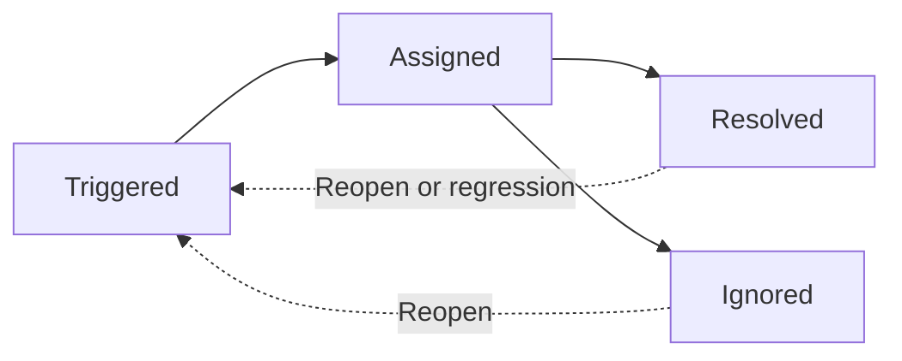

# Source: https://docs.gitguardian.com/public-monitoring/detect-public-secret-incidents/incident-statuses.md

# Source: https://docs.gitguardian.com/internal-monitoring/detect/incident-statuses.md

# Incident statuses

> Understand the lifecycle of secret incidents in internal monitoring, including Triggered, Assigned, Resolved, and Ignored statuses.

:::info
A secret incident can be in one of two overall states:
- **Open**: including Triggered and Assigned statuses
- **Closed**: including Resolved and Ignored statuses
:::

**Triggered**: A triggered incident is an incident detected and stored by GitGuardian but not yet investigated by a member of your
dashboard.

**Assigned**: An assigned incident is being investigated by a specific member of the dashboard. It is not resolved or ignored yet.

**Resolved:** A resolved incident is an incident considered as remediated. In the case of secrets incidents, you must revoke the secret (and optionally erase all evidence from the git history) before considering it resolved.

> Erasing all evidence from the git history is optional and depends on your code policy.

- If you consider a new occurrence of an incident that has already been resolved to be problematic, you will want the regression behavior enabled. When the regression behavior is turned `On`, GitGuardian will reopen this incident and alert you again. The regression behavior only applies to occurrences detected through real time monitoring. A resolved incident won't be reopened if a new occurrence is uncovered by a historical scan.
- If rewriting the git history is not important to you and only revocation matters, you can turn `Off` the regression behavior and GitGuardian will silently add the occurrence to the existing resolved incident without delivering any notifications.
  > The regression behavior can be configured in the [General section of your settings](https://dashboard.gitguardian.com/settings/workspace/general).

**Ignored**: An ignored incident is an incident not considered as such by a member of your team and does not require remediation.
For secrets incidents, ignore reasons can be:

- this is not a secret (false positive)
- this is test credential
- this is low risk secret

> Ignoring an incident means that you don't want GitGuardian to consider it anymore. If a new occurrence appears for an ignored incident, GitGuardian will not reopen it or alert you.

## Lifecycle of an incident

### 1. Receiving incidents alerts

As explained in the section [How Internal Monitoring works](../core-concepts/how-internal-monitoring-works), GitGuardian scans every commit in real-time and sends an alert **upon detection of a new incident**. All the members of the dashboard are alerted by email, and on their alerting integrations, in order to tackle the new incident as quickly as possible.

> Note that for incidents detected thanks to historical scanning, we do not send an alert per incident but rather an email recap with all the incidents discovered on a given historical scan.

As mentioned above, all the members of the dashboard receive alert upon regression of an already-resolved incident.

### 2. Assigning incidents

Investigation and remediation of an incident can take some time. So let your teammates know that you are **currently working on a given incident**, by declaring the assignee, in order not to duplicate work within your team.

**Prioritizing and knowing which incident is more severe than another can be very challenging**, especially when you are dealing with a large number of incidents. Have a look at our [Prioritize and explore guide](../remediate/prioritize-incidents.md) to read our good pratices for spotting the incidents you need to tackle first.

### 3. Collaborate and remediate

Once you decide which incident you want to work on, a new phase of collaboration and remediation starts. GitGuardian helps you by providing as much as **contextual information** as possible and features that help you **get in touch with the appropriate stakeholders** and **check that the incident has been properly remediated**. Read more about this topic in our [Remediating incidents](../remediate/remediate-incidents.md) section.

Ultimately, you can resolve or ignore the incident. You will always have the possibility to reopen it manually. In the specific case of resolved incidents for which new occurrences are detected again, you can configure GitGuardian to automatically re-open incidents and receive alerts or not by choosing your preferred [Regression setting.](https://dashboard.gitguardian.com/settings/workspace/general)

All user activity and team notes attached to a given incident can be found in the **Timeline section** of the incident page.

