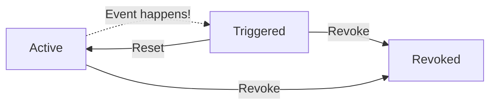

# Source: https://docs.gitguardian.com/honeytoken/respond.md

# Respond to a triggered honeytoken

> Covers the honeytoken lifecycle and how to respond to a triggered honeytoken by resetting it or revoking it.

GitGuardian helps you by providing as much contextual information as possible about the events and some general guidelines:

## The lifecycle of a honeytoken

The lifecycle of a honeytoken and the possible actions are shown in the following schema:

## Reset a triggered honeytoken

If your investigation has determined that the trigger alert was a false alarm, such as when one of your developers genuinely tried to use the honeytoken, or when it was triggered for test purpose, you should reset the honeytoken.

Resetting the honeytoken changes its status back to Active, allowing it to be triggered again on future attempts.

After resetting, your honeytoken is as good as new!

## Revoke a triggered honeytoken

If your investigation has confirmed a real security incident, and you have taken the necessary steps to remediate the incident and ensure that your environment is protected, it is important to revoke the triggered honeytoken. This honeytoken is now compromised and thus useless.

Revoking the honeytoken will deactivate it entirely by deleting the associated AWS key pair. Events will no longer be logged on this honeytoken.

:::caution
Remember to create a new honeytoken to replace the compromised one in order to be alerted of new incidents in the same environment!
:::

