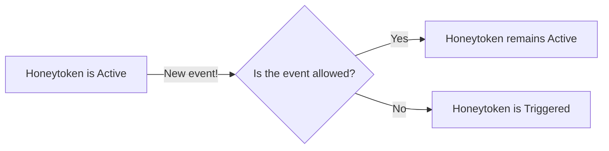

# Source: https://docs.gitguardian.com/honeytoken/understand-events.md

# Understand honeytoken events and trigger mechanism

> Describes honeytoken events, the trigger mechanism, event data and tags, event states, and IP rules for enriching and managing events.

An event in the context of honeytokens represents the recorded use of a honeytoken. When a honeytoken is in `Active` status, any new event will immediately change its status to `Triggered`, initiating the corresponding alerts.

:::info Exception
The trigger mechanism differs for allowed events. See the [related section](#open-vs-archived-vs-allowed-events) for more details.
:::

## Events data

Events can be seen in the honeytoken detail page. For AWS honeytokens, you can observe the following information:

- **Timestamp**: The exact moment of honeytoken usage
- **IP address and country**: Location information linked to the honeytoken usage
- **User-agent**: The accessing software's identity (may be blank).
- **Action**: Specific action performed like `GetCallerIdentity`, `ListBuckets`, etc.

## Events tags

Event tags provide additional context based on the event's IP address.

You can create custom tags using the [IP rules](#ip-rules-configuration) settings. Furthermore, GitGuardian manages some default tags:

- `GitGuardian Public Monitoring IP`: Implies the event originates from an IP address used by GitGuardian to monitor public GitHub. This indicates that the honeytoken itself has been leaked and is publicly exposed on GitHub.
- `AWS internal IP`: Signifies the event originates from within AWS, commonly occurring when a honeytoken is publicly exposed on GitHub. Note that for this particular case there is no actual IP address attached to the event.

## Open vs. archived vs. allowed events

Events can be categorized into three states:

- **Open**: The default state of events.
- **Archived**: Initiated by resetting or revoking a honeytoken, resulting in the archiving of all open events..
- **Allowed:**: Events from IPs on the allow-list, ignored by the trigger mechanism.

Archived and allowed events remain present, but they are hidden by default. You can use the status filter in the Events section to see them.

Both archived and allowed events are still stored but are hidden by default. Use the status filter in the Events section to view them. Archived and allowed events are displayed in grey, with allowed events marked by a green tick next to the IP address.

## Pausing events reception

When a honeytoken accumulates 100 open events, the reception of new events will be paused. We pause event reception at this threshold because additional events beyond this number are unlikely to provide new information and could negatively impact performance.

This situation typically occurs in the following scenarios:

- The honeytoken becomes [publicly exposed on GitHub](./code-leakage), causing scanners to detect and test it. In this case, the honeytoken should definitely be considered compromised, and revoked.
- Some internal and known tools regularly call the honeytoken for legitimate reasons. In this case, you may want to [allow](#ip-allowlisting) these calls and then reset the honeytoken.

Note that events reception will resume if the honeytoken is reset, as this action resets the count of open events to zero.

## Using IP rules to enrich and manage events

IP rules help in declaring known IP ranges for better identification and management of events, serving two purposes: IP tagging and IP allow-listing.

### IP tagging

The feature enables you to attach custom tags to events based on IP addresses, useful for identifying events from familiar sources like your company's internal network.

### IP allowlisting

Each tag and its associated IP range can be added to an allowlist. Events from these IPs are ignored and do **not** trigger the honeytoken.

:::caution
Handle this feature cautiously as it might lead to overlooking unauthorized attempts on your honeytokens.
:::

Events from allowed IPs are recorded but greyed out and excluded by default. You can opt to display them using the “status” filter.

### IP rules configuration

To manage custom IP rules, go to Settings > Honeytoken > [IP rules](https://dashboard.gitguardian.com/settings/secrets/honeytoken).

While GitGuardian sets some uneditable rules, you can create and manage your own using valid CIDRs for IP ranges.

:::caution No retroactive application of the IP rule on existing events
Adding, modifying, or deleting IP rules won't affect existing honeytoken events. Only future events will be impacted.
:::

:::info Behavior in case of several rules for same IP range
Multiple rules for the same IP range are allowed. Events matching these rules receive all associated tags. If any rule has "allow-list" selected, those events will be considered 'allowed', except for events from GitGuardian Public Monitoring IPs, which cannot be overridden.
:::
