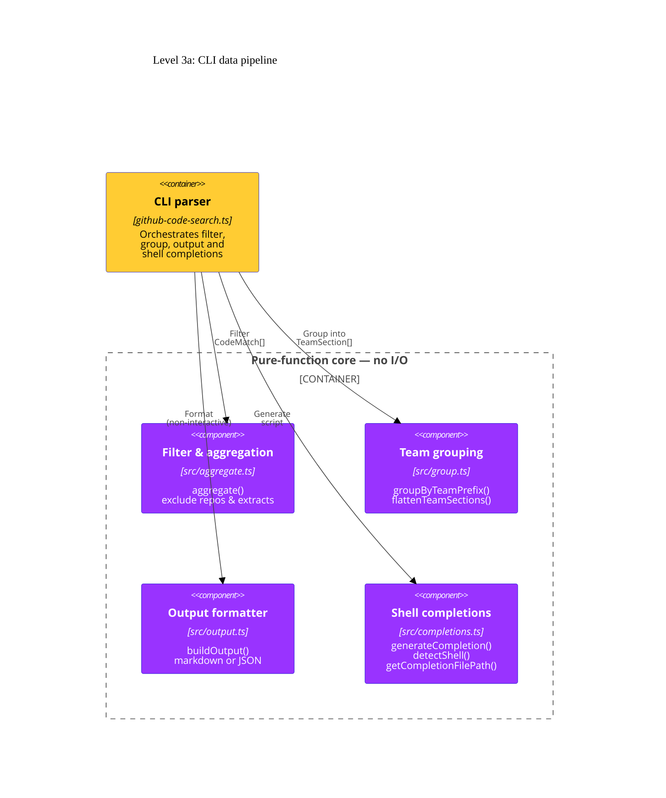
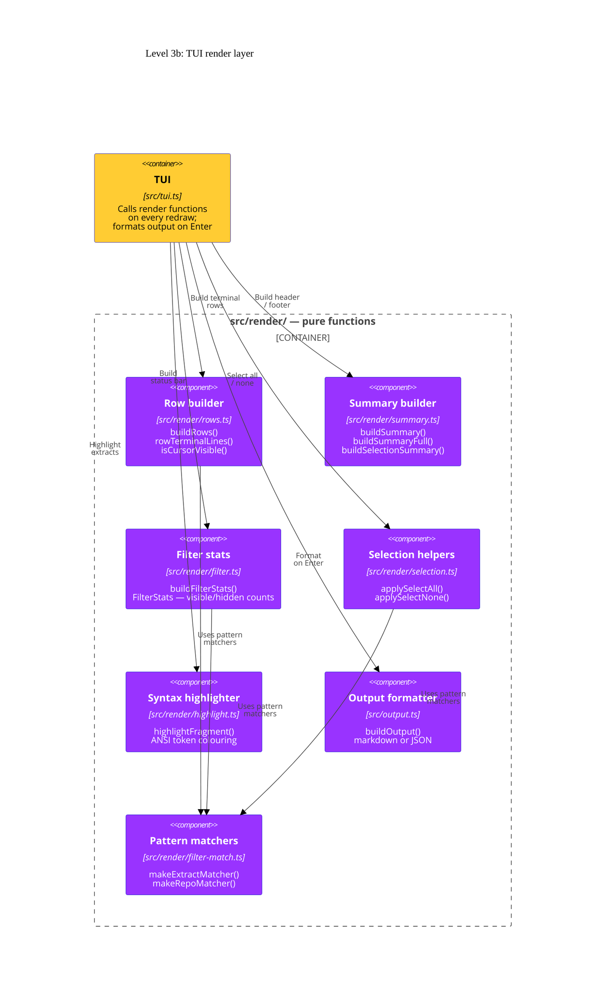

# Level 3: Components

The pure-function core is split into two focused diagrams: the **CLI data pipeline**
(filter → group → format) and the **TUI render layer** (all display components).
Every component is side-effect-free and fully unit-tested.

## 3a — CLI data pipeline

The three pure functions called by the CLI parser to transform raw API results
into a filtered, grouped, formatted output.

## 3b — TUI render layer

The render-layer modules called by the TUI on every redraw. Most live in
`src/render/` and are re-exported through the `src/render.ts` façade;
`src/output.ts` is the output formatter invoked on confirmation and `src/render/filter-match.ts`
provides shared pattern-matching helpers used by several render modules.

## Component descriptions

| Component                | Source file                  | Key exports                                                                                                                                                                                         |
| ------------------------ | ---------------------------- | --------------------------------------------------------------------------------------------------------------------------------------------------------------------------------------------------- |
| **Filter & aggregation** | `src/aggregate.ts`           | `aggregate()` — filters `CodeMatch[]` by repository and extract exclusion lists; normalises both `repoName` and `org/repoName` forms.                                                               |
| **Team grouping**        | `src/group.ts`               | `groupByTeamPrefix()` — groups `RepoGroup[]` into `TeamSection[]` keyed by team slug; `flattenTeamSections()` — converts back to a flat list for the TUI row builder.                               |
| **Shell completions**    | `src/completions.ts`         | `generateCompletion(shell)` — returns the full bash/zsh/fish completion script; `detectShell()` — reads `$SHELL`; `getCompletionFilePath(shell, opts)` — resolves the XDG-aware installation path.  |
| **Row builder**          | `src/render/rows.ts`         | `buildRows()` — converts `RepoGroup[]` into `Row[]` filtered by the active target (path / content / repo); `rowTerminalLines()` — measures wrapped height; `isCursorVisible()` — viewport clipping. |
| **Summary builder**      | `src/render/summary.ts`      | `buildSummary()` — compact header line; `buildSummaryFull()` — detailed counts; `buildSelectionSummary()` — "N files selected" footer.                                                              |
| **Filter stats**         | `src/render/filter.ts`       | `buildFilterStats()` — produces the `FilterStats` object (visible repos, files, matches) used by the TUI filter bar live counter.                                                                   |
| **Pattern matchers**     | `src/render/filter-match.ts` | `makeExtractMatcher()` — builds a case-insensitive substring or RegExp test function for path or content targets; `makeRepoMatcher()` — wraps the same logic for repo-name matching.                |
| **Selection helpers**    | `src/render/selection.ts`    | `applySelectAll()` — marks all visible rows as selected (respects filter target); `applySelectNone()` — deselects all visible rows.                                                                 |
| **Syntax highlighter**   | `src/render/highlight.ts`    | `highlightFragment()` — maps file extension to a language token ruleset and applies ANSI escape sequences. Falls back to plain text for unknown extensions.                                         |
| **Output formatter**     | `src/output.ts`              | `buildOutput()` — entry point for both `--format markdown` and `--format json` serialisation of the confirmed selection.                                                                            |

## Design principles

- **No I/O.** Every component in this layer is a pure function: given the same inputs it always returns the same outputs. This makes them straightforward to test with Bun's built-in test runner.
- **Single responsibility.** Each component owns exactly one concern (rows, summary, selection, …). The TUI composes them at render time rather than duplicating logic.
- **`types.ts` as the contract.** All components share the interfaces defined in `src/types.ts` (`TextMatchSegment`, `TextMatch`, `CodeMatch`, `RepoGroup`, `Row`, `TeamSection`, `OutputFormat`, `OutputType`, `FilterTarget`). Changes to these types require updating all components.
- **`render.ts` as façade.** External consumers import from `src/render.ts`, which re-exports all symbols from the `src/render/` sub-modules plus the top-level `renderGroups()` and `renderHelpOverlay()` functions.
