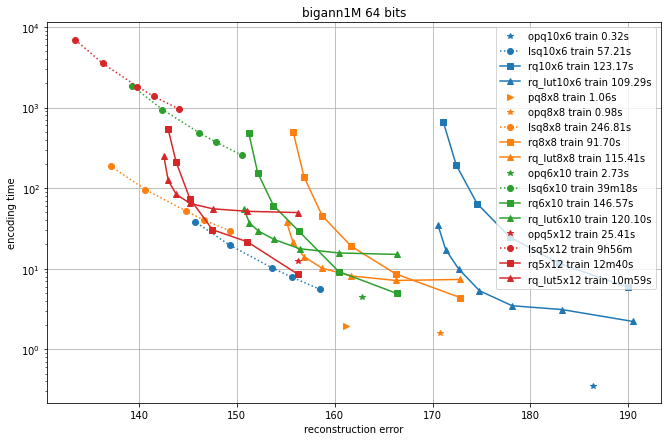
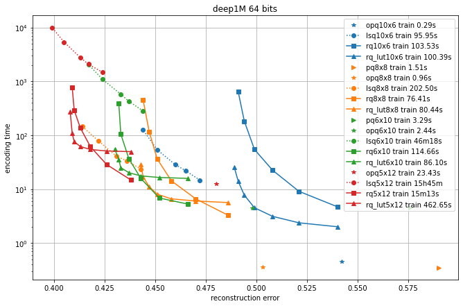
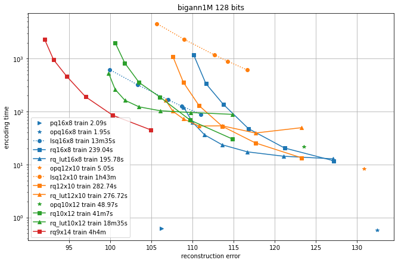
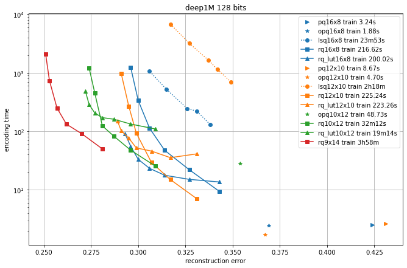
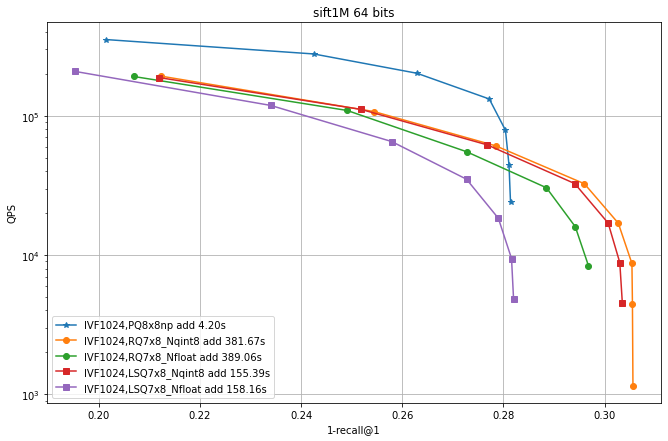
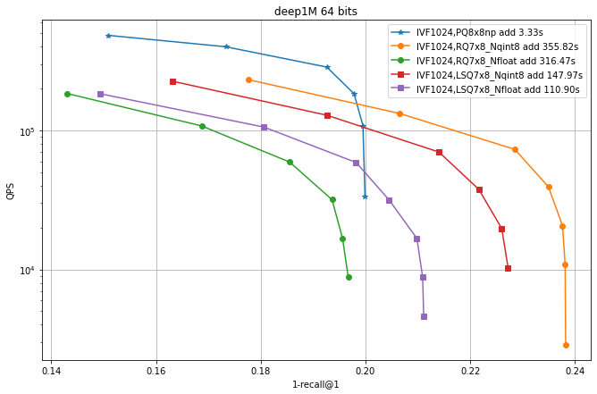
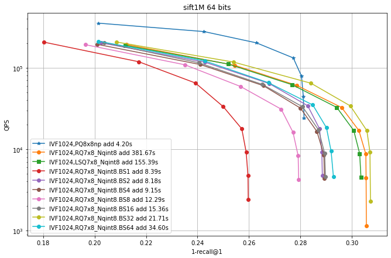
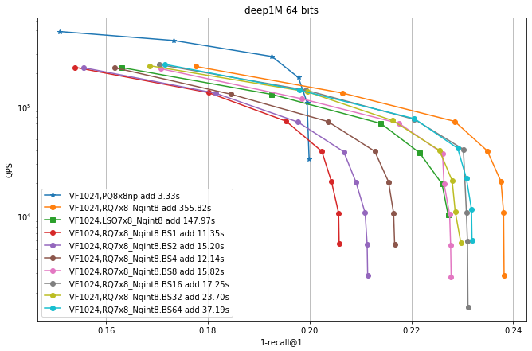
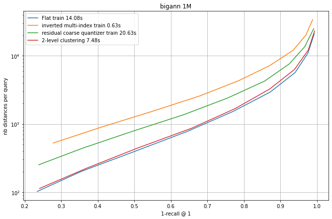
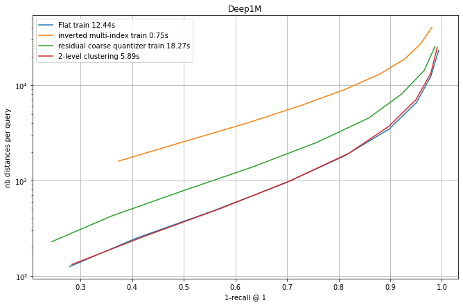

An additive quantizer approximates a vector $x$ in dimension $d$ as 

$$
   x \approx x' = T_1[i_1] + ... + T_M[i_M]
$$

where $T_m$ is a table of $d$-dimensional vectors indexed by $i_m$. 
The size of table m is $K_m$. 
The code that is stored to represent $x$ is $(i_1,..., i_M)$. 
It is of size $\lceil \log_2(K_1) \rceil + ... + \lceil log_2(K_M)) \rceil$ bits.

As usual with data-adaptive quantizers, the tables $T_1, ..., T_M$ are learned on a training set. 

The product quantization can be considered as a special case of additive quantization where only a sub-vector of size $d/M$ is non-zero in each table $T_m$. 

A good introduction to additive quantization is [Additive quantization for extreme vector compression](https://www.cv-foundation.org/openaccess/content_cvpr_2014/html/Babenko_Additive_Quantization_for_2014_CVPR_paper.html), Babenko and Lempitsky, CVPR'14.

# Faiss implementation

The Faiss implementation is based on the [`AdditiveQuantizer`](https://github.com/facebookresearch/faiss/blob/master/faiss/impl/AdditiveQuantizer.h) object.

The Faiss implementation imposes that $K_m$ is a power of two. 
It does not in general impose that the $K_m$'s are all identical. 

The decoding of an additive quantizer is unambiguous. 
However there is no simple method to (1) train an additive quantizer and (2) perform the encoding. 
Therefore, Faiss contains two implementations of additive quantizers: the Residual Quantizer and the Local Search Quantizer. 

## The residual quantizer 

The Faiss residual quantizer is in the [`ResidualQuantizer`](https://github.com/facebookresearch/faiss/blob/master/faiss/impl/ResidualQuantizer.h) object. 

In a residual quantizer, the encoding is sequential. 
At stage $m$ of the encoding of $x$, the encoder picks the entry that best reconstructs the residual of vector $x$ w.r.t. the previous encoding steps:

$$
  i_m = \underset{j=1..K_m}{\mathrm{argmin}} || T_m(j) - (x - T_1[i_1] - ... - T_{m-1}[i_{m-1}]) ||^2 
$$

This is a greedy approach, which tends to get trapped in local minima.
To avoid the local minima, the encoder maintains a beam of possible codes and picks the best code at stage M. 
The beam size is given by the `max_beam_size` field of `ResidualQuantizer`: the larger the more accurate, but also the slower.  

At training time, the tables are trained sequentially by k-means at each step. The `max_beam_size` is also used for that. 
The `ResidualQuantizer` supports a version of k-means that starts training in a lower dimension, as described in ["Improved Residual Vector Quantization for High-dimensional Approximate Nearest Neighbor Search"](https://arxiv.org/abs/1509.05195), Shicong et al, AAAI'15.
We found that this k-means implementation was more useful for residual quantizer training than for k-means used in non-recursive settings (like IVF training).
The alternative k-means is implemented in the [`ProgressiveDimClustering`](https://github.com/facebookresearch/faiss/blob/master/faiss/Clustering.h#L142) object.


## The Local Search Quantizer

The LSQ quantizer is from ["LSQ++: Lower running time and higher recall in multi-codebook quantization"](https://openaccess.thecvf.com/content_ECCV_2018/html/Julieta_Martinez_LSQ_lower_runtime_ECCV_2018_paper.html), Julieta Martinez, et al. ECCV 2018. 
It is implemented in the [`LocalSearchQuantizer`](https://github.com/facebookresearch/faiss/blob/master/faiss/impl/LocalSearchQuantizer.h) object.

At encoding time, LSQ starts from a random encoding of the vector and proceeds to a simulated annealing optimization to optimize the codes. 
The parameter that determines the speed vs. accuracy tradeoff is the number of optimization steps `encode_ils_iters`. 

The Faiss LSQ implementation is limited to constant codebook sizes $K_1 = ... = K_M$.


# Additive quantizer factory strings quick start


# As a codec 

The simplest usage of the additive quantizers is as codecs. 
Like other Faiss codecs, they have a `compute_codes` function and a `decode` function. 

Since encoding is approximate and iterative, the tradeoff between them is mainly on encoding time vs. accuracy. 

In the following, we compare different quantizers in terms of reconstruction error and recall for symmetric comparison. 

## Comparison of the additive quantizer options

We compare the additive quantizer options on the Deep1M and Bigann1M datasets (bigann rather than SIFT1M because we need more than 100k training vectors). 
The results are in terms of average symmetric L2 encoding error, to be comparable with the [Codec benchmarks](https://github.com/facebookresearch/faiss/wiki/Vector-codec-benchmarks#sift1m).
The regimes are in 64 bits and 128 bits.
Since the limiting factor of additive quantizers is often the encoding time, we plot the accuracy vs. encoding time.
The different operating points for a given codec are obtained by varying the `max_beam_size` parameters (for the residual quantizer) or the `encode_ils_iters` parameter (for the LSQ). 

### 64-bit results




### 128-bit results




One can observe that: 

- the PQ variants (PQ and OPQ) are the fastest options by far

- it is worthwhile to experiment with other sizes than the traditional 8-bit elementary quantizers. 
Many interesting operating points are obtained with laerger vocabularies (although training time can be prohibitive)

- for most use cases, the residual quantizer is better than LSQ

- for the residual quantizer, the encoding with look-up tables (rq_lut) is interesting for high values of max_beam_size (and also when the data dimensionality increases, but this is not shown in the plots). This is enabled by setting `use_beam_LUT` to 1 in the quantizer object.


<details><summary>How to generate</summary>

Code: 
[benchs/bench_quantizer.py](https://github.com/facebookresearch/faiss/blob/master/benchs/bench_quantizer.py)

Driver script: 
```
for dsname in deep1M bigann1M ; do

    for q in pq rq lsq rq_lut; do
        for sz in 8x8 6x10 5x12 10x6    16x8 12x10 10x12 9x14 8x16; do
            run_on_half_machine BQ.$dsname.$q.$sz.j \
                /usr/bin/time -v python -X faulthandler -u $code/benchs/bench_quantizer.py $dsname $sz $q
        done
    done
done
```

Plot with: [this notebook](https://gist.github.com/mdouze/62bcfe432101eea3a09ab39ec0b468d4).

</details>

### Implementation of `use_beam_LUT=1` for residual quantizers 

At each encoding step $m=1..M$, we need to compute the distance of the beam entries to the query. 

$$
  i_m = \underset{j=1..K_m}{\mathrm{argmin}} \underbrace{|| T_m(j) - (x - T_1[i_1] - ... - T_{m-1}[i_{m-1}]) ||^2 }_{D_j}
$$

Instead of computing the residuals explicitly, `use_beam_LUT` decomposes this distance into

$$
  D_j = || T_m(j) ||^2 + || x - T_1[i_1] - ... - T_{m-1}[i_{m-1}] ||^2 - 2 \langle T_m(j), x \rangle + 2 \Sigma_{\ell=1}^{m-1} \langle T_m(j), T_\ell(i_\ell) \rangle
$$

The four terms are computed as follows: 

* $|| T_m(j) ||^2$ is stored in the `cent_norms` table 

* $|| x - T_1[i_1] - ... - T_{m-1}[i_{m-1}] ||^2$ is the encoding distance of step $m -1$

* $\langle T_m(j), x \rangle$ is computed on entry to the function (it is the only component whose computation complexity depends on $d$). 

* $\Sigma_{\ell=1}^{m-1} \langle T_m(j), T_\ell(i_\ell) \rangle$ is stored in the `codebook_cross_products` table. 

It appears that this approach is more interesting in high dimension ($d$ large) but not too many quantization steps (because the computation of the 3rd term grows quadratically with $M$). 

# Flat indexes

Additive quantizers can be used to do compressed-domain distance comparisons to do efficient comparisons between one query and many encoded vectors. 
The flat indexes are implemented in `IndexAdditiveQuantizer`, parent class of `IndexResidualQuantizer` and `IndexLocalSearchQuantizer`.
The search function depends only on the additive quantization decoder, therefore it is in common between the two child classes.

## LUT implementation 

For a given query q, it is possible to precompute look-up tables 

$$
  \mathrm{LUT}_m[i] = \langle T_m[i], q \rangle \hspace{4ex} \forall m=1..M, i=1..K_m
$$

Then the dot product with x' encoded as $[i_1,..., i_M]$ is: 

$$
  \langle q, x \rangle \approx \langle q, x' \rangle = LUT_1[i_1] + ... + LUT_m[i_M]
$$

## The issue with L2 search and storing the norm

LUTs cannot be used directly to compute L2 distances. However, 

$$
  ||q - x'||^2 = ||q||^2 + ||x'||^2 - 2 \langle q, x' \rangle
$$

Therefore if the norm of $||x'||$ is stored, the distances can be computed. 
This is determined by the `search_type` field in the `AdditiveQuantizer` object. 

It can take the following values: 

- `ST_decompress`: no norm stored, decompress database vector at runtime

- `ST_LUT_nonorm`: just treat ||x'|| = 0 (may be OK for normalized vectors)

- `ST_norm_float`, `ST_norm_qint8`, `ST_norm_qint4`: use various levels of compression

## Evaluation

TODO 

# IVF indexes with additive quantizer codes 

The additive quantizers can be used as a drop-in replacement for product or scalar quantization: 
the database vectors x are then stored in different buckets, as determined by a first-level coarse quantizer. 

This is implemented in the objects `IndexIVFAdditiveQuantizer`, `IndexIVFResidualQuantizer` and `IndexIVFLocalSearchQuantizer`.

In addition, each bucket is associated to a centroid $c$ given by the coarse quantizer. 
Is usually more accurate to encode the residual vector $x-c$ since it usually has a lower norm. 
The flag `by_residual` determines whether the vector is stored directly or by residual. 

## Evaluation 


For datasets of scale 1M elements, we keep the coarse quantizer the same (Flat, 1024 centroids). 
Then we compare the speed vs. accuracy tradeoff of the IVF variants, varying the `nprobe` parameter. 
We also indicate the addition time, because as before the encoding time can be a limiting factor.
See [The index factory](https://github.com/facebookresearch/faiss/wiki/The-index-factory) for an explanation of the quantizer strings.

### Comparison of LSQ and residual quantizer




Observations: 

- IVF PQ is faster than the additive quantizer variants. This is mainly because the precomputed tables options is not implemented for the additive quantizers yet. 

- for the additive quantizers we fixed the size to 7x8 bits plus 8 bits of norm (`qint8`), so that the total size is 64 bits like PQ8x8. 
Suprisingly, the exact encoding of the vectors (_Nfloat) is not necessarily better than quantizing it to 8 bits (_Nqint8)

- The additive quantizer options have a significant advantage in terms of accuracy.

- LSQ addition is faster than for the residual quantizers.

In this experiment the residual quantizer beam size was fixed at 30. 
In the following we vary this parameter.

### residual quantizer with look-up tables

Here we enable LUTs, with `use_beam_LUT=1`. 
Then we vary the beam size (hence the BSx suffix).




Observations: 

- enabling look-up tables makes RQ encoding much faster

- the largest beam is not necessarily the most accurate. 

<details><summary>How to generate</summary>

Code: 
[benchs/bench_all_ivf/bench_all_ivf.py](https://github.com/facebookresearch/faiss/blob/master/benchs/bench_all_ivf/bench_all_ivf.py)

Driver script: 
```
for dsname in sift1M deep1M; do

    for indexkey in \
        IVF1024,RQ7x8_Nqint8 IVF1024,RQ7x8_Nfloat IVF1024,PQ8x8 \
        IVF1024,LSQ7x8_Nqint8 IVF1024,LSQ7x8_Nfloat
    do
        run_on_half_machine IVFQ.$dsname.$indexkey.f \
            python -u $code/benchs/bench_all_ivf/bench_all_ivf.py --db $dsname --indexkey $indexkey
    done

    for indexkey in IVF1024,PQ8x8np
    do
        run_on_half_machine IVFQ.$dsname.$indexkey.d \
            python -u $code/benchs/bench_all_ivf/bench_all_ivf.py --db $dsname --indexkey $indexkey --autotune_range ht:64
    done

    run_on_half_machine IVFQ.$dsname.IVF1024,RQ8x8_Nnone.c \
            python -u $code/benchs/bench_all_ivf/bench_all_ivf.py --db $dsname --indexkey IVF1024,RQ8x8_Nnone

    run_on_half_machine IVFQ.$dsname.IP.IVF1024,RQ8x8_Nnone.c \
            python -u $code/benchs/bench_all_ivf/bench_all_ivf.py --force_IP --db $dsname --indexkey IVF1024,RQ8x8_Nnone

done

for beam_size in 1 2 4 8 16 32 64; do
    for dsname in sift1M deep1M; do

        for indexkey in  IVF1024,RQ7x8_Nqint8 IVF1024,RQ7x8_Nfloat
        do
            run_on_half_machine IVFQ.$dsname.$indexkey.BS$beam_size.a \
                python -u $code/benchs/bench_all_ivf/bench_all_ivf.py \
                  --db $dsname --indexkey $indexkey --RQ_use_beam_LUT 1 \
                  --RQ_beam_size $beam_size
        done

    done
done

```

Plot with: [this notebook](https://gist.github.com/mdouze/62bcfe432101eea3a09ab39ec0b468d4).

</details>


# Additive coarse quantizers 

Every quantizer has a set of reproduction values, ie. the span of elements that it can decode. 
If the number of values is not too large, they can be considered as a set of centroids. 
By performing nearest-neighbor search in the set of centroids, we obtain a coarse quantizer for an IVF index. 

Visiting `nprobe` > 1 buckets is supported naturally by searching for the `nprobe` nearest centroids. 

Compared to a "flat" coarse quantizer, the accuracy is a bit lower. 
However, the assignment is more efficient and the coarse quantizer codebook is much more compact. 

The coarse quantizer versions are `AdditiveCoarseQuantizer` and its children `ResidualCoarseQuantizer` and `LocalSearchCoarseQuantizer`. 

## Coarse quantizer search

For coarse quantizers with L2 distance, the norms of all centroids are stored by default for efficiency in the `centroids_norms`. 
To disable this storage, set the `ResidualQuantizer::Skip_codebook_tables` bit in  `rcq.rq.train_type`. 

There are two ways of searching the nearest centroids, which are selected using the `beam_factor` field of `ResidualCoarseQuantizer`:

- the `ResidualCoarseQuantizer` uses beam search by default to find the nearest centroids. 
The size of the beam is `beam_factor` * `nprobe`. 

- exhaustive search (`beam_factor` is set to a negative value): the distances to all centroids are computed and the `nprobe` nearest centroids are kept. 
Here the norms are required so `Skip_codebook_tables` cannot be set.
`LocalSearchCoarseQuantizer` always uses exhaustive search.

The `set_beam_factor` method sets the `beam_factor` field, does some checks and computes the tables if required.


## Evaluation 

We compare four coarse quantization options: a flat quantizer, an IMI (inverted multi-index) quantizer and the residual coarse quantizer. 

The fourth option is a 2-level quantization. This is one very simple approach was suggested by Harsha Simhadri, from Microsoft, who organizes the [billion-scale ANN challenge](https://big-ann-benchmarks.com/). It simply consists in doing a two-level hierachical clustering to obtain the centroids. However, the centroids are then considered in a full table (ie. there is no hierarchical routing at assignment time).

Each experiment runs an IndexIVFFlat with different quantizers that all produce nlist = 128^2 = 16384 centroids. At search time, different settings of nprobe obtain a tradeoff between the 1-recall@1 and the the number of distances computed (a reproducible proxy for search time).




Observations: 

- flat quantization and 2-level clustering the best options, but they require to store all centroids. 
Among the "compact" options, RCQ is significantly more accurate than IMI.

- The training times are indicated. This is a small scale experiment, the training time grows quadratically for the flat index (that is already the slowest).

- For the 2-level clustering and the flat options the full set of centroids needs to be searched at addition time. It is usual to do this with a HNSW index on top of the centroids. However, in this small-scale case, the HNSW index is so accurate that the difference with the curves is not visible.


Evaluation code: [large_coarse_quantizer.ipynb](https://gist.github.com/mdouze/4d8cd80b97eee9db2225133d4e931cc6)

## Splitting a residual quantizer into prefix and suffix

There is a special property of residual quantizers: a flat IndexResidual can be converted without re-encoding into an IndexIVFResidual. 
This works as follows: 

- codes are split into a prefix and a suffix, for example $[i_1,..,i_3]$ and $[i_4,...,i_M]$

- the residual codec is split into a `ResidualCoarseQuantizer` for the first 3 codebooks and an IndexIVFResidual for the remaining M-3 ones.

- the codes [i_4, ... , i_M] are stored in the inverted lists 

At search time, the distances computed are equivalent to the flat IndexResidual, except that the search can be performed in a non-exhaustive way. 

This is tested in [test_residual_quantizer.TestIndexResidualQuantizer.test_equiv_rq](https://github.com/facebookresearch/faiss/blob/master/tests/test_residual_quantizer.py)

<!-- 

## Summary of how computations are performed 

This section recaps how the computations are performed (because it is not always obvious!)

### `AdditiveCoarseQuantizer` search 

Here we search in the set of possible centroids of the quantizer. 
The assumption is that the number of centroids is "small", ie. they can be enumerated. 

There are two cases: 

* by default it uses [`AdditiveQuantizer::knn_centroids_inner_product`](https://github.com/facebookresearch/faiss/blob/main/faiss/impl/AdditiveQuantizer.h#L181) and [`AdditiveQuantizer::knn_centroids_L2`](https://github.com/facebookresearch/faiss/blob/main/faiss/impl/AdditiveQuantizer.h#L195) for inner product and L2 search respectively. 
For L2 search, the norms of the centroids must be available, see [Coarse Quantizer Search](https://github.com/facebookresearch/faiss/wiki/Additive-quantizers#coarse-quantizer-search)

* 


### `AdditiveQuantizer` encode 

Here we also search, for each vector to encode, the (single) nearest centroid in the quantizer's set of centroids. 
However, in this case, it is almost impossible to enumerate the set of centroids because useful encoding sizes start at 64 bits. 


### `AdditiveQuantizer` search 

Here the task is to compute the distances to compressed codes. 
This is straightforward for inner products, a bit less for L2 distances. 

How distances are computed depends on the `search_type` field: 

* if `ST_decompress` then the vectors are decompressed and the distances are computed explicitly 

* otherwise, it is done using look-up tables, see [LUT implementation](https://github.com/facebookresearch/faiss/wiki/Additive-quantizers/_edit#lut-implementation).

### `IndexIVFAdditiveQuantizer` search

This uses `InvertedListScanners` that perform either decompression or LUT-based distance computations, see [IndexIVFAdditiveQuantizer.cpp](https://github.com/facebookresearch/faiss/blob/main/faiss/IndexIVFAdditiveQuantizer.cpp#L239)


| Method                                     | Class name      | `index_factory` | Main parameters | Bytes/vector | Exhaustive | Comments |
|--------------------------------------------|-----------------|-----------------|-----------------|--------------|------------|----------|
| Exact Search for L2                        | `IndexFlatL2`   | `"Flat"`        | `d`             | `4*d`             | yes | brute-force |

--> 