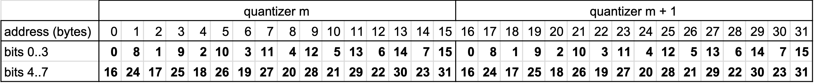
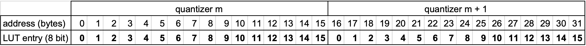

## What is this?

Most product quantizer (PQ) decompositions use 8 bits per sub-vector, which is convenient because it is byte-aligned. At search time, the look-up tables are stored in RAM (hopefully in cache) and can be used for distance computations, see equation (13) in [Product quantization for nearest neighbor search](https://hal.inria.fr/inria-00514462/document).

However, modern CPUs are more efficient when computing arithmetic operations than doing memory look-ups. One way to avoid this is to degrade to less powerful vector encodings (like binary or scalar decompositions).

Another way is to store the search-time look-up tables in **registers**. This idea was introduced in ["Cache locality is not enough: high-performance nearest neighbor search with product quantization fast scan", André et al, VLDB 15](http://www.vldb.org/pvldb/vol9/p288-andre.pdf), hence the name "fast-scan" of the current implementation.

## Implementation

The [`IndexPQFastScan`](https://www.internalfb.com/intern/diffusion/FBS/browsefile/master/fbcode/faiss/IndexPQFastScan.h) and [`IndexIVFPQFastScan`](https://www.internalfb.com/intern/diffusion/FBS/browsefile/master/fbcode/faiss/IndexIVFPQFastScan.h) objects perform 4-bit PQ fast scan. The implementation is heavily inspired by Google's [SCANN](https://github.com/google-research/google-research/tree/master/scann).

They do not inherit directly from `IndexPQ` and `IndexIVFPQ` because the codes are "packed" in batches of bbs=32 (64 and 96 are supported as well but there are few operating points where they are competitive).

Fitting look-up tables in registers is possible only under the following conditions:

- there must be many vector registers and there must be a look-up instruction (aka. shuffle). This is supported on architectures like the Intel AVX (16 256-bit registers, only platform supported currently) or ARM Neon (32 128-bit registers).

- the LUT tables must be short: 8-bit PQ produces 256 LUT entries, so reduce it to 4-bit.

- the LUT table entries must be small: we cannot afford to store floating point entries, so they are quantized to 8 bit per entry.

## Re-ranking 

Since the 4-bit PQ has a relatively low accuracy (PQ32x4 is significantly less accurate than PQ16x8 although they use the same amount of memory), it is useful to perform a re-ranking stage with exact distance computations.

This is supported via the `IndexRefine` object. It manages two indexes, the second one refining the results from the first index. For example, if we need k=10 results, we query `k` * `k_factor` = 100 elements in the first index and compute exact (or more accurate) distances for these results and return the `k` first ones.

The drawbacks are that this requires to store a larger index, which needs to be controlled in memory-constrained settings, and there is one additional parameter (`k_factor`) to tune.

## Factory strings

Faiss indexes can be constructed with the [`index_factory` function](https://github.com/facebookresearch/faiss/wiki/The-index-factory) that builds an index from a string.

The new PQ variants are supported via new factory strings: 

- PQ32x4fs means using the "fast-scan" variant of PQ32x4. They can be prefixed with IVFxx to generate an IVF index. IVFy,PQ32x4fsr is the IVF variant where PQ encodes the residual vector relative to the centroid (more accurate but slightly slower).

- the refinement was already supported via the `RFlat` suffix. Any index as refinement is now supported via `Refine(SQ8)` which means refine using a `SQ8` index.

- the 4-bit PQ is also useful as a coarse quantizer. Therefore, the IVF factory string has been generalized to `IVF1000(PQ32x4fs,Rflat)` which means using `PQ32x4fs,Rflat` as a coarse quantizer to quantize to 1000 centroids.

See a complex example [here](https://github.com/facebookresearch/faiss/wiki/The-index-factory#example). 

## Performance

[Comparison with SCANN](https://github.com/facebookresearch/faiss/wiki/Indexing-1M-vectors#4-bit-pq-comparison-with-scann): The speed-accuracy tradeoff of the Faiss 4-bit PQ fast-scan implementation is compared with SCANN on 4 1M-scale datasets. Basically, it is at least as fast and often faster. 

[Comparison with HNSW](https://github.com/facebookresearch/faiss/wiki/Indexing-1M-vectors#preliminary-experiment-ivf-re-ranking): without reranking, 4-bit PQ is able to do up to 1M QPS. With re-ranking, it is at 280k QPS with 1-recall@1 = 0.9, which it 2x faster than HNSW's 140k QPS. It also uses 2.7x less memory because the graph structure does not need to be stored.

[Best indexes for 10M-100M vectors](https://github.com/facebookresearch/faiss/wiki/Indexing-1G-vectors): the experiment are broken down per code size. They show 4-bit PQ fast-scan is useful as a coarse quantizer and for almost all operating points except the most accurate ones. 

From about 64 bytes per vector, it can be combined with reranking. For example, to fit in 64 bytes per vector, 8 bytes can be allocated to the fast-scan PQ and 56 bytes to the refinement index (a larger PQ). 

## Additive quantization implementation

The additive quantizer (implemented by [KinglittleQ](https://github.com/KinglittleQ)) works similarly to PQ at search time.
The difference is that for the L2 version of the additive quantization, the norm must also be included in the sum. 

## Implementation details

The objective is to efficiently compute the distance between query q and database vector b:
```
  distance[q, b] = sum( LUT[q, list_no, sq, code[b, sq]], sq=0:M) + bias[q, list_no] 
```

The computational kernel handles 32 database vectors at a time. 
The codes are 4 bit, so LUT[q, sq, :] is of size 16. 
The bias term is used for the IVF variants of the index, it represents the correction term due to the residual quantization of the inverted lists (that why it depends on the inverted list number `list_no`). 

The implementation is geared towards AVX but ARM Neon is also supported (thanks to @vorj, @n-miyamoto-fixstars, @LWisteria, and @matsui528). 
It uses a small SIMD abstraction library, [simdlib.h](https://github.com/facebookresearch/faiss/blob/main/faiss/utils/simdlib_avx2.h)

### Code layout 

For bbs = 32 and a PQ of M sub-quantizers, the codes are laid out in blocks of 32 bytes as follows 

| address (bytes) | sub-quantizer  | 
|:------------|-----|  
| 0  |  0 and 1    |  
| 32 | 2 and 3    |  
| ... | ... | 
| (M/2 - 1) * 32 | M-2 and M-1 |  

Each 32-byte block represents the codes for 2 sub-quantizers for 32 vectors. 
This table gives where the quantization indexes are located for the 32 vectors, for sub-quantizers m and m+1:



A didactic Python implementation: [simulate_kernels_PQ4.ipynb](https://gist.github.com/mdouze/5c32300cf3bd20946a7762f6c016e823) (the relevant section is loop3)

The C++ implementation [pq4_fast_scan.h](https://github.com/facebookresearch/faiss/blob/main/faiss/impl/pq4_fast_scan.h).

### Look-up table quantization

In the non-fast-scan implementation, the accumulation is performed in float32, which is relatively simple to implement. 
For the SIMD implementation, the distances are manipulated with integers: 

- the LUT entries are 8 bit unsigned

- the accumulator and distance is 16 bit unsigned

- the bias is 16-bit unsigned

The rounding to integer is performed after the LUTs are computed, and the computation is performed in the integer domain (here we ignore the `q` for simplicity):
```
  A * (distance[b] - B) ≈ distance_i[b] = sum( LUT_i[list_no, sq, code[b, sq]], sq=0:M) + bias_i[list_no] 
```
The normalization terms A and B are chosen so that (1) accuracy loss is minimized, ie. A is as large as possible, (2) the 16-bit distances does not overflow and (3) the 8-bit look-up tables do not overflow either.

<!-- There are two cases. The simplest case is when the bias is 0 (the flat case) and the LUT are independent of `list_no`. 
A is obtained by finding the minimum and maximum values of LUT: 

A = (LUT[0, :, :].max(axis=2) - LUT[0, :, :].min(axis=2)).sum()

But the individual distances also need to be below 255.  --> 

A Python version of the code that finds the optimal A and B is here: [LUT_quantization.ipynb](https://gist.github.com/mdouze/f3a05bff5186c1874a77356452297357)

### Look-up table layout

The look-up table for a given query and quantizers m and m+1 is: 



With proper masking and shifting, two SIMD lookups are enough to fetch the 2*32 table entries required to compute the distances 
for 32 vectors and 2 sub-quantizers.
The accumulation is done in 16 bits so 4 non-saturating additions are used. 

See the code here: [faiss/impl/pq4_fast_scan_search_qbs.cpp](https://github.com/facebookresearch/faiss/blob/151e3d7be54aec844b6328dc3e7dd0b83fcfa5bc/faiss/impl/pq4_fast_scan_search_qbs.cpp#L48)

Note: this way of computing is heavily geared towards the constraints of AVX, especially to avoid doing cross-lane operations. 
In fact, the accumulator is 2x too large because it accumulates even and odd sub-quantizers separately.

### handling multiple queries 

To increase arithmetic intensity, the code handles multiple queries at a time. 
This means that a single scan though the codes of a list can compute several distance tables. 
