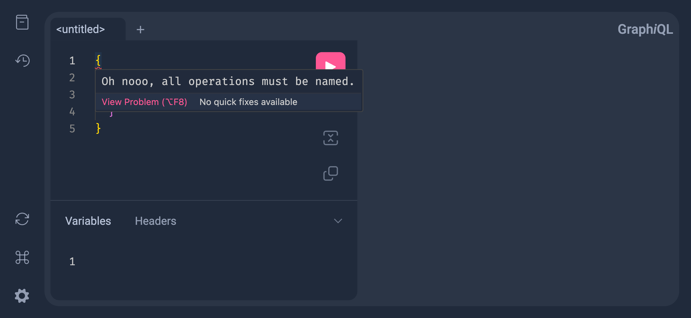

import { Callout } from "nextra/components"

> The GraphQL Foundation offers [Community Grants](/foundation/community-grant)
> to help incentivize key technical and community initiatives. As part of the
> grant, applicants commit to write a blog post report describing their work and
> its impact on the GraphQL community. The following report was written by grant
> recipient Dimitri Postolov in June 2025, having completed his project to
> release Monaco support in GraphiQL. The effort to add Monaco support to
> GraphiQL was
> [started over five years ago](https://github.com/graphql/graphiql/issues/1445)
> and we are beyond excited to see it finally reach fruition!

<figure className="mt-6">
  <video autoPlay muted loop playsInline style={{ maxWidth: '100%', borderRadius: '0.5rem' }}>
    <source src="/videos/graphiql5.webm" type="video/webm" />
    Your browser does not support the video tag.
  </video>
  {/* prettier-ignore */}
  <figcaption className="mt-2 text-center">[GraphiQL 5 with Monaco Editor](https://graphql.org/swapi-graphql/)</figcaption>
</figure>

This post marks the completion of **8 weeks** of work on my GraphiQL grant,
sponsored by the **GraphQL Foundation**.

I'm thrilled to announce the release of the all-new **GraphiQL 5**, powered by
the latest version of the [Monaco editor][monaco-editor]! 🎉

I also added support for comments in the **Variables** and **Headers** editors.
This release is a major step forward.

> [The original issue for integrating the Monaco editor](https://github.com/graphql/graphiql/issues/2326)
> was opened over **3 years ago**.<br/> And the
> [issue requesting comments support in the Variables editor](https://github.com/graphql/graphiql/issues/780)
> was opened over **6 years ago**!

As a primary maintainer of the GraphiQL IDE, I previously led the releases of
GraphiQL 3 and [GraphiQL 4](/blog/2025-05-31-graphiql-4). This new version marks
another exciting milestone in the evolution of the project.

## What's New

### Monaco Editor Migration

GraphiQL 5 now uses [Monaco editor][monaco-editor] as default editor, the same
editor used in [VSCode](https://code.visualstudio.com).

Monaco editor runs heavy language features (like syntax analysis, linting, and
IntelliSense) in
[Web Workers](https://developer.mozilla.org/en-US/docs/Web/API/Web_Workers_API/Using_web_workers),
keeping the UI smooth and responsive.

You can now delight your users with identical behavior to Visual Studio Code,
meaning intelligent autocompletion, hover tooltips, go to definition, find
references. I've also added
[`monaco-graphql`](https://github.com/graphql/graphiql/tree/main/packages/monaco-graphql)
integration in **Query** and **Variables** editor.

<Callout type="info">
  Clicking on a reference in the Query editor now works by holding `Cmd` on
  macOS or `Ctrl` on Windows/Linux.
</Callout>

As in VSCode, you can press F1 to see the available commands including features
such as multiple cursors!

### Support for Comments in Variables and Headers Editors

Thanks to the migration to Monaco Editor, another long-awaited feature has been
implemented. The **Variables** and **Headers** editors now support comments and
use the **JSONC** language internally.

In the **Variables** and **Headers** payloads, all comments are automatically
stripped before the request is executed — the content in the editors **remains
unchanged**.

### UMD Builds Are Removed

Previously in GraphiQL 4 UMD builds were marked as deprecated, in GraphiQL 5
they were removed completely.

We suggest using ESM-based CDNs like [esm.sh][esm.sh] to import GraphiQL in your
projects.

I updated [GraphiQL CDN example][graphiql-cdn] to show how to use GraphiQL with
[esm.sh][esm.sh] including how to import and setup workers.

### Examples Update

**GraphiQL with Parcel** and **GraphiQL with Create React App** examples were
removed.

In addition to updated [GraphiQL CDN example][graphiql-cdn], I've added 2 new
examples
[GraphiQL with Vite](https://github.com/graphql/graphiql/tree/main/examples/graphiql-vite)
and
[GraphiQL with Next.js and App Router](https://github.com/graphql/graphiql/tree/main/examples/graphiql-nextjs).

### Customizable Default Plugins

GraphiQL 5 lets you take full control over the UI by allowing complete
customization of its plugins.

#### Removing All Default Plugins

To remove all default plugins (currently **Doc Explorer** and **History**), set
`referencePlugin={null}` and pass an empty array to the `plugins` prop:

```jsx
import { GraphiQL } from "graphiql"

const myPlugins = []

function App() {
  return (
    <GraphiQL
      referencePlugin={null} // Removes Doc Explorer plugin
      plugins={myPlugins} // Removes History plugin
    />
  )
}
```

<Callout type="info">
  If you're using a custom Doc Explorer, pass it to the `referencePlugin` prop —
  **not** the `plugins` array. It will be automatically included and always
  rendered first.
</Callout>

#### Adding Plugins While Keeping Defaults

If you're adding custom plugins (e.g. the **Explorer** plugin) and want to keep
the **History** plugin, you must explicitly include it in the `plugins` array:

```jsx
import { GraphiQL, HISTORY_PLUGIN } from "graphiql"
import { explorerPlugin } from "@graphiql/plugin-explorer"

const myPlugins = [HISTORY_PLUGIN, explorerPlugin()]

function App() {
  return <GraphiQL plugins={myPlugins} />
}
```

### Removed Props

- `readOnly`
- `keyMap` - to use Vim or Emacs keybindings in Monaco, you can use community
  plugins such as [Monaco Vim](https://github.com/brijeshb42/monaco-vim) or
  [Monaco Emacs](https://github.com/aioutecism/monaco-emacs)
- `validationRules` - use custom GraphQL worker, see
  [Monaco GraphQL docs](https://github.com/graphql/graphiql/tree/main/packages/monaco-graphql#custom-webworker-for-passing-non-static-config-to-worker)

  <figure className="mt-6">
    {/* prettier-ignore */}
    <></>
    {/* prettier-ignore */}
    <figcaption className="mt-2 text-center">Example of custom GraphQL validation rules</figcaption>
  </figure>

### Additional Changes

The shortcut to focus on the Doc Explorer search input is now `Cmd/Ctrl+Alt+K`
instead of the previous `Cmd/Ctrl+K`. This was changed because monaco-editor has
a built-in `Cmd/Ctrl+K` command.

## How to Update

Update `graphiql` using your favorite package manager:

```sh npm2yarn
npm i graphiql@latest
```

### Setup Monaco Workers

You need to set up Monaco workers in your project:

- For **Vite** projects you must import:

  ```js
  import "graphiql/setup-workers/vite"
  ```

  <Callout type="info">
    See [Vite
    example](https://github.com/graphql/graphiql/blob/main/examples/graphiql-vite/src/App.jsx).
  </Callout>

- For Webpack projects such as **Next.js** you must import:

  ```js
  import "graphiql/setup-workers/webpack"
  ```

  <Callout type="info">
    See [Next.js
    example](https://github.com/graphql/graphiql/blob/main/examples/graphiql-nextjs/src/app/page.tsx).
  </Callout>

- For ESM-based CDN usages, you must use
  [`?worker` query](https://esm.sh/#web-worker) to load the module as a web
  worker:

  ```js /?worker/
  import createJSONWorker from "https://esm.sh/monaco-editor/esm/vs/language/json/json.worker.js?worker"
  import createGraphQLWorker from "https://esm.sh/monaco-graphql/esm/graphql.worker.js?worker"
  import createEditorWorker from "https://esm.sh/monaco-editor/esm/vs/editor/editor.worker.js?worker"

  globalThis.MonacoEnvironment = {
    getWorker(_workerId, label) {
      switch (label) {
        case "json":
          return createJSONWorker()
        case "graphql":
          return createGraphQLWorker()
      }
      return createEditorWorker()
    }
  }
  ```

  <Callout type="info">
    See [CDN
    example](https://github.com/graphql/graphiql/blob/main/examples/graphiql-cdn/index.html).
  </Callout>

[monaco-editor]: https://github.com/microsoft/monaco-editor
[graphiql-cdn]:
  https://github.com/graphql/graphiql/blob/main/examples/graphiql-cdn/index.html
[esm.sh]: https://esm.sh
