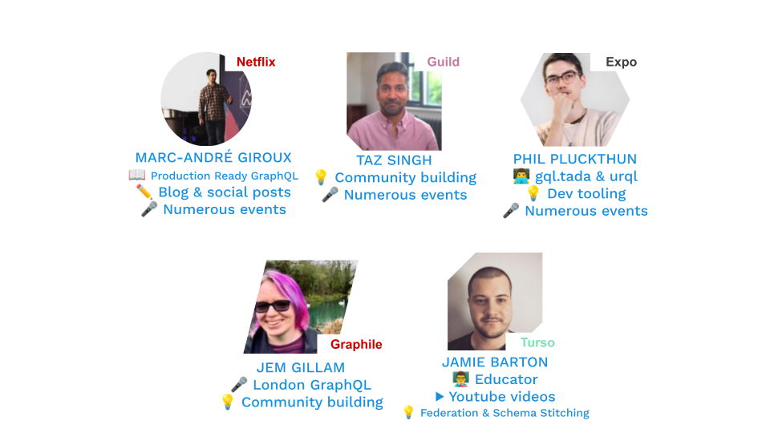

The GraphQL Foundation is thrilled to announce the launch of the GraphQL Ambassadors Program — a new initiative to recognize and support community leaders who are helping to grow the GraphQL ecosystem worldwide.

GraphQL has long since established itself as a global standard for powering APIs across startups, enterprises, and platforms. Our incredible network of educators, maintainers, advocates, and organizers keeps the community strong and well-positioned to support developers at all stages of their GraphQL journey.

We’ve launched the GraphQL Ambassadors program to:

- **Highlight contributors** who are already teaching, mentoring, and building with GraphQL.
- **Support local communities** through meetups, conferences, and workshops.
- **Amplify voices** from across the globe to ensure GraphQL remains accessible, inclusive, and community-driven.
- **Share GraphQL best practices** and gather feedback from developers.

## **Meet the First Ambassador Cohort**

Ambassadors are nominated and represent a diverse range of geographies, backgrounds, and use cases — from maintainers of popular libraries, to meetup organizers, to educators writing guides and tutorials. Join us in celebrating our first group, and stay tuned for more news about this program!

## **How to Get Involved**

- **Nominate an Ambassador.** Do you know someone doing incredible work with GraphQL? [Nominate them](https://forms.gle/hN7reX8aKQ6BqSJm7) (or [yourself](https://forms.gle/zRKVfcTPQ9kFn4Ps6))!

- **Connect locally.** Attend events and workshops hosted by Ambassadors in your region.

- **Share your story.** If you’re publishing, teaching, or building with GraphQL, we’d love to hear from you.

## **What’s Next**

The Ambassadors program is part of our broader effort to strengthen community engagement and education around GraphQL. Look forward to spotlights on our inaugural cohort, upcoming blogs and speaking opportunities, and ways you can collaborate with these leaders.

Together, we’re building not just technology, but a thriving, global GraphQL community.
