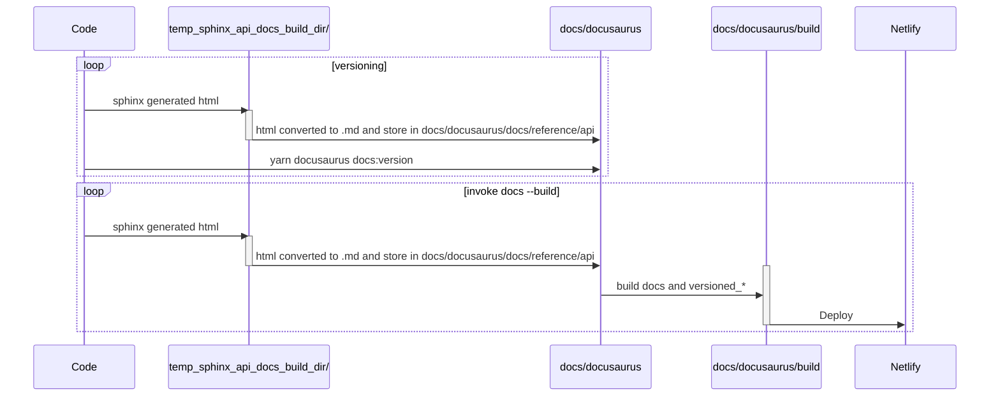

This documentation site is built using [Docusaurus 2](https://v2.docusaurus.io/), a modern static website generator.

## System Requirements

https://docusaurus.io/docs/installation#requirements

## Installation

Follow the [CONTRIBUTING_CODE](https://github.com/great-expectations/great_expectations/blob/develop/CONTRIBUTING_CODE.md) guide in the `great_expectations` repository to install dev dependencies.

Then run the following command from the repository root to install the rest of the dependencies and build documentation locally (including prior versions) and start a development server:

```console
invoke docs
```

Once you've run `invoke docs` once, you can run `invoke docs --start` to start the development server without copying and building prior versions.

## Local Development Setup

To enable certain features during local development, you may need to set environment variables.

1. Create a `.env` file in the `docs/docusaurus/` directory by copying the example file:

    ```bash
    cp docs/docusaurus/.env.example docs/docusaurus/.env
    ```

2. Edit the `docs/docusaurus/.env` file and add your specific API keys or other necessary values.

This `.env` file is included in `.gitignore` and should not be committed to version control.

## Linting

[standard.js](https://standardjs.com/) is used to lint the project. Please run the linter before committing changes.

```console
invoke docs --lint
```

## Build

To build a static version of the site, this command generates static content into the `build` directory. This can be served using any static hosting service.

```console
invoke docs --build
```

## Deployment

Deployment is handled via [Netlify](https://app.netlify.com/sites/niobium-lead-7998/overview).

## Other relevant files & directories

The following are a few details about other files Docusaurus uses that you may wish to be familiar with.

- `sidebars.js`: JavaScript that specifies the sidebar/navigation used in docs pages
- `static`: static assets used in docs pages (such as CSS) live here
- `docusaurus.config.js`: the configuration file for Docusaurus
- `babel.config.js`: Babel config file used when building
- `package.json`: dependencies and scripts
- `yarn.lock`: dependency lock file that ensures reproducibility
- `src/`: global components live here
- `docs/`: Current version of docs
- `versioned_docs/`: Older versions of docs live here. These are copies of `docs/` from the moment when `docs invoke --version=<VERSION>` was run.
- `versioned_sidebars/`: Older versions of sidebars live here. Similar to `versioned_docs/`

sitemap.xml is not in the repo since it is built and uploaded by a netlify plugin during the documentation build process.

## Swizzled and Ejected Components

This project uses Docusaurus's [swizzling feature](https://docusaurus.io/docs/swizzling) to customize theme components. Swizzling allows us to override default Docusaurus components with our own implementations.

### Ejected Components

**Ejected** components are fully copied into the project, giving complete control but requiring manual updates when Docusaurus upgrades.

#### CodeBlock (`src/theme/CodeBlock/`)

- **Status**: Fully ejected
- **Reason**: Custom copy button behavior to exclude lines with `code-block-hide-line` class (configured via Prism magic comments)
- **Modifications**: The copy button filters out hidden lines when copying code blocks
- **Upgrade Impact**: **HIGH** - When upgrading Docusaurus, you must manually review and merge changes from the upstream CodeBlock component. Check the [Docusaurus changelog](https://github.com/facebook/docusaurus/blob/main/CHANGELOG.md) for CodeBlock-related changes.

### Wrapped Components

**Wrapped** components import the original via `@theme-original` and add custom behavior. These are safer and typically require less maintenance during upgrades.

#### Admonition (`src/theme/Admonition/`)

- **Status**: Wrapped
- **Modifications**: Custom icons for different admonition types (info, note, tip, warning, caution, danger, cta)
- **Upgrade Impact**: **LOW** - Wrapper should continue working unless Admonition API changes significantly

#### DocSidebarItems (`src/theme/DocSidebarItems/`)

- **Status**: Wrapped
- **Modifications**: Mobile sidebar auto-close behavior when clicking sidebar items
- **Upgrade Impact**: **LOW** - Wrapper should continue working unless DocSidebarItems API changes significantly

#### SearchPage (`src/theme/SearchPage/`)

- **Status**: Wrapped
- **Modifications**: Currently a pass-through wrapper (may be customized in the future)
- **Upgrade Impact**: **LOW**

#### DocCategoryGeneratedIndexPage (`src/theme/DocCategoryGeneratedIndexPage/`)

- **Status**: Wrapped
- **Modifications**: Currently a pass-through wrapper (may be customized in the future)
- **Upgrade Impact**: **LOW**

#### NavbarItem Components (`src/theme/NavbarItem/`)

- **Status**: Wrapped
- **Components**: `DropdownNavbarItem`, `DocsVersionDropdownNavbarItem`, `ComponentTypes`
- **Modifications**: Custom navbar item behavior
- **Upgrade Impact**: **LOW** - Wrappers should continue working unless NavbarItem API changes significantly

#### ColorModeToggle (`src/theme/Navbar/ColorModeToggle/`)

- **Status**: Wrapped
- **Modifications**: Custom color mode toggle behavior
- **Upgrade Impact**: **LOW**

### Upgrading Docusaurus

When upgrading Docusaurus, follow these steps:

1. **Review the Changelog**: Check the [Docusaurus changelog](https://github.com/facebook/docusaurus/blob/main/CHANGELOG.md) for breaking changes related to swizzled components.

2. **Test Wrapped Components**: Wrapped components should continue working, but test them to ensure compatibility.

3. **Manually Update Ejected Components**:

   - For **CodeBlock**: This is the highest priority. You'll need to:
     - Compare the new Docusaurus CodeBlock implementation with our custom version
     - Manually merge any improvements, bug fixes, or API changes
     - Ensure our custom copy button logic (filtering hidden lines) is preserved
     - Test thoroughly to ensure code blocks render and copy correctly

4. **Swizzle Command Reference**: To re-swizzle a component (useful for seeing what changed):

   ```bash
   cd docs/docusaurus
   npm run swizzle @docusaurus/theme-classic <ComponentName> -- --danger
   ```

   Note: This will show you the latest version, but don't overwrite your customizations without careful review.

5. **Testing Checklist**:
   - [ ] Code blocks render correctly
   - [ ] Copy button works and excludes hidden lines
   - [ ] Admonitions display with custom icons
   - [ ] Mobile sidebar behavior works
   - [ ] Search functionality works
   - [ ] Navbar components function correctly

## Documentation changes checklist

1. For any pages you have moved or removed, update \_redirects to point from the old to the new content location

## Versioning

To add a new version, follow these steps:

1. It may help to start with a fresh virtualenv and clone of gx.
1. Make sure dev dependencies are installed `pip install -c constraints-dev.txt -e ".[test]"` and `pip install pyspark`
1. Install API docs dependencies `pip install -r docs/sphinx_api_docs_source/requirements-dev-api-docs.txt`
1. Run `invoke docs version=<MAJOR.MINOR>` (substituting your new version numbers)
1. Commit the new files in `versioned_docs/`, `versioned_sidebars/` and the change in `versions.json` to version control

## Versioning and docs build flow


