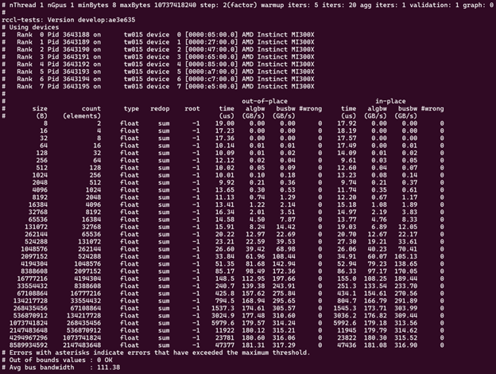

.. meta::
   :description: Prerequisite system validation before using ROCm for AI.
   :keywords: ROCm, AI, LLM, train, megatron, Llama, tutorial, docker, torch, pytorch, jax

.. _train-a-model-system-validation:
.. _rocm-for-ai-system-optimization:

**********************************************************
Prerequisite system validation before running AI workloads
**********************************************************

Complete the following system validation and optimization steps to set up your system before starting training and inference.

Disable NUMA auto-balancing
---------------------------

Generally, application performance can benefit from disabling NUMA auto-balancing. However,
it might be detrimental to performance with certain types of workloads.

Run the command ``cat /proc/sys/kernel/numa_balancing`` to check your current NUMA (Non-Uniform
Memory Access) settings. Output ``0`` indicates this setting is disabled. If there is no output or
the output is ``1``, run the following command to disable NUMA auto-balancing.

.. code-block:: shell

   sudo sh -c 'echo 0 > /proc/sys/kernel/numa_balancing'

See `Disable NUMA auto-balancing <https://instinct.docs.amd.com/projects/amdgpu-docs/en/latest/system-optimization/mi300x.html#disable-numa-auto-balancing>`_
in the Instinct documentation for more information.

Hardware verification with ROCm
-------------------------------

Use the command ``rocm-smi --setperfdeterminism 1900`` to set the max clock speed up to 1900 MHz
instead of the default 2100 MHz. This can reduce the chance of a PCC event lowering the attainable
GPU clocks. This setting will not be required for new IFWI releases with the production PRC feature.
You can restore this setting to its default value with the ``rocm-smi -r`` command.

Run the command:

.. code-block:: shell

   rocm-smi --setperfdeterminism 1900

See `Hardware verfication for ROCm <https://instinct.docs.amd.com/projects/amdgpu-docs/en/latest/system-optimization/mi300x.html#hardware-verification-with-rocm>`_
in the Instinct documentation for more information.

RCCL Bandwidth Test for multi-node setups
-----------------------------------------

ROCm Collective Communications Library (RCCL) is a standalone library of standard collective communication
routines for GPUs. See the :doc:`RCCL documentation <rccl:index>` for more information. Before starting
pretraining, running a RCCL bandwidth test helps ensure that the multi-GPU or multi-node setup is optimized
for efficient distributed training.

Running the RCCL bandwidth test helps verify that:

- The GPUs can communicate across nodes or within a single node.

- The interconnect (such as InfiniBand, Ethernet, or Infinite fabric) is functioning as expected and
  provides adequate bandwidth for communication.

- No hardware setup or cabling issues could affect the communication between GPUs

Tuning and optimizing hyperparameters
^^^^^^^^^^^^^^^^^^^^^^^^^^^^^^^^^^^^^

In distributed training, specific hyperparameters related to distributed communication can be tuned based on
the results of the RCCL bandwidth test. These variables are already set in the Docker image:

.. code-block:: shell

   # force all RCCL streams to be high priority
   export TORCH_NCCL_HIGH_PRIORITY=1

   # specify which RDMA interfaces to use for communication
   export NCCL_IB_HCA=rdma0,rdma1,rdma2,rdma3,rdma4,rdma5,rdma6,rdma7

   # define the Global ID index used in RoCE mode
   export NCCL_IB_GID_INDEX=3

   # avoid data corruption/mismatch issue that existed in past releases
   export RCCL_MSCCL_ENABLE=0

Running the RCCL Bandwidth Test
^^^^^^^^^^^^^^^^^^^^^^^^^^^^^^^

It's recommended you run the RCCL bandwidth test before launching training. It ensures system
performance is sufficient to launch training. RCCL is not included in the AMD Megatron-LM Docker
image; follow the instructions in `<https://github.com/ROCm/rccl-tests>`__ to get started.
See :ref:`mi300x-rccl` for more information.

Run on 8 GPUs (``-g 8``), scanning from 8 bytes to 10 GB:

.. code-block:: shell

   ./build/all_reduce_perf -b 8 -e 10G -f 2 -g 8

.. image:: ../../../data/how-to/rocm-for-ai/rccl-tests-8-gpu.png
   :width: 800

Using one MPI process per GPU and ``-g 1`` for performance-oriented runs on both single-node and multi-node is
recommended. So, a run on 8 GPUs looks something like:

.. code-block:: shell

   mpirun -np 8 --bind-to numa ./build/all_reduce_perf -b 8 -e 10G -f 2 -g 1

Running with one MPI process per GPU ensures a one-to-one mapping for CPUs and GPUs, which can be beneficial
for smaller message sizes. This better represents the real-world use of RCCL in deep learning frameworks like
PyTorch and TensorFlow.

Use the following script to run the RCCL test for four MI300X GPU nodes. Modify paths and node addresses as needed.

.. code-block::

   /home/$USER/ompi_for_gpu/ompi/bin/mpirun -np 32 -H tw022:8,tw024:8,tw010:8, tw015:8 \
   --mca pml ucx \
   --mca btl ^openib \
   -x NCCL_SOCKET_IFNAME=ens50f0np0 \
   -x NCCL_IB_HCA=rdma0:1,rdma1:1,rdma2:1,rdma3:1,rdma4:1,rdma5:1,rdma6:1,rdma7:1 \
   -x NCCL_IB_GID_INDEX=3 \
   -x NCCL_MIN_NCHANNELS=40 \
   -x NCCL_DEBUG=version \
   $HOME/rccl-tests/build/all_reduce_perf -b 8 -e 8g -f 2 -g 1

.. image:: ../../../data/how-to/rocm-for-ai/rccl-tests-4-mi300x-gpu-nodes.png
   :width: 800
