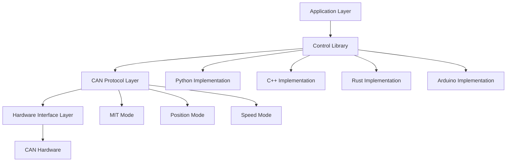
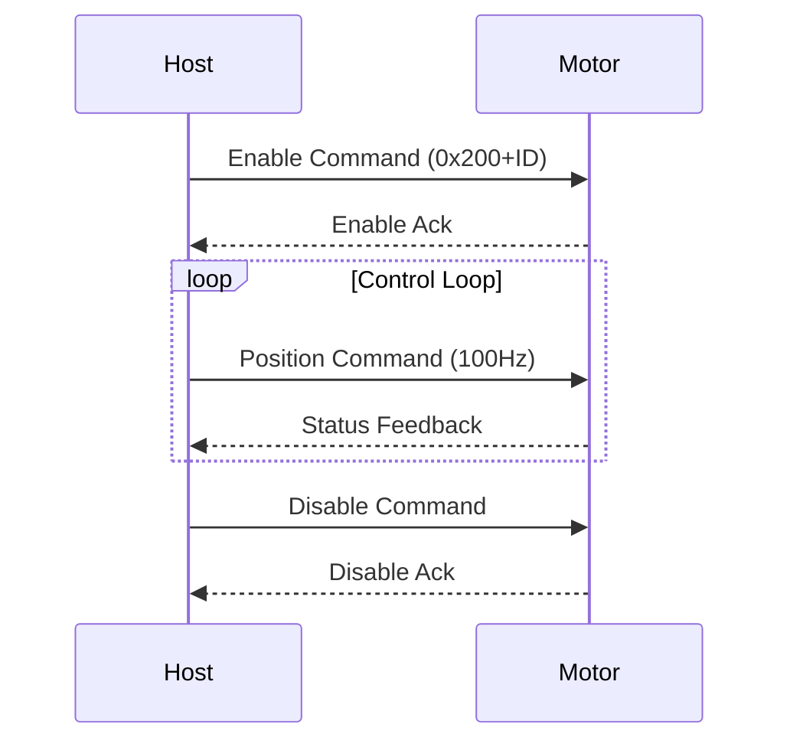

# RobStride Control Library - Complete Technical Documentation

> High-performance RobStride motor control baseline with implementations in Python, C++, Rust, and Arduino


## 📋 Table of Contents

- [Project Overview](#project-overview)
- [Supported Motor Models](#supported-motor-models)
- [Technical Architecture](#technical-architecture)
- [Quick Start](#quick-start)
- [Python Implementation](#python-implementation)
- [C++ Implementation](#c-implementation)
- [Rust Implementation](#rust-implementation)
- [Arduino Implementation](#arduino-implementation)
- [Protocol Details](#protocol-details)
- [Performance Optimization](#performance-optimization)
- [Troubleshooting](#troubleshooting)
- [Development Guide](#development-guide)

---

## 🎯 Project Overview

RobStride Control Library is a high-performance motor control library specifically designed for RobStride series motors. This project provides a complete motor control solution supporting multiple programming languages and hardware platforms, suitable for robotics, automation control, precision positioning, and various other application scenarios.

### Core Features

- ✅ **Multi-language Support**: Implementations in Python, C++, Rust, and Arduino
- ✅ **Multiple Control Modes**: MIT Mode, Position Mode, Speed Mode
- ✅ **Real-time Performance**: 50-200Hz control frequency with low latency
- ✅ **Industrial-grade Stability**: Supports continuous long-term operation
- ✅ **Cross-platform Compatibility**: Linux systems, ESP32, and other embedded platforms
- ✅ **Standardized Interface**: Unified API design for easy language switching

### Technical Advantages

- **High Performance**: Direct SocketCAN communication with no middleware overhead
- **Memory Safety**: Rust implementation provides memory safety guarantees
- **Real-time Control**: C++ implementation achieves 200Hz control frequency
- **Ease of Use**: Python implementation provides friendly interactive interface
- **Embedded Friendly**: Arduino implementation suitable for resource-constrained environments

---

## Supported Motor Models

| Model | Max Torque | Max Speed | KP Range | KD Range |
|--------|------------|-----------|----------|----------|
| RS-00 | 17 Nm | 50 rad/s | 500.0 | 5.0 |
| RS-01 | 17 Nm | 44 rad/s | 500.0 | 5.0 |
| RS-02 | 17 Nm | 44 rad/s | 500.0 | 5.0 |
| RS-03 | 60 Nm | 50 rad/s | 5000.0| 100.0|
| RS-04 | 120 Nm| 15 rad/s | 5000.0| 100.0|
| RS-05 | 17 Nm | 33 rad/s | 500.0 | 5.0 |
| RS-06 | 60 Nm | 20 rad/s | 5000.0| 100.0|

---

## Technical Architecture

### System Architecture Diagram



### Communication Protocol

- **Physical Layer**: CAN 2.0B Standard
- **Data Link Layer**: Extended Frame Format (29-bit ID)
- **Application Layer**: Custom RobStride Protocol
- **Transmission Rate**: 1 Mbps

### Control Mode Details

#### 1. MIT Mode (Mode 0)
- **Features**: Direct torque control with high response speed
- **Use Cases**: Applications requiring fast response
- **Control Parameters**: P, D, T, Position, Velocity

#### 2. Position Mode (Mode 1)
- **Features**: Position closed-loop control with precise positioning
- **Use Cases**: Precision positioning, robot joint control
- **Control Parameters**: Position, Velocity, Max Torque

#### 3. Speed Mode (Mode 2)
- **Features**: Speed closed-loop control with stable speed regulation
- **Use Cases**: Applications requiring constant speed
- **Control Parameters**: Velocity, Max Torque

---

## Quick Start

### Environment Setup

```bash
# Ubuntu/Debian system dependencies
sudo apt-get update
sudo apt-get install -y \
    build-essential cmake \
    python3 python3-pip \
    rustc cargo \
    can-utils \
    gcc-avr avr-libc arduino-core

# CAN interface setup
sudo modprobe can
sudo ip link set can0 type can bitrate 1000000
sudo ip link set up can0
```

### Clone Project

```bash
git clone https://github.com/Seeed-Projects/RobStride_Control.git
cd RobStride_Control
```

### Choose Your Language Implementation

| Language | Control Frequency | Memory Usage | Use Cases |
|----------|-------------------|--------------|-----------|
| Python | 50-100Hz | ~50MB | Rapid prototyping, algorithm validation |
| C++ | 200Hz | ~10MB | High-performance applications, real-time control |
| Rust | 150Hz | ~8MB | Safety-critical, memory safety requirements |
| Arduino | 100Hz | ~2KB | Embedded, resource-constrained environments |

---

## Python Implementation

### Install Dependencies

```bash
cd python
pip install -r requirements.txt
```

### Basic Usage

```python
#!/usr/bin/env python3
from robstride_dynamics import RobstrideBus

# Initialize CAN bus
bus = RobstrideBus('can0')

# Scan for motors
motors = bus.scan_channel()
print(f"Found motors: {motors}")

# MIT mode position control
motor_id = 1
target_position = 0.0

while True:
    # Send control command
    bus.write_operation_frame(
        motor_id=motor_id,
        p_des=target_position,
        v_des=0.0,
        kp=30.0,
        kd=0.5,
        t_ff=0.0
    )

    # Read status
    response = bus.read_frame(motor_id)
    print(f"Position: {response['position']:.3f} rad")

    time.sleep(0.01)  # 100Hz control frequency
```

### Interactive Interface

```bash
# Run MIT position control (with interactive interface)
python3 src/position_control.py 1

# Run speed control
python3 src/velocity_control.py 1
```

### Interactive Commands

```bash
# Interactive commands in MIT mode
kp 30.0     # Set position gain
kd 0.5      # Set velocity gain
pos 1.0     # Set target position
vel 2.0     # Set target velocity
tor 5.0     # Set feed-forward torque
quit        # Exit program
```

### Advanced Features

```python
# Multi-motor synchronous control
motors = [1, 2, 3, 4]
bus.enable_motors(motors)

# Synchronous parameter setting
for motor_id in motors:
    bus.set_motor_param(motor_id, kp=50.0, kd=1.0)

# Synchronous control
while True:
    for i, motor_id in enumerate(motors):
        position = math.sin(time.time() + i * math.pi/2)
        bus.write_operation_frame(motor_id, position, 0, 50.0, 1.0, 0)
```

---

## C++ Implementation

### Build

```bash
cd cpp
mkdir build && cd build
cmake ..
make
```

### Basic Usage

```cpp
#include <iostream>
#include <thread>
#include <chrono>
#include <atomic>

class RobStrideMotor {
private:
    int can_socket;
    int motor_id;
    std::atomic<bool> running;

public:
    RobStrideMotor(int id) : motor_id(id), running(false) {
        can_socket = socket(PF_CAN, SOCK_RAW, CAN_RAW);
        // ... initialization code
    }

    void start() {
        running = true;
        std::thread control_thread(&RobStrideMotor::control_loop, this);
        control_thread.detach();
    }

    void set_position(double position, double kp, double kd) {
        uint8_t data[8];
        // ... pack data
        struct can_frame frame;
        frame.can_id = 0x200 + motor_id;
        frame.can_dlc = 8;
        memcpy(frame.data, data, 8);

        write(can_socket, &frame, sizeof(frame));
    }
};
```

### Performance Optimization

```cpp
// High-performance configuration
static constexpr int CONTROL_FREQ = 200;  // 200Hz
static constexpr auto CONTROL_PERIOD =
    std::chrono::microseconds(1000000 / CONTROL_FREQ);

// Real-time control loop
void control_loop() {
    auto next_time = std::chrono::steady_clock::now();

    while (running) {
        // Control logic
        send_command();

        // Precise timing control
        next_time += CONTROL_PERIOD;
        std::this_thread::sleep_until(next_time);
    }
}
```

### Run

```bash
# Requires administrator privileges
sudo ./build/robstride-mit-position 1
```

---

## Rust Implementation

### Build

```bash
cd rust
cargo build --release
```

### Basic Usage

```rust
use socketcan::{CanSocket, CanFrame, EmbeddedFrame};
use std::sync::{Arc, Mutex};
use std::thread;

struct RobStrideController {
    socket: Arc<Mutex<CanSocket>>,
    motor_id: u8,
}

impl RobStrideController {
    fn new(interface: &str, motor_id: u8) -> Result<Self, Box<dyn std::error::Error>> {
        let socket = CanSocket::open(interface)?;
        Ok(Self {
            socket: Arc::new(Mutex::new(socket)),
            motor_id,
        })
    }

    fn send_position_command(
        &self,
        position: f32,
        velocity: f32,
        kp: f32,
        kd: f32,
        torque: f32,
    ) -> Result<(), Box<dyn std::error::Error>> {
        let data: [u8; 8] = [
            (position * 1000.0) as u8,
            ((position * 1000.0) / 256.0) as u8,
            ((position * 1000.0) / 65536.0) as u8,
            ((position * 1000.0) / 16777216.0) as u8,
            (velocity * 1000.0) as u8,
            (kp * 5.0) as u8,
            (kd * 500.0) as u8,
            (torque * 10.0) as u8,
        ];

        let frame = CanFrame::new(
            socketcan::CanId::new(0x200 + self.motor_id as u32).unwrap(),
            &data,
        )?;

        let socket = self.socket.lock().unwrap();
        socket.write_frame(&frame)?;
        Ok(())
    }
}
```

### Memory Safety Features

```rust
// Multi-thread safe shared CAN interface
let controller = Arc::new(RobStrideController::new("can0", motor_id)?);

// Control thread
let ctrl_clone = Arc::clone(&controller);
thread::spawn(move || {
    loop {
        ctrl_clone.send_command()?;
        thread::sleep(Duration::from_millis(10));
    }
});

// Monitoring thread
let monitor_clone = Arc::clone(&controller);
thread::spawn(move || {
    loop {
        let status = monitor_clone.read_status()?;
        println!("Motor status: {:?}", status);
        thread::sleep(Duration::from_millis(50));
    }
});
```

### Run

```bash
cargo run --release -- 1
```

---

## Arduino Implementation

### Hardware Configuration

```
ESP32           CAN Transceiver      RobStride Motor
GPIO5   <--->   TX                    CAN H
GPIO4   <--->   RX                    CAN L
5V      <--->   VCC                   Power Supply
GND     <--->   GND                   Ground
```

### Basic Code

```cpp
#include <ESP32-TWAI-CAN.h>

class RobStrideMotor {
private:
    TWAI_CAN can;
    uint8_t motor_id;

public:
    RobStrideMotor(uint8_t id) : motor_id(id) {}

    bool begin() {
        can.begin(TWAI_SPEED_1000KBPS, 4, 5);  // GPIO4=RX, GPIO5=TX
        return true;
    }

    void send_position_command(float position, float velocity, float kp, float kd, float torque) {
        can_frame_t frame;
        frame.identifier = 0x200 + motor_id;
        frame.extd = true;
        frame.data_length_code = 8;

        // Pack data
        int32_t pos_int = (int32_t)(position * 1000.0);
        frame.data[0] = pos_int & 0xFF;
        frame.data[1] = (pos_int >> 8) & 0xFF;
        frame.data[2] = (pos_int >> 16) & 0xFF;
        frame.data[3] = (pos_int >> 24) & 0xFF;
        frame.data[4] = (uint8_t)(velocity * 1000.0);
        frame.data[5] = (uint8_t)(kp * 5.0);
        frame.data[6] = (uint8_t)(kd * 500.0);
        frame.data[7] = (uint8_t)(torque * 10.0);

        can.writeFrame(&frame);
    }

    void enable_motor() {
        can_frame_t frame;
        frame.identifier = 0x200 + motor_id;
        frame.extd = true;
        frame.data_length_code = 8;
        memset(frame.data, 0xFF, 8);  // Enable command
        can.writeFrame(&frame);
    }
};
```

### Arduino Control Example

```cpp
RobStrideMotor motor(1);

void setup() {
    Serial.begin(115200);
    motor.begin();

    // Enable motor
    motor.enable_motor();
    delay(100);

    Serial.println("Motor enabled, starting control loop...");
}

void loop() {
    static float phase = 0.0;
    float target_pos = sin(phase) * 3.14159;  // ±π radians

    motor.send_position_command(target_pos, 0, 30.0, 0.5, 0);

    phase += 0.01;
    delay(10);  // 100Hz control frequency

    if (phase > 2 * 3.14159) {
        phase = 0;
    }
}
```

---

## Protocol Details

### CAN Frame Format

| Field | Size | Description |
|-------|------|-------------|
| ID | 29 bits | Extended frame identifier |
| DLC | 4 bits | Data length (fixed to 8) |
| Data | 8 bytes | Control data |
| CRC | 16 bits | Cyclic redundancy check |

### ID Allocation Rules

- **0x200 + ID**: MIT mode control commands
- **0x300 + ID**: Position mode control commands
- **0x400 + ID**: Speed mode control commands
- **0x500 + ID**: System status queries
- **0x600 + ID**: System configuration commands

### Data Packet Format

#### MIT Mode Control Command (8 bytes)

```c
struct mit_command_t {
    int32_t p_des;     // Target position (rad)
    int16_t v_des;     // Target velocity (rad/s)
    uint16_t kp;       // Position gain
    uint16_t kd;       // Velocity gain
    int16_t t_ff;      // Feed-forward torque (Nm)
};
```

#### Motor Status Feedback (8 bytes)

```c
struct motor_status_t {
    int32_t position;  // Current position (rad)
    int16_t velocity;  // Current velocity (rad/s)
    int16_t torque;    // Current torque (Nm)
    uint8_t mode;      // Current mode
    uint8_t error;     // Error code
};
```

### Communication Timing



---

## Performance Optimization

### System Tuning

#### 1. Linux Kernel Parameter Optimization

```bash
# Real-time priority setting
echo 'KERNEL=="can0", MODE="0666"' > /etc/udev/rules.d/99-can.rules

# CPU affinity binding
sudo taskset -cp 0-3 $(pgrep robstride-control)

# Memory locking (optional)
sudo sysctl -w vm.swappiness=1
```

#### 2. Real-time Scheduling

```cpp
#include <sched.h>
#include <sys/mman.h>

struct sched_param param;
param.sched_priority = 99;
sched_setscheduler(0, SCHED_FIFO, &param);

mlockall(MCL_CURRENT | MCL_FUTURE);
```

### Performance Benchmarks

| Language | Control Frequency | CPU Usage | Latency | Memory Usage |
|----------|-------------------|-----------|---------|--------------|
| Python | 50-100Hz | 15-20% | 2-5ms | ~50MB |
| C++ | 200Hz | 5-8% | 0.5-1ms | ~10MB |
| Rust | 150Hz | 8-12% | 1-2ms | ~8MB |
| Arduino | 100Hz | 40-60% | 1-3ms | ~2KB |

### Optimization Tips

#### Python Optimization

```python
# Use C extensions for acceleration
from robstride_dynamics import RobstrideBus

# Pre-allocate arrays
import numpy as np
position_buffer = np.zeros(1000)

# Async I/O
import asyncio
async def control_loop():
    while True:
        await send_command()
        await asyncio.sleep(0.01)
```

#### C++ Optimization

```cpp
// Zero-copy optimization
static_assert(sizeof(motor_command_t) == 8, "Command size mismatch");

// Memory pool
class MemoryPool {
    std::array<motor_command_t, 100> pool;
    std::mutex mutex;
public:
    motor_command_t* acquire() { /* ... */ }
    void release(motor_command_t* ptr) { /* ... */ }
};
```

#### Rust Optimization

```rust
// Pre-allocate capacity
let mut frames: Vec<CanFrame> = Vec::with_capacity(1000);

// Avoid heap allocation
#[repr(C, packed)]
struct MotorCommand {
    p_des: i32,
    v_des: i16,
    kp: u16,
    kd: u16,
    t_ff: i16,
}
```

---

## Troubleshooting

### Common Issues

#### 1. CAN Communication Failure

```bash
# Check CAN interface status
ip -details link show can0

# Monitor CAN traffic
candump can0

# Reset CAN interface
sudo ip link set can0 down
sudo ip link set can0 up type can bitrate 1000000
```

#### 2. Motor No Response

```bash
# Scan devices on bus
python3 -c "
from robstride_dynamics import RobstrideBus
bus = RobstrideBus('can0')
motors = bus.scan_channel()
print(f'Found motors: {motors}')
"
```

#### 3. Performance Issues

```bash
# Check CPU usage
top -p $(pgrep robstride-control)

# Check real-time
sudo chrt -f 99 $(pgrep robstride-control)
```

### Error Codes

| Code | Description | Solution |
|------|-------------|----------|
| 0x01 | Communication timeout | Check CAN connection |
| 0x02 | Parameter out of range | Check control parameter ranges |
| 0x03 | Motor overcurrent | Check load and torque limits |
| 0x04 | Position overflow | Check limits and target position |
| 0x05 | Temperature too high | Check cooling and load |

### Debug Tools

```bash
# Real-time CAN bus monitoring
candump -t A can0

# Send test frame
cansend can0 211#FFFFFFFF

# Network topology detection
canbusload can0@1000000

# Error statistics
cangen can0 -I 211 -D r
```

---

## Development Guide

### Project Structure

```
RobStride_Control/
├── cpp/                  # C++ implementation
│   ├── src/             # Source code
│   ├── include/         # Header files
│   ├── tests/           # Test code
│   └── examples/        # Example code
├── python/              # Python implementation
│   ├── src/             # Source code
│   ├── examples/        # Example code
│   └── tests/           # Test code
├── rust/                # Rust implementation
│   ├── src/             # Source code
│   ├── examples/        # Example code
│   └── tests/           # Test code
├── arduino/             # Arduino implementation
│   └── mi_motor_control/# ESP32 library
├── docs/                # Documentation
├── scripts/             # Utility scripts
└── tools/               # Helper tools
```

### Contributing Guidelines

1. **Code Style**
   - Python: Follow PEP 8
   - C++: Follow Google C++ Style Guide
   - Rust: Use rustfmt
   - Arduino: Follow Arduino Style Guide

2. **Commit Convention**
   ```
   feat: Add new feature
   fix: Bug fix
   docs: Update documentation
   style: Code formatting changes
   refactor: Code refactoring
   test: Add tests
   chore: Build process or auxiliary tool changes
   ```

3. **Testing Requirements**
   ```bash
   # Run all tests
   python3 -m pytest python/tests/
   cd cpp && make test
   cd rust && cargo test
   ```

### Build Scripts

```bash
#!/bin/bash
# scripts/build-all.sh

echo "Building all implementations..."

# Python
cd python
python3 setup.py build
cd ..

# C++
cd cpp
mkdir -p build && cd build
cmake ..
make -j$(nproc)
cd ../..

# Rust
cd rust
cargo build --release
cd ..

# Arduino (requires Arduino IDE)
echo "Arduino build requires Arduino IDE"
echo "Open arduino/mi_motor_control/mi_motor_control.ino"

echo "Build completed!"
```

### Deployment Guide

#### Ubuntu/Debian

```bash
# Install dependencies
sudo apt-get install -y build-essential can-utils

# Build C++ version (fastest)
cd cpp/build
sudo make install

# Create system service
sudo cp scripts/robstride.service /etc/systemd/system/
sudo systemctl enable robstride
sudo systemctl start robstride
```

#### Docker

```dockerfile
FROM ubuntu:22.04

RUN apt-get update && apt-get install -y \
    build-essential cmake \
    python3 python3-pip \
    rustc cargo \
    can-utils

WORKDIR /app
COPY . .

# Build all versions
RUN scripts/build-all.sh

CMD ["./cpp/build/robstride-mit-position", "1"]
```

---

## Resources

- **Project URL**: https://github.com/Seeed-Projects/RobStride_Control
- **Issue Reporting**: https://github.com/Seeed-Projects/RobStride_Control/issues
- **Maintainer**: @tianrking


---

## Tech Support & Product Discussion

Thank you for choosing our products! We are here to provide you with different support to ensure that your experience with our products is as smooth as possible. We offer several communication channels to cater to different preferences and needs.

<div class="button_tech_support_container">
<a href="https://forum.seeedstudio.com/" class="button_forum"></a>
<a href="https://www.seeedstudio.com/contacts" class="button_email"></a>
</div>

<div class="button_tech_support_container">
<a href="https://discord.gg/eWkprNDMU7" class="button_discord"></a>
<a href="https://github.com/Seeed-Studio/wiki-documents/discussions/69" class="button_discussion"></a>
</div>
