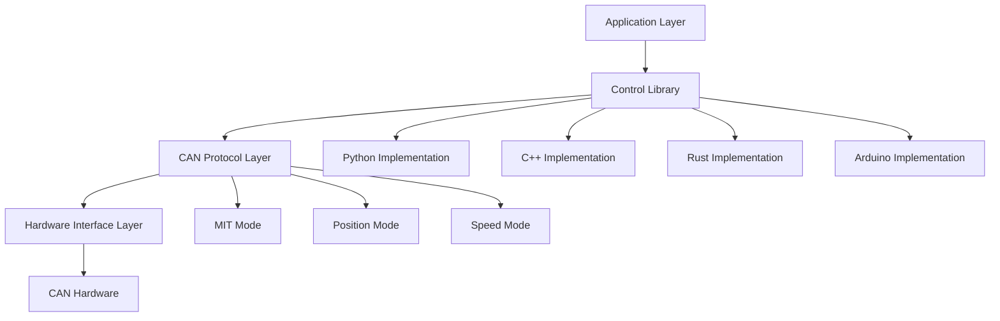
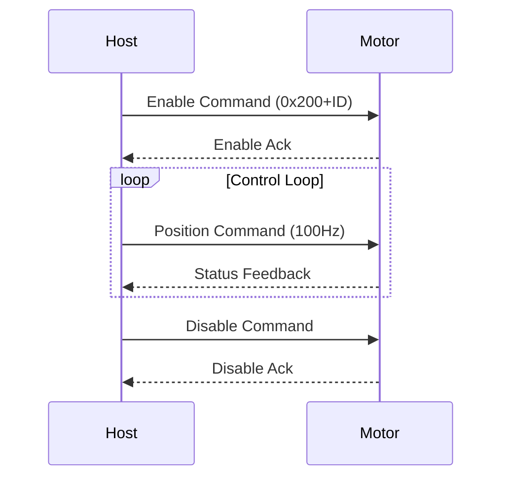

# Biblioteca de Control RobStride - Documentación Técnica Completa

> Control de motor RobStride de alto rendimiento con implementaciones en Python, C++, Rust y Arduino


## 📋 Tabla de Contenidos

- [Descripción del Proyecto](#descripción-del-proyecto)
- [Modelos de Motor Compatibles](#modelos-de-motor-compatibles)
- [Arquitectura Técnica](#arquitectura-técnica)
- [Inicio Rápido](#inicio-rápido)
- [Implementación Python](#implementación-python)
- [Implementación C++](#implementación-c)
- [Implementación Rust](#implementación-rust)
- [Implementación Arduino](#implementación-arduino)
- [Detalles del Protocolo](#detalles-del-protocolo)
- [Optimización de Rendimiento](#optimización-de-rendimiento)
- [Solución de Problemas](#solución-de-problemas)
- [Guía de Desarrollo](#guía-de-desarrollo)

---

## 🎯 Descripción del Proyecto

La Biblioteca de Control RobStride es una biblioteca de control de motor de alto rendimiento diseñada específicamente para motores de la serie RobStride. Este proyecto proporciona una solución completa de control de motor que soporta múltiples lenguajes de programación y plataformas de hardware, adecuada para robótica, control de automatización, posicionamiento de precisión y varios otros escenarios de aplicación.

### Características Principales

- ✅ **Soporte Multi-lenguaje**: Implementaciones en Python, C++, Rust y Arduino
- ✅ **Múltiples Modos de Control**: Modo MIT, Modo Posición, Modo Velocidad
- ✅ **Rendimiento en Tiempo Real**: Frecuencia de control de 50-200Hz con baja latencia
- ✅ **Estabilidad de Grado Industrial**: Soporta operación continua a largo plazo
- ✅ **Compatibilidad Multiplataforma**: Sistemas Linux, ESP32 y otras plataformas embebidas
- ✅ **Interfaz Estandarizada**: Diseño de API unificado para fácil cambio de lenguaje

### Ventajas Técnicas

- **Alto Rendimiento**: Comunicación SocketCAN directa sin sobrecarga de middleware
- **Seguridad de Memoria**: La implementación Rust proporciona garantías de seguridad de memoria
- **Control en Tiempo Real**: La implementación C++ logra frecuencia de control de 200Hz
- **Facilidad de Uso**: La implementación Python proporciona interfaz interactiva amigable
- **Amigable para Embebidos**: La implementación Arduino es adecuada para entornos con recursos limitados

---

## Modelos de Motor Compatibles

| Modelo | Torque Máx | Velocidad Máx | Rango KP | Rango KD |
|--------|------------|---------------|----------|----------|
| RS-00 | 17 Nm | 50 rad/s | 500.0 | 5.0 |
| RS-01 | 17 Nm | 44 rad/s | 500.0 | 5.0 |
| RS-02 | 17 Nm | 44 rad/s | 500.0 | 5.0 |
| RS-03 | 60 Nm | 50 rad/s | 5000.0| 100.0|
| RS-04 | 120 Nm| 15 rad/s | 5000.0| 100.0|
| RS-05 | 17 Nm | 33 rad/s | 500.0 | 5.0 |
| RS-06 | 60 Nm | 20 rad/s | 5000.0| 100.0|

---

## Arquitectura Técnica

### Diagrama de Arquitectura del Sistema



### Protocolo de Comunicación

- **Capa Física**: Estándar CAN 2.0B
- **Capa de Enlace de Datos**: Formato de Trama Extendida (ID de 29 bits)
- **Capa de Aplicación**: Protocolo RobStride Personalizado
- **Velocidad de Transmisión**: 1 Mbps

### Detalles de Modos de Control

#### 1. Modo MIT (Modo 0)
- **Características**: Control directo de torque con alta velocidad de respuesta
- **Casos de Uso**: Aplicaciones que requieren respuesta rápida
- **Parámetros de Control**: P, D, T, Posición, Velocidad

#### 2. Modo Posición (Modo 1)
- **Características**: Control de lazo cerrado de posición con posicionamiento preciso
- **Casos de Uso**: Posicionamiento de precisión, control de articulaciones de robot
- **Parámetros de Control**: Posición, Velocidad, Torque Máximo

#### 3. Modo Velocidad (Modo 2)
- **Características**: Control de lazo cerrado de velocidad con regulación estable de velocidad
- **Casos de Uso**: Aplicaciones que requieren velocidad constante
- **Parámetros de Control**: Velocidad, Torque Máximo

---

## Inicio Rápido

### Configuración del Entorno

```bash
# Ubuntu/Debian system dependencies
sudo apt-get update
sudo apt-get install -y \
    build-essential cmake \
    python3 python3-pip \
    rustc cargo \
    can-utils \
    gcc-avr avr-libc arduino-core

# CAN interface setup
sudo modprobe can
sudo ip link set can0 type can bitrate 1000000
sudo ip link set up can0
```

### Clonar Proyecto

```bash
git clone https://github.com/Seeed-Projects/RobStride_Control.git
cd RobStride_Control
```

### Elige Tu Implementación de Lenguaje

| Lenguaje | Frecuencia de Control | Uso de Memoria | Casos de Uso |
|----------|----------------------|----------------|--------------|
| Python | 50-100Hz | ~50MB | Prototipado rápido, validación de algoritmos |
| C++ | 200Hz | ~10MB | Aplicaciones de alto rendimiento, control en tiempo real |
| Rust | 150Hz | ~8MB | Crítico para seguridad, requisitos de seguridad de memoria |
| Arduino | 100Hz | ~2KB | Embebido, entornos con recursos limitados |

---

## Implementación Python

### Instalar Dependencias

```bash
cd python
pip install -r requirements.txt
```

### Uso Básico

```python
#!/usr/bin/env python3
from robstride_dynamics import RobstrideBus

# Initialize CAN bus
bus = RobstrideBus('can0')

# Scan for motors
motors = bus.scan_channel()
print(f"Found motors: {motors}")

# MIT mode position control
motor_id = 1
target_position = 0.0

while True:
    # Send control command
    bus.write_operation_frame(
        motor_id=motor_id,
        p_des=target_position,
        v_des=0.0,
        kp=30.0,
        kd=0.5,
        t_ff=0.0
    )

    # Read status
    response = bus.read_frame(motor_id)
    print(f"Position: {response['position']:.3f} rad")

    time.sleep(0.01)  # 100Hz control frequency
```

### Interfaz Interactiva

```bash
# Run MIT position control (with interactive interface)
python3 src/position_control.py 1

# Run speed control
python3 src/velocity_control.py 1
```

### Comandos Interactivos

```bash
# Interactive commands in MIT mode
kp 30.0     # Set position gain
kd 0.5      # Set velocity gain
pos 1.0     # Set target position
vel 2.0     # Set target velocity
tor 5.0     # Set feed-forward torque
quit        # Exit program
```

### Características Avanzadas

```python
# Multi-motor synchronous control
motors = [1, 2, 3, 4]
bus.enable_motors(motors)

# Synchronous parameter setting
for motor_id in motors:
    bus.set_motor_param(motor_id, kp=50.0, kd=1.0)

# Synchronous control
while True:
    for i, motor_id in enumerate(motors):
        position = math.sin(time.time() + i * math.pi/2)
        bus.write_operation_frame(motor_id, position, 0, 50.0, 1.0, 0)
```

---

## Implementación C++

### Compilar

```bash
cd cpp
mkdir build && cd build
cmake ..
make
```

### Uso Básico

```cpp
#include <iostream>
#include <thread>
#include <chrono>
#include <atomic>

class RobStrideMotor {
private:
    int can_socket;
    int motor_id;
    std::atomic<bool> running;

public:
    RobStrideMotor(int id) : motor_id(id), running(false) {
        can_socket = socket(PF_CAN, SOCK_RAW, CAN_RAW);
        // ... initialization code
    }

    void start() {
        running = true;
        std::thread control_thread(&RobStrideMotor::control_loop, this);
        control_thread.detach();
    }

    void set_position(double position, double kp, double kd) {
        uint8_t data[8];
        // ... pack data
        struct can_frame frame;
        frame.can_id = 0x200 + motor_id;
        frame.can_dlc = 8;
        memcpy(frame.data, data, 8);

        write(can_socket, &frame, sizeof(frame));
    }
};
```

### Optimización de Rendimiento

```cpp
// High-performance configuration
static constexpr int CONTROL_FREQ = 200;  // 200Hz
static constexpr auto CONTROL_PERIOD =
    std::chrono::microseconds(1000000 / CONTROL_FREQ);

// Real-time control loop
void control_loop() {
    auto next_time = std::chrono::steady_clock::now();

    while (running) {
        // Control logic
        send_command();

        // Precise timing control
        next_time += CONTROL_PERIOD;
        std::this_thread::sleep_until(next_time);
    }
}
```

### Ejecutar

```bash
# Requires administrator privileges
sudo ./build/robstride-mit-position 1
```

---

## Implementación Rust

### Compilar

```bash
cd rust
cargo build --release
```

### Uso Básico

```rust
use socketcan::{CanSocket, CanFrame, EmbeddedFrame};
use std::sync::{Arc, Mutex};
use std::thread;

struct RobStrideController {
    socket: Arc<Mutex<CanSocket>>,
    motor_id: u8,
}

impl RobStrideController {
    fn new(interface: &str, motor_id: u8) -> Result<Self, Box<dyn std::error::Error>> {
        let socket = CanSocket::open(interface)?;
        Ok(Self {
            socket: Arc::new(Mutex::new(socket)),
            motor_id,
        })
    }

    fn send_position_command(
        &self,
        position: f32,
        velocity: f32,
        kp: f32,
        kd: f32,
        torque: f32,
    ) -> Result<(), Box<dyn std::error::Error>> {
        let data: [u8; 8] = [
            (position * 1000.0) as u8,
            ((position * 1000.0) / 256.0) as u8,
            ((position * 1000.0) / 65536.0) as u8,
            ((position * 1000.0) / 16777216.0) as u8,
            (velocity * 1000.0) as u8,
            (kp * 5.0) as u8,
            (kd * 500.0) as u8,
            (torque * 10.0) as u8,
        ];

        let frame = CanFrame::new(
            socketcan::CanId::new(0x200 + self.motor_id as u32).unwrap(),
            &data,
        )?;

        let socket = self.socket.lock().unwrap();
        socket.write_frame(&frame)?;
        Ok(())
    }
}
```

### Características de Seguridad de Memoria

```rust
// Multi-thread safe shared CAN interface
let controller = Arc::new(RobStrideController::new("can0", motor_id)?);

// Control thread
let ctrl_clone = Arc::clone(&controller);
thread::spawn(move || {
    loop {
        ctrl_clone.send_command()?;
        thread::sleep(Duration::from_millis(10));
    }
});

// Monitoring thread
let monitor_clone = Arc::clone(&controller);
thread::spawn(move || {
    loop {
        let status = monitor_clone.read_status()?;
        println!("Motor status: {:?}", status);
        thread::sleep(Duration::from_millis(50));
    }
});
```

### Ejecutar

```bash
cargo run --release -- 1
```

---

## Implementación en Arduino

### Configuración de Hardware

```
ESP32           CAN Transceiver      RobStride Motor
GPIO5   <--->   TX                    CAN H
GPIO4   <--->   RX                    CAN L
5V      <--->   VCC                   Power Supply
GND     <--->   GND                   Ground
```

### Código Básico

```cpp
#include <ESP32-TWAI-CAN.h>

class RobStrideMotor {
private:
    TWAI_CAN can;
    uint8_t motor_id;

public:
    RobStrideMotor(uint8_t id) : motor_id(id) {}

    bool begin() {
        can.begin(TWAI_SPEED_1000KBPS, 4, 5);  // GPIO4=RX, GPIO5=TX
        return true;
    }

    void send_position_command(float position, float velocity, float kp, float kd, float torque) {
        can_frame_t frame;
        frame.identifier = 0x200 + motor_id;
        frame.extd = true;
        frame.data_length_code = 8;

        // Pack data
        int32_t pos_int = (int32_t)(position * 1000.0);
        frame.data[0] = pos_int & 0xFF;
        frame.data[1] = (pos_int >> 8) & 0xFF;
        frame.data[2] = (pos_int >> 16) & 0xFF;
        frame.data[3] = (pos_int >> 24) & 0xFF;
        frame.data[4] = (uint8_t)(velocity * 1000.0);
        frame.data[5] = (uint8_t)(kp * 5.0);
        frame.data[6] = (uint8_t)(kd * 500.0);
        frame.data[7] = (uint8_t)(torque * 10.0);

        can.writeFrame(&frame);
    }

    void enable_motor() {
        can_frame_t frame;
        frame.identifier = 0x200 + motor_id;
        frame.extd = true;
        frame.data_length_code = 8;
        memset(frame.data, 0xFF, 8);  // Enable command
        can.writeFrame(&frame);
    }
};
```

### Ejemplo de Control con Arduino

```cpp
RobStrideMotor motor(1);

void setup() {
    Serial.begin(115200);
    motor.begin();

    // Enable motor
    motor.enable_motor();
    delay(100);

    Serial.println("Motor enabled, starting control loop...");
}

void loop() {
    static float phase = 0.0;
    float target_pos = sin(phase) * 3.14159;  // ±π radians

    motor.send_position_command(target_pos, 0, 30.0, 0.5, 0);

    phase += 0.01;
    delay(10);  // 100Hz control frequency

    if (phase > 2 * 3.14159) {
        phase = 0;
    }
}
```

---

## Detalles del Protocolo

### Formato de Trama CAN

| Campo | Tamaño | Descripción |
|-------|--------|-------------|
| ID | 29 bits | Identificador de trama extendida |
| DLC | 4 bits | Longitud de datos (fijo a 8) |
| Datos | 8 bytes | Datos de control |
| CRC | 16 bits | Verificación de redundancia cíclica |

### Reglas de Asignación de ID

- **0x200 + ID**: Comandos de control en modo MIT
- **0x300 + ID**: Comandos de control en modo posición
- **0x400 + ID**: Comandos de control en modo velocidad
- **0x500 + ID**: Consultas de estado del sistema
- **0x600 + ID**: Comandos de configuración del sistema

### Formato de Paquete de Datos

#### Comando de Control en Modo MIT (8 bytes)

```c
struct mit_command_t {
    int32_t p_des;     // Target position (rad)
    int16_t v_des;     // Target velocity (rad/s)
    uint16_t kp;       // Position gain
    uint16_t kd;       // Velocity gain
    int16_t t_ff;      // Feed-forward torque (Nm)
};
```

#### Retroalimentación de Estado del Motor (8 bytes)

```c
struct motor_status_t {
    int32_t position;  // Current position (rad)
    int16_t velocity;  // Current velocity (rad/s)
    int16_t torque;    // Current torque (Nm)
    uint8_t mode;      // Current mode
    uint8_t error;     // Error code
};
```

### Temporización de Comunicación



---

## Optimización de Rendimiento

### Ajuste del Sistema

#### 1. Optimización de Parámetros del Kernel de Linux

```bash
# Real-time priority setting
echo 'KERNEL=="can0", MODE="0666"' > /etc/udev/rules.d/99-can.rules

# CPU affinity binding
sudo taskset -cp 0-3 $(pgrep robstride-control)

# Memory locking (optional)
sudo sysctl -w vm.swappiness=1
```

#### 2. Programación en Tiempo Real

```cpp
#include <sched.h>
#include <sys/mman.h>

struct sched_param param;
param.sched_priority = 99;
sched_setscheduler(0, SCHED_FIFO, &param);

mlockall(MCL_CURRENT | MCL_FUTURE);
```

### Benchmarks de Rendimiento

| Lenguaje | Frecuencia de Control | Uso de CPU | Latencia | Uso de Memoria |
|----------|----------------------|------------|----------|----------------|
| Python | 50-100Hz | 15-20% | 2-5ms | ~50MB |
| C++ | 200Hz | 5-8% | 0.5-1ms | ~10MB |
| Rust | 150Hz | 8-12% | 1-2ms | ~8MB |
| Arduino | 100Hz | 40-60% | 1-3ms | ~2KB |

### Consejos de Optimización

#### Optimización de Python

```python
# Use C extensions for acceleration
from robstride_dynamics import RobstrideBus

# Pre-allocate arrays
import numpy as np
position_buffer = np.zeros(1000)

# Async I/O
import asyncio
async def control_loop():
    while True:
        await send_command()
        await asyncio.sleep(0.01)
```

#### Optimización de C++

```cpp
// Zero-copy optimization
static_assert(sizeof(motor_command_t) == 8, "Command size mismatch");

// Memory pool
class MemoryPool {
    std::array<motor_command_t, 100> pool;
    std::mutex mutex;
public:
    motor_command_t* acquire() { /* ... */ }
    void release(motor_command_t* ptr) { /* ... */ }
};
```

#### Optimización de Rust

```rust
// Pre-allocate capacity
let mut frames: Vec<CanFrame> = Vec::with_capacity(1000);

// Avoid heap allocation
#[repr(C, packed)]
struct MotorCommand {
    p_des: i32,
    v_des: i16,
    kp: u16,
    kd: u16,
    t_ff: i16,
}
```

---

## Solución de Problemas

### Problemas Comunes

#### 1. Fallo de Comunicación CAN

```bash
# Check CAN interface status
ip -details link show can0

# Monitor CAN traffic
candump can0

# Reset CAN interface
sudo ip link set can0 down
sudo ip link set can0 up type can bitrate 1000000
```

#### 2. Motor Sin Respuesta

```bash
# Scan devices on bus
python3 -c "
from robstride_dynamics import RobstrideBus
bus = RobstrideBus('can0')
motors = bus.scan_channel()
print(f'Found motors: {motors}')
"
```

#### 3. Problemas de Rendimiento

```bash
# Check CPU usage
top -p $(pgrep robstride-control)

# Check real-time
sudo chrt -f 99 $(pgrep robstride-control)
```

### Códigos de Error

| Código | Descripción | Solución |
|--------|-------------|----------|
| 0x01 | Tiempo de espera de comunicación agotado | Verificar conexión CAN |
| 0x02 | Parámetro fuera de rango | Verificar rangos de parámetros de control |
| 0x03 | Sobrecorriente del motor | Verificar carga y límites de torque |
| 0x04 | Desbordamiento de posición | Verificar límites y posición objetivo |
| 0x05 | Temperatura demasiado alta | Verificar refrigeración y carga |

### Herramientas de Depuración

```bash
# Real-time CAN bus monitoring
candump -t A can0

# Send test frame
cansend can0 211#FFFFFFFF

# Network topology detection
canbusload can0@1000000

# Error statistics
cangen can0 -I 211 -D r
```

---

## Guía de Desarrollo

### Estructura del Proyecto

```
RobStride_Control/
├── cpp/                  # C++ implementation
│   ├── src/             # Source code
│   ├── include/         # Header files
│   ├── tests/           # Test code
│   └── examples/        # Example code
├── python/              # Python implementation
│   ├── src/             # Source code
│   ├── examples/        # Example code
│   └── tests/           # Test code
├── rust/                # Rust implementation
│   ├── src/             # Source code
│   ├── examples/        # Example code
│   └── tests/           # Test code
├── arduino/             # Arduino implementation
│   └── mi_motor_control/# ESP32 library
├── docs/                # Documentation
├── scripts/             # Utility scripts
└── tools/               # Helper tools
```

### Pautas de Contribución

1. **Estilo de Código**
   - Python: Seguir PEP 8
   - C++: Seguir la Guía de Estilo de C++ de Google
   - Rust: Usar rustfmt
   - Arduino: Seguir la Guía de Estilo de Arduino

2. **Convención de Commits**
   ```
   feat: Add new feature
   fix: Bug fix
   docs: Update documentation
   style: Code formatting changes
   refactor: Code refactoring
   test: Add tests
   chore: Build process or auxiliary tool changes
   ```

3. **Requisitos de Pruebas**
   ```bash
   # Run all tests
   python3 -m pytest python/tests/
   cd cpp && make test
   cd rust && cargo test
   ```

### Scripts de Construcción

```bash
#!/bin/bash
# scripts/build-all.sh

echo "Building all implementations..."

# Python
cd python
python3 setup.py build
cd ..

# C++
cd cpp
mkdir -p build && cd build
cmake ..
make -j$(nproc)
cd ../..

# Rust
cd rust
cargo build --release
cd ..

# Arduino (requires Arduino IDE)
echo "Arduino build requires Arduino IDE"
echo "Open arduino/mi_motor_control/mi_motor_control.ino"

echo "Build completed!"
```

### Guía de Despliegue

#### Ubuntu/Debian

```bash
# Install dependencies
sudo apt-get install -y build-essential can-utils

# Build C++ version (fastest)
cd cpp/build
sudo make install

# Create system service
sudo cp scripts/robstride.service /etc/systemd/system/
sudo systemctl enable robstride
sudo systemctl start robstride
```

#### Docker

```dockerfile
FROM ubuntu:22.04

RUN apt-get update && apt-get install -y \
    build-essential cmake \
    python3 python3-pip \
    rustc cargo \
    can-utils

WORKDIR /app
COPY . .

# Build all versions
RUN scripts/build-all.sh

CMD ["./cpp/build/robstride-mit-position", "1"]
```

---

## Recursos

- **URL del Proyecto**: https://github.com/Seeed-Projects/RobStride_Control
- **Reporte de Problemas**: https://github.com/Seeed-Projects/RobStride_Control/issues
- **Mantenedor**: @tianrking


---

## Soporte Técnico y Discusión de Productos

¡Gracias por elegir nuestros productos! Estamos aquí para brindarle diferentes tipos de soporte para asegurar que su experiencia con nuestros productos sea lo más fluida posible. Ofrecemos varios canales de comunicación para satisfacer diferentes preferencias y necesidades.

<div class="button_tech_support_container">
<a href="https://forum.seeedstudio.com/" class="button_forum"></a>
<a href="https://www.seeedstudio.com/contacts" class="button_email"></a>
</div>

<div class="button_tech_support_container">
<a href="https://discord.gg/eWkprNDMU7" class="button_discord"></a>
<a href="https://github.com/Seeed-Studio/wiki-documents/discussions/69" class="button_discussion"></a>
</div>
