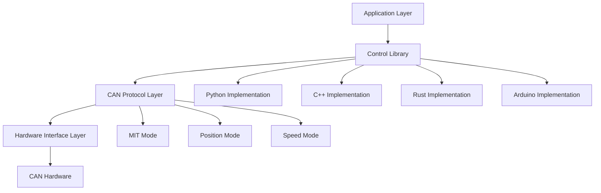
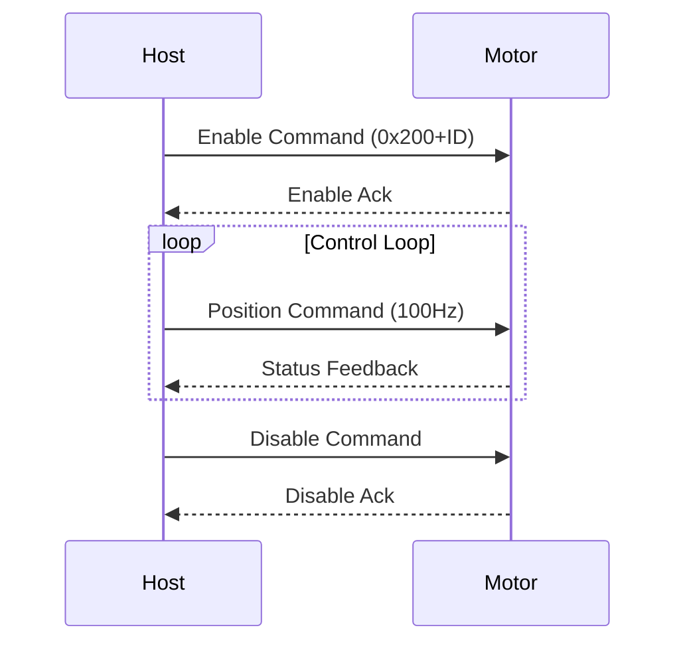

# RobStride制御ライブラリ - 完全技術文書

> Python、C++、Rust、Arduinoでの実装を含む高性能RobStrideモーター制御ベースライン


## 📋 目次

- [プロジェクト概要](#プロジェクト概要)
- [対応モーターモデル](#対応モーターモデル)
- [技術アーキテクチャ](#技術アーキテクチャ)
- [クイックスタート](#クイックスタート)
- [Python実装](#Python実装)
- [C++実装](#C++実装)
- [Rust実装](#Rust実装)
- [Arduino実装](#Arduino実装)
- [プロトコル詳細](#プロトコル詳細)
- [パフォーマンス最適化](#パフォーマンス最適化)
- [トラブルシューティング](#トラブルシューティング)
- [開発ガイド](#開発ガイド)

---

## 🎯 プロジェクト概要

RobStride制御ライブラリは、RobStrideシリーズモーター専用に設計された高性能モーター制御ライブラリです。このプロジェクトは、複数のプログラミング言語とハードウェアプラットフォームをサポートする完全なモーター制御ソリューションを提供し、ロボティクス、自動化制御、精密位置決め、その他様々なアプリケーションシナリオに適しています。

### コア機能

- ✅ **多言語サポート**: Python、C++、Rust、Arduinoでの実装
- ✅ **複数制御モード**: MITモード、位置モード、速度モード
- ✅ **リアルタイム性能**: 50-200Hzの制御周波数と低遅延
- ✅ **産業グレードの安定性**: 連続長時間動作をサポート
- ✅ **クロスプラットフォーム互換性**: Linuxシステム、ESP32、その他の組み込みプラットフォーム
- ✅ **標準化インターフェース**: 統一されたAPI設計で言語切り替えが容易

### 技術的優位性

- **高性能**: ミドルウェアオーバーヘッドなしの直接SocketCAN通信
- **メモリ安全性**: Rust実装がメモリ安全性を保証
- **リアルタイム制御**: C++実装で200Hz制御周波数を実現
- **使いやすさ**: Python実装がフレンドリーなインタラクティブインターフェースを提供
- **組み込みフレンドリー**: Arduino実装がリソース制約環境に適している

---

## 対応モーターモデル

| モデル | 最大トルク | 最大速度 | KP範囲 | KD範囲 |
|--------|------------|-----------|----------|----------|
| RS-00 | 17 Nm | 50 rad/s | 500.0 | 5.0 |
| RS-01 | 17 Nm | 44 rad/s | 500.0 | 5.0 |
| RS-02 | 17 Nm | 44 rad/s | 500.0 | 5.0 |
| RS-03 | 60 Nm | 50 rad/s | 5000.0| 100.0|
| RS-04 | 120 Nm| 15 rad/s | 5000.0| 100.0|
| RS-05 | 17 Nm | 33 rad/s | 500.0 | 5.0 |
| RS-06 | 60 Nm | 20 rad/s | 5000.0| 100.0|

---

## 技術アーキテクチャ

### システムアーキテクチャ図



### 通信プロトコル

- **物理層**: CAN 2.0B標準
- **データリンク層**: 拡張フレーム形式（29ビットID）
- **アプリケーション層**: カスタムRobStrideプロトコル
- **伝送レート**: 1 Mbps

### 制御モード詳細

#### 1. MITモード（モード0）
- **特徴**: 高応答速度の直接トルク制御
- **使用例**: 高速応答が必要なアプリケーション
- **制御パラメータ**: P、D、T、位置、速度

#### 2. 位置モード（モード1）
- **特徴**: 精密位置決めの位置閉ループ制御
- **使用例**: 精密位置決め、ロボット関節制御
- **制御パラメータ**: 位置、速度、最大トルク

#### 3. 速度モード（モード2）
- **特徴**: 安定した速度調整の速度閉ループ制御
- **使用例**: 一定速度が必要なアプリケーション
- **制御パラメータ**: 速度、最大トルク

---

## クイックスタート

### 環境セットアップ

```bash
# Ubuntu/Debian system dependencies
sudo apt-get update
sudo apt-get install -y \
    build-essential cmake \
    python3 python3-pip \
    rustc cargo \
    can-utils \
    gcc-avr avr-libc arduino-core

# CAN interface setup
sudo modprobe can
sudo ip link set can0 type can bitrate 1000000
sudo ip link set up can0
```

### プロジェクトのクローン

```bash
git clone https://github.com/Seeed-Projects/RobStride_Control.git
cd RobStride_Control
```

### 言語実装の選択

| 言語 | 制御周波数 | メモリ使用量 | 使用例 |
|----------|-------------------|--------------|-----------|
| Python | 50-100Hz | ~50MB | 迅速なプロトタイピング、アルゴリズム検証 |
| C++ | 200Hz | ~10MB | 高性能アプリケーション、リアルタイム制御 |
| Rust | 150Hz | ~8MB | 安全性重視、メモリ安全性要件 |
| Arduino | 100Hz | ~2KB | 組み込み、リソース制約環境 |

---

## Python実装

### 依存関係のインストール

```bash
cd python
pip install -r requirements.txt
```

### 基本的な使用方法

```python
#!/usr/bin/env python3
from robstride_dynamics import RobstrideBus

# Initialize CAN bus
bus = RobstrideBus('can0')

# Scan for motors
motors = bus.scan_channel()
print(f"Found motors: {motors}")

# MIT mode position control
motor_id = 1
target_position = 0.0

while True:
    # Send control command
    bus.write_operation_frame(
        motor_id=motor_id,
        p_des=target_position,
        v_des=0.0,
        kp=30.0,
        kd=0.5,
        t_ff=0.0
    )

    # Read status
    response = bus.read_frame(motor_id)
    print(f"Position: {response['position']:.3f} rad")

    time.sleep(0.01)  # 100Hz control frequency
```

### インタラクティブインターフェース

```bash
# Run MIT position control (with interactive interface)
python3 src/position_control.py 1

# Run speed control
python3 src/velocity_control.py 1
```

### インタラクティブコマンド

```bash
# Interactive commands in MIT mode
kp 30.0     # Set position gain
kd 0.5      # Set velocity gain
pos 1.0     # Set target position
vel 2.0     # Set target velocity
tor 5.0     # Set feed-forward torque
quit        # Exit program
```

### 高度な機能

```python
# Multi-motor synchronous control
motors = [1, 2, 3, 4]
bus.enable_motors(motors)

# Synchronous parameter setting
for motor_id in motors:
    bus.set_motor_param(motor_id, kp=50.0, kd=1.0)

# Synchronous control
while True:
    for i, motor_id in enumerate(motors):
        position = math.sin(time.time() + i * math.pi/2)
        bus.write_operation_frame(motor_id, position, 0, 50.0, 1.0, 0)
```

---

## C++実装

### ビルド

```bash
cd cpp
mkdir build && cd build
cmake ..
make
```

### 基本的な使用方法

```cpp
#include <iostream>
#include <thread>
#include <chrono>
#include <atomic>

class RobStrideMotor {
private:
    int can_socket;
    int motor_id;
    std::atomic<bool> running;

public:
    RobStrideMotor(int id) : motor_id(id), running(false) {
        can_socket = socket(PF_CAN, SOCK_RAW, CAN_RAW);
        // ... initialization code
    }

    void start() {
        running = true;
        std::thread control_thread(&RobStrideMotor::control_loop, this);
        control_thread.detach();
    }

    void set_position(double position, double kp, double kd) {
        uint8_t data[8];
        // ... pack data
        struct can_frame frame;
        frame.can_id = 0x200 + motor_id;
        frame.can_dlc = 8;
        memcpy(frame.data, data, 8);

        write(can_socket, &frame, sizeof(frame));
    }
};
```

### パフォーマンス最適化

```cpp
// High-performance configuration
static constexpr int CONTROL_FREQ = 200;  // 200Hz
static constexpr auto CONTROL_PERIOD =
    std::chrono::microseconds(1000000 / CONTROL_FREQ);

// Real-time control loop
void control_loop() {
    auto next_time = std::chrono::steady_clock::now();

    while (running) {
        // Control logic
        send_command();

        // Precise timing control
        next_time += CONTROL_PERIOD;
        std::this_thread::sleep_until(next_time);
    }
}
```

### 実行

```bash
# Requires administrator privileges
sudo ./build/robstride-mit-position 1
```

---

## Rust実装

### ビルド

```bash
cd rust
cargo build --release
```

### 基本的な使用方法

```rust
use socketcan::{CanSocket, CanFrame, EmbeddedFrame};
use std::sync::{Arc, Mutex};
use std::thread;

struct RobStrideController {
    socket: Arc<Mutex<CanSocket>>,
    motor_id: u8,
}

impl RobStrideController {
    fn new(interface: &str, motor_id: u8) -> Result<Self, Box<dyn std::error::Error>> {
        let socket = CanSocket::open(interface)?;
        Ok(Self {
            socket: Arc::new(Mutex::new(socket)),
            motor_id,
        })
    }

    fn send_position_command(
        &self,
        position: f32,
        velocity: f32,
        kp: f32,
        kd: f32,
        torque: f32,
    ) -> Result<(), Box<dyn std::error::Error>> {
        let data: [u8; 8] = [
            (position * 1000.0) as u8,
            ((position * 1000.0) / 256.0) as u8,
            ((position * 1000.0) / 65536.0) as u8,
            ((position * 1000.0) / 16777216.0) as u8,
            (velocity * 1000.0) as u8,
            (kp * 5.0) as u8,
            (kd * 500.0) as u8,
            (torque * 10.0) as u8,
        ];

        let frame = CanFrame::new(
            socketcan::CanId::new(0x200 + self.motor_id as u32).unwrap(),
            &data,
        )?;

        let socket = self.socket.lock().unwrap();
        socket.write_frame(&frame)?;
        Ok(())
    }
}
```

### メモリ安全性機能

```rust
// Multi-thread safe shared CAN interface
let controller = Arc::new(RobStrideController::new("can0", motor_id)?);

// Control thread
let ctrl_clone = Arc::clone(&controller);
thread::spawn(move || {
    loop {
        ctrl_clone.send_command()?;
        thread::sleep(Duration::from_millis(10));
    }
});

// Monitoring thread
let monitor_clone = Arc::clone(&controller);
thread::spawn(move || {
    loop {
        let status = monitor_clone.read_status()?;
        println!("Motor status: {:?}", status);
        thread::sleep(Duration::from_millis(50));
    }
});
```

### 実行

```bash
cargo run --release -- 1
```

---

## Arduino 実装

### ハードウェア構成

```
ESP32           CAN Transceiver      RobStride Motor
GPIO5   <--->   TX                    CAN H
GPIO4   <--->   RX                    CAN L
5V      <--->   VCC                   Power Supply
GND     <--->   GND                   Ground
```

### 基本コード

```cpp
#include <ESP32-TWAI-CAN.h>

class RobStrideMotor {
private:
    TWAI_CAN can;
    uint8_t motor_id;

public:
    RobStrideMotor(uint8_t id) : motor_id(id) {}

    bool begin() {
        can.begin(TWAI_SPEED_1000KBPS, 4, 5);  // GPIO4=RX, GPIO5=TX
        return true;
    }

    void send_position_command(float position, float velocity, float kp, float kd, float torque) {
        can_frame_t frame;
        frame.identifier = 0x200 + motor_id;
        frame.extd = true;
        frame.data_length_code = 8;

        // Pack data
        int32_t pos_int = (int32_t)(position * 1000.0);
        frame.data[0] = pos_int & 0xFF;
        frame.data[1] = (pos_int >> 8) & 0xFF;
        frame.data[2] = (pos_int >> 16) & 0xFF;
        frame.data[3] = (pos_int >> 24) & 0xFF;
        frame.data[4] = (uint8_t)(velocity * 1000.0);
        frame.data[5] = (uint8_t)(kp * 5.0);
        frame.data[6] = (uint8_t)(kd * 500.0);
        frame.data[7] = (uint8_t)(torque * 10.0);

        can.writeFrame(&frame);
    }

    void enable_motor() {
        can_frame_t frame;
        frame.identifier = 0x200 + motor_id;
        frame.extd = true;
        frame.data_length_code = 8;
        memset(frame.data, 0xFF, 8);  // Enable command
        can.writeFrame(&frame);
    }
};
```

### Arduino 制御例

```cpp
RobStrideMotor motor(1);

void setup() {
    Serial.begin(115200);
    motor.begin();

    // Enable motor
    motor.enable_motor();
    delay(100);

    Serial.println("Motor enabled, starting control loop...");
}

void loop() {
    static float phase = 0.0;
    float target_pos = sin(phase) * 3.14159;  // ±π radians

    motor.send_position_command(target_pos, 0, 30.0, 0.5, 0);

    phase += 0.01;
    delay(10);  // 100Hz control frequency

    if (phase > 2 * 3.14159) {
        phase = 0;
    }
}
```

---

## プロトコル詳細

### CAN フレーム形式

| フィールド | サイズ | 説明 |
|-------|------|-------------|
| ID | 29 ビット | 拡張フレーム識別子 |
| DLC | 4 ビット | データ長（8 に固定） |
| Data | 8 バイト | 制御データ |
| CRC | 16 ビット | 巡回冗長検査 |

### ID 割り当てルール

- **0x200 + ID**: MIT モード制御コマンド
- **0x300 + ID**: 位置モード制御コマンド
- **0x400 + ID**: 速度モード制御コマンド
- **0x500 + ID**: システム状態クエリ
- **0x600 + ID**: システム設定コマンド

### データパケット形式

#### MIT モード制御コマンド（8 バイト）

```c
struct mit_command_t {
    int32_t p_des;     // Target position (rad)
    int16_t v_des;     // Target velocity (rad/s)
    uint16_t kp;       // Position gain
    uint16_t kd;       // Velocity gain
    int16_t t_ff;      // Feed-forward torque (Nm)
};
```

#### モーター状態フィードバック（8 バイト）

```c
struct motor_status_t {
    int32_t position;  // Current position (rad)
    int16_t velocity;  // Current velocity (rad/s)
    int16_t torque;    // Current torque (Nm)
    uint8_t mode;      // Current mode
    uint8_t error;     // Error code
};
```

### 通信タイミング



---

## パフォーマンス最適化

### システムチューニング

#### 1. Linux カーネルパラメータ最適化

```bash
# Real-time priority setting
echo 'KERNEL=="can0", MODE="0666"' > /etc/udev/rules.d/99-can.rules

# CPU affinity binding
sudo taskset -cp 0-3 $(pgrep robstride-control)

# Memory locking (optional)
sudo sysctl -w vm.swappiness=1
```

#### 2. リアルタイムスケジューリング

```cpp
#include <sched.h>
#include <sys/mman.h>

struct sched_param param;
param.sched_priority = 99;
sched_setscheduler(0, SCHED_FIFO, &param);

mlockall(MCL_CURRENT | MCL_FUTURE);
```

### パフォーマンスベンチマーク

| 言語 | 制御周波数 | CPU 使用率 | レイテンシ | メモリ使用量 |
|----------|-------------------|-----------|---------|--------------|
| Python | 50-100Hz | 15-20% | 2-5ms | ~50MB |
| C++ | 200Hz | 5-8% | 0.5-1ms | ~10MB |
| Rust | 150Hz | 8-12% | 1-2ms | ~8MB |
| Arduino | 100Hz | 40-60% | 1-3ms | ~2KB |

### 最適化のヒント

#### Python 最適化

```python
# Use C extensions for acceleration
from robstride_dynamics import RobstrideBus

# Pre-allocate arrays
import numpy as np
position_buffer = np.zeros(1000)

# Async I/O
import asyncio
async def control_loop():
    while True:
        await send_command()
        await asyncio.sleep(0.01)
```

#### C++ 最適化

```cpp
// Zero-copy optimization
static_assert(sizeof(motor_command_t) == 8, "Command size mismatch");

// Memory pool
class MemoryPool {
    std::array<motor_command_t, 100> pool;
    std::mutex mutex;
public:
    motor_command_t* acquire() { /* ... */ }
    void release(motor_command_t* ptr) { /* ... */ }
};
```

#### Rust 最適化

```rust
// Pre-allocate capacity
let mut frames: Vec<CanFrame> = Vec::with_capacity(1000);

// Avoid heap allocation
#[repr(C, packed)]
struct MotorCommand {
    p_des: i32,
    v_des: i16,
    kp: u16,
    kd: u16,
    t_ff: i16,
}
```

---

## トラブルシューティング

### よくある問題

#### 1. CAN 通信障害

```bash
# Check CAN interface status
ip -details link show can0

# Monitor CAN traffic
candump can0

# Reset CAN interface
sudo ip link set can0 down
sudo ip link set can0 up type can bitrate 1000000
```

#### 2. モーター無応答

```bash
# Scan devices on bus
python3 -c "
from robstride_dynamics import RobstrideBus
bus = RobstrideBus('can0')
motors = bus.scan_channel()
print(f'Found motors: {motors}')
"
```

#### 3. パフォーマンス問題

```bash
# Check CPU usage
top -p $(pgrep robstride-control)

# Check real-time
sudo chrt -f 99 $(pgrep robstride-control)
```

### エラーコード

| コード | 説明 | 解決策 |
|------|-------------|----------|
| 0x01 | 通信タイムアウト | CAN 接続を確認 |
| 0x02 | パラメータ範囲外 | 制御パラメータ範囲を確認 |
| 0x03 | モーター過電流 | 負荷とトルク制限を確認 |
| 0x04 | 位置オーバーフロー | 制限と目標位置を確認 |
| 0x05 | 温度過高 | 冷却と負荷を確認 |

### デバッグツール

```bash
# Real-time CAN bus monitoring
candump -t A can0

# Send test frame
cansend can0 211#FFFFFFFF

# Network topology detection
canbusload can0@1000000

# Error statistics
cangen can0 -I 211 -D r
```

---

## 開発ガイド

### プロジェクト構造

```
RobStride_Control/
├── cpp/                  # C++ implementation
│   ├── src/             # Source code
│   ├── include/         # Header files
│   ├── tests/           # Test code
│   └── examples/        # Example code
├── python/              # Python implementation
│   ├── src/             # Source code
│   ├── examples/        # Example code
│   └── tests/           # Test code
├── rust/                # Rust implementation
│   ├── src/             # Source code
│   ├── examples/        # Example code
│   └── tests/           # Test code
├── arduino/             # Arduino implementation
│   └── mi_motor_control/# ESP32 library
├── docs/                # Documentation
├── scripts/             # Utility scripts
└── tools/               # Helper tools
```

### 貢献ガイドライン

1. **コードスタイル**
   - Python: PEP 8 に従う
   - C++: Google C++ Style Guide に従う
   - Rust: rustfmt を使用
   - Arduino: Arduino Style Guide に従う

2. **コミット規約**
   ```
   feat: Add new feature
   fix: Bug fix
   docs: Update documentation
   style: Code formatting changes
   refactor: Code refactoring
   test: Add tests
   chore: Build process or auxiliary tool changes
   ```

3. **テスト要件**
   ```bash
   # Run all tests
   python3 -m pytest python/tests/
   cd cpp && make test
   cd rust && cargo test
   ```

### ビルドスクリプト

```bash
#!/bin/bash
# scripts/build-all.sh

echo "Building all implementations..."

# Python
cd python
python3 setup.py build
cd ..

# C++
cd cpp
mkdir -p build && cd build
cmake ..
make -j$(nproc)
cd ../..

# Rust
cd rust
cargo build --release
cd ..

# Arduino (requires Arduino IDE)
echo "Arduino build requires Arduino IDE"
echo "Open arduino/mi_motor_control/mi_motor_control.ino"

echo "Build completed!"
```

### デプロイメントガイド

#### Ubuntu/Debian

```bash
# Install dependencies
sudo apt-get install -y build-essential can-utils

# Build C++ version (fastest)
cd cpp/build
sudo make install

# Create system service
sudo cp scripts/robstride.service /etc/systemd/system/
sudo systemctl enable robstride
sudo systemctl start robstride
```

#### Docker

```dockerfile
FROM ubuntu:22.04

RUN apt-get update && apt-get install -y \
    build-essential cmake \
    python3 python3-pip \
    rustc cargo \
    can-utils

WORKDIR /app
COPY . .

# Build all versions
RUN scripts/build-all.sh

CMD ["./cpp/build/robstride-mit-position", "1"]
```

---

## リソース

- **プロジェクト URL**: https://github.com/Seeed-Projects/RobStride_Control
- **問題報告**: https://github.com/Seeed-Projects/RobStride_Control/issues
- **メンテナー**: @tianrking


---

## 技術サポート & 製品ディスカッション

私たちの製品をお選びいただき、ありがとうございます！私たちは、お客様の製品体験が可能な限りスムーズになるよう、さまざまなサポートを提供しています。さまざまな好みやニーズに対応するため、複数のコミュニケーションチャンネルを用意しています。

<div class="button_tech_support_container">
<a href="https://forum.seeedstudio.com/" class="button_forum"></a>
<a href="https://www.seeedstudio.com/contacts" class="button_email"></a>
</div>

<div class="button_tech_support_container">
<a href="https://discord.gg/eWkprNDMU7" class="button_discord"></a>
<a href="https://github.com/Seeed-Studio/wiki-documents/discussions/69" class="button_discussion"></a>
</div>
