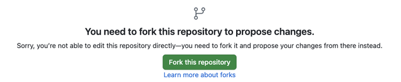
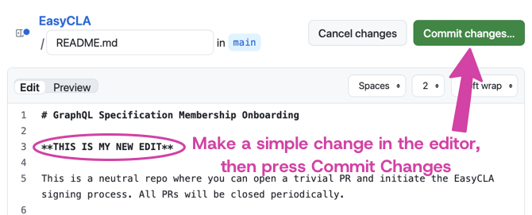
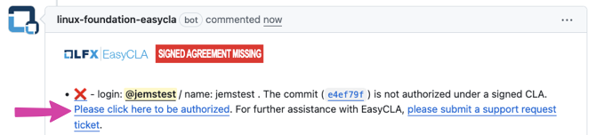

import { Cards } from "../../../components/cards"
import { Callout } from 'nextra/components'
import { Steps } from 'nextra/components'
 
# Project Meetings

All GraphQL technical meetings are free and open to anyone who is interested, so long as they first complete the [GraphQL Specification Membership agreement](https://github.com/graphql/graphql-wg/tree/HEAD/membership).

All GraphQL technical meetings should appear on the [GraphQL public calendar](https://calendar.graphql.org). If a project's meeting isn't on the calendar or is incorrect, please email operations@graphql.org.

## Who can join GraphQL technical meetings?

Anyone who has signed the free [GraphQL Specification Membership agreement](https://github.com/graphql/graphql-wg/tree/HEAD/membership).

## Quick guide: How to join 

[See below for detailed instructions](#how-to-join-a-meeting) on how to sign the membership agreement and join a meeting using a GitHub pull request; here's a brief summary:

1. Open a pull request against the meeting's agenda (forking if necessary)
    1. Add your name and affiliation to the agenda
    1. Add any agenda items, with a time estimate (optional)
    1. First time? Sign the CLA (as an individual or on behalf of an organization) as instructed by the EasyCLA bot
1. Join using the provided Zoom link
1. Notes are taken by AI, and volunteers are encouraged to add to a shared notes doc during the meeting; these will be filed in the `notes` folder
1. Meetings are recorded and later made available on the [GraphQL Foundation Working Groups YouTube channel](https://www.youtube.com/@GraphQLFoundation)

<Callout type="warning">
  **IMPORTANT:** Your PR against the agenda **must** be merged before you can attend. If the EasyCLA bot says you are not covered, you need to follow the links in the bot's comment to sign the [GraphQL Specification Membership agreement](https://github.com/graphql/graphql-wg/tree/HEAD/membership) before you can attend.
</Callout>

## GraphQL Working Group / TSC meeting

The [GraphQL Working Group](https://github.com/graphql/graphql-wg) meets on the first Thursday of each month. When there are topics to address, the [GraphQL Technical Steering Committee (TSC)](https://github.com/graphql/graphql-wg/blob/HEAD/GraphQL-TSC.md) may meet briefly prior to the start of the Working Group meeting.

The goal of the working group meeting is to discuss current work and future plans for the GraphQL specification. The Working Group meeting is also the place to coordinate between other GraphQL working groups and reference implementations.

To join, add yourself to an [upcoming meeting agenda](https://github.com/graphql/graphql-wg/tree/HEAD/agendas).

## GraphQL subcommittee meetings

<Cards
  items={[
    {
      title: "AI working group",
      link: "https://github.com/graphql/ai-wg",
      description: "Explores how GraphQL can best support the growing needs of artificial intelligence and machine learning",
    },
    {
      title: "Community working group",
      link: "https://github.com/graphql/community-wg",
      description: "Serves as the steward of GraphQL's global narrative and market positioning in the technology ecosystem. Developing and executing strategic initiatives that reinforce GraphQL's value proposition while fostering an engaged, educated, and expanding community.",
    },
    {
      title: "Composite schema working group",
      link: "https://github.com/graphql/composite-schemas-wg",
      description: "Building a specification that covers many of the shared concerns when building a larger GraphQL schema as a composite of many smaller GraphQL schemas.",
    },
    {
      title: "GraphiQL working group",
      link: "https://github.com/graphql/graphiql/tree/main/working-group",
      description: "Decision making, setting specifications and navigating feature proposals for our shared GraphQL web and desktop IDE experiences as a community.",
    },
    {
      title: "GraphQL.js working group",
      link: "https://github.com/graphql/graphql-js-wg",
      description: "A monthly virtual meeting of maintainers of commonly used GraphQL libraries and tools and significant contributors in the Javascript ecosystem, operated by the GraphQL Foundation.",
    },
    {
      title: "GraphQL/OTel working group",
      link: "https://github.com/graphql/otel-wg",
      description: "Defining the best practices and semantic conventions for using OpenTelemetry with GraphQL.",
    },
    {
      title: "GraphQL-over-HTTP working group",
      link: "https://github.com/graphql/graphql-over-http/tree/main/working-group",
      description: "Working on a specification that allows GraphQL clients and servers with different implementations and technology stacks to interact freely over HTTP.",
    },
    {
      title: "Nullability working group",
      link: "https://github.com/graphql/nullability-wg",
      description: "Giving clients a way to influence or override nullability checks within queries.",
    }
  ]}
  />

## How to join a meeting

If you have questions about this process, please ask [operations@graphql.org](mailto:operations@graphql.org).
 
<Steps>
### Make a pull request to the EasyCLA repository
 
To see if you have a GraphQL Specification Membership agreement in place you can open a pull request against the [EasyCLA GitHub repository](https://github.com/graphql/easycla) to initiate the EasyCLA signing process; if the bot responds with green "CLA signed" then you already have a CLA in place. The CLA only needs to be signed one time, and it can be signed by individual contributors or their employers. All pull requests will be closed periodically.

You can read about the agreement, including details about whether to sign as an individual or under an organization, [in the specification membership details page](https://github.com/graphql/graphql-wg/tree/main/membership). 

1. Begin by pressing the [edit button](https://github.com/graphql/EasyCLA/edit/main/README.md) in the top right corner of the ["README" file](https://github.com/graphql/EasyCLA/blob/main/README.md)

2. When prompted, create a fork of the project by pressing the green "Fork this repository" button

3. Make a small change to the README file, it doesn't matter what the change is as it won't be merged into the file
4. Press "Commit changes"

5. Confirm your change by pressing "Propose changes", you can use the default commit message
6. This opens a comparison page where you can check your change and press "Create pull request"

7. Now it's time to make your pull request. You can change the title and add to the body of the message if you like, then press "Create pull request"
8. After a minute, an automated comment will appear underneath your pull request from "linux-foundation-easycla bot" asking you to sign the EasyCLA
 
### Sign the EasyCLA 
 
1. Press "Click here to be authorized" in the message the EasyCLA bot left on your pull request

2. You'll be asked to grant the Linux Foundation bot some permissions to work with your GitHub account; press "Authorize LF-Engineering"
3. You will be redirected to the EasyCLA platform. Here, you need to choose whether to proceed as an individual or on behalf of your company. If you choose corporate, you may need to contact your company's CLA manager. You'll also be able to read the document before signing it, by pressing "Download PDF"
4. After choosing which way to proceed, the document will be generated with DocuSign, ready for you to sign electronically. When you have filled in the required fields, press "Finish"
5. You will be redirected back to your pull request, and after a few minutes the EasyCLA bot will show that you have signed the agreement

### Add yourself to the list of attendees

1. Find your [chosen working group above](#graphql-working-group--tsc-meeting) and find its next agenda by browsing to agendas -> year -> month in the central pane of the GitHub webpage
2. Press the Edit button in the top right corner of the agenda file, and when prompted create a fork by pressing the "Fork this repository" button
3. The file is written in markdown and is generally easy to read. Scroll down to `## Attendees`. Add your information following the format of the other attendees in the list. You can preview your change in a rich text format by pressing "Preview" in the top left of the editing pane

4. If applicable, add an agenda item under the `## Agenda` heading, make sure you add your item to the end of the list and add an estimated duration of discussion
5. Press "Commit changes", fill in the details of your changes in the popup, and then press "Propose changes"
6. Now you can review your changes and create your pull request to the agenda by pressing "Create pull request"
7. If you successfully signed the EasyCLA, you will pass the Easy CLA check and your pull request may be automatically merged if you pass the automatic checks. 
8. If you successfully signed the EasyCLA but your PR is not automatically merged, don't worry; pull requests will be reviewed and merged before or at the start of the meeting.
9. If you have issues or questions about this process, please ask [operations@graphql.org](mailto:operations@graphql.org).

</Steps>
