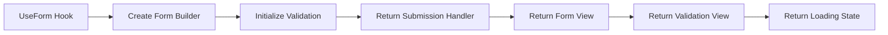

# Source: https://docs.ivy.app/onboarding/concepts/forms.md

# Forms

*Build robust forms with built-in [state management](../../03_Hooks/02_Core/03_UseState.md), validation, and submission handling for collecting and processing user input.*

> **important:** Do not manually create form layouts. Always use `.ToForm()` on your [state](../../03_Hooks/02_Core/03_UseState.md) objects for type safety, automatic state management, and built-in validation.

## Basic Usage

The simplest way to create a form is to call `.ToForm()` on a [state](../../03_Hooks/02_Core/03_UseState.md) object. The FormBuilder automatically scaffolds appropriate input [fields](../../02_Widgets/04_Inputs/01_Field.md) based on your model's property types, providing automatic state management and validation.

```csharp
public class BasicFormExample : ViewBase
{
    public record UserModel(string Name, string Email, bool IsActive, int Age);

    public override object? Build()
    {
        var user = UseState(() => new UserModel("", "", false, 25));
        
        return user.ToForm();
    }
}
```

> **tip:** **Automatic Email Validation**: Fields ending with "Email" (like `UserEmail`, `ContactEmail`) automatically get email validation, even without the `[EmailAddress]` attribute.

### Automatic Field Generation

The FormBuilder automatically maps C# types to appropriate [input widgets](./03_Widgets.md):

| C# Type | Generated Input | Notes |
|---------|----------------|-------|
| `string` | [TextInput](../../02_Widgets/04_Inputs/02_TextInput.md) | Can be customized to email, password, textarea, etc. |
| `bool`, `bool?` | [BoolInput](../../02_Widgets/04_Inputs/04_BoolInput.md) | Checkbox or toggle |
| `int`, `decimal`, `double` | [NumberInput](../../02_Widgets/04_Inputs/03_NumberInput.md) | Number input with validation |
| `DateTime`, `DateOnly` | [DateTimeInput](../../02_Widgets/04_Inputs/07_DateTimeInput.md) | Date/time picker |
| `Enum` | [SelectInput](../../02_Widgets/04_Inputs/05_SelectInput.md) | Dropdown with enum values |
| `List<Enum>` | [SelectInput](../../02_Widgets/04_Inputs/05_SelectInput.md) with multiple selection | Multi-select dropdown |
| Properties ending in "Id" | [ReadOnlyInput](../../02_Widgets/04_Inputs/14_ReadOnlyInput.md) | Typically for system-generated IDs |
| Properties ending in "Email" | [TextInput](../../02_Widgets/04_Inputs/02_TextInput.md) with email validation | Email-specific input |
| Properties ending in "Password" | PasswordInput | Hidden text input |

## Field Configuration

### Custom Labels and Descriptions

Use `.Label()`, `.Description()`, and `.Help()` to customize [field](../../02_Widgets/04_Inputs/01_Field.md) appearance and provide help text.

```csharp
public class ConfiguredFormExample : ViewBase
{
    public record ContactModel(
        string Name,
        string Email,
        string Phone,
        string Message,
        bool Subscribe,
        Gender Gender = Gender.Other
    );

    public enum Gender { Male, Female, Other }

    public override object? Build()
    {
        var contact = UseState(() => new ContactModel("", "", "", "", false));
        
        return contact.ToForm()
            .Label(m => m.Name, "Full Name")
            .Description(m => m.Name, "Enter your full name as it appears on official documents")
            .Label(m => m.Email, "Email Address")
            .Help(m => m.Email, "We'll use this email to send you updates and important notifications")
            .Description(m => m.Email, "We'll use this to send you updates")
            .Label(m => m.Phone, "Phone Number")
            .Label(m => m.Message, "Your Message")
            .Required(m => m.Name, m => m.Email);
    }
}
```

### Custom Input Builders

Use `.Builder()` to specify custom input types for specific [fields](../../02_Widgets/04_Inputs/01_Field.md).

```csharp
public class CustomInputsExample : ViewBase
{
    public record ProductModel(
        string Name,
        string Description,
        decimal Price,
        string JsonConfig,
        List<string> Tags,
        DateTime ReleaseDate
    );

    public override object? Build()
    {
        var product = UseState(() => new ProductModel("", "", 0.0m, "{}", new(), DateTime.Now));
        
        // Create sample tag options for the multi-select
        var tagOptions = new[] { "Electronics", "Clothing", "Books", "Home", "Sports", "Food" }.ToOptions();
        
        return product.ToForm()
            .Builder(m => m.Description, s => s.ToTextareaInput())
            .Builder(m => m.JsonConfig, s => s.ToCodeInput().Language(Languages.Json))
            .Builder(m => m.Tags, s => s.ToSelectInput(tagOptions))
            .Builder(m => m.ReleaseDate, s => s.ToDateTimeInput())
            .Label(m => m.Description, "Product Description")
            .Label(m => m.JsonConfig, "Configuration (JSON)")
            .Label(m => m.Tags, "Product Tags")
            .Label(m => m.ReleaseDate, "Release Date");
    }
}
```

### Required Fields

Mark [fields](../../02_Widgets/04_Inputs/01_Field.md) as required using `.Required()` or rely on automatic detection from non-nullable types.

```csharp
public class RequiredFieldsExample : ViewBase
{
    public record OrderModel(
        string CustomerName,
        string? CustomerEmail, 
        string ShippingAddress,
        int Quantity,
        bool IsPriority
    );

    public override object? Build()
    {
        var order = UseState(() => new OrderModel("", null, "", 1, false));
        
        return order.ToForm()
            .Required(m => m.CustomerEmail) 
            .Required(m => m.IsPriority)    
            .Label(m => m.CustomerName, "Customer Name")
            .Label(m => m.CustomerEmail, "Email Address")
            .Label(m => m.ShippingAddress, "Shipping Address")
            .Help(m => m.ShippingAddress, "Enter the complete shipping address including street, city, and postal code")
            .Label(m => m.Quantity, "Quantity")
            .Label(m => m.IsPriority, "Priority Order");
    }
}
```

## Layout Control

### Field Placement

Control [field](../../02_Widgets/04_Inputs/01_Field.md) placement using `.Place()` and `.PlaceHorizontal()` methods for custom [layouts](./04_Layout.md).

```csharp
public class LayoutControlExample : ViewBase
{
    public record AddressModel(
        string Street,
        string City,
        string State,
        string ZipCode,
        string Country
    );

    public override object? Build()
    {
        var address = UseState(() => new AddressModel("", "", "", "", ""));
        
        return address.ToForm()
            .Place(m => m.Street)                    // Single field spans full width
            .PlaceHorizontal(m => m.City, m => m.State)  // Two fields side-by-side, sharing row width
            .PlaceHorizontal(m => m.ZipCode, m => m.Country) // Two fields side-by-side, sharing row width
            .Label(m => m.Street, "Street Address")
            .Label(m => m.City, "City")
            .Label(m => m.State, "State/Province")
            .Label(m => m.ZipCode, "ZIP/Postal Code")
            .Label(m => m.Country, "Country");
    }
}
```

### Grouped Fields

Organize related [fields](../../02_Widgets/04_Inputs/01_Field.md) into logical groups using `.Group()`.

```csharp
public class GroupedFieldsExample : ViewBase
{
    public record EmployeeModel(
        string FirstName,
        string LastName,
        string Email,
        string Department,
        decimal Salary,
        DateTime HireDate,
        string Street,
        string City,
        string State
    );

    public override object? Build()
    {
        var employee = UseState(() => new EmployeeModel("", "", "", "", 0.0m, DateTime.Now, "", "", ""));
        
        return employee.ToForm()
            .Group("Personal Information", m => m.FirstName, m => m.LastName, m => m.Email)
            .Group("Employment", m => m.Department, m => m.Salary, m => m.HireDate)
            .Group("Address", m => m.Street, m => m.City, m => m.State)
            .Label(m => m.FirstName, "First Name")
            .Label(m => m.LastName, "Last Name")
            .Label(m => m.Email, "Email Address")
            .Label(m => m.Department, "Department")
            .Label(m => m.Salary, "Annual Salary")
            .Label(m => m.HireDate, "Hire Date")
            .Label(m => m.Street, "Street Address")
            .Label(m => m.City, "City")
            .Label(m => m.State, "State");
    }
}
```

### Field Ordering and Removal

Control which [fields](../../02_Widgets/04_Inputs/01_Field.md) are shown and in what order using `.Clear()`, `.Add()`, and `.Remove()`.

```csharp
public class FieldManagementExample : ViewBase
{
    public record ProductModel(
        string Name,
        string Description,
        decimal Price,
        string Category,
        int Stock,
        string SKU,
        DateTime CreatedDate
    );

    public override object? Build()
    {
        var product = UseState(() => new ProductModel("", "", 0.0m, "", 0, "", DateTime.Now));
        
        return product.ToForm()
            .Clear()                                    // Hide all auto-generated fields
            .Add(m => m.Name)                          // Show Name first
            .Add(m => m.Description)                   // Show Description second
            .Add(m => m.Price)                         // Show Price third
            .Add(m => m.Category)                      // Show Category fourth
            .Add(m => m.Stock)                         // Show Stock last
            .Remove(m => m.SKU)                        // Hide SKU field
            .Remove(m => m.CreatedDate)                // Hide CreatedDate field
            .Label(m => m.Name, "Product Name")
            .Label(m => m.Description, "Product Description")
            .Label(m => m.Price, "Unit Price")
            .Label(m => m.Category, "Product Category")
            .Label(m => m.Stock, "Available Stock");
    }
}
```

## Validation

### Custom Submit Text

Change the text of the submit button by passing it as a parameter of the `.ToForm()` method

```csharp
public class CustomSubmitTitleFormExample : ViewBase
{
    public record UserModel(string Name, string Email, bool IsActive, int Age);

    public override object? Build()
    {
        var user = UseState(() => new UserModel("", "", false, 25));
        
        return user.ToForm("Create new user");
    }
}
```

### Form Validation

Forms support automatic validation using standard .NET DataAnnotations, with the ability to add custom validation logic for specific business rules. Validation errors appear when you try to submit the form.

```csharp
public class ValidationExample : ViewBase
{
    public class UserModel
    {
        [Required(ErrorMessage = "Username is required")]
        [Length(3, 50, ErrorMessage = "Username must be between 3 and 50 characters")]
        public string Username { get; set; } = "";
        
        [Required]
        [EmailAddress(ErrorMessage = "Please enter a valid email address")]
        [MaxLength(100)]
        public string Email { get; set; } = "";
        
        [Required]
        [Length(8, 100, ErrorMessage = "Password must be between 8 and 100 characters")]
        [DataType(DataType.Password)]
        public string Password { get; set; } = "";
        
        [Range(13, 120, ErrorMessage = "Age must be between 13 and 120")]
        public int Age { get; set; } = 18;
        
        [Phone(ErrorMessage = "Please enter a valid phone number")]
        public string? PhoneNumber { get; set; }
        
        [Url(ErrorMessage = "Please enter a valid URL")]
        public string? Website { get; set; }
        
        [AllowedValues("USA", "Canada", "UK", ErrorMessage = "Please select a valid country")]
        public string Country { get; set; } = "USA";
        
        [RegularExpression(@"^\d{5}(-\d{4})?$", ErrorMessage = "ZIP code must be in format 12345 or 12345-6789")]
        public string? ZipCode { get; set; }
        
        [CreditCard(ErrorMessage = "Please enter a valid credit card number")]
        [Length(13, 19, ErrorMessage = "Credit card number must be between 13 and 19 digits")]
        public string? CreditCardNumber { get; set; }
        
        public DateTime BirthDate { get; set; } = DateTime.Now;
    }

    public override object? Build()
    {
        var user = UseState(() => new UserModel());
        var client = UseService<IClientProvider>();
        
        UseEffect(() =>
        {
            // This only fires when the form is submitted successfully (passes validation)
            if (!string.IsNullOrEmpty(user.Value.Username))
            {
                client.Toast($"Account created for {user.Value.Username}!");
            }
        }, user);
        
        var countryOptions = new[] { "USA", "Canada", "UK" }.ToOptions();
        
        return user.ToForm("Create Account")
            .Builder(m => m.Country, s => s.ToSelectInput(countryOptions))
            // Custom validation: birth date cannot be in the future
            .Validate<DateTime>(m => m.BirthDate, birthDate => 
                (birthDate <= DateTime.Now, "Birth date cannot be in the future"))
            // Custom validation: username cannot contain spaces
            .Validate<string>(m => m.Username, username =>
                (!username.Contains(' '), "Username cannot contain spaces"));
    }
}
```

> **info:** **Supported DataAnnotations**: Forms support all standard .NET DataAnnotations including `[Required]`, `[Length]`, `[MinLength]`, `[MaxLength]`, `[Range]`, `[EmailAddress]`, `[Phone]`, `[Url]`, `[CreditCard]`, `[RegularExpression]`, `[AllowedValues]`, and `[DataType]`. All attributes support custom error messages via the `ErrorMessage` parameter.

### Display Attributes

The `[Display]` attribute provides powerful control over how [fields](../../02_Widgets/04_Inputs/01_Field.md) appear in your forms without requiring additional configuration code.

```csharp
public class DisplayAttributeExample : ViewBase
{
    public class UserRegistrationModel
    {
        [Display(Name = "Full Name", Description = "Enter your complete legal name", Order = 1)]
        [Required(ErrorMessage = "Full name is required")]
        [Length(2, 100)]
        public string Name { get; set; } = "";

        [Display(Name = "Email Address", Description = "We'll use this for account verification", Order = 2)]
        [Required]
        [EmailAddress]
        public string Email { get; set; } = "";

        [Display(Name = "Phone Number", Description = "For account security purposes", Prompt = "+1-234-567-8900", Order = 3)]
        [Phone]
        public string? PhoneNumber { get; set; }

        [Display(GroupName = "Account Security", Name = "Password", Order = 4)]
        [Required]
        [Length(8, 100)]
        [DataType(DataType.Password)]
        public string Password { get; set; } = "";

        [Display(GroupName = "Account Security", Name = "Confirm Password", Order = 5)]
        [Required]
        [DataType(DataType.Password)]
        public string ConfirmPassword { get; set; } = "";

        [Display(GroupName = "Preferences", Name = "Newsletter Subscription", Description = "Receive weekly updates", Order = 6)]
        public bool SubscribeToNewsletter { get; set; } = false;

        [Display(GroupName = "Preferences", Name = "Preferred Theme", Order = 7)]
        [AllowedValues("Light", "Dark", "Auto")]
        public string Theme { get; set; } = "Auto";
    }

    public override object? Build()
    {
        var user = UseState(() => new UserRegistrationModel());
        var client = UseService<IClientProvider>();
        
        UseEffect(() =>
        {
            if (!string.IsNullOrEmpty(user.Value.Name))
            {
                client.Toast($"Registration completed for {user.Value.Name}!");
            }
        }, user);

        var themeOptions = new[] { "Light", "Dark", "Auto" }.ToOptions();
        
        return user.ToForm("Create Account")
            .Builder(m => m.Theme, s => s.ToSelectInput(themeOptions))
            .Builder(m => m.Password, s => s.ToPasswordInput())
            .Builder(m => m.ConfirmPassword, s => s.ToPasswordInput())
            .Validate<string>(m => m.ConfirmPassword, confirmPassword =>
                (confirmPassword == user.Value.Password, "Passwords must match"));
    }
}
```

The `[Display]` attribute supports these properties:

- **Name**: Custom [field](../../02_Widgets/04_Inputs/01_Field.md) label (overrides automatic label generation)
- **Description**: Help text shown below the field
- **Order**: Field ordering (lower numbers appear first)
- **GroupName**: Groups related fields together
- **Prompt**: Placeholder text for input [fields](../../02_Widgets/04_Inputs/01_Field.md)

### Programmatic Validation

In addition to DataAnnotations, you can add validation programmatically using FormBuilder methods:

```csharp
public class ProgrammaticValidationExample : ViewBase
{
    public record ProductModel(
        string Name,
        string? Description,
        decimal Price,
        int Stock
    );

    public override object? Build()
    {
        var product = UseState(() => new ProductModel("", null, 0.0m, 0));
        
        return product.ToForm()
            // Mark fields as required programmatically
            .Required(m => m.Name, m => m.Price)
            // Add custom validation logic
            .Validate<string>(m => m.Name, name =>
                (name.Length >= 3, "Product name must be at least 3 characters"))
            .Validate<decimal>(m => m.Price, price =>
                (price > 0, "Price must be greater than zero"))
            .Validate<int>(m => m.Stock, stock =>
                (stock >= 0, "Stock cannot be negative"))
            .Label(m => m.Name, "Product Name")
            .Label(m => m.Description, "Description")
            .Label(m => m.Price, "Price")
            .Label(m => m.Stock, "Stock Quantity");
    }
}
```

**Programmatic Validation Methods:**

- `.Required(params Expression<Func<TModel, object>>[] fields)` - Mark [fields](../../02_Widgets/04_Inputs/01_Field.md) as required
- `.Validate<T>(Expression<Func<TModel, object>> field, Func<T, (bool, string)> validator)` - Add custom validation with custom error message

### Validation Examples

#### Collections and Arrays

```csharp
public class CollectionValidationExample : ViewBase
{
    public class SurveyModel
    {
        [Display(Name = "Interests", Description = "Select at least one interest")]
        [Required(ErrorMessage = "Please select at least one interest")]
        [MinLength(1, ErrorMessage = "You must select at least one interest")]
        [AllowedValues("Technology", "Sports", "Music", "Art", "Travel")]
        public string[] Interests { get; set; } = Array.Empty<string>();
        
        [Display(Name = "Tags")]
        [Length(1, 5, ErrorMessage = "Select between 1 and 5 tags")]
        public List<string> Tags { get; set; } = new();
    }

    public override object? Build()
    {
        var survey = UseState(() => new SurveyModel());
        var interestOptions = new[] { "Technology", "Sports", "Music", "Art", "Travel" }.ToOptions();
        var tagOptions = new[] { "New", "Popular", "Featured", "Sale", "Limited" }.ToOptions();
        
        return survey.ToForm()
            .Builder(m => m.Interests, s => s.ToSelectInput(interestOptions).List())
            .Builder(m => m.Tags, s => s.ToSelectInput(tagOptions).List());
    }
}
```

#### Combining Multiple Validators

```csharp
public class MultipleValidatorsExample : ViewBase
{
    public class AccountModel
    {
        [Display(Name = "Username")]
        [Required(ErrorMessage = "Username is required")]
        [Length(3, 20, ErrorMessage = "Username must be between 3 and 20 characters")]
        [RegularExpression(@"^[a-zA-Z0-9_]+$", ErrorMessage = "Username can only contain letters, numbers, and underscores")]
        public string Username { get; set; } = "";
        
        [Display(Name = "Email")]
        [Required]
        [EmailAddress(ErrorMessage = "Invalid email format")]
        [MaxLength(100, ErrorMessage = "Email cannot exceed 100 characters")]
        public string Email { get; set; } = "";
        
        [Display(Name = "Password")]
        [Required]
        [Length(8, 128, ErrorMessage = "Password must be between 8 and 128 characters")]
        [RegularExpression(@"^(?=.*[a-z])(?=.*[A-Z])(?=.*\d)", ErrorMessage = "Password must contain uppercase, lowercase, and a number")]
        [DataType(DataType.Password)]
        public string Password { get; set; } = "";
    }

    public override object? Build()
    {
        var account = UseState(() => new AccountModel());
        
        return account.ToForm("Create Account")
            .Builder(m => m.Password, s => s.ToPasswordInput());
    }
}
```

## Form Submission

### Basic Form Submission

Forms automatically handle submission when the user presses Enter or clicks the built-in submit button. When a form is submitted successfully, it updates the model state, which triggers any [UseEffect](../../03_Hooks/02_Core/04_UseEffect.md) watching that state.

```csharp
public class FormSubmissionExample : ViewBase
{
    public record ContactModel(string Name, string Email, string Message);

    public override object? Build()
    {
        var contact = UseState(() => new ContactModel("", "", ""));
        var client = UseService<IClientProvider>();
        
        UseEffect(() =>
        {
            if (!string.IsNullOrEmpty(contact.Value.Name))
            {
                client.Toast($"Message from {contact.Value.Name} sent successfully!");
            }
        }, contact);
        
        return contact.ToForm()
            .Required(m => m.Name, m => m.Email, m => m.Message);
    }
}
```

### Form Submission with State Updates

React to form submission by watching the model state with [UseEffect](../../03_Hooks/02_Core/04_UseEffect.md). The form automatically updates the state when submitted successfully, triggering [state changes](../../03_Hooks/02_Core/03_UseState.md) and UI updates.

```csharp
public class FormStatesExample : ViewBase
{
    public record OrderModel(
        string CustomerName,
        string ProductName,
        int Quantity,
        decimal UnitPrice
    );

    public override object? Build()
    {
        var order = UseState(() => new OrderModel("", "", 1, 0.0m));
        var client = UseService<IClientProvider>();
        
        UseEffect(() =>
        {
            if (!string.IsNullOrEmpty(order.Value.CustomerName))
            {
                var total = order.Value.Quantity * order.Value.UnitPrice;
                client.Toast($"Order created! Total: ${total:F2}");
            }
        }, order);
        
        return Layout.Vertical()
            | order.ToForm()
                .Required(m => m.CustomerName, m => m.ProductName, m => m.Quantity, m => m.UnitPrice)
            | Text.Block($"Total: ${order.Value.Quantity * order.Value.UnitPrice:F2}");
    }
}
```

### Form Re-rendering

Demonstrates how to update form state and trigger re-renders:

```csharp
public class SimpleFormWithResetExample : ViewBase
{
    public record MyModel(string Name, string Email, int Age);

    public override object? Build()
    {
        // Create the state for your model
        var model = UseState(() => new MyModel("", "", 0));
        
        // Create a form from the state
        var form = model.ToForm()
            .Label(m => m.Name, "Full Name")
            .Label(m => m.Email, "Email Address")
            .Label(m => m.Age, "Age");
        
        // To update the model and trigger re-render, you MUST use Set()
        UseEffect(async () =>
        {
            // Example: Load data after 2 seconds
            await Task.Delay(2000);
            // CORRECT: This will trigger form re-render
            model.Set(new MyModel("John Doe", "john@example.com", 30));
        });
        
        return Layout.Vertical()
            | form
            | (Layout.Horizontal()
                | new Button("Update Model", _ => {
                    model.Set(new MyModel("Jane Doe", "jane@example.com", 25));
                })
                | new Button("Reset Form", _ => {
                    model.Set(new MyModel("", "", 0));
                }))
            | Text.Block($"Current: {model.Value.Name} ({model.Value.Email}) - Age: {model.Value.Age}");
    }
}
```

> **warning:** This example works because it uses the form's internal state management. The form maintains its own copy of the data until submission, so programmatic updates using `.Set()` will be reflected in the form fields.

## Advanced Features

### Conditional Fields

Show or hide [fields](../../02_Widgets/04_Inputs/01_Field.md) based on other field values using `.Visible()`.

```csharp
public class ConditionalFieldsExample : ViewBase
{
    public record AccountModel(
        string Email,
        string Password,
        bool HasTwoFactor,
        string PhoneNumber,
        bool IsBusinessAccount,
        string CompanyName,
        string TaxId
    );

    public override object? Build()
    {
        var account = UseState(() => new AccountModel("", "", false, "", false, "", ""));
        
        return account.ToForm()
            .Visible(m => m.PhoneNumber, m => m.HasTwoFactor)
            .Visible(m => m.CompanyName, m => m.IsBusinessAccount)
            .Visible(m => m.TaxId, m => m.IsBusinessAccount)
            .Label(m => m.Email, "Email Address")
            .Label(m => m.Password, "Password")
            .Label(m => m.HasTwoFactor, "Enable Two-Factor Authentication")
            .Label(m => m.PhoneNumber, "Phone Number (for 2FA)")
            .Label(m => m.IsBusinessAccount, "Business Account")
            .Label(m => m.CompanyName, "Company Name")
            .Label(m => m.TaxId, "Tax ID")
            .Required(m => m.Email, m => m.Password);
    }
}
```

### Dynamic Field Configuration

Configure [fields](../../02_Widgets/04_Inputs/01_Field.md) based on runtime conditions.

```csharp
public class DynamicConfigurationExample : ViewBase
{
    public record UserModel(
        string Username,
        string Email,
        string Password,
        bool IsAdmin,
        string Role
    );

    public override object? Build()
    {
        var user = UseState(() => new UserModel("", "", "", false, ""));
        var isEditMode = UseState(false);
        var currentUser = UseState(() => new UserModel("admin", "admin@example.com", "", true, "Admin"));
        
        // Build the form with conditional field visibility instead of removal
        var form = user.ToForm()
            .Visible(m => m.Username, m => !isEditMode.Value) // Hide username in edit mode
            .Visible(m => m.IsAdmin, m => currentUser.Value.IsAdmin) // Only show admin field to admins
            .Visible(m => m.Role, m => currentUser.Value.IsAdmin) // Only show role field to admins
            .Required(m => m.Email, m => m.Password);
        
        return Layout.Vertical()
            | (Layout.Horizontal()
                | new Button("New User").OnClick(_ => isEditMode.Set(false))
                | new Button("Edit User").OnClick(_ => isEditMode.Set(true)))
            | form
            | (Layout.Horizontal()
                | new Button(isEditMode.Value ? "Update User" : "Create User")
                | new Button("Cancel").Variant(ButtonVariant.Outline));
    }
}
```

## Forms in UI Components

### Sheet Forms

Open forms in slide-out [sheets](../../02_Widgets/07_Advanced/02_Sheet.md) using `.ToSheet()`.

```csharp
public class SheetFormExample : ViewBase
{
    public record ProductModel(
        string Name,
        string Description,
        decimal Price,
        string Category
    );

    public override object? Build()
    {
        var product = UseState(() => new ProductModel("", "", 0.0m, ""));
        var isSheetOpen = UseState(false);
        
        return Layout.Vertical()
            | new Button("Add New Product").OnClick(_ => isSheetOpen.Set(true))
            | product.ToForm()
                .Required(m => m.Name, m => m.Price, m => m.Category)
                .ToSheet(isSheetOpen, "New Product", "Fill in the product details below");
    }
}
```

### Dialog Forms

Open forms in modal [dialogs](../../02_Widgets/03_Common/15_Dialog.md) using `.ToDialog()`.

```csharp
public class DialogFormExample : ViewBase
{
    public record UserModel(
        string FirstName,
        string LastName,
        string Email,
        string Department
    );

    public override object? Build()
    {
        var user = UseState(() => new UserModel("", "", "", ""));
        var isDialogOpen = UseState(false);
        
        return Layout.Vertical()
            | new Button("Create User").OnClick(_ => isDialogOpen.Set(true))
            | user.ToForm()
                .Required(m => m.FirstName, m => m.LastName, m => m.Email)
                .ToDialog(isDialogOpen, "Create New User", "Please provide user information", 
                         width: Size.Units(125));
    }
}
```

## Migration from Manual Forms

If you're currently using manual form layouts, migrate to `.ToForm()`:

```csharp
// ❌ Don't do this - manual form layout
var form = new Form(
    new TextInput(name),
    new TextInput(email),
    new Button("Submit")
);

// ✅ Do this instead - use .ToForm()
var model = UseState(() => new UserModel("", ""));
return model.ToForm()
    .Required(m => m.Name, m => m.Email);
```

> **warning:** Avoid manually creating form layouts. Always use `.ToForm()` on your [state](../../03_Hooks/02_Core/03_UseState.md) objects for better state management, validation, and type safety.

## UseForm

The `UseForm` hook returns a tuple containing form submission handler, form view, validation view, and loading state. It enables manual control over form rendering and submission, which is useful for custom [layouts](./04_Layout.md), [dialogs](../../02_Widgets/03_Common/15_Dialog.md), and [sheets](../../02_Widgets/07_Advanced/02_Sheet.md) where the form builder's default layout isn't suitable.



> **info:** In most cases, you'll use `.ToForm()` directly on your [state](../../03_Hooks/02_Core/03_UseState.md) objects for automatic form rendering. Use the `UseForm` hook when you need custom [layouts](./04_Layout.md), want to place the form in [dialogs](../../02_Widgets/03_Common/15_Dialog.md)/[sheets](../../02_Widgets/07_Advanced/02_Sheet.md), or need manual control over form submission.

### Basic Usage

Use `UseForm` when you need manual control over form rendering and submission, such as in [dialogs](../../02_Widgets/03_Common/15_Dialog.md) or [sheets](../../02_Widgets/07_Advanced/02_Sheet.md).

```csharp
public class UseFormHookExample : ViewBase
{
    public record UserModel(string Name, string Email, int Age);

    public override object? Build()
    {
        var user = UseState(() => new UserModel("", "", 25));
        var (onSubmit, formView, validationView, loading) = UseForm(() => user.ToForm()
            .Required(m => m.Name, m => m.Email));

        async ValueTask HandleSubmit()
        {
            if (await onSubmit())
            {
                // Form is valid, process the submission
                // user.Value contains the validated form data
            }
        }

        return Layout.Vertical()
            | formView
            | Layout.Horizontal()
                | new Button("Save").OnClick(_ => HandleSubmit())
                    .Loading(loading).Disabled(loading)
                | validationView;
    }
}
```


## API

[View Source: Form.cs](https://github.com/Ivy-Interactive/Ivy-Framework/blob/main/src/Ivy/Widgets/Forms/Form.cs)

### Properties

| Name | Type | Setters |
|------|------|---------|
| `Height` | `Size` | - |
| `Scale` | `Scale?` | - |
| `Visible` | `bool` | - |
| `Width` | `Size` | - |


### Events

| Name | Type | Handlers |
|------|------|----------|
| `OnSubmit` | `EventHandler<Event<Form>>` | - |


## Examples


### Forms with Data Tables

Combine forms with [data tables](../../02_Widgets/07_Advanced/01_DataTable.md) for CRUD operations.

```csharp
public class CrudFormExample : ViewBase
{
    public record ProductModel(
        string Name,
        string Description,
        decimal Price,
        string Category
    );

    public override object? Build()
    {
        var products = UseState(() => new ProductModel[0]);
        var selectedProduct = UseState<ProductModel?>(() => null);
        var editingProduct = UseState<ProductModel?>(() => null);
        var isCreateDialogOpen = UseState(false);
        var isEditDialogOpen = UseState(false);
        
        var addProduct = (Event<Button> e) =>
        {
            editingProduct.Set(new ProductModel("", "", 0.0m, ""));
            isCreateDialogOpen.Set(true);
        };
        
        var editProduct = (Event<Button> e) =>
        {
            if (selectedProduct.Value != null)
            {
                editingProduct.Set(selectedProduct.Value);
                isEditDialogOpen.Set(true);
            }
        };
        
        var deleteProduct = (Event<Button> e) =>
        {
            if (selectedProduct.Value != null)
            {
                var updatedProducts = products.Value.Where(p => p != selectedProduct.Value).ToArray();
                products.Set(updatedProducts);
                selectedProduct.Set((ProductModel?)null);
            }
        };
        
        // Create dialog content for new product
        var createDialog = isCreateDialogOpen.Value && editingProduct.Value != null
            ? new Dialog(
                _ => isCreateDialogOpen.Set(false),
                new DialogHeader("Create New Product"),
                new DialogBody(
                    Layout.Vertical()
                        | Text.Block("Fill in the product details")
                        | editingProduct.ToForm()
                            .Required(m => m.Name, m => m.Price, m => m.Category)
                ),
                new DialogFooter(
                    new Button("Cancel", _ => isCreateDialogOpen.Set(false)).Outline(),
                    new Button("Create Product", _ => {
                        if (editingProduct.Value != null)
                        {
                            var updatedProducts = products.Value.Append(editingProduct.Value).ToArray();
                            products.Set(updatedProducts);
                            isCreateDialogOpen.Set(false);
                        }
                    })
                )
            ).Width(Size.Units(125))
            : null;
        
        // Create dialog content for editing product
        var editDialog = isEditDialogOpen.Value && editingProduct.Value != null
            ? new Dialog(
                _ => isEditDialogOpen.Set(false),
                new DialogHeader("Edit Product"),
                new DialogBody(
                    Layout.Vertical()
                        | Text.Block("Update product information")
                        | editingProduct.ToForm()
                            .Required(m => m.Name, m => m.Price, m => m.Category)
                ),
                new DialogFooter(
                    new Button("Cancel", _ => isEditDialogOpen.Set(false)).Outline(),
                    new Button("Update Product", _ => {
                        if (editingProduct.Value != null && selectedProduct.Value != null)
                        {
                            var updatedProducts = products.Value.Select(p => 
                                p == selectedProduct.Value ? editingProduct.Value : p).ToArray();
                            products.Set(updatedProducts);
                            selectedProduct.Set(editingProduct.Value);
                            isEditDialogOpen.Set(false);
                        }
                    })
                )
            ).Width(Size.Units(125))
            : null;
        
        return Layout.Vertical()
            | (Layout.Horizontal()
                | new Button("Add Product", addProduct)
                | new Button("Edit Product", editProduct)
                    .Disabled(selectedProduct.Value == null)
                | new Button("Delete Product", deleteProduct)
                    .Disabled(selectedProduct.Value == null)
                    .Variant(ButtonVariant.Destructive))
            | (Layout.Vertical()
                | Text.Block("Select a product to edit/delete:")
                | new SelectInput<ProductModel?>(
                    selectedProduct.Value,
                    e => selectedProduct.Set(e.Value),
                    products.Value.ToOptions()
                ).Placeholder("Choose a product..."))
            | products.Value.ToTable()
                .Width(Size.Full())
                .Builder(p => p.Name, f => f.Default())
                .Builder(p => p.Description, f => f.Text())
                .Builder(p => p.Price, f => f.Default())
                .Builder(p => p.Category, f => f.Default())
            | (selectedProduct.Value != null ? 
                Text.Block($"Selected: {selectedProduct.Value.Name} (${selectedProduct.Value.Price})")
                : Text.Block("No product selected"))
            | createDialog!
            | editDialog!;
    }
}
```


### Forms with Real-time Updates

Forms automatically update state, enabling real-time UI updates.

```csharp
public class RealTimeFormExample : ViewBase
{
    public record CalculatorModel(
        decimal Number1,
        decimal Number2,
        string Operation
    );

    public override object? Build()
    {
        var calculator = UseState(() => new CalculatorModel(0, 0, "+"));
        
        decimal CalculateResult()
        {
            return calculator.Value.Operation switch
            {
                "+" => calculator.Value.Number1 + calculator.Value.Number2,
                "-" => calculator.Value.Number1 - calculator.Value.Number2,
                "*" => calculator.Value.Number1 * calculator.Value.Number2,
                "/" => calculator.Value.Number2 != 0 ? calculator.Value.Number1 / calculator.Value.Number2 : 0,
                _ => 0
            };
        }
        
        // Create options for the operation select input
        var operationOptions = new[] { "+", "-", "*", "/" }.ToOptions();
        
        return Layout.Horizontal()
            | new Card(
                calculator.ToForm()
                    .Builder(m => m.Operation, s => s.ToSelectInput(operationOptions))
                    .Label(m => m.Number1, "First Number")
                    .Label(m => m.Number2, "Second Number")
                    .Label(m => m.Operation, "Operation")
            ).Title("Calculator").Width(1/2f)
            | new Card(
                Layout.Vertical()
                    | Text.H3("Result")
                    | Text.Block($"{calculator.Value.Number1} {calculator.Value.Operation} {calculator.Value.Number2} = {CalculateResult()}")
            ).Title("Result").Width(1/2f);
    }
}
```