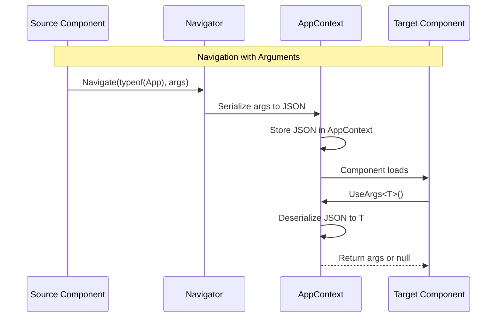

# Source: https://docs.ivy.app/hooks/core/use-args.md

# UseArgs

*The `UseArgs` [hook](../01_RulesOfHooks.md) provides access to arguments passed to a [component](../../../01_Onboarding/02_Concepts/02_Views.md), such as route parameters or navigation arguments.*

## Overview

The `UseArgs` [hook](../01_RulesOfHooks.md) allows you to access component arguments:

- **Navigation Arguments** - Retrieve arguments passed during [navigation](../../../01_Onboarding/02_Concepts/09_Navigation.md)
- **Type Safety** - Strongly typed argument access with compile-time checking
- **JSON Serialization** - Arguments are automatically serialized and deserialized
- **Optional Arguments** - Returns null if arguments are not available

> **Tip:** `UseArgs` is the primary way to pass data between [components](../../../01_Onboarding/02_Concepts/02_Views.md) during navigation. Arguments are serialized as JSON, making them perfect for passing simple data structures like records or DTOs.

## Basic Usage

Use `UseArgs<T>` to retrieve arguments passed during navigation:

```csharp
public record UserArgs(int UserId, string Tab = "overview");
var args = UseArgs<UserArgs>();
```

## How Args Work



### Argument Serialization

Arguments are automatically serialized to JSON when passed and deserialized when accessed:

```csharp
// Arguments are serialized to JSON
var args = new UserProfileArgs(123, "details");
// Becomes: {"UserId":123,"Tab":"details"}

// When UseArgs is called, JSON is deserialized back
var receivedArgs = UseArgs<UserProfileArgs>();
// Returns: UserProfileArgs { UserId = 123, Tab = "details" }
```

### Serialization Errors Handling

If arguments fail to serialize, ensure all properties are serializable and avoid circular references:

```csharp
// Good: All properties serialize
public record GoodArgs(string Name, int Count);

// Bad: Non-serializable property
public record BadArgs(string Name, Action Callback);

// Bad: Circular reference
public class Parent { public Child Child { get; set; } }
public class Child { public Parent Parent { get; set; } }
```

## When to Use Args

| Use Args For | Use State/Context Instead For |
|--------------|-------------------------------|
| Navigation Data | Component State |
| Deep Linking (URL parameters) | Shared Component Data |
| Component Initialization | Complex Objects (circular refs) |
| Simple Data Transfer | Real-time Updates |

### Default Arguments

Provide default behavior when args are null:

```csharp
public record ProductListArgs(string? Category = null, string? SortBy = null, int Page = 1);

public class ArgsDefaultDemo : ViewBase
{
    public override object? Build()
    {
        var args = UseArgs<ProductListArgs>();
        
        // Use defaults if args are null
        var category = args?.Category ?? "all";
        var sortBy = args?.SortBy ?? "name";
        var page = args?.Page ?? 1;
        
        return Layout.Vertical()
            | Text.H3("Product List")
            | Text.Block($"Category: {category}")
            | Text.Block($"Sort By: {sortBy}")
            | Text.Block($"Page: {page}");
    }
}
```

### Argument-Based Routing

Use arguments to determine which view to render:

```csharp
public record AppArgs(string? View = null, int? UserId = null);

public class MainView : ViewBase
{
    public override object? Build()
    {
        var args = UseArgs<AppArgs>();
        
        return args?.View switch
        {
            "dashboard" => Text.H3("Dashboard"),
            "settings" => Text.H3("Settings"),
            "profile" => Text.H3($"Profile: User {args.UserId}"),
            _ => Text.H3("Home")
        };
    }
}
```

## Best Practices

- **Use records for arguments** - Immutable, value equality, and serialize well
- **Provide default values** - Use `public record Args(string Query, int Page = 1)` for optional params
- **Always handle null** - `UseArgs` returns null if no args were passed
- **Keep arguments simple** - Only serializable types (no delegates, streams, or resources)
- **Use descriptive names** - `UserProfileArgs` not `Args` or `Data`

## See Also

- [Navigation](../../../01_Onboarding/02_Concepts/09_Navigation.md) - Programmatic navigation between components
- [State](./03_UseState.md) - Component state management
- [Context](./12_UseContext.md) - Component-scoped data sharing
- [Rules of Hooks](../02_RulesOfHooks.md) - Understanding hook rules and best practices