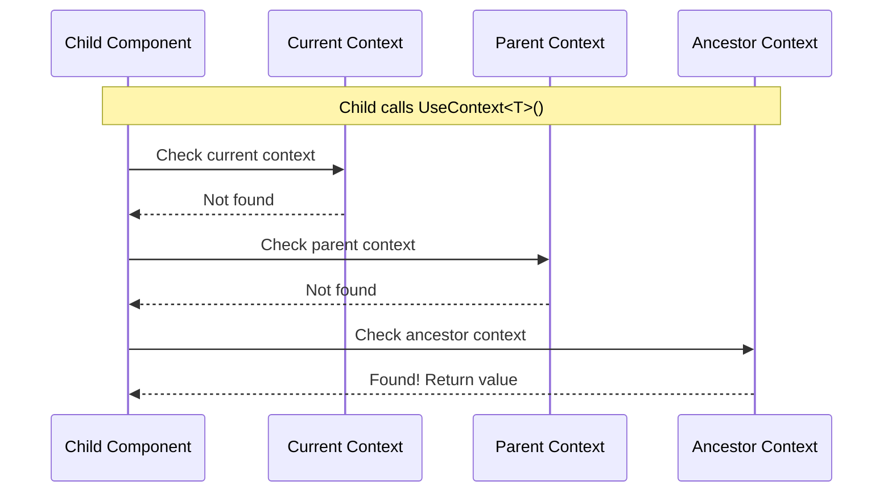

# Source: https://docs.ivy.app/hooks/core/use-context.md

# UseContext

*The `UseContext` and `CreateContext` [hooks](../01_RulesOfHooks.md) enable component-level context management, allowing you to share data and services within a component tree without prop drilling.*

## Overview

Context [hooks](../01_RulesOfHooks.md) provide a way to share data and services across a component tree:

- **Component Scoping** - Context values are scoped to the component and its children
- **Avoid Prop Drilling** - Share data without passing props through every level
- **Hierarchical Resolution** - Context values can be resolved from parent components
- **Lifecycle Management** - Context values are automatically disposed when the component is disposed

## Basic Usage

Use `CreateContext` to create a context value and `UseContext` to retrieve it:

```csharp
public record AppSettings(string Theme, int FontSize);

public class SettingsProvider : ViewBase
{
    public override object? Build()
    {
        CreateContext(() => new AppSettings("dark", 14));
        return new SettingsConsumer();
    }
}

public class SettingsConsumer : ViewBase
{
    public override object? Build()
    {
        var settings = UseContext<AppSettings>();
        return Text.Block($"Theme: {settings.Theme}, Size: {settings.FontSize}px");
    }
}
```

> **Tip:** Context is different from [services](./11_UseService.md). Services are registered globally in your application, while context is scoped to a specific component and its children. Use context for component-specific data and services for application-wide functionality.

## How Context Works



### Context Scoping

Context values are scoped to the component where they are created:

```csharp
public class AppUserContext
{
    public string UserId { get; set; } = "";
}

public class SectionConfig
{
    public string Title { get; set; } = "";
}

public class AppView : ViewBase
{
    public override object? Build()
    {
        // Context created here - available to all children
        CreateContext(() => new AppUserContext { UserId = "123" });
        
        return Layout.Vertical()
            | new SectionView()  // Can access userContext
            | new AnotherView(); // Can also access userContext
    }
}

public class SectionView : ViewBase
{
    public override object? Build()
    {
        var user = UseContext<AppUserContext>(); // Works - found in parent
        
        // Create a new context for this section's children
        CreateContext(() => new SectionConfig { Title = "Settings" });
        
        return new NestedView(); // Can access both userContext and sectionConfig
    }
}

public class NestedView : ViewBase
{
    public override object? Build()
    {
        var user = UseContext<AppUserContext>();        // Works - found in ancestor
        var config = UseContext<SectionConfig>();    // Works - found in parent
        
        return Text.P($"{config.Title} for User {user.UserId}");
    }
}

public class AnotherView : ViewBase
{
    public override object? Build()
    {
        var user = UseContext<AppUserContext>(); // Works - found in ancestor
        
        return Text.P($"Another view - User: {user.UserId}");
    }
}
```

## When to Use Context

| Use Context For | Use Services Instead For |
|-----------------|--------------------------|
| Component-Specific Configuration | Application-Wide Services |
| Shared State (avoid prop drilling) | Singleton Services |
| Component-Scoped Services | Infrastructure Services (logging, database, HTTP) |
| Theme and Styling | |
| Feature Flags (component tree specific) | |

## Lifecycle Management

Context values that implement `IDisposable` are automatically disposed when the component is disposed:

```csharp
public class DisposableResource : IDisposable
{
    public string ResourceId { get; set; } = "";
    public bool IsDisposed { get; private set; }
    
    public DisposableResource(string id)
    {
        ResourceId = id;
    }
    
    public void Dispose()
    {
        IsDisposed = true;
    }
}

public class ResourceView : ViewBase
{
    public override object? Build()
    {
        // ResourceContext will be automatically disposed when ResourceView is disposed
        CreateContext(() => new DisposableResource("resource-123"));
        var resource = UseContext<DisposableResource>();
        
        return Layout.Vertical()
            | Text.P($"Resource ID: {resource.ResourceId}")
            | Text.P($"Disposed: {resource.IsDisposed}")
            | new ResourceConsumer();
    }
}

public class ResourceConsumer : ViewBase
{
    public override object? Build()
    {
        var resource = UseContext<DisposableResource>();
        
        return Text.P($"Using resource: {resource.ResourceId}");
    }
}
```

## Common Patterns

### Provider Component

Create a provider component that sets up context for its children:

```csharp
public class ThemeContext
{
    public string PrimaryColor { get; set; } = "blue";
    public string SecondaryColor { get; set; } = "gray";
}

public class ThemeProvider : ViewBase
{
    public override object? Build()
    {
        // Create theme context for children
        CreateContext(() => new ThemeContext 
        { 
            PrimaryColor = "blue", 
            SecondaryColor = "gray" 
        });
        return new ThemedContent();
    }
}

public class ThemedContent : ViewBase
{
    public override object? Build()
    {
        var theme = UseContext<ThemeContext>();
        
        return Layout.Vertical()
            | Text.P($"Primary Color: {theme.PrimaryColor}")
            | Text.P($"Secondary Color: {theme.SecondaryColor}");
    }
}
```

### Context with Factory

Use factory functions for lazy initialization:

```csharp
public class MemoryCache
{
    public int ItemCount { get; set; }
    public bool IsInitialized { get; set; }
    
    public void Initialize()
    {
        IsInitialized = true;
        ItemCount = 0;
    }
}

public class DataView : ViewBase
{
    public override object? Build()
    {
        // Context is only created when first accessed
        CreateContext(() => 
        {
            var c = new MemoryCache();
            c.Initialize();
            return c;
        });
        
        return new DataListView();
    }
}

public class DataListView : ViewBase
{
    public override object? Build()
    {
        var cache = UseContext<MemoryCache>();
        
        return Layout.Vertical()
            | Text.P($"Cache initialized: {cache.IsInitialized}")
            | Text.P($"Items in cache: {cache.ItemCount}");
    }
}
```

### Conditional Context

Create context conditionally based on state:

```csharp
public class AuthUserContext
{
    public string UserId { get; set; } = "";
    public string UserName { get; set; } = "";
}

public class ConditionalView : ViewBase
{
    public override object? Build()
    {
        var isAuthenticated = UseState(false);
        
        if (isAuthenticated.Value)
        {
            CreateContext(() => new AuthUserContext 
            { 
                UserId = "123",
                UserName = "John Doe"
            });
        }
        
        return Layout.Vertical()
            | new Button($"{(isAuthenticated.Value ? "Logout" : "Login")}", 
                onClick: _ => isAuthenticated.Set(!isAuthenticated.Value))
            | (isAuthenticated.Value 
                ? new ConditionalAuthView() 
                : Text.P("Please login"));
    }
}

public class ConditionalAuthView : ViewBase
{
    public override object? Build()
    {
        var user = UseContext<AuthUserContext>();
        
        return Layout.Vertical()
            | Text.P($"Welcome, {user.UserName}!")
            | Text.P($"User ID: {user.UserId}");
    }
}
```

## Best Practices

- **Use context for component-scoped data** - Use services for app-wide data
- **Keep context values simple** - Data containers or lightweight services; use DI for heavy services
- **Use type safety** - Always use `UseContext<T>()` instead of runtime type checking
- **Avoid frequently changing data** - Use [state](./03_UseState.md) for reactive updates
- **Document context dependencies** - Make it clear when a component requires a parent context

## See Also

- [Services](./11_UseService.md) - Application-wide dependency injection
- [State](./03_UseState.md) - Reactive state management
- [Rules of Hooks](../02_RulesOfHooks.md) - Understanding hook rules and best practices
- [Views](../../../01_Onboarding/02_Concepts/02_Views.md) - Understanding Ivy views and components

## Examples


### User Context

```csharp
public class UserContext
{
    public string UserName { get; set; } = "";
}

public class AuthenticatedView : ViewBase
{
    public override object? Build()
    {
        CreateContext(() => new UserContext { UserName = "John Doe" });
        
        return Layout.Vertical()
            | new UserProfileView()
            | new UserSettingsView();
    }
}

public class UserProfileView : ViewBase
{
    public override object? Build()
    {
        var user = UseContext<UserContext>();
        return Text.P($"Welcome, {user.UserName}!");
    }
}

public class UserSettingsView : ViewBase
{
    public override object? Build()
    {
        var user = UseContext<UserContext>();
        return Text.P($"Settings for {user.UserName}");
    }
}
```


### Component-Scoped Service

```csharp
public class ScopedMemoryCache : IDisposable
{
    private readonly Dictionary<string, string> _cache = new();
    
    public void Set(string key, string value) => _cache[key] = value;
    public string? Get(string key) => _cache.TryGetValue(key, out var value) ? value : null;
    public void Clear() => _cache.Clear();
    public int Count => _cache.Count;
    public void Dispose() => _cache.Clear();
}

public class CacheDataView : ViewBase
{
    public override object? Build()
    {
        CreateContext(() => new ScopedMemoryCache());
        var refreshState = UseState(0);
        CreateContext(() => refreshState);
        
        return Layout.Vertical()
            | new CacheDataListView()
            | new CacheDataDetailView();
    }
}

public class CacheDataListView : ViewBase
{
    public override object? Build()
    {
        var cache = UseContext<ScopedMemoryCache>();
        var refreshState = UseContext<IState<int>>();
        var _ = refreshState.Value;
        
        var data = cache.Get("data") ?? "No data";
        
        return Layout.Vertical()
            | Text.P($"Cached: {data}")
            | Text.P($"Entries: {cache.Count}")
            | new Button("Set Data", onClick: _ => 
            {
                cache.Set("data", "Sample Data");
                refreshState.Set(refreshState.Value + 1);
            });
    }
}

public class CacheDataDetailView : ViewBase
{
    public override object? Build()
    {
        var cache = UseContext<ScopedMemoryCache>();
        var refreshState = UseContext<IState<int>>();
        var _ = refreshState.Value;
        
        return Layout.Vertical()
            | Text.P($"Cache entries: {cache.Count}")
            | new Button("Clear Cache", onClick: _ => 
            {
                cache.Clear();
                refreshState.Set(refreshState.Value + 1);
            });
    }
}
```