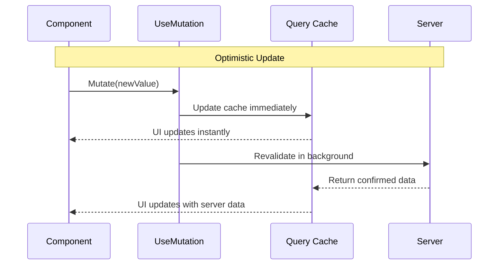

# Source: https://docs.ivy.app/hooks/core/use-mutation.md

# UseMutation

*The `UseMutation` [hook](../01_RulesOfHooks.md) provides a way to control [query](./09_UseQuery.md) caches from different components, enabling optimistic updates, cache invalidation, and cross-component data synchronization.*

## Overview

`UseMutation` enables you to control query caches irrespective of where they are used. It supports:

- **Optimistic Updates**: Update cache immediately before server confirmation.
- **Cross-Component Control**: Trigger updates from components that don't consume the data.
- **Background Revalidation**: Refresh data without clearing the current cache.


## Basic Usage

Update the UI immediately while the server processes the request.

```csharp
public class LikeButton : ViewBase
{
    public record Post(int Likes, bool IsLiked);

    public override object? Build()
    {
        var mutator = UseMutation<Post, string>("post-123");
        var query = UseQuery("post-123", _ => Task.FromResult(new Post(10, false)));
        var current = query.Value ?? new Post(0, false);

        return new Button($"Like ({current.Likes})", _ => 
        {
            if (query.Value is not {} p) return;
            mutator.Mutate(p with { 
                Likes = p.IsLiked ? p.Likes - 1 : p.Likes + 1, 
                IsLiked = !p.IsLiked 
            }, revalidate: false);
        }).Variant(current.IsLiked ? ButtonVariant.Primary : ButtonVariant.Outline);
    }
}
```

## Mutation Flow




## Methods

The hook returns a `QueryMutator` object. Use the typed generic version for optimistic updates.

```csharp
// Typed (Recommended for optimistic updates)
var mutator = UseMutation<User, string>("user-profile");

// Untyped (Good for simple invalidation)
var mutator = UseMutation("user-profile");
```

| Method | Description | Usage |
|--------|-------------|-------|
| `Mutate(value, revalidate)` | Updates cache immediately with `value`. If `revalidate` is true, triggers a background fetch after. | Optimistic UI updates (e.g., Like button). |
| `Revalidate()` | Triggers a background refresh. Keeps showing stale data until new data arrives. | Non-destructive updates (e.g., Edit form save). |
| `Invalidate()` | Clears the cache and forces a refetch. UI enters "switching" or "loading" state. | Destructive operations (e.g., Delete item). |


## Query Scopes

`UseMutation` supports the same scopes as `UseQuery`, **except `View` scope**.

| Scope | Support | Reason |
|-------|---------|--------|
| `Server`, `App`, `Device` | ✅ Supported | Shared state can be accessed by key. |
| `View` | ❌ Not Supported | View-scoped queries are isolated to a specific component instance and cannot be targeted externally. |

## Best Practices & Troubleshooting

*   **Keys Must Match Exactly**: "user-data" and "User-Data" are different keys.
*   **Use Typed Mutations**: You cannot call `Mutate(value)` on an untyped `UseMutation("key")`. You must provide types: `UseMutation<T, TKey>("key")`.
*   **Revalidate vs Invalidate**:
    *   Use **Revalidate** when you want to keep showing the current data while updating (e.g., "Refresh" button).
    *   Use **Invalidate** when the current data is definitely wrong or deleted (e.g., "Delete" button).

> **Warning:** If your mutation isn't working, check if the target `UseQuery` is using <code>Scope = QueryScope.View</code>. UseMutation cannot see View-scoped queries.

## See Also

- [UseQuery](./09_UseQuery.md)
- [Rules of Hooks](../02_RulesOfHooks.md)

## Examples


### Form Submission

Update data locally then sync with server.

```csharp
public class UserForm : ViewBase
{
    public record User(string Name);

    public override object? Build()
    {
        var name = UseState("");
        var mutator = UseMutation<User, string>("user-profile");
        
        var query = UseQuery("user-profile", async ct => 
        {
            await Task.Delay(100);
            return new User("Guest");
        });

        return Layout.Vertical(
            Text.Literal($"Current Profile: {query.Value?.Name ?? "Loading..."}"),
            Layout.Horizontal(
                name.ToTextInput("Enter Name"),
                new Button("Save", async _ => 
                {
                    if (string.IsNullOrEmpty(name.Value)) return;

                    mutator.Mutate(new User(name.Value), revalidate: false);
                    
                    name.Set("");
                    
                    await Task.CompletedTask;
                })
            )
        );
    }
}
```


### Shared Control (Cross-Component)

Control a query from a completely separate component (e.g., a header button controlling a list).

```csharp
public class SharedControlDemo : ViewBase
{
    public override object? Build()
    {
        return Layout.Vertical(
            new RefreshHeader(),
            new Separator(),
            new StatsDisplay()
        );
    }
}

public class RefreshHeader : ViewBase
{
    public override object? Build()
    {
        var mutator = UseMutation("dashboard-stats");

        return Layout.Horizontal(
            new Button("Refresh (Revalidate)", _ => mutator.Revalidate()),
            new Button("Force Reload (Invalidate)", _ => mutator.Invalidate())
        );
    }
}

public class StatsDisplay : ViewBase
{
    public override object? Build()
    {
        var query = UseQuery("dashboard-stats", async ct =>
        {
            await Task.Delay(1000);
            return $"Stats Updated: {DateTime.Now:HH:mm:ss}";
        });

        if (query.Loading) return Text.Literal("Loading new stats...");
        
        return Layout.Vertical(
            Text.H4("Dashboard Stats"),
            Text.Literal(query.Value ?? ""),
            query.Validating ? Text.Muted("Refreshing in background...") : null
        );
    }
}
```