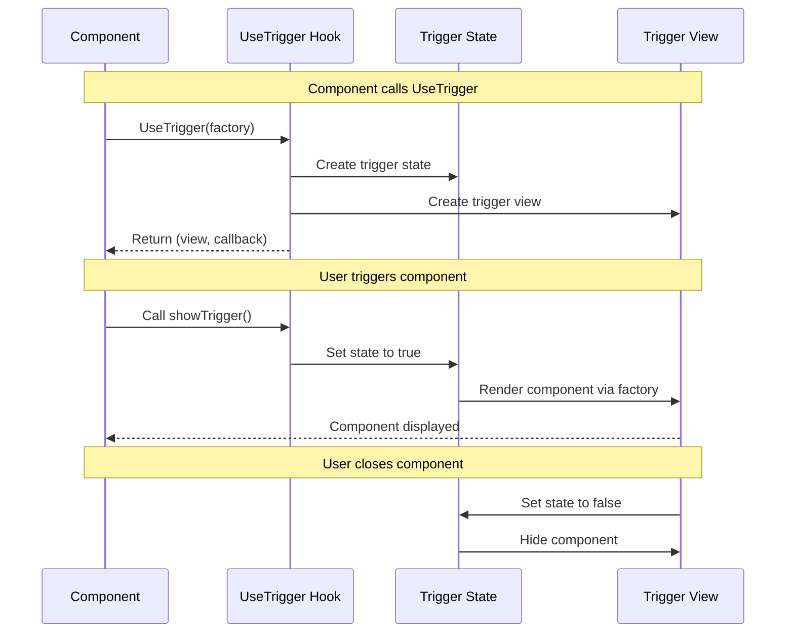

# Source: https://docs.ivy.app/hooks/core/use-trigger.md

# UseTrigger

*The `UseTrigger` [hook](../01_RulesOfHooks.md) provides a way to conditionally render [components](../../../01_Onboarding/02_Concepts/02_Views.md) based on trigger state, commonly used for modals, dialogs, and other conditional UI elements. It manages visibility state and provides a callback to show the triggered component.*

## Overview

The `UseTrigger` [hook](../01_RulesOfHooks.md) enables conditional component rendering:

- **Conditional Rendering** - Show or hide components based on trigger state
- **Modal Support** - Perfect for modals, dialogs, and popups
- **State Management** - Automatic state management for trigger visibility
- **Callback Control** - Trigger callbacks to show or hide components
- **Value Passing** - Pass values to triggered components when showing them

> **info:** `UseTrigger` is ideal for conditional UI elements like modals, dialogs, dropdowns, and other components that need to be shown or hidden programmatically. The hook manages the visibility state internally and provides a callback to trigger the component display.

## Basic Usage

Use `UseTrigger` when you need to show/hide a component without passing parameters:

```csharp
public class SimpleTriggerExample : ViewBase
{
    public override object? Build()
    {
        var (triggerView, showTrigger) = UseTrigger((IState<bool> isOpen) =>
            isOpen.Value ? new ModalDialog(isOpen) : null);

        return Layout.Vertical()
            | new Button("Show Modal", onClick: _ => showTrigger())
            | triggerView;
    }
}

public class ModalDialog(IState<bool> isOpen) : ViewBase
{
    public override object? Build()
    {
        return Layout.Vertical()
            | Text.Block("This is a modal dialog")
            | new Button("Close", onClick: _ => isOpen.Set(false));
    }
}
```

### Trigger with Parameters

Use `UseTrigger<T>` when you need to pass data to the triggered component:

```csharp
public class TriggerWithParamsExample : ViewBase
{
    public override object? Build()
    {
        var (triggerView, showTrigger) = UseTrigger((IState<bool> isOpen, int itemId) =>
            new ItemDetailDialog(isOpen, itemId));

        return Layout.Vertical()
            | (Layout.Horizontal()
            | new Button("Show Item 1", onClick: _ => showTrigger(1))
            | new Button("Show Item 2", onClick: _ => showTrigger(2)))
            | triggerView;
    }
}

public class ItemDetailDialog(IState<bool> isOpen, int itemId) : ViewBase
{
    public override object? Build()
    {
        if (!isOpen.Value) return null;

        return Layout.Vertical()
            | Text.Block($"Details for Item {itemId}")
            | new Button("Close", onClick: _ => isOpen.Set(false));
    }
}
```

## How Trigger Works



## Common Patterns

Use trigger with Alert for confirmation dialogs:

```csharp
public class DeleteConfirmationExample : ViewBase
{
    public override object? Build()
    {
        var items = UseState(new List<string> { "Item 1", "Item 2", "Item 3" });
        var (alertView, showAlert) = UseAlert();

        return Layout.Vertical()
            | Text.Block($"Items: {string.Join(", ", items.Value)}")
            | (Layout.Horizontal()
                | new Button("Delete #0", onClick: _ => showAlert("Delete item 0?", result =>
                {
                    if (result == AlertResult.Ok)
                    {
                        var list = items.Value.ToList();
                        if (list.Count > 0) list.RemoveAt(0);
                        items.Set(list);
                    }
                }, "Confirm"))
                | new Button("Delete #1", onClick: _ => showAlert("Delete item 1?", result =>
                {
                    if (result == AlertResult.Ok)
                    {
                        var list = items.Value.ToList();
                        if (list.Count > 1) list.RemoveAt(1);
                        items.Set(list);
                    }
                }, "Confirm")))
            | alertView;
    }
}
```

## Troubleshooting

Ensure the trigger view is included in your component's return value:

```csharp
// Error: Trigger view not included
public override object? Build()
{
    var (triggerView, showTrigger) = UseTrigger(...);
    return Layout.Vertical() | new Button("Show", onClick: _ => showTrigger());
    // Missing: triggerView
}

// Solution: Include trigger view
public override object? Build()
{
    var (triggerView, showTrigger) = UseTrigger(...);
    return Layout.Vertical()
        | new Button("Show", onClick: _ => showTrigger())
        | triggerView; // Include trigger view
}
```

## Best Practices

- **Check visibility state** - Always check `isOpen.Value` before rendering triggered content
- **Use provided state to close** - Call `isOpen.Set(false)` to close the component
- **Include trigger view in layout** - Always include `triggerView` in your return value
- **Use appropriate overload** - Simple for no params, generic `UseTrigger<T>` when passing data

## See Also

- [State](./03_UseState.md) - Component state management
- [Effect](./04_UseEffect.md) - Side effects and lifecycle
- [Rules of Hooks](../02_RulesOfHooks.md) - Understanding hook rules and best practices
- [Views](../../../01_Onboarding/02_Concepts/02_Views.md) - Understanding Ivy views and components

## Examples


### Modal Dialog with Alert

```csharp
public class ModalDialogExample : ViewBase
{
    public override object? Build()
    {
        var (alertView, showAlert) = UseAlert();
        var client = UseService<IClientProvider>();

        return Layout.Vertical()
            | new Button("Open Dialog", onClick: _ => showAlert("Are you sure you want to continue?", result =>
            {
                client.Toast($"You selected: {result}");
            }, "Confirm Action"))
            | alertView;
    }
}
```


### Detail View with Sheet

```csharp
public class UserListSheetExample : ViewBase
{
    public override object? Build()
    {
        return Layout.Horizontal()
            | new Button("View Alice").WithSheet(
                () => Layout.Vertical()
                    | Text.Block("Name: Alice")
                    | Text.Block("Email: alice@example.com"),
                title: "User Details")
            | new Button("View Bob").WithSheet(
                () => Layout.Vertical()
                    | Text.Block("Name: Bob")
                    | Text.Block("Email: bob@example.com"),
                title: "User Details");
    }
}
```


### Edit Form Trigger

```csharp
public class DataTableEditExample : ViewBase
{
    public override object? Build()
    {
        var items = UseState(new[] { "Item 1", "Item 2", "Item 3" });

        var (editView, showEdit) = UseTrigger((IState<bool> isOpen, int index) =>
            new EditForm(isOpen, items, index));

        return Layout.Vertical()
            | new List(items.Value.Select((item, index) =>
                new ListItem(item, onClick: _ => showEdit(index))))
            | editView;
    }
}

public class EditForm(IState<bool> isOpen, IState<string[]> items, int index) : ViewBase
{
    public override object? Build()
    {
        if (!isOpen.Value) return null;

        var value = UseState(items.Value[index]);

        return Layout.Vertical().Gap(2)
            | value.ToTextInput()
            | Layout.Horizontal().Gap(2)
                | new Button("Save", onClick: _ =>
                {
                    var updated = items.Value.ToArray();
                    updated[index] = value.Value;
                    items.Set(updated);
                    isOpen.Set(false);
                })
                | new Button("Cancel", onClick: _ => isOpen.Set(false));
    }
}
```