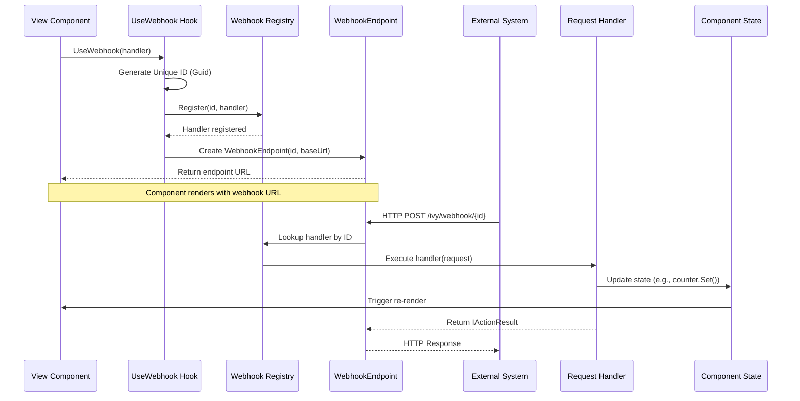

# Source: https://docs.ivy.app/hooks/core/use-webhook.md

# UseWebhook

*The `UseWebhook` [hook](../01_RulesOfHooks.md) creates HTTP endpoints that can be called from external systems, enabling integration with third-party services, webhooks, and external callbacks.*

## Overview

`UseWebhook` allows your components to define and handle HTTP endpoints dynamically. It is essential for:

- **Third-Party Integrations**: Receiving webhooks from Stripe, Slack, GitHub, etc.
- **Asynchronous Workflows**: Triggering background jobs or state updates from external events.
- **Custom Callbacks**: Handling OAuth redirects or verification steps.

## Basic Usage

The hook returns a `WebhookEndpoint` object which contains the `Id` (GUID) and the full `BaseUrl`. You can use `.GetUri()` to retrieve the complete, absolute URL to provide to external systems.

```csharp
public class BasicWebhookExample : ViewBase
{
    public override object? Build()
    {
        var counter = UseState(0);
        var webhook = UseWebhook(_ =>
        {
            counter.Set(counter.Value + 1);
        });
        
        return Layout.Vertical()
            | Text.P($"Webhook called {counter.Value} times")
            | Text.Code(webhook.GetUri().ToString());
    }
}
```

## How It Works

The `UseWebhook` hook:

1. **Generates a Unique ID**: Creates a unique identifier for the webhook endpoint
2. **Registers the Handler**: Registers your request handler with the webhook registry
3. **Returns Callback Endpoint**: Provides a `WebhookEndpoint` with the URL that external systems can call



## Handler Signatures

`UseWebhook` supports multiple delegate signatures to handle different scenarios, from simple void actions to complex async responses.

| Handler Signature | Usage |
|-------------------|-------|
| `Action` | Simple notification, no request data needed. |
| `Action<HttpRequest>` | Access request data (headers, query), no custom response. |
| `Func<Task>` | Async operation, no request data needed. |
| `Func<HttpRequest, Task>` | Async operation with request data access (e.g., reading body). |
| `Func<IActionResult>` | Return custom HTTP response (JSON, status codes). |
| `Func<HttpRequest, IActionResult>` | Access request data and return custom response. |
| `Func<HttpRequest, Task<IActionResult>>` | Full control: Async processing with custom response. |

## Best Practices

- **Always handle errors** - Use try-catch blocks and return appropriate error responses
- **Validate request authenticity** - Verify signatures or tokens for sensitive operations
- **Use async handlers for I/O** - Use async when reading bodies or making database calls
- **Return appropriate HTTP responses** - Use proper status codes (OkResult, BadRequestResult, etc.)
- **Update state safely** - State updates from handlers are automatically thread-safe
- **Keep handlers fast** - Complete quickly and queue heavy work for background processing
- **Cleanup is automatic** - Webhooks are automatically unregistered when components unmount

## See Also

- [State Management](./03_UseState.md) - Update state from webhook handlers
- [Effects](./04_UseEffect.md) - Perform side effects in response to webhook calls

## Examples


### Custom Response & Query Parameters

This example demonstrates how to access query parameters from the `HttpRequest` and how to return different `IActionResult` responses based on logic.

```csharp
public class CustomResponseHandlerExample : ViewBase
{
    public override object? Build()
    {
        var responseStatus = UseState("No request received");
        var responseCode = UseState(200);
        
        var webhook = UseWebhook((Microsoft.AspNetCore.Http.HttpRequest request) =>
        {
            // Check query parameter to demonstrate different responses
            var action = request.Query["action"].ToString();
            
            if (action == "success")
            {
                responseStatus.Set("Success response sent");
                responseCode.Set(200);
                return new Microsoft.AspNetCore.Mvc.OkObjectResult(new { message = "Success", status = "ok" });
            }
            else if (action == "error")
            {
                responseStatus.Set("Error response sent");
                responseCode.Set(400);
                return new Microsoft.AspNetCore.Mvc.BadRequestObjectResult(new { error = "Invalid request" });
            }
            else
            {
                responseStatus.Set("Default success response");
                responseCode.Set(200);
                return new Microsoft.AspNetCore.Mvc.OkObjectResult(new { message = "Request processed" });
            }
        });
        
        return Layout.Vertical()
            | Text.P($"Response Status: {responseStatus.Value}")
            | Text.P($"HTTP Code: {responseCode.Value}")
            | Text.P("Try adding ?action=success or ?action=error to the URL")
            | Text.Code(webhook.GetUri().ToString());
    }
}
```


### External API Integration (Async & Body Reading)

This example shows a robust integration scenario including reading the request body asynchronously and validating custom headers.

```csharp
public class ExternalIntegrationView : ViewBase
{
    public override object? Build()
    {
        var events = UseState(ImmutableArray.Create<WebhookEvent>());
        var lastEvent = UseState<WebhookEvent?>();
        
        var webhook = UseWebhook(async (Microsoft.AspNetCore.Http.HttpRequest request) =>
        {
            string body;
            string eventType;
            string signature;
            
            // Read request body if present
            if (request.ContentLength > 0)
            {
                using var reader = new StreamReader(request.Body);
                body = await reader.ReadToEndAsync();
            }
            else
            {
                body = string.Empty;
            }
            
            // Extract custom headers
            eventType = request.Headers["X-Event-Type"].ToString();
            signature = request.Headers["X-Signature"].ToString();
            
            // For demo purposes: if no data, create sample event
            if (string.IsNullOrEmpty(eventType) && string.IsNullOrEmpty(body))
            {
                var eventTypes = new[] { "user.created", "order.completed", "payment.processed", "notification.sent" };
                var random = new Random();
                eventType = eventTypes[random.Next(eventTypes.Length)];
                body = $"{{\"id\": \"{Guid.NewGuid()}\", \"action\": \"{eventType}\", \"timestamp\": \"{DateTime.UtcNow:O}\"}}";
                signature = $"sha256={Convert.ToBase64String(System.Text.Encoding.UTF8.GetBytes(signature + body)).Substring(0, 16)}";
            }
            
            // Validate signature (in production, verify this!)
            var eventData = new WebhookEvent(
                eventType,
                body,
                DateTime.UtcNow,
                signature
            );
            
            events.Set(events.Value.Add(eventData));
            lastEvent.Set(eventData);
            
            return new Microsoft.AspNetCore.Mvc.OkObjectResult(new { received = true });
        });
        
        return Layout.Vertical()
            | Text.H2("External Integration Webhook")
            | Text.Code(webhook.GetUri().ToString())
            | Text.H3("Last Event")
            | (lastEvent.Value != null
                ? Layout.Vertical(
                    Text.P($"Type: {lastEvent.Value.Type}"),
                    Text.P($"Time: {lastEvent.Value.Timestamp:HH:mm:ss}"),
                    Text.P($"Body: {lastEvent.Value.Body}")
                  )
                : Text.P("No events received"))
            | Text.H3("All Events")
            | events.Value.ToTable()
                .Builder(e => e.Timestamp, e => e.Func((DateTime x) => x.ToString("HH:mm:ss")))
                .Remove(e => e.Signature);
    }
}

public record WebhookEvent(string Type, string Body, DateTime Timestamp, string Signature);
```