# Agent Client Protocol Documentation

Source: https://agentclientprotocol.com/llms-full.txt

---

# Brand
Source: https://agentclientprotocol.com/brand

Assets for the Agent Client Protocol brand.

Following these guidelines helps maintain brand integrity while supporting ACP's mission to standardize communication between code editors and coding agents.

[Download all of the assets here](https://cdn.agentclientprotocol.com/acp-brand.zip)

## Logo

The ACP logo can be used with the "ACP" logomark with or without a gradient.
We provide a vertical and horizontal variant for display flexibility.

<Frame>
  
</Frame>

## Logomark

The logomark has a variation that includes a slight gradient on the bottom right part of it.
We don't enforce the use of one version over the other, meaning you can choose to use either of them as you wish, as long as you respect using it in pure white or pure black.

<Frame>
  
</Frame>


# Code of Conduct
Source: https://agentclientprotocol.com/community/code-of-conduct


## Our Pledge

We as members, contributors, and leaders pledge to make participation in our
community a harassment-free experience for everyone, regardless of age, body
size, visible or invisible disability, ethnicity, sex characteristics, gender
identity and expression, level of experience, education, socio-economic status,
nationality, personal appearance, race, religion, or sexual identity
and orientation.

We pledge to act and interact in ways that contribute to an open, welcoming,
diverse, inclusive, and healthy community.

## Our Standards

Examples of behavior that contributes to a positive environment for our
community include:

* Demonstrating empathy and kindness toward other people
* Being respectful of differing opinions, viewpoints, and experiences
* Giving and gracefully accepting constructive feedback
* Accepting responsibility and apologizing to those affected by our mistakes,
  and learning from the experience
* Focusing on what is best not just for us as individuals, but for the
  overall community

Examples of unacceptable behavior include:

* The use of sexualized language or imagery, and sexual attention or
  advances of any kind
* Trolling, insulting or derogatory comments, and personal or political attacks
* Public or private harassment
* Publishing others' private information, such as a physical or email
  address, without their explicit permission
* Other conduct which could reasonably be considered inappropriate in a
  professional setting

## Enforcement Responsibilities

Community leaders are responsible for clarifying and enforcing our standards of
acceptable behavior and will take appropriate and fair corrective action in
response to any behavior that they deem inappropriate, threatening, offensive,
or harmful.

Community leaders have the right and responsibility to remove, edit, or reject
comments, commits, code, wiki edits, issues, and other contributions that are
not aligned to this Code of Conduct, and will communicate reasons for moderation
decisions when appropriate.

## Scope

This Code of Conduct applies within all community spaces, and also applies when
an individual is officially representing the community in public spaces.
Examples of representing our community include using an official e-mail address,
posting via an official social media account, or acting as an appointed
representative at an online or offline event.

## Enforcement

Instances of abusive, harassing, or otherwise unacceptable behavior may be
reported to the community leaders responsible for enforcement at
[hi@zed.dev](mailto:hi@zed.dev).
All complaints will be reviewed and investigated promptly and fairly.

All community leaders are obligated to respect the privacy and security of the
reporter of any incident.

## Enforcement Guidelines

Community leaders will follow these Community Impact Guidelines in determining
the consequences for any action they deem in violation of this Code of Conduct:

### 1. Correction

**Community Impact**: Use of inappropriate language or other behavior deemed
unprofessional or unwelcome in the community.

**Consequence**: A private, written warning from community leaders, providing
clarity around the nature of the violation and an explanation of why the
behavior was inappropriate. A public apology may be requested.

### 2. Warning

**Community Impact**: A violation through a single incident or series
of actions.

**Consequence**: A warning with consequences for continued behavior. No
interaction with the people involved, including unsolicited interaction with
those enforcing the Code of Conduct, for a specified period of time. This
includes avoiding interactions in community spaces as well as external channels
like social media. Violating these terms may lead to a temporary or
permanent ban.

### 3. Temporary Ban

**Community Impact**: A serious violation of community standards, including
sustained inappropriate behavior.

**Consequence**: A temporary ban from any sort of interaction or public
communication with the community for a specified period of time. No public or
private interaction with the people involved, including unsolicited interaction
with those enforcing the Code of Conduct, is allowed during this period.
Violating these terms may lead to a permanent ban.

### 4. Permanent Ban

**Community Impact**: Demonstrating a pattern of violation of community
standards, including sustained inappropriate behavior, harassment of an
individual, or aggression toward or disparagement of classes of individuals.

**Consequence**: A permanent ban from any sort of public interaction within
the community.

## Attribution

[homepage]: https://www.contributor-covenant.org

This Code of Conduct is adapted from the [Contributor Covenant][homepage],
version 2.0, available at
[https://www.contributor-covenant.org/version/2/0/code\_of\_conduct.html](https://www.contributor-covenant.org/version/2/0/code_of_conduct.html).

Community Impact Guidelines were inspired by [Mozilla's code of conduct
enforcement ladder](https://github.com/mozilla/diversity).

For answers to common questions about this code of conduct, see [the Contributor Covenant FAQ](https://www.contributor-covenant.org/faq).
For translations, see [Contributor Covenant Translations](https://www.contributor-covenant.org/translations).


# Contributor Communication
Source: https://agentclientprotocol.com/community/communication

Communication methods for Agent Client Protocol contributors

This document explains how to communicate and collaborate within the Agent Client Protocol (ACP) project.

## Communication Channels

In short:

* **[Zulip](https://agentclientprotocol.zulipchat.com/)**: For real-time or ad-hoc discussions.
* **[RFDs](https://agentclientprotocol.com/rfds/about)**: For proposed changes to the specification.
* **[GitHub Discussions](https://github.com/orgs/agentclientprotocol/discussions)**: For structured, longer-form discussions.
* **[GitHub Issues](https://github.com/agentclientprotocol/agent-client-protocol/issues)**: For actionable tasks, bug reports, and feature requests.

All communication is governed by our [Code of Conduct](https://agentclientprotocol.com/community/code-of-conduct). We expect all participants to maintain respectful, professional, and inclusive interactions across all channels.

### Zulip

For real-time contributor discussion and collaboration. The server is designed around **ACP contributors** and is not intended to be a place for general ACP support.

The Zulip server will have both public and private channels.

[Join the Zulip here](https://agentclientprotocol.zulipchat.com/).

#### Public Channels (Default)

* **Purpose**: Open community engagement, collaborative development, and transparent project coordination.
* Primary use cases:
  * **Public SDK and tooling development**
  * **Community onboarding** and contribution guidance.
  * **Community feedback** and collaborative brainstorming.
* Avoid:
  * ACP user support: participants are expected to read official documentation and start new GitHub Discussions for questions or support.
  * Service or product marketing: interactions on this Zulip are expected to be vendor-neutral and not used for brand-building or sales. Mentions of brands or products are discouraged outside of being used as examples or responses to conversations that start off focused on the specification.

#### Private channels (Exceptions)

* **Purpose**: Confidential coordination and sensitive matters that cannot be discussed publicly. Access will be restricted to designated maintainers.
* **Strict criteria for private use**:
  * **Security incidents** (CVEs, protocol vulnerabilities).
  * **People matters** (maintainer-related discussions, code of conduct policies).
  * Select channels will be configured to be **read-only**. This can be good for example for maintainer decision making.
  * Coordination requiring **immediate** or otherwise **focused response** with a limited audience.
* **Transparency**:
  * **All technical and governance decisions** affecting the community **must be documented** in RFDs, GitHub Discussions and/or Issues.
  * **Some matters related to individual contributors** may remain private when appropriate (e.g., personal circumstances, disciplinary actions, or other sensitive individual matters).
  * Private channels are to be used as **temporary "incident rooms,"** not for routine development.

Any significant discussion on Zulip leads to a potential decision or proposal must be moved to an RFD, GitHub Discussion, or GitHub Issue to create a persistent, searchable record. Proposals will then be promoted to full-fledged PRs with associated work items as needed.

### RFDs

Please refer to the [RFD process](https://agentclientprotocol.com/rfds/about) for how this is managed. This is the primary way to actually create changes to the protocol.

Conversation about a given RFD can take place within the relevant PRs created to move the RFD forward. Or, a discussion within Zulip can be created in the `rfds` channel to discuss in real-time with other contributors.

### GitHub Discussions

For structured, long-form discussion and debate on project direction, features, improvements, and community topics.

When to use:

* Announcements and release communications
* Community polls and consensus-building processes
* Feature requests with context and rationale
  * If a particular repository does not have GitHub Discussions enabled, feel free to open a GitHub Issue instead.

### GitHub Issues

For bug reports, feature tracking, and actionable development tasks.

When to use:

* Bug reports with reproducible steps
* Documentation improvements with specific scope
* CI/CD problems and infrastructure issues
* Release tasks and milestone tracking

### Security Issues

**Do not post security issues publicly.** Instead:

1. Contact lead and/or core maintainers, or [hi@zed.dev](mailto:hi@zed.dev) directly.
2. Follow responsible disclosure guidelines.


# Contributing
Source: https://agentclientprotocol.com/community/contributing

How to participate in the development of ACP

We welcome contributions from the community!

All contributors must adhere to our [Code of Conduct](./code-of-conduct).

For questions and discussions, please use GitHub Discussions.


# Governance
Source: https://agentclientprotocol.com/community/governance

How the ACP project is governed

<Note>
  <p>
    The following is an interim governance model to provide clearer roles and
    responsibilities between the various parties collaborating on ACP.
  </p>

  <p>
    We are actively working to move ACP to a foundation, and this governance
    document will be revised accordingly when that happens.
  </p>
</Note>

This document describes the governance model for the Agent Client Protocol (ACP). It defines the roles, responsibilities, and processes that guide how the project operates and makes decisions.

## Principles

We aim to operate transparently and make decisions in the best interests of ACP and its community.

## Technical Governance

The ACP project adopts a hierarchical structure, similar to MCP, Rust Foundation projects, and other open source projects:

* A community of **contributors** who file issues, make pull requests, and contribute to the project.
* A small set of **maintainers** drive components within the ACP project, such as SDKs, documentation, and others.
* Contributors and maintainers are overseen by **core maintainers**, who drive the overall project direction.
* The core maintainers have two **lead core maintainers** who are the catch-all decision makers.
* Maintainers, core maintainers, and lead core maintainers form the **ACP steering group**.

All maintainers are expected to have a strong bias towards ACP's design philosophy.

### Channels

Technical Governance is facilitated through shared [communication channels](/community/communication) of all **maintainers, core maintainers** and **lead maintainers**. Each maintainer group can choose additional communication channels, but all decisions and their supporting discussions must be recorded and made transparently available in one of the main communication channels.

### Contributors

Anyone who submits code, documentation or other improvements is counted as a contributor. Contributors do not have formal decision-making power, but are encouraged to participate in discussions about project direction and propose changes.

### Maintainers

Maintainers are responsible for [Working or Interest Groups](/community/working-interest-groups) within the ACP project. These generally are independent repositories such as language-specific SDKs, but can also extend to subdirectories of a repository, such as the ACP documentation. Maintainers may adopt their own rules and procedures for making decisions. Maintainers are expected to make decisions for their respective projects independently, but can defer or escalate to the core maintainers when needed.

Maintainers are responsible for the:

* Thoughtful and productive engagement with community contributors,
* Maintaining and improving their respective area of the ACP project,
* Supporting documentation, roadmaps and other adjacent parts of the ACP project,
* Present ideas from community to core.

New maintainers are added by a consensus or majority vote of the current core maintainers, based on sustained and high-quality contributions to the project, alignment with its goals, and a demonstrated commitment to community standards. Prospective maintainers should have a track record of participation in discussions, issue triage, and code or documentation improvements.

Maintainers have write and/or admin access to their respective repositories.

A maintainer may step down at any time by notifying the other maintainers. In rare cases, a maintainer may be removed by a consensus or a two-thirds supermajority vote of the other maintainers if they are inactive for an extended period, violate the Code of Conduct, or act against the project’s interests. Maintainers can be removed by core maintainers or lead core maintainers at any time and without reason.

### Core Maintainers

Core maintainers are contributors who have write access to ACP’s source code. They review and merge contributions, participate in project decision-making, and help to onboard and mentor new contributors. The core maintainers are expected to have a deep understanding of the Agent Client Protocol and its specification. Their responsibilities include:

* Designing, reviewing and steering the evolution of the ACP specification, as well as all other parts of the ACP project, such as documentation,
* Articulating a cohesive long-term vision for the project,
* Mediating and resolving contentious issues with fairness and transparency, seeking consensus where possible while making decisive choices when necessary,
* Appoint or remove maintainers,
* Stewardship of the ACP project in the best interest of ACP.

The core maintainers as a group have the power to veto any decisions made by maintainers by majority vote. The core maintainers have power to resolve disputes as they see fit. The core maintainers should publicly articulate their decision-making. The core group is responsible for adopting their own procedures for making decisions.

New core maintainers are added by a consensus or majority vote of the current core and lead maintainers, based on sustained and high-quality contributions to the project, alignment with its goals, and a demonstrated commitment to community standards. Prospective maintainers should have a track record of participation in discussions, issue triage, and code or documentation improvements.

Core maintainers generally have write and admin access to all ACP repositories, but should use the same contribution (usually pull-requests) mechanism as outside contributors. Exceptions can be made based on security considerations.

A core maintainer may step down at any time by notifying the other core maintainers. In rare cases, a core maintainer may be removed by a consensus or a two-thirds supermajority vote of the other core maintainers if they are inactive for an extended period, violate the Code of Conduct, or act against the project’s interests.

### Lead Maintainers (BDFL)

ACP has two lead maintainers: Ben Brandt and Agus Zubiaga. Lead Maintainers can veto any decision by core maintainers or maintainers. This model is also commonly known as Benevolent Dictator for Life (BDFL) in the open source community. The Lead Maintainers should publicly articulate their decision-making and give clear reasoning for their decisions. Lead maintainers are part of the core maintainer group.

Lead Maintainers are administrators on all infrastructure for the ACP project where possible. This includes but is not restricted to all communication channels, GitHub organizations and repositories.

The Lead Maintainers are the primary contacts, and responsible for:

* Representing ACP in official matters.
* Coordinating major decisions about project direction.
* Signing off project expenses.

A lead maintainer may step down by notifying the other lead maintainer(s). They may recommend a replacement, but it is the remaining lead maintainer(s) responsibility to select a replacement.

If all lead maintainers step down, the core maintainers will select new lead maintainers by consensus or majority vote.

### Decision Process

The core maintainer group meets every two weeks to discuss and vote on proposals, as well as discuss any topics needed. The [ACP RFD process](https://agentclientprotocol.com/rfds/about) and Zulip chat can be used to discuss and vote on smaller proposals as needed.

## Processes

Core and lead maintainers are responsible for all aspects of Agent Client Protocol, including documentation, issues, suggestions for content, and all other parts under the [ACP project](https://github.com/agentclientprotocol). Maintainers are responsible for documentation, issues, and suggestions of content for their area of the ACP project, but are encouraged to partake in general maintenance of the ACP projects. Maintainers, core maintainers, and lead maintainers should use the same contribution process as external contributors, rather than making direct changes to repos. This provides insight into intent and opportunity for discussion.

### Working and Interest Groups

ACP collaboration and contributions are organized around two structures: [Working Groups and Interest Groups](/community/working-interest-groups).

Interest Groups are responsible for identifying and articulating problems that ACP should address, primarily by facilitating open discussions within the community. In contrast, Working Groups focus on developing concrete solutions by collaboratively producing deliverables, such as RFDs or community-owned implementations of the specification. While input from Interest Groups can help justify the formation of a Working Group, it is not a strict requirement. Similarly, contributions from either Interest Groups or Working Groups are encouraged, but not mandatory, when submitting RFDs or other community proposals.

We strongly encourage all contributors interested in working on a specific RFD to first collaborate within an Interest Group. This collaborative process helps ensure that the proposed RFD aligns with protocol needs and is the right direction for its adopters.

### Governance Principles

All groups are self-governed while adhering to these core principles:

1. Clear contribution and decision-making processes
2. Open communication and transparent decisions

They must:

* Document their contribution process
* Maintain transparent communication
* Make decisions publicly (groups must publish meeting notes and proposals)

Projects and working groups without specified processes default to:

* GitHub pull requests and issues for contributions
* A public channel in the official [ACP Contributor Zulip](/community/communication#zulip)

### Maintenance Responsibilities

Components without dedicated maintainers (such as documentation) fall under core maintainer responsibility. These follow standard contribution guidelines through pull requests, with maintainers handling reviews and escalating to core maintainer review for any significant changes.

Core maintainers and maintainers are encouraged to improve any part of the ACP project, regardless of formal maintenance assignments.

## Communication

### Core Maintainer Meetings

The core maintainer group meets on a bi-weekly basis to discuss proposals and the project. Notes on proposals should be made public. The meetings themselves are invite-only. If you have a topic for the Core Maintainers and want to be added to the agenda, let the core maintainers know what you want to discuss in advance in Zulip, and you will be invited to join the next meeting.

### Public Chat

The ACP project maintains a [public Zulip Chat](/community/communication#zulip) with open chats for different groups. The ACP project may have private channels for certain communications.

## Nominating, Confirming and Removing Maintainers

### The Principles

* Membership in module maintainer groups is given to individuals on merit basis after they demonstrated strong expertise of their area of work through contributions, reviews, and discussions and are aligned with the overall ACP direction.
* For membership in the maintainer group the individual has to demonstrate strong and continued alignment with the overall ACP principles.
* No term limits for module maintainers or core maintainers
* Light criteria of moving sub-project maintenance to 'emeritus' status if they don't actively participate over long periods of time. Each maintainer group may define the inactive period that's appropriate for their area.

### Nomination and Removal

* Core Maintainers are responsible for adding and removing maintainers. They will take the consideration of existing maintainers into account.
* The lead maintainers are responsible for adding and removing core maintainers.

#### Nomination Process

If a Maintainer (or Core / Lead Maintainer) wishes to propose a nomination for the Core / Lead Maintainers’ consideration, they should follow the following process:

1. Collect evidence for the nomination. This will generally come in the form of a history of merged PRs on the repositories for which maintainership is being considered.
2. Discuss among maintainers of the relevant group(s) as to whether they would be supportive of approving the nomination.
3. DM a Core Maintainer to create a private channel in Zulip, in the format `nomination-{name}-{group}`. Add all core maintainers, lead maintainers, and co-maintainers on the relevant group.
4. Provide context for the individual under nomination. See below for suggestions on what to include here.
5. Create a Zulip topic and ask Core / Lead Maintainers to vote Yes / No on the nomination. Reaching consensus is encouraged though not required.
6. After Core / Lead Maintainers discuss and/or vote, if the nomination is favorable, relevant members with permissions to update GitHub and Zulip roles will add the nominee to the appropriate groups. The nominator should announce the new maintainership in the relevant Zulip channel.
7. The temporary Zulip channel will be deleted a week later.

Suggestions for the kind of information to share with core maintainers when nominating someone:

* GitHub profile link, LinkedIn profile link, Zulip username
* For what group(s) are you nominating the individual for maintainership
* Whether the group(s) agree that this person should be elevated to maintainership
* Description of their contributions to date (including links to most substantial contributions)
* Description of expected contributions moving forward (e.g. Are they eager to be a maintainer? Will they have capacity to do so?)
* Other context about the individual (e.g. current employer, motivations behind ACP involvement)
* Anything else you think may be relevant to consider for the nomination

## Current Maintainers

Refer to [the maintainer list](https://github.com/agentclientprotocol/agent-client-protocol/blob/main/MAINTAINERS.md).

## Security Policy and Vulnerability Disclosure

* Zed will triage all potential security and vulnerability issues between the Zed team and other maintainers
* Reports can be submitted to [security@zed.dev](mailto:security@zed.dev)

## Legal, Licensing, and Contributor Terms

* All repositories in the ACP organization should be licensed under the Apache 2.0 License.
* This project does not require a Contributor License Agreement (CLA). Instead, contributions are accepted under the following terms:

> By contributing to this project, you agree that your contributions will be licensed under the [Apache License, Version 2.0](https://www.apache.org/licenses/LICENSE-2.0). You affirm that you have the legal right to submit your work, that you are not including code you do not have rights to, and that you understand contributions are made without requiring a Contributor License Agreement (CLA).


# Working and Interest Groups
Source: https://agentclientprotocol.com/community/working-interest-groups

Learn about the two forms of collaborative groups within the Agent Client Protocol's governance structure - Working Groups and Interest Groups.

Within the ACP contributor community we maintain two types of collaboration formats - **Interest** and **Working** groups.

**Interest Groups** are responsible for identifying and articulating problems that ACP should address, primarily by facilitating open discussions within the community. In contrast, **Working Groups** focus on developing concrete solutions by collaboratively producing deliverables, such as RFDs or community-owned implementations of the specification.

While input from Interest Groups can help justify the formation of a Working Group, it is not a strict requirement. Similarly, contributions from either Interest Groups or Working Groups are encouraged, but not mandatory, when submitting RFDs or other community proposals.

We strongly encourage all contributors interested in working on a specific RFD to first collaborate within an Interest Group. This collaborative process helps ensure that the proposed RFD aligns with community needs and is the right direction for the protocol.

Long-term projects in the ACP ecosystem, such as SDKs or other components are maintained by dedicated Working Groups.

## Purpose

These groups exist to:

* **Facilitate high-signal spaces for focused discussions** - contributors who opt into notifications, expertise sharing, and regular meetings can engage with topics that are highly relevant to them, enabling meaningful contributions and opportunities to learn from others.
* **Establish clear expectations and leadership roles** - guide collaborative efforts and ensure steady progress toward concrete deliverables that advance ACP evolution and adoption.

## Mechanisms

## Meeting Calendar

All Interest Group and Working Group meetings are published on the public ACP community calendar (work in progress).

Facilitators are responsible for posting their meeting schedules to this calendar in advance to ensure discoverability and enable broader community participation.

### Interest Groups (IGs)

**Goal:** Facilitate discussion and knowledge-sharing among ACP contributors who share interests in a specific ACP sub-topic or context. The primary focus is on identifying and gathering problems that may be worth addressing through RFDs or other community artifacts, while encouraging open exploration of protocol issues and opportunities.

**Expectations**:

* Regular conversations in the Interest Group Zulip channel
* **AND/OR** a recurring live meeting regularly attended by Interest Group members
* Meeting dates and times published in advance on the ACP community calendar when applicable, and tagged with their primary topic and interest group Zulip channel name
* Notes publicly shared after meetings, and submitted to the [meetings repository](https://github.com/agentclientprotocol/meetings)

**Lifecycle**:

* Creation begins by proposing a new Interest Group to the core/lead maintainers with the template below
* Majority positive vote by core maintainers over a 72h period approves creation of the group.
  * The creation of the group can be reversed at any time (e.g., after new information surfaces). Core and lead maintainers can veto.
* Facilitator(s) and Maintainer(s) responsible for organizing IG into meeting expectations
  * Facilitator is an informal role responsible for shepherding or speaking for a group
  * Maintainer is an official representative from the ACP steering group. A maintainer is not required for every group, but can help advocate for specific changes or initiatives.
* IG is retired only when Core or Lead Maintainers determine it's no longer active and/or needed
  * Successful IGs do not have a time limit or expiration date - as long as they are active and maintained, they will remain available

**Creation Template**:

* Facilitator(s)
* Maintainer(s) (optional)
* IGs with potentially similar goals/discussions
* How this IG differentiates itself from the related IGs
* First topic you to discuss within the IG

Participation in an Interest Group (IG) is not required to start a Working Group (WG) or to create a RFD. However, building consensus within IGs can be valuable when justifying the formation of a WG. Likewise, referencing support from IGs or WGs can strengthen a RFD and its chances of success.

### Working Groups (WG)

**Goal:** Facilitate collaboration within the ACP community on a RFD, a themed series of RFDs, or an otherwise officially endorsed project.

**Expectations**:

* Meaningful progress towards at least one RFD or spec-related implementation **OR** hold maintenance responsibilities for a project (e.g., SDKs)
* Facilitators are responsible for keeping track of progress and communicating status when appropriate
* Meeting dates and times published in advance on the ACP community calendar when applicable, and tagged with their primary topic and working group Zulip channel name
* Notes publicly shared after meetings, and submitted to the [meetings repository](https://github.com/agentclientprotocol/meetings)

**Lifecycle**:

* Creation begins by proposing a new Interest Group to the core/lead maintainers with the template below
* Majority positive vote by core maintainers over a 72h period approves creation of the group.
  * The creation of the group can be reversed at any time (e.g., after new information surfaces). Core and lead maintainers can veto.
* Facilitator(s) and Maintainer(s) responsible for organizing WG into meeting expectations
  * Facilitator is an informal role responsible for shepherding or speaking for a group
  * Maintainer is an official representative from the ACP steering group. A maintainer is not required for every group, but can help advocate for specific changes or initiatives
* WG is retired when either:
  * Community moderators or Core and Lead Maintainers decide it is no longer active and/or needed
  * The WG no longer has an active Issue/PR for a month or more, or has completed all Issues/PRs it intended to pursue.

**Creation Template**:

* Facilitator(s)
* Maintainer(s) (optional)
* Explanation of interest/use cases, ideally originating from an IG discussion; however that is not a requirement
* First Issue/PR/RFD that the WG will work on

## WG/IG Facilitators

A **Facilitator** role in a WG or IG does *not* result in a [maintainership role](https://github.com/agentclientprotocol/agent-client-protocol/blob/main/MAINTAINERS.md) across the ACP organization. It is an informal role into which anyone can self-nominate.

A Facilitator is responsible for helping shepherd discussions and collaboration within an Interest or Working Group.

Lead and Core Maintainers reserve the right to modify the list of Facilitators and Maintainers for any WG/IG at any time.

## FAQ

### How do I get involved contributing to ACP?

These IG and WG abstractions help provide an elegant on-ramp:

1. [Join the Zulip](/community/communication#zulip) and follow conversations in IGs relevant to you. Attend live calls. Participate.
2. Offer to facilitate calls. Contribute your use cases in RFD proposals and other work.
3. When you're comfortable contributing to deliverables, jump in to contribute to WG work.
4. Active and valuable contributors will be nominated by WG maintainers as new maintainers.

### Where can I find a list of all current WGs and IGs?

On the [ACP Zulip Chat](/community/communication#zulip) there is a section of channels for each Working and Interest Group.


# Agents
Source: https://agentclientprotocol.com/get-started/agents

Agents implementing the Agent Client Protocol.

The following agents can be used with an ACP Client:

* [AgentPool](https://phil65.github.io/agentpool/advanced/acp-integration/)
* [Augment Code](https://docs.augmentcode.com/cli/acp)
* [Blackbox AI](https://docs.blackbox.ai/features/blackbox-cli/introduction)
* [Claude Code](https://docs.anthropic.com/en/docs/claude-code/overview) (via [Zed's SDK adapter](https://github.com/zed-industries/claude-code-acp))
* [Codex CLI](https://developers.openai.com/codex/cli) (via [Zed's adapter](https://github.com/zed-industries/codex-acp))
* [Code Assistant](https://github.com/stippi/code-assistant?tab=readme-ov-file#configuration)
* [Docker's cagent](https://github.com/docker/cagent)
* [fast-agent](https://fast-agent.ai/acp)
* [Gemini CLI](https://github.com/google-gemini/gemini-cli)
* [GitHub Copilot](https://github.com/features/copilot) (in [public preview](https://github.blog/changelog/2026-01-28-acp-support-in-copilot-cli-is-now-in-public-preview/))
* [Goose](https://block.github.io/goose/docs/guides/acp-clients)
* [JetBrains Junie *(coming soon)*](https://www.jetbrains.com/junie/)
* [Kimi CLI](https://github.com/MoonshotAI/kimi-cli)
* [Minion Code](https://github.com/femto/minion-code)
* [Mistral Vibe](https://github.com/mistralai/mistral-vibe)
* [OpenCode](https://github.com/sst/opencode)
* [OpenHands](https://docs.openhands.dev/openhands/usage/run-openhands/acp)
* [Pi](https://github.com/badlogic/pi-mono/tree/main/packages/coding-agent) (via [pi-acp adapter](https://github.com/svkozak/pi-acp))
* [Qoder CLI](https://docs.qoder.com/cli/acp)
* [Qwen Code](https://github.com/QwenLM/qwen-code)
* [Stakpak](https://github.com/stakpak/agent?tab=readme-ov-file#agent-client-protocol-acp)
* [VT Code](https://github.com/vinhnx/vtcode/blob/main/README.md#zed-ide-integration-agent-client-protocol)


# Architecture
Source: https://agentclientprotocol.com/get-started/architecture

Overview of the Agent Client Protocol architecture.

The Agent Client Protocol defines a standard interface for communication between AI agents and client applications. The architecture is designed to be flexible, extensible, and platform-agnostic.

## Design Philosophy

The protocol architecture follows several key principles:

1. **MCP-friendly**: The protocol is built on JSON-RPC, and re-uses MCP types where possible so that integrators don't need to build yet-another representation for common data types.
2. **UX-first**: It is designed to solve the UX challenges of interacting with AI agents; ensuring there's enough flexibility to render clearly the agents intent, but is no more abstract than it needs to be.
3. **Trusted**: ACP works when you're using a code editor to talk to a model you trust. You still have controls over the agent's tool calls, but the code editor gives the agent access to local files and MCP servers.

## Setup

When the user tries to connect to an agent, the editor boots the agent sub-process on demand, and all communication happens over stdin/stdout.

Each connection can support several concurrent sessions, so you can have multiple trains of thought going on at once.


ACP makes heavy use of JSON-RPC notifications to allow the agent to stream updates to the UI in real-time. It also uses JSON-RPC's bidirectional requests to allow the agent to make requests of the code editor: for example to request permissions for a tool call.

## MCP

Commonly the code editor will have user-configured MCP servers. When forwarding the prompt from the user, it passes configuration for these to the agent. This allows the agent to connect directly to the MCP server.


The code editor may itself also wish to export MCP based tools. Instead of trying to run MCP and ACP on the same socket, the code editor can provide its own MCP server as configuration. As agents may only support MCP over stdio, the code editor can provide a small proxy that tunnels requests back to itself:


# Clients
Source: https://agentclientprotocol.com/get-started/clients

Clients implementing the Agent Client Protocol.

The following clients can be used with an ACP Agent:

* [Agent Studio](https://github.com/sxhxliang/agent-studio)
* [Agmente](https://agmente.halliharp.com) (iOS)
* [AionUi](https://github.com/iOfficeAI/AionUi)
* [aizen](https://aizen.win)
* [DeepChat](https://github.com/ThinkInAIXYZ/deepchat)
* DuckDB
  * through the [sidequery/duckdb-acp](https://github.com/sidequery/duckdb-acp) extension
* Emacs via [agent-shell.el](https://github.com/xenodium/agent-shell)
* [JetBrains](https://www.jetbrains.com/help/ai-assistant/acp.html)
* [marimo notebook](https://github.com/marimo-team/marimo)
* [neovim](https://neovim.io)
  * through the [CodeCompanion](https://github.com/olimorris/codecompanion.nvim) plugin
  * through the [carlos-algms/agentic.nvim](https://github.com/carlos-algms/agentic.nvim) plugin
  * through the [yetone/avante.nvim](https://github.com/yetone/avante.nvim) plugin
* [Obsidian](https://obsidian.md)
  * through the [Agent Client](https://github.com/RAIT-09/obsidian-agent-client) plugin
* [Sidequery *(coming soon)*](https://sidequery.dev)
* [Tidewave](https://tidewave.ai/)
* [Toad](https://www.batrachian.ai/)
* [Web Browser with AI SDK](https://github.com/mcpc-tech/ai-elements-remix-template) (powered by [@mcpc/acp-ai-provider](https://github.com/mcpc-tech/mcpc/tree/main/packages/acp-ai-provider))
* [Zed](https://zed.dev/docs/ai/external-agents)


# Introduction
Source: https://agentclientprotocol.com/get-started/introduction

Get started with the Agent Client Protocol.

The Agent Client Protocol (ACP) standardizes communication between code editors/IDEs and coding agents and is suitable for both local and remote scenarios.

## Why ACP?

AI coding agents and editors are tightly coupled but interoperability isn't the default. Each editor must build custom integrations for every agent they want to support, and agents must implement editor-specific APIs to reach users.
This creates several problems:

* Integration overhead: Every new agent-editor combination requires custom work
* Limited compatibility: Agents work with only a subset of available editors
* Developer lock-in: Choosing an agent often means accepting their available interfaces

ACP solves this by providing a standardized protocol for agent-editor communication, similar to how the [Language Server Protocol (LSP)](https://microsoft.github.io/language-server-protocol/) standardized language server integration.

Agents that implement ACP work with any compatible editor. Editors that support ACP gain access to the entire ecosystem of ACP-compatible agents.
This decoupling allows both sides to innovate independently while giving developers the freedom to choose the best tools for their workflow.

## Overview

ACP assumes that the user is primarily in their editor, and wants to reach out and use agents to assist them with specific tasks.

ACP is suitable for both local and remote scenarios:

* **Local agents** run as sub-processes of the code editor, communicating via JSON-RPC over stdio.
* **Remote agents** can be hosted in the cloud or on separate infrastructure, communicating over HTTP or WebSocket

<Info>
  Full support for remote agents is a work in progress. We are actively
  collaborating with agentic platforms to ensure the protocol addresses the
  specific requirements of cloud-hosted and remote deployment scenarios.
</Info>

The protocol re-uses the JSON representations used in MCP where possible, but includes custom types for useful agentic coding UX elements, like displaying diffs.

The default format for user-readable text is Markdown, which allows enough flexibility to represent rich formatting without requiring that the code editor is capable of rendering HTML.


# ACP Registry
Source: https://agentclientprotocol.com/get-started/registry

The easiest way to find and install ACP-compatible agents.

## Overview

The ACP Registry is an easy way for developers to distribute their ACP-compatible agents to any client that speaks the protocol.

At the moment, this is a curated set of agents, including only the ones that [support authentication](/rfds/auth-methods).

Visit [the registry repository on GitHub](https://github.com/agentclientprotocol/registry) to learn more about it.

<Warning>
  The registry is under active development, so expect its format and contents to
  change.
</Warning>

## Available Agents

<CardGroup>
  <Card
    title="Auggie CLI"
    href="https://github.com/augmentcode/auggie-zed-extension"
    icon={
  <svg
    width="20"
    height="20"
    className="agent-icon"
    aria-hidden="true"
    focusable="false"
    xmlns="http://www.w3.org/2000/svg"
    fill="none"
    viewBox="0 0 16 16"
  >
    <path
      fill="currentColor"
      d="M9.972 13.193h2.577q.187 0 .277-.09t.091-.294V10.47q0-.324.133-.59.135-.27.36-.424a1 1 0 0 1 .099-.06 1 1 0 0 1-.1-.058 1.1 1.1 0 0 1-.359-.424 1.3 1.3 0 0 1-.133-.59v-2.33q0-.202-.091-.293t-.277-.089H9.972a.38.38 0 0 1-.294-.124.4.4 0 0 1-.108-.281q.002-.176.131-.293a.46.46 0 0 1 .313-.111h2.775c.36 0 .642.097.836.288q.293.29.294.832V8.24q0 .39.152.562.148.168.555.178a.4.4 0 0 1 .27.128.41.41 0 0 1 .104.287.44.44 0 0 1-.1.282.34.34 0 0 1-.277.132c-.266.006-.452.066-.55.177q-.151.174-.152.573v2.318c0 .235-.043.44-.128.607a.85.85 0 0 1-.389.387 1.3 1.3 0 0 1-.534.124V14h-2.854a.45.45 0 0 1-.315-.118.38.38 0 0 1-.129-.286q0-.164.109-.282a.38.38 0 0 1 .293-.123zM1.103 9.108a.4.4 0 0 1 .276-.128q.4-.008.55-.177.15-.173.151-.562V5.923q.002-.543.294-.832c.195-.191.477-.288.836-.288h2.775q.188 0 .313.111a.37.37 0 0 1 .131.293.4.4 0 0 1-.108.281.38.38 0 0 1-.293.123H3.45q-.186 0-.277.09t-.092.292v2.33c0 .213-.044.413-.133.59a1.1 1.1 0 0 1-.359.424 1 1 0 0 1-.1.059 1 1 0 0 1 .1.059q.225.156.359.423t.133.59v2.34q0 .203.092.293.088.09.277.089h2.577a.38.38 0 0 1 .294.123q.108.12.108.281a.38.38 0 0 1-.13.286.45.45 0 0 1-.314.118l-2.775-.003a1.4 1.4 0 0 1-.613-.126.87.87 0 0 1-.388-.387 1.34 1.34 0 0 1-.129-.608v-2.318q0-.4-.151-.572-.151-.168-.55-.177a.35.35 0 0 1-.278-.132.42.42 0 0 1-.102-.28q0-.173.103-.287"
    />
    <path
      fill="currentColor"
      d="M5.437 10.36a.986.986 0 0 1-.994-.975c0-.538.446-.976.994-.976s.994.438.994.976a.986.986 0 0 1-.994.976M10.562 8.41c.548 0 .994.437.994.975a.986.986 0 0 1-.994.976.986.986 0 0 1-.994-.976c0-.538.446-.976.994-.976M8.74 2c.37 0 .446.15.446.275v.034q0 .034-.009.201-.01.162-.017.549-.018.378-.044 1.06c0 .106-.065.233-.375.233-.311 0-.376-.126-.376-.23l-.07-1.835v-.003c0-.13.078-.284.446-.284M7.256 2c.369 0 .446.15.446.275v.034q0 .034-.01.201-.007.162-.017.549-.017.378-.043 1.06c0 .106-.065.233-.376.233-.31 0-.375-.126-.375-.23l-.07-1.835v-.003C6.81 2.154 6.887 2 7.256 2"
    />
  </svg>
}
  >
    <p>
      <code>0.15.0</code>
    </p>
  </Card>

  <Card
    title="Claude Code"
    href="https://github.com/zed-industries/claude-code-acp"
    icon={
  <svg
    width="20"
    height="20"
    className="agent-icon"
    aria-hidden="true"
    focusable="false"
    xmlns="http://www.w3.org/2000/svg"
    viewBox="0 0 1200 1200"
  >
    <path
      fill="currentColor"
      d="M 233.959793 800.214905 L 468.644287 668.536987 L 472.590637 657.100647 L 468.644287 650.738403 L 457.208069 650.738403 L 417.986633 648.322144 L 283.892639 644.69812 L 167.597321 639.865845 L 54.926208 633.825623 L 26.577238 627.785339 L 3.3e-05 592.751709 L 2.73832 575.27533 L 26.577238 559.248352 L 60.724873 562.228149 L 136.187973 567.382629 L 249.422867 575.194763 L 331.570496 580.026978 L 453.261841 592.671082 L 472.590637 592.671082 L 475.328857 584.859009 L 468.724915 580.026978 L 463.570557 575.194763 L 346.389313 495.785217 L 219.543671 411.865906 L 153.100723 363.543762 L 117.181267 339.060425 L 99.060455 316.107361 L 91.248367 266.01355 L 123.865784 230.093994 L 167.677887 233.073853 L 178.872513 236.053772 L 223.248367 270.201477 L 318.040283 343.570496 L 441.825592 434.738342 L 459.946411 449.798706 L 467.194672 444.64447 L 468.080597 441.020203 L 459.946411 427.409485 L 392.617493 305.718323 L 320.778564 181.932983 L 288.80542 130.630859 L 280.348999 99.865845 C 277.369171 87.221436 275.194641 76.590698 275.194641 63.624268 L 312.322174 13.20813 L 332.8591 6.604126 L 382.389313 13.20813 L 403.248352 31.328979 L 434.013519 101.71814 L 483.865753 212.537048 L 561.181274 363.221497 L 583.812134 407.919434 L 595.892639 449.315491 L 600.40271 461.959839 L 608.214783 461.959839 L 608.214783 454.711609 L 614.577271 369.825623 L 626.335632 265.61084 L 637.771851 131.516846 L 641.718201 93.745117 L 660.402832 48.483276 L 697.530334 24.000122 L 726.52356 37.852417 L 750.362549 72 L 747.060486 94.067139 L 732.886047 186.201416 L 705.100708 330.52356 L 686.979919 427.167847 L 697.530334 427.167847 L 709.61084 415.087341 L 758.496704 350.174561 L 840.644348 247.490051 L 876.885925 206.738342 L 919.167847 161.71814 L 946.308838 140.29541 L 997.61084 140.29541 L 1035.38269 196.429626 L 1018.469849 254.416199 L 965.637634 321.422852 L 921.825562 378.201538 L 859.006714 462.765259 L 819.785278 530.41626 L 823.409424 535.812073 L 832.75177 534.92627 L 974.657776 504.724915 L 1051.328979 490.872559 L 1142.818848 475.167786 L 1184.214844 494.496582 L 1188.724854 514.147644 L 1172.456421 554.335693 L 1074.604126 578.496765 L 959.838989 601.449829 L 788.939636 641.879272 L 786.845764 643.409485 L 789.261841 646.389343 L 866.255127 653.637634 L 899.194702 655.409424 L 979.812134 655.409424 L 1129.932861 666.604187 L 1169.154419 692.537109 L 1192.671265 724.268677 L 1188.724854 748.429688 L 1128.322144 779.194641 L 1046.818848 759.865845 L 856.590759 714.604126 L 791.355774 698.335754 L 782.335693 698.335754 L 782.335693 703.731567 L 836.69812 756.885986 L 936.322205 846.845581 L 1061.073975 962.81897 L 1067.436279 991.490112 L 1051.409424 1014.120911 L 1034.496704 1011.704712 L 924.885986 929.234924 L 882.604126 892.107544 L 786.845764 811.48999 L 780.483276 811.48999 L 780.483276 819.946289 L 802.550415 852.241699 L 919.087341 1027.409424 L 925.127625 1081.127686 L 916.671204 1098.604126 L 886.469849 1109.154419 L 853.288696 1103.114136 L 785.073914 1007.355835 L 714.684631 899.516785 L 657.906067 802.872498 L 650.979858 806.81897 L 617.476624 1167.704834 L 601.771851 1186.147705 L 565.530212 1200 L 535.328857 1177.046997 L 519.302124 1139.919556 L 535.328857 1066.550537 L 554.657776 970.792053 L 570.362488 894.68457 L 584.536926 800.134277 L 592.993347 768.724976 L 592.429626 766.630859 L 585.503479 767.516968 L 514.22821 865.369263 L 405.825531 1011.865906 L 320.053711 1103.677979 L 299.516815 1111.812256 L 263.919525 1093.369263 L 267.221497 1060.429688 L 287.114136 1031.114136 L 405.825531 880.107361 L 477.422913 786.52356 L 523.651062 732.483276 L 523.328918 724.671265 L 520.590698 724.671265 L 205.288605 929.395935 L 149.154434 936.644409 L 124.993355 914.01355 L 127.973183 876.885986 L 139.409409 864.80542 L 234.201385 799.570435 L 233.879227 799.8927 Z"
    />
  </svg>
}
  >
    <p>
      <code>0.13.2</code>
    </p>
  </Card>

  <Card
    title="Codex CLI"
    href="https://github.com/zed-industries/codex-acp"
    icon={
  <svg
    width="20"
    height="20"
    className="agent-icon"
    aria-hidden="true"
    focusable="false"
    xmlns="http://www.w3.org/2000/svg"
    viewBox="0 0 24 24"
  >
    <path
      fill="currentColor"
      d="M22.282 9.821a5.985 5.985 0 0 0-.516-4.91 6.046 6.046 0 0 0-6.51-2.9A6.065 6.065 0 0 0 4.981 4.18a5.985 5.985 0 0 0-3.998 2.9 6.046 6.046 0 0 0 .743 7.097 5.98 5.98 0 0 0 .51 4.911 6.051 6.051 0 0 0 6.515 2.9A5.985 5.985 0 0 0 13.26 24a6.056 6.056 0 0 0 5.772-4.206 5.99 5.99 0 0 0 3.997-2.9 6.056 6.056 0 0 0-.747-7.073zM13.26 22.43a4.476 4.476 0 0 1-2.876-1.04l.141-.081 4.779-2.758a.795.795 0 0 0 .392-.681v-6.737l2.02 1.168a.071.071 0 0 1 .038.052v5.583a4.504 4.504 0 0 1-4.494 4.494zM3.6 18.304a4.47 4.47 0 0 1-.535-3.014l.142.085 4.783 2.759a.771.771 0 0 0 .78 0l5.843-3.369v2.332a.08.08 0 0 1-.033.062L9.74 19.95a4.5 4.5 0 0 1-6.14-1.646zM2.34 7.896a4.485 4.485 0 0 1 2.366-1.973V11.6a.766.766 0 0 0 .388.676l5.815 3.355-2.02 1.168a.076.076 0 0 1-.071 0l-4.83-2.786A4.504 4.504 0 0 1 2.34 7.872zm16.597 3.855l-5.833-3.387L15.119 7.2a.076.076 0 0 1 .071 0l4.83 2.791a4.494 4.494 0 0 1-.676 8.105v-5.678a.79.79 0 0 0-.407-.667zm2.01-3.023l-.141-.085-4.774-2.782a.776.776 0 0 0-.785 0L9.409 9.23V6.897a.066.066 0 0 1 .028-.061l4.83-2.787a4.5 4.5 0 0 1 6.68 4.66zm-12.64 4.135l-2.02-1.164a.08.08 0 0 1-.038-.057V6.075a4.5 4.5 0 0 1 7.375-3.453l-.142.08L8.704 5.46a.795.795 0 0 0-.393.681zm1.097-2.365l2.602-1.5 2.607 1.5v2.999l-2.597 1.5-2.607-1.5z"
    />
  </svg>
}
  >
    <p>
      <code>0.9.0</code>
    </p>
  </Card>

  <Card
    title="Factory Droid"
    icon={
  <svg
    width="20"
    height="20"
    className="agent-icon"
    aria-hidden="true"
    focusable="false"
    xmlns="http://www.w3.org/2000/svg"
    viewBox="0 0 900 900"
    fill="none"
  >
    <path
      fill="currentColor"
      d="M622.037 192.524a10.58 10.58 0 0 1-4.056-2.001 10.573 10.573 0 0 1-3.98-7.89 10.595 10.595 0 0 1 .804-4.452c20.214-49.194 29.134-88.555 14.74-105.033-38.123-43.716-191.004 43.219-239.75 72.663a10.596 10.596 0 0 1-10.841.041 10.576 10.576 0 0 1-4.396-5.07c-20.491-49.089-42.031-83.233-63.865-84.714-57.871-3.96-104.516 165.624-118.17 220.895a10.574 10.574 0 0 1-1.993 4.057 10.572 10.572 0 0 1-7.884 3.977 10.586 10.586 0 0 1-4.447-.802c-49.194-20.215-88.572-29.134-105.033-14.74-43.717 38.123 43.202 191.005 72.644 239.75a10.553 10.553 0 0 1 1.454 4.279 10.573 10.573 0 0 1-6.481 10.958c-49.072 20.491-83.216 42.031-84.715 63.864-3.944 57.871 165.624 104.516 220.913 118.171a10.566 10.566 0 0 1 5.658 3.601 10.57 10.57 0 0 1 2.355 6.281 10.58 10.58 0 0 1-.799 4.442c-20.214 49.194-29.134 88.572-14.739 105.033 38.121 43.717 191.021-43.202 239.767-72.644a10.566 10.566 0 0 1 15.238 5.027c20.489 49.072 42.013 83.216 63.862 84.715 57.871 3.944 104.516-165.624 118.153-220.913a10.603 10.603 0 0 1 9.895-8.021 10.566 10.566 0 0 1 4.449.808c49.193 20.214 88.553 29.116 105.032 14.738 43.718-38.121-43.219-191.022-72.663-239.767a10.602 10.602 0 0 1 1.326-12.655 10.604 10.604 0 0 1 3.703-2.582c49.089-20.49 83.233-42.031 84.714-63.863 3.96-57.871-165.624-104.516-220.895-118.153Zm-66.394-55.478c11.123 19.938-46.196 152.797-88.83 245.724a8.36 8.36 0 0 1-8.239 4.855 8.374 8.374 0 0 1-7.412-6.043c-17.219-60.42-36.899-131.411-57.957-191.675a10.557 10.557 0 0 1 4.924-12.759c52.586-28.721 142.568-66.86 157.514-40.102ZM303.635 153.49c21.953 6.233 75.365 140.709 110.92 236.564a8.364 8.364 0 0 1-2.394 9.249 8.364 8.364 0 0 1-9.504.978c-54.943-30.493-119.013-66.824-176.522-94.546a10.565 10.565 0 0 1-5.528-12.501c16.926-57.44 53.532-148.095 83.028-139.744ZM137.064 343.322c19.921-11.123 152.795 46.197 245.707 88.83a8.369 8.369 0 0 1-1.189 15.652c-60.401 17.219-131.411 36.899-191.675 57.957a10.552 10.552 0 0 1-12.742-4.925c-28.668-52.584-66.876-142.568-40.101-157.514Zm16.443 252.009c6.217-21.953 140.709-75.365 236.564-110.921a8.368 8.368 0 0 1 10.227 11.898c-30.511 54.945-66.842 119.014-94.563 176.507a10.548 10.548 0 0 1-5.229 5.075 10.544 10.544 0 0 1-7.271.468c-57.441-16.822-148.095-53.531-139.728-83.027ZM343.34 761.902c-11.14-19.922 46.197-152.796 88.829-245.707a8.383 8.383 0 0 1 5.713-4.66 8.38 8.38 0 0 1 7.182 1.664 8.371 8.371 0 0 1 2.758 4.184c17.217 60.403 36.898 131.412 57.957 191.675a10.558 10.558 0 0 1-4.942 12.743c-52.568 28.668-142.568 66.875-157.445 40.101h-.052Zm252.009-16.443c-21.971-6.216-75.383-140.709-110.939-236.564a8.37 8.37 0 0 1 11.916-10.228c54.926 30.494 119.014 66.842 176.506 94.563a10.538 10.538 0 0 1 5.527 12.502c-16.909 57.526-53.515 148.094-83.01 139.727Zm166.57-189.834c-19.938 11.141-152.796-46.197-245.724-88.83a8.367 8.367 0 0 1-2.993-12.892 8.378 8.378 0 0 1 4.182-2.759c60.419-17.218 131.41-36.899 191.675-57.958a10.577 10.577 0 0 1 12.758 4.943c28.652 52.568 66.86 142.569 40.102 157.496Zm-16.444-252.009c-6.232 21.971-140.709 75.383-236.562 110.94a8.371 8.371 0 0 1-10.229-11.917c30.495-54.926 66.825-119.012 94.547-176.505a10.555 10.555 0 0 1 12.5-5.528c57.441 16.909 148.096 53.516 139.744 83.01Z"
    />
  </svg>
}
  >
    <p>
      <code>0.56.3</code>
    </p>
  </Card>

  <Card
    title="Gemini CLI"
    href="https://github.com/google-gemini/gemini-cli"
    icon={
  <svg
    width="20"
    height="20"
    className="agent-icon"
    aria-hidden="true"
    focusable="false"
    xmlns="http://www.w3.org/2000/svg"
    viewBox="0 0 24 24"
  >
    <path
      fill="currentColor"
      d="M11.04 19.32Q12 21.51 12 24q0-2.49.93-4.68.96-2.19 2.58-3.81t3.81-2.55Q21.51 12 24 12q-2.49 0-4.68-.93a12.3 12.3 0 0 1-3.81-2.58 12.3 12.3 0 0 1-2.58-3.81Q12 2.49 12 0q0 2.49-.96 4.68-.93 2.19-2.55 3.81a12.3 12.3 0 0 1-3.81 2.58Q2.49 12 0 12q2.49 0 4.68.96 2.19.93 3.81 2.55t2.55 3.81"
    />
  </svg>
}
  >
    <p>
      <code>0.26.0</code>
    </p>
  </Card>

  <Card
    title="GitHub Copilot"
    href="https://github.com/github/copilot-language-server-release"
    icon={
  <svg
    width="20"
    height="20"
    className="agent-icon"
    aria-hidden="true"
    focusable="false"
    viewBox="0 0 16 16"
    fill="none"
    xmlns="http://www.w3.org/2000/svg"
  >
    <path
      fillRule="evenodd"
      clipRule="evenodd"
      d="M7.99816 14.2779C12.0678 14.2779 14.9997 11.6274 14.9997 10.9574V9.3189C14.939 8.77306 14.4165 7.82349 13.6074 7.48636C13.5959 7.42498 13.5859 7.36153 13.5756 7.29542C13.5506 7.13548 13.5231 6.95977 13.4649 6.75954C13.6409 6.31508 13.6873 5.81187 13.6873 5.31135C13.6873 4.54947 13.5757 3.76321 13.0811 3.13712C12.5745 2.4959 11.7737 2.15372 10.6972 2.03411C9.64215 1.91688 8.71828 2.06409 8.12157 2.70342C8.07827 2.74981 8.0345 2.79812 7.99655 2.84746C7.95861 2.79812 7.91805 2.74981 7.87475 2.70342C7.27804 2.06409 6.35416 1.91688 5.29908 2.03411C4.22263 2.15372 3.42181 2.4959 2.91521 3.13712C2.42057 3.76321 2.30905 4.54947 2.30905 5.31135C2.30905 5.81187 2.35539 6.31508 2.53142 6.75954C2.47323 6.95977 2.44574 7.13542 2.42072 7.29536C2.41037 7.3615 2.40044 7.42496 2.38893 7.48636C1.57983 7.82349 1.05728 8.77306 0.996582 9.3189V10.9574C0.996582 11.6274 3.92849 14.2779 7.99816 14.2779ZM10.5523 3.33859C9.63863 3.23707 9.25001 3.41798 9.0811 3.59896C8.90273 3.79007 8.76738 4.19254 8.86971 5.0112C8.94909 5.64627 9.13423 6.08757 9.41018 6.36929C9.67188 6.63645 10.0966 6.8426 10.8435 6.8426C11.6506 6.8426 11.9631 6.66867 12.1051 6.51046C12.2619 6.33577 12.3748 6.00462 12.3748 5.31135C12.3748 4.64141 12.2675 4.22455 12.0513 3.95077C11.8469 3.69214 11.4446 3.43773 10.5523 3.33859ZM6.91639 3.59896C6.74748 3.41798 6.35886 3.23707 5.44518 3.33859C4.55289 3.43773 4.15058 3.69214 3.94624 3.95077C3.72994 4.22455 3.62271 4.64141 3.62271 5.31135C3.62271 6.00462 3.73563 6.33577 3.89239 6.51046C4.03436 6.66867 4.34693 6.8426 5.15396 6.8426C5.90092 6.8426 6.32561 6.63645 6.58731 6.36929C6.86326 6.08757 7.0484 5.64627 7.12778 5.0112C7.23011 4.19254 7.09476 3.79007 6.91639 3.59896ZM7.99818 12.9788C9.99307 12.9788 12.0088 12.0076 12.3748 11.7248V8.00133L12.3546 7.90026C11.9257 8.08369 11.4142 8.1551 10.8435 8.1551C9.84049 8.1551 9.04148 7.86851 8.47257 7.28773C8.28092 7.09208 8.12536 6.87308 7.99978 6.6378C7.8742 6.87308 7.71544 7.09208 7.52378 7.28773C6.95488 7.86851 6.15587 8.1551 5.15283 8.1551C4.58212 8.1551 4.07068 8.08369 3.6418 7.90026L3.62158 8.00133V11.7248C3.98755 12.0076 6.00329 12.9788 7.99818 12.9788Z"
      fill="currentColor"
    />
    <path
      d="M6.46854 9.0301C6.83097 9.0301 7.12479 9.32391 7.12479 9.68635V10.9988C7.12479 11.3613 6.83097 11.6551 6.46854 11.6551C6.1061 11.6551 5.81229 11.3613 5.81229 10.9988V9.68635C5.81229 9.32391 6.1061 9.0301 6.46854 9.0301Z"
      fill="currentColor"
    />
    <path
      d="M10.1873 9.68635C10.1873 9.32391 9.89347 9.0301 9.53104 9.0301C9.1686 9.0301 8.87479 9.32391 8.87479 9.68635V10.9988C8.87479 11.3613 9.1686 11.6551 9.53104 11.6551C9.89347 11.6551 10.1873 11.3613 10.1873 10.9988V9.68635Z"
      fill="currentColor"
    />
  </svg>
}
  >
    <p>
      <code>1.418.0</code>
    </p>
  </Card>

  <Card
    title="Mistral Vibe"
    href="https://github.com/mistralai/mistral-vibe"
    icon={
  <svg
    width="20"
    height="20"
    className="agent-icon"
    aria-hidden="true"
    focusable="false"
    viewBox="0 0 28 28"
    fill="none"
    xmlns="http://www.w3.org/2000/svg"
  >
    <path
      d="M8.8147 5.35803H5.35791V8.46914H8.8147V5.35803Z"
      fill="currentColor"
    />
    <path
      d="M22.6419 5.35803H19.1851V8.46914H22.6419V5.35803Z"
      fill="currentColor"
    />
    <path
      d="M15.7283 15.7284H12.2715V18.8395H15.7283V15.7284Z"
      fill="currentColor"
    />
    <path
      d="M8.8147 15.7284H5.35791V18.8395H8.8147V15.7284Z"
      fill="currentColor"
    />
    <path
      d="M22.6419 15.7284H19.1851V18.8395H22.6419V15.7284Z"
      fill="currentColor"
    />
    <path
      d="M12.2715 8.81482H5.35791V11.9259H12.2715V8.81482Z"
      fill="currentColor"
    />
    <path
      d="M12.2718 19.1852H1.90137V22.2963H12.2718V19.1852Z"
      fill="currentColor"
    />
    <path
      d="M26.0989 19.1852H15.7285V22.2963H26.0989V19.1852Z"
      fill="currentColor"
    />
    <path
      d="M22.6419 12.2716H5.35791V15.3827H22.6419V12.2716Z"
      fill="currentColor"
    />
    <path
      d="M22.6421 8.81482H15.7285V11.9259H22.6421V8.81482Z"
      fill="currentColor"
    />
  </svg>
}
  >
    <p>
      <code>2.0.2</code>
    </p>
  </Card>

  <Card
    title="OpenCode"
    href="https://github.com/sst/opencode"
    icon={
  <svg
    width="20"
    height="20"
    className="agent-icon"
    aria-hidden="true"
    focusable="false"
    viewBox="0 0 16 16"
    fill="none"
    xmlns="http://www.w3.org/2000/svg"
  >
    <path
      fillRule="evenodd"
      clipRule="evenodd"
      d="M13 14H3V2H13V14ZM10.5 4.4H5.5V11.6H10.5V4.4Z"
      fill="currentColor"
    />
  </svg>
}
  >
    <p>
      <code>1.1.48</code>
    </p>
  </Card>

  <Card
    title="Qwen Code"
    href="https://github.com/QwenLM/qwen-code"
    icon={
  <svg
    width="20"
    height="20"
    className="agent-icon"
    aria-hidden="true"
    focusable="false"
    xmlns="http://www.w3.org/2000/svg"
    data-name="图层 2"
    viewBox="0 0 141.38 140"
  >
    <path
      fill="currentColor"
      d="m140.93 85-16.35-28.33-1.93-3.34 8.66-15a3.323 3.323 0 0 0 0-3.34l-9.62-16.67c-.3-.51-.72-.93-1.22-1.22s-1.07-.45-1.67-.45H82.23l-8.66-15a3.33 3.33 0 0 0-2.89-1.67H51.43c-.59 0-1.17.16-1.66.45-.5.29-.92.71-1.22 1.22L32.19 29.98l-1.92 3.33H12.96c-.59 0-1.17.16-1.66.45-.5.29-.93.71-1.22 1.22L.45 51.66a3.323 3.323 0 0 0 0 3.34l18.28 31.67-8.66 15a3.32 3.32 0 0 0 0 3.34l9.62 16.67c.3.51.72.93 1.22 1.22s1.07.45 1.67.45h36.56l8.66 15a3.35 3.35 0 0 0 2.89 1.67h19.25a3.34 3.34 0 0 0 2.89-1.67l18.28-31.67h17.32c.6 0 1.17-.16 1.67-.45s.92-.71 1.22-1.22l9.62-16.67a3.323 3.323 0 0 0 0-3.34ZM51.44 3.33 61.07 20l-9.63 16.66h76.98l-9.62 16.66H45.67l-11.54-20zM57.21 120H22.58l9.63-16.67h19.25l-38.5-66.67h19.25l9.62 16.67L68.78 100l-11.55 20Zm61.59-33.34-9.62-16.67-38.49 66.67-9.63-16.67 9.63-16.66 26.94-46.67h23.1l17.32 30z"
      data-name="图层 1"
    />
  </svg>
}
  >
    <p>
      <code>0.8.2</code>
    </p>
  </Card>
</CardGroup>

## Using the Registry

Clients can fetch the registry programmatically:

```bash theme={null}
curl https://cdn.agentclientprotocol.com/registry/v1/latest/registry.json
```

The registry JSON contains all agent metadata including distribution information for automatic installation.

## Submit your Agent

To add your agent to the registry:

1. Fork the [registry repository on GitHub](https://github.com/agentclientprotocol/registry)
2. Create a folder with your agent's ID (lowercase, hyphens allowed)
3. Add an `agent.json` file following [the schema](https://github.com/agentclientprotocol/registry/blob/main/agent.schema.json)
4. Optionally add an `icon.svg` (16x16 recommended)
5. Submit a pull request

See the [contributing guide](https://github.com/agentclientprotocol/registry/blob/main/CONTRIBUTING.md) for details.


# Community
Source: https://agentclientprotocol.com/libraries/community

Community managed libraries for the Agent Client Protocol

## Dart

* [acp\_dart](https://github.com/SkrOYC/acp-dart)

## Emacs

* [acp.el](https://github.com/xenodium/acp.el)

## Go

* [acp-go-sdk](https://github.com/coder/acp-go-sdk)

## React

* [use-acp](https://github.com/marimo-team/use-acp)

## Swift

* [swift-acp](https://github.com/wiedymi/swift-acp)
* [swift-sdk](https://github.com/aptove/swift-sdk)


# Kotlin
Source: https://agentclientprotocol.com/libraries/kotlin

Kotlin library for the Agent Client Protocol

The [kotlin-sdk](https://github.com/agentclientprotocol/kotlin-sdk) provides implementations of both sides of the Agent Client Protocol that
you can use to build your own agent server or client.

**It currently supports JVM, other targets are in progress.**

To get started, add the repository to your build file:

```kotlin theme={null}
repositories {
    mavenCentral()
}
```

Add the dependency:

```kotlin theme={null}
dependencies {
    implementation("com.agentclientprotocol:acp:0.1.0-SNAPSHOT")
}
```

The [sample](https://github.com/agentclientprotocol/kotlin-sdk/tree/master/samples/kotlin-acp-client-sample) demonstrates how to implement both sides of the protocol.


# Python
Source: https://agentclientprotocol.com/libraries/python

Python library for the Agent Client Protocol

The [agentclientprotocol/python-sdk](https://github.com/agentclientprotocol/python-sdk)
repository packages Pydantic models, async base classes, and JSON-RPC plumbing
so you can build ACP-compatible agents and clients in Python. It mirrors the
official ACP schema and ships helper utilities for both sides of the protocol.

To get started, add the SDK to your project:

```bash theme={null}
pip install agent-client-protocol
```

(Using [uv](https://github.com/astral-sh/uv)? Run `uv add agent-client-protocol`.)

The repository includes runnable examples for agents, clients, Gemini CLI
bridges, and dual-agent/client demos under
[`examples/`](https://github.com/agentclientprotocol/python-sdk/tree/main/examples).

Browse the full documentation—including the quickstart, contrib helpers, and API
reference—at
[agentclientprotocol.github.io/python-sdk](https://agentclientprotocol.github.io/python-sdk/).


# Rust
Source: https://agentclientprotocol.com/libraries/rust

Rust library for the Agent Client Protocol

The [agent-client-protocol](https://crates.io/crates/agent-client-protocol) Rust
crate provides implementations of both sides of the Agent Client Protocol that
you can use to build your own agent server or client.

To get started, add the crate as a dependency to your project's `Cargo.toml`:

```bash theme={null}
cargo add agent-client-protocol
```

Depending on what kind of tool you're building, you'll need to implement either
the
[Agent](https://docs.rs/agent-client-protocol/latest/agent_client_protocol/trait.Agent.html)
trait or the
[Client](https://docs.rs/agent-client-protocol/latest/agent_client_protocol/trait.Client.html)
trait to define the interaction with the ACP counterpart.

The
[agent](https://github.com/agentclientprotocol/rust-sdk/blob/main/examples/agent.rs)
and
[client](https://github.com/agentclientprotocol/rust-sdk/blob/main/examples/client.rs)
example binaries provide runnable examples of how to do this, which you can use
as a starting point.

You can read the full documentation for the `agent-client-protocol` crate on
[docs.rs](https://docs.rs/agent-client-protocol/latest/agent_client_protocol/).

## Users

The `agent-client-protocol` crate powers the integration with external agents in
the [Zed](https://zed.dev) editor.


# TypeScript
Source: https://agentclientprotocol.com/libraries/typescript

TypeScript library for the Agent Client Protocol

The [@agentclientprotocol/sdk](https://www.npmjs.com/package/@agentclientprotocol/sdk) npm
package provides implementations of both sides of the Agent Client Protocol that
you can use to build your own agent server or client.

To get started, add the package as a dependency to your project:

```bash theme={null}
npm install @agentclientprotocol/sdk
```

Depending on what kind of tool you're building, you'll need to use either the
[AgentSideConnection](https://agentclientprotocol.github.io/typescript-sdk/classes/AgentSideConnection.html)
class or the
[ClientSideConnection](https://agentclientprotocol.github.io/typescript-sdk/classes/ClientSideConnection.html)
class to establish communication with the ACP counterpart.

You can find example implementations of both sides in the [main repository](https://github.com/agentclientprotocol/typescript-sdk/tree/main/src/examples). These can be run from your terminal or from an ACP Client like [Zed](https://zed.dev), making them great starting points for your own integration!

Browse the [TypeScript library reference](https://agentclientprotocol.github.io/typescript-sdk) for detailed API documentation.

For a complete, production-ready implementation of an ACP agent, check out [Gemini CLI](https://github.com/google-gemini/gemini-cli/blob/main/packages/cli/src/zed-integration/zedIntegration.ts).


# Agent Plan
Source: https://agentclientprotocol.com/protocol/agent-plan

How Agents communicate their execution plans

Plans are execution strategies for complex tasks that require multiple steps.

Agents may share plans with Clients through [`session/update`](./prompt-turn#3-agent-reports-output) notifications, providing real-time visibility into their thinking and progress.

## Creating Plans

When the language model creates an execution plan, the Agent **SHOULD** report it to the Client:

```json theme={null}
{
  "jsonrpc": "2.0",
  "method": "session/update",
  "params": {
    "sessionId": "sess_abc123def456",
    "update": {
      "sessionUpdate": "plan",
      "entries": [
        {
          "content": "Analyze the existing codebase structure",
          "priority": "high",
          "status": "pending"
        },
        {
          "content": "Identify components that need refactoring",
          "priority": "high",
          "status": "pending"
        },
        {
          "content": "Create unit tests for critical functions",
          "priority": "medium",
          "status": "pending"
        }
      ]
    }
  }
}
```

<ParamField type="PlanEntry[]">
  An array of [plan entries](#plan-entries) representing the tasks to be
  accomplished
</ParamField>

## Plan Entries

Each plan entry represents a specific task or goal within the overall execution strategy:

<ParamField type="string">
  A human-readable description of what this task aims to accomplish
</ParamField>

<ParamField type="PlanEntryPriority">
  The relative importance of this task.

  * `high`
  * `medium`
  * `low`
</ParamField>

<ParamField type="PlanEntryStatus">
  The current [execution status](#status) of this task

  * `pending`
  * `in_progress`
  * `completed`
</ParamField>

## Updating Plans

As the Agent progresses through the plan, it **SHOULD** report updates by sending more `session/update` notifications with the same structure.

The Agent **MUST** send a complete list of all plan entries in each update and their current status. The Client **MUST** replace the current plan completely.

### Dynamic Planning

Plans can evolve during execution. The Agent **MAY** add, remove, or modify plan entries as it discovers new requirements or completes tasks, allowing it to adapt based on what it learns.


# Content
Source: https://agentclientprotocol.com/protocol/content

Understanding content blocks in the Agent Client Protocol

Content blocks represent displayable information that flows through the Agent Client Protocol. They provide a structured way to handle various types of user-facing content—whether it's text from language models, images for analysis, or embedded resources for context.

Content blocks appear in:

* User prompts sent via [`session/prompt`](./prompt-turn#1-user-message)
* Language model output streamed through [`session/update`](./prompt-turn#3-agent-reports-output) notifications
* Progress updates and results from [tool calls](./tool-calls)

## Content Types

The Agent Client Protocol uses the same `ContentBlock` structure as the [Model Context Protocol (MCP)](https://modelcontextprotocol.io/specification/2025-06-18/schema#contentblock).

This design choice enables Agents to seamlessly forward content from MCP tool outputs without transformation.

### Text Content

Plain text messages form the foundation of most interactions.

```json theme={null}
{
  "type": "text",
  "text": "What's the weather like today?"
}
```

All Agents **MUST** support text content blocks when included in prompts.

<ParamField type="string">
  The text content to display
</ParamField>

<ParamField type="Annotations">
  Optional metadata about how the content should be used or displayed. [Learn
  more](https://modelcontextprotocol.io/specification/2025-06-18/server/resources#annotations).
</ParamField>

### Image Content <Icon icon="asterisk" />

Images can be included for visual context or analysis.

```json theme={null}
{
  "type": "image",
  "mimeType": "image/png",
  "data": "iVBORw0KGgoAAAANSUhEUgAAAAEAAAAB..."
}
```

<Icon icon="asterisk" /> Requires the `image` [prompt
capability](./initialization#prompt-capabilities) when included in prompts.

<ParamField type="string">
  Base64-encoded image data
</ParamField>

<ParamField type="string">
  The MIME type of the image (e.g., "image/png", "image/jpeg")
</ParamField>

<ParamField type="string">
  Optional URI reference for the image source
</ParamField>

<ParamField type="Annotations">
  Optional metadata about how the content should be used or displayed. [Learn
  more](https://modelcontextprotocol.io/specification/2025-06-18/server/resources#annotations).
</ParamField>

### Audio Content <Icon icon="asterisk" />

Audio data for transcription or analysis.

```json theme={null}
{
  "type": "audio",
  "mimeType": "audio/wav",
  "data": "UklGRiQAAABXQVZFZm10IBAAAAABAAEAQB8AAAB..."
}
```

<Icon icon="asterisk" /> Requires the `audio` [prompt
capability](./initialization#prompt-capabilities) when included in prompts.

<ParamField type="string">
  Base64-encoded audio data
</ParamField>

<ParamField type="string">
  The MIME type of the audio (e.g., "audio/wav", "audio/mp3")
</ParamField>

<ParamField type="Annotations">
  Optional metadata about how the content should be used or displayed. [Learn
  more](https://modelcontextprotocol.io/specification/2025-06-18/server/resources#annotations).
</ParamField>

### Embedded Resource <Icon icon="asterisk" />

Complete resource contents embedded directly in the message.

```json theme={null}
{
  "type": "resource",
  "resource": {
    "uri": "file:///home/user/script.py",
    "mimeType": "text/x-python",
    "text": "def hello():\n    print('Hello, world!')"
  }
}
```

This is the preferred way to include context in prompts, such as when using @-mentions to reference files or other resources.

By embedding the content directly in the request, Clients can include context from sources that the Agent may not have direct access to.

<Icon icon="asterisk" /> Requires the `embeddedContext` [prompt
capability](./initialization#prompt-capabilities) when included in prompts.

<ParamField type="EmbeddedResourceResource">
  The embedded resource contents, which can be either:

  <Expandable title="Text Resource">
    <ParamField type="string">
      The URI identifying the resource
    </ParamField>

    <ParamField type="string">
      The text content of the resource
    </ParamField>

    <ParamField type="string">
      Optional MIME type of the text content
    </ParamField>
  </Expandable>

  <Expandable title="Blob Resource">
    <ParamField type="string">
      The URI identifying the resource
    </ParamField>

    <ParamField type="string">
      Base64-encoded binary data
    </ParamField>

    <ParamField type="string">
      Optional MIME type of the blob
    </ParamField>
  </Expandable>
</ParamField>

<ParamField type="Annotations">
  Optional metadata about how the content should be used or displayed. [Learn
  more](https://modelcontextprotocol.io/specification/2025-06-18/server/resources#annotations).
</ParamField>

### Resource Link

References to resources that the Agent can access.

```json theme={null}
{
  "type": "resource_link",
  "uri": "file:///home/user/document.pdf",
  "name": "document.pdf",
  "mimeType": "application/pdf",
  "size": 1024000
}
```

<ParamField type="string">
  The URI of the resource
</ParamField>

<ParamField type="string">
  A human-readable name for the resource
</ParamField>

<ParamField type="string">
  The MIME type of the resource
</ParamField>

<ParamField type="string">
  Optional display title for the resource
</ParamField>

<ParamField type="string">
  Optional description of the resource contents
</ParamField>

<ParamField type="integer">
  Optional size of the resource in bytes
</ParamField>

<ParamField type="Annotations">
  Optional metadata about how the content should be used or displayed. [Learn
  more](https://modelcontextprotocol.io/specification/2025-06-18/server/resources#annotations).
</ParamField>


# Extensibility
Source: https://agentclientprotocol.com/protocol/extensibility

Adding custom data and capabilities

The Agent Client Protocol provides built-in extension mechanisms that allow implementations to add custom functionality while maintaining compatibility with the core protocol. These mechanisms ensure that Agents and Clients can innovate without breaking interoperability.

## The `_meta` Field

All types in the protocol include a `_meta` field with type `{ [key: string]: unknown }` that implementations can use to attach custom information. This includes requests, responses, notifications, and even nested types like content blocks, tool calls, plan entries, and capability objects.

```json theme={null}
{
  "jsonrpc": "2.0",
  "id": 1,
  "method": "session/prompt",
  "params": {
    "sessionId": "sess_abc123def456",
    "prompt": [
      {
        "type": "text",
        "text": "Hello, world!"
      }
    ],
    "_meta": {
      "traceparent": "00-80e1afed08e019fc1110464cfa66635c-7a085853722dc6d2-01",
      "zed.dev/debugMode": true
    }
  }
}
```

Clients may propagate fields to the agent for correlation purposes, such as `requestId`. The following root-level keys in `_meta` **SHOULD** be reserved for [W3C trace context](https://www.w3.org/TR/trace-context/) to guarantee interop with existing MCP implementations and OpenTelemetry tooling:

* `traceparent`
* `tracestate`
* `baggage`

Implementations **MUST NOT** add any custom fields at the root of a type that's part of the specification. All possible names are reserved for future protocol versions.

## Extension Methods

The protocol reserves any method name starting with an underscore (`_`) for custom extensions. This allows implementations to add new functionality without the risk of conflicting with future protocol versions.

Extension methods follow standard [JSON-RPC 2.0](https://www.jsonrpc.org/specification) semantics:

* **[Requests](https://www.jsonrpc.org/specification#request_object)** - Include an `id` field and expect a response
* **[Notifications](https://www.jsonrpc.org/specification#notification)** - Omit the `id` field and are one-way

### Custom Requests

In addition to the requests specified by the protocol, implementations **MAY** expose and call custom JSON-RPC requests as long as their name starts with an underscore (`_`).

```json theme={null}
{
  "jsonrpc": "2.0",
  "id": 1,
  "method": "_zed.dev/workspace/buffers",
  "params": {
    "language": "rust"
  }
}
```

Upon receiving a custom request, implementations **MUST** respond accordingly with the provided `id`:

```json theme={null}
{
  "jsonrpc": "2.0",
  "id": 1,
  "result": {
    "buffers": [
      { "id": 0, "path": "/home/user/project/src/main.rs" },
      { "id": 1, "path": "/home/user/project/src/editor.rs" }
    ]
  }
}
```

If the receiving end doesn't recognize the custom method name, it should respond with the standard "Method not found" error:

```json theme={null}
{
  "jsonrpc": "2.0",
  "id": 1,
  "error": {
    "code": -32601,
    "message": "Method not found"
  }
}
```

To avoid such cases, extensions **SHOULD** advertise their [custom capabilities](#advertising-custom-capabilities) so that callers can check their availability first and adapt their behavior or interface accordingly.

### Custom Notifications

Custom notifications are regular JSON-RPC notifications that start with an underscore (`_`). Like all notifications, they omit the `id` field:

```json theme={null}
{
  "jsonrpc": "2.0",
  "method": "_zed.dev/file_opened",
  "params": {
    "path": "/home/user/project/src/editor.rs"
  }
}
```

Unlike with custom requests, implementations **SHOULD** ignore unrecognized notifications.

## Advertising Custom Capabilities

Implementations **SHOULD** use the `_meta` field in capability objects to advertise support for extensions and their methods:

```json theme={null}
{
  "jsonrpc": "2.0",
  "id": 0,
  "result": {
    "protocolVersion": 1,
    "agentCapabilities": {
      "loadSession": true,
      "_meta": {
        "zed.dev": {
          "workspace": true,
          "fileNotifications": true
        }
      }
    }
  }
}
```

This allows implementations to negotiate custom features during initialization without breaking compatibility with standard Clients and Agents.


# File System
Source: https://agentclientprotocol.com/protocol/file-system

Client filesystem access methods

The filesystem methods allow Agents to read and write text files within the Client's environment. These methods enable Agents to access unsaved editor state and allow Clients to track file modifications made during agent execution.

## Checking Support

Before attempting to use filesystem methods, Agents **MUST** verify that the Client supports these capabilities by checking the [Client Capabilities](./initialization#client-capabilities) field in the `initialize` response:

```json highlight={8,9} theme={null}
{
  "jsonrpc": "2.0",
  "id": 0,
  "result": {
    "protocolVersion": 1,
    "clientCapabilities": {
      "fs": {
        "readTextFile": true,
        "writeTextFile": true
      }
    }
  }
}
```

If `readTextFile` or `writeTextFile` is `false` or not present, the Agent **MUST NOT** attempt to call the corresponding filesystem method.

## Reading Files

The `fs/read_text_file` method allows Agents to read text file contents from the Client's filesystem, including unsaved changes in the editor.

```json theme={null}
{
  "jsonrpc": "2.0",
  "id": 3,
  "method": "fs/read_text_file",
  "params": {
    "sessionId": "sess_abc123def456",
    "path": "/home/user/project/src/main.py",
    "line": 10,
    "limit": 50
  }
}
```

<ParamField type="SessionId">
  The [Session ID](./session-setup#session-id) for this request
</ParamField>

<ParamField type="string">
  Absolute path to the file to read
</ParamField>

<ParamField type="number">
  Optional line number to start reading from (1-based)
</ParamField>

<ParamField type="number">
  Optional maximum number of lines to read
</ParamField>

The Client responds with the file contents:

```json theme={null}
{
  "jsonrpc": "2.0",
  "id": 3,
  "result": {
    "content": "def hello_world():\n    print('Hello, world!')\n"
  }
}
```

## Writing Files

The `fs/write_text_file` method allows Agents to write or update text files in the Client's filesystem.

```json theme={null}
{
  "jsonrpc": "2.0",
  "id": 4,
  "method": "fs/write_text_file",
  "params": {
    "sessionId": "sess_abc123def456",
    "path": "/home/user/project/config.json",
    "content": "{\n  \"debug\": true,\n  \"version\": \"1.0.0\"\n}"
  }
}
```

<ParamField type="SessionId">
  The [Session ID](./session-setup#session-id) for this request
</ParamField>

<ParamField type="string">
  Absolute path to the file to write.

  The Client **MUST** create the file if it doesn't exist.
</ParamField>

<ParamField type="string">
  The text content to write to the file
</ParamField>

The Client responds with an empty result on success:

```json theme={null}
{
  "jsonrpc": "2.0",
  "id": 4,
  "result": null
}
```


# Initialization
Source: https://agentclientprotocol.com/protocol/initialization

How all Agent Client Protocol connections begin

The Initialization phase allows [Clients](./overview#client) and [Agents](./overview#agent) to negotiate protocol versions, capabilities, and authentication methods.

<br />

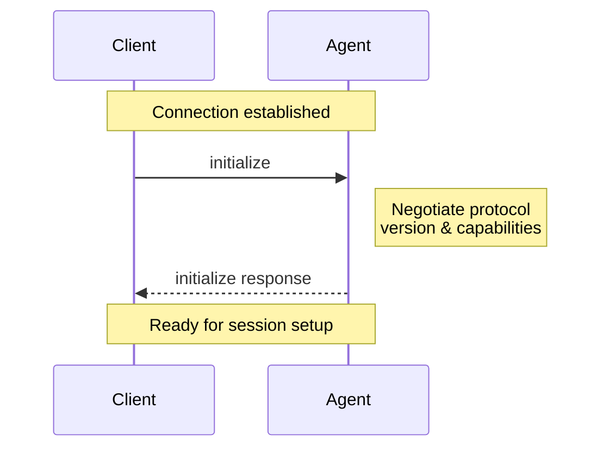
```mermaid theme={null}
sequenceDiagram
    participant Client
    participant Agent

    Note over Client, Agent: Connection established
    Client->>Agent: initialize
    Note right of Agent: Negotiate protocol<br/>version & capabilities
    Agent-->>Client: initialize response
    Note over Client,Agent: Ready for session setup
```

<br />

Before a Session can be created, Clients **MUST** initialize the connection by calling the `initialize` method with:

* The latest [protocol version](#protocol-version) supported
* The [capabilities](#client-capabilities) supported

They **SHOULD** also provide a name and version to the Agent.

```json theme={null}
{
  "jsonrpc": "2.0",
  "id": 0,
  "method": "initialize",
  "params": {
    "protocolVersion": 1,
    "clientCapabilities": {
      "fs": {
        "readTextFile": true,
        "writeTextFile": true
      },
      "terminal": true
    },
    "clientInfo": {
      "name": "my-client",
      "title": "My Client",
      "version": "1.0.0"
    }
  }
}
```

The Agent **MUST** respond with the chosen [protocol version](#protocol-version) and the [capabilities](#agent-capabilities) it supports. It **SHOULD** also provide a name and version to the Client as well:

```json theme={null}
{
  "jsonrpc": "2.0",
  "id": 0,
  "result": {
    "protocolVersion": 1,
    "agentCapabilities": {
      "loadSession": true,
      "promptCapabilities": {
        "image": true,
        "audio": true,
        "embeddedContext": true
      },
      "mcp": {
        "http": true,
        "sse": true
      }
    },
    "agentInfo": {
      "name": "my-agent",
      "title": "My Agent",
      "version": "1.0.0"
    },
    "authMethods": []
  }
}
```

## Protocol version

The protocol versions that appear in the `initialize` requests and responses are a single integer that identifies a **MAJOR** protocol version. This version is only incremented when breaking changes are introduced.

Clients and Agents **MUST** agree on a protocol version and act according to its specification.

See [Capabilities](#capabilities) to learn how non-breaking features are introduced.

### Version Negotiation

The `initialize` request **MUST** include the latest protocol version the Client supports.

If the Agent supports the requested version, it **MUST** respond with the same version. Otherwise, the Agent **MUST** respond with the latest version it supports.

If the Client does not support the version specified by the Agent in the `initialize` response, the Client **SHOULD** close the connection and inform the user about it.

## Capabilities

Capabilities describe features supported by the Client and the Agent.

All capabilities included in the `initialize` request are **OPTIONAL**. Clients and Agents **SHOULD** support all possible combinations of their peer's capabilities.

The introduction of new capabilities is not considered a breaking change. Therefore, Clients and Agents **MUST** treat all capabilities omitted in the `initialize` request as **UNSUPPORTED**.

Capabilities are high-level and are not attached to a specific base protocol concept.

Capabilities may specify the availability of protocol methods, notifications, or a subset of their parameters. They may also signal behaviors of the Agent or Client implementation.

Implementations can also [advertise custom capabilities](./extensibility#advertising-custom-capabilities) using the `_meta` field to indicate support for protocol extensions.

### Client Capabilities

The Client **SHOULD** specify whether it supports the following capabilities:

#### File System

<ParamField type="boolean">
  The `fs/read_text_file` method is available.
</ParamField>

<ParamField type="boolean">
  The `fs/write_text_file` method is available.
</ParamField>

<Card icon="file" href="./file-system">
  Learn more about File System methods
</Card>

#### Terminal

<ParamField type="boolean">
  All `terminal/*` methods are available, allowing the Agent to execute and
  manage shell commands.
</ParamField>

<Card icon="terminal" href="./terminals">
  Learn more about Terminals
</Card>

### Agent Capabilities

The Agent **SHOULD** specify whether it supports the following capabilities:

<ResponseField name="loadSession" type="boolean">
  The [`session/load`](./session-setup#loading-sessions) method is available.
</ResponseField>

<ResponseField name="promptCapabilities" type="PromptCapabilities Object">
  Object indicating the different types of [content](./content) that may be
  included in `session/prompt` requests.
</ResponseField>

#### Prompt capabilities

As a baseline, all Agents **MUST** support `ContentBlock::Text` and `ContentBlock::ResourceLink` in `session/prompt` requests.

Optionally, they **MAY** support richer types of [content](./content) by specifying the following capabilities:

<ResponseField name="image" type="boolean">
  The prompt may include `ContentBlock::Image`
</ResponseField>

<ResponseField name="audio" type="boolean">
  The prompt may include `ContentBlock::Audio`
</ResponseField>

<ResponseField name="embeddedContext" type="boolean">
  The prompt may include `ContentBlock::Resource`
</ResponseField>

#### MCP capabilities

<ResponseField name="http" type="boolean">
  The Agent supports connecting to MCP servers over HTTP.
</ResponseField>

<ResponseField name="sse" type="boolean">
  The Agent supports connecting to MCP servers over SSE.

  Note: This transport has been deprecated by the MCP spec.
</ResponseField>

#### Session Capabilities

As a baseline, all Agents **MUST** support `session/new`, `session/prompt`, `session/cancel`, and `session/update`.

Optionally, they **MAY** support other session methods and notifications by specifying additional capabilities.

<Note>
  `session/load` is still handled by the top-level `load_session` capability.
  This will be unified in future versions of the protocol.
</Note>

## Implementation Information

Both Clients and Agents **SHOULD** provide information about their implementation in the `clientInfo` and `agentInfo` fields respectively. Both take the following three fields:

<ParamField type="string">
  Intended for programmatic or logical use, but can be used as a display name
  fallback if title isn’t present.
</ParamField>

<ParamField type="string">
  Intended for UI and end-user contexts — optimized to be human-readable and
  easily understood. If not provided, the name should be used for display.
</ParamField>

<ParamField type="string">
  Version of the implementation. Can be displayed to the user or used for
  debugging or metrics purposes.
</ParamField>

<Info>
  Note: in future versions of the protocol, this information will be required.
</Info>

***

Once the connection is initialized, you're ready to [create a session](./session-setup) and begin the conversation with the Agent.


# Overview
Source: https://agentclientprotocol.com/protocol/overview

How the Agent Client Protocol works

The Agent Client Protocol allows [Agents](#agent) and [Clients](#client) to communicate by exposing methods that each side can call and sending notifications to inform each other of events.

## Communication Model

The protocol follows the [JSON-RPC 2.0](https://www.jsonrpc.org/specification) specification with two types of messages:

* **Methods**: Request-response pairs that expect a result or error
* **Notifications**: One-way messages that don't expect a response

## Message Flow

A typical flow follows this pattern:

<Steps>
  <Step title="Initialization Phase">
    * Client → Agent: `initialize` to establish connection
    * Client → Agent: `authenticate` if required by the Agent
  </Step>

  <Step title="Session Setup - either:">
    * Client → Agent: `session/new` to create a new session
    * Client → Agent: `session/load` to resume an existing session if supported
  </Step>

  <Step title="Prompt Turn">
    * Client → Agent: `session/prompt` to send user message
    * Agent → Client: `session/update` notifications for progress updates
    * Agent → Client: File operations or permission requests as needed
    * Client → Agent: `session/cancel` to interrupt processing if needed
    * Turn ends and the Agent sends the `session/prompt` response with a stop reason
  </Step>
</Steps>

## Agent

Agents are programs that use generative AI to autonomously modify code. They typically run as subprocesses of the Client.

### Baseline Methods

<ResponseField name="initialize">
  [Negotiate versions and exchange capabilities.](./initialization).
</ResponseField>

<ResponseField name="authenticate">
  Authenticate with the Agent (if required).
</ResponseField>

<ResponseField name="session/new">
  [Create a new conversation session](./session-setup#creating-a-session).
</ResponseField>

<ResponseField name="session/prompt">
  [Send user prompts](./prompt-turn#1-user-message) to the Agent.
</ResponseField>

### Optional Methods

<ResponseField name="session/load">
  [Load an existing session](./session-setup#loading-sessions) (requires
  `loadSession` capability).
</ResponseField>

<ResponseField name="session/set_mode">
  [Switch between agent operating
  modes](./session-modes#setting-the-current-mode).
</ResponseField>

### Notifications

<ResponseField name="session/cancel">
  [Cancel ongoing operations](./prompt-turn#cancellation) (no response
  expected).
</ResponseField>

## Client

Clients provide the interface between users and agents. They are typically code editors (IDEs, text editors) but can also be other UIs for interacting with agents. Clients manage the environment, handle user interactions, and control access to resources.

### Baseline Methods

<ResponseField name="session/request_permission">
  [Request user authorization](./tool-calls#requesting-permission) for tool
  calls.
</ResponseField>

### Optional Methods

<ResponseField name="fs/read_text_file">
  [Read file contents](./file-system#reading-files) (requires `fs.readTextFile`
  capability).
</ResponseField>

<ResponseField name="fs/write_text_file">
  [Write file contents](./file-system#writing-files) (requires
  `fs.writeTextFile` capability).
</ResponseField>

<ResponseField name="terminal/create">
  [Create a new terminal](./terminals) (requires `terminal` capability).
</ResponseField>

<ResponseField name="terminal/output">
  Get terminal output and exit status (requires `terminal` capability).
</ResponseField>

<ResponseField name="terminal/release">
  Release a terminal (requires `terminal` capability).
</ResponseField>

<ResponseField name="terminal/wait_for_exit">
  Wait for terminal command to exit (requires `terminal` capability).
</ResponseField>

<ResponseField name="terminal/kill">
  Kill terminal command without releasing (requires `terminal` capability).
</ResponseField>

### Notifications

<ResponseField name="session/update">
  [Send session updates](./prompt-turn#3-agent-reports-output) to inform the
  Client of changes (no response expected). This includes: - [Message
  chunks](./content) (agent, user, thought) - [Tool calls and
  updates](./tool-calls) - [Plans](./agent-plan) - [Available commands
  updates](./slash-commands#advertising-commands) - [Mode
  changes](./session-modes#from-the-agent)
</ResponseField>

## Argument requirements

* All file paths in the protocol **MUST** be absolute.
* Line numbers are 1-based

## Error Handling

All methods follow standard JSON-RPC 2.0 [error handling](https://www.jsonrpc.org/specification#error_object):

* Successful responses include a `result` field
* Errors include an `error` object with `code` and `message`
* Notifications never receive responses (success or error)

## Extensibility

The protocol provides built-in mechanisms for adding custom functionality while maintaining compatibility:

* Add custom data using `_meta` fields
* Create custom methods by prefixing their name with underscore (`_`)
* Advertise custom capabilities during initialization

Learn about [protocol extensibility](./extensibility) to understand how to use these mechanisms.

## Next Steps

* Learn about [Initialization](./initialization) to understand version and capability negotiation
* Understand [Session Setup](./session-setup) for creating and loading sessions
* Review the [Prompt Turn](./prompt-turn) lifecycle
* Explore [Extensibility](./extensibility) to add custom features


# Prompt Turn
Source: https://agentclientprotocol.com/protocol/prompt-turn

Understanding the core conversation flow

A prompt turn represents a complete interaction cycle between the [Client](./overview#client) and [Agent](./overview#agent), starting with a user message and continuing until the Agent completes its response. This may involve multiple exchanges with the language model and tool invocations.

Before sending prompts, Clients **MUST** first complete the [initialization](./initialization) phase and [session setup](./session-setup).

## The Prompt Turn Lifecycle

A prompt turn follows a structured flow that enables rich interactions between the user, Agent, and any connected tools.

<br />

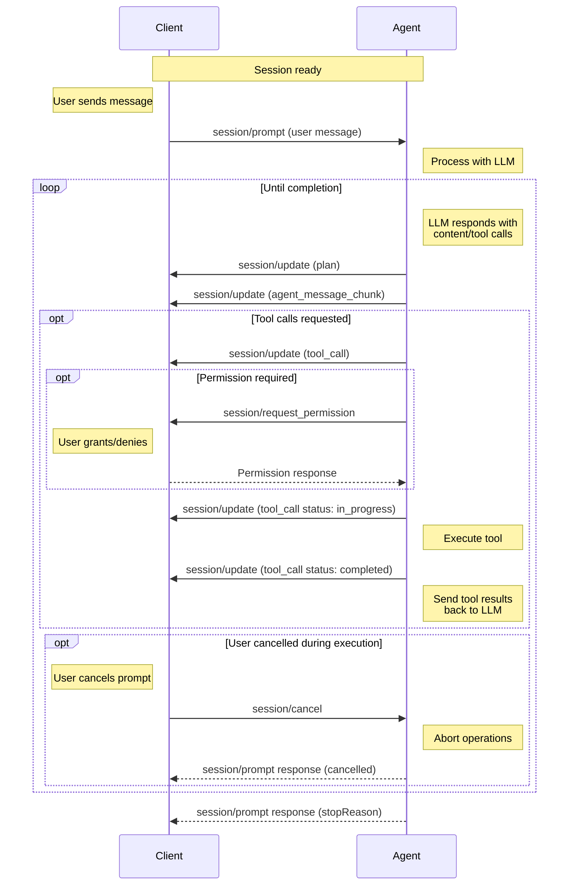
```mermaid theme={null}
sequenceDiagram
    participant Client
    participant Agent

    Note over Agent,Client: Session ready

    Note left of Client: User sends message
    Client->>Agent: session/prompt (user message)
    Note right of Agent: Process with LLM

    loop Until completion
        Note right of Agent: LLM responds with<br/>content/tool calls
        Agent->>Client: session/update (plan)
        Agent->>Client: session/update (agent_message_chunk)

        opt Tool calls requested
            Agent->>Client: session/update (tool_call)
            opt Permission required
                Agent->>Client: session/request_permission
                Note left of Client: User grants/denies
                Client-->>Agent: Permission response
            end
            Agent->>Client: session/update (tool_call status: in_progress)
            Note right of Agent: Execute tool
            Agent->>Client: session/update (tool_call status: completed)
            Note right of Agent: Send tool results<br/>back to LLM
        end

      opt User cancelled during execution
          Note left of Client: User cancels prompt
          Client->>Agent: session/cancel
          Note right of Agent: Abort operations
          Agent-->>Client: session/prompt response (cancelled)
      end
    end

    Agent-->>Client: session/prompt response (stopReason)

```

### 1. User Message

The turn begins when the Client sends a `session/prompt`:

```json theme={null}
{
  "jsonrpc": "2.0",
  "id": 2,
  "method": "session/prompt",
  "params": {
    "sessionId": "sess_abc123def456",
    "prompt": [
      {
        "type": "text",
        "text": "Can you analyze this code for potential issues?"
      },
      {
        "type": "resource",
        "resource": {
          "uri": "file:///home/user/project/main.py",
          "mimeType": "text/x-python",
          "text": "def process_data(items):\n    for item in items:\n        print(item)"
        }
      }
    ]
  }
}
```

<ParamField type="SessionId">
  The [ID](./session-setup#session-id) of the session to send this message to.
</ParamField>

<ParamField type="ContentBlock[]">
  The contents of the user message, e.g. text, images, files, etc.

  Clients **MUST** restrict types of content according to the [Prompt Capabilities](./initialization#prompt-capabilities) established during [initialization](./initialization).

  <Card icon="comments" href="./content">
    Learn more about Content
  </Card>
</ParamField>

### 2. Agent Processing

Upon receiving the prompt request, the Agent processes the user's message and sends it to the language model, which **MAY** respond with text content, tool calls, or both.

### 3. Agent Reports Output

The Agent reports the model's output to the Client via `session/update` notifications. This may include the Agent's plan for accomplishing the task:

```json expandable theme={null}
{
  "jsonrpc": "2.0",
  "method": "session/update",
  "params": {
    "sessionId": "sess_abc123def456",
    "update": {
      "sessionUpdate": "plan",
      "entries": [
        {
          "content": "Check for syntax errors",
          "priority": "high",
          "status": "pending"
        },
        {
          "content": "Identify potential type issues",
          "priority": "medium",
          "status": "pending"
        },
        {
          "content": "Review error handling patterns",
          "priority": "medium",
          "status": "pending"
        },
        {
          "content": "Suggest improvements",
          "priority": "low",
          "status": "pending"
        }
      ]
    }
  }
}
```

<Card icon="lightbulb" href="./agent-plan">
  Learn more about Agent Plans
</Card>

The Agent then reports text responses from the model:

```json theme={null}
{
  "jsonrpc": "2.0",
  "method": "session/update",
  "params": {
    "sessionId": "sess_abc123def456",
    "update": {
      "sessionUpdate": "agent_message_chunk",
      "content": {
        "type": "text",
        "text": "I'll analyze your code for potential issues. Let me examine it..."
      }
    }
  }
}
```

If the model requested tool calls, these are also reported immediately:

```json theme={null}
{
  "jsonrpc": "2.0",
  "method": "session/update",
  "params": {
    "sessionId": "sess_abc123def456",
    "update": {
      "sessionUpdate": "tool_call",
      "toolCallId": "call_001",
      "title": "Analyzing Python code",
      "kind": "other",
      "status": "pending"
    }
  }
}
```

### 4. Check for Completion

If there are no pending tool calls, the turn ends and the Agent **MUST** respond to the original `session/prompt` request with a `StopReason`:

```json theme={null}
{
  "jsonrpc": "2.0",
  "id": 2,
  "result": {
    "stopReason": "end_turn"
  }
}
```

Agents **MAY** stop the turn at any point by returning the corresponding [`StopReason`](#stop-reasons).

### 5. Tool Invocation and Status Reporting

Before proceeding with execution, the Agent **MAY** request permission from the Client via the `session/request_permission` method.

Once permission is granted (if required), the Agent **SHOULD** invoke the tool and report a status update marking the tool as `in_progress`:

```json theme={null}
{
  "jsonrpc": "2.0",
  "method": "session/update",
  "params": {
    "sessionId": "sess_abc123def456",
    "update": {
      "sessionUpdate": "tool_call_update",
      "toolCallId": "call_001",
      "status": "in_progress"
    }
  }
}
```

As the tool runs, the Agent **MAY** send additional updates, providing real-time feedback about tool execution progress.

While tools execute on the Agent, they **MAY** leverage Client capabilities such as the file system (`fs`) methods to access resources within the Client's environment.

When the tool completes, the Agent sends another update with the final status and any content:

```json theme={null}
{
  "jsonrpc": "2.0",
  "method": "session/update",
  "params": {
    "sessionId": "sess_abc123def456",
    "update": {
      "sessionUpdate": "tool_call_update",
      "toolCallId": "call_001",
      "status": "completed",
      "content": [
        {
          "type": "content",
          "content": {
            "type": "text",
            "text": "Analysis complete:\n- No syntax errors found\n- Consider adding type hints for better clarity\n- The function could benefit from error handling for empty lists"
          }
        }
      ]
    }
  }
}
```

<Card icon="hammer" href="./tool-calls">
  Learn more about Tool Calls
</Card>

### 6. Continue Conversation

The Agent sends the tool results back to the language model as another request.

The cycle returns to [step 2](#2-agent-processing), continuing until the language model completes its response without requesting additional tool calls or the turn gets stopped by the Agent or cancelled by the Client.

## Stop Reasons

When an Agent stops a turn, it must specify the corresponding `StopReason`:

<ResponseField name="end_turn">
  The language model finishes responding without requesting more tools
</ResponseField>

<ResponseField name="max_tokens">
  The maximum token limit is reached
</ResponseField>

<ResponseField name="max_turn_requests">
  The maximum number of model requests in a single turn is exceeded
</ResponseField>

<ResponseField name="refusal">The Agent refuses to continue</ResponseField>

<ResponseField name="cancelled">The Client cancels the turn</ResponseField>

## Cancellation

Clients **MAY** cancel an ongoing prompt turn at any time by sending a `session/cancel` notification:

```json theme={null}
{
  "jsonrpc": "2.0",
  "method": "session/cancel",
  "params": {
    "sessionId": "sess_abc123def456"
  }
}
```

The Client **SHOULD** preemptively mark all non-finished tool calls pertaining to the current turn as `cancelled` as soon as it sends the `session/cancel` notification.

The Client **MUST** respond to all pending `session/request_permission` requests with the `cancelled` outcome.

When the Agent receives this notification, it **SHOULD** stop all language model requests and all tool call invocations as soon as possible.

After all ongoing operations have been successfully aborted and pending updates have been sent, the Agent **MUST** respond to the original `session/prompt` request with the `cancelled` [stop reason](#stop-reasons).

<Warning>
  API client libraries and tools often throw an exception when their operation is aborted, which may propagate as an error response to `session/prompt`.

  Clients often display unrecognized errors from the Agent to the user, which would be undesirable for cancellations as they aren't considered errors.

  Agents **MUST** catch these errors and return the semantically meaningful `cancelled` stop reason, so that Clients can reliably confirm the cancellation.
</Warning>

The Agent **MAY** send `session/update` notifications with content or tool call updates after receiving the `session/cancel` notification, but it **MUST** ensure that it does so before responding to the `session/prompt` request.

The Client **SHOULD** still accept tool call updates received after sending `session/cancel`.

***

Once a prompt turn completes, the Client may send another `session/prompt` to continue the conversation, building on the context established in previous turns.


# Schema
Source: https://agentclientprotocol.com/protocol/schema

Schema definitions for the Agent Client Protocol

## Agent

Defines the interface that all ACP-compliant agents must implement.

Agents are programs that use generative AI to autonomously modify code. They handle
requests from clients and execute tasks using language models and tools.

### <span>authenticate</span>

Authenticates the client using the specified authentication method.

Called when the agent requires authentication before allowing session creation.
The client provides the authentication method ID that was advertised during initialization.

After successful authentication, the client can proceed to create sessions with
`new_session` without receiving an `auth_required` error.

See protocol docs: [Initialization](https://agentclientprotocol.com/protocol/initialization)

#### <span>AuthenticateRequest</span>

Request parameters for the authenticate method.

Specifies which authentication method to use.

**Type:** Object

**Properties:**

<ResponseField name="_meta" type={"object | null"}>
  The \_meta property is reserved by ACP to allow clients and agents to attach additional
  metadata to their interactions. Implementations MUST NOT make assumptions about values at
  these keys.

  See protocol docs: [Extensibility](https://agentclientprotocol.com/protocol/extensibility)
</ResponseField>

<ResponseField name="methodId" type={"string"}>
  The ID of the authentication method to use.
  Must be one of the methods advertised in the initialize response.
</ResponseField>

#### <span>AuthenticateResponse</span>

Response to the `authenticate` method.

**Type:** Object

**Properties:**

<ResponseField name="_meta" type={"object | null"}>
  The \_meta property is reserved by ACP to allow clients and agents to attach additional
  metadata to their interactions. Implementations MUST NOT make assumptions about values at
  these keys.

  See protocol docs: [Extensibility](https://agentclientprotocol.com/protocol/extensibility)
</ResponseField>

### <span>initialize</span>

Establishes the connection with a client and negotiates protocol capabilities.

This method is called once at the beginning of the connection to:

* Negotiate the protocol version to use
* Exchange capability information between client and agent
* Determine available authentication methods

The agent should respond with its supported protocol version and capabilities.

See protocol docs: [Initialization](https://agentclientprotocol.com/protocol/initialization)

#### <span>InitializeRequest</span>

Request parameters for the initialize method.

Sent by the client to establish connection and negotiate capabilities.

See protocol docs: [Initialization](https://agentclientprotocol.com/protocol/initialization)

**Type:** Object

**Properties:**

<ResponseField name="_meta" type={"object | null"}>
  The \_meta property is reserved by ACP to allow clients and agents to attach additional
  metadata to their interactions. Implementations MUST NOT make assumptions about values at
  these keys.

  See protocol docs: [Extensibility](https://agentclientprotocol.com/protocol/extensibility)
</ResponseField>

<ResponseField name="clientCapabilities" type={<a href="#clientcapabilities">ClientCapabilities</a>}>
  Capabilities supported by the client.

  * Default: `{"fs":{"readTextFile":false,"writeTextFile":false},"terminal":false}`
</ResponseField>

<ResponseField name="clientInfo" type={<><span><a href="#implementation">Implementation</a></span><span> | null</span></>}>
  Information about the Client name and version sent to the Agent.

  Note: in future versions of the protocol, this will be required.
</ResponseField>

<ResponseField name="protocolVersion" type={<a href="#protocolversion">ProtocolVersion</a>}>
  The latest protocol version supported by the client.
</ResponseField>

#### <span>InitializeResponse</span>

Response to the `initialize` method.

Contains the negotiated protocol version and agent capabilities.

See protocol docs: [Initialization](https://agentclientprotocol.com/protocol/initialization)

**Type:** Object

**Properties:**

<ResponseField name="_meta" type={"object | null"}>
  The \_meta property is reserved by ACP to allow clients and agents to attach additional
  metadata to their interactions. Implementations MUST NOT make assumptions about values at
  these keys.

  See protocol docs: [Extensibility](https://agentclientprotocol.com/protocol/extensibility)
</ResponseField>

<ResponseField name="agentCapabilities" type={<a href="#agentcapabilities">AgentCapabilities</a>}>
  Capabilities supported by the agent.

  * Default: `{"loadSession":false,"mcpCapabilities":{"http":false,"sse":false},"promptCapabilities":{"audio":false,"embeddedContext":false,"image":false},"sessionCapabilities":{}}`
</ResponseField>

<ResponseField name="agentInfo" type={<><span><a href="#implementation">Implementation</a></span><span> | null</span></>}>
  Information about the Agent name and version sent to the Client.

  Note: in future versions of the protocol, this will be required.
</ResponseField>

<ResponseField name="authMethods" type={<a href="#authmethod">AuthMethod[]</a>}>
  Authentication methods supported by the agent.

  * Default: `[]`
</ResponseField>

<ResponseField name="protocolVersion" type={<a href="#protocolversion">ProtocolVersion</a>}>
  The protocol version the client specified if supported by the agent,
  or the latest protocol version supported by the agent.

  The client should disconnect, if it doesn't support this version.
</ResponseField>

<a />

### <span>session/cancel</span>

Cancels ongoing operations for a session.

This is a notification sent by the client to cancel an ongoing prompt turn.

Upon receiving this notification, the Agent SHOULD:

* Stop all language model requests as soon as possible
* Abort all tool call invocations in progress
* Send any pending `session/update` notifications
* Respond to the original `session/prompt` request with `StopReason::Cancelled`

See protocol docs: [Cancellation](https://agentclientprotocol.com/protocol/prompt-turn#cancellation)

#### <span>CancelNotification</span>

Notification to cancel ongoing operations for a session.

See protocol docs: [Cancellation](https://agentclientprotocol.com/protocol/prompt-turn#cancellation)

**Type:** Object

**Properties:**

<ResponseField name="_meta" type={"object | null"}>
  The \_meta property is reserved by ACP to allow clients and agents to attach additional
  metadata to their interactions. Implementations MUST NOT make assumptions about values at
  these keys.

  See protocol docs: [Extensibility](https://agentclientprotocol.com/protocol/extensibility)
</ResponseField>

<ResponseField name="sessionId" type={<a href="#sessionid">SessionId</a>}>
  The ID of the session to cancel operations for.
</ResponseField>

<a />

### <span>session/load</span>

Loads an existing session to resume a previous conversation.

This method is only available if the agent advertises the `loadSession` capability.

The agent should:

* Restore the session context and conversation history
* Connect to the specified MCP servers
* Stream the entire conversation history back to the client via notifications

See protocol docs: [Loading Sessions](https://agentclientprotocol.com/protocol/session-setup#loading-sessions)

#### <span>LoadSessionRequest</span>

Request parameters for loading an existing session.

Only available if the Agent supports the `loadSession` capability.

See protocol docs: [Loading Sessions](https://agentclientprotocol.com/protocol/session-setup#loading-sessions)

**Type:** Object

**Properties:**

<ResponseField name="_meta" type={"object | null"}>
  The \_meta property is reserved by ACP to allow clients and agents to attach additional
  metadata to their interactions. Implementations MUST NOT make assumptions about values at
  these keys.

  See protocol docs: [Extensibility](https://agentclientprotocol.com/protocol/extensibility)
</ResponseField>

<ResponseField name="cwd" type={"string"}>
  The working directory for this session.
</ResponseField>

<ResponseField name="mcpServers" type={<a href="#mcpserver">McpServer[]</a>}>
  List of MCP servers to connect to for this session.
</ResponseField>

<ResponseField name="sessionId" type={<a href="#sessionid">SessionId</a>}>
  The ID of the session to load.
</ResponseField>

#### <span>LoadSessionResponse</span>

Response from loading an existing session.

**Type:** Object

**Properties:**

<ResponseField name="_meta" type={"object | null"}>
  The \_meta property is reserved by ACP to allow clients and agents to attach additional
  metadata to their interactions. Implementations MUST NOT make assumptions about values at
  these keys.

  See protocol docs: [Extensibility](https://agentclientprotocol.com/protocol/extensibility)
</ResponseField>

<ResponseField name="modes" type={<><span><a href="#sessionmodestate">SessionModeState</a></span><span> | null</span></>}>
  Initial mode state if supported by the Agent

  See protocol docs: [Session Modes](https://agentclientprotocol.com/protocol/session-modes)
</ResponseField>

<a />

### <span>session/new</span>

Creates a new conversation session with the agent.

Sessions represent independent conversation contexts with their own history and state.

The agent should:

* Create a new session context
* Connect to any specified MCP servers
* Return a unique session ID for future requests

May return an `auth_required` error if the agent requires authentication.

See protocol docs: [Session Setup](https://agentclientprotocol.com/protocol/session-setup)

#### <span>NewSessionRequest</span>

Request parameters for creating a new session.

See protocol docs: [Creating a Session](https://agentclientprotocol.com/protocol/session-setup#creating-a-session)

**Type:** Object

**Properties:**

<ResponseField name="_meta" type={"object | null"}>
  The \_meta property is reserved by ACP to allow clients and agents to attach additional
  metadata to their interactions. Implementations MUST NOT make assumptions about values at
  these keys.

  See protocol docs: [Extensibility](https://agentclientprotocol.com/protocol/extensibility)
</ResponseField>

<ResponseField name="cwd" type={"string"}>
  The working directory for this session. Must be an absolute path.
</ResponseField>

<ResponseField name="mcpServers" type={<a href="#mcpserver">McpServer[]</a>}>
  List of MCP (Model Context Protocol) servers the agent should connect to.
</ResponseField>

#### <span>NewSessionResponse</span>

Response from creating a new session.

See protocol docs: [Creating a Session](https://agentclientprotocol.com/protocol/session-setup#creating-a-session)

**Type:** Object

**Properties:**

<ResponseField name="_meta" type={"object | null"}>
  The \_meta property is reserved by ACP to allow clients and agents to attach additional
  metadata to their interactions. Implementations MUST NOT make assumptions about values at
  these keys.

  See protocol docs: [Extensibility](https://agentclientprotocol.com/protocol/extensibility)
</ResponseField>

<ResponseField name="modes" type={<><span><a href="#sessionmodestate">SessionModeState</a></span><span> | null</span></>}>
  Initial mode state if supported by the Agent

  See protocol docs: [Session Modes](https://agentclientprotocol.com/protocol/session-modes)
</ResponseField>

<ResponseField name="sessionId" type={<a href="#sessionid">SessionId</a>}>
  Unique identifier for the created session.

  Used in all subsequent requests for this conversation.
</ResponseField>

<a />

### <span>session/prompt</span>

Processes a user prompt within a session.

This method handles the whole lifecycle of a prompt:

* Receives user messages with optional context (files, images, etc.)
* Processes the prompt using language models
* Reports language model content and tool calls to the Clients
* Requests permission to run tools
* Executes any requested tool calls
* Returns when the turn is complete with a stop reason

See protocol docs: [Prompt Turn](https://agentclientprotocol.com/protocol/prompt-turn)

#### <span>PromptRequest</span>

Request parameters for sending a user prompt to the agent.

Contains the user's message and any additional context.

See protocol docs: [User Message](https://agentclientprotocol.com/protocol/prompt-turn#1-user-message)

**Type:** Object

**Properties:**

<ResponseField name="_meta" type={"object | null"}>
  The \_meta property is reserved by ACP to allow clients and agents to attach additional
  metadata to their interactions. Implementations MUST NOT make assumptions about values at
  these keys.

  See protocol docs: [Extensibility](https://agentclientprotocol.com/protocol/extensibility)
</ResponseField>

<ResponseField name="prompt" type={<a href="#contentblock">ContentBlock[]</a>}>
  The blocks of content that compose the user's message.

  As a baseline, the Agent MUST support `ContentBlock::Text` and `ContentBlock::ResourceLink`,
  while other variants are optionally enabled via `PromptCapabilities`.

  The Client MUST adapt its interface according to `PromptCapabilities`.

  The client MAY include referenced pieces of context as either
  `ContentBlock::Resource` or `ContentBlock::ResourceLink`.

  When available, `ContentBlock::Resource` is preferred
  as it avoids extra round-trips and allows the message to include
  pieces of context from sources the agent may not have access to.
</ResponseField>

<ResponseField name="sessionId" type={<a href="#sessionid">SessionId</a>}>
  The ID of the session to send this user message to
</ResponseField>

#### <span>PromptResponse</span>

Response from processing a user prompt.

See protocol docs: [Check for Completion](https://agentclientprotocol.com/protocol/prompt-turn#4-check-for-completion)

**Type:** Object

**Properties:**

<ResponseField name="_meta" type={"object | null"}>
  The \_meta property is reserved by ACP to allow clients and agents to attach additional
  metadata to their interactions. Implementations MUST NOT make assumptions about values at
  these keys.

  See protocol docs: [Extensibility](https://agentclientprotocol.com/protocol/extensibility)
</ResponseField>

<ResponseField name="stopReason" type={<a href="#stopreason">StopReason</a>}>
  Indicates why the agent stopped processing the turn.
</ResponseField>

<a />

### <span>session/set\_mode</span>

Sets the current mode for a session.

Allows switching between different agent modes (e.g., "ask", "architect", "code")
that affect system prompts, tool availability, and permission behaviors.

The mode must be one of the modes advertised in `availableModes` during session
creation or loading. Agents may also change modes autonomously and notify the
client via `current_mode_update` notifications.

This method can be called at any time during a session, whether the Agent is
idle or actively generating a response.

See protocol docs: [Session Modes](https://agentclientprotocol.com/protocol/session-modes)

#### <span>SetSessionModeRequest</span>

Request parameters for setting a session mode.

**Type:** Object

**Properties:**

<ResponseField name="_meta" type={"object | null"}>
  The \_meta property is reserved by ACP to allow clients and agents to attach additional
  metadata to their interactions. Implementations MUST NOT make assumptions about values at
  these keys.

  See protocol docs: [Extensibility](https://agentclientprotocol.com/protocol/extensibility)
</ResponseField>

<ResponseField name="modeId" type={<a href="#sessionmodeid">SessionModeId</a>}>
  The ID of the mode to set.
</ResponseField>

<ResponseField name="sessionId" type={<a href="#sessionid">SessionId</a>}>
  The ID of the session to set the mode for.
</ResponseField>

#### <span>SetSessionModeResponse</span>

Response to `session/set_mode` method.

**Type:** Object

**Properties:**

<ResponseField name="_meta" type={"object | null"} />

## Client

Defines the interface that ACP-compliant clients must implement.

Clients are typically code editors (IDEs, text editors) that provide the interface
between users and AI agents. They manage the environment, handle user interactions,
and control access to resources.

<a />

### <span>fs/read\_text\_file</span>

Reads content from a text file in the client's file system.

Only available if the client advertises the `fs.readTextFile` capability.
Allows the agent to access file contents within the client's environment.

See protocol docs: [Client](https://agentclientprotocol.com/protocol/overview#client)

#### <span>ReadTextFileRequest</span>

Request to read content from a text file.

Only available if the client supports the `fs.readTextFile` capability.

**Type:** Object

**Properties:**

<ResponseField name="_meta" type={"object | null"}>
  The \_meta property is reserved by ACP to allow clients and agents to attach additional
  metadata to their interactions. Implementations MUST NOT make assumptions about values at
  these keys.

  See protocol docs: [Extensibility](https://agentclientprotocol.com/protocol/extensibility)
</ResponseField>

<ResponseField name="limit" type={"integer | null"}>
  Maximum number of lines to read.

  * Minimum: `0`
</ResponseField>

<ResponseField name="line" type={"integer | null"}>
  Line number to start reading from (1-based).

  * Minimum: `0`
</ResponseField>

<ResponseField name="path" type={"string"}>
  Absolute path to the file to read.
</ResponseField>

<ResponseField name="sessionId" type={<a href="#sessionid">SessionId</a>}>
  The session ID for this request.
</ResponseField>

#### <span>ReadTextFileResponse</span>

Response containing the contents of a text file.

**Type:** Object

**Properties:**

<ResponseField name="_meta" type={"object | null"}>
  The \_meta property is reserved by ACP to allow clients and agents to attach additional
  metadata to their interactions. Implementations MUST NOT make assumptions about values at
  these keys.

  See protocol docs: [Extensibility](https://agentclientprotocol.com/protocol/extensibility)
</ResponseField>

<ResponseField name="content" type={"string"} />

<a />

### <span>fs/write\_text\_file</span>

Writes content to a text file in the client's file system.

Only available if the client advertises the `fs.writeTextFile` capability.
Allows the agent to create or modify files within the client's environment.

See protocol docs: [Client](https://agentclientprotocol.com/protocol/overview#client)

#### <span>WriteTextFileRequest</span>

Request to write content to a text file.

Only available if the client supports the `fs.writeTextFile` capability.

**Type:** Object

**Properties:**

<ResponseField name="_meta" type={"object | null"}>
  The \_meta property is reserved by ACP to allow clients and agents to attach additional
  metadata to their interactions. Implementations MUST NOT make assumptions about values at
  these keys.

  See protocol docs: [Extensibility](https://agentclientprotocol.com/protocol/extensibility)
</ResponseField>

<ResponseField name="content" type={"string"}>
  The text content to write to the file.
</ResponseField>

<ResponseField name="path" type={"string"}>
  Absolute path to the file to write.
</ResponseField>

<ResponseField name="sessionId" type={<a href="#sessionid">SessionId</a>}>
  The session ID for this request.
</ResponseField>

#### <span>WriteTextFileResponse</span>

Response to `fs/write_text_file`

**Type:** Object

**Properties:**

<ResponseField name="_meta" type={"object | null"}>
  The \_meta property is reserved by ACP to allow clients and agents to attach additional
  metadata to their interactions. Implementations MUST NOT make assumptions about values at
  these keys.

  See protocol docs: [Extensibility](https://agentclientprotocol.com/protocol/extensibility)
</ResponseField>

<a />

### <span>session/request\_permission</span>

Requests permission from the user for a tool call operation.

Called by the agent when it needs user authorization before executing
a potentially sensitive operation. The client should present the options
to the user and return their decision.

If the client cancels the prompt turn via `session/cancel`, it MUST
respond to this request with `RequestPermissionOutcome::Cancelled`.

See protocol docs: [Requesting Permission](https://agentclientprotocol.com/protocol/tool-calls#requesting-permission)

#### <span>RequestPermissionRequest</span>

Request for user permission to execute a tool call.

Sent when the agent needs authorization before performing a sensitive operation.

See protocol docs: [Requesting Permission](https://agentclientprotocol.com/protocol/tool-calls#requesting-permission)

**Type:** Object

**Properties:**

<ResponseField name="_meta" type={"object | null"}>
  The \_meta property is reserved by ACP to allow clients and agents to attach additional
  metadata to their interactions. Implementations MUST NOT make assumptions about values at
  these keys.

  See protocol docs: [Extensibility](https://agentclientprotocol.com/protocol/extensibility)
</ResponseField>

<ResponseField name="options" type={<a href="#permissionoption">PermissionOption[]</a>}>
  Available permission options for the user to choose from.
</ResponseField>

<ResponseField name="sessionId" type={<a href="#sessionid">SessionId</a>}>
  The session ID for this request.
</ResponseField>

<ResponseField name="toolCall" type={<a href="#toolcallupdate">ToolCallUpdate</a>}>
  Details about the tool call requiring permission.
</ResponseField>

#### <span>RequestPermissionResponse</span>

Response to a permission request.

**Type:** Object

**Properties:**

<ResponseField name="_meta" type={"object | null"}>
  The \_meta property is reserved by ACP to allow clients and agents to attach additional
  metadata to their interactions. Implementations MUST NOT make assumptions about values at
  these keys.

  See protocol docs: [Extensibility](https://agentclientprotocol.com/protocol/extensibility)
</ResponseField>

<ResponseField name="outcome" type={<a href="#requestpermissionoutcome">RequestPermissionOutcome</a>}>
  The user's decision on the permission request.
</ResponseField>

<a />

### <span>session/update</span>

Handles session update notifications from the agent.

This is a notification endpoint (no response expected) that receives
real-time updates about session progress, including message chunks,
tool calls, and execution plans.

Note: Clients SHOULD continue accepting tool call updates even after
sending a `session/cancel` notification, as the agent may send final
updates before responding with the cancelled stop reason.

See protocol docs: [Agent Reports Output](https://agentclientprotocol.com/protocol/prompt-turn#3-agent-reports-output)

#### <span>SessionNotification</span>

Notification containing a session update from the agent.

Used to stream real-time progress and results during prompt processing.

See protocol docs: [Agent Reports Output](https://agentclientprotocol.com/protocol/prompt-turn#3-agent-reports-output)

**Type:** Object

**Properties:**

<ResponseField name="_meta" type={"object | null"}>
  The \_meta property is reserved by ACP to allow clients and agents to attach additional
  metadata to their interactions. Implementations MUST NOT make assumptions about values at
  these keys.

  See protocol docs: [Extensibility](https://agentclientprotocol.com/protocol/extensibility)
</ResponseField>

<ResponseField name="sessionId" type={<a href="#sessionid">SessionId</a>}>
  The ID of the session this update pertains to.
</ResponseField>

<ResponseField name="update" type={<a href="#sessionupdate">SessionUpdate</a>}>
  The actual update content.
</ResponseField>

<a />

### <span>terminal/create</span>

Executes a command in a new terminal

Only available if the `terminal` Client capability is set to `true`.

Returns a `TerminalId` that can be used with other terminal methods
to get the current output, wait for exit, and kill the command.

The `TerminalId` can also be used to embed the terminal in a tool call
by using the `ToolCallContent::Terminal` variant.

The Agent is responsible for releasing the terminal by using the `terminal/release`
method.

See protocol docs: [Terminals](https://agentclientprotocol.com/protocol/terminals)

#### <span>CreateTerminalRequest</span>

Request to create a new terminal and execute a command.

**Type:** Object

**Properties:**

<ResponseField name="_meta" type={"object | null"}>
  The \_meta property is reserved by ACP to allow clients and agents to attach additional
  metadata to their interactions. Implementations MUST NOT make assumptions about values at
  these keys.

  See protocol docs: [Extensibility](https://agentclientprotocol.com/protocol/extensibility)
</ResponseField>

<ResponseField name="args" type={<><span>"string"</span><span>[]</span></>}>
  Array of command arguments.
</ResponseField>

<ResponseField name="command" type={"string"}>
  The command to execute.
</ResponseField>

<ResponseField name="cwd" type={"string | null"}>
  Working directory for the command (absolute path).
</ResponseField>

<ResponseField name="env" type={<a href="#envvariable">EnvVariable[]</a>}>
  Environment variables for the command.
</ResponseField>

<ResponseField name="outputByteLimit" type={"integer | null"}>
  Maximum number of output bytes to retain.

  When the limit is exceeded, the Client truncates from the beginning of the output
  to stay within the limit.

  The Client MUST ensure truncation happens at a character boundary to maintain valid
  string output, even if this means the retained output is slightly less than the
  specified limit.

  * Minimum: `0`
</ResponseField>

<ResponseField name="sessionId" type={<a href="#sessionid">SessionId</a>}>
  The session ID for this request.
</ResponseField>

#### <span>CreateTerminalResponse</span>

Response containing the ID of the created terminal.

**Type:** Object

**Properties:**

<ResponseField name="_meta" type={"object | null"}>
  The \_meta property is reserved by ACP to allow clients and agents to attach additional
  metadata to their interactions. Implementations MUST NOT make assumptions about values at
  these keys.

  See protocol docs: [Extensibility](https://agentclientprotocol.com/protocol/extensibility)
</ResponseField>

<ResponseField name="terminalId" type={"string"}>
  The unique identifier for the created terminal.
</ResponseField>

<a />

### <span>terminal/kill</span>

Kills the terminal command without releasing the terminal

While `terminal/release` will also kill the command, this method will keep
the `TerminalId` valid so it can be used with other methods.

This method can be helpful when implementing command timeouts which terminate
the command as soon as elapsed, and then get the final output so it can be sent
to the model.

Note: `terminal/release` when `TerminalId` is no longer needed.

See protocol docs: [Terminals](https://agentclientprotocol.com/protocol/terminals)

#### <span>KillTerminalCommandRequest</span>

Request to kill a terminal command without releasing the terminal.

**Type:** Object

**Properties:**

<ResponseField name="_meta" type={"object | null"}>
  The \_meta property is reserved by ACP to allow clients and agents to attach additional
  metadata to their interactions. Implementations MUST NOT make assumptions about values at
  these keys.

  See protocol docs: [Extensibility](https://agentclientprotocol.com/protocol/extensibility)
</ResponseField>

<ResponseField name="sessionId" type={<a href="#sessionid">SessionId</a>}>
  The session ID for this request.
</ResponseField>

<ResponseField name="terminalId" type={"string"}>
  The ID of the terminal to kill.
</ResponseField>

#### <span>KillTerminalCommandResponse</span>

Response to terminal/kill command method

**Type:** Object

**Properties:**

<ResponseField name="_meta" type={"object | null"}>
  The \_meta property is reserved by ACP to allow clients and agents to attach additional
  metadata to their interactions. Implementations MUST NOT make assumptions about values at
  these keys.

  See protocol docs: [Extensibility](https://agentclientprotocol.com/protocol/extensibility)
</ResponseField>

<a />

### <span>terminal/output</span>

Gets the terminal output and exit status

Returns the current content in the terminal without waiting for the command to exit.
If the command has already exited, the exit status is included.

See protocol docs: [Terminals](https://agentclientprotocol.com/protocol/terminals)

#### <span>TerminalOutputRequest</span>

Request to get the current output and status of a terminal.

**Type:** Object

**Properties:**

<ResponseField name="_meta" type={"object | null"}>
  The \_meta property is reserved by ACP to allow clients and agents to attach additional
  metadata to their interactions. Implementations MUST NOT make assumptions about values at
  these keys.

  See protocol docs: [Extensibility](https://agentclientprotocol.com/protocol/extensibility)
</ResponseField>

<ResponseField name="sessionId" type={<a href="#sessionid">SessionId</a>}>
  The session ID for this request.
</ResponseField>

<ResponseField name="terminalId" type={"string"}>
  The ID of the terminal to get output from.
</ResponseField>

#### <span>TerminalOutputResponse</span>

Response containing the terminal output and exit status.

**Type:** Object

**Properties:**

<ResponseField name="_meta" type={"object | null"}>
  The \_meta property is reserved by ACP to allow clients and agents to attach additional
  metadata to their interactions. Implementations MUST NOT make assumptions about values at
  these keys.

  See protocol docs: [Extensibility](https://agentclientprotocol.com/protocol/extensibility)
</ResponseField>

<ResponseField name="exitStatus" type={<><span><a href="#terminalexitstatus">TerminalExitStatus</a></span><span> | null</span></>}>
  Exit status if the command has completed.
</ResponseField>

<ResponseField name="output" type={"string"}>
  The terminal output captured so far.
</ResponseField>

<ResponseField name="truncated" type={"boolean"}>
  Whether the output was truncated due to byte limits.
</ResponseField>

<a />

### <span>terminal/release</span>

Releases a terminal

The command is killed if it hasn't exited yet. Use `terminal/wait_for_exit`
to wait for the command to exit before releasing the terminal.

After release, the `TerminalId` can no longer be used with other `terminal/*` methods,
but tool calls that already contain it, continue to display its output.

The `terminal/kill` method can be used to terminate the command without releasing
the terminal, allowing the Agent to call `terminal/output` and other methods.

See protocol docs: [Terminals](https://agentclientprotocol.com/protocol/terminals)

#### <span>ReleaseTerminalRequest</span>

Request to release a terminal and free its resources.

**Type:** Object

**Properties:**

<ResponseField name="_meta" type={"object | null"}>
  The \_meta property is reserved by ACP to allow clients and agents to attach additional
  metadata to their interactions. Implementations MUST NOT make assumptions about values at
  these keys.

  See protocol docs: [Extensibility](https://agentclientprotocol.com/protocol/extensibility)
</ResponseField>

<ResponseField name="sessionId" type={<a href="#sessionid">SessionId</a>}>
  The session ID for this request.
</ResponseField>

<ResponseField name="terminalId" type={"string"}>
  The ID of the terminal to release.
</ResponseField>

#### <span>ReleaseTerminalResponse</span>

Response to terminal/release method

**Type:** Object

**Properties:**

<ResponseField name="_meta" type={"object | null"}>
  The \_meta property is reserved by ACP to allow clients and agents to attach additional
  metadata to their interactions. Implementations MUST NOT make assumptions about values at
  these keys.

  See protocol docs: [Extensibility](https://agentclientprotocol.com/protocol/extensibility)
</ResponseField>

<a />

### <span>terminal/wait\_for\_exit</span>

Waits for the terminal command to exit and return its exit status

See protocol docs: [Terminals](https://agentclientprotocol.com/protocol/terminals)

#### <span>WaitForTerminalExitRequest</span>

Request to wait for a terminal command to exit.

**Type:** Object

**Properties:**

<ResponseField name="_meta" type={"object | null"}>
  The \_meta property is reserved by ACP to allow clients and agents to attach additional
  metadata to their interactions. Implementations MUST NOT make assumptions about values at
  these keys.

  See protocol docs: [Extensibility](https://agentclientprotocol.com/protocol/extensibility)
</ResponseField>

<ResponseField name="sessionId" type={<a href="#sessionid">SessionId</a>}>
  The session ID for this request.
</ResponseField>

<ResponseField name="terminalId" type={"string"}>
  The ID of the terminal to wait for.
</ResponseField>

#### <span>WaitForTerminalExitResponse</span>

Response containing the exit status of a terminal command.

**Type:** Object

**Properties:**

<ResponseField name="_meta" type={"object | null"}>
  The \_meta property is reserved by ACP to allow clients and agents to attach additional
  metadata to their interactions. Implementations MUST NOT make assumptions about values at
  these keys.

  See protocol docs: [Extensibility](https://agentclientprotocol.com/protocol/extensibility)
</ResponseField>

<ResponseField name="exitCode" type={"integer | null"}>
  The process exit code (may be null if terminated by signal).

  * Minimum: `0`
</ResponseField>

<ResponseField name="signal" type={"string | null"}>
  The signal that terminated the process (may be null if exited normally).
</ResponseField>

## <span>AgentCapabilities</span>

Capabilities supported by the agent.

Advertised during initialization to inform the client about
available features and content types.

See protocol docs: [Agent Capabilities](https://agentclientprotocol.com/protocol/initialization#agent-capabilities)

**Type:** Object

**Properties:**

<ResponseField name="_meta" type={"object | null"}>
  The \_meta property is reserved by ACP to allow clients and agents to attach additional
  metadata to their interactions. Implementations MUST NOT make assumptions about values at
  these keys.

  See protocol docs: [Extensibility](https://agentclientprotocol.com/protocol/extensibility)
</ResponseField>

<ResponseField name="loadSession" type={"boolean"}>
  Whether the agent supports `session/load`.

  * Default: `false`
</ResponseField>

<ResponseField name="mcpCapabilities" type={<a href="#mcpcapabilities">McpCapabilities</a>}>
  MCP capabilities supported by the agent.

  * Default: `{"http":false,"sse":false}`
</ResponseField>

<ResponseField name="promptCapabilities" type={<a href="#promptcapabilities">PromptCapabilities</a>}>
  Prompt capabilities supported by the agent.

  * Default: `{"audio":false,"embeddedContext":false,"image":false}`
</ResponseField>

<ResponseField name="sessionCapabilities" type={<a href="#sessioncapabilities">SessionCapabilities</a>}>
  * Default: `{}`
</ResponseField>

## <span>Annotations</span>

Optional annotations for the client. The client can use annotations to inform how objects are used or displayed

**Type:** Object

**Properties:**

<ResponseField name="_meta" type={"object | null"}>
  The \_meta property is reserved by ACP to allow clients and agents to attach additional
  metadata to their interactions. Implementations MUST NOT make assumptions about values at
  these keys.

  See protocol docs: [Extensibility](https://agentclientprotocol.com/protocol/extensibility)
</ResponseField>

<ResponseField name="audience" type={<><span><a href="#role">Role[]</a></span><span> | null</span></>} />

<ResponseField name="lastModified" type={"string | null"} />

<ResponseField name="priority" type={"number | null"} />

## <span>AudioContent</span>

Audio provided to or from an LLM.

**Type:** Object

**Properties:**

<ResponseField name="_meta" type={"object | null"}>
  The \_meta property is reserved by ACP to allow clients and agents to attach additional
  metadata to their interactions. Implementations MUST NOT make assumptions about values at
  these keys.

  See protocol docs: [Extensibility](https://agentclientprotocol.com/protocol/extensibility)
</ResponseField>

<ResponseField name="annotations" type={<><span><a href="#annotations">Annotations</a></span><span> | null</span></>} />

<ResponseField name="data" type={"string"} />

<ResponseField name="mimeType" type={"string"} />

## <span>AuthMethod</span>

Describes an available authentication method.

**Type:** Object

**Properties:**

<ResponseField name="_meta" type={"object | null"}>
  The \_meta property is reserved by ACP to allow clients and agents to attach additional
  metadata to their interactions. Implementations MUST NOT make assumptions about values at
  these keys.

  See protocol docs: [Extensibility](https://agentclientprotocol.com/protocol/extensibility)
</ResponseField>

<ResponseField name="description" type={"string | null"}>
  Optional description providing more details about this authentication method.
</ResponseField>

<ResponseField name="id" type={"string"}>
  Unique identifier for this authentication method.
</ResponseField>

<ResponseField name="name" type={"string"}>
  Human-readable name of the authentication method.
</ResponseField>

## <span>AvailableCommand</span>

Information about a command.

**Type:** Object

**Properties:**

<ResponseField name="_meta" type={"object | null"}>
  The \_meta property is reserved by ACP to allow clients and agents to attach additional
  metadata to their interactions. Implementations MUST NOT make assumptions about values at
  these keys.

  See protocol docs: [Extensibility](https://agentclientprotocol.com/protocol/extensibility)
</ResponseField>

<ResponseField name="description" type={"string"}>
  Human-readable description of what the command does.
</ResponseField>

<ResponseField name="input" type={<><span><a href="#availablecommandinput">AvailableCommandInput</a></span><span> | null</span></>}>
  Input for the command if required
</ResponseField>

<ResponseField name="name" type={"string"}>
  Command name (e.g., `create_plan`, `research_codebase`).
</ResponseField>

## <span>AvailableCommandInput</span>

The input specification for a command.

**Type:** Union

<ResponseField name="unstructured">
  All text that was typed after the command name is provided as input.

  <Expandable title="Properties">
    <ResponseField name="_meta" type={"object | null"}>
      The \_meta property is reserved by ACP to allow clients and agents to attach additional
      metadata to their interactions. Implementations MUST NOT make assumptions about values at
      these keys.

      See protocol docs: [Extensibility](https://agentclientprotocol.com/protocol/extensibility)
    </ResponseField>

    <ResponseField name="hint" type={"string"}>
      A hint to display when the input hasn't been provided yet
    </ResponseField>
  </Expandable>
</ResponseField>

## <span>AvailableCommandsUpdate</span>

Available commands are ready or have changed

**Type:** Object

**Properties:**

<ResponseField name="_meta" type={"object | null"}>
  The \_meta property is reserved by ACP to allow clients and agents to attach additional
  metadata to their interactions. Implementations MUST NOT make assumptions about values at
  these keys.

  See protocol docs: [Extensibility](https://agentclientprotocol.com/protocol/extensibility)
</ResponseField>

<ResponseField name="availableCommands" type={<a href="#availablecommand">AvailableCommand[]</a>}>
  Commands the agent can execute
</ResponseField>

## <span>BlobResourceContents</span>

Binary resource contents.

**Type:** Object

**Properties:**

<ResponseField name="_meta" type={"object | null"}>
  The \_meta property is reserved by ACP to allow clients and agents to attach additional
  metadata to their interactions. Implementations MUST NOT make assumptions about values at
  these keys.

  See protocol docs: [Extensibility](https://agentclientprotocol.com/protocol/extensibility)
</ResponseField>

<ResponseField name="blob" type={"string"} />

<ResponseField name="mimeType" type={"string | null"} />

<ResponseField name="uri" type={"string"} />

## <span>ClientCapabilities</span>

Capabilities supported by the client.

Advertised during initialization to inform the agent about
available features and methods.

See protocol docs: [Client Capabilities](https://agentclientprotocol.com/protocol/initialization#client-capabilities)

**Type:** Object

**Properties:**

<ResponseField name="_meta" type={"object | null"}>
  The \_meta property is reserved by ACP to allow clients and agents to attach additional
  metadata to their interactions. Implementations MUST NOT make assumptions about values at
  these keys.

  See protocol docs: [Extensibility](https://agentclientprotocol.com/protocol/extensibility)
</ResponseField>

<ResponseField name="fs" type={<a href="#filesystemcapability">FileSystemCapability</a>}>
  File system capabilities supported by the client.
  Determines which file operations the agent can request.

  * Default: `{"readTextFile":false,"writeTextFile":false}`
</ResponseField>

<ResponseField name="terminal" type={"boolean"}>
  Whether the Client support all `terminal/*` methods.

  * Default: `false`
</ResponseField>

## <span>Content</span>

Standard content block (text, images, resources).

**Type:** Object

**Properties:**

<ResponseField name="_meta" type={"object | null"}>
  The \_meta property is reserved by ACP to allow clients and agents to attach additional
  metadata to their interactions. Implementations MUST NOT make assumptions about values at
  these keys.

  See protocol docs: [Extensibility](https://agentclientprotocol.com/protocol/extensibility)
</ResponseField>

<ResponseField name="content" type={<a href="#contentblock">ContentBlock</a>}>
  The actual content block.
</ResponseField>

## <span>ContentBlock</span>

Content blocks represent displayable information in the Agent Client Protocol.

They provide a structured way to handle various types of user-facing content—whether
it's text from language models, images for analysis, or embedded resources for context.

Content blocks appear in:

* User prompts sent via `session/prompt`
* Language model output streamed through `session/update` notifications
* Progress updates and results from tool calls

This structure is compatible with the Model Context Protocol (MCP), enabling
agents to seamlessly forward content from MCP tool outputs without transformation.

See protocol docs: [Content](https://agentclientprotocol.com/protocol/content)

**Type:** Union

<ResponseField name="text" type="object">
  Text content. May be plain text or formatted with Markdown.

  All agents MUST support text content blocks in prompts.
  Clients SHOULD render this text as Markdown.

  <Expandable title="Properties">
    <ResponseField name="_meta" type={"object | null"}>
      The \_meta property is reserved by ACP to allow clients and agents to attach additional
      metadata to their interactions. Implementations MUST NOT make assumptions about values at
      these keys.

      See protocol docs: [Extensibility](https://agentclientprotocol.com/protocol/extensibility)
    </ResponseField>

    <ResponseField name="annotations" type={<><span><a href="#annotations">Annotations</a></span><span> | null</span></>} />

    <ResponseField name="text" type={"string"} />

    <ResponseField name="type" type={"string"} />
  </Expandable>
</ResponseField>

<ResponseField name="image" type="object">
  Images for visual context or analysis.

  Requires the `image` prompt capability when included in prompts.

  <Expandable title="Properties">
    <ResponseField name="_meta" type={"object | null"}>
      The \_meta property is reserved by ACP to allow clients and agents to attach additional
      metadata to their interactions. Implementations MUST NOT make assumptions about values at
      these keys.

      See protocol docs: [Extensibility](https://agentclientprotocol.com/protocol/extensibility)
    </ResponseField>

    <ResponseField name="annotations" type={<><span><a href="#annotations">Annotations</a></span><span> | null</span></>} />

    <ResponseField name="data" type={"string"} />

    <ResponseField name="mimeType" type={"string"} />

    <ResponseField name="type" type={"string"} />

    <ResponseField name="uri" type={"string | null"} />
  </Expandable>
</ResponseField>

<ResponseField name="audio" type="object">
  Audio data for transcription or analysis.

  Requires the `audio` prompt capability when included in prompts.

  <Expandable title="Properties">
    <ResponseField name="_meta" type={"object | null"}>
      The \_meta property is reserved by ACP to allow clients and agents to attach additional
      metadata to their interactions. Implementations MUST NOT make assumptions about values at
      these keys.

      See protocol docs: [Extensibility](https://agentclientprotocol.com/protocol/extensibility)
    </ResponseField>

    <ResponseField name="annotations" type={<><span><a href="#annotations">Annotations</a></span><span> | null</span></>} />

    <ResponseField name="data" type={"string"} />

    <ResponseField name="mimeType" type={"string"} />

    <ResponseField name="type" type={"string"} />
  </Expandable>
</ResponseField>

<ResponseField name="resource_link" type="object">
  References to resources that the agent can access.

  All agents MUST support resource links in prompts.

  <Expandable title="Properties">
    <ResponseField name="_meta" type={"object | null"}>
      The \_meta property is reserved by ACP to allow clients and agents to attach additional
      metadata to their interactions. Implementations MUST NOT make assumptions about values at
      these keys.

      See protocol docs: [Extensibility](https://agentclientprotocol.com/protocol/extensibility)
    </ResponseField>

    <ResponseField name="annotations" type={<><span><a href="#annotations">Annotations</a></span><span> | null</span></>} />

    <ResponseField name="description" type={"string | null"} />

    <ResponseField name="mimeType" type={"string | null"} />

    <ResponseField name="name" type={"string"} />

    <ResponseField name="size" type={"integer | null"} />

    <ResponseField name="title" type={"string | null"} />

    <ResponseField name="type" type={"string"} />

    <ResponseField name="uri" type={"string"} />
  </Expandable>
</ResponseField>

<ResponseField name="resource" type="object">
  Complete resource contents embedded directly in the message.

  Preferred for including context as it avoids extra round-trips.

  Requires the `embeddedContext` prompt capability when included in prompts.

  <Expandable title="Properties">
    <ResponseField name="_meta" type={"object | null"}>
      The \_meta property is reserved by ACP to allow clients and agents to attach additional
      metadata to their interactions. Implementations MUST NOT make assumptions about values at
      these keys.

      See protocol docs: [Extensibility](https://agentclientprotocol.com/protocol/extensibility)
    </ResponseField>

    <ResponseField name="annotations" type={<><span><a href="#annotations">Annotations</a></span><span> | null</span></>} />

    <ResponseField name="resource" type={<a href="#embeddedresourceresource">EmbeddedResourceResource</a>} />

    <ResponseField name="type" type={"string"} />
  </Expandable>
</ResponseField>

## <span>ContentChunk</span>

A streamed item of content

**Type:** Object

**Properties:**

<ResponseField name="_meta" type={"object | null"}>
  The \_meta property is reserved by ACP to allow clients and agents to attach additional
  metadata to their interactions. Implementations MUST NOT make assumptions about values at
  these keys.

  See protocol docs: [Extensibility](https://agentclientprotocol.com/protocol/extensibility)
</ResponseField>

<ResponseField name="content" type={<a href="#contentblock">ContentBlock</a>}>
  A single item of content
</ResponseField>

## <span>CurrentModeUpdate</span>

The current mode of the session has changed

See protocol docs: [Session Modes](https://agentclientprotocol.com/protocol/session-modes)

**Type:** Object

**Properties:**

<ResponseField name="_meta" type={"object | null"}>
  The \_meta property is reserved by ACP to allow clients and agents to attach additional
  metadata to their interactions. Implementations MUST NOT make assumptions about values at
  these keys.

  See protocol docs: [Extensibility](https://agentclientprotocol.com/protocol/extensibility)
</ResponseField>

<ResponseField name="currentModeId" type={<a href="#sessionmodeid">SessionModeId</a>}>
  The ID of the current mode
</ResponseField>

## <span>Diff</span>

A diff representing file modifications.

Shows changes to files in a format suitable for display in the client UI.

See protocol docs: [Content](https://agentclientprotocol.com/protocol/tool-calls#content)

**Type:** Object

**Properties:**

<ResponseField name="_meta" type={"object | null"}>
  The \_meta property is reserved by ACP to allow clients and agents to attach additional
  metadata to their interactions. Implementations MUST NOT make assumptions about values at
  these keys.

  See protocol docs: [Extensibility](https://agentclientprotocol.com/protocol/extensibility)
</ResponseField>

<ResponseField name="newText" type={"string"}>
  The new content after modification.
</ResponseField>

<ResponseField name="oldText" type={"string | null"}>
  The original content (None for new files).
</ResponseField>

<ResponseField name="path" type={"string"}>
  The file path being modified.
</ResponseField>

## <span>EmbeddedResource</span>

The contents of a resource, embedded into a prompt or tool call result.

**Type:** Object

**Properties:**

<ResponseField name="_meta" type={"object | null"}>
  The \_meta property is reserved by ACP to allow clients and agents to attach additional
  metadata to their interactions. Implementations MUST NOT make assumptions about values at
  these keys.

  See protocol docs: [Extensibility](https://agentclientprotocol.com/protocol/extensibility)
</ResponseField>

<ResponseField name="annotations" type={<><span><a href="#annotations">Annotations</a></span><span> | null</span></>} />

<ResponseField name="resource" type={<a href="#embeddedresourceresource">EmbeddedResourceResource</a>} />

## <span>EmbeddedResourceResource</span>

Resource content that can be embedded in a message.

**Type:** Union

<ResponseField name="TextResourceContents">
  <Expandable title="Properties">
    <ResponseField name="_meta" type={"object | null"}>
      The \_meta property is reserved by ACP to allow clients and agents to attach additional
      metadata to their interactions. Implementations MUST NOT make assumptions about values at
      these keys.

      See protocol docs: [Extensibility](https://agentclientprotocol.com/protocol/extensibility)
    </ResponseField>

    <ResponseField name="mimeType" type={"string | null"} />

    <ResponseField name="text" type={"string"} />

    <ResponseField name="uri" type={"string"} />
  </Expandable>
</ResponseField>

<ResponseField name="BlobResourceContents">
  <Expandable title="Properties">
    <ResponseField name="_meta" type={"object | null"}>
      The \_meta property is reserved by ACP to allow clients and agents to attach additional
      metadata to their interactions. Implementations MUST NOT make assumptions about values at
      these keys.

      See protocol docs: [Extensibility](https://agentclientprotocol.com/protocol/extensibility)
    </ResponseField>

    <ResponseField name="blob" type={"string"} />

    <ResponseField name="mimeType" type={"string | null"} />

    <ResponseField name="uri" type={"string"} />
  </Expandable>
</ResponseField>

## <span>EnvVariable</span>

An environment variable to set when launching an MCP server.

**Type:** Object

**Properties:**

<ResponseField name="_meta" type={"object | null"}>
  The \_meta property is reserved by ACP to allow clients and agents to attach additional
  metadata to their interactions. Implementations MUST NOT make assumptions about values at
  these keys.

  See protocol docs: [Extensibility](https://agentclientprotocol.com/protocol/extensibility)
</ResponseField>

<ResponseField name="name" type={"string"}>
  The name of the environment variable.
</ResponseField>

<ResponseField name="value" type={"string"}>
  The value to set for the environment variable.
</ResponseField>

## <span>Error</span>

JSON-RPC error object.

Represents an error that occurred during method execution, following the
JSON-RPC 2.0 error object specification with optional additional data.

See protocol docs: [JSON-RPC Error Object](https://www.jsonrpc.org/specification#error_object)

**Type:** Object

**Properties:**

<ResponseField name="code" type={<a href="#errorcode">ErrorCode</a>}>
  A number indicating the error type that occurred. This must be an integer as
  defined in the JSON-RPC specification.
</ResponseField>

<ResponseField name="data" type={"object"}>
  Optional primitive or structured value that contains additional information
  about the error. This may include debugging information or context-specific
  details.
</ResponseField>

<ResponseField name="message" type={"string"}>
  A string providing a short description of the error. The message should be
  limited to a concise single sentence.
</ResponseField>

## <span>ErrorCode</span>

Predefined error codes for common JSON-RPC and ACP-specific errors.

These codes follow the JSON-RPC 2.0 specification for standard errors
and use the reserved range (-32000 to -32099) for protocol-specific errors.

**Type:** Union

<ResponseField name="-32700" type="int32">
  **Parse error**: Invalid JSON was received by the server. An error occurred on
  the server while parsing the JSON text.
</ResponseField>

<ResponseField name="-32600" type="int32">
  **Invalid request**: The JSON sent is not a valid Request object.
</ResponseField>

<ResponseField name="-32601" type="int32">
  **Method not found**: The method does not exist or is not available.
</ResponseField>

<ResponseField name="-32602" type="int32">
  **Invalid params**: Invalid method parameter(s).
</ResponseField>

<ResponseField name="-32603" type="int32">
  **Internal error**: Internal JSON-RPC error. Reserved for
  implementation-defined server errors.
</ResponseField>

<ResponseField name="-32000" type="int32">
  **Authentication required**: Authentication is required before this operation
  can be performed.
</ResponseField>

<ResponseField name="-32002" type="int32">
  **Resource not found**: A given resource, such as a file, was not found.
</ResponseField>

<ResponseField name="Other" type="int32">
  Other undefined error code.
</ResponseField>

## <span>ExtNotification</span>

Allows the Agent to send an arbitrary notification that is not part of the ACP spec.
Extension notifications provide a way to send one-way messages for custom functionality
while maintaining protocol compatibility.

See protocol docs: [Extensibility](https://agentclientprotocol.com/protocol/extensibility)

## <span>ExtRequest</span>

Allows for sending an arbitrary request that is not part of the ACP spec.
Extension methods provide a way to add custom functionality while maintaining
protocol compatibility.

See protocol docs: [Extensibility](https://agentclientprotocol.com/protocol/extensibility)

## <span>ExtResponse</span>

Allows for sending an arbitrary response to an `ExtRequest` that is not part of the ACP spec.
Extension methods provide a way to add custom functionality while maintaining
protocol compatibility.

See protocol docs: [Extensibility](https://agentclientprotocol.com/protocol/extensibility)

## <span>FileSystemCapability</span>

Filesystem capabilities supported by the client.
File system capabilities that a client may support.

See protocol docs: [FileSystem](https://agentclientprotocol.com/protocol/initialization#filesystem)

**Type:** Object

**Properties:**

<ResponseField name="_meta" type={"object | null"}>
  The \_meta property is reserved by ACP to allow clients and agents to attach additional
  metadata to their interactions. Implementations MUST NOT make assumptions about values at
  these keys.

  See protocol docs: [Extensibility](https://agentclientprotocol.com/protocol/extensibility)
</ResponseField>

<ResponseField name="readTextFile" type={"boolean"}>
  Whether the Client supports `fs/read_text_file` requests.

  * Default: `false`
</ResponseField>

<ResponseField name="writeTextFile" type={"boolean"}>
  Whether the Client supports `fs/write_text_file` requests.

  * Default: `false`
</ResponseField>

## <span>HttpHeader</span>

An HTTP header to set when making requests to the MCP server.

**Type:** Object

**Properties:**

<ResponseField name="_meta" type={"object | null"}>
  The \_meta property is reserved by ACP to allow clients and agents to attach additional
  metadata to their interactions. Implementations MUST NOT make assumptions about values at
  these keys.

  See protocol docs: [Extensibility](https://agentclientprotocol.com/protocol/extensibility)
</ResponseField>

<ResponseField name="name" type={"string"}>
  The name of the HTTP header.
</ResponseField>

<ResponseField name="value" type={"string"}>
  The value to set for the HTTP header.
</ResponseField>

## <span>ImageContent</span>

An image provided to or from an LLM.

**Type:** Object

**Properties:**

<ResponseField name="_meta" type={"object | null"}>
  The \_meta property is reserved by ACP to allow clients and agents to attach additional
  metadata to their interactions. Implementations MUST NOT make assumptions about values at
  these keys.

  See protocol docs: [Extensibility](https://agentclientprotocol.com/protocol/extensibility)
</ResponseField>

<ResponseField name="annotations" type={<><span><a href="#annotations">Annotations</a></span><span> | null</span></>} />

<ResponseField name="data" type={"string"} />

<ResponseField name="mimeType" type={"string"} />

<ResponseField name="uri" type={"string | null"} />

## <span>Implementation</span>

Metadata about the implementation of the client or agent.
Describes the name and version of an MCP implementation, with an optional
title for UI representation.

**Type:** Object

**Properties:**

<ResponseField name="_meta" type={"object | null"}>
  The \_meta property is reserved by ACP to allow clients and agents to attach additional
  metadata to their interactions. Implementations MUST NOT make assumptions about values at
  these keys.

  See protocol docs: [Extensibility](https://agentclientprotocol.com/protocol/extensibility)
</ResponseField>

<ResponseField name="name" type={"string"}>
  Intended for programmatic or logical use, but can be used as a display
  name fallback if title isn’t present.
</ResponseField>

<ResponseField name="title" type={"string | null"}>
  Intended for UI and end-user contexts — optimized to be human-readable
  and easily understood.

  If not provided, the name should be used for display.
</ResponseField>

<ResponseField name="version" type={"string"}>
  Version of the implementation. Can be displayed to the user or used
  for debugging or metrics purposes. (e.g. "1.0.0").
</ResponseField>

## <span>McpCapabilities</span>

MCP capabilities supported by the agent

**Type:** Object

**Properties:**

<ResponseField name="_meta" type={"object | null"}>
  The \_meta property is reserved by ACP to allow clients and agents to attach additional
  metadata to their interactions. Implementations MUST NOT make assumptions about values at
  these keys.

  See protocol docs: [Extensibility](https://agentclientprotocol.com/protocol/extensibility)
</ResponseField>

<ResponseField name="http" type={"boolean"}>
  Agent supports `McpServer::Http`.

  * Default: `false`
</ResponseField>

<ResponseField name="sse" type={"boolean"}>
  Agent supports `McpServer::Sse`.

  * Default: `false`
</ResponseField>

## <span>McpServer</span>

Configuration for connecting to an MCP (Model Context Protocol) server.

MCP servers provide tools and context that the agent can use when
processing prompts.

See protocol docs: [MCP Servers](https://agentclientprotocol.com/protocol/session-setup#mcp-servers)

**Type:** Union

<ResponseField name="http" type="object">
  HTTP transport configuration

  Only available when the Agent capabilities indicate `mcp_capabilities.http` is `true`.

  <Expandable title="Properties">
    <ResponseField name="_meta" type={"object | null"}>
      The \_meta property is reserved by ACP to allow clients and agents to attach additional
      metadata to their interactions. Implementations MUST NOT make assumptions about values at
      these keys.

      See protocol docs: [Extensibility](https://agentclientprotocol.com/protocol/extensibility)
    </ResponseField>

    <ResponseField name="headers" type={<a href="#httpheader">HttpHeader[]</a>}>
      HTTP headers to set when making requests to the MCP server.
    </ResponseField>

    <ResponseField name="name" type={"string"}>
      Human-readable name identifying this MCP server.
    </ResponseField>

    <ResponseField name="type" type={"string"} />

    <ResponseField name="url" type={"string"}>
      URL to the MCP server.
    </ResponseField>
  </Expandable>
</ResponseField>

<ResponseField name="sse" type="object">
  SSE transport configuration

  Only available when the Agent capabilities indicate `mcp_capabilities.sse` is `true`.

  <Expandable title="Properties">
    <ResponseField name="_meta" type={"object | null"}>
      The \_meta property is reserved by ACP to allow clients and agents to attach additional
      metadata to their interactions. Implementations MUST NOT make assumptions about values at
      these keys.

      See protocol docs: [Extensibility](https://agentclientprotocol.com/protocol/extensibility)
    </ResponseField>

    <ResponseField name="headers" type={<a href="#httpheader">HttpHeader[]</a>}>
      HTTP headers to set when making requests to the MCP server.
    </ResponseField>

    <ResponseField name="name" type={"string"}>
      Human-readable name identifying this MCP server.
    </ResponseField>

    <ResponseField name="type" type={"string"} />

    <ResponseField name="url" type={"string"}>
      URL to the MCP server.
    </ResponseField>
  </Expandable>
</ResponseField>

<ResponseField name="stdio">
  Stdio transport configuration

  All Agents MUST support this transport.

  <Expandable title="Properties">
    <ResponseField name="_meta" type={"object | null"}>
      The \_meta property is reserved by ACP to allow clients and agents to attach additional
      metadata to their interactions. Implementations MUST NOT make assumptions about values at
      these keys.

      See protocol docs: [Extensibility](https://agentclientprotocol.com/protocol/extensibility)
    </ResponseField>

    <ResponseField name="args" type={<><span>"string"</span><span>[]</span></>}>
      Command-line arguments to pass to the MCP server.
    </ResponseField>

    <ResponseField name="command" type={"string"}>
      Path to the MCP server executable.
    </ResponseField>

    <ResponseField name="env" type={<a href="#envvariable">EnvVariable[]</a>}>
      Environment variables to set when launching the MCP server.
    </ResponseField>

    <ResponseField name="name" type={"string"}>
      Human-readable name identifying this MCP server.
    </ResponseField>
  </Expandable>
</ResponseField>

## <span>McpServerHttp</span>

HTTP transport configuration for MCP.

**Type:** Object

**Properties:**

<ResponseField name="_meta" type={"object | null"}>
  The \_meta property is reserved by ACP to allow clients and agents to attach additional
  metadata to their interactions. Implementations MUST NOT make assumptions about values at
  these keys.

  See protocol docs: [Extensibility](https://agentclientprotocol.com/protocol/extensibility)
</ResponseField>

<ResponseField name="headers" type={<a href="#httpheader">HttpHeader[]</a>}>
  HTTP headers to set when making requests to the MCP server.
</ResponseField>

<ResponseField name="name" type={"string"}>
  Human-readable name identifying this MCP server.
</ResponseField>

<ResponseField name="url" type={"string"}>
  URL to the MCP server.
</ResponseField>

## <span>McpServerSse</span>

SSE transport configuration for MCP.

**Type:** Object

**Properties:**

<ResponseField name="_meta" type={"object | null"}>
  The \_meta property is reserved by ACP to allow clients and agents to attach additional
  metadata to their interactions. Implementations MUST NOT make assumptions about values at
  these keys.

  See protocol docs: [Extensibility](https://agentclientprotocol.com/protocol/extensibility)
</ResponseField>

<ResponseField name="headers" type={<a href="#httpheader">HttpHeader[]</a>}>
  HTTP headers to set when making requests to the MCP server.
</ResponseField>

<ResponseField name="name" type={"string"}>
  Human-readable name identifying this MCP server.
</ResponseField>

<ResponseField name="url" type={"string"}>
  URL to the MCP server.
</ResponseField>

## <span>McpServerStdio</span>

Stdio transport configuration for MCP.

**Type:** Object

**Properties:**

<ResponseField name="_meta" type={"object | null"}>
  The \_meta property is reserved by ACP to allow clients and agents to attach additional
  metadata to their interactions. Implementations MUST NOT make assumptions about values at
  these keys.

  See protocol docs: [Extensibility](https://agentclientprotocol.com/protocol/extensibility)
</ResponseField>

<ResponseField name="args" type={<><span>"string"</span><span>[]</span></>}>
  Command-line arguments to pass to the MCP server.
</ResponseField>

<ResponseField name="command" type={"string"}>
  Path to the MCP server executable.
</ResponseField>

<ResponseField name="env" type={<a href="#envvariable">EnvVariable[]</a>}>
  Environment variables to set when launching the MCP server.
</ResponseField>

<ResponseField name="name" type={"string"}>
  Human-readable name identifying this MCP server.
</ResponseField>

## <span>PermissionOption</span>

An option presented to the user when requesting permission.

**Type:** Object

**Properties:**

<ResponseField name="_meta" type={"object | null"}>
  The \_meta property is reserved by ACP to allow clients and agents to attach additional
  metadata to their interactions. Implementations MUST NOT make assumptions about values at
  these keys.

  See protocol docs: [Extensibility](https://agentclientprotocol.com/protocol/extensibility)
</ResponseField>

<ResponseField name="kind" type={<a href="#permissionoptionkind">PermissionOptionKind</a>}>
  Hint about the nature of this permission option.
</ResponseField>

<ResponseField name="name" type={"string"}>
  Human-readable label to display to the user.
</ResponseField>

<ResponseField name="optionId" type={<a href="#permissionoptionid">PermissionOptionId</a>}>
  Unique identifier for this permission option.
</ResponseField>

## <span>PermissionOptionId</span>

Unique identifier for a permission option.

**Type:** `string`

## <span>PermissionOptionKind</span>

The type of permission option being presented to the user.

Helps clients choose appropriate icons and UI treatment.

**Type:** Union

<ResponseField name="allow_once" type="string">
  Allow this operation only this time.
</ResponseField>

<ResponseField name="allow_always" type="string">
  Allow this operation and remember the choice.
</ResponseField>

<ResponseField name="reject_once" type="string">
  Reject this operation only this time.
</ResponseField>

<ResponseField name="reject_always" type="string">
  Reject this operation and remember the choice.
</ResponseField>

## <span>Plan</span>

An execution plan for accomplishing complex tasks.

Plans consist of multiple entries representing individual tasks or goals.
Agents report plans to clients to provide visibility into their execution strategy.
Plans can evolve during execution as the agent discovers new requirements or completes tasks.

See protocol docs: [Agent Plan](https://agentclientprotocol.com/protocol/agent-plan)

**Type:** Object

**Properties:**

<ResponseField name="_meta" type={"object | null"}>
  The \_meta property is reserved by ACP to allow clients and agents to attach additional
  metadata to their interactions. Implementations MUST NOT make assumptions about values at
  these keys.

  See protocol docs: [Extensibility](https://agentclientprotocol.com/protocol/extensibility)
</ResponseField>

<ResponseField name="entries" type={<a href="#planentry">PlanEntry[]</a>}>
  The list of tasks to be accomplished.

  When updating a plan, the agent must send a complete list of all entries
  with their current status. The client replaces the entire plan with each update.
</ResponseField>

## <span>PlanEntry</span>

A single entry in the execution plan.

Represents a task or goal that the assistant intends to accomplish
as part of fulfilling the user's request.
See protocol docs: [Plan Entries](https://agentclientprotocol.com/protocol/agent-plan#plan-entries)

**Type:** Object

**Properties:**

<ResponseField name="_meta" type={"object | null"}>
  The \_meta property is reserved by ACP to allow clients and agents to attach additional
  metadata to their interactions. Implementations MUST NOT make assumptions about values at
  these keys.

  See protocol docs: [Extensibility](https://agentclientprotocol.com/protocol/extensibility)
</ResponseField>

<ResponseField name="content" type={"string"}>
  Human-readable description of what this task aims to accomplish.
</ResponseField>

<ResponseField name="priority" type={<a href="#planentrypriority">PlanEntryPriority</a>}>
  The relative importance of this task.
  Used to indicate which tasks are most critical to the overall goal.
</ResponseField>

<ResponseField name="status" type={<a href="#planentrystatus">PlanEntryStatus</a>}>
  Current execution status of this task.
</ResponseField>

## <span>PlanEntryPriority</span>

Priority levels for plan entries.

Used to indicate the relative importance or urgency of different
tasks in the execution plan.
See protocol docs: [Plan Entries](https://agentclientprotocol.com/protocol/agent-plan#plan-entries)

**Type:** Union

<ResponseField name="high" type="string">
  High priority task - critical to the overall goal.
</ResponseField>

<ResponseField name="medium" type="string">
  Medium priority task - important but not critical.
</ResponseField>

<ResponseField name="low" type="string">
  Low priority task - nice to have but not essential.
</ResponseField>

## <span>PlanEntryStatus</span>

Status of a plan entry in the execution flow.

Tracks the lifecycle of each task from planning through completion.
See protocol docs: [Plan Entries](https://agentclientprotocol.com/protocol/agent-plan#plan-entries)

**Type:** Union

<ResponseField name="pending" type="string">
  The task has not started yet.
</ResponseField>

<ResponseField name="in_progress" type="string">
  The task is currently being worked on.
</ResponseField>

<ResponseField name="completed" type="string">
  The task has been successfully completed.
</ResponseField>

## <span>PromptCapabilities</span>

Prompt capabilities supported by the agent in `session/prompt` requests.

Baseline agent functionality requires support for `ContentBlock::Text`
and `ContentBlock::ResourceLink` in prompt requests.

Other variants must be explicitly opted in to.
Capabilities for different types of content in prompt requests.

Indicates which content types beyond the baseline (text and resource links)
the agent can process.

See protocol docs: [Prompt Capabilities](https://agentclientprotocol.com/protocol/initialization#prompt-capabilities)

**Type:** Object

**Properties:**

<ResponseField name="_meta" type={"object | null"}>
  The \_meta property is reserved by ACP to allow clients and agents to attach additional
  metadata to their interactions. Implementations MUST NOT make assumptions about values at
  these keys.

  See protocol docs: [Extensibility](https://agentclientprotocol.com/protocol/extensibility)
</ResponseField>

<ResponseField name="audio" type={"boolean"}>
  Agent supports `ContentBlock::Audio`.

  * Default: `false`
</ResponseField>

<ResponseField name="embeddedContext" type={"boolean"}>
  Agent supports embedded context in `session/prompt` requests.

  When enabled, the Client is allowed to include `ContentBlock::Resource`
  in prompt requests for pieces of context that are referenced in the message.

  * Default: `false`
</ResponseField>

<ResponseField name="image" type={"boolean"}>
  Agent supports `ContentBlock::Image`.

  * Default: `false`
</ResponseField>

## <span>ProtocolVersion</span>

Protocol version identifier.

This version is only bumped for breaking changes.
Non-breaking changes should be introduced via capabilities.

**Type:** `integer (uint16)`

| Constraint | Value   |
| ---------- | ------- |
| Minimum    | `0`     |
| Maximum    | `65535` |

## <span>RequestId</span>

JSON RPC Request Id

An identifier established by the Client that MUST contain a String, Number, or NULL value if included. If it is not included it is assumed to be a notification. The value SHOULD normally not be Null \[1] and Numbers SHOULD NOT contain fractional parts \[2]

The Server MUST reply with the same value in the Response object if included. This member is used to correlate the context between the two objects.

\[1] The use of Null as a value for the id member in a Request object is discouraged, because this specification uses a value of Null for Responses with an unknown id. Also, because JSON-RPC 1.0 uses an id value of Null for Notifications this could cause confusion in handling.

\[2] Fractional parts may be problematic, since many decimal fractions cannot be represented exactly as binary fractions.

**Type:** Union

## <span>RequestPermissionOutcome</span>

The outcome of a permission request.

**Type:** Union

<ResponseField name="cancelled" type="object">
  The prompt turn was cancelled before the user responded.

  When a client sends a `session/cancel` notification to cancel an ongoing
  prompt turn, it MUST respond to all pending `session/request_permission`
  requests with this `Cancelled` outcome.

  See protocol docs: [Cancellation](https://agentclientprotocol.com/protocol/prompt-turn#cancellation)

  <Expandable title="Properties">
    <ResponseField name="outcome" type={"string"} />
  </Expandable>
</ResponseField>

<ResponseField name="selected" type="object">
  The user selected one of the provided options.

  <Expandable title="Properties">
    <ResponseField name="_meta" type={"object | null"}>
      The \_meta property is reserved by ACP to allow clients and agents to attach additional
      metadata to their interactions. Implementations MUST NOT make assumptions about values at
      these keys.

      See protocol docs: [Extensibility](https://agentclientprotocol.com/protocol/extensibility)
    </ResponseField>

    <ResponseField name="optionId" type={<a href="#permissionoptionid">PermissionOptionId</a>}>
      The ID of the option the user selected.
    </ResponseField>

    <ResponseField name="outcome" type={"string"} />
  </Expandable>
</ResponseField>

## <span>ResourceLink</span>

A resource that the server is capable of reading, included in a prompt or tool call result.

**Type:** Object

**Properties:**

<ResponseField name="_meta" type={"object | null"}>
  The \_meta property is reserved by ACP to allow clients and agents to attach additional
  metadata to their interactions. Implementations MUST NOT make assumptions about values at
  these keys.

  See protocol docs: [Extensibility](https://agentclientprotocol.com/protocol/extensibility)
</ResponseField>

<ResponseField name="annotations" type={<><span><a href="#annotations">Annotations</a></span><span> | null</span></>} />

<ResponseField name="description" type={"string | null"} />

<ResponseField name="mimeType" type={"string | null"} />

<ResponseField name="name" type={"string"} />

<ResponseField name="size" type={"integer | null"} />

<ResponseField name="title" type={"string | null"} />

<ResponseField name="uri" type={"string"} />

## <span>Role</span>

The sender or recipient of messages and data in a conversation.

**Type:** Enumeration

| Value         |
| ------------- |
| `"assistant"` |
| `"user"`      |

## <span>SelectedPermissionOutcome</span>

The user selected one of the provided options.

**Type:** Object

**Properties:**

<ResponseField name="_meta" type={"object | null"}>
  The \_meta property is reserved by ACP to allow clients and agents to attach additional
  metadata to their interactions. Implementations MUST NOT make assumptions about values at
  these keys.

  See protocol docs: [Extensibility](https://agentclientprotocol.com/protocol/extensibility)
</ResponseField>

<ResponseField name="optionId" type={<a href="#permissionoptionid">PermissionOptionId</a>}>
  The ID of the option the user selected.
</ResponseField>

## <span>SessionCapabilities</span>

Session capabilities supported by the agent.

As a baseline, all Agents **MUST** support `session/new`, `session/prompt`, `session/cancel`, and `session/update`.

Optionally, they **MAY** support other session methods and notifications by specifying additional capabilities.

Note: `session/load` is still handled by the top-level `load_session` capability. This will be unified in future versions of the protocol.

See protocol docs: [Session Capabilities](https://agentclientprotocol.com/protocol/initialization#session-capabilities)

**Type:** Object

**Properties:**

<ResponseField name="_meta" type={"object | null"}>
  The \_meta property is reserved by ACP to allow clients and agents to attach additional
  metadata to their interactions. Implementations MUST NOT make assumptions about values at
  these keys.

  See protocol docs: [Extensibility](https://agentclientprotocol.com/protocol/extensibility)
</ResponseField>

## <span>SessionId</span>

A unique identifier for a conversation session between a client and agent.

Sessions maintain their own context, conversation history, and state,
allowing multiple independent interactions with the same agent.

See protocol docs: [Session ID](https://agentclientprotocol.com/protocol/session-setup#session-id)

**Type:** `string`

## <span>SessionMode</span>

A mode the agent can operate in.

See protocol docs: [Session Modes](https://agentclientprotocol.com/protocol/session-modes)

**Type:** Object

**Properties:**

<ResponseField name="_meta" type={"object | null"}>
  The \_meta property is reserved by ACP to allow clients and agents to attach additional
  metadata to their interactions. Implementations MUST NOT make assumptions about values at
  these keys.

  See protocol docs: [Extensibility](https://agentclientprotocol.com/protocol/extensibility)
</ResponseField>

<ResponseField name="description" type={"string | null"} />

<ResponseField name="id" type={<a href="#sessionmodeid">SessionModeId</a>} />

<ResponseField name="name" type={"string"} />

## <span>SessionModeId</span>

Unique identifier for a Session Mode.

**Type:** `string`

## <span>SessionModeState</span>

The set of modes and the one currently active.

**Type:** Object

**Properties:**

<ResponseField name="_meta" type={"object | null"}>
  The \_meta property is reserved by ACP to allow clients and agents to attach additional
  metadata to their interactions. Implementations MUST NOT make assumptions about values at
  these keys.

  See protocol docs: [Extensibility](https://agentclientprotocol.com/protocol/extensibility)
</ResponseField>

<ResponseField name="availableModes" type={<a href="#sessionmode">SessionMode[]</a>}>
  The set of modes that the Agent can operate in
</ResponseField>

<ResponseField name="currentModeId" type={<a href="#sessionmodeid">SessionModeId</a>}>
  The current mode the Agent is in.
</ResponseField>

## <span>SessionUpdate</span>

Different types of updates that can be sent during session processing.

These updates provide real-time feedback about the agent's progress.

See protocol docs: [Agent Reports Output](https://agentclientprotocol.com/protocol/prompt-turn#3-agent-reports-output)

**Type:** Union

<ResponseField name="user_message_chunk" type="object">
  A chunk of the user's message being streamed.

  <Expandable title="Properties">
    <ResponseField name="_meta" type={"object | null"}>
      The \_meta property is reserved by ACP to allow clients and agents to attach additional
      metadata to their interactions. Implementations MUST NOT make assumptions about values at
      these keys.

      See protocol docs: [Extensibility](https://agentclientprotocol.com/protocol/extensibility)
    </ResponseField>

    <ResponseField name="content" type={<a href="#contentblock">ContentBlock</a>}>
      A single item of content
    </ResponseField>

    <ResponseField name="sessionUpdate" type={"string"} />
  </Expandable>
</ResponseField>

<ResponseField name="agent_message_chunk" type="object">
  A chunk of the agent's response being streamed.

  <Expandable title="Properties">
    <ResponseField name="_meta" type={"object | null"}>
      The \_meta property is reserved by ACP to allow clients and agents to attach additional
      metadata to their interactions. Implementations MUST NOT make assumptions about values at
      these keys.

      See protocol docs: [Extensibility](https://agentclientprotocol.com/protocol/extensibility)
    </ResponseField>

    <ResponseField name="content" type={<a href="#contentblock">ContentBlock</a>}>
      A single item of content
    </ResponseField>

    <ResponseField name="sessionUpdate" type={"string"} />
  </Expandable>
</ResponseField>

<ResponseField name="agent_thought_chunk" type="object">
  A chunk of the agent's internal reasoning being streamed.

  <Expandable title="Properties">
    <ResponseField name="_meta" type={"object | null"}>
      The \_meta property is reserved by ACP to allow clients and agents to attach additional
      metadata to their interactions. Implementations MUST NOT make assumptions about values at
      these keys.

      See protocol docs: [Extensibility](https://agentclientprotocol.com/protocol/extensibility)
    </ResponseField>

    <ResponseField name="content" type={<a href="#contentblock">ContentBlock</a>}>
      A single item of content
    </ResponseField>

    <ResponseField name="sessionUpdate" type={"string"} />
  </Expandable>
</ResponseField>

<ResponseField name="tool_call" type="object">
  Notification that a new tool call has been initiated.

  <Expandable title="Properties">
    <ResponseField name="_meta" type={"object | null"}>
      The \_meta property is reserved by ACP to allow clients and agents to attach additional
      metadata to their interactions. Implementations MUST NOT make assumptions about values at
      these keys.

      See protocol docs: [Extensibility](https://agentclientprotocol.com/protocol/extensibility)
    </ResponseField>

    <ResponseField name="content" type={<a href="#toolcallcontent">ToolCallContent[]</a>}>
      Content produced by the tool call.
    </ResponseField>

    <ResponseField name="kind" type={<a href="#toolkind">ToolKind</a>}>
      The category of tool being invoked.
      Helps clients choose appropriate icons and UI treatment.
    </ResponseField>

    <ResponseField name="locations" type={<a href="#toolcalllocation">ToolCallLocation[]</a>}>
      File locations affected by this tool call.
      Enables "follow-along" features in clients.
    </ResponseField>

    <ResponseField name="rawInput" type={"object"}>
      Raw input parameters sent to the tool.
    </ResponseField>

    <ResponseField name="rawOutput" type={"object"}>
      Raw output returned by the tool.
    </ResponseField>

    <ResponseField name="sessionUpdate" type={"string"} />

    <ResponseField name="status" type={<a href="#toolcallstatus">ToolCallStatus</a>}>
      Current execution status of the tool call.
    </ResponseField>

    <ResponseField name="title" type={"string"}>
      Human-readable title describing what the tool is doing.
    </ResponseField>

    <ResponseField name="toolCallId" type={<a href="#toolcallid">ToolCallId</a>}>
      Unique identifier for this tool call within the session.
    </ResponseField>
  </Expandable>
</ResponseField>

<ResponseField name="tool_call_update" type="object">
  Update on the status or results of a tool call.

  <Expandable title="Properties">
    <ResponseField name="_meta" type={"object | null"}>
      The \_meta property is reserved by ACP to allow clients and agents to attach additional
      metadata to their interactions. Implementations MUST NOT make assumptions about values at
      these keys.

      See protocol docs: [Extensibility](https://agentclientprotocol.com/protocol/extensibility)
    </ResponseField>

    <ResponseField name="content" type={<><span><a href="#toolcallcontent">ToolCallContent[]</a></span><span> | null</span></>}>
      Replace the content collection.
    </ResponseField>

    <ResponseField name="kind" type={<><span><a href="#toolkind">ToolKind</a></span><span> | null</span></>}>
      Update the tool kind.
    </ResponseField>

    <ResponseField name="locations" type={<><span><a href="#toolcalllocation">ToolCallLocation[]</a></span><span> | null</span></>}>
      Replace the locations collection.
    </ResponseField>

    <ResponseField name="rawInput" type={"object"}>
      Update the raw input.
    </ResponseField>

    <ResponseField name="rawOutput" type={"object"}>
      Update the raw output.
    </ResponseField>

    <ResponseField name="sessionUpdate" type={"string"} />

    <ResponseField name="status" type={<><span><a href="#toolcallstatus">ToolCallStatus</a></span><span> | null</span></>}>
      Update the execution status.
    </ResponseField>

    <ResponseField name="title" type={"string | null"}>
      Update the human-readable title.
    </ResponseField>

    <ResponseField name="toolCallId" type={<a href="#toolcallid">ToolCallId</a>}>
      The ID of the tool call being updated.
    </ResponseField>
  </Expandable>
</ResponseField>

<ResponseField name="plan" type="object">
  The agent's execution plan for complex tasks.
  See protocol docs: [Agent Plan](https://agentclientprotocol.com/protocol/agent-plan)

  <Expandable title="Properties">
    <ResponseField name="_meta" type={"object | null"}>
      The \_meta property is reserved by ACP to allow clients and agents to attach additional
      metadata to their interactions. Implementations MUST NOT make assumptions about values at
      these keys.

      See protocol docs: [Extensibility](https://agentclientprotocol.com/protocol/extensibility)
    </ResponseField>

    <ResponseField name="entries" type={<a href="#planentry">PlanEntry[]</a>}>
      The list of tasks to be accomplished.

      When updating a plan, the agent must send a complete list of all entries
      with their current status. The client replaces the entire plan with each update.
    </ResponseField>

    <ResponseField name="sessionUpdate" type={"string"} />
  </Expandable>
</ResponseField>

<ResponseField name="available_commands_update" type="object">
  Available commands are ready or have changed

  <Expandable title="Properties">
    <ResponseField name="_meta" type={"object | null"}>
      The \_meta property is reserved by ACP to allow clients and agents to attach additional
      metadata to their interactions. Implementations MUST NOT make assumptions about values at
      these keys.

      See protocol docs: [Extensibility](https://agentclientprotocol.com/protocol/extensibility)
    </ResponseField>

    <ResponseField name="availableCommands" type={<a href="#availablecommand">AvailableCommand[]</a>}>
      Commands the agent can execute
    </ResponseField>

    <ResponseField name="sessionUpdate" type={"string"} />
  </Expandable>
</ResponseField>

<ResponseField name="current_mode_update" type="object">
  The current mode of the session has changed

  See protocol docs: [Session Modes](https://agentclientprotocol.com/protocol/session-modes)

  <Expandable title="Properties">
    <ResponseField name="_meta" type={"object | null"}>
      The \_meta property is reserved by ACP to allow clients and agents to attach additional
      metadata to their interactions. Implementations MUST NOT make assumptions about values at
      these keys.

      See protocol docs: [Extensibility](https://agentclientprotocol.com/protocol/extensibility)
    </ResponseField>

    <ResponseField name="currentModeId" type={<a href="#sessionmodeid">SessionModeId</a>}>
      The ID of the current mode
    </ResponseField>

    <ResponseField name="sessionUpdate" type={"string"} />
  </Expandable>
</ResponseField>

## <span>StopReason</span>

Reasons why an agent stops processing a prompt turn.

See protocol docs: [Stop Reasons](https://agentclientprotocol.com/protocol/prompt-turn#stop-reasons)

**Type:** Union

<ResponseField name="end_turn" type="string">
  The turn ended successfully.
</ResponseField>

<ResponseField name="max_tokens" type="string">
  The turn ended because the agent reached the maximum number of tokens.
</ResponseField>

<ResponseField name="max_turn_requests" type="string">
  The turn ended because the agent reached the maximum number of allowed agent
  requests between user turns.
</ResponseField>

<ResponseField name="refusal" type="string">
  The turn ended because the agent refused to continue. The user prompt and
  everything that comes after it won't be included in the next prompt, so this
  should be reflected in the UI.
</ResponseField>

<ResponseField name="cancelled" type="string">
  The turn was cancelled by the client via `session/cancel`.

  This stop reason MUST be returned when the client sends a `session/cancel`
  notification, even if the cancellation causes exceptions in underlying operations.
  Agents should catch these exceptions and return this semantically meaningful
  response to confirm successful cancellation.
</ResponseField>

## <span>Terminal</span>

Embed a terminal created with `terminal/create` by its id.

The terminal must be added before calling `terminal/release`.

See protocol docs: [Terminal](https://agentclientprotocol.com/protocol/terminals)

**Type:** Object

**Properties:**

<ResponseField name="_meta" type={"object | null"}>
  The \_meta property is reserved by ACP to allow clients and agents to attach additional
  metadata to their interactions. Implementations MUST NOT make assumptions about values at
  these keys.

  See protocol docs: [Extensibility](https://agentclientprotocol.com/protocol/extensibility)
</ResponseField>

<ResponseField name="terminalId" type={"string"} />

## <span>TerminalExitStatus</span>

Exit status of a terminal command.

**Type:** Object

**Properties:**

<ResponseField name="_meta" type={"object | null"}>
  The \_meta property is reserved by ACP to allow clients and agents to attach additional
  metadata to their interactions. Implementations MUST NOT make assumptions about values at
  these keys.

  See protocol docs: [Extensibility](https://agentclientprotocol.com/protocol/extensibility)
</ResponseField>

<ResponseField name="exitCode" type={"integer | null"}>
  The process exit code (may be null if terminated by signal).

  * Minimum: `0`
</ResponseField>

<ResponseField name="signal" type={"string | null"}>
  The signal that terminated the process (may be null if exited normally).
</ResponseField>

## <span>TextContent</span>

Text provided to or from an LLM.

**Type:** Object

**Properties:**

<ResponseField name="_meta" type={"object | null"}>
  The \_meta property is reserved by ACP to allow clients and agents to attach additional
  metadata to their interactions. Implementations MUST NOT make assumptions about values at
  these keys.

  See protocol docs: [Extensibility](https://agentclientprotocol.com/protocol/extensibility)
</ResponseField>

<ResponseField name="annotations" type={<><span><a href="#annotations">Annotations</a></span><span> | null</span></>} />

<ResponseField name="text" type={"string"} />

## <span>TextResourceContents</span>

Text-based resource contents.

**Type:** Object

**Properties:**

<ResponseField name="_meta" type={"object | null"}>
  The \_meta property is reserved by ACP to allow clients and agents to attach additional
  metadata to their interactions. Implementations MUST NOT make assumptions about values at
  these keys.

  See protocol docs: [Extensibility](https://agentclientprotocol.com/protocol/extensibility)
</ResponseField>

<ResponseField name="mimeType" type={"string | null"} />

<ResponseField name="text" type={"string"} />

<ResponseField name="uri" type={"string"} />

## <span>ToolCall</span>

Represents a tool call that the language model has requested.

Tool calls are actions that the agent executes on behalf of the language model,
such as reading files, executing code, or fetching data from external sources.

See protocol docs: [Tool Calls](https://agentclientprotocol.com/protocol/tool-calls)

**Type:** Object

**Properties:**

<ResponseField name="_meta" type={"object | null"}>
  The \_meta property is reserved by ACP to allow clients and agents to attach additional
  metadata to their interactions. Implementations MUST NOT make assumptions about values at
  these keys.

  See protocol docs: [Extensibility](https://agentclientprotocol.com/protocol/extensibility)
</ResponseField>

<ResponseField name="content" type={<a href="#toolcallcontent">ToolCallContent[]</a>}>
  Content produced by the tool call.
</ResponseField>

<ResponseField name="kind" type={<a href="#toolkind">ToolKind</a>}>
  The category of tool being invoked.
  Helps clients choose appropriate icons and UI treatment.
</ResponseField>

<ResponseField name="locations" type={<a href="#toolcalllocation">ToolCallLocation[]</a>}>
  File locations affected by this tool call.
  Enables "follow-along" features in clients.
</ResponseField>

<ResponseField name="rawInput" type={"object"}>
  Raw input parameters sent to the tool.
</ResponseField>

<ResponseField name="rawOutput" type={"object"}>
  Raw output returned by the tool.
</ResponseField>

<ResponseField name="status" type={<a href="#toolcallstatus">ToolCallStatus</a>}>
  Current execution status of the tool call.
</ResponseField>

<ResponseField name="title" type={"string"}>
  Human-readable title describing what the tool is doing.
</ResponseField>

<ResponseField name="toolCallId" type={<a href="#toolcallid">ToolCallId</a>}>
  Unique identifier for this tool call within the session.
</ResponseField>

## <span>ToolCallContent</span>

Content produced by a tool call.

Tool calls can produce different types of content including
standard content blocks (text, images) or file diffs.

See protocol docs: [Content](https://agentclientprotocol.com/protocol/tool-calls#content)

**Type:** Union

<ResponseField name="content" type="object">
  Standard content block (text, images, resources).

  <Expandable title="Properties">
    <ResponseField name="_meta" type={"object | null"}>
      The \_meta property is reserved by ACP to allow clients and agents to attach additional
      metadata to their interactions. Implementations MUST NOT make assumptions about values at
      these keys.

      See protocol docs: [Extensibility](https://agentclientprotocol.com/protocol/extensibility)
    </ResponseField>

    <ResponseField name="content" type={<a href="#contentblock">ContentBlock</a>}>
      The actual content block.
    </ResponseField>

    <ResponseField name="type" type={"string"} />
  </Expandable>
</ResponseField>

<ResponseField name="diff" type="object">
  File modification shown as a diff.

  <Expandable title="Properties">
    <ResponseField name="_meta" type={"object | null"}>
      The \_meta property is reserved by ACP to allow clients and agents to attach additional
      metadata to their interactions. Implementations MUST NOT make assumptions about values at
      these keys.

      See protocol docs: [Extensibility](https://agentclientprotocol.com/protocol/extensibility)
    </ResponseField>

    <ResponseField name="newText" type={"string"}>
      The new content after modification.
    </ResponseField>

    <ResponseField name="oldText" type={"string | null"}>
      The original content (None for new files).
    </ResponseField>

    <ResponseField name="path" type={"string"}>
      The file path being modified.
    </ResponseField>

    <ResponseField name="type" type={"string"} />
  </Expandable>
</ResponseField>

<ResponseField name="terminal" type="object">
  Embed a terminal created with `terminal/create` by its id.

  The terminal must be added before calling `terminal/release`.

  See protocol docs: [Terminal](https://agentclientprotocol.com/protocol/terminals)

  <Expandable title="Properties">
    <ResponseField name="_meta" type={"object | null"}>
      The \_meta property is reserved by ACP to allow clients and agents to attach additional
      metadata to their interactions. Implementations MUST NOT make assumptions about values at
      these keys.

      See protocol docs: [Extensibility](https://agentclientprotocol.com/protocol/extensibility)
    </ResponseField>

    <ResponseField name="terminalId" type={"string"} />

    <ResponseField name="type" type={"string"} />
  </Expandable>
</ResponseField>

## <span>ToolCallId</span>

Unique identifier for a tool call within a session.

**Type:** `string`

## <span>ToolCallLocation</span>

A file location being accessed or modified by a tool.

Enables clients to implement "follow-along" features that track
which files the agent is working with in real-time.

See protocol docs: [Following the Agent](https://agentclientprotocol.com/protocol/tool-calls#following-the-agent)

**Type:** Object

**Properties:**

<ResponseField name="_meta" type={"object | null"}>
  The \_meta property is reserved by ACP to allow clients and agents to attach additional
  metadata to their interactions. Implementations MUST NOT make assumptions about values at
  these keys.

  See protocol docs: [Extensibility](https://agentclientprotocol.com/protocol/extensibility)
</ResponseField>

<ResponseField name="line" type={"integer | null"}>
  Optional line number within the file.

  * Minimum: `0`
</ResponseField>

<ResponseField name="path" type={"string"}>
  The file path being accessed or modified.
</ResponseField>

## <span>ToolCallStatus</span>

Execution status of a tool call.

Tool calls progress through different statuses during their lifecycle.

See protocol docs: [Status](https://agentclientprotocol.com/protocol/tool-calls#status)

**Type:** Union

<ResponseField name="pending" type="string">
  The tool call hasn't started running yet because the input is either streaming
  or we're awaiting approval.
</ResponseField>

<ResponseField name="in_progress" type="string">
  The tool call is currently running.
</ResponseField>

<ResponseField name="completed" type="string">
  The tool call completed successfully.
</ResponseField>

<ResponseField name="failed" type="string">
  The tool call failed with an error.
</ResponseField>

## <span>ToolCallUpdate</span>

An update to an existing tool call.

Used to report progress and results as tools execute. All fields except
the tool call ID are optional - only changed fields need to be included.

See protocol docs: [Updating](https://agentclientprotocol.com/protocol/tool-calls#updating)

**Type:** Object

**Properties:**

<ResponseField name="_meta" type={"object | null"}>
  The \_meta property is reserved by ACP to allow clients and agents to attach additional
  metadata to their interactions. Implementations MUST NOT make assumptions about values at
  these keys.

  See protocol docs: [Extensibility](https://agentclientprotocol.com/protocol/extensibility)
</ResponseField>

<ResponseField name="content" type={<><span><a href="#toolcallcontent">ToolCallContent[]</a></span><span> | null</span></>}>
  Replace the content collection.
</ResponseField>

<ResponseField name="kind" type={<><span><a href="#toolkind">ToolKind</a></span><span> | null</span></>}>
  Update the tool kind.
</ResponseField>

<ResponseField name="locations" type={<><span><a href="#toolcalllocation">ToolCallLocation[]</a></span><span> | null</span></>}>
  Replace the locations collection.
</ResponseField>

<ResponseField name="rawInput" type={"object"}>
  Update the raw input.
</ResponseField>

<ResponseField name="rawOutput" type={"object"}>
  Update the raw output.
</ResponseField>

<ResponseField name="status" type={<><span><a href="#toolcallstatus">ToolCallStatus</a></span><span> | null</span></>}>
  Update the execution status.
</ResponseField>

<ResponseField name="title" type={"string | null"}>
  Update the human-readable title.
</ResponseField>

<ResponseField name="toolCallId" type={<a href="#toolcallid">ToolCallId</a>}>
  The ID of the tool call being updated.
</ResponseField>

## <span>ToolKind</span>

Categories of tools that can be invoked.

Tool kinds help clients choose appropriate icons and optimize how they
display tool execution progress.

See protocol docs: [Creating](https://agentclientprotocol.com/protocol/tool-calls#creating)

**Type:** Union

<ResponseField name="read" type="string">
  Reading files or data.
</ResponseField>

<ResponseField name="edit" type="string">
  Modifying files or content.
</ResponseField>

<ResponseField name="delete" type="string">
  Removing files or data.
</ResponseField>

<ResponseField name="move" type="string">
  Moving or renaming files.
</ResponseField>

<ResponseField name="search" type="string">
  Searching for information.
</ResponseField>

<ResponseField name="execute" type="string">
  Running commands or code.
</ResponseField>

<ResponseField name="think" type="string">
  Internal reasoning or planning.
</ResponseField>

<ResponseField name="fetch" type="string">
  Retrieving external data.
</ResponseField>

<ResponseField name="switch_mode" type="string">
  Switching the current session mode.
</ResponseField>

<ResponseField name="other" type="string">
  Other tool types (default).
</ResponseField>

## <span>UnstructuredCommandInput</span>

All text that was typed after the command name is provided as input.

**Type:** Object

**Properties:**

<ResponseField name="_meta" type={"object | null"}>
  The \_meta property is reserved by ACP to allow clients and agents to attach additional
  metadata to their interactions. Implementations MUST NOT make assumptions about values at
  these keys.

  See protocol docs: [Extensibility](https://agentclientprotocol.com/protocol/extensibility)
</ResponseField>

<ResponseField name="hint" type={"string"}>
  A hint to display when the input hasn't been provided yet
</ResponseField>


# Session Modes
Source: https://agentclientprotocol.com/protocol/session-modes

Switch between different agent operating modes

Agents can provide a set of modes they can operate in. Modes often affect the system prompts used, the availability of tools, and whether they request permission before running.

## Initial state

During [Session Setup](./session-setup) the Agent **MAY** return a list of modes it can operate in and the currently active mode:

```json theme={null}
{
  "jsonrpc": "2.0",
  "id": 1,
  "result": {
    "sessionId": "sess_abc123def456",
    "modes": {
      "currentModeId": "ask",
      "availableModes": [
        {
          "id": "ask",
          "name": "Ask",
          "description": "Request permission before making any changes"
        },
        {
          "id": "architect",
          "name": "Architect",
          "description": "Design and plan software systems without implementation"
        },
        {
          "id": "code",
          "name": "Code",
          "description": "Write and modify code with full tool access"
        }
      ]
    }
  }
}
```

<ResponseField name="modes" type="SessionModeState">
  The current mode state for the session
</ResponseField>

### SessionModeState

<ResponseField name="currentModeId" type="SessionModeId">
  The ID of the mode that is currently active
</ResponseField>

<ResponseField name="availableModes" type="SessionMode[]">
  The set of modes that the Agent can operate in
</ResponseField>

### SessionMode

<ResponseField name="id" type="SessionModeId">
  Unique identifier for this mode
</ResponseField>

<ResponseField name="name" type="string">
  Human-readable name of the mode
</ResponseField>

<ResponseField name="description" type="string">
  Optional description providing more details about what this mode does
</ResponseField>

## Setting the current mode

The current mode can be changed at any point during a session, whether the Agent is idle or generating a response.

### From the Client

Typically, Clients display the available modes to the user and allow them to change the current one, which they can do by calling the [`session/set_mode`](./schema#session%2Fset-mode) method.

```json theme={null}
{
  "jsonrpc": "2.0",
  "id": 2,
  "method": "session/set_mode",
  "params": {
    "sessionId": "sess_abc123def456",
    "modeId": "code"
  }
}
```

<ParamField type="SessionId">
  The ID of the session to set the mode for
</ParamField>

<ParamField type="SessionModeId">
  The ID of the mode to switch to. Must be one of the modes listed in
  `availableModes`
</ParamField>

### From the Agent

The Agent can also change its own mode and let the Client know by sending the `current_mode_update` session notification:

```json theme={null}
{
  "jsonrpc": "2.0",
  "method": "session/update",
  "params": {
    "sessionId": "sess_abc123def456",
    "update": {
      "sessionUpdate": "current_mode_update",
      "modeId": "code"
    }
  }
}
```

#### Exiting plan modes

A common case where an Agent might switch modes is from within a special "exit mode" tool that can be provided to the language model during plan/architect modes. The language model can call this tool when it determines it's ready to start implementing a solution.

This "switch mode" tool will usually request permission before running, which it can do just like any other tool:

```json theme={null}
{
  "jsonrpc": "2.0",
  "id": 3,
  "method": "session/request_permission",
  "params": {
    "sessionId": "sess_abc123def456",
    "toolCall": {
      "toolCallId": "call_switch_mode_001",
      "title": "Ready for implementation",
      "kind": "switch_mode",
      "status": "pending",
      "content": [
        {
          "type": "text",
          "text": "## Implementation Plan..."
        }
      ]
    },
    "options": [
      {
        "optionId": "code",
        "name": "Yes, and auto-accept all actions",
        "kind": "allow_always"
      },
      {
        "optionId": "ask",
        "name": "Yes, and manually accept actions",
        "kind": "allow_once"
      },
      {
        "optionId": "reject",
        "name": "No, stay in architect mode",
        "kind": "reject_once"
      }
    ]
  }
}
```

When an option is chosen, the tool runs, setting the mode and sending the `current_mode_update` notification mentioned above.

<Card icon="shield-check" href="./tool-calls#requesting-permission">
  Learn more about permission requests
</Card>


# Session Setup
Source: https://agentclientprotocol.com/protocol/session-setup

Creating and loading sessions

Sessions represent a specific conversation or thread between the [Client](./overview#client) and [Agent](./overview#agent). Each session maintains its own context, conversation history, and state, allowing multiple independent interactions with the same Agent.

Before creating a session, Clients **MUST** first complete the [initialization](./initialization) phase to establish protocol compatibility and capabilities.

<br />

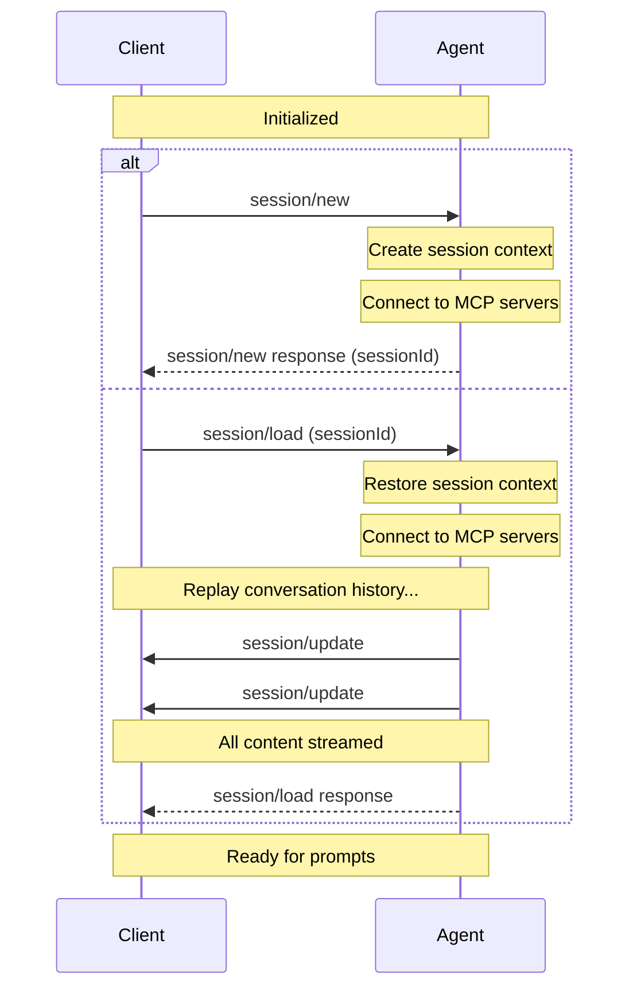
```mermaid theme={null}
sequenceDiagram
    participant Client
    participant Agent

    Note over Agent,Client: Initialized

    alt
        Client->>Agent: session/new
        Note over Agent: Create session context
        Note over Agent: Connect to MCP servers
        Agent-->>Client: session/new response (sessionId)
    else
        Client->>Agent: session/load (sessionId)
        Note over Agent: Restore session context
        Note over Agent: Connect to MCP servers
        Note over Agent,Client: Replay conversation history...
        Agent->>Client: session/update
        Agent->>Client: session/update
        Note over Agent,Client: All content streamed
        Agent-->>Client: session/load response
    end

    Note over Client,Agent: Ready for prompts
```

<br />

## Creating a Session

Clients create a new session by calling the `session/new` method with:

* The [working directory](#working-directory) for the session
* A list of [MCP servers](#mcp-servers) the Agent should connect to

```json theme={null}
{
  "jsonrpc": "2.0",
  "id": 1,
  "method": "session/new",
  "params": {
    "cwd": "/home/user/project",
    "mcpServers": [
      {
        "name": "filesystem",
        "command": "/path/to/mcp-server",
        "args": ["--stdio"],
        "env": []
      }
    ]
  }
}
```

The Agent **MUST** respond with a unique [Session ID](#session-id) that identifies this conversation:

```json theme={null}
{
  "jsonrpc": "2.0",
  "id": 1,
  "result": {
    "sessionId": "sess_abc123def456"
  }
}
```

## Loading Sessions

Agents that support the `loadSession` capability allow Clients to resume previous conversations. This feature enables persistence across restarts and sharing sessions between different Client instances.

### Checking Support

Before attempting to load a session, Clients **MUST** verify that the Agent supports this capability by checking the `loadSession` field in the `initialize` response:

```json highlight={7} theme={null}
{
  "jsonrpc": "2.0",
  "id": 0,
  "result": {
    "protocolVersion": 1,
    "agentCapabilities": {
      "loadSession": true
    }
  }
}
```

If `loadSession` is `false` or not present, the Agent does not support loading sessions and Clients **MUST NOT** attempt to call `session/load`.

### Loading a Session

To load an existing session, Clients **MUST** call the `session/load` method with:

* The [Session ID](#session-id) to resume
* [MCP servers](#mcp-servers) to connect to
* The [working directory](#working-directory)

```json theme={null}
{
  "jsonrpc": "2.0",
  "id": 1,
  "method": "session/load",
  "params": {
    "sessionId": "sess_789xyz",
    "cwd": "/home/user/project",
    "mcpServers": [
      {
        "name": "filesystem",
        "command": "/path/to/mcp-server",
        "args": ["--mode", "filesystem"],
        "env": []
      }
    ]
  }
}
```

The Agent **MUST** replay the entire conversation to the Client in the form of `session/update` notifications (like `session/prompt`).

For example, a user message from the conversation history:

```json theme={null}
{
  "jsonrpc": "2.0",
  "method": "session/update",
  "params": {
    "sessionId": "sess_789xyz",
    "update": {
      "sessionUpdate": "user_message_chunk",
      "content": {
        "type": "text",
        "text": "What's the capital of France?"
      }
    }
  }
}
```

Followed by the agent's response:

```json theme={null}
{
  "jsonrpc": "2.0",
  "method": "session/update",
  "params": {
    "sessionId": "sess_789xyz",
    "update": {
      "sessionUpdate": "agent_message_chunk",
      "content": {
        "type": "text",
        "text": "The capital of France is Paris."
      }
    }
  }
}
```

When **all** the conversation entries have been streamed to the Client, the Agent **MUST** respond to the original `session/load` request.

```json theme={null}
{
  "jsonrpc": "2.0",
  "id": 1,
  "result": null
}
```

The Client can then continue sending prompts as if the session was never interrupted.

## Session ID

The session ID returned by `session/new` is a unique identifier for the conversation context.

Clients use this ID to:

* Send prompt requests via `session/prompt`
* Cancel ongoing operations via `session/cancel`
* Load previous sessions via `session/load` (if the Agent supports the `loadSession` capability)

## Working Directory

The `cwd` (current working directory) parameter establishes the file system context for the session. This directory:

* **MUST** be an absolute path
* **MUST** be used for the session regardless of where the Agent subprocess was spawned
* **SHOULD** serve as a boundary for tool operations on the file system

## MCP Servers

The [Model Context Protocol (MCP)](https://modelcontextprotocol.io) allows Agents to access external tools and data sources. When creating a session, Clients **MAY** include connection details for MCP servers that the Agent should connect to.

MCP servers can be connected to using different transports. All Agents **MUST** support the stdio transport, while HTTP and SSE transports are optional capabilities that can be checked during initialization.

While they are not required to by the spec, new Agents **SHOULD** support the HTTP transport to ensure compatibility with modern MCP servers.

### Transport Types

#### Stdio Transport

All Agents **MUST** support connecting to MCP servers via stdio (standard input/output). This is the default transport mechanism.

<ParamField type="string">
  A human-readable identifier for the server
</ParamField>

<ParamField type="string">
  The absolute path to the MCP server executable
</ParamField>

<ParamField type="array">
  Command-line arguments to pass to the server
</ParamField>

<ParamField type="EnvVariable[]">
  Environment variables to set when launching the server

  <Expandable title="EnvVariable">
    <ParamField type="string">
      The name of the environment variable.
    </ParamField>

    <ParamField type="string">
      The value of the environment variable.
    </ParamField>
  </Expandable>
</ParamField>

Example stdio transport configuration:

```json theme={null}
{
  "name": "filesystem",
  "command": "/path/to/mcp-server",
  "args": ["--stdio"],
  "env": [
    {
      "name": "API_KEY",
      "value": "secret123"
    }
  ]
}
```

#### HTTP Transport

When the Agent supports `mcpCapabilities.http`, Clients can specify MCP servers configurations using the HTTP transport.

<ParamField type="string">
  Must be `"http"` to indicate HTTP transport
</ParamField>

<ParamField type="string">
  A human-readable identifier for the server
</ParamField>

<ParamField type="string">
  The URL of the MCP server
</ParamField>

<ParamField type="HttpHeader[]">
  HTTP headers to include in requests to the server

  <Expandable title="HttpHeader">
    <ParamField type="string">
      The name of the HTTP header.
    </ParamField>

    <ParamField type="string">
      The value to set for the HTTP header.
    </ParamField>
  </Expandable>
</ParamField>

Example HTTP transport configuration:

```json theme={null}
{
  "type": "http",
  "name": "api-server",
  "url": "https://api.example.com/mcp",
  "headers": [
    {
      "name": "Authorization",
      "value": "Bearer token123"
    },
    {
      "name": "Content-Type",
      "value": "application/json"
    }
  ]
}
```

#### SSE Transport

When the Agent supports `mcpCapabilities.sse`, Clients can specify MCP servers configurations using the SSE transport.

<Warning>This transport was deprecated by the MCP spec.</Warning>

<ParamField type="string">
  Must be `"sse"` to indicate SSE transport
</ParamField>

<ParamField type="string">
  A human-readable identifier for the server
</ParamField>

<ParamField type="string">
  The URL of the SSE endpoint
</ParamField>

<ParamField type="HttpHeader[]">
  HTTP headers to include when establishing the SSE connection

  <Expandable title="HttpHeader">
    <ParamField type="string">
      The name of the HTTP header.
    </ParamField>

    <ParamField type="string">
      The value to set for the HTTP header.
    </ParamField>
  </Expandable>
</ParamField>

Example SSE transport configuration:

```json theme={null}
{
  "type": "sse",
  "name": "event-stream",
  "url": "https://events.example.com/mcp",
  "headers": [
    {
      "name": "X-API-Key",
      "value": "apikey456"
    }
  ]
}
```

### Checking Transport Support

Before using HTTP or SSE transports, Clients **MUST** verify the Agent's capabilities during initialization:

```json highlight={7-10} theme={null}
{
  "jsonrpc": "2.0",
  "id": 0,
  "result": {
    "protocolVersion": 1,
    "agentCapabilities": {
      "mcpCapabilities": {
        "http": true,
        "sse": true
      }
    }
  }
}
```

If `mcpCapabilities.http` is `false` or not present, the Agent does not support HTTP transport.
If `mcpCapabilities.sse` is `false` or not present, the Agent does not support SSE transport.

Agents **SHOULD** connect to all MCP servers specified by the Client.

Clients **MAY** use this ability to provide tools directly to the underlying language model by including their own MCP server.


# Slash Commands
Source: https://agentclientprotocol.com/protocol/slash-commands

Advertise available slash commands to clients

Agents can advertise a set of slash commands that users can invoke. These commands provide quick access to specific agent capabilities and workflows. Commands are run as part of regular [prompt](./prompt-turn) requests where the Client includes the command text in the prompt.

## Advertising commands

After creating a session, the Agent **MAY** send a list of available commands via the `available_commands_update` session notification:

```json theme={null}
{
  "jsonrpc": "2.0",
  "method": "session/update",
  "params": {
    "sessionId": "sess_abc123def456",
    "update": {
      "sessionUpdate": "available_commands_update",
      "availableCommands": [
        {
          "name": "web",
          "description": "Search the web for information",
          "input": {
            "hint": "query to search for"
          }
        },
        {
          "name": "test",
          "description": "Run tests for the current project"
        },
        {
          "name": "plan",
          "description": "Create a detailed implementation plan",
          "input": {
            "hint": "description of what to plan"
          }
        }
      ]
    }
  }
}
```

<ResponseField name="availableCommands" type="AvailableCommand[]">
  The list of commands available in this session
</ResponseField>

### AvailableCommand

<ResponseField name="name" type="string">
  The command name (e.g., "web", "test", "plan")
</ResponseField>

<ResponseField name="description" type="string">
  Human-readable description of what the command does
</ResponseField>

<ResponseField name="input" type="AvailableCommandInput">
  Optional input specification for the command
</ResponseField>

### AvailableCommandInput

Currently supports unstructured text input:

<ResponseField name="hint" type="string">
  A hint to display when the input hasn't been provided yet
</ResponseField>

## Dynamic updates

The Agent can update the list of available commands at any time during a session by sending another `available_commands_update` notification. This allows commands to be added based on context, removed when no longer relevant, or modified with updated descriptions.

## Running commands

Commands are included as regular user messages in prompt requests:

```json theme={null}
{
  "jsonrpc": "2.0",
  "id": 3,
  "method": "session/prompt",
  "params": {
    "sessionId": "sess_abc123def456",
    "prompt": [
      {
        "type": "text",
        "text": "/web agent client protocol"
      }
    ]
  }
}
```

The Agent recognizes the command prefix and processes it accordingly. Commands may be accompanied by any other user message content types (images, audio, etc.) in the same prompt array.


# Terminals
Source: https://agentclientprotocol.com/protocol/terminals

Executing and managing terminal commands

The terminal methods allow Agents to execute shell commands within the Client's environment. These methods enable Agents to run build processes, execute scripts, and interact with command-line tools while providing real-time output streaming and process control.

## Checking Support

Before attempting to use terminal methods, Agents **MUST** verify that the Client supports this capability by checking the [Client Capabilities](./initialization#client-capabilities) field in the `initialize` response:

```json highlight={7} theme={null}
{
  "jsonrpc": "2.0",
  "id": 0,
  "result": {
    "protocolVersion": 1,
    "clientCapabilities": {
      "terminal": true
    }
  }
}
```

If `terminal` is `false` or not present, the Agent **MUST NOT** attempt to call any terminal methods.

## Executing Commands

The `terminal/create` method starts a command in a new terminal:

```json theme={null}
{
  "jsonrpc": "2.0",
  "id": 5,
  "method": "terminal/create",
  "params": {
    "sessionId": "sess_abc123def456",
    "command": "npm",
    "args": ["test", "--coverage"],
    "env": [
      {
        "name": "NODE_ENV",
        "value": "test"
      }
    ],
    "cwd": "/home/user/project",
    "outputByteLimit": 1048576
  }
}
```

<ParamField type="SessionId">
  The [Session ID](./session-setup#session-id) for this request
</ParamField>

<ParamField type="string">
  The command to execute
</ParamField>

<ParamField type="string[]">
  Array of command arguments
</ParamField>

<ParamField type="EnvVariable[]">
  Environment variables for the command.

  Each variable has:

  * `name`: The environment variable name
  * `value`: The environment variable value
</ParamField>

<ParamField type="string">
  Working directory for the command (absolute path)
</ParamField>

<ParamField type="number">
  Maximum number of output bytes to retain. Once exceeded, earlier output is
  truncated to stay within this limit.

  When the limit is exceeded, the Client truncates from the beginning of the output
  to stay within the limit.

  The Client **MUST** ensure truncation happens at a character boundary to maintain valid
  string output, even if this means the retained output is slightly less than the
  specified limit.
</ParamField>

The Client returns a Terminal ID immediately without waiting for completion:

```json theme={null}
{
  "jsonrpc": "2.0",
  "id": 5,
  "result": {
    "terminalId": "term_xyz789"
  }
}
```

This allows the command to run in the background while the Agent performs other operations.

After creating the terminal, the Agent can use the `terminal/wait_for_exit` method to wait for the command to complete.

<Note>
  The Agent **MUST** release the terminal using `terminal/release` when it's no
  longer needed.
</Note>

## Embedding in Tool Calls

Terminals can be embedded directly in [tool calls](./tool-calls) to provide real-time output to users:

```json theme={null}
{
  "jsonrpc": "2.0",
  "method": "session/update",
  "params": {
    "sessionId": "sess_abc123def456",
    "update": {
      "sessionUpdate": "tool_call",
      "toolCallId": "call_002",
      "title": "Running tests",
      "kind": "execute",
      "status": "in_progress",
      "content": [
        {
          "type": "terminal",
          "terminalId": "term_xyz789"
        }
      ]
    }
  }
}
```

When a terminal is embedded in a tool call, the Client displays live output as it's generated and continues to display it even after the terminal is released.

## Getting Output

The `terminal/output` method retrieves the current terminal output without waiting for the command to complete:

```json theme={null}
{
  "jsonrpc": "2.0",
  "id": 6,
  "method": "terminal/output",
  "params": {
    "sessionId": "sess_abc123def456",
    "terminalId": "term_xyz789"
  }
}
```

The Client responds with the current output and exit status (if the command has finished):

```json theme={null}
{
  "jsonrpc": "2.0",
  "id": 6,
  "result": {
    "output": "Running tests...\n✓ All tests passed (42 total)\n",
    "truncated": false,
    "exitStatus": {
      "exitCode": 0,
      "signal": null
    }
  }
}
```

<ResponseField name="output" type="string">
  The terminal output captured so far
</ResponseField>

<ResponseField name="truncated" type="boolean">
  Whether the output was truncated due to byte limits
</ResponseField>

<ResponseField name="exitStatus" type="TerminalExitStatus">
  Present only if the command has exited. Contains:

  * `exitCode`: The process exit code (may be null)
  * `signal`: The signal that terminated the process (may be null)
</ResponseField>

## Waiting for Exit

The `terminal/wait_for_exit` method returns once the command completes:

```json theme={null}
{
  "jsonrpc": "2.0",
  "id": 7,
  "method": "terminal/wait_for_exit",
  "params": {
    "sessionId": "sess_abc123def456",
    "terminalId": "term_xyz789"
  }
}
```

The Client responds once the command exits:

```json theme={null}
{
  "jsonrpc": "2.0",
  "id": 7,
  "result": {
    "exitCode": 0,
    "signal": null
  }
}
```

<ResponseField name="exitCode" type="number">
  The process exit code (may be null if terminated by signal)
</ResponseField>

<ResponseField name="signal" type="string">
  The signal that terminated the process (may be null if exited normally)
</ResponseField>

## Killing Commands

The `terminal/kill` method terminates a command without releasing the terminal:

```json theme={null}
{
  "jsonrpc": "2.0",
  "id": 8,
  "method": "terminal/kill",
  "params": {
    "sessionId": "sess_abc123def456",
    "terminalId": "term_xyz789"
  }
}
```

After killing a command, the terminal remains valid and can be used with:

* `terminal/output` to get the final output
* `terminal/wait_for_exit` to get the exit status

The Agent **MUST** still call `terminal/release` when it's done using it.

### Building a Timeout

Agents can implement command timeouts by combining terminal methods:

1. Create a terminal with `terminal/create`
2. Start a timer for the desired timeout duration
3. Concurrently wait for either the timer to expire or `terminal/wait_for_exit` to return
4. If the timer expires first:
   * Call `terminal/kill` to terminate the command
   * Call `terminal/output` to retrieve any final output
   * Include the output in the response to the model
5. Call `terminal/release` when done

## Releasing Terminals

The `terminal/release` kills the command if still running and releases all resources:

```json theme={null}
{
  "jsonrpc": "2.0",
  "id": 9,
  "method": "terminal/release",
  "params": {
    "sessionId": "sess_abc123def456",
    "terminalId": "term_xyz789"
  }
}
```

After release the terminal ID becomes invalid for all other `terminal/*` methods.

If the terminal was added to a tool call, the client **SHOULD** continue to display its output after release.


# Tool Calls
Source: https://agentclientprotocol.com/protocol/tool-calls

How Agents report tool call execution

Tool calls represent actions that language models request Agents to perform during a [prompt turn](./prompt-turn). When an LLM determines it needs to interact with external systems—like reading files, running code, or fetching data—it generates tool calls that the Agent executes on its behalf.

Agents report tool calls through [`session/update`](./prompt-turn#3-agent-reports-output) notifications, allowing Clients to display real-time progress and results to users.

While Agents handle the actual execution, they may leverage Client capabilities like [permission requests](#requesting-permission) or [file system access](./file-system) to provide a richer, more integrated experience.

## Creating

When the language model requests a tool invocation, the Agent **SHOULD** report it to the Client:

```json theme={null}
{
  "jsonrpc": "2.0",
  "method": "session/update",
  "params": {
    "sessionId": "sess_abc123def456",
    "update": {
      "sessionUpdate": "tool_call",
      "toolCallId": "call_001",
      "title": "Reading configuration file",
      "kind": "read",
      "status": "pending"
    }
  }
}
```

<ParamField type="ToolCallId">
  A unique identifier for this tool call within the session
</ParamField>

<ParamField type="string">
  A human-readable title describing what the tool is doing
</ParamField>

<ParamField type="ToolKind">
  The category of tool being invoked.

  <Expandable title="kinds">
    * `read` - Reading files or data - `edit` - Modifying files or content -
      `delete` - Removing files or data - `move` - Moving or renaming files -
      `search` - Searching for information - `execute` - Running commands or code -
      `think` - Internal reasoning or planning - `fetch` - Retrieving external data
    * `other` - Other tool types (default)
  </Expandable>

  Tool kinds help Clients choose appropriate icons and optimize how they display tool execution progress.
</ParamField>

<ParamField type="ToolCallStatus">
  The current [execution status](#status) (defaults to `pending`)
</ParamField>

<ParamField type="ToolCallContent[]">
  [Content produced](#content) by the tool call
</ParamField>

<ParamField type="ToolCallLocation[]">
  [File locations](#following-the-agent) affected by this tool call
</ParamField>

<ParamField type="object">
  The raw input parameters sent to the tool
</ParamField>

<ParamField type="object">
  The raw output returned by the tool
</ParamField>

## Updating

As tools execute, Agents send updates to report progress and results.

Updates use the `session/update` notification with `tool_call_update`:

```json theme={null}
{
  "jsonrpc": "2.0",
  "method": "session/update",
  "params": {
    "sessionId": "sess_abc123def456",
    "update": {
      "sessionUpdate": "tool_call_update",
      "toolCallId": "call_001",
      "status": "in_progress",
      "content": [
        {
          "type": "content",
          "content": {
            "type": "text",
            "text": "Found 3 configuration files..."
          }
        }
      ]
    }
  }
}
```

All fields except `toolCallId` are optional in updates. Only the fields being changed need to be included.

## Requesting Permission

The Agent **MAY** request permission from the user before executing a tool call by calling the `session/request_permission` method:

```json theme={null}
{
  "jsonrpc": "2.0",
  "id": 5,
  "method": "session/request_permission",
  "params": {
    "sessionId": "sess_abc123def456",
    "toolCall": {
      "toolCallId": "call_001"
    },
    "options": [
      {
        "optionId": "allow-once",
        "name": "Allow once",
        "kind": "allow_once"
      },
      {
        "optionId": "reject-once",
        "name": "Reject",
        "kind": "reject_once"
      }
    ]
  }
}
```

<ParamField type="SessionId">
  The session ID for this request
</ParamField>

<ParamField type="ToolCallUpdate">
  The tool call update containing details about the operation
</ParamField>

<ParamField type="PermissionOption[]">
  Available [permission options](#permission-options) for the user to choose
  from
</ParamField>

The Client responds with the user's decision:

```json theme={null}
{
  "jsonrpc": "2.0",
  "id": 5,
  "result": {
    "outcome": {
      "outcome": "selected",
      "optionId": "allow-once"
    }
  }
}
```

Clients **MAY** automatically allow or reject permission requests according to the user settings.

If the current prompt turn gets [cancelled](./prompt-turn#cancellation), the Client **MUST** respond with the `"cancelled"` outcome:

```json theme={null}
{
  "jsonrpc": "2.0",
  "id": 5,
  "result": {
    "outcome": {
      "outcome": "cancelled"
    }
  }
}
```

<ResponseField name="outcome" type="RequestPermissionOutcome">
  The user's decision, either: - `cancelled` - The [prompt turn was
  cancelled](./prompt-turn#cancellation) - `selected` with an `optionId` - The
  ID of the selected permission option
</ResponseField>

### Permission Options

Each permission option provided to the Client contains:

<ParamField type="string">
  Unique identifier for this option
</ParamField>

<ParamField type="string">
  Human-readable label to display to the user
</ParamField>

<ParamField type="PermissionOptionKind">
  A hint to help Clients choose appropriate icons and UI treatment for each option.

  * `allow_once` - Allow this operation only this time
  * `allow_always` - Allow this operation and remember the choice
  * `reject_once` - Reject this operation only this time
  * `reject_always` - Reject this operation and remember the choice
</ParamField>

## Status

Tool calls progress through different statuses during their lifecycle:

<ResponseField name="pending">
  The tool call hasn't started running yet because the input is either streaming
  or awaiting approval
</ResponseField>

<ResponseField name="in_progress">
  The tool call is currently running
</ResponseField>

<ResponseField name="completed">
  The tool call completed successfully
</ResponseField>

<ResponseField name="failed">The tool call failed with an error</ResponseField>

## Content

Tool calls can produce different types of content:

### Regular Content

Standard [content blocks](./content) like text, images, or resources:

```json theme={null}
{
  "type": "content",
  "content": {
    "type": "text",
    "text": "Analysis complete. Found 3 issues."
  }
}
```

### Diffs

File modifications shown as diffs:

```json theme={null}
{
  "type": "diff",
  "path": "/home/user/project/src/config.json",
  "oldText": "{\n  \"debug\": false\n}",
  "newText": "{\n  \"debug\": true\n}"
}
```

<ParamField type="string">
  The absolute file path being modified
</ParamField>

<ParamField type="string">
  The original content (null for new files)
</ParamField>

<ParamField type="string">
  The new content after modification
</ParamField>

### Terminals

Live terminal output from command execution:

```json theme={null}
{
  "type": "terminal",
  "terminalId": "term_xyz789"
}
```

<ParamField type="string">
  The ID of a terminal created with `terminal/create`
</ParamField>

When a terminal is embedded in a tool call, the Client displays live output as it's generated and continues to display it even after the terminal is released.

<Card icon="terminal" href="./terminals">
  Learn more about Terminals
</Card>

## Following the Agent

Tool calls can report file locations they're working with, enabling Clients to implement "follow-along" features that track which files the Agent is accessing or modifying in real-time.

```json theme={null}
{
  "path": "/home/user/project/src/main.py",
  "line": 42
}
```

<ParamField type="string">
  The absolute file path being accessed or modified
</ParamField>

<ParamField type="number">
  Optional line number within the file
</ParamField>


# Transports
Source: https://agentclientprotocol.com/protocol/transports

Mechanisms for agents and clients to communicate with each other

ACP uses JSON-RPC to encode messages. JSON-RPC messages **MUST** be UTF-8 encoded.

The protocol currently defines the following transport mechanisms for agent-client communication:

1. [stdio](#stdio), communication over standard in and standard out
2. *[Streamable HTTP](#streamable-http) (draft proposal in progress)*

Agents and clients **SHOULD** support stdio whenever possible.

It is also possible for agents and clients to implement [custom transports](#custom-transports).

## stdio

In the **stdio** transport:

* The client launches the agent as a subprocess.
* The agent reads JSON-RPC messages from its standard input (`stdin`) and sends messages to its standard output (`stdout`).
* Messages are individual JSON-RPC requests, notifications, or responses.
* Messages are delimited by newlines (`\n`), and **MUST NOT** contain embedded newlines.
* The agent **MAY** write UTF-8 strings to its standard error (`stderr`) for logging purposes. Clients **MAY** capture, forward, or ignore this logging.
* The agent **MUST NOT** write anything to its `stdout` that is not a valid ACP message.
* The client **MUST NOT** write anything to the agent's `stdin` that is not a valid ACP message.

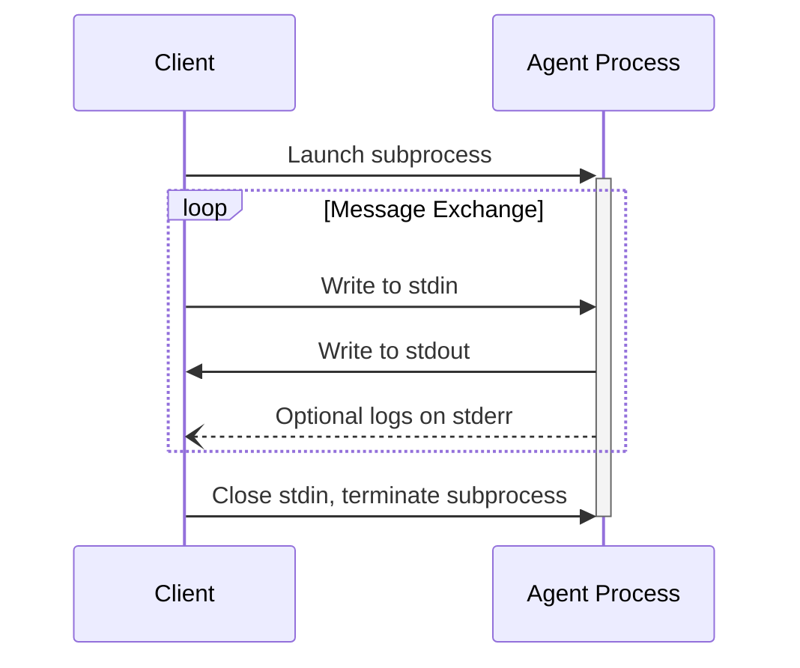
```mermaid theme={null}
sequenceDiagram
    participant Client
    participant Agent Process

    Client->>+Agent Process: Launch subprocess
    loop Message Exchange
        Client->>Agent Process: Write to stdin
        Agent Process->>Client: Write to stdout
        Agent Process--)Client: Optional logs on stderr
    end
    Client->>Agent Process: Close stdin, terminate subprocess
    deactivate Agent Process
```

## *Streamable HTTP*

*In discussion, draft proposal in progress.*

## Custom Transports

Agents and clients **MAY** implement additional custom transport mechanisms to suit their specific needs. The protocol is transport-agnostic and can be implemented over any communication channel that supports bidirectional message exchange.

Implementers who choose to support custom transports **MUST** ensure they preserve the JSON-RPC message format and lifecycle requirements defined by ACP. Custom transports **SHOULD** document their specific connection establishment and message exchange patterns to aid interoperability.


# Requests for Dialog (RFDs)
Source: https://agentclientprotocol.com/rfds/about

Our process for introducing changes to the protocol

A "Request for Dialog" (RFD) is ACP's version of the RFC process. RFDs are the primary mechanism for proposing new features, collecting community input on an issue, and documenting design decisions.

## When to write an RFD

You should consider writing an RFD if you intend to make a "substantial" change to ACP or its documentation. What constitutes a "substantial" change is evolving based on community norms and varies depending on what part of the ecosystem you are proposing to change.

Some changes do not require an RFD:

* Rephrasing, reorganizing or refactoring
* Addition or removal of warnings
* Additions that strictly improve objective, numerical quality criteria (speedup, better browser support)
* Fixing objectively incorrect behavior

## The RFD Process

### 1. Propose by opening a PR

[Fork the repo](https://github.com/agentclientprotocol/agent-client-protocol) and copy `docs/rfds/TEMPLATE.md` to `docs/rfds/my-feature.md` (using kebab-case naming). The RFD can start minimal - just an elevator pitch and status quo are enough to begin dialog. Pull requests become the discussion forum where ideas get refined through collaborative iteration.

### 2. Merge to "Draft" when championed

RFD proposals are merged into the "Draft" section if a core team member decides to champion them. The champion becomes the point-of-contact and will work with authors to make it reality. Once in draft, implementation may begin (properly feature-gated with the RFD name). Implementation can also begin at a particular SDK or agent/client level to prove out the design for better review and feedback before broader adoption.

RFDs are living documents that track implementation progress. PRs working towards an RFC will typically update it to reflect changes in design or direction.

### 2b. Move to "To be removed"

RFDs that have never landed may be closed at the discretion of a core team member. RFDs that have landed in draft form are moved to "To be removed" instead until there has been time to remove them fully from the codebase, then they are removed entirely.

### 3. Move to "Preview" when fully implemented

When the champion feels the RFD is ready for broader review, they open a PR to move it to "Preview." This signals the community to provide feedback. The PR stays open for a few days before the champion decides whether to land it.

### 4. Completed

Once in preview, the RFD can be moved to "completed" with a final PR. The core team should comment and express concerns, but **final decision is always made by the core team lead**. Depending on what the RFD is about, "completed" is the only state that can represent a 1-way door (if there is a stability commitment involved), as changes might require a breaking change to the protocol after this point.

Preview RFDs don't have to be completed. They may also go back to draft to await further changes or even be moved to "To be removed".

### 5. Implementation and completion

#### RFD Lifecycle

* **Early drafts**: Initial ideas, brainstorming, early exploration
* **Mature drafts**: Well-formed proposals ready for broader review
* **Accepted**: Approved for implementation, may reference implementation work
* **To be removed (yet?)**: Decided against for now, but preserved for future consideration
* **Completed**: Implementation finished and merged

## Governance

The project currently has a design team with the [Zed team as the lead (BDFL)](../community/governance). Champions from the core team guide RFDs through the process, but final decisions rest with the team lead. This structure maintains velocity while anticipating future governance expansion.

## Discussion and Moderation

Detailed discussions often happen on [Zulip](https://agentclientprotocol.zulipchat.com/), with PR comments for process decisions. The results of detailed discussions should be incorporated into the relevant RFD. RFD champions actively curate discussions by collecting questions in the FAQ section. If PR discussions become too long, they should be closed, feedback summarized, and reopened with links to the original.

## Licensing

All RFDs are licensed under Apache 2.0. The project remains open source.

##


# ACP Agent Registry
Source: https://agentclientprotocol.com/rfds/acp-agent-registry


**Author:** [@ignatov](https://github.com/ignatov)
**Champion:** [@benbrandt](https://github.com/benbrandt)

## Elevator pitch

ACP needs a single, trusted registry of agents so clients can discover integrations, understand their capabilities, and configure them automatically. This RFD proposes (1) a canonical manifest format that every agent must publish, (2) a dedicated `agentclientprotocol/registry` repo where maintainers contribute those manifests, and (3) tooling that aggregates and publishes a searchable catalog for editors and other clients.

## Status quo

There is no canonical listing of ACP-compatible agents. Information lives in scattered READMEs or proprietary feeds, which makes it hard to:

* Let users discover agents directly inside ACP-aware clients.
* Ensure protocol-version compatibility or capability coverage.
* Keep metadata consistent (auth requirements, hosting model, license, etc.).

Every editor builds bespoke manifests or scrapes GitHub, leading to duplication and stale data.

## Agent manifest format (core proposal)

Each agent advertises itself via `agent.json` stored under `<id>/` in the registry repo. JSONC keeps things close to ACP’s JSON-centric schemas while remaining human-friendly during authoring. Fields (required unless noted):

| Field            | Description                                                                                                                                                                                                                                                                                                                                            |
| ---------------- | ------------------------------------------------------------------------------------------------------------------------------------------------------------------------------------------------------------------------------------------------------------------------------------------------------------------------------------------------------ |
| `id`             | Lowercase slug, unique across registry (also the folder name).                                                                                                                                                                                                                                                                                         |
| `name`           | Human-readable label.                                                                                                                                                                                                                                                                                                                                  |
| `version`        | Agent release version surfaced to users.                                                                                                                                                                                                                                                                                                               |
| `schema_version` | Semver of the manifest schema. Allows future breaking changes.                                                                                                                                                                                                                                                                                         |
| `description`    | Description of the agent's functionality and purpose.                                                                                                                                                                                                                                                                                                  |
| `homepage`       | URL for docs/marketing.                                                                                                                                                                                                                                                                                                                                |
| `repository`     | Source repository URL.                                                                                                                                                                                                                                                                                                                                 |
| `authors`        | Array of author/organization names (mirrors `authors` in the TOML example).                                                                                                                                                                                                                                                                            |
| `license`        | Licence (string).                                                                                                                                                                                                                                                                                                                                      |
| `capabilities`   | Array of ACP method names implemented (e.g. `["terminal/new","files/read"]`).                                                                                                                                                                                                                                                                          |
| `auth`           | Array of auth options for authentication. This is the trickiest part of the schema.                                                                                                                                                                                                                                                                    |
| `distribution`   | Object mapping target platforms to download/execution info. Each target key follows `<os>-<arch>` format (e.g., `darwin-aarch64`, `linux-x86_64`, `windows-x86_64`). Each target specifies `archive` (download URL), `cmd` (executable path), optional `args` (array of command-line arguments), and optional `env` (object of environment variables). |

Example skeleton:

```jsonc theme={null}
{
  "id": "someagent",
  "name": "SomeAgent",
  "version": "1.0.0",
  "schema_version": "1",
  "description": "Agent for code editing",
  "homepage": "https://github.com/example/someagent",
  "repository": "https://github.com/example/someagent",
  "authors": ["Example Team"],
  "license": "MIT",
  "capabilities": ["terminal", "fs/read", "fs/write"],
  "auth": [
    {
      "type": "api_key",
    },
  ],
  "distribution": {
    "darwin-aarch64": {
      "archive": "https://github.com/example/someagent/releases/latest/download/someagent-darwin-arm64.zip",
      "cmd": "./someagent",
      "args": ["acp"],
    },
    "darwin-x86_64": {
      "archive": "https://github.com/example/someagent/releases/latest/download/someagent-darwin-x64.zip",
      "cmd": "./someagent",
      "args": ["acp"],
    },
    "linux-aarch64": {
      "archive": "https://github.com/example/someagent/releases/latest/download/someagent-linux-arm64.zip",
      "cmd": "./someagent",
      "args": ["acp"],
    },
    "linux-x86_64": {
      "archive": "https://github.com/example/someagent/releases/latest/download/someagent-linux-x64.zip",
      "cmd": "./someagent",
      "args": ["acp"],
    },
    "windows-x86_64": {
      "archive": "https://github.com/example/someagent/releases/latest/download/someagent-windows-x64.zip",
      "cmd": "./someagent.exe",
      "args": ["acp"],
      "env": {
        "SOMEAGENT_MODE_KEY": "",
      },
    },
  },
}
```

## What we propose to do about it

1. **Manifest spec** (above) becomes normative; we publish the JSON Schema and validator script so maintainers can lint locally.
2. **Registry repository** `github.com/agentclientprotocol/registry`:
   * Structure: `<id>/agent.json`, optional `icon.svg` (or `icon-light.svg` and `icon-dark.svg` for theme-specific variants), optional `README.md`.
   * Icons should be SVG format for scalability. If providing theme-specific icons, both light and dark variants must be included.
   * CI: validate manifests, enforce slug uniqueness, check asset sizes, generate aggregate artifacts.
3. **Aggregated outputs**:
   * `registry.json`: deterministic list of all agents with JSONC stripped.
4. **Distribution & search**:
   * Clients fetch `registry.json` from a pinned release or `https://agentclientprotocol.com/registry.json` or `https://registry.agentclientprotocol.com`.
   * Static site offers filters for capability, protocol version, deployment, auth model, and tags.

## Shiny future

* Agent maintainers make PRs to update their manifests; CI keeps data clean.
* Editors/clients can bootstrap ACP support by fetching one JSON file and filtering locally.
* The ACP website displays the same data for humans, ensuring consistency.
* Protocol-version mismatches are visible immediately; clients can warn or hide incompatible agents.

## Implementation details and plan

**Phase 1 – Spec & repo bootstrap**

* Think about the auth options.
* Finalize JSON Schema and documentation.
* Ask agent developers to contribute their thoughts on the spec.
* Create registry repo with CI (GitHub Actions) that runs validation on PRs.
* Seed with a few reference agents to prove the workflow.

## Revision history

* 2025-11-28: Initial draft.
* 2025-12-16: Minors.


# Agent Telemetry Export
Source: https://agentclientprotocol.com/rfds/agent-telemetry-export


* Author(s): [@codefromthecrypt](https://github.com/codefromthecrypt)
* Champion: [@benbrandt](https://github.com/benbrandt)

## Elevator pitch

> What are you proposing to change?

Define how agents export telemetry (logs, metrics, traces) to clients without tunneling it over the ACP transport. Clients run a local telemetry receiver and pass standard OpenTelemetry environment variables when launching agents. This keeps telemetry out-of-band and enables editors to display agent activity, debug issues, and integrate with observability backends.

## Status quo

> How do things work today and what problems does this cause? Why would we change things?

ACP defines how clients launch agents as subprocesses and communicate over stdio. The [meta-propagation RFD](./meta-propagation) addresses trace context propagation via `params._meta`, enabling trace correlation. However, there is no convention for how agents should export the actual telemetry data (spans, metrics, logs).

Without a standard approach:

1. **No visibility into agent behavior** - Editors cannot display what agents are doing (token usage, tool calls, timing)
2. **Difficult debugging** - When agents fail, there's no structured way to capture diagnostics
3. **Fragmented solutions** - Each agent/client pair invents their own telemetry mechanism
4. **Credential exposure risk** - If agents need to send telemetry directly to backends, they need credentials

Tunneling telemetry over the ACP stdio transport is problematic:

* **Head-of-line blocking** - Telemetry traffic could delay agent messages
* **Implementation burden** - ACP would need to define telemetry message formats
* **Coupling** - Agents would need ACP-specific telemetry code instead of standard SDKs

## What we propose to do about it

> What are you proposing to improve the situation?

Clients that want to receive agent telemetry run a local OTLP (OpenTelemetry Protocol) receiver and inject environment variables when launching agent subprocesses:

```
OTEL_EXPORTER_OTLP_ENDPOINT=http://localhost:4318
OTEL_EXPORTER_OTLP_PROTOCOL=http/protobuf
OTEL_SERVICE_NAME=agent-name
```

Agents using OpenTelemetry SDKs auto-configure from these variables. The client's receiver can:

* Display telemetry in the editor UI (e.g., token counts, timing, errors)
* Forward telemetry to the client's configured observability backend
* Add client-side context before forwarding

This follows the [OpenTelemetry collector deployment pattern](https://opentelemetry.io/docs/collector/deployment/agent/) where a local receiver proxies telemetry to backends.

### Architecture

```
┌────────────────────────────────────────────────────────────┐
│ Client/Editor                                              │
│  ┌──────────────┐    ┌──────────────┐    ┌──────────────┐  │
│  │ ACP Handler  │    │OTLP Receiver │───▶│   Exporter   │  │
│  └──────────────┘    └──────────────┘    └──────────────┘  │
└────────┬─────────────────────▲──────────────────┬──────────┘
         │ stdio               │ HTTP             │
         ▼                     │                  ▼
┌─────────────────────┐        │         ┌───────────────────┐
│ Agent Process       │        │         │ Observability     │
│  ┌──────────────┐   │        │         │ Backend           │
│  │ ACP Agent    │   │        │         └───────────────────┘
│  ├──────────────┤   │        │
│  │ OTEL SDK     │────────────┘
│  └──────────────┘   │
└─────────────────────┘
```

### Discovery

Environment variables must be set before launching the subprocess, but ACP capability exchange happens after connection. Options for discovery:

1. **Optimistic injection** - Clients inject OTEL environment variables unconditionally. Agents without OpenTelemetry support simply ignore them. This is pragmatic since environment variables are low-cost and OTEL SDKs handle misconfiguration gracefully.

2. **Registry metadata** - Agent registries (like the one proposed in PR #289) could include telemetry support in agent manifests, letting clients know ahead of time.

3. **Manual configuration** - Users configure their client to enable telemetry collection for specific agents.

## Shiny future

> How will things will play out once this feature exists?

1. **Editor integration** - Editors can show agent activity: token usage, tool call timing, model switches, errors
2. **Unified debugging** - When agents fail, structured telemetry is available for diagnosis
3. **End-to-end traces** - Combined with `params._meta` trace propagation, traces flow from client through agent to any downstream services
4. **No credential sharing** - Agents never see backend credentials; the client handles authentication
5. **Standard SDKs** - Agent authors use normal OpenTelemetry SDKs that work in any context, not ACP-specific code

## Implementation details

> Tell me more about your implementation. What is your detailed implementation plan?

### 1. Create `docs/protocol/observability.mdx`

Add a new protocol documentation page covering observability practices for ACP. This page will describe:

**For Clients/Editors:**

* Running an OTLP receiver to collect agent telemetry
* Injecting `OTEL_EXPORTER_*` environment variables when launching agent subprocesses
* Respecting user-configured `OTEL_*` variables (do not override if already set)
* Forwarding telemetry to configured backends with client credentials

**For Agent Authors:**

* Using OpenTelemetry SDKs with standard auto-configuration
* Recommended spans, metrics, and log patterns for agent operations
* How telemetry flows when `OTEL_*` variables are present vs absent

### 2. Update `docs/protocol/extensibility.mdx`

Add a section linking to the new observability doc, similar to how extensibility concepts relate to other protocol features. Add a brief mention that observability practices (telemetry export) are documented separately.

### 3. Update `docs/docs.json`

Add `protocol/observability` to the Protocol navigation group.

## Frequently asked questions

> What questions have arisen over the course of authoring this document or during subsequent discussions?

### How does this relate to trace propagation in `params._meta`?

They are complementary:

* **Trace propagation** (`params._meta` with `traceparent`, etc.) passes trace context so spans can be correlated
* **Telemetry export** (this RFD) defines where agents send the actual span/metric/log data

Both are needed for end-to-end observability.

### What if an agent doesn't use OpenTelemetry?

Agents without OTEL SDKs simply ignore the environment variables. No harm is done. Over time, as more agents adopt OpenTelemetry, the ecosystem benefits.

### What if the user already configured `OTEL_*` environment variables?

If `OTEL_*` variables are already set in the environment, clients should not override them. User-configured telemetry settings take precedence, allowing users to direct agent telemetry to their own backends when desired.

### Why not define ACP-specific telemetry messages?

This would duplicate OTLP functionality, add implementation burden to ACP, and force agent authors to use non-standard APIs. Using OTLP means agents work with standard tooling and documentation.

### What about agents that aren't launched as subprocesses?

This RFD focuses on the stdio transport where clients launch agents. For other transports (HTTP, etc.), agents would need alternative configuration mechanisms, which could be addressed in future RFDs.

### What alternative approaches did you consider, and why did you settle on this one?

1. **Tunneling telemetry over ACP** - Rejected due to head-of-line blocking concerns and implementation complexity
2. **Agents export directly to backends** - Rejected because it requires sharing credentials with agents
3. **File-based telemetry** - Rejected because it doesn't support real-time display and adds complexity

The environment variable approach:

* Uses existing standards (OTLP, OpenTelemetry SDK conventions)
* Keeps telemetry out-of-band from ACP messages
* Lets clients control where telemetry goes without exposing credentials
* Requires no changes to ACP message formats

## Revision history

* 2025-12-04: Initial draft


# Authentication Methods
Source: https://agentclientprotocol.com/rfds/auth-methods


Author(s): [anna239](https://github.com/anna239)

## Elevator pitch

> What are you proposing to change?

I suggest adding more information about auth methods that agent supports, which will allow clients to draw more appropriate UI.

## Status quo

> How do things work today and what problems does this cause? Why would we change things?

Agents have different ways of authenticating users: env vars with api keys, running a command like `<agent_name> login`, some just open a browser and use oauth.
[AuthMethod](https://agentclientprotocol.com/protocol/schema#authmethod) does not really tell the client what should be done to authenticate. This means we can't show the user a control for entering key if an agent supports auth through env var.

Very few agents can authenticate fully on their own without user input, so agents with ACP auth support are limited in the methods they can offer, or require manual setup before being run as an ACP agent.

## What we propose to do about it

> What are you proposing to improve the situation?

We can add addition types of AuthMethods, to provide clients with additional information so they can assist in the login process.

## Shiny future

> How will things will play out once this feature exists?

It will be easier for end-users to start using an agent from inside the IDE as auth process will be more straightforward

## Implementation details and plan

> Tell me more about your implementation. What is your detailed implementation plan?

I suggest adding following auth types:

1. Agent auth

Same as what there is now – agent handles the auth itself, this should be a default type if no type is provided for backward compatibility

```json theme={null}
{
  "id": "123",
  "name": "Agent",
  "description": "Authenticate through agent",
  "type": "agent" // Optional/default value
}
```

2. Env variable

A user can enter a key and a client will pass it to the agent as an env variable

```json theme={null}
{
  "id": "123",
  "name": "OpenAI api key",
  "description": "Provide your key",
  "type": "env_var",
  "varName": "OPEN_AI_KEY",
  "link": "OPTIONAL link to a page where user can get their key"
}
```

Since this would need to be supplied to the agent when the process is started, the client can check if it already passed such an env variable to the process, in which case the user can click on the button and the agent will read the already available key.

Otherwise, when the user clicks the button, the client could restart the agent process with the desired env variable, and then automatically send the authenticate message with the correct id to sign in for the user.

3. Terminal Auth

There have been experiments for a "terminal-auth" experience as a fallback. This requires the client to be able to run an interactive terminal for the user to login via a TUI.

```json theme={null}
{
  "id": "123",
  "name": "Run in terminal",
  "description": "Setup Label",
  "type": "terminal",
  "args": ["--setup"],
  "env": { "VAR1": "value1", "VAR2": "value2" }
}
```

The `command` cannot be specified, the client will invoke the exact same binary with the exact same setup. The agent can supply additional arguments and environment variables as necessary. These will be supplied in **addition** to any args/env supplied by default when the server is started. So agents will need to have a way to kickoff their interactive login flow even if normal acp commands/arguments are supplied as well.

This is so that the agent doesn't need to know about the environment it is running in. It can't know the absolute path necessarily, and shouldn't be able to supply other commands or programs to minimize security issues.

### AuthErrors

It might be useful to include a list of AuthMethod ids to the AUTH\_REQUIRED JsonRpc error. Why do we need this if they're already shared during `initialize`:
All supported auth methods are shared during `initialize`. When user starts a session, they've already selected a model, which can narrow down a list of options.

```json theme={null}
{
  "jsonrpc": "2.0",
  "id": 2,
  "error": {
    "code": -32000,
    "message": "Authentication required",
    "authMethods": [
      {
        "id": "chatgpt",
        "name": "Login with ChatGPT",
        "description": "Use your ChatGPT login with Codex CLI (requires a paid ChatGPT subscription)"
      }
    ]
  }
}
```

## Frequently asked questions

> What questions have arisen over the course of authoring this document or during subsequent discussions?

### What alternative approaches did you consider, and why did you settle on this one?

An alternative approach would be to include this information to an agent's declaration making it more static, see [Registry RFD](https://github.com/agentclientprotocol/agent-client-protocol/pull/289)

There is also an alternative to adding a separate `elicitation` capability, which is to create a separate auth type for this. Then the client can decide themselves if they support it or not.

## Revision history

There was a part about elicitations [https://github.com/agentclientprotocol/agent-client-protocol/blob/939ef116a1b14016e4e3808b8764237250afa253/docs/rfds/auth.mdx](https://github.com/agentclientprotocol/agent-client-protocol/blob/939ef116a1b14016e4e3808b8764237250afa253/docs/rfds/auth.mdx) removed it for now, will move to a separate rfd

* 2026-01-14: Updates based on Core Maintainer discussion


# Introduce RFD Process
Source: https://agentclientprotocol.com/rfds/introduce-rfd-process


Author(s): [@benbrandt](https://github.com/benbrandt)

## Elevator pitch

> What are you proposing to change? Bullet points welcome.

Introduce a "Request for Dialog" (RFD) process to replace ad-hoc design discussions with structured, community-friendly design documents that track features from conception to completion.

## Status quo

> How do things work today and what problems does this cause? Why would we change things?

Currently all development is being done primarily by the Zed team tracking requests and proposals from multiple teams. The goal is to create a process that helps to keep files organized and which can scale to participation by an emerging community.

## Shiny future

> How will things will play out once this feature exists?

### Project licensing

All code and RFDs are licensed under an Apache 2.0 license. The project is intended to remain open source and freely available in perpetuity.

### Decision making

For the initial phase, the project shall have a "design team" that consists of the Zed team acting in "BDFL" capacity. The expectation is that the project will setup a more structure governance structure as it grows. The design team makes all decisions regarding RFDs and sets overall project direction.

### RFD lifecycle

#### RFDs are proposed by opening a PR

An RFD begins as a PR adding a new file into the "Draft" section. The RFD can start minimal - just an elevator pitch and status quo are enough to begin dialog. Pull requests become the discussion forum where ideas get refined through collaborative iteration.

As discussion proceeds, the FAQ of the RFD should be extended. If discussion has been going long enough, the PR should be closed, feedback summarized, and then re-opened with a link to the original PR.

#### The PR is merged into "draft" once a core team member decides to champion it

RFD proposals are merged into the "draft" section if a core team member decides to champion them. The champion is then the point-of-contact for that proposal going forward and they will work with the proposal authors and others to make it reality. Core team members do not need to seek consensus to merge a proposal into the draft, but they should listen carefully to concerns from other core team members, as it will be difficult to move the RFD forward if those concerns are not ultimately addressed.

Once a proposal is moved to draft, code and implementation may begin to land into the PR. This work needs to be properly feature gated and marked with the name of the RFD.

Further discussion on the RFD can take place on [Zulip](https://agentclientprotocol.zulipchat.com/) if needed.

#### Moving to the "preview" section

Once the champion feels the RFD is ready for others to check it out, they can open a PR to move the file to the preview section. This is a signal to the community (and particularly other core team members) to check out the proposal and see what they think. The PR should stay open for "a few days" to give people an opportunity to leave feedback. The champion is empowered to decide whether to land the PR. As ever, all new feedback should be recorded in the FAQ section.

#### Deciding to accept an RFD

When they feel the RFD is ready to be completed, the champion requests review by the team. The team can raise concerns and notes during discussion. Final decision on an RFD is made by the core team lead.

#### Implementation of an RFD

Once accepted, RFDs become living documents that track implementation progress. Status badges in design documentation link back to the relevant RFD, creating a clear connection between "why we're building this" and "how it works." When building code with an agent, agents should read RFDs during implementation to understand design rationale and update them with implementation progress.

### Moderating and managing RFD discussions

Moving RFDs between points in the cycle involve opening PRs. Those PRs will be places to hold dialog and discussion -- but not the only place, we expect more detailed discussions to take place on [Zulip](https://agentclientprotocol.zulipchat.com/) or other communication channels. RFD owners and champions should actively "curate" discussions by collecting questions that come up and ensuring they are covered in the FAQ. Duplicate questions can be directed to the FAQ.

If the discussion on the PR gets to the point where Github begins to hide comments, the PR should typically be closed, feedback collected, and then re-opened.

## Implementation plan

> What is your implementation plan?

* ✅ Create RFD infrastructure (about, TEMPLATE, navigation setup)
* ✅ Establish lifecycle: Draft → Preview → Accepted → Completed
* ⏳ Write RFDs for major in-progress features

## Frequently asked questions

### Why "Request for Dialog" and not "Request for Comment"?

Well, partly because "dialog" emphasizes conversation and exploration rather than just collecting feedback on a predetermined design. We also shamelessly stole this process from [Niko Matsakis and the Symposium project](https://symposium-dev.github.io/symposium/rfds/index.html) (with permission) so that we could benefit from their experience.

## Revision history

* 2025-10-28: Initial version, created alongside RFD infrastructure


# MCP-over-ACP: MCP Transport via ACP Channels
Source: https://agentclientprotocol.com/rfds/mcp-over-acp


Author(s): [nikomatsakis](https://github.com/nikomatsakis)

## Elevator pitch

> What are you proposing to change?

Add support for MCP servers that communicate over ACP channels instead of stdio or HTTP. This enables any ACP component to provide MCP tools and handle callbacks through the existing ACP connection, without spawning separate processes or managing additional transports.

## Status quo

> How do things work today and what problems does this cause? Why would we change things?

ACP and MCP each solve different halves of the problem of interacting with an agent. ACP stands in "front" of the agent, managing sessions, sending prompts, and receiving responses. MCP stands "behind" the agent, providing tools that the agent can use to do its work.

Many applications would benefit from being able to be both "in front" of the agent and "behind" it. This would allow a client, for example, to create custom MCP tools that are tailored to a specific request and which live in the client's address space.

The only way to combine ACP and MCP today is to use some sort of "backdoor", such as opening an HTTP port for the agent to connect to or providing a binary that communicates with IPC. This is inconvenient to implement but also means that clients cannot be properly abstracted and sandboxed, as some of the communication with the agent is going through side channels. Imagine trying to host an ACP component (client, agent, or [agent extension](./proxy-chains.mdx)) that runs in a WASM sandbox or even on another machine: for that to work, the ACP protocol has to encompass all of the relevant interactions so that messages can be transmitted properly.

## What we propose to do about it

> What are you proposing to improve the situation?

We propose adding `"acp"` as a new MCP transport type. When an ACP component (client or proxy) adds an MCP server with ACP transport to a session, tool invocations for that server are routed back through the ACP channel to the component that provided it.

This enables patterns like:

* A **client** that injects project-aware tools into every session and handles callbacks directly
* An **[agent extension](./proxy-chains.mdx)** that adds context-aware tools based on the conversation state
* A **bridge** that translates ACP-transport MCP servers to stdio for agents that don't support native ACP transport

### How it works

When the client connects, the agent advertises MCP-over-ACP support via `mcpCapabilities.acp` in its `InitializeResponse`. If supported, the client can add MCP servers to a `session/new` request with `"transport": "acp"` and an `id` that identifies the server:

```json theme={null}
{
  "tools": {
    "mcpServers": {
      "project-tools": {
        "transport": "acp",
        "id": "550e8400-e29b-41d4-a716-446655440000"
      }
    }
  }
}
```

The `id` is generated by the component providing the MCP server.

When the agent connects to the MCP server, an `mcp/connect` message is sent with the MCP server's `id`. This returns a fresh `connectionId`. MCP messages are then sent back and forth using `mcp/message` requests. Finally, `mcp/disconnect` signals that the connection is closing.

### Bridging and compatibility

Existing agents don't support ACP transport for MCP servers. To bridge this gap, a wrapper component can translate between ACP-transport MCP servers and the stdio/HTTP transports that agents already support. The wrapper spawns shim processes or HTTP servers that the agent connects to normally, then relays messages to/from the ACP channel.

We've implemented this bridging as part of the conductor described in the [Proxy Chains RFD](./proxy-chains). The conductor always advertises `mcpCapabilities.acp: true` to its clients, handling the translation transparently regardless of whether the downstream agent supports native ACP transport.

### Message flow example

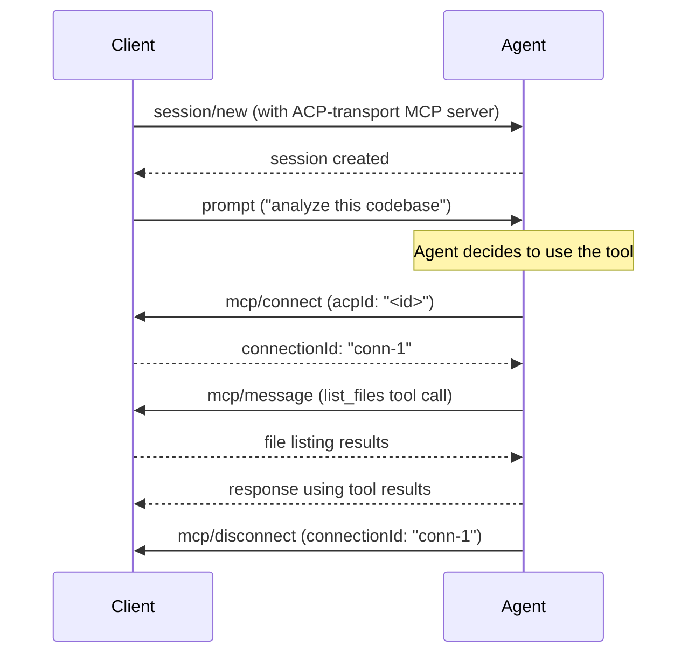
```mermaid theme={null}
sequenceDiagram
    participant Client
    participant Agent

    Client->>Agent: session/new (with ACP-transport MCP server)
    Agent-->>Client: session created

    Client->>Agent: prompt ("analyze this codebase")

    Note over Agent: Agent decides to use the tool
    Agent->>Client: mcp/connect (acpId: "<id>")
    Client-->>Agent: connectionId: "conn-1"

    Agent->>Client: mcp/message (list_files tool call)
    Client-->>Agent: file listing results

    Agent-->>Client: response using tool results

    Agent->>Client: mcp/disconnect (connectionId: "conn-1")
```

## Shiny future

> How will things play out once this feature exists?

### Seamless tool injection

Components can provide tools without any process management. A Rust development environment could inject cargo-aware tools, a cloud IDE could inject deployment tools, and a security scanner could inject vulnerability checking - all through the same ACP connection they're already using.

### WebAssembly-based tooling

Components running in sandboxed environments (like WASM) can provide MCP tools without needing filesystem or process spawning capabilities. The ACP channel is their only interface, and that's sufficient.

### Transparent bridging

For agents that don't natively support ACP transport, intermediaries can transparently bridge: accepting MCP-over-ACP from clients and spawning stdio- or HTTP-based MCP servers that the agent can use normally. This provides backwards compatibility while allowing the ecosystem to adopt ACP transport incrementally.

## Implementation details and plan

> Tell me more about your implementation. What is your detailed implementation plan?

### Capability advertising

Agents advertise MCP-over-ACP support via the [`mcpCapabilities`](/protocol/schema#mcpcapabilities) field in their `InitializeResponse`. We propose adding an `acp` field to this existing structure:

```json theme={null}
{
  "capabilities": {
    "mcpCapabilities": {
      "http": false,
      "sse": false,
      "acp": true
    }
  }
}
```

When `mcpCapabilities.acp` is `true`, the agent can handle MCP servers declared with `"transport": "acp"` natively - it will send `mcp/connect`, `mcp/message`, and `mcp/disconnect` messages through the ACP channel.

Clients don't need to advertise anything - they simply check the agent's capabilities to determine whether bridging is needed.

**Bridging intermediaries**: An intermediary that provides bridging can present `mcpCapabilities.acp: true` to its clients regardless of whether the downstream agent supports it, handling bridging transparently (see [Bridging](#bridging-for-agents-without-native-support) below).

### MCP transport schema extension

We extend the MCP JSON schema to include ACP as a transport option:

```json theme={null}
{
  "type": "object",
  "properties": {
    "transport": {
      "type": "string",
      "enum": ["stdio", "http", "acp"]
    }
  },
  "allOf": [
    {
      "if": { "properties": { "transport": { "const": "acp" } } },
      "then": {
        "properties": {
          "id": {
            "type": "string"
          }
        },
        "required": ["id"]
      }
    }
  ]
}
```

### Message reference

**Connection lifecycle:**

```json theme={null}
// Establish MCP connection
{
  "method": "mcp/connect",
  "params": {
    "acpId": "550e8400-e29b-41d4-a716-446655440000",
    "meta": { ... }
  }
}
// Response:
{
  "connectionId": "conn-123",
  "meta": { ... }
}

// Close MCP connection
{
  "method": "mcp/disconnect",
  "params": {
    "connectionId": "conn-123",
    "meta": { ... }
  }
}
```

**MCP message exchange:**

```json theme={null}
// Send MCP message (bidirectional - works agent→client or client→agent)
{
  "method": "mcp/message",
  "params": {
    "connectionId": "conn-123",
    "method": "<MCP_METHOD>",
    "params": { ... },
    "meta": { ... }
  }
}
```

The inner MCP message fields (`method`, `params`) are flattened into the params object. Whether the wrapped message is a request or notification is determined by the presence of an `id` field in the outer JSON-RPC envelope, following JSON-RPC conventions.

### Routing by ID

The `acpId` in `mcp/connect` matches the `id` that was provided by the component when it declared the MCP server in `session/new`. The receiving side uses this `id` to route messages to the correct handler.

When a component provides multiple MCP servers in a single session, each gets a unique `id`, enabling proper message routing.

### Connection multiplexing

Multiple connections to the same MCP server are supported - each `mcp/connect` returns a unique `connectionId`. This allows scenarios where an agent opens multiple concurrent connections to the same tool server.

### Bridging for agents without native support

Not all agents will support MCP-over-ACP natively. To maintain compatibility, it is possible to write a bridge that translates ACP-transport MCP servers to transports the agent does support.

**Bridging approaches:**

* **Stdio shim**: Spawn a small shim process that the agent connects to via stdio. The shim relays MCP messages to/from the ACP channel. This is the most compatible approach since all MCP-capable agents support stdio.

* **HTTP bridge**: Run a local HTTP server that the agent connects to. MCP messages are relayed to/from the ACP channel. This works for agents that prefer HTTP transport.

**How bridging works:**

When a client provides an MCP server with `"transport": "acp"`, and the agent doesn't advertise `mcpCapabilities.acp: true`, a bridge can:

1. Rewrite the MCP server declaration in `session/new` to use stdio or HTTP transport
2. Spawn the appropriate shim process or HTTP server
3. Relay messages between the shim and the ACP channel

From the agent's perspective, it's talking to a normal stdio/HTTP MCP server. From the client's perspective, it's handling MCP-over-ACP messages. The bridge handles the translation transparently.

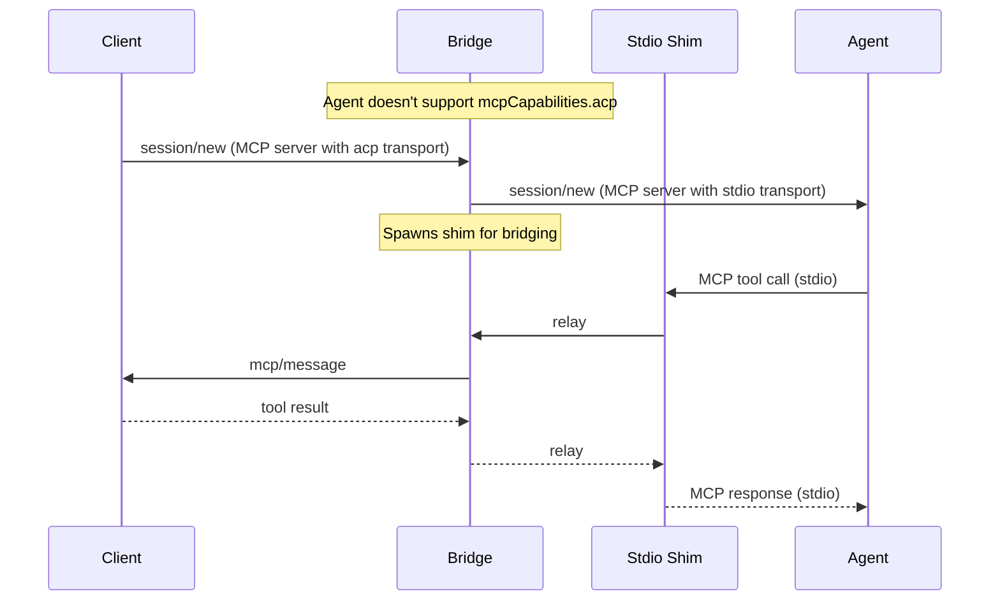
```mermaid theme={null}
sequenceDiagram
    participant Client
    participant Bridge
    participant Shim as Stdio Shim
    participant Agent

    Note over Bridge: Agent doesn't support mcpCapabilities.acp
    Client->>Bridge: session/new (MCP server with acp transport)
    Bridge->>Agent: session/new (MCP server with stdio transport)
    Note over Bridge: Spawns shim for bridging

    Agent->>Shim: MCP tool call (stdio)
    Shim->>Bridge: relay
    Bridge->>Client: mcp/message
    Client-->>Bridge: tool result
    Bridge-->>Shim: relay
    Shim-->>Agent: MCP response (stdio)
```

A first implementation of this bridging exists in the `sacp-conductor` crate, part of the proposed new version of the [ACP Rust SDK](https://github.com/anthropics/rust-sdk).

## Frequently asked questions

> What questions have arisen over the course of authoring this document or during subsequent discussions?

### Why use a separate `id` instead of server names?

Server names in `mcpServers` are chosen by whoever adds them to the session, and could potentially collide if multiple components add servers. A component-generated `id` provides guaranteed uniqueness and allows the providing component to correlate incoming messages back to the correct session context.

This also avoids a potential deadlock: some agents don't return the session ID until after MCP servers have been initialized. Using a component-generated `id` avoids any dependency on agent-provided identifiers.

### How does this relate to proxy chains?

MCP-over-ACP is a transport mechanism that works independently of proxy chains. However, proxy chains are a natural use case: a proxy can inject MCP servers into sessions it forwards, handle the tool callbacks, and use the results to enhance its transformations.

See the [Proxy Chains RFD](./proxy-chains) for details on how MCP-over-ACP enables context-aware tooling.

### What if the agent doesn't support ACP transport?

See the [Bridging for agents without native support](#bridging-for-agents-without-native-support) section above. A bridge can transparently translate ACP-transport MCP servers to stdio or HTTP for agents that don't advertise `mcpCapabilities.acp` support.

### What about security?

MCP-over-ACP has the same trust model as regular MCP: you're allowing a component to handle tool invocations. The difference is transport, not trust. Components should only add MCP servers from sources they trust, same as with stdio or HTTP transport.

## Revision history

Split from proxy-chains RFD to enable independent use of MCP-over-ACP transport by any ACP component, not just proxies.


# Meta Field Propagation Conventions
Source: https://agentclientprotocol.com/rfds/meta-propagation


* Author(s): [Adrian Cole](https://github.com/codefromthecrypt)
* Champion: [@benbrandt](https://github.com/benbrandt)

## Elevator pitch

Document `params._meta` as the convention for propagating metadata from clients to agents, such as trace identifiers or correlation IDs. This aligns with [MCP](https://modelcontextprotocol.io/), enabling shared instrumentation since both protocols use stdio JSON-RPC transports.

## Status quo

ACP clients already propagate context to agents via `_meta`. For example, `requestId` is used for request correlation in [AionUi](https://github.com/iOfficeAI/AionUi/blob/main/src/common/codex/types/eventData.ts#L12-L16).

However, the [extensibility](../protocol/extensibility) documentation does not specify the `_meta` type or document its use for propagation. Without documentation, parties must coordinate ad hoc, which can lead to portability accidents (such as one side using `_meta.traceparent` and the other `_meta.otel.traceparent`). Documenting that propagated fields are root keys in `_meta` prevents this.

## What we propose to do about it

Update the [extensibility](../protocol/extensibility#the-_meta-field) documentation with two changes:

1. Add the type `{ [key: string]: unknown }` to the existing summary sentence. This type is compatible with MCP SDKs.
2. Add a new paragraph after the JSON example about propagation conventions.

## Shiny future

* Same instrumentation (OpenInference, etc.) works for both ACP and MCP.
* Observability tools can correlate traces across protocols.

## Implementation details

**Change 1**: Update the existing summary sentence in [extensibility](../protocol/extensibility#the-_meta-field):

```diff theme={null}
-All types in the protocol include a `_meta` field that implementations can use to attach custom information.
+All types in the protocol include a `_meta` field with type `{ [key: string]: unknown }` that implementations can use to attach custom information.
```

**Change 2**: After the JSON example, before "Implementations **MUST NOT**", add:

> Clients may propagate fields to the agent for correlation purposes, such as `requestId`. The following root-level keys in `_meta` **SHOULD** be reserved for [W3C trace context](https://www.w3.org/TR/trace-context/) to guarantee interop with existing MCP implementations and OpenTelemetry tooling:
>
> * `traceparent`
> * `tracestate`
> * `baggage`

## FAQ

### Why document this now?

Clients already propagate context via `_meta`. Documenting prevents incompatible drift and enables shared tooling with MCP.

### Why reference MCP?

ACP and MCP are the two core agentic protocols, both using stdio JSON-RPC. Where `_meta` types are compatible, instrumentation code can be abstracted and reused for both:

Here are several MCP SDKs that propagate W3C trace-context in `_meta`:

* [MCP C# SDK](https://github.com/modelcontextprotocol/csharp-sdk) - native W3C trace-context propagation
* [OpenInference](https://github.com/Arize-ai/openinference) - Python and TypeScript MCP instrumentation (collaboration between Arize and Elastic)
* [curioswitch/mcp-go-sdk-otel](https://github.com/curioswitch/mcp-go-sdk-otel) - Go MCP instrumentation

## Revision history

* 2025-12-04: Implementation in extensibility docs
* 2025-11-28: Initial draft


# Agent Extensions via ACP Proxies
Source: https://agentclientprotocol.com/rfds/proxy-chains


Author(s): [nikomatsakis](https://github.com/nikomatsakis)

## Elevator pitch

> What are you proposing to change?

Enable a universal agent extension mechanism via ACP proxies, components that sit between a client and an agent. Proxies can intercept and transform messages, enabling composable architectures where techniques like context injection, tool coordination, and response filtering can be extracted into reusable components.

## Status quo

> How do things work today and what problems does this cause? Why would we change things?

The AI agent ecosystem has developed many extension mechanisms: AGENTS.md files, Claude Code plugins, rules files, hooks, MCP servers, etc. Of these, only MCP servers have achieved real standardization across the ecosystem.

However, MCP servers are fundamentally limited because they sit "behind" the agent. They can provide tools and respond to function calls, but they cannot:

* **Inject or modify prompts** before they reach the agent
* **Add global context** that persists across conversations
* **Transform responses** before they reach the user
* **Coordinate between multiple agents** or manage conversation flow

As a result, valuable techniques like context management and response processing remain locked within individual agent implementations, with no way to extract and reuse them across different agents.

## What we propose to do about it

> What are you proposing to improve the situation?

We propose implementing *agent extensions* via ACP *proxies*, a new kind of component that sits between the client and the agent, forwarding (and potentially altering or introducing) messages. Because proxies can do anything a client could do, they serve as a universal extension mechanism that can subsume AGENTS.md, hooks, MCP servers, etc.

Proxies are limited to the customizations exposed by ACP itself, so they would benefit from future ACP extensions like mechanisms to customize system prompts. However, they can already handle the majority of common extension use cases through message interception and transformation.

### Proxying in theory

Conceptually, proxies work like a chain where messages flow through each component:

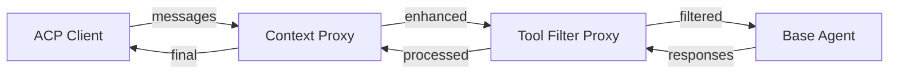
```mermaid theme={null}
flowchart LR
    Client[ACP Client] -->|messages| P1[Context Proxy]
    P1 -->|enhanced| P2[Tool Filter Proxy]
    P2 -->|filtered| A[Base Agent]
    A -->|responses| P2
    P2 -->|processed| P1
    P1 -->|final| Client
```

### Proxying in practice: the role of the conductor

To allow for proxy isolation, our design does not have proxies communicate directly with their successor in the chain. Instead, there is a central *conductor* component that orchestrates messages moving between components.

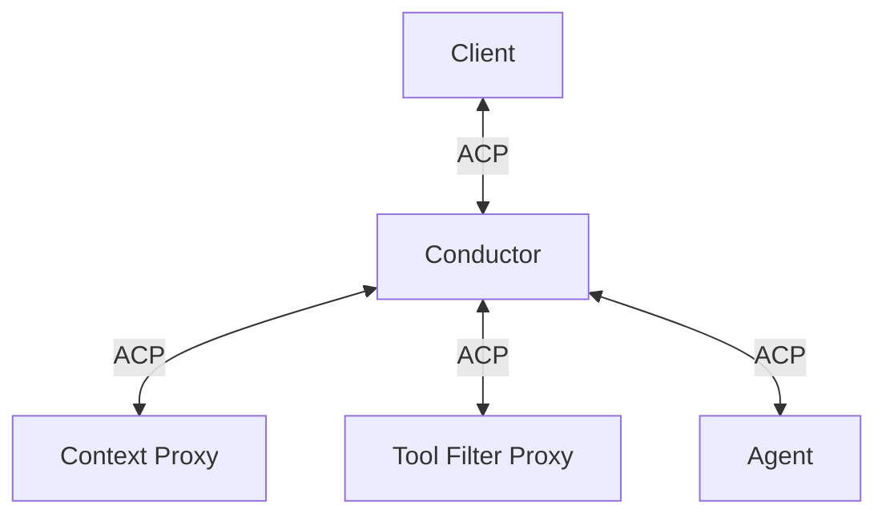
```mermaid theme={null}
flowchart TB
    Client[Client]
    C[Conductor]
    P1[Context Proxy]
    P2[Tool Filter Proxy]
    A[Agent]

    Client <-->|ACP| C
    C <-->|ACP| P1
    C <-->|ACP| P2
    C <-->|ACP| A
```

We add one ACP method for proxy communication:

* **`proxy/successor`**: Used bidirectionally - proxies send it to forward messages to their successor, and the conductor sends it to deliver messages from the successor back to the proxy

Here's how a single message flows through the system:

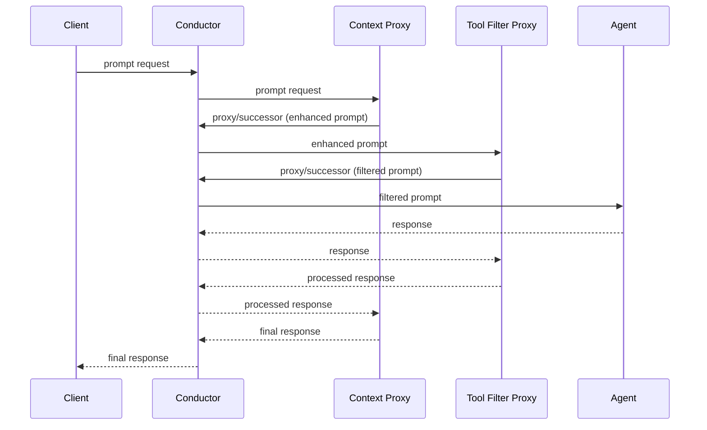
```mermaid theme={null}
sequenceDiagram
    participant Client
    participant Conductor
    participant P1 as Context Proxy
    participant P2 as Tool Filter Proxy
    participant Agent

    Client->>Conductor: prompt request
    Conductor->>P1: prompt request
    P1->>Conductor: proxy/successor (enhanced prompt)
    Conductor->>P2: enhanced prompt
    P2->>Conductor: proxy/successor (filtered prompt)
    Conductor->>Agent: filtered prompt
    Agent-->>Conductor: response
    Conductor-->>P2: response
    P2-->>Conductor: processed response
    Conductor-->>P1: processed response
    P1-->>Conductor: final response
    Conductor-->>Client: final response
```

## Shiny future

> How will things play out once this feature exists?

### User experience and editor integration

We expect editors to expose the ability to install proxies in the same way they currently support adding MCP servers - in fact, the distinction probably doesn't matter to users. Both are "extensions" that add capabilities to their AI workflow.

When proxies are installed, editors would not start the agent directly, but instead invoke the conductor with the configured proxy chain. From the user's perspective, they're just getting enhanced agent capabilities - the proxy chain architecture remains transparent.

### Language-specific proxy ecosystems

The monolithic nature of agent development has meant that most of the "action" happens within agents. We wish to invert this, with agents trending towards simple agentic loops, and the creativity being pushed outwards into the broader ecosystem.

The Symposium project is one example exploring this concept, with a focus on Rust. The idea is to give Rust users an automatic set of extensions based on the dependencies they are using. These extensions would be packaged up as SACP proxies using WebAssembly for portability and sandboxing.

Symposium aims to become the standard "Rust ACP experience" by providing both core Rust tooling and a framework for Rust libraries to contribute their own proxy components.

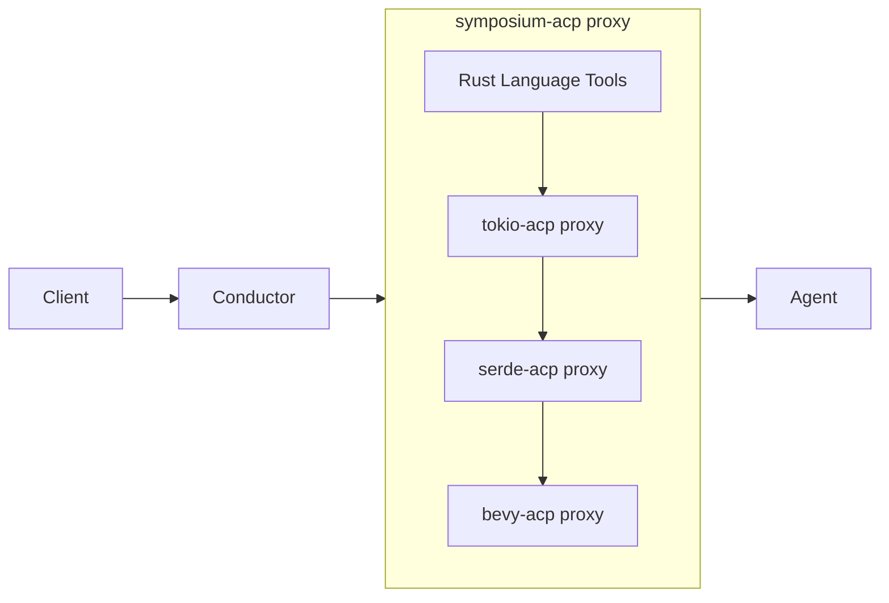
```mermaid theme={null}
flowchart LR
    Client[Client]
    Conductor[Conductor]
    Agent[Agent]

    subgraph Symposium["symposium-acp proxy"]
        RustTools[Rust Language Tools]
        CrateA[tokio-acp proxy]
        CrateB[serde-acp proxy]
        CrateC[bevy-acp proxy]

        RustTools --> CrateA
        CrateA --> CrateB
        CrateB --> CrateC
    end

    Client --> Conductor
    Conductor --> Symposium
    Symposium --> Agent
```

### Standardized IDE capabilities

Proxy infrastructure could also enable editors to expose standardized IDE capabilities (diagnostics, file system access, terminal APIs) to agents via MCP servers provided by proxies. This keeps the core ACP protocol focused on agent communication while allowing rich IDE integration through the proxy layer.

## Implementation details and plan

> Tell me more about your implementation. What is your detailed implementation plan?

### Component roles

Each ACP proxy chain forms a sequence of components:

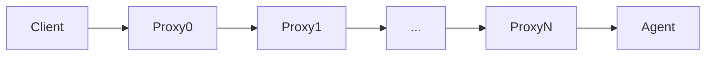
```mermaid theme={null}
flowchart LR
    Client --> Proxy0 --> Proxy1 --> ... --> ProxyN --> Agent
```

The **client** and **agent** are *terminal* roles - the client has only a successor (no predecessor), and the agent has only a predecessor (no successor). Proxies are *non-terminal* - they have both a predecessor and a successor, forwarding messages between them.

The **conductor** is a special component that orchestrates proxy chains. It spawns and manages proxy components, routes messages between them, and handles initialization. From the client's perspective, the conductor appears to be an ordinary agent:

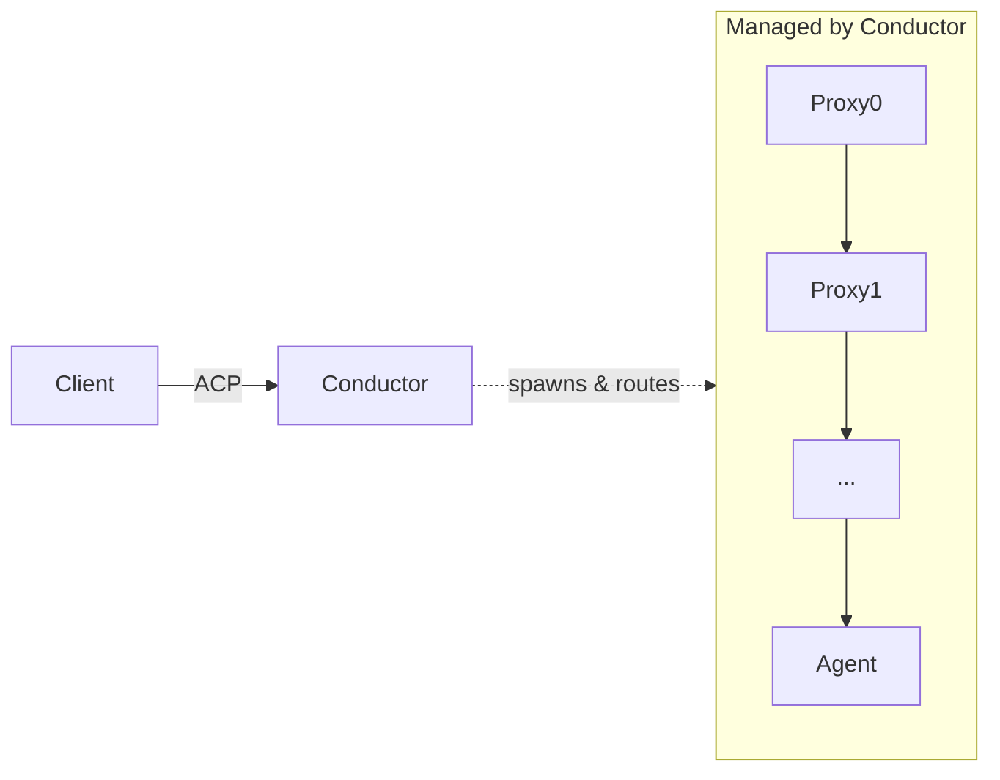
```mermaid theme={null}
flowchart LR
    Client -->|ACP| Conductor

    subgraph Managed["Managed by Conductor"]
        Proxy0 --> Proxy1 --> ... --> Agent
    end

    Conductor -.->|spawns & routes| Managed
```

We provide a canonical conductor implementation in Rust (`sacp-conductor`). Most editors would use this conductor directly to host proxies and agents, though they could also reimplement conductor functionality if needed.

ACP defines client and agent as superroles, each with two specializations:

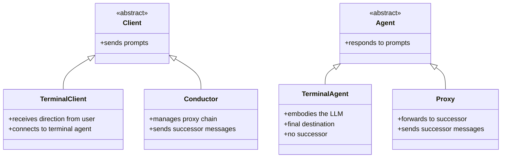
```mermaid theme={null}
classDiagram
    class Client {
        <<abstract>>
        +sends prompts
    }

    class Agent {
        <<abstract>>
        +responds to prompts
    }

    class TerminalClient {
        +receives direction from user
        +connects to terminal agent
    }

    class Conductor {
        +manages proxy chain
        +sends successor messages
    }

    class TerminalAgent {
        +embodies the LLM
        +final destination
        +no successor
    }

    class Proxy {
        +forwards to successor
        +sends successor messages
    }

    Client <|-- TerminalClient
    Client <|-- Conductor
    Agent <|-- TerminalAgent
    Agent <|-- Proxy
```

**Example Architecture:**

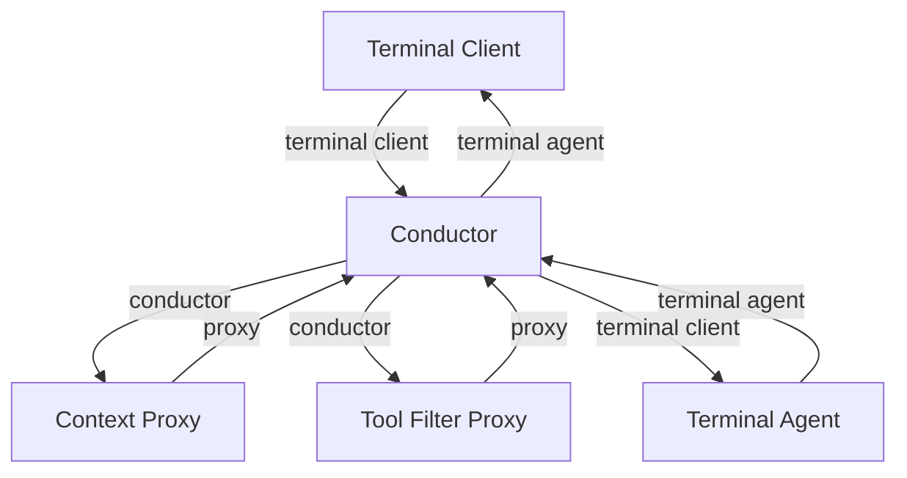
```mermaid theme={null}
flowchart TB
    TC[Terminal Client]
    C[Conductor]
    P1[Context Proxy]
    P2[Tool Filter Proxy]
    TA[Terminal Agent]

    TC -->|terminal client| C
    C -->|terminal agent| TC
    C -->|conductor| P1
    P1 -->|proxy| C
    C -->|conductor| P2
    P2 -->|proxy| C
    C -->|terminal client| TA
    TA -->|terminal agent| C
```

### Proxy initialization protocol

Components discover their role from the initialization method they receive:

* **Proxies** receive `proxy/initialize` - they have a successor and should forward messages
* **Agents** receive `initialize` - they are terminal (no successor) and process messages directly

The `proxy/initialize` request has the same parameters as `initialize` and expects a standard `InitializeResponse`. The only difference is the method name, which signals to the component that it should operate as a proxy.

**Conductor behavior:**

* The conductor MUST send `proxy/initialize` to all proxy components
* The conductor MUST send `initialize` to the final agent component (if any)
* When a proxy forwards an `initialize` via `proxy/successor`, the conductor determines whether the successor is another proxy or the agent, and sends `proxy/initialize` or `initialize` respectively.

**Proxy behavior:**

* A proxy that receives `proxy/initialize` knows it has a successor
* The proxy SHOULD forward requests it does not understand
* The proxy SHOULD preserve metadata fields when forwarding messages

Note: A conductor can be configured to run in either terminal mode (expecting `initialize`) or proxy mode (expecting `proxy/initialize`), enabling nested proxy chains.

### MCP-over-ACP support

Proxies that provide MCP servers use the [MCP-over-ACP transport](./mcp-over-acp) mechanism. The conductor always advertises `mcpCapabilities.acp: true` to proxies and handles bridging for agents that don't support native ACP transport.

All proxies MUST respond to `proxy/initialize` with the MCP-over-ACP capability enabled. When the conductor sends `proxy/initialize`, proxies should be prepared to handle `mcp/connect`, `mcp/message`, and `mcp/disconnect` messages for any MCP servers they provide.

### Message reference

**Initialization:**

```json theme={null}
// Conductor initializes a proxy (proxy knows it has a successor)
{"method": "proxy/initialize", "params": <INITIALIZE_REQUEST_PARAMS>}

// Conductor initializes the agent (standard ACP)
{"method": "initialize", "params": <INITIALIZE_REQUEST_PARAMS>}
```

Both methods use the same parameters as the standard ACP `InitializeRequest` and expect a standard `InitializeResponse`.

**Proxy messages:**

```json theme={null}
// Proxy sends message to successor, or conductor delivers message from successor
// (same method, direction determined by sender)
{
  "method": "proxy/successor",
  "params": {
    "method": "<INNER_METHOD>",
    "params": <INNER_PARAMS>,
    "meta": { ... }            // optional metadata
  }
}
```

The inner message fields (`method`, `params`) are flattened into the params object. Whether the wrapped message is a request or notification is determined by the presence of an `id` field in the outer JSON-RPC envelope, following JSON-RPC conventions.

### Examples (non-normative)

The following sequence diagrams illustrate common proxy chain scenarios for implementers.

#### Initialization of a 4-component proxy chain

This shows the initialization flow for: Terminal Client → Conductor → Context Proxy → Tool Filter Proxy → Terminal Agent

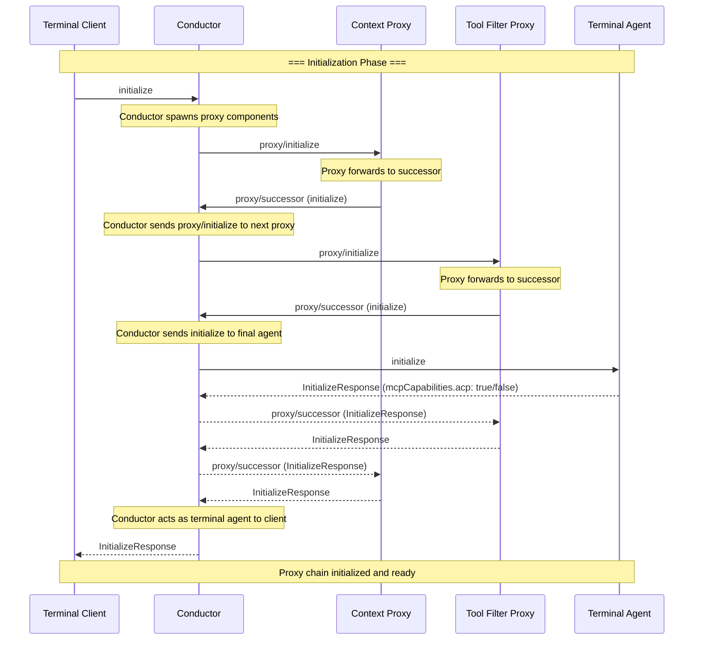
```mermaid theme={null}
sequenceDiagram
    participant TC as Terminal Client
    participant C as Conductor
    participant P1 as Context Proxy
    participant P2 as Tool Filter Proxy
    participant TA as Terminal Agent

    Note over TC,TA: === Initialization Phase ===

    TC->>C: initialize

    Note over C: Conductor spawns proxy components
    C->>P1: proxy/initialize

    Note over P1: Proxy forwards to successor
    P1->>C: proxy/successor (initialize)

    Note over C: Conductor sends proxy/initialize to next proxy
    C->>P2: proxy/initialize

    Note over P2: Proxy forwards to successor
    P2->>C: proxy/successor (initialize)

    Note over C: Conductor sends initialize to final agent
    C->>TA: initialize

    TA-->>C: InitializeResponse (mcpCapabilities.acp: true/false)
    C-->>P2: proxy/successor (InitializeResponse)

    P2-->>C: InitializeResponse
    C-->>P1: proxy/successor (InitializeResponse)

    P1-->>C: InitializeResponse

    Note over C: Conductor acts as terminal agent to client
    C-->>TC: InitializeResponse

    Note over TC,TA: Proxy chain initialized and ready
```

#### Context-providing proxy with session notifications

This example shows how a proxy can handle initialization and forward session notifications. Sparkle (a collaborative AI framework) runs an embodiment sequence during session creation.

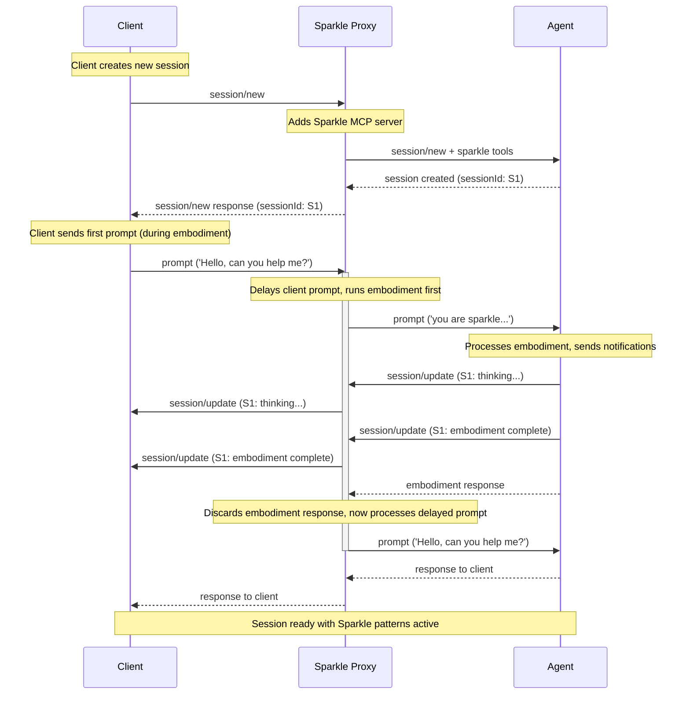
```mermaid theme={null}
sequenceDiagram
    participant Client
    participant Sparkle as Sparkle Proxy
    participant Agent

    Note over Client: Client creates new session
    Client->>Sparkle: session/new

    Note over Sparkle: Adds Sparkle MCP server
    Sparkle->>Agent: session/new + sparkle tools
    Agent-->>Sparkle: session created (sessionId: S1)
    Sparkle-->>Client: session/new response (sessionId: S1)

    Note over Client: Client sends first prompt (during embodiment)
    Client->>Sparkle: prompt ('Hello, can you help me?')
    activate Sparkle

    Note over Sparkle: Delays client prompt, runs embodiment first
    Sparkle->>Agent: prompt ('you are sparkle...')

    Note over Agent: Processes embodiment, sends notifications
    Agent->>Sparkle: session/update (S1: thinking...)
    Sparkle->>Client: session/update (S1: thinking...)

    Agent->>Sparkle: session/update (S1: embodiment complete)
    Sparkle->>Client: session/update (S1: embodiment complete)

    Agent-->>Sparkle: embodiment response
    Note over Sparkle: Discards embodiment response, now processes delayed prompt

    Sparkle->>Agent: prompt ('Hello, can you help me?')
    deactivate Sparkle
    Agent-->>Sparkle: response to client
    Sparkle-->>Client: response to client

    Note over Client,Agent: Session ready with Sparkle patterns active
```

This demonstrates how proxies can run initialization sequences during session creation while transparently forwarding all session notifications back to the client.

## Frequently asked questions

> What questions have arisen over the course of authoring this document or during subsequent discussions?

### Why use a separate `proxy/initialize` method instead of a capability?

Earlier designs used a `"proxy": true` capability in the `InitializeRequest` and required proxies to echo it back in the response. This felt awkward because it wasn't really a capability negotiation - it was more of a "you must operate as a proxy" directive.

Using a distinct method makes the contract clearer: if you receive `proxy/initialize`, you're a proxy with a successor; if you receive `initialize`, you're the terminal agent. There's no capability dance, no risk of misconfiguration, and components know their role immediately from the method name.

### How do proxies subsume existing agent extension mechanisms?

Because proxies sit between the client and agent, they can replicate the functionality of existing extension mechanisms:

* **AGENTS.md files**: Proxies can inject context and instructions into prompts before they reach the agent
* **Claude Code plugins/skills**: Proxies can add contextual data for available skills and provide MCP resources with detailed skill instructions that are provided on-demand when requested by the agent
* **MCP servers**: Proxies can provide tools via [MCP-over-ACP](./mcp-over-acp) and handle tool callbacks
* **Subagents**: Proxies can create "subagents" by initiating new sessions and coordinating between multiple agent instances
* **Hooks and steering files**: Proxies can modify conversation flow by intercepting requests and responses
* **System prompt customization**: Proxies can switch between predefined session modes or prepend system messages to prompts

The key advantage is that proxy-based extensions work with any ACP-compatible agent without requiring agent-specific integration or modification.

### How do proxies work with MCP servers?

Proxies can provide MCP servers via [MCP-over-ACP transport](./mcp-over-acp), enabling a single proxy to add context, provide tools, and handle callbacks with full awareness of the conversation state.

The conductor always advertises `mcpCapabilities.acp: true` to proxies, regardless of whether the downstream agent supports it natively. When the agent doesn't support ACP transport, the conductor handles bridging transparently - spawning stdio shims or HTTP servers that the agent connects to normally, then relaying messages to/from the proxy's ACP channel.

This means proxy authors don't need to worry about agent compatibility - they implement MCP-over-ACP, and the conductor handles the rest.

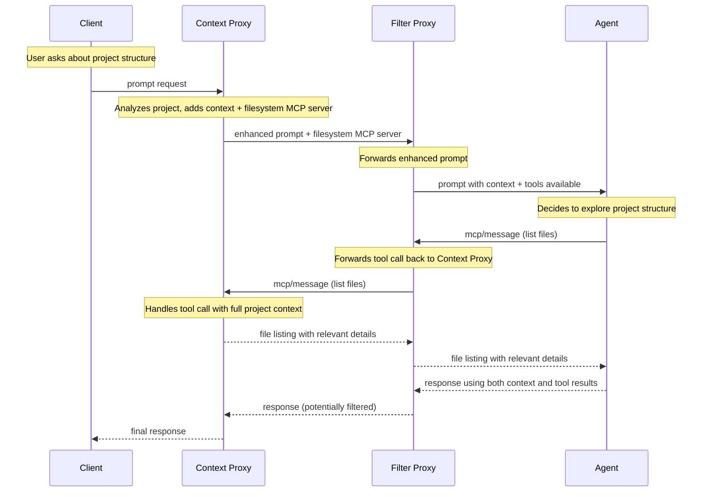
```mermaid theme={null}
sequenceDiagram
    participant Client
    participant P1 as Context Proxy
    participant P2 as Filter Proxy
    participant Agent

    Note over Client: User asks about project structure
    Client->>P1: prompt request

    Note over P1: Analyzes project, adds context + filesystem MCP server
    P1->>P2: enhanced prompt + filesystem MCP server

    Note over P2: Forwards enhanced prompt
    P2->>Agent: prompt with context + tools available

    Note over Agent: Decides to explore project structure
    Agent->>P2: mcp/message (list files)

    Note over P2: Forwards tool call back to Context Proxy
    P2->>P1: mcp/message (list files)

    Note over P1: Handles tool call with full project context
    P1-->>P2: file listing with relevant details
    P2-->>Agent: file listing with relevant details

    Agent-->>P2: response using both context and tool results
    P2-->>P1: response (potentially filtered)
    P1-->>Client: final response
```

### Are there any limitations to what proxies can do?

Yes, proxies are limited to what is available through the ACP protocol itself. They can intercept and transform any ACP message, but they cannot access capabilities that ACP doesn't expose.

For example, proxies cannot directly modify an agent's system prompt or context window - they can only switch between predefined session modes (which may affect system prompts) or prepend additional messages to prompts. Similarly, proxies cannot access internal agent state, model parameters, or other implementation details that aren't exposed through ACP messages.

This is actually a feature - it ensures that proxy-based extensions remain portable across different agent implementations and don't rely on agent-specific internals.

### Why not just cascade ACP commands without protocol changes?

One alternative is to make proxies be ordinary agents that internally create and manage their successors. This works (HTTP proxies operate this way) but requires each proxy to understand the full chain and know how to start its successors.

This couples proxies to transport mechanisms, process management, and chain configuration. Changing transports, reordering the chain, or inserting a new proxy requires modifying predecessor configurations.

The conductor design decouples proxies from their successors. Proxies send messages "to successor" and receive messages "from successor" without knowing who that successor is, how it's started, or what transport it uses. This enables:

* Changing transport protocols or process management without recompiling proxies
* Shipping proxies as low-capability WASM containers that need only a single communication channel
* Reordering, adding, or removing proxies through configuration rather than code changes

The tradeoff is protocol complexity, but this complexity lives in the conductor (implemented once) rather than being duplicated across proxy implementations.

### Why do all messages go through the conductor instead of direct proxy-to-proxy communication?

Even with a conductor, proxies could communicate directly with their successors after the conductor sets up connections. Routing all messages through the conductor further minimizes proxy responsibilities to a single communication channel.

This supports running proxies as isolated WebAssembly components with minimal capabilities. It also removes redundant logic: without the conductor routing messages, each proxy would need to manage connections to its successor.

The conductor handles process management, capability negotiation, and message routing, allowing proxies to focus on transformation logic.

### How does the standard conductor implementation work?

The `sacp-conductor` reference implementation can form trees of proxy chains. It can be configured to run in proxy mode (expecting `proxy/initialize`) or terminal mode (expecting `initialize`). When the last proxy in its managed chain sends a message to its successor, the conductor forwards that message to its own parent conductor (if in proxy mode) or to the final agent (if in terminal mode).

This enables hierarchical structures like:

```
client → conductor1 → final-agent
             ↓ manages
         proxy-a → conductor2 → proxy-d
                      ↓ manages
                  proxy-b → proxy-c
```

The conductor handles process management, capability negotiation, and message routing, but these are implementation details - the protocol only specifies the message formats and capability requirements.

### What about security concerns with proxy chains?

Proxy components can intercept and modify all communication, so trust is essential - similar to installing any software. Users are responsible for the components they choose to run.

We plan to explore WebAssembly-based proxies which will offer some measure of sandboxing but such components could still modify prompts in unknown or malicious ways.

### What about performance implications of the proxy chain?

Our architecture does introduce additional message passing - each proxy in the chain adds extra hops as messages flow through the conductor. However, these messages are typically small and inexpensive, particularly when compared to the latency of actual LLM inference.

For messages that contain significant quantities of data (large file contents, extensive context), we may wish to have the conductor store that data centrally and introduce a "reference" mechanism so that most proxies don't have to inspect or copy large payloads unless they specifically need to transform them.

The benefits of composability typically outweigh the minimal latency costs for human-paced development interactions.

### What happens when proxy components crash or misbehave?

The conductor manages component lifecycles:

* Failed components are restarted automatically where possible
* Component crashes don't affect the rest of the chain
* Graceful degradation by bypassing failed components
* Clear error reporting to help users debug configuration issues

### Can proxy chains be nested or form trees?

Yes! The conductor can itself run in proxy mode, enabling hierarchical structures:

```
client → proxy1 → conductor (proxy mode) → final-agent
                      ↓ manages
                  p1 → p2 → p3
```

This enables complex compositions while maintaining clean interfaces.

### How could proxy chains support multi-agent scenarios in the future?

The current design assumes a linear chain where each proxy has a single successor. To support M:N topologies where a proxy communicates with multiple peers (e.g., a research coordinator dispatching to multiple specialized agents), we could extend `proxy/successor` with an optional `peer` field:

```json theme={null}
{
  "method": "proxy/successor",
  "params": {
    "method": "prompt",
    "params": { ... },
    "peer": "research-agent"
  }
}
```

When `peer` is omitted, the message goes to the default successor (backwards compatible with the current linear chain model). When present, it specifies which peer the message is intended for. The `proxy/initialize` response could be extended to enumerate available peers, enabling proxies to discover and coordinate between multiple downstream components.

### What's the current implementation status?

A prototype version of this proposal has been implemented and is available on crates.io as the crates:

* `sacp` -- base ACP protocol SDK
  * `sacp-tokio` -- adds specific utilities for use with the `tokio` runtime
* `sacp-proxy` -- extensions for implementing a proxy
  * `sacp-rmcp` -- adds specific proxy extension traits for bridging to the rmcp crate
* `sacp-conductor` -- reference conductor implementation

The canonical sources for those crates is currently the \[symposium-dev/symposium-acp] repository. However, copies have been upstreamed to the [agentclientprotocol/rust-sdk](https://github.com/agentclientprotocol/rust-sdk/tree/main/src/sacp-conductor) repository and, if and when this RFD is accepted, that will become the canonical home.

## Revision history

* Initial draft based on working implementation in symposium-acp repository.
* Split MCP-over-ACP transport into [separate RFD](./mcp-over-acp) to enable independent use by any ACP component.


# Request Cancellation Mechanism
Source: https://agentclientprotocol.com/rfds/request-cancellation


* Author(s): [Artem Bukhonov](https://github.com/nerzhulart)
* Champion: [@benbrandt](https://github.com/benbrandt)

## Elevator pitch

Introduce a standardized per-request cancellation mechanism for the Agent Client Protocol, inspired by the [Language Server Protocol (LSP)](https://microsoft.github.io/language-server-protocol/specifications/lsp/3.17/specification/#cancelRequest), to enable a more granular cancellation of requests where individual JSON-RPC requests can be cancelled one by one.

## Status quo

The JSON-RPC specification doesn't define any standard mechanism for request cancellation and leaves it up to the implementation. Currently, ACP has some ad-hoc cancellation mechanisms for specific features (like prompt turn cancellation via `session/cancel`), but lacks a general-purpose, per-request cancellation mechanism.

This creates the following inconveniences:

* cancellation should be handled for each feature separately
* some languages that support handy cancellation mechanisms (C#, Kotlin, etc.) can't implement general-purpose request cancellation using ACP low-level machinery, and rather developers should manually call per-feature cancellation methods

## What we propose to do about it

Implement an **optional** `$/cancel_request` notification method (inspired by the Language Server Protocol) to both Agent and Client that uses JSON-RPC 2.0 notification format, allowing either party (client or agent) to cancel any outstanding request by its ID.

The mechanism will be:

* **Optional**: Not all implementations may support this feature, but it is recommended for those that do.
* **Flexible**: Provides two response options when cancellation is received:
  1. An error response with the standard cancellation error code (-32800)
  2. A valid response with partial or cancelled data (when meaningful partial results exist)

This approach balances flexibility with standardization, allowing implementations to opt-in to cancellation support while providing predictable behavior when enabled.

## Shiny future

Once implemented, this enables:

* **SDK integration layer**: Default mechanism that ACP SDKs can automatically wire to native language cancellation (C# CancellationToken, Kotlin Job, Go context.Context, JavaScript AbortController, etc.)
* Individual JSON-RPC request cancellation without affecting other concurrent requests
* Universal fallback for any request when feature-specific cancellation methods don't exist
* Consistent cancellation behavior from both external `$/cancel_request` and internal cancellation triggers
* Standard error response (`-32800`) or partial results when requests are cancelled regardless of cancellation source

In a future version, we could potentially deprecate the `session/cancel` notification in favor of the more general approach, as it would still provide the same functionality but with more flexibility and consistency.

## Implementation details and plan

### Protocol Changes

#### Cancellation Method

Add the `$/cancel_request` notification method to the JSON-RPC protocol:

```typescript theme={null}
interface CancelNotification {
  method: "$/cancel_request";
  params: {
    requestId: string | number; // ID of request to cancel
  };
}
```

### Cancellation Behavior

Either party can send `$/cancel_request` to cancel requests. Notifications whose methods start with '$/' are messages which are protocol implementation dependent and might not be implementable in all clients or agents. For example if the implementation uses a single threaded synchronous programming language then there is little it can do to react to a `$/cancel\_request\` notification. If an agent or client receives notifications starting with '\$/' it is free to ignore the notification.

The **receiving party** is **NOT** required to:

* Perform special handling for unsupported cancellation requests
* Return custom errors for unsupported `$/cancel_request` notifications

#### Cancellation Processing

When a `$/cancel_request` notification is received by a supporting implementation, it:

* **MUST** cancel the corresponding request activity and all nested activities related to that request
* **MAY** finish sending any pending notifications before responding
* **MUST** send one of these responses for the original request:
  * A valid response with appropriate data (such as partial results or cancellation marker)
  * An error response with code [`-32800` (Request Cancelled)](./schema#errorcode)

#### Internal Cancellation

Requests can also be cancelled internally by the executing party without receiving `$/cancel_request`:

* **Client-side examples**: User closes IDE, switches to different project, file becomes unavailable
* **Agent-side examples**: LLM context limit reached, internal timeout, resource constraints

When internal cancellation occurs, the executing party **SHOULD**:

1. Send the same `-32800` (Cancelled) error response as if `$/cancel_request` was received
2. Ensure consistent behavior regardless of cancellation source

### Error Code

Add standard JSON-RPC error code `-32800` for cancelled requests:

* Code: `-32800`
* Message: "Request cancelled"
* Meaning: Execution of the method was aborted either due to a cancellation request from the caller or because of resource constraints or shutdown.

## Frequently asked questions

### What alternative approaches did you consider, and why did you settle on this one?

The core need is to add **granular cancellation** as a general mechanism for individual JSON-RPC requests, while **feature-specific cancellation methods** (like `session/cancel`) remain useful for cases requiring additional domain semantics.

We selected the **LSP-style `$/cancel_request`** approach because:

* Serves as a **default cancellation layer** that SDK implementations can easily map to native language cancellation mechanisms
* Proven pattern familiar to developers from LSP ecosystem
* Works across all JSON-RPC transports (HTTP, WebSocket, stdio, pipes)
* Provides universal fallback when feature-specific cancellation doesn't exist
* Complements existing feature-specific methods rather than replacing them

### How does this relate to existing cancellation mechanisms like `session/cancel`?

The `$/cancel_request` mechanism is complementary to feature-specific cancellation:

* `$/cancel_request`: Generic cancellation for any JSON-RPC request by ID
* `session/cancel`: Feature-specific cancellation with additional semantics (e.g., cancels entire prompt turn context, triggers specific cleanup logic)

Both mechanisms serve different purposes:

**Feature-specific methods** like `session/cancel` provide:

* Domain-specific semantics and behavior
* Structured cleanup for complex operations
* Context-aware cancellation logic

**Generic `$/cancel_request`** provides:

* Default cancellation layer that bridges programming language cancellation mechanisms (C# CancellationToken, Kotlin Job, Go context.Context, etc.) with ACP
* Universal fallback for any request when no feature-specific method exists
* Simple ID-based targeting for SDK convenience
* Standardized error responses

Implementations can use both: feature-specific methods for rich semantics, and `$/cancel_request` for simple per-request cancellation.

Note: it is possible that `session/cancel` could be replaced by the more generic `$/cancel_request` in future versions of the protocol.

#### Example: Cascading Cancellation Flow

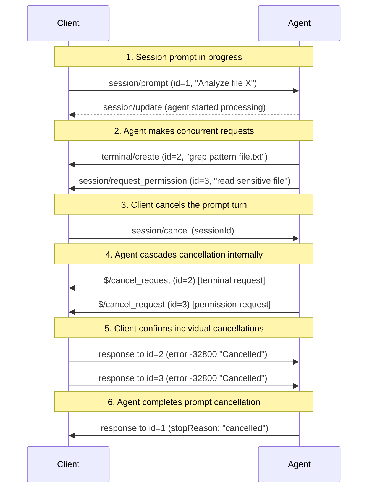
```mermaid theme={null}
sequenceDiagram
    participant Client
    participant Agent

    Note over Client,Agent: 1. Session prompt in progress
    Client->>Agent: session/prompt (id=1, "Analyze file X")
    Agent-->>Client: session/update (agent started processing)

    Note over Client,Agent: 2. Agent makes concurrent requests
    Agent->>Client: terminal/create (id=2, "grep pattern file.txt")
    Agent->>Client: session/request_permission (id=3, "read sensitive file")

    Note over Client,Agent: 3. Client cancels the prompt turn
    Client->>Agent: session/cancel (sessionId)

    Note over Client,Agent: 4. Agent cascades cancellation internally
    Agent->>Client: $/cancel_request (id=2) [terminal request]
  Agent->>Client: $/cancel_request (id=3) [permission request]

    Note over Client,Agent: 5. Client confirms individual cancellations
    Client->>Agent: response to id=2 (error -32800 "Cancelled")
    Client->>Agent: response to id=3 (error -32800 "Cancelled")

    Note over Client,Agent: 6. Agent completes prompt cancellation
    Agent->>Client: response to id=1 (stopReason: "cancelled")
```

### What happens if a request completes before the cancellation is processed?

If a request completes normally before the cancellation notification is processed, the implementation should:

1. Send the normal response (not a cancellation error)
2. Ignore the subsequent cancellation notification for that request ID

This ensures clients always receive meaningful responses and prevents race conditions.

### How should implementations handle cascading cancellation?

When a request is cancelled, implementations should:

1. Cancel the primary request activity
2. Propagate cancellation to any nested/child requests
3. Clean up resources associated with the entire request tree
4. Send cancellation responses for all affected requests

This ensures complete cleanup and prevents resource leaks.

## Revision history

* 2025-11-13: Initial version converted from PR #183
* 2025-12-05: Updated with current implementation.
* 2025-12-09: Mirror LSP behavior.


# Rust SDK based on SACP
Source: https://agentclientprotocol.com/rfds/rust-sdk-v1


Author(s): [nikomatsakis](https://github.com/nikomatsakis)

## Elevator pitch

> What are you proposing to change?

Replace the current ACP Rust SDK with a new implementation based on SACP (Symposium ACP). The new SDK provides a component-based architecture with builder patterns, explicit message ordering guarantees, and first-class support for [Proxy Chains](./proxy-chains) and [MCP-over-ACP](./mcp-over-acp).

## Status quo

> How do things work today and what problems does this cause? Why would we change things?

The current `agent-client-protocol` crate has a straightforward design with trait-based callbacks for common ACP methods and well-typed requests and responses. It's convenient for simple purposes but quickly becomes awkward when attempting more complex designs.

Two examples that we found pushed the limits of the design are the *conductor* (from the [proxy chains](./proxy-chains) RFD) and the [patchwork-rs](https://patchwork-lang.github.io/patchwork-rs/) project:

The Conductor is an orchestrator that routes messages between proxies, agents, and MCP servers. It must adapt messages as they flow through the system and maintain the correct ordering.

Patchwork is a programmatic interface for working with agents. It allows Rust programs to run prompts that provide custom tools (implemented using [MCP-over-ACP](./mcp-over-acp)) and messages:

```rust theme={null}
let mut results = Vec::new();

let _: () = patchwork.think()
    .text("Process each item and record it using the `record` tool")
    .tool(
        "record",
        "Record a processed item",
        async |input: RecordInput, _cx| {
            results.push(input.item);
            Ok(RecordOutput { success: true })
        },
        acp::tool_fn_mut!(),
    )
    .await?;

// After the think block, `results` contains all recorded items
println!("Recorded: {:?}", results);
```

### Limitation: Handlers can't send messages

The current SDK uses traits like `Agent` where handler methods receive only the request and return only the response:

```rust theme={null}
#[async_trait]
pub trait Agent {
    async fn prompt(&self, args: PromptRequest) -> Result<PromptResponse>;
    // ...
}
```

There's no (easy) way to send messages back to the client from within a handler. If you want to send a `SessionNotification` while processing a prompt, you need to obtain an `AgentSideConnection` through some other means and coordinate access yourself.

This is awkward for agents (which want to stream progress during prompt processing) and prohibitive for proxies (which need to forward messages to their successor while handling a request from their predecessor).

**Goal:** Handlers should receive a context parameter that provides methods to send requests and notifications back through the connection.

### Limitation: Fixed set of handlers

ACP is an extensible protocol where users can add their own method names beginning with `_`. The current SDK uses a trait which means that it cannot offer "first-class" support for user-defined requests/notifications. Instead, these are handled using extension methods (`ext_method`, `ext_notification`). These methods have no static typing and require the user to work with raw JSON.

**Goal:** Allow SDK users to define their own request/notification types that are handled in the same fashion as built-in types.

### Limitation: Message handlers must be the same across all session

The current API always executes the same handler code for a particular method (e.g., a session/update). If different handling is required for a particular session, that handler must maintain some kind of map from session-id to identify what handling is required, which is non-trivial bookkeeping that can become awkward. As an example of how complex this can get, consider the [elaborate message forwarding scheme](https://nikomatsakis.github.io/threadbare/agent.html#full-trace-nested-think) used by older versions of patchwork.

**Goal:** Allow SDK users to add/remove "dynamic" handlers that are specific to a particular session or other part of the protocol. These handlers should be closures so they can capture state.

### Limitation: No ordering guarantees

In the current SDK, every incoming request or notification results is handled in a freshly spawned task. This means that it is not possible to guarantee that requests or notifications are handled in the order they arrive. It is also not possible to be sure that a notification is fully handled before the response to another request; this makes it difficult to, for example, be sure that a `session/update` notification is handled before the turn is ended (which is sent as the response to the `prompt` request). This is essential for an application like patchwork, which wishes to fully capture the updates before returning.

**Goal:** Handlers should block message processing to allow them to ensure that they fully process a message before other messages are processed.

### Limitation: Confusing naming and 1:1 assumption

`AgentSideConnection` is ambiguous - does this represent the agent, or the connection *to* an agent? What's more, the SDK currently assumes that each connection has a single peer, but [proxies](./proxy-chains) may wish to send/receive messages from multiple peers (client or agent). This was a constant source of confusion in early versions of the conductor and frequently required the author to get out a pencil and paper and work things out very carefully.

**Goal:** Use directional naming like `ClientToAgent` that makes relationships explicit: "I am the client, the remote peer is an agent." Enable multiple peers.

### Limitation: Awkward to connect components

When building tests and other applications, it's convenient to be able to create a client and connect it directly to an agent, leaving the plumbing to the framework. The current SDK only accepts channels and byte-streams which creates unnecessary boilerplate.

**Goal:** Provide a `Component` trait that abstracts over anything that can connect to an ACP transport, enabling uniform handling in orchestration scenarios.

### Challenge: Executor independence and starvation freedom

This isn't a limitation of the current SDK per se, but a common pitfall in async Rust designs that we want to address.

We want the SDK to be independent from specific executors (not tied to tokio) while still supporting richer patterns like spawning background tasks. One specific common issue with Rust async APIs is *starvation*, which can occur with stream-like APIs where it is important to keep awaiting the stream so that items make progress. For example, in a setup like this one, the "connection" is not being "awaited" while each message is handled:

```rust theme={null}
// PROBLEMATIC: message handling starves while processing
while let Some(message) = connection.next().await {
    process(message).await; // connection is quiescent during this await!
}
```

With careful design, it is possible to avoid these hazards. The most common way is either to spawn tasks (which then ties one to a specific executor) or to use "interior iteration" style APIs like `for_each` or `run_until`:

```rust theme={null}
// CORRECT: message handling continues concurrently
connection.run_until(async |cx| {
    // The connection processes messages while this code runs
    let response = cx.send_request(request).block_task().await?;
    process(response).await
}).await
```

**Goal:** Provide APIs that are starvation-free by design, making it difficult to accidentally block message processing.

## What we propose to do about it

> What are you proposing to improve the situation?

We propose to adopt the design and implementation from [`sacp`](https://github.com/symposium-dev/symposium-acp/) (developed as part of the [Symposium project](https://symposium.dev)) as the foundation for `agent-client-protocol` v1.0. The `sacp` crates will be imported into this repository and renamed:

| Current             | New name                             |
| ------------------- | ------------------------------------ |
| `sacp`              | `agent-client-protocol` (v1.0)       |
| `sacp-derive`       | `agent-client-protocol-derive`       |
| `sacp-tokio`        | `agent-client-protocol-tokio`        |
| `sacp-rmcp`         | `agent-client-protocol-rmcp`         |
| `sacp-conductor`    | `agent-client-protocol-conductor`    |
| `sacp-test`         | `agent-client-protocol-test`         |
| `sacp-tee`          | `agent-client-protocol-tee`          |
| `sacp-trace-viewer` | `agent-client-protocol-trace-viewer` |

The `sacp` crates will then be deprecated in favor of the `agent-client-protocol` family. The new SDK addresses the limitations above through a builder-based API with explicit connection semantics.

The following table summarizes the key API concepts and which goals they address:

| API Concept                                                                         | Goals Addressed                           |
| ----------------------------------------------------------------------------------- | ----------------------------------------- |
| [Link types](#link-types-and-directional-naming) (`ClientToAgent`, `AgentToClient`) | Confusing naming, 1:1 assumption          |
| [`Component` trait + `connect_to`](#the-component-trait-and-connect_to)             | Awkward to connect components             |
| [Connection context (`cx`)](#sending-messages)                                      | Handlers can't send messages              |
| [`on_receive_*` handlers](#handling-messages) with closure types                    | Fixed set of handlers                     |
| [`serve` / `run_until`](#running-connections-serve-and-run_until)                   | Executor independence, starvation freedom |
| [Session builders + dynamic handlers](#session-builders-and-mcp-servers)            | Handlers must be same across sessions     |
| [Ordering guarantees + `spawn`](#controlling-ordering)                              | No ordering guarantees                    |

We have validated the design by implementing a number of use cases:

* **sacp-conductor** (to be renamed **agent-client-protocol-conductor**) - implementation of the conductor from the [proxy chains](./proxy-chains) RFD
* [Patchwork](https://patchwork-lang.github.io/patchwork-rs/) - programmatic agent orchestration
* **elizacp** - agent implementing the classic ELIZA program
* **agent-client-protocol-tee** - proxy that logs messages before forwarding
* **yopo** ("You Only Prompt Once") - CLI tool for single prompts

The [Deep dive](#deep-dive) section below walks through each concept in detail.

## Deep dive

This section walks through the SDK concepts in detail, organized by what you're trying to do.

### Getting up and going

#### Link types and directional naming

The SDK is organized around *link types* that describe who you are and who you're talking to. The two most common examples are:

* `ClientToAgent` - "I am a client, connecting to an agent"
* `AgentToClient` - "I am an agent, serving a client"

To build a connection, start with the link type and invoke the `builder` method. Builders use the typical "fluent" style:

```rust theme={null}
// As a client connecting to an agent
ClientToAgent::builder()
    .name("my-client") // optional, useful for tracing
```

```rust theme={null}
// As an agent serving clients
AgentToClient::builder()
    .name("my-agent") // optional, useful for tracing
```

Most types in the SDK are parameterized by the link type. This helps document the intent of the connection and also determines default method handling when no event handler is registered. (Both `ClientToAgent` and `AgentToClient` generally error on unhandled messages, but proxies default to forwarding.)

#### The `Component` trait and `connect_to`

The `connect_to` method connects your builder to the other side. The argument can be anything that implements the `Component<Link>` trait, which abstracts over anything that can communicate via JSON-RPC:

```rust theme={null}
// Connect to an agent over stdio
ClientToAgent::builder()
    .connect_to(acp::stdio())
```

The `AcpAgent` type allows connecting to an external ACP agent or agent extension:

```rust theme={null}
// Connect to a specific agent by command
ClientToAgent::builder()
    .connect_to(AcpAgent::from_str("some-command --acp"))

// Connect to Zed's Claude Code integration
ClientToAgent::builder()
    .connect_to(AcpAgent::zed_claude_code())
```

For testing, you can connect builders directly to each other - no transport setup required:

```rust theme={null}
ClientToAgent::builder()
    .connect_to(AgentToClient::builder())
```

Or connect to a struct that implements `Component`:

```rust theme={null}
impl Component<AgentToClient> for MyAgent {
    async fn serve(self, client: impl Component<ClientToAgent>) -> Result<(), acp::Error> {
        AgentToClient::builder()
            .on_receive_request(/* ... */)
            .serve(client)
            .await
    }
}

// Connect client directly to agent - useful for testing
ClientToAgent::builder()
    .connect_to(MyAgent::new())
```

#### Running connections: `serve` and `run_until`

The `connect_to` method returns a `JrConnection`, but that connection is inert until executed. There are two ways to run it.

**`serve()`** runs until the connection is closed. This is for "reactive" components that respond to incoming messages:

```rust theme={null}
AgentToClient::builder()
    .name("my-agent")
    .on_receive_request(/* ... */)
    .connect_to(transport)?
    .serve()
    .await
```

**`run_until()`** takes an async closure and runs your code concurrently with message handling. The closure receives a *connection context* (conventionally called `cx`) - this is how you interact with the connection, sending messages, spawning tasks, and adding dynamic handlers. When the closure returns, the connection closes:

```rust theme={null}
ClientToAgent::builder()
    .name("my-client")
    .connect_to(transport)?
    .run_until(async |cx| {
        // Your code runs here while messages are handled in the background.
        // Use `cx` to send requests and notifications.
        let response = cx.send_request(InitializeRequest::new(ProtocolVersion::LATEST))
            .block_task().await?;
        Ok(response)
    })
    .await
```

The `run_until` pattern directly addresses starvation. Instead of exposing an async stream that users might accidentally block, `run_until` runs your code *concurrently* with message handling.

The `cx` type (`JrConnectionCx`) follows the "handle" pattern: cloned values refer to the same connection. It's `'static` so it can be sent across threads or stored in structs. Handlers registered with `on_receive_*` also receive a `cx` parameter.

### Sending messages

#### Sending notifications

Use `cx.send_notification()` to send a notification. It returns a `Result` that is `Err` if the connection is broken:

```rust theme={null}
cx.send_notification(StatusNotification::new("processing"))?;
```

#### Sending requests

Use `cx.send_request()` to send a request. This returns a handle for managing the response:

```rust theme={null}
let response_handle = cx.send_request(PromptRequest::new(session_id, messages));
```

The handle is not the response itself - that may not have arrived yet. You have two options for getting it:

**`on_response` / `on_ok_response`** registers a handler that runs when the response arrives:

```rust theme={null}
cx.send_request(PromptRequest::new(session_id, messages))
    .on_ok_response(
        async move |response: PromptResponse, cx| {
            println!("Agent finished: {:?}", response.stop_reason);
            Ok(())
        },
        acp::on_response!()
    )?;
```

**`block_task`** returns a future you can await:

```rust theme={null}
let response: PromptResponse = cx.send_request(PromptRequest::new(session_id, messages))
    .block_task()
    .await?;
```

The `block_task` approach is convenient but dangerous in handlers (methods that begin with `on_`). See [Controlling ordering](#controlling-ordering) for details.

### Controlling ordering

#### Atomic handlers

Handler methods (methods whose names begin with `on_`) execute in the order messages arrive. Each handler must complete before the next message is processed:

```rust theme={null}
.on_receive_request(async |req: PromptRequest, request_cx, cx| {
    // No other messages will be processed while this runs
    cx.send_notification(StatusNotification::new("processing"))?;
    // The notification is guaranteed to be sent before the response
    request_cx.respond(PromptResponse::new(StopReason::EndTurn))
}, acp::on_receive_request!())
```

#### `block_task` and deadlock

Using `block_task` inside a handler creates a deadlock: the handler waits for a response, but responses can't be processed until the handler completes.

```rust theme={null}
// WRONG - will deadlock
.on_receive_request(async |req: PromptRequest, request_cx, cx| {
    let response = cx.send_request(SomeOtherRequest::new())
        .block_task()  // Deadlock! Handler blocks waiting for response
        .await?;       // but responses can't be processed until handler returns
    request_cx.respond(/* ... */)
}, acp::on_receive_request!())
```

Use `on_response` instead, or spawn a task.

#### Spawning tasks

Use `cx.spawn` to run work concurrently with message handling:

```rust theme={null}
.on_receive_request(async |request: PromptRequest, request_cx, cx| {
    cx.spawn(async move {
        // Safe to use block_task here - we're in a spawned task
        let response = cx.send_request(InitializeRequest::new(ProtocolVersion::LATEST))
            .block_task()
            .await?;
        /* ... */
        Ok(())
    })?;

    // Handler returns immediately, spawned work continues
    request_cx.respond(/* ... */)
}, acp::on_receive_request!())
```

Spawned tasks are tracked in the `JrConnectionCx` and don't require runtime-specific spawning.

### Client sessions

When a client sends a `NewSessionRequest`, agents typically need to set up session-specific state: handlers that only apply to this session, MCP servers with tools tailored to the workspace, or initialization logic that runs once the session is confirmed.

#### Session builders

The session builder API provides a fluent interface for configuring sessions. Start with `cx.build_session()` or `cx.build_session_from()` and chain configuration methods:

```rust theme={null}
cx.build_session("/path/to/workspace")
    .with_mcp_server(my_mcp_server)?    // Attach MCP servers (see below)
    // ... additional configuration
```

MCP servers provide tools that the agent can invoke. We'll show how to define them in the examples below.

#### Running sessions with `run_until`

The primary way to run a session is with `block_task().run_until()`. This pattern allows your closure to capture borrowed state from the surrounding scope - no `'static` requirement:

```rust theme={null}
// Inside a run_until closure (not a handler)
let workspace_path = Path::new("/my/workspace");

cx.build_session(workspace_path)
    .with_mcp_server(
        McpServer::builder("tools")
            .tool_fn("get_path", "Returns the path", async move |_: (), _| {
                // Can capture `workspace_path` by reference!
                Ok(workspace_path.display().to_string())
            }, acp::tool_fn!())
            .build()
    )?
    .block_task()
    .run_until(async |mut session| {
        session.send_prompt("What is the workspace path?")?;
        let response = session.read_to_string().await?;
        println!("{response}");
        Ok(())
    })
    .await?;
```

The `run_until` closure receives an `ActiveSession` with methods for interacting with the agent:

* **`send_prompt(text)`** - Send a prompt to the agent
* **`read_to_string()`** - Read all updates until the turn ends, returning text content
* **`read_update()`** - Read individual updates for fine-grained control

For more complex MCP servers, you can use the standard rmcp API via the `agent-client-protocol-rmcp` crate:

```rust theme={null}
use agent_client_protocol_rmcp::RmcpServer;

cx.build_session(workspace_path)
    .with_mcp_server(RmcpServer::new(my_rmcp_service))?
    // ...
```

#### Non-blocking sessions with `on_session_start`

When you need to start a session from inside an `on_receive_*` handler but can't block, use `on_session_start`. This spawns the session work and returns immediately:

```rust theme={null}
.on_receive_request(async |req: NewSessionRequest, request_cx, cx| {
    cx.build_session_from(req)
        .with_mcp_server(my_mcp_server)?
        .on_session_start(async |mut session| {
            session.send_prompt("Hello")?;
            let response = session.read_to_string().await?;
            Ok(())
        })?;

    // Handler returns immediately, session runs in background
    Ok(())
}, acp::on_receive_request!())
```

Note that `on_session_start` requires `'static` - closures and MCP servers cannot borrow from the surrounding scope. Use owned data or `Arc` for shared state.

#### `start_session` and proxy sessions

For cases where you want to avoid the rightward drift of `run_until` but still need blocking behavior, `start_session` returns an `ActiveSession` handle directly:

```rust theme={null}
let mut session = cx.build_session(workspace_path)
    .with_mcp_server(my_mcp_server)?
    .block_task()
    .start_session()
    .await?;

session.send_prompt("Hello")?;
let response = session.read_to_string().await?;
```

Like `on_session_start`, this requires `'static` for closures and MCP servers.

For proxies that want to inject MCP servers but otherwise forward all messages, use `start_session_proxy`:

```rust theme={null}
.on_receive_request(async |req: NewSessionRequest, request_cx, cx| {
    let session_id = cx.build_session_from(req)
        .with_mcp_server(injected_tools)?
        .block_task()
        .start_session_proxy(request_cx)
        .await?;

    // Session messages are automatically proxied between client and agent
    Ok(())
}, acp::on_receive_request!())
```

### Handling messages

#### Notification handlers

Register handlers using `on_receive_notification`. The closure's first argument type determines which notification type it handles:

```rust theme={null}
AgentToClient::builder()
    .on_receive_notification(
        async |notif: SessionNotification, cx| {
            //        -------------------
            //        Expected notification type
            println!("Session update: {:?}", notif.update);
            Ok(())
        },
        acp::on_receive_notification!(), // <-- Hacky macro argument required
    )
```

Note the 'hacky macro argument'. This is required due to current limitations in async closures. It can be removed once [Return Type Notation](https://github.com/rust-lang/rfcs/pull/3654) is stabilized and [issue #149407](https://github.com/rust-lang/rust/issues/149407) is fixed.

#### Request handlers

Request handlers receive an additional `request_cx` parameter for sending the response:

```rust theme={null}
.on_receive_request(
    async |req: PromptRequest, request_cx, cx| {
        // Process the request...
        cx.send_notification(StatusNotification::new("processing"))?;

        // Send the response
        request_cx.respond(PromptResponse::new(StopReason::EndTurn))
    },
    acp::on_receive_request!(),
)
```

The `request_cx` is `#[must_use]` - the compiler warns if you forget to send a response. It provides three methods:

* **`respond(response)`** - Send a successful response
* **`respond_with_error(error)`** - Send an error response
* **`respond_with_result(result)`** - Send either, based on a `Result`

The `request_cx` is `Send`, so you can move it to another task or thread if you need to respond asynchronously:

```rust theme={null}
.on_receive_request(
    async |req: LongRunningRequest, request_cx, cx| {
        cx.spawn(async move {
            let result = do_expensive_work(&req).await;
            request_cx.respond_with_result(result)
        });
        Ok(())
    },
    acp::on_receive_request!(),
)
```

### Custom message types

Define custom notifications and requests using derive macros:

```rust theme={null}
#[derive(Debug, Serialize, Deserialize, JsonSchema, JrNotification)]
#[notification(method = "_myapp/progress")]
struct ProgressNotification {
    percent: u32,
    message: String,
}

#[derive(Debug, Serialize, Deserialize, JsonSchema, JrRequest)]
#[request(method = "_myapp/compute", response = ComputeResponse)]
struct ComputeRequest {
    input: String,
}

#[derive(Debug, Serialize, Deserialize, JsonSchema)]
struct ComputeResponse {
    result: String,
}
```

Custom types work exactly like built-in types - no special `ext_notification` path required:

```rust theme={null}
ClientToAgent::builder()
    .on_receive_notification(
        async |notif: ProgressNotification, cx| {
            println!("Progress: {}% - {}", notif.percent, notif.message);
            Ok(())
        },
        acp::on_receive_notification!()
    )
```

#### Generic message handlers

Use `on_receive_message` with `MessageCx` to intercept any incoming message (request or notification) before typed handlers:

```rust theme={null}
.on_receive_message(
    async |message: MessageCx, cx| {
        // Forward all messages to another thread for processing
        message_sender.send(message)?;
        Ok(())
    },
    acp::on_receive_message!(),
)
```

`MessageCx` is useful for forwarding, logging, or other scenarios where you need to intercept messages before typed dispatch.

### Message handling in depth

#### Handler chains

A *message handler* takes ownership of a message and either handles it or returns a (possibly modified) copy to be tried by the next handler. Handlers are chained together - each gets a chance to claim the message before it passes to the next.

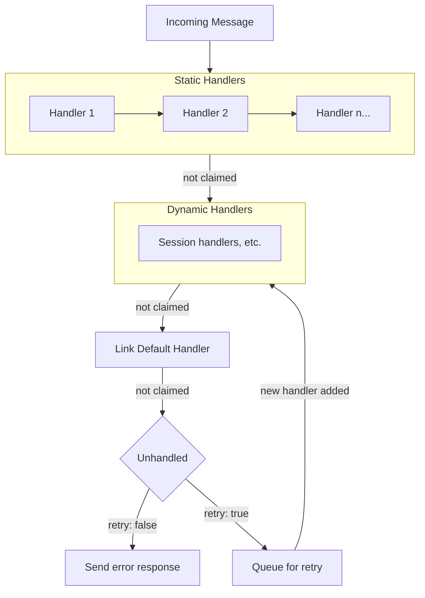
```mermaid theme={null}
flowchart TD
    MSG[Incoming Message] --> STATIC

    subgraph STATIC[Static Handlers]
        S1[Handler 1] --> S2[Handler 2] --> S3[Handler n...]
    end

    STATIC -->|not claimed| DYNAMIC

    subgraph DYNAMIC[Dynamic Handlers]
        D1[Session handlers, etc.]
    end

    DYNAMIC -->|not claimed| DEFAULT[Link Default Handler]
    DEFAULT -->|not claimed| UNHANDLED{Unhandled}

    UNHANDLED -->|retry: false| ERROR[Send error response]
    UNHANDLED -->|retry: true| QUEUE[Queue for retry]
    QUEUE -->|new handler added| DYNAMIC
```

**Static handlers** are registered at build time via `.on_receive_request()`, etc. They're tried in registration order.

**Dynamic handlers** are added at runtime via `cx.add_dynamic_handler()`. They're useful for sub-protocols where groups of related messages are identified by some kind of ID. For example, session messages all share a `session_id` - a dynamic handler can be registered for each session to handle its messages.

**Link default handler** provides fallback behavior based on the link type (e.g., proxies forward unhandled messages).

#### Message handlers

The `JrMessageHandler` trait defines how handlers work:

```rust theme={null}
pub trait JrMessageHandler: Send {
    type Link: JrLink;

    async fn handle_message(
        &mut self,
        message: MessageCx,
        cx: JrConnectionCx<Self::Link>,
    ) -> Result<Handled<MessageCx>, Error>;
}
```

The handler takes ownership of the message. If it handles the message, it returns `Handled::Yes`. If not, it returns ownership via `Handled::No { message, retry }` so the next handler can try:

```rust theme={null}
pub enum Handled<T> {
    Yes,
    No { message: T, retry: bool },
}
```

**The `retry` flag**: If any of the static or dynamic handlers returns `retry: true`, and no handler ultimately claims the message, it gets queued and offered to each new dynamic handler as it's added. This solves a race condition with sessions: messages for a session may arrive before the session's dynamic handler is registered.

The default handlers for `ClientToAgent` and `AgentToClient` already set `retry: true` for session messages with unrecognized session IDs, so you typically don't need to handle this yourself.

For convenience, handlers can return `Ok(())` which is equivalent to `Handled::Yes`.

Handlers can also modify the message before passing it along:

```rust theme={null}
.on_receive_request(async |mut req: EchoRequest, request_cx, cx| {
    req.text.push("modified".to_string());
    Ok(Handled::No {
        message: (req, request_cx),
        retry: false,
    })
}, acp::on_receive_request!())
```

#### Registering dynamic handlers

Register dynamic handlers at runtime for session-specific or protocol-specific message handling:

```rust theme={null}
let registration = cx.add_dynamic_handler(MySessionHandler::new(session_id))?;
```

When `registration` is dropped, the dynamic handler is removed. To keep it alive indefinitely, call `run_indefinitely()`:

```rust theme={null}
registration.run_indefinitely();
```

#### Default handling from link type

Each link type defines default handling for unhandled messages. For example:

* **`ClientToAgent`** - Errors on unhandled requests, ignores unhandled notifications
* **`ProxyToConductor`** - Forwards unhandled messages to the next component

You only need to register handlers for messages you want to intercept.

#### MatchMessage for implementing handlers

When implementing `JrMessageHandler` directly, `MatchMessage` provides ergonomic dispatch:

```rust theme={null}
impl JrMessageHandler for MyHandler {
    type Link = AgentToClient;

    async fn handle_message(
        &mut self,
        message: MessageCx,
        cx: JrConnectionCx<Self::Link>,
    ) -> Result<Handled<MessageCx>, Error> {
        MatchMessage::new(message)
            .if_request(async |req: InitializeRequest, request_cx| {
                request_cx.respond(InitializeResponse::new(req.protocol_version))
            })
            .if_request(async |req: PromptRequest, request_cx| {
                request_cx.respond(PromptResponse::new(StopReason::EndTurn))
            })
            .if_notification(async |notif: SessionNotification| {
                log::info!("Session update: {:?}", notif);
                Ok(())
            })
            .await
            .done()
    }
}
```

For proxies with multiple peers, `MatchMessageFrom` dispatches based on message source:

```rust theme={null}
MatchMessageFrom::new(message, &cx)
    .if_request_from(Client, async |req: PromptRequest, request_cx| {
        // Handle requests from the client
    })
    .if_notification_from(Agent, async |notif: SessionNotification| {
        // Handle notifications from the agent
    })
    .await
    .done()
```

### Error handling

Errors in handlers tear down the connection. If a handler returns an `Err`, the connection closes and all pending operations fail.

For request handlers, you can propagate error responses instead of tearing down the connection:

```rust theme={null}
.on_receive_request(async |req: ComputeRequest, request_cx, cx| {
    match process(&req) {
        Ok(result) => request_cx.respond(ComputeResponse { result }),
        Err(e) => request_cx.respond_err(JsonRpcError::new(
            ErrorCode::InvalidParams,
            format!("Failed to process: {}", e),
        )),
    }
}, acp::on_receive_request!())
```

### Writing proxies

#### Multiple peers

Simple link types like `ClientToAgent` have one remote peer. Proxy link types like `ProxyToConductor` have two: `Client` (predecessor) and `Agent` (successor).

With multiple peers, you must explicitly name which peer you're communicating with:

```rust theme={null}
ProxyToConductor::builder()
    .on_receive_notification_from(
        acp::Agent, // <-- Receive from the agent
        async |notif: SessionNotification, cx| {
            cx.send_notification_to(acp::Client, notif)?;
            //                      -----------
            //                   Send to the client
            Ok(())
        },
        acp::on_receive_notification!(),
    )
```

#### Default forwarding

For proxies, the default handling is typically `Forward` - unhandled messages pass through to the next component. You only need to register handlers for messages you want to intercept or modify.

#### Session builders for proxies

Proxies can add session-scoped handlers:

```rust theme={null}
cx.build_session_from(req)
    .on_receive_notification(async |notif: SessionNotification, cx| {
        // This handler only runs for this session
        log_notification(&notif);
        Ok(())
    }, acp::on_receive_notification!())
    .on_proxy_session_start(request_cx, async |_| Ok(()))
```

### Advanced: Defining custom link types

Link types define the relationship between peers. The SDK provides built-in types, but you can define your own:

```rust theme={null}
use acp::link::{JrLink, LinkDirection};

pub struct MyCustomLink;

impl JrLink for MyCustomLink {
    type ConnectsTo = OtherSideLink;

    fn direction() -> LinkDirection {
        LinkDirection::Outbound // We initiate the connection
    }

    fn default_request_handling() -> DefaultHandling {
        DefaultHandling::Error // Unknown requests return an error
    }

    fn default_notification_handling() -> DefaultHandling {
        DefaultHandling::Ignore // Unknown notifications are silently dropped
    }
}
```

## Shiny future

> How will things play out once this feature exists?

### Unified Rust ACP experience

The Rust ecosystem will have a single SDK for ACP development. Whether you're building a simple client, a proxy chain, or a programmatic orchestration framework like patchwork-rs, the same SDK handles all cases.

### Smooth transition from the current SDK

The new SDK is more ergonomic than the current trait-based approach, so migration should be straightforward for most users. The builder pattern with context parameters (`cx`) replaces the `AgentSideConnection` pattern, and the directional naming (`ClientToAgent` vs `AgentSideConnection`) makes code clearer.

We can provide migration guidance and potentially a thin compatibility layer for common patterns, but most users will find the new code simpler than the old.

### Potential crate reorganization

Currently, `agent-client-protocol` contains both generic JSON-RPC machinery (builder patterns, message handling, connection management) and ACP-specific types (link types, schema integration). In the future, it might be valuable to split the generic JSON-RPC layer into its own crate.

However, this is complicated by the trait implementations: the generic traits need to be implemented for ACP types currently defined in the schema crate. We'd need to carefully consider where type definitions live to avoid orphan rule issues. This reorganization isn't blocking for the initial adoption.

### Cross-language SDK alignment

The design principles here - builder patterns, context parameters, directional naming, component abstractions - aren't Rust-specific. They represent good SDK design that could inform TypeScript and other language SDKs.

This doesn't mean other SDKs should be ports of the Rust SDK. Each language has its own idioms. But the core ideas (explicit message ordering, composable components, context in callbacks) translate across languages.

### Foundation for protocol evolution

The builder pattern and component model make it easier to evolve the ACP protocol. New methods can be added without breaking existing code. New component types (beyond client/agent/proxy) can be introduced by implementing the Component trait.

## Implementation details and plan

> Tell me more about your implementation. What is your detailed implementation plan?

### Crate structure

The new SDK is organized into several crates with clear responsibilities:

* **`agent-client-protocol`** - Core SDK with builder patterns, link types, and component abstractions
* **`agent-client-protocol-tokio`** - Tokio runtime integration (spawn, timers, I/O)
* **`agent-client-protocol-rmcp`** - Bridge to the rmcp crate for MCP integration
* **`agent-client-protocol-conductor`** - Reference conductor implementation
* **`agent-client-protocol-derive`** - Derive macros for JSON-RPC traits
* **`agent-client-protocol-test`** - Test utilities and mock implementations
* **`agent-client-protocol-tee`** - Debugging proxy that logs all traffic
* **`agent-client-protocol-trace-viewer`** - Interactive sequence diagram viewer for trace files

### Current status

A working implementation exists in the [symposium-dev/symposium-acp](https://github.com/symposium-dev/symposium-acp) repository and is published on crates.io. It powers:

* The conductor (proxy chain orchestration)
* patchwork-rs (programmatic agent orchestration)
* Symposium (Rust development environment)

### Migration path

The transition involves importing the `sacp` implementation into this repository:

1. **Import `sacp` crates** into this repository with the new `agent-client-protocol-*` naming
2. **Release `agent-client-protocol` v1.0** with the new builder-based API
3. **Deprecate `sacp` crates** on crates.io, pointing users to the `agent-client-protocol` family
4. **Provide migration guidance** for users of the current v0.x SDK

Most users will find the migration straightforward - the builder pattern is more ergonomic than the trait-based approach, so the new code is often simpler than the old.

## Frequently asked questions

> What questions have arisen over the course of authoring this document or during subsequent discussions?

### What alternative approaches did you consider?

We first attempted to build on the existing SDK but due to the limitations decided to try an alternative approach.

### What about other language SDKs?

We would like to try and adapt these ideas to other languages. It would be good if the SDKs for all languages took the same general approach. Most of the concerns in this document are not Rust-specific, though as often happens, the limitations become more annoying in Rust because of the limits imposed by the ownership system.

### How does this relate to the Proxy Chains and MCP-over-ACP RFDs?

This expanded SDK design is motivated by working through the use cases enabled by [proxy chains](./proxy-chains) and [MCP-over-ACP](./mcp-over-acp).

### How well-tested is this design?

The design has been used for a wide range of projects but the majority were written by the SDK author, though Amazon's kiro-cli team and the Goose client adopted sacp for their use case with minimal difficulty. Before we finalize the design, it would be good to have more adopters to help ensure that it meets all common needs.

### Can I derive `JrRequest`/`JrNotification` on enums?

Not currently. The derive macros only support structs with a single method name. For enums that group related messages (e.g., all session-related requests), you would need to implement the traits manually.

This is a potential future enhancement - enum derives could dispatch to different methods per variant, which would be useful for `MessageCx<Req, Notif>` typed handlers. For now, use the untyped `MessageCx` with `MatchMessage` for this pattern.

### What changes are needed before stabilizing?

We are in the process of changing how response messages work to simplify the implementation of the conductor. Before stabilizing we should do a thorough review of the methods and look for candidates that can be removed or simplified.

The conductor is feature complete but the support for MCP-over-ACP needs a few minor improvements (in particular, it should detect when the agent only supports stdio bridging and not attempt to use HTTP, which it currently does not).

## Revision history

* Initial draft based on working implementation in symposium-acp repository.


# Session Config Options
Source: https://agentclientprotocol.com/rfds/session-config-options


Author(s): [@benbrandt](https://github.com/benbrandt)

## Elevator pitch

> What are you proposing to change?

Allow Agents to provide an arbitrary list of configuration selectors for a given session. Rather than only supporting modes or models, we can allow each Agent to more flexibly specify which configurations to allow the Client to offer the user.

## Status quo

> How do things work today and what problems does this cause? Why would we change things?

Currently, we allow Agents to [specify a list of modes](https://agentclientprotocol.com/protocol/session-modes) they can run in. The state of the currently selected item is allowed to be modified by both the [Client](https://agentclientprotocol.com/protocol/session-modes#from-the-client) and the [Agent](https://agentclientprotocol.com/protocol/session-modes#from-the-agent).

The obvious next selector was a [model selector](https://github.com/agentclientprotocol/agent-client-protocol/pull/182). However, when implementing this, it became clear that even for our current agents, it is not just as simple as "which model do you want?", but also which variant of a given model in terms of thinking parameters that might be better to express as yet another selector.

Adding more hard-coded selector options would potentially lead the protocol to need to support many optional ones, or implementors would need to try to find the best existing selector to hack an option into if there wasn't an obvious fit. And if, a few months from now, no agents support something like a mode or reasoning selector, the protocol is left with leftover methods no one really uses, cluttering the interface.

Since this space is moving fast, we ideally would find a more flexible option with enough constraints to allow Clients and Agents to both reason about the options provided.

## What we propose to do about it

> What are you proposing to improve the situation?

Instead, we can allow Agents to provide configuration options in the `session/new` response that not only provide a list of options, but also a `key` of some kind that is a unique identifier for that selector.

Additionally, we can optionally allow an Agent to mark each option with a semantic category so that Clients can reliably distinguish broadly common option types (e.g. model selector vs session mode selector vs thought/reasoning level), without needing to infer meaning from the option `id` or `name`. This is intended for UX only (e.g. keyboard shortcuts, icons, preferred placement), and MUST NOT be required for correctness.

When the Client receives or sends an update to this selector, it would require both the selector key and the key for the new value.

To start, we could continue offering single-value selectors (dropdowns), but allow for the Agent to decide what those are for.

## Shiny future

> How will things will play out once this feature exists?

The Agent provides a list of available configuration options. The Agent cannot rely on the Client to set or even display these options, as it may not support it. So an Agent MUST always have a default configuration value for every option it provides, and MUST be able to run a turn without these configuration options being set.

The Client can render the options provided, send updated values to the Agent, and also display any changes the Agent made during the course of it's execution (for example, if it changes modes or models because of fallbacks or a change in strategy, so that the user can always see the current state).

Since we are moving to a world in which there are multiple configuration options, some of which may depend on each other, the Agent MUST provide the complete set of configuration options and their current values whenever a change is made. We would tradeoff some extra data being sent to the Client in order to help minimize the amount of state required to be managed by the Client. The Client would submit a new value, and receive back the full state of all configuration options that it can then replace it's current state with and render. So if changing a model means there are no thinking options, or a new option becomes available, or another value needs to change because the values of an option are different, the Agent will reflect this in its response by providing the entire new state (or an error if it is somehow an invalid selection).

## Implementation details and plan

> Tell me more about your implementation. What is your detailed implementation plan?

To start, we can implement this based on the [Session Modes](https://agentclientprotocol.com/protocol/session-modes) api.

Something like an `InitializeResponse` that looks like:

```json theme={null}
{
  "jsonrpc": "2.0",
  "id": 1,
  "result": {
    "sessionId": "sess_abc123def456",
    "configOptions": [
      {
        "id": "mode", // this is the unique `key` for communication about which option is being used
        "name": "Session Mode", // Human-readable label for the option
        "description": "Optional description for the Client to display to the user."
        "category": "mode",
        "type": "select",
        "currentValue": "ask",
        "options": [
          {
            "value": "ask",
            "name": "Ask",
            "description": "Request permission before making any changes"
          },
          {
            "value": "code",
            "name": "Code",
            "description": "Write and modify code with full tool access"
          }
        ]
      },
      {
        "id": "models",
        "name": "Model",
        "category": "model",
        "type": "select",
        "currentValue": "ask",
        "options": [
          {
            "value": "model-1",
            "name": "Model 1",
            "description": "The fastest model"
          },
          {
            "value": "model-2",
            "name": "Model 2",
            "description": "The most powerful model"
          }
        ]
      }
    ]
  }
}
```

### Option category (optional)

Each top-level config option MAY include an optional `category` field. This is intended to help Clients distinguish broadly common selectors and provide a consistent UX (for example, attaching keyboard shortcuts to the first option of a given category).

In addition to `category`, Clients SHOULD use the ordering of the `configOptions` array as provided by the Agent as the primary way to establish priority and resolve ties. For example, if multiple options share the same `category`, a Client can prefer the first matching option in the list when assigning keyboard shortcuts or deciding which options to surface most prominently.

`category` is semantic metadata and MUST NOT be required for correctness. Clients MUST handle missing or unknown categories gracefully.

Category names beginning with `_` are free for custom use. Category names that do not begin with `_` are reserved for the ACP spec.

Proposed enum:

* `mode` - Session mode selector
* `model` - Model selector
* `thought_level` - Thought/reasoning level selector
* Any string beginning with `_` - Custom category (e.g., `_my_custom_category`)

When we introduce this, we could also allow for grouped options, in case there are logical sub-headers and groupings for the options in an individual selector.

```json theme={null}
{
  "id": "models",
  "name": "Model",
  "currentValue": "ask",
  "type": "select",
  "options": [
    {
      "group": "Provider A",
      "options": [
        {
          "value": "model-1",
          "name": "Model 1",
          "description": "The fastest model"
        }
      ]
    },
    {
      "group": "Provider B",
      "options": [
        {
          "value": "model-2",
          "name": "Model 2",
          "description": "The most powerful model"
        }
      ]
    }
  ]
}
```

We use a list of objects for all of these, to ensure consistent ordering of both the config options and the possible values across languages that may or may not preserve ordering.

For grouping options, it needs to be explored whether or not grouped and ungrouped options can be interspersed, or if we need to restrict to one mode or the other (likely the latter).

For updating the value from the client and agent, it would follow the same pattern as [session modes](https://agentclientprotocol.com/protocol/session-modes#from-the-client) but have an additional key.

```json theme={null}
{
  "jsonrpc": "2.0",
  "id": 2,
  "method": "session/set_config_option",
  "params": {
    "sessionId": "sess_abc123def456",
    "configId": "mode",
    "value": "code"
  }
}
```

And the response to this request would return the full list of config options with current values.

```json theme={null}
{
  "jsonrpc": "2.0",
  "id": 2,
  "result": {
    "configOptions": [
      {
        "id": "mode",
        "name": "Session Mode",
        "type": "select",
        "currentValue": "ask",
        "options": [..]
      },
      {
        "id": "models",
        "name": "Model",
        "type": "select",
        "currentValue": "ask",
        "options": [..]
      }
    ]
  }
}
```

The notification would return the full list of config options with current values as well.

```json theme={null}
{
  "jsonrpc": "2.0",
  "method": "session/update",
  "params": {
    "sessionId": "sess_abc123def456",
    "update": {
      "sessionUpdate": "config_option_update",
      "configOptions": [
        {
          "id": "mode",
          "name": "Session Mode",
          "type": "select",
          "currentValue": "ask",
          "options": [..]
        },
        {
          "id": "models",
          "name": "Model",
          "type": "select",
          "currentValue": "ask",
          "options": [..]
        }
      ]
    }
  }
}
```

We would also likely move session modes to be `@deprecated` in favor of this approach. Until it is removed, we may want Agents to support both fields, and then the Client, if it uses the new config options, should only use the config options supplied and not the `modes` field to avoid duplication.

The config options would also take a `type` field to specify different forms of input for the Client to display. If a client receives an option it doesn't recognize, it should ignore it. Since the Agent is required to have a default value, it can gracefully degrade and ignore the option and the Agent should handle it regardless. The Client should also treat the list of options as prioritized by the Agent. So, if for some reason the Agent provides more options than the Client can reasonably display, the Client should show as many as possible, starting at the beginning of the list.

We will start with just supporting `select` for now, and expand to other types as needed.

## Frequently asked questions

> What questions have arisen over the course of authoring this document or during subsequent discussions?

### What alternative approaches did you consider, and why did you settle on this one?

As noted, the Zed team already looked into and implemented experimental support for a model selector.

However, this has already diverged from how the Codex CLI is modeling their model selector as of last week, so it seems reasonable to, as per a core design principle of the protocol, only limit the Agent implementations where necessary for the Client to render a faithful UX. Maximizing flexibility for the Agent as they iterate on the best way to model new paradigms seems key here, and it is unclear whether the Client benefits from knowing which type of selector this is.

We originally discussed internally having a design closer to this proposal, however walked it back thinking it would be helpful for the Client to know what was being selected. However, as we've now dealt with multiple Agent implementations, it is unclear if this has actually helped the Client, and allowing for more flexibility seems desirable.

### What about connection-level configuration options?

This RFD is only concerned with session-level configuration, for which it seems reasonable to require that the Agent can select a default value at all times and not require input from the client before continuing.

There seems to be another type of configuration option that is needed when first setting up an Agent (i.e. provider options, plugins, etc.) that are more persistent and may be required by an Agent prior to being able to create a session. These would need to be tackled somewhere closer to the initialization phase, or elsewhere and are out of scope for this RFD.

### What about multi-value selectors? or checkboxes? Or *insert favorite input option here*?

This is a question we should discuss of how much complexity we want to introduce for the first version, and how we want to express this to via Client capabilities to allow for more option types in the future.

## Revision history

* 2025-10-29: Initial draft
* 2026-01-09: Add option categories
* 2026-01-15: Allow for category extensions


# Forking of existing sessions
Source: https://agentclientprotocol.com/rfds/session-fork


* Author(s): [@josevalim](https://github.com/josevalim)
* Champion: [@benbrandt](https://github.com/benbrandt)

## Elevator pitch

> What are you proposing to change?

We propose adding the ability to "fork" a new session based on an existing one.
This will allow us to use the current conversation as context to generate pull
request descriptions, summaries, etc. without polluting the user history.

## Status quo

> How do things work today and what problems does this cause? Why would we change things?

Imagine we want to summarize the current conversation to use it in a future chat. If we send a message
asking for the summary, it will become part of its context, affecting future user interactions.
Therefore we want to be able to fork a session, issue additional messages, and then close the fork.

## What we propose to do about it

> What are you proposing to improve the situation?

To add a "session/fork" method.

## Shiny future

> How will things will play out once this feature exists?

We will be able to implement functionality that requires using the current chat
without polluting its history, ranging from summaries to potentially subagents.

I can also see this feature being extended in the future to support an optional
message ID, so the fork happens at a specific message, allowing clients to implement
functionality like editing previous messages and similar.

## Implementation details and plan

> Tell me more about your implementation. What is your detailed implementation plan?

We propose to add a new "session/fork" method. Agents must declare this option is
available by returning `session: { fork : {} }` in its capabilities. The object is reserved
to declare future capabilities, such as forking from a specific message, a tool call, or similar.

Then the client would be able to request a fork of the given session:

```json theme={null}
{
  "jsonrpc": "2.0",
  "id": 1,
  "method": "session/fork",
  "params": {
    "sessionId": "sess_789xyz",
    "cwd": "...",
    "mcpServers": [...]
  }
}
```

The request expects the same options as `session/load`, such as `cwd` and `mcpServers`.

Similarly, the agent would respond with optional data such as config options, the same as `session/load`.

Agents may reply with an error if forking of that specific session or with the given options is not supported,
for example if the agent does not support forking with a different working directory than the initial session.

## Frequently asked questions

> What questions have arisen over the course of authoring this document or during subsequent discussions?

**Q: Should a new method be introduced or should "session/new" be expanded?**

They must be different because they will effectively require different options.
For example, "session/new" has options such as capabilities and MCP which are not
recommended to be set when forking, as the context being forked was built with other
tools, and forking may accept a messageId for checkpoints.

**Q: Should fork only accept the `sessionId` or also other options, similar to `session/load`?**

Initially, we proposed to only accept the `sessionId`, but this would make it more difficult to
allow forking of inactive sessions in agents like `claude-code-acp`, as Claude does not retain the
configured MCP servers of a session. Limiting fork to only already active sessions would limit its usefulness.

Moreover, allowing to pass different options also allows features like dynamically adding MCP servers
to existing sessions to work by forking them with the new options, if the agent supports it. If it
does not, the client can still show an appropriate error message.

### What alternative approaches did you consider, and why did you settle on this one?

None. This proposal is inspired by the abilities exposed in Claude Agent SDK. It must be validated against other agents too.

## Revision history

* 2025-11-17: Mentioned capabilities format, updated FAQ.
* 2025-11-20: Added request format and updated capabilities format.
* 2025-12-10: Adjust fork options to align with `session/load`.


# Session Info Update
Source: https://agentclientprotocol.com/rfds/session-info-update


* Author(s): [@ignatov](https://github.com/ignatov)

## Elevator pitch

Add a `session_info_update` variant to the existing `SessionUpdate` notification type that allows agents to update session metadata (particularly title/name), enabling dynamic session identification in client UIs without requiring a new endpoint.

## Status quo

Currently, the ACP protocol provides session management through `session/new`, `session/load`, and `session/list` (unstable). The `session/list` endpoint returns `SessionInfo` objects that include an optional `title` field for displaying session names in client UIs.

However, there are several problems:

1. **No way to communicate title updates** - The `title` field in `SessionInfo` is static in the list response. Agents cannot dynamically update it as the session evolves.

2. **No mechanism for real-time metadata updates** - Unlike commands (`available_commands_update`) or modes (`current_mode_update`), there's no way for agents to:
   * Auto-generate titles after the first meaningful exchange
   * Update titles as conversation context shifts
   * Provide custom metadata that reflects session state

3. **Inconsistent with protocol patterns** - Other dynamic session properties use `session/update` notifications (commands, modes, plans), but metadata has no equivalent mechanism.

The current workaround is for clients to:

* Maintain their own title mapping (doesn't persist or sync)
* Only show static metadata from `session/list`
* Have no way to receive agent-generated titles in real-time

## What we propose to do about it

Add a new `session_info_update` variant to the existing `SessionUpdate` discriminated union that allows agents to notify clients about metadata changes. This update would:

1. **Follow the existing `SessionUpdate` pattern**:
   * Uses the same notification mechanism as `available_commands_update`, `current_mode_update`, etc.
   * Sent via `session/update` method
   * Agent-initiated, no request/response needed

2. **Align with `SessionInfo` structure**:
   * Contains the same fields as `SessionInfo` from `session/list`
   * All fields are optional (partial updates)
   * Enables incremental metadata updates
   * **Important**: `SessionInfoUpdate` must stay aligned with `SessionInfo` - when new fields are added to `SessionInfo`, they should also be added to `SessionInfoUpdate` as optional fields

3. **Support common use cases**:
   * Agent auto-generates title after first prompt
   * Agent updates title as conversation context shifts
   * Agent provides custom metadata for client features (tags, status, etc.)
   * User explicitly requests title change (agent responds with update notification)

4. **Integrate seamlessly**:
   * No new capability required (uses existing `session/update` mechanism)
   * Compatible with `session/list` - metadata should persist and be reflected in list responses
   * Works during active sessions

### Notification Structure

The agent sends a `session/update` notification with `sessionUpdate: "session_info_update"`:

```json theme={null}
{
  "jsonrpc": "2.0",
  "method": "session/update",
  "params": {
    "sessionId": "sess_abc123def456",
    "update": {
      "sessionUpdate": "session_info_update",
      "title": "Implement user authentication",
      "_meta": {
        "tags": ["feature", "auth"],
        "priority": "high"
      }
    }
  }
}
```

### SessionInfoUpdate Type

The update type mirrors `SessionInfo` but with all fields optional:

```typescript theme={null}
{
  sessionUpdate: "session_info_update",
  title?: string | null,           // Update or clear the title
  updatedAt?: string | null,        // ISO 8601 timestamp (usually agent sets this)
  _meta?: object | null             // Custom metadata (merged with existing)
}
```

**Note:** `sessionId` and `cwd` are NOT included since:

* `sessionId` is already in the notification's `params`
* `cwd` is immutable and set during `session/new`

### Examples

#### Update title and working directory metadata

After the user sends their first meaningful prompt, the agent can generate and send a title along with metadata about the working directory:

```json theme={null}
{
  "jsonrpc": "2.0",
  "method": "session/update",
  "params": {
    "sessionId": "sess_abc123def456",
    "update": {
      "sessionUpdate": "session_info_update",
      "title": "Debug authentication timeout",
      "_meta": {
        "projectName": "api-server",
        "branch": "main"
      }
    }
  }
}
```

#### Update title as conversation evolves

As the conversation shifts focus:

```json theme={null}
{
  "jsonrpc": "2.0",
  "method": "session/update",
  "params": {
    "sessionId": "sess_abc123def456",
    "update": {
      "sessionUpdate": "session_info_update",
      "title": "Debug authentication timeout → Add retry logic"
    }
  }
}
```

## Shiny future

Once this feature exists:

1. **Dynamic session identification** - Agents can:
   * Auto-generate meaningful titles from conversation content
   * Update titles as conversations evolve
   * Provide rich metadata for better organization

2. **Improved client UIs** - Clients can:
   * Show real-time title updates in session lists
   * Display session status, tags, or other metadata
   * Update UI immediately without polling `session/list`

3. **Consistent protocol patterns** - Session metadata updates work like other dynamic session properties (commands, modes), creating a unified model

4. **Bidirectional workflows** - Combined with a potential future request method:
   * User renames session → client sends request → agent acknowledges with `session_info_update` notification
   * Agent auto-generates title → sends `session_info_update` notification → client displays it

5. **Enhanced use cases**:
   * Session templates that auto-set titles and tags
   * Progress indicators via `_meta`
   * Integration with external tools via metadata
   * Rich session browsing and filtering

## Implementation details and plan

### Phase 1: Schema Changes

1. **Update `schema.unstable.json`**:
   * Add `SessionInfoUpdate` type definition
   * Add new variant to `SessionUpdate` oneOf array
   * Align fields with `SessionInfo` but make all optional

```json theme={null}
{
  "SessionInfoUpdate": {
    "description": "**UNSTABLE**\n\nThis capability is not part of the spec yet, and may be removed or changed at any point.\n\nUpdate to session metadata. All fields are optional to support partial updates.",
    "properties": {
      "_meta": {
        "description": "Extension point for implementations"
      },
      "title": {
        "description": "Human-readable title for the session",
        "type": ["string", "null"]
      },
      "updatedAt": {
        "description": "ISO 8601 timestamp of last activity",
        "type": ["string", "null"]
      }
    },
    "type": "object"
  }
}
```

Add to `SessionUpdate` oneOf:

```json theme={null}
{
  "allOf": [
    {
      "$ref": "#/$defs/SessionInfoUpdate"
    }
  ],
  "description": "**UNSTABLE**\n\nThis capability is not part of the spec yet, and may be removed or changed at any point.\n\nUpdate to session metadata",
  "properties": {
    "sessionUpdate": {
      "const": "session_info_update",
      "type": "string"
    }
  },
  "required": ["sessionUpdate"],
  "type": "object"
}
```

### Phase 2: Protocol Documentation

2. **Create documentation** in `/docs/protocol/session-metadata.mdx`:
   * Explain the notification mechanism
   * Provide examples of common patterns
   * Document merge semantics for `_meta`
   * Clarify relationship with `session/list`

3. **Update existing docs**:
   * Reference in `/docs/protocol/session-setup.mdx`
   * Add to `/docs/protocol/prompt-turn.mdx` session update section

### Phase 3: SDK Implementation

4. **Implement in Rust SDK**:
   * Add `SessionInfoUpdate` struct
   * Add variant to `SessionUpdate` enum
   * Update notification handling in agent and client traits
   * Add helper methods for common patterns

5. **Implement in TypeScript SDK** (if applicable):
   * Add TypeScript types
   * Update notification handlers
   * Add helper methods

### Phase 4: Example Implementation

6. **Update example agents**:
   * Demonstrate auto-generating title from first prompt
   * Show updating metadata during session
   * Example of using `_meta` for custom fields

### Compatibility Considerations

* **Fully backward compatible**: This adds a new notification variant to an existing mechanism
* **No breaking changes**: Existing agents and clients continue working
* **Graceful degradation**: Clients that don't handle this notification simply ignore it
* **No new capability needed**: Uses existing `session/update` infrastructure

### Design Decisions

**Why notification instead of request/response?**

* Consistent with existing `SessionUpdate` patterns (`available_commands_update`, `current_mode_update`)
* Agents initiate updates based on conversation state
* Simpler than bidirectional request/response
* Enables real-time updates without polling

**Why make all fields optional?**

* Allows partial updates (only update what changed)
* More efficient - don't resend unchanged data
* Flexible for different use cases
* Mirrors partial update patterns in other protocols

**Why not include `sessionId` and `cwd` in the update?**

* `sessionId` is already in the notification params
* `cwd` is immutable (set in `session/new`, never changes)
* Keeps update focused on mutable metadata

**How do `_meta` updates work?**

* **Merge semantics**: New `_meta` fields are merged with existing ones
* To clear a specific field: `"_meta": { "fieldName": null }`
* To clear all custom metadata: `"_meta": null`

### Security Considerations

* **No additional security concerns**: Uses existing session authentication
* **Input validation**:
  * Agents should validate title length (recommend 500 chars max)
  * Sanitize metadata to prevent injection
  * Validate `_meta` structure based on agent requirements
* **Resource limits**: Agents should limit update frequency and metadata size

## Frequently asked questions

### Why not create a new endpoint like `session/update-metadata`?

The notification pattern is more appropriate because:

1. **Consistency**: Other dynamic session properties (commands, modes) use notifications
2. **Agent-initiated**: Agents typically generate titles from conversation context
3. **Real-time**: No request/response overhead, updates flow naturally
4. **Simpler**: Reuses existing `session/update` infrastructure

### How does this work with `session/list`?

The updated metadata should persist and be reflected in subsequent `session/list` calls. The notification provides real-time updates to connected clients, while `session/list` provides the current state for discovery.

### Can clients trigger title updates?

This RFD covers agent-initiated updates. Client-initiated updates could work by:

1. Client sends a prompt asking to rename session
2. Agent updates its internal state
3. Agent sends `session_info_update` notification
4. Client receives and displays the update

A future RFD could add explicit request/response for this if needed.

### What if multiple updates are sent in quick succession?

Clients should apply updates incrementally in order. Each notification represents a delta, not a full replacement (except for fields explicitly set to `null`).

### Should `updatedAt` be automatically set by the agent?

Yes, typically the agent should update this timestamp when any session activity occurs, not just when metadata changes. However, including it in `session_info_update` allows agents to explicitly control it if needed.

### Do agents need a new capability for this?

No. All agents that support `session/update` notifications can send this variant. Clients that don't recognize it will ignore it (standard JSON-RPC behavior).

### How does this interact with `session/fork`?

When forking, the parent session's metadata could be copied (implementation choice). The forked session would have its own `sessionId` and could receive separate `session_info_update` notifications.

### What happens if title is too long?

This is an implementation choice. Agents MAY:

* Truncate long titles
* Reject updates (though this is a notification, so no error response)
* Set a reasonable limit (e.g., 500 characters)

Clients SHOULD handle long titles gracefully (truncate in UI, show tooltip, etc.).

### Can `_meta` have nested objects?

Yes, `_meta` is an arbitrary object. Agents define its structure. The merge semantics apply recursively - nested objects are merged, not replaced entirely.

### What alternative approaches did you consider, and why did you settle on this one?

Several alternatives were considered:

1. **Add a new request/response endpoint (`session/update-metadata`)** - This would be inconsistent with how other dynamic session properties (commands, modes) are handled. The notification pattern is more appropriate for agent-initiated updates.

2. **Add title parameter to `session/new`** - Only allows setting title at creation time, doesn't support dynamic updates as the conversation evolves.

3. **Client-side only metadata tracking** - Doesn't work across devices, can get out of sync, and duplicates storage. This is the current workaround and has significant limitations.

4. **Generic `session/update` request for all properties** - Could conflict with immutable properties (sessionId, cwd) and has unclear semantics about what can be updated.

The proposed notification-based approach:

* **Consistent** with existing protocol patterns
* **Flexible** for both agent-initiated and user-initiated updates
* **Simple** to implement and understand
* **Extensible** via `_meta` field

## Revision history

* **2025-11-28**: Initial draft proposal


# Session List
Source: https://agentclientprotocol.com/rfds/session-list


* Author(s): [@ahmedhesham6](https://github.com/ahmedhesham6)
* Champion: [@benbrandt](https://github.com/benbrandt)

## Elevator pitch

Add a `session/list` endpoint to the ACP protocol that allows clients to query and enumerate existing sessions from an agent, enabling session management features like session history, session switching, and session cleanup.

## Status quo

Currently, the ACP protocol provides session management through `session/new` and `session/load` endpoints. However, there is no way for clients to:

1. **Discover existing sessions** - Clients cannot query what sessions exist on an agent
2. **Display session history** - Users cannot see a list of their past conversations
3. **Manage multiple sessions** - Switching between sessions requires clients to track session IDs themselves
4. **Clean up old sessions** - No way to discover stale or abandoned sessions for cleanup

This creates several problems:

* **Poor user experience** - Users cannot browse their conversation history or resume previous sessions easily
* **Client-side complexity** - Each client must implement its own session tracking and persistence
* **Inconsistent behavior** - Different clients handle session management differently, leading to fragmented experiences

The current workaround is for clients to maintain their own session registry, but this:

* Requires persistent storage on the client side
* Can get out of sync if sessions are created/destroyed outside the client
* Doesn't work across different client instances or devices
* Cannot leverage agent-side session metadata or state

## What we propose to do about it

Add a new `session/list` JSON-RPC method to the protocol that returns metadata about sessions known to the agent. This endpoint would:

1. **Return a list of sessions** with essential metadata:
   * `sessionId` - Unique identifier
   * `cwd` - Working directory for the session
   * `title` - Optional human-readable title (could be auto-generated from first prompt)
   * `updatedAt` - Timestamp of last update to the session
   * `_meta` - Optional agent-specific metadata
2. **Support filtering and pagination**:
   * Filter by working directory
   * Agent provides an optional cursor for retrieving the next page of results
3. **Be an optional capability**:
   * Agents advertise `sessionCapabilities: { list: {} }` in initialization if they support this feature
   * Clients check for this capability before attempting to call `session/list`
   * Agents without persistent session storage don't need to implement this

### JSON-RPC Request

The client calls `session/list` with optional filtering and pagination parameters:

```json theme={null}
{
  "jsonrpc": "2.0",
  "id": 2,
  "method": "session/list",
  "params": {
    "cwd": "/home/user/project",
    "cursor": "eyJwYWdlIjogMn0="
  }
}
```

#### Request Parameters

All parameters are optional:

* `cwd` (string) - Filter sessions by working directory
* `cursor` (string) - Opaque cursor token from a previous response's `nextCursor` field for cursor-based pagination

#### Minimal Request Example

A request with no filters returns all sessions with default sorting:

```json theme={null}
{
  "jsonrpc": "2.0",
  "id": 2,
  "method": "session/list",
  "params": {}
}
```

### JSON-RPC Response

The agent responds with a list of sessions and cursor pagination metadata:

```json theme={null}
{
  "jsonrpc": "2.0",
  "id": 2,
  "result": {
    "sessions": [
      {
        "sessionId": "sess_abc123def456",
        "updatedAt": "2025-10-29T14:22:15Z",
        "cwd": "/home/user/project",
        "title": "Implement session list API",
        "_meta": {
          "messageCount": 12,
          "hasErrors": false
        }
      },
      {
        "sessionId": "sess_xyz789ghi012",
        "updatedAt": "2025-10-28T16:45:30Z",
        "cwd": "/home/user/another-project",
        "title": "Debug authentication flow"
      },
      {
        "sessionId": "sess_uvw345rst678",
        "updatedAt": "2025-10-27T15:30:00Z",
        "cwd": "/home/user/project"
      }
    ],
    "nextCursor": "eyJwYWdlIjogM30="
  }
}
```

#### Response Fields

**Response object:**

* `sessions` (array) - Array of session information objects
* `nextCursor` (string, optional) - Opaque cursor token. If present, pass this in the next request's `cursor` parameter to fetch the next page. If absent, there are no more results.

**SessionInfo object:**

* `sessionId` (string, required) - Unique identifier for the session
* `cwd` (string, required) - Working directory for the session
* `title` (string, optional) - Human-readable title (may be auto-generated from first prompt)
* `updatedAt` (string, optional) - ISO 8601 timestamp of last activity
* `_meta` (object, optional) - Agent-specific metadata (e.g., message count, error status, tags)

#### Empty Result Example

When no sessions match the criteria:

```json theme={null}
{
  "jsonrpc": "2.0",
  "id": 2,
  "result": {
    "sessions": []
  }
}
```

## Shiny future

Once this feature exists:

1. **Clients can build session browsers** - Users can view a list of all their conversations, sorted by recency or relevance
2. **Session switching becomes seamless** - Users can easily switch between ongoing conversations
3. **Better resource management** - Clients can identify and clean up old or inactive sessions
4. **Cross-device continuity** - Users could potentially access their sessions from different devices (if agent supports it)
5. **Improved UX patterns**:
   * "Recent conversations" sidebar
   * Search through past sessions
   * Archive/delete old sessions
   * Resume interrupted work easily

Agents that implement this feature gain:

* Better visibility into active sessions
* Opportunity to implement session lifecycle policies
* Foundation for future features like session sharing or collaboration

## Implementation details and plan

### Phase 1: Core Protocol Changes

1. **Update schema.json** to add:
   * `session/list` method definition
   * `ListSessionsRequest` and `ListSessionsResponse` types
   * `SessionInfo` type
   * `sessionCapabilities/list` capability flag

2. **Update protocol documentation** in `/docs/protocol/session-setup.mdx`:
   * Document the new endpoint
   * Explain when to use it vs. maintaining client-side session tracking
   * Provide examples of common use cases

### Phase 2: Reference Implementation

3. **Implement in Rust SDK** (`src/agent.rs` and `src/client.rs`):
   * Add `list_sessions` method to agent trait
   * Provide default implementation (empty list) for agents without persistence
   * Add client method to call `session/list`

4. **Add to TypeScript SDKs** (if applicable):
   * Update TypeScript types
   * Add client methods

### Phase 3: Example Implementation

5. **Create example agent** that demonstrates:
   * In-memory session registry
   * Automatic title generation from first prompt
   * Session lifecycle management (cleanup after N days)
   * Pagination and filtering

### Compatibility Considerations

* **Backward compatible**: Existing agents continue working without implementing this
* **Capability-based**: Clients check for `listSessions` capability before using
* **No breaking changes**: No modifications to existing endpoints

### Security Considerations

* **Session isolation**: Agents must ensure sessions are only listed for the authenticated client
* **Resource limits**: Agents should enforce reasonable page sizes internally to prevent abuse

## Frequently asked questions

### What alternative approaches did you consider, and why did you settle on this one?

Several alternatives were considered:

1. **Client-side session tracking only** - This is the current approach, but it has limitations:
   * Doesn't work across devices
   * Can get out of sync
   * Adds complexity to every client implementation

2. **Session events/notifications** - Push notifications when sessions are created/destroyed:
   * More complex to implement
   * Requires long-lived connections
   * Still requires client-side state management
   * Better suited as a future enhancement, not a replacement

3. **File-based session manifest** - Agent writes session list to a file that clients read:
   * Couples agent and client file system access
   * Doesn't work for remote agents
   * No standard format

The proposed RPC approach is:

* **Consistent with existing protocol design** - Uses same RPC patterns as other endpoints
* **Flexible** - Supports filtering, pagination, and agent-specific metadata
* **Optional** - Agents can opt-in based on their architecture
* **Simple** - Single request/response pattern, easy to implement and use

### Why not make this mandatory for all agents?

Many agents may not have persistent storage or multi-session capabilities. Making this optional:

* Allows simple, stateless agents to remain compliant
* Reduces implementation burden
* Lets agents evolve session management over time

### How does this interact with `session/load`?

`session/load` remains the mechanism to actually restore a session. `session/list` is for discovery only:

1. Client calls `session/list` to get available sessions
2. User selects a session
3. Client calls `session/load` with the chosen `sessionId`

Agents may support `session/list` without supporting `session/load` (e.g., for read-only session browsing).

### Should we include session content in the list response?

No, for several reasons:

* **Performance** - Full conversation history could be large
* **Privacy** - Listing sessions might be less sensitive than exposing full content
* **Separation of concerns** - Use `session/load` to get full session content

### What about session deletion?

Session deletion is intentionally left out of this RFD to keep scope focused. A future `session/delete` endpoint could be proposed separately. For now, agents can implement their own lifecycle policies.

### How should pagination work for large session lists?

We use cursor-based pagination:

* Request includes an optional `cursor`
* Response includes `nextCursor` when more results are available
* Clients should treat a missing `nextCursor` as the end of results
* Clients MUST treat cursors as opaque tokens: don't parse, modify, or persist them across sessions
* The cursor MUST be a string; never send a raw JSON object as the cursor
* Servers SHOULD provide stable cursors and handle invalid cursors gracefully

Good request example:

```json theme={null}
{
  "jsonrpc": "2.0",
  "id": 2,
  "method": "session/list",
  "params": {
    "cwd": "/home/user/project",
    "createdAfter": "2025-10-20T00:00:00Z",
    "cursor": "eyJwYWdlIjogMn0=",
    "search": "auth"
  }
}
```

Corresponding response example:

```json theme={null}
{
  "jsonrpc": "2.0",
  "id": 2,
  "result": {
    "sessions": [
      /* ... */
    ],
    "nextCursor": "eyJwYWdlIjogM30="
  }
}
```

## Revision history

* **2025-10-29**: Initial draft proposal
* **2025-10-30**: Update to use `_meta` field for agent-specific metadata
* **2025-10-30**: Switch from offset-based to cursor-based pagination using continuation tokens
* **2025-10-30**: Rename `lastAccessedAt` to `updatedAt` for consistency
* **2025-10-30**: Remove `preview` field from SessionInfo (out of scope)
* **2025-10-30**: Remove session orphaning from problem statement
* **2025-10-30**: Replace `sortBy`/`sortOrder` with `search` parameter; remove `total` count from response
* **2025-10-31**: Update pagination: `continuationToken` → `cursor`, `nextContinuationToken` → `nextCursor`, remove `hasMore`
* **2025-11-11**: Remove `createdAt`, `updatedAt`, and `search` filters from the request parameters
* **2025-11-23**: Remove `limit` parameter from request; make `createdAt` and `updatedAt` optional in SessionInfo
* **2025-11-24**: Update capabilities schema, consolidate to single `updatedAt` timestamp


# Resuming of existing sessions
Source: https://agentclientprotocol.com/rfds/session-resume


* Author(s): [@josevalim](https://github.com/josevalim)
* Champion: [@benbrandt](https://github.com/benbrandt)

## Elevator pitch

> What are you proposing to change?

We propose adding the ability to resume existing sessions. This is similar to "session/load",
except it does not return previous messages.

## Status quo

> How do things work today and what problems does this cause? Why would we change things?

While the spec provides a "session/load" command, not all coding agents implement it.
This means that, once you close your editor, browser, etc, you can't resume the conversation.

This is particularly a problem for agents that do not directly implement ACP and the
functionality is implemented via a wrapper. In such cases, they may provide the ability
to resume (without history), which we would like to hook into. Not only that, resuming
could be used as a mechanism for proxies and adapter libraries to emulate "session/load".

## What we propose to do about it

> What are you proposing to improve the situation?

Add a "session/resume" command and a capability `{ session: { resume: {} }`.

## Shiny future

> How will things will play out once this feature exists?

We will be able to resume existing conversations, providing a better user experience.

Not only that, if an agent does not implement "session/load" but it does implement
"session/resume", it is now possible to implement a proxy/adapter that intercepts
the agents messages and writes them to disk. Now when the client issues a
"session/load", the proxy/adapter converts it to a "session/resume", and then returns
the stored messages.

## Implementation details and plan

> Tell me more about your implementation. What is your detailed implementation plan?

## Frequently asked questions

> What questions have arisen over the course of authoring this document or during subsequent discussions?

### Should we introduce a new operation (session/resume) or add an option to (session/load)?

A separate method provides a few benefits:

* for clients that for whatever reason don't want the history, they can just resume

* for agents that can only supply resume, a proxy on top could provide load on top of it,
  but the agent is still clear on what it supports

* for agents who support both, it should be trivial to use the same resume functionality,
  they just either replay events or do not

### What alternative approaches did you consider, and why did you settle on this one?

The biggest question is if it makes sense to support both "session/load" and
"session/resume".

When we start a new session over ACP, we introduce custom MCP tools and configuration.
This means that, while we could use "session/load" to load our own chats, loading
third-party chats would likely lead to a flawed user experience, as our tools would
not be available. And depending on the ACP implementation, not even the capabilities
would be respected (as loading a third-party session would not include our capabilities
in its history, misleading the agent).

Therefore, if we assume "session/load" is for loading conversations started by the client
itself, "session/resume" is effectively a subset of "session/load", decoupled from storage
mechanics. If an agent implements "session/load", then it can be used directly, but if it
doesn't, a proxy or adapter can provide a reasonable fallback on top of "session/resume".
This argues "session/resume" is the basic primitive which "session/load" builds on top of.

## Revision history

* 2025-11-24: Update FAQ to mention session/resume vs session/load


# Session Usage and Context Status
Source: https://agentclientprotocol.com/rfds/session-usage


* Author(s): [@ahmedhesham6](https://github.com/ahmedhesham6)
* Champion: [@benbrandt](https://github.com/benbrandt)

## Elevator pitch

> What are you proposing to change?

Add standardized usage and context window tracking to the Agent Client Protocol, enabling agents to report token consumption, cost estimates, and context window utilization in a consistent way across implementations.

## Status quo

> How do things work today and what problems does this cause? Why would we change things?

Currently, the ACP protocol has no standardized way for agents to communicate:

1. **Token usage** - How many tokens were consumed in a turn or cumulatively
2. **Context window status** - How much of the model's context window is being used
3. **Cost information** - Estimated costs for API usage
4. **Prompt caching metrics** - Cache hits/misses for models that support caching

This creates several problems:

* **No visibility into resource consumption** - Clients can't show users how much of their context budget is being used
* **No cost transparency** - Users can't track spending or estimate costs before operations
* **No context management** - Clients can't warn users when approaching context limits or suggest compaction
* **Inconsistent implementations** - Each agent implements usage tracking differently (if at all)

Industry research shows common patterns across AI coding tools:

* LLM providers return cumulative token counts in API responses
* IDE extensions display context percentage prominently (e.g., radial progress showing "19%")
* Clients show absolute numbers on hover/detail (e.g., "31.4K of 200K tokens")
* Tools warn users at threshold percentages (75%, 90%, 95%)
* Auto-compaction features trigger when approaching context limits
* Cost tracking focuses on cumulative session totals rather than per-turn breakdowns

## What we propose to do about it

> What are you proposing to improve the situation?

We propose separating usage tracking into two distinct concerns:

1. **Token usage** - Reported in `PromptResponse` after each turn (per-turn data)
2. **Context window and cost** - Reported via `session/update` notifications with `sessionUpdate: "usage_update"` (session state)

This separation reflects how users consume this information:

* Token counts are tied to specific turns and useful immediately after a prompt
* Context window and cost are cumulative session state that agents push proactively when available

Agents send context updates at appropriate times:

* On `session/new` response (if agent can query usage immediately)
* On `session/load` / `session/resume` (for resumed/forked sessions)
* After each `session/prompt` response (when usage data becomes available)
* Anytime context window state changes significantly

This approach provides flexibility for different agent implementations:

* Agents that support getting current usage without a prompt can immediately send updates when creating, resuming, or forking chats
* Agents that only provide usage when actively prompting can send updates after sending a new prompt

### Token Usage in `PromptResponse`

Add a `usage` field to `PromptResponse` for token consumption tracking:

```json theme={null}
{
  "jsonrpc": "2.0",
  "id": 1,
  "result": {
    "sessionId": "sess_abc123",
    "stopReason": "end_turn",
    "usage": {
      "total_tokens": 53000,
      "input_tokens": 35000,
      "output_tokens": 12000,
      "thought_tokens": 5000,
      "cached_read_tokens": 5000,
      "cached_write_tokens": 1000
    }
  }
}
```

#### Usage Fields

* `total_tokens` (number, required) - Sum of all token types across session
* `input_tokens` (number, required) - Total input tokens across all turns
* `output_tokens` (number, required) - Total output tokens across all turns
* `thought_tokens` (number, optional) - Total thought/reasoning tokens (for o1/o3 models)
* `cached_read_tokens` (number, optional) - Total cache read tokens
* `cached_write_tokens` (number, optional) - Total cache write tokens

### Context Window and Cost via `session/update`

Agents send context window and cost information via `session/update` notifications with `sessionUpdate: "usage_update"`:

```json theme={null}
{
  "jsonrpc": "2.0",
  "method": "session/update",
  "params": {
    "sessionId": "sess_abc123",
    "update": {
      "sessionUpdate": "usage_update",
      "used": 53000,
      "size": 200000
    }
  }
}
```

#### Context Window Fields (required)

* `used` (number, required) - Tokens currently in context
* `size` (number, required) - Total context window size in tokens

Note: Clients can compute `remaining` as `size - used` and `percentage` as `used / size * 100` if needed.

#### Cost Fields (optional)

* `cost` (object, optional) - Cumulative session cost
  * `amount` (number, required) - Total cumulative cost for session
  * `currency` (string, required) - ISO 4217 currency code (e.g., "USD", "EUR")

Example with optional cost:

```json theme={null}
{
  "jsonrpc": "2.0",
  "method": "session/update",
  "params": {
    "sessionId": "sess_abc123",
    "update": {
      "sessionUpdate": "usage_update",
      "used": 53000,
      "size": 200000,
      "cost": {
        "amount": 0.045,
        "currency": "USD"
      }
    }
  }
}
```

### Design Principles

1. **Separation of concerns** - Token usage is per-turn data, context window and cost are session state
2. **Agent-pushed notifications** - Agents proactively send context updates when data becomes available, following the same pattern as other dynamic session properties (`available_commands_update`, `current_mode_update`, `session_info_update`)
3. **Agent calculates, client can verify** - Agent knows its model best and provides calculations, but includes raw data for client verification
4. **Flexible cost reporting** - Cost is optional since not all agents track it. Support any currency, don't assume USD
5. **Prompt caching support** - Include cache read/write tokens for models that support it
6. **Optional but recommended** - Usage tracking is optional to maintain backward compatibility
7. **Flexible timing** - Agents send updates when they can: immediately for agents with on-demand APIs, or after prompts for agents that only provide usage during active prompting

## Shiny future

> How will things will play out once this feature exists?

**For Users:**

* **Visibility**: Users see real-time context window usage with percentage indicators
* **Cost awareness**: Users can track spending and check cumulative cost at any time
* **Better planning**: Users know when to start new sessions or compact context
* **Transparency**: Clear understanding of resource consumption

**For Client Implementations:**

* **Consistent UI**: All clients can show usage in a standard way (progress bars, percentages, warnings)
* **Smart warnings**: Clients can warn users at 75%, 90% context usage
* **Cost controls**: Clients can implement budget limits and alerts
* **Analytics**: Clients can track usage patterns and optimize
* **Reactive updates**: Clients receive context updates reactively via notifications, updating UI immediately when agents push new data
* **No polling needed**: Updates arrive automatically when agents have new information, eliminating the need for clients to poll

**For Agent Implementations:**

* **Standard reporting**: Clear contract for what to report and when
* **Flexibility**: Optional fields allow agents to report what they can calculate
* **Model diversity**: Works with any model (GPT, Claude, Llama, etc.)
* **Caching support**: First-class support for prompt caching

## Implementation details and plan

> Tell me more about your implementation. What is your detailed implementation plan?

1. **Update schema.json** to add:
   * `Usage` type with token fields
   * `Cost` type with `amount` and `currency` fields
   * `ContextUpdate` type with `used`, `size` (required) and optional `cost` field
   * Add optional `usage` field to `PromptResponse`
   * Add `UsageUpdate` variant to `SessionUpdate` oneOf array (with `sessionUpdate: "usage_update"`)

2. **Update protocol documentation**:
   * Document `usage` field in `/docs/protocol/prompt-turn.mdx`
   * Document `session/update` notification with `sessionUpdate: "usage_update"` variant
   * Add examples showing typical usage patterns and when agents send context updates

## Frequently asked questions

> What questions have arisen over the course of authoring this document or during subsequent discussions?

### Why separate token usage from context window and cost?

Different users care about different things at different times:

* **Token counts**: Relevant immediately after a turn completes to understand the breakdown
* **Context window remaining**: Relevant at any time, especially before issuing a large prompt. "Do I need to handoff or compact?"
* **Cumulative cost**: Session-level state that agents push when available

Separating them allows:

* Cleaner data model where per-turn data stays in turn responses
* Agents to push context updates proactively when data becomes available
* Clients to receive updates reactively without needing to poll

### Why is cost in session/update instead of PromptResponse?

Cost is cumulative session state, similar to context window:

* Users want to track total spending, not just per-turn costs
* Keeps `PromptResponse` focused on per-turn token breakdown
* Both cost and context window are session-level metrics that belong together
* Cost is optional since not all agents track it

### How do users know when to handoff or compact the context?

The context update notification provides everything needed:

* `used` and `size` give absolute numbers for precise tracking
* Clients can compute `remaining` as `size - used` and `percentage` as `used / size * 100`
* `size` lets clients understand the total budget

**Recommended client behavior:**

| Percentage | Action                                                           |
| ---------- | ---------------------------------------------------------------- |
| \< 75%     | Normal operation                                                 |
| 75-90%     | Yellow indicator, suggest "Context filling up"                   |
| 90-95%     | Orange indicator, recommend "Start new session or summarize"     |
| > 95%      | Red indicator, warn "Next prompt may fail - handoff recommended" |

Clients can also:

* Offer "Compact context" or "Summarize conversation" actions
* Auto-suggest starting a new session
* Implement automatic handoff when approaching limits

### Why not assume USD for cost?

Agents may bill in different currencies:

* European agents might bill in EUR
* Asian agents might bill in JPY or CNY
* Some agents might use credits or points
* Currency conversion rates change

Better to report actual billing currency and let clients convert if needed.

### What if the agent can't calculate some fields?

All fields except the basic token counts are optional. Agents report what they can calculate. Clients handle missing fields gracefully.

### How does this work with streaming responses?

* During streaming: Agents may send progressive context updates via `session/update` notifications as usage changes
* Final response: Include complete token usage in `PromptResponse`
* Context window and cost: Agents send `session/update` notifications with `sessionUpdate: "usage_update"` when data becomes available (after prompt completion, on session creation/resume, or when context state changes significantly)

### What about models without fixed context windows?

* Report effective context window size
* For models with dynamic windows, report current limit
* Update size if it changes
* Set to `null` if truly unlimited (rare)

### What about rate limits and quotas?

This RFD focuses on token usage and context windows. Rate limits and quotas are a separate concern that could be addressed in a future RFD. However, the cost tracking here helps users understand their usage against quota limits.

### Should cached tokens count toward context window?

Yes, cached tokens still occupy context window space. They're just cheaper to process. The context window usage should include all tokens (regular + cached).

### Why notification instead of request?

Using `session/update` notifications instead of a `session/status` request provides several benefits:

1. **Consistency**: Follows the same pattern as other dynamic session properties (`available_commands_update`, `current_mode_update`, `session_info_update`)
2. **Agent flexibility**: Agents can send updates when they have data available, whether that's immediately (for agents with on-demand APIs) or after prompts (for agents that only provide usage during active prompting)
3. **No polling**: Clients receive updates reactively without needing to poll
4. **Real-time updates**: Updates flow naturally as part of the session lifecycle

### What if the client connects mid-session?

When a client connects to an existing session (via `session/load` or `session/resume`), agents **SHOULD** send a context update notification if they have current usage data available. This ensures the client UI can immediately display accurate context window and cost information.

For agents that only provide usage during active prompting, the client UI may not show usage until after the first prompt is sent, which is acceptable given the agent's capabilities.

### What alternative approaches did you consider, and why did you settle on this one?

**Alternatives considered:**

1. **Everything in PromptResponse** - Simpler, but context window and cost are session state that users may want to track independently of turns.

2. **Request/response (`session/status`)** - Requires clients to poll, and some agents don't have APIs to query current status without a prompt. The notification approach is more flexible and consistent with other dynamic session properties.

3. **Client calculates everything** - Rejected because client doesn't know model's tokenizer, exact context window size, or pricing.

4. **Only percentage, no raw tokens** - Rejected because users want absolute numbers, clients can't verify calculations, and it's less transparent.

## Revision history

* 2025-12-07: Initial draft
* 2025-12-13: Changed from `session/status` request method to `session/update` notification with `sessionUpdate: "context_update"`. Made `cost` optional and removed `remaining` field (clients can compute as `size - used`). This approach provides more flexibility for agents and follows the same pattern as other dynamic session properties.
* 2025-12-17: Renamed `reasoning_tokens` to `thought_tokens` for consistency with ACP terminology. Removed `percentage` field (clients can compute as `used / size * 100`).
* 2025-12-19: Renamed `sessionUpdate: "context_update"` to `sessionUpdate: "usage_update"` to better reflect the payload semantics (includes both context window info and cumulative cost).


# Updates
Source: https://agentclientprotocol.com/updates

Updates and announcements about the Agent Client Protocol

<Update label="January 15, 2026">
  ## Rust SDK based on SACP RFD moves to Draft stage

  The RFD for basing the Rust SDK on SACP has been moved to Draft stage. Please review the [RFD](./rfds/rust-sdk-v1) for more information on the current proposal and provide feedback as work on the implementation begins.
</Update>

<Update label="January 15, 2025">
  ## Session Config Options RFD moves to Preview stage

  The RFD for adding more generic Session Config Options to the protocol has been moved to Preview stage. Please review the [RFD](./rfds/session-config-options) for more information on the current proposal and provide feedback before the feature is stabilized.
</Update>

<Update label="January 14, 2026">
  ## Authentication Methods RFD moves to Draft stage

  The RFD for creating additional types of authentication methods has been moved to Draft stage. Please review the [RFD](./rfds/auth-methods) for more information on the current proposal and provide feedback as work on the implementation begins.
</Update>

<Update label="January 1, 2026">
  ## Agent Registry RFD moves to Draft stage

  The RFD for creating an Agent Registry has been moved to Draft stage. Please review the [RFD](./rfds/acp-agent-registry) for more information on the current proposal and provide feedback as work on the implementation begins.
</Update>

<Update label="January 1, 2026">
  ## Session Usage RFD moves to Draft stage

  The RFD for adding a new `usage_update` variant on the `session/update` notification and `usage` field on prompt responses in the protocol has been moved to Draft stage. Please review the [RFD](./rfds/session-usage) for more information on the current proposal and provide feedback as work on the implementation begins.
</Update>

<Update label="December 31, 2025">
  ## Proxy Chains RFD moves to Draft stage

  The RFD for adding proxy chain functionality in the protocol has been moved to Draft stage. Please review the [RFD](./rfds/proxy-chains) for more information on the current proposal and provide feedback as work on the implementation begins.
</Update>

<Update label="December 11, 2025">
  ## Agent Telemetry Export RFD moves to Draft stage

  The RFD for providing more guidance on how agents should export telemetry has been moved to Draft stage. Please review the [RFD](./rfds/agent-telemetry-export) for more information on the current proposal and provide feedback as work on the implementation begins.
</Update>

<Update label="December 3, 2025">
  ## session\_info\_update notification RFD moves to Draft stage

  The RFD for adding a new `session_info_update` variant on the `session/update` notification in the protocol has been moved to Draft stage. Please review the [RFD](./rfds/session-info-update) for more information on the current proposal and provide feedback as work on the implementation begins.
</Update>

<Update label="December 3, 2025">
  ## \_meta Propagation RFD moves to Draft stage

  The RFD for providing more guidance on how the `_meta` parameter should be used within the protocol has been moved to Draft stage. Please review the [RFD](./rfds/meta-propagation) for more information on the current proposal and provide feedback as work on the implementation begins.
</Update>

<Update label="November 26, 2025">
  ## session/resume RFD moves to Draft stage

  The RFD for adding a "session/resume" method to the protocol has been moved to Draft stage. Please review the [RFD](./rfds/session-resume) for more information on the current proposal and provide feedback as work on the implementation begins.
</Update>

<Update label="November 20, 2025">
  ## \$/cancelRequest RFD moves to Draft stage

  The RFD for adding a "\$/cancelRequest" method to the protocol has been moved to Draft stage. Please review the [RFD](./rfds/request-cancellation) for more information on the current proposal and provide feedback as work on the implementation begins.
</Update>

<Update label="November 20, 2025">
  ## session/fork RFD moves to Draft stage

  The RFD for adding a "session/fork" method to the protocol has been moved to Draft stage. Please review the [RFD](./rfds/session-fork) for more information on the current proposal and provide feedback as work on the implementation begins.
</Update>

<Update label="November 3, 2025">
  ## Session Config Options RFD moves to Draft stage

  The RFD for adding more generic Session Config Options to the protocol has been moved to Draft stage. Please review the [RFD](./rfds/session-config-options) for more information on the current proposal and provide feedback as work on the implementation begins.
</Update>

<Update label="October 31, 2025">
  ## session/list RFD moves to Draft stage

  The RFD for adding a "session/list" method to the protocol has been moved to Draft stage. Please review the [RFD](./rfds/session-list) for more information on the current proposal and provide feedback as work on the implementation begins.
</Update>

<Update label="October 24, 2025">
  ## Implementation Information for Agents and Clients

  Agents and Clients are [now able to provide information about themselves](./protocol/initialization#implementation-information) to the other party. The [`InitializeRequest`](./protocol/schema#initializerequest) message now includes an optional `clientInfo` field and the [`InitializeResponse`](./protocol/schema#initializeresponse) message includes an optional `agentInfo` field.

  This information can be used by Clients to show users which Agent is running and what version, by both sides to track usage metrics of which agents and clients are most popular among their users, and also to help track down if any issues are encountered with particular implementation version. This follows the existing pattern laid out in the [Model Context Protocol](https://modelcontextprotocol.io/specification/2025-06-18/basic/lifecycle#initialization).

  This is being introduced as an optional field for now for backwards compatibility. It is possible it will be made into a required field in a future version of the protocol, like MCP, so that both sides can count on this information being available.
</Update>


