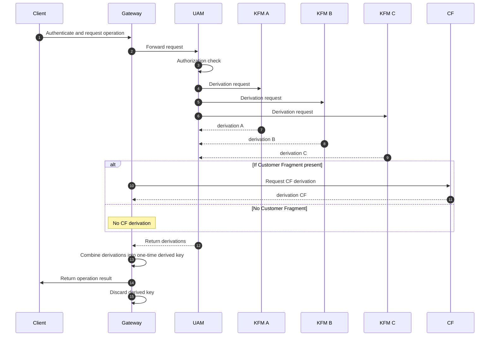

# Source: https://docs.akeyless.io/docs/dfc-deep-dive.md

# DFC Deep Dive

Distributed Fragments Cryptography (DFC) is a distributed key management framework that ensures no complete private key ever exists on any server, at any time. All operations rely on cryptographic derivation across independent fragments. This document provides a detailed technical explanation of how DFC works, including key generation, fragment storage, operation flows, fragment refreshing, cryptographic foundations, and component responsibilities.

## Cryptographic Foundations

DFC uses standard, NIST-approved primitives:

* **AES** — symmetric encryption
* **HMAC** — message authentication and integrity
* **KDFs** — for deriving per-operation values from fragments
* **Hybrid TLS 1.3 (ML-KEM768 + X25519)** — post-quantum–resistant communication

DFC does not introduce new encryption algorithms; it introduces a new key-handling and fragmentation model.

***

## System Components

### Key Fragment Managers (KFMs)

KFMs are isolated microservices distributed across independent cloud providers and regions. Each KFM:

* Holds one encrypted key fragment in a dedicated encrypted datastore.
* Never exposes fragment values externally.
* Performs fragment-specific cryptographic derivations.
* Operates independently without communicating with other KFMs.
* Periodically refreshes its fragment value.

### Unified Access Manager (UAM)

The UAM:

* Orchestrates key metadata, identities, and authorizations.
* Routes operation requests to all relevant KFMs.
* Does **not** store or access fragment values.
* Never participates in fragment derivation.

### Customer Fragment (CF)

If enabled:

* A 256-bit key fragment is generated client-side.
* It remains exclusively in the customer environment.
* It is never transmitted to Akeyless.
* Operations cannot complete without CF participation.

### Akeyless Gateway

The Gateway:

* Manages the Customer Fragment when applicable.
* Performs client-side assembly of derived keys.
* Caches non-sensitive metadata for performance optimization.
* Remains stateless for sensitive data; no fragment material is persisted.

***

## Key Generation Process

### Distributed Fragment Creation

When a key is created:

1. Each KFM independently generates a fragment using a cryptographically secure random number generator.
2. Fragments are stored only in their local encrypted datastore.
3. No KFM sees another KFM’s fragment.
4. No system ever holds or computes the full key.

Result:\
`Key = f(Fragment_A, Fragment_B, Fragment_C, [Customer Fragment])`\
where `f()` is a one-way mathematical relationship established by KDF operations.

### Fragment Storage Characteristics

* Stored only at the KFM that generated it.
* Encrypted at disk and application level.
* Not replicated or synchronized.
* Not transmitted during operation flows.

***

## Cryptographic Operation Flow

This applies to operations such as encryption, decryption, signing, HMAC, or secret generation.

### Step-by-Step

1. **Client authenticates** to Akeyless.
2. **UAM authorizes** the operation.
3. **Parallel fragment derivation:**
   * Each KFM applies a KDF to its local fragment.
   * If present, the customer environment applies KDF to the Customer Fragment.
4. **Derivation aggregation:**
   * Partial derivations are returned.
   * The client (or Gateway) combines them into a **one-time derived key**.
5. **Operation execution:**
   * The derived key is used once for the requested operation and then discarded.

### Key Properties

* The original key is never reconstructed.
* Derivations do not reveal fragment values.
* Derived keys cannot be reused.
* No fragment leaves its environment.

***

## Fragment Refreshing

DFC includes continuous fragment refreshing to reduce exposure duration.

### How Refresh Works

The UAM generates a new random number that each KFM uses.

Each KFM:

1. Computes a new fragment value.
2. Ensures the new fragment set still resolves mathematically to the original key.
3. Updates the fragment in its encrypted datastore.
4. Operates independently (no coordination with other KFMs).

### Security Impact

An attacker must compromise all fragments (including any Customer Fragment) **within the same refresh interval** to have any chance of deriving a key. This is not a feasible requirement due to:

* geographic distribution
* multi-cloud isolation
* independent refresh timing
* separate operational domains

***

## Zero-Knowledge Architecture

DFC enables a zero-knowledge model:

* Akeyless cannot decrypt customer data, enforced by the use of a Customer Fragment.
* Cloud providers hosting KFMs cannot reconstruct the key.
* An optional Customer Fragment can prevent unilateral operations.
* Compromise of a single component yields no meaningful key information.

***

## Post-Quantum Protections

DFC uses hybrid TLS 1.3 with:

* **ML-KEM768** (NIST PQC KEM)
* **X25519** (classical elliptic curve)

These provide protection against potential future quantum attacks on captured traffic.

***

## Operational Considerations

* Fragment holders must be reachable for operations.
* Gateway availability is required for CF-based operations.
* No backups or replication are required for fragments.

***

## Supported Operation Types

DFC supports:

* Encryption and decryption
* Signing and verification
* HMAC
* Certificate signing (PKI)
* SSH key signing

***

## Summary

This page shows how Akeyless performs distributed, non-reconstructive cryptographic operations using independent fragments, optional customer participation, continuous refresh cycles, and NIST-approved primitives. Keys are never stored or reconstructed, enabling secure and verifiable operations across distributed environments.