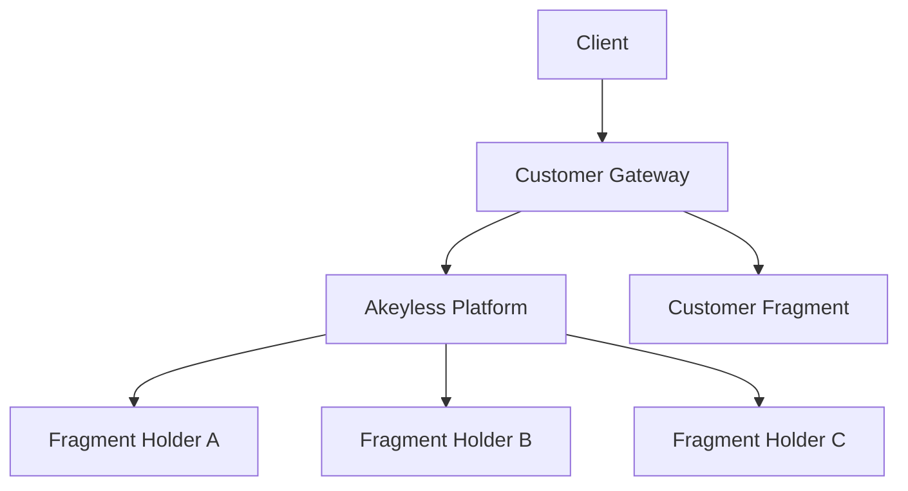

# Source: https://docs.akeyless.io/docs/dfc-overview.md

# Distributed Fragments Cryptography (DFC)

Distributed Fragments Cryptography (DFC) is the cryptographic framework that enables Akeyless to perform secret, key, and certificate operations without ever storing or reconstructing complete private key material. Instead of placing full keys in a vault or database, DFC divides key material into multiple independent fragments and performs cryptographic operations directly across those fragments.

DFC underpins the zero-knowledge architecture by ensuring that a complete encryption key never exists on any server.

> The Customer Gateway and Customer Fragment are optional components.

## Core Concepts

DFC represents a cryptographic key as multiple mathematical fragments. These fragments:

* Are generated independently in isolated environments.
* Never combine into a full key at any stage, including key creation or use.
* May include a Customer Fragment held exclusively in the customer’s environment.
* Participate only through fragment-specific, NIST-approved derivation operations.

The platform relies on fragment-derived values rather than reconstructing a complete key. Cryptographic operations use a short-lived, operation-specific derived key created from these independent derivations.

***

## How Operations Work

At a high level:

1. A client requests an operation such as encryption, decryption, signing, or generating a dynamic secret.
2. Each fragment holder computes a partial derivation using its fragment.
3. The client, or the customer’s Akeyless Gateway when a Customer Fragment is used, combines these derivations into a **one-time derived key**.
4. The derived key is used for the requested operation and then discarded.

The original key is never reconstructed, transmitted, or stored.

***

## Customer Fragment

Optionally, organizations may choose to hold one of the fragments themselves. When a Customer Fragment (CF) is used:

* Operations cannot complete unless the CF participates.
* TThe customer retains exclusive control over key usage for that key.
* No party, including Akeyless, can derive or reconstruct the key without the CF.

This model enforces separation of duties and supports environments that require customer-held key custody.

***

## Summary

DFC enables Akeyless to operate without storing or reconstructing full private keys. By distributing fragments across isolated systems and combining only fragment-derived values into one-time keys, DFC provides a secure, non-reconstructive foundation for secret, key, and certificate operations and supports the platform’s zero-knowledge encryption design.